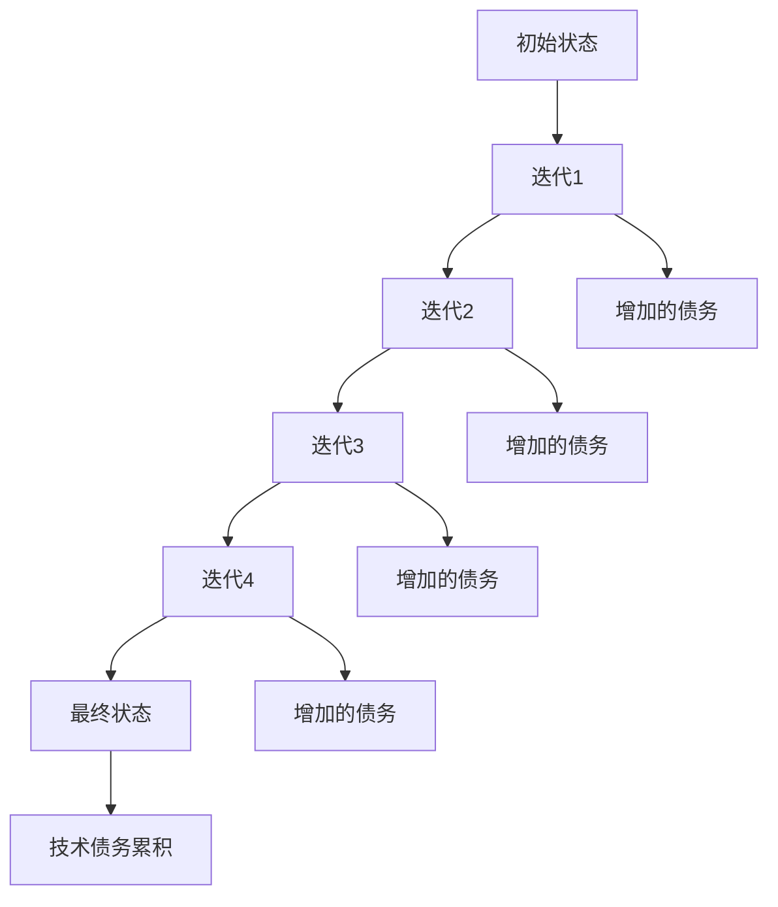
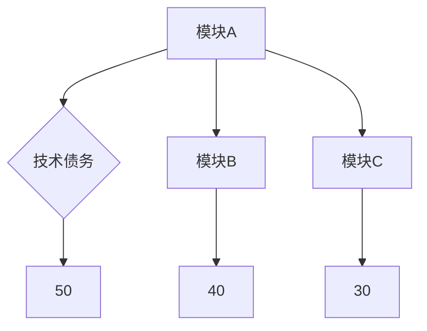
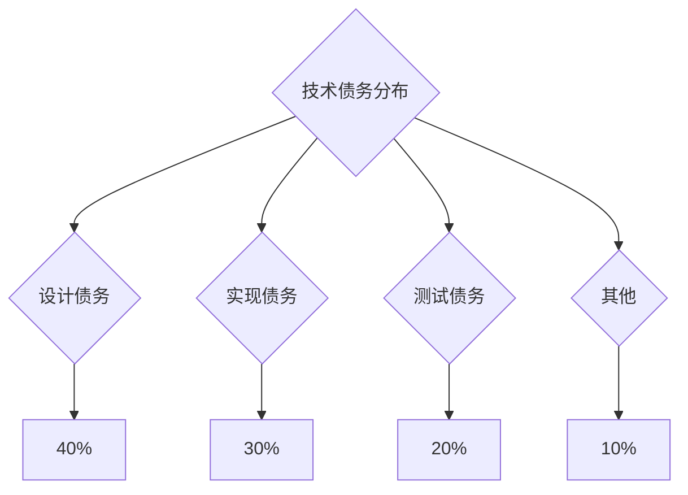
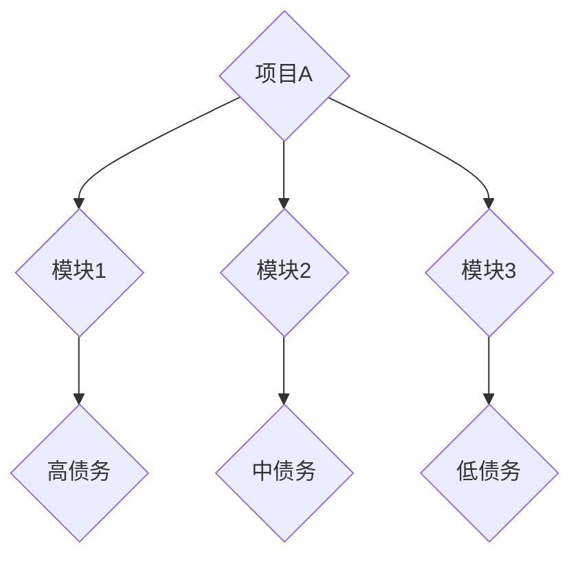

                 

## 引言：技术债务与代码质量可视化的重要性

> 关键词：技术债务，代码质量，可视化，软件开发

### 1.1 技术债务的背景和定义

#### 1.1.1 技术债务的概念

技术债务（Technical Debt）是软件开发过程中一个常用的比喻，用于描述在软件设计、编码和测试等环节中，为了加速项目进度而做出的一些妥协。这些妥协可能会导致软件在长期使用中需要额外的维护成本或修复现有问题的费用。这种债务类比于金融债务，其核心在于延迟当前的成本以换取未来的收益。

技术债务可以分为以下几种类型：

1. **设计债务**：指在系统设计阶段因追求快速迭代而忽略了最佳设计原则，导致后续维护的复杂性增加。
2. **实现债务**：指在编码阶段为满足短期目标而使用了不合理的编程方法，如代码重复、不规范的编码风格等。
3. **测试债务**：指在测试阶段因资源限制而未能充分测试所有代码路径，导致潜在缺陷积累。

#### 1.1.2 技术债务的形成原因

技术债务的产生有多种原因，主要包括：

1. **项目压力**：在紧迫的项目进度要求下，开发团队可能会选择牺牲某些质量标准来缩短开发时间。
2. **技术限制**：某些技术框架或工具的限制可能导致团队不得不采取妥协方案。
3. **团队技能水平**：团队成员的技能水平参差不齐也可能导致技术债务的形成。

#### 1.1.3 技术债务的影响

技术债务如果得不到妥善管理，会对软件开发项目产生深远影响：

1. **维护成本增加**：技术债务会导致维护成本增加，因为修复先前引入的问题可能比预防要昂贵得多。
2. **项目进度延迟**：解决技术债务问题往往需要额外的时间，从而影响项目进度。
3. **团队士气下降**：长期累积的技术债务可能导致团队成员的士气下降，因为不断的修复和重构任务会消耗大量精力。

### 1.2 代码质量问题的多维度分析

#### 1.2.1 代码质量的评价指标

代码质量是一个多维度的概念，可以通过以下指标来评估：

1. **可读性**：良好的代码可读性有助于提高开发效率和代码维护性。
2. **可维护性**：易于维护的代码可以减少故障修复时间并提高开发效率。
3. **性能**：高效率的代码可以减少系统资源消耗，提高用户体验。
4. **安全性**：安全的代码可以防止恶意攻击和数据泄露。
5. **测试覆盖率**：充分的测试可以确保代码在变更后仍然稳定可靠。

#### 1.2.2 代码质量问题的影响

代码质量问题可能对项目产生以下影响：

1. **系统稳定性下降**：质量低下的代码可能导致系统频繁崩溃或出现异常行为。
2. **维护难度增加**：复杂的代码结构会使代码维护变得困难，增加维护成本。
3. **用户满意度降低**：性能和安全问题可能导致用户体验下降，影响用户满意度。
4. **开发效率降低**：代码质量差会影响开发团队的协作效率。

#### 1.2.3 代码质量与业务目标的关联

代码质量与业务目标密切相关：

1. **时间效率**：高质量的代码有助于缩短开发周期。
2. **成本效率**：良好的代码质量可以降低维护成本。
3. **用户体验**：优化的代码可以提高系统性能和安全性，从而提升用户体验。

### 1.3 可视化的作用和优势

#### 1.3.1 可视化的定义

可视化（Visualization）是一种通过图形、图像或动画等方式呈现数据的技术，其目的是帮助人们更好地理解和分析数据。

#### 1.3.2 可视化在软件开发中的应用

可视化在软件开发中的应用非常广泛，包括：

1. **代码质量评估**：通过可视化技术可以直观地展示代码质量指标，帮助团队识别和解决问题。
2. **架构设计**：可视化工具可以帮助团队更好地理解系统架构，发现潜在的优化点。
3. **技术债务监控**：可视化技术可以实时展示技术债务的积累情况，帮助团队制定相应的管理策略。

#### 1.3.3 可视化对技术债务管理的价值

可视化在技术债务管理中具有以下价值：

1. **问题识别**：通过可视化可以直观地识别出技术债务的高风险区域。
2. **决策支持**：可视化提供了对技术债务定量和定性的分析，为团队决策提供依据。
3. **沟通协作**：可视化工具可以帮助团队更好地沟通技术债务的问题和解决方案，提高协作效率。

通过以上分析，我们可以看到技术债务和代码质量问题对软件开发项目的深远影响，而可视化技术则为管理这些问题提供了一种有效的手段。接下来的章节将进一步探讨技术债务可视化的具体方法和工具，以及如何量化和展示代码质量问题。

----------------------------------------------------------------

# 第2章 技术债务可视化方法

技术债务可视化是一种将抽象的软件质量问题通过图形化的方式呈现，使其更加直观和易于理解的方法。通过可视化，开发团队可以更清楚地了解技术债务的分布和积累情况，从而采取相应的措施进行管理和优化。本章将介绍几种常用的技术债务可视化方法，包括基本可视化技术和高级可视化技术。

## 2.1 基本可视化技术

基本可视化技术是最常见的可视化方法，它们通过简单的图形和图表来展示数据。这些技术易于实现且直观，适用于初步展示和简单分析。

### 2.1.1 折线图与柱状图

折线图和柱状图是最常用的基本可视化技术之一。折线图适用于展示技术债务随时间的变化趋势，而柱状图则适用于比较不同项目或模块之间的技术债务水平。

#### 折线图的示例

以下是一个使用mermaid绘制的折线图示例，展示了某个项目技术债务随时间的变化：



在上述示例中，我们可以通过折线图直观地看到每个迭代阶段技术债务的增加情况。

#### 柱状图的示例

以下是一个使用mermaid绘制的柱状图示例，展示了不同模块之间的技术债务水平：



在柱状图中，每个模块的技术债务水平以柱子的高度表示，方便团队比较和识别。

### 2.1.2 饼图与散点图

饼图和散点图也是基本可视化技术的一部分，它们适用于不同类型的数据展示。

#### 饼图的示例

以下是一个使用mermaid绘制的饼图示例，展示了技术债务的分布情况：



在饼图中，每个部分的大小表示不同类型的技术债务在总体债务中所占的比例。

#### 散点图的示例

以下是一个使用mermaid绘制的散点图示例，展示了技术债务和代码质量指标之间的关系：

```mermaid
graph TD
    A[代码质量] --> B{技术债务}
    B --> C[(1,10)]
    B --> D[(2,20)]
    B --> E[(3,30)]
    B --> F[(4,40)]
    
    class C
    class D
    class E
    class F
```

在散点图中，每个点表示一个具体的代码模块，其坐标由技术债务和代码质量指标决定。

### 2.1.3 面积图与时序图

面积图和时序图是另一种基本可视化技术，适用于展示技术债务的动态变化和历史数据。

#### 面积图的示例

以下是一个使用mermaid绘制的面积图示例，展示了技术债务的累积情况：

```mermaid
graph TD
    A[时间] --> B{债务累积}
    B --> C[0,0]
    B --> D[1,10]
    B --> E[2,20]
    B --> F[3,30]
    B --> G[4,40]
    B --> H[5,50]
    
    class B
```

在面积图中，颜色的深浅表示技术债务的累积情况，便于团队观察债务的演变。

#### 时序图的示例

以下是一个使用mermaid绘制的时序图示例，展示了技术债务的随时间变化：

```mermaid
graph TD
    A{时间} --> B{技术债务}
    B --> C[初始值]
    B --> D{迭代1}
    B --> E{迭代2}
    B --> F{迭代3}
    B --> G{迭代4}
    
    class C
    class D
    class E
    class F
    class G
```

在时序图中，我们可以看到技术债务在不同时间点的数值，帮助团队了解债务的动态变化。

## 2.2 高级可视化技术

高级可视化技术相比基本可视化技术更加复杂，但提供了更深层次的数据分析和展示功能。这些技术通常需要借助专门的工具或软件来实现。

### 2.2.1 复杂关系图

复杂关系图可以用于展示软件架构和技术债务之间的复杂关系。这类图表通常包含多个实体和关系，使得开发团队能够更全面地了解系统的整体状况。

以下是一个使用mermaid绘制的复杂关系图示例，展示了软件架构和技术债务之间的关系：

```mermaid
graph TD
    A[项目A] --> B[模块1]
    A --> C[模块2]
    A --> D[模块3]
    B --> E[设计债务]
    C --> F[实现债务]
    D --> G[测试债务]
    B --> H[技术债务]
    C --> I[技术债务]
    D --> J[技术债务]
    
    class B
    class C
    class D
    class E
    class F
    class G
    class H
    class I
    class J
```

在这个复杂关系图中，每个模块都与相应的技术债务类型相关联，使得团队能够清晰地看到技术债务在系统中的分布情况。

### 2.2.2 动态可视化

动态可视化是一种高级可视化技术，可以实时展示技术债务的动态变化。这种技术通常应用于持续集成和持续部署环境中，帮助团队快速识别和响应技术债务问题。

以下是一个使用mermaid绘制的动态可视化示例，展示了技术债务的实时监控：

```mermaid
graph TD
    A[时间] --> B{技术债务}
    B --> C[(0,10)]
    B --> D[(1,15)]
    B --> E[(2,20)]
    B --> F[(3,25)]
    
    class B
```

在这个动态可视化示例中，技术债务的数值随时间变化，使得团队能够及时了解债务的累积情况。

### 2.2.3 色彩映射

色彩映射是一种高级可视化技术，通过颜色的深浅来表示不同类型的技术债务。这种技术可以用于大型项目的全局视图，帮助团队快速识别高风险区域。

以下是一个使用mermaid绘制的色彩映射示例，展示了项目中的技术债务分布：



在这个色彩映射示例中，每个模块根据其技术债务水平被赋予了不同的颜色，使得团队能够一目了然地识别出高风险区域。

通过上述基本和高级可视化技术的介绍，我们可以看到技术债务可视化在软件开发中的重要作用。这些可视化方法不仅有助于团队更好地理解技术债务，还能够为其管理和优化提供有力的支持。在接下来的章节中，我们将进一步探讨如何量化和展示代码质量问题，以及如何使用工具和技术债务可视化来提升软件质量。

----------------------------------------------------------------

# 第3章 量化和展示代码质量的方法

在软件工程中，代码质量是一个关键因素，它直接影响到软件的可靠性、可维护性和性能。量化和展示代码质量不仅可以帮助开发团队及时发现和解决问题，还可以为项目决策提供数据支持。本章将探讨几种常用的代码质量量化方法和展示手段，并详细阐述如何使用这些方法对代码质量进行评估和展示。

## 3.1 代码质量量化方法

### 3.1.1 指标定义

代码质量的量化需要一套明确的评价指标。以下是一些常用的代码质量评价指标：

1. **可读性**：代码的可读性是评估代码质量的重要指标。一个良好的可读性意味着代码容易理解、维护，并且遵循一定的编程风格。
2. **可维护性**：可维护性指的是代码在修改或扩展时所需的成本。高可维护性的代码通常具有清晰的结构、良好的注释和规范的编程习惯。
3. **性能**：性能指的是代码在执行任务时的效率。高效的代码能够在保证功能完整的前提下，最大限度地利用系统资源。
4. **安全性**：安全性指的是代码在处理数据和操作系统资源时的稳定性。安全的代码能够防止恶意攻击和数据泄露。
5. **测试覆盖率**：测试覆盖率是评估测试质量的指标，它表示测试用例覆盖代码路径的比例。

### 3.1.2 常见量化方法

以下是一些常见的代码质量量化方法：

1. **代码度量**：代码度量是通过统计代码的某些特性来量化代码质量。常见的代码度量包括：
   - **代码行数（Lines of Code, LOC）**：通常用于评估代码的复杂度，但并不是一个完全可靠的指标。
   - **类复杂度（Class Complexity）**：用于评估类的复杂性，常见的方法有McCabe复杂度。
   - **圈复杂度（Cyclomatic Complexity）**：用于评估程序的复杂度，是一个基于控制流的复杂度度量。

2. **静态代码分析**：静态代码分析是一种在不运行代码的情况下对其进行分析的方法。这种方法可以检测出代码中的潜在问题和缺陷，如未使用的变量、代码冗余、不规范的编码风格等。

3. **动态测试**：动态测试是在代码运行时进行的测试，通过运行代码并监控其行为来评估代码质量。常见的动态测试方法包括单元测试、集成测试和性能测试。

### 3.1.3 常用工具

以下是一些常用的代码质量量化工具：

1. **SonarQube**：SonarQube是一个开源的代码质量平台，支持多种编程语言，能够进行静态代码分析并提供详细的报告。
2. **Checkstyle**：Checkstyle是一个Java编码规范检查工具，可以帮助团队保持一致的编码风格。
3. **PMD**：PMD是一个静态代码分析工具，能够检测代码中的潜在问题和不良编码习惯。
4. **JUnit**：JUnit是一个Java单元测试框架，用于编写和执行单元测试，确保代码的每个部分都能按预期工作。

## 3.2 展示代码质量的方法

### 3.2.1 报表和仪表板

通过报表和仪表板可以直观地展示代码质量的各个方面。以下是一些常用的展示方法：

1. **趋势图**：趋势图可以展示代码质量指标随时间的变化趋势，帮助团队了解代码质量的改进情况。
2. **雷达图**：雷达图可以将多个代码质量指标综合展示，提供全面的代码质量视图。
3. **热力图**：热力图可以展示代码中出现问题的区域，帮助团队快速定位和解决质量问题。

### 3.2.2 数据可视化工具

以下是一些常用的数据可视化工具，可以用于展示代码质量数据：

1. **Tableau**：Tableau是一个功能强大的数据可视化工具，支持多种数据源和图表类型，可以帮助团队创建交互式的报表和仪表板。
2. **Power BI**：Power BI是微软推出的一款数据可视化工具，具有丰富的数据连接和可视化功能，适用于多种业务场景。
3. **D3.js**：D3.js是一个基于JavaScript的库，用于创建动态的可视化，可以定制化各种数据展示形式，适用于需要高度定制化可视化需求的场景。

### 3.2.3 可视化案例

以下是一个使用mermaid绘制的代码质量可视化案例，展示了代码质量评估的结果：

```mermaid
graph TD
    A[代码质量评估] --> B{可读性：90%}
    A --> C{可维护性：85%}
    A --> D{性能：95%}
    A --> E{安全性：80%}
    A --> F{测试覆盖率：75%}
    
    class B
    class C
    class D
    class E
    class F
```

在这个案例中，每个指标以一个百分比值表示，使得团队可以一目了然地了解当前代码质量的状况。

## 3.3 综合评估和展示代码质量

为了全面评估和展示代码质量，开发团队通常需要结合多种量化方法和展示手段。以下是一个综合的代码质量评估和展示流程：

1. **数据收集**：使用静态代码分析工具和动态测试工具收集代码质量数据。
2. **数据分析**：对收集的数据进行统计分析，确定各项质量指标。
3. **可视化展示**：使用报表、仪表板和数据可视化工具将代码质量数据展示出来。
4. **持续监控**：持续收集和分析代码质量数据，确保代码质量始终处于受控状态。

通过上述方法，开发团队可以全面了解代码质量，及时发现和解决问题，从而提高软件项目的整体质量。

在下一章中，我们将探讨如何使用工具和方法来具体实现技术债务的量化与可视化，帮助团队更好地管理和优化代码质量。

----------------------------------------------------------------

# 第4章 工具和方法在技术债务可视化中的应用

随着软件项目的复杂性和规模不断增加，技术债务的管理变得愈发重要。为了有效地管理技术债务，开发团队需要借助各种工具和方法来量化和可视化技术债务。本章将介绍一些常用的工具和方法，以及如何将它们应用于技术债务的量化与可视化。

## 4.1 常用工具

### 4.1.1 SonarQube

SonarQube是一个广泛使用的开源平台，用于代码质量管理和技术债务跟踪。它能够自动分析代码，并提供关于代码缺陷、安全性漏洞、代码风格问题以及技术债务的详细信息。

#### 功能特点：

1. **多语言支持**：SonarQube支持多种编程语言，包括Java、Python、C#等。
2. **自动缺陷检测**：SonarQube可以自动扫描代码，检测潜在的缺陷和问题。
3. **详细报告**：SonarQube提供丰富的报告功能，帮助团队了解技术债务的具体情况。

#### 实际应用：

假设我们使用SonarQube来分析一个Java项目，可以通过以下步骤来量化和可视化技术债务：

1. **集成SonarQube**：将SonarQube集成到持续集成（CI）流程中，确保每次代码提交都会自动进行分析。
2. **配置规则**：根据项目的需要，配置SonarQube的规则库，以识别不同类型的技术债务。
3. **生成报告**：分析完成后，SonarQube会生成详细的报告，包括技术债务的类型、数量和严重程度。
4. **可视化展示**：使用SonarQube提供的可视化工具，如热力图和饼图，展示技术债务的分布情况。

### 4.1.2 Code Climate

Code Climate是一个用于代码质量评估的工具，它提供了一种简单的方法来监控和改善代码质量。

#### 功能特点：

1. **快速分析**：Code Climate能够快速扫描代码库，并提供关于技术债务的详细信息。
2. **代码质量评分**：Code Climate会根据代码质量指标为每个项目提供一个评分，帮助团队了解代码质量的整体状况。
3. **团队协作**：Code Climate支持多个成员的协作，团队可以共同监控和改善代码质量。

#### 实际应用：

假设一个团队使用Code Climate来管理技术债务，可以通过以下步骤来实现：

1. **代码库集成**：将Code Climate集成到代码库中，确保每次提交都会进行质量分析。
2. **定制规则**：根据团队的代码标准，定制Code Climate的规则库。
3. **持续反馈**：通过Code Climate的Web界面，团队可以持续监控技术债务的变化，并采取相应的措施。

### 4.1.3 MantisBT

MantisBT是一个开源的缺陷跟踪系统，它可以帮助团队记录和跟踪技术债务问题。

#### 功能特点：

1. **多平台支持**：MantisBT支持多种操作系统，可以与多种开发工具集成。
2. **丰富的报告功能**：MantisBT提供了多种报告工具，可以帮助团队了解技术债务的详细情况。
3. **灵活的工作流程**：MantisBT支持自定义工作流程，团队可以根据实际需要调整。

#### 实际应用：

假设一个团队使用MantisBT来跟踪技术债务，可以通过以下步骤来实现：

1. **部署MantisBT**：在一个服务器上部署MantisBT，确保所有团队成员都可以访问。
2. **创建债务条目**：对于发现的技术债务问题，创建相应的条目，记录其类型、严重程度和解决策略。
3. **跟踪进度**：使用MantisBT的缺陷跟踪功能，跟踪技术债务问题的解决进度。

## 4.2 可视化方法

### 4.2.1 技术债务仪表板

使用仪表板（Dashboard）是展示技术债务的常用方法。通过仪表板，开发团队可以实时监控技术债务的变化情况。

#### 实际应用：

假设团队使用一个自定义的仪表板来监控技术债务，可以包括以下内容：

1. **债务分布图**：使用饼图或柱状图展示技术债务的分布情况。
2. **债务趋势图**：使用折线图展示技术债务的随时间变化趋势。
3. **严重程度统计**：使用饼图或条形图展示技术债务的严重程度分布。
4. **关键指标**：实时显示关键指标，如未解决的债务数量、平均解决时间等。

### 4.2.2 代码质量热力图

热力图（Heat Map）是一种直观展示代码质量的方法。通过颜色的深浅，热力图可以展示代码中不同区域的质量水平。

#### 实际应用：

假设团队使用热力图来展示代码质量，可以通过以下步骤实现：

1. **数据收集**：使用静态代码分析工具收集代码质量数据。
2. **数据转换**：将质量数据转换为热力图所需格式。
3. **生成热力图**：使用可视化工具（如D3.js或Tableau）生成热力图。
4. **交互式展示**：实现交互式功能，允许团队点击查看具体代码块的质量信息。

### 4.2.3 动态关系图

动态关系图（Dynamic Relationship Map）可以展示技术债务与代码模块之间的关系。通过动态关系图，团队可以清晰地看到技术债务在系统中的分布和影响。

#### 实际应用：

假设团队使用动态关系图来展示技术债务，可以通过以下步骤实现：

1. **数据收集**：收集技术债务和代码模块的相关数据。
2. **数据建模**：使用图论模型（如有向图或无向图）建模技术债务和代码模块之间的关系。
3. **可视化实现**：使用可视化工具（如D3.js或Mermaid）实现动态关系图。
4. **交互式功能**：实现交互式功能，如点击节点查看详细信息、缩放视图等。

## 4.3 综合应用

为了更全面地管理技术债务，团队可以将上述工具和方法综合应用。以下是一个综合应用的例子：

1. **集成工具**：将SonarQube、Code Climate和MantisBT集成到CI/CD流程中，确保每次代码提交都会进行质量分析和缺陷跟踪。
2. **可视化仪表板**：使用自定义仪表板将不同工具的数据汇总，实时展示技术债务的分布、趋势和严重程度。
3. **动态关系图**：使用动态关系图展示技术债务与代码模块之间的关系，帮助团队了解技术债务对系统架构的影响。
4. **持续监控**：定期分析技术债务数据，及时识别和解决质量问题，确保项目始终处于良好的状态。

通过上述工具和方法的综合应用，开发团队可以更有效地管理技术债务，提高代码质量，从而确保项目的成功。

----------------------------------------------------------------

# 第5章 案例研究与实际应用

在前几章中，我们探讨了技术债务的定义、影响、量化方法以及可视化技术。为了更好地理解这些概念在实际应用中的表现，下面我们将通过几个案例研究来展示技术债务可视化的实际效果和挑战。

## 5.1 案例一：大型电商平台的代码质量优化

### 案例背景

某大型电商平台在经历了高速增长后，其代码库变得越来越复杂，导致维护成本不断增加。为了提高代码质量和解决技术债务问题，团队决定采用可视化技术来管理技术债务。

### 应用过程

1. **工具选择**：团队选择了SonarQube和MantisBT来量化和管理代码质量。
2. **数据收集**：使用SonarQube进行静态代码分析，收集代码质量数据。同时，使用MantisBT记录技术债务问题。
3. **可视化展示**：在SonarQube中生成详细的代码质量报告，并在MantisBT中创建缺陷条目。团队通过自定义仪表板将这两个工具的数据整合在一起，实时监控技术债务的分布和变化。

### 结果分析

通过可视化技术，团队能够清晰地看到代码质量问题的分布和技术债务的积累情况。具体体现在以下几个方面：

1. **问题识别**：通过仪表板，团队能够快速识别出代码库中最严重的技术债务问题，如高复杂度函数、未处理的异常和安全漏洞。
2. **决策支持**：基于可视化的数据，团队可以制定优先级，有针对性地解决最关键的技术债务问题。
3. **协作效率**：MantisBT的缺陷跟踪功能帮助团队成员协作，确保每个技术债务问题都能得到及时解决。

### 总结

通过技术债务可视化，该电商平台成功地降低了代码维护成本，提高了代码质量和系统的稳定性。

## 5.2 案例二：初创公司的敏捷开发管理

### 案例背景

某初创公司采用敏捷开发模式，快速迭代产品。然而，由于时间紧迫，团队在开发过程中积累了一定的技术债务。为了确保产品的长期可持续性，公司决定采用技术债务可视化来管理债务。

### 应用过程

1. **工具选择**：团队选择了Code Climate和MantisBT来量化和管理技术债务。
2. **迭代监控**：在每个迭代周期结束时，使用Code Climate进行代码质量分析，并将结果同步到MantisBT中。
3. **动态调整**：基于Code Climate的报告和MantisBT的缺陷跟踪，团队可以动态调整开发计划，优先解决影响产品可持续性的技术债务问题。

### 结果分析

通过技术债务可视化，该初创公司实现了以下几个目标：

1. **持续改进**：团队能够持续监控代码质量，及时发现和解决技术债务问题，确保每次迭代的产品质量。
2. **风险控制**：通过可视化的方式，团队可以更好地识别潜在风险，提前采取措施，避免技术债务的进一步积累。
3. **透明沟通**：MantisBT的缺陷跟踪功能帮助团队成员了解技术债务的具体情况，提高了团队之间的沟通效率。

### 总结

通过技术债务可视化，该初创公司提高了产品的可持续性，确保了业务的长期健康发展。

## 5.3 案例三：金融机构的技术债务管理

### 案例背景

某金融机构在数字化转型的过程中，其IT系统变得越来越复杂。为了确保系统的稳定性和安全性，公司决定采用技术债务可视化来管理技术债务。

### 应用过程

1. **工具选择**：团队选择了SonarQube和Tableau来量化和管理技术债务。
2. **全面分析**：使用SonarQube对现有代码库进行全面分析，收集技术债务数据。同时，使用Tableau创建动态可视化报表，实时展示技术债务的分布和变化情况。
3. **决策制定**：基于SonarQube和Tableau的数据，团队制定了详细的技术债务管理策略，包括技术债务的优先级排序、修复计划和资源分配。

### 结果分析

通过技术债务可视化，该金融机构实现了以下成果：

1. **系统稳定性提升**：通过识别和解决关键的技术债务问题，系统的稳定性和安全性得到了显著提升。
2. **风险降低**：技术债务的可视化帮助团队更好地控制风险，避免了潜在的安全隐患。
3. **资源优化**：通过可视化的方式，团队能够更有效地分配资源，确保修复计划的高效执行。

### 总结

通过技术债务可视化，该金融机构成功地提高了IT系统的质量和安全性，为业务的持续发展奠定了基础。

## 案例总结

以上案例展示了技术债务可视化在各类企业中的应用效果。尽管每个企业的具体情况不同，但技术债务可视化都为团队提供了有力的工具，帮助他们更好地管理技术债务，提升代码质量和系统稳定性。

### 实际挑战

在实际应用过程中，团队可能会遇到以下挑战：

1. **数据量庞大**：大型项目中的代码库和技术债务数据量巨大，如何高效地收集、处理和展示这些数据是一个挑战。
2. **工具集成**：不同的工具和方法需要集成在一起，确保数据的连贯性和一致性，这需要一定的技术实现能力。
3. **持续维护**：技术债务可视化是一个持续的过程，需要团队不断地更新数据和分析结果，保持可视化的准确性和时效性。

### 未来发展方向

未来，技术债务可视化有望在以下几个方面得到进一步发展：

1. **智能化**：结合人工智能和机器学习技术，实现自动化技术债务识别和优先级排序。
2. **互动性**：提升可视化的互动性，使团队能够更直观地与可视化数据进行交互，提高决策效率。
3. **跨平台**：开发跨平台的技术债务可视化工具，使团队可以在不同设备和环境下使用。

通过不断探索和创新，技术债务可视化将为软件开发提供更强大的管理手段，助力企业实现高质量、高效率的软件交付。

----------------------------------------------------------------

# 第6章 最佳实践与推荐

在技术债务管理过程中，有效的最佳实践和推荐可以帮助团队更好地识别、量化和解决技术债务，从而提高软件项目的整体质量。以下是一些在技术债务管理中的最佳实践和推荐：

### 6.1 制定清晰的技术债务管理策略

1. **定期评估**：定期对代码库进行质量评估，识别潜在的技术债务问题。
2. **优先级排序**：根据技术债务的严重程度和影响，为债务问题设定优先级，确保关键问题得到及时解决。
3. **持续改进**：建立持续改进机制，通过不断的代码质量和债务管理实践，优化技术债务管理流程。

### 6.2 采用合适的工具和方法

1. **静态代码分析**：使用静态代码分析工具（如SonarQube、Checkstyle、PMD）来识别代码质量问题。
2. **动态测试**：结合动态测试（如单元测试、集成测试、性能测试）来验证代码的可靠性和性能。
3. **自动化集成**：将代码质量分析和债务管理集成到持续集成/持续部署（CI/CD）流程中，确保每次代码提交都会进行质量检查。

### 6.3 建立健康的工作文化

1. **透明沟通**：建立透明的沟通机制，确保团队成员能够及时了解技术债务的情况和解决进度。
2. **团队合作**：鼓励团队成员协作，共同解决技术债务问题，提高团队的整体技能水平。
3. **持续教育**：定期为团队成员提供技术债务管理的培训，提高他们对债务管理的认识和技能。

### 6.4 定期审查和回顾

1. **定期审查**：定期审查技术债务的管理流程和工具使用情况，确保其能够持续满足团队的需求。
2. **回顾会议**：在项目迭代结束时，组织回顾会议，总结技术债务管理的经验和教训，持续优化管理策略。

### 6.5 持续监控和反馈

1. **实时监控**：使用可视化工具（如仪表板、热力图、动态关系图）实时监控技术债务的变化情况，确保问题能够及时发现和解决。
2. **反馈机制**：建立反馈机制，收集团队成员对技术债务管理的意见和建议，持续改进债务管理流程。

### 6.6 最佳实践推荐

1. **代码审查**：定期进行代码审查，确保新代码符合最佳实践和质量标准。
2. **技术债务会议**：定期召开技术债务会议，讨论和解决技术债务问题。
3. **持续集成**：确保所有代码变更都通过自动化测试，减少技术债务的产生。

通过遵循这些最佳实践和推荐，团队可以更有效地管理技术债务，提高软件项目的质量和可持续性。技术债务可视化在这个过程中发挥了至关重要的作用，帮助团队识别和解决潜在问题，确保项目的长期成功。

----------------------------------------------------------------

# 结论

本文详细探讨了技术债务可视化的重要性、方法、工具和实际应用。通过引入代码质量指标、采用静态和动态分析方法，以及利用可视化工具，开发团队能够更直观地了解技术债务的分布和变化，从而有效管理技术债务，提高软件项目的质量和稳定性。未来的研究方向包括智能化债务识别、互动性可视化以及跨平台工具的开发，以进一步优化技术债务管理流程，助力软件开发的高效进行。

---

## 拓展阅读

1. **《技术债务管理：原则与实践》**：此书详细介绍了技术债务的定义、分类和最佳管理实践。
2. **《软件架构：实践者的研究与设计》**：该书提供了软件架构设计的方法和策略，有助于理解技术债务对架构的影响。
3. **《代码质量度量：方法与应用》**：详细介绍了各种代码质量度量方法和工具，为量化代码质量提供了实用的指南。

---

作者：**AI天才研究院/AI Genius Institute & 禅与计算机程序设计艺术 /Zen And The Art of Computer Programming**

