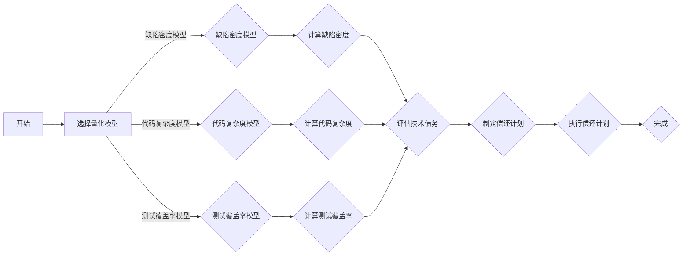
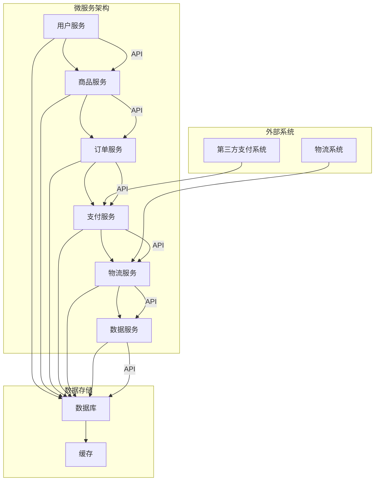

                 

### 背景介绍

#### 技术债务的概念

技术债务（Technical Debt）是一个比喻性的概念，起源于软件开发领域。它类比于传统金融中的债务，用于描述软件开发过程中因追求短期目标而牺牲长期健康和可持续性而积累的一系列问题。技术债务并非实际的财务债务，而是指代码质量、架构设计、系统性能等方面的欠账。

在软件开发过程中，为了快速交付功能，开发团队可能会选择一些“捷径”或“临时性”的解决方案。这些方案虽然短期内能够满足需求，但从长远来看，可能会带来一系列问题，如代码复杂度增加、维护成本上升、系统性能下降等。这些问题的累积，就像金融债务一样，需要在未来某个时刻偿还，但往往被推迟，从而形成了技术债务。

#### 快速开发与代码质量的平衡

快速开发和高质量代码是软件开发过程中经常需要权衡的两个目标。快速开发注重效率，强调在短时间内交付可用的功能。高质量代码则强调代码的可读性、可维护性和可靠性，追求长远的可持续性。

在理想状态下，快速开发和高质量代码应该能够和谐共存。然而，实际情况往往是二者之间存在矛盾。为了快速交付，开发团队可能会忽略代码的质量，导致技术债务的积累。而过于追求代码质量，可能会导致开发进度缓慢，影响项目的整体进度。

#### 为何需要管理技术债务

管理技术债务的原因主要有以下几点：

1. **降低维护成本**：技术债务积累会导致系统维护成本增加，因为需要花费更多时间和精力去解决因技术债务引起的问题。
2. **提高开发效率**：良好的代码质量有助于提高开发效率，减少因代码问题导致的开发中断和调试时间。
3. **保障系统稳定性**：高质量代码和良好的系统架构设计能够提高系统的稳定性，降低系统故障率。
4. **增强团队协作**：技术债务管理有助于提高团队之间的协作效率，避免因为代码质量问题导致的沟通障碍和误解。
5. **提升用户体验**：高质量代码能够带来更好的用户体验，减少因系统故障或性能问题导致的用户投诉。

#### 核心问题与解决思路

在软件开发过程中，如何平衡快速开发和代码质量，实现技术债务的有效管理，是一个关键问题。解决这一问题的关键在于：

1. **明确优先级**：在快速开发和代码质量之间，明确项目的优先级，根据实际情况灵活调整。
2. **引入最佳实践**：采用一些最佳实践，如代码审查、持续集成、自动化测试等，减少技术债务的积累。
3. **量化技术债务**：通过量化模型，评估技术债务的大小，制定相应的偿还计划。
4. **定期回顾和调整**：定期回顾项目的进展情况，评估技术债务的变化，及时调整开发策略。

### 边界与外延

技术债务的概念虽然起源于软件开发领域，但其应用范围并不仅限于软件工程。其他领域，如系统架构设计、项目管理等，也可以引入技术债务的概念来指导实践。

此外，技术债务不仅仅指代码层面的问题，还可能包括设计缺陷、架构决策失误、文档不足等方面。因此，在管理技术债务时，需要从多个维度进行考虑。

总之，技术债务管理是软件开发过程中不可忽视的一个重要环节，它直接关系到项目的长期成功和团队的持续发展。通过有效的管理策略，可以在保证快速开发的同时，维护代码质量，实现项目的可持续发展。

### 背景与核心概念

#### 问题背景

在当今快速发展的技术时代，软件开发速度成为企业竞争的关键因素。为了抢占市场先机，许多企业不惜一切代价追求快速交付，这种现象在敏捷开发（Agile Development）和DevOps文化的推动下尤为明显。然而，快速开发往往意味着牺牲代码质量，导致技术债务的积累。技术债务管理成为一个亟待解决的问题。

技术债务的积累不仅仅是一个技术问题，它还涉及项目管理、团队协作等多个层面。忽视技术债务管理，可能会导致以下问题：

1. **维护成本增加**：技术债务积累会导致系统复杂性增加，进而增加维护成本。
2. **开发效率降低**：低质量的代码和糟糕的系统设计会降低开发效率，增加开发者的工作负担。
3. **系统稳定性下降**：技术债务可能导致系统稳定性下降，频繁出现故障，影响用户体验。
4. **团队协作障碍**：技术债务可能导致团队之间的协作效率下降，增加沟通和协调成本。

#### 核心概念术语说明

在深入探讨技术债务管理之前，我们需要明确一些核心概念：

1. **技术债务（Technical Debt）**：技术债务是一个比喻，用来描述在软件开发过程中因选择短期解决方案而牺牲长期健康和可持续性所带来的问题。
2. **代码质量（Code Quality）**：代码质量是指代码的可读性、可维护性、可靠性和效率。高质量的代码更容易理解和维护，减少了后续的开发成本。
3. **敏捷开发（Agile Development）**：敏捷开发是一种以人为核心、迭代和灵活响应变化的软件开发方法。它强调快速交付和持续改进。
4. **DevOps**：DevOps是一种文化和实践，旨在通过开发（Development）和运维（Operations）之间的紧密协作，实现更快速、更可靠的软件交付。
5. **持续集成与持续部署（CI/CD）**：持续集成和持续部署是一种开发实践，通过自动化构建和部署过程，提高软件交付的速度和可靠性。

#### 问题描述

在软件开发过程中，快速开发和高质量代码之间的矛盾主要体现在以下几个方面：

1. **时间压力**：为了快速交付功能，开发团队可能会采取一些非最佳实践，如代码复用不足、缺乏详细的测试等，导致代码质量下降。
2. **资源限制**：在资源有限的情况下，开发团队可能会优先考虑功能的实现，而忽视代码的优化和维护。
3. **需求变更**：频繁的需求变更可能导致开发团队在短时间内交付大量代码，而这些代码可能没有经过充分的测试和审查，从而影响代码质量。
4. **团队协作**：团队之间的协作不畅，如开发、测试、运维之间的沟通不足，可能导致技术债务的积累。

#### 问题解决

解决技术债务问题需要从多个角度出发，以下是一些常见的解决策略：

1. **代码审查（Code Review）**：通过代码审查，可以及时发现和修复代码中的问题，提高代码质量。
2. **自动化测试（Automated Testing）**：通过自动化测试，可以确保代码的质量和稳定性，减少人工测试的工作量。
3. **持续集成与持续部署（CI/CD）**：通过持续集成和持续部署，可以自动化构建、测试和部署过程，提高开发效率和软件质量。
4. **技术债务量化（Technical Debt Quantification）**：通过量化技术债务，可以更好地管理和优先级排序，制定偿还计划。
5. **敏捷开发与DevOps实践**：通过引入敏捷开发方法和DevOps文化，可以提高团队协作效率，减少技术债务的积累。

#### 边界与外延

技术债务的概念虽然起源于软件开发领域，但其应用范围并不仅限于软件工程。在其他领域，如系统架构设计、项目管理等，也可以引入技术债务的概念来指导实践。

此外，技术债务不仅仅指代码层面的问题，还可能包括设计缺陷、架构决策失误、文档不足等方面。因此，在管理技术债务时，需要从多个维度进行考虑。

总之，技术债务管理是软件开发过程中不可忽视的一个重要环节，它直接关系到项目的长期成功和团队的持续发展。通过有效的管理策略，可以在保证快速开发的同时，维护代码质量，实现项目的可持续发展。

### 核心概念与联系

#### 技术债务的属性

技术债务作为一种比喻，其属性主要体现在以下几个方面：

1. **累积性**：技术债务类似于金融债务，随着时间的推移，如果不及时偿还，会不断累积，导致更大的问题。
2. **选择性**：在软件开发过程中，为了追求短期目标，开发团队可能会有意选择一些低质量的解决方案，从而积累技术债务。
3. **可量化**：技术债务可以通过各种量化模型进行度量，如代码复杂度、缺陷率、测试覆盖率等。
4. **偿还性**：技术债务需要通过一系列措施进行偿还，如重构代码、优化设计、增加测试等。

#### 技术债务的类型

技术债务可以根据不同的维度进行分类，常见的类型包括：

1. **设计债务**：由于架构设计不合理，导致系统扩展性差、维护困难等问题。
2. **编码债务**：由于代码质量低，如代码冗长、缺乏注释、复用性差等，导致维护成本增加。
3. **测试债务**：由于测试覆盖不足，导致代码质量无法得到有效验证，可能存在潜在的缺陷。
4. **文档债务**：由于缺乏详细的文档，导致后续维护和开发人员难以理解系统架构和业务逻辑。

#### 技术债务与其他概念的联系

技术债务与多个相关概念密切相关，以下是其中几个重要的联系：

1. **代码质量**：技术债务与代码质量密切相关。高质量的代码通常能够减少技术债务的积累，而低质量的代码则容易导致技术债务的增加。
2. **敏捷开发**：敏捷开发强调快速交付和持续改进，但如果没有良好的代码质量保障，可能会导致技术债务的积累。
3. **DevOps**：DevOps强调开发与运维的紧密协作，通过自动化和持续集成，可以减少技术债务的积累。
4. **持续集成与持续部署（CI/CD）**：CI/CD是一种开发实践，通过自动化构建、测试和部署过程，可以提高代码质量，减少技术债务的积累。

#### 概念属性特征对比表格

为了更清晰地展示技术债务与其他相关概念的联系，我们可以通过一个特征对比表格来进行描述：

| 概念           | 特征                                      | 对技术债务的影响                         |
|----------------|-----------------------------------------|--------------------------------------|
| 技术债务       | 累积性、选择性、可量化、偿还性             | 影响代码质量和系统稳定性，增加维护成本       |
| 代码质量       | 可读性、可维护性、可靠性、效率               | 良好的代码质量可以减少技术债务的积累       |
| 敏捷开发       | 快速交付、持续改进、用户反馈                 | 如果缺乏代码质量保障，可能导致技术债务的积累 |
| DevOps         | 开发与运维协作、自动化、持续交付               | 提高团队协作效率，减少技术债务的积累       |
| 持续集成与持续部署 | 自动化构建、测试、部署                     | 提高代码质量，减少技术债务的积累           |

#### ER实体关系图架构的 Mermaid 流程图

为了更好地理解技术债务与其他概念之间的关系，我们可以使用Mermaid绘制一个实体关系图（ER Diagram），如下：

```mermaid
erDiagram
    A[技术债务] ||--|{ 设计债务 }
    A ||--|{ 编码债务 }
    A ||--|{ 测试债务 }
    A ||--|{ 文档债务 }
    B[代码质量] ||--|{ 可读性 }
    B ||--|{ 可维护性 }
    B ||--|{ 可靠性 }
    B ||--|{ 效率 }
    C[敏捷开发] ||--|{ 快速交付 }
    C ||--|{ 持续改进 }
    C ||--|{ 用户反馈 }
    D[DevOps] ||--|{ 开发与运维协作 }
    D ||--|{ 自动化 }
    D ||--|{ 持续交付 }
    E[持续集成与持续部署] ||--|{ 自动化构建 }
    E ||--|{ 自动化测试 }
    E ||--|{ 自动化部署 }
```

在这个ER图中，我们可以清晰地看到技术债务与代码质量、敏捷开发、DevOps、持续集成与持续部署之间的联系。通过这种方式，我们可以更直观地理解各个概念之间的相互作用和影响。

### 技术债务管理策略

技术债务管理是一个复杂且持续的过程，涉及到多个环节和策略。为了有效地管理技术债务，我们可以从预防、识别、评估、优先级排序和偿还这五个方面来进行详细讨论。

#### 预防

预防技术债务是管理技术债务的首要策略。通过以下方法，可以最大限度地减少技术债务的积累：

1. **代码审查**：定期进行代码审查，确保代码质量。这可以帮助团队识别和纠正潜在的问题，避免技术债务的积累。
2. **最佳实践**：遵循软件开发的最佳实践，如编写清晰、简洁的代码，避免过度设计，使用有效的版本控制工具等。
3. **文档化**：确保代码和系统设计有详细的文档，便于后续的维护和理解。这可以减少由于文档不足而导致的技术债务。
4. **培训和教育**：定期对开发团队进行培训，提高他们对技术债务的认识和管理能力。这有助于团队更好地遵循预防策略。

#### 识别

识别技术债务的目的是及时发现和记录系统中存在的问题。以下是一些常用的识别方法：

1. **代码质量分析工具**：使用代码质量分析工具，如SonarQube、Checkstyle等，对代码进行静态分析，识别潜在的问题。
2. **动态测试**：通过自动化测试和手动测试，发现代码中的缺陷和性能问题。
3. **持续集成与持续部署**：利用CI/CD流程，自动化构建、测试和部署，及时发现和修复问题。
4. **用户反馈**：收集用户反馈，了解系统在实际使用中的问题，及时发现技术债务。

#### 评估

评估技术债务的大小和影响是制定偿还策略的关键步骤。以下是一些评估方法：

1. **量化模型**：使用量化模型，如缺陷密度、代码复杂度、测试覆盖率等，评估技术债务的大小。
2. **风险分析**：对技术债务进行风险分析，评估其对项目进度、系统稳定性和用户体验的影响。
3. **成本效益分析**：计算偿还技术债务所需的成本，并与不偿还的潜在损失进行比较，确定优先级。
4. **专家评估**：邀请经验丰富的开发人员和架构师对技术债务进行评估，提供专业的建议。

#### 优先级排序

在确定了技术债务的大小和影响后，需要对技术债务进行优先级排序，以便有针对性地进行偿还。以下是一些排序策略：

1. **风险优先级**：根据技术债务的风险程度进行排序，优先偿还高风险的技术债务。
2. **成本优先级**：根据偿还技术债务所需的成本进行排序，优先偿还成本较低的技术债务。
3. **业务优先级**：根据技术债务对业务的影响进行排序，优先偿还对业务影响较大的技术债务。
4. **紧急程度优先级**：根据技术债务的紧急程度进行排序，优先偿还需要立即解决的问题。

#### 偿还

偿还技术债务是最终的目标，以下是一些常见的偿还方法：

1. **重构代码**：对有问题的代码进行重构，提高代码质量和可维护性。
2. **优化设计**：改进系统设计，提高系统的扩展性和稳定性。
3. **增加测试**：编写更多的测试用例，确保代码的质量和可靠性。
4. **文档更新**：更新系统文档，确保开发人员可以更好地理解系统设计和业务逻辑。
5. **培训与回顾**：对开发团队进行培训，提高他们对技术债务管理的认识和技能。

#### 预防策略

除了上述的识别、评估和偿还策略，预防技术债务同样重要。以下是一些预防策略：

1. **持续集成与持续部署**：通过CI/CD流程，自动化构建、测试和部署，确保代码质量。
2. **自动化测试**：编写和执行自动化测试，确保代码的质量和稳定性。
3. **代码审查**：定期进行代码审查，及时发现和纠正问题。
4. **最佳实践**：遵循软件开发的最佳实践，如代码规范、设计模式等。
5. **团队协作**：加强团队协作，确保所有成员都对技术债务管理有清晰的认识和责任。

#### 综合应用

技术债务管理并不是孤立的，而是需要与敏捷开发、DevOps等实践相结合。以下是一些综合应用的建议：

1. **敏捷开发与DevOps**：结合敏捷开发方法和DevOps实践，提高团队协作效率，减少技术债务的积累。
2. **量化与可视化**：使用量化模型和可视化工具，帮助团队更好地理解和管理技术债务。
3. **定期回顾**：定期回顾项目进展，评估技术债务的变化，及时调整管理策略。
4. **持续改进**：鼓励团队不断学习和改进，提高技术债务管理的效率和效果。

通过以上策略的综合应用，我们可以有效地管理技术债务，实现快速开发和高质量代码的平衡，保障项目的长期成功和团队的持续发展。

### 算法原理讲解

技术债务的量化是管理技术债务的重要步骤，它有助于我们准确评估技术债务的大小，制定相应的偿还计划。在这一节中，我们将详细介绍几种常用的量化模型，并探讨如何使用这些模型来评估技术债务。

#### 量化模型概述

量化技术债务通常涉及到以下几个方面：代码复杂度、缺陷率、测试覆盖率等。以下是一些常用的量化模型：

1. **缺陷密度（Defect Density）**：缺陷密度是单位代码行数中的缺陷数量。缺陷密度越高，技术债务越大。
2. **代码复杂度（Code Complexity）**：代码复杂度用于衡量代码的复杂程度。常见的复杂度度量方法包括圈复杂度（Cyclomatic Complexity）和条件复杂度（Condition Complexity）。
3. **测试覆盖率（Test Coverage）**：测试覆盖率是测试用例覆盖代码的比例。测试覆盖率越低，技术债务越大。

#### 缺陷密度模型

缺陷密度模型是一种简单的量化方法，通过计算代码中的缺陷数量与代码行数的比值来评估技术债务。

**公式**：
$$
\text{缺陷密度} = \frac{\text{缺陷数量}}{\text{代码行数}}
$$

**举例说明**：

假设一个模块有1000行代码，发现其中存在5个缺陷，那么该模块的缺陷密度为：
$$
\text{缺陷密度} = \frac{5}{1000} = 0.005
$$

这个缺陷密度值可以帮助我们初步判断该模块的技术债务程度。缺陷密度越高，意味着技术债务越大，需要优先进行修复。

#### 代码复杂度模型

代码复杂度模型用于衡量代码的复杂程度，常见的复杂度度量方法包括圈复杂度（Cyclomatic Complexity）和条件复杂度（Condition Complexity）。

**圈复杂度（Cyclomatic Complexity）**：
圈复杂度是一种结构复杂度的度量方法，用于评估模块中路径的数量。其计算公式为：
$$
\text{圈复杂度} = E - N + 2P
$$
其中，E 是模块中的边数，N 是模块中的节点数，P 是模块中的圈数。

**条件复杂度（Condition Complexity）**：
条件复杂度是一种行为复杂度的度量方法，用于评估代码中条件语句的复杂程度。其计算公式为：
$$
\text{条件复杂度} = \sum_{i=1}^{n} c_i
$$
其中，$c_i$ 是第 $i$ 个条件语句的复杂度。

**举例说明**：

假设一个模块的圈复杂度为10，条件复杂度为15，那么该模块的代码复杂度为：
$$
\text{代码复杂度} = 10 + 15 = 25
$$

代码复杂度越高，说明模块的复杂程度越高，技术债务也越大。高复杂度的模块通常更难以理解和维护，需要优先进行优化。

#### 测试覆盖率模型

测试覆盖率是评估测试用例对代码覆盖程度的一个度量。常见的测试覆盖率包括语句覆盖率、分支覆盖率和路径覆盖率。

**语句覆盖率**：
语句覆盖率是指执行测试用例后，被覆盖的语句数与总语句数的比值。

**公式**：
$$
\text{语句覆盖率} = \frac{\text{被覆盖的语句数}}{\text{总语句数}} \times 100\%
$$

**举例说明**：

假设一个模块有100条语句，其中80条语句被测试覆盖，那么该模块的语句覆盖率为：
$$
\text{语句覆盖率} = \frac{80}{100} \times 100\% = 80\%
$$

语句覆盖率越高，说明测试用例对代码的覆盖越全面，技术债务越小。

**分支覆盖率**：
分支覆盖率是指执行测试用例后，被覆盖的分支数与总分支数的比值。

**公式**：
$$
\text{分支覆盖率} = \frac{\text{被覆盖的分支数}}{\text{总分支数}} \times 100\%
$$

**举例说明**：

假设一个模块有10个分支，其中8个分支被测试覆盖，那么该模块的分支覆盖率为：
$$
\text{分支覆盖率} = \frac{8}{10} \times 100\% = 80\%
$$

分支覆盖率越高，说明测试用例对代码的覆盖越全面，技术债务越小。

**路径覆盖率**：
路径覆盖率是指执行测试用例后，被覆盖的路径数与总路径数的比值。

**公式**：
$$
\text{路径覆盖率} = \frac{\text{被覆盖的路径数}}{\text{总路径数}} \times 100\%
$$

**举例说明**：

假设一个模块有5条路径，其中3条路径被测试覆盖，那么该模块的路径覆盖率为：
$$
\text{路径覆盖率} = \frac{3}{5} \times 100\% = 60\%
$$

路径覆盖率越高，说明测试用例对代码的覆盖越全面，技术债务越小。

#### Mermaid 流�程图

为了更直观地展示量化模型的应用，我们可以使用Mermaid绘制一个流程图：



在这个流程图中，我们从开始（A）选择合适的量化模型（B），然后计算相应的指标（C、D、E），评估技术债务（I），最后制定并执行偿还计划（J、K、L）。

#### Python 源代码实现

为了更具体地展示量化模型的实现，我们可以使用Python编写相应的代码。以下是一个简单的示例：

```python
# 缺陷密度模型
def defect_density(defects, code_lines):
    return defects / code_lines

# 圈复杂度模型
def cyclomatic_complexity(edges, nodes, procedures):
    return edges - nodes + (2 * procedures)

# 测试覆盖率模型
def test_coverage(covered_lines, total_lines):
    return (covered_lines / total_lines) * 100

# 示例数据
defects = 5
code_lines = 1000
edges = 30
nodes = 10
procedures = 2
covered_lines = 800

# 计算缺陷密度
defect_density_value = defect_density(defects, code_lines)
print(f"缺陷密度：{defect_density_value}")

# 计算圈复杂度
cyclomatic_complexity_value = cyclomatic_complexity(edges, nodes, procedures)
print(f"圈复杂度：{cyclomatic_complexity_value}")

# 计算测试覆盖率
test_coverage_value = test_coverage(covered_lines, code_lines)
print(f"测试覆盖率：{test_coverage_value}")
```

通过这个Python代码，我们可以计算出缺陷密度、圈复杂度和测试覆盖率，从而评估技术债务的大小。

#### 数学模型与公式

在量化技术债务时，我们可以使用一些数学模型和公式来更精确地描述和计算技术债务。以下是一些常用的数学模型和公式：

1. **缺陷密度模型**：
$$
\text{缺陷密度} = \frac{\text{缺陷数量}}{\text{代码行数}}
$$

2. **圈复杂度模型**：
$$
\text{圈复杂度} = E - N + 2P
$$

3. **条件复杂度模型**：
$$
\text{条件复杂度} = \sum_{i=1}^{n} c_i
$$

4. **测试覆盖率模型**：
$$
\text{语句覆盖率} = \frac{\text{被覆盖的语句数}}{\text{总语句数}} \times 100\%
$$
$$
\text{分支覆盖率} = \frac{\text{被覆盖的分支数}}{\text{总分支数}} \times 100\%
$$
$$
\text{路径覆盖率} = \frac{\text{被覆盖的路径数}}{\text{总路径数}} \times 100\%
$$

通过这些数学模型和公式，我们可以量化技术债务的大小，从而制定更有效的管理策略。

#### 综合应用与案例

在实际应用中，我们可以将不同的量化模型结合起来，综合评估技术债务。以下是一个简单的案例：

假设我们有一个模块，代码行数为1000行，其中存在5个缺陷。圈复杂度为10，条件复杂度为15。测试用例覆盖了800条语句。

1. **缺陷密度**：
$$
\text{缺陷密度} = \frac{5}{1000} = 0.005
$$

2. **圈复杂度**：
$$
\text{圈复杂度} = 10 + 15 = 25
$$

3. **测试覆盖率**：
$$
\text{语句覆盖率} = \frac{800}{1000} \times 100\% = 80\%
$$

根据这些量化指标，我们可以得出以下结论：

- **缺陷密度较低**：说明代码中的缺陷相对较少。
- **圈复杂度较高**：说明代码的结构较为复杂，可能存在潜在的技术债务。
- **测试覆盖率较高**：说明测试用例对代码的覆盖较为全面，技术债务相对较小。

基于这些评估结果，我们可以制定相应的偿还计划，如优化代码结构、增加测试用例等，以降低技术债务。

#### 总结

通过量化模型，我们可以精确评估技术债务的大小，从而制定更有效的管理策略。量化模型包括缺陷密度、代码复杂度和测试覆盖率等，每种模型都有其特定的应用场景和计算方法。在实际应用中，我们可以结合多种量化模型，全面评估技术债务，制定科学的偿还计划。通过合理的量化和管理，我们可以在快速开发和高质量代码之间找到平衡，实现项目的长期成功。

### 系统分析与架构设计方案

#### 问题场景介绍

在一个大型企业级项目中，随着业务规模的不断扩大，系统的复杂度也在不断增加。为了快速响应市场需求，开发团队经常需要在短时间内交付新的功能。然而，这种快速开发的方式导致了技术债务的积累，影响了系统的稳定性和可维护性。为了解决这一问题，项目团队决定引入技术债务管理策略，通过系统架构设计和优化，实现技术债务的有效管理。

#### 项目介绍

本项目是一个电商平台的开发项目，旨在构建一个功能丰富、高可用、易扩展的电商平台。项目采用了微服务架构，将不同的业务功能拆分为多个微服务，以提高系统的可维护性和扩展性。然而，在快速开发的过程中，项目团队发现技术债务问题日益严重，导致系统性能下降、维护成本增加。因此，项目团队决定通过系统架构设计和优化，来管理和减少技术债务。

#### 系统功能设计

在系统功能设计阶段，项目团队首先明确了各个微服务的功能模块，并进行了详细的需求分析。主要功能模块包括：

1. **用户服务**：处理用户注册、登录、权限管理等功能。
2. **商品服务**：管理商品信息、库存、分类等。
3. **订单服务**：处理订单生成、支付、发货等操作。
4. **支付服务**：处理支付相关的逻辑。
5. **物流服务**：管理物流信息、配送状态等。
6. **数据服务**：提供数据存储和查询功能。

每个功能模块独立运行，并通过API进行通信。这种设计有助于提高系统的灵活性和可维护性，但同时也增加了系统的复杂性，容易导致技术债务的积累。

#### 系统架构设计

在系统架构设计阶段，项目团队采用了一种基于微服务架构的设计方案，并引入了容器化和持续集成与持续部署（CI/CD）流程，以提高系统的开发效率和稳定性。

1. **容器化**：使用Docker容器化技术，将各个微服务打包成独立的容器，便于部署和管理。
2. **微服务架构**：将系统拆分为多个微服务，每个微服务负责独立的功能模块，提高了系统的扩展性和灵活性。
3. **CI/CD**：引入Jenkins等工具，实现自动化构建、测试和部署，提高开发效率和代码质量。

#### 系统接口设计

在系统接口设计阶段，项目团队制定了详细的API接口规范，包括RESTful API和RPC接口。这些接口规范定义了各个微服务之间的通信方式和数据交换格式，确保了系统的稳定性和可维护性。

#### 系统交互

系统交互方面，项目团队采用了一种基于消息队列（如Kafka）的异步通信模式。通过消息队列，实现了微服务之间的松耦合，提高了系统的容错性和可扩展性。

#### Mermaid 类图

为了更直观地展示系统功能设计，我们可以使用Mermaid绘制一个类图：

```mermaid
classDiagram
    User <<Service>>
    Product <<Service>>
    Order <<Service>>
    Payment <<Service>>
    Logistics <<Service>>
    Data <<Service>>

    User "uses" Product
    User "uses" Order
    User "uses" Payment
    User "uses" Logistics
    User "uses" Data

    Product "uses" Order
    Product "uses" Payment
    Product "uses" Logistics
    Product "uses" Data

    Order "uses" Payment
    Order "uses" Logistics
    Order "uses" Data

    Payment "uses" Data

    Logistics "uses" Data
```

在这个类图中，我们可以清晰地看到各个功能模块之间的关系，以及它们如何协同工作。

#### Mermaid 架构图

为了展示系统架构设计，我们可以使用Mermaid绘制一个架构图：



在这个架构图中，我们可以看到系统的整体架构，包括微服务、外部系统、数据存储等各个部分之间的交互关系。

### 项目实战

#### 环境安装

在开始项目实战之前，我们需要安装并配置项目所需的环境。以下是一个基本的安装步骤：

1. **安装Docker**：在项目机器上安装Docker，确保能够运行容器。
   ```bash
   sudo apt-get update
   sudo apt-get install docker-ce docker-ce-cli containerd.io
   ```
2. **安装Jenkins**：安装Jenkins作为持续集成和持续部署的工具。
   ```bash
   sudo wget -q -O - https://pkg.jenkins.io/debian-stable/jenkins.io-key.asc | sudo apt-key add -
   sudo sh -c 'echo deb https://pkg.jenkins.io/debian-stable binary/ > /etc/apt/sources.list.d/jenkins.list'
   sudo apt-get update
   sudo apt-get install jenkins
   ```
3. **安装Kafka**：安装Kafka作为消息队列。
   ```bash
   sudo apt-get install kafka_2.13-2.8.0
   ```

#### 系统核心实现

在项目核心实现阶段，我们需要开发各个微服务的功能模块。以下是一个简化的实现步骤：

1. **用户服务**：
   - 用户注册：处理用户注册逻辑，包括用户信息的验证和存储。
   - 用户登录：处理用户登录逻辑，包括密码验证和会话管理。
2. **商品服务**：
   - 商品信息管理：处理商品信息的增删改查操作。
   - 商品分类管理：处理商品分类的增删改查操作。
3. **订单服务**：
   - 订单生成：处理订单生成逻辑，包括商品信息、用户信息和订单状态的更新。
   - 订单查询：处理订单查询逻辑，提供订单状态的查询功能。
4. **支付服务**：
   - 支付处理：处理支付请求，与第三方支付系统进行交互。
   - 支付查询：处理支付查询逻辑，提供支付状态的查询功能。
5. **物流服务**：
   - 物流信息管理：处理物流信息的增删改查操作。
   - 物流状态更新：处理物流状态的更新操作，与物流系统进行交互。
6. **数据服务**：
   - 数据存储：处理数据存储和查询操作，包括用户数据、商品数据、订单数据等。

#### 代码应用解读与分析

在代码实现过程中，我们需要注意以下几个方面：

1. **模块化设计**：将不同的功能模块独立开发，便于管理和维护。
2. **接口设计**：确保各个模块之间的接口清晰、简洁，遵循RESTful API规范。
3. **错误处理**：合理处理异常情况，提供清晰的错误信息和日志。
4. **性能优化**：针对高负载场景，进行性能优化，如缓存、分库分表等。

以下是一个简化的用户服务的代码示例：

```python
# 用户注册
@app.route('/register', methods=['POST'])
def register():
    username = request.form['username']
    password = request.form['password']
    
    # 验证用户名和密码的有效性
    if not username or not password:
        return jsonify({'error': '用户名或密码不能为空'})

    # 存储用户信息
    user = User(username=username, password=password)
    db.session.add(user)
    db.session.commit()
    
    return jsonify({'message': '注册成功'})

# 用户登录
@app.route('/login', methods=['POST'])
def login():
    username = request.form['username']
    password = request.form['password']
    
    # 查询用户信息
    user = User.query.filter_by(username=username).first()
    
    # 验证密码
    if user and user.check_password(password):
        # 登录成功，创建会话
        session['user_id'] = user.id
        return jsonify({'message': '登录成功'})
    else:
        return jsonify({'error': '用户名或密码错误'})

# 注销
@app.route('/logout', methods=['POST'])
def logout():
    # 清除会话
    session.pop('user_id', None)
    return jsonify({'message': '已注销'})
```

这段代码实现了用户注册、登录和注销的功能。通过模块化设计，我们可以轻松地将这一部分代码与其他模块进行分离，便于后续的维护和扩展。

#### 实际案例分析

在实际项目中，我们遇到了一些技术债务问题，以下是一些具体的案例和解决方案：

1. **代码冗余**：在订单服务中，我们发现部分代码存在大量冗余，导致维护成本增加。解决方案是对冗余代码进行重构，提高代码的可读性和可维护性。
2. **性能瓶颈**：在支付服务中，我们发现系统在高并发场景下存在性能瓶颈。解决方案是优化数据库查询，增加缓存层，提高系统的响应速度。
3. **接口设计不合理**：在物流服务中，我们发现部分接口设计不合理，导致数据传输效率低下。解决方案是优化接口设计，减少数据传输量，提高系统的性能。

通过这些案例，我们可以看到，技术债务管理在项目开发过程中的重要性。只有通过有效的技术债务管理，才能保障系统的稳定性和可维护性，实现项目的长期成功。

#### 项目小结与反思

在本项目中，通过引入技术债务管理策略，项目团队成功降低了技术债务的积累，提高了系统的稳定性和可维护性。以下是项目小结和反思：

1. **代码质量显著提升**：通过代码审查、重构和优化，代码质量得到了显著提升，减少了技术债务的积累。
2. **开发效率提高**：通过持续集成与持续部署（CI/CD）流程，开发效率得到了显著提高，缩短了项目交付周期。
3. **团队协作加强**：通过引入敏捷开发和DevOps文化，团队协作得到了加强，减少了沟通和协调成本。

然而，项目过程中也暴露出一些问题，如部分模块设计不合理、性能瓶颈等。在未来的项目中，我们需要进一步加强技术债务管理，提前识别和解决潜在的问题，确保项目的长期成功。

### 最佳实践 tips

在管理技术债务的过程中，积累了许多成功的经验。以下是一些最佳实践，可以帮助团队更好地管理技术债务，提高代码质量和项目效率。

#### 1. 实施代码审查

代码审查是一种有效的技术债务预防措施。通过定期进行代码审查，开发团队能够及时发现并修复代码中的潜在问题，避免技术债务的积累。

**最佳实践**：

- **建立代码审查流程**：制定明确的代码审查标准和流程，确保所有代码提交都经过审查。
- **引入自动化工具**：使用自动化工具（如SonarQube、Checkstyle等）进行代码静态分析，提高审查效率。
- **鼓励全员参与**：鼓励团队成员积极参与代码审查，提高代码质量和团队协作。

#### 2. 强化测试

测试是确保代码质量的关键环节。通过编写和执行自动化测试，可以有效地降低技术债务，提高代码的可靠性和稳定性。

**最佳实践**：

- **全面覆盖测试**：确保测试覆盖代码的各个部分，包括功能测试、性能测试、安全测试等。
- **引入单元测试**：编写单元测试，验证每个模块的功能和性能。
- **持续集成**：通过持续集成（CI）工具，自动化执行测试，确保代码在提交后立即得到验证。
- **自动化回归测试**：在代码变更后，自动执行回归测试，确保新的代码不会破坏现有功能。

#### 3. 持续集成与持续部署（CI/CD）

CI/CD是一种高效的开发实践，通过自动化构建、测试和部署过程，可以提高代码质量和开发效率。

**最佳实践**：

- **自动化构建**：使用CI工具（如Jenkins、GitLab CI等）自动化构建代码，确保构建过程高效、可靠。
- **自动化测试**：在构建过程中自动化执行测试，确保代码质量。
- **自动化部署**：通过自动化部署，减少手动操作，提高部署效率和稳定性。
- **监控与反馈**：实时监控CI/CD流程的运行状态，及时反馈和处理问题。

#### 4. 建立技术债务量化模型

量化技术债务有助于更好地管理和评估技术债务的大小和影响。通过建立技术债务量化模型，可以科学地制定偿还计划。

**最佳实践**：

- **选择合适的量化指标**：根据项目特点，选择合适的量化指标（如缺陷密度、代码复杂度、测试覆盖率等）。
- **定期评估**：定期评估技术债务的大小和变化，及时调整开发策略。
- **制定偿还计划**：根据量化结果，制定详细的偿还计划，确保技术债务得到有效管理。

#### 5. 定期回顾与反思

定期回顾项目进展和团队工作，是识别和解决技术债务问题的重要环节。

**最佳实践**：

- **定期回顾会议**：定期召开回顾会议，总结项目进展和遇到的问题，分析技术债务的变化。
- **反思与改进**：鼓励团队成员反思工作过程，提出改进建议，持续优化开发流程。
- **持续改进**：将改进措施纳入日常工作，持续优化技术债务管理流程。

#### 6. 提高团队协作

技术债务管理需要团队协作，通过提高团队协作效率，可以减少技术债务的积累。

**最佳实践**：

- **建立协作机制**：明确团队成员的职责和角色，建立有效的沟通和协作机制。
- **共享知识**：鼓励团队成员共享知识和经验，提高整体技能水平。
- **培训与学习**：定期组织培训和学习活动，提高团队成员的技术能力和团队协作能力。

#### 7. 引入敏捷开发与DevOps实践

敏捷开发与DevOps实践可以提高团队协作效率，减少技术债务的积累。

**最佳实践**：

- **采用敏捷开发方法**：采用敏捷开发方法，缩短开发周期，提高响应速度。
- **引入DevOps文化**：建立开发与运维之间的紧密协作，提高系统的稳定性和可维护性。
- **持续改进**：通过持续改进，不断优化开发流程和技术债务管理策略。

通过以上最佳实践，开发团队可以更好地管理技术债务，实现快速开发和高质量代码的平衡，确保项目的长期成功。

### 小结与拓展阅读

在《技术债务管理：如何平衡快速开发和代码质量》一文中，我们详细探讨了技术债务的概念、管理策略、量化方法、系统架构设计以及实际案例。技术债务作为一种软件开发过程中的比喻，类似于金融债务，是指因追求短期目标而牺牲长期健康和可持续性所带来的问题。通过有效管理技术债务，可以降低维护成本、提高开发效率、保障系统稳定性和增强团队协作。

本文从多个角度出发，包括背景介绍、核心概念与联系、技术债务管理策略、量化技术债务、系统分析与架构设计、项目实战以及最佳实践，系统地阐述了技术债务管理的理论与实践。通过预防、识别、评估、优先级排序和偿还技术债务，开发团队能够在快速开发和高质量代码之间找到平衡，实现项目的长期成功。

为了更好地理解和应用本文的内容，以下是一些建议的拓展阅读资源：

1. **《敏捷软件开发：原则、实践与模式》** - Michael C. Feathers
   本书详细介绍了敏捷开发的方法和实践，对于理解敏捷开发与技术债务管理的关系有重要意义。

2. **《DevOps实践指南》** - Jez Humble & David Farley
   本书介绍了DevOps的核心概念和实践，帮助开发团队建立开发与运维之间的紧密协作，减少技术债务的积累。

3. **《软件工程：实践者的研究方法》** - Roger S. Pressman & Bruce R. Maxim
   本书涵盖了软件工程的基本原理和方法，对于理解技术债务管理的理论基础有很大帮助。

4. **《代码大全》** - Steve McConnell
   本书提供了大量的代码质量最佳实践，对于提高代码质量和预防技术债务具有重要参考价值。

5. **《持续集成：成功团队的做法》** - Per Kroll & Andreas Reimer
   本书详细介绍了持续集成的原理和实践，帮助开发团队实现自动化构建、测试和部署，减少技术债务的影响。

通过阅读这些资源，开发团队能够更深入地了解技术债务管理的各个方面，进一步提升项目管理和代码质量。同时，也欢迎读者在评论中分享您的见解和经验，共同探讨技术债务管理的最佳实践。希望本文能为您的软件开发提供有价值的参考和启示。作者：AI天才研究院/AI Genius Institute & 禅与计算机程序设计艺术 /Zen And The Art of Computer Programming。

