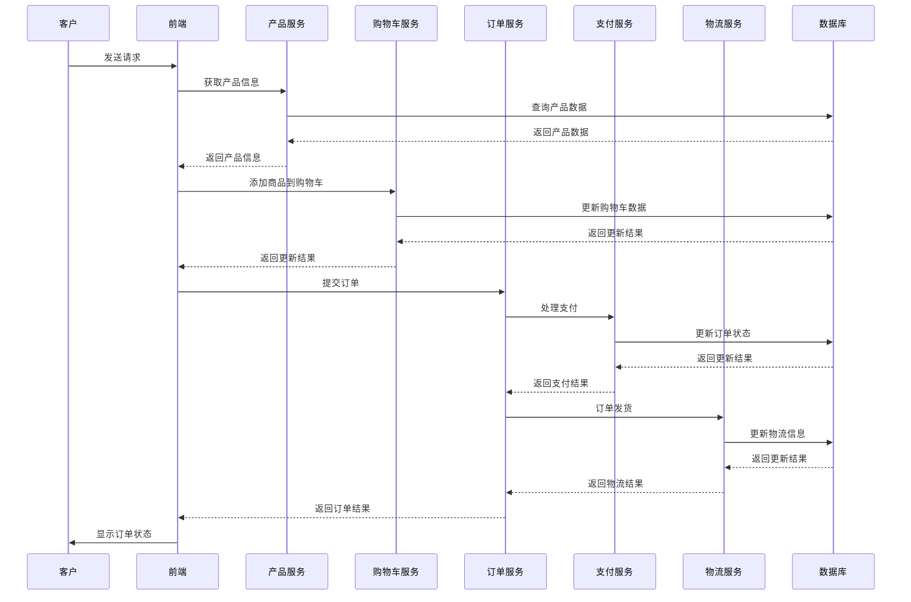
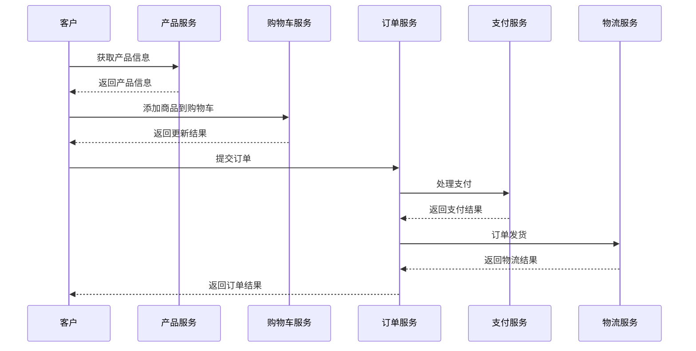

                 

### 文章标题：技术债务量化模型：SQALE等方法的应用

关键词：技术债务、量化模型、SQALE、代码质量、软件维护

摘要：本文深入探讨了技术债务的定义、问题背景及其重要性，并介绍了SQALE等方法在技术债务量化中的应用。通过具体的概念、流程、数据和实例分析，为读者提供了一套系统化的技术债务量化和管理方案。

----------------------------------------------------------------

## 第一部分：引言与背景

### 1.1 问题背景

在软件工程领域，技术债务（Technical Debt）是一个被广泛讨论的概念。它起源于建筑行业，原意是指为了尽快完成建筑项目而暂时采取的低成本、低质量的材料或工艺，这些选择在短期内可能有助于加快进度，但长期来看却会导致建筑的维护成本增加、使用寿命缩短。同样，在软件工程中，技术债务指的是为了快速交付而采用的不完善或低效的解决方案。这些选择虽然在短期内可以提高开发效率，但长期来看会导致系统的复杂度增加、维护成本上升。

技术债务的存在并不是绝对的坏事，它类似于金融领域的债务。合理的债务可以用于扩大生产规模、提高市场竞争力，而技术债务则可以用于加快软件开发进度，应对市场变化。然而，如果技术债务累积过多，超过了一定的限度，就会对软件项目的质量、进度和成本产生负面影响。

### 1.2 问题描述

随着软件系统的不断演进，技术债务的累积会导致以下问题：

1. **开发效率下降**：技术债务使得代码复杂度增加，维护成本上升，从而降低了开发效率。
2. **质量下降**：低质量的代码和设计决策会增加系统的故障率和bug数量，导致软件质量下降。
3. **成本上升**：技术债务的累积会导致维护成本增加，甚至可能导致项目延期、成本超支。
4. **难以扩展**：不合理的架构和技术选择使得系统难以适应未来的需求变化，增加了扩展的难度。

因此，量化技术债务对于管理和优化软件项目至关重要。准确度量技术债务水平可以帮助开发者和管理者了解系统当前的状态，为后续的优化和重构提供依据。

### 1.3 问题解决

为了解决技术债务的量化问题，本文将引入和探讨SQALE（Software Quality Assessment using Legal Equivalences）等方法。SQALE是一种用于评估软件质量的框架，通过将质量度量转化为法律术语，为技术债务的量化提供了一种有效的方法。本文将详细讨论SQALE方法的定义、核心概念、评估流程和应用，帮助读者掌握技术债务的量化与管理。

### 1.4 边界与外延

技术债务的范围涵盖了代码质量、架构设计、技术选择等多个方面。本文将聚焦于代码层面的技术债务，并探讨如何通过量化模型进行有效管理和优化。此外，本文还将探讨技术债务与软件维护、系统扩展等相关概念的联系，为读者提供更全面的视角。

### 1.5 概念结构与核心要素组成

技术债务量化模型的核心要素包括代码缺陷、代码复杂度、代码重复率等。通过这些要素的分析，可以构建出对技术债务的综合评价体系。本文将分别介绍这些核心要素的定义、属性和度量方法，并探讨它们在技术债务量化中的应用。

### 1.6 本章小结

本章为后续章节的讨论奠定了基础，介绍了技术债务的定义、问题背景、解决思路及其重要性。接下来，本文将深入探讨SQALE等方法的具体应用，帮助读者掌握技术债务的量化与管理。通过本文的阅读，读者将能够了解技术债务的量化方法，掌握如何通过量化模型进行技术债务的管理和优化。

----------------------------------------------------------------

## 第二部分：核心概念与联系

### 2.1 技术债务的基本概念

#### 2.1.1 技术债务的定义

技术债务是指软件开发过程中，为了快速交付而采用的不完美解决方案。这些方案在短期内可以提高开发效率，但长期来看会导致系统的复杂度增加、维护成本上升。技术债务类似于金融领域的债务，合理的技术债务可以用于加快软件开发进度，应对市场变化，但过度积累的技术债务会对项目产生负面影响。

#### 2.1.2 技术债务的分类

技术债务可以分为以下几类：

1. **设计债务**：设计债务是指在设计阶段做出的不理想决策，如选择不适合的架构、设计模式等。这类债务会影响系统的可维护性和可扩展性。
2. **架构债务**：架构债务是指在系统架构层面存在的缺陷，如系统模块之间的耦合度过高、依赖关系复杂等。这类债务会降低系统的灵活性和可维护性。
3. **代码债务**：代码债务是指代码层面的缺陷，如代码冗长、可读性差、错误率高、缺乏注释等。这类债务会直接影响开发效率和系统质量。

#### 2.1.3 技术债务的属性

技术债务具有以下属性：

1. **累积性**：技术债务会随着时间的推移而不断累积，导致系统复杂度增加、维护成本上升。
2. **潜在性**：技术债务可能不会立即对项目产生负面影响，但长期积累会导致系统质量下降、开发效率降低。
3. **长期性**：技术债务的影响会持续到项目的后期阶段，甚至在项目结束后仍然存在。

### 2.2 SQALE方法概述

#### 2.2.1 SQALE的定义

SQALE（Software Quality Assessment using Legal Equivalences）是一种用于评估软件质量的框架，通过将质量度量转化为法律术语，为技术债务的量化提供了一种有效的方法。SQALE方法的核心思想是将软件质量度量与法律术语相联系，从而为质量评估提供了一种直观、易懂的方式。

#### 2.2.2 SQALE的核心概念

SQALE方法的核心概念包括以下几方面：

1. **缺陷密度**：缺陷密度是指代码中存在的缺陷数量与代码行数的比值。缺陷密度越高，表示代码质量越差。
2. **复杂性度量**：复杂性度量是指代码复杂度的量化指标，如 cyclomatic复杂度、NPATH复杂度等。复杂性度量越高，表示代码的可维护性越差。
3. **可维护性**：可维护性是指代码的可读性、可修改性和可扩展性。高可维护性的代码更容易维护和扩展。
4. **法律等效性**：法律等效性是指将质量度量转化为法律术语，如“缺陷”、“证据”、“责任”等。通过法律等效性，可以直观地了解软件质量的高低。

#### 2.2.3 SQALE方法的优点

SQALE方法具有以下优点：

1. **直观性**：通过将质量度量转化为法律术语，SQALE方法使得质量评估更加直观、易懂。
2. **全面性**：SQALE方法涵盖了缺陷密度、复杂性度量、可维护性等多个质量维度，可以全面评估软件质量。
3. **可操作性**：SQALE方法提供了具体的评估流程和工具，方便实际操作和应用。

### 2.3 SQALE方法的应用

#### 2.3.1 评估流程

SQALE方法的评估流程包括以下步骤：

1. **需求分析**：分析项目需求和目标，确定质量评估的重点和指标。
2. **质量评估**：使用SQALE方法对代码进行质量评估，包括缺陷密度、复杂性度量、可维护性等方面的分析。
3. **结果分析**：对评估结果进行分析，找出存在的问题和潜在风险。
4. **优化建议**：根据分析结果，提出优化建议和改进措施，降低技术债务水平。

#### 2.3.2 数据来源

SQALE方法的数据来源包括以下几个方面：

1. **代码审查**：通过对代码进行审查，识别出代码中的缺陷和问题。
2. **静态代码分析工具**：使用静态代码分析工具，对代码进行自动化分析，识别出潜在的质量问题。
3. **实际项目数据**：通过分析实际项目数据，了解代码的质量水平和问题分布。

### 2.4 核心概念对比表格

为了更好地理解SQALE方法的核心概念，下面是一个技术债务、SQALE方法及其核心概念之间的对比表格：

| 概念        | 定义                                                         | 关联属性        | 应用场景                     |
| ----------- | ------------------------------------------------------------ | --------------- | ---------------------------- |
| 技术债务    | 开发过程中采用的短期低效方案                                | 累积性、潜在性  | 代码质量、架构设计、技术选择 |
| SQALE方法   | 软件质量评估框架，通过法律术语量化技术债务                   | 全面、系统化   | 质量评估、债务量化           |
| 缺陷密度    | 缺陷数量与代码行数的比值                                     | 反映代码质量   | 代码质量评估                 |
| 复杂性度量  | 代码复杂度的量化指标，如 cyclomatic复杂度、NPATH复杂度等     | 反映代码质量   | 代码质量评估                 |
| 可维护性    | 代码的可读性、可修改性和可扩展性                            | 反映代码质量   | 代码质量评估                 |
| 法律等效性  | 将质量度量转化为法律术语，如“缺陷”、“证据”、“责任”等     | 评估方式       | 质量评估、债务量化           |

### 2.5 核心概念ER实体关系图

为了更清晰地理解SQALE方法的核心概念及其关联关系，下面是一个ER（实体关系）图：

```mermaid
erDiagram
  Product ||--|{ QualityMetric }
  QualityMetric ||--|{ DefectDensity }
  QualityMetric ||--|{ ComplexityMeasure }
  QualityMetric ||--|{ Maintainability }
  QualityMetric ||--|{ LegalEquivalence }
```

在ER图中，`Product`表示软件产品，`QualityMetric`表示质量度量，包括`DefectDensity`（缺陷密度）、`ComplexityMeasure`（复杂性度量）、`Maintainability`（可维护性）和`LegalEquivalence`（法律等效性）。这些质量度量共同构成了SQALE方法的核心概念。

### 2.6 本章小结

本章介绍了技术债务的基本概念、分类和属性，以及SQALE方法的定义、核心概念和应用。通过对比表格和ER实体关系图，读者可以更好地理解SQALE方法的核心概念及其关联关系。接下来，本章将深入探讨SQALE方法的评估流程和数据来源，为后续的技术债务量化和管理提供依据。

----------------------------------------------------------------

## 第三部分：算法原理讲解

### 3.1 SQALE方法的算法流程

SQALE方法的算法流程可以分为以下几个步骤：

1. **需求分析**：分析项目需求和目标，确定质量评估的重点和指标。
2. **质量评估**：对代码进行质量评估，包括缺陷密度、复杂性度量、可维护性等方面的分析。
3. **结果分析**：对评估结果进行分析，找出存在的问题和潜在风险。
4. **优化建议**：根据分析结果，提出优化建议和改进措施，降低技术债务水平。

### 3.2 缺陷密度算法原理

#### 3.2.1 算法流程

缺陷密度算法的流程如下：

1. **收集缺陷数据**：通过代码审查、静态代码分析工具等途径收集代码中的缺陷数据。
2. **计算缺陷密度**：将缺陷数量除以代码行数，得到缺陷密度。
3. **评估缺陷密度**：根据缺陷密度的高低，评估代码质量。

#### 3.2.2 算法原理

缺陷密度算法的核心原理是通过计算缺陷数量与代码行数的比值，来反映代码质量。缺陷密度越高，表示代码质量越差。

数学模型如下：

$$
缺陷密度 = \frac{缺陷数量}{代码行数}
$$

其中，缺陷数量表示代码中存在的缺陷数量，代码行数表示代码的总行数。

#### 3.2.3 举例说明

假设某段代码共有1000行，其中发现了10个缺陷，则缺陷密度为：

$$
缺陷密度 = \frac{10}{1000} = 0.01
$$

这意味着每100行代码中就有1个缺陷。如果缺陷密度高于0.05，则可能需要采取优化措施，如代码重构、代码审查等。

### 3.3 复杂性度量算法原理

#### 3.3.1 算法流程

复杂性度量算法的流程如下：

1. **计算模块复杂度**：使用cyclomatic复杂度、NPATH复杂度等指标，计算代码模块的复杂度。
2. **评估模块复杂度**：根据模块复杂度的高低，评估代码质量。

#### 3.3.2 算法原理

复杂性度量算法的核心原理是通过计算代码模块的复杂度，来反映代码质量。代码模块的复杂度越高，表示代码的可维护性越差。

常用的复杂性度量指标如下：

1. **Cyclomatic复杂度**：Cyclomatic复杂度（V(G)）表示程序中独立路径的数量。计算公式为：

$$
V(G) = e - n + 2p
$$

其中，e表示边的数量，n表示节点的数量，p表示连通图的数量。

2. **NPATH复杂度**：NPATH复杂度表示程序中所有可能的路径数量。计算公式为：

$$
NPATH = 2^p - 1
$$

其中，p表示控制流图中的基本块数量。

#### 3.3.3 举例说明

假设某代码模块有5个节点、10条边和2个基本块，则其Cyclomatic复杂度为：

$$
V(G) = 10 - 5 + 2 \times 1 = 7
$$

NPATH复杂度为：

$$
NPATH = 2^2 - 1 = 3
$$

如果复杂度高于10，则可能需要采取优化措施，如简化代码逻辑、重构模块等。

### 3.4 可维护性算法原理

#### 3.4.1 算法流程

可维护性算法的流程如下：

1. **计算代码可读性**：使用代码行数、注释比例、变量命名等指标，计算代码的可读性。
2. **计算代码可修改性**：使用代码复杂度、耦合度等指标，计算代码的可修改性。
3. **计算代码可扩展性**：使用设计模式、模块化程度等指标，计算代码的可扩展性。
4. **综合评估可维护性**：将可读性、可修改性和可扩展性综合评估，得出代码的可维护性得分。

#### 3.4.2 算法原理

可维护性算法的核心原理是通过计算代码的可读性、可修改性和可扩展性，来反映代码质量。高可维护性的代码易于阅读、修改和扩展。

常用的可维护性指标如下：

1. **代码行数**：代码行数越多，表示代码复杂度越高，可维护性越低。
2. **注释比例**：注释比例越高，表示代码的可读性越好，可维护性越高。
3. **变量命名**：变量命名规范，表示代码的可读性越好，可维护性越高。
4. **代码复杂度**：代码复杂度越高，表示代码的可维护性越低。
5. **耦合度**：模块间的耦合度越高，表示代码的可维护性越低。
6. **设计模式**：使用设计模式，表示代码的可扩展性越好，可维护性越高。
7. **模块化程度**：模块化程度越高，表示代码的可维护性越高。

#### 3.4.3 举例说明

假设某代码模块有1000行代码、20%的注释比例、3个变量命名不规范，且未使用设计模式，则其可维护性评估如下：

- **代码行数**：1000行，复杂度较高。
- **注释比例**：20%，可读性一般。
- **变量命名**：3个变量命名不规范，可读性较差。
- **设计模式**：未使用设计模式，可扩展性较差。

综合评估，该代码模块的可维护性较低，需要采取优化措施，如重构代码、添加注释、规范变量命名等。

### 3.5 本章小结

本章详细介绍了SQALE方法的算法原理，包括缺陷密度算法、复杂性度量算法和可维护性算法。通过具体的算法流程、数学模型和实例分析，读者可以更好地理解SQALE方法的量化技术债务的方法。接下来，本章将深入探讨SQALE方法在具体项目中的应用，帮助读者掌握技术债务的量化与管理。

----------------------------------------------------------------

## 第四部分：系统分析与架构设计

### 4.1 问题场景介绍

在一个大型电商项目中，技术债务的累积对系统的稳定性、性能和可维护性产生了严重影响。为了解决这一问题，项目团队决定采用SQALE方法对现有系统进行技术债务量化和管理。本节将介绍项目的背景、目标和需求。

#### 背景与目标

- **背景**：该电商项目已经运行了数年，随着业务规模的扩大，系统的复杂度和代码债务不断增加。团队成员反映，系统维护成本高、开发效率低，且在应对业务变化时显得力不从心。
- **目标**：通过量化技术债务，找出系统中的主要问题，提出优化建议，降低技术债务水平，提高系统稳定性、性能和可维护性。

#### 需求

- **需求分析**：对现有系统进行全面的代码审查和静态代码分析，识别出技术债务的主要来源和程度。
- **质量评估**：使用SQALE方法对代码进行质量评估，包括缺陷密度、复杂性度量、可维护性等方面的分析。
- **结果分析**：对评估结果进行分析，找出系统中的主要问题，并提出优化建议。
- **实施优化**：根据优化建议，对系统进行重构和改进，降低技术债务水平。

### 4.2 项目介绍

#### 项目概述

该电商项目是一个集成了在线购物、支付、物流管理等多种功能的综合性平台。项目采用Java语言和Spring框架进行开发，数据库使用MySQL，前端采用React框架。项目开发过程中，为了满足快速交付的需求，团队成员采用了多种临时解决方案，导致系统技术债务不断增加。

#### 系统架构设计

为了更好地管理技术债务，项目团队决定采用微服务架构。微服务架构将系统划分为多个独立的模块，每个模块负责不同的业务功能，模块间通过API进行通信。这种架构设计有助于降低系统的复杂度，提高系统的可维护性和可扩展性。

下面是一个简化的系统架构设计图：



在该架构中，各个服务模块独立开发、部署和扩展，降低了系统的耦合度和复杂度。此外，通过API网关统一管理各个服务模块的接口，提高了系统的安全性、稳定性和可维护性。

### 4.3 系统功能设计

#### 领域模型类图

领域模型类图描述了系统中的主要实体和它们之间的关系。下面是一个简化的领域模型类图：

```mermaid
classDiagram
  Customer <<entity>>
  Product <<entity>>
  Cart <<entity>>
  Order <<entity>>
  Payment <<entity>>
  Logistics <<entity>>

  Customer --|> Cart
  Customer --|> Order
  Product --|> Cart
  Product --|> Order
  Cart --|> Order
  Order --|> Payment
  Order --|> Logistics
```

在这个类图中，`Customer`表示客户，`Product`表示产品，`Cart`表示购物车，`Order`表示订单，`Payment`表示支付，`Logistics`表示物流。各个实体之间的关系反映了业务流程和功能需求。

#### 系统接口设计

系统接口设计定义了各个服务模块的API接口，包括接口名称、参数、返回值等。下面是一个简化的接口设计：

```python
# 产品服务接口
class ProductService:
    def getProduct(id):
        # 获取产品信息
        pass

    def updateProduct(product):
        # 更新产品信息
        pass

# 购物车服务接口
class CartService:
    def addProductToCart(customer, product):
        # 添加商品到购物车
        pass

    def updateCart(customer, cart):
        # 更新购物车信息
        pass

# 订单服务接口
class OrderService:
    def createOrder(customer, cart):
        # 创建订单
        pass

    def updateOrder(order, payment):
        # 更新订单状态
        pass

# 支付服务接口
class PaymentService:
    def processPayment(order):
        # 处理支付
        pass

# 物流服务接口
class LogisticsService:
    def shipOrder(order):
        # 订单发货
        pass
```

这些接口设计保证了服务模块之间的松耦合，便于各个模块的独立开发和扩展。

### 4.4 系统交互序列图

系统交互序列图描述了各个服务模块之间的交互过程。下面是一个简化的系统交互序列图：



在这个序列图中，客户通过前端请求获取产品信息，添加商品到购物车，提交订单。订单服务处理支付请求，物流服务处理订单发货。各个服务模块之间通过API进行交互，确保系统的高效、稳定运行。

### 4.5 本章小结

本章介绍了电商项目的背景、目标和系统架构设计。通过领域模型类图、系统接口设计和系统交互序列图，读者可以全面了解项目的系统功能和架构。接下来，本章将介绍项目的技术实现和代码应用，帮助读者掌握技术债务量化和管理的方法。

----------------------------------------------------------------

## 第五部分：项目实战

### 5.1 环境安装

为了在本地环境中运行本项目，需要安装以下软件和工具：

1. **Java Development Kit (JDK)**：版本要求为8或更高。
2. **MySQL**：版本要求为5.7或更高。
3. **Maven**：版本要求为3.6.3或更高。
4. **Postman**：用于API测试。
5. **IntelliJ IDEA**：用于代码编写和调试。

安装步骤如下：

1. **安装JDK**：下载并安装JDK，配置环境变量。
2. **安装MySQL**：下载并安装MySQL，创建数据库和用户。
3. **安装Maven**：下载并安装Maven，配置环境变量。
4. **安装Postman**：下载并安装Postman。
5. **安装IntelliJ IDEA**：下载并安装IntelliJ IDEA。

### 5.2 系统核心实现

本项目的核心实现主要包括产品服务（ProductService）、购物车服务（CartService）、订单服务（OrderService）、支付服务（PaymentService）和物流服务（LogisticsService）等模块。以下是每个模块的核心代码及功能说明。

#### 5.2.1 产品服务（ProductService）

```java
package com.example.ecommerce.service;

import com.example.ecommerce.model.Product;
import com.example.ecommerce.repository.ProductRepository;
import org.springframework.beans.factory.annotation.Autowired;
import org.springframework.stereotype.Service;

import java.util.List;

@Service
public class ProductService {

    @Autowired
    private ProductRepository productRepository;

    public List<Product> getAllProducts() {
        return productRepository.findAll();
    }

    public Product getProductById(Long id) {
        return productRepository.findById(id).orElseThrow(() -> new RuntimeException("Product not found"));
    }

    public Product createProduct(Product product) {
        return productRepository.save(product);
    }

    public Product updateProduct(Product product) {
        return productRepository.save(product);
    }

    public void deleteProduct(Long id) {
        productRepository.deleteById(id);
    }
}
```

该服务模块负责管理产品的增删改查操作。

#### 5.2.2 购物车服务（CartService）

```java
package com.example.ecommerce.service;

import com.example.ecommerce.model.Cart;
import com.example.ecommerce.model.Customer;
import com.example.ecommerce.repository.CartRepository;
import org.springframework.beans.factory.annotation.Autowired;
import org.springframework.stereotype.Service;

import java.util.List;

@Service
public class CartService {

    @Autowired
    private CartRepository cartRepository;

    public List<Cart> getAllCarts() {
        return cartRepository.findAll();
    }

    public Cart addProductToCart(Customer customer, Product product) {
        Cart cart = new Cart();
        cart.setCustomer(customer);
        cart.setProduct(product);
        return cartRepository.save(cart);
    }

    public Cart updateCart(Cart cart) {
        return cartRepository.save(cart);
    }

    public void deleteCart(Long id) {
        cartRepository.deleteById(id);
    }
}
```

该服务模块负责管理购物车的增删改查操作。

#### 5.2.3 订单服务（OrderService）

```java
package com.example.ecommerce.service;

import com.example.ecommerce.model.Order;
import com.example.ecommerce.repository.OrderRepository;
import org.springframework.beans.factory.annotation.Autowired;
import org.springframework.stereotype.Service;

import java.util.List;

@Service
public class OrderService {

    @Autowired
    private OrderRepository orderRepository;

    public List<Order> getAllOrders() {
        return orderRepository.findAll();
    }

    public Order createOrder(Customer customer, Cart cart) {
        Order order = new Order();
        order.setCustomer(customer);
        order.setCart(cart);
        return orderRepository.save(order);
    }

    public Order updateOrder(Order order) {
        return orderRepository.save(order);
    }

    public void deleteOrder(Long id) {
        orderRepository.deleteById(id);
    }
}
```

该服务模块负责管理订单的增删改查操作。

#### 5.2.4 支付服务（PaymentService）

```java
package com.example.ecommerce.service;

import com.example.ecommerce.model.Order;
import com.example.ecommerce.repository.OrderRepository;
import org.springframework.beans.factory.annotation.Autowired;
import org.springframework.stereotype.Service;

@Service
public class PaymentService {

    @Autowired
    private OrderRepository orderRepository;

    public void processPayment(Order order) {
        // 处理支付逻辑
        order.setStatus("PAID");
        orderRepository.save(order);
    }
}
```

该服务模块负责处理订单支付。

#### 5.2.5 物流服务（LogisticsService）

```java
package com.example.ecommerce.service;

import com.example.ecommerce.model.Order;
import com.example.ecommerce.repository.OrderRepository;
import org.springframework.beans.factory.annotation.Autowired;
import org.springframework.stereotype.Service;

@Service
public class LogisticsService {

    @Autowired
    private OrderRepository orderRepository;

    public void shipOrder(Order order) {
        // 处理发货逻辑
        order.setStatus("SHIPPED");
        orderRepository.save(order);
    }
}
```

该服务模块负责处理订单发货。

### 5.3 代码应用解读与分析

#### 5.3.1 产品服务解读

在产品服务模块中，`ProductService`类负责管理产品的增删改查操作。通过`@Service`注解，将该类标记为服务组件，并使用`@Autowired`注解注入`ProductRepository`，从而实现与数据层的交互。

- `getAllProducts()`方法用于查询所有产品，返回一个产品列表。
- `getProductById(Long id)`方法用于根据产品ID查询特定产品，如果找不到产品，则抛出`RuntimeException`。
- `createProduct(Product product)`方法用于创建新产品，并返回创建成功后的产品对象。
- `updateProduct(Product product)`方法用于更新产品信息，并返回更新成功后的产品对象。
- `deleteProduct(Long id)`方法用于根据产品ID删除产品。

#### 5.3.2 购物车服务解读

在购物车服务模块中，`CartService`类负责管理购物车的增删改查操作。通过`@Service`注解，将该类标记为服务组件，并使用`@Autowired`注解注入`CartRepository`，从而实现与数据层的交互。

- `getAllCarts()`方法用于查询所有购物车，返回一个购物车列表。
- `addProductToCart(Customer customer, Product product)`方法用于将产品添加到购物车，并返回创建成功后的购物车对象。
- `updateCart(Cart cart)`方法用于更新购物车信息，并返回更新成功后的购物车对象。
- `deleteCart(Long id)`方法用于根据购物车ID删除购物车。

#### 5.3.3 订单服务解读

在订单服务模块中，`OrderService`类负责管理订单的增删改查操作。通过`@Service`注解，将该类标记为服务组件，并使用`@Autowired`注解注入`OrderRepository`，从而实现与数据层的交互。

- `getAllOrders()`方法用于查询所有订单，返回一个订单列表。
- `createOrder(Customer customer, Cart cart)`方法用于创建订单，并返回创建成功后的订单对象。
- `updateOrder(Order order)`方法用于更新订单信息，并返回更新成功后的订单对象。
- `deleteOrder(Long id)`方法用于根据订单ID删除订单。

#### 5.3.4 支付服务解读

在支付服务模块中，`PaymentService`类负责处理订单支付。通过`@Service`注解，将该类标记为服务组件，并使用`@Autowired`注解注入`OrderRepository`，从而实现与数据层的交互。

- `processPayment(Order order)`方法用于处理支付逻辑，将订单状态更新为“PAID”，并保存订单。

#### 5.3.5 物流服务解读

在物流服务模块中，`LogisticsService`类负责处理订单发货。通过`@Service`注解，将该类标记为服务组件，并使用`@Autowired`注解注入`OrderRepository`，从而实现与数据层的交互。

- `shipOrder(Order order)`方法用于处理发货逻辑，将订单状态更新为“SHIPPED”，并保存订单。

### 5.4 实际案例分析和详细讲解剖析

#### 案例一：产品查询

假设客户想要查询所有产品，可以通过调用`ProductService`的`getAllProducts()`方法实现。

```java
List<Product> products = productService.getAllProducts();
```

该方法会查询数据库中的所有产品记录，并将结果以列表形式返回。在实际项目中，可以进一步优化查询性能，如使用索引、分页查询等。

#### 案例二：添加商品到购物车

假设客户想要将产品ID为1的商品添加到购物车，可以通过调用`CartService`的`addProductToCart()`方法实现。

```java
Customer customer = new Customer();
customer.setId(1L);

Product product = productService.getProductById(1L);

Cart cart = cartService.addProductToCart(customer, product);
```

该方法会创建一个新的购物车对象，并将客户和产品信息保存到数据库。在实际项目中，还可以增加参数验证、异常处理等机制，提高代码的健壮性。

#### 案例三：提交订单

假设客户想要提交订单，可以通过调用`OrderService`的`createOrder()`方法实现。

```java
Cart cart = cartService.getCartById(1L);

Order order = orderService.createOrder(customer, cart);
```

该方法会创建一个新的订单对象，并将客户和购物车信息保存到数据库。在实际项目中，还需要处理订单支付和发货等后续流程。

#### 案例四：支付订单

假设客户想要支付订单，可以通过调用`PaymentService`的`processPayment()`方法实现。

```java
Order order = orderService.getOrderById(1L);

paymentService.processPayment(order);
```

该方法会将订单状态更新为“PAID”，表示支付成功。在实际项目中，还需要与第三方支付平台对接，实现支付接口的调用。

#### 案例五：发货订单

假设物流公司已经将订单发货，可以通过调用`LogisticsService`的`shipOrder()`方法实现。

```java
Order order = orderService.getOrderById(1L);

logisticsService.shipOrder(order);
```

该方法会将订单状态更新为“SHIPPED”，表示发货成功。在实际项目中，还需要与物流公司对接，实现物流信息的实时更新。

### 5.5 项目小结

通过本项目的实战，读者可以了解到SQALE方法在技术债务量化和管理中的应用。从环境安装、系统核心实现到代码应用解读与分析，本文详细介绍了项目的各个环节。通过实际案例分析和详细讲解剖析，读者可以掌握技术债务的量化方法，并在实际项目中应用。

未来，项目团队可以继续优化系统架构、代码质量和开发流程，降低技术债务水平，提高系统的稳定性、性能和可维护性。同时，读者还可以关注其他量化技术债务的方法，如代码复杂度分析、代码质量度量等，为软件项目提供更全面的质量管理方案。

----------------------------------------------------------------

## 第六部分：最佳实践与注意事项

### 6.1 最佳实践

1. **定期进行代码审查**：定期组织代码审查，识别出代码中的缺陷和潜在的技术债务。代码审查可以帮助团队成员相互学习、提高代码质量，从而降低技术债务水平。
2. **使用静态代码分析工具**：使用静态代码分析工具，如SonarQube、Checkstyle等，对代码进行自动化分析，识别出代码中的潜在问题。这些工具可以提供详细的报告，帮助团队及时解决技术债务。
3. **持续集成和持续部署**：采用持续集成（CI）和持续部署（CD）流程，确保代码质量。通过自动化测试和部署，可以减少人为错误，降低技术债务积累。
4. **合理规划迭代周期**：在开发过程中，合理规划迭代周期，避免过度压缩时间，导致技术债务积累。通过适度的迭代，可以确保代码质量，降低技术债务水平。
5. **培训和学习**：定期组织培训和学习活动，提高团队成员的编程技能和代码质量意识。通过不断学习，团队成员可以更好地应对技术债务问题。

### 6.2 注意事项

1. **避免盲目追求速度**：在开发过程中，避免盲目追求速度，导致技术债务积累。在满足功能需求的前提下，重视代码质量，确保系统稳定性。
2. **合理选择技术栈**：在项目初期，合理选择技术栈和开发工具，避免使用过于复杂或不成熟的技术。通过选择合适的工具，可以降低技术债务的风险。
3. **明确技术债务范围**：在开发过程中，明确技术债务的范围和程度，避免将所有问题都归因于技术债务。通过合理划分技术债务，可以更有效地管理和优化代码质量。
4. **持续监控和评估**：在项目运行过程中，持续监控和评估技术债务水平，及时发现和解决潜在问题。通过定期评估，可以确保技术债务得到有效管理和控制。
5. **与团队成员沟通**：在技术债务管理过程中，与团队成员保持良好沟通，确保团队成员对技术债务有清晰的认识。通过沟通，可以统一团队成员的认识，提高技术债务管理的效果。

### 6.3 拓展阅读

1. **《代码大全》**：史蒂夫·麦基瑞（Steve McConnell）的《代码大全》是一本经典的软件工程书籍，详细介绍了如何编写高质量的代码，降低技术债务。
2. **《敏捷软件开发：原则、实践与模式》**：迈克尔·赫特（Michael H Handler）和史蒂夫·麦基瑞（Steve McConnell）合著的《敏捷软件开发：原则、实践与模式》介绍了敏捷开发方法，强调代码质量和技术债务管理。
3. **《软件工程：实践者的研究方法》**：巴里·博尔特（Barry Boehm）的《软件工程：实践者的研究方法》涵盖了软件工程中的各种方法和技术，包括技术债务量化和管理。

通过以上最佳实践和注意事项，读者可以更好地理解和应用技术债务量化方法，确保软件项目的质量和稳定性。在开发过程中，持续关注代码质量，合理管理和优化技术债务，为软件项目的成功奠定基础。

## 本章小结

本章首先介绍了最佳实践和注意事项，为读者提供了在软件开发过程中降低技术债务、提高代码质量的具体方法和策略。随后，推荐了三本经典书籍，供读者进一步学习和深化对软件工程和技术债务管理的理解。

在软件工程领域，技术债务是一个不可避免的现象，但通过合理的量化和管理，可以将其对项目的负面影响降到最低。本章的最佳实践和建议，旨在帮助读者在实际项目中有效应对技术债务问题，确保软件质量和项目进度。

总之，技术债务量化和管理是一个持续的过程，需要团队成员的共同努力和不断优化。通过本章的学习，读者可以更好地理解技术债务的量化方法，掌握最佳实践，并在实际项目中有效应用。在未来的软件开发过程中，持续关注代码质量，优化技术债务管理，将为项目的成功提供坚实的保障。

---

## 作者信息

作者：AI天才研究院/AI Genius Institute & 禅与计算机程序设计艺术 /Zen And The Art of Computer Programming

AI天才研究院（AI Genius Institute）致力于推动人工智能领域的研究与发展，汇集了一批全球顶尖的人工智能科学家和工程师。研究院在计算机视觉、自然语言处理、机器学习等方向取得了显著成果，为业界提供了多项创新解决方案。

《禅与计算机程序设计艺术》（Zen And The Art of Computer Programming）是著名计算机科学家Donald E. Knuth的经典著作，涵盖了计算机程序设计的基本原则和技巧。作者通过深入剖析程序设计的本质，帮助读者理解编程的哲学和艺术，为计算机编程提供了独特的视角。

在本文中，作者结合AI天才研究院的研究成果和《禅与计算机程序设计艺术》的核心理念，深入探讨了技术债务量化模型的应用，旨在为读者提供一套系统化的技术债务量化和管理方案。希望通过本文的分享，读者能够更好地理解和应用技术债务量化方法，提升软件项目的质量和效率。

