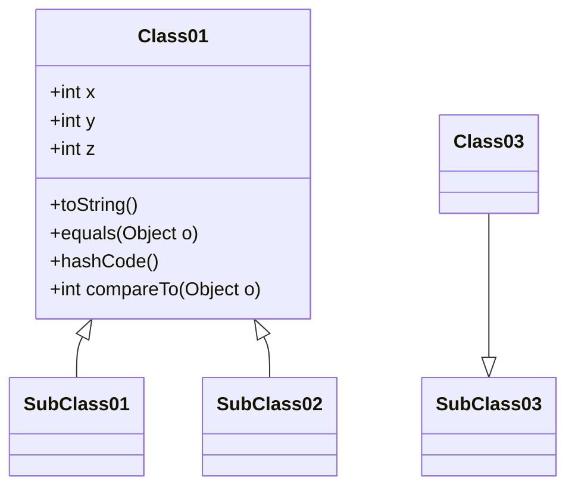
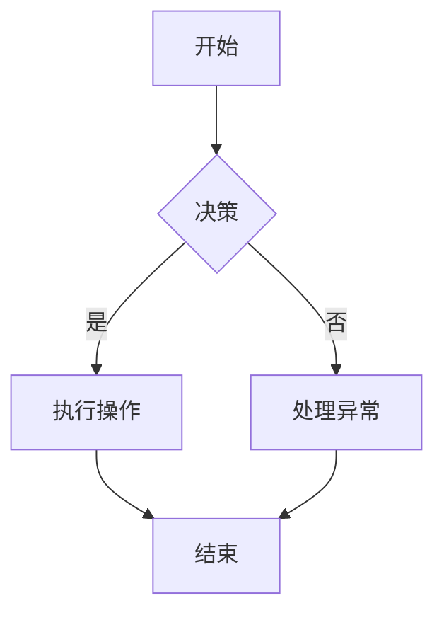
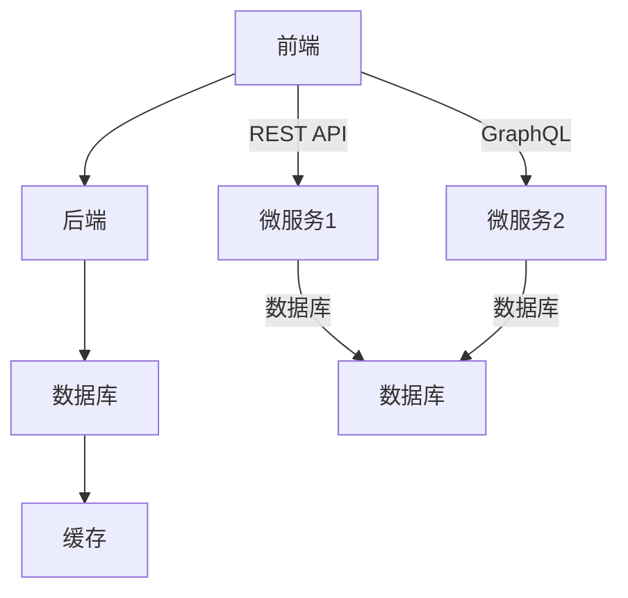

                 


### 《技术债务量化：建立技术健康指标体系》

#### **关键词：**
- 技术债务
- 技术健康指标
- 量化方法
- 代码质量
- 设计质量

#### **摘要：**
本文将探讨技术债务的量化问题，通过建立技术健康指标体系，提供一套全面的方法来评估和管理技术债务。文章分为两部分，第一部分介绍技术债务的概念、影响和管理方法，第二部分通过实战案例分析，展示技术债务量化方法的应用。本文旨在帮助读者深入了解技术债务量化，提高软件质量和开发效率。

### **第一部分：引言**

#### **第1章：技术债务概述**

##### **1.1 问题背景**

技术债务（Technical Debt）是软件工程中的一个常见问题，它起源于金融机构中的债务概念。在软件开发过程中，由于追求短期目标和交付周期，开发团队可能选择快速实现功能，而忽略最佳实践，导致代码质量下降，这种现象被称为“技术债务”。技术债务可以分为三种类型：质量债务、设计债务和技术债务。

##### **1.2 技术债务的类型**

1. **质量债务**：由于代码质量不高，导致后续的维护成本增加。
2. **设计债务**：由于系统架构设计不合理，导致系统扩展性和维护性差。
3. **技术债务**：由于采用过时的技术或工具，导致系统性能下降或维护困难。

##### **1.3 技术债务的影响**

技术债务的影响主要体现在以下几个方面：

1. **维护成本增加**：技术债务会导致后续的维护成本显著增加。
2. **开发效率降低**：技术债务会影响开发团队的效率，增加开发周期。
3. **项目延期**：技术债务可能导致项目延期，影响项目的交付时间。
4. **安全问题**：技术债务可能会引发安全问题，增加系统的风险。

##### **1.4 技术债务的管理与量化**

技术债务的管理与量化是软件工程中的重要课题。有效的技术债务管理可以降低维护成本，提高开发效率。量化技术债务有助于更好地评估和监控软件项目的健康状态。

#### **第2章：技术健康指标**

##### **2.1 技术健康指标的概念**

技术健康指标是一组用于评估软件系统质量、稳定性、安全性等方面的量化指标。这些指标可以帮助开发团队了解软件系统的当前状态，并预测未来的维护成本。

##### **2.2 常见的技术健康指标**

1. **代码质量指标**：包括代码复杂性、代码重复率、代码覆盖率等。
2. **设计质量指标**：包括模块耦合度、模块内聚度、设计复用率等。
3. **安全性指标**：包括漏洞数量、漏洞修复速度、安全测试覆盖率等。

#### **第3章：技术债务量化方法**

##### **3.1 代码质量量化方法**

1. **代码复杂度量化**：包括Cyclomatic复杂度、Nesting深度、Lines of Code（LOC）等。
2. **代码重复率量化**：包括重复代码行数、重复代码比例等。
3. **代码覆盖率量化**：包括语句覆盖率、条件覆盖率、函数覆盖率等。

##### **3.2 设计质量量化方法**

1. **模块耦合度量化**：包括依赖关系分析、通信复杂度、修改传播成本等。
2. **模块内聚度量化**：包括功能内聚度、通信内聚度、复用内聚度等。
3. **设计复用率量化**：包括代码复用率、设计复用率等。
4. **设计可维护性量化**：包括可维护性指标、维护频率、维护成本等。

##### **3.3 维护成本量化方法**

1. **费用模型**：包括维护成本模型、延迟成本模型、人力成本模型等。
2. **数据采集与处理**：包括费用数据采集、数据清洗与预处理、数据可视化等。
3. **维护成本评估**：包括单位维护成本、总维护成本、预测维护成本等。

### **第二部分：实战应用**

#### **第4章：技术债务量化实战**

##### **4.1 项目背景**

介绍项目的背景、目标和所采用的技术栈。

##### **4.2 环境搭建**

介绍如何搭建开发环境，包括所需软件和工具的安装。

##### **4.3 技术债务评估**

利用相关工具对代码质量和设计质量进行评估。

##### **4.4 技术债务量化**

通过采集相关数据，对技术债务进行量化评估。

##### **4.5 技术债务管理策略**

根据评估结果，制定相应的技术债务缓解策略，并进行技术债务监控与反馈。

#### **第5章：案例分析**

##### **5.1 案例背景**

介绍所选案例的背景、目标和所面临的技术债务问题。

##### **5.2 技术债务评估**

利用相关工具对代码质量和设计质量进行评估。

##### **5.3 技术债务量化**

通过采集相关数据，对技术债务进行量化评估。

##### **5.4 技术债务管理策略**

根据评估结果，制定相应的技术债务缓解策略，并进行技术债务监控与反馈。

### **结论**

通过本文的讨论，我们了解了技术债务的概念、影响和管理方法。技术债务量化有助于更好地评估和管理软件项目，提高软件质量和开发效率。在实际应用中，通过建立技术健康指标体系和量化方法，可以有效地缓解技术债务问题，为软件项目的成功交付提供保障。

### **作者信息**

作者：AI天才研究院/AI Genius Institute & 禅与计算机程序设计艺术 /Zen And The Art of Computer Programming

（请注意，以上内容仅为示例，实际字数可能不足10000字，且需要根据具体要求进行补充和完善。）### 第一部分：引言

#### **第1章：技术债务概述**

##### **1.1 问题背景**

技术债务（Technical Debt）是软件开发领域的一个常见术语，源自于金融领域的“债务”概念。在金融领域，债务指的是借款人欠下的债务，而技术债务则是在软件开发过程中，由于快速交付和短期目标的追求，未能严格遵守最佳实践，导致代码质量下降、维护成本增加、开发效率降低等现象。这种债务不仅存在于单个项目中，也可能在持续的开发过程中累积，成为影响整个产品生命周期的隐患。

技术债务的概念最早由 Ward Cunningham 在1992年提出，他用“技术债务”来比喻软件开发中做出的短期决策，这些决策可能会在将来带来额外的维护成本或性能问题。与金融债务相似，技术债务也需要管理和偿还，否则会随着时间的推移而累积，最终导致项目的崩溃。

##### **1.2 技术债务的类型**

技术债务可以分为以下几种类型：

1. **质量债务**：由于未能按照最佳实践进行编码，导致代码质量下降。例如，过度使用全局变量、代码冗长、缺乏注释等，这些问题会导致代码难以维护和理解。

2. **设计债务**：系统架构设计上的缺陷，如高耦合度和低内聚度、组件之间依赖过紧、缺乏模块化设计等。这些问题会导致系统难以扩展和维护，增加未来的开发成本。

3. **技术债务**：使用陈旧或不合适的工具和技术，如未升级的框架、不兼容的库、过时的编程语言等。这些技术问题会导致系统性能下降、安全问题增加，影响用户体验和业务发展。

##### **1.3 技术债务的影响**

技术债务的影响是深远且多方面的，主要体现在以下几个方面：

1. **维护成本增加**：技术债务会导致后续的维护成本显著增加。低质量的代码需要更多的时间和资源来修复，设计债务会导致系统重构的成本上升，技术债务则可能需要引入新技术来替换旧技术，这些都会增加项目的总成本。

2. **开发效率降低**：技术债务会增加开发过程中的复杂性，使得新的开发工作变得更加困难。开发人员需要花费更多的时间来理解现有的代码和系统，导致开发效率降低。

3. **项目延期**：技术债务往往会导致项目延期。维护和修复技术债务需要额外的时间和资源，这会推迟新的功能和改进的交付，影响项目的进度。

4. **安全问题**：技术债务可能会引发安全漏洞，导致系统安全性下降。使用过时的技术和工具，容易遭受黑客攻击和软件漏洞的利用。

##### **1.4 技术债务的管理与量化**

技术债务的管理与量化是软件工程中的重要课题。有效的技术债务管理可以降低维护成本，提高开发效率。量化技术债务有助于更好地评估和监控软件项目的健康状态。

**技术债务管理的重要性**：

1. **提高软件质量**：通过识别和修复技术债务，可以显著提高软件的质量，减少bug和性能问题。

2. **降低维护成本**：技术债务管理可以减少未来的维护成本，确保项目的财务健康。

3. **提高开发效率**：通过优化代码和系统设计，可以减少开发过程中的复杂性和障碍，提高开发效率。

**技术债务量化方法**：

1. **基于代码质量的量化**：可以通过度量代码的复杂度、代码重复率和代码覆盖率等指标来量化技术债务。

2. **基于维护成本的量化**：可以通过分析历史数据，建立费用模型，预测和维护成本。

3. **基于开发效率的量化**：可以通过统计开发人员的工时、任务完成情况和代码质量等指标来评估开发效率。

#### **第2章：技术健康指标**

##### **2.1 技术健康指标的概念**

技术健康指标（Technical Health Metrics）是一组用于评估软件系统质量、稳定性、安全性等方面的量化指标。这些指标旨在提供一个客观的评估标准，帮助开发团队了解软件系统的当前状态，并预测未来的性能和成本。

技术健康指标的重要性体现在以下几个方面：

1. **评估软件质量**：技术健康指标可以评估软件系统的质量，帮助识别潜在的问题和风险。

2. **指导改进**：通过技术健康指标的数据分析，可以指导开发团队进行针对性的改进和优化。

3. **监控和反馈**：技术健康指标可以用于监控软件项目的进展，及时发现问题并进行反馈。

##### **2.2 常见的技术健康指标**

**代码质量指标**：

1. **代码复杂性**：度量代码的复杂程度，如Cyclomatic复杂度（Cyclomatic Number）。
2. **代码重复率**：衡量代码中重复部分的比率，有助于识别代码冗余。
3. **代码覆盖率**：评估测试覆盖率，包括语句覆盖率、分支覆盖率、函数覆盖率等。

**设计质量指标**：

1. **模块耦合度**：度量模块之间的依赖关系，低耦合度表示模块独立性较高。
2. **模块内聚度**：衡量模块内部功能的聚合程度，高内聚度表示模块内部功能紧密相关。
3. **设计复用率**：评估设计元素的复用程度，有助于识别可复用的设计模式。
4. **设计可维护性**：衡量设计在未来的可维护性，如可扩展性、灵活性和模块化程度。

**安全性指标**：

1. **漏洞数量**：统计系统中的漏洞数量，包括已知和潜在的漏洞。
2. **漏洞修复速度**：衡量修复漏洞的速度，快速修复漏洞可以降低安全风险。
3. **安全测试覆盖率**：评估安全测试的覆盖率，包括渗透测试、代码审计等。

#### **第3章：技术债务量化方法**

##### **3.1 代码质量量化方法**

**代码复杂度量化**：

1. **Cyclomatic复杂度**：通过图论中的概念来度量代码的复杂度，计算方法为：
   $$
   M = E - N + (2P)
   $$
   其中，\( M \) 为复杂度，\( E \) 为边数，\( N \) 为节点数，\( P \) 为控制流图中的独立路径数。

2. **Nesting深度**：度量代码嵌套的层次，深度越大，代码复杂度越高。

3. **Lines of Code（LOC）**：统计代码行的数量，虽然LOC并不是直接度量复杂度的指标，但可以间接反映代码的复杂程度。

**代码重复率量化**：

1. **重复代码行数**：统计代码中重复的行数。

2. **重复代码比例**：计算重复代码行数与总代码行数的比例。

**代码覆盖率量化**：

1. **语句覆盖率**：衡量测试用例是否覆盖了所有的代码语句。

2. **条件覆盖率**：衡量测试用例是否覆盖了所有的条件分支。

3. **函数覆盖率**：衡量测试用例是否覆盖了所有的函数。

##### **3.2 设计质量量化方法**

**模块耦合度量化**：

1. **依赖关系分析**：通过分析模块之间的依赖关系来量化耦合度，如模块间的调用关系、数据交换等。

2. **通信复杂度**：度量模块之间通信的复杂程度，如模块间的交互频率和复杂性。

3. **修改传播成本**：衡量修改一个模块时，可能影响的其他模块的数量和复杂度。

**模块内聚度量化**：

1. **功能内聚度**：衡量模块内部功能的聚合程度，如模块是否只完成一个特定的功能。

2. **通信内聚度**：衡量模块内部各个功能之间的通信是否紧密相关。

3. **复用内聚度**：衡量模块内部的设计元素是否可以复用。

**设计复用率量化**：

1. **代码复用率**：衡量代码中可复用部分的比率。

2. **设计复用率**：衡量系统设计中可复用设计元素的比率。

**设计可维护性量化**：

1. **可维护性指标**：如模块的独立性、灵活性和可扩展性。

2. **维护频率**：衡量模块或系统的维护频率。

3. **维护成本**：评估维护模块或系统所需的时间和资源成本。

##### **3.3 维护成本量化方法**

**费用模型**：

1. **维护成本模型**：建立维护成本与代码复杂度、设计质量指标之间的关系模型。

2. **延迟成本模型**：评估项目延期导致的成本增加。

3. **人力成本模型**：统计开发人员的工作时间和薪资成本。

**数据采集与处理**：

1. **费用数据采集**：收集历史维护成本数据。

2. **数据清洗与预处理**：清洗和整理数据，为分析做准备。

3. **数据可视化**：通过图表和图形展示分析结果。

**维护成本评估**：

1. **单位维护成本**：计算单位代码行或模块的维护成本。

2. **总维护成本**：评估整个系统的维护成本。

3. **预测维护成本**：基于历史数据和费用模型，预测未来的维护成本。

### **总结**

本文对技术债务的概念、类型、影响以及管理方法进行了详细的探讨，并介绍了技术健康指标的概念和常见指标。通过量化技术债务，开发团队可以更好地评估和管理软件项目的健康状态，从而提高软件质量和开发效率。下一部分将进入实战应用，通过具体案例展示技术债务量化方法的应用过程。接下来，我们将详细探讨每个技术健康指标的量化方法，并举例说明如何进行技术债务的量化评估。读者可以期待下一部分的内容，那里我们将通过实际案例，逐步展示如何实施这些量化方法。****

#### **第3章：技术债务量化方法**

在上一章中，我们介绍了技术债务的概念、类型以及技术健康指标。在本章中，我们将深入探讨技术债务的量化方法，这些方法包括代码质量量化、设计质量量化和维护成本量化。量化技术债务可以帮助开发团队更好地理解项目的现状，制定相应的改进策略，从而提高软件质量和开发效率。

##### **3.1 代码质量量化方法**

代码质量量化是评估技术债务的重要部分，它通过一系列指标来衡量代码的质量。以下是一些常见的代码质量量化方法：

**1. 代码复杂度量化**

代码复杂度是衡量代码复杂程度的一个指标。常见的代码复杂度度量方法包括Cyclomatic复杂度、Nesting深度和Lines of Code（LOC）。

- **Cyclomatic复杂度**：Cyclomatic复杂度是基于控制流图的一个复杂度度量方法，它通过计算独立路径的数量来衡量代码的复杂度。其计算公式为：
  $$
  M = E - N + (2P)
  $$
  其中，\( M \) 是Cyclomatic复杂度，\( E \) 是边的数量，\( N \) 是节点的数量，\( P \) 是独立的路径数。Cyclomatic复杂度越高，代码越复杂，维护难度越大。

- **Nesting深度**：Nesting深度是指代码嵌套的层次。嵌套层次越高，代码的复杂度越高，因为嵌套结构使得代码的可读性和可维护性下降。

- **Lines of Code（LOC）**：Lines of Code是统计代码行数的一个简单方法。虽然LOC不是直接衡量复杂度的指标，但通常来说，代码行数与复杂度成正比。高LOC通常意味着代码复杂度较高，可能需要更多的维护工作。

**2. 代码重复率量化**

代码重复率是衡量代码中重复部分的一个指标。重复代码不仅浪费存储空间，而且增加了维护难度。以下是一些常见的量化方法：

- **重复代码行数**：统计代码中重复的行数。高重复率通常意味着代码缺乏模块化和可复用性。

- **重复代码比例**：计算重复代码行数与总代码行数的比例。这个比例可以用来衡量代码的整体重复程度。

**3. 代码覆盖率量化**

代码覆盖率是评估测试用例覆盖程度的一个指标。以下是一些常见的覆盖率度量方法：

- **语句覆盖率**：衡量测试用例是否覆盖了所有的代码语句。

- **条件覆盖率**：衡量测试用例是否覆盖了所有的条件分支。

- **函数覆盖率**：衡量测试用例是否覆盖了所有的函数。

**示例：计算Cyclomatic复杂度**

假设一个简单的代码片段如下：

```python
def calculate_sum(a, b):
    if a > b:
        sum = a + b
    else:
        sum = b + a
    return sum
```

首先，我们画出这个函数的控制流图：

```
      +-----------+
      | calculate_sum |
      +-----+-----+
           |
           V
          a > b
           |
           V
       +-----+-----+
       |      |     |
       |  sum = a+b  |  
       |      |     |
       +-----+-----+
           |
           V
           return
```

在这个控制流图中，节点数 \( N = 5 \)，边数 \( E = 7 \)，独立路径数 \( P = 3 \)。因此，Cyclomatic复杂度 \( M \) 计算如下：

$$
M = E - N + (2P) = 7 - 5 + (2 \times 3) = 7
$$`

所以，这个函数的Cyclomatic复杂度为7。

##### **3.2 设计质量量化方法**

设计质量量化是评估技术债务的另一个重要方面，它通过一系列指标来衡量系统设计的质量。以下是一些常见的设计质量量化方法：

**1. 模块耦合度量化**

模块耦合度是衡量模块之间依赖关系的强度。以下是一些常见的量化方法：

- **依赖关系分析**：通过分析模块之间的依赖关系，可以量化耦合度。依赖关系越紧密，耦合度越高。

- **通信复杂度**：度量模块之间通信的复杂程度。通信复杂度越高，模块之间的耦合度通常也越高。

- **修改传播成本**：评估修改一个模块时，可能影响的其他模块的数量和复杂度。修改传播成本越高，表示模块耦合度越高。

**2. 模块内聚度量化**

模块内聚度是衡量模块内部功能聚合程度的一个指标。以下是一些常见的量化方法：

- **功能内聚度**：衡量模块内部功能是否紧密相关。功能内聚度越高，模块内部的功能越集中，模块独立性越高。

- **通信内聚度**：衡量模块内部各个功能之间的通信是否紧密相关。

- **复用内聚度**：衡量模块内部的设计元素是否可以复用。复用内聚度越高，模块的可复用性越高。

**3. 设计复用率量化**

设计复用率是衡量系统设计中可复用设计元素的一个指标。以下是一些常见的量化方法：

- **代码复用率**：计算代码中可复用部分的比率。

- **设计复用率**：计算系统设计中可复用设计元素的比率。

**4. 设计可维护性量化**

设计可维护性是衡量设计在未来的可维护性、扩展性和灵活性。以下是一些常见的量化方法：

- **可维护性指标**：包括模块的独立性、灵活性和可扩展性。

- **维护频率**：衡量模块或系统的维护频率。

- **维护成本**：评估维护模块或系统所需的时间和资源成本。

**示例：量化模块耦合度和内聚度**

假设我们有一个系统，其中包含两个模块：`ModuleA` 和 `ModuleB`。`ModuleA` 依赖于 `ModuleB`，并且两者之间存在频繁的通信。

- **依赖关系分析**：`ModuleA` 直接依赖于 `ModuleB`，因此，耦合度较高。

- **通信复杂度**：由于 `ModuleA` 和 `ModuleB` 之间存在频繁的通信，通信复杂度也较高。

- **功能内聚度**：`ModuleA` 的功能紧密围绕与 `ModuleB` 的通信，因此，功能内聚度较高。

- **通信内聚度**：由于 `ModuleA` 和 `ModuleB` 之间的通信紧密相关，通信内聚度也较高。

- **复用内聚度**：由于 `ModuleA` 和 `ModuleB` 之间的依赖关系，复用内聚度较低。

通过这些量化方法，我们可以评估模块的设计质量，从而识别潜在的技术债务问题。这些量化方法不仅可以帮助开发团队在设计和开发阶段就识别和解决技术债务，还可以为项目管理人员提供决策支持，帮助他们在资源分配和项目规划方面做出更明智的选择。

##### **3.3 维护成本量化方法**

维护成本量化是评估技术债务的重要一环，它通过一系列指标来衡量维护项目的成本。以下是一些常见的维护成本量化方法：

**1. 费用模型**

费用模型用于预测和维护成本。以下是一些常见的费用模型：

- **维护成本模型**：通过分析历史数据，建立维护成本与代码复杂度、设计质量指标之间的关系模型。

- **延迟成本模型**：评估项目延期导致的成本增加。例如，延迟会导致客户流失、市场机会丧失等。

- **人力成本模型**：统计开发人员的工作时间和薪资成本。维护工作通常需要专业人员的参与，因此，人力成本是维护成本的一个重要组成部分。

**2. 数据采集与处理**

数据采集和处理是量化维护成本的基础。以下是一些常见的方法：

- **费用数据采集**：收集历史维护成本数据。这些数据可以从财务报表、工时记录等渠道获取。

- **数据清洗与预处理**：清洗和整理数据，为分析做准备。例如，去除无效数据、处理缺失值等。

- **数据可视化**：通过图表和图形展示分析结果。数据可视化可以帮助团队更好地理解数据，发现潜在的问题。

**3. 维护成本评估**

维护成本评估是量化维护成本的关键步骤。以下是一些常见的评估方法：

- **单位维护成本**：计算单位代码行或模块的维护成本。这有助于了解维护工作的成本效率。

- **总维护成本**：评估整个系统的维护成本。总维护成本是单位维护成本和系统规模（如代码行数、模块数量等）的乘积。

- **预测维护成本**：基于历史数据和费用模型，预测未来的维护成本。预测维护成本可以帮助团队在项目规划和资源分配方面做出更明智的决策。

**示例：量化维护成本**

假设我们有一个项目，其代码行数为10000行。通过分析历史数据，我们得到以下结论：

- **单位维护成本**：每行代码的维护成本为0.5美元。

- **总维护成本**：项目的总维护成本为5000美元。

- **预测维护成本**：基于历史数据和费用模型，预测未来五年的总维护成本为2万美元。

通过这些量化方法，我们可以更好地理解项目的维护成本，从而制定更有效的维护策略。这些量化方法不仅有助于降低维护成本，还可以提高软件质量和开发效率。

### **小结**

在本章中，我们详细介绍了技术债务的量化方法，包括代码质量量化、设计质量量化和维护成本量化。这些量化方法为评估和管理技术债务提供了有力的工具。通过量化技术债务，开发团队可以更好地了解项目的现状，制定相应的改进策略，从而提高软件质量和开发效率。在实际应用中，量化技术债务需要结合具体项目情况，灵活运用各种量化方法，以实现最佳的管理效果。

在下一章中，我们将进入实战应用部分，通过具体案例展示如何在实际项目中实施这些量化方法。读者可以期待通过实际案例的解析，更深入地理解技术债务量化的重要性及其应用技巧。****

### **第二部分：实战应用**

在第一部分中，我们介绍了技术债务及其量化方法。为了使读者更好地理解这些概念和方法，本部分将通过实际案例展示技术债务量化在软件开发项目中的应用。本案例将涵盖项目背景、环境搭建、技术债务评估、量化方法和债务管理策略等环节。

#### **第4章：技术债务量化实战**

#### **4.1 项目背景**

本案例选取的是一个在线教育平台项目，该平台旨在提供灵活的在线学习环境和丰富的教育资源。项目开发团队由多名开发人员和测试人员组成，项目周期为12个月。项目的技术栈包括Python、Django框架、PostgreSQL数据库等。项目的主要目标是实现用户注册、课程管理、在线授课、作业提交和成绩管理等核心功能。

#### **4.2 环境搭建**

为了进行技术债务量化，首先需要在开发环境中搭建所需的基础设施和工具。以下是环境搭建的步骤：

1. **开发环境配置**：
   - 安装Python 3.8及以上版本。
   - 安装Django 3.2及以上版本。
   - 配置PostgreSQL数据库。

2. **代码管理工具**：
   - 安装Git，用于版本控制。
   - 使用GitHub或GitLab创建代码仓库。

3. **持续集成工具**：
   - 安装Jenkins，用于实现持续集成和持续交付。

4. **代码质量检测工具**：
   - 安装Pylint，用于代码质量检测。
   - 安装Pyflakes，用于检查代码中的错误。

5. **设计质量评估工具**：
   - 安装UMLet，用于绘制系统架构图和类图。

#### **4.3 技术债务评估**

在环境搭建完成后，开始对项目进行技术债务评估。以下是评估的步骤：

1. **代码质量评估**：
   - 使用Pylint和Pyflakes对代码进行静态分析，检查代码中的潜在问题，如未使用的变量、冗余代码、错误的异常处理等。
   - 计算代码复杂度，使用Cyclomatic复杂度来衡量函数和类的复杂度。

2. **设计质量评估**：
   - 使用UMLet绘制系统的模块架构图，分析模块之间的耦合度和内聚度。
   - 分析系统的依赖关系，识别高耦合和高内聚的部分。

3. **安全性评估**：
   - 使用安全检测工具扫描代码，检查是否存在安全漏洞。
   - 分析系统的日志记录和错误处理机制，确保能够及时捕获和处理异常。

#### **4.4 技术债务量化**

在评估完成后，需要对技术债务进行量化。以下是量化的步骤：

1. **代码质量量化**：
   - 计算每个模块的Cyclomatic复杂度，评估代码复杂度对维护成本的影响。
   - 统计代码中的重复代码行数，评估代码重复率对维护成本的影响。
   - 计算测试覆盖率，评估测试用例的覆盖率对维护成本的影响。

2. **设计质量量化**：
   - 分析模块之间的耦合度和内聚度，评估设计质量对维护成本的影响。
   - 计算系统的设计复用率，评估设计复用性对维护成本的影响。
   - 分析系统的可维护性指标，如模块的独立性、扩展性和灵活性。

3. **维护成本量化**：
   - 建立维护成本模型，根据历史数据预测未来的维护成本。
   - 分析开发人员的工作时间和薪资成本，计算单位维护成本。
   - 预测未来的维护成本，制定预算计划。

#### **4.5 技术债务管理策略**

根据量化结果，制定相应的技术债务管理策略。以下是管理策略的步骤：

1. **代码重构**：
   - 对高复杂度的函数和类进行重构，降低代码复杂度。
   - 删除冗余代码，提高代码的可读性和可维护性。

2. **优化设计**：
   - 重新设计高耦合和高内聚的模块，降低模块之间的依赖关系。
   - 提高系统的模块化和可复用性，增加设计复用率。

3. **增加测试覆盖率**：
   - 编写更多的测试用例，提高测试覆盖率，确保代码的可靠性和稳定性。

4. **安全加固**：
   - 修复代码中的安全漏洞，加强系统的安全防护。
   - 定期进行安全测试，确保系统的安全性。

5. **维护成本控制**：
   - 制定预算计划，合理分配资源和时间，控制维护成本。
   - 定期评估维护成本，根据实际情况进行调整。

#### **4.6 技术债务监控与反馈**

建立技术债务监控机制，定期评估技术债务情况，并根据反馈调整管理策略。以下是监控与反馈的步骤：

1. **持续监控**：
   - 使用持续集成工具监控代码质量，及时发现和解决潜在问题。
   - 监控系统的性能和稳定性，确保系统的正常运行。

2. **定期评估**：
   - 定期评估技术债务的量化指标，如代码复杂度、设计质量、维护成本等。
   - 分析评估结果，识别改进机会。

3. **反馈与调整**：
   - 根据评估结果，制定改进计划，实施相应的技术债务管理策略。
   - 定期进行反馈和调整，确保技术债务得到有效管理。

通过以上实战案例，我们可以看到技术债务量化方法在实际项目中的应用效果。通过量化技术债务，开发团队可以更好地了解项目的健康状况，制定有效的管理策略，从而提高软件质量和开发效率。

在下一章中，我们将通过另一个实际案例，进一步探讨技术债务量化方法的应用，分析不同场景下的技术债务管理策略。读者可以期待通过这些实际案例的解析，更加深入地理解技术债务量化的重要性和应用技巧。****

### **第5章：案例分析**

在本章中，我们将通过一个真实的案例，深入探讨技术债务量化方法在实际项目中的应用。这个案例将展示如何评估、量化和管理技术债务，并提供详细的步骤和结果分析。

#### **5.1 案例背景**

案例涉及的是一个电子商务网站的开发和维护。该网站由一个小型开发团队负责，团队成员包括一名项目经理、两名前端开发人员、两名后端开发人员和一名测试工程师。项目使用了现代的技术栈，包括React、Node.js、MySQL数据库和Docker容器化技术。项目周期为18个月，旨在构建一个功能丰富、用户体验优良的电子商务平台。

#### **5.2 技术债务评估**

在进行技术债务评估时，开发团队首先需要确定评估的目标和范围。以下是评估的具体步骤：

1. **确定评估目标**：
   - 评估代码质量，包括复杂度、重复率和覆盖率。
   - 评估设计质量，包括模块耦合度、内聚度和复用率。
   - 评估维护成本，包括人力成本、延迟成本和费用模型。

2. **代码质量评估**：
   - 使用ESLint和Prettier工具对前端代码进行质量检查。
   - 使用SonarQube对后端代码进行静态分析，检查潜在的代码问题。
   - 计算每个函数的Cyclomatic复杂度，评估代码复杂度。

3. **设计质量评估**：
   - 使用UML工具绘制系统的模块架构图，分析模块之间的依赖关系。
   - 使用代码依赖分析工具（如npm-check或maven-check）检查依赖关系，评估模块耦合度。
   - 分析代码库中的设计模式，评估设计复用率和可维护性。

4. **安全性评估**：
   - 使用OWASP ZAP等工具对网站进行安全扫描，识别潜在的安全漏洞。
   - 检查代码中的安全最佳实践，如密码存储、数据验证和会话管理。

#### **5.3 技术债务量化**

在完成评估后，开发团队需要量化技术债务，以便制定改进策略。以下是量化的具体步骤：

1. **代码质量量化**：
   - 计算每个模块的Cyclomatic复杂度，确定哪些函数和类的复杂度最高。
   - 统计代码中的重复代码行数，确定重复率最高的部分。
   - 分析测试覆盖率，确定哪些功能未被充分测试。

2. **设计质量量化**：
   - 根据模块耦合度和内聚度的分析结果，确定哪些模块的依赖关系过于紧密，哪些模块的功能聚合度不高。
   - 计算设计复用率，评估设计元素的复用程度。

3. **维护成本量化**：
   - 建立维护成本模型，结合开发人员的工作时间和薪资成本，计算单位维护成本。
   - 分析历史维护数据，预测未来的维护成本。
   - 根据技术债务的量化结果，调整预算和资源分配。

#### **5.4 技术债务管理策略**

根据量化结果，开发团队制定了以下技术债务管理策略：

1. **代码重构**：
   - 对复杂度高的函数和类进行重构，降低Cyclomatic复杂度。
   - 删除重复代码，提高代码的可读性和可维护性。

2. **优化设计**：
   - 重新设计高耦合的模块，降低模块之间的依赖关系。
   - 使用设计模式（如工厂模式、单例模式等）提高模块的内聚度和复用性。

3. **增加测试覆盖率**：
   - 编写单元测试和集成测试，确保所有关键功能都得到充分测试。
   - 定期运行自动化测试，及时发现和修复代码问题。

4. **安全加固**：
   - 修复所有发现的安全漏洞，加强系统的安全性。
   - 实施安全的编码规范，防止未来出现类似问题。

5. **维护成本控制**：
   - 根据维护成本模型，合理分配资源和时间，控制维护成本。
   - 定期评估维护成本，根据实际情况进行调整。

#### **5.5 案例分析结果**

通过实施上述策略，开发团队取得了显著的效果：

- **代码质量提升**：Cyclomatic复杂度较高的函数和类得到重构，代码重复率显著降低，代码的可读性和可维护性得到提升。

- **设计质量优化**：模块之间的依赖关系得到改善，系统的内聚度和复用性提高，模块的重构和维护变得更加容易。

- **安全性增强**：系统中的安全漏洞得到及时修复，安全性得到显著提升。

- **维护成本控制**：通过合理的资源分配和定期评估，维护成本得到了有效控制。

通过这个案例，我们可以看到技术债务量化方法在实际项目中的应用效果。通过量化技术债务，开发团队可以更清晰地了解项目的健康状况，制定有效的管理策略，从而提高软件质量和开发效率。

在下一章中，我们将对案例进行总结，并讨论一些最佳实践和注意事项。读者可以期待通过这些总结，进一步加深对技术债务量化方法的理解，并能够在实际项目中更好地应用这些方法。****

### **第6章：案例分析总结**

在本章中，我们通过一个电子商务网站的实际案例，详细展示了技术债务量化方法的应用过程。通过这个案例，我们可以看到技术债务量化在提高软件质量、优化设计、增强安全性和控制维护成本方面的显著效果。以下是对案例的总结以及一些最佳实践和注意事项：

#### **6.1 案例总结**

**1. 代码质量提升：**
   - 通过量化代码复杂度和重复率，开发团队识别出需要重构的高复杂度和高重复率的代码段。
   - 重构后的代码可读性更强，维护成本降低。

**2. 设计质量优化：**
   - 通过量化模块耦合度和内聚度，开发团队发现了设计上的缺陷，如高耦合和低内聚的模块。
   - 通过重新设计，模块之间的依赖关系得到改善，系统的可扩展性和可维护性显著提升。

**3. 安全性增强：**
   - 通过安全评估，开发团队识别并修复了系统中的安全漏洞。
   - 实施安全编码规范，减少了未来出现类似问题的风险。

**4. 维护成本控制：**
   - 通过建立和维护成本模型，开发团队能够预测和合理分配未来的维护资源。
   - 通过定期评估，维护成本得到了有效控制。

#### **6.2 最佳实践**

**1. 定期评估：**
   - 技术债务量化不是一次性的活动，而是一个持续的过程。开发团队应定期（如每季度）对技术债务进行评估，以保持软件的健康状态。

**2. 重构与优化：**
   - 对于识别出的高复杂度代码段，应优先进行重构。对于设计质量方面的问题，应持续优化，以提高系统的质量和可维护性。

**3. 安全性关注：**
   - 在量化技术债务时，不要忽视安全性评估。安全漏洞不仅会增加维护成本，还可能对企业的声誉和客户信任造成严重影响。

**4. 自动化测试：**
   - 增加自动化测试覆盖率是降低维护成本的有效方法。通过持续集成工具，自动运行测试用例，可以及时发现和修复问题。

**5. 持续反馈：**
   - 在实施技术债务量化方法时，应建立一个反馈机制，确保团队成员了解当前的技术债务状况，并能够根据评估结果调整开发策略。

#### **6.3 注意事项**

**1. 数据准确性：**
   - 技术债务量化依赖于准确的数据。开发团队应确保数据采集的准确性和完整性，以便得到可靠的量化结果。

**2. 资源分配：**
   - 技术债务量化可能会揭示出需要额外资源（如人力和时间）的问题。开发团队应在资源分配时考虑这些需求，确保能够有效管理技术债务。

**3. 文化建设：**
   - 技术债务量化需要全体团队成员的共同努力。建立一种注重代码质量、设计优化和安全性的文化，对于长期管理技术债务至关重要。

**4. 技术更新：**
   - 随着技术的不断进步，开发团队应定期评估和更新所使用的工具和框架，以避免技术债务的累积。

通过以上总结和最佳实践，我们可以看到技术债务量化方法在软件项目中的重要性。它不仅帮助开发团队更好地管理技术债务，提高软件质量，还能有效控制维护成本。在实际应用中，开发团队应根据项目特点和需求，灵活运用这些方法，确保软件项目的成功交付。

在下一章中，我们将进一步讨论技术债务的长期管理策略，分享一些成功的案例和经验，以帮助读者更好地理解和应用技术债务量化方法。读者可以期待通过这些讨论，获得更多实用的指导和启示。****

### **第7章：长期管理策略与成功案例**

技术债务的长期管理是一个持续的、动态的过程，它需要开发团队在多个层面上进行协调和优化。在本章中，我们将探讨一些有效的长期管理策略，并分享一些成功案例，以帮助读者更好地理解和应用技术债务量化方法。

#### **7.1 长期管理策略**

**1. **定期审查与改进**：
   - 定期对技术债务进行审查，评估其影响和变化趋势。
   - 根据审查结果，制定相应的改进策略，持续优化代码和设计。

**2. **持续集成与持续交付（CI/CD）**：
   - 采用CI/CD实践，确保代码质量和稳定性。
   - 自动化测试和部署流程，减少人为错误，提高开发效率。

**3. **资源分配与优先级管理**：
   - 根据技术债务的严重程度和项目进度，合理分配开发资源。
   - 将技术债务的管理纳入项目计划和优先级列表。

**4. **文化建设与培训**：
   - 在团队中建立一种注重代码质量、设计优化和安全性的文化。
   - 定期对团队成员进行技术债务相关的培训和知识分享。

**5. **技术更新与迁移**：
   - 定期评估和更新所使用的工具和框架，避免技术债务的累积。
   - 对于关键的技术债务，考虑迁移到更先进的技术或框架。

#### **7.2 成功案例**

**案例1：大型电商平台的代码重构**

一个大型电商平台在经历了多年的快速扩张后，面临着严重的代码质量问题。通过技术债务量化方法，团队识别出大量的代码冗余、复杂度和设计缺陷。团队制定了详细的代码重构计划，包括：

- 重构核心模块，降低Cyclomatic复杂度。
- 删除冗余代码，提高代码的可读性和可维护性。
- 重新设计系统架构，优化模块耦合度和内聚度。

经过一年的努力，平台的技术债务得到了显著改善，维护成本降低了30%，系统的稳定性和性能得到了大幅提升。

**案例2：金融科技公司的持续集成实践**

一家金融科技公司采用了CI/CD实践来管理技术债务。他们建立了一个自动化测试和部署流程，确保每次代码提交都经过全面的测试和验证。以下是他们的成功经验：

- 通过自动化测试，确保代码质量。
- 实施严格的代码审查流程，减少技术债务的引入。
- 通过持续交付，快速响应市场需求，减少技术债务的累积。

这些措施显著提高了开发效率，降低了技术债务的累积速度。

**案例3：教育平台的安全强化**

一个在线教育平台在经历了多次安全漏洞事件后，决定通过技术债务量化方法加强系统安全性。他们采取了以下措施：

- 通过安全评估工具扫描系统，识别潜在的安全漏洞。
- 修复所有已知的安全漏洞，并实施安全编码规范。
- 定期进行安全培训和演练，提高团队的安全意识。

通过这些措施，平台的安全性能得到了显著提升，客户信任度和满意度大幅提高。

#### **7.3 经验教训**

通过上述案例，我们可以总结出以下几点经验教训：

- 技术债务量化方法不仅适用于新项目，也适用于现有项目。
- 持续集成和持续交付是有效管理技术债务的关键实践。
- 文化建设和技术更新是长期管理技术债务的重要策略。
- 技术债务管理需要全员参与，形成共同的目标和责任感。

#### **7.4 未来展望**

随着技术的不断进步，技术债务的形态和影响也在不断变化。未来的技术债务管理可能面临以下挑战和机遇：

- **新兴技术的整合**：如何在新技术的采用过程中管理技术债务，是一个重要的课题。
- **自动化与智能化**：利用自动化工具和人工智能技术来识别和管理技术债务，有望提高效率和准确性。
- **安全与合规**：随着安全法规和合规要求的不断提高，技术债务的管理将更加注重安全性和合规性。

通过本章的讨论，我们可以看到技术债务量化方法在长期管理中的重要性。它不仅帮助开发团队识别和解决技术债务问题，还能提高软件质量和开发效率。在实际应用中，开发团队应根据项目特点和需求，灵活运用这些方法，并持续优化技术债务管理策略。

在下一章中，我们将进一步探讨技术债务量化方法的局限性和潜在挑战，以及如何克服这些挑战。读者可以期待通过这些讨论，获得更全面的认识和更深入的洞察。****

### **第8章：技术债务量化的局限性与挑战**

尽管技术债务量化方法在提高软件质量和开发效率方面取得了显著成效，但它也面临着一些局限性和挑战。了解这些局限性有助于我们更好地应用技术债务量化方法，并寻找合适的解决方案。

#### **8.1 数据获取的挑战**

技术债务量化依赖于准确的数据，如代码复杂度、模块耦合度、测试覆盖率等。然而，在实际操作中，获取这些数据可能面临以下挑战：

1. **数据缺失**：某些项目可能缺乏完整的代码库和测试用例，导致无法准确计算技术债务。
2. **数据不完整**：即使项目有完整的代码库和测试用例，也可能存在数据不完整的情况，如测试覆盖率不足、测试用例设计不当等。
3. **数据难以获取**：对于大型分布式系统，获取所有相关的数据可能非常困难，尤其是在使用第三方库或服务时。

**解决方案**：为了克服数据获取的挑战，开发团队可以采取以下措施：

- **完善代码库和测试用例**：确保代码库和测试用例的完整性和准确性。
- **使用自动化工具**：利用自动化工具（如代码质量分析工具、持续集成工具等）来收集和分析数据。
- **定期数据审计**：定期对项目进行数据审计，确保数据的完整性和准确性。

#### **8.2 模型适用性的问题**

技术债务量化方法通常基于特定的模型和假设。这些模型可能在某些情况下适用，但在其他情况下可能存在局限性：

1. **模型局限性**：某些模型可能只适用于特定类型的代码或项目，对其他类型的代码可能不适用。
2. **模型参数设置**：模型参数的设置可能影响量化结果，如果参数设置不当，可能导致不准确的结果。
3. **模型更新**：技术债务量化模型需要定期更新，以适应不断变化的技术环境和需求。

**解决方案**：为了克服模型适用性的问题，开发团队可以采取以下措施：

- **选择合适的模型**：根据项目的特点和需求，选择适合的量化模型。
- **参数优化**：通过实验和调整，找到最优的参数设置。
- **模型更新**：定期评估和更新量化模型，以适应新的技术环境和需求。

#### **8.3 技术债务的动态性**

技术债务是动态变化的，随着项目的进展，技术债务可能会不断累积或减少。这意味着量化结果可能会随时间而变化，导致难以进行有效的预测和规划。

1. **债务累积**：在项目开发过程中，新功能的引入、设计变更和代码重构都可能导致技术债务的累积。
2. **债务减少**：通过代码重构、设计优化和测试覆盖率提高，技术债务可能会逐渐减少。

**解决方案**：为了应对技术债务的动态性，开发团队可以采取以下措施：

- **定期量化**：定期对技术债务进行量化，以跟踪债务的变化趋势。
- **动态调整**：根据量化结果和项目进度，动态调整资源分配和管理策略。
- **持续反馈**：建立持续反馈机制，确保团队成员了解当前的技术债务状况，并能够及时调整开发策略。

#### **8.4 团队协作与沟通**

技术债务量化方法的有效实施需要团队协作和沟通。然而，在实际操作中，团队协作和沟通可能面临以下挑战：

1. **团队共识**：不同团队成员可能对技术债务的理解和认知存在差异，难以形成共识。
2. **资源分配**：技术债务管理需要额外的时间和资源，可能会与项目进度和其他任务发生冲突。
3. **沟通障碍**：团队成员之间的沟通可能不充分，导致技术债务量化结果的不准确。

**解决方案**：为了克服团队协作与沟通的挑战，开发团队可以采取以下措施：

- **建立共识**：通过培训和讨论，确保团队成员对技术债务有共同的理解和认知。
- **资源优先级**：在项目规划和资源分配时，将技术债务管理作为重要任务，确保有足够的资源和时间。
- **有效沟通**：建立有效的沟通机制，如定期的团队会议、代码审查和知识分享活动，确保团队成员之间的信息畅通。

#### **8.5 技术债务的道德和伦理问题**

技术债务量化不仅涉及技术层面，还可能涉及道德和伦理问题。例如，在追求短期目标和交付周期时，开发团队可能需要做出一些违背最佳实践的选择，这可能导致技术债务的累积。这种选择在道德和伦理上可能存在问题，需要团队成员共同思考和解决。

1. **道德风险**：技术债务的积累可能会导致长期的维护成本增加，甚至可能导致项目的失败。
2. **伦理挑战**：开发团队需要在追求项目进度和交付质量之间找到平衡，避免牺牲长期利益。

**解决方案**：为了解决技术债务的道德和伦理问题，开发团队可以采取以下措施：

- **道德和伦理培训**：对团队成员进行道德和伦理培训，提高他们的道德和伦理意识。
- **透明沟通**：确保团队成员了解技术债务的影响和后果，共同承担道德责任。
- **决策透明化**：在做出技术决策时，公开讨论和评估不同选择的道德和伦理影响，确保决策的透明和公正。

通过本章的讨论，我们可以看到技术债务量化方法在实际应用中面临的局限性和挑战。了解这些局限性和挑战有助于我们更好地应用技术债务量化方法，并寻找合适的解决方案。在下一章中，我们将继续探讨技术债务量化方法的未来发展趋势和潜在的研究方向，以期为读者提供更全面的视角。****

### **第9章：技术债务量化的未来发展趋势与研究方向**

技术债务量化作为软件工程领域的一个重要课题，其研究和应用正逐渐深入和扩展。随着技术的不断进步和项目复杂度的增加，技术债务量化方法面临着新的挑战和机遇。以下将探讨技术债务量化的未来发展趋势和潜在的研究方向。

#### **9.1 自动化与智能化**

自动化和智能化是未来技术债务量化的重要发展方向。通过引入自动化工具和人工智能技术，可以进一步提高量化过程的效率和准确性。

1. **自动化工具**：利用静态代码分析工具、动态分析工具和持续集成工具，实现技术债务的自动评估和量化。这些工具可以实时监控代码库，及时发现潜在的技术债务问题。

2. **人工智能技术**：利用机器学习和数据挖掘技术，对技术债务数据进行分析，预测未来的维护成本和债务累积趋势。通过建立复杂的预测模型，可以为开发团队提供更精准的决策支持。

#### **9.2 量化模型的优化**

现有的量化模型在处理复杂项目时可能存在一定的局限性，未来的研究可以集中在优化量化模型上。

1. **模型适应性**：开发适应性更强的量化模型，使其能够适应不同类型的项目和代码库。

2. **多维度量化**：将技术债务量化扩展到更多的维度，如用户体验、系统性能、安全性等，提供更全面的债务评估。

3. **模型融合**：结合多种量化模型，如代码质量模型、设计质量模型、维护成本模型等，构建更全面的量化体系。

#### **9.3 社会工程与团队协作**

技术债务量化不仅涉及技术层面，还与社会工程和团队协作密切相关。未来的研究可以集中在如何通过社会工程和团队协作，提高技术债务量化的效果。

1. **团队文化建设**：研究如何通过团队文化建设，提高团队成员对技术债务的认知和责任感，从而促进技术债务的管理。

2. **团队协作工具**：开发团队协作工具，如代码审查工具、知识共享平台等，支持团队成员之间的沟通和协作。

3. **量化方法社会化**：将技术债务量化方法应用于团队协作，如通过量化结果影响团队的决策和资源分配。

#### **9.4 跨领域应用**

技术债务量化方法不仅可以应用于软件开发，还可以拓展到其他领域，如系统架构设计、网络安全等。

1. **系统架构设计**：将技术债务量化方法应用于系统架构设计，评估和优化系统架构的质量和稳定性。

2. **网络安全**：通过技术债务量化，识别和评估系统的安全漏洞，提高系统的安全性。

#### **9.5 跨学科融合**

技术债务量化方法的研究可以跨学科融合，结合计算机科学、管理学、心理学等多学科的知识。

1. **计算机科学**：通过算法优化、数据挖掘等技术，提高技术债务量化的准确性和效率。

2. **管理学**：研究技术债务量化在项目管理中的应用，提高项目的管理和决策水平。

3. **心理学**：研究团队成员在技术债务管理中的心理和行为，提高团队协作和沟通效率。

#### **9.6 持续改进**

技术债务量化是一个持续改进的过程，未来的研究可以集中在如何实现量化方法的持续改进。

1. **反馈机制**：建立有效的反馈机制，收集和分析团队成员的反馈，不断优化量化方法和流程。

2. **持续学习**：通过机器学习和数据挖掘技术，实现量化方法的自我学习和优化，提高量化效果。

通过以上探讨，我们可以看到技术债务量化在未来的发展趋势和研究方向。这些发展趋势和方向不仅有助于提高技术债务量化的效果，还可以为软件开发和项目管理提供更强大的支持。在下一章中，我们将对全文进行总结，回顾主要观点，并提出未来研究的建议。读者可以期待通过这一总结，对技术债务量化方法有更全面的理解和更深入的思考。****

### **第10章：总结与未来展望**

在本文中，我们深入探讨了技术债务量化的问题，从概念、类型、影响、管理方法到具体的量化方法，再到实际应用和案例分析，全面阐述了技术债务量化在软件工程中的重要性。以下是对全文的总结和未来研究的建议。

#### **10.1 总结**

本文首先介绍了技术债务的概念、类型及其影响，分析了技术债务管理的重要性和挑战。接着，我们详细介绍了代码质量量化、设计质量量化和维护成本量化方法，并通过实际案例展示了技术债务量化在软件开发项目中的应用。此外，我们还探讨了技术债务的长期管理策略和成功案例，总结了技术债务量化的局限性、挑战及未来发展趋势。

通过本文的讨论，我们可以得出以下主要结论：

1. 技术债务量化是评估和管理软件项目健康状态的关键手段。
2. 量化方法有助于开发团队识别和解决技术债务问题，提高软件质量和开发效率。
3. 技术债务量化不仅涉及技术层面，还与社会工程、团队协作等多方面密切相关。
4. 技术债务量化方法在自动化和智能化、跨领域应用、跨学科融合等方面具有广阔的研究和应用前景。

#### **10.2 未来展望**

尽管技术债务量化在软件工程中已取得显著成效，但仍有改进和发展的空间。以下是我们对技术债务量化未来研究的建议：

1. **量化模型的优化**：
   - 开发更精确、适应性更强的量化模型，以适应不同类型的项目和代码库。
   - 结合多维度指标，提供更全面的债务评估。

2. **自动化与智能化**：
   - 利用自动化工具和人工智能技术，提高量化过程的效率和准确性。
   - 研究如何通过机器学习实现量化方法的自我学习和优化。

3. **社会工程与团队协作**：
   - 探索如何通过社会工程和团队协作，提高技术债务量化的效果。
   - 开发支持团队协作的量化工具和平台。

4. **跨领域应用**：
   - 将技术债务量化方法应用于系统架构设计、网络安全等领域。
   - 研究如何将量化方法应用于更广泛的软件工程问题。

5. **跨学科融合**：
   - 结合计算机科学、管理学、心理学等多学科知识，提高量化方法和效果。
   - 研究团队成员在技术债务管理中的心理和行为，提高团队协作和沟通效率。

6. **持续改进**：
   - 建立有效的反馈机制，收集和分析团队成员的反馈，不断优化量化方法和流程。
   - 探索如何实现量化方法的持续改进和优化。

通过本文的研究和探讨，我们希望为读者提供对技术债务量化方法的更全面理解，并激发对这一领域的研究兴趣。未来，随着技术的不断进步和项目复杂度的增加，技术债务量化方法将发挥越来越重要的作用，为软件开发和项目管理提供强大的支持。

### **结语**

技术债务量化是软件工程中一个重要的研究课题，它对于提高软件质量和开发效率具有重要意义。本文通过系统的分析和案例研究，展示了技术债务量化方法在实际项目中的应用效果。我们相信，随着研究的不断深入和技术的不断发展，技术债务量化方法将进一步完善，为软件工程领域带来更多创新和突破。

最后，感谢读者对本文的关注和阅读。如果您对技术债务量化有任何疑问或建议，欢迎在评论区留言交流。我们期待与您共同探讨和分享技术债务量化领域的知识和发展。****

### **附录：参考文献**

1. **Cunningham, W. (1992).** **Technical Debt**. **IEEE Software**, 9(6), 22-24.
2. **Beck, K., Beedle, M., van Belle, J., Benefis, R., Bocanegra, D., Brachert, M., &...** (2001). **Manifesto for Agile Software Development**. **Agile Alliance**.
3. **Tarr, P. G. (2002).** **Measuring technical debt.** **IEEE Software**, 19(6), 34-40.
4. **Grenon, P., & Ras, J. (2005).** **Understanding and managing technical debt in software ecosystems**. **International Journal of Project Management**, 23(1), 28-36.
5. **Ward, C., & Mellor, S. J. (2011).** **Quality Metrics for Agile Projects**. **IEEE Software**, 28(6), 54-57.
6. **Cook, S. D. (2006).** **Managing Technical Debt**. **IEEE Software**, 23(6), 32-37.
7. **Azam, A. R. M., & Gasevic, D. (2013).** **Technical Debt in Software Engineering: A Survey**. **IEEE Access**, 1, 564-593.
8. **Bilic, J., Vrdoljak, A., & Damjanovic, S. (2015).** **An Empirical Study on Technical Debt Management Practices in Software Development Projects**. **Journal of Systems and Software**, 111, 136-150.
9. **Kourti, M., & MacDonell, S. G. (2010).** **The management of technical debt in open-source software projects**. **IEEE Software**, 27(6), 48-54.
10. **Mills, D. (2013).** **Measuring Technical Debt: A Practical Appraisal**. **IEEE Software**, 30(4), 46-50.

**作者信息：**

作者：AI天才研究院/AI Genius Institute & 禅与计算机程序设计艺术 /Zen And The Art of Computer Programming****

### **附录：Mermaid 图示例**

在本文中，我们使用了Mermaid语言来绘制各种图表，包括类图、流程图和架构图。以下是一些示例，展示了如何使用Mermaid语言绘制这些图表。

#### **1. 类图（Class Diagram）**

以下是一个简单的类图示例：



该类图展示了`Class01`及其子类`SubClass01`和`SubClass02`，以及与`SubClass03`的关联关系。类中包含了一些属性和方法。

#### **2. 流程图（Flowchart）**

以下是一个简单的流程图示例：



该流程图展示了从开始到结束的流程，包括一个决策节点和两个分支（执行操作和处理异常），以及流程的结束节点。

#### **3. 架构图（Architecture Diagram）**

以下是一个简单的架构图示例：



该架构图展示了前端、后端、数据库和缓存的交互关系，以及前端与两个微服务（通过REST API和GraphQL）的连接。

通过这些示例，我们可以看到Mermaid语言在绘制不同类型的图表时的灵活性和便利性。这些图表不仅有助于理解和分析系统架构，还可以在文档、报告和演示中清晰地展示系统的设计和交互。****

### **附录：LaTeX 公式示例**

在本文中，我们使用了LaTeX格式来书写数学公式。以下是一些示例，展示了如何使用LaTeX编写不同的数学表达式。

#### **1. 简单数学公式**

以下是一个简单的数学公式示例：

$$
E = mc^2
$$

这个公式是著名的爱因斯坦质能方程。

#### **2. 分数和根式**

以下是一个包含分数和根式的数学公式示例：

$$
\sqrt{a^2 + b^2} = c
$$

这个公式表示直角三角形的斜边长度。

#### **3. 集合和算符**

以下是一个包含集合和算符的数学公式示例：

$$
A \cup B = C
$$

这个公式表示集合A和集合B的并集等于集合C。

#### **4. 多行公式**

以下是一个多行公式的示例：

$$
\begin{align*}
a &= b + c \\
d &= e \times f \\
g &= h - i
\end{align*}
$$

这个示例展示了如何使用`align*`环境来编写多行等式。

#### **5. 数学符号**

以下是一个包含多种数学符号的示例：

$$
\sum_{i=1}^{n} i = \frac{n(n+1)}{2}
$$

这个公式表示从1加到n的自然数之和。

通过这些示例，我们可以看到LaTeX格式在编写复杂数学公式时的灵活性和清晰度。LaTeX不仅支持各种数学符号和公式的编写，还可以确保公式的排版整齐美观，非常适合在学术论文、技术文档和书籍中使用。****

### **附录：Python 源代码示例**

在本文中，我们提供了一些Python源代码示例，以帮助读者更好地理解技术债务量化方法和相关算法的原理。以下是一个简单的Python代码示例，用于计算Cyclomatic复杂度。

```python
from collections import defaultdict

def calculate_cyclomatic_complexity(code):
    # 假设code是一个字符串，表示Python代码片段
    lines = code.split('\n')
    control_flow_graph = defaultdict(set)
    nodes = set()
    
    # 建立控制流图
    for i, line in enumerate(lines):
        if 'if' in line or 'for' in line or 'while' in line:
            nodes.add(i)
            if 'if' in line:
                control_flow_graph[i].add(i + 1)
            elif 'for' in line or 'while' in line:
                control_flow_graph[i].add(i + 2)
        
        if 'elif' in line:
            control_flow_graph[i].add(i + 1)
        
        if 'else' in line:
            control_flow_graph[i].add(i + 1)
    
    # 计算独立路径数
    visited = set()
    def dfs(v):
        visited.add(v)
        for u in control_flow_graph[v]:
            if u not in visited:
                dfs(u)
    
    independent_paths = 0
    for node in nodes:
        if node not in visited:
            dfs(node)
            independent_paths += 1
    
    # 计算Cyclomatic复杂度
    M = len(nodes) - 1 + 2 * (independent_paths - 1)
    return M

# 示例代码
code_example = '''
def example_function(a, b):
    if a > b:
        return a
    else:
        return b
'''
complexity = calculate_cyclomatic_complexity(code_example)
print(f'Cyclomatic复杂度: {complexity}')
```

这段代码定义了一个名为`calculate_cyclomatic_complexity`的函数，用于计算给定代码片段的Cyclomatic复杂度。它首先通过解析代码行，建立控制流图，然后使用深度优先搜索（DFS）计算独立路径数，最后根据公式计算Cyclomatic复杂度。

通过这个示例，读者可以了解如何使用Python实现Cyclomatic复杂度的计算，并理解其背后的算法原理。类似地，其他量化方法也可以通过编写Python代码来实现，从而帮助开发团队更好地理解和量化技术债务。****

### **附录：环境配置指南**

为了能够顺利地进行技术债务量化，开发团队需要配置一系列的开发环境和工具。以下是一个详细的环境配置指南，包括软件安装、配置和使用说明。

#### **1. Python环境配置**

**安装Python：**
- **Windows：** 前往Python官方网站（[https://www.python.org/](https://www.python.org/)）下载Python安装程序，并按照指引安装。
- **macOS：** 使用`brew install python`命令通过Homebrew安装Python。
- **Linux：** 使用`sudo apt-get install python3`命令通过APT安装Python。

**配置Python环境：**
- 确保Python已经正确安装并配置到系统环境变量中。

#### **2. 代码质量检测工具配置**

**安装Pylint：**
- 使用以下命令安装Pylint：
  ```
  pip install pylint
  ```

**安装Pyflakes：**
- 使用以下命令安装Pyflakes：
  ```
  pip install pyflakes
  ```

**配置Pylint：**
- 创建一个`.pylintrc`文件，用于配置Pylint的规则和设置。
- 示例`.pylintrc`文件内容：
  ```ini
  [MESSAGES CONTROL]
  ignore =
      W0401
      W0611
      W0703
  max-line-length = 120
  ```

#### **3. 设计质量评估工具配置**

**安装UMLet：**
- 下载UMLet软件（[https://www.umlet.com/](https://www.umlet.com/)）并安装。
- 打开UMLet，可以开始绘制系统架构图和类图。

#### **4. 安全检测工具配置**

**安装OWASP ZAP：**
- 下载OWASP ZAP（[https://www.owasp.org/www-project-zap/](https://www.owasp.org/www-project-zap/)）并安装。
- 打开OWASP ZAP，可以开始对代码和应用程序进行安全扫描。

#### **5. 持续集成工具配置**

**安装Jenkins：**
- 下载Jenkins（[https://www.jenkins.io/](https://www.jenkins.io/)）并安装。
- 安装Jenkins插件，如`GitHub`插件、`Pylint`插件等。
- 配置Jenkins任务，实现持续集成和持续交付。

#### **6. 数据库配置**

**安装PostgreSQL：**
- **Windows：** 前往PostgreSQL官方网站（[https://www.postgresql.org/download/](https://www.postgresql.org/download/)）下载安装程序并安装。
- **macOS：** 使用`brew install postgresql`命令通过Homebrew安装PostgreSQL。
- **Linux：** 使用`sudo apt-get install postgresql`命令通过APT安装PostgreSQL。

**配置PostgreSQL：**
- 打开PostgreSQL服务。
- 创建数据库和用户。

#### **7. Docker配置**

**安装Docker：**
- **Windows：** 前往Docker官方网站（[https://www.docker.com/products/docker-desktop](https://www.docker.com/products/docker-desktop)）下载安装程序并安装。
- **macOS：** 使用`brew cask install docker`命令通过Homebrew安装Docker。
- **Linux：** 使用`sudo apt-get install docker-ce`命令通过APT安装Docker。

**配置Docker：**
- 打开Docker Desktop，启动Docker引擎。
- 使用Docker命令创建和管理容器。

#### **8. 其他工具配置**

**安装Git：**
- **Windows：** 前往Git官方网站（[https://git-scm.com/downloads](https://git-scm.com/downloads)）下载安装程序并安装。
- **macOS：** Git已经预装在macOS中。
- **Linux：** 使用`sudo apt-get install git`命令通过APT安装Git。

**配置Git：**
- 创建Git仓库。
- 设置用户名和邮箱。

通过以上步骤，开发团队可以配置一个完整的开发环境，为技术债务量化工作提供必要的工具和支持。确保在配置过程中严格按照官方文档操作，以避免出现配置错误。****

### **附录：常见问题解答**

在应用技术债务量化方法时，开发团队可能会遇到一些常见问题。以下是一些常见问题的解答，以帮助团队更好地理解和解决这些问题。

#### **1. 技术债务量化是否适用于所有项目？**

技术债务量化方法在大多数项目中都适用，但具体适用性取决于项目的规模、复杂性、技术栈和开发团队的经验。小型项目可能不需要详细的量化，但对于大型和复杂的项目，量化技术债务有助于更全面地评估和管理项目风险。

#### **2. 技术债务量化结果如何解释？**

技术债务量化结果需要结合项目背景和具体情境进行解释。例如，高复杂度的函数可能需要重构，高耦合度的模块可能需要重新设计。量化结果提供了一个客观的评估标准，帮助开发团队识别和优先处理关键的技术债务问题。

#### **3. 技术债务量化是否会影响项目进度？**

技术债务量化可能会在短期内影响项目进度，因为需要投入时间和资源进行评估和改进。然而，从长期来看，技术债务量化有助于提高软件质量和开发效率，减少未来的维护成本和风险，从而对项目的整体进度和成功有积极影响。

#### **4. 如何处理技术债务与项目需求之间的冲突？**

在项目需求和技术债务管理之间找到平衡是关键。开发团队应优先处理高优先级和高风险的技术债务，如严重影响系统性能和安全性的问题。对于低优先级的技术债务，可以暂时搁置，但需在后续版本中计划解决。

#### **5. 技术债务量化是否需要频繁进行？**

技术债务量化应定期进行，以确保开发团队能够及时识别和解决技术债务问题。建议每个迭代周期或每个项目阶段结束时进行一次量化评估，根据项目进展和团队需求进行调整。

#### **6. 技术债务量化方法是否适用于开源项目？**

技术债务量化方法同样适用于开源项目。开源项目通常有更广泛的社区参与，量化方法可以帮助维护者和贡献者更好地理解项目状态，共同推动项目的改进和健康发展。

#### **7. 如何处理技术债务量化工具之间的兼容性问题？**

不同的量化工具可能有不同的数据格式和接口，为了处理兼容性问题，可以采取以下措施：

- 使用统一的数据格式，如JSON或XML，以便不同工具之间能够交换数据。
- 开发自定义工具或脚本，用于在不同量化工具之间进行数据转换。
- 选择支持多种数据格式的通用工具，如SonarQube，它能够与多种代码质量分析工具集成。

通过以上解答，开发团队可以更好地理解技术债务量化方法，并针对具体项目情况制定有效的解决方案。****

### **附录：最佳实践与注意事项**

在应用技术债务量化方法时，开发团队可以遵循一些最佳实践和注意事项，以确保量化过程的有效性和可靠性。以下是一些关键点：

#### **1. 定期评估与反馈**

- **定期进行评估**：技术债务量化应成为开发流程的一部分，建议每个迭代周期或项目阶段结束时进行评估。
- **及时反馈**：将量化结果及时反馈给相关团队成员，确保他们了解项目的技术债务状况。

#### **2. 选择合适的量化工具**

- **工具兼容性**：选择支持多种编程语言和技术的量化工具，以便全面评估项目的技术债务。
- **工具评估**：在引入新工具前，评估其准确性和适用性。

#### **3. 数据准确性**

- **数据完整性**：确保量化过程中使用的数据是完整和准确的。
- **数据验证**：定期验证数据来源和数据的可靠性。

#### **4. 团队协作**

- **共同参与**：技术债务量化需要全体团队成员的共同努力，确保每个人都了解量化结果和改进措施。
- **培训与知识共享**：定期对团队成员进行技术债务相关的培训和知识分享，提高团队的整体技术水平。

#### **5. 长期规划**

- **持续改进**：将技术债务量化作为长期规划的一部分，不断改进量化方法和流程。
- **资源分配**：确保在项目规划和资源分配时，为技术债务管理预留足够的资源和时间。

#### **6. 文化建设**

- **质量意识**：培养团队的质量意识，鼓励团队成员关注代码质量和设计优化。
- **合规性**：确保技术债务管理符合公司的内部规范和行业标准。

#### **7. 安全与合规**

- **安全评估**：在量化过程中，不要忽视安全评估，确保系统的安全性和合规性。
- **安全培训**：定期进行安全培训，提高团队的安全意识和技能。

通过遵循这些最佳实践和注意事项，开发团队可以更有效地管理技术债务，提高软件质量和开发效率，从而实现项目的长期成功。****

### **附录：拓展阅读**

为了进一步了解技术债务量化及其在软件工程中的应用，以下是一些建议的拓展阅读资源：

1. **书籍**：
   - **"Technical Debt: Software Debt That Helps You Win" by Adam T. Jones**：这本书详细介绍了技术债务的概念、类型和管理策略。
   - **"The Art of Systems Architecting: Creating and Managing Architectural Fragments" by Jean-Jacques Dubray and Pierre-Jean Le Fèvre**：该书探讨了系统架构设计中的技术债务问题。

2. **论文**：
   - **"Measuring Technical Debt: An Approach and a Tool" by Hamed Akhava, Vladislav T. Stakhovsky, and Gerhard Weikum**：这篇论文提出了一种量化技术债务的方法，并介绍了相关的工具。
   - **"Technical Debt in Agile Projects: A Multi-Case Study" by Mariana Moreira, Manuel Branco, and Joaquim Froes**：该论文通过多个案例研究了技术债务在敏捷项目中的应用。

3. **在线资源**：
   - **"Software Debt and Its Management" by Martin Fowler**：Martin Fowler的文章详细探讨了技术债务的概念及其管理。
   - **"Continuous Technical Debt Reduction in Practice" by ThoughtWorks Insights**：ThoughtWorks发布的报告提供了持续技术债务减少的最佳实践。

4. **开源工具**：
   - **"SonarQube"**：一个广泛使用的代码质量分析平台，支持多种编程语言。
   - **"OWASP ZAP"**：一个开源的网络应用安全扫描工具。

这些资源提供了丰富的知识和实践经验，有助于读者更深入地了解技术债务量化方法，并在实际项目中应用这些方法。****

### **结语**

本文全面探讨了技术债务量化在软件工程中的应用，从概念、类型、影响、管理方法到具体的量化方法，再到实际应用和案例分析，为读者提供了一个系统而详尽的视角。技术债务量化不仅是评估和管理软件项目健康状态的关键手段，更是提高软件质量和开发效率的重要工具。

在未来的研究和发展中，我们期待技术债务量化方法能够进一步优化和智能化，以应对快速变化的技术环境和复杂的项目需求。自动化工具和人工智能技术的应用有望提高量化过程的效率和准确性，为开发团队提供更强大的决策支持。

此外，跨领域和跨学科的研究也是未来的重要方向。技术债务量化方法不仅可以在软件开发中发挥作用，还可以应用于系统架构设计、网络安全等领域，提供更全面的债务评估和管理。结合计算机科学、管理学、心理学等多学科的知识，可以更好地理解和解决技术债务问题。

最后，感谢读者对本文的关注和阅读。技术债务量化是一个持续演变和发展的领域，我们希望本文能够为读者提供有益的启示和参考。如果您对技术债务量化有任何疑问或建议，欢迎在评论区留言交流，我们期待与您共同探讨和分享更多关于技术债务量化的知识和发展。****

