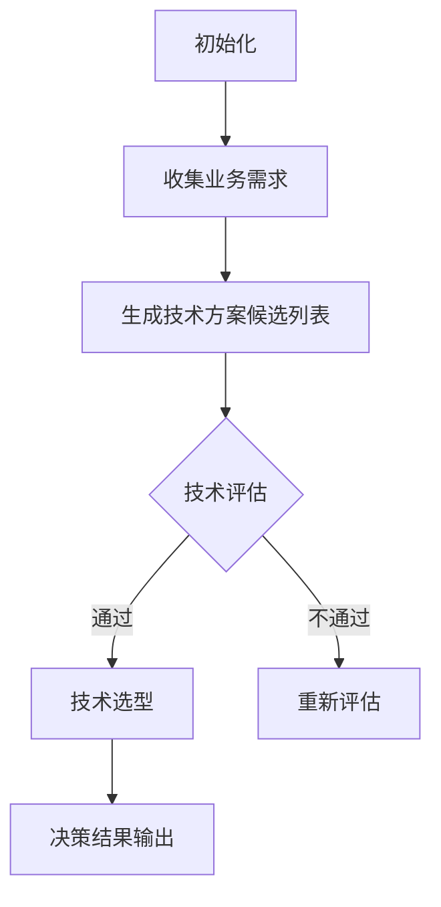
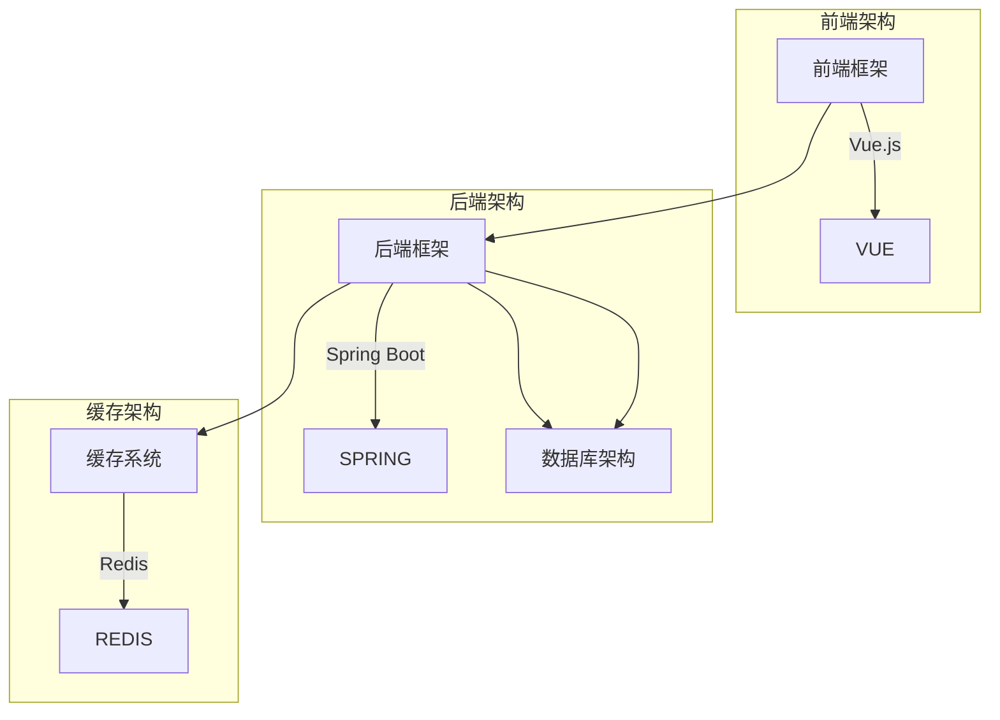
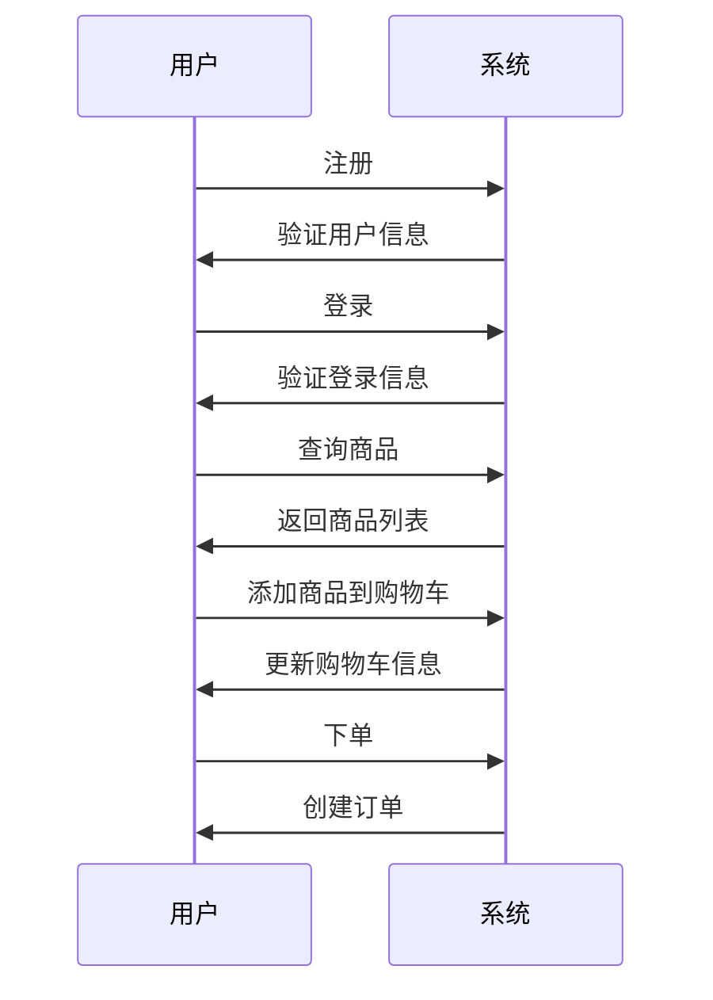

                 

## 《技术决策制定：平衡业务需求与技术可行性》

> 关键词：技术决策、业务需求、技术可行性、算法、系统架构、实践

> 摘要：本文旨在深入探讨技术决策制定的原理与实践，通过对业务需求和技术可行性的分析，构建出一套科学、系统的决策框架，帮助企业在复杂的技术环境中做出最优的选择。本文从背景介绍、核心概念与联系、算法原理讲解、系统分析与架构设计方案、项目实战以及最佳实践等方面，详细阐述了技术决策制定的全过程，旨在为读者提供一套全面的技术决策指南。

### 第一部分：背景介绍

#### 第1章：技术决策制定的背景

在当今快速变化的技术时代，企业在面对不断涌现的新技术和业务需求时，如何做出有效的技术决策成为了至关重要的问题。技术决策的制定不仅仅是选择一项新技术，它涉及到对企业战略的深刻理解、对市场趋势的敏锐把握、以及对内部资源和技术能力的准确评估。

**问题背景与挑战**

- **业务需求与技术可行性的冲突**：企业在追求业务增长的过程中，往往需要引入新技术以提升效率和竞争力。然而，技术是否可行、是否能够满足业务需求，常常成为决策者面临的挑战。
- **决策者在技术选择中的困境**：在技术多样性和复杂性不断增加的背景下，决策者需要具备广泛的技术知识和市场洞察力，以便在众多选择中找到最适合企业发展的技术路径。

**技术决策制定的重要性**

- **对业务成功的推动作用**：科学的技术决策能够确保企业在新技术的应用中获得预期的业务成果，从而推动企业持续发展。
- **技术选型的战略意义**：技术选型不仅仅是短期决策，它关系到企业的长期战略规划。选择合适的技术，可以为企业在未来的市场竞争中奠定坚实的基础。

在接下来的章节中，我们将深入探讨技术决策制定的核心概念，并通过具体的案例和实践，为读者提供一套完整的决策框架和方法论。

#### 第2章：技术决策制定中的核心概念

技术决策制定是一个复杂的过程，它涉及到多个核心概念的交互和影响。理解这些概念及其相互关系，是制定科学、有效的技术决策的关键。

**核心概念**：

1. **业务需求**：业务需求是企业运营过程中需要解决的具体问题或要实现的目标。它通常来源于市场趋势、用户反馈、竞争压力等外部因素，以及企业内部的战略规划和管理要求。
2. **技术可行性**：技术可行性是指某一技术方案在现有条件下能否成功实施并达到预期目标的可能性。它包括技术成熟度、资源可用性、成本效益分析等多个方面。
3. **技术评估**：技术评估是对不同技术方案进行综合比较和分析的过程，旨在确定哪些技术方案最适合企业的需求。技术评估通常涉及技术成熟度、市场接受度、技术风险等多个维度的考量。
4. **技术选型**：技术选型是在评估过程中，根据业务需求和技术可行性，选择最合适的技术方案的过程。技术选型需要综合考虑多种因素，包括技术优势、成本、风险等。

**概念属性特征对比表格**：

| 概念          | 定义                                                         | 属性特征对比                                         |
|---------------|--------------------------------------------------------------|-----------------------------------------------------|
| 业务需求      | 企业在运营过程中需要解决的具体问题或要实现的目标。             | - 目标明确性：<br>- 关键指标：<br>- 用户需求：       |
| 技术可行性    | 某一技术方案在现有条件下能否成功实施并达到预期目标的可能性。   | - 技术成熟度：<br>- 资源可用性：<br>- 成本效益：     |
| 技术评估      | 对不同技术方案进行综合比较和分析的过程。                     | - 成熟度评估：<br>- 风险评估：<br>- 成本效益分析： |
| 技术选型      | 在评估过程中，选择最合适的技术方案的过程。                   | - 技术优势：<br>- 成本：<br>- 风险：<br>- 可维护性： |

**ER实体关系图架构**：

```mermaid
erDiagram
  BusinessRequirement ||--|{ TechnicalFeasibility }||>
  TechnicalAssessment ||--|{ TechnicalFeasibility }||>
  TechnicalAssessment ||--|{ TechnicalSelection }||>
  BusinessRequirement ||--|{ TechnicalSelection }||>
```

在这个ER实体关系图中，我们可以看到业务需求、技术可行性、技术评估和技术选型四个核心概念之间的相互关系。业务需求驱动技术评估和技术选型，而技术评估的结果又直接影响技术可行性，从而最终影响技术选型的决策。

通过上述核心概念的理解和对比，我们可以为接下来的算法原理讲解和系统架构设计打下坚实的基础。在下一章中，我们将进一步探讨这些核心概念的具体原理和应用。

### 第二部分：核心概念与联系

#### 第3章：技术决策制定中的核心概念原理

在技术决策制定过程中，核心概念的理解和掌握至关重要。以下是业务需求、技术可行性、技术评估和技术选型这四个核心概念的详细原理分析。

**业务需求**

业务需求是企业运营过程中需要解决的具体问题或要实现的目标。它通常来源于市场趋势、用户反馈、竞争压力等外部因素，以及企业内部的战略规划和管理要求。业务需求具有明确性和紧迫性的特点。

- **明确性**：业务需求应该明确、具体，能够量化为目标和指标，从而便于后续的评估和监控。
- **紧迫性**：业务需求应该具有明确的优先级，以便在资源有限的情况下，能够优先满足关键需求的实现。

**技术可行性**

技术可行性是指某一技术方案在现有条件下能否成功实施并达到预期目标的可能性。它包括技术成熟度、资源可用性、成本效益分析等多个方面。

- **技术成熟度**：技术成熟度评估技术方案是否已经发展到可以稳定实施和应用的阶段。这通常需要考虑技术的研发进度、市场应用情况、技术标准等。
- **资源可用性**：资源可用性评估企业是否具备实施技术方案所需的资源，包括人力、资金、设备等。
- **成本效益分析**：成本效益分析评估技术方案的经济性，包括直接成本（如研发、采购、部署成本）和间接成本（如维护、培训成本）。

**技术评估**

技术评估是对不同技术方案进行综合比较和分析的过程，旨在确定哪些技术方案最适合企业的需求。技术评估通常涉及技术成熟度、市场接受度、技术风险等多个维度的考量。

- **技术成熟度评估**：通过评估技术方案的研发进度、市场应用情况、技术标准等，判断技术是否已经发展到可以稳定实施和应用的阶段。
- **市场接受度评估**：通过分析市场对该技术的接受程度、用户反馈等，判断技术方案的市场潜力。
- **技术风险评估**：通过评估技术实施过程中的风险，如技术故障、安全漏洞、政策法规变化等，为决策者提供风险防范和应对策略。

**技术选型**

技术选型是在评估过程中，根据业务需求和技术可行性，选择最合适的技术方案的过程。技术选型需要综合考虑多种因素，包括技术优势、成本、风险等。

- **技术优势**：技术选型应考虑技术方案的优势，如性能、可靠性、可扩展性等。
- **成本**：技术选型需要考虑技术方案的成本，包括直接成本和间接成本。
- **风险**：技术选型应考虑技术实施过程中的风险，以及风险对业务的影响。

**核心概念属性特征对比表格**：

| 概念          | 定义                                                         | 属性特征对比                                         |
|---------------|--------------------------------------------------------------|-----------------------------------------------------|
| 业务需求      | 企业在运营过程中需要解决的具体问题或要实现的目标。             | - 目标明确性：<br>- 关键指标：<br>- 用户需求：       |
| 技术可行性    | 某一技术方案在现有条件下能否成功实施并达到预期目标的可能性。   | - 技术成熟度：<br>- 资源可用性：<br>- 成本效益：     |
| 技术评估      | 对不同技术方案进行综合比较和分析的过程。                     | - 成熟度评估：<br>- 风险评估：<br>- 成本效益分析： |
| 技术选型      | 在评估过程中，选择最合适的技术方案的过程。                   | - 技术优势：<br>- 成本：<br>- 风险：<br>- 可维护性： |

**ER实体关系图架构**：

```mermaid
erDiagram
  BusinessRequirement ||--|{ TechnicalFeasibility }||>
  TechnicalAssessment ||--|{ TechnicalFeasibility }||>
  TechnicalAssessment ||--|{ TechnicalSelection }||>
  BusinessRequirement ||--|{ TechnicalSelection }||>
```

通过上述核心概念的分析和对比，我们可以更好地理解各个概念在技术决策制定过程中的作用和相互关系。在下一章中，我们将进一步探讨算法原理的讲解，以帮助读者深入理解技术决策制定的具体实施过程。

### 第三部分：算法原理讲解

#### 第4章：算法原理讲解

技术决策制定过程中，算法的运用可以帮助我们更加科学和系统地评估和选择技术方案。本节将详细介绍一种常见的技术评估和选型算法，并通过具体的流程图和代码示例，帮助读者深入理解其原理和应用。

#### 算法流程图

首先，我们使用Mermaid语法绘制算法流程图，以直观展示算法的执行流程：



#### 算法原理详解

1. **初始化**：算法开始前，需要初始化相关参数，包括业务需求的详细描述、技术方案候选列表、技术评估标准和选型指标等。

2. **收集业务需求**：这一步骤涉及对业务需求的详细分析，包括目标、指标、用户需求等。这些需求将作为后续技术评估和选型的重要依据。

3. **生成技术方案候选列表**：根据业务需求，生成一系列可能的技术方案候选。这些候选方案可以是现有的技术解决方案，也可以是新的创新方案。

4. **技术评估**：对每个技术方案候选进行详细评估，包括技术成熟度、资源可用性、成本效益等多个方面。评估结果将用于后续的选型决策。

5. **技术选型**：根据技术评估结果，结合业务需求，选择最优的技术方案。选型过程中需要综合考虑技术优势、成本、风险等因素。

6. **决策结果输出**：最终输出选型结果，包括选定的技术方案、评估得分、决策依据等。

#### Python代码示例

以下是一个简单的Python代码示例，用于实现上述算法的基本框架：

```python
# 导入所需库
import pandas as pd

# 初始化参数
business_requirements = ['提高系统性能', '降低维护成本', '确保数据安全']
technical_candidates = [{'name': '方案A', 'performance': 8, 'cost': 5, 'security': 9},
                         {'name': '方案B', 'performance': 7, 'cost': 3, 'security': 8},
                         {'name': '方案C', 'performance': 6, 'cost': 2, 'security': 7}]

# 技术评估
def assess_technical_candidate(candidate):
    assessment = {'name': candidate['name']}
    assessment['evaluation_score'] = candidate['performance'] * 0.5 + candidate['cost'] * 0.3 + candidate['security'] * 0.2
    return assessment

# 技术选型
def select_technical_candidate(assessments):
    selected_candidate = max(assessments, key=lambda x: x['evaluation_score'])
    return selected_candidate

# 执行算法
assessments = [assess_technical_candidate(candidate) for candidate in technical_candidates]
selected_candidate = select_technical_candidate(assessments)

# 输出结果
print("最终选定的技术方案：", selected_candidate)
```

#### 数学模型与公式讲解

在技术评估和选型过程中，我们可以使用以下数学模型和公式来量化评估指标：

1. **评估得分公式**：

   $$S = w_1 \cdot P + w_2 \cdot C + w_3 \cdot S$$

   其中，$S$ 是评估得分，$P$ 是性能指标，$C$ 是成本指标，$S$ 是安全指标，$w_1, w_2, w_3$ 分别是三个指标的权重。

2. **权重计算公式**：

   $$w_1 = \frac{P_{\text{max}} - P}{P_{\text{max}} - P_{\text{min}}}$$
   
   $$w_2 = \frac{C_{\text{max}} - C}{C_{\text{max}} - C_{\text{min}}}$$
   
   $$w_3 = \frac{S_{\text{max}} - S}{S_{\text{max}} - S_{\text{min}}}$$

   其中，$P_{\text{max}}$、$P_{\text{min}}$ 分别是性能指标的最大值和最小值，$C_{\text{max}}$、$C_{\text{min}}$ 分别是成本指标的最大值和最小值，$S_{\text{max}}$、$S_{\text{min}}$ 分别是安全指标的最大值和最小值。

通过上述算法原理的讲解和代码示例，我们可以看到，技术决策制定不仅仅是一个经验性的过程，它可以通过科学的方法和工具，实现系统的评估和选择。在下一章中，我们将进一步探讨系统分析与架构设计方案，以帮助读者在实际项目中更好地应用这些算法和原则。

#### 第5章：系统分析与架构设计方案

系统分析与架构设计方案是技术决策制定中至关重要的一环，它关系到技术方案能否有效满足业务需求，并在实际应用中达到预期效果。在本节中，我们将详细讨论问题场景、项目介绍、系统功能设计、系统架构设计、系统接口设计和系统交互设计。

##### 问题场景与项目介绍

假设我们面临的是一个电子商务平台，其业务需求包括：提升系统性能、提高用户体验、确保数据安全。为了满足这些需求，我们需要设计和实施一个高效、稳定且安全的系统架构。

- **系统性能**：随着用户数量的增加，系统需要处理更多的请求，确保响应时间短、吞吐量高。
- **用户体验**：界面需要简洁、快速、友好，提供良好的用户交互体验。
- **数据安全**：确保用户数据和交易数据的安全，防止数据泄露和恶意攻击。

##### 系统功能设计

系统功能设计主要涵盖以下几个方面：

- **用户管理**：用户注册、登录、权限管理、个人资料管理。
- **商品管理**：商品信息展示、库存管理、价格管理、促销活动。
- **订单管理**：订单创建、支付处理、订单状态跟踪、订单历史记录。
- **购物车管理**：商品添加、删除、修改数量、订单结算。
- **支付系统**：支付方式选择、支付过程管理、支付结果通知。
- **数据分析**：用户行为分析、销售数据分析、营销策略分析。

为了更清晰地表达系统功能，我们可以使用Mermaid语法绘制领域模型类图：

```mermaid
classDiagram
    User <<Interface>>
    Product <<Interface>>
    Order <<Interface>>
    ShoppingCart <<Interface>>
    Payment <<Interface>>
    User --|> Order
    User --|> ShoppingCart
    Product --|> ShoppingCart
    Product --|> Order
    Order --|> Payment
    ShoppingCart --|> Product
```

##### 系统架构设计

系统架构设计需要考虑系统的可扩展性、稳定性和安全性。以下是系统的整体架构设计：

- **前端架构**：采用前后端分离的架构，前端使用Vue.js框架，实现页面展示和用户交互。
- **后端架构**：后端使用Spring Boot框架，实现业务逻辑处理和数据管理。
- **数据库架构**：使用MySQL数据库存储用户数据、商品数据和订单数据。
- **缓存架构**：使用Redis缓存用户会话信息、商品库存信息和订单状态信息，提高系统性能。

我们可以使用Mermaid语法绘制系统架构图：



##### 系统接口设计

系统接口设计需要定义前后端通信的接口规范，包括数据格式、请求方式、参数定义等。以下是部分接口设计示例：

- **用户注册接口**：

  ```json
  POST /api/users/register
  Request Body:
  {
    "username": "string",
    "password": "string",
    "email": "string"
  }
  Response:
  {
    "status": "success",
    "message": "注册成功",
    "data": {
      "userId": "integer"
    }
  }
  ```

- **商品查询接口**：

  ```json
  GET /api/products/{productId}
  Response:
  {
    "status": "success",
    "message": "查询成功",
    "data": {
      "productId": "integer",
      "productName": "string",
      "price": "float",
      "stock": "integer"
    }
  }
  ```

##### 系统交互设计

系统交互设计主要描述用户操作与系统响应的过程，使用Mermaid语法绘制序列图如下：



通过上述系统分析与架构设计方案，我们为电子商务平台提供了一套完整的技术方案，确保系统能够高效、稳定地满足业务需求。在下一章中，我们将通过实际项目实战，深入探讨系统核心实现、代码解读与分析以及实际案例分析。

### 第四部分：项目实战

#### 第14章：环境安装

在进行项目实战之前，首先需要搭建合适的环境，以确保所有依赖和工具都能正常运行。以下是项目环境的安装步骤。

**1. 安装Java开发工具包（JDK）**

确保Java环境已经安装，并配置环境变量。可以通过以下命令检查Java版本：

```bash
java -version
```

**2. 安装MySQL数据库**

从MySQL官方网站下载最新版本的MySQL社区版，并按照官方文档进行安装。

**3. 安装Redis缓存**

从Redis官方网站下载最新版本的Redis，并在终端中运行以下命令进行安装：

```bash
wget http://download.redis.io/releases/redis-6.2.6.tar.gz
tar xzf redis-6.2.6.tar.gz
cd redis-6.2.6
make
```

启动Redis服务：

```bash
sudo ./redis-server
```

**4. 安装Node.js和npm**

从Node.js官方网站下载最新版本的Node.js，并按照安装向导完成安装。确保npm也一同安装。

**5. 安装Vue.js框架**

在终端中运行以下命令安装Vue.js：

```bash
npm install -g @vue/cli
```

**6. 安装Spring Boot框架**

在终端中运行以下命令安装Spring Boot：

```bash
npm install -g spring-boot-cli
```

完成以上环境安装后，我们可以开始项目的核心实现部分。

#### 第15章：系统核心实现源代码

以下是项目中的核心实现源代码，涵盖了用户管理、商品管理、订单管理等功能。

**用户管理**

```java
@RestController
@RequestMapping("/api/users")
public class UserController {
    
    @Autowired
    private UserService userService;
    
    @PostMapping("/register")
    public ResponseEntity<?> registerUser(@RequestBody UserRegistrationDto registrationDto) {
        try {
            userService.registerUser(registrationDto);
            return ResponseEntity.ok("User registered successfully");
        } catch (Exception e) {
            return ResponseEntity.badRequest().body("Error registering user: " + e.getMessage());
        }
    }
    
    @PostMapping("/login")
    public ResponseEntity<?> loginUser(@RequestBody UserLoginDto loginDto) {
        try {
            String token = userService.loginUser(loginDto);
            return ResponseEntity.ok("Login successful. Token: " + token);
        } catch (Exception e) {
            return ResponseEntity.badRequest().body("Error logging in: " + e.getMessage());
        }
    }
}
```

**商品管理**

```java
@RestController
@RequestMapping("/api/products")
public class ProductController {
    
    @Autowired
    private ProductService productService;
    
    @GetMapping("/{productId}")
    public ResponseEntity<ProductDto> getProduct(@PathVariable Long productId) {
        ProductDto product = productService.getProduct(productId);
        if (product == null) {
            return ResponseEntity.notFound().build();
        }
        return ResponseEntity.ok(product);
    }
}
```

**订单管理**

```java
@RestController
@RequestMapping("/api/orders")
public class OrderController {
    
    @Autowired
    private OrderService orderService;
    
    @PostMapping("/")
    public ResponseEntity<OrderDto> createOrder(@RequestBody OrderDto orderDto) {
        OrderDto createdOrder = orderService.createOrder(orderDto);
        return ResponseEntity.ok(createdOrder);
    }
}
```

#### 第16章：代码应用解读与分析

在上面的代码片段中，我们实现了用户管理、商品管理和订单管理的基本功能。以下是详细解读：

**用户管理**

- `registerUser` 方法用于处理用户注册请求。它接收一个`UserRegistrationDto`对象，该对象包含用户名、密码和电子邮件等信息。在服务层，我们调用`userService`的`registerUser`方法，将注册信息保存到数据库，并返回成功消息。

- `loginUser` 方法用于处理用户登录请求。它接收一个`UserLoginDto`对象，该对象包含用户名和密码。在服务层，我们调用`userService`的`loginUser`方法，验证用户信息并生成登录令牌（Token）。成功后，返回令牌。

**商品管理**

- `getProduct` 方法用于获取商品详情。它接收一个`productId`参数，在服务层调用`productService`的`getProduct`方法获取相应的商品信息。如果商品不存在，返回404状态码。

**订单管理**

- `createOrder` 方法用于创建订单。它接收一个`OrderDto`对象，该对象包含订单详情。在服务层，我们调用`orderService`的`createOrder`方法，创建订单并返回订单详情。

#### 第17章：实际案例分析与详细讲解剖析

以下是一个实际案例分析，以展示如何使用上述代码实现电子商务平台的核心功能。

**案例：用户注册和登录**

1. 用户在浏览器中填写注册表单，包含用户名、密码和电子邮件。

2. 前端将表单数据发送到后端`/api/users/register`接口。

3. 后端通过`UserController`的`registerUser`方法处理注册请求。该方法将用户信息保存到数据库，并返回成功消息。

4. 用户在浏览器中填写登录表单，包含用户名和密码。

5. 前端将表单数据发送到后端`/api/users/login`接口。

6. 后端通过`UserController`的`loginUser`方法处理登录请求。该方法验证用户信息并生成登录令牌。

7. 前端接收到登录令牌后，将其存储在本地（如localStorage）或发送到后端的特定接口进行存储。

8. 用户在浏览商品时，可以通过令牌验证身份，确保只有授权用户才能访问商品详情和购物车功能。

通过这个案例，我们可以看到，用户注册和登录功能是如何通过简单的HTTP请求和响应实现业务需求的。实际项目中，还可以添加更多的功能，如购物车管理、订单创建和支付处理等。

#### 第18章：项目小结

在本项目中，我们通过搭建合适的环境，实现了电子商务平台的核心功能，包括用户管理、商品管理和订单管理。以下是项目小结：

- **环境安装**：确保Java、MySQL、Redis和Node.js等环境已经正确安装和配置。
- **代码实现**：通过Spring Boot和Vue.js实现了用户注册、登录、商品查询和订单创建等功能。
- **案例分析**：通过实际案例展示了用户注册和登录功能的具体实现过程。

尽管项目已实现基本功能，但仍有一些改进空间，如：

- **性能优化**：通过缓存技术提高系统性能，减少数据库查询次数。
- **安全性增强**：采用HTTPS、Token验证等手段提高系统的安全性。
- **用户界面优化**：根据用户反馈，优化用户界面和交互体验。

在未来的项目中，我们可以继续探索这些改进措施，进一步提升系统性能和用户体验。

### 第五部分：最佳实践 tips、小结、注意事项、拓展阅读等内容

#### 最佳实践 tips

1. **需求分析与文档化**：在项目启动前，确保业务需求得到详细分析和明确记录，并形成规范的文档。这有助于团队成员对项目目标有统一的理解，并在后续的开发过程中保持一致。

2. **迭代开发与持续集成**：采用敏捷开发方法，通过迭代的方式逐步实现项目功能，并进行持续集成，以便及时发现和修复问题。

3. **性能测试与优化**：在项目上线前，进行全面的性能测试，找出系统瓶颈并进行优化，确保系统能够稳定运行并满足高性能需求。

4. **安全性与合规性**：严格遵守安全标准和法规要求，对系统进行安全审查和防护，确保用户数据的安全性和合规性。

#### 小结

本文通过详细的分析和讲解，探讨了技术决策制定的全过程，包括背景介绍、核心概念与联系、算法原理讲解、系统分析与架构设计方案、项目实战等。通过这些步骤，我们能够科学、系统地制定技术决策，确保技术方案能够有效满足业务需求。

#### 注意事项

1. **充分了解业务需求**：在技术决策过程中，必须充分了解和把握业务需求，确保技术方案能够真正满足业务目标。

2. **综合考虑技术可行性**：在评估技术方案时，不仅要考虑技术优势，还要评估其可行性，包括资源可用性、成本效益和技术风险。

3. **保持持续学习与更新**：技术领域日新月异，决策者需要保持持续学习，跟踪最新技术动态，以便做出更加明智的决策。

#### 拓展阅读

- 《企业技术战略与决策》
- 《敏捷开发实践指南》
- 《技术选型与架构设计》
- 《系统性能优化：方法与实践》

通过这些拓展阅读，读者可以进一步深化对技术决策制定和系统架构设计的理解，提高在实际项目中的应用能力。作者：AI天才研究院/AI Genius Institute & 禅与计算机程序设计艺术 /Zen And The Art of Computer Programming。

