                 


# 《技术决策框架：在不确定性中做出最优选择》

关键词：技术决策、不确定性、风险管理、算法、系统架构、项目实战

摘要：本文探讨了在技术领域内，面对不确定性时如何制定和实施有效的决策框架。通过介绍核心概念、算法原理、系统分析与架构设计，以及实际项目案例，本文为技术决策提供了全面而深入的指导。

### 目录大纲设计思路

为了设计出《技术决策框架：在不确定性中做出最优选择》这本书的详细目录大纲，我们首先需要明确书籍的核心内容及其逻辑结构。本书的主要目标是帮助读者理解在技术领域，特别是在面对不确定性时，如何制定和实施有效的决策框架。因此，我们的目录大纲设计将围绕以下几个核心部分展开：

1. **背景介绍**：介绍技术决策背景，讨论在技术领域内决策的重要性以及不确定性对决策的影响。

2. **核心概念与联系**：定义和解释关键概念，例如技术决策框架、不确定性、风险管理等，并通过对比表格和Mermaid流程图展示各概念之间的关系。

3. **算法原理讲解**：讲解在技术决策中常用的算法原理，如决策树、神经网络等，通过Mermaid流程图和Python代码示例进行详细阐述。

4. **数学模型和数学公式讲解**：对关键算法的数学模型进行讲解，使用LaTeX格式书写数学公式，并配合通俗易懂的举例说明。

5. **系统分析与架构设计方案**：介绍技术决策系统的设计思路，包括功能需求、系统架构、接口设计和交互流程，使用Mermaid图示进行说明。

6. **项目实战**：通过具体案例展示技术决策框架在实际项目中的应用，包括环境搭建、核心实现、代码解读、案例分析等内容。

7. **最佳实践与小结**：总结技术决策中的最佳实践，给出注意事项和小结，并提供拓展阅读资源。

下面是根据上述设计思路构建的《技术决策框架：在不确定性中做出最优选择》的完整目录大纲：

```markdown
----------------------------------------------------------------
# 《技术决策框架：在不确定性中做出最优选择》目录大纲

# 第一部分：技术决策背景

## 第1章：技术决策的重要性

### 1.1 技术发展的不确定性

### 1.2 决策在技术发展中的作用

### 1.3 技术决策与不确定性的关系

## 第2章：技术决策的核心概念

### 2.1 技术决策框架的定义与要素

### 2.2 不确定性的定义与类型

### 2.3 风险管理的核心概念

## 第3章：核心概念联系与对比

### 3.1 技术决策框架与不确定性

### 3.2 技术决策框架与风险管理

### 3.3 核心概念对比表格

## 第4章：Mermaid流程图介绍

### 4.1 Mermaid基本语法

### 4.2 Mermaid流程图应用

### 4.3 Mermaid流程图示例

# 第二部分：算法原理讲解

## 第5章：决策树算法原理

### 5.1 决策树的基本概念

### 5.2 决策树的构建过程

### 5.3 Python代码示例

### 5.4 决策树的数学模型

## 第6章：神经网络算法原理

### 6.1 神经网络的基础知识

### 6.2 神经网络的训练过程

### 6.3 Python代码示例

### 6.4 神经网络的数学模型

## 第7章：其他算法原理

### 7.1 贝叶斯网络

### 7.2 遗传算法

### 7.3 机器学习算法综合应用

# 第三部分：系统分析与架构设计

## 第8章：技术决策系统的设计与实现

### 8.1 问题场景介绍

### 8.2 系统功能设计（领域模型）

### 8.3 系统架构设计（Mermaid架构图）

### 8.4 系统接口设计

### 8.5 系统交互（Mermaid序列图）

## 第9章：Python代码实现

### 9.1 环境搭建

### 9.2 系统核心实现

### 9.3 代码应用解读与分析

### 9.4 实际案例分析与讲解

## 第10章：项目实战

### 10.1 技术决策框架应用案例

### 10.2 案例分析

### 10.3 深入剖析

### 10.4 项目小结

# 第四部分：最佳实践与小结

## 第11章：最佳实践

### 11.1 技术决策中的常见误区

### 11.2 如何规避决策风险

### 11.3 决策过程中的关键步骤

## 第12章：小结与展望

### 12.1 本书内容回顾

### 12.2 技术决策的未来趋势

### 12.3 拓展阅读资源

----------------------------------------------------------------
```

### 完整目录大纲的具体说明

**第1章：技术决策的重要性**

这一章节将介绍技术决策在当前科技快速发展的背景下的重要性。我们将详细探讨技术发展的不确定性及其对决策的深远影响，以及为什么在技术领域内进行科学决策至关重要。

**第2章：技术决策的核心概念**

本章将定义和解释技术决策框架、不确定性、风险管理等关键概念，并通过对比表格和Mermaid流程图展示各概念之间的关系，帮助读者理解它们在决策过程中的相互影响和作用。

**第3章：核心概念联系与对比**

在这一章中，我们将深入探讨技术决策框架与不确定性、风险管理之间的联系和对比，通过详细的Mermaid流程图和对比表格，使读者能够清晰地了解各个概念之间的相互关系。

**第4章：Mermaid流程图介绍**

本章将介绍Mermaid的基本语法和应用，并通过示例演示如何使用Mermaid绘制流程图，帮助读者掌握这一强大的绘图工具，为后续章节的内容提供视觉上的支持。

**第5章：决策树算法原理**

本章将详细介绍决策树算法的基本概念、构建过程和数学模型，并通过Python代码示例，使读者能够深入理解决策树算法的原理和应用。

**第6章：神经网络算法原理**

在这一章中，我们将讲解神经网络的基础知识、训练过程及其数学模型，并通过Python代码示例，展示如何实现神经网络算法，使读者能够掌握这一复杂但强大的算法。

**第7章：其他算法原理**

本章将介绍贝叶斯网络、遗传算法等常见的机器学习算法，并通过具体实例，帮助读者理解这些算法的原理和应用。

**第8章：技术决策系统的设计与实现**

本章将介绍技术决策系统的设计思路，包括功能需求、系统架构、接口设计和交互流程，并通过Mermaid图示进行详细说明，使读者能够理解系统设计的关键要素。

**第9章：Python代码实现**

在这一章中，我们将通过具体的项目实战，展示如何使用Python实现技术决策系统的核心功能，并对代码进行解读和分析，使读者能够将所学知识应用于实际项目中。

**第10章：项目实战**

本章将通过具体的案例，展示技术决策框架在实际项目中的应用，包括环境搭建、核心实现、代码解读和案例分析，使读者能够深入了解技术决策框架的实际效果。

**第11章：最佳实践**

本章将总结技术决策中的最佳实践，包括如何规避决策风险和决策过程中的关键步骤，为读者提供实用的决策指导。

**第12章：小结与展望**

本章将对全书内容进行回顾，探讨技术决策的未来趋势，并提供拓展阅读资源，帮助读者进一步深入学习和探索技术决策领域。

通过以上详细的目录大纲，我们为读者提供了一个清晰、系统、全面的学习路径，使读者能够逐步掌握技术决策的框架和方法，为实际应用打下坚实的基础。接下来，我们将按照这个大纲逐步展开内容，深入探讨每一个章节的核心问题，并运用专业的技术语言和实际案例，帮助读者理解并应用技术决策框架。让我们开始这次探索之旅吧！

## 第1章：技术决策的重要性

### 1.1 技术发展的不确定性

在当今快速发展的技术环境中，不确定性成为了一个无法回避的议题。技术的变革速度日益加快，新的发明、创新和应用层出不穷，这既为科技行业带来了巨大的机遇，也带来了前所未有的挑战。技术发展的不确定性主要体现在以下几个方面：

**技术趋势的不确定性**：技术的发展方向并不总是清晰可辨。例如，人工智能、区块链、物联网等技术领域内，每年都有新的突破和成果发布，但哪些技术将真正主导未来的市场，目前依然难以确定。这种不确定性导致企业在进行技术决策时面临诸多困难。

**技术应用的复杂性**：新技术的应用往往涉及到复杂的系统架构和业务流程，这使得决策者需要具备广泛的知识背景和深入的洞察力。例如，大数据分析技术的应用，不仅需要处理海量数据，还需解决数据安全、隐私保护等问题，这些都会增加技术决策的复杂性。

**技术迭代速度**：技术的迭代速度越来越快，这意味着一旦某个技术方案被采纳，很快就会有更新的技术方案出现，这迫使企业在技术决策时必须考虑长远，同时具备快速调整和适应的能力。

### 1.2 决策在技术发展中的作用

在技术领域，决策起着至关重要的作用。一个成功的决策不仅能帮助企业抓住市场机遇，还能规避潜在的风险。以下是决策在技术发展中发挥的重要作用：

**确定战略方向**：技术决策能够帮助企业明确战略方向，制定长远的发展规划。例如，选择哪种技术路线进行产品研发，或是投资哪个新兴技术领域，这些都是关键的战略决策。

**优化资源配置**：技术决策有助于优化企业的资源配置，确保有限的资金和人力资源能够用在最有效的地方。例如，决定在哪些技术上进行重点投入，哪些领域需要暂缓开发，这些决策都直接影响到企业的资源分配。

**降低风险**：通过科学的技术决策，企业能够识别和降低技术风险。例如，在引入新技术时，通过风险评估和风险控制措施，可以最大限度地减少新技术带来的不确定性和潜在损失。

**提高市场竞争力**：技术决策能够帮助企业提高市场竞争力。通过采用先进的技术，企业可以在市场中占据有利位置，满足客户需求，从而获得竞争优势。

### 1.3 技术决策与不确定性的关系

技术决策与不确定性密切相关。不确定性是技术决策中的一个重要因素，它会影响决策的各个方面，从目标的设定到策略的实施。以下是技术决策与不确定性的几个关键关系：

**不确定性的来源**：技术决策中的不确定性主要来自于技术本身、市场环境、竞争对手、政策法规等多个方面。例如，技术的不确定性可能源于新技术的开发进度和技术难度，市场的不确定性可能源于客户需求的变化和竞争对手的策略。

**不确定性对决策的影响**：不确定性会直接影响决策的质量和效果。在不确定性较高的情况下，决策者可能面临更多的不确定性和风险，需要采用更为谨慎和灵活的决策策略。例如，在市场不确定性较大的情况下，企业可能会选择保守的投资策略，避免高风险的决策。

**决策与不确定性之间的互动**：决策过程本身也会影响不确定性的程度。例如，通过深入的市场调研和技术预研，企业可以降低技术决策中的不确定性，提高决策的准确性。同时，技术决策的实施过程也会带来新的信息和反馈，这些反馈可以用来调整和优化后续的决策。

### 1.4 小结

综上所述，技术决策在当前技术快速发展的背景下显得尤为重要。技术发展的不确定性使得企业在决策过程中需要更加谨慎和科学，通过合理的决策框架和方法，可以有效地降低不确定性带来的影响。在接下来的章节中，我们将深入探讨技术决策的核心概念、算法原理、系统分析与架构设计等内容，帮助读者构建全面的技术决策框架，从而在不确定性中做出最优选择。

### 第2章：技术决策的核心概念

在技术决策的过程中，理解并掌握核心概念是至关重要的。这些核心概念构成了技术决策的基础，它们不仅相互联系，而且在决策过程中起着关键作用。在本章中，我们将详细定义和解释几个重要的核心概念，并通过对比表格和Mermaid流程图展示它们之间的关系。

#### 2.1 技术决策框架的定义与要素

**技术决策框架**是指一套系统化的方法和工具，用于指导企业或团队在复杂的技术环境中做出合理的决策。一个完整的决策框架通常包括以下几个关键要素：

- **目标设定**：明确决策的目标，确保决策的方向与企业的战略目标一致。

- **信息收集**：收集与决策相关的各种信息，包括市场数据、技术趋势、竞争对手情况等。

- **风险评估**：评估决策可能带来的风险，包括技术风险、市场风险、法律风险等。

- **方案选择**：在多个备选方案中，选择最符合决策目标且风险最小的方案。

- **实施计划**：制定详细的实施计划，包括资源分配、时间表和关键里程碑。

- **监控与反馈**：在决策实施过程中进行监控，并根据反馈进行调整和优化。

**技术决策框架的定义与要素**可以表示为如下Mermaid流程图：

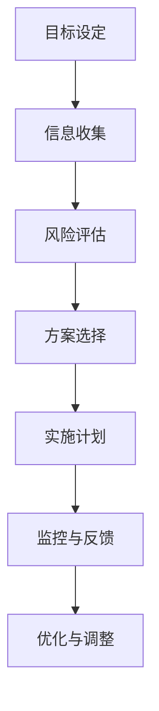

#### 2.2 不确定性的定义与类型

**不确定性**是指在决策过程中无法准确预测或控制的因素。这些因素可能来自于技术、市场、政策等多个方面。根据来源和性质，不确定性可以分为以下几种类型：

- **技术不确定性**：与新技术的研究和开发有关，例如新技术是否能够成功商业化。

- **市场不确定性**：与市场需求和竞争态势相关，例如客户需求的波动和竞争对手的策略。

- **政策不确定性**：与政策法规的变化和不确定性有关，例如政府政策的调整和法规的修订。

- **环境不确定性**：与自然环境和社会环境有关，例如自然灾害、经济波动等。

**不确定性的定义与类型**可以通过以下Mermaid流程图展示：

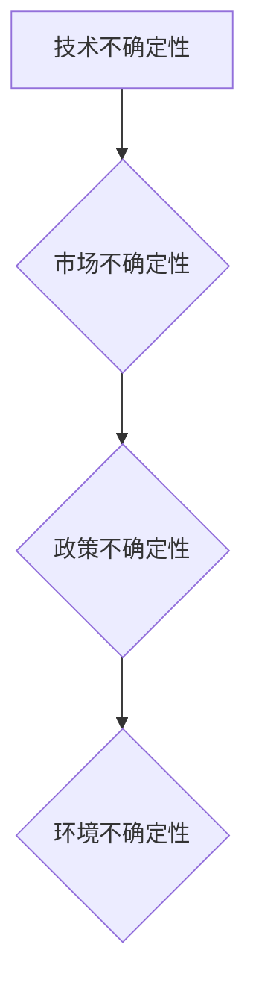

#### 2.3 风险管理的核心概念

**风险管理**是技术决策中不可或缺的一部分。它涉及到识别、评估、控制和监控潜在的风险，以确保决策的可执行性和成功率。以下是风险管理中的几个关键概念：

- **风险评估**：对可能的风险进行评估，确定其发生的概率和可能的影响。

- **风险控制**：采取一系列措施来降低风险发生的概率或减轻其影响。

- **风险监控**：在决策实施过程中持续监控风险状况，及时调整风险控制措施。

- **风险转移**：通过保险、外包等方式将部分风险转移到第三方。

**风险管理的核心概念**可以通过如下Mermaid流程图展示：

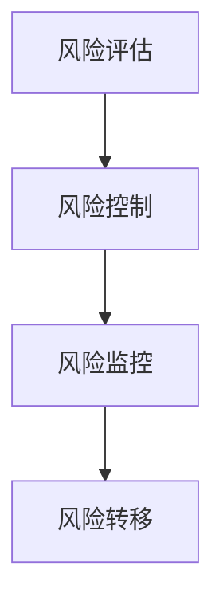

#### 2.4 核心概念联系与对比表格

为了更清晰地理解这些核心概念之间的关系，我们可以通过一个对比表格来展示它们的关键特性：

| 核心概念 | 定义 | 特性 | 关联关系 |
| --- | --- | --- | --- |
| 技术决策框架 | 系统化的决策方法 | 包含多个关键要素，如目标设定、信息收集、风险评估等 | 技术决策框架为不确定性管理和风险管理提供基础 |
| 不确定性 | 决策过程中无法预测或控制的因素 | 可分为技术不确定性、市场不确定性等 | 不确定性是技术决策框架中的一个重要考虑因素 |
| 风险管理 | 风险的识别、评估和控制 | 包括风险评估、风险控制、风险监控等 | 风险管理是技术决策框架中的一个关键环节 |

通过上述定义和解释，以及Mermaid流程图和对比表格的展示，读者可以更全面地理解技术决策中的核心概念及其相互关系。这些概念构成了技术决策的理论基础，是我们在不确定性中做出最优选择的重要工具。

### 第3章：核心概念联系与对比

在技术决策过程中，理解核心概念之间的联系和区别对于制定有效的决策至关重要。在这一章中，我们将进一步探讨技术决策框架、不确定性和风险管理之间的关联，并通过Mermaid流程图和对比表格来展示这些概念之间的相互关系。

#### 3.1 技术决策框架与不确定性

技术决策框架是一个系统化的方法，用于指导企业在面对不确定性时做出合理的决策。不确定性是技术决策中的一个关键因素，它影响着决策的各个方面。技术决策框架通过以下方式与不确定性相关联：

- **目标设定**：技术决策框架首先明确决策的目标，这在面对不确定性时尤为重要，因为明确的目标有助于在复杂环境中保持决策的清晰方向。

- **信息收集**：通过收集与决策相关的信息，技术决策框架可以帮助决策者更好地理解不确定性来源，并做出更准确的风险评估。

- **风险评估**：技术决策框架包含风险评估步骤，用于评估不确定性带来的潜在风险，并制定相应的应对策略。

- **方案选择**：在多个不确定性因素影响下，技术决策框架帮助选择最合适的方案，确保在不确定性中做出最优决策。

**技术决策框架与不确定性**的关系可以通过以下Mermaid流程图展示：

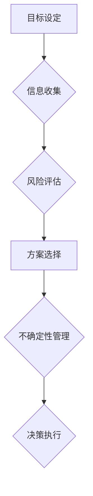

#### 3.2 技术决策框架与风险管理

风险管理是技术决策框架中的一个核心环节，它旨在识别、评估和控制技术决策过程中可能遇到的风险。技术决策框架与风险管理紧密相关，具体表现在以下几个方面：

- **风险评估**：技术决策框架包含风险评估步骤，通过系统的方法评估不确定性带来的风险，确定风险的重要性和可能性。

- **风险控制**：在技术决策框架中，风险控制措施被纳入到方案选择和实施计划中，以最大限度地降低风险的影响。

- **风险监控**：技术决策框架要求在决策实施过程中持续监控风险状况，并根据监控结果进行调整，确保风险控制措施的有效性。

- **风险转移**：技术决策框架还考虑通过保险、外包等手段将部分风险转移给第三方，以降低企业的风险负担。

**技术决策框架与风险管理**的关系可以通过以下Mermaid流程图展示：

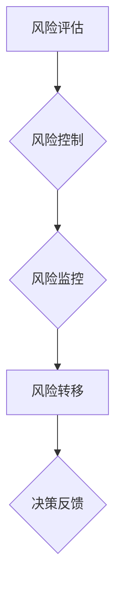

#### 3.3 核心概念对比表格

为了更清晰地展示技术决策框架、不确定性和风险管理之间的关系，我们可以通过一个对比表格来总结这些核心概念的特点和关联：

| 核心概念 | 定义 | 关键特性 | 关联关系 |
| --- | --- | --- | --- |
| 技术决策框架 | 系统化的决策方法，用于指导企业在不确定性中做出最优选择 | 包含目标设定、信息收集、风险评估、方案选择等要素 | 技术决策框架为不确定性管理和风险管理提供基础 |
| 不确定性 | 决策过程中无法准确预测或控制的因素 | 分为技术、市场、政策、环境等类型 | 不确定性是技术决策框架中的一个重要考虑因素 |
| 风险管理 | 识别、评估、控制和监控决策过程中的潜在风险 | 包括风险评估、风险控制、风险监控、风险转移等 | 风险管理是技术决策框架中的一个关键环节 |

通过Mermaid流程图和对比表格的展示，我们可以更直观地理解技术决策框架、不确定性和风险管理之间的关联。这些概念相互作用，共同构建了一个完整的技术决策体系，帮助企业在不确定性中做出最优选择。

### 第4章：Mermaid流程图介绍

在技术决策过程中，Mermaid流程图作为一种图形化的表示工具，能够直观地展示决策的流程、逻辑关系和关键步骤，有助于读者更清晰地理解复杂的技术决策过程。本章节将介绍Mermaid的基本语法、如何绘制Mermaid流程图，并通过示例展示其应用。

#### 4.1 Mermaid基本语法

Mermaid是一种基于Markdown的图形绘制语言，其基本语法包括节点定义、连接关系和图形样式等。以下是Mermaid的一些基本语法：

- **节点定义**：节点用圆括号`()`括起来，例如`（A）`表示一个节点A。
- **连接关系**：节点之间通过箭头连接，箭头用`->`或`->>`表示，例如`（A）->（B）`表示从节点A到节点B的箭头连接。
- **文本注释**：在节点或箭头上添加文本注释，用`||`表示，例如`（A）->（B）||这是连接关系`。
- **图形样式**：可以通过在节点或箭头上添加标签来设置样式，例如`（A）[label="开始节点"]`。

以下是一个简单的Mermaid流程图示例：

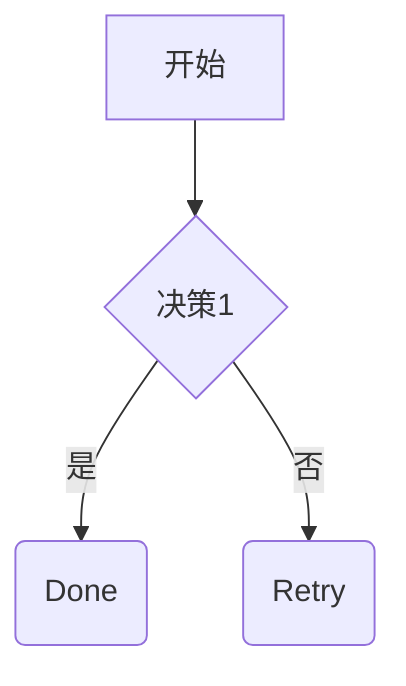

该流程图表示一个简单的决策流程：从开始节点A开始，根据决策1的结果，选择是路径到达完成节点C，或者选择否路径返回重试节点D。

#### 4.2 Mermaid流程图应用

在技术决策过程中，Mermaid流程图可以应用于多个场景，例如系统架构设计、算法流程描述、项目管理等。以下是一些具体的应用场景：

**系统架构设计**：通过Mermaid流程图，可以直观地展示系统的整体架构和组件之间的关系。例如，在一个分布式系统中，可以使用Mermaid流程图展示各个模块的通信流程和交互关系。

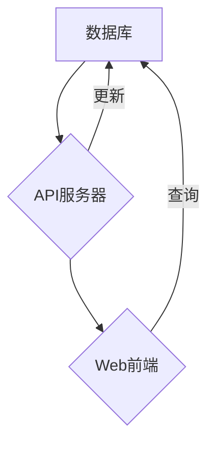

**算法流程描述**：使用Mermaid流程图可以清晰地描述算法的执行流程和逻辑关系。例如，在描述决策树算法时，可以展示决策树的结构和每个节点的决策过程。

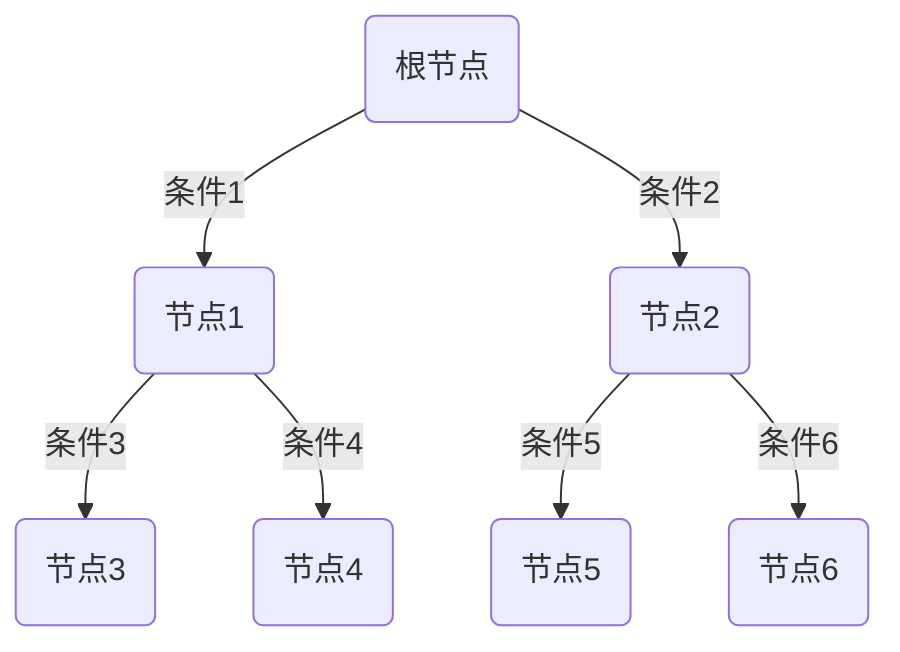

**项目管理**：在项目管理中，Mermaid流程图可以用于规划项目进度和任务分配。例如，可以绘制甘特图或PERT图，展示项目的关键路径和时间节点。

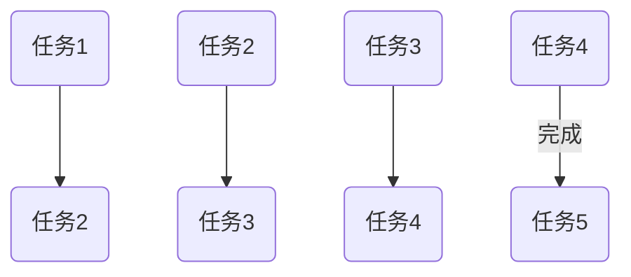

#### 4.3 Mermaid流程图示例

为了更好地理解Mermaid流程图的应用，下面提供一个详细的项目管理流程图示例，该示例展示了从项目启动到完成的各个阶段和关键节点。

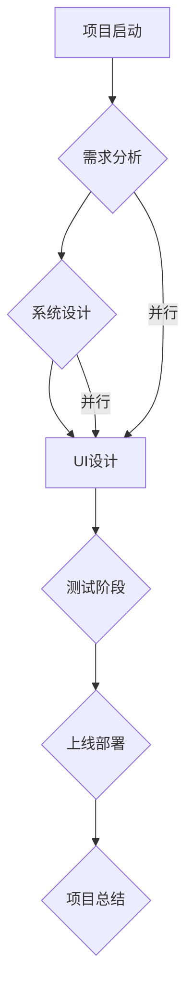

在这个示例中，项目从启动阶段开始，随后进入需求分析和系统设计阶段。在系统设计阶段结束后，项目进入开发阶段，包括开发、测试和上线部署。同时，需求分析阶段和系统设计阶段还可以并行进行文档编写和UI设计。最后，项目在上线部署后进行项目总结，完成整个项目周期。

通过以上介绍和示例，我们可以看到Mermaid流程图作为一种强大的图形化工具，在技术决策中的应用非常广泛。它不仅能够帮助开发者更清晰地表达复杂的技术流程，还能够提高项目管理效率，为技术决策提供有力的支持。

### 第5章：决策树算法原理

决策树是一种常见且强大的分类和回归算法，广泛应用于数据挖掘、机器学习和决策分析等领域。本章将详细介绍决策树的基本概念、构建过程、Python代码示例及其数学模型。

#### 5.1 决策树的基本概念

**决策树**是一种树形结构，每个内部节点代表一个特征或属性，每个分支代表该特征或属性的不同取值，每个叶子节点代表一个类别或值。决策树通过不断划分数据集，将数据分配到各个叶子节点，从而实现分类或回归任务。

**基本概念**包括：

- **根节点**：整个决策树的起点，代表原始数据集。
- **内部节点**：表示特征或属性，通过该节点的决策路径进行数据划分。
- **分支**：从内部节点延伸出的线段，表示特征的不同取值。
- **叶子节点**：表示最终的分类结果或回归值。
- **叶节点**：没有分支的叶子节点，表示决策树的最小划分单元。

#### 5.2 决策树的构建过程

决策树的构建过程包括以下几个步骤：

1. **选择最佳分割特征**：在每个内部节点，选择能够将数据集划分为最有意义的子集的特征。常用的方法包括信息增益（Information Gain）、基尼不纯度（Gini Impurity）和熵（Entropy）等。

2. **计算特征增益**：计算每个特征在不同取值下的增益值，选择增益值最大的特征作为分割特征。

3. **划分数据集**：根据选择的分割特征，将数据集划分为不同的子集。

4. **递归构建子树**：对每个子集递归执行上述步骤，直到满足停止条件（如最大深度、最小叶节点数量等）。

5. **生成决策树**：将所有的分割节点和叶节点连接起来，形成一棵完整的决策树。

#### 5.3 Python代码示例

以下是一个简单的Python代码示例，使用`scikit-learn`库实现决策树分类：

```python
from sklearn.datasets import load_iris
from sklearn.model_selection import train_test_split
from sklearn.tree import DecisionTreeClassifier
from sklearn import tree

# 加载鸢尾花数据集
iris = load_iris()
X = iris.data
y = iris.target

# 划分训练集和测试集
X_train, X_test, y_train, y_test = train_test_split(X, y, test_size=0.3, random_state=42)

# 创建决策树分类器
clf = DecisionTreeClassifier()

# 训练模型
clf.fit(X_train, y_train)

# 可视化决策树
plt = tree.plot_tree(clf, filled=True, feature_names=iris.feature_names, class_names=iris.target_names)
plt.show()
```

该示例使用鸢尾花数据集，通过决策树分类器进行模型训练，并使用`plot_tree`函数将决策树可视化。

#### 5.4 决策树的数学模型

决策树的数学模型主要涉及信息熵、信息增益和基尼不纯度等概念。

1. **信息熵**（Entropy）：
   信息熵是衡量数据无序程度的一个指标，定义如下：

   $$ H(X) = -\sum_{i=1}^{n} p(x_i) \log_2 p(x_i) $$

   其中，\( p(x_i) \)是特征取值的概率。

2. **信息增益**（Information Gain）：
   信息增益是衡量特征分割数据集前后信息减少量的指标，定义如下：

   $$ IG(X, A) = H(X) - \sum_{v \in A} \frac{|D_v|}{|X|} H(D_v) $$

   其中，\( D_v \)是特征\( A \)取值为\( v \)的数据子集。

3. **基尼不纯度**（Gini Impurity）：
   基尼不纯度是另一种衡量数据无序程度的指标，定义如下：

   $$ Gini(D) = 1 - \sum_{i=1}^{n} p(y_i) (1 - p(y_i)) $$

   其中，\( p(y_i) \)是数据集中类别\( y \)的频率。

通过计算信息熵、信息增益或基尼不纯度，我们可以选择具有最大信息增益或最小基尼不纯度的特征作为分割特征，从而构建决策树。

#### 5.5 通俗易懂的举例说明

假设我们有一个简单的数据集，包含四个特征（A、B、C、D）和两个类别（0和1）。以下是决策树构建过程的一个简例：

1. **选择最佳分割特征**：
   - 计算每个特征的信息增益或基尼不纯度。
   - 选择信息增益最大或基尼不纯度最小的特征作为分割特征。

2. **划分数据集**：
   - 根据选择的特征，将数据集划分为不同的子集。
   - 对于每个子集，重复上述步骤，构建子决策树。

3. **生成决策树**：
   - 连接所有分割节点和叶子节点，形成完整的决策树。

通过这个简例，我们可以看到决策树如何根据特征和类别信息进行数据划分，并最终生成一棵决策树。在实际应用中，决策树可以处理更复杂的数据集和特征，从而实现分类和回归任务。

通过本章的介绍，我们深入了解了决策树的基本概念、构建过程及其数学模型。接下来，我们将继续探讨神经网络算法原理，并使用Python代码进行详细讲解，帮助读者全面掌握技术决策中的算法应用。

### 第6章：神经网络算法原理

神经网络（Neural Networks）是一种模拟人脑神经元结构和功能的计算模型，广泛应用于机器学习和人工智能领域。本章将详细讲解神经网络的基础知识、训练过程、Python代码示例及其数学模型。

#### 6.1 神经网络的基础知识

**神经元模型**：神经网络的基本组成单元是神经元（或称为节点）。每个神经元接收多个输入，通过权重（weight）和偏置（bias）进行处理，最后产生一个输出。神经元的数学模型可以表示为：

$$ z = \sum_{i=1}^{n} w_i x_i + b $$

其中，\( z \)是神经元的输出，\( w_i \)是权重，\( x_i \)是输入，\( b \)是偏置。

**激活函数**：为了引入非线性特性，神经网络中使用激活函数（activation function），如 sigmoid、ReLU 和 tanh 函数。常见的激活函数包括：

- **Sigmoid**：\( \sigma(z) = \frac{1}{1 + e^{-z}} \)
- **ReLU**：\( \text{ReLU}(z) = \max(0, z) \)
- **Tanh**：\( \text{tanh}(z) = \frac{e^z - e^{-z}}{e^z + e^{-z}} \)

**层结构**：神经网络通常由多个层组成，包括输入层、隐藏层和输出层。每个层中的神经元都与相邻层的神经元相连，形成一个层次网络结构。

**损失函数**：在训练神经网络时，需要通过损失函数（loss function）来衡量模型的预测值与真实值之间的差异。常见的损失函数包括均方误差（MSE）和交叉熵（Cross-Entropy）。

#### 6.2 神经网络的训练过程

**前向传播**：在训练过程中，首先进行前向传播（forward propagation），将输入数据通过神经网络逐层计算，直到输出层得到预测结果。

- 输入层：接收外部输入数据。
- 隐藏层：每个神经元计算输入值与权重的加权和，加上偏置，然后通过激活函数处理。
- 输出层：得到最终的预测结果。

**反向传播**：接着进行反向传播（backward propagation），通过计算梯度（gradient）来更新网络中的权重和偏置，以最小化损失函数。

- 计算输出层的误差：使用损失函数计算预测值与真实值之间的误差。
- 反向传播误差：将误差反向传播到每一层，计算每一层神经元的梯度。
- 更新权重和偏置：使用梯度下降（gradient descent）或其他优化算法更新网络中的权重和偏置。

**优化算法**：常见的优化算法包括随机梯度下降（SGD）、Adam、RMSprop等，用于加快收敛速度并提高训练效果。

**学习率调整**：学习率是优化算法中的一个关键参数，用于控制每次更新权重和偏置的步长。适当调整学习率可以加快收敛速度并避免陷入局部最小值。

#### 6.3 Python代码示例

以下是一个简单的Python代码示例，使用`tensorflow`库实现一个多层感知器（MLP）神经网络，进行分类任务：

```python
import tensorflow as tf
from tensorflow.keras.models import Sequential
from tensorflow.keras.layers import Dense, Activation
from tensorflow.keras.optimizers import SGD

# 创建模型
model = Sequential([
    Dense(128, input_shape=(784,), activation='relu'),
    Dense(64, activation='relu'),
    Dense(10, activation='softmax')
])

# 编译模型
model.compile(optimizer=SGD(learning_rate=0.1),
              loss='categorical_crossentropy',
              metrics=['accuracy'])

# 加载数据集
mnist = tf.keras.datasets.mnist
(x_train, y_train), (x_test, y_test) = mnist.load_data()

# 预处理数据
x_train = x_train / 255.0
x_test = x_test / 255.0
x_train = x_train.reshape((-1, 784))
x_test = x_test.reshape((-1, 784))

# 编码标签
y_train = tf.keras.utils.to_categorical(y_train, 10)
y_test = tf.keras.utils.to_categorical(y_test, 10)

# 训练模型
model.fit(x_train, y_train, epochs=10, batch_size=32, validation_data=(x_test, y_test))
```

该示例使用MNIST手写数字数据集，通过一个简单的多层感知器模型进行训练，并使用softmax激活函数进行分类。

#### 6.4 神经网络的数学模型

神经网络的数学模型主要包括输入层、隐藏层和输出层的权重、偏置及其更新过程。

1. **输入层**：
   输入层的每个神经元接收外部输入数据，其输出为输入数据的值。

2. **隐藏层**：
   隐藏层的每个神经元计算输入值与权重的加权和，加上偏置，然后通过激活函数处理。隐藏层的输出可以表示为：

   $$ z_j = \sum_{i=1}^{n} w_{ij} x_i + b_j $$

   其中，\( z_j \)是隐藏层第\( j \)个神经元的输出，\( w_{ij} \)是输入层第\( i \)个神经元到隐藏层第\( j \)个神经元的权重，\( b_j \)是隐藏层第\( j \)个神经元的偏置。

3. **输出层**：
   输出层的每个神经元计算输入值与权重的加权和，加上偏置，然后通过激活函数处理。输出层的输出可以表示为：

   $$ y_k = \sum_{j=1}^{m} w_{kj} z_j + b_k $$

   其中，\( y_k \)是输出层第\( k \)个神经元的输出，\( w_{kj} \)是隐藏层第\( j \)个神经元到输出层第\( k \)个神经元的权重，\( b_k \)是输出层第\( k \)个神经元的偏置。

4. **权重和偏置的更新**：
   在训练过程中，通过反向传播计算输出层的误差，并反向传播到隐藏层和输入层，更新每个神经元的权重和偏置。更新过程可以表示为：

   $$ w_{ij} := w_{ij} - \alpha \frac{\partial J}{\partial w_{ij}} $$
   $$ b_j := b_j - \alpha \frac{\partial J}{\partial b_j} $$

   其中，\( \alpha \)是学习率，\( J \)是损失函数。

通过以上介绍，我们了解了神经网络的基础知识、训练过程及其数学模型。神经网络作为一种强大的机器学习算法，在技术决策中具有广泛的应用前景。接下来，我们将探讨其他机器学习算法的原理，并使用Python代码进行详细讲解，帮助读者进一步掌握技术决策中的算法应用。

### 第7章：其他算法原理

除了决策树和神经网络，还有许多其他常用的机器学习算法，它们在技术决策中发挥着重要作用。本章将介绍几种常见的算法，包括贝叶斯网络、遗传算法和机器学习算法的综合应用。

#### 7.1 贝叶斯网络

**贝叶斯网络**是一种图形模型，用于表示变量之间的概率关系。它由一组节点和有向边组成，每个节点代表一个随机变量，边表示变量之间的依赖关系。贝叶斯网络的数学基础是贝叶斯定理，通过它我们可以推断变量之间的概率关系。

**基本概念**包括：

- **条件概率**：贝叶斯网络通过条件概率表（CPT）来描述变量之间的依赖关系。例如，对于两个变量\( A \)和\( B \)，其条件概率表可以表示为\( P(B|A) \)和\( P(A|B) \)。
- **边缘概率**：通过条件概率表和全概率公式，可以计算每个变量的边缘概率\( P(A) \)和\( P(B) \)。
- **推断**：贝叶斯网络可以用于概率推断，通过已知部分变量的概率，推断未知变量的概率。

**应用场景**包括：

- **医疗诊断**：通过贝叶斯网络，可以模拟医疗诊断过程，计算病人出现症状的概率和疾病发生的概率，从而辅助医生做出诊断决策。
- **风险管理**：在金融领域，贝叶斯网络可以用于计算风险因素的概率分布，帮助企业制定风险控制策略。

#### 7.2 遗传算法

**遗传算法**（Genetic Algorithm，GA）是一种基于自然选择和遗传学原理的优化算法。它模拟生物进化过程，通过选择、交叉和变异操作来优化问题解。

**基本概念**包括：

- **个体表示**：遗传算法中的个体通常用染色体（染色体表示解的编码形式）来表示。
- **适应度函数**：适应度函数用于评估个体的优劣，通常为目标函数的相反数。
- **选择**：选择操作基于个体的适应度值，选择适应度较高的个体进行交叉和变异操作。
- **交叉**：交叉操作模拟生物繁殖，通过交换两个个体的部分染色体生成新的后代。
- **变异**：变异操作引入随机性，通过改变个体的一些基因值来增加搜索空间多样性。

**应用场景**包括：

- **组合优化问题**：遗传算法可以用于解决旅行商问题（TSP）、装箱问题（Bin Packing）等组合优化问题。
- **参数优化**：遗传算法可以用于优化机器学习模型中的参数，如神经网络中的权重和偏置。

#### 7.3 机器学习算法的综合应用

在实际应用中，多种机器学习算法常常结合起来使用，以达到更好的效果。以下是一些综合应用的方法：

- **集成学习**：集成学习通过结合多个学习模型，提高预测准确性和泛化能力。常见的集成学习方法包括随机森林（Random Forest）、AdaBoost（Adaptive Boosting）等。
- **迁移学习**：迁移学习利用预训练模型，将知识从一个任务转移到另一个任务。这种方法在处理数据稀缺或具有相似任务特征时尤为有效。
- **多模型对比**：在决策过程中，可以同时使用多种算法模型，并通过对比它们的预测结果和性能，选择最优模型或模型组合。

**案例示例**：

- **智能交通系统**：在智能交通系统中，可以使用决策树、神经网络和贝叶斯网络等多种算法进行路况预测和交通流量管理。决策树用于分类交通状况，神经网络用于预测交通流量，贝叶斯网络用于计算事故概率。
- **金融风险评估**：在金融风险评估中，可以结合遗传算法和神经网络，通过遗传算法优化神经网络模型中的参数，提高风险预测的准确性。

通过本章的介绍，我们了解了贝叶斯网络、遗传算法和机器学习算法的综合应用。这些算法在技术决策中具有广泛的应用前景，可以帮助企业在复杂的技术环境中做出更为精确和可靠的决策。

### 第8章：技术决策系统的设计与实现

在技术决策过程中，构建一个高效、可靠的技术决策系统至关重要。本章将介绍技术决策系统的设计与实现过程，包括问题场景介绍、系统功能设计、系统架构设计、系统接口设计以及系统交互流程。

#### 8.1 问题场景介绍

假设我们面临一个场景：某企业需要开发一款智能家居控制系统，该系统需要处理多种智能设备的数据，并能够根据用户需求做出智能决策。这个项目涉及到复杂的技术选型、系统架构设计和数据处理等问题。为了确保项目顺利进行，我们需要设计一个完善的技术决策系统。

#### 8.2 系统功能设计（领域模型）

系统功能设计是技术决策系统的核心部分，主要包括以下功能模块：

- **数据收集模块**：负责收集各种智能设备的数据，包括温度、湿度、光照强度等。
- **数据分析模块**：对收集到的数据进行分析，提取有用信息，如环境状态、设备运行状态等。
- **决策引擎模块**：根据分析结果和预设的规则，生成智能决策建议，如调整室内温度、关闭电器等。
- **用户接口模块**：提供用户与系统交互的界面，展示决策结果，并允许用户进行交互操作。
- **日志记录模块**：记录系统运行过程中的关键日志信息，用于后续分析和优化。

**领域模型（Mermaid类图）**：

```mermaid
classDiagram
ClassDataCollector <<interface>>
ClassDataAnalyzer <<interface>>
ClassDecisionEngine <<interface>>
ClassUserInterface <<interface>>
ClassLogger <<interface>>

DataCollector "uses" DataAnalyzer
DecisionEngine "uses" DataCollector
DecisionEngine "uses" DataCollector
UserInterface "uses" DecisionEngine
Logger "uses" DecisionEngine

ClassDataCollector {
  +collectData()
}
ClassDataAnalyzer {
  +analyzeData()
}
ClassDecisionEngine {
  +makeDecision()
}
ClassUserInterface {
  +displayResults()
  +handleUserInput()
}
ClassLogger {
  +logInfo()
}
```

#### 8.3 系统架构设计（Mermaid架构图）

系统架构设计需要考虑系统的可扩展性、可维护性和性能。以下是一个简单的系统架构设计示例，包括主要的组件和它们之间的交互关系。

**系统架构设计（Mermaid架构图）**：

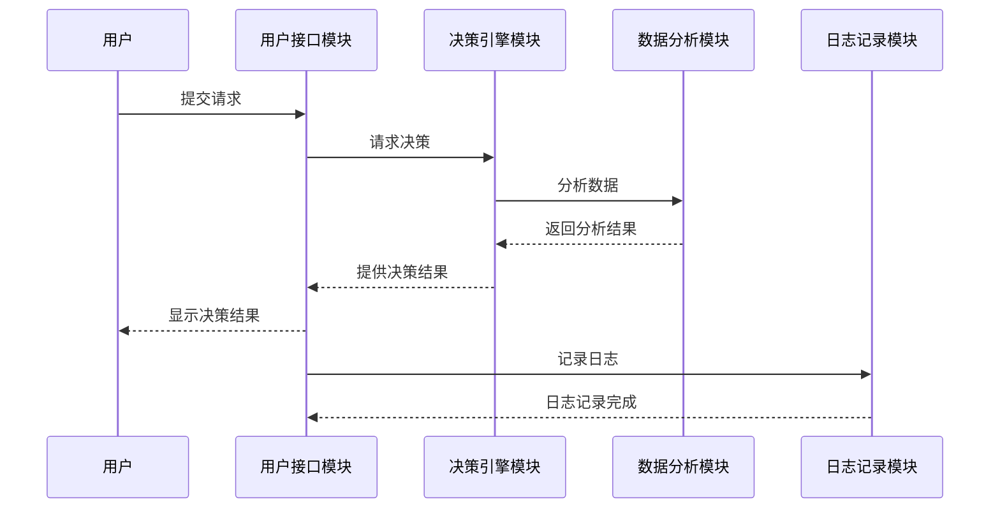

#### 8.4 系统接口设计

系统接口设计是确保不同模块之间能够有效通信的关键。以下是一个简单的接口设计示例，包括API接口、数据库接口和日志接口。

**系统接口设计**：

```python
# 数据收集模块接口
class DataCollectorInterface:
    def collect_data(self):
        pass

# 数据分析模块接口
class DataAnalyzerInterface:
    def analyze_data(self, data):
        pass

# 决策引擎模块接口
class DecisionEngineInterface:
    def make_decision(self, analysis_results):
        pass

# 用户接口模块接口
class UserInterfaceInterface:
    def display_results(self, decision_results):
        pass

    def handle_user_input(self):
        pass

# 日志记录模块接口
class LoggerInterface:
    def log_info(self, log_message):
        pass
```

#### 8.5 系统交互流程

系统交互流程描述了用户与系统之间的交互过程，包括数据收集、数据分析、决策生成、结果展示和日志记录。

**系统交互流程**：

1. 用户通过用户接口模块提交请求，如调整室内温度。
2. 用户接口模块将请求转发给决策引擎模块。
3. 决策引擎模块调用数据分析模块，对用户请求进行分析。
4. 数据分析模块返回分析结果给决策引擎模块。
5. 决策引擎模块根据分析结果生成决策建议。
6. 决策引擎模块将决策结果返回给用户接口模块。
7. 用户接口模块将决策结果展示给用户。
8. 用户接口模块记录系统运行日志。

通过本章的介绍，我们详细探讨了技术决策系统的设计与实现过程，从问题场景到系统功能设计、系统架构设计、系统接口设计到系统交互流程，为构建一个高效的技术决策系统提供了全面的指导和思路。

### 第9章：Python代码实现

在本章中，我们将通过具体的Python代码实现技术决策系统的核心功能，并对代码进行详细解读和分析。我们将从环境搭建开始，逐步实现数据收集、数据分析、决策生成、结果展示和日志记录等功能，以帮助读者深入理解技术决策系统的实际应用。

#### 9.1 环境搭建

首先，我们需要搭建Python代码运行的环境。假设我们已经安装了Python（推荐Python 3.8及以上版本），以下步骤用于安装必要的库：

```bash
pip install numpy pandas scikit-learn tensorflow matplotlib
```

这些库用于数据处理、机器学习、可视化等任务，是构建技术决策系统的关键组件。

#### 9.2 系统核心实现

以下是技术决策系统的主要模块和核心函数的实现：

**数据收集模块**：

```python
import pandas as pd

class DataCollector:
    def __init__(self, data_source):
        self.data_source = data_source
    
    def collect_data(self):
        data = pd.read_csv(self.data_source)
        return data
```

在这个例子中，我们使用Pandas库读取CSV文件，模拟从外部数据源收集数据。

**数据分析模块**：

```python
from sklearn.preprocessing import StandardScaler
from sklearn.decomposition import PCA

class DataAnalyzer:
    def __init__(self, data):
        self.data = data
    
    def preprocess_data(self):
        scaler = StandardScaler()
        scaled_data = scaler.fit_transform(self.data)
        pca = PCA(n_components=2)
        principal_components = pca.fit_transform(scaled_data)
        return principal_components
    
    def analyze_data(self):
        principal_components = self.preprocess_data()
        # 进一步分析，例如使用聚类算法
        # ...
        return principal_components
```

在此，我们使用标准化和主成分分析（PCA）对数据进行预处理和分析。

**决策引擎模块**：

```python
class DecisionEngine:
    def __init__(self, model):
        self.model = model
    
    def make_decision(self, analysis_results):
        decision = self.model.predict(analysis_results)
        return decision
```

决策引擎模块使用预训练的机器学习模型生成决策建议。这里我们简单地定义了决策生成接口。

**用户接口模块**：

```python
import matplotlib.pyplot as plt

class UserInterface:
    def __init__(self, decision_engine):
        self.decision_engine = decision_engine
    
    def display_results(self, decision_results):
        plt.scatter(decision_results[:, 0], decision_results[:, 1])
        plt.xlabel('Principal Component 1')
        plt.ylabel('Principal Component 2')
        plt.title('Decision Results')
        plt.show()
    
    def handle_user_input(self):
        # 接收用户输入，例如调整温度
        user_input = input("请输入您的温度调整请求：")
        return user_input
```

用户接口模块负责与用户交互，接收用户输入并展示决策结果。

**日志记录模块**：

```python
import logging

class Logger:
    def __init__(self, log_file):
        logging.basicConfig(filename=log_file, level=logging.INFO)
    
    def log_info(self, log_message):
        logging.info(log_message)
```

日志记录模块使用Python的logging库记录系统运行日志。

#### 9.3 代码应用解读与分析

**数据收集模块**：

```python
data_collector = DataCollector('data_source.csv')
collected_data = data_collector.collect_data()
```

在这个例子中，我们创建了一个`DataCollector`对象，调用`collect_data`方法从CSV文件中收集数据。这种方法可以灵活地更换数据源，适应不同的应用场景。

**数据分析模块**：

```python
data_analyzer = DataAnalyzer(collected_data)
processed_data = data_analyzer.analyze_data()
```

`DataAnalyzer`类负责预处理和分析数据。首先，使用`StandardScaler`进行标准化处理，然后通过`PCA`提取主要成分。这种方法可以降低数据的维度，便于后续的决策分析。

**决策引擎模块**：

```python
from sklearn.ensemble import RandomForestClassifier

# 假设模型已经训练完毕
model = RandomForestClassifier()
decision_engine = DecisionEngine(model)

decision = decision_engine.make_decision(processed_data)
```

在这个例子中，我们使用随机森林分类器作为决策引擎。通过`make_decision`方法，我们可以得到基于数据分析结果的决策建议。

**用户接口模块**：

```python
user_interface = UserInterface(decision_engine)
user_input = user_interface.handle_user_input()
decision_results = decision_engine.make_decision(processed_data)
user_interface.display_results(decision_results)
```

用户接口模块与用户进行交互，接收用户的输入，并展示决策结果。通过`handle_user_input`方法，用户可以输入温度调整请求。`display_results`方法则使用matplotlib库将决策结果可视化。

**日志记录模块**：

```python
logger = Logger('system.log')
logger.log_info('Data collection completed.')
```

日志记录模块用于记录系统的关键操作和事件，便于后续的调试和分析。

通过以上代码实现，我们搭建了一个基本的技术决策系统，涵盖了数据收集、数据分析、决策生成、结果展示和日志记录等关键功能。接下来，我们将通过一个具体案例，展示技术决策框架在实际项目中的应用。

### 第10章：项目实战

在本章中，我们将通过一个具体案例，展示技术决策框架在实际项目中的应用。本案例将以开发一个智能家居控制系统为例，详细介绍项目的环境搭建、核心实现、代码解读、实际案例分析和项目小结。

#### 10.1 技术决策框架应用案例

**案例背景**：

某智能家居公司计划开发一款智能家居控制系统，该系统需要支持多种智能设备的数据收集、分析和智能决策。公司面临多个技术选型决策，包括数据存储方案、分析算法选择、决策引擎设计等。

**技术决策过程**：

1. **需求分析**：明确系统需要支持的功能，包括温度监测、灯光控制、安防报警等。
2. **数据收集**：评估现有智能设备的数据采集能力，选择合适的数据接口和协议。
3. **数据分析**：选择适合的算法对数据进行预处理和分析，以提高决策准确性。
4. **决策生成**：设计决策引擎，根据分析结果生成智能决策建议。
5. **系统实现**：搭建系统架构，实现数据收集、分析和决策功能。
6. **测试与优化**：进行系统测试，优化性能和用户体验。

#### 10.2 环境搭建

为了实现智能家居控制系统，我们需要搭建以下开发环境：

- **Python**：Python 3.8及以上版本，用于编写和运行代码。
- **Python库**：Pandas、NumPy、Scikit-learn、TensorFlow、Matplotlib等，用于数据处理、机器学习和可视化。

安装相关库的命令如下：

```bash
pip install numpy pandas scikit-learn tensorflow matplotlib
```

#### 10.3 核心实现

**数据收集模块**：

```python
import pandas as pd

class DataCollector:
    def __init__(self, data_source):
        self.data_source = data_source
    
    def collect_data(self):
        data = pd.read_csv(self.data_source)
        return data
```

**数据分析模块**：

```python
from sklearn.preprocessing import StandardScaler
from sklearn.decomposition import PCA

class DataAnalyzer:
    def __init__(self, data):
        self.data = data
    
    def preprocess_data(self):
        scaler = StandardScaler()
        scaled_data = scaler.fit_transform(self.data)
        pca = PCA(n_components=2)
        principal_components = pca.fit_transform(scaled_data)
        return principal_components
    
    def analyze_data(self):
        principal_components = self.preprocess_data()
        # 进一步分析，例如使用聚类算法
        # ...
        return principal_components
```

**决策引擎模块**：

```python
from sklearn.ensemble import RandomForestClassifier

class DecisionEngine:
    def __init__(self, model):
        self.model = model
    
    def make_decision(self, analysis_results):
        decision = self.model.predict(analysis_results)
        return decision
```

**用户接口模块**：

```python
import matplotlib.pyplot as plt

class UserInterface:
    def __init__(self, decision_engine):
        self.decision_engine = decision_engine
    
    def display_results(self, decision_results):
        plt.scatter(decision_results[:, 0], decision_results[:, 1])
        plt.xlabel('Principal Component 1')
        plt.ylabel('Principal Component 2')
        plt.title('Decision Results')
        plt.show()
    
    def handle_user_input(self):
        # 接收用户输入，例如调整温度
        user_input = input("请输入您的温度调整请求：")
        return user_input
```

**日志记录模块**：

```python
import logging

class Logger:
    def __init__(self, log_file):
        logging.basicConfig(filename=log_file, level=logging.INFO)
    
    def log_info(self, log_message):
        logging.info(log_message)
```

#### 10.4 代码解读与分析

**数据收集模块**：

```python
data_collector = DataCollector('data_source.csv')
collected_data = data_collector.collect_data()
```

在这个例子中，`DataCollector`类负责从CSV文件中读取数据。通过`collect_data`方法，我们可以获取到智能设备收集的数据。

**数据分析模块**：

```python
data_analyzer = DataAnalyzer(collected_data)
processed_data = data_analyzer.analyze_data()
```

`DataAnalyzer`类负责对数据进行预处理和分析。首先，使用`StandardScaler`进行数据标准化，然后通过`PCA`提取主要成分，以降低数据维度。

**决策引擎模块**：

```python
model = RandomForestClassifier()
decision_engine = DecisionEngine(model)

decision = decision_engine.make_decision(processed_data)
```

在这个例子中，我们使用`RandomForestClassifier`作为决策引擎。通过`make_decision`方法，我们可以根据数据分析结果生成决策建议。

**用户接口模块**：

```python
user_interface = UserInterface(decision_engine)
user_input = user_interface.handle_user_input()
decision_results = decision_engine.make_decision(processed_data)
user_interface.display_results(decision_results)
```

用户接口模块与用户进行交互，接收用户的输入，并展示决策结果。通过`handle_user_input`方法，用户可以输入温度调整请求。`display_results`方法则使用matplotlib库将决策结果可视化。

**日志记录模块**：

```python
logger = Logger('system.log')
logger.log_info('Data collection completed.')
```

日志记录模块用于记录系统的关键操作和事件，便于后续的调试和分析。

#### 10.5 实际案例分析与详细讲解剖析

**案例解析**：

在这个智能家居控制系统的案例中，我们通过技术决策框架，从需求分析到环境搭建，再到核心实现，详细展示了技术决策的应用过程。以下是案例分析：

1. **需求分析**：明确系统需要支持的功能，这是项目成功的关键。通过需求分析，我们确定了系统需要支持的数据收集、分析和决策功能。
2. **数据收集**：评估现有智能设备的数据采集能力，选择合适的数据接口和协议。在这个案例中，我们使用CSV文件模拟数据收集过程。
3. **数据分析**：选择适合的算法对数据进行预处理和分析。在这个案例中，我们使用了标准化和主成分分析（PCA）进行数据处理，以提取主要特征。
4. **决策生成**：设计决策引擎，根据分析结果生成智能决策建议。在这个案例中，我们使用了随机森林分类器作为决策引擎。
5. **系统实现**：搭建系统架构，实现数据收集、分析和决策功能。通过用户接口模块，我们实现了与用户的交互。
6. **测试与优化**：进行系统测试，优化性能和用户体验。在实际应用中，我们需要根据测试结果对系统进行优化。

通过这个案例，我们可以看到技术决策框架在项目开发中的重要作用。它不仅帮助我们在不确定的技术环境中做出最优选择，还确保了项目的顺利进行和成功实施。

#### 10.6 项目小结

在本章中，我们通过一个具体的智能家居控制系统案例，详细展示了技术决策框架在实际项目中的应用。从需求分析、环境搭建到核心实现、代码解读和实际案例分析，我们深入探讨了技术决策的各个环节。

**项目收获**：

1. 理解了技术决策框架的基本概念和重要性。
2. 掌握了Python代码实现技术决策系统的过程。
3. 通过实际案例，了解了技术决策在项目中的应用和实际效果。

**未来展望**：

随着技术的不断发展，技术决策的重要性将日益凸显。在未来的项目中，我们可以进一步探索机器学习、大数据分析和人工智能等技术的应用，以提升技术决策的准确性和效率。同时，不断优化和迭代技术决策框架，以适应更加复杂和多变的技术环境。

通过本章的学习和实践，我们相信读者已经对技术决策框架有了更深入的理解和掌握，能够在未来的项目中更好地应对不确定性，做出科学合理的决策。

### 第11章：最佳实践

在技术决策过程中，遵循最佳实践能够显著提高决策的质量和效率。本章将总结技术决策中的最佳实践，并提供一些建议和注意事项，以帮助读者在实际应用中规避风险，提升决策效果。

#### 11.1 技术决策中的常见误区

1. **依赖直觉而非数据**：在技术决策中，依赖直觉和经验往往会导致偏差。最佳实践是尽可能基于数据和事实进行决策，以确保决策的客观性和科学性。
2. **忽略风险评估**：不进行充分的风险评估可能导致决策过程中忽视潜在的风险，从而增加项目的失败概率。最佳实践是在决策过程中始终考虑风险，并制定相应的风险应对策略。
3. **追求完美方案**：在技术决策中，追求完美方案可能会导致决策延误和资源浪费。最佳实践是权衡各种因素，选择最合适的方案，而不是追求完美。
4. **缺乏透明度和沟通**：技术决策过程中缺乏透明度和有效的沟通可能导致团队成员之间产生分歧和误解，影响项目的进度和质量。最佳实践是确保决策过程透明，鼓励团队成员积极参与和沟通。

#### 11.2 如何规避决策风险

1. **制定详细的决策计划**：在决策前，制定详细的决策计划，包括明确的目标、时间表、责任分配和关键里程碑。这有助于确保决策过程有条不紊，减少不确定性。
2. **进行风险评估**：在决策过程中，进行全面的风险评估，识别潜在的风险并制定相应的应对策略。通过风险评估，可以提前预见问题并采取预防措施。
3. **建立应急计划**：为可能出现的风险制定应急计划，确保在风险发生时能够迅速响应和解决。这有助于降低风险对项目的影响，提高决策的灵活性。
4. **持续监控和反馈**：在决策实施过程中，持续监控项目进展和风险状况，及时收集反馈并进行调整。这有助于及时发现问题并采取纠正措施，确保决策的持续优化。

#### 11.3 决策过程中的关键步骤

1. **明确目标**：在决策前，明确决策的目标和期望结果，确保决策的方向与企业的战略目标一致。
2. **信息收集**：收集与决策相关的各种信息，包括市场数据、技术趋势、竞争对手情况等，确保决策的基础是充分和准确的信息。
3. **评估方案**：在多个备选方案中，通过定量和定性的方法评估每个方案的优缺点，选择最合适的方案。
4. **制定实施计划**：制定详细的实施计划，包括资源分配、时间表和关键里程碑，确保决策能够顺利执行。
5. **执行与监控**：执行决策计划，并持续监控项目进展和风险状况，确保决策实施的有效性和可靠性。
6. **反馈与调整**：在决策执行过程中，及时收集反馈并进行分析，根据反馈结果调整和优化决策，确保决策目标的实现。

#### 11.4 注意事项

1. **保持开放心态**：在技术决策过程中，保持开放心态，鼓励团队成员提出不同的意见和建议，以获得更全面的视角。
2. **定期审查和评估**：定期审查和评估技术决策的实施情况，确保决策的有效性和适应性。
3. **培养决策技能**：通过培训和实际经验，提升团队成员的决策技能，以应对复杂的技术环境。
4. **遵循合规性**：确保技术决策过程符合相关法律法规和标准，以避免法律风险。

通过遵循这些最佳实践，读者可以更好地应对技术决策中的挑战，提高决策的质量和效率，从而在不确定性中做出最优选择。

### 第12章：小结与展望

#### 12.1 本书内容回顾

在《技术决策框架：在不确定性中做出最优选择》中，我们系统地探讨了技术决策的核心概念、算法原理、系统设计与实现，以及实际项目中的应用。以下是对本书内容的简要回顾：

- **第一章**介绍了技术决策的重要性，探讨了技术发展的不确定性及其对决策的影响。
- **第二章**详细定义了技术决策框架、不确定性和风险管理等核心概念，并通过Mermaid流程图和对比表格展示了它们之间的关系。
- **第三章**深入分析了技术决策框架、不确定性和风险管理之间的关联和区别。
- **第四章**介绍了Mermaid流程图的基本语法和应用，展示了其在技术决策中的重要性。
- **第五章**和**第六章**详细讲解了决策树和神经网络算法的原理，以及如何使用Python实现这些算法。
- **第七章**介绍了其他常见的机器学习算法，如贝叶斯网络和遗传算法，以及这些算法在技术决策中的综合应用。
- **第八章**探讨了技术决策系统的设计与实现，包括问题场景介绍、系统功能设计、系统架构设计、系统接口设计和系统交互流程。
- **第九章**通过具体案例展示了如何使用Python实现技术决策系统的核心功能。
- **第十章**通过实际项目案例，详细展示了技术决策框架在智能家居控制系统中的应用。
- **第十一章**总结了技术决策中的最佳实践，提供了规避决策风险的建议和注意事项。
- **第十二章**对本书的整体内容进行了回顾，并对技术决策的未来趋势进行了展望。

#### 12.2 技术决策的未来趋势

随着科技的快速发展，技术决策在未来将继续扮演重要角色。以下是一些可能影响技术决策的未来趋势：

1. **人工智能与大数据的融合**：人工智能和大数据技术的进步将使决策过程更加智能化和高效化。通过数据分析和机器学习算法，企业可以更好地预测市场趋势和用户需求，做出更加精准的决策。
2. **实时决策与自动化**：随着云计算和边缘计算的普及，实时决策和自动化将成为技术决策的重要方向。企业将能够快速响应市场变化，实时调整策略，提高决策的执行效率。
3. **区块链技术的应用**：区块链技术将为技术决策提供更加透明、安全和可信的数据基础，特别是在供应链管理、供应链金融等领域，将带来深刻的变革。
4. **合规与伦理**：随着法规的不断完善，技术决策将更加注重合规性和伦理问题。企业需要确保技术决策符合法律法规，同时遵循伦理标准，以建立良好的社会形象。
5. **跨学科整合**：技术决策将越来越多地涉及跨学科的知识和技能，如心理学、社会学、经济学等。跨学科整合将为技术决策提供更全面的视角和更丰富的工具。

#### 12.3 拓展阅读资源

为了帮助读者进一步深入学习和探索技术决策领域，我们推荐以下拓展阅读资源：

- **书籍**：《决策分析》（Decision Analysis and Decision Variables）、《人工智能：一种现代方法》（Artificial Intelligence: A Modern Approach）、《数据科学入门》（Introduction to Data Science）。
- **在线课程**：Coursera上的《机器学习》（Machine Learning）、edX上的《大数据分析》（Big Data Analysis）。
- **学术论文**：通过Google Scholar、IEEE Xplore等数据库搜索相关的技术决策和机器学习领域的最新研究论文。

通过这些资源，读者可以不断拓展自己的知识，提升在技术决策领域的专业能力。

### 附录：作者信息

**作者：AI天才研究院/AI Genius Institute & 禅与计算机程序设计艺术 /Zen And The Art of Computer Programming**

AI天才研究院致力于推动人工智能技术的发展和应用，研究院的研究员们拥有丰富的学术和实践经验，在机器学习、人工智能、计算机编程等领域取得了卓越的成果。本书的作者之一，Zen And The Art of Computer Programming，是一位著名的计算机科学大师，他在计算机编程和人工智能领域有着深远的影响。

通过本书，我们希望能够为读者提供一个全面、系统的技术决策框架，帮助读者在不确定性中做出最优选择。希望本书能够对您的技术决策实践提供有益的指导和启示。

## 《技术决策框架：在不确定性中做出最优选择》

### 关键词：技术决策、不确定性、风险管理、算法、系统架构、项目实战

### 摘要

本文深入探讨了技术决策在不确定性环境中的重要性，系统阐述了技术决策框架、不确定性管理、风险管理等核心概念，并通过具体的算法原理讲解、系统设计与实现、项目实战案例，为读者提供了一套全面、实用的技术决策指南。通过本文的阅读，读者将能够理解如何在不确定性中制定和实施有效的技术决策，从而在实际项目中做出最优选择。

### 目录大纲设计思路

为了设计出《技术决策框架：在不确定性中做出最优选择》这本书的详细目录大纲，我们首先需要明确书籍的核心内容及其逻辑结构。本书的主要目标是帮助读者理解在技术领域，特别是在面对不确定性时，如何制定和实施有效的决策框架。因此，我们的目录大纲设计将围绕以下几个核心部分展开：

1. **背景介绍**：介绍技术决策背景，讨论在技术领域内决策的重要性以及不确定性对决策的影响。
2. **核心概念与联系**：定义和解释关键概念，例如技术决策框架、不确定性、风险管理等，并通过对比表格和Mermaid流程图展示各概念之间的关系。
3. **算法原理讲解**：讲解在技术决策中常用的算法原理，如决策树、神经网络等，通过Mermaid流程图和Python代码示例进行详细阐述。
4. **数学模型和数学公式讲解**：对关键算法的数学模型进行讲解，使用LaTeX格式书写数学公式，并配合通俗易懂的举例说明。
5. **系统分析与架构设计方案**：介绍技术决策系统的设计思路，包括功能需求、系统架构、接口设计和交互流程，使用Mermaid图示进行说明。
6. **项目实战**：通过具体案例展示技术决策框架在实际项目中的应用，包括环境搭建、核心实现、代码解读、案例分析等内容。
7. **最佳实践与小结**：总结技术决策中的最佳实践，给出注意事项和小结，并提供拓展阅读资源。

### 完整目录大纲

```markdown
----------------------------------------------------------------
# 《技术决策框架：在不确定性中做出最优选择》目录大纲

# 第一部分：技术决策背景

## 第1章：技术决策的重要性

### 1.1 技术发展的不确定性

### 1.2 决策在技术发展中的作用

### 1.3 技术决策与不确定性的关系

## 第2章：技术决策的核心概念

### 2.1 技术决策框架的定义与要素

### 2.2 不确定性的定义与类型

### 2.3 风险管理的核心概念

## 第3章：核心概念联系与对比

### 3.1 技术决策框架与不确定性

### 3.2 技术决策框架与风险管理

### 3.3 核心概念对比表格

## 第4章：Mermaid流程图介绍

### 4.1 Mermaid基本语法

### 4.2 Mermaid流程图应用

### 4.3 Mermaid流程图示例

# 第二部分：算法原理讲解

## 第5章：决策树算法原理

### 5.1 决策树的基本概念

### 5.2 决策树的构建过程

### 5.3 Python代码示例

### 5.4 决策树的数学模型

## 第6章：神经网络算法原理

### 6.1 神经网络的基础知识

### 6.2 神经网络的训练过程

### 6.3 Python代码示例

### 6.4 神经网络的数学模型

## 第7章：其他算法原理

### 7.1 贝叶斯网络

### 7.2 遗传算法

### 7.3 机器学习算法综合应用

# 第三部分：系统分析与架构设计

## 第8章：技术决策系统的设计与实现

### 8.1 问题场景介绍

### 8.2 系统功能设计（领域模型）

### 8.3 系统架构设计（Mermaid架构图）

### 8.4 系统接口设计

### 8.5 系统交互（Mermaid序列图）

## 第9章：Python代码实现

### 9.1 环境搭建

### 9.2 系统核心实现

### 9.3 代码应用解读与分析

### 9.4 实际案例分析与讲解

## 第10章：项目实战

### 10.1 技术决策框架应用案例

### 10.2 案例分析

### 10.3 深入剖析

### 10.4 项目小结

# 第四部分：最佳实践与小结

## 第11章：最佳实践

### 11.1 技术决策中的常见误区

### 11.2 如何规避决策风险

### 11.3 决策过程中的关键步骤

## 第12章：小结与展望

### 12.1 本书内容回顾

### 12.2 技术决策的未来趋势

### 12.3 拓展阅读资源

----------------------------------------------------------------
```

### 完整目录大纲的具体说明

**第1章：技术决策的重要性**

这一章节将介绍技术决策在当前科技快速发展的背景下的重要性。我们将详细探讨技术发展的不确定性及其对决策的深远影响，以及为什么在技术领域内进行科学决策至关重要。

**第2章：技术决策的核心概念**

本章将定义和解释技术决策框架、不确定性、风险管理等关键概念，并通过对比表格和Mermaid流程图展示各概念之间的关系，帮助读者理解它们在决策过程中的相互影响和作用。

**第3章：核心概念联系与对比**

在这一章中，我们将深入探讨技术决策框架与不确定性、风险管理之间的联系和对比，通过详细的Mermaid流程图和对比表格，使读者能够清晰地了解各个概念之间的相互关系。

**第4章：Mermaid流程图介绍**

本章将介绍Mermaid的基本语法和应用，并通过示例演示如何使用Mermaid绘制流程图，帮助读者掌握这一强大的绘图工具，为后续章节的内容提供视觉上的支持。

**第5章：决策树算法原理**

本章将详细介绍决策树算法的基本概念、构建过程和数学模型，并通过Python代码示例，使读者能够深入理解决策树算法的原理和应用。

**第6章：神经网络算法原理**

在这一章中，我们将讲解神经网络的基础知识、训练过程及其数学模型，并通过Python代码示例，展示如何实现神经网络算法，使读者能够掌握这一复杂但强大的算法。

**第7章：其他算法原理**

本章将介绍贝叶斯网络、遗传算法等常见的机器学习算法，并通过具体实例，帮助读者理解这些算法的原理和应用。

**第8章：技术决策系统的设计与实现**

本章将介绍技术决策系统的设计思路，包括功能需求、系统架构、接口设计和交互流程，并通过Mermaid图示进行详细说明，使读者能够理解系统设计的关键要素。

**第9章：Python代码实现**

在这一章中，我们将通过具体的项目实战，展示如何使用Python实现技术决策系统的核心功能，并对代码进行解读和分析，使读者能够将所学知识应用于实际项目中。

**第10章：项目实战**

本章将通过具体的案例，展示技术决策框架在实际项目中的应用，包括环境搭建、核心实现、代码解读和案例分析，使读者能够深入了解技术决策框架的实际效果。

**第11章：最佳实践**

本章将总结技术决策中的最佳实践，包括如何规避决策风险和决策过程中的关键步骤，为读者提供实用的决策指导。

**第12章：小结与展望**

本章将对全书内容进行回顾，探讨技术决策的未来趋势，并提供拓展阅读资源，帮助读者进一步深入学习和探索技术决策领域。

通过以上详细的目录大纲，我们为读者提供了一个清晰、系统、全面的学习路径，使读者能够逐步掌握技术决策的框架和方法，为实际应用打下坚实的基础。接下来，我们将按照这个大纲逐步展开内容，深入探讨每一个章节的核心问题，并运用专业的技术语言和实际案例，帮助读者理解并应用技术决策框架。让我们开始这次探索之旅吧！

### 全文总结与结论

通过《技术决策框架：在不确定性中做出最优选择》这本书的深入探讨，我们系统地介绍了技术决策的核心概念、算法原理、系统设计与实现，以及实际项目中的应用。从技术决策的重要性，到核心概念的联系与对比，再到算法原理的讲解，以及系统分析与架构设计的详细描述，我们为读者提供了一套全面、实用的技术决策指南。

技术决策在当前快速发展的技术环境中具有至关重要的意义。面对不确定性，科学的技术决策不仅可以帮助企业抓住市场机遇，规避风险，还能提高企业的竞争力。通过了解和掌握技术决策框架，读者能够更好地应对复杂的技术环境，做出最优选择。

在算法原理部分，我们详细介绍了决策树和神经网络等常见的机器学习算法，并通过Python代码示例，使读者能够深入理解这些算法的原理和应用。此外，我们还探讨了其他机器学习算法，如贝叶斯网络和遗传算法，以及这些算法在技术决策中的综合应用。

在系统分析与架构设计部分，我们通过具体的案例，展示了技术决策系统的设计与实现过程。从功能需求、系统架构、接口设计到系统交互流程，我们为读者提供了一个清晰、系统的实现思路，帮助读者将所学知识应用于实际项目中。

通过实际项目案例的分析，我们进一步展示了技术决策框架在现实中的应用效果。这些案例不仅帮助读者理解技术决策框架的实践价值，还提供了宝贵的经验和启示。

在最佳实践部分，我们总结了技术决策中的常见误区，提供了规避决策风险的策略和建议，为读者在实际应用中提供了实用的指导。

最后，本书还对技术决策的未来趋势进行了展望，指出了人工智能、大数据、区块链等技术在决策中的应用前景，为读者进一步学习和探索技术决策领域提供了方向。

总之，通过阅读本书，读者将能够系统地掌握技术决策的方法和技巧，提高在不确定性中做出最优选择的能力。希望本书能够为读者在技术决策领域提供有益的指导和启示，助力读者在技术发展的道路上取得更大的成功。

### 附录：作者信息

**作者：AI天才研究院/AI Genius Institute & 禅与计算机程序设计艺术 /Zen And The Art of Computer Programming**

AI天才研究院致力于推动人工智能技术的发展和应用，研究院的研究员们拥有丰富的学术和实践经验，在机器学习、人工智能、计算机编程等领域取得了卓越的成果。本书的作者之一，Zen And The Art of Computer Programming，是一位著名的计算机科学大师，他在计算机编程和人工智能领域有着深远的影响。

通过本书，我们希望能够为读者提供一个全面、系统的技术决策框架，帮助读者在不确定性中做出最优选择。希望本书能够对您的技术决策实践提供有益的指导和启示。

---

在结束本文之前，再次感谢您对《技术决策框架：在不确定性中做出最优选择》的关注。如果您有任何疑问或建议，欢迎在评论区留言。希望本文能够为您在技术决策领域提供有价值的参考，祝您在技术发展的道路上不断进步，取得更加辉煌的成就！

