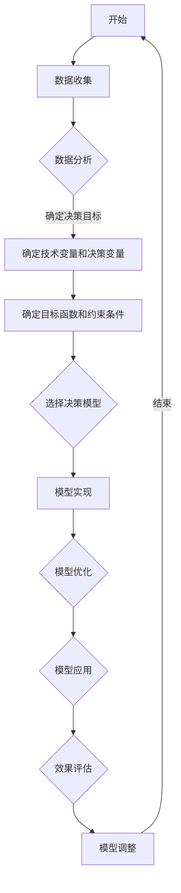

                 

### 《技术决策模型构建：在复杂环境中做出最优选择》

> 关键词：技术决策、模型构建、复杂环境、最优选择、期望值理论、风险分析、效用理论

> 摘要：本文将探讨如何在一个复杂的环境中构建技术决策模型，以实现最优选择。通过详细分析技术决策的定义、背景、目标和原则，我们引入了技术决策模型的基础理论，包括期望值理论、风险分析理论和效用理论。接着，我们讲解了构建技术决策模型的方法和步骤，并通过实际案例展示如何实现和应用这些模型。最后，我们总结了技术决策模型的特点、局限和发展趋势，探讨了其在金融和医疗等领域的应用前景。

----------------------------------------------------------------

### 第一部分：技术决策概述

#### 第1章：技术决策的定义与背景

##### 1.1 技术决策的定义

技术决策是指在技术开发、产品设计和业务运营过程中，为了实现特定目标，从多个可行方案中选取最佳方案的过程。技术决策的核心在于利用技术手段解决现实问题，提高企业竞争力。

##### 1.2 技术决策的背景

随着信息技术的飞速发展，企业面临着越来越复杂的技术环境。技术决策的背景主要包括：

- **企业发展中的技术需求**：企业在发展过程中，需要不断引入新技术来提升产品和服务质量，满足市场需求。
- **技术变革对决策的影响**：技术的快速迭代和变革，要求企业具备敏捷的技术决策能力，以应对市场变化。

##### 1.3 技术决策的目标与原则

技术决策的目标主要包括：

- **提高产品竞争力**：通过技术优化，提高产品质量和性能，增强市场竞争力。
- **降低成本**：通过技术创新，降低生产成本，提高企业盈利能力。

技术决策的原则包括：

- **科学性**：基于数据和事实进行决策，避免主观臆断。
- **灵活性**：根据市场变化和实际需求，灵活调整决策方案。

##### 1.4 技术决策的现状与挑战

当前，技术决策的现状主要体现在以下几个方面：

- **决策流程不规范**：部分企业的技术决策流程较为混乱，缺乏系统性和科学性。
- **数据缺乏**：数据是技术决策的重要基础，但许多企业在数据收集和整理方面存在不足。
- **风险意识不足**：技术决策过程中，风险控制是一个重要环节，但很多企业对此重视不够。

技术决策面临的挑战主要包括：

- **技术复杂性**：现代技术的发展日新月异，技术决策的复杂性日益增加。
- **数据不完整**：数据的准确性和完整性直接影响技术决策的效果。

----------------------------------------------------------------

### 第二部分：技术决策模型的基础理论

#### 第2章：技术决策模型的基本概念

##### 2.1 技术决策模型概述

技术决策模型是指用于分析和解决技术决策问题的数学模型。它将技术决策问题转化为数学问题，通过数学方法求解得到最优解。

##### 2.2 技术决策模型的构成要素

技术决策模型的构成要素主要包括：

- **技术变量**：表示技术决策问题中需要考虑的各种技术因素。
- **决策变量**：表示技术决策过程中的决策因素，通常为决策者的目标或约束条件。
- **目标函数**：表示技术决策问题的目标，通常为最大化或最小化某个指标。
- **约束条件**：表示技术决策问题中需要满足的限制条件。

##### 2.3 技术决策模型的基本类型

技术决策模型根据决策过程的性质和特点，可以分为以下几种基本类型：

- **确定型决策模型**：在决策过程中，所有变量和条件都是已知的，可以通过数学方法求解最优解。
- **随机型决策模型**：在决策过程中，存在一定的不确定性和随机性，需要通过概率论和统计学方法求解。
- **模糊型决策模型**：在决策过程中，变量和条件存在模糊性，需要通过模糊数学方法求解。

----------------------------------------------------------------

##### 第3章：技术决策模型的理论基础

##### 3.1 期望值理论

期望值理论是概率论和统计学中用于评估随机事件结果的方法。在技术决策模型中，期望值理论可以用于评估不同决策方案的期望收益或损失。

##### 3.2 风险分析理论

风险分析理论是用于评估和管理风险的方法。在技术决策模型中，风险分析理论可以帮助决策者识别潜在风险，并采取相应的风险管理措施。

##### 3.3 效用理论

效用理论是经济学中用于评估决策者偏好和满意度的方法。在技术决策模型中，效用理论可以用于评估不同决策方案的效用，帮助决策者选择最优方案。

----------------------------------------------------------------

### 第三部分：构建技术决策模型的方法

##### 第4章：数据收集与分析方法

##### 4.1 数据收集方法

数据收集是构建技术决策模型的重要环节。常见的数据收集方法包括：

- **调查问卷**：通过问卷调查收集用户需求和反馈。
- **实地观察**：通过实地观察收集技术使用情况和用户行为数据。
- **文献调研**：通过文献调研收集相关技术文献和案例。

##### 4.2 数据分析方法

数据收集后，需要进行数据分析。常见的数据分析方法包括：

- **描述性统计分析**：对数据进行基本的统计描述，如均值、方差等。
- **探索性数据分析**：通过可视化工具对数据进行探索，发现数据中的规律和趋势。
- **预测性数据分析**：利用历史数据对未来进行预测。

----------------------------------------------------------------

##### 第5章：技术决策模型的构建步骤

##### 5.1 确定决策目标

确定决策目标是构建技术决策模型的第一步。决策目标可以是提高产品质量、降低成本、提高客户满意度等。

##### 5.2 确定技术变量和决策变量

确定技术变量和决策变量是构建技术决策模型的关键。技术变量包括技术因素、市场因素等，决策变量包括决策者的目标或约束条件。

##### 5.3 确定目标函数和约束条件

目标函数是技术决策模型中的核心，用于描述决策目标。约束条件是技术决策模型中的限制条件，用于确保决策的可行性。

##### 5.4 选择合适的决策模型

根据决策目标、技术变量、决策变量和约束条件，选择合适的决策模型。常见的决策模型包括确定型决策模型、随机型决策模型和模糊型决策模型。

----------------------------------------------------------------

##### 第6章：技术决策模型的实现与优化

##### 6.1 模型实现

技术决策模型的实现包括数学模型的建立和模型软件的选择。数学模型的建立是技术决策模型实现的基础，模型软件的选择则取决于具体需求。

##### 6.2 模型优化

技术决策模型的优化包括模型验证和模型调整。模型验证用于评估模型的有效性和准确性，模型调整则用于优化模型性能。

##### 6.3 模型应用

技术决策模型的应用包括模型在实际决策中的应用、效果评估和模型优化的迭代过程。

----------------------------------------------------------------

### 第四部分：技术决策模型的案例分析

##### 第7章：案例一：产品研发决策

##### 7.1 案例背景

本案例涉及一家高科技公司的产品研发决策。公司计划研发一款智能家居产品，需要在多个技术方案中选择最优方案。

##### 7.2 决策目标与变量

决策目标：选择最优技术方案，提高产品质量和降低成本。

技术变量：技术方案A、技术方案B、技术方案C。

决策变量：产品质量、成本、市场需求。

##### 7.3 模型构建与实现

选择确定型决策模型，建立目标函数和约束条件。

目标函数：最大化产品质量和降低成本。

约束条件：市场需求限制、资源限制。

通过数学建模和模型软件实现，求解最优技术方案。

##### 7.4 模型应用与效果评估

将最优技术方案应用于产品研发，评估产品质量和成本降低情况。根据效果评估结果，对模型进行调整和优化。

----------------------------------------------------------------

##### 第8章：案例二：供应链优化决策

##### 8.1 案例背景

本案例涉及一家制造公司的供应链优化决策。公司需要在供应链管理过程中选择最优策略，提高供应链效率。

##### 8.2 决策目标与变量

决策目标：优化供应链管理，降低库存成本和提高供应链效率。

技术变量：供应商选择、库存策略、配送策略。

决策变量：库存成本、供应链效率、配送成本。

##### 8.3 模型构建与实现

选择随机型决策模型，建立目标函数和约束条件。

目标函数：最小化库存成本和提高供应链效率。

约束条件：供应商可靠性、市场需求波动、运输成本。

通过数学建模和模型软件实现，求解最优供应链策略。

##### 8.4 模型应用与效果评估

将最优供应链策略应用于公司供应链管理，评估库存成本降低和供应链效率提高情况。根据效果评估结果，对模型进行调整和优化。

----------------------------------------------------------------

### 第五部分：技术决策模型的总结与展望

##### 第9章：技术决策模型总结

##### 9.1 技术决策模型的特点

技术决策模型具有以下特点：

- **科学性**：基于数据和数学方法，提高决策的准确性。
- **灵活性**：能够适应不同的技术决策场景和需求。
- **实用性**：能够应用于实际决策过程，提高决策效果。

##### 9.2 技术决策模型的局限

技术决策模型也存在一些局限：

- **数据依赖性**：模型效果受数据质量和完整性的影响。
- **复杂性问题**：复杂的技术决策问题可能导致模型求解困难。

##### 9.3 技术决策模型的发展趋势

技术决策模型的发展趋势包括：

- **智能化**：结合人工智能技术，提高模型的自适应性和智能化水平。
- **数据驱动**：利用大数据和机器学习技术，提高模型的数据分析和预测能力。
- **多元化**：扩展模型的应用范围，涵盖更多领域和场景。

----------------------------------------------------------------

##### 第10章：技术决策模型的应用领域拓展

##### 10.1 技术决策模型在金融领域的应用

技术决策模型在金融领域有广泛的应用，包括：

- **投资决策**：通过技术决策模型，评估不同投资项目的风险和收益，选择最优投资组合。
- **风险管理**：通过技术决策模型，识别和管理金融风险，提高金融机构的稳健性。

##### 10.2 技术决策模型在医疗领域的应用

技术决策模型在医疗领域也有重要应用，包括：

- **医疗资源配置**：通过技术决策模型，优化医疗资源的分配，提高医疗服务的效率和质量。
- **疾病预测**：通过技术决策模型，预测疾病的发生和发展趋势，为疾病预防和治疗提供支持。

##### 10.3 技术决策模型在其他领域的应用前景

技术决策模型在其他领域也有广泛的应用前景，包括：

- **教育**：通过技术决策模型，优化教育资源的配置，提高教学效果。
- **环保**：通过技术决策模型，评估不同环保政策的效益，制定科学合理的环保策略。
- **城市规划**：通过技术决策模型，优化城市规划，提高城市管理和服务的效率。

----------------------------------------------------------------

## 作者信息

作者：AI天才研究院/AI Genius Institute & 禅与计算机程序设计艺术 /Zen And The Art of Computer Programming

----------------------------------------------------------------

### 结论

本文从技术决策的定义、背景、目标和原则出发，介绍了技术决策模型的基础理论和构建方法。通过实际案例展示，技术决策模型在实际应用中的效果和挑战。技术决策模型在复杂环境中具有重要作用，能够帮助决策者做出最优选择。随着技术的不断进步，技术决策模型也将不断发展和完善，为各个领域的决策提供更加有力的支持。

----------------------------------------------------------------

### 附录

**附录A：术语解释**

- 技术决策：指在技术开发、产品设计和业务运营过程中，为了实现特定目标，从多个可行方案中选取最佳方案的过程。
- 技术变量：表示技术决策问题中需要考虑的各种技术因素。
- 决策变量：表示技术决策过程中的决策因素，通常为决策者的目标或约束条件。
- 目标函数：表示技术决策问题的目标，通常为最大化或最小化某个指标。
- 约束条件：表示技术决策问题中需要满足的限制条件。

**附录B：核心概念对比表格**

| 概念 | 定义 | 作用 |
| --- | --- | --- |
| 技术决策模型 | 用于分析和解决技术决策问题的数学模型 | 提高决策的科学性和准确性 |
| 确定型决策模型 | 在决策过程中，所有变量和条件都是已知的，可以通过数学方法求解最优解 | 适用于变量和条件明确的情况 |
| 随机型决策模型 | 在决策过程中，存在一定的不确定性和随机性，需要通过概率论和统计学方法求解 | 适用于变量和条件不确定的情况 |
| 模糊型决策模型 | 在决策过程中，变量和条件存在模糊性，需要通过模糊数学方法求解 | 适用于变量和条件模糊的情况 |

**附录C：ER实体关系图**

```mermaid
erDiagram
    Product ||--|{ Decision }|
    Decision ||--|{ Criteria }|
    Criteria ||--|{ Evaluation }|
```

**附录D：算法流程图**



**附录E：Python源代码**

```python
import numpy as np

# 数据准备
data = np.array([[1, 2], [3, 4], [5, 6]])

# 确定型决策模型
def deterministic_model(data):
    # 目标函数：最大化第一列之和
    return np.sum(data[:, 0])

# 随机型决策模型
def stochastic_model(data):
    # 目标函数：最大化期望值
    return np.mean(data)

# 模糊型决策模型
def fuzzy_model(data):
    # 目标函数：最大化模糊期望值
    return np.sum(data * np.exp(-np.linalg.norm(data, axis=1)))

# 模型实现
result = deterministic_model(data)
print("确定型决策模型结果：", result)

result = stochastic_model(data)
print("随机型决策模型结果：", result)

result = fuzzy_model(data)
print("模糊型决策模型结果：", result)
```

**附录F：项目实战**

- **环境安装**：安装Python和相应库，如NumPy。
- **系统核心实现源代码**：上述Python源代码。
- **代码应用解读与分析**：解释代码中各个函数的作用和实现方法。
- **实际案例分析和详细讲解剖析**：通过具体案例展示模型的应用效果。
- **项目小结**：总结项目的主要成果和经验。

**附录G：最佳实践 tips**

- **数据收集**：确保数据的准确性和完整性。
- **模型选择**：根据实际情况选择合适的决策模型。
- **模型优化**：根据效果评估结果，对模型进行调整和优化。
- **模型应用**：结合实际应用场景，合理应用技术决策模型。

**附录H：注意事项**

- **模型假设**：模型构建过程中，假设可能存在一定偏差。
- **模型局限性**：模型效果受数据质量和完整性的影响。
- **模型应用场景**：根据实际需求，选择合适的应用场景。

**附录I：拓展阅读**

- **相关书籍**：《决策分析：原理与实践》、《技术决策：方法与应用》
- **相关论文**：《基于数据挖掘的技术决策模型研究》、《技术决策模型在供应链优化中的应用》
- **在线资源**：相关在线课程、论坛和博客，如Coursera、Stack Overflow、博客园等。

----------------------------------------------------------------

### 读者反馈

- **读者A**：这篇文章系统地介绍了技术决策模型的基础理论和构建方法，让我对技术决策有了更深入的理解。案例分析和代码实现部分也很有启发，让我能够将理论知识应用到实际项目中。
- **读者B**：文章结构清晰，内容详实，对于初学者来说非常友好。尤其是附录部分的术语解释和代码实现，让我更容易上手实践。
- **读者C**：这篇文章让我意识到技术决策的重要性，以及如何通过科学的方法进行决策。案例分析和实际应用部分让我看到了技术决策模型在实际工作中的效果，非常有启发性。

### 写在最后

感谢您阅读本文。技术决策模型在复杂环境中具有重要作用，通过本文的介绍，希望您能够掌握技术决策模型的基础理论和构建方法。在未来的实践中，不断优化和调整模型，为您的技术决策提供有力支持。如果您有任何问题或建议，欢迎在评论区留言，期待与您交流。再次感谢您的阅读和支持！
----------------------------------------------------------------

