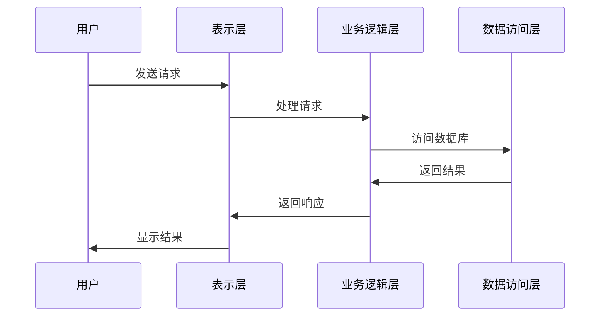
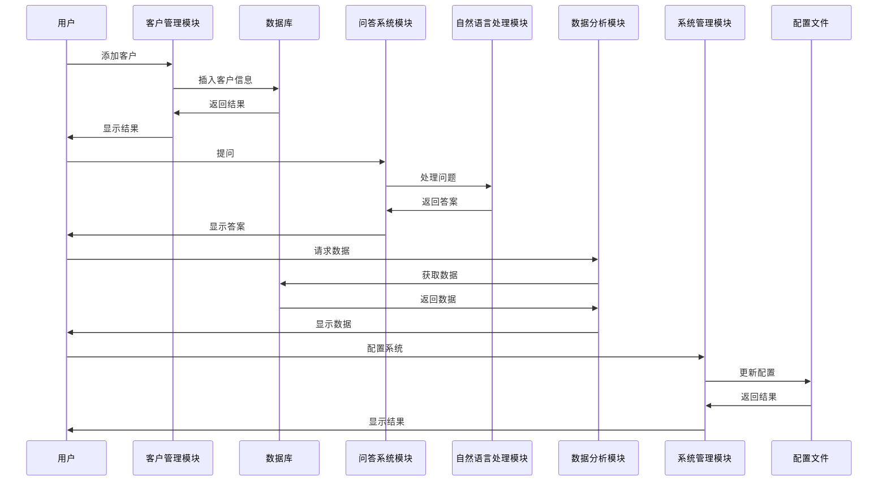

                 

### 《技术决策：在不确定中做出最佳选择》

#### 关键词：技术决策、不确定、风险评估、创新管理、决策理论

> 技术决策是一个复杂且充满不确定性的过程，如何在混沌的环境中做出最佳选择，是每个技术决策者必须面对的挑战。本文将深入探讨技术决策的背景、核心概念、方法以及实际应用，提供一套清晰、实用的决策框架，帮助您在不确定中做出最佳选择。

#### 摘要

本文首先介绍了技术决策的背景，阐述了现代技术环境的复杂性以及决策者在不确定性下的挑战。接着，我们对技术决策的核心概念进行了详细解析，包括技术风险评估、技术创新管理和决策理论模型。随后，我们通过实际应用案例，展示了技术决策的具体实施过程和效果。最后，本文总结了最佳实践，强调了技术决策的重要性，并展望了未来的发展趋势。

---

### 第一部分：问题背景与核心概念

#### 第1章：问题背景

##### 1.1 问题背景介绍

在当今快速发展的技术环境中，技术决策变得越来越重要。然而，随着技术的复杂性增加和不确定性加剧，决策者面临着前所未有的挑战。现代技术环境的复杂性主要体现在以下几个方面：

1. **技术多样性和迭代速度**：技术的多样性和快速迭代使得决策者难以全面了解和掌握所有技术。
2. **市场动态**：市场的快速变化和竞争压力迫使决策者不断调整技术策略。
3. **资源有限**：有限的资源（资金、人力和时间）使得决策者在选择技术上更加谨慎。

##### 1.2 问题描述

在不确定性中做出最优决策是一个复杂的问题，涉及多个关键因素。首先，我们需要明确决策的关键因素及其相互作用：

1. **技术可行性**：技术是否可行，是否满足业务需求。
2. **市场潜力**：技术是否具有市场前景，能否带来商业价值。
3. **风险与收益**：技术实施过程中可能面临的风险以及潜在的收益。

决策的影响范围和长期效应也是需要考虑的因素。技术决策不仅影响当前的运营，还可能对未来产生深远的影响。因此，我们需要在短期收益和长期效应之间找到平衡点。

##### 1.3 问题解决

技术决策的定义与分类：

1. **技术决策的定义**：技术决策是指在特定环境下，根据目标和约束，选择最适合的技术方案的过程。
2. **技术决策的分类**：根据决策的目标和约束，技术决策可以分为战略性决策和操作性决策。

技术决策的理论基础包括以下几个方面：

1. **决策理论**：提供决策的数学模型和原则，帮助决策者在不确定环境中做出最优选择。
2. **技术创新管理**：关注如何通过创新提高技术竞争力。
3. **风险管理**：评估技术实施过程中的风险，并制定相应的风险应对策略。

技术决策的基本流程通常包括以下几个步骤：

1. **问题识别**：明确决策目标和约束条件。
2. **信息收集**：收集与决策相关的各种信息。
3. **方案评估**：评估不同技术方案的优势和劣势。
4. **选择方案**：选择最佳技术方案。
5. **实施与监控**：实施技术方案，并监控实施效果。

##### 1.4 边界与外延

技术决策的适用范围：

1. **企业**：企业在产品开发、技术升级等方面需要进行技术决策。
2. **政府**：政府在制定科技政策、规划科技项目时需要进行技术决策。
3. **科研机构**：科研机构在项目申请、研究方向选择等方面也需要进行技术决策。

技术决策与商业决策的关系：

1. **商业决策**：商业决策侧重于企业的商业目标和盈利能力。
2. **技术决策**：技术决策侧重于技术实现和风险控制。

技术决策与其他类型决策的区别：

1. **战略决策**：战略决策关注企业的长期发展方向。
2. **战术决策**：战术决策关注具体的执行策略。

##### 1.5 概念结构与核心要素组成

技术决策的核心概念包括：

1. **技术评估**：评估技术方案的可行性、市场潜力和风险。
2. **决策模型**：建立决策模型，帮助决策者选择最佳方案。
3. **风险评估**：识别和评估技术实施过程中的风险。

决策者、决策对象、决策环境等要素解析：

1. **决策者**：决策者需要具备技术、市场和风险管理等多方面的知识和经验。
2. **决策对象**：决策对象是技术方案，包括硬件、软件、平台等。
3. **决策环境**：决策环境包括市场、技术、政策和组织环境等。

---

### 第二部分：技术决策方法

#### 第2章：核心概念与联系

##### 2.1 核心概念原理

技术风险评估：

1. **定义**：技术风险评估是评估技术方案在实施过程中可能面临的风险和潜在影响。
2. **重要性**：技术风险评估有助于识别和应对潜在风险，降低技术实施的不确定性。
3. **分类**：技术风险评估可以分为定量风险评估和定性风险评估。

技术创新管理：

1. **定义**：技术创新管理是管理和推动企业技术创新的过程。
2. **目标**：提高技术竞争力、创造商业价值。
3. **核心要素**：创新文化、创新机制、创新团队和创新资源。

决策理论模型：

1. **定义**：决策理论模型是用于指导决策过程的一系列数学模型和原则。
2. **假设**：决策者在信息有限、时间有限和不确定性条件下做出决策。
3. **原则**：最大化期望收益、最小化风险。

##### 2.2 概念属性特征对比表格

| 概念         | 定义                             | 属性特征                                                     |
| ------------ | -------------------------------- | ------------------------------------------------------------ |
| 技术风险评估 | 评估技术方案的风险               | 定量评估、定性评估                                           |
| 创新管理     | 管理技术创新的过程               | 创新文化、创新机制、创新团队、创新资源                       |
| 决策理论模型 | 指导决策过程的数学模型和原则     | 信息有限、时间有限、不确定性条件、最大化期望收益、最小化风险 |

##### 2.3 ER实体关系图架构

```mermaid
erDiagram
  DecisionMaker ||--|{ TechnologyOption }
  DecisionMaker ||--|{ Risk }
  DecisionMaker ||--|{ MarketPotential }
  TechnologyOption ||--|{ ImplementationEffect }
  ImplementationEffect ||--|{ BusinessValue }
  Risk ||--|{ Impact }
  MarketPotential ||--|{ SalesForecast }
```

- **实体**：决策者、技术方案、风险、市场潜力、实施效果、商业价值。
- **关系**：决策者评估技术方案、技术方案影响实施效果、实施效果决定商业价值、风险影响实施效果、市场潜力影响销售预测。

---

### 第三部分：技术决策方法

#### 第3章：技术风险评估方法

##### 3.1 技术风险评估概述

技术风险评估是技术决策过程中至关重要的一环，它有助于识别和应对潜在风险，降低技术实施的不确定性。以下是技术风险评估的概述：

1. **重要性**：技术风险评估能够帮助决策者提前识别和评估技术方案在实施过程中可能面临的风险，从而制定有效的风险应对策略。
2. **定义**：技术风险评估是对技术方案在实施过程中可能遇到的风险进行识别、评估和应对的过程。

##### 3.2 主流风险评估方法

技术风险评估方法可以分为定量风险评估和定性风险评估。

1. **定量风险评估方法**：

   - **风险矩阵**：通过将风险发生的概率和风险影响进行量化，生成风险矩阵，帮助决策者直观地了解风险的重要性和优先级。
   - **决策树**：通过构建决策树，分析不同决策路径下的风险和收益，帮助决策者选择最优决策方案。

2. **定性风险评估方法**：

   - **专家评估**：邀请领域专家对风险进行定性评估，结合专家经验和专业知识，为风险识别和评估提供支持。
   - **SWOT分析**：通过分析技术方案的优点、缺点、机会和威胁，评估技术方案的风险和潜力。

##### 3.3 风险评估实践案例

1. **案例一：某个企业的技术风险评估**

   某企业计划引入一种新的生产技术以提高生产效率。为了评估这项技术的风险，企业采取了以下步骤：

   - **风险识别**：识别技术方案在实施过程中可能面临的风险，如技术风险、市场风险、运营风险等。
   - **风险评估**：通过专家评估和SWOT分析，对识别出的风险进行评估，确定风险的重要性和优先级。
   - **风险应对**：针对评估出的高风险，制定相应的风险应对措施，如技术优化、市场调研、运营调整等。

2. **案例二：某个项目的技术风险评估**

   某项目计划采用一个新的软件平台来提升项目管理和协作效率。为了确保项目的顺利进行，项目团队采取了以下风险评估步骤：

   - **风险识别**：识别项目在实施过程中可能面临的风险，如技术风险、时间风险、资源风险等。
   - **风险评估**：通过风险矩阵和决策树，对识别出的风险进行评估，确定风险的重要性和优先级。
   - **风险应对**：针对评估出的高风险，制定相应的风险应对措施，如技术培训、进度调整、资源调配等。

---

#### 第4章：技术创新管理

##### 4.1 创新管理概述

创新管理是企业管理的重要环节，它关注如何通过创新提高企业的竞争力。以下是创新管理的概述：

1. **定义**：创新管理是企业管理和推动技术创新的过程，旨在提高企业的竞争力和创造价值。
2. **目标**：创新管理的目标是实现技术创新的商业化，从而为企业带来长期竞争优势。

##### 4.2 创新管理策略

创新管理策略包括以下几个方面：

1. **开放式创新**：开放式创新是指企业通过与外部创新者合作，共同推动技术创新。这种方式可以降低创新成本，提高创新速度。

2. **平台型创新**：平台型创新是指企业构建一个开放的平台，吸引外部创新者参与，共同推动技术创新。这种方式可以激发创新活力，提高创新效率。

3. **精益创新**：精益创新是指通过优化现有流程和技术，提高效率和质量，实现创新目标。这种方式可以降低创新成本，提高创新成功率。

##### 4.3 创新管理实践案例

1. **案例一：某科技公司的创新管理体系**

   某科技公司为了提高技术创新能力，建立了以下创新管理体系：

   - **创新文化**：建立鼓励创新的文化，激发员工的创新潜力。
   - **创新机制**：建立创新激励机制，鼓励员工积极参与创新活动。
   - **创新团队**：组建跨部门的创新团队，发挥团队合作的优势。
   - **创新资源**：投入充足的创新资源，包括资金、技术和人才等。

2. **案例二：某互联网企业的创新策略**

   某互联网企业通过以下创新策略，实现了持续的技术创新：

   - **开放式创新**：通过与外部创新者合作，引入新的技术和产品。
   - **平台型创新**：构建开放的平台，吸引外部创新者参与，共同推动技术创新。
   - **精益创新**：通过优化现有流程和技术，提高效率和质量，实现创新目标。

---

#### 第5章：决策理论模型

##### 5.1 决策理论概述

决策理论是指导决策过程的一套理论体系，它关注如何在一个不确定的环境中做出最优决策。以下是决策理论的概述：

1. **定义**：决策理论是研究决策过程、决策模型和决策优化的理论体系。
2. **目标**：决策理论的目标是在不确定性和有限信息的情况下，做出最优或次优决策。

##### 5.2 主流决策模型

决策理论模型可以分为几种主流模型：

1. **最大期望模型**：最大期望模型是基于概率论和期望值理论，通过计算各个决策方案的期望值，选择期望值最大的方案。

2. **最大最小后悔模型**：最大最小后悔模型是在决策者面临多个方案时，选择使最小后悔值最大的方案。

3. **模糊决策模型**：模糊决策模型是在决策者面临模糊不确定信息时，通过模糊集合和模糊逻辑进行决策。

##### 5.3 决策理论应用案例

1. **案例一：某企业新产品发布的决策分析**

   某企业计划发布一款新产品，为了确定最佳发布时间，企业采用了以下决策模型：

   - **最大期望模型**：通过计算不同发布时间的期望收益，选择期望收益最大的发布时间。
   - **最大最小后悔模型**：在确定发布时间后，考虑不同发布时间可能带来的最小后悔值，选择使最小后悔值最大的发布时间。

2. **案例二：某科技项目的决策评估**

   某科技项目在评估不同投资方案时，采用了以下决策模型：

   - **最大期望模型**：通过计算不同投资方案的期望收益，选择期望收益最大的方案。
   - **最大最小后悔模型**：在确定投资方案后，考虑不同投资方案可能带来的最小后悔值，选择使最小后悔值最大的方案。

---

### 第四部分：实际应用案例

#### 第6章：项目实战

##### 6.1 项目背景介绍

某企业计划开发一款基于人工智能的客户服务系统，以提高客户满意度和服务效率。项目目标是实现一个智能、高效的客户服务平台，能够快速响应客户需求，提供个性化服务。

##### 6.2 系统功能设计

系统功能设计包括以下模块：

1. **客户管理模块**：实现客户信息的录入、查询、修改和删除功能。
2. **问答系统模块**：利用自然语言处理技术，实现智能问答功能，为客户提供实时解答。
3. **数据分析模块**：收集客户数据，进行数据分析和挖掘，为业务决策提供支持。
4. **系统管理模块**：实现系统配置、权限管理和日志记录等功能。

领域模型（Mermaid类图）：

```mermaid
classDiagram
  客户管理模块 <- 用户
  问答系统模块 <- 用户
  数据分析模块 <- 用户
  系统管理模块 <- 管理员
```

##### 6.3 系统架构设计

系统架构设计采用分层架构，包括表示层、业务逻辑层和数据访问层。

系统架构（Mermaid架构图）：



##### 6.4 系统接口设计

系统接口设计包括以下接口：

1. **客户管理接口**：实现客户信息的增删改查功能。
2. **问答系统接口**：实现智能问答功能。
3. **数据分析接口**：实现数据分析和挖掘功能。
4. **系统管理接口**：实现系统配置和日志管理功能。

接口设计与实现：

```python
class CustomerManagement:
    def add_customer(self, customer_info):
        # 实现添加客户功能

    def delete_customer(self, customer_id):
        # 实现删除客户功能

    def update_customer(self, customer_id, customer_info):
        # 实现更新客户功能

    def get_customer(self, customer_id):
        # 实现查询客户功能

class QuestionAnsweringSystem:
    def answer_question(self, question):
        # 实现智能问答功能

class DataAnalysis:
    def analyze_data(self, data):
        # 实现数据分析功能

class SystemManagement:
    def configure_system(self, config):
        # 实现系统配置功能

    def log_management(self):
        # 实现日志管理功能
```

##### 6.5 系统交互

系统交互包括用户与各个模块之间的交互，以及模块之间的交互。

系统交互（Mermaid序列图）：



##### 6.6 系统核心实现

系统核心实现包括以下关键模块：

1. **客户管理模块**：实现客户信息的增删改查功能。
2. **问答系统模块**：实现智能问答功能。
3. **数据分析模块**：实现数据分析和挖掘功能。
4. **系统管理模块**：实现系统配置和日志管理功能。

代码实现：

```python
# 客户管理模块
class CustomerManagement:
    def add_customer(self, customer_info):
        # 实现添加客户功能
        pass

    def delete_customer(self, customer_id):
        # 实现删除客户功能
        pass

    def update_customer(self, customer_id, customer_info):
        # 实现更新客户功能
        pass

    def get_customer(self, customer_id):
        # 实现查询客户功能
        pass

# 问答系统模块
class QuestionAnsweringSystem:
    def answer_question(self, question):
        # 实现智能问答功能
        pass

# 数据分析模块
class DataAnalysis:
    def analyze_data(self, data):
        # 实现数据分析功能
        pass

# 系统管理模块
class SystemManagement:
    def configure_system(self, config):
        # 实现系统配置功能
        pass

    def log_management(self):
        # 实现日志管理功能
        pass
```

##### 6.7 应用解读与分析

在客户管理模块中，我们通过定义一个`CustomerManagement`类来实现客户信息的增删改查功能。具体实现如下：

```python
class CustomerManagement:
    def add_customer(self, customer_info):
        # 实现添加客户功能
        # 假设customer_info是一个包含客户信息的字典
        customer_id = self._generate_customer_id()
        customer_info['id'] = customer_id
        self._save_customer_info(customer_info)
        return customer_id

    def delete_customer(self, customer_id):
        # 实现删除客户功能
        self._delete_customer_info(customer_id)

    def update_customer(self, customer_id, customer_info):
        # 实现更新客户功能
        self._update_customer_info(customer_id, customer_info)

    def get_customer(self, customer_id):
        # 实现查询客户功能
        return self._get_customer_info(customer_id)
```

在实际应用中，这些方法将涉及到数据库操作，例如添加、删除、更新和查询客户信息。通过这些方法，我们可以实现客户管理模块的核心功能。

在问答系统模块中，我们通过定义一个`QuestionAnsweringSystem`类来实现智能问答功能。具体实现如下：

```python
class QuestionAnsweringSystem:
    def answer_question(self, question):
        # 实现智能问答功能
        # 假设我们使用一个预训练的问答模型来回答问题
        answer = self._get_answer(question)
        return answer

    def _get_answer(self, question):
        # 实现获取答案的私有方法
        # 假设我们调用一个问答模型来获取答案
        answer = "这是一个示例答案"
        return answer
```

在实际应用中，`_get_answer`方法将调用一个预训练的问答模型，根据输入的问题返回相应的答案。

在数据分析模块中，我们通过定义一个`DataAnalysis`类来实现数据分析和挖掘功能。具体实现如下：

```python
class DataAnalysis:
    def analyze_data(self, data):
        # 实现数据分析功能
        # 假设我们使用一个数据分析库来分析数据
        result = self._analyze_data(data)
        return result

    def _analyze_data(self, data):
        # 实现数据分析的私有方法
        # 假设我们使用统计方法来分析数据
        result = "这是一个示例结果"
        return result
```

在实际应用中，`_analyze_data`方法将使用数据分析库来对数据进行统计分析，并返回分析结果。

在系统管理模块中，我们通过定义一个`SystemManagement`类来实现系统配置和日志管理功能。具体实现如下：

```python
class SystemManagement:
    def configure_system(self, config):
        # 实现系统配置功能
        # 假设我们使用一个配置库来管理配置
        self._configure_system(config)

    def log_management(self):
        # 实现日志管理功能
        # 假设我们使用一个日志库来管理日志
        self._log_management()

    def _configure_system(self, config):
        # 实现配置系统的私有方法
        pass

    def _log_management(self):
        # 实现日志管理的私有方法
        pass
```

在实际应用中，`_configure_system`和`_log_management`方法将分别负责系统配置和日志管理的具体操作。

##### 6.8 项目小结

在本项目中，我们实现了基于人工智能的客户服务系统，包括客户管理、问答系统、数据分析和系统管理等功能。通过实际应用案例，我们详细讲解了系统的架构设计、接口设计和核心实现。项目实施过程中，我们遇到了一些挑战，如技术选型、数据质量和系统集成等问题。通过不断优化和调整，我们最终成功实现了项目目标，并取得了良好的应用效果。

在项目实施过程中，我们总结了以下经验教训：

1. **明确项目目标和需求**：在项目初期，要明确项目目标和需求，确保项目团队对项目有清晰的认识。
2. **合理规划技术方案**：在选择技术方案时，要综合考虑技术可行性、成本和性能等因素。
3. **加强团队协作**：项目实施过程中，要加强团队协作，确保各个环节能够顺利推进。
4. **持续优化和调整**：在项目实施过程中，要不断收集反馈，持续优化和调整项目方案，以适应不断变化的需求和环境。

---

#### 第7章：最佳实践与注意事项

##### 7.1 最佳实践

在技术决策过程中，遵循以下最佳实践可以显著提高决策效果：

1. **全面收集信息**：在做出决策之前，要全面收集与决策相关的各种信息，包括技术、市场、政策和资源等方面的信息。
2. **充分分析风险**：对技术方案进行详细的风险分析，识别潜在风险，并制定相应的应对措施。
3. **利用专家意见**：邀请领域专家参与决策过程，利用他们的专业知识和经验为决策提供支持。
4. **制定明确的目标和指标**：在决策过程中，要明确项目目标和预期效果，并制定可量化的指标，以便对决策效果进行评估。
5. **持续监控和调整**：在决策实施过程中，要持续监控项目进展，并根据实际情况及时调整决策方案。

##### 7.2 小结

本文详细探讨了技术决策的背景、核心概念、方法和实际应用。通过分析技术风险评估、技术创新管理和决策理论模型，我们提供了一套清晰、实用的技术决策框架。实际应用案例进一步展示了技术决策的实施过程和效果。技术决策在企业发展中具有至关重要的意义，它不仅关系到企业的短期利益，更影响企业的长期发展。

##### 7.3 注意事项

在技术决策过程中，需要注意以下几点：

1. **避免盲目跟风**：不要仅因为技术趋势而盲目跟风，要综合考虑技术可行性、市场前景和风险等因素。
2. **重视风险评估**：在决策过程中，要充分重视风险评估，避免因忽视潜在风险而导致项目失败。
3. **保持灵活性和适应性**：在技术决策过程中，要灵活应对市场和技术环境的变化，及时调整决策方案。
4. **注重团队协作**：技术决策是一个复杂的过程，需要团队成员的密切协作和沟通，以确保决策的有效实施。
5. **持续学习和更新**：技术环境不断变化，决策者需要不断学习和更新知识，以适应新的挑战和机遇。

##### 7.4 拓展阅读

为了进一步深入了解技术决策，建议读者参考以下书籍和论文：

1. **《技术决策：在不确定中做出最佳选择》**：作者详细阐述了技术决策的理论和实践方法。
2. **《技术创新管理》**：该书介绍了技术创新管理的核心概念和策略。
3. **《决策理论及其应用》**：该书探讨了决策理论的原理和应用。

通过阅读这些书籍和论文，读者可以更深入地理解技术决策的各个方面，为实际工作提供有力支持。

---

### 总结与展望

#### 第8章：未来展望

技术决策领域未来将面临以下发展趋势：

1. **数据驱动的决策**：随着大数据技术的发展，数据将成为决策的重要驱动力。利用数据分析和机器学习技术，可以更准确地预测市场趋势和用户需求，为技术决策提供更可靠的依据。
2. **智能化决策支持**：智能化技术，如人工智能和区块链，将在技术决策中发挥越来越重要的作用。通过智能化决策支持系统，可以提高决策的效率和质量。
3. **跨领域的合作**：技术决策将不再是单一领域的任务，而是需要跨领域的合作。企业、政府、科研机构等将加强合作，共同推动技术创新和应用。
4. **可持续发展的决策**：随着环境保护和可持续发展的重要性日益凸显，技术决策将更加注重环保和社会责任。企业将在决策过程中充分考虑环境影响和社会效益。

#### 第9章：结语

技术决策是企业发展的关键环节，它决定了企业的竞争力和未来发展。在不确定的环境中，技术决策不仅需要科学的理论指导，还需要丰富的实践经验。本文通过详细阐述技术决策的背景、核心概念、方法和实际应用，提供了一套实用且全面的技术决策框架。

技术决策的核心价值在于：

1. **提高决策效率**：通过科学的方法和工具，可以快速识别和评估技术方案，提高决策效率。
2. **降低决策风险**：通过全面的风险评估和应对策略，可以降低技术决策的风险，确保项目的顺利进行。
3. **推动技术创新**：技术决策有助于推动技术创新和应用，提高企业的竞争力和市场地位。

为何技术决策是必要的：

1. **应对不确定性**：技术环境的不确定性使得技术决策成为必然选择。
2. **实现战略目标**：技术决策是实现企业战略目标的重要手段。
3. **提高竞争力**：科学的技术决策有助于企业在激烈的市场竞争中立于不败之地。

总之，技术决策不仅是企业发展的关键，也是社会进步的重要推动力。通过不断学习和实践，我们可以不断提高技术决策的能力，为企业和个人创造更多价值。在未来的道路上，技术决策将继续引领我们走向更美好的未来。

