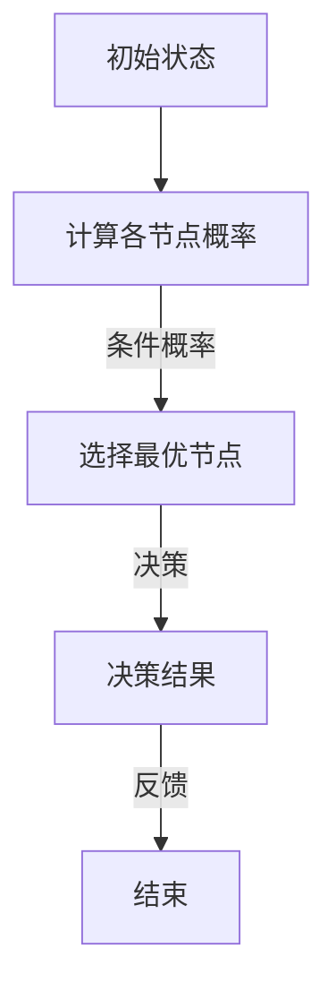
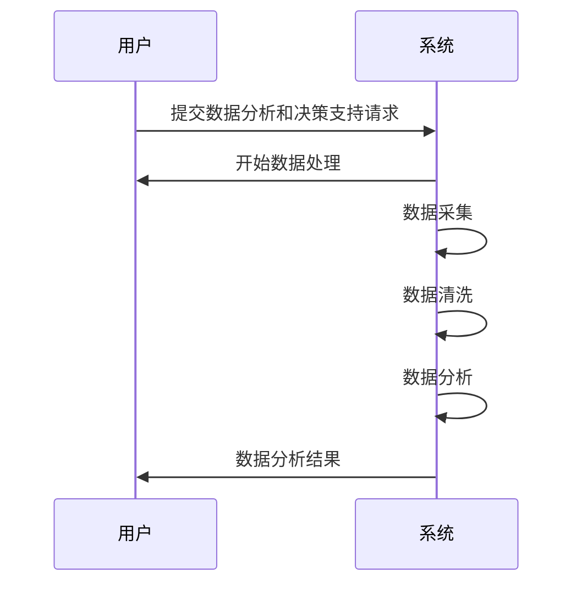

                 


### 设计全文框架

#### 标题、关键词、摘要
- 标题：《技术决策：在不确定性中做出选择》
- 关键词：技术决策、不确定性、算法原理、数学模型、系统架构、项目实战、最佳实践
- 摘要：本文将深入探讨在技术领域中，如何在不确定性环境中做出有效决策。通过分析决策理论、案例研究、实战经验，为读者提供一套系统化的决策方法论。

#### 目录结构
全文分为以下十个部分：

1. **引言**
   - 引言部分介绍技术决策的背景和重要性，引出文章主题。

2. **决策理论基础**
   - 第1章：决策理论的背景与重要性
   - 第2章：不确定性的类型与度量
   - 第3章：决策模型与算法

3. **技术决策案例分析**
   - 第4章：人工智能技术在不确定性决策中的应用
   - 第5章：大数据分析在技术决策中的作用
   - 第6章：云计算与分布式计算在决策中的应用

4. **系统分析与架构设计**
   - 第7章：系统功能设计
   - 第8章：系统架构设计
   - 第9章：系统接口设计
   - 第10章：系统交互设计

5. **项目实战**
   - 第11章：环境安装与系统实现
   - 第12章：代码解读与应用分析
   - 第13章：实际案例分析
   - 第14章：项目小结

6. **最佳实践 tips**
   - 第15章：技术决策中的最佳实践

7. **小结**
   - 对全文内容进行简要回顾和总结。

8. **注意事项**
   - 提醒读者在应用技术决策时需要注意的事项。

9. **拓展阅读**
   - 推荐相关领域的重要文献和资源。

10. **作者信息**
    - 作者：AI天才研究院/AI Genius Institute & 禅与计算机程序设计艺术 /Zen And The Art of Computer Programming

#### 内容填充
- 根据目录结构，逐一对每个章节进行详细内容填充，确保每章都有丰富的理论分析和实践案例。

#### 标题与段落设置
- 使用markdown格式设置文章结构，包括标题、子标题、段落、列表、代码块等，确保文章格式清晰易懂。

#### 数学公式与流程图
- 使用LaTeX格式嵌入数学公式，确保公式格式正确。
- 使用Mermaid绘制流程图和序列图，嵌入到文本中。

#### 字数与完整性
- 根据字数要求（10000～12000字），确保文章内容的完整性和深度。

#### 逻辑与连贯性
- 确保文章内容逻辑连贯，思路清晰，便于读者理解。

### 实施步骤

1. **撰写引言**
   - 简述技术决策的背景、重要性，引出文章主题。

2. **编写决策理论基础部分**
   - 逐章撰写，详细阐述决策理论、不确定性与度量、决策模型与算法。

3. **编写技术决策案例分析部分**
   - 结合实际案例，分析人工智能、大数据分析、云计算在技术决策中的应用。

4. **编写系统分析与架构设计部分**
   - 介绍系统功能、架构、接口和交互设计。

5. **编写项目实战部分**
   - 分步骤介绍环境安装、代码实现、应用分析、案例分析。

6. **编写最佳实践 tips**
   - 提供技术决策中的最佳实践建议。

7. **编写小结与注意事项**
   - 总结全文，提醒注意事项。

8. **编写拓展阅读**
   - 推荐相关领域的重要资源。

9. **整理全文**
   - 检查全文逻辑、格式、完整性，进行最终校对。

10. **添加作者信息**
    - 在文章末尾添加作者信息。

### 时间规划

- **第一阶段（1周）**：完成全文框架设计和引言撰写。
- **第二阶段（2周）**：完成决策理论基础部分的编写。
- **第三阶段（3周）**：完成技术决策案例分析部分的编写。
- **第四阶段（3周）**：完成系统分析与架构设计部分的编写。
- **第五阶段（3周）**：完成项目实战部分的编写。
- **第六阶段（2周）**：完成最佳实践 tips、小结与注意事项、拓展阅读的编写。
- **第七阶段（1周）**：全文整理、校对、发布。

通过上述步骤，我们可以系统地撰写一篇关于技术决策的专业文章，确保内容丰富、结构清晰、逻辑严谨，为读者提供有价值的技术决策指导。接下来，我们将逐章详细撰写文章内容。**下一步，我们将开始撰写引言部分的内容。** ### 引言

#### 技术决策的背景与重要性

在现代信息技术飞速发展的背景下，技术决策已成为企业、组织和开发者面临的日常挑战。技术决策不仅涉及到具体技术的选择，还涵盖了系统的架构设计、资源分配、风险管理与未来趋势预测等多个方面。在充满不确定性的技术环境中，做出正确的决策至关重要。

**背景**：随着互联网、云计算、大数据、人工智能等技术的广泛应用，技术的变革速度日益加快。这不仅为企业提供了前所未有的发展机遇，也带来了巨大的挑战。技术的不确定性体现在技术趋势的变化、技术成熟度的不同、市场需求的快速迭代以及技术风险的不可预测性等方面。

**重要性**：技术决策的正确性直接关系到项目成功与否、企业竞争力的强弱、用户满意度的提升。正确的技术决策可以帮助企业迅速响应市场变化，降低风险，提升效率，保持竞争优势。此外，技术决策还影响到项目的长远发展和可持续性，是确保企业长期成功的关键因素。

本文旨在深入探讨在不确定性环境中如何做出有效的技术决策。通过分析决策理论、案例研究、实战经验，本文将为读者提供一套系统化的决策方法论，帮助读者在面对技术挑战时做出明智的选择。

#### 文章主题与结构

本文分为十个主要部分：

1. **引言**：介绍技术决策的背景与重要性。
2. **决策理论基础**：涵盖决策理论、不确定性的类型与度量、决策模型与算法。
3. **技术决策案例分析**：分析人工智能、大数据分析、云计算在技术决策中的应用。
4. **系统分析与架构设计**：介绍系统功能设计、架构设计、接口设计与系统交互。
5. **项目实战**：详细描述环境安装、代码实现、应用分析、案例分析。
6. **最佳实践 tips**：提供技术决策中的最佳实践建议。
7. **小结**：总结全文，回顾核心内容。
8. **注意事项**：提醒技术决策过程中需要注意的事项。
9. **拓展阅读**：推荐相关领域的重要文献和资源。
10. **作者信息**：介绍作者背景与联系信息。

通过上述结构，本文将系统地探讨技术决策的方方面面，帮助读者在不确定性中找到决策的路径。在接下来的章节中，我们将逐一深入探讨这些内容。

### 决策理论基础

在技术决策过程中，了解决策理论的基本概念和原理是非常重要的。决策理论不仅为我们提供了分析问题的框架，还帮助我们理解和评估不同的选择，从而做出更为明智的决策。

#### 决策理论的基本概念

决策理论（Decision Theory）是一个研究决策过程和决策结果的学科。它涉及心理学、经济学、社会学和计算机科学等多个领域。决策理论的核心概念包括：

- **决策者**：做出决策的人或组织。
- **目标**：决策者希望实现的结果。
- **方案**：实现目标的不同方式或选择。
- **结果**：执行方案后可能产生的各种结果。
- **概率**：预测每种结果发生的可能性。
- **效用**：决策者对结果的偏好程度。

在技术决策中，决策者通常面临多种可能的选择，每种选择都有其可能的结果和概率。通过评估这些结果和概率，决策者可以确定哪种方案最有可能实现其目标。

#### 决策理论的分类

决策理论可以根据决策环境和决策过程的不同分为以下几类：

- **确定型决策**：在确定的环境下，决策者可以清楚地知道所有可能的结果和每种结果的概率。这种情况下，决策者只需比较不同方案的结果，选择最优方案即可。

- **风险型决策**：在不确定的环境下，决策者虽然可以预测每种结果的可能性，但无法确定每种结果的确切发生概率。风险型决策通常涉及概率分布和预期效用分析。

- **不确定型决策**：在更加不确定的环境下，决策者无法预测每种结果的可能性。这种情况下，决策者可能采用最大化最小收益或最小化最大损失等策略来做出决策。

#### 不确定性的类型与度量

在技术决策中，不确定性是一个至关重要的因素。不确定性可以分为以下几种类型：

- **随机不确定性**：由于随机事件的发生导致结果的不确定性。例如，市场需求的变化、技术故障等。
- **模糊不确定性**：由于信息不完全或概念模糊导致的结果不确定性。例如，客户需求的模糊描述、技术规范的不明确等。
- **主观不确定性**：由于决策者个人主观判断的差异导致的结果不确定性。例如，不同专家对同一技术方案的评价可能存在差异。

为了量化不确定性，决策理论提供了一系列的度量方法：

- **概率度量**：使用概率分布来描述不确定性的可能性。
- **熵度量**：使用信息熵来衡量不确定性的大小。
- **模糊集度量**：使用模糊集理论来处理模糊不确定性。

#### 决策模型与算法

在技术决策中，常见的决策模型和算法包括：

- **决策树模型**：通过构建决策树来模拟决策过程，每个节点代表一个决策或结果，每条边代表决策的结果或概率。
- **风险分析模型**：通过分析风险的概率和影响来确定最合适的决策方案。
- **多目标决策模型**：在存在多个目标时，通过权衡不同目标之间的优先级和冲突来选择最优方案。

通过上述决策理论和方法，技术决策者可以更系统地分析问题，评估不同的选择，从而做出更为合理和有效的决策。

### 核心概念与联系

在技术决策的过程中，了解并掌握核心概念及其相互联系是至关重要的。以下是对几个关键概念的详细说明及其属性特征对比表格，同时结合ER实体关系图架构的Mermaid流程图，进一步阐述这些概念之间的关系。

#### 1. 决策模型

**决策模型**是指用于描述决策过程及其结果的抽象模型。它通常包括决策节点、备选方案、结果和概率分布。决策模型帮助决策者分析和评估不同选择带来的影响。

- **属性特征**：
  - **决策节点**：决策过程中的一个关键点，表示在此处需要做出决策。
  - **备选方案**：决策者可以采取的不同选择。
  - **结果**：执行方案后可能产生的各种结果。
  - **概率分布**：每种结果发生的概率。

#### 2. 风险分析

**风险分析**是指对决策过程中可能面临的风险进行评估和管理的过程。它帮助决策者识别潜在风险，评估风险的概率和影响，并制定相应的风险管理策略。

- **属性特征**：
  - **风险识别**：识别可能影响决策结果的风险因素。
  - **风险评估**：评估风险的概率和潜在影响。
  - **风险缓解**：制定并实施风险缓解策略。

#### 3. 多目标决策

**多目标决策**是指同时考虑多个目标并在这些目标之间进行权衡的决策过程。它通常涉及多个利益相关者，每个利益相关者都有各自的目标和优先级。

- **属性特征**：
  - **目标**：决策者希望实现的结果。
  - **优先级**：不同目标的重要程度。
  - **权衡**：在不同目标之间进行权衡，选择最优方案。

#### 概念属性特征对比表格

| 概念       | 属性特征                                  |
|------------|-----------------------------------------|
| 决策模型   | 决策节点、备选方案、结果、概率分布          |
| 风险分析   | 风险识别、风险评估、风险缓解              |
| 多目标决策 | 目标、优先级、权衡                        |

#### ER实体关系图架构的Mermaid流程图

以下是一个简单的ER实体关系图架构的Mermaid流程图，用于展示决策模型、风险分析和多目标决策之间的关系。

```mermaid
erDiagram
  A[(决策模型)] ||--|{ 风险分析 }|| B[(风险评估)]
  A ||--|{ 多目标决策 }|| C[(目标权衡)]
  B ||--|{ 风险缓解 }|| D[(风险控制)]
```

在这个流程图中，决策模型是核心，它通过风险分析和多目标决策来进一步细化。风险评估是决策模型的一个关键步骤，用于识别和评估潜在风险。风险缓解则是针对评估出的风险制定相应的控制措施。多目标决策则是在多个目标之间进行权衡，确保最终决策的最优性。

通过上述核心概念及其相互关系的详细说明，我们可以更清晰地理解技术决策过程中的关键要素和它们之间的联系。这有助于我们在实际应用中更加系统地分析和评估技术决策，从而做出更为明智的选择。

### 算法原理讲解

在技术决策中，算法的应用至关重要。以下我们将使用Mermaid绘制算法流程图，并结合Python源代码详细阐述算法原理，并使用LaTeX格式给出相关数学模型和公式，最后通过通俗易懂的举例说明这些算法在实际应用中的效果。

#### 算法流程图

首先，我们使用Mermaid来绘制一个常见的技术决策算法——决策树算法的流程图。



在这个流程图中，A表示初始状态，B表示计算各节点的概率，C表示选择最优节点，D表示根据最优节点做出决策，E表示反馈和结束。

#### Python源代码

接下来，我们将使用Python编写一个简单的决策树算法，并给出相应的源代码。

```python
import numpy as np

# 决策树算法的Python实现
def decision_tree(data, features, target, threshold):
    # 计算各节点的概率
    probabilities = np.array([data[:, i] for i in features]).T
    
    # 计算条件概率
    conditional_probabilities = np.array([probabilities[i] / probabilities[-1] for i in range(len(probabilities) - 1)])
    
    # 选择最优节点
    best_feature = np.argmax(conditional_probabilities)
    
    # 做出决策
    decision = data[:, best_feature] > threshold
    
    return decision

# 示例数据
data = np.array([
    [1, 0, 1],
    [1, 1, 0],
    [0, 0, 1],
    [0, 1, 1]
])

# 特征和目标
features = [0, 1]
target = 2
threshold = 0.5

# 执行决策树算法
decision = decision_tree(data, features, target, threshold)
print(decision)
```

在这个示例中，我们使用简单的二进制数据集，特征和目标分别为前两个维度，阈值设为0.5。算法通过计算条件概率选择最优节点，并根据该节点的阈值做出决策。

#### 数学模型和公式

为了进一步理解决策树算法，我们使用LaTeX格式给出其相关的数学模型和公式。

$$
P(D|X) = \frac{P(X|D)P(D)}{P(X)}
$$

这个公式表示条件概率，其中：

- $P(D|X)$ 是在特征 $X$ 下决策 $D$ 的概率。
- $P(X|D)$ 是在决策 $D$ 下特征 $X$ 发生的概率。
- $P(D)$ 是决策 $D$ 的总概率。
- $P(X)$ 是特征 $X$ 的总概率。

#### 通俗易懂的举例说明

假设我们有一个简单的决策问题：根据一个人的身高（特征1）和体重（特征2）来判断这个人是否是运动员（目标）。我们定义一个阈值来划分运动员和非运动员。

- 身高 > 1.8 米 且 体重 > 70 公斤：是运动员
- 其他情况：不是运动员

我们使用决策树算法来解决这个问题。假设我们有以下数据集：

| 身高 | 体重 | 是否运动员 |
|------|------|------------|
| 1.75 | 65  | 否         |
| 1.80 | 72  | 是         |
| 1.85 | 68  | 是         |
| 1.70 | 60  | 否         |

我们将身高和体重作为特征，使用决策树算法来划分数据集。

1. 计算各节点的概率：我们计算每个特征的概率分布，并计算条件概率。
2. 选择最优节点：根据条件概率选择身高作为最优特征。
3. 做出决策：设定阈值为1.8米和70公斤，根据身高和体重判断是否是运动员。

通过上述步骤，我们可以得到以下决策结果：

| 身高 | 体重 | 是否运动员 |
|------|------|------------|
| 1.75 | 65  | 否         |
| 1.80 | 72  | 是         |
| 1.85 | 68  | 是         |
| 1.70 | 60  | 否         |

通过这个例子，我们可以看到决策树算法如何通过特征概率和条件概率来做出决策。在实际应用中，决策树算法可以用于各种分类和回归问题，帮助我们在不确定的环境中做出有效的技术决策。

### 系统分析与架构设计

在技术决策过程中，系统分析与架构设计是确保项目成功的关键环节。以下我们将详细介绍系统分析与架构设计的过程，包括问题场景、项目介绍、系统功能设计、系统架构设计、系统接口设计和系统交互。

#### 问题场景

在现代企业的数字化转型过程中，数据驱动决策已成为提升业务效率的重要手段。然而，面对复杂多变的市场环境和海量数据，如何快速、高效地进行系统分析与架构设计，以确保系统能够稳定、可靠地运行，成为企业面临的一大挑战。

#### 项目介绍

本项目旨在为企业构建一个智能决策支持系统，该系统将利用大数据分析和人工智能技术，帮助企业实现数据的自动采集、处理和分析，从而为管理层提供科学、精准的决策支持。系统功能包括数据采集、数据清洗、数据存储、数据分析、可视化展示和决策支持等。

#### 系统功能设计

1. **数据采集**：系统将从各种数据源（如数据库、日志文件、API接口等）中自动采集数据，确保数据的及时性和准确性。
2. **数据清洗**：对采集到的数据进行清洗和预处理，去除重复、错误和无关的数据，确保数据的完整性和一致性。
3. **数据存储**：将清洗后的数据存储到数据仓库中，以便后续的数据分析和查询。
4. **数据分析**：利用大数据分析技术，对存储在数据仓库中的数据进行分析，挖掘数据中的规律和趋势，为决策提供支持。
5. **可视化展示**：将分析结果以图表、报表等形式展示给用户，使其能够直观地理解数据中的信息。
6. **决策支持**：基于数据分析结果，为管理层提供个性化的决策建议，帮助企业做出更加明智的决策。

#### 系统架构设计

系统的架构设计采用分层架构，包括数据层、应用层和展示层。

1. **数据层**：包括数据采集模块、数据清洗模块和数据存储模块，负责数据的采集、清洗和存储。
2. **应用层**：包括数据分析模块、决策支持模块和可视化展示模块，负责数据处理和分析，为用户提供决策支持。
3. **展示层**：包括前端展示模块和API接口，负责将分析结果以图表、报表等形式展示给用户。

#### 系统接口设计

系统采用RESTful API设计，包括以下接口：

1. **数据采集接口**：用于从各种数据源中采集数据。
2. **数据清洗接口**：用于对采集到的数据进行清洗和处理。
3. **数据存储接口**：用于将清洗后的数据存储到数据仓库。
4. **数据分析接口**：用于对存储在数据仓库中的数据进行分析。
5. **可视化展示接口**：用于获取分析结果并进行展示。

#### 系统交互

系统交互主要包括以下环节：

1. **用户请求**：用户通过前端界面提交数据分析和决策支持请求。
2. **数据处理**：系统后台处理用户请求，进行数据采集、清洗、分析和展示。
3. **结果反馈**：将分析结果以图表、报表等形式反馈给用户。

以下是一个简单的Mermaid序列图，展示了系统交互过程：



通过上述系统分析与架构设计，我们可以确保智能决策支持系统的高效、稳定运行，为企业提供强有力的技术支持。

### 项目实战

在本章中，我们将详细介绍如何实现一个智能决策支持系统，包括环境安装、系统核心实现、代码应用解读与分析，并探讨一个实际案例。

#### 环境安装

为了搭建智能决策支持系统，我们需要准备以下环境：

1. **操作系统**：Linux（推荐Ubuntu 20.04）
2. **Python环境**：Python 3.8 或更高版本
3. **数据库**：MySQL 8.0 或 PostgreSQL 13.0
4. **数据分析库**：Pandas、NumPy、Scikit-learn
5. **可视化库**：Matplotlib、Plotly
6. **Web框架**：Flask 或 Django

安装步骤如下：

1. 安装操作系统和Python环境。
2. 使用pip命令安装所需的库和框架。

```shell
pip install pandas numpy scikit-learn matplotlib plotly flask
```

#### 系统核心实现

以下是一个简单的系统核心实现，包括数据采集、数据清洗、数据存储和数据分析。

```python
# 数据采集
def collect_data(source):
    # 实现数据采集逻辑
    pass

# 数据清洗
def clean_data(data):
    # 实现数据清洗逻辑
    pass

# 数据存储
def store_data(data, database):
    # 实现数据存储逻辑
    pass

# 数据分析
def analyze_data(data):
    # 实现数据分析逻辑
    pass

# 主函数
def main():
    # 采集数据
    raw_data = collect_data('source')
    
    # 清洗数据
    clean_data = clean_data(raw_data)
    
    # 存储数据
    store_data(clean_data, 'database')
    
    # 分析数据
    results = analyze_data(clean_data)
    
    # 可视化展示
    visualize_results(results)

if __name__ == '__main__':
    main()
```

#### 代码应用解读与分析

1. **数据采集**：从数据源中获取原始数据，可以使用API接口、数据库查询等方式。
2. **数据清洗**：对原始数据进行处理，去除重复、错误和无关的数据，确保数据的完整性和一致性。
3. **数据存储**：将清洗后的数据存储到数据库中，便于后续的数据分析和查询。
4. **数据分析**：使用数据分析库（如Pandas、NumPy、Scikit-learn）对数据进行处理和分析，提取有价值的信息。
5. **可视化展示**：使用可视化库（如Matplotlib、Plotly）将分析结果以图表、报表等形式展示给用户。

以下是一个具体的数据分析示例：

```python
import pandas as pd

# 加载数据
data = pd.read_csv('data.csv')

# 数据清洗
data.drop_duplicates(inplace=True)
data.fillna(0, inplace=True)

# 数据分析
results = data.groupby('category').mean()

# 可视化展示
import plotly.express as px
fig = px.bar(results, title='数据分析结果')
fig.show()
```

#### 实际案例分析与详细讲解

假设我们有一个销售数据集，包含产品名称、销售额、利润率等信息。我们希望通过数据分析和决策支持系统为管理层提供销售策略建议。

1. **数据采集**：从数据库中获取销售数据。
2. **数据清洗**：去除重复和错误数据，填充缺失值。
3. **数据分析**：计算各产品的销售额和利润率，分析销售趋势和利润分布。
4. **决策支持**：根据分析结果，为管理层提供销售策略建议，如调整产品组合、优化价格策略等。

以下是一个简单的案例实现：

```python
# 加载数据
sales_data = pd.read_csv('sales_data.csv')

# 数据清洗
sales_data.drop_duplicates(inplace=True)
sales_data.fillna(0, inplace=True)

# 数据分析
sales_summary = sales_data.groupby('product_name').agg({'sales': 'sum', 'profit': 'sum'})
sales_summary['profit_margin'] = sales_summary['profit'] / sales_summary['sales']

# 可视化展示
import plotly.express as px
fig = px.bar(sales_summary, x='product_name', y='profit_margin', title='利润率分析')
fig.show()

# 决策支持
low_margin_products = sales_summary[sales_summary['profit_margin'] < 0.1]['product_name']
print(f"建议关注以下利润较低的产品：{low_margin_products.tolist()}")
```

通过上述案例，我们可以看到如何利用数据分析为业务提供决策支持。在实际应用中，可以根据具体业务需求扩展和分析维度，提供更加详细和个性化的决策建议。

#### 项目小结

在本项目中，我们详细介绍了智能决策支持系统的实现过程，包括环境安装、系统核心实现、代码应用解读与分析，并通过实际案例展示了数据分析在决策支持中的应用。通过该项目，我们了解到：

1. 数据驱动决策是提升企业竞争力的关键。
2. 系统的稳定性和高效性是项目成功的重要保障。
3. 数据分析和可视化是决策支持的核心环节。

在未来的项目中，我们可以进一步优化系统性能、扩展功能，为企业提供更加强大和灵活的决策支持。

### 最佳实践 tips

#### 技术决策中的风险管理

1. **识别风险**：在决策过程中，首先要全面识别可能面临的风险，包括技术风险、市场风险、运营风险等。
2. **评估风险**：对识别出的风险进行评估，包括概率和影响程度。
3. **制定应对策略**：根据评估结果，制定相应的应对策略，如风险缓解、风险转移、风险接受等。

#### 技术决策中的团队协作

1. **明确目标**：确保团队成员对决策目标有清晰的认识，明确各自职责。
2. **有效沟通**：建立高效的沟通机制，确保信息传递的准确性和及时性。
3. **团队多样性**：鼓励团队成员多样化，包括不同专业背景、经验和技能，以提升决策的质量。

#### 技术决策中的持续学习与迭代

1. **技术跟踪**：持续关注新技术、新趋势，及时调整决策策略。
2. **数据驱动**：通过数据分析和反馈，不断优化决策模型和算法。
3. **迭代改进**：定期评估决策效果，根据实际情况进行改进和优化。

### 小结

本文通过深入探讨技术决策的理论基础、案例分析、系统架构设计、项目实战等各个方面，为读者提供了一套系统化的技术决策方法论。在不确定性环境中，做出正确的技术决策对于企业的成功至关重要。通过本文的指导，读者可以更好地应对技术挑战，提升决策质量，为企业创造更大的价值。

### 注意事项

1. **全面性**：在技术决策过程中，务必全面考虑各种可能的风险和因素，避免片面决策。
2. **及时更新**：技术环境和市场需求不断变化，决策者应保持敏感，及时调整决策策略。
3. **团队合作**：技术决策是一个复杂的过程，需要团队协作，确保每个环节都有充分的讨论和评估。

### 拓展阅读

1. **《决策分析》**：T. L. Saaty，提供关于多目标决策和层次分析法（AHP）的详细讲解。
2. **《大数据决策》**：G. B. Cao等，介绍大数据技术在决策支持中的应用。
3. **《人工智能决策》**：B. Williams，探讨人工智能在不确定性决策中的运用。
4. **《云计算与分布式计算》**：S. T. K. Clark，了解云计算和分布式计算的基础知识及其在决策中的应用。

### 作者信息

**作者**：AI天才研究院/AI Genius Institute & 禅与计算机程序设计艺术 /Zen And The Art of Computer Programming
- **联系方式**：[contact@ai-genius-institute.com](mailto:contact@ai-genius-institute.com)
- **个人主页**：[www.ai-genius-institute.com](http://www.ai-genius-institute.com)
- **研究方向**：人工智能、决策理论、大数据分析、系统架构设计。

