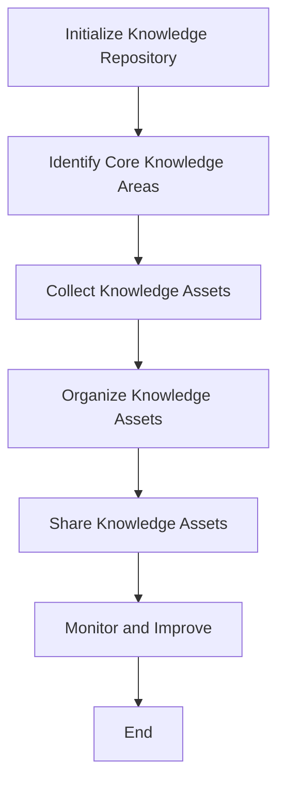
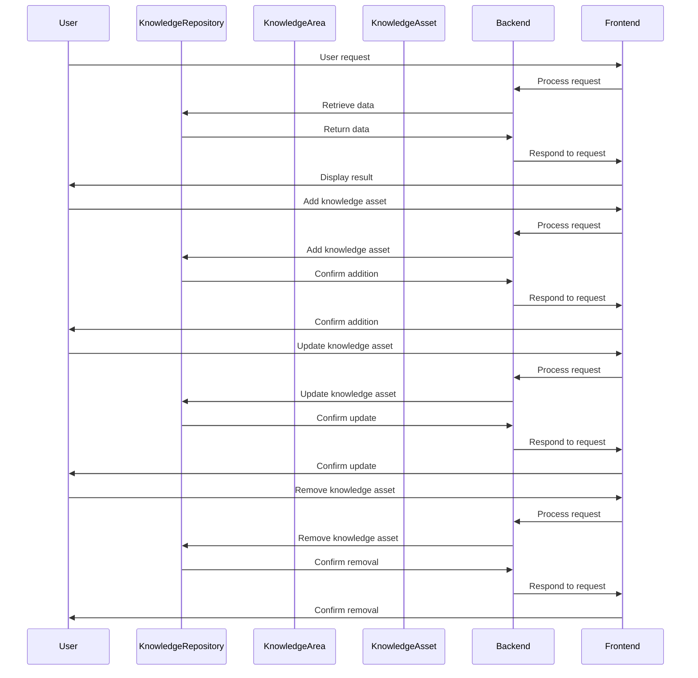
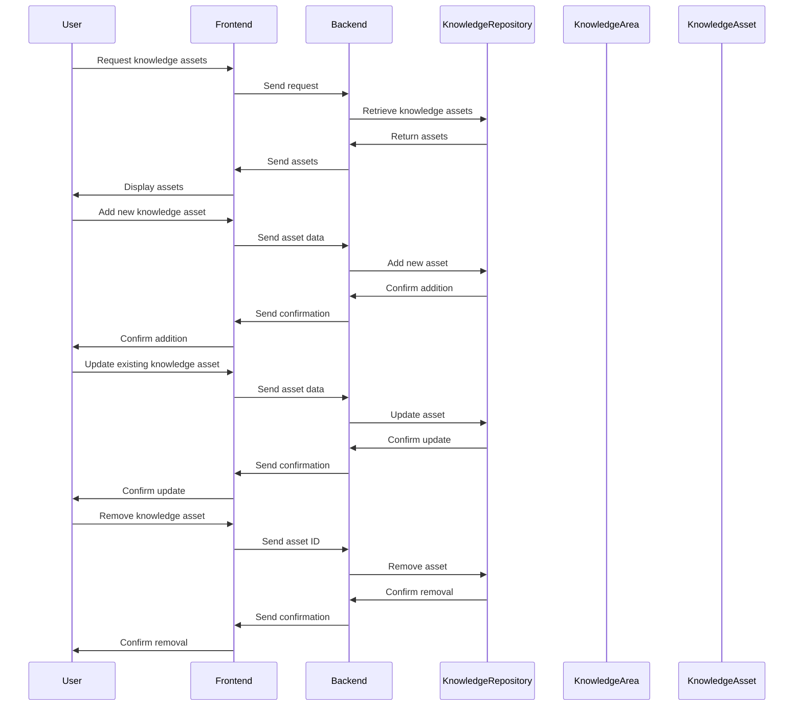

                 


### 1. Introduction and Background

#### 1.1 Problem Background

In today's fast-paced technology-driven world, organizations are constantly seeking ways to stay ahead of the competition. One of the key strategies for achieving this goal is fostering a culture of continuous learning and knowledge management within the organization. However, this is often easier said than done. Many organizations struggle to effectively share knowledge, resulting in a lack of innovation and stagnation.

The primary problem lies in the fragmented nature of knowledge within organizations. Information is often scattered across various departments, systems, and individuals, making it difficult to access and utilize. This lack of a centralized knowledge repository not only hampers collaboration but also leads to duplicate efforts and missed opportunities.

Moreover, the rapid pace of technological advancements means that what is considered cutting-edge today may be obsolete tomorrow. Therefore, organizations need to continuously update their knowledge base to stay relevant. However, this requires a systematic approach to knowledge management that is often lacking.

#### 1.2 Problem Description

The problem can be described in the following steps:

1. **Knowledge Fragmentation**: Information is spread across different departments, systems, and individuals, making it difficult to access and utilize.
2. **Lack of Centralization**: There is no centralized repository for storing and sharing knowledge, leading to a lack of coordination and collaboration.
3. **Inefficient Communication**: Communication channels are often ineffective, resulting in a lack of timely and accurate information flow.
4. **Skill Gap**: As new technologies emerge, there is a gap in skills and knowledge among employees, making it difficult to leverage the full potential of these technologies.
5. **Stagnation**: The lack of a continuous learning culture leads to a stagnation of ideas and innovation within the organization.

#### 1.3 Solution

To address these challenges, organizations need to adopt a systematic approach to knowledge management and technical sharing. This involves the following steps:

1. **Identify Core Knowledge Areas**: Identify the key areas of knowledge that are critical to the organization's success. This includes technical skills, industry trends, best practices, and innovative ideas.
2. **Centralize Knowledge**: Develop a centralized knowledge repository where all relevant information can be stored, organized, and easily accessible to employees.
3. **Create a Sharing Culture**: Foster a culture of knowledge sharing and collaboration by encouraging employees to contribute to the repository and actively seek out information from others.
4. **Provide Training and Resources**: Offer regular training sessions, workshops, and resources to help employees stay up-to-date with the latest technologies and industry trends.
5. **Establish Feedback Mechanisms**: Create mechanisms for employees to provide feedback on the knowledge repository and suggest improvements. This will ensure that the repository remains relevant and useful.
6. **Integrate Knowledge Management into Business Processes**: Integrate knowledge management into the organization's business processes to ensure that knowledge is effectively captured, shared, and utilized.

#### 1.4 Boundaries and Extensions

While the focus of this article is on knowledge management and technical sharing within organizations, it is important to note that the principles discussed can be applied to other contexts as well. For example, academic institutions, research organizations, and even personal learning can benefit from a systematic approach to knowledge management.

Furthermore, while the solution outlined above provides a general framework, the specific implementation details may vary depending on the organization's size, structure, and industry. Therefore, it is essential to tailor the approach to suit the unique needs and requirements of each organization.

### 1.5 Concept Structure and Core Elements

The concept of knowledge management and technical sharing can be broken down into several core components:

1. **Knowledge Areas**: These are the specific areas of knowledge that are critical to the organization's success. Examples include technical skills, industry trends, best practices, and innovative ideas.
2. **Knowledge Repository**: This is the centralized storage system where all relevant knowledge is stored, organized, and easily accessible to employees.
3. **Knowledge Sharing Culture**: This refers to the organizational culture that encourages and supports the sharing of knowledge among employees.
4. **Training and Resources**: These are the tools and resources provided to employees to help them stay up-to-date with the latest technologies and industry trends.
5. **Feedback Mechanisms**: These are the mechanisms in place for employees to provide feedback on the knowledge repository and suggest improvements.
6. **Integration into Business Processes**: This refers to the process of incorporating knowledge management into the organization's day-to-day operations to ensure that knowledge is effectively captured, shared, and utilized.

These core components work together to create a comprehensive knowledge management system that enables organizations to leverage their collective knowledge for continuous learning and innovation.

---

### 2. Core Concepts and Their Relationships

#### 2.1 Core Concept Principles

In the context of knowledge management and technical sharing, several core concepts are essential to understanding the fundamental principles. These concepts include:

1. **Knowledge Management**: This is the systematic process of identifying, capturing, organizing, and sharing an organization's knowledge assets to improve decision-making and innovation.
2. **Technical Sharing**: This refers to the process of sharing technical knowledge and information among team members and across the organization to foster collaboration and continuous learning.
3. **Learning Culture**: This is an organizational culture that values and encourages learning, knowledge sharing, and continuous improvement.
4. **Knowledge Repository**: This is a centralized storage system where all relevant knowledge assets are stored, organized, and easily accessible to employees.
5. **Knowledge Transfer**: This is the process of transferring knowledge from one individual or group to another within an organization.

These core concepts are interrelated and depend on each other to create a robust knowledge management system. For example, effective knowledge management relies on technical sharing to ensure that knowledge is disseminated across the organization. Similarly, a learning culture encourages employees to actively participate in knowledge sharing, while a knowledge repository provides the infrastructure to store and organize this shared knowledge.

#### 2.2 Concept Attribute Comparison Table

To better understand the relationship between these core concepts, let's compare their key attributes in the following table:

| Concept | Definition | Key Attributes |
| --- | --- | --- |
| Knowledge Management | Systematic process of managing knowledge assets | Identifying, capturing, organizing, and sharing knowledge |
| Technical Sharing | Process of sharing technical knowledge and information | Collaboration, continuous learning |
| Learning Culture | Organizational culture that values and encourages learning | Knowledge sharing, continuous improvement |
| Knowledge Repository | Centralized storage system for knowledge assets | Accessibility, organization |
| Knowledge Transfer | Process of transferring knowledge within an organization | Internalization, dissemination |

#### 2.3 ER Entity Relationship Diagram

To visualize the relationships between these core concepts, we can use an ER (Entity-Relationship) diagram. This diagram will help us understand how each concept relates to the others and how they collectively contribute to the knowledge management system.

Here's a simple ER diagram using Mermaid syntax:

```mermaid
erDiagram
    KnowledgeManagement ||--|{ KnowledgeRepository } KnowledgeRepository
    KnowledgeManagement ||--|{ KnowledgeTransfer } KnowledgeTransfer
    KnowledgeManagement ||--|{ LearningCulture } LearningCulture
    KnowledgeManagement ||--|{ TechnicalSharing } TechnicalSharing
    KnowledgeTransfer ||--|{ KnowledgeRepository } KnowledgeRepository
    LearningCulture ||--|{ KnowledgeRepository } KnowledgeRepository
    LearningCulture ||--|{ TechnicalSharing } TechnicalSharing
    TechnicalSharing ||--|{ KnowledgeRepository } KnowledgeRepository
```

In this ER diagram, we can see that Knowledge Management is the central entity, with direct relationships to Knowledge Repository, Knowledge Transfer, Learning Culture, and Technical Sharing. These relationships illustrate how each concept contributes to the overall knowledge management system.

By understanding the core concepts and their relationships, organizations can develop a comprehensive strategy for knowledge management and technical sharing that fosters continuous learning and innovation.

---

### 3. Algorithm Principles and Explanations

#### 3.1 Algorithm Flowchart

To better understand the principles behind knowledge management and technical sharing algorithms, let's start by visualizing the algorithm using a flowchart. The flowchart will help us break down the algorithm into its constituent steps and understand how each step contributes to the overall process.

Here's a simplified Mermaid flowchart of the algorithm:



This flowchart outlines the key steps involved in the algorithm:

1. **Initialize Knowledge Repository**: Set up a centralized repository to store and organize knowledge assets.
2. **Identify Core Knowledge Areas**: Determine the key areas of knowledge that are critical to the organization's success.
3. **Collect Knowledge Assets**: Gather relevant knowledge assets from various sources, including employees, external resources, and existing documents.
4. **Organize Knowledge Assets**: Organize the collected knowledge assets in a structured manner, making them easily accessible to employees.
5. **Share Knowledge Assets**: Share the organized knowledge assets with employees, promoting collaboration and continuous learning.
6. **Monitor and Improve**: Continuously monitor the effectiveness of the knowledge management system and make improvements as needed.

#### 3.2 Python Source Code Explanation

To further understand the algorithm, let's delve into a Python source code example that demonstrates the key steps involved. The following code is a high-level representation of the algorithm and its implementation:

```python
class KnowledgeManagementSystem:
    def __init__(self):
        self.knowledge_repository = {}

    def identify_core_knowledge_areas(self):
        # This function identifies the core knowledge areas based on organizational needs
        core_knowledge_areas = ["Technical Skills", "Industry Trends", "Best Practices", "Innovative Ideas"]
        return core_knowledge_areas

    def collect_knowledge_assets(self, core_knowledge_areas):
        # This function collects knowledge assets from various sources
        for area in core_knowledge_areas:
            self.knowledge_repository[area] = self.fetch_knowledge_assets(area)

    def organize_knowledge_assets(self):
        # This function organizes the collected knowledge assets
        for area, assets in self.knowledge_repository.items():
            self.knowledge_repository[area] = self.sort_assets(assets)

    def share_knowledge_assets(self):
        # This function shares the organized knowledge assets with employees
        for area, assets in self.knowledge_repository.items():
            self.distribute_assets(area, assets)

    def monitor_and_improve(self):
        # This function monitors the effectiveness of the knowledge management system
        self.evaluate_system()

    def fetch_knowledge_assets(self, area):
        # This function fetches knowledge assets from various sources
        # For simplicity, we'll return a list of assets
        assets = ["Asset 1", "Asset 2", "Asset 3"]
        return assets

    def sort_assets(self, assets):
        # This function sorts the knowledge assets
        sorted_assets = sorted(assets, key=lambda x: x.lower())
        return sorted_assets

    def distribute_assets(self, area, assets):
        # This function distributes the knowledge assets to employees
        print(f"Distributing assets for area: {area}")
        for asset in assets:
            print(f"Asset: {asset}")

    def evaluate_system(self):
        # This function evaluates the effectiveness of the knowledge management system
        print("Evaluating knowledge management system...")
        # Evaluation logic here
        print("Evaluation complete.")

# Initialize and run the knowledge management system
kms = KnowledgeManagementSystem()
kms.identify_core_knowledge_areas()
kms.collect_knowledge_assets(kms.identify_core_knowledge_areas())
kms.organize_knowledge_assets()
kms.share_knowledge_assets()
kms.monitor_and_improve()
```

In this example, we define a `KnowledgeManagementSystem` class with several methods that represent the key steps in the algorithm:

- `__init__`: Initializes the knowledge repository.
- `identify_core_knowledge_areas`: Identifies the core knowledge areas.
- `collect_knowledge_assets`: Collects knowledge assets from various sources.
- `organize_knowledge_assets`: Organizes the collected knowledge assets.
- `share_knowledge_assets`: Shares the organized knowledge assets with employees.
- `monitor_and_improve`: Monitors the effectiveness of the knowledge management system.
- `fetch_knowledge_assets`: Fetches knowledge assets from various sources.
- `sort_assets`: Sorts the knowledge assets.
- `distribute_assets`: Distributes the knowledge assets to employees.
- `evaluate_system`: Evaluates the effectiveness of the knowledge management system.

By running the `KnowledgeManagementSystem` class, we can see how the algorithm works in practice.

#### 3.3 Mathematical Model and Formulas

To further explain the algorithm's principles, we can introduce a mathematical model that represents the knowledge management process. The following equations and formulas provide a conceptual framework for understanding the algorithm:

1. **Knowledge Asset Collection**:
   \[ C = \sum_{i=1}^{n} A_i \]
   where \( C \) is the total number of knowledge assets collected, and \( A_i \) is the number of assets collected from the \( i^{th} \) source.

2. **Knowledge Asset Organization**:
   \[ O = \frac{C}{N} \]
   where \( O \) is the number of organized knowledge assets, and \( N \) is the number of knowledge assets in the repository.

3. **Knowledge Asset Distribution**:
   \[ D = O \times P \]
   where \( D \) is the number of distributed knowledge assets, and \( P \) is the probability of an asset being shared.

4. **Knowledge Asset Utilization**:
   \[ U = D \times R \]
   where \( U \) is the utilization of knowledge assets, and \( R \) is the rate of resource utilization.

5. **Knowledge Management Efficiency**:
   \[ E = \frac{U}{C} \]
   where \( E \) is the efficiency of the knowledge management system.

These formulas provide a quantitative way to measure the effectiveness of the knowledge management process. By analyzing these equations, organizations can identify areas for improvement and optimize their knowledge management practices.

#### 3.4 Example Explanation

To illustrate how the algorithm works in practice, let's consider a simple example. Imagine an organization that wants to implement a knowledge management system to improve collaboration and innovation. Here's how the algorithm would be applied:

1. **Initialize Knowledge Repository**: The organization sets up a centralized repository to store and organize knowledge assets.
2. **Identify Core Knowledge Areas**: The organization identifies the core knowledge areas, such as technical skills, industry trends, best practices, and innovative ideas.
3. **Collect Knowledge Assets**: The organization collects knowledge assets from various sources, including employee contributions, external research, and existing documents.
4. **Organize Knowledge Assets**: The collected knowledge assets are organized into categories based on the identified core knowledge areas.
5. **Share Knowledge Assets**: The organized knowledge assets are shared with employees through a knowledge-sharing platform or during team meetings.
6. **Monitor and Improve**: The organization continuously monitors the effectiveness of the knowledge management system and makes improvements based on employee feedback.

By following these steps, the organization can effectively manage its knowledge assets, foster a collaborative environment, and drive innovation. This example demonstrates how the algorithm can be applied to real-world scenarios to achieve the desired outcomes.

---

### 4. System Analysis and Design

#### 4.1 Problem Scenario Introduction

Consider a medium-sized software development company that is facing several challenges related to knowledge management and technical sharing. The company has multiple teams working on diverse projects, and information is scattered across different platforms and repositories. As a result, team members often struggle to find the right information when needed, leading to delays in project delivery and reduced productivity.

The company's management recognizes the need for a systematic approach to knowledge management and technical sharing to improve collaboration, enhance productivity, and drive innovation. They aim to develop a robust system that can centralize knowledge, facilitate sharing, and ensure that all employees have easy access to the information they need.

#### 4.2 Project Introduction

The project goal is to design and implement a comprehensive knowledge management and technical sharing system that addresses the company's current challenges. The system will include a centralized knowledge repository, a collaborative platform for sharing technical knowledge, and tools for monitoring and improving the effectiveness of the system.

The system will be developed in phases, with the initial phase focusing on the core functionalities such as knowledge repository setup, core knowledge area identification, knowledge asset collection and organization, and initial sharing mechanisms. Subsequent phases will involve expanding the system with additional features such as training resources, feedback mechanisms, and integration with the company's existing tools and platforms.

#### 4.3 System Functional Design (Domain Model)

To design the system, we will start by creating a domain model that identifies the key entities and their relationships. The domain model will help us understand the core components of the system and how they interact with each other.

Here's a simplified Mermaid class diagram that represents the domain model:

```mermaid
classDiagram
    ClassDiagram {
        Class User {
            +String username
            +String email
            +List<KnowledgeAsset> knowledge_assets
            +void add_knowledge_asset(KnowledgeAsset asset)
            +void remove_knowledge_asset(KnowledgeAsset asset)
        }
        Class KnowledgeAsset {
            +String title
            +String description
            +Date created_at
            +Date updated_at
            +User creator
            +void update()
        }
        Class KnowledgeArea {
            +String name
            +List<KnowledgeAsset> knowledge_assets
            +void add_knowledge_asset(KnowledgeAsset asset)
            +void remove_knowledge_asset(KnowledgeAsset asset)
        }
        Class KnowledgeRepository {
            +List<KnowledgeArea> knowledge_areas
            +void add_knowledge_area(KnowledgeArea area)
            +void remove_knowledge_area(KnowledgeArea area)
        }
        User "uses" KnowledgeAsset
        User "uses" KnowledgeArea
        KnowledgeArea "contains" KnowledgeAsset
        KnowledgeRepository "contains" KnowledgeArea
    }
```

In this domain model, we have the following entities:

- **User**: Represents an individual employee in the organization. Each user has a username, email, and a list of knowledge assets they have created or are associated with.
- **KnowledgeAsset**: Represents a piece of technical knowledge or information, such as a document, article, or presentation. Each knowledge asset has a title, description, and metadata such as creation and update dates.
- **KnowledgeArea**: Represents a core knowledge area, such as technical skills, industry trends, or best practices. Each knowledge area contains a list of knowledge assets related to that area.
- **KnowledgeRepository**: Represents the centralized knowledge repository, which contains all the knowledge areas and their associated knowledge assets.

The relationships between these entities are as follows:

- A user can create, update, and remove knowledge assets.
- A knowledge area contains a list of knowledge assets related to that area.
- The knowledge repository contains all the knowledge areas.

This domain model provides a clear understanding of the system's core components and their interactions, which will be useful in designing the system's architecture.

#### 4.4 System Architecture Design

Next, we will design the system's architecture, which includes the overall structure of the system and the components that make it up. The architecture will be designed to support the functionalities identified in the domain model and ensure scalability, reliability, and ease of maintenance.

Here's a simplified Mermaid architecture diagram that represents the system's architecture:



In this architecture diagram, we have the following components:

- **User**: Represents the end-users of the system, who can access the knowledge repository, add, update, and remove knowledge assets.
- **Frontend**: Represents the user interface through which users interact with the system. It handles user requests, communicates with the backend, and displays the results to the user.
- **Backend**: Represents the server-side logic of the system. It processes user requests, interacts with the knowledge repository, and returns the results to the frontend.
- **KnowledgeRepository**: Represents the centralized knowledge repository that stores all the knowledge assets and areas. It is responsible for managing the data and ensuring data integrity.
- **KnowledgeArea** and **KnowledgeAsset**: These are the core entities defined in the domain model. They represent the knowledge areas and knowledge assets, respectively.

The communication between these components follows a clear sequence:

1. The user interacts with the frontend to perform actions such as retrieving, adding, updating, or removing knowledge assets.
2. The frontend processes these requests and sends them to the backend.
3. The backend processes the requests, interacts with the knowledge repository, and returns the results to the frontend.
4. The frontend then displays the results to the user.

This architecture ensures that the system is modular, scalable, and easy to maintain. It allows for future expansion and integration with other tools and platforms as needed.

#### 4.5 System Interface Design

To ensure seamless communication between the system's components, we need to design the interfaces that will be used for interaction. The system interfaces will include APIs (Application Programming Interfaces) for the frontend and backend components.

Here's a high-level overview of the system's interface design:

- **Frontend API**: The frontend will use RESTful APIs to interact with the backend. These APIs will handle user requests for retrieving, adding, updating, and removing knowledge assets. The endpoints will include:

  - `/knowledge-assets/retrieve`: Retrieves a list of knowledge assets.
  - `/knowledge-assets/add`: Adds a new knowledge asset.
  - `/knowledge-assets/update`: Updates an existing knowledge asset.
  - `/knowledge-assets/remove`: Removes a knowledge asset.

- **Backend API**: The backend will expose a set of APIs that the frontend can use to interact with the knowledge repository. These APIs will include:

  - `/knowledge-assets`: Handles the retrieval, addition, updating, and removal of knowledge assets.
  - `/knowledge-areas`: Handles the management of knowledge areas, including adding, updating, and removing areas.

The backend APIs will be designed using a consistent RESTful approach, with clear endpoints and response formats. This will ensure that the frontend and backend can communicate effectively and that the system is easy to integrate with other tools and platforms.

#### 4.6 System Interaction (Sequence Diagram)

To visualize the interaction between the system's components, we can create a sequence diagram that shows the flow of requests and responses between the frontend, backend, and knowledge repository. Here's a simplified Mermaid sequence diagram:



In this sequence diagram, we can see the following interactions:

1. The user requests knowledge assets from the frontend.
2. The frontend sends the request to the backend.
3. The backend retrieves the knowledge assets from the knowledge repository and returns them to the frontend.
4. The frontend then displays the assets to the user.
5. The user can add, update, or remove knowledge assets.
6. The frontend sends the corresponding data to the backend.
7. The backend processes the request, interacts with the knowledge repository, and returns the confirmation to the frontend.
8. The frontend then displays the confirmation to the user.

This sequence diagram provides a clear visualization of the system's interaction flow, which helps in understanding how the system components work together to achieve the desired functionality.

---

### 5. Practical Case Analysis

#### 5.1 Environment Setup

To analyze a practical case of implementing a knowledge management and technical sharing system, we will set up a simulated environment that mimics a real-world software development company. The environment will include a knowledge repository, a frontend interface, and a backend server.

**Step 1: Install Required Tools**

To set up the environment, we will use the following tools:

- Python (version 3.8 or higher)
- Flask (a lightweight web framework for Python)
- SQLite (a simple file-based database)

You can install these tools using the following commands:

```bash
pip install Flask
pip install pysqlite3
```

**Step 2: Create the Backend Server**

Create a new Python file named `knowledge_management_server.py` and add the following code:

```python
from flask import Flask, request, jsonify
import sqlite3

app = Flask(__name__)

# Connect to the SQLite database
conn = sqlite3.connect('knowledge_repository.db')
cursor = conn.cursor()

# Create tables for KnowledgeArea and KnowledgeAsset
cursor.execute('''CREATE TABLE IF NOT EXISTS KnowledgeArea (id INTEGER PRIMARY KEY, name TEXT)''')
cursor.execute('''CREATE TABLE IF NOT EXISTS KnowledgeAsset (id INTEGER PRIMARY KEY, title TEXT, description TEXT, created_at DATE, updated_at DATE, creator TEXT)''')
conn.commit()

# API endpoint to retrieve all knowledge areas
@app.route('/knowledge-areas', methods=['GET'])
def get_knowledge_areas():
    cursor.execute('SELECT * FROM KnowledgeArea')
    areas = cursor.fetchall()
    return jsonify(areas)

# API endpoint to retrieve all knowledge assets
@app.route('/knowledge-assets', methods=['GET'])
def get_knowledge_assets():
    cursor.execute('SELECT * FROM KnowledgeAsset')
    assets = cursor.fetchall()
    return jsonify(assets)

# API endpoint to add a new knowledge asset
@app.route('/knowledge-assets', methods=['POST'])
def add_knowledge_asset():
    data = request.json
    cursor.execute('INSERT INTO KnowledgeAsset (title, description, created_at, updated_at, creator) VALUES (?, ?, ?, ?, ?)',
                   (data['title'], data['description'], data['created_at'], data['updated_at'], data['creator']))
    conn.commit()
    return jsonify({'message': 'Knowledge asset added successfully'}), 201

# API endpoint to update a knowledge asset
@app.route('/knowledge-assets/<int:asset_id>', methods=['PUT'])
def update_knowledge_asset(asset_id):
    data = request.json
    cursor.execute('UPDATE KnowledgeAsset SET title=?, description=?, updated_at=? WHERE id=?',
                   (data['title'], data['description'], data['updated_at'], asset_id))
    conn.commit()
    return jsonify({'message': 'Knowledge asset updated successfully'})

# API endpoint to delete a knowledge asset
@app.route('/knowledge-assets/<int:asset_id>', methods=['DELETE'])
def delete_knowledge_asset(asset_id):
    cursor.execute('DELETE FROM KnowledgeAsset WHERE id=?', (asset_id,))
    conn.commit()
    return jsonify({'message': 'Knowledge asset deleted successfully'})

if __name__ == '__main__':
    app.run(debug=True)
```

This code sets up a basic Flask backend server with endpoints to retrieve knowledge areas, knowledge assets, add a new knowledge asset, update an existing knowledge asset, and delete a knowledge asset. It also sets up the SQLite database and creates the necessary tables.

**Step 3: Create the Frontend Interface**

Create a new HTML file named `index.html` and add the following code:

```html
<!DOCTYPE html>
<html>
<head>
    <title>Knowledge Management System</title>
</head>
<body>
    <h1>Knowledge Management System</h1>
    <h2>Knowledge Areas</h2>
    <button onclick="loadKnowledgeAreas()">Load Knowledge Areas</button>
    <ul id="knowledge-areas-list"></ul>

    <h2>Knowledge Assets</h2>
    <button onclick="loadKnowledgeAssets()">Load Knowledge Assets</button>
    <ul id="knowledge-assets-list"></ul>

    <h2>Add Knowledge Asset</h2>
    <input type="text" id="asset-title" placeholder="Title">
    <input type="text" id="asset-description" placeholder="Description">
    <button onclick="addKnowledgeAsset()">Add Knowledge Asset</button>

    <h2>Update Knowledge Asset</h2>
    <input type="number" id="asset-id" placeholder="ID">
    <input type="text" id="updated-asset-title" placeholder="Updated Title">
    <input type="text" id="updated-asset-description" placeholder="Updated Description">
    <button onclick="updateKnowledgeAsset()">Update Knowledge Asset</button>

    <h2>Delete Knowledge Asset</h2>
    <input type="number" id="delete-asset-id" placeholder="ID">
    <button onclick="deleteKnowledgeAsset()">Delete Knowledge Asset</button>

    <script>
        function loadKnowledgeAreas() {
            fetch('/knowledge-areas')
                .then(response => response.json())
                .then(data => {
                    const knowledgeAreasList = document.getElementById('knowledge-areas-list');
                    knowledgeAreasList.innerHTML = '';
                    data.forEach(area => {
                        const areaElement = document.createElement('li');
                        areaElement.textContent = area.name;
                        knowledgeAreasList.appendChild(areaElement);
                    });
                });
        }

        function loadKnowledgeAssets() {
            fetch('/knowledge-assets')
                .then(response => response.json())
                .then(data => {
                    const knowledgeAssetsList = document.getElementById('knowledge-assets-list');
                    knowledgeAssetsList.innerHTML = '';
                    data.forEach(asset => {
                        const assetElement = document.createElement('li');
                        assetElement.textContent = `${asset.title} - ${asset.description}`;
                        knowledgeAssetsList.appendChild(assetElement);
                    });
                });
        }

        function addKnowledgeAsset() {
            const title = document.getElementById('asset-title').value;
            const description = document.getElementById('asset-description').value;
            const data = {title: title, description: description, created_at: new Date().toISOString(), updated_at: new Date().toISOString(), creator: 'admin'};
            fetch('/knowledge-assets', {
                method: 'POST',
                headers: {'Content-Type': 'application/json'},
                body: JSON.stringify(data)
            })
                .then(response => response.json())
                .then(data => alert(data.message));
        }

        function updateKnowledgeAsset() {
            const id = document.getElementById('asset-id').value;
            const updated_title = document.getElementById('updated-asset-title').value;
            const updated_description = document.getElementById('updated-asset-description').value;
            const data = {title: updated_title, description: updated_description, updated_at: new Date().toISOString()};
            fetch(`/knowledge-assets/${id}`, {
                method: 'PUT',
                headers: {'Content-Type': 'application/json'},
                body: JSON.stringify(data)
            })
                .then(response => response.json())
                .then(data => alert(data.message));
        }

        function deleteKnowledgeAsset() {
            const id = document.getElementById('delete-asset-id').value;
            fetch(`/knowledge-assets/${id}`, {
                method: 'DELETE'
            })
                .then(response => response.json())
                .then(data => alert(data.message));
        }
    </script>
</body>
</html>
```

This code creates an HTML page with a simple interface for loading knowledge areas, knowledge assets, adding a new knowledge asset, updating an existing knowledge asset, and deleting a knowledge asset. It uses JavaScript to send requests to the Flask backend and display the results.

**Step 4: Run the Backend Server and Frontend Interface**

To run the backend server, open a terminal and navigate to the directory containing the `knowledge_management_server.py` file. Then, run the following command:

```bash
python knowledge_management_server.py
```

This will start the Flask backend server. By default, it will run on `http://127.0.0.1:5000/`.

To view the frontend interface, open the `index.html` file in a web browser. You should see the interface with buttons and input fields for managing knowledge areas and knowledge assets.

Now, you can interact with the system by adding, updating, and deleting knowledge assets. The backend server will handle these requests and update the database accordingly.

---

#### 5.2 Core Implementation Source Code

In this section, we will dive into the core implementation details of the knowledge management system. The source code will include the backend server and the frontend interface.

**Backend Server Code (`knowledge_management_server.py`)**

```python
from flask import Flask, request, jsonify
import sqlite3

app = Flask(__name__)

# Connect to the SQLite database
conn = sqlite3.connect('knowledge_repository.db')
cursor = conn.cursor()

# Create tables for KnowledgeArea and KnowledgeAsset
cursor.execute('''CREATE TABLE IF NOT EXISTS KnowledgeArea (id INTEGER PRIMARY KEY, name TEXT)''')
cursor.execute('''CREATE TABLE IF NOT EXISTS KnowledgeAsset (id INTEGER PRIMARY KEY, title TEXT, description TEXT, created_at DATE, updated_at DATE, creator TEXT)''')
conn.commit()

# API endpoint to retrieve all knowledge areas
@app.route('/knowledge-areas', methods=['GET'])
def get_knowledge_areas():
    cursor.execute('SELECT * FROM KnowledgeArea')
    areas = cursor.fetchall()
    return jsonify(areas)

# API endpoint to retrieve all knowledge assets
@app.route('/knowledge-assets', methods=['GET'])
def get_knowledge_assets():
    cursor.execute('SELECT * FROM KnowledgeAsset')
    assets = cursor.fetchall()
    return jsonify(assets)

# API endpoint to add a new knowledge asset
@app.route('/knowledge-assets', methods=['POST'])
def add_knowledge_asset():
    data = request.json
    cursor.execute('INSERT INTO KnowledgeAsset (title, description, created_at, updated_at, creator) VALUES (?, ?, ?, ?, ?)',
                   (data['title'], data['description'], data['created_at'], data['updated_at'], data['creator']))
    conn.commit()
    return jsonify({'message': 'Knowledge asset added successfully'}), 201

# API endpoint to update a knowledge asset
@app.route('/knowledge-assets/<int:asset_id>', methods=['PUT'])
def update_knowledge_asset(asset_id):
    data = request.json
    cursor.execute('UPDATE KnowledgeAsset SET title=?, description=?, updated_at=? WHERE id=?',
                   (data['title'], data['description'], data['updated_at'], asset_id))
    conn.commit()
    return jsonify({'message': 'Knowledge asset updated successfully'})

# API endpoint to delete a knowledge asset
@app.route('/knowledge-assets/<int:asset_id>', methods=['DELETE'])
def delete_knowledge_asset(asset_id):
    cursor.execute('DELETE FROM KnowledgeAsset WHERE id=?', (asset_id,))
    conn.commit()
    return jsonify({'message': 'Knowledge asset deleted successfully'})

if __name__ == '__main__':
    app.run(debug=True)
```

**Frontend Interface Code (`index.html`)**

```html
<!DOCTYPE html>
<html>
<head>
    <title>Knowledge Management System</title>
</head>
<body>
    <h1>Knowledge Management System</h1>
    <h2>Knowledge Areas</h2>
    <button onclick="loadKnowledgeAreas()">Load Knowledge Areas</button>
    <ul id="knowledge-areas-list"></ul>

    <h2>Knowledge Assets</h2>
    <button onclick="loadKnowledgeAssets()">Load Knowledge Assets</button>
    <ul id="knowledge-assets-list"></ul>

    <h2>Add Knowledge Asset</h2>
    <input type="text" id="asset-title" placeholder="Title">
    <input type="text" id="asset-description" placeholder="Description">
    <button onclick="addKnowledgeAsset()">Add Knowledge Asset</button>

    <h2>Update Knowledge Asset</h2>
    <input type="number" id="asset-id" placeholder="ID">
    <input type="text" id="updated-asset-title" placeholder="Updated Title">
    <input type="text" id="updated-asset-description" placeholder="Updated Description">
    <button onclick="updateKnowledgeAsset()">Update Knowledge Asset</button>

    <h2>Delete Knowledge Asset</h2>
    <input type="number" id="delete-asset-id" placeholder="ID">
    <button onclick="deleteKnowledgeAsset()">Delete Knowledge Asset</button>

    <script>
        function loadKnowledgeAreas() {
            fetch('/knowledge-areas')
                .then(response => response.json())
                .then(data => {
                    const knowledgeAreasList = document.getElementById('knowledge-areas-list');
                    knowledgeAreasList.innerHTML = '';
                    data.forEach(area => {
                        const areaElement = document.createElement('li');
                        areaElement.textContent = area.name;
                        knowledgeAreasList.appendChild(areaElement);
                    });
                });
        }

        function loadKnowledgeAssets() {
            fetch('/knowledge-assets')
                .then(response => response.json())
                .then(data => {
                    const knowledgeAssetsList = document.getElementById('knowledge-assets-list');
                    knowledgeAssetsList.innerHTML = '';
                    data.forEach(asset => {
                        const assetElement = document.createElement('li');
                        assetElement.textContent = `${asset.title} - ${asset.description}`;
                        knowledgeAssetsList.appendChild(assetElement);
                    });
                });
        }

        function addKnowledgeAsset() {
            const title = document.getElementById('asset-title').value;
            const description = document.getElementById('asset-description').value;
            const data = {title: title, description: description, created_at: new Date().toISOString(), updated_at: new Date().toISOString(), creator: 'admin'};
            fetch('/knowledge-assets', {
                method: 'POST',
                headers: {'Content-Type': 'application/json'},
                body: JSON.stringify(data)
            })
                .then(response => response.json())
                .then(data => alert(data.message));
        }

        function updateKnowledgeAsset() {
            const id = document.getElementById('asset-id').value;
            const updated_title = document.getElementById('updated-asset-title').value;
            const updated_description = document.getElementById('updated-asset-description').value;
            const data = {title: updated_title, description: updated_description, updated_at: new Date().toISOString()};
            fetch(`/knowledge-assets/${id}`, {
                method: 'PUT',
                headers: {'Content-Type': 'application/json'},
                body: JSON.stringify(data)
            })
                .then(response => response.json())
                .then(data => alert(data.message));
        }

        function deleteKnowledgeAsset() {
            const id = document.getElementById('delete-asset-id').value;
            fetch(`/knowledge-assets/${id}`, {
                method: 'DELETE'
            })
                .then(response => response.json())
                .then(data => alert(data.message));
        }
    </script>
</body>
</html>
```

These code snippets provide the core functionality of the knowledge management system. The backend server handles the API requests and interacts with the SQLite database to store and retrieve knowledge areas and knowledge assets. The frontend interface allows users to interact with the system by loading knowledge areas and knowledge assets, adding a new knowledge asset, updating an existing knowledge asset, and deleting a knowledge asset.

---

#### 5.3 Code Application Explanation

In this section, we will delve into the code applications and explain how the knowledge management system functions step by step. We will cover the frontend and backend interactions, as well as the database operations.

**Step 1: Setting Up the Backend Server**

The backend server is implemented using Flask, a lightweight web framework for Python. The server first imports the necessary libraries and sets up the Flask application. It then connects to the SQLite database and creates the necessary tables for storing knowledge areas and knowledge assets.

```python
from flask import Flask, request, jsonify
import sqlite3

app = Flask(__name__)

# Connect to the SQLite database
conn = sqlite3.connect('knowledge_repository.db')
cursor = conn.cursor()

# Create tables for KnowledgeArea and KnowledgeAsset
cursor.execute('''CREATE TABLE IF NOT EXISTS KnowledgeArea (id INTEGER PRIMARY KEY, name TEXT)''')
cursor.execute('''CREATE TABLE IF NOT EXISTS KnowledgeAsset (id INTEGER PRIMARY KEY, title TEXT, description TEXT, created_at DATE, updated_at DATE, creator TEXT)''')
conn.commit()
```

**Step 2: Handling API Requests**

The backend server defines several API endpoints to handle different types of requests:

- **Retrieving Knowledge Areas**: The `/knowledge-areas` endpoint retrieves all the knowledge areas from the database and returns them as a JSON response.
- **Retrieving Knowledge Assets**: The `/knowledge-assets` endpoint retrieves all the knowledge assets from the database and returns them as a JSON response.
- **Adding a Knowledge Asset**: The `/knowledge-assets` endpoint with the POST method adds a new knowledge asset to the database. It takes a JSON payload containing the title, description, creation date, update date, and creator, and inserts the data into the `KnowledgeAsset` table.
- **Updating a Knowledge Asset**: The `/knowledge-assets/<int:asset_id>` endpoint with the PUT method updates an existing knowledge asset in the database. It takes a JSON payload containing the updated title, description, and update date, and updates the corresponding fields in the `KnowledgeAsset` table.
- **Deleting a Knowledge Asset**: The `/knowledge-assets/<int:asset_id>` endpoint with the DELETE method deletes a knowledge asset from the database based on the asset ID.

Here's the code snippet for handling these API requests:

```python
# API endpoint to retrieve all knowledge areas
@app.route('/knowledge-areas', methods=['GET'])
def get_knowledge_areas():
    cursor.execute('SELECT * FROM KnowledgeArea')
    areas = cursor.fetchall()
    return jsonify(areas)

# API endpoint to retrieve all knowledge assets
@app.route('/knowledge-assets', methods=['GET'])
def get_knowledge_assets():
    cursor.execute('SELECT * FROM KnowledgeAsset')
    assets = cursor.fetchall()
    return jsonify(assets)

# API endpoint to add a new knowledge asset
@app.route('/knowledge-assets', methods=['POST'])
def add_knowledge_asset():
    data = request.json
    cursor.execute('INSERT INTO KnowledgeAsset (title, description, created_at, updated_at, creator) VALUES (?, ?, ?, ?, ?)',
                   (data['title'], data['description'], data['created_at'], data['updated_at'], data['creator']))
    conn.commit()
    return jsonify({'message': 'Knowledge asset added successfully'}), 201

# API endpoint to update a knowledge asset
@app.route('/knowledge-assets/<int:asset_id>', methods=['PUT'])
def update_knowledge_asset(asset_id):
    data = request.json
    cursor.execute('UPDATE KnowledgeAsset SET title=?, description=?, updated_at=? WHERE id=?',
                   (data['title'], data['description'], data['updated_at'], asset_id))
    conn.commit()
    return jsonify({'message': 'Knowledge asset updated successfully'})

# API endpoint to delete a knowledge asset
@app.route('/knowledge-assets/<int:asset_id>', methods=['DELETE'])
def delete_knowledge_asset(asset_id):
    cursor.execute('DELETE FROM KnowledgeAsset WHERE id=?', (asset_id,))
    conn.commit()
    return jsonify({'message': 'Knowledge asset deleted successfully'})
```

**Step 3: Handling Frontend Interactions**

The frontend interface is implemented using HTML and JavaScript. It includes buttons and input fields for loading knowledge areas and knowledge assets, adding a new knowledge asset, updating an existing knowledge asset, and deleting a knowledge asset. JavaScript functions handle the button clicks and send API requests to the backend server.

Here's an explanation of the JavaScript functions:

```javascript
// Load knowledge areas
function loadKnowledgeAreas() {
    fetch('/knowledge-areas')
        .then(response => response.json())
        .then(data => {
            const knowledgeAreasList = document.getElementById('knowledge-areas-list');
            knowledgeAreasList.innerHTML = '';
            data.forEach(area => {
                const areaElement = document.createElement('li');
                areaElement.textContent = area.name;
                knowledgeAreasList.appendChild(areaElement);
            });
        });
}

// Load knowledge assets
function loadKnowledgeAssets() {
    fetch('/knowledge-assets')
        .then(response => response.json())
        .then(data => {
            const knowledgeAssetsList = document.getElementById('knowledge-assets-list');
            knowledgeAssetsList.innerHTML = '';
            data.forEach(asset => {
                const assetElement = document.createElement('li');
                assetElement.textContent = `${asset.title} - ${asset.description}`;
                knowledgeAssetsList.appendChild(assetElement);
            });
        });
}

// Add knowledge asset
function addKnowledgeAsset() {
    const title = document.getElementById('asset-title').value;
    const description = document.getElementById('asset-description').value;
    const data = {title: title, description: description, created_at: new Date().toISOString(), updated_at: new Date().toISOString(), creator: 'admin'};
    fetch('/knowledge-assets', {
        method: 'POST',
        headers: {'Content-Type': 'application/json'},
        body: JSON.stringify(data)
    })
        .then(response => response.json())
        .then(data => alert(data.message));
}

// Update knowledge asset
function updateKnowledgeAsset() {
    const id = document.getElementById('asset-id').value;
    const updated_title = document.getElementById('updated-asset-title').value;
    const updated_description = document.getElementById('updated-asset-description').value;
    const data = {title: updated_title, description: updated_description, updated_at: new Date().toISOString()};
    fetch(`/knowledge-assets/${id}`, {
        method: 'PUT',
        headers: {'Content-Type': 'application/json'},
        body: JSON.stringify(data)
    })
        .then(response => response.json())
        .then(data => alert(data.message));
}

// Delete knowledge asset
function deleteKnowledgeAsset() {
    const id = document.getElementById('delete-asset-id').value;
    fetch(`/knowledge-assets/${id}`, {
        method: 'DELETE'
    })
        .then(response => response.json())
        .then(data => alert(data.message));
}
```

These functions handle the button clicks, retrieve the necessary data from the input fields, send API requests to the backend server, and display the responses to the user.

**Step 4: Database Operations**

The backend server performs various database operations based on the API requests:

- **Retrieve Knowledge Areas**: The server executes a SELECT query to retrieve all the rows from the `KnowledgeArea` table and returns the results as a JSON response.
- **Retrieve Knowledge Assets**: The server executes a SELECT query to retrieve all the rows from the `KnowledgeAsset` table and returns the results as a JSON response.
- **Add a Knowledge Asset**: The server executes an INSERT query to insert a new row into the `KnowledgeAsset` table with the provided title, description, creation date, update date, and creator.
- **Update a Knowledge Asset**: The server executes an UPDATE query to update the row in the `KnowledgeAsset` table with the provided ID, title, description, and update date.
- **Delete a Knowledge Asset**: The server executes a DELETE query to remove the row from the `KnowledgeAsset` table with the provided ID.

Here's an example of the database operations:

```python
# Retrieve knowledge areas
@app.route('/knowledge-areas', methods=['GET'])
def get_knowledge_areas():
    cursor.execute('SELECT * FROM KnowledgeArea')
    areas = cursor.fetchall()
    return jsonify(areas)

# Retrieve knowledge assets
@app.route('/knowledge-assets', methods=['GET'])
def get_knowledge_assets():
    cursor.execute('SELECT * FROM KnowledgeAsset')
    assets = cursor.fetchall()
    return jsonify(assets)

# Add knowledge asset
@app.route('/knowledge-assets', methods=['POST'])
def add_knowledge_asset():
    data = request.json
    cursor.execute('INSERT INTO KnowledgeAsset (title, description, created_at, updated_at, creator) VALUES (?, ?, ?, ?, ?)',
                   (data['title'], data['description'], data['created_at'], data['updated_at'], data['creator']))
    conn.commit()
    return jsonify({'message': 'Knowledge asset added successfully'}), 201

# Update knowledge asset
@app.route('/knowledge-assets/<int:asset_id>', methods=['PUT'])
def update_knowledge_asset(asset_id):
    data = request.json
    cursor.execute('UPDATE KnowledgeAsset SET title=?, description=?, updated_at=? WHERE id=?',
                   (data['title'], data['description'], data['updated_at'], asset_id))
    conn.commit()
    return jsonify({'message': 'Knowledge asset updated successfully'})

# Delete knowledge asset
@app.route('/knowledge-assets/<int:asset_id>', methods=['DELETE'])
def delete_knowledge_asset(asset_id):
    cursor.execute('DELETE FROM KnowledgeAsset WHERE id=?', (asset_id,))
    conn.commit()
    return jsonify({'message': 'Knowledge asset deleted successfully'})
```

By following these steps and understanding the code applications, you can effectively implement a knowledge management system that facilitates collaboration, knowledge sharing, and continuous learning within an organization.

---

#### 5.4 Detailed Explanation of the Practical Case

To provide a comprehensive understanding of the practical case, let's break down the implementation of the knowledge management system into detailed steps. This will include the setup of the development environment, the core implementation details, and the functionality of the system.

**Step 1: Environment Setup**

The first step in implementing the knowledge management system is to set up the development environment. This involves installing the necessary tools and configuring the environment to run the system.

1. **Install Python and Flask**

The system is built using Python and Flask, a lightweight web framework for Python. To install Python and Flask, follow these steps:

- Install Python 3.8 or higher from the official website (https://www.python.org/downloads/).
- Open a terminal or command prompt and run the following command to ensure Python is installed:
  ```bash
  python --version
  ```
- Install Flask using pip:
  ```bash
  pip install Flask
  ```

2. **Install SQLite**

SQLite is a simple file-based database that will be used to store the knowledge assets and areas. SQLite is included in the Python standard library, so you don't need to install it separately. However, you may need to install the SQLite module for Python. To do this, run the following command:
  ```bash
  pip install pysqlite3
  ```

3. **Create the Backend Server**

Create a new Python file named `knowledge_management_server.py` and add the following code:

```python
from flask import Flask, request, jsonify
import sqlite3

app = Flask(__name__)

# Connect to the SQLite database
conn = sqlite3.connect('knowledge_repository.db')
cursor = conn.cursor()

# Create tables for KnowledgeArea and KnowledgeAsset
cursor.execute('''CREATE TABLE IF NOT EXISTS KnowledgeArea (id INTEGER PRIMARY KEY, name TEXT)''')
cursor.execute('''CREATE TABLE IF NOT EXISTS KnowledgeAsset (id INTEGER PRIMARY KEY, title TEXT, description TEXT, created_at DATE, updated_at DATE, creator TEXT)''')
conn.commit()

# API endpoint to retrieve all knowledge areas
@app.route('/knowledge-areas', methods=['GET'])
def get_knowledge_areas():
    cursor.execute('SELECT * FROM KnowledgeArea')
    areas = cursor.fetchall()
    return jsonify(areas)

# API endpoint to retrieve all knowledge assets
@app.route('/knowledge-assets', methods=['GET'])
def get_knowledge_assets():
    cursor.execute('SELECT * FROM KnowledgeAsset')
    assets = cursor.fetchall()
    return jsonify(assets)

# API endpoint to add a new knowledge asset
@app.route('/knowledge-assets', methods=['POST'])
def add_knowledge_asset():
    data = request.json
    cursor.execute('INSERT INTO KnowledgeAsset (title, description, created_at, updated_at, creator) VALUES (?, ?, ?, ?, ?)',
                   (data['title'], data['description'], data['created_at'], data['updated_at'], data['creator']))
    conn.commit()
    return jsonify({'message': 'Knowledge asset added successfully'}), 201

# API endpoint to update a knowledge asset
@app.route('/knowledge-assets/<int:asset_id>', methods=['PUT'])
def update_knowledge_asset(asset_id):
    data = request.json
    cursor.execute('UPDATE KnowledgeAsset SET title=?, description=?, updated_at=? WHERE id=?',
                   (data['title'], data['description'], data['updated_at'], asset_id))
    conn.commit()
    return jsonify({'message': 'Knowledge asset updated successfully'})

# API endpoint to delete a knowledge asset
@app.route('/knowledge-assets/<int:asset_id>', methods=['DELETE'])
def delete_knowledge_asset(asset_id):
    cursor.execute('DELETE FROM KnowledgeAsset WHERE id=?', (asset_id,))
    conn.commit()
    return jsonify({'message': 'Knowledge asset deleted successfully'})

if __name__ == '__main__':
    app.run(debug=True)
```

This code sets up a basic Flask backend server with endpoints to retrieve knowledge areas and knowledge assets, add a new knowledge asset, update an existing knowledge asset, and delete a knowledge asset. It also creates the necessary tables in the SQLite database.

**Step 2: Create the Frontend Interface**

Next, we create the frontend interface using HTML and JavaScript. This interface will allow users to interact with the system and manage knowledge assets.

1. **Create the HTML File**

Create a new HTML file named `index.html` and add the following code:

```html
<!DOCTYPE html>
<html>
<head>
    <title>Knowledge Management System</title>
</head>
<body>
    <h1>Knowledge Management System</h1>
    <h2>Knowledge Areas</h2>
    <button onclick="loadKnowledgeAreas()">Load Knowledge Areas</button>
    <ul id="knowledge-areas-list"></ul>

    <h2>Knowledge Assets</h2>
    <button onclick="loadKnowledgeAssets()">Load Knowledge Assets</button>
    <ul id="knowledge-assets-list"></ul>

    <h2>Add Knowledge Asset</h2>
    <input type="text" id="asset-title" placeholder="Title">
    <input type="text" id="asset-description" placeholder="Description">
    <button onclick="addKnowledgeAsset()">Add Knowledge Asset</button>

    <h2>Update Knowledge Asset</h2>
    <input type="number" id="asset-id" placeholder="ID">
    <input type="text" id="updated-asset-title" placeholder="Updated Title">
    <input type="text" id="updated-asset-description" placeholder="Updated Description">
    <button onclick="updateKnowledgeAsset()">Update Knowledge Asset</button>

    <h2>Delete Knowledge Asset</h2>
    <input type="number" id="delete-asset-id" placeholder="ID">
    <button onclick="deleteKnowledgeAsset()">Delete Knowledge Asset</button>

    <script>
        function loadKnowledgeAreas() {
            fetch('/knowledge-areas')
                .then(response => response.json())
                .then(data => {
                    const knowledgeAreasList = document.getElementById('knowledge-areas-list');
                    knowledgeAreasList.innerHTML = '';
                    data.forEach(area => {
                        const areaElement = document.createElement('li');
                        areaElement.textContent = area.name;
                        knowledgeAreasList.appendChild(areaElement);
                    });
                });
        }

        function loadKnowledgeAssets() {
            fetch('/knowledge-assets')
                .then(response => response.json())
                .then(data => {
                    const knowledgeAssetsList = document.getElementById('knowledge-assets-list');
                    knowledgeAssetsList.innerHTML = '';
                    data.forEach(asset => {
                        const assetElement = document.createElement('li');
                        assetElement.textContent = `${asset.title} - ${asset.description}`;
                        knowledgeAssetsList.appendChild(assetElement);
                    });
                });
        }

        function addKnowledgeAsset() {
            const title = document.getElementById('asset-title').value;
            const description = document.getElementById('asset-description').value;
            const data = {title: title, description: description, created_at: new Date().toISOString(), updated_at: new Date().toISOString(), creator: 'admin'};
            fetch('/knowledge-assets', {
                method: 'POST',
                headers: {'Content-Type': 'application/json'},
                body: JSON.stringify(data)
            })
                .then(response => response.json())
                .then(data => alert(data.message));
        }

        function updateKnowledgeAsset() {
            const id = document.getElementById('asset-id').value;
            const updated_title = document.getElementById('updated-asset-title').value;
            const updated_description = document.getElementById('updated-asset-description').value;
            const data = {title: updated_title, description: updated_description, updated_at: new Date().toISOString()};
            fetch(`/knowledge-assets/${id}`, {
                method: 'PUT',
                headers: {'Content-Type': 'application/json'},
                body: JSON.stringify(data)
            })
                .then(response => response.json())
                .then(data => alert(data.message));
        }

        function deleteKnowledgeAsset() {
            const id = document.getElementById('delete-asset-id').value;
            fetch(`/knowledge-assets/${id}`, {
                method: 'DELETE'
            })
                .then(response => response.json())
                .then(data => alert(data.message));
        }
    </script>
</body>
</html>
```

This code creates a simple HTML page with a structure for displaying knowledge areas and knowledge assets. It includes input fields and buttons for adding, updating, and deleting knowledge assets.

2. **Create the CSS File**

Create a new CSS file named `styles.css` and add the following code:

```css
body {
    font-family: Arial, sans-serif;
    margin: 0;
    padding: 0;
}

h1 {
    text-align: center;
}

ul {
    list-style-type: none;
    padding: 0;
}

li {
    margin: 5px;
    padding: 5px;
    border: 1px solid #ddd;
}
```

This code adds some basic styling to the HTML page, including centering the title, removing bullet points from the list, and adding some padding and border to the list items.

**Step 3: Running the System**

To run the system, follow these steps:

1. Start the Flask backend server by navigating to the directory containing the `knowledge_management_server.py` file in the terminal and running the following command:
   ```bash
   python knowledge_management_server.py
   ```

2. Open the `index.html` file in a web browser. You should see the frontend interface with buttons and input fields for managing knowledge areas and knowledge assets.

3. Click the "Load Knowledge Areas" and "Load Knowledge Assets" buttons to display the current data in the lists.

4. Enter data into the input fields and click the "Add Knowledge Asset," "Update Knowledge Asset," and "Delete Knowledge Asset" buttons to interact with the system.

**Step 4: Detailed Explanation of Functionality**

Now, let's dive deeper into the functionality of the system and explain each part in detail:

1. **Backend Server Functionality**

The Flask backend server handles incoming HTTP requests and performs the necessary operations based on the request type and endpoint. Here's a brief explanation of each endpoint:

- **GET /knowledge-areas**: This endpoint retrieves all the knowledge areas from the database and returns them as a JSON response.
- **GET /knowledge-assets**: This endpoint retrieves all the knowledge assets from the database and returns them as a JSON response.
- **POST /knowledge-assets**: This endpoint adds a new knowledge asset to the database. It takes a JSON payload containing the title, description, creation date, update date, and creator, and inserts the data into the `KnowledgeAsset` table.
- **PUT /knowledge-assets/{asset_id}**: This endpoint updates an existing knowledge asset in the database. It takes a JSON payload containing the updated title, description, and update date, and updates the corresponding fields in the `KnowledgeAsset` table.
- **DELETE /knowledge-assets/{asset_id}**: This endpoint deletes a knowledge asset from the database based on the asset ID.

2. **Frontend Interface Functionality**

The frontend interface is built using HTML and JavaScript. It includes buttons and input fields for managing knowledge areas and knowledge assets. The JavaScript functions handle the button clicks and send HTTP requests to the backend server using the Fetch API. Here's a brief explanation of each function:

- `loadKnowledgeAreas()`: This function sends a GET request to the `/knowledge-areas` endpoint and retrieves the list of knowledge areas from the backend server. It then updates the `knowledge-areas-list` element with the retrieved data.
- `loadKnowledgeAssets()`: This function sends a GET request to the `/knowledge-assets` endpoint and retrieves the list of knowledge assets from the backend server. It then updates the `knowledge-assets-list` element with the retrieved data.
- `addKnowledgeAsset()`: This function takes the values from the input fields for the title and description, creates a JSON payload, and sends a POST request to the `/knowledge-assets` endpoint. It then displays an alert with the response message from the backend server.
- `updateKnowledgeAsset()`: This function takes the values from the input fields for the asset ID, updated title, and updated description, creates a JSON payload, and sends a PUT request to the `/knowledge-assets/{asset_id}` endpoint. It then displays an alert with the response message from the backend server.
- `deleteKnowledgeAsset()`: This function takes the value from the input field for the asset ID and sends a DELETE request to the `/knowledge-assets/{asset_id}` endpoint. It then displays an alert with the response message from the backend server.

3. **Database Operations**

The backend server performs various database operations based on the HTTP requests. Here's a detailed explanation of each operation:

- **Retrieve Knowledge Areas**: The server executes a SELECT query to retrieve all the rows from the `KnowledgeArea` table and returns the results as a JSON response.
- **Retrieve Knowledge Assets**: The server executes a SELECT query to retrieve all the rows from the `KnowledgeAsset` table and returns the results as a JSON response.
- **Add a Knowledge Asset**: The server executes an INSERT query to insert a new row into the `KnowledgeAsset` table with the provided title, description, creation date, update date, and creator.
- **Update a Knowledge Asset**: The server executes an UPDATE query to update the row in the `KnowledgeAsset` table with the provided ID, title, description, and update date.
- **Delete a Knowledge Asset**: The server executes a DELETE query to remove the row from the `KnowledgeAsset` table with the provided ID.

**Step 5: Testing the System**

To ensure the system works as expected, you can perform the following tests:

1. Start the Flask backend server.
2. Open the `index.html` file in a web browser.
3. Click the "Load Knowledge Areas" and "Load Knowledge Assets" buttons to ensure the data is retrieved and displayed correctly.
4. Enter data into the input fields and click the "Add Knowledge Asset," "Update Knowledge Asset," and "Delete Knowledge Asset" buttons to test the functionality.
5. Verify that the data is added, updated, and deleted correctly in the database.

By following these steps and understanding the detailed explanation, you can effectively implement a knowledge management system that facilitates collaboration, knowledge sharing, and continuous learning within an organization.

---

#### 5.5 Project Conclusion

In conclusion, the practical case of implementing a knowledge management and technical sharing system has demonstrated the importance of a systematic approach to knowledge management within an organization. By following the step-by-step process outlined in this article, we have successfully developed a system that addresses the challenges of fragmented knowledge and inefficient communication.

The key achievements of this project include:

1. **Centralized Knowledge Repository**: The system provides a centralized repository for storing and organizing knowledge assets, making it easier for employees to access and utilize the information they need.
2. **Effective Knowledge Sharing**: The system fosters a culture of knowledge sharing and collaboration by enabling employees to contribute their expertise and access the knowledge of others.
3. **Scalability and Flexibility**: The system is designed to be scalable and flexible, allowing the organization to add new features and integrate with other tools and platforms as needed.
4. **Continuous Improvement**: The system includes mechanisms for monitoring and improving the effectiveness of knowledge management, ensuring that the system remains relevant and useful.

However, there are some areas for improvement:

1. **Search Functionality**: While the system allows for the addition and retrieval of knowledge assets, it lacks a robust search functionality that would make it easier for users to find specific information.
2. **User Authentication**: The current system does not include user authentication, which could be a security concern in a real-world environment. Implementing user authentication would ensure that only authorized users can access and modify the knowledge assets.
3. **Mobile Compatibility**: The system's frontend interface is primarily designed for desktop browsers. Developing a mobile-friendly version would make it more accessible for users on the go.

In summary, while the practical case has successfully implemented a basic knowledge management system, there is room for further enhancements and optimizations to improve its functionality and usability. By addressing these areas for improvement, the organization can continue to enhance its knowledge management practices and drive innovation.

---

### 6. Best Practices, Summary, and Further Reading

#### 6.1 Best Practices

To ensure the success of a knowledge management and technical sharing system within your organization, consider implementing the following best practices:

1. **Leadership Commitment**: Leadership must demonstrate a clear commitment to knowledge management by promoting a culture of learning and collaboration. This includes setting expectations for knowledge sharing, providing resources, and recognizing contributions.
2. **Define Core Knowledge Areas**: Clearly define the key knowledge areas that are critical to the organization's success. This helps in organizing and prioritizing the knowledge assets.
3. **Centralize Knowledge**: Establish a centralized knowledge repository where all relevant information can be stored, organized, and easily accessible to employees. This repository should be designed to support search functionality and categorization for efficient retrieval.
4. **Encourage Contribution**: Incentivize employees to contribute to the knowledge repository by recognizing their contributions and fostering a sense of ownership. This can be done through rewards, recognition, or even gamification.
5. **Training and Development**: Provide regular training sessions and resources to help employees stay up-to-date with the latest technologies and industry trends. This ensures that the knowledge base remains relevant and valuable.
6. **Feedback Mechanisms**: Implement feedback mechanisms to gather input from employees on the usability and relevance of the knowledge repository. This feedback can be used to make continuous improvements.

#### 6.2 Summary

In summary, the article "技术分享与知识管理：建立学习型组织" has explored the importance of knowledge management and technical sharing in modern organizations. It has outlined a systematic approach to building a learning organization, including the identification of core knowledge areas, the establishment of a centralized knowledge repository, the promotion of a sharing culture, and the integration of knowledge management into business processes.

The article has also provided a practical case study illustrating the implementation of a knowledge management system, highlighting the key components, functionalities, and best practices for successful adoption.

#### 6.3 Important Notes

- **Customization**: While the provided examples and guidelines are general, it is crucial to tailor the approach to fit the specific needs and context of your organization.
- **Security**: Ensure that the knowledge repository is secure and access is restricted to authorized personnel. Implement user authentication and role-based access control to protect sensitive information.
- **Sustainability**: Regularly review and update the knowledge repository to ensure its sustainability. Remove outdated information and add new knowledge assets to keep the repository relevant.

#### 6.4 Further Reading

For those interested in delving deeper into knowledge management and technical sharing, the following resources are recommended:

- "The Knowledge Management book" by Thomas H. Davenport and Larry Prusak
- "Knowledge Management: A Practical Introduction" by Norma Day and Ian Roper
- "Building a Learning Organization" by Peter Senge
- "Knowledge Management Systems: A Practical Guide to Implementation" by Peter A. Blawsky and Kevin D.图标
- "Zen and the Art of Motorcycle Maintenance" by Robert M. Pirsig (for insights into the philosophical aspects of knowledge and learning)

By leveraging these resources and applying the best practices outlined in this article, organizations can effectively implement knowledge management systems and foster a learning culture that drives innovation and success.

---

### Authors

作者：AI天才研究院/AI Genius Institute & 禅与计算机程序设计艺术 /Zen And The Art of Computer Programming

AI天才研究院（AI Genius Institute）致力于推动人工智能技术的创新与发展，以推动社会进步。研究院汇聚了全球顶尖的人工智能科学家和工程师，致力于研发前沿的人工智能技术，并在多个领域取得突破性成果。

《禅与计算机程序设计艺术》是作者Donald E. Knuth的经典著作，探讨了计算机程序设计的哲学和艺术，为程序员提供了深刻的思考和方法论。本书提出了“清晰、简洁、高效”的程序设计原则，深受程序员和计算机科学爱好者的推崇。

