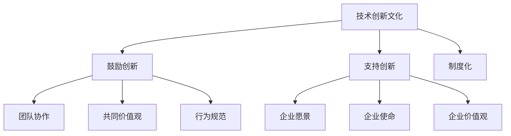

                 

### 技术创新文化的培育与实践

#### 引言

在当今全球化的竞争环境中，企业技术创新能力已成为其持续发展的核心动力。技术创新文化作为一种独特的组织文化，不仅能够激发员工的创造力和创新能力，还能够推动企业不断进行技术迭代和产品更新。因此，培育和营造一个积极的技术创新文化，已经成为众多企业关注的焦点。本文将围绕技术创新文化的概念、培育方法、实践案例及其在企业中的应用，展开深入的分析和探讨。

#### 一、技术创新文化的概念与内涵

1. **背景介绍**：

随着全球科技水平的不断提升，市场竞争日益加剧，企业对技术创新的依赖程度日益增加。技术创新文化作为一种能够促进企业持续创新的组织文化，其重要性愈发凸显。

2. **核心概念**：

技术创新文化是指企业在长期发展过程中，通过共同的价值观、行为规范和制度安排，形成的一种鼓励创新、支持创新的组织氛围和文化环境。它包含了创新意识、创新思维、创新能力、创新激励机制等多个方面。

3. **问题背景**：

在当前的市场环境中，许多企业面临着技术创新不足、创新能力薄弱等问题。这些问题往往与企业的技术创新文化有关。因此，构建和培育技术创新文化，成为解决这些问题的重要途径。

4. **问题描述**：

如何有效地培育和营造技术创新文化，提高企业的技术创新能力和市场竞争力，是当前企业面临的一个重要课题。

5. **问题解决**：

通过系统的培育和实践，可以有效地提高企业的技术创新能力。具体来说，需要从领导力、激励机制、团队建设等多个方面入手，构建和优化技术创新文化。

6. **边界与外延**：

技术创新文化不仅仅局限于技术领域，它还涉及到企业的战略规划、组织结构、人力资源管理等多个方面。因此，在培育技术创新文化时，需要综合考虑这些因素，形成一个全面、系统的创新文化体系。

7. **概念结构与核心要素组成**：

技术创新文化的核心要素包括创新意识、创新思维、创新能力、创新激励机制等。这些要素相互关联、相互影响，共同构成了技术创新文化的基本结构。

#### 二、核心概念与联系

1. **技术创新文化的概念原理**：

技术创新文化是指企业在长期发展过程中，通过共同的价值观、行为规范和制度安排，形成的一种鼓励创新、支持创新的组织氛围和文化环境。这种文化不仅包括对创新的认可和鼓励，还包括对创新过程的支持和管理。

2. **概念属性特征对比表格**：

| 概念 | 特征1 | 特征2 | 特征3 |
| --- | --- | --- | --- |
| 创新文化 | 鼓励创新 | 支持创新 | 制度化 |
| 组织文化 | 团队协作 | 共同价值观 | 行为规范 |
| 企业文化 | 企业愿景 | 企业使命 | 企业价值观 |

3. **Mermaid流程图展示**：

#### 三、技术创新文化培育方法

1. **领导力在技术创新文化培育中的角色**：

领导者在技术创新文化的培育中扮演着至关重要的角色。他们需要具备创新意识、创新思维和创新决策能力，能够为企业的技术创新提供方向和指导。

2. **激励机制在技术创新文化培育中的重要性**：

激励机制是技术创新文化培育的重要组成部分。通过合理的激励机制，可以激发员工的创新热情，提高企业的创新能力。

3. **团队建设在技术创新文化培育中的应用**：

团队建设是技术创新文化培育的重要途径。通过建立高效、创新的团队，可以促进企业内部的协作和知识共享，提高企业的整体创新能力。

#### 四、技术创新文化实践案例分析

1. **案例一：某高科技企业的技术创新文化实践**：

某高科技企业通过建立创新实验室、鼓励员工提出创新想法、设立创新奖励等措施，成功培育了一种积极的技术创新文化。这种文化不仅提高了企业的技术创新能力，还增强了企业的市场竞争力。

2. **案例二：某传统行业的创新转型案例**：

某传统行业的企业通过引入新技术、新理念，进行创新转型。在转型过程中，企业注重技术创新文化的培育，通过培训、激励等方式，提高员工的技术能力和创新意识，取得了显著的效果。

3. **案例三：跨国公司的技术创新文化实践**：

某跨国公司通过全球协作、知识共享、创新激励机制等措施，成功培育了一种跨国界的技术创新文化。这种文化不仅提高了企业的创新能力，还增强了企业的国际竞争力。

#### 五、技术创新文化的评估与优化

1. **评估技术创新文化成熟度的方法**：

可以通过问卷调查、访谈、绩效评估等方式，对企业的技术创新文化进行评估。评估指标可以包括创新意识、创新能力、创新氛围等。

2. **评估结果分析**：

通过对评估结果的分析，可以找出企业技术创新文化中的问题和不足，为进一步优化提供依据。

3. **技术创新文化的优化策略**：

根据评估结果，可以采取相应的优化策略，如加强领导力建设、完善激励机制、优化团队结构等，提高企业的技术创新文化水平。

#### 六、技术创新文化在企业发展中的应用

1. **技术创新文化对企业创新的影响**：

技术创新文化能够激发企业的创新活力，提高企业的创新能力，从而推动企业的持续发展。

2. **技术创新文化与企业竞争力**：

技术创新文化能够提升企业的竞争力，使企业在市场竞争中保持优势。

3. **技术创新文化与企业可持续发展**：

技术创新文化能够促进企业的可持续发展，使企业在面对市场变化和挑战时，能够灵活应对，持续创新。

#### 七、最佳实践与未来展望

1. **最佳实践**：

结合实际案例，总结出了一些有效的技术创新文化培育和实践方法。这些方法包括领导力建设、激励机制设计、团队建设等。

2. **未来展望**：

随着科技的不断进步和市场竞争的加剧，技术创新文化将越来越成为企业发展的核心动力。未来，企业需要不断优化技术创新文化，提高企业的创新能力和竞争力。

### 结语

技术创新文化是企业持续发展的重要保障。通过培育和优化技术创新文化，企业可以不断提高自身的创新能力，提升市场竞争力，实现可持续发展。希望本文能够为企业的技术创新文化培育提供一些有益的启示和参考。在未来的发展中，让我们共同努力，营造一个充满活力和创新精神的技术创新文化，推动企业不断向前发展。作者：AI天才研究院/AI Genius Institute & 禅与计算机程序设计艺术 /Zen And The Art of Computer Programming。

