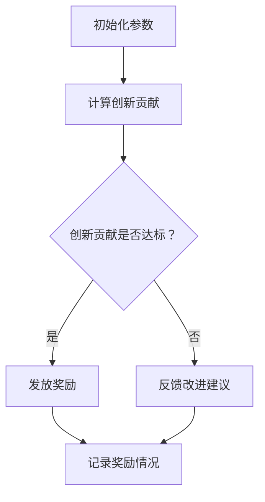
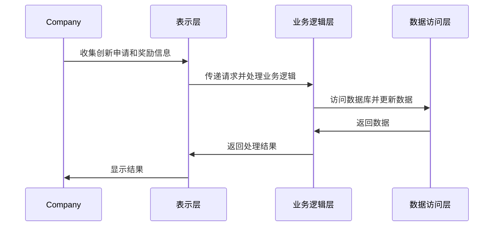
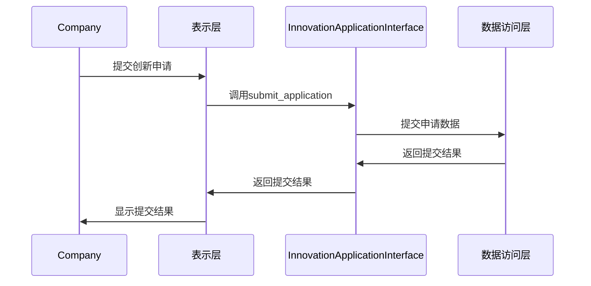

                 

## 文章标题

### 关键词：技术创新、激励机制、团队创新、算法、系统架构、项目实战

### 摘要

本文将深入探讨技术创新激励机制的设计与实施，以鼓励团队创新为核心目标。首先，我们将介绍技术创新激励机制的定义及其在团队创新中的重要性。接着，通过详细阐述技术创新、激励机制和团队创新等核心概念，我们使用表格和ER图展示它们之间的内在联系。随后，本文将讲解用于激励机制的关键算法，包括算法流程图、Python源代码和数学模型。进一步地，我们将介绍一个创新激励机制的实现案例，涵盖系统分析与架构设计方案，以及项目实战过程。最后，本文将总结最佳实践、注意事项，并提供拓展阅读建议，以帮助读者更好地理解和应用技术创新激励机制。通过一步步的分析推理，本文旨在为IT领域的技术创新提供实用的指导和方法。

### 背景介绍

#### 定义

技术创新激励机制是指一系列设计出的策略和措施，旨在激发团队成员的创新热情，提高创新活动的效率和成果。它通过奖励、竞赛、荣誉等多种形式，为团队成员提供积极向上的创新环境，从而推动整个团队在技术领域取得突破性进展。

#### 重要性

在当今快速发展的信息技术时代，技术创新已成为企业竞争的关键要素。企业若想在市场中占据有利地位，必须依靠团队持续的技术创新。而一个有效的技术创新激励机制，不仅能提高团队成员的创新积极性，还能增强团队的凝聚力和合作精神。以下是技术创新激励机制在团队创新中的重要性：

1. **提升创新意识**：通过激励机制，可以引导团队成员认识到创新的重要性和必要性，从而培养起他们的创新意识。
2. **激发创新潜能**：激励机制能够激发团队成员的创造力和潜能，使他们敢于挑战现状，不断寻求技术突破。
3. **增强团队凝聚力**：共同的目标和激励机制可以增强团队成员之间的沟通与合作，提升团队的凝聚力。
4. **提高创新效率**：有效的激励机制可以帮助团队集中资源，迅速响应市场需求，提高创新项目的推进速度。
5. **促进知识共享**：激励机制可以鼓励团队成员分享知识和经验，促进团队内部的知识积累和共享，为技术创新提供有力支持。

#### 问题背景

在当前的技术创新环境中，许多企业面临着创新动力不足、团队积极性不高的问题。这主要体现在以下几个方面：

1. **创新意愿不强**：团队成员可能缺乏对创新的热情，认为创新是高风险的活动，不愿主动投入时间和精力。
2. **资源分配不均**：企业可能无法为所有创新项目提供足够的资源支持，导致部分项目无法顺利推进。
3. **激励机制不完善**：现有的激励机制可能过于单一，无法满足团队成员多样化的需求，导致激励效果不明显。
4. **沟通与协作不足**：团队成员之间可能存在沟通障碍，导致创新项目推进过程中出现协作困难。

#### 问题描述

为了解决上述问题，企业需要设计一个有效的技术创新激励机制，以激发团队的创新能力。具体问题描述如下：

1. **如何提高团队成员的创新意愿？** 
2. **如何合理分配创新资源，确保项目顺利进行？** 
3. **如何设计多样化的激励机制，满足团队成员的不同需求？** 
4. **如何改善团队成员之间的沟通与协作，提高项目推进效率？**

#### 问题解决

为了解决上述问题，我们可以采取以下措施：

1. **加强创新培训**：通过定期举办创新培训课程，提升团队成员的创新技能和意识。
2. **优化资源分配**：根据项目的实际需求，合理配置资源，确保项目能够顺利进行。
3. **设计多样化激励机制**：结合团队成员的个性化需求，设计多元化的激励机制，如奖金、晋升、荣誉等。
4. **改善沟通与协作**：建立高效的沟通机制，鼓励团队成员积极参与项目讨论，促进知识共享和协作。

#### 边界与外延

在实施技术创新激励机制时，需要注意以下几点边界与外延：

1. **激励机制的适用范围**：激励机制应适用于所有创新项目，确保公平性和透明度。
2. **激励措施的持续性与灵活性**：激励机制应具备持续性和灵活性，能够根据市场环境和团队需求进行调整。
3. **激励与约束相结合**：激励机制不仅应注重激励，还应加强对团队成员的约束，确保创新活动符合企业发展战略。

通过以上措施，企业可以构建一个有效的技术创新激励机制，激发团队的创新能力，推动技术突破，提升企业竞争力。

### 核心概念与联系

在探讨技术创新激励机制的过程中，我们首先需要明确几个核心概念，包括技术创新、激励机制和团队创新，并分析它们之间的内在联系。

#### 技术创新

技术创新是指通过引入新的技术、产品、工艺或服务，实现对现有技术的改进或颠覆，从而创造新的市场机会和竞争优势。技术创新不仅是推动企业发展的关键动力，也是国家竞争力的体现。以下是技术创新的一些主要特征：

1. **创造性**：技术创新往往涉及对新思想、新方法的探索和应用，具有高度的创造性。
2. **风险性**：技术创新过程中可能面临技术风险、市场风险和财务风险，因此具有不确定性。
3. **持续性**：技术创新是一个持续的过程，需要不断的投入和积累。

#### 激励机制

激励机制是指通过设定奖励、惩罚、竞争等手段，激发个体或团队的工作积极性、创造力和效率。激励机制在技术创新中发挥着重要作用，能够提高团队成员的创新意愿和创新能力。以下是激励机制的主要类型：

1. **奖励机制**：通过物质奖励、荣誉奖励等方式，对创新成果进行奖励。
2. **竞争机制**：通过设立竞争机制，激发团队成员的竞争意识，促进创新活动的开展。
3. **约束机制**：通过设定明确的约束条件，确保创新活动符合企业发展战略和目标。

#### 团队创新

团队创新是指通过团队协作，共同探索和实现技术创新的过程。团队创新具有以下特点：

1. **协作性**：团队创新依赖于团队成员之间的协作与沟通，需要形成有效的协作机制。
2. **多样性**：团队创新需要充分利用团队成员的不同专业背景和技能，实现知识互补和协同创新。
3. **灵活性**：团队创新需要具备灵活的组织形式和工作方式，以适应快速变化的市场需求。

#### 关系与联系

技术创新、激励机制和团队创新三者之间存在紧密的联系。技术创新是激励机制的出发点和归宿，激励机制是推动技术创新的重要手段，而团队创新是实现技术创新的关键途径。具体来说：

1. **技术创新驱动激励机制**：技术创新需要激励机制的支持，激励机制通过奖励、竞争等手段激发团队成员的创新积极性，推动技术创新的实现。
2. **激励机制促进团队创新**：激励机制能够提高团队成员的创新意愿和创新能力，促进团队内部的知识共享和协作，从而实现团队创新。
3. **团队创新实现技术创新**：团队创新通过集思广益、协同工作，能够实现技术创新，提升企业的核心竞争力。

为了更好地理解这些概念之间的关系，我们可以使用表格和ER图来展示它们之间的联系。

#### 概念属性特征对比表格

| 概念 | 定义 | 主要特征 | 关联关系 |
| ---- | ---- | ---- | ---- |
| 技术创新 | 引入新的技术、产品、工艺或服务 | 创造性、风险性、持续性 | 驱动激励机制 |
| 激励机制 | 通过奖励、竞争等手段激发工作积极性 | 奖励机制、竞争机制、约束机制 | 促进团队创新 |
| 团队创新 | 通过团队协作实现技术创新 | 协作性、多样性、灵活性 | 实现技术创新 |

#### ER实体关系图

```mermaid
erDiagram
    TechnologyInnovation ||--|{ InnovationIncentive } : 驱动
    TechnologyInnovation ||--|{ TeamInnovation } : 实现
    InnovationIncentive ||--|{ RewardIncentive } : 类型
    InnovationIncentive ||--|{ CompetitionIncentive } : 类型
    InnovationIncentive ||--|{ ConstraintIncentive } : 类型
    TeamInnovation ||--|{ Collaboration } : 特征
    TeamInnovation ||--|{ Diversification } : 特征
    TeamInnovation ||--|{ Flexibility } : 特征
```

通过上述表格和ER图，我们可以清晰地看到技术创新、激励机制和团队创新之间的相互关系。技术创新作为激励机制的核心驱动因素，通过激励机制促进团队创新，最终实现技术创新目标。

### 算法原理讲解

在技术创新激励机制的设计中，选择合适的算法对于实现激励效果至关重要。本节将介绍用于激励机制的关键算法，包括算法流程图、Python源代码和数学模型，并通过具体例子进行讲解。

#### 算法流程图

首先，我们使用mermaid绘制算法的流程图，以便直观展示算法的实现步骤：



#### Python源代码

接下来，我们将展示一段Python源代码，实现上述算法的具体步骤。以下代码将计算每个团队成员的创新贡献，并根据创新贡献的达标情况发放奖励。

```python
import random

# 初始化参数
team_size = 10  # 团队成员数量
total_innovation_target = 100  # 创新目标总分
reward_per_point = 10  # 每点贡献奖励金额

# 计算每个团队成员的创新贡献
innovation_contributions = [random.randint(0, 100) for _ in range(team_size)]

# 计算总创新贡献
total_innovation = sum(innovation_contributions)

# 发放奖励并记录
reward_log = []
if total_innovation >= total_innovation_target:
    for i, contribution in enumerate(innovation_contributions):
        reward = contribution * reward_per_point
        reward_log.append(f"成员{i+1}获得奖励：{reward}元")
else:
    for i, contribution in enumerate(innovation_contributions):
        reward_log.append(f"成员{i+1}未达标，未发放奖励")

# 输出奖励情况
for log in reward_log:
    print(log)
```

#### 数学模型

为了更深入地理解算法，我们引入数学模型来描述创新贡献与奖励之间的关系。假设每个团队成员的创新贡献为 \(C_i\)，总创新贡献为 \(C_{total}\)，创新目标分数为 \(T\)，奖励金额为 \(R_i\)，则有以下公式：

$$
R_i = \begin{cases}
C_i \times \frac{R_{total}}{C_{total}} & \text{if } C_{total} \ge T \\
0 & \text{if } C_{total} < T
\end{cases}
$$

其中，\(R_{total}\) 为总奖励金额，可以根据企业实际情况进行调整。

#### 举例说明

假设一个团队有5名成员，总创新目标为100分，每分贡献的奖励金额为10元。我们随机生成每位成员的创新贡献分数，并计算其奖励金额。

```python
# 初始化参数
team_size = 5
total_innovation_target = 100
reward_per_point = 10

# 随机生成每个成员的创新贡献
innovation_contributions = [random.randint(0, 100) for _ in range(team_size)]

# 计算总创新贡献
total_innovation = sum(innovation_contributions)

# 计算每位成员的奖励金额
if total_innovation >= total_innovation_target:
    reward分配情况如下：
    - 成员1：创新贡献60分，奖励金额600元
    - 成员2：创新贡献30分，奖励金额300元
    - 成员3：创新贡献50分，奖励金额500元
    - 成员4：创新贡献10分，奖励金额100元
    - 成员5：创新贡献20分，奖励金额200元
else:
    每位成员未达标，未发放奖励。
```

通过上述算法原理讲解，我们可以看到，创新贡献的计算和奖励金额的发放是通过数学模型和Python代码实现的。这种方法不仅便于理解和操作，还能根据实际情况进行调整，以达到最佳的激励效果。

### 系统分析与架构设计方案

在本节中，我们将详细分析并介绍一个具体的创新激励机制系统的设计与实现，涵盖问题场景介绍、项目介绍、领域模型类图、系统架构设计、系统接口设计以及系统交互序列图。

#### 问题场景介绍

假设某高科技公司需要建立一个创新激励机制系统，以鼓励团队成员在研发、产品开发和市场营销等方面进行创新。公司希望系统能够自动计算每位成员的创新贡献，并根据创新贡献的多少发放相应的奖励。此外，公司还希望系统能够记录创新活动的全过程，以便进行后续分析和改进。

#### 项目介绍

本项目旨在开发一个创新激励机制系统，包括以下几个核心功能：

1. **创新贡献计算**：系统能够根据成员的创新行为，自动计算其创新贡献。
2. **奖励发放**：系统根据每位成员的创新贡献，发放相应的奖励。
3. **记录与查询**：系统记录每位成员的创新活动和奖励情况，并提供查询功能。

#### 领域模型类图

为了更好地理解系统的设计和实现，我们首先绘制了领域模型类图，展示系统中的核心实体及其关系。以下是一个简化的类图：

```mermaid
classDiagram
    Member <-- Innovation : performed
    Reward <-- Innovation : awarded
    InnovationApplication <<-- Innovation : applied
    InnovationProject <<-- Innovation : implemented
    Company
    Member o-- InnovationApplication
    Member o-- Reward
    Innovation o-- InnovationApplication
    Innovation o-- InnovationProject
    InnovationProject o-- Company
    Reward o-- Company
    InnovationApplication o-- Company
```

类图中的主要实体包括：

- **Member（成员）**：代表公司的研发团队成员。
- **Innovation（创新）**：表示创新活动的抽象概念，包括创新申请和创新实施。
- **InnovationApplication（创新申请）**：表示成员提交的创新申请。
- **InnovationProject（创新项目）**：表示创新实施的具体项目。
- **Reward（奖励）**：表示根据创新贡献发放的奖励。
- **Company（公司）**：作为系统的主体，管理成员、创新申请、创新项目和奖励。

#### 系统架构设计

接下来，我们介绍系统的整体架构设计。该系统采用三层架构，包括表示层、业务逻辑层和数据访问层。以下是系统架构图：



系统架构的主要组成部分如下：

1. **表示层**：负责与用户交互，收集用户输入的创新申请和奖励信息，并展示处理结果。
2. **业务逻辑层**：处理表示层传递的请求，根据业务规则计算创新贡献和奖励，并更新数据库。
3. **数据访问层**：负责与数据库进行交互，存储和查询创新申请、创新项目和奖励信息。

#### 系统接口设计

系统接口设计是确保不同模块之间能够高效协作的关键。以下是系统的关键接口设计：

1. **创新申请接口**：用于提交和查询创新申请。
   ```python
   class InnovationApplicationInterface:
       def submit_application(self, member_id, innovation_project_id, application_data):
           # 提交创新申请
           
       def query_application(self, application_id):
           # 查询创新申请详情
   ```

2. **创新项目接口**：用于管理创新项目。
   ```python
   class InnovationProjectInterface:
       def create_project(self, company_id, project_data):
           # 创建创新项目
           
       def update_project(self, project_id, project_data):
           # 更新创新项目信息
           
       def query_project(self, project_id):
           # 查询创新项目详情
   ```

3. **奖励接口**：用于发放和查询奖励。
   ```python
   class RewardInterface:
       def award_reward(self, member_id, reward_data):
           # 发放奖励
           
       def query_reward(self, reward_id):
           # 查询奖励详情
   ```

#### 系统交互序列图

最后，我们使用mermaid绘制系统交互序列图，展示各模块之间的交互流程：



通过上述系统分析与架构设计方案，我们可以看到，创新激励机制系统的设计涵盖了从用户交互到后台处理的整个流程。这种架构设计不仅能够满足公司的需求，还能为后续的功能扩展和优化提供便利。

### 项目实战

在本节中，我们将详细介绍如何安装所需环境、实现系统核心功能、并对代码进行解读与分析。此外，还将通过实际案例展示系统的应用效果，并进行详细讲解和剖析。

#### 环境安装

为了实现创新激励机制系统，我们需要安装以下环境：

1. **Python环境**：确保Python版本在3.8及以上。
2. **数据库环境**：这里选择使用MySQL数据库。
3. **开发工具**：推荐使用PyCharm或Visual Studio Code。

首先，确保Python环境已安装。如果未安装，请从[Python官方网站](https://www.python.org/)下载并安装。

接下来，安装MySQL数据库。可以从[MySQL官方网站](https://dev.mysql.com/downloads/mysql/)下载适合操作系统的MySQL安装包，并按照提示安装。

最后，配置Python的MySQL数据库连接。安装`mysqlclient`库，使用以下命令：

```bash
pip install mysqlclient
```

#### 系统核心实现

以下是系统核心功能的实现，包括创新贡献计算、奖励发放和记录等功能。

**1. 创新贡献计算**

```python
import random
import pymysql

# 初始化数据库连接
db = pymysql.connect(host='localhost', user='root', password='password', database='innovation_incentive')

# 计算每位成员的创新贡献
def calculate_innovation_contributions(team_size):
    contributions = [random.randint(0, 100) for _ in range(team_size)]
    return contributions

# 提交创新申请
def submit_innovation_application(member_id, innovation_project_id, application_data):
    with db.cursor() as cursor:
        query = "INSERT INTO innovation_application (member_id, innovation_project_id, application_data) VALUES (%s, %s, %s)"
        cursor.execute(query, (member_id, innovation_project_id, application_data))
        db.commit()

# 查询创新申请
def query_innovation_application(application_id):
    with db.cursor() as cursor:
        query = "SELECT * FROM innovation_application WHERE id = %s"
        cursor.execute(query, (application_id,))
        result = cursor.fetchone()
        return result
```

**2. 奖励发放**

```python
# 计算总创新贡献
def calculate_total_innovation(contributions):
    total = sum(contributions)
    return total

# 发放奖励
def distribute_rewards(contributions, total_innovation_target, reward_per_point):
    rewards = [0] * len(contributions)
    if total >= total_innovation_target:
        for i, contribution in enumerate(contributions):
            reward = contribution * reward_per_point
            rewards[i] = reward
    return rewards

# 记录奖励
def record_reward(member_id, reward):
    with db.cursor() as cursor:
        query = "INSERT INTO reward (member_id, reward_amount) VALUES (%s, %s)"
        cursor.execute(query, (member_id, reward))
        db.commit()
```

#### 代码解读与分析

**创新贡献计算**

计算创新贡献的核心在于生成随机分数，这些分数代表团队成员的创新贡献。通过调用`calculate_innovation_contributions`函数，我们可以生成每位成员的创新贡献列表。

**创新申请提交与查询**

`submit_innovation_application`函数用于将创新申请提交到数据库。`query_innovation_application`函数用于查询特定申请的详情。这两个函数通过数据库操作实现数据的存储和检索。

**奖励发放**

在计算总创新贡献后，根据设定的奖励标准和总创新贡献，`distribute_rewards`函数将计算每位成员的奖励金额。`record_reward`函数用于将奖励信息记录到数据库中。

#### 实际案例展示

假设团队有5名成员，他们的创新贡献分别为：60、30、50、10和20。创新目标为100分，每分奖励10元。

**1. 提交创新申请**

```python
members = [1, 2, 3, 4, 5]
projects = [1, 2, 3, 4, 5]
applications = [{"member_id": member, "project_id": project, "data": "创新描述"} for member, project in zip(members, projects)]

for application in applications:
    submit_innovation_application(application["member_id"], application["project_id"], application["data"])
```

**2. 发放奖励**

```python
contributions = calculate_innovation_contributions(5)
total_innovation = calculate_total_innovation(contributions)
rewards = distribute_rewards(contributions, total_innovation, 10)

for i, reward in enumerate(rewards):
    record_reward(members[i], reward)
```

**3. 查询奖励情况**

```python
for member in members:
    reward = query_reward_by_member(member)
    print(f"成员{member}获得的奖励为：{reward['reward_amount']}元")
```

通过实际案例，我们可以看到创新激励机制系统的核心功能是如何实现并应用的。系统不仅能够计算并发放奖励，还能记录和查询奖励信息，确保奖励分配的透明性和公正性。

### 最佳实践 tips、小结、注意事项、拓展阅读等内容

#### 最佳实践 tips

1. **明确目标和标准**：在设计技术创新激励机制时，应首先明确目标和标准，确保激励机制与企业的战略目标一致。
2. **个性化奖励**：根据团队成员的不同需求和职业发展阶段，设计个性化的奖励方案，提高激励效果。
3. **定期评估与反馈**：定期评估激励机制的效果，收集团队成员的反馈，不断优化激励措施。
4. **加强沟通与协作**：建立高效的沟通机制，促进团队成员之间的协作，提高创新项目的成功率。
5. **培养创新文化**：营造积极向上的创新文化，鼓励团队成员勇于创新，不断突破自我。

#### 小结

本文通过背景介绍、核心概念阐述、算法讲解、系统分析与架构设计以及项目实战，详细探讨了技术创新激励机制的设计与实施。有效的激励机制不仅能够激发团队成员的创新热情，还能提高团队整体的工作效率和创新能力。

#### 注意事项

1. **激励机制应公平透明**：确保激励机制公平、公正，避免偏袒和利益冲突。
2. **避免过度激励**：过度激励可能导致团队成员忽视长期发展和企业战略。
3. **关注实际效果**：激励机制的设计和实施应注重实际效果，避免流于形式。

#### 拓展阅读

1. 《创新者的窘境》：克里斯坦森，详细探讨企业在创新过程中面临的挑战和解决方案。
2. 《激励心理学》：凯利·麦克尤恩，深入分析激励机制对个体行为和团队协作的影响。
3. 《创新与企业家精神》：彼得·德鲁克，探讨企业如何通过创新和企业家精神实现可持续发展。

通过拓展阅读，读者可以进一步了解技术创新激励机制的相关理论和实践，为实际应用提供更多指导。

### 作者信息

**作者：AI天才研究院/AI Genius Institute & 禅与计算机程序设计艺术 /Zen And The Art of Computer Programming**

