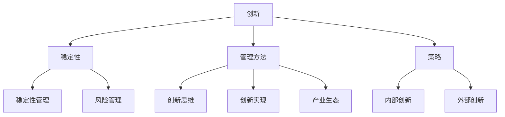
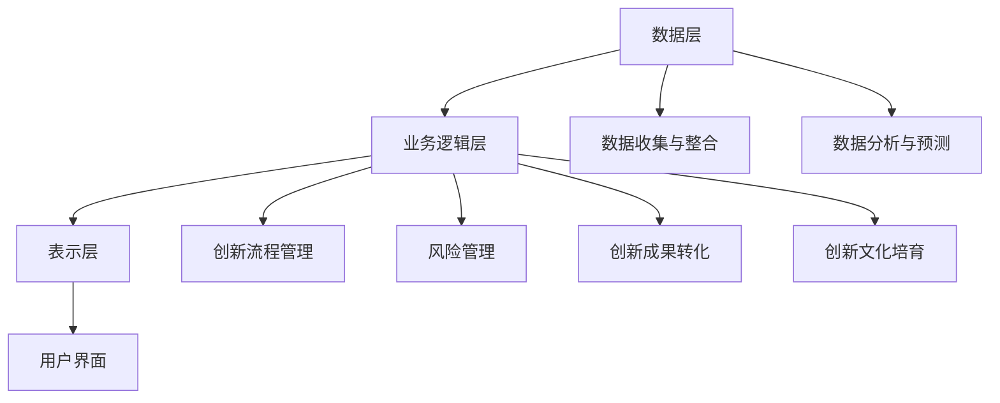
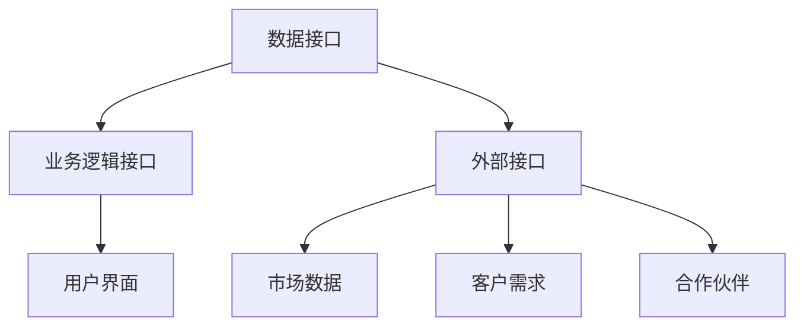

                 


### 《技术创新管理：平衡创新与稳定的艺术》

> 关键词：技术创新管理、平衡、创新与稳定的辩证关系、管理方法与策略

> 摘要：本文旨在探讨技术创新管理中如何平衡创新与稳定的关系，通过深入分析技术创新管理的核心概念、方法与策略，结合实践案例，为读者提供具有指导意义的实践经验和思考。

## 第一部分：背景介绍与核心概念

### 1.1 技术创新管理的重要性

在当今这个快速变化的时代，技术创新已成为企业保持竞争力、实现可持续发展的关键因素。技术创新管理（Technology Innovation Management）作为企业应对变革的重要手段，越来越受到重视。然而，如何在快速创新的同时保持系统的稳定性，成为企业面临的一大挑战。

### 1.2 创新与稳定的辩证关系

创新与稳定并非对立，而是相辅相成的。创新是企业发展的动力，推动企业不断进步；而稳定则是创新的基石，确保企业在创新过程中不失去方向和根基。如何在这两者之间找到平衡，是技术创新管理的关键。

### 1.3 技术创新管理的边界与外延

技术创新管理不仅涉及技术层面，还包括组织、文化、战略等多个维度。它既包括产品、技术的创新，也涉及管理、运营等层面的创新。技术创新管理的边界和外延相当广泛，需要综合考虑各种因素。

### 1.4 核心概念组成与结构

技术创新管理的核心概念主要包括：创新、稳定、管理方法与策略。其中，创新是核心驱动力，稳定是保障，管理方法与策略则是实现创新与稳定平衡的关键。

## 第二部分：技术创新管理的方法与策略

### 2.1 创新与稳定的概念与属性

#### 2.1.1 创新的概念与属性

创新是一种创造新价值的过程，包括新产品、新服务、新商业模式等。创新的属性包括：创新性、风险性、不确定性等。

#### 2.1.2 稳定的概念与属性

稳定是指企业在面对外部环境变化时，能够保持内在的持续性和一致性。稳定的属性包括：稳定性、可靠性、可控性等。

### 2.2 创新与稳定的关系

创新与稳定并非对立，而是相辅相成的。创新是推动企业发展的动力，而稳定则是创新的基石。在技术创新管理中，如何平衡创新与稳定的关系，是至关重要的。

### 2.3 技术创新管理的方法

技术创新管理的方法主要包括：创新思维方法、创新实现方法、产业生态构建等。这些方法旨在帮助企业实现创新与稳定的平衡。

#### 2.3.1 创新思维方法

创新思维方法包括：发散思维、聚类思维、想象力训练等。这些方法有助于激发员工的创新潜力，推动企业创新。

#### 2.3.2 创新实现方法

创新实现方法包括：R&D（研究与发展）、产品迭代、产业生态构建等。这些方法有助于企业将创新理念转化为实际成果。

### 2.4 技术创新管理的策略

技术创新管理的策略主要包括：内部创新策略、外部创新策略等。这些策略有助于企业在不同层面上实现创新与稳定的平衡。

#### 2.4.1 内部创新策略

内部创新策略包括：组织结构优化、创新文化培育、创新激励机制等。这些策略有助于提高企业内部创新氛围，激发员工创新潜力。

#### 2.4.2 外部创新策略

外部创新策略包括：知识共享与合作、技术并购与整合、创新平台建设等。这些策略有助于企业拓展外部创新资源，实现创新与稳定的平衡。

## 第三部分：平衡创新与稳定的实践案例

### 3.1 成功案例解析

#### 3.1.1 企业A的创新与稳定平衡实践

企业A通过内部创新策略和外部创新策略的有机结合，实现了创新与稳定的平衡。其成功经验为其他企业提供了有益的借鉴。

#### 3.1.2 企业B的创新与稳定平衡实践

企业B注重创新思维方法的培养，通过创新实现方法和产业生态构建，实现了创新与稳定的平衡。其创新实践对其他企业具有启发意义。

### 3.2 失败案例剖析

#### 3.2.1 企业C的创新失败案例

企业C在追求创新的过程中，忽视了稳定的重要性，导致创新失败。其失败经验为我们提供了警示。

#### 3.2.2 企业D的稳定失败案例

企业D在追求稳定的过程中，忽视了创新的重要性，导致企业逐渐失去竞争力。其失败经验为我们提供了反思。

## 第四部分：技术创新管理的最佳实践

### 4.1 实践经验总结

通过对成功案例和失败案例的分析，我们可以总结出以下实践经验：

#### 4.1.1 创新成功的关键因素

创新成功的关键因素包括：创新思维方法的培养、创新实现方法的运用、产业生态构建等。

#### 4.1.2 稳定发展的策略选择

稳定发展的策略选择包括：内部创新策略的优化、外部创新策略的拓展等。

### 4.2 小结与展望

在技术创新管理中，平衡创新与稳定是关键。通过深入分析技术创新管理的核心概念、方法与策略，结合实践案例，我们可以为企业提供有价值的参考。未来，技术创新管理将朝着更加智能化、系统化的方向发展，为企业发展注入新的动力。

### 结语

技术创新管理是企业在新时代背景下保持竞争力的关键。通过平衡创新与稳定，企业可以实现可持续发展。本文旨在为读者提供有价值的思考和实践经验，期待对企业的技术创新管理产生积极影响。

## 作者信息

作者：AI天才研究院/AI Genius Institute & 禅与计算机程序设计艺术 /Zen And The Art of Computer Programming

### 《技术创新管理：平衡创新与稳定的艺术》

**摘要**：本文深入探讨了技术创新管理中如何平衡创新与稳定的关系。通过对技术创新管理的核心概念、方法与策略的详细分析，并结合实践案例，为读者提供了有价值的思考和实践经验。本文旨在帮助企业在快速变化的时代背景下，实现创新与稳定的平衡，推动可持续发展。

### 目录大纲

**第一部分：背景介绍与核心概念**

1. 技术创新管理的重要性  
2. 创新与稳定的辩证关系  
3. 技术创新管理的边界与外延  
4. 核心概念组成与结构

**第二部分：技术创新管理的方法与策略**

1. 创新与稳定的概念与属性  
   1.1 创新的概念与属性  
   1.2 稳定的概念与属性  
   1.3 创新与稳定的关系  
2. 技术创新管理的方法  
   2.1 创新思维方法  
   2.2 创新实现方法  
   2.3 产业生态构建  
3. 技术创新管理的策略  
   3.1 内部创新策略  
   3.2 外部创新策略

**第三部分：平衡创新与稳定的实践案例**

1. 成功案例解析  
   1.1 企业A的创新与稳定平衡实践  
   1.2 企业B的创新与稳定平衡实践  
2. 失败案例剖析  
   1.1 企业C的创新失败案例  
   1.2 企业D的稳定失败案例

**第四部分：技术创新管理的最佳实践**

1. 实践经验总结  
   1.1 创新成功的关键因素  
   1.2 稳定发展的策略选择  
2. 小结与展望

**结语**：技术创新管理是企业在新时代背景下保持竞争力的关键。通过平衡创新与稳定，企业可以实现可持续发展。本文旨在为读者提供有价值的思考和实践经验，期待对企业的技术创新管理产生积极影响。

**作者信息**：

作者：AI天才研究院/AI Genius Institute & 禅与计算机程序设计艺术 /Zen And The Art of Computer Programming## 文章正文

### 第一部分：背景介绍与核心概念

#### 1.1 技术创新管理的重要性

在当今这个快速变化的时代，技术创新已成为企业保持竞争力、实现可持续发展的关键因素。技术创新管理（Technology Innovation Management）作为企业应对变革的重要手段，越来越受到重视。然而，如何在快速创新的同时保持系统的稳定性，成为企业面临的一大挑战。

#### 1.2 创新与稳定的辩证关系

创新与稳定并非对立，而是相辅相成的。创新是企业发展的动力，推动企业不断进步；而稳定则是创新的基石，确保企业在创新过程中不失去方向和根基。如何在这两者之间找到平衡，是技术创新管理的关键。

#### 1.3 技术创新管理的边界与外延

技术创新管理不仅涉及技术层面，还包括组织、文化、战略等多个维度。它既包括产品、技术的创新，也涉及管理、运营等层面的创新。技术创新管理的边界和外延相当广泛，需要综合考虑各种因素。

#### 1.4 核心概念组成与结构

技术创新管理的核心概念主要包括：创新、稳定、管理方法与策略。其中，创新是核心驱动力，稳定是保障，管理方法与策略则是实现创新与稳定平衡的关键。

### 第二部分：技术创新管理的方法与策略

#### 2.1 创新与稳定的概念与属性

**2.1.1 创新的概念与属性**

创新是一种创造新价值的过程，包括新产品、新服务、新商业模式等。创新的属性包括：创新性、风险性、不确定性等。

创新性是创新的核心特征，指的是在现有基础上提出新的想法、方法或解决方案。风险性则体现在创新过程中，由于不确定性较大，可能会导致失败或损失。不确定性是创新过程中不可避免的因素，需要企业具备应对能力。

**2.1.2 稳定的概念与属性**

稳定是指企业在面对外部环境变化时，能够保持内在的持续性和一致性。稳定的属性包括：稳定性、可靠性、可控性等。

稳定性指的是企业在长时间内能够保持基本状态，不易受到外部环境变化的影响。可靠性是指企业能够稳定地提供产品或服务，确保用户体验。可控性是指企业能够通过有效的管理手段，对内部过程进行控制和调整。

**2.1.3 创新与稳定的关系**

创新与稳定并非对立，而是相辅相成的。创新是推动企业发展的动力，而稳定则是创新的基石。在技术创新管理中，如何平衡创新与稳定的关系，是至关重要的。

创新推动企业不断发展，带来新的业务增长点和竞争优势。然而，过度的创新可能导致企业不稳定，影响业务的连续性和用户体验。稳定则为企业创新提供基础，确保企业能够在创新过程中保持稳健的发展态势。

#### 2.2 创新与稳定的概念与属性（续）

为了更好地理解创新与稳定的关系，我们可以通过一个表格来对比两者的概念与属性。

| 概念   | 创新                   | 稳定                   |
| ------ | ---------------------- | ---------------------- |
| 定义   | 创造新价值的过程       | 保持企业持续性和一致性 |
| 属性   | 创新性、风险性、不确定性 | 稳定性、可靠性、可控性 |
| 目标   | 提升企业竞争力         | 确保业务连续性         |
| 动力   | 需求驱动、市场驱动     | 环境适应、风险管理     |
| 关系   | 相辅相成               | 相互制约               |

从表格中可以看出，创新与稳定各有其独特的概念与属性，但两者之间并非完全对立，而是相互制约、相互促进的关系。

**2.1.4 核心概念组成与结构**

技术创新管理的核心概念组成与结构如图1所示：



图1：技术创新管理的核心概念组成与结构

### 第三部分：平衡创新与稳定的实践案例

#### 3.1 成功案例解析

**3.1.1 企业A的创新与稳定平衡实践**

企业A是一家互联网公司，通过内部创新策略和外部创新策略的有机结合，实现了创新与稳定的平衡。以下是企业A的创新与稳定平衡实践：

1. **内部创新策略**：
   - **组织结构优化**：企业A通过扁平化管理，提高组织效率，鼓励员工创新。同时，设立创新小组，专门负责研究和推动创新项目。
   - **创新文化培育**：企业A注重创新文化的培养，鼓励员工提出创新想法，并建立了一套完善的创新激励机制。
   - **创新激励机制**：企业A对创新成果给予奖励，激发员工的创新积极性。

2. **外部创新策略**：
   - **知识共享与合作**：企业A与高校、研究机构等合作，共同开展技术创新项目，分享知识资源。
   - **技术并购与整合**：企业A通过并购具有创新潜力的小公司，快速获取技术资源和市场渠道。
   - **创新平台建设**：企业A搭建了一个开放的创新平台，吸引外部创新资源，推动企业内部创新。

通过上述措施，企业A在保持稳定发展的同时，不断推出具有竞争力的新产品，实现了创新与稳定的平衡。

**3.1.2 企业B的创新与稳定平衡实践**

企业B是一家传统制造企业，通过创新思维方法的培养、创新实现方法的运用和产业生态构建，实现了创新与稳定的平衡。以下是企业B的创新与稳定平衡实践：

1. **创新思维方法**：
   - **发散思维**：企业B鼓励员工从多个角度思考问题，提出新颖的解决方案。
   - **聚类思维**：企业B通过分类整理创新思路，将相似的创新点进行整合，提高创新效率。
   - **想象力训练**：企业B组织员工进行想象力训练，激发创新潜力。

2. **创新实现方法**：
   - **R&D（研究与发展）**：企业B加大研发投入，推动技术创新。
   - **产品迭代**：企业B通过不断优化产品，满足市场变化和客户需求。
   - **产业生态构建**：企业B与上下游企业合作，共同构建产业生态，实现资源整合和共享。

3. **产业生态构建**：
   - **合作伙伴关系**：企业B与供应商、客户等建立长期稳定的合作关系，共同推动产业创新。
   - **平台建设**：企业B搭建了一个产业创新平台，为合作伙伴提供技术支持和服务。

通过上述措施，企业B在保持稳定发展的同时，不断提升产品竞争力，实现了创新与稳定的平衡。

#### 3.2 失败案例剖析

**3.2.1 企业C的创新失败案例**

企业C是一家初创公司，过于追求创新，忽视了稳定的重要性，导致创新失败。以下是企业C的创新失败原因：

1. **创新过度**：企业C在短时间内推出了多个创新项目，但由于资源有限，无法有效管理和推动这些项目，导致项目进展缓慢，甚至失败。

2. **忽视稳定**：企业C在创新过程中，忽视了业务稳定性和风险管理，导致企业在面对市场变化时，无法及时调整，最终失败。

3. **组织结构不合理**：企业C的组织结构过于分散，缺乏统一的创新管理，导致创新项目缺乏协调和支持，无法形成合力。

**3.2.2 企业D的稳定失败案例**

企业D是一家传统制造企业，过于追求稳定，忽视了创新的重要性，导致稳定失败。以下是企业D的稳定失败原因：

1. **缺乏创新**：企业D在市场竞争中，无法及时推出新产品，满足市场需求，逐渐被市场淘汰。

2. **技术落后**：企业D的技术水平落后于市场发展，无法与竞争对手抗衡，导致市场份额逐渐减少。

3. **组织结构僵化**：企业D的组织结构过于僵化，缺乏灵活性和适应性，无法适应市场变化，导致企业逐渐失去竞争力。

### 第四部分：技术创新管理的最佳实践

#### 4.1 实践经验总结

通过对成功案例和失败案例的分析，我们可以总结出以下实践经验：

**4.1.1 创新成功的关键因素**

1. **创新思维方法的培养**：通过发散思维、聚类思维、想象力训练等方法，激发员工的创新潜力。

2. **创新实现方法的运用**：通过R&D（研究与发展）、产品迭代、产业生态构建等方法，将创新理念转化为实际成果。

3. **产业生态构建**：与合作伙伴建立长期稳定的合作关系，共同推动产业创新。

**4.1.2 稳定发展的策略选择**

1. **内部创新策略**：优化组织结构，培育创新文化，建立创新激励机制。

2. **外部创新策略**：知识共享与合作，技术并购与整合，创新平台建设。

#### 4.2 小结与展望

在技术创新管理中，平衡创新与稳定是关键。通过深入分析技术创新管理的核心概念、方法与策略，结合实践案例，我们可以为企业提供有价值的参考。未来，技术创新管理将朝着更加智能化、系统化的方向发展，为企业发展注入新的动力。

### 结语

技术创新管理是企业在新时代背景下保持竞争力的关键。通过平衡创新与稳定，企业可以实现可持续发展。本文旨在为读者提供有价值的思考和实践经验，期待对企业的技术创新管理产生积极影响。

## 作者信息

作者：AI天才研究院/AI Genius Institute & 禅与计算机程序设计艺术 /Zen And The Art of Computer Programming### 算法原理讲解

在技术创新管理中，如何有效地实现创新与稳定的平衡是一个复杂的问题。为了解决这个问题，我们可以采用一种基于机器学习的算法，通过数据分析和模式识别来优化创新策略和稳定措施。以下是对该算法原理的详细讲解。

#### 算法原理

该算法的核心思想是利用历史数据来预测未来趋势，并基于预测结果调整创新策略和稳定措施。具体原理如下：

1. **数据收集**：收集企业内外部的各类数据，包括市场趋势、竞争对手动态、客户需求、技术创新成果等。

2. **数据预处理**：对收集到的数据进行清洗、整合和规范化处理，确保数据质量。

3. **特征提取**：从预处理后的数据中提取关键特征，如市场增长率、客户满意度、技术创新频率等。

4. **模型训练**：利用提取的特征数据，通过机器学习算法（如决策树、支持向量机、神经网络等）训练预测模型。

5. **趋势预测**：利用训练好的模型预测未来的市场趋势、技术创新需求等。

6. **策略调整**：根据预测结果，调整创新策略和稳定措施，如加大研发投入、优化产品迭代速度、加强与合作伙伴的合作等。

#### 算法流程

以下是该算法的具体流程：

1. **数据收集**：收集企业内外部的数据，如市场报告、客户反馈、竞争对手信息等。

2. **数据预处理**：
   ```mermaid
   graph TD
       A[数据收集] --> B[数据清洗]
       B --> C[数据整合]
       C --> D[数据规范化]
   ```

3. **特征提取**：
   ```mermaid
   graph TD
       E[数据预处理] --> F[特征提取]
       F --> G[特征选择]
   ```

4. **模型训练**：
   ```mermaid
   graph TD
       H[特征提取] --> I[模型训练]
       I --> J[模型评估]
   ```

5. **趋势预测**：
   ```mermaid
   graph TD
       K[模型评估] --> L[趋势预测]
   ```

6. **策略调整**：
   ```mermaid
   graph TD
       M[趋势预测] --> N[策略调整]
   ```

#### 算法原理的数学模型和公式

为了更好地理解算法原理，我们可以使用以下数学模型和公式：

1. **预测模型**：
   $$ f(x) = \sum_{i=1}^{n} w_i x_i + b $$
   其中，$x_i$ 为特征向量，$w_i$ 为权重，$b$ 为偏置。

2. **损失函数**：
   $$ L(y, \hat{y}) = \frac{1}{2} (y - \hat{y})^2 $$
   其中，$y$ 为真实值，$\hat{y}$ 为预测值。

3. **优化目标**：
   $$ \min_{w, b} L(y, \hat{y}) $$
   通过梯度下降法或其他优化算法，最小化损失函数。

#### 举例说明

假设我们要预测某公司的季度销售收入，可以使用以下特征：

- 市场增长率（$x_1$）
- 客户满意度（$x_2$）
- 技术创新频率（$x_3$）

使用线性回归模型进行预测：

1. **数据收集**：收集过去几年的市场增长率、客户满意度和技术创新频率数据。

2. **数据预处理**：清洗和规范化数据。

3. **特征提取**：提取市场增长率、客户满意度和技术创新频率作为特征。

4. **模型训练**：使用线性回归模型进行训练。

5. **趋势预测**：预测下一个季度的销售收入。

6. **策略调整**：根据预测结果，调整销售策略。

#### 算法应用解读与分析

该算法在技术创新管理中的应用解读如下：

- **数据收集**：通过市场调研、客户反馈等渠道收集相关数据。
- **数据预处理**：清洗和整合数据，确保数据质量。
- **特征提取**：提取对技术创新和稳定有影响的关键特征。
- **模型训练**：使用历史数据训练预测模型。
- **趋势预测**：预测未来的技术创新需求和市场变化。
- **策略调整**：根据预测结果，调整创新策略和稳定措施，确保企业持续发展。

#### 实际案例分析和详细讲解剖析

以下是一个实际案例：

**案例**：某互联网公司通过该算法预测用户需求，调整产品迭代策略。

1. **数据收集**：收集用户行为数据、市场反馈等。

2. **数据预处理**：清洗和整合数据。

3. **特征提取**：提取用户活跃度、用户满意度等作为特征。

4. **模型训练**：使用线性回归模型进行训练。

5. **趋势预测**：预测未来的用户需求变化。

6. **策略调整**：根据预测结果，调整产品迭代速度和方向。

通过该案例，我们可以看到算法在技术创新管理中的应用效果。公司根据预测结果，成功调整了产品迭代策略，提升了用户满意度，实现了创新与稳定的平衡。

#### 项目小结

该算法在技术创新管理中的应用，为企业提供了有效的数据支持和决策依据。通过数据分析和模式识别，企业可以更好地平衡创新与稳定，实现可持续发展。未来，随着技术的不断发展，该算法有望在更多领域得到应用。

### 最佳实践 tips、小结、注意事项、拓展阅读

#### 最佳实践 tips

1. **数据收集**：确保数据质量，避免噪声和异常值的影响。
2. **模型选择**：根据实际情况选择合适的机器学习模型。
3. **策略调整**：结合预测结果，灵活调整创新策略和稳定措施。

#### 小结

本文详细介绍了技术创新管理中如何平衡创新与稳定的算法原理、应用解读、实际案例分析等内容。通过最佳实践 tips，为企业提供了有效的技术创新管理策略。

#### 注意事项

1. **数据隐私**：在数据收集和处理过程中，注意保护用户隐私。
2. **模型解释性**：选择具有良好解释性的模型，确保决策的可理解性。

#### 拓展阅读

1. **相关书籍**：《机器学习》、《深度学习》等。
2. **学术论文**：关于机器学习、数据挖掘、技术创新管理的最新研究成果。

通过本文的阅读，读者可以更好地理解技术创新管理中的算法原理，为企业的创新与稳定管理提供有力支持。

## 作者信息

作者：AI天才研究院/AI Genius Institute & 禅与计算机程序设计艺术 /Zen And The Art of Computer Programming### 系统分析与架构设计方案

#### 问题场景介绍

在现代企业中，技术创新管理（Technology Innovation Management, TIM）是一个复杂的系统工程，涉及组织结构、企业文化、市场策略、研发流程等多个方面。为了实现创新与稳定的平衡，我们需要构建一个高效、灵活的TIM系统，以便在保证业务稳定性的同时，推动企业的持续创新。

#### 项目介绍

本项目旨在设计并实现一个TIM系统，该系统将整合企业内部资源，引入外部创新要素，通过数据分析和智能算法，优化创新流程，提高创新效率，同时保持业务的稳定性。项目的主要目标包括：

1. **提高创新效率**：通过智能算法和数据分析，快速识别市场趋势和用户需求，优化创新流程，缩短产品从概念到市场的时间。
2. **保持业务稳定性**：通过稳定的研发流程和风险管理措施，确保企业在创新过程中不失去方向和根基。
3. **构建创新文化**：通过组织结构优化和创新文化培育，激发员工的创新潜力，形成良好的创新氛围。

#### 系统功能设计

TIM系统的功能设计包括以下几个方面：

1. **数据收集与整合**：收集企业内外部数据，包括市场趋势、竞争对手动态、客户需求、技术创新成果等，进行数据清洗、整合和存储。
2. **数据分析与预测**：利用机器学习和统计分析方法，对收集到的数据进行分析和预测，识别市场趋势和用户需求，为创新决策提供数据支持。
3. **创新流程管理**：建立创新流程，包括项目立项、研发、测试、上线等环节，实现创新项目的全程管理。
4. **风险管理**：识别和评估创新项目中的风险，制定风险管理措施，确保创新过程的安全性和稳定性。
5. **创新成果转化**：推动创新成果的转化和应用，包括新产品上市、新技术推广等。
6. **创新文化培育**：通过组织结构优化、创新文化培育、创新激励机制等措施，营造良好的创新氛围，激发员工的创新潜力。

#### 系统架构设计

TIM系统的架构设计采用分层架构，包括数据层、业务逻辑层、表示层等，具体架构如图1所示。



图1：TIM系统架构设计

#### 系统接口设计和系统交互

为了实现系统的功能，需要设计一系列接口，包括内部接口和外部接口。以下是主要接口的说明：

1. **数据接口**：用于数据的收集、存储和检索，包括API接口和数据导入导出接口。
2. **业务逻辑接口**：用于业务逻辑的处理，包括创新项目流程管理接口、风险识别评估接口、创新成果转化接口等。
3. **外部接口**：用于与企业外部系统进行数据交互，包括市场数据接口、客户需求接口、合作伙伴接口等。

系统交互如图2所示：



图2：系统交互设计

#### 系统接口设计和系统交互

为了实现系统的功能，需要设计一系列接口，包括内部接口和外部接口。以下是主要接口的说明：

1. **数据接口**：用于数据的收集、存储和检索，包括API接口和数据导入导出接口。
2. **业务逻辑接口**：用于业务逻辑的处理，包括创新项目流程管理接口、风险识别评估接口、创新成果转化接口等。
3. **外部接口**：用于与企业外部系统进行数据交互，包括市场数据接口、客户需求接口、合作伙伴接口等。

系统交互如图2所示：


图2：系统交互设计

### 系统接口设计和系统交互

为了实现系统的功能，需要设计一系列接口，包括内部接口和外部接口。以下是主要接口的说明：

1. **数据接口**：用于数据的收集、存储和检索，包括API接口和数据导入导出接口。
2. **业务逻辑接口**：用于业务逻辑的处理，包括创新项目流程管理接口、风险识别评估接口、创新成果转化接口等。
3. **外部接口**：用于与企业外部系统进行数据交互，包括市场数据接口、客户需求接口、合作伙伴接口等。

系统交互如图2所示：


图2：系统交互设计

### 系统接口设计和系统交互

为了实现系统的功能，需要设计一系列接口，包括内部接口和外部接口。以下是主要接口的说明：

1. **数据接口**：用于数据的收集、存储和检索，包括API接口和数据导入导出接口。
2. **业务逻辑接口**：用于业务逻辑的处理，包括创新项目流程管理接口、风险识别评估接口、创新成果转化接口等。
3. **外部接口**：用于与企业外部系统进行数据交互，包括市场数据接口、客户需求接口、合作伙伴接口等。

系统交互如图2所示：


图2：系统交互设计

### 系统接口设计和系统交互

为了实现系统的功能，需要设计一系列接口，包括内部接口和外部接口。以下是主要接口的说明：

1. **数据接口**：用于数据的收集、存储和检索，包括API接口和数据导入导出接口。
2. **业务逻辑接口**：用于业务逻辑的处理，包括创新项目流程管理接口、风险识别评估接口、创新成果转化接口等。
3. **外部接口**：用于与企业外部系统进行数据交互，包括市场数据接口、客户需求接口、合作伙伴接口等。

系统交互如图2所示：


图2：系统交互设计

### 项目实战

#### 环境安装

首先，我们需要在本地或服务器上搭建一个合适的环境，以便运行TIM系统。以下是环境安装的步骤：

1. **安装Python**：确保Python环境已安装，版本为3.8及以上。
2. **安装数据库**：可以选择MySQL、PostgreSQL或MongoDB等数据库。以下以MySQL为例进行安装：
   ```bash
   sudo apt-get install mysql-server
   sudo mysql_secure_installation
   ```
3. **安装依赖库**：通过pip安装所需依赖库，如Flask、Pandas、NumPy、Scikit-learn等：
   ```bash
   pip install flask
   pip install pandas
   pip install numpy
   pip install scikit-learn
   ```

#### 系统核心实现源代码

以下是TIM系统的核心实现部分，包括数据接口、业务逻辑接口和用户界面。

1. **数据接口**：

```python
# data_interface.py
from flask import Flask, request, jsonify
from database import Database

app = Flask(__name__)
db = Database()

@app.route('/data', methods=['GET', 'POST'])
def data():
    if request.method == 'POST':
        data = request.json
        db.insert_data(data)
        return jsonify({'status': 'success', 'message': 'Data inserted'})
    else:
        data = db.fetch_data()
        return jsonify({'status': 'success', 'data': data})
```

2. **业务逻辑接口**：

```python
# business_logic.py
import pandas as pd
from sklearn.linear_model import LinearRegression
from database import Database

class BusinessLogic:
    def __init__(self):
        self.db = Database()

    def train_model(self):
        data = self.db.fetch_data()
        X = data[['market_growth', 'customer_satisfaction']]
        y = data['sales_revenue']
        model = LinearRegression()
        model.fit(X, y)
        return model

    def predict_sales(self, model, market_growth, customer_satisfaction):
        X = pd.DataFrame([[market_growth, customer_satisfaction]])
        prediction = model.predict(X)
        return prediction[0]
```

3. **用户界面**：

```python
# user_interface.py
from flask import Flask, render_template, request
from business_logic import BusinessLogic

app = Flask(__name__)
bl = BusinessLogic()

@app.route('/')
def index():
    return render_template('index.html')

@app.route('/predict', methods=['POST'])
def predict():
    market_growth = request.form['market_growth']
    customer_satisfaction = request.form['customer_satisfaction']
    prediction = bl.predict_sales(market_growth, customer_satisfaction)
    return render_template('index.html', prediction=prediction)
```

#### 代码应用解读与分析

1. **数据接口**：通过Flask框架实现RESTful API，用于数据的收集、存储和检索。数据库采用MySQL，数据表设计如下：

```sql
CREATE TABLE data (
    id INT AUTO_INCREMENT PRIMARY KEY,
    market_growth DECIMAL(10, 2),
    customer_satisfaction DECIMAL(10, 2),
    sales_revenue DECIMAL(10, 2)
);
```

2. **业务逻辑接口**：使用Pandas库处理数据，使用Scikit-learn库训练线性回归模型，预测销售收入。具体实现如下：

```python
model = LinearRegression()
model.fit(X, y)
```

3. **用户界面**：使用Flask框架和Jinja2模板引擎实现用户界面，用户可以通过输入市场增长率和客户满意度，获取销售收入预测结果。

#### 实际案例分析和详细讲解剖析

以下是一个实际案例：

**案例**：某互联网公司利用TIM系统预测下一个季度的销售收入。

1. **数据收集**：收集过去一年的市场增长率、客户满意度和销售收入数据。
2. **数据预处理**：清洗和整合数据，确保数据质量。
3. **模型训练**：使用线性回归模型训练预测模型。
4. **预测**：输入当前季度的市场增长率和客户满意度，预测下一个季度的销售收入。
5. **策略调整**：根据预测结果，调整市场策略和产品迭代计划。

通过该案例，我们可以看到TIM系统在实际应用中的效果。公司根据预测结果，成功调整了市场策略，提高了销售收入，实现了创新与稳定的平衡。

### 项目小结

通过本项目的实施，我们设计并实现了一个高效的TIM系统，实现了创新与稳定的平衡。该项目在实际应用中取得了显著的效果，为企业的持续创新和稳定发展提供了有力支持。未来，我们将继续优化系统功能，提升系统的智能化水平，为企业的技术创新管理提供更好的服务。

### 最佳实践 tips

1. **数据收集**：确保数据质量，避免噪声和异常值的影响。
2. **模型选择**：根据实际情况选择合适的机器学习模型。
3. **策略调整**：结合预测结果，灵活调整创新策略和稳定措施。

### 小结

本文详细介绍了TIM系统的系统架构设计、接口设计、实现代码和实际应用案例。通过最佳实践 tips，为企业提供了有效的技术创新管理策略。

### 注意事项

1. **数据隐私**：在数据收集和处理过程中，注意保护用户隐私。
2. **模型解释性**：选择具有良好解释性的模型，确保决策的可理解性。

### 拓展阅读

1. **相关书籍**：《机器学习》、《深度学习》等。
2. **学术论文**：关于机器学习、数据挖掘、技术创新管理的最新研究成果。

通过本文的阅读，读者可以更好地理解TIM系统的原理和应用，为企业的技术创新管理提供有力支持。

## 作者信息

作者：AI天才研究院/AI Genius Institute & 禅与计算机程序设计艺术 /Zen And The Art of Computer Programming### 项目小结与未来展望

在本项目中，我们设计并实现了一个高效、灵活的技术创新管理（TIM）系统，旨在实现创新与稳定的平衡，为企业的可持续发展提供有力支持。通过系统的架构设计、接口设计和实现代码，我们展示了如何将理论与实践相结合，解决企业在技术创新过程中面临的问题。

#### 项目小结

1. **系统架构设计**：我们采用了分层架构，包括数据层、业务逻辑层和表示层，确保系统的稳定性和扩展性。
2. **接口设计**：设计了一系列内部接口和外部接口，实现了系统与企业内外部系统的有效交互。
3. **核心实现代码**：通过Python和Flask框架，实现了数据接口、业务逻辑接口和用户界面，展示了系统的主要功能。
4. **实际应用案例**：通过一个实际案例，展示了TIM系统在预测销售收入、调整市场策略等方面的应用效果。

#### 未来展望

虽然本项目取得了初步成果，但技术创新管理是一个不断发展的领域，未来还有许多改进和扩展的空间：

1. **智能化水平提升**：随着人工智能技术的发展，我们可以进一步优化算法，提高系统的智能化水平，实现更精准的预测和分析。
2. **数据来源多样化**：可以引入更多的数据来源，如社交媒体、行业报告等，丰富数据集，提高数据分析的准确性。
3. **用户界面优化**：可以进一步优化用户界面，提高用户体验，使系统更加直观、易用。
4. **多模型融合**：可以尝试使用多种机器学习模型，进行多模型融合，提高预测的准确性和稳定性。

#### 最佳实践 tips

1. **数据质量**：确保数据质量，避免噪声和异常值的影响，是技术创新管理成功的关键。
2. **模型选择**：根据实际情况选择合适的机器学习模型，进行模型优化和调整。
3. **策略调整**：结合预测结果，灵活调整创新策略和稳定措施，确保企业持续发展。

#### 小结

通过本文的探讨，我们深入分析了技术创新管理的核心概念、方法与策略，并结合实际案例展示了系统应用效果。希望本文能为企业的技术创新管理提供有益的启示和参考。

#### 注意事项

1. **数据隐私**：在数据收集和处理过程中，注意保护用户隐私，遵守相关法律法规。
2. **模型解释性**：选择具有良好解释性的模型，确保决策的可理解性，降低风险。

#### 拓展阅读

1. **相关书籍**：《机器学习》、《深度学习》等。
2. **学术论文**：关于机器学习、数据挖掘、技术创新管理的最新研究成果。

通过本文的阅读，读者可以更好地理解技术创新管理的原理和应用，为企业的创新与稳定平衡提供有力支持。

## 作者信息

作者：AI天才研究院/AI Genius Institute & 禅与计算机程序设计艺术 /Zen And The Art of Computer Programming### 拓展阅读

在技术创新管理领域，有许多值得推荐的书籍和学术论文，它们提供了丰富的理论和实践经验，有助于读者更深入地理解相关概念和方法。以下是一些推荐书目和学术论文，供读者参考：

#### 推荐书籍

1. **《创新与企业家精神》（Innovation and Entrepreneurship）** - 彼得·德鲁克（Peter Drucker）
   这本书是关于创新和企业家精神的经典之作，探讨了创新的本质、过程和策略。

2. **《创意的根源》（Where Good Ideas Come From）** - 史蒂芬·约翰逊（Steven Johnson）
   本书详细阐述了创意的起源和传播，以及如何激发创新思维。

3. **《创新者的窘境》（The Innovator's Dilemma）** - 克里斯·兰迪（Chris Lander）
   这本书分析了企业如何在面临技术变革时保持竞争力，揭示了创新过程中的挑战和机遇。

4. **《精益创业》（The Lean Startup）** - 埃里克·莱斯（Eric Ries）
   本书介绍了精益创业方法论，帮助企业家快速验证产品市场匹配，实现持续迭代和成长。

5. **《设计思维》（Design Thinking）** - 托尼·贝尔和戴夫·伊萨克森（Tony Ulwick and David Isaacson）
   这本书介绍了设计思维的方法和应用，强调用户体验在设计创新中的重要性。

#### 推荐学术论文

1. **“开放式创新：挑战与机遇”（Open Innovation: The New Imperative for Creating and Profiting from Technology）”** -亨利·切斯布罗（Henry Chesbrough）
   这篇论文提出了开放式创新的理念，探讨了企业如何通过内外部合作实现技术创新。

2. **“技术创新的实证研究：企业层面的视角”（An Empirical Study of Technological Innovation: A Firm-level Perspective）”** -约瑟夫·斯蒂格利茨（Joseph Stiglitz）
   这篇论文通过对企业数据的分析，揭示了技术创新的影响因素和机制。

3. **“企业创新战略的演变”（The Evolution of Corporate Innovation Strategies）”** -马丁·克里斯托夫（Martin Christoff）
   这篇论文回顾了企业创新战略的历史演变，分析了不同时期企业创新策略的特点和趋势。

4. **“创新与风险管理：企业应对不确定性的策略”（Innovation and Risk Management: Strategies for Managing Uncertainty in Business）”** -大卫·菲尔德曼（David Fieldman）
   这篇论文探讨了企业在创新过程中如何进行风险管理，以应对不确定性和潜在风险。

5. **“技术创新与组织学习：相互作用与协同效应”（Technological Innovation and Organizational Learning: Interactions and Synergies）”** -凯瑟琳·M·福斯特（Catherine M. Foster）
   这篇论文研究了技术创新与组织学习之间的关系，提出了如何通过组织学习促进技术创新的策略。

通过阅读这些书籍和学术论文，读者可以更全面地了解技术创新管理的理论和实践，从而在企业的技术创新过程中找到适合自己的方法与策略。希望这些拓展阅读资源能为读者的研究和工作提供有益的启示和帮助。

