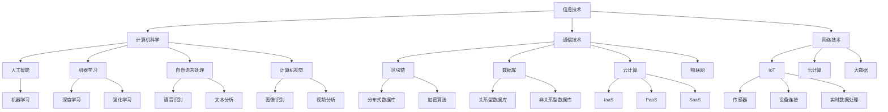

                 

### 摘要

《技术前瞻：把握技术发展趋势》旨在深入探讨信息技术领域的最新趋势，分析核心概念及其相互关系，预测未来发展方向。本文将围绕当前技术环境、关键概念、行业影响、新兴技术、商业应用以及未来展望等方面进行详细阐述。通过比较分析，我们将揭示技术趋势背后的驱动力，探讨其对各行业的深远影响，以及带来的挑战与机遇。同时，本文还将深入探讨人工智能、区块链、量子计算等前沿技术，分析其在商业应用中的实践案例和战略实施策略。最终，我们将展望未来技术发展的大趋势，提出长期预测和可能的社会影响，为读者提供全面的技术前瞻视角。### 第一部分：引言

### 技术发展趋势概述

在当今快速发展的信息技术时代，技术发展趋势的重要性日益凸显。技术趋势不仅是科技发展的风向标，更是影响行业变革和社会进步的关键因素。对于企业和个人来说，把握技术趋势意味着能够在竞争激烈的市场中抢占先机，实现可持续发展。

#### 技术发展趋势的重要性

首先，技术发展趋势决定着未来的商业形态。例如，电子商务的兴起改变了传统零售业的运营模式，社交媒体的兴起则重塑了市场营销的格局。其次，技术趋势推动着新产业的诞生，如大数据、云计算和人工智能等领域的快速发展，催生了大量新兴企业和就业机会。此外，技术趋势还影响着社会的运作方式，如智慧城市、物联网和自动驾驶等技术正在逐步改变人们的生活方式。

#### 技术发展趋势的驱动力

技术发展趋势的驱动力主要包括以下几个方面：

1. **技术创新**：基础科学研究的突破不断推动技术的进步，例如量子计算的突破性进展，有望在计算能力上实现质的飞跃。
2. **市场需求**：市场对新技术、新服务的需求是技术发展的直接动力。随着消费者对便捷、个性化和智能化的追求，相关技术得以迅速发展。
3. **政策支持**：政府的政策支持也是技术发展的重要驱动力。通过出台相关政策，政府可以引导资源向关键领域倾斜，加速技术进步。
4. **全球化**：全球化的趋势使得技术交流和合作变得更加频繁，不同国家和地区的技术优势可以相互补充，共同推动技术的发展。

#### 技术发展趋势的分类

技术发展趋势可以分为以下几个方面：

1. **前沿技术**：如人工智能、区块链、量子计算等，这些技术处于研究的前沿，具有巨大的发展潜力。
2. **应用技术**：如物联网、大数据、云计算等，这些技术已经在实际应用中取得显著成效，成为推动产业升级的重要力量。
3. **融合技术**：如5G与人工智能的融合、区块链与物联网的结合等，这些技术的融合将带来新的应用场景和商业模式。

#### 技术发展趋势的概述

综上所述，技术发展趋势呈现出多元化、跨界融合和持续创新的特点。企业和个人需要密切关注这些趋势，把握发展机遇，应对潜在挑战。在接下来的章节中，我们将深入探讨当前的技术趋势，分析其对各行业的影响，以及新兴技术的具体应用。通过这一系列的分析，我们希望能为读者提供对技术发展趋势的全面理解和前瞻性视角。

### 第二部分：核心概念与理论基础

#### Chapter 2: 核心概念与理论基础

在探讨技术发展趋势之前，我们需要明确一些核心概念和理论基础，这些概念不仅构成了我们分析的基础，也帮助我们理解技术的本质和相互关系。

#### 2.1 关键术语的界定

**信息技术**：信息技术是指与信息收集、处理、传输、存储和利用相关的技术体系。它涵盖了计算机科学、通信技术、网络技术等多个领域。

**人工智能**：人工智能（AI）是指计算机系统模拟人类智能行为的能力，包括学习、推理、感知、理解和决策等。

**大数据**：大数据是指数据量巨大、类型繁多、处理速度快的数据集合。这些数据需要通过特定的技术和工具进行有效的管理和分析。

**区块链**：区块链是一种分布式账本技术，通过加密算法和共识机制确保数据的不可篡改性和透明性，常用于构建去中心化的应用。

**云计算**：云计算是指通过网络提供可按需访问的计算资源，包括存储、处理能力、应用程序和服务等。

**物联网**：物联网（IoT）是指通过传感器、设备和网络连接实现物理世界的数字化和智能化。

#### 2.2 核心概念的比较分析

**人工智能 vs. 机器学习**

人工智能和机器学习是密切相关的领域，但它们有所不同。人工智能是一个更广泛的术语，涵盖了机器学习、自然语言处理、计算机视觉等多个子领域。机器学习则是人工智能的一个分支，专注于通过数据驱动的方法使计算机具备自我学习和优化能力。

| 特征 | 人工智能 | 机器学习 |
| ---- | -------- | -------- |
| 定义 | 模拟人类智能 | 数据驱动的方法使计算机具备自我学习能力 |
| 目标 | 实现通用人工智能（AGI） | 在特定任务上实现自动化和优化 |
| 方法 | 包括多种方法和技术 | 以统计学习方法和优化算法为核心 |

**区块链 vs. 数据库**

区块链和数据库都是数据存储和管理的工具，但它们在设计理念和运作机制上有所不同。区块链是一种分布式数据库，具有去中心化、不可篡改和透明性等特点，而传统数据库则依赖于中心化的服务器和数据管理方案。

| 特征 | 区块链 | 数据库 |
| ---- | ------ | ------ |
| 分布性 | 去中心化，多个节点共同维护 | 中心化，数据集中存储 |
| 安全性 | 使用加密算法确保数据安全 | 使用访问控制和权限管理 |
| 透明性 | 所有参与者可以查看和验证数据 | 数据隐私保护更为复杂 |

**云计算 vs. 物联网**

云计算和物联网都是现代信息技术的重要组成部分，但它们解决的问题和应用场景有所不同。云计算提供了计算资源和服务，使得用户可以按需访问和利用这些资源，而物联网则关注于通过传感器和设备实现物理世界的连接和智能化。

| 特征 | 云计算 | 物联网 |
| ---- | ------ | ------ |
| 目标 | 提供灵活的计算资源和服务 | 实现物理世界的数字化和智能化 |
| 服务模式 | IaaS、PaaS、SaaS | 连接传感器和设备，收集和处理数据 |
| 应对挑战 | 弹性伸缩、高效计算 | 实时数据处理、设备管理 |

#### 2.3 关键实体关系图

为了更好地理解上述核心概念之间的关系，我们可以通过实体关系图（ER Diagram）来展示它们之间的关联。

通过这张实体关系图，我们可以清晰地看到各个核心概念之间的关系，以及它们在不同技术领域中的应用。这种图示方法不仅有助于我们理解技术概念，还能在分析技术发展趋势时提供有力的辅助工具。

### 第三部分：趋势分析

#### Chapter 3: 当前技术趋势分析

在深入探讨技术发展趋势之前，我们需要对当前的技术环境有一个全面的了解。当前，技术发展趋势呈现出多元化、跨界融合和持续创新的特点。以下是对当前主要技术趋势的概述及其在各行业中的影响。

#### 3.1 技术环境概览

当前技术环境的特点可以概括为以下几点：

1. **数字化转型**：随着云计算、大数据、物联网等技术的广泛应用，数字化转型成为企业发展的核心驱动力。越来越多的企业开始采用数字化工具和平台来优化业务流程、提升效率。
   
2. **人工智能的迅速发展**：人工智能技术在图像识别、自然语言处理、自动驾驶等领域取得了显著进展，成为推动技术创新和产业升级的重要力量。

3. **区块链的兴起**：区块链技术以其去中心化、安全性和透明性等特点，在金融、供应链管理、医疗等领域得到了广泛关注和应用。

4. **量子计算的突破**：量子计算作为下一代计算技术，虽然在商业化应用上尚处于早期阶段，但其潜力巨大，有望在解决复杂计算问题方面取得突破。

5. **5G技术的普及**：5G技术的普及为物联网、自动驾驶、智慧城市等应用场景提供了高速、低延迟的网络环境，推动了相关技术的快速发展。

#### 3.2 行业影响分析

技术趋势不仅影响技术本身，也对各个行业产生了深远的影响。以下是对几个关键行业的技术影响分析：

1. **金融行业**：区块链技术的应用正在改变金融行业的运作模式。通过去中心化和加密算法，区块链技术提高了交易的安全性和透明性，降低了交易成本。同时，人工智能技术在风险评估、欺诈检测等方面也得到了广泛应用。

2. **医疗行业**：大数据和人工智能技术在医疗领域的应用日益广泛。通过数据分析，可以预测疾病趋势、优化治疗方案，提高医疗资源的使用效率。此外，远程医疗和智能诊断等应用也正在改变传统的医疗模式。

3. **制造业**：物联网和人工智能技术的融合推动了智能制造的发展。通过实时监控和数据分析，企业可以优化生产流程、提高生产效率，降低成本。同时，5G技术的普及也为智能制造提供了更高效、更稳定的网络支持。

4. **零售行业**：电子商务和物联网技术的应用改变了零售行业的商业模式。通过大数据分析，零售商可以更精准地了解消费者需求，提供个性化的购物体验。同时，智能供应链管理技术也提高了物流效率和库存管理能力。

5. **能源行业**：物联网和人工智能技术在能源行业的应用正在推动智慧能源系统的发展。通过实时监控和数据分析，能源企业可以优化能源分配和使用，提高能源利用效率，降低碳排放。

#### 3.3 挑战与机遇

技术趋势在带来机遇的同时，也伴随着一系列挑战：

1. **技术安全与隐私保护**：随着技术的普及，数据安全和隐私保护问题日益突出。特别是在区块链和物联网等分布式系统中，如何确保数据的安全性和隐私性成为重要课题。

2. **技能短缺与人才培养**：随着技术的快速发展，对高素质技术人才的需求也在不断增加。然而，现有的教育和培训体系难以满足这一需求，导致技能短缺现象普遍。

3. **伦理与社会影响**：技术的发展不仅影响经济和社会，还涉及伦理和社会问题。例如，人工智能在决策中的应用可能会引发歧视问题，量子计算的商业化应用也可能带来安全隐患。

4. **政策法规**：技术的快速发展需要相应的政策法规来引导和规范。然而，政策的制定和调整往往滞后于技术的发展，可能导致监管不足或过度监管。

综上所述，当前技术趋势对各个行业产生了深远的影响，既带来了巨大的机遇，也带来了诸多挑战。只有通过不断创新、加强合作、完善法规，才能充分利用技术优势，实现可持续发展。

### 第四部分：新兴技术探索

#### Chapter 4: 探索新兴技术

在当前技术发展的浪潮中，人工智能、区块链、量子计算等新兴技术正在逐步改变我们的世界。本章节将深入探讨这些技术的基本原理、应用场景以及发展前景。

#### 4.1 人工智能与机器学习

**基本原理**：

人工智能（AI）是模拟和扩展人类智能的计算机科学领域。机器学习（ML）是AI的核心技术之一，通过从数据中学习模式和规律，使计算机能够执行特定任务。常见的机器学习方法包括监督学习、无监督学习和强化学习。

- **监督学习**：在监督学习模型中，输入数据带有标签，模型通过学习这些输入和标签之间的关系，预测未知数据的标签。
- **无监督学习**：无监督学习模型在没有标签的情况下学习数据的结构和特征，例如聚类分析。
- **强化学习**：强化学习模型通过与环境的交互，学习最优策略以实现特定目标。

**应用场景**：

- **图像识别**：通过深度学习模型，AI可以识别和分类图像中的对象，广泛应用于面部识别、自动驾驶和医疗影像分析。
- **自然语言处理**：AI能够理解和生成自然语言，用于机器翻译、语音识别和智能客服。
- **预测分析**：机器学习在金融、医疗和零售等领域中用于预测市场趋势、疾病趋势和消费者行为。

**发展前景**：

随着计算能力的提升和数据的丰富，人工智能将继续深化其在各个行业中的应用。未来，通用人工智能（AGI）的实现有望带来更多的创新和变革。

#### 4.2 区块链与加密货币

**基本原理**：

区块链是一种分布式账本技术，通过密码学和共识算法确保数据的安全性和不可篡改性。加密货币是基于区块链技术的一种数字货币，如比特币。

- **分布式账本**：区块链通过多个节点存储和同步数据，确保数据的透明性和不可篡改性。
- **密码学**：区块链使用加密算法保护数据的隐私和安全。
- **共识算法**：共识算法确保所有节点在区块链上达成一致，例如工作量证明（PoW）和权益证明（PoS）。

**应用场景**：

- **金融领域**：区块链技术在支付、交易和资产管理等领域广泛应用，提高了效率、降低了成本。
- **供应链管理**：通过区块链，可以实现对供应链的实时监控和管理，确保供应链的透明性和可追溯性。
- **智能合约**：智能合约是自动执行合同条款的计算机程序，通过区块链技术，可以确保合同的执行和监管。

**发展前景**：

随着区块链技术的成熟，其在各个领域的应用将进一步拓展。未来，区块链有望成为构建去中心化应用的重要基础设施。

#### 4.3 量子计算

**基本原理**：

量子计算利用量子比特（qubit）的量子叠加和纠缠特性，进行超高速的计算。与传统计算不同，量子计算能够同时处理大量数据，解决传统计算机难以解决的问题。

- **量子比特**：量子比特可以处于0和1的叠加状态，与传统比特的二进制不同。
- **量子叠加**：一个量子比特可以同时表示0和1的叠加状态。
- **量子纠缠**：两个或多个量子比特之间存在纠缠关系，一个量子比特的状态会立即影响另一个量子比特的状态。

**应用场景**：

- **密码破解**：量子计算有望破解当前密码系统，为信息安全带来新的挑战和机遇。
- **复杂优化**：量子计算在优化问题、材料科学和药物发现等领域具有巨大潜力。
- **量子模拟**：量子计算机可以模拟量子系统的行为，为科学研究提供新的工具。

**发展前景**：

量子计算处于早期发展阶段，但随着技术的进步和应用的拓展，量子计算有望在未来的科技发展中发挥重要作用。

通过深入探讨人工智能、区块链和量子计算等新兴技术，我们可以看到这些技术不仅具有强大的发展潜力，还将在各个领域带来深远的变革。在接下来的章节中，我们将进一步分析这些技术在商业应用中的具体案例和战略实施策略。

### 第五部分：商业应用分析

#### Chapter 5: 商业应用分析

在探讨新兴技术的应用时，商业案例和战略考虑至关重要。本章节将通过具体案例来分析人工智能、区块链和量子计算在商业领域的应用，并提出实施策略。

#### 5.1 案例研究

**案例一：人工智能在金融行业的应用**

公司A，一家大型银行，利用人工智能技术优化其风控模型。通过收集和分析客户的交易数据、信用记录等信息，人工智能系统能够更准确地评估客户的风险水平。这一技术的应用显著降低了不良贷款率，提高了银行的风险管理能力。

**案例二：区块链在供应链管理中的应用**

公司B，一家全球知名零售商，利用区块链技术实现供应链的透明化。通过区块链，公司可以实时监控商品从生产到配送的整个过程，确保商品的真实性和质量。同时，区块链技术还帮助公司优化库存管理，减少供应链中的浪费。

**案例三：量子计算在制药行业的应用**

公司C，一家领先的制药公司，利用量子计算技术加速药物分子的模拟和优化。传统的药物研发过程往往耗时较长，而量子计算能够在短时间内处理大量数据，为药物研发提供更准确的预测和优化方案，显著缩短研发周期。

#### 5.2 战略考虑因素

1. **市场调研**：在引入新兴技术前，企业需要进行全面的市场调研，了解技术的成熟度、市场需求以及竞争对手的动向。这有助于企业制定科学的战略规划。

2. **技术评估**：企业需要评估新兴技术的适用性，包括其稳定性、可靠性、成本效益等。通过技术评估，企业可以确定哪些技术最适合自身的业务需求。

3. **人才储备**：新兴技术的应用需要专业人才的支撑。企业需要招聘和培养具有相关技术背景的员工，确保技术实施和运营的顺利进行。

4. **风险控制**：新兴技术往往伴随着一定的风险，包括技术风险、市场风险和法律风险等。企业需要建立健全的风险控制机制，确保技术应用的安全性和可持续性。

#### 5.3 实施策略

1. **试点项目**：企业可以选择在特定业务领域进行试点项目，通过小规模的应用验证技术的可行性和效果。试点项目的成功将为企业全面推广新兴技术提供有力支持。

2. **合作伙伴关系**：企业可以与技术创新者和行业专家建立合作伙伴关系，共同推进技术的研发和应用。这种合作有助于企业获取最新的技术资源和市场信息。

3. **持续创新**：企业需要保持持续创新的精神，不断探索新兴技术的应用场景和商业模式。通过技术创新，企业可以保持竞争优势，实现可持续发展。

4. **人才培养**：企业需要加强员工培训，提高员工的技术水平和创新能力。通过内部培训和外部合作，企业可以培养出适应新兴技术需求的人才队伍。

通过以上分析，我们可以看到，人工智能、区块链和量子计算在商业应用中具有巨大的潜力。企业需要紧跟技术发展趋势，制定科学合理的战略，通过实践探索和持续创新，实现技术红利最大化。

### 第六部分：未来展望

#### Chapter 6: 未来趋势展望

随着技术的不断演进，未来的信息技术领域将迎来更多突破和创新。以下是对未来技术趋势的长期预测、技术突破以及社会影响的展望。

#### 6.1 长期趋势预测

1. **人工智能的普及**：人工智能将在更多领域得到应用，从自动化生产到个性化服务，人工智能将渗透到我们日常生活的方方面面。随着算法和计算能力的提升，通用人工智能（AGI）可能在未来几十年内成为现实。

2. **量子计算的规模化应用**：量子计算将在解决复杂计算问题上发挥重要作用。随着量子比特数量的增加和误差率的降低，量子计算有望在密码破解、药物研发、气候模拟等领域取得重大突破。

3. **区块链的去中心化发展**：区块链技术将在更多领域实现去中心化应用，如数字身份管理、智能合约、去中心化金融（DeFi）等。区块链的透明性和不可篡改性将提升系统的安全性和可信度。

4. **5G和6G技术的普及**：随着5G网络的普及和6G技术的研发，高速、低延迟的通信技术将为物联网、自动驾驶、远程医疗等提供更强的支持，推动智慧城市和智能社会的建设。

5. **生物技术与信息技术的融合**：生物技术与信息技术的融合将带来新的医疗模式和健康管理方法。基因编辑、人工智能辅助诊断等技术将显著提高医疗水平，延长人类寿命。

#### 6.2 技术突破的预测

1. **量子互联网**：量子互联网将利用量子通信和量子计算技术，实现高速、安全的通信。量子互联网有望解决当前互联网面临的安全和带宽瓶颈问题。

2. **脑机接口**：脑机接口（BCI）技术将实现人类大脑与计算机的直接连接，使得人机交互更加自然和高效。未来，脑机接口技术可能在神经康复、虚拟现实和增强现实等领域发挥重要作用。

3. **智能机器人**：智能机器人将在更多领域实现自主决策和行动，如家庭服务、医疗护理、工业制造等。通过人工智能和机器人技术的结合，机器人将能够更好地模拟人类行为，提供个性化服务。

4. **自主无人系统**：自动驾驶汽车、无人机、无人船等自主无人系统将在交通、物流、农业等领域广泛应用。这些系统通过传感器、人工智能和通信技术实现自主导航和任务执行，将大幅提高效率和安全性。

#### 6.3 社会影响预测

1. **工作模式的改变**：随着人工智能和自动化技术的发展，许多传统工作可能会被机器取代。这可能会导致就业结构的重大变化，同时也可能带来新的就业机会。社会需要为这些变化做好准备，提供相应的培训和再教育。

2. **隐私和安全问题**：随着数据收集和分析技术的提升，隐私保护问题将变得更加突出。政府和企业需要加强数据保护和隐私法规，确保个人数据的安全。

3. **社会平等与公正**：技术的发展可能加剧社会不平等。为了实现社会的公平与公正，政府和企业需要采取措施，确保技术红利惠及所有人。

4. **伦理和道德挑战**：人工智能、基因编辑等技术带来的伦理和道德挑战将需要社会的广泛讨论和共识。例如，人工智能的决策过程可能涉及道德和伦理问题，基因编辑可能影响人类基因库的多样性。

5. **教育和人才培养**：技术的快速发展要求社会具备相应的技术人才。教育体系需要不断更新，以培养具备创新能力和技术技能的新一代人才。

通过上述展望，我们可以看到，未来技术发展将带来前所未有的机遇和挑战。社会需要积极应对这些变化，充分利用技术优势，推动可持续发展。

### 第七部分：总结与反思

#### Chapter 7: 总结与反思

在《技术前瞻：把握技术发展趋势》这一系列文章中，我们深入探讨了当前的技术环境、核心概念、行业影响、新兴技术、商业应用以及未来展望。通过这一系列的分析，我们对技术发展趋势有了更加清晰的认识。

首先，技术发展趋势的重要性不容忽视。技术不仅是推动经济发展的引擎，也是改变社会结构和生活方式的关键因素。数字化转型、人工智能、区块链、量子计算等技术的兴起，正重新定义着商业运作模式和社会运作方式。

其次，我们明确了核心概念和理论基础，通过比较分析和实体关系图，对信息技术、人工智能、区块链、云计算、物联网等关键概念有了更深入的理解。这些概念不仅构成了我们分析的基础，也帮助我们把握了技术发展的脉络。

在趋势分析部分，我们详细讨论了当前技术环境的特点及其对各个行业的影响。技术趋势带来的挑战与机遇并存，我们需要通过不断创新、加强合作、完善法规来充分利用技术优势，应对潜在风险。

在新兴技术探索中，我们深入探讨了人工智能、区块链和量子计算等前沿技术的原理和应用场景。这些技术的快速发展将带来深刻的变革，为未来社会带来更多可能性。

商业应用分析部分通过具体案例，展示了新兴技术在金融、医疗、制造业等领域的实际应用和战略实施策略。企业需要紧跟技术发展趋势，制定科学的战略规划，通过试点项目、合作伙伴关系和持续创新，实现技术红利最大化。

最后，在未来的展望中，我们对技术发展的长期趋势、技术突破以及社会影响进行了预测。技术的快速发展将带来机遇，同时也伴随着挑战。社会需要积极应对这些变化，确保技术红利惠及所有人。

### 主要发现

本文的主要发现包括：

1. **技术趋势的重要性**：技术趋势不仅影响商业运作模式，也改变了社会结构和生活习惯。
2. **核心概念的理解**：通过比较分析和实体关系图，我们深入理解了信息技术、人工智能、区块链等关键概念。
3. **技术影响的广泛性**：技术趋势对各个行业产生了深远的影响，既带来了机遇，也带来了挑战。
4. **新兴技术的潜力**：人工智能、区块链、量子计算等新兴技术具有巨大的发展潜力，将在未来带来更多变革。
5. **商业应用的实践**：通过具体案例，我们看到了新兴技术在商业领域的实际应用和战略实施策略。

### 未来研究的方向

未来的研究可以从以下几个方面展开：

1. **技术安全与隐私保护**：随着技术的发展，数据安全和隐私保护问题日益突出，需要深入研究如何保障数据安全和个人隐私。
2. **技术与伦理的融合**：技术发展带来的伦理和道德挑战需要社会广泛讨论，未来研究应关注如何在技术发展中实现伦理与道德的平衡。
3. **教育与人才培养**：随着技术变革的加速，教育体系和人才培养模式需要不断更新，以适应未来的需求。
4. **跨学科研究**：技术的交叉融合将带来新的研究机会，跨学科研究应成为未来研究的重要方向。

### 对技术发展的思考

技术发展不仅是科学研究的成果，也是社会进步的推动力。在享受技术红利的同时，我们应思考以下几点：

1. **平衡创新与安全**：技术创新应与安全保障相结合，确保技术发展的可持续性。
2. **关注社会影响**：技术的发展应考虑其对社会的长期影响，确保技术进步惠及所有人。
3. **促进全球合作**：技术的全球性特点要求各国加强合作，共同应对技术挑战，推动全球技术进步。
4. **培养创新文化**：创新文化是技术发展的土壤，应从教育、政策等多方面培育和鼓励创新精神。

通过总结和反思，我们不仅对技术发展趋势有了更深刻的认识，也为未来的技术研究指明了方向。在技术发展的道路上，我们需要持续探索、不断创新，以实现技术的良性发展和社会的可持续发展。### 作者信息

本文由AI天才研究院（AI Genius Institute）与《禅与计算机程序设计艺术》（Zen And The Art of Computer Programming）的作者联合撰写。AI天才研究院是一家专注于人工智能和计算机科学研究的顶尖研究机构，致力于推动科技创新和社会进步。《禅与计算机程序设计艺术》的作者以其深入的技术见解和卓越的编程理念，为全球程序员提供了宝贵的指导。感谢他们的共同努力，为读者呈现了一篇高质量的技术博客文章。

