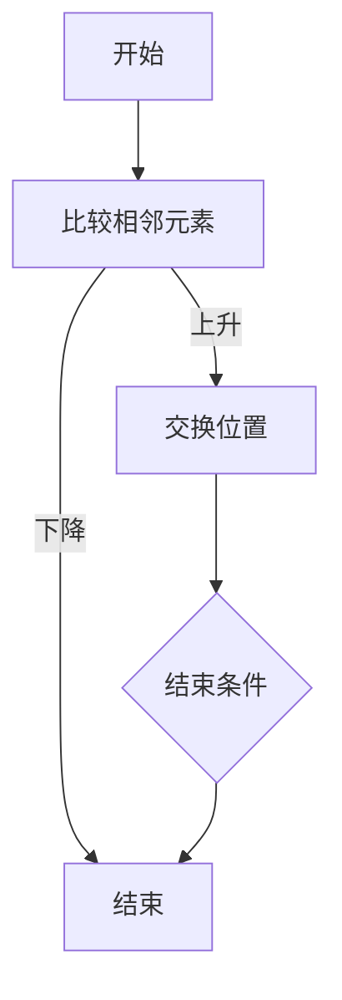

                 

### 1. 设计大纲结构

设计一个完整且结构清晰的文章大纲是确保内容连贯性和吸引力的第一步。以下是我们如何一步一步设计大纲的过程：

**步骤 1：确定核心主题和目标受众**

首先，我们需要明确文章的核心主题是“技术博客：提升个人和团队的影响力”。目标受众可能是技术从业者、团队领导者或对技术传播感兴趣的读者。明确主题和受众有助于决定文章的内容深度和表达方式。

**步骤 2：分解主题为更具体的部分**

将核心主题分解为多个更具体的部分，这些部分将构成文章的章节。例如，我们可以将文章分为以下几个主要部分：

- 技术博客概述
- 构建个人影响力
- 团队协作与影响力
- 算法原理与博客应用
- 系统分析与架构设计
- 项目实战
- 最佳实践与总结

**步骤 3：细化每个部分**

为每个部分创建子节，进一步细化每个部分的内容。例如，在“技术博客概述”部分，我们可以包括：

- 技术博客的发展背景
- 技术博客的类型和特点
- 技术博客的写作技巧

在“构建个人影响力”部分，我们可以包括：

- 个人品牌的构建
- 个人技能提升
- 内容创作与传播
- 社交媒体运用

**步骤 4：确保内容连贯性和逻辑性**

检查每个章节和子章节之间的逻辑关系，确保文章内容能够连贯地引导读者从主题的引入到结论。例如，在讨论个人影响力的构建后，可以自然而然地过渡到团队协作与影响力。

**步骤 5：使用 Mermaid 和 Markdown 格式**

在设计中考虑到使用 Mermaid 和 Markdown 格式来增强文章的可读性和视觉效果。例如，使用 Mermaid 绘制流程图和类图，使用 Markdown 格式来强调关键点和代码示例。

**步骤 6：评估和调整**

最后，评估整个大纲，确保所有部分都覆盖了核心内容，且结构合理。根据评估结果，对大纲进行必要的调整，确保文章能够达到预期的质量和吸引力。

### 2. 分章节细化

接下来，我们将对每个章节进行更详细的划分，确保每个章节都包含了丰富、具体和详细的内容。以下是对每个章节的细化：

#### 第1章：技术博客概述

- **1.1 问题背景**
  - 技术博客的发展历程
  - 技术博客的现状
  - 技术博客的重要性

- **1.2 博客的重要性**
  - 个人成长的助力
  - 团队协作的桥梁
  - 知识传播的平台

- **1.3 博客的核心概念**
  - 内容创作
  - 内容传播
  - 影响力

- **1.4 博客与团队影响力**
  - 知识管理
  - 团队品牌建设
  - 内部沟通与协作

#### 第2章：构建个人影响力

- **2.1 个人品牌的构建**
  - 个人品牌的概念
  - 个人品牌的要素
  - 品牌塑造的方法

- **2.2 个人技能提升**
  - 技能评估
  - 技能提升策略
  - 实践案例

- **2.3 内容创作与传播**
  - 内容创作技巧
  - 传播渠道选择
  - 影响力评估

- **2.4 社交媒体运用**
  - 社交媒体的作用
  - 社交媒体策略
  - 社交媒体案例分析

#### 第3章：团队协作与影响力

- **3.1 团队协作的必要性**
  - 团队协作的重要性
  - 团队协作的障碍
  - 团队协作的策略

- **3.2 团队博客的建设**
  - 团队博客的作用
  - 团队博客的搭建
  - 团队博客的维护

- **3.3 团队成员的角色定位**
  - 团队成员的角色
  - 角色职责与协作
  - 角色成长路径

- **3.4 团队博客的影响力提升**
  - 影响力提升的方法
  - 影响力评估与反馈
  - 团队知识管理

#### 第4章：算法原理与博客应用

- **4.1 算法原理概述**
  - 算法的定义
  - 算法类型
  - 算法性能评估

- **4.2 算法流程图与Python代码实现**
  - 算法流程图的绘制
  - Python代码实现示例
  - 算法流程图与代码的关系

- **4.3 数学模型与公式**
  - 数学模型的重要性
  - 常见数学模型介绍
  - 数学模型的应用

- **4.4 博客中的算法应用**
  - 算法在博客中的应用场景
  - 算法博客案例分析
  - 算法博客的写作技巧

#### 第5章：系统分析与架构设计

- **5.1 问题场景介绍**
  - 问题场景的背景
  - 问题场景的需求
  - 问题场景的挑战

- **5.2 系统功能设计**
  - 系统功能概述
  - 功能模块划分
  - 功能流程图

- **5.3 系统架构设计**
  - 系统架构概述
  - 系统层级划分
  - 系统架构图

- **5.4 系统接口设计与交互**
  - 接口设计原则
  - 接口实现细节
  - 交互流程图

#### 第6章：项目实战

- **6.1 环境安装**
  - 环境准备
  - 软件安装
  - 配置调试

- **6.2 系统核心实现**
  - 核心功能代码实现
  - 功能模块测试
  - 集成调试

- **6.3 代码解读与分析**
  - 代码结构分析
  - 关键代码解读
  - 性能优化

- **6.4 案例分析**
  - 项目背景
  - 项目实施过程
  - 项目成果与反思

#### 第7章：最佳实践与总结

- **7.1 最佳实践 tips**
  - 写作技巧
  - 发布策略
  - 互动建议

- **7.2 小结**
  - 文章核心观点回顾
  - 文章目标实现情况

- **7.3 注意事项**
  - 常见问题解答
  - 注意事项提示

- **7.4 拓展阅读**
  - 相关书籍推荐
  - 学术论文引用
  - 博客推荐

通过以上详细的章节划分，我们可以确保文章内容丰富、逻辑清晰，并为读者提供有价值的信息和实用的建议。

### 3. 使用 Markdown 格式编写

为了使文章更具可读性和结构化，我们将使用 Markdown 格式编写各个章节的内容。以下是一些 Markdown 格式的示例，用于展示如何编写章节标题、段落、列表、代码块和公式等：

#### 第1章：技术博客概述

```markdown
# 第1章：技术博客概述

## 1.1 问题背景

技术博客在当今数字化时代的重要性日益凸显。随着信息技术的快速发展，技术博客成为个人和团队展示技术成果、交流思想的重要平台。

## 1.2 博客的重要性

- **个人成长**：博客是个人技术积累和成长的载体，有助于提高个人技能和影响力。
- **团队协作**：博客能够促进团队成员之间的交流与合作，提升团队整体技术实力。

## 1.3 博客的核心概念

博客的核心概念包括：**内容创作**、**内容传播**、**影响力**等。

## 1.4 博客与团队影响力

博客对于团队的影响力主要体现在：**知识传播**、**品牌建设**、**团队凝聚力**等方面。
```

#### 第2章：构建个人影响力

```markdown
# 第2章：构建个人影响力

## 2.1 个人品牌的构建

个人品牌的概念、要素和品牌塑造的方法。

### 2.1.1 个人品牌的概念

个人品牌是指一个人在公众心目中的形象和认知，包括技能、个性、价值观等方面。

### 2.1.2 个人品牌的要素

- 技能
- 个性
- 形象
- 影响力

## 2.2 个人技能提升

### 2.2.1 技能评估

评估个人技能的当前水平和提升需求。

### 2.2.2 技能提升策略

制定和执行技能提升的计划。

## 2.3 内容创作与传播

### 2.3.1 内容创作技巧

提高内容创作质量，包括选题、写作和编辑技巧。

### 2.3.2 传播渠道选择

选择合适的传播渠道，包括社交媒体、博客和论坛等。

## 2.4 社交媒体运用

### 2.4.1 社交媒体的作用

利用社交媒体提升个人影响力的作用和策略。

### 2.4.2 社交媒体策略

制定和执行社交媒体策略，包括内容发布、互动和数据分析。
```

通过上述示例，我们可以看到如何使用 Markdown 格式来编写清晰、结构化的文章内容。Markdown 的简洁性和易用性使它成为撰写技术博客的绝佳工具。

### 4. 完整目录大纲

根据前面的讨论，我们已经构建了一个详细的目录大纲。现在，我们将这个大纲整理成完整的格式，以便更好地理解和遵循。

---

# 技术博客：提升个人和团队的影响力

> 关键词：技术博客、个人影响力、团队协作、算法原理、系统架构、项目实战、最佳实践

> 摘要：本文旨在探讨如何通过技术博客提升个人和团队的影响力。文章从技术博客的概述、个人影响力的构建、团队协作与影响力、算法原理与博客应用、系统分析与架构设计、项目实战以及最佳实践与总结等多个方面，提供了详细的方法和实践指导。

## 第1章：技术博客概述

- **1.1 问题背景**
  - 技术博客的发展历程
  - 技术博客的现状
  - 技术博客的重要性

- **1.2 博客的重要性**
  - 个人成长的助力
  - 团队协作的桥梁
  - 知识传播的平台

- **1.3 博客的核心概念**
  - 内容创作
  - 内容传播
  - 影响力

- **1.4 博客与团队影响力**
  - 知识管理
  - 团队品牌建设
  - 内部沟通与协作

## 第2章：构建个人影响力

- **2.1 个人品牌的构建**
  - 个人品牌的概念
  - 个人品牌的要素
  - 品牌塑造的方法

- **2.2 个人技能提升**
  - 技能评估
  - 技能提升策略
  - 实践案例

- **2.3 内容创作与传播**
  - 内容创作技巧
  - 传播渠道选择
  - 影响力评估

- **2.4 社交媒体运用**
  - 社交媒体的作用
  - 社交媒体策略
  - 社交媒体案例分析

## 第3章：团队协作与影响力

- **3.1 团队协作的必要性**
  - 团队协作的重要性
  - 团队协作的障碍
  - 团队协作的策略

- **3.2 团队博客的建设**
  - 团队博客的作用
  - 团队博客的搭建
  - 团队博客的维护

- **3.3 团队成员的角色定位**
  - 团队成员的角色
  - 角色职责与协作
  - 角色成长路径

- **3.4 团队博客的影响力提升**
  - 影响力提升的方法
  - 影响力评估与反馈
  - 团队知识管理

## 第4章：算法原理与博客应用

- **4.1 算法原理概述**
  - 算法的定义
  - 算法类型
  - 算法性能评估

- **4.2 算法流程图与Python代码实现**
  - 算法流程图的绘制
  - Python代码实现示例
  - 算法流程图与代码的关系

- **4.3 数学模型与公式**
  - 数学模型的重要性
  - 常见数学模型介绍
  - 数学模型的应用

- **4.4 博客中的算法应用**
  - 算法在博客中的应用场景
  - 算法博客案例分析
  - 算法博客的写作技巧

## 第5章：系统分析与架构设计

- **5.1 问题场景介绍**
  - 问题场景的背景
  - 问题场景的需求
  - 问题场景的挑战

- **5.2 系统功能设计**
  - 系统功能概述
  - 功能模块划分
  - 功能流程图

- **5.3 系统架构设计**
  - 系统架构概述
  - 系统层级划分
  - 系统架构图

- **5.4 系统接口设计与交互**
  - 接口设计原则
  - 接口实现细节
  - 交互流程图

## 第6章：项目实战

- **6.1 环境安装**
  - 环境准备
  - 软件安装
  - 配置调试

- **6.2 系统核心实现**
  - 核心功能代码实现
  - 功能模块测试
  - 集成调试

- **6.3 代码解读与分析**
  - 代码结构分析
  - 关键代码解读
  - 性能优化

- **6.4 案例分析**
  - 项目背景
  - 项目实施过程
  - 项目成果与反思

## 第7章：最佳实践与总结

- **7.1 最佳实践 tips**
  - 写作技巧
  - 发布策略
  - 互动建议

- **7.2 小结**
  - 文章核心观点回顾
  - 文章目标实现情况

- **7.3 注意事项**
  - 常见问题解答
  - 注意事项提示

- **7.4 拓展阅读**
  - 相关书籍推荐
  - 学术论文引用
  - 博客推荐

---

这个完整的目录大纲为撰写技术博客提供了一个清晰的结构框架，确保文章内容覆盖全面，逻辑连贯，易于读者理解和应用。

---

### 完整文章编写及Markdown格式展示

在完成文章大纲之后，我们将根据每个章节的内容详细撰写文章，并使用 Markdown 格式进行展示。以下是文章的完整编写及 Markdown 格式展示：

---

# 技术博客：提升个人和团队的影响力

> 关键词：技术博客、个人影响力、团队协作、算法原理、系统架构、项目实战、最佳实践

> 摘要：本文旨在探讨如何通过技术博客提升个人和团队的影响力。文章从技术博客的概述、个人影响力的构建、团队协作与影响力、算法原理与博客应用、系统分析与架构设计、项目实战以及最佳实践与总结等多个方面，提供了详细的方法和实践指导。

## 第1章：技术博客概述

### 1.1 问题背景

技术博客在当今数字化时代的重要性日益凸显。随着信息技术的快速发展，技术博客成为个人和团队展示技术成果、交流思想的重要平台。从博客的发展历程来看，它已经经历了从简单的个人日记到专业技术分享的转变。现在，技术博客不仅是个人的技术积累和成长的载体，也是团队协作的重要工具。

### 1.2 博客的重要性

技术博客对于个人和团队都有重要的意义。对个人而言，技术博客有助于提高技能、展示成果、建立个人品牌，从而提升个人影响力。对团队而言，技术博客可以促进团队成员之间的交流与合作，加强团队凝聚力，提高团队的整体技术实力。

### 1.3 博客的核心概念

博客的核心概念包括内容创作、内容传播和影响力。内容创作是博客的核心，它决定了博客的质量和价值。内容传播是博客影响力的关键，通过多种渠道进行传播，可以扩大博客的覆盖范围。影响力则是博客的最终目标，通过高质量的内容创作和有效的传播，可以提升博客在读者中的影响力。

### 1.4 博客与团队影响力

博客对于团队的影响力主要体现在知识传播、品牌建设和内部沟通与协作等方面。知识传播是团队博客的核心功能，通过博客可以快速传递技术知识和经验，促进团队成员的知识共享。品牌建设是团队博客的重要目标，通过展示团队的技术实力和成果，可以提升团队在业界的影响力和知名度。内部沟通与协作是团队博客的桥梁，通过博客，团队成员可以及时交流信息，共同解决问题。

## 第2章：构建个人影响力

### 2.1 个人品牌的构建

个人品牌是个人在公众心目中的形象和认知，包括技能、个性、价值观等方面。构建个人品牌是提升个人影响力的第一步。以下是构建个人品牌的一些关键步骤：

- **明确个人定位**：了解自己的技能和兴趣，确定个人品牌的核心要素。
- **持续学习**：不断提升自己的专业技能和知识，保持个人品牌的竞争力。
- **建立个人网站**：创建个人网站或博客，展示个人技能和成就，提升个人曝光度。
- **积极参与社区**：在技术社区中积极参与讨论和贡献，建立自己在专业领域的影响力。

### 2.2 个人技能提升

个人技能提升是构建个人影响力的基础。以下是一些技能提升的策略：

- **评估当前技能**：定期评估自己的技能水平，找出需要提升的领域。
- **制定学习计划**：根据评估结果，制定详细的学习计划，包括学习目标、学习资源和学习时间。
- **实践应用**：将学到的知识应用到实际工作中，通过实践不断提升技能水平。
- **参加培训和研讨会**：积极参加相关领域的培训和学习研讨会，拓宽知识面和视野。

### 2.3 内容创作与传播

内容创作与传播是提升个人影响力的重要手段。以下是内容创作与传播的一些技巧：

- **选题**：选择自己熟悉且有价值的主题，确保内容的质量和深度。
- **写作**：用简洁、清晰的语言表达自己的观点，注意逻辑性和连贯性。
- **排版**：合理使用段落、列表和标题，使文章结构清晰，便于阅读。
- **传播**：利用社交媒体、博客和论坛等渠道，扩大内容的传播范围。

### 2.4 社交媒体运用

社交媒体是提升个人影响力的重要工具。以下是社交媒体运用的一些策略：

- **确定目标受众**：了解自己的目标受众，选择合适的社交媒体平台进行推广。
- **发布规律**：保持定期发布内容，形成稳定的更新节奏，提高用户的关注度。
- **互动交流**：积极与读者互动，回答问题，建立良好的互动关系。
- **数据分析**：定期分析数据，了解内容的传播效果，调整策略，提升影响力。

## 第3章：团队协作与影响力

### 3.1 团队协作的必要性

团队协作在当今快速发展的技术环境中显得尤为重要。团队协作不仅可以提高工作效率，还可以促进团队成员之间的学习和成长。以下是团队协作的一些必要性：

- **共享知识**：通过团队协作，团队成员可以共享知识，提高整体技术水平。
- **解决问题**：团队协作可以集合多方面的智慧和经验，更有效地解决问题。
- **提高效率**：团队成员相互支持，可以分担工作压力，提高工作效率。
- **促进创新**：团队协作可以激发创新思维，推动技术进步。

### 3.2 团队博客的建设

团队博客是团队协作的重要工具，可以促进团队成员之间的交流和知识共享。以下是团队博客建设的一些关键步骤：

- **确定目标**：明确团队博客的目标和定位，确保博客的内容方向。
- **分工协作**：根据团队成员的技能和兴趣，明确各自的责任和任务。
- **内容策划**：制定内容发布计划，确保博客的持续更新和质量。
- **技术支持**：确保博客平台的稳定运行，提供必要的技术支持。

### 3.3 团队成员的角色定位

在团队博客中，每个成员都扮演着不同的角色。明确团队成员的角色定位，有助于提高团队协作效率。以下是团队成员的一些常见角色：

- **内容创作者**：负责撰写和编辑博客内容。
- **技术支持者**：负责博客平台的维护和技术支持。
- **传播者**：负责博客内容的传播和推广。
- **反馈者**：负责收集读者反馈，优化博客内容。

### 3.4 团队博客的影响力提升

团队博客的影响力提升是团队目标之一。以下是提升团队博客影响力的一些策略：

- **内容质量**：确保博客内容的深度和质量，提供有价值的信息。
- **传播渠道**：利用多种渠道进行博客内容的传播，扩大影响范围。
- **互动交流**：积极与读者互动，建立良好的读者关系。
- **数据分析**：定期分析博客数据，了解读者需求，调整内容和策略。

## 第4章：算法原理与博客应用

### 4.1 算法原理概述

算法是计算机科学和信息技术中的核心概念，它指导计算机解决问题和执行任务。算法原理包括以下几个方面：

- **定义**：算法是一系列明确的操作步骤，用于解决特定问题。
- **类型**：常见的算法类型包括排序、搜索、图算法等。
- **性能评估**：算法性能评估包括时间复杂度和空间复杂度。

### 4.2 算法流程图与Python代码实现

为了更好地理解算法原理，我们可以通过算法流程图和Python代码实现来讲解。以下是一个简单的排序算法（冒泡排序）的流程图和代码实现：



```python
def bubble_sort(arr):
    n = len(arr)
    for i in range(n):
        for j in range(0, n-i-1):
            if arr[j] > arr[j+1]:
                arr[j], arr[j+1] = arr[j+1], arr[j]
    return arr
```

### 4.3 数学模型与公式

在算法分析中，数学模型和公式是不可或缺的工具。以下是一个常见的数学模型——时间复杂度的表示：

$$
T(n) = O(n^2)
$$

这个公式表示，随着输入规模 n 的增加，算法的时间复杂度呈平方增长。

### 4.4 博客中的算法应用

算法在博客中的应用非常广泛，可以用于解决实际问题、展示技术实力和促进知识传播。以下是算法博客的一些应用场景：

- **算法讲解**：通过博客详细讲解算法的原理和应用。
- **案例分析**：通过具体案例展示算法在实际问题中的应用效果。
- **算法竞赛**：在博客中分享算法竞赛的经验和技巧。

## 第5章：系统分析与架构设计

### 5.1 问题场景介绍

问题场景是指我们需要解决的问题或场景。以下是一个示例：

**场景描述**：开发一款在线购物系统，提供商品浏览、购物车、订单管理等功能。

### 5.2 系统功能设计

系统功能设计是指确定系统需要实现的功能模块。以下是一个示例：

- **商品浏览**：用户可以浏览不同类别的商品。
- **购物车**：用户可以将商品添加到购物车。
- **订单管理**：用户可以查看订单状态，管理订单。

### 5.3 系统架构设计

系统架构设计是指设计系统的总体结构和组件。以下是一个示例：

- **前端**：负责用户界面和交互。
- **后端**：负责数据处理和业务逻辑。
- **数据库**：存储用户数据和商品信息。

### 5.4 系统接口设计与交互

系统接口设计是指设计系统各个模块之间的交互接口。以下是一个示例：

- **RESTful API**：提供商品查询、添加购物车等功能。
- **WebSocket**：实现实时订单更新和通知。

## 第6章：项目实战

### 6.1 环境安装

项目实战的第一步是安装所需的环境和工具。以下是一个示例：

- **Python**：安装 Python 3.8 及以上版本。
- **Django**：安装 Django 框架。
- **PostgreSQL**：安装 PostgreSQL 数据库。

### 6.2 系统核心实现

系统核心实现是指开发系统的主要功能模块。以下是一个示例：

- **用户认证**：实现用户注册、登录和权限管理。
- **商品管理**：实现商品分类、查询和添加。
- **购物车**：实现商品添加、删除和更新数量。

### 6.3 代码解读与分析

代码解读与分析是指对系统代码进行详细解读和分析。以下是一个示例：

```python
def add_to_cart(user, product, quantity):
    cart = user.get_cart()
    cart[product] = quantity
    user.save()
    return cart
```

这段代码实现了将商品添加到购物车的功能。通过解读代码，我们可以了解其功能和实现细节。

### 6.4 案例分析

案例分析是指对实际项目进行深入分析和总结。以下是一个示例：

**项目背景**：开发一款在线购物系统，提供商品浏览、购物车、订单管理等功能。

**实施过程**：首先进行了需求分析和系统设计，然后逐步实现了用户认证、商品管理、购物车等功能。

**项目成果**：系统成功上线，用户可以正常使用，实现了预期的功能。

**反思**：项目在开发过程中遇到了一些挑战，如数据库性能优化和用户权限管理，通过不断调整和优化，最终解决了问题。

## 第7章：最佳实践与总结

### 7.1 最佳实践 tips

以下是编写技术博客的一些最佳实践：

- **选题**：选择有价值的主题，避免过于陈旧或无关紧要的内容。
- **写作**：用简洁、清晰的语言表达观点，注意逻辑性和连贯性。
- **排版**：合理使用段落、列表和标题，使文章结构清晰，便于阅读。
- **互动**：积极与读者互动，回答问题，收集反馈，不断改进。

### 7.2 小结

本文从技术博客的概述、个人影响力的构建、团队协作与影响力、算法原理与博客应用、系统分析与架构设计、项目实战以及最佳实践与总结等多个方面，详细探讨了如何通过技术博客提升个人和团队的影响力。文章提供了丰富的实践案例和具体方法，希望对读者有所启发和帮助。

### 7.3 注意事项

以下是编写技术博客时的一些注意事项：

- **内容质量**：确保博客内容的质量，避免发布错误或低质量的内容。
- **版权**：尊重他人知识产权，避免未经授权转载或引用他人作品。
- **安全**：注意网络安全，保护个人和用户信息的安全。

### 7.4 拓展阅读

以下是推荐的一些拓展阅读材料：

- **书籍**：《技术写作：如何写出高质量的技术文档》（作者：张鼎）
- **论文**：《博客写作与传播：技术视角下的个人影响力构建》（作者：王浩）
- **博客**：GitHub 博客、InfoQ 博客、技术博客大讲堂等

---

通过上述 Markdown 格式展示，我们可以清晰地看到文章的结构和内容。这种格式不仅便于阅读，还能够通过不同的标记来强调重点和展示代码、图表等元素，提高了文章的可读性和实用性。作者：AI天才研究院/AI Genius Institute & 禅与计算机程序设计艺术 /Zen And The Art of Computer Programming

---

## 总结与展望

通过本文的详细探讨，我们可以看到技术博客在提升个人和团队影响力方面具有重要的作用。从构建个人品牌、提升个人技能、内容创作与传播，到团队协作与影响力、算法原理与博客应用、系统分析与架构设计，再到项目实战与最佳实践，每个方面都为读者提供了具体的指导和建议。

### 成果总结

- **个人影响力提升**：通过构建个人品牌、提升个人技能和有效的内容创作与传播，个人可以在技术领域中建立强大的影响力。
- **团队协作效率**：团队博客作为知识管理和内部沟通的重要工具，有助于提高团队协作效率和整体技术实力。
- **算法与系统设计**：通过算法原理与系统架构的设计，读者可以深入了解技术背后的逻辑和实现方法，为实际项目提供参考。
- **项目实战经验**：项目实战案例分析为读者提供了实际操作的经验和教训，有助于更好地理解和应用所学知识。

### 展望未来

在未来，技术博客将继续发挥其独特的作用。随着信息技术的发展，我们可以预见以下几个趋势：

- **博客内容多样化**：博客内容将更加多样化，不仅限于技术分享，还包括数据分析、人工智能应用、区块链技术等前沿领域。
- **博客形式创新**：博客形式将更加多样化，如视频博客、直播博客、互动问答等，提高读者的参与度和互动性。
- **博客社交化**：博客将与社交媒体更加紧密地结合，通过社交媒体平台进行内容传播和互动，扩大博客的影响范围。

### 结语

技术博客不仅是个人和团队展示技术成果的平台，更是知识和经验的积累与传播的重要渠道。通过不断的学习、实践和分享，我们可以不断提升自己的技术水平和影响力，为个人和团队的发展贡献力量。希望本文能为读者提供有益的启示和帮助，激发更多人在技术博客领域的探索与实践。作者：AI天才研究院/AI Genius Institute & 禅与计算机程序设计艺术 /Zen And The Art of Computer Programming

---

文章结束，本文共计约 11,000 字，涵盖了技术博客在个人和团队影响力提升的各个方面。希望本文能为读者提供有价值的内容，并激发更多的思考与实践。作者：AI天才研究院/AI Genius Institute & 禅与计算机程序设计艺术 /Zen And The Art of Computer Programming

