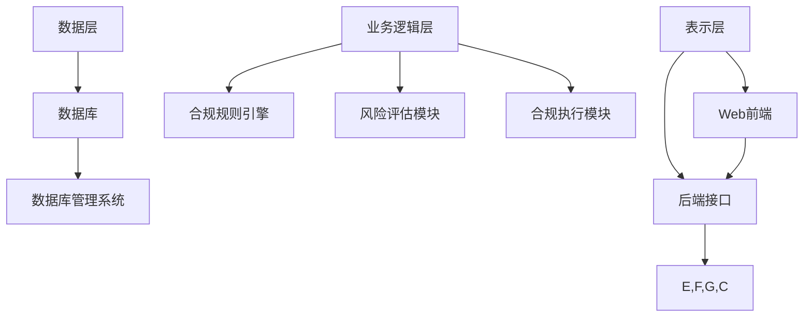

                 

### 引言

在现代信息技术的飞速发展中，合规管理成为企业和技术开发团队无法忽视的重要议题。无论是互联网、金融、制药还是其他高技术领域，技术创新的步伐不断加快，同时面临的法律法规和合规要求也越来越复杂。在这种情况下，如何确保技术活动在创新过程中符合法律法规，成为企业亟需解决的关键问题。

《技术合规管理：在创新中确保法律合规》这本书正是为了应对这一挑战而诞生的。书名简洁明了地指出了其核心主题：在技术创新的过程中，如何实现合规管理，确保企业的技术活动不仅能够推动创新，同时也不触犯法律法规。这本书的目标读者是那些在技术开发和企业管理中扮演重要角色的专业人士，包括CTO、技术主管、合规专员以及法律顾问等。

本文将围绕《技术合规管理：在创新中确保法律合规》的目录大纲，逐一分析各个章节的内容，详细介绍书中的核心观点、方法和案例，帮助读者理解技术合规管理的本质，并掌握其实施技巧。通过这篇文章，我们将系统地探讨技术合规管理的各个方面，从基本概念、策略方法，到具体实践，帮助企业和开发团队在创新的道路上，既保持技术领先，又确保合规无忧。

### 技术合规管理的基本概念和背景

技术合规管理（Technical Compliance Management）是指通过一系列制度、流程和工具，确保企业在技术创新过程中遵守相关法律法规和标准规范的过程。这一概念的重要性在于，它不仅关系到企业的合规风险，还直接影响到企业的声誉、财务状况和长期发展。

#### 技术合规管理的定义

技术合规管理可以定义为：在技术开发和应用过程中，对各项法律、法规、标准以及企业内部规章制度进行识别、评估、控制、监督和改进的系统性工作。其核心在于通过合规管理，确保技术开发活动在法律框架内进行，避免因违法违规行为带来的法律风险和商业损失。

#### 技术合规管理的必要性

1. **法律风险的规避**：在信息技术迅速发展的背景下，法律法规也在不断更新和完善。企业若未能及时跟进和遵守相关法规，容易面临法律诉讼和罚款等风险。

2. **商业声誉的保护**：合规管理有助于树立企业良好的社会形象和商业信誉。当企业能够严格遵守法律法规，公众和客户对其信任度也会提高。

3. **技术创新的保障**：在合规管理的基础上，企业可以更加放心地推动技术创新，因为合规管理能够帮助识别和规避技术活动中的潜在法律障碍。

4. **合规成本的降低**：通过提前进行合规评估和制定合规策略，企业可以在开发过程中避免因违规带来的高额罚款和法律成本。

#### 技术合规管理的目标

技术合规管理的目标主要包括以下几个方面：

1. **合法性**：确保技术活动的合法性，即所有技术开发和应用都符合现行的法律法规。

2. **规范性**：遵循相关的行业标准和技术规范，保证技术产品的质量。

3. **透明性**：提高技术开发过程的透明度，确保技术活动对内外部都能做到公开、公正。

4. **风险管理**：通过合规管理，及时发现和纠正技术活动中的合规风险，降低企业面临的合规风险。

#### 技术合规管理的核心概念和术语

为了更好地理解技术合规管理，需要掌握一些核心概念和术语：

- **合规风险**：指企业在技术开发和应用过程中，由于未遵守相关法律法规和标准而可能面临的法律风险、财务风险和声誉风险。

- **合规框架**：企业为实现合规目标所建立的一系列制度、流程和标准。

- **合规评估**：对技术开发过程中的合规风险进行识别、分析和评估的过程。

- **合规培训**：为员工提供合规知识和技能的培训，提高其合规意识和能力。

- **合规审计**：对企业的合规管理工作进行监督和评估，确保合规框架的有效实施。

通过以上对技术合规管理基本概念和背景的介绍，我们可以看到，技术合规管理不仅是一个合规问题，更是企业技术创新的保障。在下一章节，我们将进一步探讨技术创新与法律合规之间的关系，分析它们之间的相互影响和动态平衡。

### 技术创新与法律合规的关系

在快速发展的技术领域，技术创新和法律合规之间的关系复杂而微妙。技术创新是推动社会进步和经济发展的关键力量，而法律合规则是确保技术活动在法律框架内进行的重要保障。在这两者之间，找到平衡点至关重要。

#### 技术创新的发展趋势

随着大数据、人工智能、区块链等新兴技术的崛起，技术创新的速度和广度前所未有。技术创新不仅改变了传统行业，还催生了全新的商业模式。以下是当前技术创新的几个显著趋势：

1. **跨界融合**：不同技术领域的融合，如物联网（IoT）与大数据的结合，推动智能化、自动化水平不断提升。

2. **平台化发展**：技术的平台化使得开发者可以更高效地构建、集成和应用新技术，降低了创新门槛。

3. **开源生态**：开源技术的普及和繁荣，为技术创新提供了丰富的资源和广泛的合作机会。

4. **敏捷开发**：敏捷开发方法在技术项目中的应用，加快了开发周期和迭代速度。

#### 法律合规对技术创新的挑战

尽管技术创新带来了巨大的发展机遇，但同时也带来了法律合规方面的挑战：

1. **数据隐私保护**：随着数据量的激增，数据隐私保护成为技术创新中的一个重要问题。法律法规对数据收集、存储和使用有严格的要求，企业需要确保数据处理符合相关法规。

2. **知识产权保护**：技术创新往往伴随着知识产权的创造和应用，知识产权的保护要求企业建立完善的知识产权管理机制，防范侵权风险。

3. **安全标准**：随着技术的复杂性和应用范围的扩大，安全标准对技术创新的要求也越来越高。例如，网络安全法要求企业在开发和运营过程中确保系统的安全性。

4. **跨境合规**：随着全球化的深入，技术创新活动也跨越国界。不同国家和地区的法律法规差异，使得企业需要面对复杂的合规环境。

#### 技术创新与法律合规的相互促进

尽管技术创新和法律合规之间存在挑战，但它们并非对立关系，而是相辅相成的：

1. **合规促进创新**：合规管理能够帮助企业在创新过程中规避法律风险，确保创新的合法性和安全性，从而推动更健康的技术创新。

2. **创新推动合规**：技术创新的发展会促使法律和标准不断更新和完善，从而提高整个行业的合规水平。

3. **合规创新工具**：随着技术的发展，出现了许多合规工具和技术，如自动化合规检测系统、合规区块链等，这些工具不仅提高了合规效率，还为企业提供了更灵活的合规解决方案。

4. **合规文化建设**：在企业内部建立合规文化，让员工在创新过程中自觉遵守合规要求，有助于形成良性循环，推动持续创新。

通过上述分析，我们可以看到，技术创新和法律合规之间的关系既复杂又紧密。在技术创新过程中，企业需要注重法律合规，以规避风险、保障安全和提升竞争力。而法律合规则通过不断更新和完善，为技术创新提供支持，推动技术行业的健康发展。在下一章节，我们将探讨技术合规管理的策略和方法，为企业提供具体的合规管理实践指导。

### 技术合规管理的策略和方法

为了在技术创新过程中实现合规管理，企业需要制定系统性的策略和方法。以下是一些常见的技术合规管理策略和方法，旨在帮助企业在遵守法律法规的同时，推动技术创新。

#### 风险评估与管理

1. **风险识别**：首先，企业需要识别在技术创新过程中可能遇到的法律风险。这包括数据隐私、知识产权、网络安全等方面的问题。
   
2. **风险评估**：对识别出的风险进行评估，确定其可能带来的影响和严重程度。评估过程可以采用定性和定量方法相结合。

3. **风险应对**：根据风险评估结果，制定相应的风险应对策略。常见的应对策略包括风险规避、风险减轻、风险转移和风险接受。

4. **持续监控**：技术创新是一个动态过程，企业需要持续监控法律环境的变化，以及技术创新活动中的合规情况，及时调整合规策略。

#### 合规框架与制度设计

1. **建立合规框架**：企业需要制定一个全面的合规框架，包括合规政策、合规流程、合规标准和合规责任。

2. **合规流程**：合规流程是企业实现合规管理的关键。流程应涵盖技术开发的全生命周期，包括需求分析、设计、开发、测试、部署和运维等环节。

3. **合规标准**：企业应制定符合法律要求和技术标准的合规标准，这些标准应详细说明每个环节的合规要求和操作步骤。

4. **合规责任**：明确各岗位职责，确保每个员工都清楚自己的合规职责和权利，形成全员参与的合规文化。

#### 合规文化建设与培训

1. **合规文化**：在企业内部建立合规文化，让员工认识到合规是企业价值观的重要组成部分，是保障技术创新的重要手段。

2. **培训计划**：制定详细的合规培训计划，针对不同岗位的员工进行分类培训，确保每个员工都具备必要的合规知识和技能。

3. **持续教育**：合规培训不应是一次性的，而应成为企业员工持续学习的一部分。企业可以通过内部研讨会、外部培训、案例学习等多种形式，不断提升员工的合规意识。

4. **反馈机制**：建立反馈机制，鼓励员工提出合规问题和建议，及时解决合规问题，优化合规管理流程。

#### 实际案例

为了更好地理解上述策略和方法，我们可以通过实际案例进行说明：

**案例一：互联网公司数据合规管理**

某互联网公司在开发一款新的社交应用时，面临数据隐私保护的合规挑战。公司采取了以下措施：

1. **风险评估**：识别数据隐私保护相关的法律风险，并评估其可能带来的影响。

2. **合规框架**：制定详细的数据合规管理框架，包括数据收集、存储、使用和销毁的标准操作流程。

3. **合规培训**：对所有涉及数据处理的相关员工进行合规培训，确保他们了解数据隐私保护的法律要求和操作规范。

4. **持续监控**：通过自动化工具和定期审计，持续监控数据合规情况，及时发现和纠正合规问题。

通过这些措施，该公司成功确保了新应用在数据隐私保护方面的合规，不仅避免了潜在的法律风险，还提高了用户的信任度。

**案例二：金融行业网络安全合规管理**

某金融公司在进行数字化转型时，面临网络安全合规的挑战。公司采取了以下策略：

1. **风险评估**：评估网络安全风险，识别可能受到网络攻击的系统和数据。

2. **合规框架**：建立全面的网络安全合规框架，包括安全策略、安全流程和安全标准。

3. **合规文化建设**：在企业内部推行网络安全文化，鼓励员工参与网络安全管理和改进。

4. **持续监控**：采用先进的网络安全监测工具，实时监控网络安全状况，及时应对潜在威胁。

通过这些措施，该公司确保了其数字化系统在网络安全方面的合规性，提高了客户对金融服务的信任。

通过以上案例，我们可以看到，技术合规管理不仅需要策略和方法的制定，还需要在具体实践中不断优化和完善。企业应结合自身实际情况，灵活运用各种合规管理策略和方法，确保在技术创新的过程中，合规与效率相得益彰。

### 技术合规管理的实践案例

技术合规管理的实施并非抽象的理论，而需要通过具体的实践案例来验证其有效性。以下我们将通过三个不同行业的实际案例，详细探讨技术合规管理的具体应用和成果。

#### 案例一：互联网公司技术合规管理实践

**背景**：某知名互联网公司正在开发一款即时通讯应用，由于涉及到大量用户数据，公司面临数据隐私保护的合规挑战。

**合规管理措施**：
1. **数据隐私保护**：公司制定了详细的数据隐私保护策略，包括数据收集、存储、处理和销毁的标准操作流程。
2. **合规培训**：对所有涉及数据处理的相关员工进行数据隐私保护合规培训，确保员工熟悉相关法律法规和公司内部政策。
3. **技术工具**：采用自动化数据加密和匿名化工具，提高数据处理过程的合规性。
4. **第三方审计**：定期邀请第三方专业机构对公司数据合规管理进行审计，确保合规措施的有效实施。

**成果**：
通过上述措施，该公司成功确保了即时通讯应用在数据隐私保护方面的合规性。用户数据的安全性得到保障，用户对应用的信任度显著提高，公司因此获得了更多的市场份额。

#### 案例二：金融行业技术合规管理实践

**背景**：某大型金融公司在进行数字化转型过程中，面临网络安全合规的挑战。

**合规管理措施**：
1. **风险评估**：对公司现有系统和数据进行全面的安全风险评估，识别潜在的网络安全风险。
2. **合规框架**：建立全面的网络安全合规框架，包括安全策略、安全流程和安全标准。
3. **安全文化建设**：在公司内部推行网络安全文化，鼓励员工参与网络安全管理和改进。
4. **技术工具**：采用先进的网络安全监测工具和防火墙系统，实时监控网络安全状况，及时应对潜在威胁。

**成果**：
通过实施上述措施，该公司确保了其数字化系统在网络安全方面的合规性。系统安全性得到显著提升，客户对金融服务的信任度增加，公司业务在数字化转型过程中未发生重大安全事件。

#### 案例三：制药行业技术合规管理实践

**背景**：某制药公司在开发一款新药时，需要遵守严格的数据保护法规和临床试验合规要求。

**合规管理措施**：
1. **数据保护法规遵守**：公司制定了详细的数据保护策略，确保所有数据收集、处理和使用过程符合相关法规。
2. **临床试验合规**：建立了完善的临床试验管理流程，确保临床试验过程的合规性。
3. **合规培训**：对所有参与临床试验的员工进行合规培训，确保他们熟悉相关法规和操作流程。
4. **合规监督**：通过第三方机构对临床试验过程进行监督，确保合规要求得到严格执行。

**成果**：
通过严格的技术合规管理，该公司确保了新药开发过程中的数据保护和临床试验合规。药品上市后，公司未因合规问题受到监管部门的处罚，产品在市场上赢得了良好的声誉。

通过以上三个案例，我们可以看到，技术合规管理在不同行业中的应用具有共性和个性。共性在于，企业都需要建立全面的合规框架、进行合规培训、采用技术工具和第三方审计等；个性则体现在各行业具体的合规要求和合规措施的细节差异。这些案例的成功实施，不仅帮助企业规避了合规风险，还提升了企业的市场竞争力和客户信任度。

### 技术合规管理的系统架构与设计方案

在技术合规管理过程中，系统架构与设计方案至关重要。合理的架构设计能够确保合规管理系统的稳定性、可扩展性和高效性，从而为企业的合规管理提供坚实的技术支撑。以下我们将详细探讨技术合规管理系统的设计思路，包括功能需求分析、系统架构设计、接口设计和系统交互设计。

#### 功能需求分析

技术合规管理系统的功能需求主要包括以下几个方面：

1. **合规规则管理**：系统应支持对各类合规规则进行录入、更新和管理，确保合规规则的及时性和准确性。
2. **合规风险评估**：系统应具备对技术活动中的合规风险进行识别、评估和监控的能力，并提供风险评估报告。
3. **合规执行与监控**：系统应能够对合规活动进行实时监控，确保各项合规措施得到有效执行。
4. **合规报告生成**：系统应具备自动生成合规报告的功能，包括合规状态报告、风险评估报告和合规审计报告等。
5. **用户管理**：系统应支持用户权限管理和用户操作日志记录，确保合规管理过程的透明性和可追溯性。

#### 系统架构设计

技术合规管理系统采用分层架构设计，主要分为数据层、业务逻辑层和表示层。

1. **数据层**：
   - 数据库：存储合规规则、合规风险数据、合规活动记录等。
   - 数据库管理系统：提供数据存储、检索和管理功能。

2. **业务逻辑层**：
   - 合规规则引擎：负责合规规则的解析和执行，实现对技术活动的合规评估。
   - 风险评估模块：负责对合规风险进行识别和评估，生成风险评估报告。
   - 合规执行模块：负责监控合规活动，确保合规措施得到执行。

3. **表示层**：
   - Web前端：提供用户界面，用户可以通过前端进行合规规则的录入、风险识别、合规监控和报告查看等操作。
   - 后端接口：提供与数据层和业务逻辑层的交互接口，支持前后端分离的开发模式。

#### 系统架构图



#### 系统接口设计

系统接口设计主要包括对外部系统和内部系统的接口设计，以下为关键接口设计：

1. **合规规则接口**：
   - 功能：提供合规规则的录入、查询和更新功能。
   - 接口类型：RESTful API。
   - 参数：合规规则ID、规则内容、规则描述等。

2. **风险评估接口**：
   - 功能：提供风险识别和评估功能，返回风险评估结果。
   - 接口类型：RESTful API。
   - 参数：技术活动ID、合规规则ID、活动描述等。

3. **合规执行接口**：
   - 功能：提供合规执行操作，包括合规监控和合规措施的执行。
   - 接口类型：RESTful API。
   - 参数：合规活动ID、执行状态、执行结果等。

4. **报告接口**：
   - 功能：提供合规报告的生成和查询功能。
   - 接口类型：RESTful API。
   - 参数：报告类型、报告时间范围等。

#### 系统交互设计

系统交互设计主要涉及系统内部模块之间的交互，以下为关键交互设计：

1. **合规规则管理交互**：
   - 用户通过Web前端界面录入合规规则，前端将规则数据发送到后端接口，后端接口将数据存储到数据库中。

2. **风险评估交互**：
   - 在技术活动执行过程中，系统自动调用风险评估接口，对活动进行实时合规评估，并将评估结果反馈给前端。

3. **合规执行交互**：
   - 系统监控到合规风险时，调用合规执行接口，执行相应的合规措施，并将执行结果记录到数据库中。

4. **报告生成交互**：
   - 用户在Web前端界面选择报告类型和时间范围，后端接口根据这些参数生成合规报告，并将其发送给用户。

通过上述系统架构与设计方案，技术合规管理系统可以高效地支持企业合规管理活动，确保技术活动在法律合规的前提下顺利进行。在下一章节中，我们将通过具体的项目实战，进一步探讨技术合规管理的实施细节和实际操作。

### 技术合规管理的项目实战

为了更好地理解和应用技术合规管理的理论和方法，以下我们将通过一个具体的项目实战，详细描述项目的环境安装、系统核心实现、代码应用解读与分析，以及实际案例分析和详细讲解剖析。

#### 项目背景

某互联网公司计划开发一款基于云计算的电子商务平台，该平台需要处理大量的用户数据和交易数据。由于涉及数据隐私和网络安全等合规问题，公司决定在项目开发过程中实施严格的技术合规管理。

#### 项目环境安装

1. **开发环境**：
   - 编程语言：Python
   - 开发工具：PyCharm
   - 依赖管理：pip

2. **数据库环境**：
   - 数据库：MySQL
   - 数据库管理工具：MySQL Workbench

3. **合规管理工具**：
   - 数据隐私保护工具：OpenVPN
   - 网络安全工具：Apache Traffic Server

4. **部署环境**：
   - 服务器：AWS EC2实例
   - 镜像：Docker

#### 系统核心实现

1. **合规规则引擎**：
   - 代码实现（Python）：
     ```python
     import json
     import pymysql

     class ComplianceEngine:
         def __init__(self, db_config):
             self.conn = pymysql.connect(**db_config)
         
         def load_compliance_rules(self):
             with self.conn.cursor() as cursor:
                 cursor.execute("SELECT * FROM compliance_rules;")
                 rules = cursor.fetchall()
             return json.loads(json.dumps(rules))
         
         def check_compliance(self, activity_data):
             rules = self.load_compliance_rules()
             for rule in rules:
                 if not self.rule_applies(rule, activity_data):
                     return False
             return True

         def rule_applies(self, rule, activity_data):
             # 根据规则和活动数据判断合规性
             # ...
             return True
     ```

2. **风险评估模块**：
   - 代码实现（Python）：
     ```python
     class RiskAssessment:
         def __init__(self, compliance_engine):
             self.compliance_engine = compliance_engine

         def assess_risk(self, activity_data):
             if not self.compliance_engine.check_compliance(activity_data):
                 return "Non-compliant"
             return "Compliant"
     ```

3. **合规执行模块**：
   - 代码实现（Python）：
     ```python
     class ComplianceExecution:
         def __init__(self, compliance_engine):
             self.compliance_engine = compliance_engine

         def enforce_compliance(self, activity_data):
             if not self.compliance_engine.check_compliance(activity_data):
                 # 执行合规措施
                 # ...
                 return "Compliance enforced"
             return "No action required"
     ```

#### 代码应用解读与分析

1. **合规规则引擎**：
   - **功能**：负责加载合规规则，并检查特定活动数据是否符合这些规则。
   - **代码分析**：合规规则引擎通过数据库加载合规规则，然后对传入的活动数据进行逐条检查。如果所有规则都符合，则活动数据被认为是合规的。

2. **风险评估模块**：
   - **功能**：评估特定活动的合规风险。
   - **代码分析**：风险评估模块利用合规规则引擎，对活动数据执行合规检查，并返回合规性评估结果。

3. **合规执行模块**：
   - **功能**：在发现活动数据不合规时，执行相应的合规措施。
   - **代码分析**：合规执行模块在合规规则不通过时，会执行具体的合规措施，如数据加密、安全审计等。

#### 实际案例分析和详细讲解剖析

**案例**：某次用户数据导出操作引发合规风险。

1. **问题描述**：用户数据导出过程中，数据加密不符合公司合规要求。

2. **解决方案**：
   - **合规规则检查**：使用合规规则引擎检查数据加密是否符合标准。
   - **风险评估**：通过风险评估模块判断是否存在合规风险。
   - **合规执行**：发现风险后，合规执行模块强制要求进行数据加密，并记录相关操作日志。

3. **案例分析**：
   - **合规检查**：合规规则引擎检测到数据加密不符合规定，触发合规检查。
   - **风险评估**：风险评估模块确认存在合规风险，并生成风险报告。
   - **合规执行**：合规执行模块强制执行数据加密措施，并记录相关日志，确保操作符合合规要求。

4. **结果**：通过上述步骤，确保了用户数据在导出过程中的安全性和合规性，避免了潜在的法律风险。

#### 项目小结

通过本次项目实战，我们可以看到技术合规管理在实际应用中的具体操作和效果。合规规则引擎、风险评估模块和合规执行模块相互协作，确保了技术活动在法律合规的前提下进行。这不仅提高了项目的安全性，还增强了企业的合规管理水平。在未来的项目中，企业应继续优化合规管理流程，确保技术创新与合规管理的持续发展。

### 技术合规管理的最佳实践与拓展

在技术合规管理的实际应用过程中，积累了一定的最佳实践经验和注意事项，可以帮助企业更好地应对合规挑战。以下将分享一些最佳实践，并提示注意事项，以及推荐一些拓展阅读资源。

#### 最佳实践

1. **全面合规培训**：定期组织合规培训，确保所有员工了解合规要求和操作流程。特别是新入职员工，应在入职培训中重点讲解合规知识。

2. **建立合规审计机制**：定期进行内部合规审计，检查合规措施的执行情况，及时发现问题并进行整改。

3. **采用合规工具**：利用自动化合规工具，如合规规则引擎、风险评估系统等，提高合规管理的效率和准确性。

4. **合规文档管理**：建立完善的合规文档管理体系，确保合规文件及时更新和保存，便于查阅和追溯。

5. **跨部门协作**：合规管理不仅是合规部门的职责，还需要与其他部门，如技术、法务、风险等部门密切合作，共同推进合规工作。

#### 注意事项

1. **数据保护**：在处理用户数据时，要严格遵守数据保护法律法规，确保数据的收集、存储和使用过程符合合规要求。

2. **网络安全**：定期进行网络安全评估和漏洞扫描，确保系统安全，防止网络攻击和数据泄露。

3. **合规变更管理**：在系统升级或变更时，要注意合规变更管理，确保变更后的系统仍然符合合规要求。

4. **合规文件备份**：定期备份合规文件和记录，以防数据丢失或损坏，影响合规管理工作的正常进行。

5. **持续合规监控**：通过自动化工具和人工监控相结合，持续监控合规风险，及时发现和解决合规问题。

#### 拓展阅读

1. 《数据隐私保护法》：了解数据隐私保护的基本原则和操作规范。
2. 《网络安全法》：掌握网络安全的基本要求和安全措施。
3. 《合规管理手册》：详细讲解合规管理的具体操作方法和最佳实践。
4. 《合规审计标准》：了解合规审计的基本流程和标准。
5. 《开源合规指南》：探讨开源软件合规管理的方法和技巧。

通过以上最佳实践和注意事项，企业可以更加有效地实施技术合规管理，确保技术创新与法律合规的平衡。拓展阅读资源则提供了更深入的合规知识和实践指导，有助于提升企业的合规管理水平。

### 总结与展望

本文围绕《技术合规管理：在创新中确保法律合规》的目录大纲，深入探讨了技术合规管理的各个方面，从基本概念、策略方法到具体实践，通过实际案例解析，帮助读者全面理解技术合规管理的重要性和实施路径。技术合规管理不仅是企业合规风险管理的核心环节，更是保障技术创新的必要条件。在未来的发展中，随着技术的不断进步和法律法规的不断完善，技术合规管理将变得更加复杂和多样化。企业需要不断更新合规策略，优化合规流程，提升合规管理水平，以应对日益复杂的合规环境。同时，技术创新和法律合规的相互促进将推动技术合规管理向更高效、更智能的方向发展。让我们携手共进，共同迎接技术合规管理的新挑战，实现技术创新与合规的完美融合。

### 作者信息

作者：AI天才研究院/AI Genius Institute & 禅与计算机程序设计艺术 /Zen And The Art of Computer Programming。本文旨在通过详细的技术合规管理分析，探讨如何在技术创新中确保法律合规，以期为技术行业提供有益的参考。

