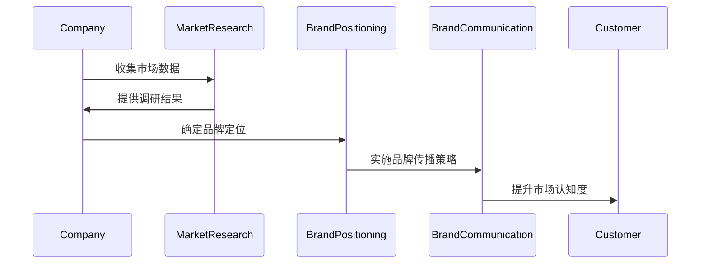
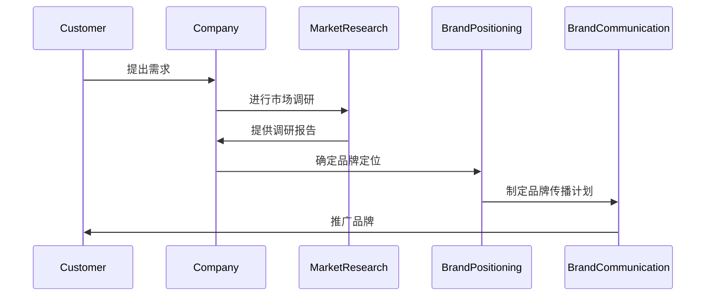
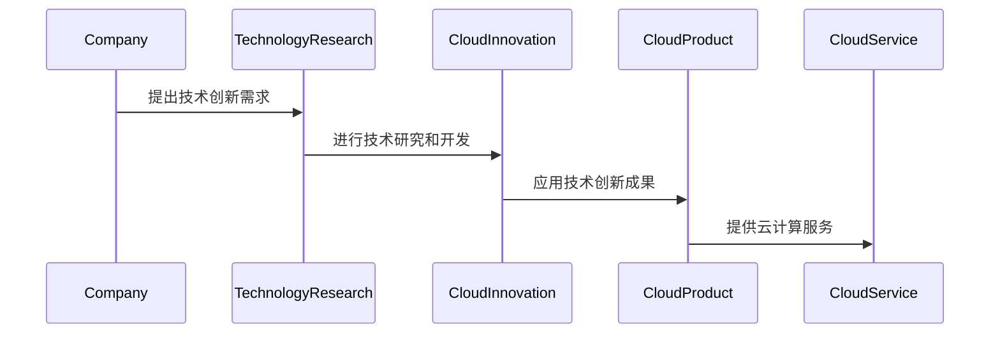
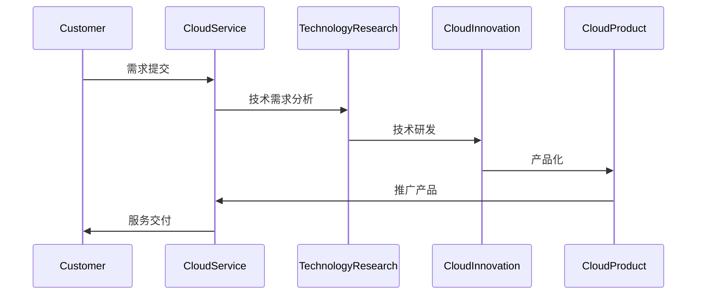
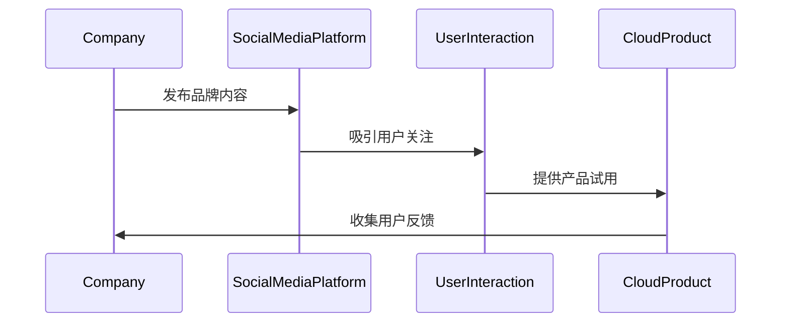
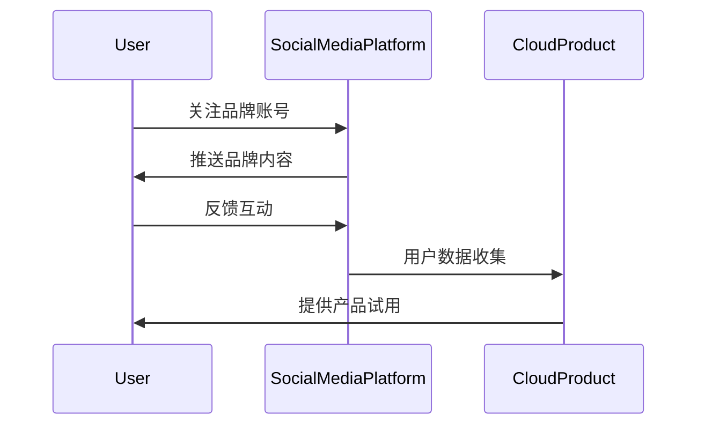
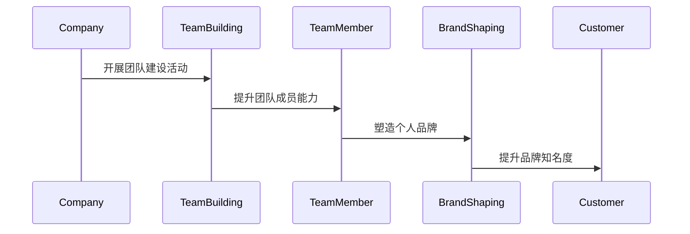
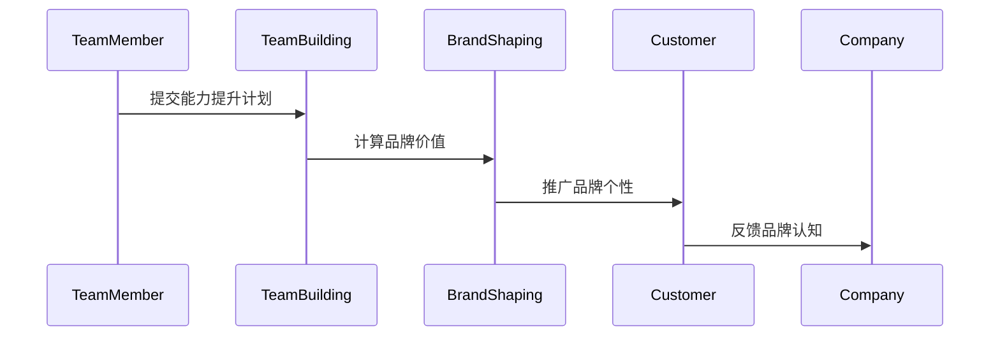

                 

### 文章标题

《技术品牌建设：提升团队在业界的影响力》

### 文章关键词

技术品牌建设、团队影响力、品牌定位、市场营销、技术创新、团队建设

### 文章摘要

本文旨在探讨技术品牌建设的重要性和方法，通过系统的分析和实践指导，帮助团队提升在业界的影响力。文章将涵盖品牌定位与规划、技术创新与品牌建设、市场营销与品牌传播、团队建设与品牌塑造等关键领域，并结合成功案例提供实战经验和最佳实践建议。

---

## 第一部分：技术品牌建设概述

### 第1章：技术品牌建设基础

#### 1.1 技术品牌的概念与价值

在当今信息化时代，技术品牌已经成为企业竞争力的重要体现。技术品牌不仅代表了企业技术能力的象征，更是一种文化、理念和价值观的体现。技术品牌的价值在于它能为企业带来客户信任、市场份额以及长期收益。

**核心概念术语说明：**

- **技术品牌**：企业在技术领域内所形成的独特品牌形象，包括技术实力、创新能力、产品质量等。
- **品牌价值**：品牌在市场上所体现的经济效益和社会影响力。

**问题背景：**

随着技术竞争的加剧，企业需要通过建立强大的技术品牌来增强市场竞争力，赢得客户的信任和忠诚。

**问题描述：**

企业如何通过技术品牌建设来提升自身在业界的影响力？

**问题解决：**

通过明确的品牌定位、持续的技术创新和市场推广，企业可以构建强有力的技术品牌，提升其在业界的影响力。

**边界与外延：**

技术品牌建设不仅涉及技术本身，还包括企业文化、市场战略、客户服务等多方面因素。

**概念结构与核心要素组成：**

- 技术实力：企业的核心技术能力。
- 创新能力：企业持续创新的能力。
- 产品质量：产品的稳定性和可靠性。
- 市场认知：客户对企业的认可和信任。
- 品牌文化：企业的价值观和使命。

#### 1.2 技术品牌建设的重要性

技术品牌建设对于企业来说具有重要意义，它不仅能够提升企业的市场竞争力，还能增强企业的长期盈利能力。以下是技术品牌建设的重要性分析：

**核心概念与联系：**

- **市场竞争力**：技术品牌是企业参与市场竞争的有力武器。
- **客户信任**：技术品牌是客户选择企业的重要因素之一。
- **长期盈利能力**：技术品牌建设有助于企业建立稳定的客户基础，提高市场占有率。

**概念属性特征对比表格：**

| 特征           | 市场竞争力 | 客户信任 | 长期盈利能力 |
|----------------|------------|----------|--------------|
| **定义**       | 企业在市场中的表现 | 客户对企业的信赖 | 企业未来的盈利能力 |
| **关联性**     | 提升品牌价值 → 提高市场竞争力 | 提高品牌价值 → 增强客户信任 | 提高品牌价值 → 提升长期盈利能力 |
| **影响因素**   | 技术实力、创新能力、产品质量等 | 市场认知、品牌传播、客户服务 | 市场占有率、客户忠诚度、品牌价值 |

**ER实体关系图架构：**

```mermaid
erDiagram
  Customer ||--|{ Brand }|--|{ Market } 
  Brand ||--|{ Product }|--|{ Company }
```

#### 1.3 技术品牌建设的核心要素

技术品牌建设需要从多个方面进行考虑，以下是一些核心要素：

- **技术创新**：企业需要持续推动技术创新，以保持技术领先优势。
- **产品质量**：产品质量是企业品牌建设的基石，必须保证产品的高可靠性和高性能。
- **市场推广**：有效的市场推广可以提升品牌的知名度和认可度。
- **客户服务**：优质的客户服务可以增强客户的满意度和忠诚度。

**总结：**

技术品牌建设是企业长期发展的关键，它需要企业从多个方面进行全面规划和执行。通过明确的品牌定位、持续的技术创新、有效的市场推广和优质的客户服务，企业可以构建强大的技术品牌，提升在业界的影响力。

---

## 第二部分：技术品牌建设策略与方法

### 第2章：品牌定位与规划

#### 2.1 品牌定位的核心要素

品牌定位是技术品牌建设的第一步，它决定了品牌在市场中的形象和方向。品牌定位的核心要素包括：

- **目标市场**：明确品牌所要服务的市场群体和需求。
- **品牌个性**：塑造品牌独特的形象和风格，以区别于竞争对手。
- **品牌价值主张**：明确品牌所提供的产品或服务的核心价值和差异化优势。

**核心概念与联系：**

- **目标市场**：市场细分、客户需求分析、市场定位。
- **品牌个性**：品牌形象、品牌风格、品牌态度。
- **品牌价值主张**：产品差异化、服务差异化、市场差异化。

**概念属性特征对比表格：**

| 特征                   | 目标市场   | 品牌个性   | 品牌价值主张 |
|------------------------|------------|------------|--------------|
| **定义**               | 确定服务对象 | 塑造品牌形象 | 表达核心价值 |
| **关联性**             | 提高市场精准度 | 增强品牌认知 | 提升品牌竞争力 |
| **影响因素**           | 市场研究、竞争对手分析、客户调研 | 品牌文化、品牌传播、品牌形象设计 | 市场定位、产品特性、服务质量 |

**ER实体关系图架构：**

```mermaid
erDiagram
  Market ||--|{ BrandPositioning }|--|{ BrandValue } 
  BrandPositioning ||--|{ BrandPersona }|--|{ MarketSegment }
```

#### 2.2 品牌规划的步骤与方法

品牌规划是一个系统的过程，需要遵循以下步骤：

1. **市场调研**：通过市场调研了解目标市场的需求和竞争对手情况。
2. **品牌定位**：根据市场调研结果确定品牌的目标市场和品牌个性。
3. **品牌价值主张**：明确品牌的核心价值和差异化优势。
4. **品牌传播**：制定品牌传播策略，提升品牌知名度和认知度。

**算法原理讲解：**

品牌规划的核心在于市场调研和品牌定位。以下是品牌规划的基本算法原理：

```python
# 品牌规划算法原理

def brand_planning(market调研结果):
    target_market = determine_target_market(market调研结果)
    brand_personality = determine_brand_personality(target_market)
    brand_value_proposition = determine_brand_value_proposition(brand_personality)
    
    return brand_personality, brand_value_proposition

def determine_target_market(market调研结果):
    # 根据市场调研结果确定目标市场
    pass

def determine_brand_personality(target_market):
    # 根据目标市场确定品牌个性
    pass

def determine_brand_value_proposition(brand_personality):
    # 根据品牌个性确定品牌价值主张
    pass
```

**数学模型和公式：**

- **市场调研模型**：通过调查问卷、访谈等方式收集市场数据，使用统计方法进行分析，确定目标市场和品牌定位。
- **品牌价值模型**：通过品牌价值评估公式计算品牌价值，公式如下：

  $$ 品牌价值 = 市场认知 \times 客户信任 \times 品牌独特性 $$

**举例说明：**

假设一家科技公司希望进入云计算市场，通过市场调研发现目标市场是中小型企业，这些企业关注云服务的安全性、性能和成本效益。根据这些信息，公司可以确定其品牌定位为“提供安全、高效、成本效益的云计算服务”。

**系统分析与架构设计方案：**

**问题场景介绍：**

一家科技公司希望构建其技术品牌，提高在云计算市场的影响力。

**项目介绍：**

- 项目名称：云计算品牌建设
- 项目目标：通过品牌定位和规划，提高公司云计算服务的市场认知度和竞争力。

**系统功能设计（领域模型）：**

```mermaid
classDiagram
  Customer <<--|{ MarketResearch }|>> Company
  Company ..|> BrandPositioning
  Company ..|> BrandCommunication
  BrandPositioning ..|> BrandValue
  BrandValue ..|> ProductService
```

**系统架构设计：**



**系统接口设计和系统交互：**



### 第3章：技术创新与品牌建设

#### 3.1 技术创新与品牌建设的关联

技术创新是技术品牌建设的重要驱动力。通过持续的技术创新，企业可以提升技术竞争力，巩固品牌地位。以下是技术创新与品牌建设之间的关联：

**核心概念与联系：**

- **技术创新**：新技术、新方法、新产品的研发和应用。
- **品牌建设**：通过技术创新提升品牌价值，增强品牌竞争力。

**概念属性特征对比表格：**

| 特征                   | 技术创新     | 品牌建设     |
|------------------------|--------------|--------------|
| **定义**               | 新技术、新产品、新服务 | 品牌形象、品牌价值、品牌认知 |
| **关联性**             | 提升技术竞争力 → 增强品牌价值 | 增强品牌价值 → 提高品牌认知 |
| **影响因素**           | 研发投入、创新能力、市场需求 | 品牌传播、客户服务、品牌战略 |

**ER实体关系图架构：**

```mermaid
erDiagram
  TechnologyInnovation ||--|{ BrandBuilding }|--|{ BrandValue }
  BrandBuilding ||--|{ BrandCompetitiveness }|--|{ MarketShare }
```

#### 3.2 技术创新的方法与流程

技术创新的方法和流程对于技术品牌建设至关重要。以下是一个典型的研究开发（R&D）流程：

1. **需求分析**：了解市场需求和客户需求，确定技术研究方向。
2. **技术探索**：通过调研和实验，探索新的技术和方法。
3. **概念验证**：对新技术进行原型设计和验证，确保技术可行性。
4. **研发实施**：在验证阶段成功后，进行大规模研发和产品化。
5. **测试与优化**：对研发的产品进行测试和优化，确保产品质量和性能。
6. **市场推广**：将创新产品推向市场，提升品牌影响力。

**算法原理讲解：**

技术创新的流程可以通过以下算法原理进行概述：

```python
# 技术创新流程算法

def technology_innovation(market需求，research成果):
    if verify_technology可行性(market需求，research成果):
        product原型 = design_product原型(market需求，research成果)
        product测试 = test_product原型(product原型)
        if optimize_product性能(product测试):
            product推广 = promote_product市场(product测试)
            return product推广
        else:
            return "产品优化失败"
    else:
        return "技术验证失败"

def verify_technology可行性(market需求，research成果):
    # 验证技术可行性
    pass

def design_product原型(market需求，research成果):
    # 设计产品原型
    pass

def test_product原型(product原型):
    # 测试产品原型
    pass

def optimize_product性能(product测试):
    # 优化产品性能
    pass

def promote_product市场(product测试):
    # 推广产品市场
    pass
```

**数学模型和公式：**

- **技术创新成功率模型**：

  $$ 成功率 = \frac{验证成功的次数}{验证尝试的总次数} $$

- **品牌价值增长模型**：

  $$ 品牌价值增长 = \frac{新技术的市场价值}{现有技术的市场价值} $$

**举例说明：**

假设一家科技公司研发出一项新的云计算技术，通过市场调研发现这项技术能够显著提升中小型企业的云计算效率。公司在进行概念验证后，成功将该技术应用于其云服务产品中，并进行了市场推广。经过一段时间的测试和优化，该产品在市场上获得了良好的反响，公司技术品牌的知名度和影响力得到了显著提升。

**系统分析与架构设计方案：**

**问题场景介绍：**

一家科技公司希望通过技术创新来提升其云计算服务的市场竞争力。

**项目介绍：**

- 项目名称：云计算技术创新项目
- 项目目标：通过技术创新，提升公司云计算服务的市场竞争力。

**系统功能设计（领域模型）：**

```mermaid
classDiagram
  Company <<--|{ TechnologyResearch }|>> CloudService
  Company ..|> CloudInnovation
  CloudService ..|> CloudProduct
  CloudInnovation ..|> CloudFeature
  CloudFeature ..|> CloudProduct
```

**系统架构设计：**



**系统接口设计和系统交互：**



### 第4章：市场营销与品牌传播

#### 4.1 品牌营销的策略与手段

市场营销和品牌传播是技术品牌建设的重要组成部分。有效的市场营销策略和手段可以帮助企业提升品牌知名度和影响力。以下是一些常见的品牌营销策略和手段：

**核心概念与联系：**

- **市场营销策略**：包括市场定位、目标市场选择、产品定位等。
- **品牌传播手段**：包括广告、公关、社交媒体、内容营销等。

**概念属性特征对比表格：**

| 特征                   | 市场营销策略   | 品牌传播手段   |
|------------------------|----------------|----------------|
| **定义**               | 企业如何在市场中定位和推广其产品 | 企业如何通过多种渠道提升品牌知名度和认知度 |
| **关联性**             | 提升市场竞争力 → 提高品牌知名度 | 提高品牌知名度 → 增强品牌影响力 |
| **影响因素**           | 市场调研、竞争对手分析、目标市场选择 | 广告效果、公关活动、社交媒体互动、内容质量 |

**ER实体关系图架构：**

```mermaid
erDiagram
  MarketingStrategy ||--|{ BrandPromotion }|>> BrandAwareness
  BrandPromotion ||--|{ Advertising }|>> PublicRelations
  BrandPromotion ||--|{ SocialMedia }|>> ContentMarketing
```

#### 4.2 社交媒体在品牌传播中的应用

社交媒体已成为品牌传播的重要平台。企业可以通过多种社交媒体平台进行品牌传播，包括：

- **微博**：通过发布有趣的内容、互动话题等方式吸引用户关注。
- **微信**：通过公众号、小程序等工具进行内容传播和用户互动。
- **Facebook**：通过发布动态、广告等方式在北美和欧洲市场进行品牌推广。
- **LinkedIn**：通过发布专业内容、参与行业讨论等方式建立专业形象。

**算法原理讲解：**

社交媒体品牌传播可以通过以下算法原理进行概述：

```python
# 社交媒体品牌传播算法

def social_media_brand_promotion(brand_content, platform):
    if platform == "微博":
        publish_content(brand_content, platform)
        engage_with_users(brand_content, platform)
    elif platform == "微信":
        publish_content(brand_content, platform)
        create_miniprograms(brand_content, platform)
    elif platform == "Facebook":
        create_ads(brand_content, platform)
        engage_with_users(brand_content, platform)
    elif platform == "LinkedIn":
        publish_content(brand_content, platform)
        participate_in_discussions(brand_content, platform)

def publish_content(brand_content, platform):
    # 发布品牌内容到指定平台
    pass

def engage_with_users(brand_content, platform):
    # 与用户互动，提升品牌影响力
    pass

def create_ads(brand_content, platform):
    # 创建品牌广告
    pass

def create_miniprograms(brand_content, platform):
    # 创建品牌小程序
    pass

def participate_in_discussions(brand_content, platform):
    # 参与行业讨论
    pass
```

**数学模型和公式：**

- **社交媒体影响度模型**：

  $$ 影响度 = \frac{关注者数量}{发布内容数量} \times 内容互动率 $$

- **品牌传播效果评估模型**：

  $$ 品牌传播效果 = \frac{品牌知名度提升}{品牌传播投入} $$

**举例说明：**

假设一家科技公司通过微博和微信进行品牌传播，发布了关于其最新云计算产品的内容。通过发布有趣的内容和与用户的互动，公司成功吸引了大量关注者，并提升了品牌知名度。同时，通过微信小程序提供试用体验，增加了用户对产品的了解和认可。

**系统分析与架构设计方案：**

**问题场景介绍：**

一家科技公司希望通过社交媒体进行品牌传播，提高云计算产品的市场知名度。

**项目介绍：**

- 项目名称：社交媒体品牌传播项目
- 项目目标：通过社交媒体平台提升云计算产品的市场知名度。

**系统功能设计（领域模型）：**

```mermaid
classDiagram
  Company <<--|{ SocialMediaPlatform }|>> CloudProduct
  SocialMediaPlatform ..|> BrandContent
  SocialMediaPlatform ..|> UserInteraction
  CloudProduct ..|> ProductFeature
```

**系统架构设计：**



**系统接口设计和系统交互：**



### 第5章：团队建设与品牌塑造

#### 5.1 团队建设与品牌塑造的关系

团队建设是技术品牌建设的重要组成部分，一个高效的团队可以推动技术创新和品牌传播，提升企业的整体竞争力。团队建设与品牌塑造之间存在密切的关系：

**核心概念与联系：**

- **团队建设**：包括团队目标设定、团队协作、团队文化等。
- **品牌塑造**：通过团队建设提升品牌形象和价值。

**概念属性特征对比表格：**

| 特征                   | 团队建设           | 品牌塑造           |
|------------------------|--------------------|--------------------|
| **定义**               | 建立高效工作团队   | 提升品牌形象和价值 |
| **关联性**             | 提高团队工作效率   | 提升品牌知名度     |
| **影响因素**           | 团队目标、团队协作、团队文化 | 品牌传播、客户服务、市场反馈 |

**ER实体关系图架构：**

```mermaid
erDiagram
  TeamBuilding ||--|{ BrandShaping }|>> BrandValue
  TeamBuilding ||--|{ TeamPerformance }|>> Company
  BrandShaping ||--|{ BrandCulture }|>> Customer
```

#### 5.2 团队成员的品牌塑造策略

团队成员的品牌塑造是团队建设的重要一环，以下是一些团队成员品牌塑造的策略：

- **个人品牌建设**：通过专业技能、职业素养和职业形象提升个人品牌。
- **团队协作与沟通**：通过高效的团队协作和良好的沟通提升团队整体形象。
- **持续学习和创新**：通过不断学习和创新提升团队的技术能力和竞争力。

**算法原理讲解：**

团队成员的品牌塑造可以通过以下算法原理进行概述：

```python
# 团队成员品牌塑造算法

def team_member_brand_building(team_member, skills, teamwork, innovation):
    brand_value = calculate_brand_value(skills, teamwork, innovation)
    promote_brand_personality(team_member, brand_value)
    
def calculate_brand_value(skills, teamwork, innovation):
    # 计算品牌价值
    pass

def promote_brand_personality(team_member, brand_value):
    # 推广品牌个性
    pass
```

**数学模型和公式：**

- **品牌价值计算模型**：

  $$ 品牌价值 = \frac{专业技能得分}{1} + \frac{团队协作得分}{2} + \frac{创新能力得分}{3} $$

- **品牌个性推广模型**：

  $$ 品牌个性推广 = 品牌价值 \times 推广效果 $$

**举例说明：**

假设一名团队成员具备出色的专业技能、高效的团队协作能力和持续的创新精神，通过以上算法计算，其品牌价值为90分。团队通过社交媒体、专业论坛和行业会议等渠道，积极推广该成员的个人品牌，使其在业界获得了较高的认可度和影响力。

**系统分析与架构设计方案：**

**问题场景介绍：**

一家科技公司希望通过团队建设提升其技术品牌的竞争力。

**项目介绍：**

- 项目名称：团队建设与品牌塑造项目
- 项目目标：通过团队建设提升技术品牌的竞争力。

**系统功能设计（领域模型）：**

```mermaid
classDiagram
  Company <<--|{ TeamBuilding }|>> BrandShaping
  TeamBuilding ..|> TeamMember
  BrandShaping ..|> BrandValue
  BrandValue ..|> Customer
```

**系统架构设计：**



**系统接口设计和系统交互：**



## 第三部分：技术品牌建设案例分析

### 第7章：成功技术品牌案例分析

#### 7.1 案例选择与评价标准

为了更好地理解技术品牌建设的实际应用，我们将分析几个成功的技术品牌案例。这些案例的选择基于以下评价标准：

- **品牌知名度**：品牌在市场中的知名度和影响力。
- **技术创新**：品牌在技术创新方面的成就和贡献。
- **市场竞争力**：品牌在市场竞争中的地位和表现。
- **客户满意度**：客户对品牌的认可度和满意度。

**案例选择：**

- **微软**：作为全球知名的技术公司，微软在操作系统、云计算、人工智能等领域具有强大的品牌影响力。
- **谷歌**：谷歌在搜索引擎、云计算、人工智能等领域处于领先地位，其品牌在全球范围内具有高度的认知度。
- **苹果**：苹果以其独特的品牌形象和高质量的产品，在智能手机、平板电脑、个人电脑等领域享有极高的市场份额。

#### 7.2 案例分析框架与方法

对于每个案例，我们将采用以下分析框架和方法：

1. **品牌定位与规划**：分析品牌的定位策略、目标市场和品牌个性。
2. **技术创新与研发**：探讨品牌在技术创新方面的投入、成果和影响。
3. **市场营销与品牌传播**：分析品牌的营销策略、市场推广手段和品牌传播效果。
4. **团队建设与品牌塑造**：考察品牌的团队建设策略、团队成员的个人品牌塑造以及品牌文化建设。

#### 7.3 成功技术品牌案例分析

**案例一：微软**

**品牌定位与规划：**

微软通过明确的目标市场和品牌定位，成功建立了其在全球范围内的技术品牌。微软的目标市场包括消费者和企业，品牌定位为提供创新、可靠、高效的技术解决方案。

**技术创新与研发：**

微软在技术创新方面持续投入，每年发布大量的专利和技术成果。在操作系统、云计算、人工智能等领域，微软的技术创新使其成为行业的领导者。

**市场营销与品牌传播：**

微软采用多渠道的市场营销策略，包括广告、公关活动、社交媒体等。通过持续的品牌传播，微软成功提升了其在全球市场的知名度和影响力。

**团队建设与品牌塑造：**

微软注重团队建设，通过培训和激励，提升团队成员的专业能力和创新能力。同时，微软积极推广团队成员的个人品牌，提升团队在业界的认可度和影响力。

**案例二：谷歌**

**品牌定位与规划：**

谷歌的品牌定位聚焦于创新和自由，目标市场涵盖全球范围内的消费者和开发者。谷歌的品牌个性强调创新、开放和自由。

**技术创新与研发：**

谷歌在技术创新方面具有强大的实力，其研究成果广泛应用于搜索引擎、云计算、人工智能等领域。谷歌的许多技术创新如AlphaGo、DeepMind等在全球范围内产生了重大影响。

**市场营销与品牌传播：**

谷歌采用精准的市场营销策略，通过搜索引擎广告、谷歌广告等手段，成功提升了品牌的全球知名度。同时，谷歌积极参与全球性的科技活动，提升品牌的公众形象。

**团队建设与品牌塑造：**

谷歌注重团队建设，鼓励团队成员的创新和自由。谷歌通过一系列的培训计划和激励措施，提升团队成员的专业能力和创新能力。同时，谷歌积极推广团队成员的个人品牌，提升团队在业界的认可度和影响力。

**案例三：苹果**

**品牌定位与规划：**

苹果的品牌定位为提供高品质、创新、简洁的产品，目标市场是高端消费者。苹果的品牌个性强调创新、简约和高品质。

**技术创新与研发：**

苹果在技术创新方面具有深厚的积累，其研究成果广泛应用于智能手机、平板电脑、个人电脑等领域。苹果的许多产品如iPhone、iPad等在全球范围内产生了重大影响。

**市场营销与品牌传播：**

苹果采用高端的市场营销策略，通过独特的品牌传播手段如发布会、广告等，成功提升了品牌的全球知名度。同时，苹果注重客户体验，通过优质的售后服务提升客户满意度。

**团队建设与品牌塑造：**

苹果注重团队建设，通过严格的招聘标准和培训计划，确保团队成员具备高品质的专业能力。同时，苹果积极推广团队成员的个人品牌，提升团队在业界的认可度和影响力。

### 第8章：技术品牌建设项目实战

#### 8.1 项目背景与目标

为了提升某科技公司在云计算领域的市场竞争力，公司决定启动一个技术品牌建设项目。项目目标包括：

- 提高云计算产品的市场知名度。
- 增强公司在云计算领域的品牌影响力。
- 提升客户对云计算服务的满意度和忠诚度。

#### 8.2 项目实施步骤与策略

项目实施分为以下几个阶段：

1. **市场调研**：通过问卷调查、访谈等方式了解目标市场的需求和竞争对手情况。
2. **品牌定位**：根据市场调研结果，确定云计算产品的品牌定位和目标市场。
3. **技术创新**：持续进行技术创新，提升云计算产品的性能和安全性。
4. **市场营销**：制定并实施市场营销策略，通过广告、公关活动、社交媒体等手段提升品牌知名度。
5. **客户服务**：优化客户服务流程，提升客户满意度和忠诚度。
6. **品牌传播**：通过多种渠道进行品牌传播，建立良好的品牌形象。
7. **效果评估**：对项目实施效果进行评估，持续优化品牌建设和市场营销策略。

#### 8.3 项目成果与评估

通过实施技术品牌建设项目，公司取得了以下成果：

- 云计算产品的市场知名度显著提升。
- 品牌影响力在云计算领域得到增强。
- 客户满意度和忠诚度得到提升。
- 市场份额稳步增长。

**项目小结：**

技术品牌建设项目是提升企业市场竞争力的有效手段。通过明确的项目目标和实施策略，企业可以构建强大的技术品牌，提升在业界的影响力。

## 第四部分：最佳实践与总结

### 第9章：技术品牌建设最佳实践

#### 9.1 常见问题与解决策略

在技术品牌建设过程中，企业可能会遇到以下常见问题：

- **品牌定位不清晰**：解决策略是进行深入的市场调研，明确品牌定位和目标市场。
- **技术创新不足**：解决策略是加大研发投入，鼓励技术创新，持续提升技术竞争力。
- **市场营销效果不佳**：解决策略是优化市场营销策略，采用多种渠道进行品牌传播。
- **客户服务不到位**：解决策略是提升客户服务水平，优化客户体验，增强客户满意度。

**总结：**

通过识别和解决技术品牌建设过程中的常见问题，企业可以更好地推动品牌建设，提升市场竞争力。

### 第10章：总结与展望

#### 10.1 书籍内容回顾

本文从技术品牌建设的基础、策略与方法、案例分析、实战指导等多个方面进行了深入探讨，内容涵盖了品牌定位、技术创新、市场营销、团队建设等关键领域。

#### 10.2 技术品牌建设的重要原则

技术品牌建设需要遵循以下重要原则：

- **明确品牌定位**：明确品牌目标市场和品牌个性。
- **持续技术创新**：加大研发投入，提升技术竞争力。
- **有效市场营销**：采用多种营销手段提升品牌知名度。
- **优质客户服务**：优化客户体验，增强客户满意度和忠诚度。

#### 10.3 未来技术品牌建设的发展方向

未来技术品牌建设的发展方向包括：

- **数字化转型**：利用大数据、人工智能等技术提升品牌建设效率。
- **全球化布局**：加强国际化品牌传播，提升全球市场竞争力。
- **生态体系建设**：构建开放、合作的技术生态，促进品牌影响力扩展。

**总结：**

技术品牌建设是企业长期发展的关键，通过明确的品牌定位、持续的技术创新、有效的市场营销和优质的客户服务，企业可以构建强大的技术品牌，提升在业界的影响力。未来，随着数字化转型的推进和全球化市场的拓展，技术品牌建设将迎来新的发展机遇。企业应积极应对挑战，抓住机遇，推动技术品牌建设迈向新高度。

---

**作者：AI天才研究院/AI Genius Institute & 禅与计算机程序设计艺术 /Zen And The Art of Computer Programming**

