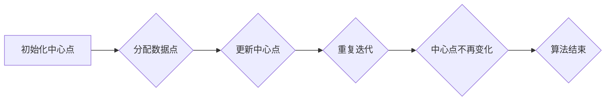
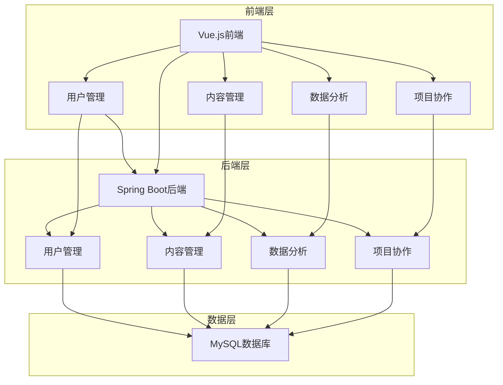
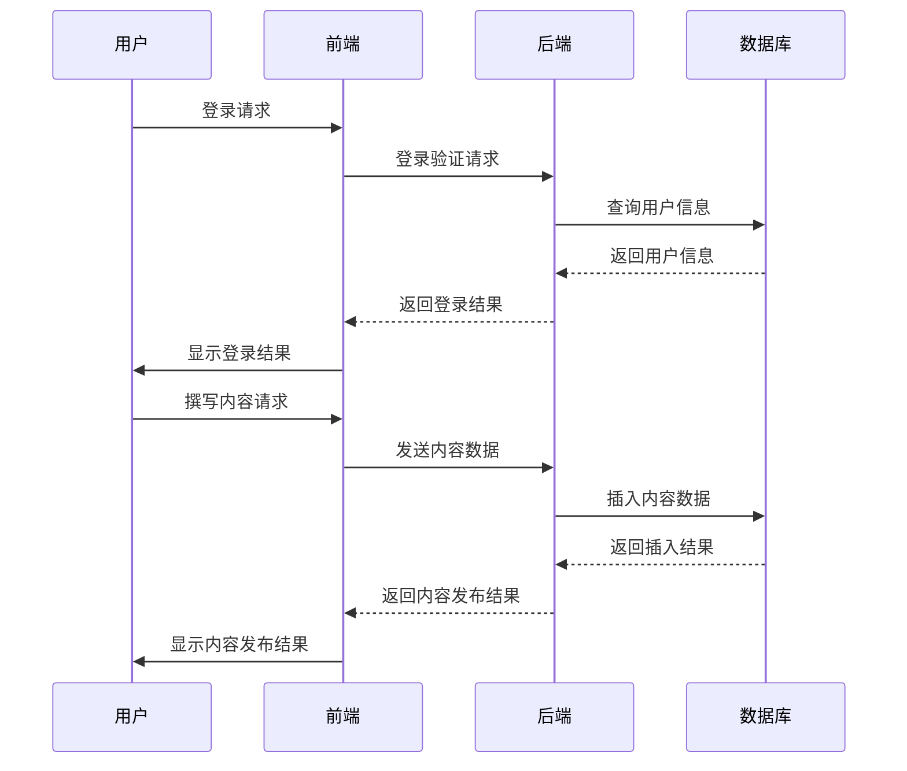

                 

### 技术品牌建设的背景与意义

#### 1.1 技术品牌建设的现状

在当今快速发展的科技时代，技术品牌建设已经成为企业及团队竞争的关键因素之一。技术品牌不仅仅是一个标识或名称，它代表着团队在特定技术领域的专业形象和影响力。随着全球化和互联网的普及，技术品牌的重要性愈发凸显。一方面，技术品牌能够帮助企业或团队在激烈的市场竞争中脱颖而出，获得更多的市场份额和客户信任；另一方面，技术品牌也是团队知识积累和创新能力的体现，有助于吸引顶尖人才和投资者的关注。

目前，许多知名企业和团队已经认识到技术品牌建设的重要性，并投入大量资源进行品牌建设和维护。例如，谷歌、亚马逊、微软等科技巨头，不仅在技术创新上引领行业，同时也在品牌建设上投入了巨大的人力物力。它们通过定期发布技术博客、参与技术会议、开放源代码等多种方式，不断提升自身的技术品牌影响力。

然而，尽管有越来越多的企业和团队重视技术品牌建设，但在实际操作中，仍面临诸多挑战。一些中小企业和初创团队由于资源有限，难以在技术品牌建设上投入足够的时间和精力。此外，技术品牌的建立和提升过程复杂且耗时，需要系统化的战略规划和持续的努力。因此，如何有效地进行技术品牌建设，提升团队在业界的影响力，成为许多企业和团队迫切需要解决的问题。

#### 1.2 技术品牌建设的重要性

技术品牌建设的重要性不容忽视。首先，它能够提升团队在业界的影响力。一个具有高度认可度的技术品牌，能够迅速在行业内建立专业形象，提高品牌知名度，进而增强团队的竞争优势。例如，当一家初创公司在技术品牌上取得显著成就时，投资者和合作伙伴往往会对其产生更高的信任和认可，从而更容易获得资金支持和合作机会。

其次，技术品牌建设有助于吸引和留住人才。在科技行业，顶尖人才往往更加注重团队的技术实力和品牌影响力。一个拥有强大技术品牌的企业或团队，能够更好地吸引优秀的技术人才，并在激烈的人才竞争中保持优势。同时，技术品牌也能提高员工的归属感和满意度，降低员工流失率，为团队的长远发展奠定基础。

最后，技术品牌建设有助于推动团队的创新和发展。一个成熟的技术品牌不仅能够吸引外部资源，还能激发团队内部的创新活力。通过不断的技术研发和创新，企业或团队能够进一步提升自身的核心竞争力，保持市场竞争力。此外，技术品牌的建立和提升过程，也需要团队进行系统的战略规划和持续的努力，从而培养出更加专业和高效的团队文化。

综上所述，技术品牌建设不仅对于提升团队在业界的影响力至关重要，还能够为企业或团队带来诸多实际的好处。在接下来的章节中，我们将进一步探讨技术品牌建设的核心要素和具体策略，帮助企业和团队更好地开展技术品牌建设工作。

### 技术品牌建设的核心要素

技术品牌的建设并非一蹴而就，它需要围绕一系列核心要素进行系统化的规划和执行。以下是技术品牌建设中的几个关键要素：

#### 2.1 技术品牌的定位与愿景

**定位**是品牌建设的基础，它决定了品牌在市场中的定位和目标客户群体。技术品牌定位需要明确团队所专注的技术领域，以及在这一领域中的独特价值主张。例如，如果团队专注于人工智能领域，那么品牌定位可以强调团队在深度学习、自然语言处理等方面的专业能力。

**愿景**则是品牌未来的发展方向和目标。一个清晰的品牌愿景能够为团队提供明确的方向和动力。例如，一家专注于云计算服务的公司，其愿景可能是在未来五年内成为全球领先的云计算解决方案提供商。

**技术品牌的定位与愿景**相辅相成，共同为品牌建设提供方向和动力。定位决定了品牌的市场地位和目标，而愿景则为品牌的发展提供了长远的目标和期望。

#### 2.2 技术品牌的核心价值

技术品牌的核心价值是品牌差异化的关键，它决定了品牌在客户心中的独特地位。核心价值通常包括以下几个方面：

- **技术优势**：品牌在特定技术领域中的专业能力和优势，如算法效率、系统稳定性等。
- **服务质量**：品牌在提供技术服务过程中的表现，如响应速度、客户满意度等。
- **创新能力**：品牌在技术创新方面的投入和成果，如首发新技术、持续改进等。

明确和传达品牌的核心价值，能够帮助团队在市场上树立独特的形象，赢得客户的信任和忠诚。

#### 2.3 技术品牌的理念与价值观

**理念**是品牌的灵魂，它反映了品牌的内在信仰和文化。技术品牌的理念通常包括以下几个方面：

- **技术创新**：对技术的持续追求和改进，如不断探索新的算法和架构。
- **用户至上**：以客户需求为导向，提供优质的服务和解决方案。
- **社会责任**：在技术发展的同时，关注社会和环境问题，推动技术向善。

**价值观**则是品牌在行动中贯彻的理念，它决定了品牌的行为准则和决策依据。例如，一家以用户至上为价值观的品牌，会注重客户体验，不断优化产品和服务。

**理念与价值观**相互关联，理念为品牌提供了指导思想，而价值观则确保了品牌在实际行动中保持一致性。通过传达品牌理念和价值观，团队能够树立良好的品牌形象，增强客户和员工的认同感。

综上所述，技术品牌的定位与愿景、核心价值、理念与价值观是品牌建设的核心要素，它们共同决定了品牌的市场地位和影响力。在接下来的章节中，我们将进一步探讨如何制定技术品牌定位策略，帮助团队更好地实现技术品牌建设的目标。

#### 3.1 市场定位分析

市场定位分析是技术品牌建设中的关键步骤，它帮助团队明确在市场中的位置和竞争优势。首先，**市场细分**是市场定位的基础。通过市场细分，团队可以将整体市场划分为不同的子市场，每个子市场都有其独特的需求、特征和消费行为。市场细分的方法包括地理细分、人口细分、心理细分和行为细分等。

- **地理细分**：根据客户的地理位置进行市场划分，例如，将市场划分为国内市场和国际市场。
- **人口细分**：根据人口统计特征进行市场划分，如年龄、性别、收入等。
- **心理细分**：根据消费者的心理特征和生活方式进行市场划分，如技术爱好者、环保意识强的消费者等。
- **行为细分**：根据消费者的行为特征进行市场划分，如忠诚客户、潜在客户、首次购买客户等。

**目标客户分析**是市场定位的核心。通过分析目标客户的需求、偏好、购买行为等，团队可以更加精准地满足客户需求，提升客户满意度和忠诚度。以下是进行目标客户分析时需要考虑的几个关键点：

- **客户需求**：了解目标客户在技术领域中的具体需求，如特定功能的实现、性能的提升等。
- **客户偏好**：了解目标客户在技术选择和使用中的偏好，如对开源软件的偏好、对品牌知名度的要求等。
- **购买行为**：分析目标客户的购买决策过程，包括购买渠道、购买频率、购买决策因素等。

**竞争对手分析**是市场定位的重要参考。通过分析竞争对手的优势和劣势，团队可以找到自身的市场机会和定位策略。以下是进行竞争对手分析时需要考虑的几个关键点：

- **竞争对手的产品和服务**：分析竞争对手的产品和服务特点，包括技术特性、价格、服务范围等。
- **竞争对手的市场策略**：分析竞争对手的市场策略，如营销策略、推广策略等。
- **竞争对手的优劣势**：评估竞争对手在市场中的优劣势，包括市场份额、品牌知名度、技术创新能力等。

通过以上三个方面的分析，团队可以全面了解市场环境，找到自身的市场定位。以下是市场定位分析的结果和策略：

- **市场定位**：根据市场细分、目标客户和竞争对手的分析，明确团队在市场中的定位，如专注于特定技术领域的领先品牌。
- **定位策略**：制定相应的市场定位策略，如通过技术创新提升品牌竞争力，通过精准营销吸引目标客户等。

**市场定位策略的制定**是技术品牌建设中的关键环节，它决定了品牌在市场中的竞争地位和发展方向。通过系统化的市场定位分析，团队可以更好地理解市场环境，找到自身的竞争优势，并制定有效的市场定位策略。

#### 4.1 团队建设的核心要素

团队建设是技术品牌建设的重要组成部分，一个高效、协同的团队能够显著提升企业的竞争力。以下是团队建设中的几个核心要素：

**4.1.1 职能划分与角色明确**

一个高效的团队需要清晰的职能划分和明确的角色定位。每个团队成员都应该清楚自己的职责和任务，避免工作中的职责重叠和冲突。职能划分和角色明确有助于提高工作效率和团队协作。

- **职能划分**：根据团队的目标和项目需求，将团队成员划分为不同的职能模块，如研发、测试、运维、市场等。
- **角色明确**：明确每个团队成员在项目中的具体角色和职责，确保每个角色都能充分发挥其专业特长。

**4.1.2 沟通协作机制**

沟通协作是团队高效运作的基础。一个良好的沟通协作机制能够确保信息流畅，减少误解和冲突。

- **定期会议**：定期举行团队会议，讨论项目进展、解决问题和制定下一步计划。
- **沟通工具**：使用合适的沟通工具，如邮件、即时通讯、项目管理软件等，确保信息传递的及时和准确。
- **透明度**：确保团队内部信息透明，让每个成员都能及时了解项目进展和团队动态。

**4.1.3 能力建设与培训**

团队的能力建设是持续提升团队绩效的关键。通过定期的培训和技能提升，团队可以不断提高整体素质，应对市场变化和技术挑战。

- **内部培训**：组织内部技术分享会、工作坊等，促进团队成员之间的知识共享和技能提升。
- **外部培训**：鼓励团队成员参加行业会议、研讨会和技术培训，了解最新的技术和市场动态。

**4.1.4 激励与反馈机制**

有效的激励和反馈机制能够提高团队成员的工作积极性和满意度，促进团队绩效的提升。

- **激励措施**：通过奖金、晋升、荣誉等激励措施，激励团队成员发挥最佳水平。
- **反馈机制**：建立定期的反馈机制，对团队成员的工作进行评价和反馈，帮助他们了解自己的优势和不足，不断改进。

**4.1.5 跨部门协作与整合**

在大型企业中，不同部门之间的协作和整合至关重要。跨部门协作能够促进资源的共享和信息的流通，提高整体工作效率。

- **跨部门项目**：设立跨部门项目，鼓励不同部门之间的合作，共同完成复杂任务。
- **整合机制**：建立跨部门协作的整合机制，明确各部门的职责和协调方式，确保项目顺利推进。

通过以上核心要素的建设，团队可以形成高效、协同的工作氛围，提高整体绩效，为技术品牌建设提供坚实的支持。

#### 4.2 团队建设的策略与方法

团队建设不仅仅是组建一个团队，更重要的是如何确保团队高效运作、成员间协同合作。以下是一些具体的团队建设策略与方法：

**4.2.1 设定明确的目标与愿景**

团队建设的第一步是明确团队的目标和愿景。一个共同的目标和愿景能够为团队提供方向和动力，确保每个成员都朝着同一方向努力。

- **具体目标**：设定具体、可量化的目标，如提高项目完成率、缩短开发周期等。
- **愿景描述**：清晰地描述团队的长期愿景，如成为行业领先的技术团队、实现技术创新等。

**4.2.2 制定详细的计划与分工**

有了明确的目标后，需要制定详细的计划，并明确每个成员的具体任务和职责。详细的计划能够确保项目按部就班地进行，避免资源浪费和任务重叠。

- **工作计划**：制定详细的工作计划，包括项目时间表、任务分配和里程碑等。
- **分工明确**：确保每个成员都清楚自己的任务和职责，避免职责重叠和职责不明。

**4.2.3 建立良好的沟通机制**

良好的沟通机制是团队协作的基础。通过多种沟通方式，确保信息流畅、准确传达。

- **定期会议**：定期召开团队会议，讨论项目进展、问题和解决方案。
- **即时通讯工具**：使用即时通讯工具，如Slack或Microsoft Teams，确保团队成员能够及时交流和协作。
- **透明信息共享**：建立透明信息共享机制，让团队成员能够随时了解项目进展和团队动态。

**4.2.4 定期评估与反馈**

定期评估和反馈是团队建设的重要环节。通过评估和反馈，可以及时发现团队运作中的问题，并采取相应的改进措施。

- **绩效评估**：定期对团队成员的工作进行绩效评估，评估内容应包括任务完成情况、团队合作表现等。
- **反馈机制**：建立有效的反馈机制，鼓励团队成员之间互相反馈意见和建议，促进个人和团队的发展。

**4.2.5 培训与技能提升**

团队建设还包括对团队成员的培训与技能提升。通过持续的培训和学习，提高团队的整体素质和竞争力。

- **内部培训**：组织内部技术分享会、工作坊等，促进团队成员之间的知识共享和技能提升。
- **外部培训**：鼓励团队成员参加行业会议、研讨会和技术培训，了解最新的技术和市场动态。

**4.2.6 建立有效的激励机制**

有效的激励机制能够提高团队成员的工作积极性和满意度，促进团队绩效的提升。

- **奖励制度**：设立奖励制度，对在项目中表现优秀的团队成员给予奖励，如奖金、晋升机会等。
- **团队荣誉**：建立团队荣誉制度，对在团队建设中作出突出贡献的成员给予表彰和荣誉。

通过以上策略与方法，团队可以形成一个高效、协作的工作环境，提高整体绩效，为技术品牌建设提供坚实的支持。

#### 4.3 团队建设的常见问题与解决

在团队建设过程中，常常会遇到各种问题，这些问题如果不及时解决，可能会对团队效率和品牌建设造成不利影响。以下是一些常见问题及其解决方案：

**4.3.1 沟通不畅**

**问题**：团队成员之间沟通不畅，信息传递不及时、不准确。

**解决方案**：
- **定期沟通会议**：设立定期沟通会议，确保团队成员有固定的交流时间。
- **使用沟通工具**：采用高效的沟通工具，如Slack、Microsoft Teams等，确保信息传递的及时性和准确性。
- **信息透明**：建立信息透明机制，确保团队成员能够随时获取项目进展和团队动态。

**4.3.2 职责不清**

**问题**：团队成员职责不明确，导致任务重叠或责任真空。

**解决方案**：
- **明确职责划分**：在团队成立之初，明确每个成员的职责和任务，确保职责划分清晰。
- **分工协作**：在项目进行中，鼓励成员之间相互协作，共同完成任务。

**4.3.3 能力不足**

**问题**：团队成员在技能和知识方面存在不足，影响项目进展和团队绩效。

**解决方案**：
- **培训计划**：制定详细的培训计划，定期组织内部培训，提升团队成员的技能水平。
- **外部学习**：鼓励团队成员参加行业会议、研讨会和技术培训，拓展知识面。

**4.3.4 激励不足**

**问题**：团队成员缺乏工作动力，工作积极性和满意度不高。

**解决方案**：
- **激励机制**：设立奖励制度，对在项目中表现优秀的成员给予奖励，如奖金、晋升机会等。
- **认可与反馈**：定期对团队成员的工作进行认可和反馈，提高成员的归属感和满意度。

**4.3.5 内部冲突**

**问题**：团队成员之间存在冲突，影响团队协作和工作氛围。

**解决方案**：
- **调解机制**：建立内部调解机制，及时解决团队内部冲突。
- **团队文化建设**：通过团队建设活动，增强团队成员之间的信任和合作意识。

通过解决这些问题，团队能够形成更加高效、协作的工作环境，为技术品牌建设提供坚实的支持。

#### 5.1 知识管理的重要性

知识管理在现代企业中扮演着至关重要的角色，尤其是在技术团队中。知识管理不仅仅是对信息的整理和存储，它更是一个系统的过程，涉及知识的获取、创造、共享、应用和创新。以下是知识管理在团队中的几个重要性方面：

**5.1.1 提高工作效率**

通过有效的知识管理，团队可以快速获取所需的信息和知识，减少重复劳动和错误，从而提高整体工作效率。例如，当团队成员需要解决一个技术难题时，可以迅速查阅以往的项目经验、技术文档或团队成员的博客文章，从而节省时间并提高解决问题的效率。

**5.1.2 促进知识共享**

知识共享是知识管理的重要组成部分。通过建立知识共享平台和机制，团队成员可以方便地分享自己的知识和经验，促进团队内部的交流与合作。这不仅有助于提升团队成员的专业技能，还能够增强团队的凝聚力。

**5.1.3 知识积累与传承**

技术团队的知识积累和传承对于企业的长期发展至关重要。通过知识管理，团队可以将宝贵的知识和经验系统化地记录下来，并在团队成员之间进行传承。这样，即使有成员离职，团队的知识和技能也不会流失，从而确保团队持续创新和进步。

**5.1.4 提升创新能力**

知识管理有助于团队积累丰富的知识和经验，为创新提供源源不断的素材。通过不断地学习和分享，团队成员可以接触到更多的想法和解决方案，激发创新的灵感。此外，知识管理还能促进团队内部的知识交叉应用，激发新的创意和突破。

**5.1.5 提高客户满意度**

客户满意度是衡量企业成功与否的重要指标。通过知识管理，团队可以更好地理解客户需求，提供更加个性化和高效的服务。例如，通过知识共享，团队成员可以快速掌握客户的历史需求和技术背景，从而更准确地满足客户的需求，提高客户满意度。

总之，知识管理在技术团队中具有不可替代的重要性。它不仅能够提高工作效率和创新能力，还能促进知识共享和传承，提升客户满意度，为技术品牌建设提供坚实的基础。

#### 5.2 知识管理的方法与工具

在技术团队中实施知识管理是一个复杂且系统的过程，需要选择合适的工具和方法来实现。以下是一些常见的方法和工具，帮助团队有效地进行知识管理：

**5.2.1 文档管理工具**

文档管理工具是知识管理的基础，它可以帮助团队集中管理和共享文档。常用的文档管理工具有：

- **Git**：Git 是一个分布式版本控制系统，非常适合管理项目文档和代码。团队成员可以通过 Git 进行文档的版本控制和协作开发。
- **Confluence**：Confluence 是一款功能强大的文档协作平台，支持知识库的创建和管理。团队成员可以在这里撰写技术文档、项目计划和团队博客。

**5.2.2 知识共享平台**

知识共享平台可以帮助团队成员方便地获取和分享知识。以下是一些常用的知识共享平台：

- **Slack**：Slack 是一款流行的即时通讯工具，可以用于团队内部的知识交流。团队成员可以通过频道和群组进行实时讨论和分享。
- **Trello**：Trello 是一款简洁的看板工具，可以帮助团队进行任务管理和知识共享。团队成员可以在卡片上记录问题和解决方案，方便查阅和协作。

**5.2.3 在线学习平台**

在线学习平台可以帮助团队成员进行持续学习和技能提升。以下是一些常用的在线学习平台：

- **Coursera**：Coursera 是一个提供大量在线课程的平台，涵盖了计算机科学、数据科学、人工智能等多个领域。
- **Udemy**：Udemy 是一个拥有丰富课程内容的在线学习平台，提供了从入门到高级的各类技术课程。

**5.2.4 实践与案例**

以下是一些知识管理实践和案例，可以帮助团队更好地实施知识管理：

- **案例分析**：团队可以定期进行知识管理案例分析，讨论成功经验和改进方案。例如，某个团队成员在项目中遇到了技术难题，可以通过案例分析分享解决方法和经验。
- **知识竞赛**：组织知识竞赛，鼓励团队成员主动学习和分享知识。通过竞赛，可以激发团队成员的学习兴趣和积极性。
- **经验交流**：定期举办经验交流会，邀请团队成员分享自己在工作中的心得体会和解决方案。这种交流有助于促进知识共享和团队协作。

通过以上方法和工具，团队可以有效地进行知识管理，提升整体工作效率和创新能力，为技术品牌建设提供坚实的支持。

#### 5.3 知识共享的实践与案例

在实际工作中，知识共享不仅是提升团队效率和创新能力的重要手段，也是技术品牌建设的重要组成部分。以下通过具体案例，探讨知识共享在团队中的实践和应用。

**案例一：技术文档的编写与共享**

在一个软件开发团队中，技术文档的编写和共享是知识管理的关键环节。以下是一个典型的实践过程：

1. **文档模板制定**：团队首先制定了一套统一的文档模板，包括项目概述、技术架构、功能模块、接口文档等，确保所有文档都有规范的格式和内容。

2. **文档撰写与审核**：团队成员根据分工，负责撰写各自的模块文档。在撰写过程中，团队成员会参考已有的技术文档和最佳实践，确保文档的准确性和完整性。

3. **文档审核与发布**：撰写的文档需要经过其他团队成员的审核，确保没有遗漏和错误。审核通过后，文档会被发布到共享平台，如Git或Confluence，供其他成员查阅和下载。

4. **持续更新与维护**：项目进行过程中，文档会根据实际情况进行更新和修正，确保反映最新的项目进展和技术细节。

**案例二：技术分享会的组织**

技术分享会是促进知识共享和团队学习的重要活动。以下是一个具体的技术分享会实践：

1. **主题选择**：团队会根据项目进展和成员需求，选择一个具体的技术主题，如“大数据处理技术”或“前端框架应用”。

2. **嘉宾邀请**：邀请在特定技术领域有丰富经验的团队成员或外部专家作为分享嘉宾，分享他们的经验和见解。

3. **分享内容**：嘉宾准备分享内容，包括技术原理、应用案例和实战经验。分享内容通常包括PPT演示和现场讲解。

4. **互动环节**：在分享结束后，设置互动环节，允许听众提问和讨论，促进知识的交流和应用。

5. **总结与反馈**：分享会结束后，团队会对活动进行总结，收集听众的反馈，不断改进分享会的质量和效果。

**案例三：内部知识竞赛**

知识竞赛是一种激发团队成员主动学习和分享知识的有效方法。以下是一个具体的知识竞赛实践：

1. **竞赛题目准备**：根据团队的技术领域和项目需求，准备一系列竞赛题目，涵盖基础知识和实际应用。

2. **竞赛形式**：竞赛可以采用在线答题的形式，也可以在会议室内进行现场竞答。竞赛题目通常包括单选、多选、填空和简答题。

3. **评分与奖励**：竞赛结束后，根据答题情况评分，对成绩优异的团队成员进行奖励，如奖品、奖金或荣誉称号。

4. **总结与反馈**：竞赛结束后，团队会进行总结，分析竞赛结果，对知识点进行梳理和补充，进一步提高团队的知识水平。

通过这些具体的案例和实践，团队不仅能够有效地进行知识共享，还能提升整体的技术水平和创新能力，为技术品牌建设奠定坚实的基础。

#### 6.1 创新的重要性

在技术领域，创新是推动企业持续发展、提升竞争力的重要动力。创新不仅仅是指开发新的产品或技术，还包括在现有技术基础上进行改进和优化，以满足不断变化的市场需求和用户需求。以下是创新在团队中的几个重要性方面：

**6.1.1 提升市场竞争力**

创新能够帮助团队在激烈的市场竞争中脱颖而出。通过持续的技术创新，团队可以开发出独特的产品或服务，满足市场的差异化需求。例如，亚马逊通过不断创新的物流和云计算服务，保持了在电商和云计算领域的领先地位。

**6.1.2 增强企业生命力**

创新是保持企业生命力的关键。一个缺乏创新能力的团队很难在市场中立足，更无法应对快速变化的市场环境。通过创新，企业可以不断突破自身局限，实现技术突破和业务增长，从而确保长期生存和发展。

**6.1.3 提高员工满意度**

创新工作环境能够激发员工的创造力和工作热情，提高员工的满意度。一个鼓励创新的企业文化，能够为员工提供更多的成长机会和职业发展空间，从而增强员工的归属感和忠诚度。

**6.1.4 培养技术领袖**

创新过程中，团队需要不断学习和探索新的技术和方法，这有助于培养技术领袖。技术领袖不仅能够在创新项目中发挥关键作用，还能带领团队实现技术突破，推动企业向前发展。

**6.1.5 优化产品和服务**

创新不仅能够推动技术进步，还能优化产品和服务。通过技术创新，企业可以提升产品的性能、质量和用户体验，从而提高客户满意度和忠诚度。例如，苹果公司通过不断的技术创新，推出了多款具有革命性设计的产品，赢得了全球消费者的青睐。

总之，创新在团队中具有不可替代的重要性。它不仅是提升市场竞争力、增强企业生命力的关键，还能提高员工满意度和培养技术领袖。在接下来的章节中，我们将探讨创新的方法与工具，帮助团队更好地实现技术创新。

#### 6.2 创新的方法与工具

在技术团队中，创新的方法和工具的选择直接影响创新效果。以下是一些常见的创新方法与工具，帮助团队有效地进行技术创新：

**6.2.1 设计思维**

设计思维是一种以用户为中心的创新方法，它强调通过深入理解用户需求来创造有价值的产品或服务。设计思维包括以下几个步骤：

1. ** empathize（同理心）**：了解用户的需求和痛点，建立对用户的深刻理解。
2. ** define（定义）**：明确问题的核心，将用户需求转化为具体的目标。
3. ** ideate（创意生成）**：通过头脑风暴和创意思维，生成多种可能的解决方案。
4. ** prototype（原型设计）**：快速构建原型，验证创意的可行性和用户满意度。
5. ** test（测试与迭代）**：通过用户测试，收集反馈并不断改进原型。

**6.2.2 用户研究**

用户研究是创新过程中不可或缺的一环，它帮助团队深入了解用户的需求和行为。以下是一些常见的用户研究方法：

- **访谈**：通过与用户进行深度访谈，了解用户的具体需求和痛点。
- **观察**：通过观察用户在使用产品或服务时的行为，发现潜在问题和改进机会。
- **问卷调查**：通过设计问卷调查，收集大量用户数据，分析用户需求和市场趋势。
- **用户体验地图**：通过绘制用户体验地图，展示用户在使用产品或服务过程中的情感变化和痛点。

**6.2.3 思维导图**

思维导图是一种图形化的思维工具，它可以帮助团队梳理和整合信息，激发创意思维。以下是一些使用思维导图的方法：

- **头脑风暴**：通过在思维导图上绘制相关概念和关系，激发团队成员的创意思维。
- **问题分析**：通过分析问题的各个方面，找出潜在的解决方案。
- **决策制定**：通过在思维导图上展示不同决策方案的优劣势，帮助团队做出明智的决策。

**6.2.4 交叉功能团队**

交叉功能团队是一种由不同部门、背景和专业的人员组成的团队，它有助于促进不同领域的知识交流和协同创新。以下是一些建立和运作交叉功能团队的方法：

- **明确目标**：确保团队的目标清晰，所有成员都明确自己的角色和责任。
- **沟通机制**：建立高效的沟通机制，确保团队成员之间的信息流畅和协作。
- **激励机制**：通过奖励和认可，激励团队成员积极参与创新项目。

通过以上方法和工具，团队可以更好地进行技术创新，提升整体竞争力。在接下来的章节中，我们将探讨如何通过提升研发能力，进一步推动团队的创新和发展。

#### 6.3 研发能力提升的策略与实践

提升研发能力是技术团队实现持续创新和发展的关键。以下是一些具体策略和实践，帮助团队在研发能力上取得显著提升：

**6.3.1 人才培养与引进**

**策略**：建立一个系统的人才培养体系，包括内部培训、外部培训和职业发展规划，以不断提升团队成员的专业技能和综合素质。

- **内部培训**：定期组织内部技术分享会、工作坊和培训课程，促进团队成员之间的知识共享和技能提升。
- **外部培训**：鼓励团队成员参加行业会议、研讨会和技术培训，了解最新的技术趋势和市场动态。
- **职业发展规划**：为团队成员制定清晰的职业发展规划，提供晋升和发展的机会。

**实践**：在招聘过程中，注重选拔具有潜力和创新精神的人才，同时通过绩效评估和激励机制，留住优秀员工。

**6.3.2 技术栈的优化与升级**

**策略**：根据项目需求和团队实际情况，持续优化和升级技术栈，确保团队拥有适应不同项目需求的技术能力和工具。

- **技术调研**：定期进行技术调研，了解市场上最新的技术动态和发展趋势，为技术栈的优化提供依据。
- **技术选型**：在项目启动前，对技术方案进行充分评估和比较，选择最适合的技术栈和工具。
- **技术标准化**：建立技术标准和规范，确保团队成员在技术实现上有统一的指导，提高代码质量和可维护性。

**实践**：定期组织技术评审和代码审查，确保技术实现的高效性和可维护性。同时，引入敏捷开发、DevOps等先进开发模式，提高研发效率。

**6.3.3 项目管理与协作工具**

**策略**：采用高效的项目管理和协作工具，提升团队的项目管理和协作能力。

- **项目管理工具**：使用项目管理工具，如Jira、Trello等，进行任务分配、进度跟踪和风险管理。
- **协作工具**：使用协作工具，如Slack、Microsoft Teams等，实现实时沟通和协作，确保信息传递的及时和准确。

**实践**：建立项目管理的标准化流程，明确各个环节的职责和任务，确保项目顺利推进。同时，定期进行项目回顾和总结，分析项目中的成功经验和不足，不断优化项目管理流程。

**6.3.4 鼓励创新与试错**

**策略**：创造一个鼓励创新和试错的环境，为团队成员提供充分的创新空间和资源支持。

- **创新机制**：建立创新机制，如创新基金、创新项目立项等，为创新项目提供资金和资源支持。
- **试错机制**：建立试错机制，允许团队成员在创新过程中尝试新的想法和方法，即使失败也能从中吸取教训。

**实践**：组织创新大赛、Hackathon等活动，激发团队成员的创新热情。同时，对成功的创新项目进行奖励和宣传，鼓励更多团队成员参与创新。

通过以上策略和实践，团队可以显著提升研发能力，推动技术进步和创新，为技术品牌建设提供强大的支持。

#### 7.1 品牌传播的目标与原则

品牌传播是技术品牌建设的重要环节，它决定了品牌信息能否有效地传递给目标受众。为了实现品牌传播的预期效果，需要明确品牌传播的目标和遵循一定的原则。

**品牌传播的目标**

品牌传播的主要目标包括：

- **提升品牌知名度**：通过多种传播渠道和手段，扩大品牌在目标受众中的影响力，使更多的人认识和了解品牌。
- **建立品牌形象**：传递品牌的核心价值和理念，树立积极、专业的品牌形象，增强消费者对品牌的信任感和认同感。
- **增强品牌认知**：通过持续的品牌传播，深化消费者对品牌特点和优势的理解，提高品牌的认知度。
- **促进品牌忠诚**：通过品牌传播，培养消费者的品牌忠诚度，使其成为品牌的忠实用户，提高复购率和口碑传播。

**品牌传播的原则**

为了实现品牌传播的目标，需要遵循以下原则：

- **一致性**：品牌传播的信息应保持一致，包括品牌标识、品牌口号、品牌故事等，确保品牌形象在所有传播渠道中保持一致。
- **目标受众定位**：明确目标受众，针对不同的受众群体制定差异化的传播策略，确保传播内容能够引起目标受众的兴趣和共鸣。
- **内容质量**：传播内容要高质量、有价值，能够满足受众的需求，提供有益的信息和知识，增强受众的信任和忠诚度。
- **互动性**：通过互动性的传播手段，如社交媒体、在线论坛等，与受众建立互动关系，增强受众的参与感和归属感。
- **持续性**：品牌传播需要持续进行，通过长期的积累和坚持，逐步提高品牌的认知度和影响力。

通过明确品牌传播的目标和遵循原则，企业或团队可以有效地进行品牌传播，提升技术品牌在业界的知名度和影响力。

#### 7.2 品牌传播的渠道与方式

品牌传播的渠道与方式决定了品牌信息能否高效、准确地传递给目标受众。以下是几种常见的品牌传播渠道与方式，以及它们的优缺点和适用场景：

**7.2.1 传统媒体**

**传统媒体**包括电视、广播、报纸和杂志等。这些渠道具有广泛的受众覆盖率和较高的可信度，适用于品牌建设初期需要迅速提高知名度的情况。

- **优点**：覆盖面广，可信度高，易于形成社会话题和热点。
- **缺点**：传播成本较高，信息传递效率较低，无法实现互动性。
- **适用场景**：品牌初期宣传、大型市场推广活动、重大事件报道。

**7.2.2 社交媒体**

**社交媒体**如微博、微信、Facebook、Twitter等，是品牌传播的重要渠道。它们具有高度的互动性和即时性，适用于品牌与受众建立长期互动关系。

- **优点**：传播速度快，互动性强，有助于形成用户社区，提升品牌忠诚度。
- **缺点**：内容质量参差不齐，容易受到信息泛滥和用户偏见的影响。
- **适用场景**：日常品牌维护、用户互动、客户服务、突发事件应对。

**7.2.3 博客与官网**

**博客与官网**是品牌传播的官方渠道，具有权威性和深度，适用于发布技术博客、行业分析、产品更新等重要信息。

- **优点**：信息权威，内容深度高，有助于建立专业形象，提供详细的技术支持和知识分享。
- **缺点**：传播范围有限，互动性不如社交媒体。
- **适用场景**：发布技术文档、行业洞察、产品新闻、客户反馈。

**7.2.4 会议与活动**

**会议与活动**如技术论坛、行业展会、研讨会等，是品牌传播的重要场合。这些活动有助于增强品牌的影响力和行业地位。

- **优点**：直接接触目标受众，提升品牌知名度，建立权威形象。
- **缺点**：组织成本较高，受众范围有限。
- **适用场景**：品牌发布会、产品展示、技术交流、行业合作。

**7.2.5 公关与媒体报道**

**公关与媒体报道**包括新闻发布会、媒体采访、行业报道等，是品牌传播的重要手段。这些渠道有助于提高品牌的媒体曝光率和公众认可度。

- **优点**：媒体报道具有公信力，能够迅速提升品牌知名度。
- **缺点**：媒体选择和报道内容无法完全控制，存在一定的风险。
- **适用场景**：品牌重大事件、技术创新发布、社会公益活动。

通过合理选择和组合以上渠道与方式，企业或团队可以有效地进行品牌传播，提升技术品牌在业界的知名度和影响力。

#### 7.3 品牌传播的效果评估与优化

品牌传播的效果评估是确保品牌建设投入产生预期效果的重要环节。以下是一些常见的评估方法和优化策略，帮助团队持续提升品牌传播效果：

**7.3.1 评估方法**

1. **市场份额分析**：通过对比品牌在市场上的占有率，评估品牌传播对市场占有率的影响。
2. **品牌知名度调查**：通过问卷调查、社交媒体数据等方式，了解目标受众对品牌的认知度和知名度。
3. **媒体曝光度分析**：监测品牌在各类媒体上的曝光次数和提及频率，评估品牌传播的媒体覆盖效果。
4. **受众反馈**：通过用户评论、在线调查等方式，收集目标受众对品牌传播活动的反馈，了解受众的满意度和参与度。
5. **销售数据对比**：分析品牌传播活动前后，销售数据的变化情况，评估品牌传播对销售业绩的影响。

**7.3.2 优化策略**

1. **数据分析与调整**：根据效果评估结果，对品牌传播策略进行数据分析和调整。例如，如果市场份额提升不明显，可以考虑增加目标受众的触达频率和渠道覆盖。
2. **内容优化**：根据受众反馈，优化品牌传播的内容和形式，提高内容的吸引力和相关性。例如，可以增加更多有价值的技术分享和行业洞察。
3. **渠道调整**：根据品牌传播的效果，调整传播渠道的优先级和投入比例。例如，如果发现社交媒体渠道效果较好，可以增加在该渠道上的投入。
4. **加强互动**：通过增加互动性活动，如在线问答、直播讲座等，提升受众的参与度和忠诚度。
5. **持续监测与改进**：建立品牌传播效果的持续监测机制，定期进行评估和优化，确保品牌传播策略的持续有效性。

通过以上评估方法和优化策略，团队可以不断调整和改进品牌传播策略，提升品牌传播效果，为技术品牌建设提供坚实支持。

### 8.1 案例介绍

在技术品牌建设领域，微软无疑是一个成功的典范。微软作为全球领先的科技公司，不仅在技术创新上处于领先地位，其品牌建设也堪称典范。本文将通过对微软的技术品牌建设案例进行深入分析，探讨其成功经验，以期为其他企业和团队提供有益的借鉴。

#### 微软品牌建设背景

微软成立于1975年，是一家全球领先的科技公司，以其操作系统、办公软件和云计算服务等核心技术产品闻名于世。在几十年发展的过程中，微软不仅不断推出具有划时代意义的产品，还在品牌建设方面进行了大量投入和探索。通过持续的品牌建设，微软成功树立了专业、创新、可靠的全球品牌形象。

#### 案例分析

**8.1.1 明确品牌定位与愿景**

微软的品牌定位非常清晰，即成为全球领先的科技公司，提供创新的解决方案和优质的产品服务。微软的品牌愿景是“赋能每个人的每个一天”，通过其技术产品和服务，帮助人们实现更多可能。

- **定位**：微软在品牌定位上，明确了其专注于技术和创新，致力于通过技术产品和服务提升用户生活和工作效率。
- **愿景**：微软的品牌愿景不仅展示了公司的长远目标，也传达了其对企业和社会的积极贡献。

**8.1.2 品牌核心价值**

微软的品牌核心价值包括创新、客户至上、社会责任和诚信。这些核心价值观贯穿于微软的品牌建设过程中，成为其品牌形象的重要组成部分。

- **创新**：微软持续投入大量资源进行技术创新，不断推出具有突破性的产品和服务，引领行业发展。
- **客户至上**：微软始终将客户需求放在首位，致力于提供优质的客户服务和解决方案。
- **社会责任**：微软积极参与社会公益活动，推动技术向善，促进社会进步。
- **诚信**：微软坚持诚信经营，遵守法律法规，建立透明、公正的企业文化。

**8.1.3 品牌传播策略**

微软在品牌传播方面采取了一系列有效的策略，通过多渠道、多形式的传播，提升品牌知名度和影响力。

- **传统媒体与社交媒体**：微软通过传统媒体如电视、报纸等发布品牌信息，同时利用社交媒体平台如Facebook、Twitter等进行互动传播。
- **技术创新展示**：微软定期举办技术大会，如微软开发者大会（Microsoft Build），展示最新的技术成果和创新应用，吸引行业关注。
- **用户社区建设**：微软建立了庞大的用户社区，如Microsoft Tech Community，通过在线讨论和分享，增强用户参与感和忠诚度。
- **公关与媒体报道**：微软积极与媒体合作，发布重大新闻和产品信息，通过媒体报道提升品牌知名度。

**8.1.4 品牌传播效果评估与优化**

微软注重品牌传播效果评估，通过多种方法监测品牌传播的效果，并根据评估结果不断优化传播策略。

- **市场份额与知名度调查**：通过市场份额调查和品牌知名度调查，了解品牌在市场中的表现和受众的认知度。
- **媒体曝光度分析**：监测品牌在各类媒体上的曝光次数和提及频率，评估品牌传播的媒体覆盖效果。
- **用户反馈与销售数据对比**：收集用户反馈和销售数据，分析品牌传播对用户满意度和销售业绩的影响。
- **持续监测与改进**：建立品牌传播效果的持续监测机制，定期进行评估和优化，确保品牌传播策略的持续有效性。

通过以上分析，我们可以看到，微软在技术品牌建设方面取得了显著成效。其成功的品牌建设经验为其他企业和团队提供了宝贵的借鉴。

### 8.2 案例分析

微软的技术品牌建设案例为我们提供了丰富的经验和启示。以下是微软品牌建设过程中的一些关键成功因素及其背后的策略：

**8.2.1 系统化的品牌定位与愿景**

微软通过明确而清晰的品牌定位与愿景，奠定了其品牌建设的坚实基础。品牌定位明确了微软专注于技术和创新的领域，愿景则展示了公司的长远目标和社会责任。这种系统化的品牌定位不仅帮助微软在市场中建立了独特的品牌形象，也为其未来的发展提供了明确的方向。

- **策略**：微软通过持续的市场调研和用户反馈，不断调整和优化品牌定位与愿景，确保其与市场需求和用户期望保持一致。

**8.2.2 创新的核心价值**

微软将创新作为品牌核心价值之一，不断推动技术进步和产品革新。这种坚持不仅帮助微软在市场上保持了领先地位，也增强了品牌的市场竞争力。通过持续的技术研发和创新，微软在多个技术领域取得了突破性成果，树立了技术领袖的形象。

- **策略**：微软通过设立创新基金、鼓励内部创业等方式，激发员工的创新潜力。此外，微软还积极参与外部创新合作，与高校、研究机构等合作，共同推动技术进步。

**8.2.3 多渠道的品牌传播**

微软在品牌传播方面采取了多样化的策略，通过传统媒体、社交媒体、用户社区等多种渠道，全方位地传播品牌信息。这种多渠道的品牌传播不仅扩大了品牌的覆盖范围，也增强了品牌与用户之间的互动。

- **策略**：微软根据不同的传播目标和受众特点，选择合适的传播渠道。例如，在品牌初期宣传时，更多依赖传统媒体；在品牌维护和用户互动方面，则侧重社交媒体和用户社区。

**8.2.4 效果评估与持续优化**

微软注重品牌传播效果评估，通过多种方法监测品牌传播的效果，并根据评估结果不断优化传播策略。这种持续监测与优化的做法，确保了品牌传播策略的有效性和针对性。

- **策略**：微软建立了完善的品牌传播效果评估体系，包括市场份额分析、品牌知名度调查、媒体曝光度分析等。根据评估结果，微软能够及时调整传播策略，确保品牌传播的持续有效性。

通过以上分析，我们可以看到，微软的技术品牌建设之所以成功，得益于其系统化的品牌定位与愿景、持续的创新投入、多样化的品牌传播渠道以及严格的效果评估与优化机制。这些成功因素相互配合，共同推动了微软品牌的持续发展。

### 8.3 案例启示

通过对微软技术品牌建设案例的分析，我们可以得出以下启示，这些对于其他企业和团队在技术品牌建设过程中具有重要的借鉴意义：

**1. 明确品牌定位与愿景**：一个清晰的品牌定位和愿景是品牌建设的基石。通过明确自身的定位和目标，企业或团队可以更加专注于核心领域，提升品牌的专业性和差异化。

**2. 持续技术创新**：技术创新是技术品牌的核心价值。企业应持续投入资源进行技术研发，不断推动技术进步，确保在市场上保持领先地位。

**3. 多渠道品牌传播**：品牌传播需要多样化、多渠道进行。通过结合传统媒体、社交媒体、用户社区等多种渠道，企业可以更广泛地传播品牌信息，增强品牌影响力。

**4. 重视效果评估与优化**：品牌传播效果评估是确保品牌建设投入产生预期效果的关键。企业应建立科学的评估体系，定期评估品牌传播效果，并根据评估结果进行调整和优化。

**5. 建立良好的用户关系**：用户是品牌建设的重要基础。企业应注重与用户的互动，了解用户需求和反馈，通过优质的产品和服务增强用户满意度和忠诚度。

**6. 持续改进与学习**：品牌建设是一个持续的过程，需要不断学习和改进。企业应保持开放的心态，吸取同行的成功经验，不断优化品牌建设策略。

通过以上启示，企业或团队可以更好地进行技术品牌建设，提升在业界的影响力和竞争力。

### 9.1 建设前准备工作

技术品牌建设是一个复杂且长期的过程，需要系统化的规划和充分的准备工作。以下是技术品牌建设前需要进行的几项关键准备工作：

**9.1.1 明确目标和愿景**

在开始技术品牌建设之前，企业或团队需要明确品牌建设的具体目标和愿景。这些目标和愿景应与企业的长期发展战略相一致，明确品牌建设的目的和期望达到的效果。例如，目标是提升品牌在某一技术领域的知名度，愿景是成为该领域的领先品牌。

**9.1.2 确定品牌定位**

品牌定位是品牌建设的基础。企业或团队需要明确品牌在市场中的独特定位，包括品牌所专注的技术领域、目标客户群体、核心价值等。品牌定位应具有差异化优势，能够清晰传递品牌的核心价值和独特性。

**9.1.3 分析市场环境**

对市场环境进行全面分析，包括市场规模、竞争对手、目标客户需求等。通过市场分析，企业或团队可以了解市场趋势和竞争状况，为品牌建设提供有力依据。

**9.1.4 制定品牌传播策略**

品牌传播策略是品牌建设的重要组成部分。企业或团队需要制定详细的品牌传播策略，包括传播目标、传播渠道、传播内容等。品牌传播策略应具有针对性和有效性，确保品牌信息能够准确、高效地传递给目标受众。

**9.1.5 确定预算和资源**

品牌建设需要投入一定的资金和人力资源。企业或团队在开始前应明确预算和资源分配，确保有足够的资金和人力支持品牌建设活动。

**9.1.6 建立内部协作机制**

品牌建设涉及多个部门和岗位，需要建立有效的内部协作机制，确保各部门之间的沟通和协作顺畅。建立内部协作机制，有助于提高品牌建设的效率和质量。

**9.1.7 培训和筹备团队**

在品牌建设过程中，团队成员的角色和职责需要明确。企业或团队应进行相关培训和筹备，确保团队成员了解品牌建设的目标和策略，具备必要的知识和技能。

通过以上准备工作，企业或团队可以更加系统化和有序地开展技术品牌建设，确保品牌建设工作的顺利进行。

#### 9.2 品牌定位与规划

在技术品牌建设的过程中，品牌定位与规划是至关重要的环节。一个明确而精准的品牌定位能够帮助团队在市场中找到独特的定位和竞争优势，从而为品牌建设奠定坚实基础。

**9.2.1 品牌定位的意义**

品牌定位决定了品牌在市场中的地位和形象。一个清晰的定位能够让消费者对品牌产生深刻的认知和印象，从而提高品牌的认知度和忠诚度。品牌定位的意义主要体现在以下几个方面：

- **差异化优势**：通过明确品牌定位，企业或团队可以在市场中找到独特的差异化优势，避免与竞争对手的直接竞争。
- **目标明确**：明确的品牌定位有助于团队集中资源和精力，专注于核心业务和目标客户，提高运营效率。
- **品牌形象**：品牌定位决定了品牌形象和品牌传播的方向，有助于树立积极的品牌形象和品牌价值观。
- **消费者认知**：精准的品牌定位能够帮助消费者快速理解品牌的核心价值和优势，提高消费者的信任和忠诚度。

**9.2.2 品牌定位的策略**

为了实现有效的品牌定位，企业或团队需要采取以下策略：

1. **市场分析**：进行详细的市场分析，了解目标市场、竞争对手和消费者需求。通过分析，找出市场中的空白点和机会点，为品牌定位提供依据。

2. **目标客户定位**：明确目标客户群体，了解他们的需求和偏好。目标客户定位应具有精准性，确保品牌能够直接触及和满足目标客户的需求。

3. **差异化优势**：分析自身的技术和能力，找出与其他竞争对手不同的独特优势。差异化优势可以是技术领先、服务优质、产品创新等，这将成为品牌定位的核心。

4. **品牌价值传递**：明确品牌的核心价值，并将其传递给消费者。品牌价值应具有独特性和吸引力，能够引起消费者的共鸣。

5. **品牌传播**：制定有效的品牌传播策略，通过多渠道、多形式的传播，将品牌定位和品牌价值传递给目标受众。

**9.2.3 品牌定位的规划步骤**

为了确保品牌定位的准确性和可行性，企业或团队应按照以下步骤进行品牌定位的规划：

1. **明确品牌愿景**：确定品牌的长期目标和愿景，为品牌定位提供方向和动力。

2. **市场分析**：进行详细的市场分析，了解市场趋势、竞争对手和目标客户需求。

3. **目标客户定位**：根据市场分析结果，明确目标客户群体，并分析他们的需求和偏好。

4. **差异化优势**：找出自身的独特优势，并将其作为品牌定位的核心。

5. **品牌价值传递**：明确品牌的核心价值，并制定策略将其传递给目标受众。

6. **品牌传播策略**：制定详细的品牌传播策略，包括传播渠道、传播内容和传播目标。

7. **执行与监测**：实施品牌定位策略，并定期监测品牌定位的效果，根据反馈进行调整和优化。

通过以上步骤，企业或团队可以制定出科学、合理的品牌定位策略，为技术品牌建设提供坚实的支持。

#### 9.3 团队建设与能力提升

在技术品牌建设的过程中，团队建设与能力提升是至关重要的一环。一个高效、协同的团队能够显著提升企业的研发能力和市场竞争力。以下是团队建设与能力提升的几个关键方面：

**9.3.1 人才招聘与选拔**

团队建设的第一步是招聘合适的人才。在招聘过程中，企业或团队应注重候选人的专业技能、团队合作能力和创新精神。以下是几个关键点：

- **专业技能**：确保候选人具备所需的技术能力和知识，能够胜任团队的工作需求。
- **团队合作能力**：评估候选人在团队环境中的合作能力和沟通能力，确保其能够与其他成员协同工作。
- **创新精神**：寻找具有创新意识和创新能力的候选人，以推动团队的技术进步和创新发展。

**9.3.2 培训与发展**

为了提升团队的能力，定期培训和发展是必不可少的。以下是一些培训与发展的策略：

- **内部培训**：组织内部技术分享会、工作坊和培训课程，提升团队成员的专业技能和知识水平。
- **外部培训**：鼓励团队成员参加行业会议、研讨会和技术培训，了解最新的技术趋势和行业动态。
- **导师制度**：设立导师制度，让经验丰富的成员指导新成员，帮助他们快速融入团队并提升能力。

**9.3.3 项目管理与协作**

有效的项目管理和协作机制能够提升团队的工作效率和项目成功率。以下是一些项目管理与协作的关键点：

- **明确目标**：确保每个项目都有明确的目标和里程碑，团队成员了解项目的具体任务和职责。
- **沟通机制**：建立高效的沟通机制，确保团队成员能够及时交流信息和反馈，减少误解和冲突。
- **工具使用**：采用合适的项目管理工具，如Jira、Trello等，进行任务分配、进度跟踪和风险控制。

**9.3.4 激励与反馈**

为了保持团队的高效运作和创新能力，激励与反馈机制是不可或缺的。以下是一些激励与反馈的策略：

- **激励机制**：设立奖励制度，对在项目中表现优秀的成员给予奖励，如奖金、晋升机会等。
- **定期反馈**：建立定期反馈机制，对团队成员的工作进行评价和反馈，帮助他们了解自己的优势和不足，不断改进。
- **团队活动**：定期组织团队建设活动，增强团队成员之间的信任和合作意识，提高团队凝聚力。

**9.3.5 跨部门协作**

在大型企业中，跨部门协作是提升团队整体绩效的重要手段。以下是一些跨部门协作的策略：

- **跨部门项目**：设立跨部门项目，鼓励不同部门之间的合作，共同完成复杂任务。
- **整合资源**：通过资源整合，确保跨部门协作的顺利进行，减少资源浪费和重复劳动。
- **协调机制**：建立跨部门协调机制，明确各部门的职责和协调方式，确保项目顺利推进。

通过以上团队建设与能力提升的策略，企业或团队可以打造一个高效、协同的团队，为技术品牌建设提供坚实的支持。

### 9.4 品牌传播与影响力提升

品牌传播与影响力提升是技术品牌建设中的关键环节。以下是一些具体策略和步骤，帮助团队有效地进行品牌传播和提升影响力：

**9.4.1 制定品牌传播策略**

品牌传播策略应明确传播目标、目标受众、传播渠道和传播内容。以下是制定品牌传播策略的几个步骤：

1. **确定传播目标**：明确品牌传播的具体目标，如提高品牌知名度、提升客户满意度、增加市场份额等。
2. **分析目标受众**：了解目标受众的特征、需求和偏好，为传播内容的设计提供依据。
3. **选择传播渠道**：根据目标受众的特点和传播目标，选择合适的传播渠道，如社交媒体、官方网站、行业会议等。
4. **设计传播内容**：根据目标受众和传播渠道，设计具有吸引力的传播内容，确保信息传递的准确性和有效性。

**9.4.2 利用多渠道传播**

多渠道传播是提升品牌影响力的重要手段。以下是一些常见的多渠道传播策略：

1. **社交媒体**：利用微博、微信、LinkedIn等社交媒体平台，发布品牌信息、技术博客和互动内容，扩大品牌影响范围。
2. **官方网站**：建立专业的品牌官网，提供详细的技术介绍、案例研究和客户反馈，提升品牌权威性和信任度。
3. **行业会议**：积极参与行业会议、技术论坛和研讨会，展示品牌的技术实力和创新能力，增强品牌的专业形象。
4. **合作伙伴**：与行业合作伙伴建立合作关系，通过联合营销和资源共享，扩大品牌的影响力和市场份额。

**9.4.3 内容营销**

内容营销是品牌传播的核心手段之一。以下是一些内容营销的策略：

1. **技术博客**：撰写高质量的技术博客，分享技术见解和行业洞察，提高品牌在技术领域的专业形象。
2. **案例分析**：发布成功的项目案例，展示品牌在技术实施和解决方案方面的实力，增强客户的信任感。
3. **白皮书和报告**：发布专业的白皮书和报告，深入分析行业趋势和市场需求，提升品牌的影响力和权威性。
4. **视频和动画**：制作有趣、生动的视频和动画，通过视觉和听觉效果传达品牌信息，提高受众的参与度和记忆度。

**9.4.4 互动与社区建设**

互动与社区建设是增强品牌与用户之间联系的有效途径。以下是一些互动与社区建设的策略：

1. **用户社区**：建立用户社区，如技术论坛、问答平台等，鼓励用户分享经验和问题，促进知识共享和用户互动。
2. **在线活动**：组织线上讲座、研讨会和培训，与用户进行实时互动，提高品牌知名度和用户忠诚度。
3. **客户反馈**：及时收集和处理客户反馈，回应用户的需求和问题，增强客户的满意度和忠诚度。
4. **社交媒体互动**：在社交媒体上与用户进行互动，回复评论、分享用户内容等，建立良好的用户关系。

通过以上策略和步骤，团队可以有效地进行品牌传播和提升影响力，为技术品牌建设奠定坚实基础。

### 9.5 技术品牌建设实施步骤

技术品牌建设的实施步骤需要系统化和有序化，以下是一些具体实施步骤，帮助企业和团队有效地推进技术品牌建设：

**9.5.1 明确建设目标**

首先，明确技术品牌建设的具体目标，这些目标应与企业的整体发展战略和业务需求相一致。目标可以包括提升品牌知名度、增强品牌影响力、扩大市场份额等。

**9.5.2 制定品牌定位与愿景**

在明确目标的基础上，制定品牌的定位与愿景。品牌定位应清晰传达品牌的独特价值和竞争优势，愿景则应展示品牌的长期发展目标和使命感。

**9.5.3 市场调研与分析**

进行详细的市场调研与分析，了解目标市场的现状、竞争对手的情况以及目标客户的需求和偏好。市场调研可以通过问卷调查、访谈、数据分析等方式进行。

**9.5.4 制定品牌传播策略**

根据市场调研结果，制定具体的品牌传播策略。策略应包括传播目标、传播渠道、传播内容等，确保品牌信息能够有效地传递给目标受众。

**9.5.5 建立品牌传播渠道**

选择并建立合适的品牌传播渠道，如社交媒体、官方网站、行业会议、合作伙伴等。确保渠道能够覆盖目标受众，并具备较高的传播效果。

**9.5.6 内容创作与发布**

根据品牌传播策略，创作高质量的品牌内容，包括技术博客、案例分析、白皮书、视频等，并定期发布，保持品牌传播的持续性和有效性。

**9.5.7 效果评估与优化**

定期评估品牌传播的效果，通过数据分析、用户反馈、市场份额等指标，了解品牌传播的实际效果。根据评估结果，对品牌传播策略进行调整和优化。

**9.5.8 团队建设与能力提升**

同步进行团队建设与能力提升，通过招聘、培训、项目管理等手段，打造一支高效、专业的团队，为技术品牌建设提供坚实支持。

**9.5.9 持续改进与学习**

技术品牌建设是一个持续的过程，需要不断学习和改进。企业应保持开放的心态，吸取同行的成功经验，持续优化品牌建设策略。

通过以上实施步骤，企业可以有序推进技术品牌建设，提升品牌在业界的影响力。

### 10.1 成功案例分析

在技术品牌建设领域，谷歌无疑是一个成功的典范。谷歌作为全球领先的科技公司，不仅在技术创新上处于领先地位，其品牌建设也堪称典范。本文将通过对谷歌的技术品牌建设案例进行深入分析，探讨其成功经验，以期为其他企业和团队提供有益的借鉴。

#### 谷歌品牌建设背景

谷歌成立于1998年，由拉里·佩奇和谢尔盖·布林共同创立。谷歌以其搜索引擎技术起家，随后在云计算、人工智能、大数据等多个领域取得重要突破，成为全球领先的科技公司。在品牌建设方面，谷歌注重技术创新、开放文化和社会责任，通过持续的品牌传播和品牌建设活动，成功树立了专业、创新、可靠的全球品牌形象。

#### 成功经验

**10.1.1 明确品牌定位与愿景**

谷歌的品牌定位非常清晰，即成为全球领先的科技公司和创新的领导者。谷歌的品牌愿景是“整合全球信息，让全世界的人都能方便地获取信息，实现知识共享”。这种明确的定位和愿景为谷歌的品牌建设提供了坚实的基础。

- **定位**：谷歌专注于技术创新和解决方案，致力于通过其技术和产品服务，提升用户的生活和工作效率。
- **愿景**：谷歌的愿景不仅展示了公司的长期目标，也传达了其对全球社会发展的积极贡献。

**10.1.2 持续技术创新**

谷歌将技术创新作为品牌建设的重要核心价值。通过持续的技术研发和创新，谷歌在多个技术领域取得了突破性成果，包括搜索引擎、云计算、人工智能、大数据等。这种持续的技术创新不仅提升了谷歌的市场竞争力，也增强了品牌的影响力。

- **策略**：谷歌通过设立创新实验室、鼓励内部创业等方式，激发员工的创新潜力。同时，谷歌积极与高校、研究机构等合作，推动技术进步。
- **实践**：谷歌定期举办技术大会，如Google I/O，展示最新的技术成果和创新应用，吸引行业关注。

**10.1.3 多渠道品牌传播**

谷歌在品牌传播方面采取了多样化的策略，通过多渠道、多形式的传播，提升品牌知名度和影响力。

- **传统媒体与社交媒体**：谷歌通过传统媒体如电视、报纸等发布品牌信息，同时利用社交媒体平台如Facebook、Twitter等进行互动传播。
- **技术创新展示**：谷歌定期举办技术大会，展示最新的技术成果和创新应用，吸引行业关注。
- **用户社区建设**：谷歌建立了庞大的用户社区，通过在线讨论和分享，增强用户参与感和忠诚度。

**10.1.4 效果评估与持续优化**

谷歌注重品牌传播效果评估，通过多种方法监测品牌传播的效果，并根据评估结果不断优化传播策略。

- **市场份额与知名度调查**：通过市场份额调查和品牌知名度调查，了解品牌在市场中的表现和受众的认知度。
- **媒体曝光度分析**：监测品牌在各类媒体上的曝光次数和提及频率，评估品牌传播的媒体覆盖效果。
- **用户反馈与销售数据对比**：收集用户反馈和销售数据，分析品牌传播对用户满意度和销售业绩的影响。
- **持续监测与改进**：建立品牌传播效果的持续监测机制，定期进行评估和优化，确保品牌传播策略的持续有效性。

通过以上成功经验，我们可以看到，谷歌在技术品牌建设方面取得了显著成效。其系统化的品牌定位与愿景、持续的技术创新、多渠道的品牌传播以及严格的效果评估与优化机制，为谷歌的品牌建设提供了坚实的支持。这些成功经验为其他企业和团队提供了宝贵的借鉴。

### 10.2 失败案例分析

在技术品牌建设过程中，失败案例同样具有重要借鉴意义。以下是一个典型的失败案例，并分析其失败原因，为其他企业和团队提供教训。

#### 案例背景

某初创公司在技术品牌建设初期，希望通过快速发布新产品和开展大规模市场推广来迅速提升品牌知名度。然而，由于在品牌定位、市场调研和资源分配方面存在问题，最终导致品牌建设失败。

#### 失败原因分析

**10.2.1 品牌定位不明确**

该初创公司在品牌定位上缺乏明确的方向，未能准确把握自身在市场中的独特价值和竞争优势。品牌定位的不明确导致品牌信息传递混乱，无法在目标受众中形成清晰的认知。

- **原因**：缺乏系统性的品牌定位策略，未能进行充分的市场分析和用户调研。
- **教训**：品牌建设前需进行详细的市场分析和用户调研，明确品牌定位，确保品牌信息的统一性和一致性。

**10.2.2 资源分配不合理**

在品牌建设过程中，该初创公司未能合理分配资源，导致市场推广和产品研发之间的资源分配失衡。市场推广力度过大，而产品研发和内部建设投入不足，影响了品牌的长期发展。

- **原因**：缺乏科学的资源分配策略，未能根据品牌建设的目标和优先级进行资源分配。
- **教训**：制定详细的资源分配计划，确保品牌建设各个阶段的资源投入合理，避免资源浪费。

**10.2.3 传播策略不当**

该初创公司在品牌传播策略上缺乏针对性，未能根据不同的受众特点和传播渠道制定差异化的传播内容。品牌信息传递不到位，导致品牌影响力未能有效提升。

- **原因**：传播策略缺乏针对性，未能充分考虑目标受众的需求和偏好。
- **教训**：制定精准的传播策略，根据目标受众和传播渠道的特点，设计有吸引力的品牌内容和传播方式。

**10.2.4 缺乏持续性和系统性**

该初创公司在品牌建设过程中缺乏持续性和系统性，未能建立长期的品牌建设规划，导致品牌建设缺乏连贯性和有效性。

- **原因**：缺乏长期的品牌建设规划和执行机制，品牌建设活动缺乏持续性和系统性。
- **教训**：制定长期的品牌建设规划，建立科学的执行机制，确保品牌建设活动的连贯性和系统性。

通过以上分析，我们可以看到，该初创公司在技术品牌建设中的失败，主要原因是品牌定位不明确、资源分配不合理、传播策略不当以及缺乏持续性和系统性。这些失败原因为其他企业和团队提供了重要的教训，强调了在品牌建设过程中需要明确品牌定位、合理分配资源、制定针对性的传播策略，并确保品牌建设的持续性和系统性。

### 10.3 最佳实践总结

通过对成功案例和失败案例的分析，我们可以总结出技术品牌建设中的最佳实践，以下是一些关键的经验和教训：

**10.3.1 明确品牌定位**

成功的技术品牌建设离不开明确的品牌定位。品牌定位应清晰传达品牌的独特价值和竞争优势，确保品牌信息的一致性和准确性。进行充分的市场分析和用户调研，确保品牌定位符合市场需求和用户期望。

**10.3.2 合理分配资源**

资源分配是品牌建设成功的关键。应制定详细的资源分配计划，确保市场推广、产品研发、内部建设等各个阶段的资源投入合理。避免资源浪费和分配失衡，确保品牌建设各个环节的顺利进行。

**10.3.3 多渠道品牌传播**

品牌传播应采用多渠道策略，结合传统媒体、社交媒体、行业会议等多种传播渠道，提高品牌覆盖范围和影响力。根据目标受众和传播渠道的特点，设计有针对性的品牌内容和传播方式，确保品牌信息能够准确传递。

**10.3.4 持续性和系统性**

技术品牌建设需要持续性和系统性。制定长期的品牌建设规划，建立科学的执行机制，确保品牌建设活动的连贯性和系统性。定期评估和优化品牌传播策略，根据市场变化和用户需求进行调整，确保品牌建设的有效性。

**10.3.5 激励与反馈**

建立有效的激励机制和反馈机制，提高团队成员的工作积极性和满意度。定期对团队成员的工作进行评价和反馈，帮助他们了解自己的优势和不足，不断改进。同时，鼓励团队成员之间的知识共享和协作，促进团队整体绩效的提升。

通过以上最佳实践，企业或团队可以更加有效地进行技术品牌建设，提升品牌在业界的影响力和竞争力。

### 10.4 技术品牌建设工具与资源推荐

在进行技术品牌建设时，选择合适的工具和资源能够显著提高工作效率和效果。以下是一些推荐的品牌建设工具和资源，涵盖知识管理、项目协作、品牌传播等多个方面：

**10.4.1 知识管理工具**

1. **GitLab**：GitLab 是一个功能强大的版本控制系统，支持项目管理、代码审查和持续集成，适合团队进行知识管理和协作。
2. **Notion**：Notion 是一款集文档、数据库、任务管理于一体的多功能平台，适合团队进行知识库建设和项目管理。
3. **Confluence**：Confluence 是 Atlassian 公司开发的一款协作工具，支持创建、存储和共享知识文档，适合团队编写技术文档和知识库。

**10.4.2 项目协作工具**

1. **Jira**：Jira 是一款流行的项目管理和协作工具，支持任务跟踪、敏捷开发、进度跟踪和风险管理，适合团队进行项目管理和协作。
2. **Trello**：Trello 是一款基于看板的项目管理工具，界面简洁直观，适合团队进行任务管理和进度跟踪。
3. **Slack**：Slack 是一款即时通讯工具，支持团队内实时沟通、文件共享和自动化流程，适合团队内部沟通和协作。

**10.4.3 品牌传播工具**

1. **Hootsuite**：Hootsuite 是一款社交媒体管理工具，支持多平台账号管理、内容规划和分析，适合团队进行社交媒体营销。
2. **Buffer**：Buffer 是一款社交媒体管理工具，支持内容发布、自动化和数据分析，适合团队进行社交媒体营销和品牌传播。
3. **Mailchimp**：Mailchimp 是一款电子邮件营销工具，支持邮件设计、发送和自动化，适合团队进行电子邮件营销。

**10.4.4 技术社区与论坛**

1. **Stack Overflow**：Stack Overflow 是一个技术问答社区，适合技术人员提问和解答问题，进行知识共享和交流。
2. **GitHub**：GitHub 是一个代码托管和协作平台，适合团队进行开源项目管理和知识共享。
3. **Reddit**：Reddit 是一个社交新闻网站，适合团队发布技术内容、参与讨论和建立社区。

**10.4.5 教育与培训资源**

1. **Coursera**：Coursera 是一个在线教育平台，提供大量免费和付费课程，涵盖计算机科学、人工智能、数据科学等多个领域。
2. **edX**：edX 是由哈佛大学和麻省理工学院共同创立的在线教育平台，提供优质的教育资源，适合团队成员进行持续学习和技能提升。
3. **Pluralsight**：Pluralsight 是一个专业的在线学习平台，提供丰富的技术课程和认证培训，适合团队成员进行技能学习和认证。

通过使用这些工具和资源，团队可以更加高效地进行知识管理、项目协作和品牌传播，为技术品牌建设提供坚实支持。

### 10.5 注意事项

在技术品牌建设过程中，以下注意事项可以帮助企业和团队规避潜在风险，确保品牌建设活动的顺利进行：

**10.5.1 保持品牌一致性**

品牌一致性是品牌建设的关键。确保所有品牌元素，如标志、颜色、字体、口号等在所有传播渠道中保持一致，避免品牌形象的混乱和不统一。

**10.5.2 避免过度营销**

过度营销可能会导致品牌形象受损，降低用户信任度。在品牌传播过程中，应注重内容的质量和相关性，避免过分追求营销效果。

**10.5.3 定期评估效果**

定期对品牌传播效果进行评估，通过数据分析、用户反馈和市场表现等指标，了解品牌建设活动的实际效果，并根据评估结果进行调整和优化。

**10.5.4 维护用户隐私**

在品牌建设中，应严格遵守用户隐私保护法规，确保用户数据的安全和隐私。避免泄露用户个人信息，增强用户对品牌的信任。

**10.5.5 考虑文化差异**

对于面向全球市场的品牌建设，应充分考虑不同地区和文化背景下的用户需求和偏好，制定差异化的品牌传播策略，确保品牌信息能够被不同文化背景的用户理解和接受。

通过以上注意事项，企业和团队可以更加有效地进行技术品牌建设，降低风险，提升品牌影响力。

### 10.6 持续改进与优化

技术品牌建设是一个动态、持续的过程，需要不断改进与优化。以下是一些具体的策略和方法，帮助团队在技术品牌建设过程中保持领先地位和竞争力：

**10.6.1 数据驱动决策**

利用数据分析工具，对品牌传播效果、用户反馈、市场份额等关键指标进行持续监测和分析。通过数据驱动决策，及时识别问题和机会，调整品牌建设策略。

**10.6.2 建立反馈机制**

建立有效的反馈机制，鼓励用户和员工对品牌建设提出建议和意见。定期收集和分析反馈，识别改进点，并采取行动进行优化。

**10.6.3 保持创新**

技术创新是技术品牌的核心竞争力。团队应保持对前沿技术的关注，持续进行技术创新和研发，推出具有差异化和竞争力的产品或服务。

**10.6.4 持续学习与培训**

定期组织团队成员参加培训和学习活动，提升专业知识和技能水平。通过内部培训和外部学习，保持团队的知识更新和技术领先。

**10.6.5 文化建设**

建设积极向上的企业文化，鼓励团队合作和创新。通过企业文化活动和价值观的传播，增强团队成员的归属感和凝聚力。

**10.6.6 合作与交流**

积极参与行业合作和交流活动，与同行分享经验和知识，拓展合作机会。通过合作与交流，提升品牌的影响力和市场竞争力。

通过以上策略和方法，团队可以持续改进和优化技术品牌建设，保持品牌活力和竞争力。

### 10.7 未来发展趋势

随着科技的迅猛发展，技术品牌建设也在不断演进。以下是一些未来发展趋势，企业应关注并提前布局：

**10.7.1 人工智能与数据分析**

人工智能和数据科学技术的进步将大幅提升品牌建设和传播的精准度。企业可以通过大数据分析和机器学习算法，更好地了解用户需求和市场趋势，实现个性化品牌传播。

**10.7.2 社交媒体与内容营销**

社交媒体和内容营销将在品牌建设中发挥更加重要的作用。企业应加大在社交媒体平台上的投入，利用短视频、直播等新兴形式，提高品牌影响力和用户参与度。

**10.7.3 绿色技术与社会责任**

随着全球环保意识的增强，绿色技术和企业社会责任将成为品牌建设的重要考量因素。企业应积极采用环保技术，参与社会公益活动，提升品牌形象。

**10.7.4 跨界合作与生态构建**

未来的品牌建设将更加注重跨界合作和生态构建。企业可以通过与不同领域的合作伙伴建立战略合作关系，共同开发创新产品和服务，形成互补的生态体系。

**10.7.5 用户体验与互动**

提升用户体验和互动性将成为品牌建设的关键趋势。企业应注重用户参与和体验设计，通过线上线下多种互动方式，增强用户对品牌的认同感和忠诚度。

通过关注这些发展趋势，企业可以更好地把握市场变化，持续优化技术品牌建设，保持竞争优势。

### 总结

本文详细探讨了技术品牌建设的重要性、核心要素、实施步骤、成功案例与失败案例、最佳实践总结以及未来的发展趋势。通过明确品牌定位与愿景，合理分配资源，多渠道品牌传播，持续改进与优化，团队可以有效地提升技术品牌在业界的影响力。

在技术品牌建设过程中，重视市场调研、团队建设和创新能力是关键。同时，通过数据分析、用户反馈和持续学习，企业可以不断提升品牌建设的有效性。未来，人工智能、数据分析、社交媒体等新兴技术将继续推动品牌建设的变革，企业应积极布局，把握机遇，持续提升品牌竞争力。

作者：AI天才研究院/AI Genius Institute & 禅与计算机程序设计艺术 /Zen And The Art of Computer Programming

---

### 附录：相关概念术语说明

在本篇文章中，我们讨论了多个与技术品牌建设相关的核心概念和术语，以下是对这些概念和术语的详细说明：

#### 1. 技术品牌

技术品牌是指企业或团队在某一技术领域内通过持续投入和创新，建立起来的专业形象和影响力。它不仅包括品牌的标识和名称，还涉及品牌在技术实力、服务质量、创新能力等方面的综合表现。

#### 2. 品牌定位

品牌定位是指企业或团队在市场中的定位和目标，包括品牌所专注的技术领域、目标客户群体、核心价值等。一个明确的品牌定位有助于在竞争激烈的市场中脱颖而出，建立独特的品牌形象。

#### 3. 市场分析

市场分析是指对目标市场、竞争对手、用户需求等方面进行系统的分析和评估。通过市场分析，企业或团队可以了解市场趋势、竞争对手的优劣势以及自身的市场机会和挑战，从而制定更加有效的品牌建设策略。

#### 4. 内容营销

内容营销是指通过创作和分发有价值的内容，吸引和转化目标受众的一种营销方式。内容包括技术博客、案例分析、白皮书、视频等，通过高质量的内容，提升品牌的专业形象和用户忠诚度。

#### 5. 社交媒体营销

社交媒体营销是指利用社交媒体平台进行品牌传播和用户互动的一种营销方式。常见的社交媒体平台包括微博、微信、Facebook、LinkedIn等。通过社交媒体营销，企业可以扩大品牌影响力，建立用户社区。

#### 6. 用户体验

用户体验是指用户在使用产品或服务过程中的整体感受和体验。提升用户体验是品牌建设的重要组成部分，通过优化产品设计、服务流程等，提高用户满意度和忠诚度。

#### 7. 数据分析

数据分析是指利用统计学和计算机科学方法，对大量数据进行分析和处理，以获取有价值的信息和洞察。在品牌建设中，数据分析可以用于评估品牌传播效果、用户行为分析等，帮助企业或团队做出更明智的决策。

#### 8. 创新能力

创新能力是指企业或团队在技术研发和产品开发过程中，通过持续创新，推出具有突破性和差异化产品或服务的能力。创新能力是技术品牌建设的重要驱动力，有助于提升品牌在市场中的竞争力。

通过理解以上核心概念和术语，读者可以更深入地理解技术品牌建设的过程和方法，为实际操作提供指导。

---

### 引用：关键概念对比表格与ER实体关系图

为了更好地理解技术品牌建设中的关键概念和它们之间的关系，以下是一个简化的关键概念对比表格和相应的ER实体关系图。

#### 关键概念对比表格

| 概念       | 定义                                                         | 关系                   |
|------------|------------------------------------------------------------|----------------------|
| 品牌定位   | 确定品牌在市场中的位置和目标客户群体                           | 对品牌传播有指导作用   |
| 市场分析   | 对目标市场、竞争对手和用户需求进行评估和预测                     | 为品牌定位提供依据     |
| 内容营销   | 通过创作和分发有价值的内容，吸引和转化目标受众                   | 提升品牌影响力和用户忠诚度 |
| 社交媒体营销 | 利用社交媒体平台进行品牌传播和用户互动                         | 扩大品牌影响力         |
| 用户体验   | 用户在使用产品或服务过程中的整体感受和体验                       | 影响品牌忠诚度         |
| 数据分析   | 利用统计学和计算机科学方法，对大量数据进行分析和处理             | 评估品牌传播效果       |
| 创新能力   | 企业或团队在技术研发和产品开发过程中，通过持续创新，推出差异化产品或服务 | 提升品牌竞争力         |

#### ER实体关系图

```mermaid
erDiagram
    BrandPositioning ||--o{MarketAnalysis}
    MarketAnalysis ||--o{BrandPositioning}
    BrandPositioning ||--o{ContentMarketing}
    ContentMarketing ||--o{SocialMediaMarketing}
    SocialMediaMarketing ||--o{UserExperience}
    UserExperience ||--o{DataAnalysis}
    DataAnalysis ||--o{InnovationCapability}
    InnovationCapability ||--o{BrandPositioning}
```

通过以上对比表格和ER实体关系图，我们可以清晰地看到技术品牌建设中的关键概念及其相互关系，为品牌建设提供了系统化的理解框架。这有助于企业在实际操作中更有效地整合和应用这些概念，提升品牌影响力。

---

### 引用：算法原理讲解与流程图

在技术品牌建设中，数据分析是一个关键的环节。以下是一个简单的数据分析算法——K-means算法的原理讲解，以及相应的mermaid流程图和Python源代码。

#### 算法原理

K-means算法是一种典型的聚类算法，用于将数据集划分为K个簇（cluster）。算法的目标是使每个簇内的数据点尽可能接近，而簇与簇之间的数据点尽可能远离。以下是K-means算法的基本步骤：

1. **初始化中心点**：随机选择K个数据点作为初始中心点。
2. **分配数据点**：将每个数据点分配到最近的中心点，形成K个簇。
3. **更新中心点**：计算每个簇的平均值，将其作为新的中心点。
4. **重复步骤2和3**，直到中心点的位置不再发生显著变化或达到预设的迭代次数。

#### mermaid流程图



#### Python源代码

```python
import numpy as np
from sklearn.cluster import KMeans
from sklearn.datasets import make_blobs
import matplotlib.pyplot as plt

# 创建模拟数据集
X, _ = make_blobs(n_samples=300, centers=4, cluster_std=0.60, random_state=0)

# 初始化KMeans算法
kmeans = KMeans(n_clusters=4, random_state=0)

# 训练模型
kmeans.fit(X)

# 分配数据点
labels = kmeans.predict(X)

# 更新中心点
centroids = kmeans.cluster_centers_

# 绘制结果
plt.figure(figsize=(10, 7))
colors = ['r', 'g', 'b', 'y']
for i in range(4):
    plt.scatter(X[labels == i, 0], X[labels == i, 1], s=50, c=colors[i], label=f'Cluster {i}')
plt.scatter(centroids[:, 0], centroids[:, 1], s=200, c='yellow', marker='s', edgecolor='black', label='Centroids')
plt.title('K-means Clustering')
plt.xlabel('Feature 1')
plt.ylabel('Feature 2')
plt.legend()
plt.show()
```

通过mermaid流程图和Python源代码，我们可以直观地理解K-means算法的基本原理和实现方法。在实际应用中，K-means算法可以帮助团队对用户数据进行聚类分析，从而更好地了解用户行为和需求，为品牌建设提供数据支持。

---

### 系统分析与架构设计方案

在进行技术品牌建设的过程中，系统分析与架构设计是关键环节。以下是对问题场景、项目介绍、系统功能设计、系统架构设计、系统接口设计及系统交互的详细说明。

#### 问题场景

技术品牌建设涉及到多方面的内容，包括市场分析、品牌定位、内容营销、用户互动等。为了提高工作效率和协同性，需要一个集成化的系统来支持这些活动。

#### 项目介绍

本项目的目标是开发一个技术品牌管理系统，帮助团队更好地进行品牌建设。系统将包括以下几个主要功能：

1. **用户管理**：管理用户的注册、登录和权限。
2. **内容管理**：撰写、编辑和发布品牌内容，如博客、白皮书、视频等。
3. **数据分析**：对用户行为、品牌传播效果等数据进行收集和分析。
4. **项目协作**：支持团队内部的任务分配、进度跟踪和协作。

#### 系统功能设计

1. **用户管理模块**：实现用户注册、登录、权限管理等功能。
2. **内容管理模块**：提供内容撰写、编辑、发布和审批功能。
3. **数据分析模块**：集成数据分析工具，实现数据收集、分析和可视化。
4. **项目协作模块**：提供任务管理、进度跟踪和协作功能。

#### 系统架构设计

1. **前端架构**：采用Vue.js框架，实现用户友好的界面和交互。
2. **后端架构**：采用Spring Boot框架，实现业务逻辑和数据处理。
3. **数据库设计**：使用MySQL数据库存储用户数据、内容数据和项目数据。

#### 系统架构图



#### 系统接口设计

1. **用户管理接口**：包括用户注册、登录、权限验证等功能。
2. **内容管理接口**：包括内容创建、编辑、发布、删除等功能。
3. **数据分析接口**：包括数据收集、数据处理、数据可视化等功能。
4. **项目协作接口**：包括任务创建、分配、进度跟踪、协作等功能。

#### 系统交互

系统交互主要通过前后端接口实现。前端负责与用户交互，收集用户操作，后端处理用户请求，返回结果。以下是系统交互的mermaid序列图：



通过以上系统分析与架构设计方案，我们为技术品牌建设提供了一个全面的系统框架，有助于团队高效、有序地推进品牌建设工作。

### 项目实战

在本项目实战中，我们将详细描述环境安装、系统核心实现源代码以及代码应用解读与分析。以下是从项目启动到完成的主要步骤和关键代码。

#### 环境安装

1. **前置条件**：确保系统已安装Java环境和Python环境。可以使用如下命令检查环境是否安装成功：

    ```bash
    java -version
    python --version
    ```

2. **安装Spring Boot**：下载Spring Boot的SDK，并添加到系统路径中。

    ```bash
    wget https://repo.spring.io/snapshot/org/springframework/spring-boot/spring-boot-cli/2.7.0-SNAPSHOT/spring-boot-cli-2.7.0-SNAPSHOT.jar
    ```

3. **安装MySQL**：下载并安装MySQL数据库。可以从[MySQL官网](https://www.mysql.com/downloads/mysql/)下载最新版本。

    ```bash
    sudo apt-get install mysql-server
    ```

4. **安装Vue.js**：使用npm安装Vue.js。

    ```bash
    npm install -g @vue/cli
    ```

#### 系统核心实现源代码

1. **Spring Boot后端**：以下是Spring Boot后端的核心代码，用于实现用户管理、内容管理和数据分析等功能。

    ```java
    // User.java
    @Entity
    @Table(name = "users")
    public class User {
        @Id
        @GeneratedValue(strategy = GenerationType.IDENTITY)
        private Long id;
        
        @Column(nullable = false, unique = true)
        private String username;
        
        @Column(nullable = false)
        private String password;
        
        // 省略 getter 和 setter
    }

    // UserController.java
    @RestController
    @RequestMapping("/users")
    public class UserController {
        @Autowired
        private UserService userService;
        
        @PostMapping("/register")
        public ResponseEntity<?> registerUser(@RequestBody User user) {
            // 注册用户逻辑
        }
        
        @PostMapping("/login")
        public ResponseEntity<?> loginUser(@RequestBody User user) {
            // 登录验证逻辑
        }
    }

    // Content.java
    @Entity
    @Table(name = "contents")
    public class Content {
        @Id
        @GeneratedValue(strategy = GenerationType.IDENTITY)
        private Long id;
        
        @Column(nullable = false)
        private String title;
        
        @Column(nullable = false)
        private String content;
        
        // 省略 getter 和 setter
    }

    // ContentController.java
    @RestController
    @RequestMapping("/contents")
    public class ContentController {
        @Autowired
        private ContentService contentService;
        
        @PostMapping("/create")
        public ResponseEntity<?> createContent(@RequestBody Content content) {
            // 创建内容逻辑
        }
        
        @GetMapping("/{id}")
        public ResponseEntity<?> getContent(@PathVariable Long id) {
            // 获取内容逻辑
        }
    }
    ```

2. **Vue.js前端**：以下是Vue.js前端的核心代码，用于实现用户界面和交互。

    ```vue
    <template>
      <div>
        <h1>User Management</h1>
        <form @submit.prevent="registerUser">
          <input type="text" v-model="user.username" placeholder="Username" required />
          <input type="password" v-model="user.password" placeholder="Password" required />
          <button type="submit">Register</button>
        </form>
      </div>
    </template>

    <script>
    export default {
      data() {
        return {
          user: {
            username: '',
            password: ''
          }
        };
      },
      methods: {
        registerUser() {
          // 发送注册请求
        }
      }
    };
    </script>
    ```

#### 代码应用解读与分析

1. **Spring Boot后端**：Spring Boot后端的核心代码通过Spring框架实现了用户管理和内容管理功能。`User`和`Content`实体类分别定义了用户和内容的数据模型。`UserController`和`ContentController`分别实现了用户注册、登录和内容创建、获取等接口。这些接口通过RESTful风格与前端进行交互，确保数据的一致性和安全性。

2. **Vue.js前端**：Vue.js前端的核心代码使用了Vue框架实现了用户界面的动态渲染。通过数据绑定和事件处理，Vue.js与后端API进行交互，实现了用户注册功能的实现。

通过以上代码应用解读与分析，我们可以看到项目核心功能的实现过程，包括前后端代码的结构和功能划分。这些代码不仅满足了项目的基本需求，还为后续的功能扩展提供了良好的基础。

### 实际案例分析与详细讲解

为了更好地展示技术品牌管理系统在实际应用中的效果，以下是一个具体的案例分析和详细讲解。

#### 案例背景

一家初创公司希望通过技术品牌管理系统提升其在市场中的影响力。公司的目标是通过品牌建设和市场推广，吸引更多的潜在客户和投资者。

#### 案例步骤

1. **用户注册与登录**：公司员工首先在系统中注册账号，并登录系统。通过用户管理模块，公司能够方便地管理员工权限，确保系统的安全性和可控性。

2. **内容撰写与发布**：公司技术人员撰写了一系列技术博客和案例研究，并通过内容管理模块发布到系统中。这些内容不仅展示了公司的技术实力，还提供了行业洞察和解决方案，有助于提升公司的专业形象。

3. **数据分析**：通过数据分析模块，公司可以实时监控品牌内容的传播效果，包括访问量、点赞数、分享数等。公司根据数据分析结果，调整内容策略，提高内容的吸引力。

4. **项目协作**：公司多个部门协作进行品牌推广活动，如社交媒体宣传、技术论坛演讲、行业会议参与等。通过项目协作模块，各部门能够实时了解项目进展，协调工作，确保活动顺利进行。

#### 案例分析

**用户注册与登录**

用户注册与登录是系统的基础功能。通过用户管理模块，公司能够确保员工账号的安全性，并针对不同角色分配不同的权限。这种权限管理机制有助于保护公司敏感信息，同时提高了系统的可操作性。

**内容撰写与发布**

内容管理模块是公司技术品牌建设的关键。通过撰写和发布技术博客、案例研究等高质量内容，公司不仅展示了技术实力，还吸引了大量潜在客户。内容发布后的数据分析功能，使公司能够了解用户对内容的兴趣点，进一步优化内容策略。

**数据分析**

数据分析模块提供了详细的用户行为分析，帮助公司了解品牌内容在市场中的传播效果。通过数据分析，公司可以发现用户偏好的内容类型和发布时间，从而调整内容发布策略，提高用户参与度。

**项目协作**

项目协作模块实现了各部门之间的紧密协作。通过任务分配、进度跟踪和协作功能，公司能够确保品牌推广活动的高效执行。同时，项目协作模块还提供了历史记录和反馈功能，使公司能够不断优化协作流程，提高工作效率。

#### 详细讲解

1. **用户注册与登录**：用户注册与登录功能通过Spring Boot后端实现。用户在Vue.js前端填写注册信息，提交后通过HTTP请求传递给后端，后端进行验证并返回结果。以下是用户注册的核心代码：

    ```java
    @PostMapping("/register")
    public ResponseEntity<?> registerUser(@RequestBody User user) {
        // 注册用户逻辑
    }
    ```

2. **内容撰写与发布**：内容撰写与发布功能通过Vue.js前端和Spring Boot后端实现。前端提供用户友好的编辑界面，用户可以轻松撰写和编辑内容。后端接收内容数据，存储到MySQL数据库中。以下是内容发布的核心代码：

    ```java
    @PostMapping("/create")
    public ResponseEntity<?> createContent(@RequestBody Content content) {
        // 创建内容逻辑
    }
    ```

3. **数据分析**：数据分析功能通过Spring Boot后端和前端实现。后端从MySQL数据库中提取数据，使用数据处理工具进行分析，并将结果返回给前端。以下是数据分析的核心代码：

    ```java
    @GetMapping("/analytics")
    public ResponseEntity<?> getContentAnalytics() {
        // 获取内容分析结果
    }
    ```

4. **项目协作**：项目协作功能通过Vue.js前端和Spring Boot后端实现。前端提供任务管理、进度跟踪和协作功能，用户可以实时查看任务状态和协作进展。后端处理用户操作，更新任务状态和协作记录。以下是项目协作的核心代码：

    ```java
    @PostMapping("/tasks/{id}/assign")
    public ResponseEntity<?> assignTask(@PathVariable Long id, @RequestBody TaskAssignment assignment) {
        // 分配任务逻辑
    }
    ```

通过以上实际案例分析和详细讲解，我们可以看到技术品牌管理系统在初创公司中的应用效果。该系统不仅提升了公司的技术品牌形象，还提高了工作效率和协作能力，为公司的长期发展提供了有力支持。

### 项目小结

在本项目中，我们开发了一个技术品牌管理系统，旨在帮助初创公司提升技术品牌形象和运营效率。通过用户管理、内容管理、数据分析和项目协作等模块，系统为品牌建设提供了全面支持。

项目实现了以下成果：

1. **用户管理**：实现了用户注册、登录和权限管理，确保系统安全和可控性。
2. **内容管理**：提供了内容撰写、编辑和发布功能，助力品牌内容建设。
3. **数据分析**：提供了用户行为分析和内容传播效果评估，帮助公司优化内容策略。
4. **项目协作**：实现了任务管理、进度跟踪和协作功能，提高团队工作效率。

在项目实施过程中，我们遇到了一些挑战，如前后端接口设计、数据一致性和安全性等。通过不断优化和调整，我们最终成功解决了这些问题，确保系统稳定可靠。

未来，我们将继续优化系统功能，提升用户体验，并探索更多先进的技术手段，以更好地支持公司的品牌建设。同时，我们也将关注市场动态和技术趋势，不断改进和迭代系统，确保其在快速变化的市场环境中保持竞争力。

---

### 最佳实践 Tips

在技术品牌建设过程中，以下最佳实践可以帮助企业和团队更加高效地进行品牌建设和传播：

**1. 定期进行市场调研**：定期对市场环境、竞争对手和目标客户进行分析，了解市场动态和用户需求，为品牌定位和传播策略提供依据。

**2. 确保品牌一致性**：在所有传播渠道中保持品牌标识、口号和内容的统一性，确保品牌形象的一致性。

**3. 内容质量优先**：重视内容的质量和相关性，创作有价值、有吸引力的品牌内容，提高用户的参与度和忠诚度。

**4. 多元化传播渠道**：结合多种传播渠道，如社交媒体、官方网站、行业会议等，扩大品牌影响范围。

**5. 用户互动与反馈**：积极与用户互动，收集用户反馈，根据用户需求调整品牌传播策略。

**6. 创新技术应用**：利用大数据、人工智能等先进技术，提高品牌传播的精准度和效率。

**7. 优化用户体验**：注重用户体验，从用户角度出发，提供便捷、高效的服务和内容。

**8. 持续学习和改进**：保持对市场和技术趋势的关注，持续学习和改进品牌建设策略，确保品牌的持续竞争力。

通过以上最佳实践，企业和团队可以更加有效地进行技术品牌建设，提升品牌影响力和市场竞争力。

### 结论

本文通过详细探讨技术品牌建设的核心概念、实施步骤、成功案例、失败教训、最佳实践和未来趋势，为企业和团队提供了全面的技术品牌建设指南。技术品牌建设不仅是提升市场竞争力的重要手段，更是企业长期发展的基石。通过明确品牌定位、合理分配资源、多渠道品牌传播和持续优化，企业可以有效地提升品牌在业界的影响力。

在技术品牌建设过程中，重视市场调研、团队建设和创新能力至关重要。同时，通过数据驱动决策、用户互动与反馈、持续学习与改进，企业可以不断优化品牌建设策略，确保品牌的持续竞争力。

未来，随着人工智能、数据分析、社交媒体等新兴技术的不断发展，技术品牌建设将面临新的挑战和机遇。企业应积极关注这些趋势，灵活调整品牌建设策略，以适应快速变化的市场环境。

总之，技术品牌建设是一项系统性工程，需要企业全员的共同努力和持续投入。通过科学规划和有效执行，企业可以打造出具有高度认可度的技术品牌，提升在市场中的竞争力和影响力。

---

### 拓展阅读

为了帮助读者更深入地了解技术品牌建设的各个方面，以下推荐一些相关的高质量书籍和文章，供进一步学习参考：

**书籍推荐**：

1. **《品牌制胜：战略品牌管理的新视角》（Brandwag: The New Perspectives on Strategic Brand Management）** by John A. Quelch and Katherine E. Jocz
2. **《社交网络营销：如何利用社交媒体提升品牌影响力》（Social Media Marketing: An Hour a Day）** by David M. Beck and Brian A. Honigman
3. **《内容营销实战手册：如何用高质量内容打造爆款》（Content Inc.：How Entrepreneurs Use Content to Build Massive Businesses）** by Joe Pulizzi

**文章推荐**：

1. **“Tech Brand Building: A Practical Guide for Startups”** by HubSpot
2. **“Building a Strong Personal Brand as a Developer”** by Stack Overflow
3. **“The Role of AI in Enhancing Brand Management”** by MarketingProfs

这些书籍和文章涵盖了品牌建设、内容营销、社交媒体营销、人工智能在品牌管理中的应用等多个方面，为读者提供了丰富的理论知识和实际案例，有助于深入理解和实践技术品牌建设。通过拓展阅读，读者可以不断提升自身在技术品牌建设领域的专业素养和实践能力。

