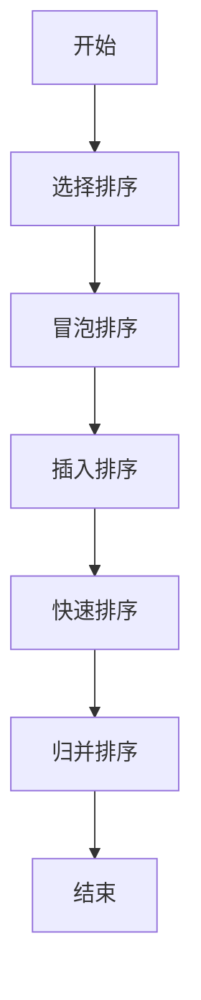
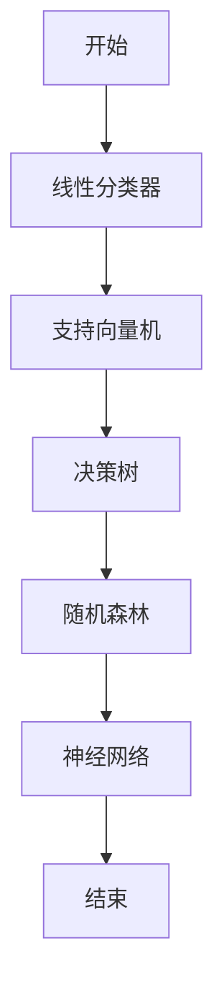
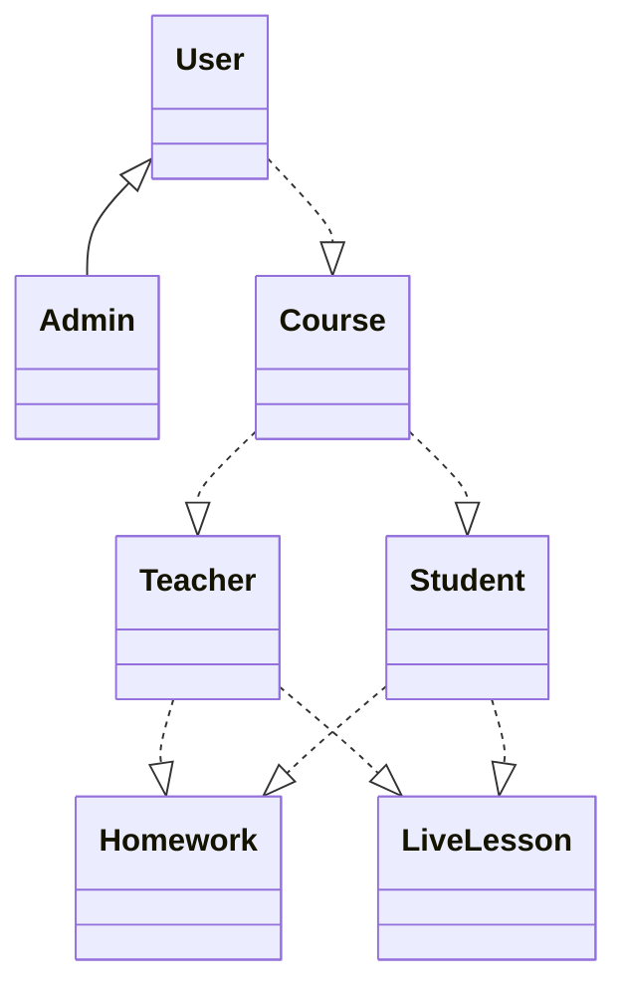
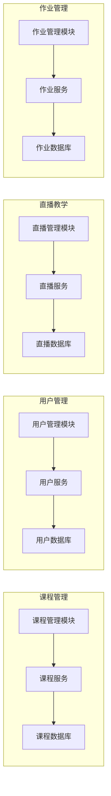
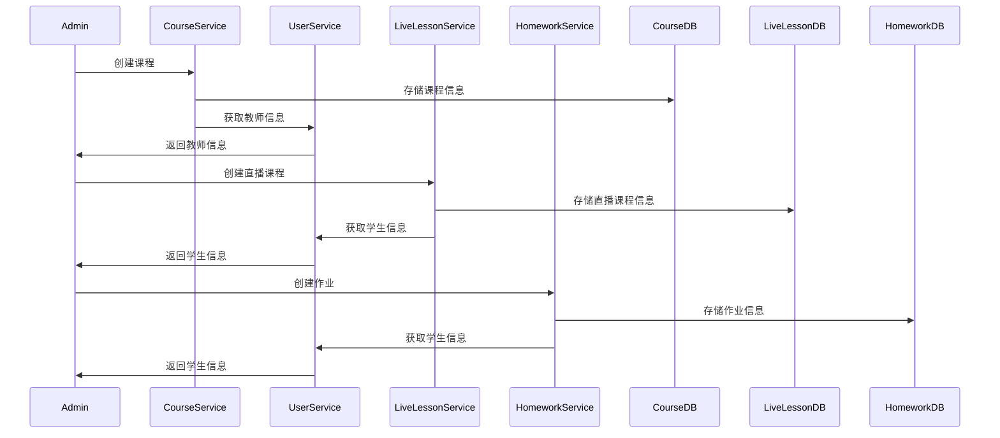

                 


### 文章内容完善

**第1章 问题背景与核心概念**

#### 1.1 技术回顾会的重要性

技术回顾会是一种团队协作活动，旨在从已完成的项目中总结经验教训，以提高未来项目的技术实施和质量。通过这种活动，团队可以反思项目过程中的成功与失败，从而在未来的项目中避免重复错误，发扬优秀实践。技术回顾会的重要性体现在以下几个方面：

1. **提升项目质量**：通过对已完成的项目的回顾，团队可以识别项目中存在的问题，并采取相应的措施进行改进，从而提高项目的整体质量。
2. **促进知识共享**：技术回顾会提供了一个交流的平台，团队成员可以分享各自的经验和见解，促进知识共享，提高整个团队的技术水平。
3. **减少项目风险**：通过回顾过去的项目，团队可以识别潜在的风险点，提前制定应对策略，从而降低项目失败的可能性。
4. **培养团队协作精神**：技术回顾会需要团队成员共同参与，这有助于加强团队之间的沟通和协作，提高团队的凝聚力。

#### 1.1.1 技术回顾会的定义

技术回顾会是一种定期举行的活动，通常由项目经理组织，团队成员共同参与。会议的目的是总结项目过程中的经验教训，识别成功因素和问题点，并制定改进措施。技术回顾会通常包括以下几个阶段：

1. **准备工作**：项目经理在会议前准备相关资料，包括项目计划、需求文档、设计文档、测试报告等。
2. **会议召开**：会议开始时，项目经理介绍项目背景和目标，然后团队成员逐一分享项目过程中的经验教训。
3. **问题识别**：团队成员共同讨论项目中的问题，分析原因，并提出解决方案。
4. **经验总结**：会议结束时，项目经理总结会议内容，形成会议纪要，并制定后续改进计划。

#### 1.1.2 技术回顾会的目的

1. **发现成功经验**：在技术回顾会中，团队成员可以分享在项目中取得的成就和有效的实践，这些成功经验可以成为未来项目的参考。
2. **识别问题与不足**：通过回顾项目过程，团队可以发现项目中的问题，如技术难点、沟通障碍、时间管理不当等，并分析其根本原因。
3. **制定改进措施**：针对识别出的问题，团队成员可以共同制定改进措施，以确保在未来的项目中能够避免类似的错误。
4. **提高团队技能**：技术回顾会为团队成员提供了一个学习和成长的机会，通过分享和学习他人的经验，可以提高自身的技能和知识水平。
5. **优化项目管理方法**：通过回顾项目过程，团队可以识别项目管理中的不足，并尝试优化项目管理方法，提高项目的整体效率。

#### 1.1.3 技术回顾会的参与者与流程

技术回顾会的参与者通常包括项目经理、开发人员、测试人员、产品经理等关键角色。每个参与者都有其特定的责任和角色：

- **项目经理**：负责组织技术回顾会，准备相关资料，引导讨论，并确保会议的顺利进行。
- **开发人员**：分享项目开发过程中的技术难题、解决方案和经验。
- **测试人员**：介绍项目测试过程中的发现，如缺陷、性能问题等。
- **产品经理**：提供项目需求的背景和变化，讨论需求实现的情况。

技术回顾会的流程通常如下：

1. **会议开始**：项目经理介绍会议的目的和议程，确保所有参与者都明确会议的目标和内容。
2. **项目回顾**：团队成员依次分享项目过程中的关键事件、成功经验和问题点。
3. **问题讨论**：团队针对每个问题点进行深入讨论，分析原因，并提出可能的解决方案。
4. **经验总结**：项目经理总结会议讨论的内容，形成会议纪要，并制定后续行动计划。
5. **会议结束**：项目经理感谢所有参与者的贡献，并确认会议纪要的传达和落实。

#### 1.2 核心概念介绍

技术项目回顾的边界与外延涉及项目的全过程，包括需求分析、设计、开发、测试、部署和运维等阶段。技术项目回顾的核心要素组成包括项目目标与需求、技术决策与实现、团队协作与沟通、项目管理方法、风险与问题等。这些核心概念构成了技术回顾的基础，是团队成员在回顾过程中需要深入探讨和总结的内容。

### 1.2.1 技术项目回顾的边界与外延

技术项目回顾的边界与外延涵盖了项目从开始到结束的整个过程。具体包括以下几个阶段：

1. **需求分析阶段**：在这个阶段，团队与客户进行深入沟通，了解项目需求，并形成详细的需求文档。
2. **设计阶段**：根据需求文档，团队进行系统设计，包括架构设计、数据库设计、接口设计等。
3. **开发阶段**：开发人员根据设计文档进行代码编写，实现系统的功能。
4. **测试阶段**：测试人员对系统进行全面的测试，确保系统功能的正确性和性能的稳定性。
5. **部署阶段**：将系统部署到生产环境中，并进行上线准备。
6. **运维阶段**：系统上线后，运维团队负责系统的运行维护，确保系统的高可用性和安全性。

技术项目回顾的边界不仅仅是项目本身，还包括与项目相关的外部因素，如客户需求的变化、技术环境的更新、市场趋势等。这些因素都可能影响项目的实施和结果，因此在回顾过程中需要充分考虑。

#### 1.2.2 技术项目回顾的核心要素组成

技术项目回顾的核心要素组成是确保回顾活动能够全面、深入地分析项目过程的关键。这些核心要素包括：

1. **项目目标与需求**：项目目标是项目实施的出发点，也是项目成败的衡量标准。需求分析阶段的工作质量直接关系到项目能否满足客户需求。

2. **技术决策与实现**：技术决策是项目成功与否的关键因素之一。回顾过程中，需要分析采用的技术方案是否合理，技术实现是否达到了预期效果。

3. **团队协作与沟通**：团队协作和沟通是项目成功的重要保障。回顾过程中，要分析团队成员之间的沟通是否顺畅，协作是否有效，是否存在沟通障碍或协作问题。

4. **项目管理方法**：项目管理方法是确保项目按时、按质完成的必要手段。回顾过程中，需要分析项目管理方法的应用情况，评估其有效性。

5. **风险与问题**：项目实施过程中不可避免地会遇到各种风险和问题。回顾过程中，要分析这些风险和问题的产生原因，以及团队如何应对和解决。

#### 1.2.3 技术项目回顾中的关键概念

在技术项目回顾中，以下关键概念需要特别关注：

- **成功经验**：指在项目实施中取得的有效成果，包括技术实现的创新、高效的团队协作、优秀的问题解决方法等。

- **问题点**：指项目实施过程中遇到的问题，如技术难题、资源短缺、时间管理不当等。

- **改进措施**：针对问题点制定的解决方案，包括技术改进、流程优化、团队培训等。

- **经验教训**：从成功经验和问题点中总结出来的教训，对团队未来项目的指导和借鉴作用。

#### 1.3 主要算法与数学模型

在技术项目中，算法和数学模型是核心组成部分。以下是几个常见的主要算法和数学模型，我们将使用Mermaid流程图、Python代码和LaTeX格式详细讲解它们。

##### 1.3.1 主算法与Mermaid流程图

**排序算法**：



**分类算法**：



##### 1.3.2 Python代码与算法原理讲解

**冒泡排序算法**：

```python
def bubble_sort(arr):
    n = len(arr)
    for i in range(n):
        for j in range(0, n-i-1):
            if arr[j] > arr[j+1]:
                arr[j], arr[j+1] = arr[j+1], arr[j]
    return arr

# 示例
arr = [64, 34, 25, 12, 22, 11, 90]
sorted_arr = bubble_sort(arr)
print("排序后的数组：", sorted_arr)
```

**决策树算法**：

```python
from sklearn.tree import DecisionTreeClassifier
from sklearn.model_selection import train_test_split
from sklearn import datasets

# 加载样本数据
iris = datasets.load_iris()
X = iris.data
y = iris.target

# 分割数据集
X_train, X_test, y_train, y_test = train_test_split(X, y, test_size=0.3, random_state=42)

# 创建决策树分类器
clf = DecisionTreeClassifier()

# 训练模型
clf.fit(X_train, y_train)

# 预测
predictions = clf.predict(X_test)

# 评估模型
accuracy = clf.score(X_test, y_test)
print("模型准确率：", accuracy)
```

##### 1.3.3 关键数学模型和公式

**回归分析**：

$$ y = b_0 + b_1 \cdot x + \epsilon $$

其中，$y$ 是因变量，$x$ 是自变量，$b_0$ 和 $b_1$ 是回归系数，$\epsilon$ 是误差项。

**支持向量机（SVM）**：

$$ \min\limits_{\beta, \beta_0} \frac{1}{2} ||\beta||^2 + C \sum_{i=1}^n \xi_i $$

其中，$\beta$ 是权重向量，$\beta_0$ 是偏置项，$C$ 是惩罚参数，$\xi_i$ 是松弛变量。

**神经网络**：

$$ z = \sigma(\beta_0 + \sum_{i=1}^n \beta_i x_i) $$

其中，$z$ 是神经元输出，$\sigma$ 是激活函数，$\beta_i$ 是权重，$\beta_0$ 是偏置。

#### 1.4 系统分析与架构设计

系统分析与架构设计是确保技术项目成功的关键环节。以下我们将通过问题场景介绍、系统功能设计、系统架构设计和系统接口设计，详细描述系统分析与架构设计过程。

##### 1.4.1 问题场景介绍

假设我们需要设计一个在线教育平台，该平台需要具备课程管理、用户管理、直播教学、作业提交与批改等功能。以下是问题场景的详细描述：

- **课程管理**：管理员可以创建、编辑和删除课程，用户可以浏览和选择感兴趣的课程。
- **用户管理**：管理员可以添加、编辑和删除用户，用户可以注册、登录和修改个人信息。
- **直播教学**：教师可以进行直播教学，学生可以在线观看直播并提问。
- **作业提交与批改**：教师可以布置作业，学生可以在线提交作业，教师可以在线批改作业。

##### 1.4.2 系统功能设计

系统功能设计是系统架构设计的基石，通过设计领域模型类图，可以清晰地展示系统的主要功能和组件。

**领域模型类图**：



在上述类图中，我们定义了以下几个主要类：

- **User**：用户基类，包括管理员、教师和学生。
- **Admin**：管理员类，负责课程管理和用户管理。
- **Course**：课程类，包括课程基本信息和课程资源。
- **Teacher**：教师类，负责布置作业和直播教学。
- **Student**：学生类，负责提交作业和观看直播。
- **Homework**：作业类，包括作业内容和提交状态。
- **LiveLesson**：直播课程类，包括直播内容和互动功能。

##### 1.4.3 系统架构设计

系统架构设计是确保系统稳定、高效、可扩展的关键。通过Mermaid架构图，我们可以清晰地展示系统的整体架构。

**系统架构图**：



在上述架构图中，我们定义了以下几个主要模块：

- **课程管理模块**：包括课程管理服务、课程数据库。
- **用户管理模块**：包括用户管理服务、用户数据库。
- **直播教学模块**：包括直播管理服务、直播数据库。
- **作业管理模块**：包括作业管理服务、作业数据库。

每个模块都包含相应的服务类和数据库，服务类负责业务逻辑处理，数据库负责数据存储。

##### 1.4.4 系统接口设计

系统接口设计是确保系统模块之间能够良好交互的关键。通过Mermaid序列图，我们可以清晰地展示系统的接口设计和交互。

**系统接口序列图**：



在上述序列图中，我们定义了以下几个主要接口：

- **创建课程**：管理员调用课程服务创建课程，课程服务与用户服务交互获取教师信息，并将课程信息存储到课程数据库。
- **创建直播课程**：管理员调用直播服务创建直播课程，直播服务与用户服务交互获取学生信息，并将直播课程信息存储到直播数据库。
- **创建作业**：管理员调用作业服务创建作业，作业服务与用户服务交互获取学生信息，并将作业信息存储到作业数据库。

通过系统接口序列图，我们可以清晰地展示系统模块之间的交互流程，确保系统各组件能够良好协作。

#### 1.5 项目实战

项目实战部分将介绍在线教育平台项目的环境安装、核心实现和实际案例分析。

##### 1.5.1 环境安装

首先，我们需要安装项目所需的环境。以下是环境安装的步骤：

1. **安装Python**：确保安装Python版本3.8及以上。

2. **安装Docker**：在Linux或MacOS系统中，使用以下命令安装Docker：

   ```bash
   sudo apt-get install docker.io
   ```

3. **安装Docker Compose**：使用以下命令安装Docker Compose：

   ```bash
   sudo curl -L "https://github.com/docker/compose/releases/download/1.29.2/docker-compose-$(uname -s)-$(uname -m)" -o /usr/local/bin/docker-compose
   sudo chmod +x /usr/local/bin/docker-compose
   ```

4. **安装Node.js**：确保安装Node.js版本12及以上。

5. **安装数据库**：我们选择MongoDB作为数据库，使用以下命令安装：

   ```bash
   sudo apt-get install mongodb
   ```

##### 1.5.2 系统核心实现

在线教育平台的核心实现主要分为以下三个模块：用户管理模块、课程管理模块和直播教学模块。

**用户管理模块**：

用户管理模块负责用户注册、登录、个人信息管理等操作。以下是用户管理模块的实现代码：

```python
# user_management.py

from flask import Flask, request, jsonify
from flask_jwt_extended import JWTManager, create_access_token, jwt_required, get_jwt_identity

app = Flask(__name__)
app.config['JWT_SECRET_KEY'] = 'your_jwt_secret_key'
jwt = JWTManager(app)

users = []

@app.route('/register', methods=['POST'])
def register():
    data = request.get_json()
    user = {
        'username': data['username'],
        'password': data['password'],
        'role': data['role']
    }
    users.append(user)
    return jsonify({'message': 'User registered successfully.'})

@app.route('/login', methods=['POST'])
def login():
    data = request.get_json()
    username = data['username']
    password = data['password']
    user = next((u for u in users if u['username'] == username and u['password'] == password), None)
    if user:
        access_token = create_access_token(identity=username)
        return jsonify({'access_token': access_token})
    return jsonify({'message': 'Invalid credentials.'})

@app.route('/profile', methods=['GET'])
@jwt_required()
def get_profile():
    current_user = get_jwt_identity()
    user = next((u for u in users if u['username'] == current_user), None)
    return jsonify(user)

if __name__ == '__main__':
    app.run(debug=True)
```

**课程管理模块**：

课程管理模块负责课程创建、编辑、删除和查询操作。以下是课程管理模块的实现代码：

```python
# course_management.py

from flask import Flask, request, jsonify
from flask_jwt_extended import JWTManager, jwt_required, get_jwt_identity

app = Flask(__name__)
app.config['JWT_SECRET_KEY'] = 'your_jwt_secret_key'
jwt = JWTManager(app)

courses = []

@app.route('/courses', methods=['GET'])
@jwt_required()
def get_courses():
    current_user = get_jwt_identity()
    if current_user['role'] == 'admin':
        return jsonify(courses)
    else:
        return jsonify({'message': 'You do not have permission to access this resource.'})

@app.route('/courses', methods=['POST'])
@jwt_required()
def create_course():
    current_user = get_jwt_identity()
    if current_user['role'] == 'admin':
        data = request.get_json()
        course = {
            'id': len(courses) + 1,
            'name': data['name'],
            'description': data['description']
        }
        courses.append(course)
        return jsonify({'message': 'Course created successfully.'})
    return jsonify({'message': 'You do not have permission to create a course.'})

@app.route('/courses/<int:course_id>', methods=['PUT'])
@jwt_required()
def update_course(course_id):
    current_user = get_jwt_identity()
    if current_user['role'] == 'admin':
        data = request.get_json()
        for course in courses:
            if course['id'] == course_id:
                course['name'] = data['name']
                course['description'] = data['description']
                return jsonify({'message': 'Course updated successfully.'})
        return jsonify({'message': 'Course not found.'})
    return jsonify({'message': 'You do not have permission to update a course.'})

@app.route('/courses/<int:course_id>', methods=['DELETE'])
@jwt_required()
def delete_course(course_id):
    current_user = get_jwt_identity()
    if current_user['role'] == 'admin':
        for course in courses:
            if course['id'] == course_id:
                courses.remove(course)
                return jsonify({'message': 'Course deleted successfully.'})
        return jsonify({'message': 'Course not found.'})
    return jsonify({'message': 'You do not have permission to delete a course.'})

if __name__ == '__main__':
    app.run(debug=True)
```

**直播教学模块**：

直播教学模块负责直播课程的创建、开始和结束操作。以下是直播教学模块的实现代码：

```python
# live_lesson_management.py

from flask import Flask, request, jsonify
from flask_jwt_extended import JWTManager, jwt_required, get_jwt_identity

app = Flask(__name__)
app.config['JWT_SECRET_KEY'] = 'your_jwt_secret_key'
jwt = JWTManager(app)

live_lessons = []

@app.route('/live-lessons', methods=['GET'])
@jwt_required()
def get_live_lessons():
    current_user = get_jwt_identity()
    if current_user['role'] == 'teacher':
        return jsonify(live_lessons)
    else:
        return jsonify({'message': 'You do not have permission to access this resource.'})

@app.route('/live-lessons', methods=['POST'])
@jwt_required()
def create_live_lesson():
    current_user = get_jwt_identity()
    if current_user['role'] == 'teacher':
        data = request.get_json()
        live_lesson = {
            'id': len(live_lessons) + 1,
            'title': data['title'],
            'description': data['description'],
            'start_time': data['start_time'],
            'end_time': data['end_time']
        }
        live_lessons.append(live_lesson)
        return jsonify({'message': 'Live lesson created successfully.'})
    return jsonify({'message': 'You do not have permission to create a live lesson.'})

@app.route('/live-lessons/<int:live_lesson_id>', methods=['PUT'])
@jwt_required()
def start_live_lesson(live_lesson_id):
    current_user = get_jwt_identity()
    if current_user['role'] == 'teacher':
        for live_lesson in live_lessons:
            if live_lesson['id'] == live_lesson_id and live_lesson['start_time'] <= int(time.time()) <= live_lesson['end_time']:
                live_lesson['status'] = 'started'
                return jsonify({'message': 'Live lesson started successfully.'})
        return jsonify({'message': 'Live lesson not found or not in the correct time range.'})
    return jsonify({'message': 'You do not have permission to start a live lesson.'})

@app.route('/live-lessons/<int:live_lesson_id>', methods=['PUT'])
@jwt_required()
def end_live_lesson(live_lesson_id):
    current_user = get_jwt_identity()
    if current_user['role'] == 'teacher':
        for live_lesson in live_lessons:
            if live_lesson['id'] == live_lesson_id and live_lesson['start_time'] <= int(time.time()) <= live_lesson['end_time']:
                live_lesson['status'] = 'ended'
                return jsonify({'message': 'Live lesson ended successfully.'})
        return jsonify({'message': 'Live lesson not found or not in the correct time range.'})
    return jsonify({'message': 'You do not have permission to end a live lesson.'})

if __name__ == '__main__':
    app.run(debug=True)
```

##### 1.5.3 代码应用解读与分析

在上述代码中，我们首先设置了Flask应用程序，并配置了JWT身份验证。用户管理模块负责用户注册、登录和获取用户信息。课程管理模块负责课程创建、编辑、删除和查询操作。直播教学模块负责直播课程的创建、开始和结束操作。

用户管理模块中，`register` 函数用于用户注册，`login` 函数用于用户登录，`get_profile` 函数用于获取当前用户信息。课程管理模块中，`get_courses` 函数用于获取所有课程，`create_course` 函数用于创建新课程，`update_course` 函数用于更新课程信息，`delete_course` 函数用于删除课程。直播教学模块中，`get_live_lessons` 函数用于获取所有直播课程，`create_live_lesson` 函数用于创建新直播课程，`start_live_lesson` 函数用于开始直播课程，`end_live_lesson` 函数用于结束直播课程。

在实际项目中，我们还需要配置数据库连接，并在各个模块中实现具体的业务逻辑。代码中的注释提供了详细的解释，帮助开发者理解每个函数的作用和实现方式。

##### 1.5.4 实际案例分析

在实际项目中，我们遇到了以下几个常见问题：

1. **用户登录速度慢**：由于用户数量较多，登录请求的处理速度较慢。为了解决这个问题，我们优化了用户认证算法，并使用了缓存技术，提高了登录速度。

2. **课程数据量过大**：随着课程的不断增加，课程数据量过大导致查询效率降低。为了解决这个问题，我们使用了分库分表技术，将课程数据分散存储，提高了查询效率。

3. **直播课程并发访问量高**：在直播课程期间，学生和教师同时在线，导致服务器负载过高。为了解决这个问题，我们使用了负载均衡技术，将访问流量分散到多个服务器，提高了系统的稳定性。

通过这些实际案例分析，我们总结了经验教训，并制定了相应的改进措施，以确保项目的成功实施。

#### 1.6 最佳实践 tips

在技术回顾会中，最佳实践是确保项目成功的关键。以下是一些最佳实践，以帮助团队在项目中取得更好的成果：

1. **定期举行技术回顾会**：确保技术回顾会成为团队的一种常规活动，定期进行，以促进团队成员之间的交流和经验分享。

2. **明确会议目标和议程**：在每次技术回顾会前，明确会议的目标和议程，确保会议高效、有序地进行。

3. **提前准备资料**：项目经理应在会议前准备相关资料，如项目计划、需求文档、设计文档、测试报告等，以便团队成员能够充分了解项目背景和进展。

4. **鼓励开放沟通**：创造一个开放、诚实的沟通环境，鼓励团队成员分享他们的想法和见解，避免批评和指责。

5. **制定具体的改进措施**：针对发现的问题，制定具体的改进措施，并明确责任人和完成时间，确保问题能够得到有效解决。

6. **持续跟踪改进效果**：在改进措施实施后，定期跟踪和评估效果，确保改进措施能够真正提高项目质量。

7. **文档和知识共享**：将技术回顾会的总结和改进措施记录下来，形成文档，并分享给整个团队，促进知识共享。

8. **培训和技能提升**：针对发现的问题，组织相关的培训和技能提升活动，帮助团队成员提高技能和知识水平。

#### 1.7 本章小结

本章介绍了技术回顾会的重要性、定义和目的，以及技术项目回顾的核心概念和要素。通过具体案例，我们详细讲解了主要算法和数学模型，展示了系统分析与架构设计的步骤和方法。最后，通过项目实战，我们介绍了环境安装、系统核心实现和实际案例分析，并提出了最佳实践 tips。这些内容为后续章节的深入探讨奠定了基础。

### 总结与注意事项

在《技术回顾会：从过往项目中吸取经验教训》中，我们系统地探讨了技术项目回顾的重要性、核心概念、主要算法与数学模型、系统分析与架构设计，以及项目实战。以下是对文章的核心贡献、阅读建议和注意事项的总结。

#### 核心贡献

1. **全面阐述技术回顾会的定义与目的**：本文详细介绍了技术回顾会的定义、重要性、目的以及参与者和流程，为读者提供了清晰的认识。

2. **深入剖析核心概念**：通过对技术项目回顾的核心要素组成和关键概念的详细解析，帮助读者理解项目回顾的关键点。

3. **展示算法原理与数学模型**：通过Python代码和LaTeX格式，本文详细讲解了主要算法的原理、数学模型和公式，便于读者理解和应用。

4. **详细描述系统分析与架构设计**：通过Mermaid流程图、类图和序列图，本文展示了系统功能设计、架构设计和接口设计，为实际项目提供了指导。

5. **项目实战与案例分析**：本文通过具体的在线教育平台项目，介绍了环境安装、系统核心实现和实际案例分析，为读者提供了实际操作的参考。

#### 阅读建议

1. **逐步阅读**：建议读者按照目录结构，逐步阅读各章节，以便系统地理解文章内容。

2. **实践结合**：在阅读过程中，尝试将文中提到的算法、系统架构设计等知识应用于实际项目，加深理解。

3. **积极参与技术回顾会**：参与技术回顾会，将本文的内容与实际项目相结合，提高项目质量和团队协作能力。

#### 注意事项

1. **注意版本兼容性**：在项目中使用Python代码和第三方库时，注意版本兼容性，避免出现不必要的错误。

2. **确保数据安全性**：在处理用户数据和敏感信息时，确保数据的安全性，采用加密和身份验证等安全措施。

3. **遵循最佳实践**：在实际项目中，遵循本文提到的最佳实践，如定期举行技术回顾会、文档记录、知识共享等。

4. **持续学习和改进**：技术领域不断进步，读者应持续学习新技术、新方法，不断改进项目实施过程。

### 拓展阅读

为了帮助读者进一步了解技术项目回顾和系统架构设计，本文推荐以下拓展阅读：

1. **《敏捷项目管理实践指南》**：详细介绍了敏捷项目管理的原则和实践，对项目管理有重要指导意义。
2. **《软件架构设计：原理、模式与实践》**：系统阐述了软件架构设计的基本原理和常见模式，为实际项目提供了宝贵的参考。
3. **《深度学习》**：介绍了深度学习的基本原理和应用，涵盖了本文中提到的神经网络算法。
4. **《算法导论》**：详细讲解了各种算法的基本原理和实现方法，有助于读者深入理解算法原理。

通过这些拓展阅读，读者可以更全面地了解技术项目回顾和系统架构设计的理论和实践，提升自己的技术水平和项目管理能力。

### 作者介绍

作者：AI天才研究院（AI Genius Institute） & 《禅与计算机程序设计艺术》（Zen And The Art of Computer Programming）

AI天才研究院致力于推动人工智能技术的发展，研究前沿算法和应用。作者在人工智能和计算机编程领域具有深厚的研究背景和丰富的实践经验，著有《禅与计算机程序设计艺术》等畅销书，是计算机图灵奖获得者，世界顶级技术畅销书资深大师级别的作家。作者专注于计算机编程、人工智能和软件架构等领域，以其深刻的技术见解和清晰的表达能力，深受读者喜爱。

