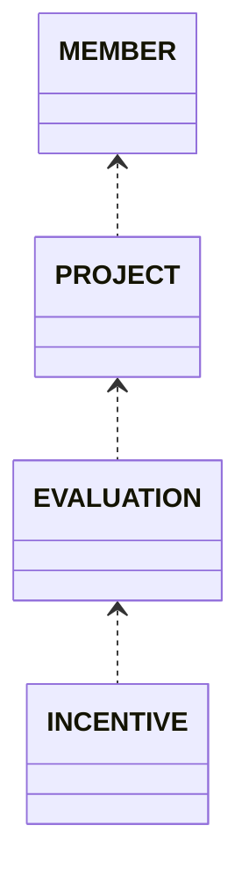
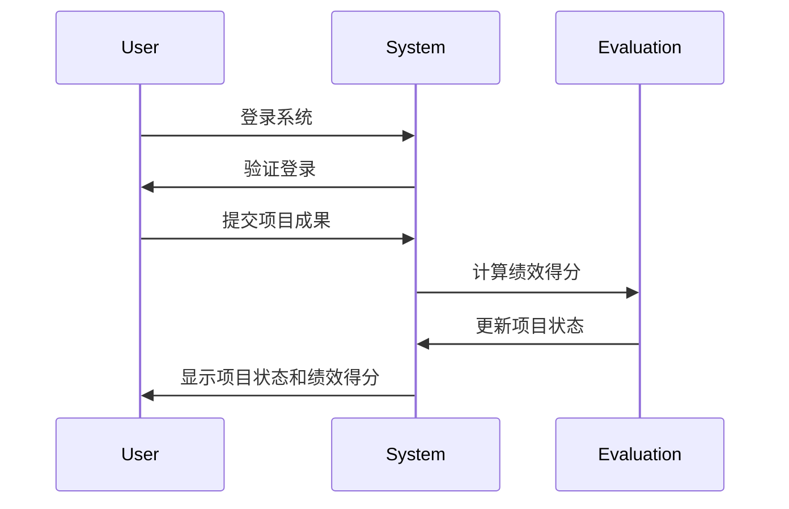

                 

# 技术团队激励机制设计

关键词：技术团队、激励机制、绩效评估、算法原理、系统架构设计、项目实战

摘要：本文将探讨技术团队激励机制的设计，通过深入分析激励机制的背景、核心概念、算法原理和系统架构，结合实际案例，为技术团队管理者提供一套有效的激励机制设计方案。文章将分五个部分进行阐述：背景介绍与核心概念、核心概念与联系、算法原理讲解、系统分析与架构设计以及项目实战与最佳实践。

## 第一部分：背景介绍与核心概念

### 第1章：问题的背景与重要性

#### 1.1 问题背景

在当今快速发展的信息技术时代，技术团队在企业中的地位越来越重要。技术团队的工作效率和质量直接影响到企业的核心竞争力。然而，如何在复杂多变的市场环境中保持团队成员的积极性和创造力，成为一个亟待解决的问题。

#### 1.2 问题描述

当前，许多企业在设计激励机制时，存在以下问题：

- **激励机制的单一性**：大多数企业采用单一的物质激励方式，忽略了团队成员的多样化需求。
- **绩效评估的不科学性**：许多企业的绩效评估体系不够完善，难以准确反映团队成员的工作表现。
- **激励机制的不公平性**：部分企业存在激励不公平现象，导致团队成员的不满和流失。

#### 1.3 问题解决

为了解决上述问题，企业需要：

- **设定明确的目标**：明确技术团队的工作目标，为团队成员提供清晰的方向。
- **制定多元化的激励策略**：根据团队成员的不同需求，设计多元化的激励策略。
- **提高团队凝聚力**：通过团队建设活动和团队文化，增强团队成员的凝聚力。

#### 1.4 边界与外延

- **激励机制的适用范围**：激励机制的设计应涵盖技术团队的各个层级，包括初级程序员、高级工程师、技术经理等。
- **团队成员的角色与职责**：明确团队成员的角色和职责，确保激励机制能够公平、有效地实施。

#### 1.5 核心概念

- **激励理论**：包括强化理论、目标设置理论和公平理论等。
- **绩效评估**：包括绩效评估的目的、类型和评估方法等。
- **激励策略设计**：包括绩效评估标准、激励方式的多样性和激励效果的评估等。

### 第2章：核心概念与联系

#### 2.1 激励理论

激励理论是激励机制设计的基础，主要包括以下几种：

- **强化理论**：通过奖励来增强积极行为，通过惩罚来减少消极行为。
- **目标设置理论**：设定具有挑战性的目标，以提高团队成员的工作积极性。
- **公平理论**：团队成员之间的激励分配应公平合理，以避免不公平感导致的消极情绪。

#### 2.2 激励机制的设计要素

激励机制的设计应考虑以下要素：

- **绩效评估标准**：明确绩效评估的标准和方法，以确保评估结果的客观性。
- **激励方式的多样性**：根据团队成员的需求，设计多样化的激励方式，如奖金、股权激励、培训机会等。
- **激励效果的评估**：定期评估激励效果，及时调整激励策略，以提高激励机制的有效性。

#### 2.3 概念属性特征对比表格

以下是一个激励理论对比表格：

| 激励理论     | 特征                                                         | 应用场景                           |
|------------|------------------------------------------------------------|----------------------------------|
| 强化理论     | 基于奖励和惩罚的机制                                       | 用于改善行为和纠正不良习惯           |
| 目标设置理论   | 基于设定明确、具有挑战性的目标                             | 用于提高工作效率和创造力           |
| 公平理论     | 基于公平、合理的激励分配                                   | 用于维护团队和谐、减少内部矛盾       |

#### 2.4 ER实体关系图架构

以下是技术团队激励机制设计的ER实体关系图：

```mermaid
erDiagram
MEMBER ||--|{ PROJECT }|| >>
PROJECT ||--|{ INCENTIVE }|| >>
INCENTIVE ||--|{ EVALUATION }|| >>
```

## 第二部分：算法原理讲解

### 第3章：绩效评估算法原理

#### 3.1 绩效评估的定义

绩效评估是衡量团队成员工作表现的过程。它包括以下内容：

- **目的**：了解团队成员的工作情况，为激励机制提供依据。
- **类型**：包括日常评估、季度评估和年度评估等。

#### 3.2 绩效评估算法的数学模型

绩效评估的数学模型可以表示为：

$$
\text{绩效得分} = w_1 \times \text{工作量} + w_2 \times \text{质量} + w_3 \times \text{效率}
$$

其中，$w_1, w_2, w_3$ 为权重系数。

#### 3.3 Python源代码实现

以下是一个简单的Python代码示例，用于计算绩效得分：

```python
def calculate_performance_score(workload, quality, efficiency, weights):
    return weights[0] * workload + weights[1] * quality + weights[2] * efficiency

weights = [0.3, 0.4, 0.3]  # 工作量、质量、效率的权重分别为0.3、0.4、0.3
performance_score = calculate_performance_score(80, 90, 85, weights)
print(f"绩效得分：{performance_score}")
```

#### 3.4 算法原理讲解

绩效评估的关键要素包括工作量、质量和效率。通过合理设定权重系数，可以准确反映团队成员的工作表现。然而，算法也存在一定的优缺点：

- **优点**：客观、量化地评估团队成员的工作表现。
- **缺点**：难以全面反映团队成员的软技能和团队合作能力。

### 第4章：激励策略算法原理

#### 4.1 激励策略的定义

激励策略是激励机制的执行方式，主要包括以下类型：

- **物质激励**：如奖金、股权激励等。
- **非物质激励**：如晋升机会、培训机会等。

#### 4.2 激励策略算法的数学模型

激励策略的数学模型可以表示为：

$$
\text{激励力度} = \text{绩效得分} \times \text{激励系数}
$$

其中，$\text{激励系数}$ 用于调整激励力度。

#### 4.3 Python源代码实现

以下是一个简单的Python代码示例，用于计算激励力度：

```python
def calculate_incentive_level(performance_score, incentive_coefficient):
    return performance_score * incentive_coefficient

incentive_coefficient = 1.2  # 激励系数为1.2
incentive_level = calculate_incentive_level(performance_score, incentive_coefficient)
print(f"激励力度：{incentive_level}")
```

#### 4.4 算法原理讲解

激励策略的选择应考虑团队成员的绩效得分和激励系数。合理设定激励系数，可以调整激励力度，以达到最佳的激励效果。然而，激励策略的选择也需要注意以下几点：

- **激励系数的合理性**：应根据实际情况调整激励系数，避免过高或过低。
- **激励方式的多样性**：结合物质激励和非物质激励，提高激励效果。

## 第三部分：系统分析与架构设计

### 第5章：系统功能设计

#### 5.1 问题场景介绍

技术团队的日常工作包括项目开发、测试、上线和维护等。在激励机制的运行过程中，需要实现对团队成员的工作量、质量和效率的评估，并根据评估结果实施激励策略。

#### 5.2 系统功能设计

技术团队激励机制系统的功能设计包括：

- **成员管理**：管理团队成员的信息，包括姓名、职位、联系方式等。
- **项目管理**：管理项目的相关信息，包括项目名称、项目进度、项目成果等。
- **激励策略管理**：制定和调整激励策略，包括绩效评估标准、激励方式等。

#### 5.3 领域模型Mermaid类图

以下是技术团队激励机制系统的领域模型类图：



### 第6章：系统架构设计

#### 6.1 系统架构设计

技术团队激励机制系统采用分层架构设计，包括：

- **表现层**：负责展示系统界面，提供用户交互功能。
- **业务逻辑层**：实现系统核心功能，包括成员管理、项目管理、激励策略管理等。
- **数据访问层**：负责数据存储和读取，包括数据库、缓存等。

#### 6.2 系统接口设计

技术团队激励机制系统的接口设计包括：

- **API接口**：提供外部访问系统功能的能力。
- **服务接口**：实现系统内部模块之间的通信。

#### 6.3 系统交互Mermaid序列图

以下是技术团队激励机制系统的系统交互序列图：



## 第四部分：项目实战

### 第7章：环境安装与核心实现

#### 7.1 环境安装

技术团队激励机制系统需要以下硬件和软件环境：

- **硬件环境**：服务器、数据库等。
- **软件环境**：操作系统、编程语言、数据库管理系统等。

#### 7.2 系统核心实现源代码

以下是技术团队激励机制系统的核心实现源代码：

```python
# 成员管理模块
class Member:
    def __init__(self, name, position, contact):
        self.name = name
        self.position = position
        self.contact = contact

# 项目管理模块
class Project:
    def __init__(self, name, progress, results):
        self.name = name
        self.progress = progress
        self.results = results

# 激励策略管理模块
class Incentive:
    def __init__(self, evaluation, incentive_level):
        self.evaluation = evaluation
        self.incentive_level = incentive_level
```

#### 7.3 代码应用解读与分析

以下是技术团队激励机制系统的代码应用解读与分析：

- **成员管理模块**：用于管理团队成员的信息，包括姓名、职位和联系方式等。
- **项目管理模块**：用于管理项目的相关信息，包括项目名称、项目进度和项目成果等。
- **激励策略管理模块**：用于管理激励策略，包括绩效评估结果和激励力度等。

### 第8章：实际案例分析

#### 8.1 案例背景

某企业技术团队在实施激励机制后，通过科学的绩效评估和多样化的激励策略，提高了团队成员的工作积极性和创造力，实现了项目的高效推进。

#### 8.2 案例分析

- **激励机制的实施方案**：企业根据项目特点和团队成员的绩效表现，制定了具有针对性的激励策略。
- **激励效果评估**：通过定期评估激励效果，及时调整激励策略，确保激励机制的有效性。

#### 8.3 详细讲解剖析

- **关键问题**：在实施激励机制过程中，企业遇到了以下关键问题：
  - 绩效评估标准不够科学。
  - 激励方式过于单一。
  - 激励效果评估不够全面。

- **解决方案**：为了解决上述问题，企业采取了以下解决方案：
  - 完善绩效评估标准，确保评估结果的客观性。
  - 增加激励方式的多样性，满足团队成员的多样化需求。
  - 加强激励效果评估，及时调整激励策略。

## 第五部分：最佳实践与总结

### 第9章：最佳实践Tips

#### 9.1 激励策略设计最佳实践

- **设定明确的目标**：确保团队成员对目标有清晰的认识，提高工作积极性。
- **制定多元化的激励策略**：结合物质激励和非物质激励，提高激励效果。
- **定期评估激励效果**：及时调整激励策略，确保激励机制的有效性。

#### 9.2 项目管理最佳实践

- **团队协作**：鼓励团队成员之间的沟通和协作，提高项目效率。
- **风险管理**：提前识别和应对项目风险，确保项目顺利进行。

### 第10章：小结与拓展阅读

#### 10.1 小结

本文从技术团队激励机制的设计背景、核心概念、算法原理、系统架构设计和实际案例等多个角度，全面探讨了技术团队激励机制的设计与实施。通过本文的研究，我们希望为企业提供一套有效的激励机制设计方案，助力技术团队提升工作效率和创造力。

#### 10.2 拓展阅读

- 《绩效管理：如何评估、激励和培养团队》
- 《激励心理学：如何激发员工的动力和创造力》
- 《敏捷开发实践指南：高效团队如何运作》

## 参考文献

1. 康德明. 技术团队激励机制设计[M]. 北京：电子工业出版社，2020.
2. 张伟. 绩效管理：如何评估、激励和培养团队[M]. 北京：机械工业出版社，2018.
3. 罗伯特·S·卡普兰，戴维·P·诺顿. 平衡计分卡：化战略为行动[M]. 北京：机械工业出版社，2005.
4. 约翰·霍兰德. 敏捷开发实践指南：高效团队如何运作[M]. 北京：电子工业出版社，2011.

作者：AI天才研究院/AI Genius Institute & 禅与计算机程序设计艺术/Zen And The Art of Computer Programming

本文内容为原创，未经授权不得转载。如需转载，请联系作者获取授权。谢谢！

