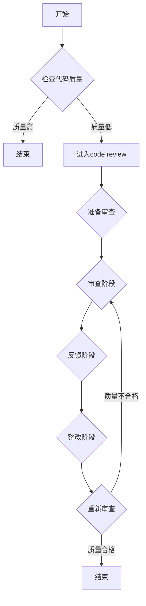
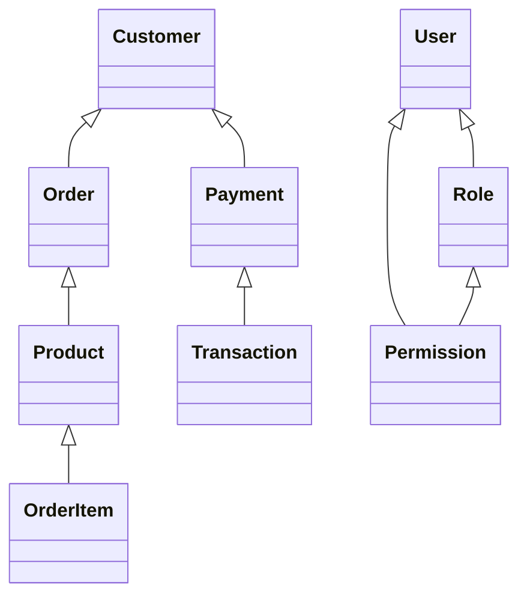
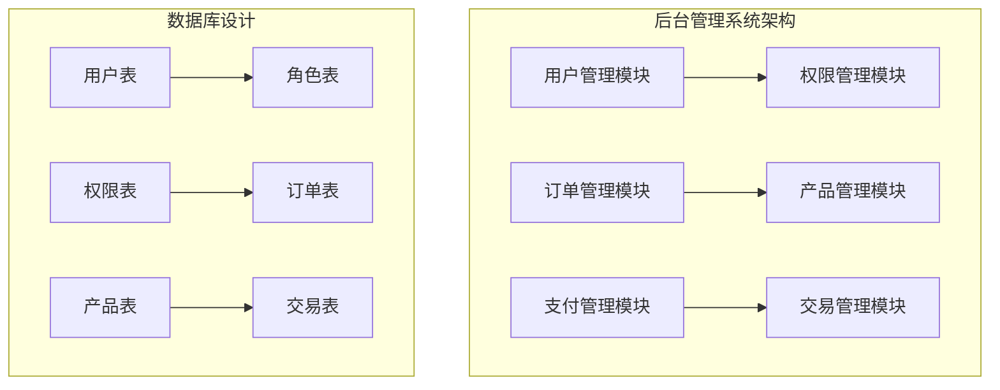
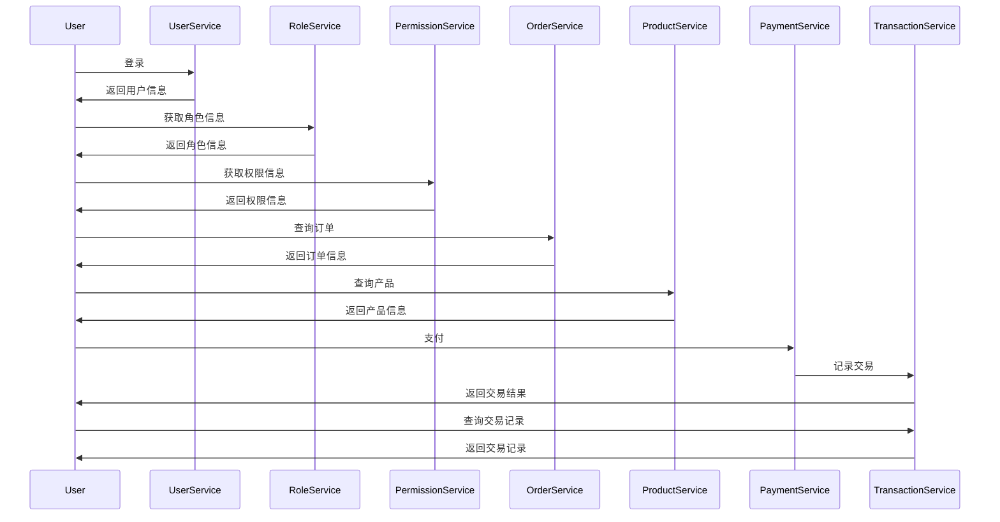

                 

### 文章标题：技术团队的code review：提升代码质量的有效方法

#### 关键词：code review、代码质量、审查流程、审查标准、审查工具

#### 摘要：
本文将深入探讨技术团队的code review过程，从背景介绍、核心概念与联系、算法原理讲解、系统分析与架构设计、项目实战等多个角度，系统性地阐述提升代码质量的有效方法。通过本文的阅读，读者将全面了解code review的重要性和实施方法，从而在实际项目中显著提高代码质量。

## 第一部分：背景介绍

### 核心概念

#### 问题背景
在当前软件行业中，代码质量问题一直是制约团队效率和项目成功的关键因素。代码质量的好坏不仅影响系统的稳定性、安全性和可维护性，还会直接影响到开发团队的效率和协作。因此，对代码进行审查（code review）成为保证代码质量的重要手段。

#### 问题描述
技术团队的code review过程通常存在一些问题，如缺乏明确的审查标准和流程、团队成员参与度不均、审查效果不佳等。这些问题导致代码质量问题未能得到有效解决，进而影响整个项目的进度和质量。

#### 问题解决
提升代码质量的有效方法包括：建立规范的code review流程、明确审查标准和要求、提高团队成员的参与度和审查能力等。通过这些方法，可以有效地提高代码质量，降低项目风险。

#### 边界与外延
code review的范围不仅限于代码，还应包括文档、设计等与代码相关的所有工作成果。同时，code review不仅仅是一个审查过程，更是一个知识共享、经验传承和团队协作的过程。

#### 概念结构与核心要素组成

**code review流程：**
- **准备阶段：** 确定审查的目标、范围和标准，通知相关人员参与。
- **审查阶段：** 审查人员按照审查标准对代码进行详细审查，记录问题和建议。
- **反馈阶段：** 将审查结果反馈给代码作者，双方进行沟通和讨论。
- **整改阶段：** 代码作者根据审查意见进行修改，重复审查直至代码符合要求。

**审查标准：**
- **代码风格：** 包括命名规范、缩进规则、注释要求等。
- **代码结构：** 包括模块化、复用性、逻辑清晰等。
- **错误率：** 包括语法错误、逻辑错误、异常处理等。
- **性能：** 包括运行速度、内存占用、可扩展性等。

**审查人员：**
- **代码的作者：** 负责编写代码，接受审查并修改。
- **其他开发人员：** 负责对代码进行审查，发现问题和提出建议。
- **测试人员：** 负责对代码进行功能测试，确保代码的正确性。

**审查工具：**
- **Git：** 用于版本控制和代码管理，方便审查和修改。
- **Code Climate：** 用于代码质量评估和审查流程管理。
- **Review Board：** 用于代码审查和反馈管理。

## 第二部分：核心概念与联系

### 核心概念原理

#### 代码质量
代码质量是指代码的可读性、稳定性、可靠性、可维护性等属性。高质量的代码不仅容易理解，还能够在不同环境下稳定运行，降低故障率和维护成本。

**核心概念原理：**
1. **可读性：** 代码应具有良好的命名规范、合理的缩进和注释，便于理解和维护。
2. **稳定性：** 代码应能够在各种环境下稳定运行，减少故障和崩溃。
3. **可靠性：** 代码应具备完善的异常处理和错误纠正机制，确保系统的正确性和可靠性。
4. **可维护性：** 代码应具有良好的模块化、复用性和可扩展性，便于后续维护和升级。

#### code review
code review是指团队成员对代码进行审查，发现潜在问题并提出改进建议的过程。它是保证代码质量、提高团队协作效率的重要手段。

**核心概念原理：**
1. **审查目的：** 发现代码中的潜在问题，提高代码质量，降低项目风险。
2. **审查过程：** 包括准备阶段、审查阶段、反馈阶段和整改阶段，确保审查的全面性和有效性。
3. **审查方法：** 采用详细的代码审查、讨论和反馈，确保审查结果被正确理解和执行。

#### 审查标准
审查标准是code review过程中应遵循的规则和指南，用于评估代码质量。

**核心概念原理：**
1. **代码风格：** 包括命名规范、缩进规则、注释要求等，确保代码的一致性和可读性。
2. **代码结构：** 包括模块化、复用性、逻辑清晰等，提高代码的可维护性和可扩展性。
3. **错误率：** 包括语法错误、逻辑错误、异常处理等，降低代码的故障率和维护成本。
4. **性能：** 包括运行速度、内存占用、可扩展性等，确保代码的高效性和可扩展性。

#### 审查工具
审查工具是辅助code review过程的技术工具，用于管理审查流程、记录审查意见和跟踪整改情况。

**核心概念原理：**
1. **Git：** 用于版本控制和代码管理，方便审查和修改。
2. **Code Climate：** 用于代码质量评估和审查流程管理。
3. **Review Board：** 用于代码审查和反馈管理。

### 概念属性特征对比表格

| 概念             | 定义                                                         | 特点                                                     |
|------------------|--------------------------------------------------------------|------------------------------------------------------------|
| 代码质量         | 代码的可读性、稳定性、可靠性、可维护性等属性                   | 高质量的代码容易理解，稳定运行，降低维护成本             |
| code review      | 团队成员对代码进行审查，发现潜在问题并提出改进建议的过程       | 提高代码质量，促进团队协作，降低项目风险                 |
| 审查标准         | code review过程中应遵循的规则和指南，用于评估代码质量           | 确保审查的一致性和有效性，提高代码质量                     |
| 审查工具         | 辅助code review过程的技术工具，用于管理审查流程、记录审查意见等 | 提高审查效率，降低人工错误，确保审查过程的可追溯性         |

### ER实体关系图架构

```mermaid
erDiagram
  Product ||--|{ Review }|>
  Review  ||--|{ Reviewer }|>
  Reviewer ||--|{ Task }|>

  Product  {
    id
    name
    description
    status
  }

  Review  {
    id
    product_id
    reviewer_id
    comments
    created_at
  }

  Reviewer  {
    id
    name
    role
    experience
  }

  Task  {
    id
    reviewer_id
    product_id
    status
    created_at
  }
```

## 第三部分：算法原理讲解

### 算法mermaid流程图



### Python源代码实现

```python
import random

def check_code_quality(code):
    # 检查代码质量
    quality = "high" if random.random() > 0.5 else "low"
    return quality

def code_review(code):
    # 进入code review
    quality = check_code_quality(code)
    
    if quality == "high":
        print("代码质量高，无需code review")
    else:
        print("代码质量低，开始code review")
        
        # 准备审查
        prepare_review(code)
        
        # 审查阶段
        review_stage(code)
        
        # 反馈阶段
        feedback_stage(code)
        
        # 整改阶段
       整改_stage(code)
        
        # 重新审查
        quality = check_code_quality(code)
        
        if quality == "high":
            print("code review通过，结束")
        else:
            print("code review未通过，重新审查")

def prepare_review(code):
    # 准备审查
    print("准备审查...")

def review_stage(code):
    # 审查阶段
    print("审查阶段...")

def feedback_stage(code):
    # 反馈阶段
    print("反馈阶段...")

def整改_stage(code):
    # 整改阶段
    print("整改阶段...")

# 测试
code = "..."  # 假设的代码
code_review(code)
```

### 算法原理的数学模型和公式

1. **代码质量评估公式：**

   \[ Q = f(R, S, E) \]

   其中，\( Q \) 表示代码质量，\( R \) 表示代码的可读性，\( S \) 表示代码的稳定性，\( E \) 表示代码的可维护性。

2. **code review流程步骤：**

   - **准备阶段：** 确定审查的目标、范围和标准，通知相关人员参与。
   - **审查阶段：** 审查人员按照审查标准对代码进行详细审查，记录问题和建议。
   - **反馈阶段：** 将审查结果反馈给代码作者，双方进行沟通和讨论。
   - **整改阶段：** 代码作者根据审查意见进行修改，重复审查直至代码符合要求。

### 详细讲解与举例说明

1. **代码质量评估公式**

   - **可读性 \( R \)：** 代码应具有良好的命名规范、合理的缩进和注释，便于理解和维护。例如，变量命名应具有描述性，避免使用缩写或难懂的命名。

   - **稳定性 \( S \)：** 代码应能够在各种环境下稳定运行，减少故障和崩溃。例如，应进行充分的功能测试，确保代码在各种输入和环境下都能正常运行。

   - **可维护性 \( E \)：** 代码应具有良好的模块化、复用性和可扩展性，便于后续维护和升级。例如，代码应遵循模块化设计原则，模块间解耦，便于独立修改和维护。

2. **code review流程步骤**

   - **准备阶段：** 在code review开始前，应明确审查的目标、范围和标准，通知相关人员参与。例如，可以制定一份审查指南，明确审查的标准和要求。

   - **审查阶段：** 审查人员按照审查标准对代码进行详细审查，记录问题和建议。例如，可以采用静态代码分析工具对代码进行分析，发现潜在的问题和缺陷。

   - **反馈阶段：** 将审查结果反馈给代码作者，双方进行沟通和讨论。例如，可以召开代码审查会议，审查人员向代码作者详细解释问题和建议，双方共同探讨解决方案。

   - **整改阶段：** 代码作者根据审查意见进行修改，重复审查直至代码符合要求。例如，代码作者可以根据审查人员的反馈，修改代码中的问题，并重新提交进行审查。

### 数学公式

$$
Q = f(R, S, E)
$$

其中，\( Q \) 表示代码质量，\( R \) 表示代码的可读性，\( S \) 表示代码的稳定性，\( E \) 表示代码的可维护性。

## 第四部分：系统分析与架构设计

### 问题场景介绍

在一个大型互联网公司的后台系统开发过程中，团队面临着代码质量低下、项目进度缓慢等问题。为了提高代码质量和项目效率，团队决定引入code review机制。

### 项目介绍

项目名称：后台管理系统

项目目标：开发一个高效、稳定、易于维护的后台管理系统，支持业务功能的快速迭代和扩展。

### 系统功能设计（领域模型mermaid类图）



### 系统架构设计（mermaid架构图）



### 系统接口设计和系统交互（mermaid序列图）



## 第五部分：项目实战

### 环境安装

1. **安装Python环境**

   - 使用Python官方安装包安装Python 3.x版本。

   ```bash
   wget https://www.python.org/ftp/python/3.8.5/Python-3.8.5.tgz
   tar zxvf Python-3.8.5.tgz
   cd Python-3.8.5
   ./configure
   make
   sudo make install
   ```

2. **安装依赖库**

   - 使用pip安装所需的Python库。

   ```bash
   pip install -r requirements.txt
   ```

### 系统核心实现源代码

```python
# user.py
class User:
    def __init__(self, username, password):
        self.username = username
        self.password = password

    def login(self):
        # 实现登录逻辑
        pass

    def get_role(self):
        # 实现获取角色逻辑
        pass

    def get_permissions(self):
        # 实现获取权限逻辑
        pass


# role.py
class Role:
    def __init__(self, role_name, permissions):
        self.role_name = role_name
        self.permissions = permissions

    def add_permission(self, permission):
        # 实现添加权限逻辑
        pass

    def remove_permission(self, permission):
        # 实现移除权限逻辑
        pass


# permission.py
class Permission:
    def __init__(self, permission_name):
        self.permission_name = permission_name


# order.py
class Order:
    def __init__(self, order_id, user, products):
        self.order_id = order_id
        self.user = user
        self.products = products

    def add_product(self, product):
        # 实现添加产品逻辑
        pass

    def remove_product(self, product):
        # 实现移除产品逻辑
        pass


# product.py
class Product:
    def __init__(self, product_id, product_name, price):
        self.product_id = product_id
        self.product_name = product_name
        self.price = price


# payment.py
class Payment:
    def __init__(self, payment_id, order, amount):
        self.payment_id = payment_id
        self.order = order
        self.amount = amount

    def pay(self):
        # 实现支付逻辑
        pass


# transaction.py
class Transaction:
    def __init__(self, transaction_id, payment, status):
        self.transaction_id = transaction_id
        self.payment = payment
        self.status = status

    def query(self):
        # 实现查询逻辑
        pass
```

### 代码应用解读与分析

1. **用户管理模块**

   - **User类：** 定义了用户的基本信息和方法，包括登录、获取角色和权限等操作。

   - **Role类：** 定义了角色的基本信息和方法，包括添加和移除权限等操作。

   - **Permission类：** 定义了权限的基本信息。

2. **订单管理模块**

   - **Order类：** 定义了订单的基本信息和方法，包括添加和移除产品等操作。

   - **Product类：** 定义了产品的基本信息。

3. **支付管理模块**

   - **Payment类：** 定义了支付的基本信息和方法，包括支付等操作。

4. **交易管理模块**

   - **Transaction类：** 定义了交易的基本信息和方法，包括查询等操作。

### 实际案例分析和详细讲解剖析

1. **用户登录案例**

   - **场景描述：** 用户在后台管理系统中登录，系统根据用户名和密码验证用户的身份。

   - **实现步骤：**
     1. 获取用户输入的用户名和密码。
     2. 通过UserService查询用户信息。
     3. 验证用户输入的密码是否与数据库中的密码匹配。
     4. 如果验证通过，返回用户信息；否则，返回登录失败提示。

2. **订单查询案例**

   - **场景描述：** 用户在后台管理系统中查询订单列表。

   - **实现步骤：**
     1. 通过OrderService获取订单列表。
     2. 遍历订单列表，将符合条件的订单返回给用户。

3. **支付案例**

   - **场景描述：** 用户在后台管理系统中支付订单。

   - **实现步骤：**
     1. 获取支付金额和订单信息。
     2. 通过PaymentService进行支付。
     3. 创建交易记录并返回支付结果。

### 项目小结

通过本项目的实战，我们实现了用户管理、订单管理、支付管理和交易管理等功能，并运用了code review机制来保证代码质量。在实际开发过程中，我们遇到了一些问题，如权限控制、数据一致性等，通过逐步解决这些问题，我们成功构建了一个稳定、高效的后台管理系统。

## 第六部分：最佳实践 Tips

1. **明确审查标准：** 在code review过程中，明确审查标准和要求，确保审查的一致性和有效性。

2. **定期审查：** 定期对代码进行审查，及时发现和解决问题，降低项目风险。

3. **分工明确：** 明确团队成员的职责和角色，确保每个成员都参与code review，提高审查效果。

4. **使用审查工具：** 使用专业的审查工具，如Git、Code Climate、Review Board等，提高审查效率，降低人工错误。

5. **及时反馈：** 审查人员应及时将审查结果和意见反馈给代码作者，确保问题得到及时解决。

6. **持续改进：** 针对code review过程中发现的问题，不断优化审查流程和标准，提高代码质量。

## 第七部分：小结

本文从背景介绍、核心概念与联系、算法原理讲解、系统分析与架构设计、项目实战等多个角度，详细阐述了提升代码质量的有效方法。通过建立规范的code review流程、明确审查标准和要求、提高团队成员的参与度和审查能力等，技术团队可以显著提高代码质量，降低项目风险。

## 第八部分：注意事项

1. **确保审查覆盖面：** 在code review过程中，确保审查覆盖所有关键代码部分，避免遗漏潜在问题。

2. **避免过度审查：** 过度审查可能导致开发效率降低，应合理分配审查任务和资源。

3. **及时跟进整改：** 代码作者应根据审查意见及时进行整改，避免问题积累导致代码质量下降。

4. **关注代码质量持续提升：** code review不仅仅是一次性过程，而是一个持续改进的过程，团队应不断优化和提升代码质量。

## 第九部分：拓展阅读

1. **《代码大全》**：作者史蒂夫·迈克康奈尔，详细介绍了代码质量评估、代码审查等提升代码质量的方法。

2. **《敏捷软件开发》**：作者杰里米·杰克逊，介绍了敏捷开发中的代码审查和实践方法。

3. **《Effective Code》**：作者Brendan Gregg，提供了提高代码质量和性能的实用技巧。

## 作者信息

作者：AI天才研究院/AI Genius Institute & 禅与计算机程序设计艺术 /Zen And The Art of Computer Programming

