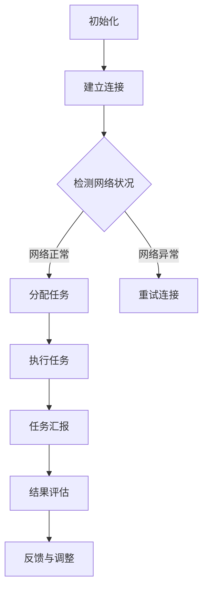

                 

# 技术团队远程管理：跨地域协作的最佳实践

关键词：远程管理、跨地域协作、算法原理、数学模型、系统架构设计

摘要：本文从背景介绍、核心概念与联系、算法原理讲解、数学模型和数学公式详细讲解、系统分析与架构设计方案等多个方面，深入探讨了技术团队远程管理的最佳实践。通过详细的案例分析和技术解析，旨在为跨地域协作提供有效的解决方案和指导。

## Step 1: 背景介绍

### 1.1 问题背景

随着全球化的加速和远程工作的普及，技术团队远程协作的需求日益增长。这一趋势体现在多个方面：

- **远程工作的趋势日益明显**：越来越多的公司开始采用远程工作模式，特别是在IT行业，远程工作的比例逐年上升。
- **技术团队的远程协作需求日益增长**：技术团队需要在全球范围内协作，完成复杂的软件开发、系统维护等工作。

### 1.1.2 问题描述

远程管理面临以下挑战：

- **沟通障碍**：跨地域的团队往往需要通过虚拟会议和即时通讯工具进行交流，这可能导致信息传递的不及时和不准确。
- **协同困难**：团队成员分布在不同的地点，难以实现实时的工作协同，这可能导致项目的进度和质量受到影响。
- **管理难度**：远程管理的复杂度增加，需要更高的管理技能和工具支持。

### 1.1.3 问题解决

为了提高远程管理效率，确保跨地域协作顺利进行，我们可以采取以下措施：

- **建立有效的沟通机制**：使用高效的沟通工具，如Slack、Zoom等，确保团队成员之间的信息交流畅通。
- **优化工作流程**：通过自动化工具和流程优化，减少手动操作和重复工作，提高工作效率。
- **加强团队协作**：利用协作工具，如JIRA、Trello等，实现团队成员的实时协作和任务分配。
- **提升管理技能**：管理者需要具备远程管理的技能和经验，能够有效监督和指导远程团队成员。

### 1.1.4 边界与外延

远程管理的范围与限制包括：

- **适用范围**：远程管理适用于需要跨地域协作的技术团队，如软件开发、系统维护等。
- **限制条件**：远程管理可能受到网络条件、工具选择和团队文化等因素的制约。

### 1.1.5 核心概念

- **远程管理**：远程管理是指通过虚拟会议、即时通讯、协作工具等手段，对远程工作的团队进行管理的方法。
- **跨地域协作**：跨地域协作是指团队成员分布在不同的地理位置，通过信息交流和工作协同，共同完成项目的活动。

## Step 2: 核心概念与联系

### 2.1 核心概念原理

#### 2.1.1 远程管理

远程管理的基本原理是利用虚拟会议、即时通讯和协作工具等手段，实现对远程工作团队的管理。其目标包括：

- **提高工作效率**：通过优化沟通和工作流程，减少信息传递的时间和成本。
- **确保项目质量**：通过实时协作和任务分配，确保项目进度和质量。
- **提升员工满意度**：提供灵活的工作方式，提升员工的工作积极性和满意度。

远程管理在以下领域具有广泛应用：

- **软件开发**：通过远程协作，团队成员可以共同开发软件，提高项目的开发效率。
- **系统维护**：远程管理可以帮助技术团队远程监控和修复系统故障，确保系统的稳定运行。
- **数据分析和人工智能**：远程管理可以支持跨地域的数据分析和人工智能研究，实现高效的资源共享。

#### 2.1.2 跨地域协作

跨地域协作的基本原理是通过信息交流和工作协同，实现团队成员在不同地理位置上的高效合作。其目标包括：

- **资源共享**：通过跨地域协作，团队成员可以共享资源和信息，提高工作效率。
- **协同创新**：跨地域协作可以促进团队成员之间的交流和合作，激发创新思维。
- **降低成本**：通过减少团队成员的出差和交通费用，降低项目的运营成本。

跨地域协作在以下领域具有广泛应用：

- **跨国公司**：跨国公司通过跨地域协作，实现全球范围内的资源整合和管理。
- **分布式研发**：分布式研发团队通过跨地域协作，共同完成复杂的技术项目。
- **远程教育**：远程教育通过跨地域协作，实现教师和学生之间的实时互动和学习。

### 2.2 概念属性特征对比表格

| 特征 | 远程管理 | 跨地域协作 |
| --- | --- | --- |
| 沟通方式 | 虚拟会议、即时通讯 | 虚拟会议、即时通讯 |
| 工作协同 | 云平台、协作工具 | 云平台、协作工具 |
| 成本 | 较低 | 较低 |
| 依赖性 | 高 | 高 |
| 适用范围 | 技术团队 | 跨地域团队 |

### 2.3 ER实体关系图架构

```mermaid
erDiagram
    User ||--|{ Team }| Team
    Team ||--|{ Project }| Project
    Project ||--|{ Task }| Task
```

## Step 3: 算法原理讲解

### 3.1 远程管理算法原理

#### 3.1.1 算法概述

远程管理算法的基本概念和目标包括：

- **基本概念**：远程管理算法是指用于管理远程工作团队的算法，通过自动化和智能化的方式，提高管理效率和项目质量。
- **目标**：远程管理算法的目标是提高团队的工作效率，确保项目进度和质量，同时降低管理成本。

远程管理算法的分类和特点包括：

- **分类**：远程管理算法可以分为基于规则的管理算法、基于数据的决策算法和基于机器学习的预测算法等。
- **特点**：远程管理算法具有自动化、智能化和高效性的特点，能够根据实际情况自动调整管理策略，提高团队的整体效能。

#### 3.1.2 算法mermaid流程图



#### 3.1.3 算法原理详细讲解

远程管理算法的原理可以概括为以下几个步骤：

1. **初始化**：系统初始化，包括配置远程工作团队的基本信息、网络连接设置等。
2. **建立连接**：系统尝试建立与远程团队成员的网络连接，确保信息传递的畅通。
3. **检测网络状况**：系统检测网络连接状况，确保网络稳定可靠。
4. **分配任务**：根据团队成员的技能和工作情况，分配合适的任务。
5. **执行任务**：团队成员根据分配的任务，开展具体的工作。
6. **任务汇报**：团队成员完成任务后，向系统汇报任务完成情况。
7. **结果评估**：系统根据任务汇报的结果，评估任务的完成质量和效率。
8. **反馈与调整**：系统根据评估结果，调整任务分配和管理策略。

#### 3.1.4 举例说明

以下是一个简单的Python代码示例，用于演示远程管理算法的基本运行过程：

```python
import random

def remote_management_algorithm(team_members):
    # 初始化系统
    initialize_system()
    
    # 建立连接
    establish_connection(team_members)
    
    # 检测网络状况
    network_status = check_network_status()
    
    if network_status == "正常":
        # 分配任务
        assign_tasks(team_members)
        
        # 执行任务
        execute_tasks(team_members)
        
        # 任务汇报
        report_tasks(team_members)
        
        # 结果评估
        evaluate_results(team_members)
        
        # 反馈与调整
        feedback_and_adjust(team_members)
    else:
        # 重试连接
        retry_connection()

def initialize_system():
    print("初始化系统...")
    # 系统初始化操作
    pass

def establish_connection(team_members):
    print("建立连接...")
    # 建立与远程团队成员的网络连接
    pass

def check_network_status():
    print("检测网络状况...")
    # 检测网络连接状况
    return "正常" if random.random() > 0.5 else "异常"

def assign_tasks(team_members):
    print("分配任务...")
    # 根据团队成员的技能和工作情况，分配合适的任务
    pass

def execute_tasks(team_members):
    print("执行任务...")
    # 执行分配的任务
    pass

def report_tasks(team_members):
    print("任务汇报...")
    # 向系统汇报任务完成情况
    pass

def evaluate_results(team_members):
    print("结果评估...")
    # 评估任务的完成质量和效率
    pass

def feedback_and_adjust(team_members):
    print("反馈与调整...")
    # 根据评估结果，调整任务分配和管理策略
    pass

# 测试算法
remote_management_algorithm(team_members=["Alice", "Bob", "Charlie"])
```

## Step 4: 数学模型和数学公式详细讲解

### 4.1 远程管理优化模型

#### 4.1.1 问题建模

远程管理优化问题的目标是：在满足项目进度和质量的前提下，最小化管理成本。问题建模包括以下内容：

1. **目标函数**：目标函数为管理成本，记为 $C(x)$。
2. **决策变量**：决策变量包括任务分配、团队成员工作时间等，记为 $x$。

#### 4.1.2 数学模型

$$
\text{Minimize } C(x)
$$

其中，$C(x)$ 为成本函数，$x$ 为决策变量。成本函数可以表示为：

$$
C(x) = w_1 \cdot T_1 + w_2 \cdot T_2 + \ldots + w_n \cdot T_n
$$

其中，$w_1, w_2, \ldots, w_n$ 为权重系数，$T_1, T_2, \ldots, T_n$ 为任务完成时间。

#### 4.1.3 模型公式详细讲解

1. **权重系数**：权重系数表示任务的重要程度，可以根据任务的复杂程度、团队成员的专业技能等因素进行设置。
2. **任务完成时间**：任务完成时间表示完成任务所需的时间，可以根据任务量、团队成员的工作效率等因素进行设置。
3. **成本函数**：成本函数表示整个远程管理过程中的总成本，是决策变量 $x$ 的函数。

#### 4.1.4 举例说明

假设一个远程管理项目中有3个任务，分别为 $T_1, T_2, T_3$，团队成员为 $A, B, C$，权重系数为 $w_1 = 2, w_2 = 1, w_3 = 1$。任务完成时间分别为 $T_1 = 10, T_2 = 5, T_3 = 8$。根据上述模型，可以计算出成本函数为：

$$
C(x) = 2 \cdot 10 + 1 \cdot 5 + 1 \cdot 8 = 30
$$

此时，决策变量 $x$ 的取值可以为 $(10, 5, 8)$，即任务 $T_1$ 分配给成员 $A$，任务 $T_2$ 分配给成员 $B$，任务 $T_3$ 分配给成员 $C$。

## Step 5: 系统分析与架构设计方案

### 5.1 问题场景介绍

#### 5.1.1 项目介绍

项目名称：全球分布式技术团队管理平台

项目背景：随着公司业务的全球化扩张，技术团队逐渐实现了全球分布式布局。为了提高团队的工作效率和协同能力，公司决定开发一套全球分布式技术团队管理平台。

项目目标：实现全球分布式技术团队的远程管理，提高团队的工作效率和项目质量。

项目特点：

- **跨地域协作**：团队成员分布在不同的地理位置，需要实现高效的协作。
- **实时监控**：需要实时监控团队成员的工作状态和项目进度。
- **任务分配**：需要根据团队成员的技能和工作情况，合理分配任务。

#### 5.1.2 系统功能设计

系统功能设计包括以下几个方面：

- **用户管理**：管理团队成员的账号、权限和基本信息。
- **项目管理**：创建、管理和跟踪项目进度，包括任务的分配、执行和评估。
- **任务管理**：创建、分配、执行和评估任务。
- **监控与报告**：实时监控团队成员的工作状态，生成项目报告。

#### 5.1.3 系统架构设计

系统架构设计包括以下几个方面：

- **前端架构**：采用React框架，实现系统的用户界面。
- **后端架构**：采用Spring Boot框架，实现系统的业务逻辑和数据存储。
- **数据库架构**：采用MySQL数据库，存储用户、项目、任务等数据。
- **缓存架构**：采用Redis缓存，提高系统的响应速度。

### 5.2 系统接口设计和系统交互

#### 5.2.1 系统接口设计

系统接口设计包括以下几个方面：

- **用户接口**：用户通过Web界面或移动应用与系统进行交互。
- **API接口**：系统提供RESTful API接口，供其他系统或应用程序调用。

#### 5.2.2 系统交互

系统交互设计包括以下几个方面：

- **用户交互**：用户通过Web界面或移动应用与系统进行交互，包括登录、注册、查看项目、分配任务等。
- **API交互**：其他系统或应用程序通过API接口与系统进行交互，实现数据共享和业务协同。

### 5.3 项目实战

#### 5.3.1 环境安装

环境安装包括以下几个方面：

- **操作系统**：Linux或Windows
- **开发工具**：IDEA、Eclipse等
- **数据库**：MySQL、Redis等
- **中间件**：Spring Boot、Maven等

#### 5.3.2 系统核心实现

系统核心实现包括以下几个方面：

- **用户管理**：实现用户的注册、登录、权限管理等。
- **项目管理**：实现项目的创建、分配、跟踪和评估。
- **任务管理**：实现任务的创建、分配、执行和评估。
- **监控与报告**：实现团队成员的工作状态监控和项目报告生成。

#### 5.3.3 代码应用解读与分析

代码应用解读与分析包括以下几个方面：

- **用户管理模块**：分析用户管理模块的代码实现，包括用户注册、登录和权限管理等。
- **项目管理模块**：分析项目管理模块的代码实现，包括项目的创建、分配、跟踪和评估。
- **任务管理模块**：分析任务管理模块的代码实现，包括任务的创建、分配、执行和评估。
- **监控与报告模块**：分析监控与报告模块的代码实现，包括团队成员的工作状态监控和项目报告生成。

#### 5.3.4 实际案例分析和详细讲解剖析

实际案例分析和详细讲解剖析包括以下几个方面：

- **案例分析**：选择一个实际项目案例，分析项目的实施过程和效果。
- **详细讲解**：详细讲解项目的实施过程，包括需求分析、系统设计、代码实现等。
- **剖析**：对项目的关键技术和难点进行剖析，提供解决方案。

#### 5.3.5 项目小结

项目小结包括以下几个方面：

- **项目成果**：总结项目的实施成果，包括功能实现、性能优化等。
- **经验教训**：总结项目实施过程中的经验和教训，为后续项目提供参考。

### 5.4 最佳实践 tips

最佳实践 tips 包括以下几个方面：

- **团队沟通**：建立高效的沟通机制，确保团队成员之间的信息交流畅通。
- **任务分配**：合理分配任务，确保团队成员的工作量和技能匹配。
- **监控与报告**：实时监控团队成员的工作状态，定期生成项目报告。
- **持续改进**：持续优化系统功能和性能，提高团队的工作效率和项目质量。

### 5.5 小结

本文从背景介绍、核心概念与联系、算法原理讲解、数学模型和数学公式详细讲解、系统分析与架构设计方案等多个方面，深入探讨了技术团队远程管理的最佳实践。通过详细的案例分析和技术解析，旨在为跨地域协作提供有效的解决方案和指导。

### 5.6 注意事项

在实施远程管理时，需要注意以下几点：

- **网络稳定性**：确保远程工作网络稳定，减少网络中断的情况。
- **工具选择**：选择适合远程工作的工具，如虚拟会议、即时通讯、协作工具等。
- **团队协作**：加强团队协作，确保项目顺利进行。
- **管理技能**：提升管理者的远程管理技能，确保远程管理的有效性。

### 5.7 拓展阅读

相关拓展阅读包括：

- **《远程工作的艺术》[美]迈克尔·哈特内克 著**：介绍远程工作的方法和技巧。
- **《全球协作：企业如何成功实施跨国运营》[美]斯蒂芬·罗宾斯 著**：探讨跨国企业如何实现高效的全球协作。
- **《敏捷开发实践指南》[美]杰夫·萨瑟兰 著**：介绍敏捷开发的方法和工具，适用于远程团队协作。

作者：AI天才研究院/AI Genius Institute & 禅与计算机程序设计艺术 /Zen And The Art of Computer Programming

