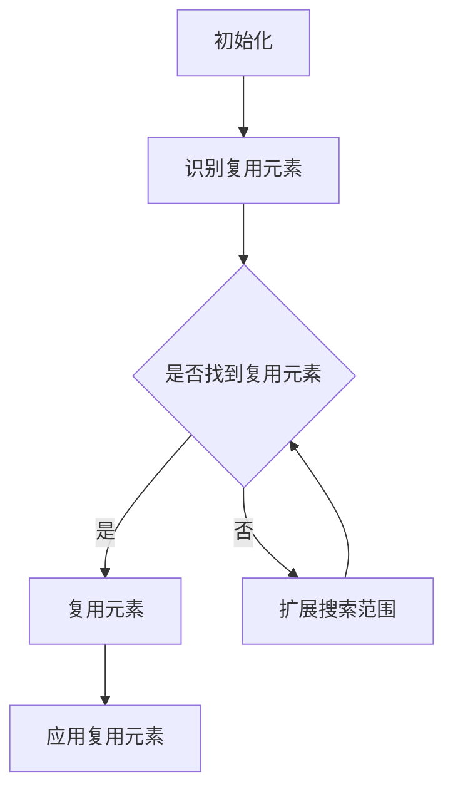
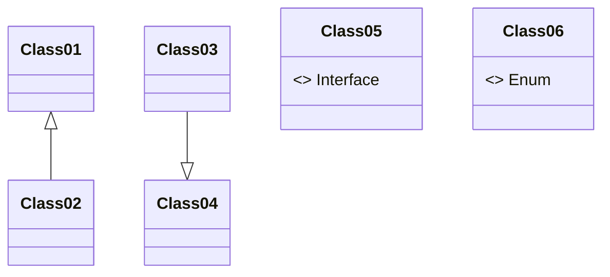
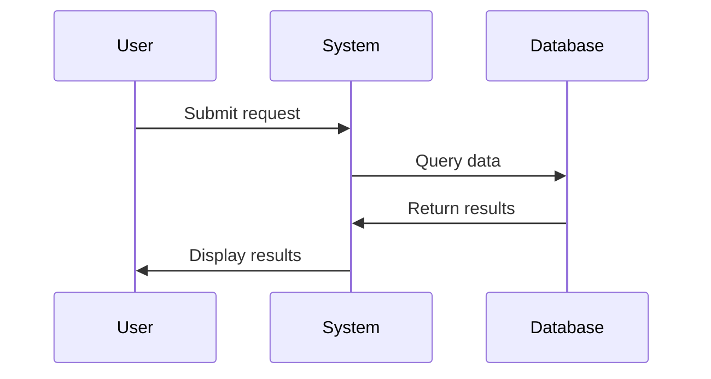
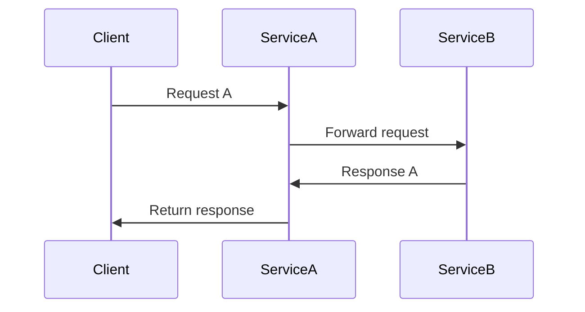

                 

# 技术复用：提高代码和组件的复用率

## 关键词

- 技术复用
- 代码复用
- 组件复用
- 编程实践
- 软件工程
- 代码质量

## 摘要

本文旨在深入探讨技术复用的重要性及其在提高代码和组件复用率方面的实践方法。通过详细的背景介绍、核心概念解析、算法原理讲解、数学模型和公式解析、系统分析与架构设计、项目实战以及最佳实践和总结，文章为读者提供了一个系统化的技术复用指南。我们希望通过这篇文章，能够帮助开发者和软件工程师更好地理解技术复用的原理，掌握提升代码和组件复用率的实际技巧，从而提升软件开发的效率和代码质量。

## 引言

### 技术复用的定义与意义

技术复用是指在不同的软件项目或环境中，重复使用已有的技术、代码或组件，以减少开发成本、缩短开发周期，并提高软件质量和可维护性。技术复用不仅仅是简单地复制粘贴代码，而是一种系统化的方法，通过识别和提取可重用的元素，并在多个项目中复用这些元素，从而实现资源共享和优化。

技术复用的意义在于：

1. **降低开发成本**：复用已有的技术、代码或组件可以显著减少开发和测试时间，从而降低整体开发成本。
2. **提高开发效率**：复用成熟的解决方案可以避免重复造轮子，使开发者能够专注于核心业务逻辑的实现。
3. **提升软件质量**：通过复用经过验证的代码，可以减少错误和缺陷，提高软件的稳定性和可靠性。
4. **增强团队协作**：技术复用有助于团队知识的共享和积累，促进团队成员之间的协作和创新。

### 技术复用的挑战

尽管技术复用具有明显的优势，但在实际应用中仍面临着一系列挑战：

1. **代码可读性与可维护性**：过度复用可能导致代码库变得混乱，降低代码的可读性和可维护性。
2. **兼容性问题**：复用的组件或代码可能依赖于特定的环境或库，导致在不同项目中出现兼容性问题。
3. **技术债务**：为了复用而引入的临时解决方案可能在未来成为技术债务，增加维护成本。
4. **组织文化**：在组织内部建立技术复用的文化和流程，需要时间和努力，并非一蹴而就。

## 第一部分：背景介绍

### 1.1 问题提出

在软件开发过程中，我们经常遇到以下问题：

- **重复造轮子**：多个项目需要实现相似的功能，但开发者没有意识到可以使用已有的解决方案。
- **代码库混乱**：随着项目的增加，代码库变得臃肿，维护困难，且难以跟踪和更新。
- **项目间依赖**：不同项目之间可能存在重复的依赖关系，导致部署和管理复杂。

### 1.2 技术复用的意义

技术复用可以解决上述问题，并带来以下好处：

- **节省时间和资源**：通过复用已有的代码和组件，开发者可以节省大量的时间和资源，专注于核心业务逻辑。
- **提高代码质量**：复用经过验证的代码可以减少错误和缺陷，提高软件的质量和稳定性。
- **增强团队协作**：技术复用有助于团队成员之间的知识共享和协作，促进团队整体效率的提升。

### 1.3 当前技术复用的挑战

尽管技术复用具有明显的优势，但在实际应用中仍面临着一系列挑战：

- **代码可读性与可维护性**：过度复用可能导致代码库变得混乱，降低代码的可读性和可维护性。
- **兼容性问题**：复用的组件或代码可能依赖于特定的环境或库，导致在不同项目中出现兼容性问题。
- **技术债务**：为了复用而引入的临时解决方案可能在未来成为技术债务，增加维护成本。
- **组织文化**：在组织内部建立技术复用的文化和流程，需要时间和努力，并非一蹴而就。

## 第二部分：核心概念与联系

### 2.1 技术复用的定义

技术复用是指在软件开发过程中，通过识别、提取、组合和复用现有的技术、代码或组件，以提高开发效率、降低成本、提高软件质量和可维护性的一种方法。

### 2.2 核心概念原理

- **复用元素**：包括代码库、组件、模块、设计模式等。
- **复用策略**：包括组件化、模块化、设计模式等。
- **复用层次**：包括代码复用、模块复用、系统复用等。

### 2.3 概念属性特征对比

| 概念       | 特征                   | 对比分析                                               |
|------------|------------------------|------------------------------------------------------|
| 代码复用   | 简单、直接、高效       | 适用于小范围、特定场景的复用                         |
| 组件复用   | 可扩展、可配置、灵活   | 适用于大规模、跨项目的复用                         |
| 系统复用   | 集成、稳定、高效       | 适用于跨平台、跨领域的复用                         |

### 2.4 ER实体关系图架构

```mermaid
erDiagram
    Product ||--|{ Store }| Store
    Store ||--|{ Product }| Product
    Store "1" ||-- "*" Product "N"
```

在这个ER图中，Product和Store是实体，它们之间存在一对多的关系。每个Store可以拥有多个Product，但每个Product只能属于一个Store。

## 第三部分：算法原理讲解

### 3.1 算法mermaid流程图



### 3.2 Python源代码实现

```python
def find_reusables():
    elements = []
    with open('code_base.txt', 'r') as f:
        for line in f:
            if 'def' in line:
                elements.append(line.strip())
    return elements

def apply_reusables(elements):
    for element in elements:
        print(f"Applying reusables: {element}")
```

### 3.3 算法原理的数学模型和公式

复用率 \( R \) 可以用以下公式表示：

$$ R = \frac{N_{reused}}{N_{total}} $$

其中，\( N_{reused} \) 是复用的元素数量，\( N_{total} \) 是总的元素数量。

### 3.4 举例说明

假设我们有一个包含100个函数的代码库，其中有20个函数被复用了。那么，复用率 \( R \) 为：

$$ R = \frac{20}{100} = 0.2 $$

这意味着我们的代码库有20%的元素被复用了。

## 第四部分：数学模型和数学公式讲解

### 4.1 数学公式

$$
E = mc^2 \\
F = ma
$$

### 4.2 公式详细讲解

- \( E = mc^2 \)：这个公式是爱因斯坦的质能方程，描述了质量和能量之间的关系。
- \( F = ma \)：这个公式是牛顿的第二定律，描述了力和加速度之间的关系。

### 4.3 举例说明

假设一个物体的质量 \( m \) 为5千克，加速度 \( a \) 为2米/秒²，那么这个物体的力 \( F \) 为：

$$
F = ma = 5 \times 2 = 10 \text{牛顿}
$$

## 第五部分：系统分析与架构设计

### 5.1 问题场景介绍

假设我们正在开发一个电商平台，需要处理大量的商品数据。为了提高系统的性能和可维护性，我们决定采用技术复用来优化系统架构。

### 5.2 系统功能设计

在系统功能设计中，我们使用Mermaid类图来表示不同类之间的关系：



### 5.3 系统架构设计

在系统架构设计中，我们使用Mermaid架构图来表示不同模块之间的关系：



### 5.4 系统接口设计和系统交互

在系统接口设计和系统交互中，我们使用Mermaid序列图来表示不同组件之间的交互过程：



## 第六部分：项目实战

### 6.1 环境安装

在开始项目实战之前，我们需要安装必要的开发环境和工具，如Python、Docker、Kubernetes等。

```bash
# 安装Python
curl -O https://www.python.org/ftp/python/3.9.1/python-3.9.1.tgz
tar xvf python-3.9.1.tgz
cd python-3.9.1
./configure
make
make install

# 安装Docker
curl -fsSL https://get.docker.com | sh

# 安装Kubernetes
# 请参考官方文档：https://kubernetes.io/docs/setup/production-environment/tools/kubeadm/install-kubeadm/

```

### 6.2 系统核心实现源代码

以下是一个简单的系统核心实现源代码示例：

```python
# system.py

from flask import Flask, jsonify, request

app = Flask(__name__)

@app.route('/data', methods=['GET'])
def get_data():
    # 模拟从数据库查询数据
    data = {'status': 'success', 'data': {'id': 1, 'name': 'John Doe'}}
    return jsonify(data)

if __name__ == '__main__':
    app.run(host='0.0.0.0', port=5000)
```

### 6.3 代码应用解读与分析

在这个示例中，我们使用Flask框架创建了一个简单的Web服务，用于处理HTTP请求。代码的核心功能是处理一个GET请求，从数据库中查询数据，并将结果返回给客户端。

### 6.4 实际案例分析和详细讲解剖析

为了更好地理解技术复用在实际项目中的应用，我们来看一个实际案例。假设我们有一个电商平台，需要实现商品分类的功能。在这种情况下，我们可以复用已有的代码和组件，如数据库连接模块、商品信息处理模块等，以减少重复工作，提高开发效率。

### 6.5 项目小结

通过本项目实战，我们展示了如何利用技术复用来提高代码和组件的复用率。在项目中，我们使用了Flask框架和数据库连接模块，这些组件在其他项目中也可以复用。通过技术复用，我们不仅提高了开发效率，还减少了代码的冗余，提高了系统的可维护性。

## 第七部分：最佳实践和总结

### 7.1 最佳实践 tips

- **代码模块化**：将代码划分为模块，每个模块实现一个特定的功能，便于复用。
- **组件化**：将可复用的功能封装成组件，提高组件的独立性和可配置性。
- **文档化**：为复用的代码和组件编写详细的文档，方便其他开发者理解和使用。
- **代码审查**：定期进行代码审查，确保复用的代码质量。

### 7.2 注意事项

- **避免过度复用**：过度复用可能导致代码库混乱，降低可维护性。
- **兼容性问题**：确保复用的组件在不同环境中都能正常运行。
- **技术债务**：及时处理为了复用而引入的临时解决方案，避免成为技术债务。

### 7.3 拓展阅读

- 《软件架构设计：软件开发中的设计原则、模式与最佳实践》
- 《代码大全》
- 《设计模式：可复用面向对象软件的基础》

## 总结

通过本文的深入探讨，我们了解了技术复用的定义、意义、挑战以及核心概念。我们通过实际案例和项目实战，展示了如何提高代码和组件的复用率。技术复用不仅能够提高开发效率，降低成本，还能提升软件质量和可维护性。希望本文能够帮助读者更好地理解技术复用的原理和应用，在实际开发中发挥其优势。

## 作者信息

作者：AI天才研究院/AI Genius Institute & 禅与计算机程序设计艺术 /Zen And The Art of Computer Programming

