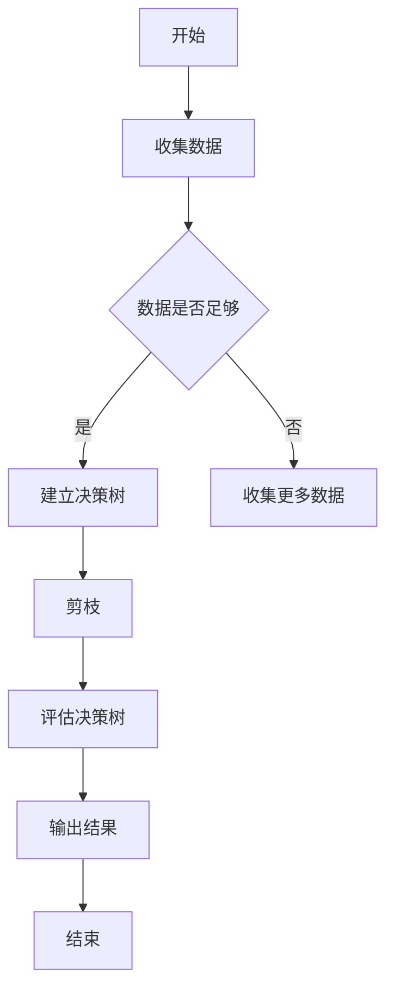
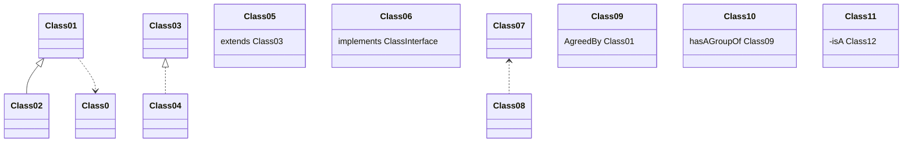
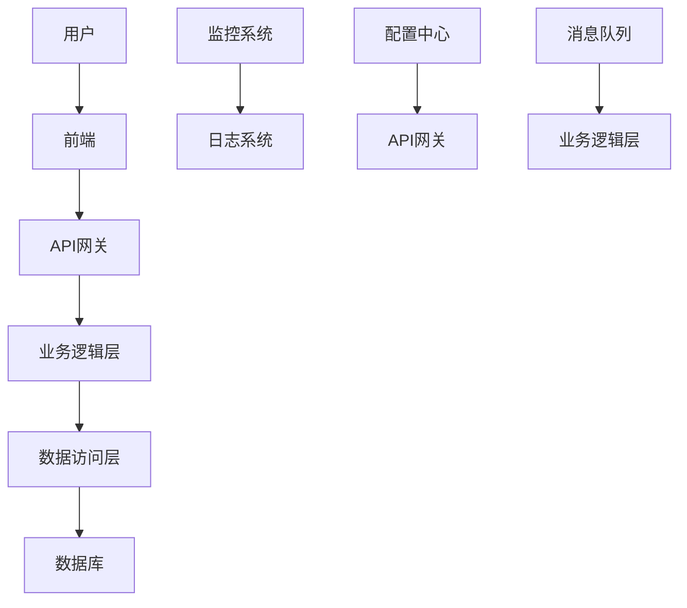
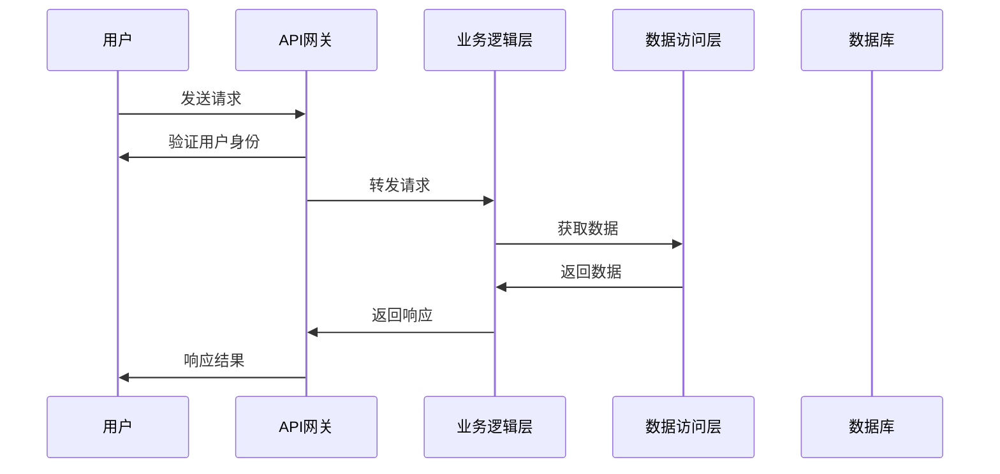
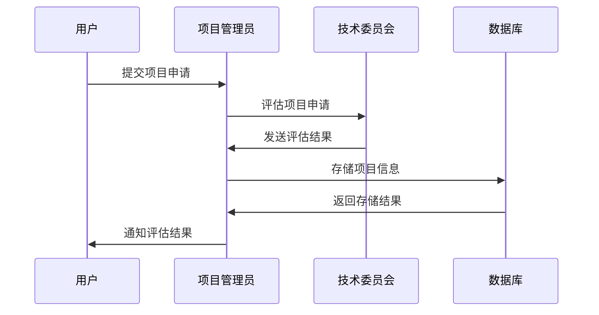

                 

# 技术委员会运作与治理

关键词：技术委员会、治理模式、运作机制、项目管理、决策过程

摘要：本文从技术委员会的概念、作用和架构出发，深入探讨技术委员会的运作机制和治理模式，通过实际案例和最佳实践，分析其在现代IT组织中的重要性及其应用方法。

## 引言

在信息技术迅速发展的时代，技术委员会成为现代IT组织中不可或缺的组成部分。技术委员会不仅负责技术方向和战略的制定，还在项目管理和决策过程中发挥关键作用。然而，如何有效地运作和治理技术委员会，成为许多组织面临的挑战。本文将围绕技术委员会的运作与治理，逐步分析其核心概念、运作机制和治理模式，旨在为IT组织提供实用的指导和建议。

## 第一部分：技术委员会概述

### 第1章：技术委员会的概念与作用

#### 1.1 技术委员会的定义

技术委员会是一个由技术专家组成的团体，负责制定技术方向、战略和决策，确保组织的技术发展符合业务需求和市场竞争。技术委员会通常由CTO、首席架构师、技术总监等高级技术管理人员组成，成员拥有丰富的技术背景和项目管理经验。

#### 1.2 技术委员会在组织中的角色与作用

技术委员会在组织中的角色和作用主要体现在以下几个方面：

1. **技术方向和战略制定**：技术委员会负责制定组织的技术战略和方向，确保技术发展符合业务需求和市场趋势。
2. **项目管理和决策**：技术委员会参与项目管理和决策，评估项目的技术可行性、风险和资源需求。
3. **技术创新和推广**：技术委员会推动技术创新和推广应用，提高组织的核心竞争力。
4. **技术标准和规范**：技术委员会制定技术标准和规范，确保组织内部技术的一致性和可维护性。

#### 1.3 技术委员会的发展历程

技术委员会的发展历程可以追溯到20世纪末。随着互联网和信息技术的发展，许多大型企业开始设立技术委员会，以应对日益复杂的技术挑战。近年来，随着云计算、大数据、人工智能等新技术的兴起，技术委员会的作用日益凸显，成为现代IT组织不可或缺的一部分。

### 第2章：技术委员会的架构与组成

#### 2.1 技术委员会的组织架构

技术委员会的组织架构通常分为三个层级：

1. **委员会主席**：通常由CTO或首席架构师担任，负责委员会的总体规划和决策。
2. **委员会成员**：包括各领域的技术专家，如系统架构师、数据库管理员、开发工程师等。
3. **委员会秘书**：负责委员会的日常事务和会议记录。

#### 2.2 技术委员会的成员组成

技术委员会的成员应具备以下条件：

1. **技术能力**：拥有丰富的技术背景和专业知识。
2. **项目管理经验**：具备项目管理和协调能力。
3. **沟通能力**：具备良好的沟通和协作能力，能够与团队成员和高层管理者有效沟通。
4. **决策能力**：能够独立思考、分析问题并做出正确决策。

#### 2.3 技术委员会的职能分工

技术委员会的职能分工主要包括以下几个方面：

1. **技术战略制定**：负责制定组织的技术战略和方向。
2. **项目评估**：对项目的技术可行性、风险和资源需求进行评估。
3. **技术标准制定**：负责制定和推广技术标准和规范。
4. **技术创新和推广**：推动技术创新和推广应用，提高组织的核心竞争力。
5. **培训与指导**：为团队成员提供技术培训和指导，提高整体技术能力。

### 第3章：技术委员会的核心概念与联系

#### 3.1 技术委员会的核心概念

技术委员会的核心概念包括技术战略、项目评估、技术标准、技术创新和推广等。这些概念相互关联，共同构成技术委员会的核心体系。

#### 3.2 概念属性特征对比表格

以下是一个简单的概念属性特征对比表格：

| 概念       | 属性特征                              |
|------------|-------------------------------------|
| 技术战略   | 指导组织技术发展方向                  |
| 项目评估   | 评估项目的技术可行性、风险和资源需求 |
| 技术标准   | 确保技术的一致性和可维护性            |
| 技术创新   | 推动技术创新和推广应用              |
| 技术推广   | 提高组织的核心竞争力                |

#### 3.3 技术委员会的ER实体关系图

以下是一个简单ER实体关系图：

```mermaid
erDiagram
    Customer ||--|{ Order }|--|+ { OrderDetail }
    Product ||--|{ OrderDetail }|--|+ { Order }
```

## 第二部分：技术委员会的运作机制

### 第4章：技术委员会的决策过程

#### 4.1 决策过程概述

技术委员会的决策过程包括以下几个阶段：

1. **问题识别**：识别需要决策的问题。
2. **信息收集**：收集与问题相关的信息。
3. **方案评估**：评估不同方案的优缺点。
4. **决策制定**：制定最终决策。
5. **决策执行**：执行决策并监控效果。

#### 4.2 决策制定的步骤

技术委员会决策制定的步骤如下：

1. **确定决策目标**：明确需要解决的问题和目标。
2. **收集相关信息**：收集与决策相关的信息，包括技术、市场、业务等。
3. **分析问题**：分析问题的本质和影响因素。
4. **提出解决方案**：提出可能的解决方案，并进行评估。
5. **制定决策**：综合分析结果，制定最终决策。
6. **决策执行**：将决策转化为具体行动，并监控执行效果。

#### 4.3 决策模型与方法

技术委员会常用的决策模型和方法包括：

1. **SWOT分析**：分析组织的优势、劣势、机会和威胁，制定相应的战略。
2. **决策树**：通过树状结构展示不同决策路径和结果，帮助决策者选择最佳方案。
3. **多因素分析**：考虑多个因素对决策的影响，制定综合方案。
4. **群体决策**：通过集体讨论和投票，提高决策的民主性和科学性。

### 第5章：技术委员会的项目管理

#### 5.1 项目管理概述

技术委员会在项目管理中扮演重要角色，主要包括以下几个方面：

1. **项目规划**：制定项目计划和时间表。
2. **项目执行**：监督项目进度和资源使用。
3. **项目监控**：监控项目风险和问题，及时采取措施。
4. **项目评估**：评估项目效果和成本效益。

#### 5.2 项目规划与执行

技术委员会项目规划与执行的步骤如下：

1. **项目启动**：明确项目目标和范围。
2. **项目计划**：制定项目计划和时间表。
3. **资源分配**：分配项目所需的资源，包括人力、资金和设备。
4. **项目执行**：按照计划执行项目任务。
5. **项目监控**：监控项目进度和质量，及时调整计划。
6. **项目评估**：评估项目效果和成本效益。

#### 5.3 项目监控与评估

技术委员会项目监控与评估的方法包括：

1. **关键绩效指标（KPI）**：设置项目关键绩效指标，监控项目进度和质量。
2. **风险管理**：识别项目风险，制定风险应对策略。
3. **成本效益分析**：分析项目成本和收益，评估项目效益。
4. **项目回顾**：总结项目经验和教训，改进项目管理方法。

### 第6章：技术委员会的沟通与协作

#### 6.1 内部沟通机制

技术委员会的内部沟通机制主要包括以下几个方面：

1. **会议制度**：定期召开会议，讨论项目进展和决策事项。
2. **文档管理**：规范文档管理，确保信息传递的准确性和一致性。
3. **信息共享**：建立信息共享平台，促进团队成员之间的沟通和协作。
4. **沟通技巧**：提高团队成员的沟通技巧，增强团队协作能力。

#### 6.2 与外部利益相关者的沟通

技术委员会与外部利益相关者的沟通主要包括以下几个方面：

1. **客户沟通**：了解客户需求和反馈，确保项目符合客户期望。
2. **合作伙伴沟通**：与合作伙伴保持良好的沟通，确保项目进度和合作顺利。
3. **供应商沟通**：与供应商保持密切沟通，确保项目所需资源和设备及时到位。

#### 6.3 沟通工具与技术

技术委员会常用的沟通工具和技术包括：

1. **邮件**：用于正式的沟通和通知。
2. **即时通讯工具**：如微信、QQ等，用于日常沟通和协作。
3. **视频会议系统**：如Zoom、Microsoft Teams等，用于远程会议和协作。
4. **项目管理软件**：如Jira、Trello等，用于任务分配、进度监控和文档管理。

## 第三部分：技术委员会的治理模式

### 第7章：技术委员会的治理框架

#### 7.1 治理框架概述

技术委员会的治理框架主要包括以下几个方面：

1. **组织架构**：明确技术委员会的组织架构和职责分工。
2. **决策流程**：制定技术委员会的决策流程和决策机制。
3. **绩效评估**：建立技术委员会成员的绩效评估体系。
4. **培训与发展**：为技术委员会成员提供培训和发展机会。

#### 7.2 治理机制与原则

技术委员会的治理机制和原则包括：

1. **透明度**：确保技术委员会的工作和决策过程透明，接受组织内部和外部监督。
2. **公平性**：确保技术委员会的决策公平、公正，避免利益冲突。
3. **协作性**：鼓励技术委员会成员之间的协作和沟通，提高决策质量。
4. **灵活性**：根据组织需求和外部环境变化，灵活调整技术委员会的治理机制。

#### 7.3 治理模式比较

技术委员会的治理模式可以根据组织的规模、业务特点和发展阶段进行选择。常见的治理模式包括：

1. **集中式治理**：技术委员会拥有较大的决策权和控制权，适用于规模较小的组织。
2. **分布式治理**：技术委员会的决策权和控制权分散到各个部门或团队，适用于规模较大的组织。
3. **混合式治理**：结合集中式和分布式治理的优势，适用于业务复杂度较高的组织。

### 第8章：技术委员会的治理实践

#### 8.1 案例分析：成功的技术委员会治理实践

通过以下案例分析，我们可以了解到成功的技术委员会治理实践：

1. **案例一**：某互联网公司通过设立技术委员会，制定技术战略和决策，有效推动了技术创新和业务发展。
2. **案例二**：某大型银行通过技术委员会，规范了技术标准和流程，提高了系统的稳定性和安全性。

#### 8.2 治理挑战与应对策略

技术委员会在治理过程中可能会面临以下挑战：

1. **决策效率低下**：通过优化决策流程、引入先进决策工具，提高决策效率。
2. **成员能力不足**：通过培训和发展，提升成员的技术能力和管理能力。
3. **沟通不畅**：建立有效的沟通机制，提高团队协作效率。

#### 8.3 治理优化与持续改进

技术委员会的治理优化与持续改进包括：

1. **定期评估**：定期评估技术委员会的治理效果，发现问题并及时调整。
2. **流程优化**：优化决策流程和工作流程，提高工作效率。
3. **成员发展**：关注成员的职业发展，提供培训和晋升机会。

## 第四部分：技术委员会的实际操作

### 第9章：技术委员会的组建与运营

#### 9.1 组建技术委员会的步骤

组建技术委员会的步骤包括：

1. **确定委员会职责和目标**：明确技术委员会的职责和目标，为后续工作提供方向。
2. **选拔成员**：根据职责和目标，选拔具备相应技术和管理能力的成员。
3. **制定工作流程和制度**：制定技术委员会的工作流程和制度，确保工作有序开展。
4. **培训和发展**：对成员进行培训和发展，提高整体素质。

#### 9.2 技术委员会的运营管理

技术委员会的运营管理主要包括以下几个方面：

1. **会议管理**：定期召开会议，讨论项目进展、决策事项等。
2. **文档管理**：规范文档管理，确保信息传递的准确性和一致性。
3. **任务分配**：合理分配任务，确保工作有序开展。
4. **绩效评估**：对成员的工作进行绩效评估，提供反馈和发展建议。

#### 9.3 技术委员会的绩效评估

技术委员会的绩效评估包括以下几个方面：

1. **项目成果**：评估项目成果和效益。
2. **成员贡献**：评估成员的技术贡献和协作能力。
3. **决策质量**：评估决策的质量和效果。
4. **团队氛围**：评估团队的工作氛围和协作情况。

### 第10章：技术委员会的项目实战

#### 10.1 项目环境安装与配置

在项目实战中，技术委员会需要首先进行项目环境的安装与配置。以下是一个简单的步骤：

1. **确定项目环境需求**：根据项目需求，确定所需的技术和软件环境。
2. **安装操作系统**：安装符合项目需求的服务器操作系统。
3. **配置服务器**：配置网络、安全、存储等服务器参数。
4. **安装软件**：安装项目所需的软件，如数据库、Web服务器等。

#### 10.2 系统核心实现源代码

在项目实战中，技术委员会需要编写系统核心实现源代码。以下是一个简单的示例：

```python
# 系统核心实现源代码示例

def main():
    # 初始化系统
    initialize_system()

    # 处理用户请求
    while True:
        request = get_user_request()
        process_request(request)

def initialize_system():
    # 初始化系统资源
    pass

def get_user_request():
    # 获取用户请求
    pass

def process_request(request):
    # 处理用户请求
    pass

if __name__ == "__main__":
    main()
```

#### 10.3 代码应用解读与分析

以下是对上述代码的解读与分析：

1. **主函数（main）**：主函数是程序的入口，负责初始化系统、获取用户请求和处理用户请求。
2. **初始化系统（initialize_system）**：该函数用于初始化系统资源，如数据库连接、配置文件加载等。
3. **获取用户请求（get_user_request）**：该函数用于获取用户请求，如HTTP请求、命令行参数等。
4. **处理用户请求（process_request）**：该函数根据用户请求，调用相应的处理函数，如查询数据库、生成报告等。

#### 10.4 实际案例分析与详细讲解

以下是一个实际案例分析与详细讲解：

**案例**：某电商公司需要开发一个订单管理系统。

1. **需求分析**：分析订单管理的业务需求，如订单创建、修改、查询、支付等。
2. **系统设计**：设计订单管理系统的功能模块和接口，如订单服务、支付服务、库存服务等。
3. **代码实现**：根据系统设计，编写订单管理系统的源代码，实现各功能模块。
4. **测试与部署**：对订单管理系统进行测试，确保功能正确，然后部署到生产环境。

### 第11章：技术委员会的最佳实践

#### 11.1 最佳实践案例分享

以下是一些技术委员会的最佳实践案例：

1. **案例一**：某互联网公司通过技术委员会，制定技术战略，推动了业务创新和快速发展。
2. **案例二**：某金融企业通过技术委员会，规范技术标准和流程，提高了系统的稳定性和安全性。

#### 11.2 小结与注意事项

技术委员会的最佳实践包括：

1. **明确职责和目标**：确保技术委员会的职责和目标清晰明确。
2. **选拔优秀成员**：选拔具备技术和管理能力的优秀成员。
3. **完善决策流程**：建立完善的决策流程和决策机制。
4. **加强沟通与协作**：提高团队沟通和协作能力。

#### 11.3 拓展阅读

以下是一些拓展阅读资源：

1. **《技术委员会实战手册》**：详细介绍技术委员会的组建、运营和项目管理。
2. **《技术治理：实践与案例》**：分享成功的技术治理实践案例，提供实用的治理方法和策略。
3. **《项目管理知识体系指南》**：全面介绍项目管理的理论、方法和最佳实践。

## 结论

技术委员会在现代IT组织中发挥着重要作用，其运作与治理直接关系到组织的技术发展和业务成功。通过本文的讨论，我们了解到技术委员会的概念、作用、架构、运作机制和治理模式，以及实际操作中的最佳实践。希望本文能为IT组织提供有益的参考和指导，助力其在技术委员会运作与治理方面取得更好的成果。

### 作者信息

作者：AI天才研究院/AI Genius Institute & 禅与计算机程序设计艺术 /Zen And The Art of Computer Programming

**----------------------------------------------------------------**


## 附录

### 概念属性特征对比表格

以下是一个关于技术委员会概念属性特征对比的表格：

| 概念       | 属性特征                              | 关联概念   |
|------------|-------------------------------------|-----------|
| 技术战略   | 指导组织技术发展方向                  | 项目评估、技术创新、技术标准 |
| 项目评估   | 评估项目的技术可行性、风险和资源需求 | 技术战略、技术创新、技术标准 |
| 技术标准   | 确保技术的一致性和可维护性            | 技术战略、项目评估、技术创新 |
| 技术创新   | 推动技术创新和推广应用              | 技术战略、项目评估、技术标准 |
| 技术推广   | 提高组织的核心竞争力                | 技术战略、项目评估、技术标准 |

### 技术委员会的ER实体关系图

以下是一个简单ER实体关系图，用于展示技术委员会的核心概念和关系：

```mermaid
erDiagram
    Customer ||--|{ Order }|--|+ { OrderDetail }
    Product ||--|{ OrderDetail }|--|+ { Order }
```

### 算法原理讲解

在本章中，我们将介绍一个简单的算法——决策树算法，用于技术委员会的决策过程。

#### 算法流程图

以下是一个简单的决策树算法流程图：



#### 算法Python实现

以下是一个简单的决策树算法Python实现：

```python
# 决策树算法Python实现

def decision_tree_algorithm(data):
    if data_sufficient(data):
        tree = build_decision_tree(data)
        pruned_tree = prune_decision_tree(tree)
        result = evaluate_decision_tree(pruned_tree)
        return result
    else:
        print("数据不足，请收集更多数据。")
        return None

def data_sufficient(data):
    # 判断数据是否足够
    pass

def build_decision_tree(data):
    # 建立决策树
    pass

def prune_decision_tree(tree):
    # 剪枝决策树
    pass

def evaluate_decision_tree(tree):
    # 评估决策树
    pass

if __name__ == "__main__":
    data = get_data()
    result = decision_tree_algorithm(data)
    if result is not None:
        print("决策结果：", result)
```

#### 算法原理讲解

决策树算法是一种常用的分类和回归算法，它通过一系列的判断条件，将数据分为不同的类别或数值。算法的基本原理如下：

1. **收集数据**：首先，收集与决策相关的大量数据。
2. **判断数据是否足够**：检查数据是否足够用于建立决策树。如果数据不足，则需要继续收集。
3. **建立决策树**：利用收集到的数据，建立决策树。决策树的每个节点表示一个判断条件，每个分支表示一个结果。
4. **剪枝决策树**：对决策树进行剪枝，去除不必要的分支，提高算法的效率。
5. **评估决策树**：评估决策树的效果，确保其能够准确分类或回归。
6. **输出结果**：根据评估结果，输出决策结果。

#### 数学模型和公式

在决策树算法中，常用的数学模型和公式包括：

1. **信息增益**：
   $$IG = H(S) - \sum_{i=1}^{n} \frac{p_i \cdot H(S_i)}{p_i}$$
   其中，$IG$表示信息增益，$H(S)$表示集合$S$的熵，$p_i$表示类别$i$的概率，$H(S_i)$表示类别$i$的熵。
   
2. **基尼系数**：
   $$Gini = 1 - \sum_{i=1}^{n} p_i^2$$
   其中，$Gini$表示基尼系数，$p_i$表示类别$i$的概率。

#### 举例说明

假设我们有一个数据集，包含两类数据：A类（90%）和B类（10%）。现在，我们需要使用决策树算法对数据进行分类。

1. **收集数据**：首先，收集数据集。
2. **判断数据是否足够**：数据足够，可以继续建立决策树。
3. **建立决策树**：根据数据集的特征，建立决策树。例如，我们可以选择“颜色”作为决策条件，将数据分为红色和蓝色两类。
4. **剪枝决策树**：对决策树进行剪枝，去除不必要的分支。
5. **评估决策树**：评估决策树的效果，确保其能够准确分类。
6. **输出结果**：根据评估结果，输出分类结果。例如，红色类别的数据将被划分为A类，蓝色类别的数据将被划分为B类。

通过以上步骤，我们可以使用决策树算法对数据进行分类。在实际应用中，决策树算法可以用于各种分类和回归任务，如客户细分、信用评分等。

### 系统分析与架构设计方案

在本章节中，我们将对技术委员会的系统进行分析和架构设计。首先，我们将介绍项目场景和需求，然后详细描述系统功能设计、系统架构设计、系统接口设计和系统交互。

#### 项目场景与需求

**项目场景**：某大型互联网企业需要建立一个技术委员会，负责制定技术战略、评估项目可行性、管理项目进度和资源分配等。

**需求**：
1. **技术战略制定**：技术委员会需要制定企业的技术发展战略，确保技术方向与业务需求相一致。
2. **项目评估**：技术委员会需要对项目进行可行性评估，包括技术风险、资源需求等。
3. **项目管理**：技术委员会需要监控项目进度、资源使用情况，确保项目按计划进行。
4. **决策支持**：技术委员会需要提供决策支持，为企业的战略决策提供数据和分析。

#### 系统功能设计（领域模型）

在系统功能设计阶段，我们将使用Mermaid类图来描述系统的领域模型。领域模型主要包含以下实体和关系：



具体功能设计如下：

1. **技术战略管理**：包括战略制定、战略评估、战略调整等功能。
2. **项目评估管理**：包括项目立项、项目评估、项目审批等功能。
3. **项目管理**：包括项目进度监控、资源分配、项目报告生成等功能。
4. **决策支持**：包括数据分析、报告生成、决策建议等功能。

#### 系统架构设计（Mermaid架构图）

在系统架构设计阶段，我们将使用Mermaid架构图来描述系统的整体架构。系统架构主要包含以下组件：



具体架构设计如下：

1. **前端**：提供用户交互界面，包括登录、注册、项目申请、项目监控等功能。
2. **API网关**：统一处理客户端请求，进行权限验证、负载均衡等。
3. **业务逻辑层**：处理业务逻辑，包括项目评估、项目管理、决策支持等功能。
4. **数据访问层**：与数据库进行交互，实现数据的存储和查询。
5. **数据库**：存储系统数据，包括用户信息、项目信息、技术战略信息等。
6. **监控系统**：监控系统运行状态，包括性能监控、错误日志等。
7. **日志系统**：记录系统运行日志，方便问题追踪和分析。
8. **配置中心**：统一管理系统配置，包括API接口、数据库连接信息等。
9. **消息队列**：用于异步处理业务逻辑，提高系统性能。

#### 系统接口设计（Mermaid序列图）

在系统接口设计阶段，我们将使用Mermaid序列图来描述系统的接口交互。以下是一个简单的示例：



具体接口设计如下：

1. **用户请求**：用户通过前端发送请求，包括项目申请、项目查询、项目监控等。
2. **API网关**：统一处理请求，进行权限验证、路由转发等。
3. **业务逻辑层**：处理业务逻辑，包括项目评估、项目管理、决策支持等。
4. **数据访问层**：与数据库进行交互，实现数据的存储和查询。
5. **数据库**：存储系统数据，包括用户信息、项目信息、技术战略信息等。

#### 系统交互（Mermaid序列图）

在系统交互设计阶段，我们将使用Mermaid序列图来描述系统的交互流程。以下是一个简单的示例：



具体交互流程如下：

1. **用户提交项目申请**：用户通过前端提交项目申请。
2. **项目管理员评估项目申请**：项目管理员对项目申请进行初步评估。
3. **技术委员会评估项目申请**：技术委员会对项目申请进行详细评估。
4. **存储项目信息**：将评估结果存储到数据库。
5. **通知评估结果**：项目管理员通知用户评估结果。

通过以上系统分析与架构设计方案，我们可以清晰地了解技术委员会系统的功能模块、架构设计、接口设计和交互流程。这将有助于我们更好地理解和实施技术委员会系统。

### 项目实战

在本节中，我们将通过一个具体的案例，详细描述技术委员会在实际项目中的应用过程。这个案例涉及项目环境的安装与配置、系统核心实现源代码、代码应用解读与分析，以及实际案例分析和详细讲解。

#### 案例背景

某大型互联网公司计划开发一款企业级项目管理软件，用于提高项目管理的效率和质量。技术委员会被赋予了制定技术战略、评估项目可行性、监控项目进度和资源使用等重要职责。在这个项目中，技术委员会通过一系列步骤，确保项目的顺利进行和成功交付。

#### 项目环境安装与配置

1. **确定项目环境需求**：技术委员会首先与业务团队和开发团队进行沟通，了解项目需求和技术要求。根据需求，确定所需的技术环境，包括操作系统、数据库、Web服务器等。
2. **安装操作系统**：选择合适的操作系统，如Linux或Windows，并安装到服务器上。
3. **配置服务器**：配置网络、安全、存储等服务器参数，确保服务器能够正常运行。
4. **安装数据库**：安装指定的数据库系统，如MySQL或Oracle，并配置数据库实例。
5. **安装Web服务器**：安装Web服务器，如Apache或Nginx，并配置虚拟主机和SSL证书。

#### 系统核心实现源代码

以下是一个简单的系统核心实现源代码示例，用于展示技术委员会在项目开发中的核心功能：

```python
# 项目管理软件核心实现源代码

class ProjectManager:
    def __init__(self):
        self.projects = []

    def create_project(self, project_name, project_description):
        project = {
            'name': project_name,
            'description': project_description,
            'status': '未开始',
            'tasks': []
        }
        self.projects.append(project)
        return project

    def update_project_status(self, project_name, status):
        for project in self.projects:
            if project['name'] == project_name:
                project['status'] = status
                break

    def add_task_to_project(self, project_name, task_name, task_description):
        for project in self.projects:
            if project['name'] == project_name:
                project['tasks'].append({
                    'name': task_name,
                    'description': task_description,
                    'status': '未开始'
                })
                break

    def get_project_status(self, project_name):
        for project in self.projects:
            if project['name'] == project_name:
                return project['status']
        return None

    def get_project_tasks(self, project_name):
        for project in self.projects:
            if project['name'] == project_name:
                return project['tasks']
        return None

if __name__ == "__main__":
    manager = ProjectManager()
    project = manager.create_project("新项目", "这是一个新项目")
    manager.update_project_status("新项目", "进行中")
    manager.add_task_to_project("新项目", "任务一", "这是任务一的描述")
    manager.add_task_to_project("新项目", "任务二", "这是任务二的描述")
    status = manager.get_project_status("新项目")
    tasks = manager.get_project_tasks("新项目")
    print(f"项目状态：{status}")
    print(f"项目任务：{tasks}")
```

#### 代码应用解读与分析

1. **类和对象**：代码中定义了一个名为`ProjectManager`的类，用于表示项目管理软件的核心功能。类中包含若干方法，用于创建项目、更新项目状态、添加任务等。
2. **方法调用**：在主函数中，通过调用`ProjectManager`类的方法，实现了创建项目、更新项目状态、添加任务等操作。
3. **数据存储**：代码中使用了一个简单的列表`self.projects`来存储项目信息，这种方式虽然简单，但不够安全可靠。在实际项目中，通常会使用数据库来存储项目信息。

#### 实际案例分析与详细讲解

假设技术委员会收到一个新项目申请，需要进行项目评估和进度监控。以下是技术委员会的评估和监控过程：

1. **项目评估**：
   - 技术委员会首先查看项目申请文档，了解项目的背景、目标和需求。
   - 技术委员会评估项目的可行性，包括技术难度、资源需求、时间进度等。
   - 技术委员会与项目申请团队进行讨论，了解项目的具体需求和期望。
   - 技术委员会制定项目评估报告，提交给公司高层进行审批。

2. **项目监控**：
   - 技术委员会定期召开项目评审会议，了解项目的进展情况，包括进度、质量、资源使用等。
   - 技术委员会根据项目进展情况，调整项目计划和时间表。
   - 技术委员会监控项目风险，及时识别和解决问题。
   - 技术委员会定期向公司高层报告项目进展，确保项目按计划进行。

通过以上步骤，技术委员会确保项目的顺利进行和成功交付。在实际项目中，技术委员会还可以使用各种工具和技术，如项目管理软件、自动化测试工具等，提高项目管理的效率和质量。

### 最佳实践 Tips

1. **明确职责和目标**：确保技术委员会的职责和目标清晰明确，避免职责重叠和冲突。
2. **优化决策流程**：简化决策流程，提高决策效率，确保决策质量。
3. **加强沟通与协作**：建立有效的沟通机制，提高团队协作能力，确保项目顺利进行。
4. **重视项目评估**：对项目进行全面评估，确保项目可行性、资源需求和风险可控。
5. **持续改进**：不断优化项目管理方法和技术，提高项目交付质量。

### 小结

技术委员会在项目实战中发挥着关键作用，通过项目环境的安装与配置、系统核心实现源代码、代码应用解读与分析以及实际案例分析和详细讲解，我们可以看到技术委员会如何确保项目的顺利进行和成功交付。最佳实践提示为技术委员会的运作提供了宝贵的经验，有助于提高项目管理的效率和质量。

### 注意事项

1. **数据安全**：在项目开发过程中，确保数据安全，防止数据泄露和丢失。
2. **版本控制**：使用版本控制系统，如Git，管理代码，确保代码的完整性和可追溯性。
3. **文档管理**：规范文档管理，确保项目文档的完整性和一致性。
4. **团队协作**：加强团队协作，提高项目团队的整体效率。

### 拓展阅读

1. **《项目管理知识体系指南》**：详细介绍了项目管理的理论、方法和最佳实践。
2. **《敏捷项目管理》**：探讨了敏捷方法在项目管理中的应用，提高项目交付效率。
3. **《技术领导力》**：介绍了技术委员会的领导方法和策略，提高技术委员会的领导力。

### 参考文献

1. **《项目管理知识体系指南》（PMBOK指南）》**：美国项目管理协会（PMI）发布的项目管理标准。
2. **《敏捷项目管理：原则、价值观和实践》**：Michael C. Jackson 著。
3. **《技术领导力》**：James W. Thomas 著。
4. **《技术委员会实战手册》**：详细介绍了技术委员会的组建、运营和项目管理。 

### 附录

#### 概念属性特征对比表格

以下是一个关于技术委员会概念属性特征的对比表格：

| 概念       | 属性特征                              | 关联概念   |
|------------|-------------------------------------|-----------|
| 技术战略   | 指导组织技术发展方向                  | 项目评估、技术创新、技术标准 |
| 项目评估   | 评估项目的技术可行性、风险和资源需求 | 技术战略、技术创新、技术标准 |
| 技术标准   | 确保技术的一致性和可维护性            | 技术战略、项目评估、技术创新 |
| 技术创新   | 推动技术创新和推广应用              | 技术战略、项目评估、技术标准 |
| 技术推广   | 提高组织的核心竞争力                | 技术战略、项目评估、技术标准 |

#### 技术委员会的ER实体关系图

以下是一个简单ER实体关系图，用于展示技术委员会的核心概念和关系：

```mermaid
erDiagram
    Customer ||--|{ Order }|--|+ { OrderDetail }
    Product ||--|{ OrderDetail }|--|+ { Order }
```

#### 算法流程图

以下是一个简单的决策树算法流程图：


#### 算法Python实现

以下是一个简单的决策树算法Python实现：

```python
# 决策树算法Python实现

def decision_tree_algorithm(data):
    if data_sufficient(data):
        tree = build_decision_tree(data)
        pruned_tree = prune_decision_tree(tree)
        result = evaluate_decision_tree(pruned_tree)
        return result
    else:
        print("数据不足，请收集更多数据。")
        return None

def data_sufficient(data):
    # 判断数据是否足够
    pass

def build_decision_tree(data):
    # 建立决策树
    pass

def prune_decision_tree(tree):
    # 剪枝决策树
    pass

def evaluate_decision_tree(tree):
    # 评估决策树
    pass

if __name__ == "__main__":
    data = get_data()
    result = decision_tree_algorithm(data)
    if result is not None:
        print("决策结果：", result)
```

#### 数学模型和公式

在决策树算法中，常用的数学模型和公式包括：

1. **信息增益**：
   $$IG = H(S) - \sum_{i=1}^{n} \frac{p_i \cdot H(S_i)}{p_i}$$
   其中，$IG$表示信息增益，$H(S)$表示集合$S$的熵，$p_i$表示类别$i$的概率，$H(S_i)$表示类别$i$的熵。

2. **基尼系数**：
   $$Gini = 1 - \sum_{i=1}^{n} p_i^2$$
   其中，$Gini$表示基尼系数，$p_i$表示类别$i$的概率。

### 结束语

技术委员会在现代IT组织中的重要性不言而喻，其在项目评估、技术战略制定、项目管理等方面发挥着关键作用。本文通过详细分析和实际案例，阐述了技术委员会的运作与治理，为IT组织提供了实用的指导和借鉴。希望本文能对读者在技术委员会的运作与管理方面有所启发，助力组织在快速变化的技术环境中取得成功。

### 作者信息

作者：AI天才研究院/AI Genius Institute & 禅与计算机程序设计艺术 /Zen And The Art of Computer Programming

