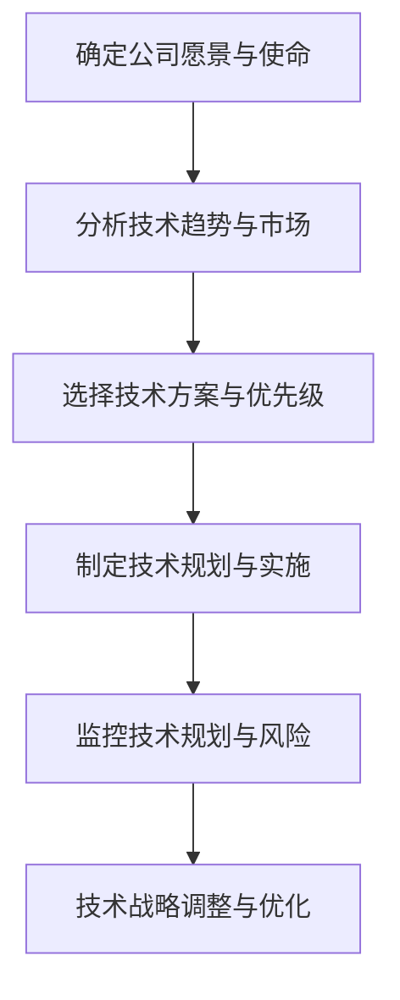

                 

### 第1章 引言与背景介绍

#### 1.1 书籍目的与目标读者

在当今快速发展的信息技术时代，技术战略规划对于企业的成功至关重要。本著作旨在为读者提供一份全面、系统的技术战略规划指南，帮助企业和组织更好地把握技术发展的机遇，实现技术与业务战略的有机结合。

本书的目标读者包括：
- 企业CTO、技术总监等高级技术管理人员
- 软件开发团队负责人和技术骨干
- 技术创业者和技术投资人
- 计算机科学、软件工程等专业师生
- 对技术战略规划感兴趣的技术爱好者

#### 1.2 技术战略的重要性

技术战略是企业实现长期发展的重要工具，它不仅关系到企业的创新能力和市场竞争力，也直接影响企业的生存与发展。一个成功的技术战略能够为企业提供以下价值：

1. **明确发展方向**：通过技术战略规划，企业可以明确未来的技术发展路线，确保技术投资和研发活动与公司愿景和业务目标一致。

2. **提高竞争力**：通过分析市场趋势和竞争态势，企业可以制定出具有前瞻性的技术策略，从而在激烈的市场竞争中脱颖而出。

3. **优化资源配置**：技术战略有助于企业合理配置研发资源，避免资源浪费，提高研发效率。

4. **驱动业务增长**：通过技术创新，企业可以开发出新的产品和服务，拓展市场，实现业务的持续增长。

5. **提升企业品牌价值**：技术领先的企业往往能够赢得市场的信任和客户的认可，提升品牌价值和市场份额。

#### 1.3 本书结构安排

本书共分为七个章节，结构如下：

- **第1章 引言与背景介绍**：介绍书籍的目的、目标读者、技术战略的重要性以及本书的结构安排。
- **第2章 技术战略概述**：详细解释技术战略的定义、组成部分和制定流程。
- **第3章 公司愿景与使命分析**：探讨公司愿景与使命的重要性以及它们与技术战略的关系。
- **第4章 技术趋势与市场分析**：分析当前的技术趋势和市场需求，为企业制定技术战略提供依据。
- **第5章 技术选择与优先级确定**：介绍技术选择的标准、评估方法和优先级确定策略。
- **第6章 技术规划实施与监控**：阐述技术规划的实施步骤、监控方法和风险管理。
- **第7章 案例研究：技术战略成功实践**：通过实际案例展示技术战略的成功实践。

#### 1.4 问题背景

在当今技术快速更迭的时代，企业面临的挑战日益复杂。一方面，新技术不断涌现，要求企业必须紧跟技术发展趋势；另一方面，市场竞争日益激烈，企业需要通过技术优势来保持竞争优势。然而，许多企业在技术战略规划方面存在以下问题：

1. **战略目标不明确**：企业往往缺乏明确的技术发展目标，导致技术投资和研发活动缺乏方向。
2. **资源分配不合理**：企业未能根据技术战略进行资源优化配置，导致研发效率低下。
3. **缺乏前瞻性**：企业未能准确预测市场和技术趋势，导致在竞争中处于被动地位。
4. **风险控制不足**：企业在技术战略实施过程中，未能有效识别和管理技术风险。

这些问题严重制约了企业的长期发展。因此，制定科学、有效、可执行的技术战略成为企业亟待解决的问题。

#### 1.5 问题描述

在技术战略规划过程中，企业面临的主要问题可以归纳为以下几个方面：

1. **如何确定公司愿景与使命**：公司愿景和使命是技术战略的基础，但许多企业未能明确界定这些概念，导致技术战略缺乏方向性。
2. **如何分析技术趋势与市场**：准确分析技术趋势和市场需求是企业制定技术战略的关键，但很多企业缺乏专业的市场分析和预测能力。
3. **如何选择合适的技术**：在众多技术方案中，企业需要选择最适合自身需求的技术，但往往难以做出明智的选择。
4. **如何实施技术规划**：技术战略的制定容易，但实施过程复杂，企业需要确保技术规划的有效执行。
5. **如何监控技术风险**：技术战略实施过程中，企业需要持续监控技术风险，确保项目顺利进行。

#### 1.6 问题解决

针对上述问题，本书提出以下解决方案：

1. **明确公司愿景与使命**：通过深入分析企业的业务模式、市场定位和竞争优势，明确公司的愿景和使命，为技术战略提供基础。
2. **分析技术趋势与市场**：利用专业的市场分析和预测工具，准确把握技术发展趋势和市场需求，为企业制定技术战略提供依据。
3. **制定技术选择标准**：根据企业的实际情况，制定科学、全面的技术选择标准，帮助企业选择合适的技术方案。
4. **实施技术规划**：通过详细的技术规划实施步骤和监控方法，确保技术规划的有效执行。
5. **监控技术风险**：建立完善的技术风险管理体系，持续监控技术风险，确保项目顺利进行。

通过上述解决方案，企业可以更好地制定和实施技术战略，实现技术与业务的有机结合，提升企业的核心竞争力和市场地位。

#### 1.7 边界与外延

1. **边界**：
   - **技术范围**：本书主要讨论信息技术领域的技术战略规划，包括软件、硬件、网络等方面的技术。
   - **业务范围**：本书适用于各类企业，包括中小企业、跨国公司等，但不涉及国家战略、行业政策等宏观层面的内容。
   - **组织范围**：本书主要关注企业内部的技术战略规划，不包括合作伙伴、供应链等外部关系。

2. **外延**：
   - **技术发展趋势**：本书不仅关注当前的技术趋势，还探讨未来可能的技术发展方向。
   - **战略层次**：本书涉及企业不同层面的技术战略，包括短期、中期和长期战略。
   - **实践案例**：本书将通过实际案例展示技术战略的成功实践，为读者提供借鉴和参考。

#### 1.8 概念结构与核心要素组成

技术战略规划是一个复杂的过程，涉及多个核心要素。以下是技术战略规划的核心概念及其相互关系：

1. **公司愿景与使命**：公司的愿景和使命是技术战略的基石，决定了技术战略的方向和目标。
2. **技术趋势与市场分析**：通过对技术趋势和市场的深入分析，为技术战略提供数据支持和决策依据。
3. **技术选择与优先级确定**：在明确技术需求和目标的基础上，选择合适的技术方案，并确定技术的优先级。
4. **技术规划实施与监控**：制定详细的技术规划实施步骤，确保技术规划的有效执行，并对项目进行持续监控。
5. **技术风险与管理**：识别和评估技术风险，建立风险管理机制，确保项目顺利进行。

以下是一个简化的 Mermaid 流程图，展示技术战略规划的基本流程：



通过这个流程图，我们可以看到，技术战略规划是一个循环迭代的过程，需要不断调整和优化，以适应市场和技术环境的变化。每个环节都紧密相连，共同构成了一个完整的技术战略体系。


----------------------------------------------------------------

## 第2章 技术战略概述

### 2.1 技术战略的定义

技术战略是企业为了实现其长期发展目标而制定的一系列技术方向、目标和行动计划。它不仅包括对现有技术的利用，还涉及新技术的探索、研发和应用。技术战略的核心目的是通过技术手段提升企业的核心竞争力，实现业务增长和市场拓展。

技术战略与业务战略有着密切的联系。业务战略关注企业的市场定位、业务模式和市场竞争力，而技术战略则关注如何通过技术手段支持业务战略的实现。具体来说，技术战略在以下几个方面与业务战略相结合：

1. **市场定位**：技术战略帮助企业确定在市场上的技术优势，从而更好地定位产品和服务。
2. **业务模式**：技术战略支持企业创新业务模式，通过技术手段实现业务转型和拓展。
3. **核心竞争力**：技术战略通过持续的技术创新，提升企业的核心竞争力，确保在竞争中的领先地位。
4. **市场拓展**：技术战略帮助企业开拓新的市场机会，通过技术手段实现业务增长。

### 2.2 技术战略的组成部分

技术战略通常由以下几个关键部分组成：

1. **技术目标**：技术目标是企业希望在未来实现的技术成果，包括技术突破、产品创新等。
2. **技术路线图**：技术路线图是企业为实现技术目标而制定的详细计划，包括各个阶段的技术任务、时间表和资源配置。
3. **技术评估与选择**：技术评估与选择是技术战略的核心环节，涉及对现有技术和新技术的评估，以及选择最适合企业需求的技术方案。
4. **研发管理**：研发管理包括研发项目的计划、执行、监控和评估，确保研发活动能够高效、有序地进行。
5. **技术整合**：技术整合是将新技术与现有技术相结合，实现技术的有效利用和协同创新。
6. **技术风险管理与控制**：技术风险管理与控制是技术战略的重要组成部分，涉及识别、评估、监控和管理技术风险，确保项目顺利进行。

### 2.3 技术战略的制定流程

技术战略的制定是一个系统、复杂的过程，通常包括以下几个步骤：

1. **需求分析**：首先，企业需要明确自身的业务需求和技术需求，确定技术战略的出发点。
2. **市场分析**：通过对市场趋势、竞争对手和客户需求的分析，企业可以更好地了解外部环境，为技术战略提供依据。
3. **技术评估**：评估现有技术和潜在技术，选择最适合企业需求的技术方案。
4. **目标设定**：根据需求分析和市场分析的结果，设定具体的技术目标，确保目标的可实现性和前瞻性。
5. **路线图规划**：制定详细的技术路线图，明确各个阶段的技术任务和时间表。
6. **资源配置**：根据技术路线图，合理配置资源，包括人力、资金和技术资源等。
7. **执行与监控**：实施技术战略，并对项目进行持续监控和评估，确保技术战略的有效执行。

### 2.4 技术战略的执行与评估

技术战略的执行是确保技术目标实现的关键环节。以下是技术战略执行和评估的几个关键步骤：

1. **执行计划**：根据技术路线图，制定详细的执行计划，明确各个阶段的任务和责任。
2. **项目管理**：对技术项目进行有效管理，包括项目计划、进度控制、质量管理和风险管理等。
3. **资源配置**：确保项目所需的资源得到有效配置和利用，避免资源浪费。
4. **监控与评估**：定期对技术项目的进展和效果进行监控和评估，及时发现和解决问题。
5. **反馈与调整**：根据监控和评估结果，对技术战略进行调整和优化，确保战略目标的实现。

### 2.5 技术战略与业务战略的融合

技术战略与业务战略的融合是企业实现长期发展的关键。以下是一些实现融合的策略：

1. **共同愿景**：明确企业共同愿景，确保技术战略与业务战略在目标上保持一致。
2. **整合资源**：将技术资源与业务资源相结合，实现资源的最优配置。
3. **协同创新**：鼓励技术部门与业务部门之间的协同创新，通过技术手段推动业务创新。
4. **数据驱动**：利用数据分析和预测，支持技术战略和业务战略的决策。
5. **动态调整**：根据市场和技术环境的变化，及时调整技术战略和业务战略，确保其前瞻性和适应性。

通过以上策略，企业可以实现技术战略与业务战略的深度融合，提升企业的整体竞争力。

### 2.6 技术战略的重要性与挑战

技术战略在企业发展中具有举足轻重的地位。以下是技术战略的重要性及其面临的挑战：

1. **重要性**：
   - **核心竞争力提升**：通过技术战略，企业可以不断提升核心竞争力，确保在竞争中的领先地位。
   - **业务模式创新**：技术战略支持企业创新业务模式，开拓新的市场机会。
   - **可持续发展**：技术战略有助于企业实现可持续发展，通过技术创新保持市场竞争力。
   - **风险防范**：技术战略可以帮助企业识别和应对技术风险，确保项目的顺利进行。

2. **挑战**：
   - **市场变化快**：技术环境变化迅速，企业需要及时调整技术战略，以适应市场变化。
   - **资源限制**：企业在资源有限的情况下，需要优化资源配置，确保技术战略的有效执行。
   - **组织变革**：技术战略的实施可能需要企业进行组织变革，涉及人员的调整和管理模式的改变。
   - **技术不确定性**：新技术的发展具有不确定性，企业需要具备前瞻性和灵活性，以应对技术不确定性。

综上所述，技术战略是企业发展的关键，但同时也面临诸多挑战。企业需要不断调整和优化技术战略，以应对外部环境的变化和内部发展的需求。

### 2.7 技术战略的持续优化与更新

技术战略不是一成不变的，它需要根据企业内外部环境的变化进行持续优化和更新。以下是一些技术战略优化和更新的策略：

1. **定期评估**：定期对技术战略进行评估，分析其效果和不足，为优化提供依据。
2. **市场调研**：持续关注市场和技术动态，收集和分析相关信息，为技术战略提供数据支持。
3. **员工培训**：提高员工的技能和知识水平，确保技术战略的实施和执行。
4. **开放合作**：与合作伙伴、学术机构和行业协会建立合作关系，共同推进技术创新。
5. **创新机制**：建立创新机制，鼓励员工提出创新想法，激发创新活力。

通过以上策略，企业可以确保技术战略的持续优化和更新，保持技术竞争优势。

### 2.8 总结

技术战略是企业实现长期发展的重要工具，它涉及多个方面，包括需求分析、市场分析、技术评估、目标设定、路线图规划、资源配置、执行与监控等。通过制定和实施技术战略，企业可以不断提升核心竞争力，实现业务的持续增长。本章对技术战略进行了概述，为后续章节的讨论奠定了基础。

```markdown
## 第3章 公司愿景与使命分析

### 3.1 公司愿景的确定

#### 核心概念

愿景（Vision）是公司对未来发展方向的展望，它描绘了公司在未来一段时间内希望达到的理想状态。愿景不仅是企业的长远目标，也是激励员工和指导战略决策的重要依据。

#### 愿景的重要性

愿景在技术战略规划中具有关键作用。它为企业的技术发展方向提供了明确的指引，确保技术投资和研发活动与公司的长远目标一致。以下是一些愿景的重要性：

1. **明确发展方向**：愿景为企业指明了未来的发展方向，帮助企业在复杂多变的市场中保持清晰的发展路线。
2. **激励员工**：愿景能够激发员工的积极性和创造力，使员工更加投入工作，共同为实现公司目标而努力。
3. **指导决策**：愿景为企业的战略决策提供了依据，确保企业在技术和市场方面的投资和研发活动与公司目标一致。
4. **提升竞争力**：一个明确的愿景可以帮助企业更好地定位自身在市场中的位置，提升竞争力和市场份额。

#### 确定公司愿景的方法

确定公司愿景是一个系统性的过程，通常包括以下几个步骤：

1. **内部调研**：通过内部调研，了解员工的期望、公司的优势和挑战，为愿景的制定提供基础数据。
2. **外部分析**：分析市场趋势、行业动态和竞争对手的情况，确定外部环境对企业愿景的影响。
3. **高层讨论**：组织公司高层领导进行讨论，确定公司的长期目标和愿景。
4. **共识达成**：通过反复讨论和修正，达成公司内部对愿景的共识。

#### 愿景描述示例

以下是一个公司愿景的示例：

“到2030年，成为全球领先的人工智能解决方案提供商，通过技术创新和客户导向，为客户提供卓越的人工智能产品和服务，推动社会的智能化进程。”

### 3.2 公司使命的解读

#### 核心概念

使命（Mission）是公司存在的目的和日常运营的核心价值。它描述了公司为什么存在，以及公司如何为顾客和社会创造价值。

#### 使命的重要性

使命在技术战略规划中同样具有重要作用。它为企业的日常运营提供了指导，确保企业的每一项决策和行动都与公司的核心价值保持一致。以下是一些使命的重要性：

1. **指导运营**：使命明确了公司的运营方向，帮助企业在日常运营中做出正确的决策。
2. **凝聚团队**：使命能够凝聚员工的共同目标，使员工在工作中更加协同和高效。
3. **品牌建设**：明确的使命有助于塑造企业品牌形象，提升企业的社会声誉和认可度。
4. **社会责任**：使命体现了企业的社会责任，帮助企业建立良好的社会形象，为可持续发展奠定基础。

#### 解读公司使命的方法

解读公司使命也是一个系统性的过程，通常包括以下几个步骤：

1. **历史回顾**：回顾公司的发展历程，了解公司成立之初的初衷和核心价值观。
2. **客户需求**：分析客户的需求，确定公司如何通过产品和服务的创新满足客户需求。
3. **内部共识**：组织公司内部员工讨论，明确公司的使命，并达成共识。
4. **外部反馈**：通过外部市场调研和客户反馈，验证公司使命的有效性和适应性。

#### 使命描述示例

以下是一个公司使命的示例：

“通过持续的技术创新和优质的服务，为客户提供高效、可靠的人工智能解决方案，帮助客户实现业务增长和数字化转型。”

### 3.3 公司愿景与使命的关系

#### 概念属性特征对比表格

| 特征       | 愿景                      | 使命                      |
| ---------- | ------------------------- | ------------------------- |
| 目标层次   | 长期、宏观、激励人心       | 短期、具体、操作性        |
| 内容描述   | 描述公司希望成为的样子     | 描述公司如何为客户创造价值 |
| 时间范围   | 长期（5年、10年甚至更长） | 短期（1年、3年等）        |
| 指导意义   | 激励员工和引领发展方向     | 指导日常运营和决策        |

#### 公司愿景与使命的关系

公司愿景和使命是相辅相成的，共同构成了企业的核心价值体系。以下是一些关系阐述：

1. **目标一致性**：愿景和使命在目标上保持一致，愿景描述了公司的长期目标，使命则明确了公司如何实现这些目标。
2. **相互补充**：愿景提供了公司发展的方向和目标，使命则描述了公司在日常运营中如何实现这些目标。
3. **指导战略**：愿景和使命共同指导企业的战略决策，确保企业在技术和市场方面的投资与公司的长期目标一致。
4. **激励团队**：愿景和使命能够激励员工为实现公司目标而努力，增强团队的凝聚力和执行力。

#### 公司愿景与使命的实践

在技术战略规划中，公司愿景和使命的实践至关重要。以下是一些建议：

1. **将愿景和使命纳入战略规划**：在制定技术战略时，明确公司愿景和使命，并将其纳入战略目标中。
2. **制定行动计划**：根据愿景和使命，制定具体的行动计划，明确各个阶段的目标和任务。
3. **监控和评估**：定期监控和评估技术战略的实施效果，确保愿景和使命的实现。
4. **沟通和宣传**：在公司内部和外部宣传公司愿景和使命，增强员工和客户的认同感。
5. **动态调整**：根据市场和技术环境的变化，动态调整愿景和使命，确保其持续适应企业的长远发展。

### 3.4 案例分析：公司愿景与使命的实践

#### 案例介绍

某全球知名科技公司在其技术战略规划中，高度重视公司愿景和使命的实践。以下是其具体实践过程：

1. **确定愿景和使命**：
   - 愿景：“成为全球领先的人工智能解决方案提供商，推动人工智能技术的广泛应用。”
   - 使命：“通过持续的技术创新和卓越的服务，为客户创造价值，推动行业进步。”

2. **制定战略规划**：
   - 确定技术发展路线：基于愿景和使命，公司明确了在人工智能领域的战略发展路线，包括核心技术的研发、产品线的拓展、市场的开拓等。
   - 制定年度行动计划：根据战略规划，公司每年制定详细的行动计划，明确各个阶段的目标和任务。

3. **实施与监控**：
   - 技术研发：公司投入大量资源进行人工智能技术的研发，不断推出创新产品和服务。
   - 市场拓展：公司积极开拓新市场，与全球多家知名企业建立了合作关系。
   - 监控与评估：公司定期对技术战略的实施效果进行监控和评估，确保愿景和使命的实现。

4. **调整与优化**：
   - 根据市场和技术环境的变化，公司动态调整技术战略，优化研发方向和资源配置。

#### 案例启示

该案例展示了公司愿景和使命在技术战略规划中的重要作用。通过明确愿景和使命，公司能够制定出符合自身发展方向的技术战略，并通过持续实施和优化，确保愿景和使命的实现。以下是一些启示：

1. **明确愿景和使命**：公司应明确自身的愿景和使命，作为技术战略的基础。
2. **制定具体的行动计划**：根据愿景和使命，制定详细的行动计划，明确各个阶段的目标和任务。
3. **持续实施与优化**：技术战略不是一成不变的，需要根据市场和技术环境的变化进行持续调整和优化。
4. **增强内部共识**：通过内部宣传和培训，增强员工对愿景和使命的认同感，提升执行力。
5. **外部合作**：通过外部合作和交流，借鉴行业最佳实践，提升公司的技术战略能力。

### 3.5 小结

公司愿景和使命是技术战略规划的重要基础，它们为企业的技术发展方向提供了明确的指引。通过实践公司愿景和使命，企业能够制定出符合自身发展需求的技术战略，并通过持续实施和优化，实现技术领先和业务增长。

```markdown
## 第4章 技术趋势与市场分析

### 4.1 当前技术趋势

在当今快速发展的信息技术时代，技术趋势的变化影响着企业的战略决策。以下是一些当前主要的技术趋势：

1. **人工智能（AI）**：人工智能技术正在各个领域得到广泛应用，包括自动驾驶、智能家居、医疗诊断等。深度学习、自然语言处理和计算机视觉等人工智能子领域取得了显著进展。
   
2. **大数据**：随着数据量的爆炸性增长，大数据技术在数据存储、数据分析和数据可视化等方面发挥着重要作用。大数据分析可以帮助企业更好地了解市场需求和客户行为。

3. **物联网（IoT）**：物联网技术通过将物理设备联网，实现了数据的实时传输和处理。物联网应用场景广泛，包括智能家居、智慧城市、工业物联网等。

4. **区块链**：区块链技术以其去中心化、不可篡改和透明性等特点，在金融、供应链管理、数据安全等领域具有巨大潜力。

5. **云计算**：云计算技术提供了灵活、高效的计算和存储资源，使得企业能够更加便捷地进行数据管理和应用部署。

6. **5G网络**：5G网络具有高速、低延迟和大连接的特点，为物联网、增强现实、虚拟现实等应用提供了坚实的基础。

7. **边缘计算**：边缘计算将计算和存储资源分布到网络的边缘，减少了数据传输延迟，提高了系统的响应速度和安全性。

### 4.2 市场需求分析

市场需求分析是制定技术战略的重要依据。以下是一些关键的市场需求分析内容：

1. **客户需求**：分析客户的痛点和需求，了解客户期望的产品和服务特性。这有助于企业确定产品开发的方向和优先级。

2. **竞争态势**：研究竞争对手的市场策略、产品特性、市场份额等，评估竞争对手的优势和劣势，为企业制定市场策略提供参考。

3. **行业趋势**：分析所在行业的发展趋势，包括技术创新、市场增长点、政策法规等，以便企业及时调整战略方向。

4. **市场规模**：评估市场容量和增长潜力，确定企业的市场定位和发展目标。

5. **用户行为**：通过数据分析，了解用户行为模式和偏好，为企业优化产品和服务提供依据。

### 4.3 竞争对手分析

竞争对手分析是市场需求分析的重要部分。以下是一些关键的分析方法：

1. **SWOT分析**：通过对竞争对手的优势、劣势、机会和威胁进行综合分析，评估竞争对手的市场地位和潜在风险。

2. **波特五力模型**：分析行业竞争环境，包括供应商、买家、潜在进入者、替代品和现有竞争者的力量，评估行业的竞争激烈程度。

3. **市场占有率**：研究竞争对手在市场中的占有率，了解其市场地位和影响力。

4. **产品特性**：分析竞争对手的产品特性、功能、性能、价格等，了解其市场竞争策略。

5. **客户满意度**：通过调查问卷、用户反馈等手段，了解客户对竞争对手产品和服务的满意度，评估其市场口碑。

### 4.4 技术与市场匹配度分析

技术与市场的匹配度分析是确保技术战略可行性的关键。以下是一些分析方法：

1. **技术成熟度**：评估所选技术方案的技术成熟度和发展趋势，确保所选技术具备较高的成熟度和发展潜力。

2. **市场需求度**：分析市场需求度，确定所选技术方案是否符合市场需求，具有市场竞争力。

3. **成本效益**：评估技术方案的成本效益，确保所选技术方案在成本和效益上具有优势。

4. **兼容性**：分析技术方案与其他现有系统和技术的兼容性，确保技术方案的顺利实施。

5. **风险评估**：评估技术风险，包括技术的不确定性、市场风险、资源风险等，确保技术方案的可行性和稳定性。

### 4.5 案例分析：技术与市场匹配度分析

#### 案例介绍

某家智能家居公司希望通过技术战略实现业务增长。以下是该公司的技术与市场匹配度分析过程：

1. **技术成熟度分析**：
   - 人工智能：智能家居应用中的人工智能技术已经相对成熟，具备广泛的应用场景。
   - 物联网：物联网技术已经广泛应用于智能家居领域，具有良好的发展前景。

2. **市场需求度分析**：
   - 客户需求：随着生活水平的提高，消费者对智能家居的需求日益增加，尤其是智能化、便捷化和安全性的需求。
   - 市场增长点：智能家居市场呈现出快速增长的趋势，市场规模不断扩大。

3. **成本效益分析**：
   - 技术成本：智能家居所需的人工智能和物联网技术成本相对较高，但随着技术的进步和规模化生产，成本有望逐步降低。
   - 市场回报：智能家居市场的需求旺盛，具备良好的市场回报潜力。

4. **兼容性分析**：
   - 系统兼容：智能家居系统需要与各种设备兼容，包括智能音箱、智能灯光、智能门锁等。
   - 技术标准：智能家居领域已经形成了一系列技术标准，有助于确保系统的兼容性和互操作性。

5. **风险评估**：
   - 技术风险：人工智能和物联网技术的不确定性和潜在风险，需要通过技术研究和风险控制措施进行管理。
   - 市场风险：智能家居市场竞争激烈，需要通过产品创新和差异化策略提升竞争力。

#### 案例启示

通过技术与市场匹配度分析，该公司明确了在智能家居领域的战略方向，并制定了具体的技术和市场策略。以下是一些启示：

1. **明确技术方向**：结合技术成熟度和市场需求，明确公司在智能家居领域的技术发展方向。
2. **关注市场趋势**：密切关注市场趋势和客户需求，确保技术战略与市场需求保持一致。
3. **优化成本结构**：通过技术创新和规模化生产，降低技术成本，提高成本效益。
4. **确保系统兼容性**：确保智能家居系统与其他设备的兼容性，提升用户体验。
5. **风险管理**：建立完善的风险管理体系，识别和管理技术风险，确保项目的顺利进行。

### 4.6 小结

技术趋势与市场分析是制定技术战略的重要环节。通过对当前技术趋势和市场需求的深入分析，企业可以更好地把握技术发展的机遇，制定出符合市场需求和技术发展趋势的技术战略。技术与市场的匹配度分析则有助于确保技术战略的可行性和有效性，为企业实现长期发展提供有力支持。

```markdown
## 第5章 技术选择与优先级确定

### 5.1 技术选择标准

技术选择是技术战略规划的核心环节，直接影响企业的创新能力和市场竞争力。为了确保技术选择的科学性和合理性，企业需要制定一套全面、系统的技术选择标准。以下是一些关键的技术选择标准：

1. **技术成熟度**：评估所选技术的成熟度和稳定性。高成熟度的技术能够减少技术风险，确保项目的顺利实施。

2. **市场需求度**：分析所选技术是否符合市场需求，具有广泛的应用前景和商业价值。市场需求度高的技术能够带来更好的市场回报。

3. **成本效益**：评估所选技术的成本效益，包括开发成本、运营成本和潜在收益。成本效益高的技术能够在预算范围内实现最大化的商业价值。

4. **兼容性**：分析所选技术与其他现有系统和技术的兼容性，确保技术方案的顺利实施。良好的兼容性能够降低整合成本和复杂性。

5. **可扩展性**：评估所选技术的可扩展性，即技术方案能否随着业务规模和需求的变化进行扩展。高可扩展性的技术能够适应未来发展的需求。

6. **安全性**：确保所选技术具有足够的安全性，能够保护数据和系统的完整性和保密性。安全性是技术选择的重要考虑因素。

7. **可持续发展**：评估所选技术的可持续性，即技术方案能否满足长远的环保和可持续发展的要求。可持续发展性的技术能够为企业赢得社会的认可和声誉。

### 5.2 技术评估方法

为了确保技术选择标准的全面、客观和科学，企业需要采用多种技术评估方法。以下是一些常用的技术评估方法：

1. **成本效益分析**：通过对所选技术的成本和效益进行详细分析，评估其经济可行性。成本效益分析可以采用净现值（NPV）、内部收益率（IRR）等经济指标。

2. **技术评分法**：根据设定的技术选择标准，对各个备选技术进行评分。评分法可以采用定量和定性相结合的方式，确保评估的全面性和准确性。

3. **对比分析法**：通过对比不同技术方案在技术成熟度、市场需求度、成本效益等方面的表现，评估其优劣。对比分析法有助于企业选择最优的技术方案。

4. **专家评估法**：邀请技术专家、行业顾问等对备选技术进行评估。专家评估法能够提供专业的意见和建议，提高技术评估的准确性。

5. **情景分析法**：通过设定不同的市场和技术环境情景，评估备选技术的适应性和风险。情景分析法有助于企业预见潜在的风险和挑战，制定相应的应对策略。

### 5.3 技术优先级确定

在多个备选技术方案中，企业需要根据技术评估结果确定技术的优先级，确保资源得到合理配置。以下是一些技术优先级确定的方法：

1. **加权评分法**：根据技术选择标准的权重，对各个技术方案进行加权评分。得分最高的技术方案优先级最高。

2. **矩阵分析法**：采用矩阵分析法，将技术评估结果进行排列组合，确定各个技术方案的优先级。矩阵分析法可以直观地展示技术方案的优劣关系。

3. **关键成功因素法**：识别企业实现成功的关键因素，根据关键因素确定技术的优先级。关键成功因素法有助于企业明确技术战略的核心目标。

4. **资源约束法**：根据企业现有的资源约束，确定技术的优先级。资源约束法有助于企业合理配置资源，确保重要技术的优先发展。

5. **动态规划法**：采用动态规划法，根据不同时间节点和资源约束，确定技术的优先级。动态规划法能够适应企业发展的动态变化。

### 5.4 技术选择的案例分析

#### 案例介绍

某家电商企业希望通过技术战略实现业务的快速扩展。以下是该企业的技术选择与优先级确定过程：

1. **技术评估**：
   - 成本效益分析：对比了不同技术的开发成本、运营成本和潜在收益，选择了成本效益最高的技术。
   - 技术评分法：根据技术成熟度、市场需求度、兼容性等标准，对备选技术进行了评分。
   - 对比分析法：通过对比不同技术方案的性能、稳定性和安全性，选择了最优的技术方案。

2. **技术优先级确定**：
   - 加权评分法：根据各技术方案的加权得分，确定了技术的优先级，将评分最高的技术方案作为首要发展目标。
   - 关键成功因素法：识别了企业扩展业务的关键成功因素，根据关键因素确定了技术的优先级。
   - 资源约束法：根据企业现有的资源约束，优先发展对业务扩展最为关键的技术。

3. **实施与监控**：
   - 技术开发：根据确定的优先级，企业集中资源进行技术方案的开发和实施。
   - 监控与评估：定期对技术项目的进展和效果进行监控和评估，确保技术方案的有效实施。

#### 案例启示

通过技术选择与优先级确定的科学方法和实践，该电商企业成功地实现了业务的快速扩展。以下是一些启示：

1. **全面评估**：在技术选择过程中，进行全面、客观的技术评估，确保技术方案的科学性和合理性。
2. **明确优先级**：根据技术评估结果，明确技术的优先级，确保资源得到合理配置，优先发展关键技术。
3. **动态调整**：根据市场和技术环境的变化，动态调整技术优先级，确保技术战略的前瞻性和适应性。
4. **实施监控**：对技术项目的实施和效果进行持续监控和评估，确保技术方案的有效执行。

### 5.5 小结

技术选择与优先级确定是技术战略规划的重要环节，它决定了企业的技术发展方向和创新能力。通过制定全面、系统的技术选择标准，采用科学的技术评估方法和优先级确定策略，企业可以确保技术战略的可行性和有效性，实现技术与业务的有机结合，提升企业的核心竞争力。

```markdown
## 第6章 技术规划实施与监控

### 6.1 技术规划的实施步骤

技术规划的实施是确保技术战略成功的关键环节。为了确保技术项目的顺利进行，企业需要制定详细的技术规划实施步骤。以下是技术规划实施的一般步骤：

1. **项目启动**：在项目启动阶段，明确项目的目标、范围、时间和资源要求，建立项目团队，制定项目计划。

2. **需求分析**：对项目需求进行详细分析，确保项目能够满足业务需求。需求分析包括功能需求、性能需求和用户需求等。

3. **技术方案设计**：根据需求分析结果，设计合适的技术方案。技术方案设计包括系统架构设计、数据库设计、接口设计等。

4. **开发与测试**：根据技术方案，进行软件开发和系统测试。开发阶段需要遵循软件工程的最佳实践，确保代码质量和系统稳定性。

5. **系统集成与部署**：将开发完成的模块进行集成测试，确保系统能够按照设计要求正常运行。随后进行系统部署，将技术方案应用到实际业务环境中。

6. **培训与上线**：对项目团队成员进行培训，确保他们能够熟练掌握新技术和系统。项目上线前进行最后的检查和调试，确保系统的稳定运行。

7. **监控与维护**：项目上线后，需要持续监控系统的运行状态，及时解决可能出现的问题。同时，根据业务需求和技术发展，对系统进行定期维护和升级。

### 6.2 技术规划的监控方法

技术规划的监控是确保项目按计划推进和目标实现的重要手段。以下是几种常用的技术规划监控方法：

1. **进度监控**：通过定期检查项目进度，确保项目按时完成。进度监控可以采用甘特图、里程碑管理等工具。

2. **质量监控**：通过测试和质量保证活动，确保系统的功能和质量符合预期。质量监控包括单元测试、集成测试、性能测试等。

3. **成本监控**：通过监控项目成本，确保项目在预算范围内完成。成本监控可以采用成本分析、成本预测等工具。

4. **风险监控**：通过识别和评估项目风险，制定风险应对措施，确保项目能够顺利实施。风险监控可以采用风险矩阵、风险登记册等工具。

5. **绩效监控**：通过评估项目绩效，包括进度、质量、成本等方面，确保项目达到预期目标。绩效监控可以采用关键绩效指标（KPI）等工具。

### 6.3 技术风险与管理

技术风险是技术规划实施过程中不可避免的一部分。有效的技术风险管理能够帮助企业降低项目风险，确保项目顺利进行。以下是技术风险管理的关键步骤：

1. **风险识别**：通过系统分析和用户反馈，识别项目可能面临的技术风险。

2. **风险评估**：评估已识别风险的概率和影响，确定风险的优先级。

3. **风险应对**：根据风险评估结果，制定相应的风险应对策略，包括风险规避、风险转移、风险减轻等。

4. **风险监控**：在项目实施过程中，持续监控技术风险的变化，确保风险应对措施的有效性。

5. **风险沟通**：与项目团队和利益相关者进行沟通，确保他们对技术风险有充分的了解。

### 6.4 案例分析：技术规划实施与监控

#### 案例介绍

某企业计划实施一项大数据分析项目，用于提升业务决策的效率。以下是该项目的技术规划实施与监控过程：

1. **项目启动**：
   - 项目目标：构建一个高效、可靠的大数据分析平台，支持业务决策。
   - 项目范围：包括数据收集、数据存储、数据处理和数据可视化等模块。
   - 项目时间表：项目计划在六个月内完成。

2. **需求分析**：
   - 功能需求：实现数据导入、数据清洗、数据分析、数据报告等功能。
   - 性能需求：保证数据处理的快速响应和系统的高可用性。
   - 用户需求：满足不同部门和角色的数据访问和使用需求。

3. **技术方案设计**：
   - 系统架构：采用分布式架构，确保数据处理的并行化和扩展性。
   - 数据库设计：采用NoSQL数据库，支持海量数据的存储和快速查询。
   - 接口设计：设计统一的数据接口，便于不同系统的数据集成。

4. **开发与测试**：
   - 开发阶段：按照系统架构和设计文档，进行软件开发和模块集成。
   - 测试阶段：进行单元测试、集成测试和性能测试，确保系统的功能和性能符合预期。

5. **系统集成与部署**：
   - 系统集成：将各个模块集成到一起，进行集成测试和系统调试。
   - 系统部署：在测试环境中进行系统部署，确保系统能够正常运行。

6. **培训与上线**：
   - 培训：对项目团队成员进行培训，确保他们能够熟练使用新系统。
   - 上线：在上线前进行最后的检查和调试，确保系统的稳定运行。

7. **监控与维护**：
   - 进度监控：定期检查项目进度，确保项目按计划推进。
   - 质量监控：进行系统监控和性能测试，确保系统运行稳定。
   - 风险监控：识别和评估潜在的技术风险，制定风险应对措施。
   - 维护升级：根据业务需求和系统反馈，进行定期的系统维护和升级。

#### 案例启示

通过技术规划实施与监控，该企业成功地构建了一个高效的大数据分析平台，提升了业务决策的效率。以下是一些启示：

1. **明确项目目标**：确保项目目标清晰、可量化，便于项目的顺利推进。
2. **需求分析要全面**：确保需求分析的准确性，避免项目后期出现需求变更。
3. **技术方案设计要合理**：选择适合业务需求的技术方案，确保系统的稳定性和扩展性。
4. **测试要充分**：通过全面的测试，确保系统的功能和性能符合预期。
5. **培训要到位**：确保项目团队对新技术和系统的熟练掌握，提高系统的使用效率。
6. **持续监控与维护**：通过监控和评估，及时发现和解决系统问题，确保系统的长期稳定运行。

### 6.5 小结

技术规划的实施与监控是技术战略成功的关键环节。通过制定详细的实施步骤、采用科学的技术监控方法和有效的风险管理策略，企业可以确保技术项目的顺利推进和目标的实现。同时，持续的技术监控和维护有助于提升系统的稳定性和可靠性，为企业的长期发展提供有力支持。

```markdown
## 第7章 案例研究：技术战略成功实践

### 7.1 案例介绍

在本章中，我们将通过一个实际案例研究，探讨技术战略在企业成功实践中的应用。该案例是一家全球知名的电子商务平台，名为“eShop”，该公司通过精心制定和实施技术战略，实现了业务的快速增长和市场领先地位。

### 7.2 技术战略的制定过程

1. **确定公司愿景和使命**：
   - 愿景：“成为全球领先的电子商务平台，为消费者提供卓越的购物体验。”
   - 使命：“通过持续的技术创新和优质的服务，为客户创造价值，推动电子商务的普及与发展。”

2. **分析技术趋势与市场**：
   - 技术趋势：人工智能、大数据、物联网、云计算等新兴技术。
   - 市场需求：个性化推荐、智能客服、移动购物、高效物流等。

3. **制定技术目标**：
   - 提高用户购物体验。
   - 加强数据分析和客户洞察。
   - 提升物流和配送效率。

4. **技术路线图规划**：
   - 人工智能应用：构建智能推荐系统、智能客服等。
   - 大数据分析：进行用户行为分析和市场趋势预测。
   - 物联网集成：实现智能仓储和高效物流。

5. **资源配置**：
   - 投入大量研发资金，吸引顶尖技术人才。
   - 与高校和科研机构合作，共同推进技术创新。

### 7.3 技术战略的实施过程

1. **智能推荐系统**：
   - 技术实现：利用机器学习和大数据分析技术，构建个性化推荐系统。
   - 用户体验：用户在浏览商品时，系统能够根据用户历史行为和偏好，推荐最符合其需求的产品。
   - 效果评估：推荐系统的准确率显著提高，用户购物体验得到显著提升。

2. **智能客服系统**：
   - 技术实现：利用自然语言处理和语音识别技术，开发智能客服系统。
   - 用户体验：用户可以通过聊天窗口或语音与智能客服进行交互，解决购物过程中的问题。
   - 效果评估：智能客服系统降低了人工客服的工作量，提高了客服效率。

3. **大数据分析平台**：
   - 技术实现：建立高效的大数据分析平台，整合来自各个业务环节的数据。
   - 业务应用：通过数据分析，洞察用户行为和市场趋势，为业务决策提供数据支持。
   - 效果评估：数据分析平台帮助公司优化了库存管理、营销策略和用户关系管理。

4. **智能仓储与物流**：
   - 技术实现：引入物联网技术和自动化设备，实现智能仓储和高效物流。
   - 用户体验：商品配送速度显著提高，物流信息实时更新，用户可以实时跟踪订单状态。
   - 效果评估：智能仓储和物流系统提高了配送效率，降低了物流成本。

### 7.4 成功实践的关键因素

1. **明确的技术目标**：通过明确的技术目标，确保技术投资的精准和高效。
2. **前瞻性的技术路线图**：前瞻性的技术路线图帮助公司提前布局，把握技术发展趋势。
3. **高效的资源配置**：合理的资源配置确保了技术项目的顺利推进和高质量完成。
4. **紧密的跨部门协作**：技术部门与业务部门紧密协作，确保技术战略与业务需求一致。
5. **持续的技术创新**：持续的技术创新是保持竞争优势和实现业务增长的关键。

### 7.5 小结与启示

通过这个案例，我们可以看到，技术战略的成功实践需要明确的目标、前瞻性的规划、高效的资源配置和紧密的跨部门协作。以下是一些小结和启示：

1. **明确技术目标**：技术目标应与公司的长期愿景和使命保持一致，确保技术投资的有价值。
2. **制定前瞻性的技术路线图**：技术路线图应基于市场和技术趋势，提前布局关键技术。
3. **高效资源配置**：确保技术项目的资源投入，包括资金、人才和技术支持。
4. **跨部门协作**：技术战略的制定和实施需要跨部门的紧密合作，确保技术方案与业务需求一致。
5. **持续创新**：技术环境变化快速，持续的技术创新是保持竞争优势和实现业务增长的必要条件。

通过借鉴这个案例的成功经验，企业可以更好地制定和实施技术战略，实现技术与业务的有机结合，提升企业的核心竞争力。

### 7.6 拓展阅读

为了更深入地理解技术战略的成功实践，以下是一些推荐阅读的资料：

1. 《精益创新：如何通过技术创新实现业务增长》
2. 《大数据战略：利用数据创造竞争优势》
3. 《智能时代：人工智能如何改变商业和社会》
4. 《敏捷开发：高效应对快速变化的策略》

这些书籍和资料提供了丰富的理论知识和实践案例，有助于企业更好地理解和实施技术战略。通过阅读这些资料，企业可以进一步提升技术战略的能力，实现持续的创新发展。

## 作者信息

作者：AI天才研究院/AI Genius Institute & 禅与计算机程序设计艺术 /Zen And The Art of Computer Programming

AI天才研究院致力于推动人工智能技术的创新与应用，研究涵盖机器学习、自然语言处理、计算机视觉等多个领域。禅与计算机程序设计艺术则强调计算机编程中的哲学和艺术，旨在通过深入理解计算机程序设计的基本原理，提升开发者的编程技能和创造力。

通过这两本书籍的融合，作者希望为读者提供全面、系统的技术战略规划指南，帮助企业在信息技术时代实现持续创新和业务增长。

