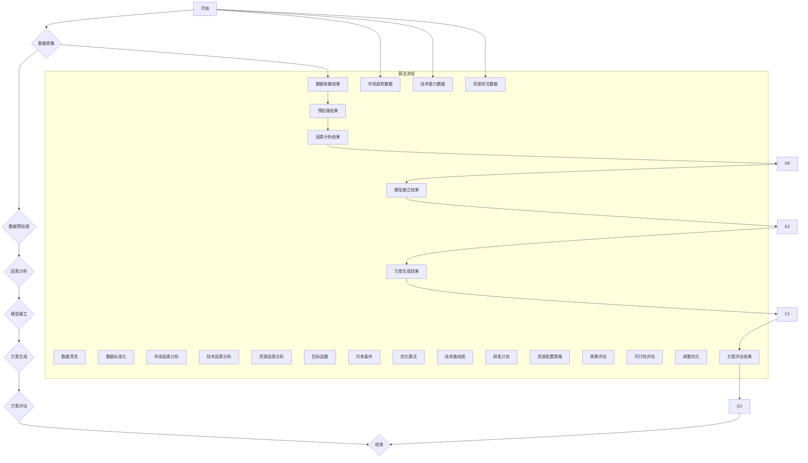
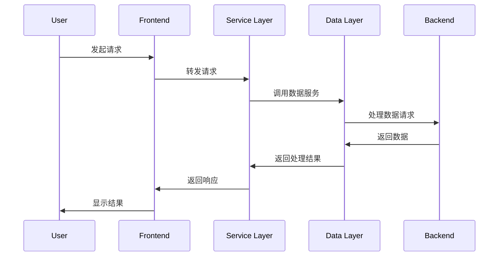

                 

### 第1章: 问题背景

#### 1.1.1 技术发展现状

在当今数字化时代，技术的发展日新月异，推动着各行各业向更高效率和智能化迈进。云计算、大数据、人工智能、物联网、区块链等技术正逐步成为企业创新和发展的关键驱动力。技术发展的现状不仅影响着企业的运营模式，也重塑了整个行业生态。

一方面，技术的快速发展为企业带来了前所未有的机遇。通过应用新兴技术，企业可以优化业务流程、降低运营成本、提升客户体验、开拓新市场，实现业务模式的创新和增长。例如，云计算技术的普及使得企业能够以更低的成本、更高的灵活性进行IT资源的部署和管理，从而提高运营效率。

另一方面，技术的快速发展也带来了诸多挑战。技术更新迭代的速度之快，使得企业必须持续投入大量资源进行技术研发和创新，以保持竞争优势。此外，技术的复杂性和不确定性也增加了企业的运营风险。例如，人工智能技术的广泛应用虽然为企业提供了新的业务机会，但也带来了数据隐私、伦理道德等方面的问题，需要企业在技术战略规划中予以充分考虑。

#### 1.1.2 企业愿景与目标

企业愿景是企业在未来发展中追求的远大目标，它为企业指明了方向和使命。一个清晰、明确的企业愿景不仅能够激发员工的积极性和创造力，也是企业战略规划的基础。企业愿景通常涵盖以下几个方面：

1. **市场定位**：企业在市场上的定位和目标客户群体。
2. **业务模式**：企业如何通过产品或服务实现盈利。
3. **技术路线**：企业将在哪些技术领域进行研发和创新。
4. **社会责任**：企业在社会责任方面的目标和承诺。

例如，一家科技公司可能将其愿景设定为“成为全球领先的云计算解决方案提供商”，其目标是通过不断创新，提供高性能、高可靠性的云计算服务，满足全球客户的需求。

然而，企业在追求愿景的过程中，往往会面临诸多挑战。例如，市场的快速变化可能导致企业愿景需要不断调整；技术的快速发展要求企业不断进行技术储备和创新；资源的有限性使得企业需要在愿景实现和资源投入之间进行平衡。因此，如何确保企业愿景的可行性和实现路径的清晰，是企业战略规划中的一个重要问题。

#### 1.1.3 技术战略的重要性

技术战略是企业实现其愿景和目标的关键手段。技术战略规划不仅关乎企业当前的生存和发展，更是企业长期竞争力和持续创新的核心驱动力。

首先，技术战略能够明确企业在技术领域的方向和目标，帮助企业在纷繁复杂的技术领域中找到合适的发展路径。通过技术战略，企业可以优先发展关键技术，形成自己的核心竞争力，从而在市场竞争中占据有利地位。

其次，技术战略能够指导企业的研发投入和资源配置。合理的研发投入和资源配置能够提高技术研发的效率和成果转化率，降低研发风险。例如，通过技术战略规划，企业可以识别出哪些技术领域具有高增长潜力和高收益前景，从而在这些领域进行重点投入。

此外，技术战略还能够帮助企业应对市场变化和技术挑战。一个完善的技术战略规划能够使企业在面对技术变革时，具备快速响应和调整的能力，保持企业的持续竞争力。

总之，技术战略规划是企业实现愿景和目标的重要保障。它不仅需要对企业内部的技术能力、资源状况和市场环境进行深入分析，还需要结合外部技术趋势和市场动态，制定出切实可行的发展路径和实施策略。

#### 1.1.4 技术战略规划的需求

在当前技术快速发展的背景下，企业对技术战略规划的需求日益迫切。首先，随着技术的不断进步，企业面临着不断更新和迭代技术的压力。如果没有清晰的技术战略规划，企业可能在技术潮流中迷失方向，无法有效利用新技术带来的机遇，甚至可能被市场淘汰。

其次，企业在追求技术突破和创新时，需要确保技术研发与市场需求的匹配。技术战略规划可以帮助企业明确市场需求和技术发展方向，确保技术研发的方向和投入是有效的，避免资源浪费。

此外，技术战略规划还能够帮助企业建立长期的技术储备和创新能力。通过持续的技术研发和创新，企业可以保持技术领先地位，增强市场竞争力。

总之，技术战略规划不仅是企业实现愿景和目标的关键，也是企业在复杂多变的市场环境中生存和发展的重要保障。它需要企业从长远角度出发，综合考虑内部能力和外部环境，制定出切实可行的发展策略。

### 第2章: 问题解决

#### 2.1 技术战略规划的定义

技术战略规划（Technology Strategy Planning）是企业为了实现其愿景和目标，对技术发展方向的系统性和前瞻性规划。它涉及对技术环境、市场趋势、企业资源等多个维度的分析和判断，旨在确定企业在技术领域的发展方向、目标和策略，从而实现企业的长期发展。

技术战略规划不仅包括对现有技术的评估和优化，还涉及对未来技术的预测和储备。它是一种综合性的规划，需要结合企业的业务模式、市场定位、技术能力等多方面因素，制定出切实可行的发展路径。

#### 2.1.1 技术战略规划的概念

技术战略规划的概念可以从以下几个方面进行理解：

1. **技术方向**：确定企业将在哪些技术领域进行投资和研发。技术方向的选择通常基于市场趋势、技术成熟度、企业核心能力等多个因素。

2. **技术储备**：对未来的技术进行预测和储备，以便在适当的时候进行投资和研发。技术储备可以帮助企业保持技术领先地位，抓住市场机遇。

3. **技术研发**：对选定技术方向进行深入研究和开发，以实现技术突破和商业价值。

4. **技术优化**：对现有技术进行持续优化和改进，以提高技术性能和降低成本。

5. **资源调配**：合理分配企业资源，包括资金、人力和物资，确保技术研发和战略规划的顺利实施。

#### 2.1.2 技术战略规划的目的

技术战略规划的主要目的是确保企业在技术领域的发展与企业的总体战略目标相一致，具体包括以下几个方面：

1. **确保技术领先**：通过技术战略规划，企业可以提前布局关键技术和创新领域，保持技术领先地位。

2. **提升竞争力**：技术战略规划可以帮助企业识别市场机会和风险，制定应对策略，提升企业的市场竞争力和持续发展能力。

3. **优化资源配置**：技术战略规划能够指导企业合理分配资源，避免资源浪费，提高资源利用效率。

4. **增强创新驱动**：技术战略规划鼓励企业持续进行技术创新，形成技术优势，推动企业持续发展。

5. **实现商业价值**：技术战略规划通过技术突破和优化，为企业创造商业价值，提升企业的盈利能力。

#### 2.1.3 技术战略规划的框架

技术战略规划的框架通常包括以下几个关键步骤：

1. **现状分析**：对企业现有技术能力、市场地位、资源状况等进行全面分析，确定企业的技术基础和存在的问题。

2. **趋势预测**：对技术发展趋势、市场变化、政策环境等进行预测和分析，识别未来的技术机会和挑战。

3. **目标设定**：根据企业的愿景和目标，设定短期和长期的技术发展目标，明确企业技术战略的导向。

4. **路径规划**：制定实现技术目标的路径和策略，包括技术方向的选择、技术研发的优先级、资源调配等。

5. **实施监控**：建立技术战略的监控和评估机制，确保技术战略规划的顺利实施和目标达成。

6. **调整优化**：根据实际执行情况和市场反馈，对技术战略规划进行调整和优化，确保其持续适应企业的发展需求。

通过以上步骤，企业可以系统地规划技术发展方向，确保技术战略与企业的长期愿景和目标相一致，从而实现企业的可持续发展和竞争优势。

### 第3章: 边界与外延

#### 3.1 技术战略规划的边界

技术战略规划的边界涉及多个方面，首先，它明确了技术战略规划的范围和内容，确保规划的针对性和有效性。以下是技术战略规划的一些主要边界：

1. **技术领域**：技术战略规划主要关注与企业发展密切相关的技术领域，如云计算、大数据、人工智能、物联网等。这些技术领域不仅与企业的业务模式紧密相连，也是未来技术创新和市场竞争的关键。

2. **企业层面**：技术战略规划需结合企业的实际情况，考虑企业的资源、能力、市场定位等多方面因素。例如，小型企业可能更侧重于技术应用和优化，而大型企业则可能更关注技术创新和研发。

3. **市场层面**：技术战略规划需要考虑市场的需求和趋势，确保技术发展能够满足市场需求，抓住市场机遇。市场变化是技术战略规划中不可忽视的重要边界。

4. **时间维度**：技术战略规划通常涵盖短期和长期目标，短期目标可能涉及技术升级和应用，而长期目标则可能涉及技术创新和储备。时间维度的规划有助于企业制定清晰的实施路径和目标。

#### 3.1.1 技术领域

技术领域是技术战略规划的核心关注点，选择合适的技术领域对于企业的长期发展至关重要。以下是几个关键考虑因素：

1. **市场需求**：技术领域的选择应基于市场需求，确保技术的发展能够满足客户的实际需求，提升客户体验和满意度。

2. **技术成熟度**：技术领域的选择应考虑技术的成熟度，优先选择已经相对成熟且具有广泛应用前景的技术。这样可以降低技术研发的风险，提高项目成功率。

3. **企业能力**：技术领域的选择应结合企业的技术能力和资源，确保企业有足够的能力进行技术研发和应用。企业的核心能力和专长是选择技术领域的重要依据。

4. **竞争优势**：技术领域的选择应有助于企业形成竞争优势，通过技术创新和差异化策略，提升企业在市场中的竞争力。

5. **未来趋势**：技术领域的选择应关注未来技术发展趋势，提前布局可能带来的新兴技术和市场机会，确保企业能够持续保持技术领先地位。

#### 3.1.2 企业层面

在企业层面，技术战略规划的边界主要涉及企业的内部资源和能力。以下是几个关键因素：

1. **资源分配**：技术战略规划需合理分配企业的资源，包括资金、人力和物资。资源分配应优先支持关键技术和重要项目，确保资源利用最大化。

2. **研发能力**：企业的技术战略规划需考虑自身的研发能力，包括研发团队的规模、技术水平、研发经验等。研发能力是企业技术发展的重要保障。

3. **组织结构**：企业的技术战略规划需与组织结构相匹配，确保技术战略能够得到有效执行。合理的组织结构有助于提高技术研发和项目管理的效率。

4. **企业文化**：企业的技术战略规划需符合企业文化，鼓励创新和持续改进。企业文化是推动技术战略成功实施的重要力量。

5. **政策与法规**：企业的技术战略规划需遵守相关政策法规，确保技术研发和应用符合法律要求，避免潜在的法律风险。

#### 3.1.3 市场层面

在市场层面，技术战略规划的边界主要涉及市场环境和竞争态势。以下是几个关键因素：

1. **市场趋势**：技术战略规划需关注市场发展趋势，预测未来市场的变化和机会，确保技术发展方向与市场趋势相匹配。

2. **竞争对手**：技术战略规划需分析竞争对手的技术战略和产品策略，了解竞争对手的优势和劣势，制定相应的应对策略。

3. **客户需求**：技术战略规划需深入了解客户需求，确保技术发展能够满足客户的实际需求，提升客户满意度。

4. **市场规模**：技术战略规划需考虑市场规模的潜在增长，确保技术发展具有足够的市场空间和增长潜力。

5. **政策环境**：技术战略规划需关注政策环境的变化，如政府政策、行业规范等，确保技术战略能够得到政策支持和合规性。

总之，技术战略规划的边界涉及多个方面，包括技术领域、企业层面和市场层面。只有综合考虑这些边界因素，制定出符合实际需求和发展目标的技术战略规划，企业才能在激烈的市场竞争中保持领先地位。

### 第4章: 核心概念与联系

#### 4.1 核心概念

技术战略规划中的核心概念包括技术方向、公司愿景、对齐原则和评估指标。这些概念相互作用，共同构成了企业技术战略规划的基础。

1. **技术方向**：技术方向是企业技术战略规划中的一项关键决策，它指的是企业在技术领域中将要重点发展的方向。技术方向的选择通常基于市场需求、技术趋势、企业核心能力等因素。

2. **公司愿景**：公司愿景是企业未来发展的总体目标和追求，它指导企业的战略决策和行动。公司愿景通常包括市场定位、业务模式、技术路线、社会责任等方面。

3. **对齐原则**：对齐原则是指将技术战略与公司愿景相匹配的原则。对齐原则的目的是确保技术发展符合企业的长期目标和战略方向。

4. **评估指标**：评估指标是用于衡量技术战略实施效果的一系列量化标准。评估指标可以包括技术进步率、市场占有率、研发成本、客户满意度等。

#### 4.1.1 技术方向

技术方向是企业技术战略规划中的核心概念之一，它直接影响企业的技术研发投入、资源配置和市场竞争。以下是技术方向的一些关键特征：

1. **前瞻性**：技术方向应具备前瞻性，能够预见未来技术的发展趋势和市场变化。前瞻性的技术方向有助于企业抢占市场先机，保持竞争优势。

2. **市场驱动**：技术方向的选择应紧密结合市场需求，确保技术发展能够满足客户需求，提升客户满意度。

3. **资源匹配**：技术方向的选择应考虑企业的资源条件，包括资金、人力、技术和物资等。资源匹配有助于提高技术研发的成功率和商业价值。

4. **差异化**：技术方向的差异化有助于企业形成独特的竞争优势，避免与竞争对手的直接竞争。

5. **可持续发展**：技术方向的选择应考虑技术的可持续性和环境影响，确保企业在实现商业目标的同时，能够履行社会责任。

#### 4.1.2 公司愿景

公司愿景是企业发展的远大目标和理想状态，它不仅指导企业的战略决策，还激励员工的共同奋斗。以下是公司愿景的一些关键特征：

1. **明确性**：公司愿景应具备明确的表述，使所有员工都能清晰理解企业的目标和发展方向。

2. **激励性**：公司愿景应具备激励性，能够激发员工的积极性和创造力，形成共同的奋斗动力。

3. **可行性**：公司愿景应具备可行性，通过合理的技术战略规划和资源配置，企业能够在实际中逐步实现愿景。

4. **动态性**：公司愿景不是静态的，应随着市场环境和企业内部条件的变化而调整，以保持其适应性。

5. **全局性**：公司愿景应从全局角度出发，综合考虑企业的发展方向、市场定位、社会责任等方面，确保企业的长期可持续发展。

#### 4.1.3 对齐原则

对齐原则是确保技术战略与公司愿景相一致的重要原则，它通过协调技术方向、资源配置和战略目标，实现企业的整体发展。以下是几个关键对齐原则：

1. **目标对齐**：确保技术战略目标与公司愿景相一致，使技术发展能够支持企业的长期目标。

2. **资源对齐**：确保资源配置与公司愿景和技术方向相匹配，使企业能够有效利用资源，实现技术突破。

3. **团队对齐**：通过建立统一的目标和行动计划，确保团队内部对技术战略的认同和协同，提高执行效果。

4. **市场对齐**：确保技术发展方向与市场需求相匹配，使企业能够快速响应市场变化，抓住市场机遇。

5. **持续对齐**：通过定期评估和调整，确保技术战略与公司愿景保持持续对齐，适应外部环境和企业内部变化。

#### 4.1.4 评估指标

评估指标是衡量技术战略实施效果的重要工具，它通过一系列量化标准，反映技术战略的成效。以下是几个常见的评估指标：

1. **技术进步率**：衡量技术发展的速度和成果，通常以年度技术进步率或关键技术突破的数量来表示。

2. **市场占有率**：衡量企业在市场中的竞争地位，反映技术战略对市场开拓的效果。

3. **研发成本**：衡量技术研发的投入和效益，通过对比研发成本与收益，评估技术战略的经济性。

4. **客户满意度**：衡量技术战略对客户需求的满足程度，通过客户反馈和满意度调查来评估。

5. **员工满意度**：衡量技术战略对员工的影响，通过员工调查和满意度评估，反映技术战略对企业内部氛围的影响。

通过这些核心概念和评估指标，企业可以系统地制定和实施技术战略规划，确保技术发展与企业愿景相一致，实现企业的长期可持续发展。

#### 4.1.5 概念属性特征对比表格

为了更清晰地理解技术方向、公司愿景、对齐原则和评估指标这些核心概念，我们可以通过以下属性特征对比表格进行分析。

| 概念       | 定义                                                         | 关键特征                   | 作用                                                         |
|------------|--------------------------------------------------------------|----------------------------|--------------------------------------------------------------|
| 技术方向   | 企业技术战略规划中将要重点发展的方向                           | 前瞻性、市场驱动、资源匹配、差异化、可持续发展 | 指导技术研发、资源配置、市场竞争 |
| 公司愿景   | 企业未来发展的总体目标和理想状态                             | 明确性、激励性、可行性、动态性、全局性  | 指导战略决策、员工奋斗动力       |
| 对齐原则   | 确保技术战略与公司愿景相一致的原则                           | 目标对齐、资源对齐、团队对齐、市场对齐、持续对齐 | 协调战略实施、提高执行效果       |
| 评估指标   | 衡量技术战略实施效果的一系列量化标准                          | 技术进步率、市场占有率、研发成本、客户满意度、员工满意度 | 反映战略成效、指导调整优化       |

通过上述对比表格，我们可以更全面地理解这些核心概念的属性特征和作用，从而更好地制定和实施技术战略规划。

#### 4.1.6 ER实体关系图架构

为了更好地理解技术战略规划中的各个核心概念及其相互关系，我们可以通过ER（Entity-Relationship，实体-联系）实体关系图进行架构设计。以下是技术战略规划ER实体关系图的示例：

```mermaid
erDiagram
  Customer ||--o{ Product : " produces " }
  Customer ||--o{ Order : " places " }
  Product ||--o{ Review : " receives " }
  Order ||--o{ Payment : " made for " }
  Review ||--o{ Rating : " based on " }
  Rating ||--o{ Comment : " with " }
```

在这个ER实体关系图中，我们定义了以下几个实体：

1. **Customer（客户）**：代表购买产品的个人或组织，是产品的消费者。
2. **Product（产品）**：代表企业生产或销售的商品或服务，是客户购买的对象。
3. **Order（订单）**：代表客户的购买行为，由客户产生。
4. **Review（评论）**：代表客户对产品的评价，是客户对购买体验的反馈。
5. **Rating（评分）**：代表客户对产品的评分，通常以星级表示。
6. **Comment（评论）**：代表客户对评分的补充说明或详细信息。

这些实体之间的关系如下：

- **Customer**与**Product**之间存在“生产”关系，表示客户是产品的消费者。
- **Customer**与**Order**之间存在“放置”关系，表示客户通过订单进行购买。
- **Product**与**Review**之间存在“接收”关系，表示产品会收到客户的评价。
- **Order**与**Payment**之间存在“支付”关系，表示订单通过支付完成。
- **Review**与**Rating**之间存在“基于”关系，表示评论是基于评分给出的。
- **Rating**与**Comment**之间存在“补充”关系，表示评分可能伴随详细的评论说明。

通过ER实体关系图，我们可以直观地理解技术战略规划中的各个核心概念及其相互关系，从而更好地进行规划和管理。

### 第7章: 技术方向

#### 7.1 技术方向的定义

技术方向（Technical Direction）是指企业或组织在特定技术领域中，根据市场需求、技术趋势、企业能力等多方面因素所确定的发展目标和路径。技术方向不仅为企业提供了明确的技术发展指引，也是企业实现长期战略目标的重要保障。

技术方向的选择涉及多个维度，包括：

1. **市场需求**：技术方向的选择应紧密结合市场需求，确保技术发展能够满足客户的实际需求，提升客户满意度。
2. **技术趋势**：技术方向的选择应关注技术发展趋势，提前布局可能带来市场机会的新兴技术。
3. **企业能力**：技术方向的选择应考虑企业的技术储备和能力，确保企业能够有效地进行技术研发和应用。
4. **竞争优势**：技术方向的选择应有助于企业形成竞争优势，通过技术创新和差异化策略，提升市场竞争力。

技术方向在企业发展中具有以下几个关键作用：

1. **明确发展目标**：技术方向为企业提供了明确的发展目标和路径，使企业能够集中资源，有序推进技术研发和应用。
2. **指导资源配置**：技术方向帮助企业在有限的资源条件下，合理配置资金、人力和技术资源，提高资源利用效率。
3. **保持技术领先**：通过技术方向的选择和布局，企业能够保持技术领先地位，抓住市场机遇，提升竞争力。
4. **驱动创新**：技术方向鼓励企业不断进行技术创新和研发，推动企业的持续成长和进步。

#### 7.1.1 技术方向的含义

技术方向的含义可以从以下几个方面进行理解：

1. **技术领域定位**：技术方向指的是企业将在哪些技术领域中展开研发和应用。例如，云计算、大数据、人工智能、物联网等。

2. **技术趋势把握**：技术方向不仅仅是现有技术的应用，还包括对新兴技术的关注和布局。企业通过技术方向的选择，能够把握行业发展的趋势，抓住未来的技术机会。

3. **战略导向**：技术方向是企业在技术战略中的核心内容，它不仅反映了企业的技术愿景，也是企业战略目标实现的重要支撑。

4. **资源配置**：技术方向决定了企业的研发投入方向，引导企业资源的有效配置，确保企业在关键领域获得优势。

5. **市场定位**：技术方向的选择影响企业在市场中的定位和竞争优势，通过技术方向，企业可以明确自身在市场中的角色和地位。

#### 7.1.2 技术方向的分类

技术方向可以根据不同的分类标准进行分类，以下是几种常见的技术方向分类方法：

1. **按技术领域分类**：根据技术领域的不同，可以将技术方向分为云计算、大数据、人工智能、物联网、区块链、边缘计算等。

2. **按技术成熟度分类**：根据技术的成熟度，可以将技术方向分为成熟技术方向、新兴技术方向和前沿技术方向。

3. **按应用场景分类**：根据技术的应用场景，可以将技术方向分为企业级应用、消费级应用、工业级应用等。

4. **按业务需求分类**：根据企业业务需求的不同，可以将技术方向分为业务支持型技术方向、业务拓展型技术方向等。

5. **按发展潜力分类**：根据技术方向的发展潜力，可以将技术方向分为高潜力技术方向、中潜力技术方向和低潜力技术方向。

每种分类方法都有其独特的适用场景和指导意义，企业可以根据自身情况和市场环境，选择合适的技术方向分类方法，制定出明确的技术发展战略。

#### 7.1.3 技术方向的选择标准

选择合适的技术方向对于企业的长远发展至关重要。以下是几个关键的技术方向选择标准：

1. **市场需求**：技术方向的选择应紧密结合市场需求，确保技术发展能够满足客户的实际需求，提升客户满意度。市场需求是技术方向选择的重要依据，只有满足市场需求的技术方向才能带来实际商业价值。

2. **技术趋势**：技术方向的选择应关注技术发展趋势，提前布局可能带来市场机会的新兴技术。技术趋势的把握可以帮助企业抓住未来发展的机遇，保持技术领先地位。

3. **企业能力**：技术方向的选择应考虑企业的技术储备和能力，确保企业能够有效地进行技术研发和应用。企业的技术能力和资源是技术方向选择的重要保障，只有具备足够技术能力的企业才能实现技术方向的突破。

4. **竞争优势**：技术方向的选择应有助于企业形成竞争优势，通过技术创新和差异化策略，提升市场竞争力。竞争优势是企业在市场中立足的关键，通过选择能够形成独特竞争优势的技术方向，企业可以在激烈的市场竞争中脱颖而出。

5. **资源投入**：技术方向的选择应考虑企业的资源投入能力，确保技术方向的实施具备可行性。资源投入包括资金、人力、技术等，技术方向的实施需要合理配置资源，避免资源浪费。

6. **风险评估**：技术方向的选择应进行充分的风险评估，确保技术方向的实施不会带来过大的风险。技术方向的选择需要综合考虑技术风险、市场风险、运营风险等多方面因素，确保技术方向的可行性。

7. **长期规划**：技术方向的选择应具备长期性，能够与企业的发展战略相匹配。技术方向不仅是短期的技术研发方向，更是企业长期发展的指引，通过长期规划，企业可以确保技术方向的持续性和稳定性。

通过上述标准，企业可以系统地评估和选择合适的技术方向，确保技术发展方向与企业愿景和战略目标相一致，实现企业的长远发展。

### 第8章: 公司愿景

#### 8.1 公司愿景的定义

公司愿景（Corporate Vision）是指企业在未来一段时间内所追求的宏伟目标和发展蓝图。它不仅描述了企业的远大愿景，也是企业战略决策和行动的指南针。公司愿景通常涵盖企业的市场定位、业务模式、技术路线、社会责任等方面，是企业在复杂多变的市场环境中保持方向感和凝聚力的关键因素。

公司愿景的定义可以从以下几个方面进行理解：

1. **目标导向**：公司愿景明确了企业未来发展的目标，使企业在前进过程中始终保持方向感和目标感。

2. **愿景性**：公司愿景具有前瞻性和愿景性，它不仅反映了当前的市场需求和趋势，也预见了未来可能的发展方向。

3. **激励性**：公司愿景具有激励性，能够激发员工的热情和动力，形成共同的目标和价值观。

4. **全局性**：公司愿景从全局出发，综合考虑企业的各个方面，确保企业在实现愿景的过程中，能够均衡发展。

5. **动态性**：公司愿景不是静态的，应随着市场环境、技术进步和企业内部条件的变化而调整，以保持其适应性和前瞻性。

#### 8.1.1 公司愿景的含义

公司愿景的含义可以从以下几个方面进行解读：

1. **市场定位**：公司愿景明确了企业在市场中的定位，包括目标市场、客户群体、竞争优势等方面。

2. **业务模式**：公司愿景描述了企业的业务模式，包括盈利方式、产品或服务形态、市场推广策略等。

3. **技术路线**：公司愿景规划了企业的技术发展方向，包括重点研发领域、技术创新路径、技术储备等。

4. **社会责任**：公司愿景体现了企业在社会责任方面的承诺，包括环保、公益、员工福利等方面。

5. **发展目标**：公司愿景明确了企业的发展目标，包括短期目标、中期目标和长期目标等。

6. **员工激励**：公司愿景通过设定远大目标，激发员工的积极性和创造力，形成共同奋斗的动力。

7. **持续发展**：公司愿景关注企业的可持续发展，通过合理规划和资源配置，确保企业能够长期稳定发展。

总之，公司愿景是企业未来发展的重要蓝图，它不仅指导企业的战略决策和行动，也是企业凝聚员工力量、实现共同目标的核心动力。

#### 8.1.2 公司愿景的重要性

公司愿景在企业发展中扮演着至关重要的角色，它不仅为企业提供了清晰的发展方向，还在多个方面发挥着重要作用。以下是公司愿景的几个关键重要性：

1. **明确发展方向**：公司愿景为企业明确了未来发展的方向和目标，使企业在复杂多变的市场环境中始终保持清晰的发展路径。

2. **凝聚员工力量**：公司愿景通过设定远大目标，激发员工的热情和动力，形成共同的目标和价值观，增强企业的凝聚力和团队协作精神。

3. **激励创新精神**：公司愿景鼓励企业持续进行技术创新和业务模式创新，推动企业的不断进步和成长。

4. **战略指导作用**：公司愿景是制定企业战略的重要依据，通过公司愿景，企业可以制定出切实可行的发展策略，确保企业在竞争中保持优势。

5. **增强竞争力**：公司愿景明确企业的发展目标，使企业能够集中资源，优化资源配置，提高运营效率，从而增强企业的市场竞争力。

6. **提升品牌形象**：公司愿景体现了企业的社会责任和价值观，有助于提升企业的品牌形象和社会影响力。

7. **适应市场变化**：公司愿景具有动态性，能够根据市场环境和内部条件的变化进行调整，确保企业能够迅速适应市场变化，抓住发展机遇。

总之，公司愿景不仅是企业发展的远大目标，也是企业战略决策和行动的重要指南，它在推动企业持续发展、提升竞争力、凝聚员工力量等方面发挥着关键作用。

#### 8.1.3 公司愿景的构建方法

构建一个清晰、具有激励性和可行性的公司愿景，是企业战略规划的重要环节。以下是几种常用的公司愿景构建方法：

1. **市场分析**：首先，企业需要对市场环境进行深入分析，了解行业趋势、竞争对手、客户需求等。通过市场分析，企业可以识别出市场机会和潜在风险，从而为构建公司愿景提供基础数据。

2. **内部调研**：其次，企业应进行内部调研，了解企业的核心优势、资源状况、组织结构、员工期望等。内部调研有助于企业识别自身的独特价值和潜力，从而制定出符合企业实际情况的愿景。

3. **战略目标设定**：在市场分析和内部调研的基础上，企业应设定短期、中期和长期战略目标。这些目标应具有明确性、可行性和激励性，能够引导企业在不同阶段实现持续发展。

4. **愿景表述**：愿景表述是公司愿景构建的关键环节。企业需要用简洁、有力的语言，将愿景表达出来，使其具备激励性和可理解性。愿景表述应具有前瞻性，能够激励员工为实现愿景而努力。

5. **愿景验证**：构建完公司愿景后，企业需要对愿景进行验证，确保愿景的可行性和适应性。通过内部讨论、员工调查和市场反馈等方式，企业可以检验愿景的合理性和激励作用。

6. **持续调整**：公司愿景不是一成不变的，应根据市场环境、技术进步和企业内部条件的变化，进行定期调整和优化。持续调整有助于企业愿景始终保持与实际发展需求的一致性。

通过上述方法，企业可以构建一个清晰、具有激励性和可行性的公司愿景，从而为企业的长期发展提供强有力的支持。

### 第9章: 对齐原则

#### 9.1 对齐原则的定义

对齐原则（Alignment Principles）是指将企业的各个部门、业务单元和战略目标统一协调，确保企业在不同层面的一致性和协同效应。对齐原则是技术战略规划中至关重要的部分，它通过确保技术方向、资源分配、组织结构、市场策略等与企业愿景和战略目标相一致，从而实现企业的整体优化和高效运作。

对齐原则的定义可以从以下几个方面进行理解：

1. **目标一致性**：对齐原则强调企业各个层面（如技术、市场、财务、人力资源等）的目标应与企业整体战略目标保持一致。

2. **资源协调**：对齐原则要求企业在资源配置上，确保各部门、业务单元的资源投入能够支持整体战略目标的实现。

3. **组织协同**：对齐原则旨在通过优化组织结构和管理流程，提高企业内部各部分的协同效率。

4. **市场适配性**：对齐原则要求企业的市场策略和业务模式与市场需求相匹配，确保企业的市场定位和竞争力。

5. **持续监控**：对齐原则强调通过建立监控和评估机制，持续跟踪和调整企业内部各部分的工作，确保其始终与企业愿景和战略目标相一致。

#### 9.1.1 对齐原则的含义

对齐原则的含义可以进一步细分为以下几个方面：

1. **协同效应**：对齐原则通过统一协调企业的各项资源和工作，实现各部分的协同效应，从而提高整体运作效率。

2. **战略一致性**：对齐原则确保企业的战略规划和决策在各个层面保持一致，避免出现目标冲突和资源浪费。

3. **决策统一**：对齐原则通过统一决策标准，使企业在面对不同情境和挑战时，能够做出一致且高效的决策。

4. **组织弹性**：对齐原则通过优化组织结构和管理流程，提高企业的适应能力和弹性，使企业能够快速响应市场变化。

5. **文化认同**：对齐原则不仅要求在操作层面上的一致性，还要求在企业文化层面上的统一，使全体员工能够认同和遵循企业的战略目标。

#### 9.1.2 对齐原则的作用

对齐原则在企业中的具体作用体现在以下几个方面：

1. **提高效率**：通过对齐企业各部门的工作和资源，避免重复劳动和资源浪费，从而提高整体运作效率。

2. **降低风险**：通过确保战略目标的一致性，减少因目标冲突导致的运营风险和不确定性。

3. **增强竞争力**：对齐原则通过优化资源配置和提升组织协同效率，使企业能够更好地应对市场竞争，提升竞争力。

4. **促进创新**：通过对齐原则，企业能够更好地协调创新资源，鼓励跨部门合作，推动技术创新和业务模式创新。

5. **提升员工满意度**：通过统一目标和文化，提高员工对企业的认同感和归属感，增强员工的积极性和创造力。

6. **确保长期发展**：通过对齐原则的持续实施和优化，企业能够确保其战略目标的长远实现，实现可持续发展。

总之，对齐原则是确保企业各部分协调一致、高效运作的重要机制，它对企业实现长期战略目标和持续发展具有重要作用。

#### 9.1.3 对齐原则的实施方法

为了确保企业能够有效实施对齐原则，以下是一些具体的实施方法和步骤：

1. **建立统一目标**：首先，企业应明确其整体战略目标，并确保各部门、业务单元的目标与整体战略目标保持一致。这可以通过战略规划会议、目标设定流程等方式实现。

2. **制定明确的策略**：在统一目标的基础上，企业应制定详细的策略和行动计划，确保各部门在实现目标的过程中能够协同一致。策略和行动计划的制定需要结合市场环境、技术趋势和企业内部条件。

3. **优化组织结构**：企业应优化组织结构，确保各部门的职责和权限清晰，减少因职责不清导致的冲突和效率低下。通过扁平化组织结构、交叉职能团队等方式，提高组织协同效率。

4. **建立沟通机制**：企业应建立有效的沟通机制，确保信息在各部门之间的畅通无阻。这可以通过定期会议、报告系统、内部网络等方式实现。

5. **资源配置与优先级管理**：企业应根据统一目标，合理配置资源，确保关键资源能够优先支持战略目标的实现。同时，通过优先级管理，确保各部门的资源投入与战略目标相匹配。

6. **监控与评估**：企业应建立监控和评估机制，定期检查各部门的工作进展和效果，确保其与战略目标的一致性。通过监控和评估，企业可以及时发现和解决问题，进行调整和优化。

7. **文化塑造**：企业应通过培训、文化建设等活动，塑造与对齐原则相一致的企业文化。这有助于提高员工的认同感和归属感，增强团队的协同效应。

通过上述方法，企业可以确保对齐原则得到有效实施，从而实现整体战略目标的实现和企业的可持续发展。

### 第10章: 评估指标

#### 10.1 评估指标的定义

评估指标（Evaluation Metrics）是用于衡量和评估技术战略规划实施效果的一系列量化标准。这些指标不仅能够帮助企业衡量技术方向、研发进度、市场表现等各个方面，还能提供客观的数据支持，帮助企业进行决策和调整。

评估指标的定义可以从以下几个方面进行理解：

1. **衡量效果**：评估指标用于衡量技术战略规划实施后的效果，包括技术进步、市场占有率、客户满意度等。

2. **量化标准**：评估指标是具体的量化标准，通过数据的形式来衡量技术战略的实施情况。

3. **反馈机制**：评估指标不仅用于衡量效果，还通过反馈机制提供对技术战略的持续监控和调整依据。

4. **决策支持**：评估指标为企业的决策提供数据支持，帮助企业在技术研发、资源配置等方面做出更为科学合理的决策。

#### 10.1.1 评估指标的含义

评估指标的含义可以从以下几个方面进行解读：

1. **技术进步指标**：衡量技术研发的进展和成果，如技术突破的数量、技术专利的申请数量、研发项目的完成情况等。

2. **市场表现指标**：衡量技术战略在市场上的表现，如市场占有率、客户满意度、销售收入增长率等。

3. **成本效益指标**：衡量技术战略的成本和效益，如研发成本、投资回报率、成本节约等。

4. **风险管理指标**：衡量技术战略实施过程中的风险，如技术失败率、项目延期情况、风险应对能力等。

5. **组织绩效指标**：衡量技术战略对组织内部绩效的影响，如员工满意度、团队协作效率、管理水平等。

6. **创新能力指标**：衡量企业在技术创新方面的能力，如技术专利数量、技术创新项目的数量和质量等。

通过这些评估指标，企业可以全面、系统地了解技术战略的执行效果，从而进行有效的调整和优化。

#### 10.1.2 评估指标的类型

评估指标可以根据不同的分类标准进行分类，以下是几种常见的评估指标类型：

1. **定量指标**：通过具体的数据进行衡量，如技术进步率、市场占有率、研发成本等。这些指标通常具有明确的计算方法和衡量标准，便于量化评估。

2. **定性指标**：通过主观评价进行衡量，如客户满意度、员工满意度等。这些指标通常需要结合调查问卷、访谈等方式进行评估。

3. **财务指标**：主要用于衡量技术战略的经济效益，如投资回报率、成本节约等。这些指标对于企业的财务管理和决策具有重要意义。

4. **绩效指标**：用于衡量技术战略对组织内部绩效的影响，如团队协作效率、管理水平等。这些指标对于提升企业的整体运营效率至关重要。

5. **过程指标**：用于衡量技术战略实施过程中的关键环节和步骤，如项目进度、资源利用等。这些指标有助于监控技术战略的实施情况，及时发现和解决问题。

6. **创新指标**：用于衡量企业的创新能力，如技术专利数量、技术创新项目的数量和质量等。这些指标反映了企业的技术储备和创新能力，对于企业的长期发展具有重要影响。

通过合理选择和运用不同类型的评估指标，企业可以全面、系统地评估技术战略的实施效果，为决策提供有力的数据支持。

#### 10.1.3 评估指标的设定标准

设定评估指标是技术战略规划中的关键环节，合理的评估指标能够准确地衡量技术战略的实施效果，从而为企业提供有效的决策支持。以下是设定评估指标时应考虑的几个标准：

1. **相关性**：评估指标应与企业愿景和战略目标密切相关，能够直接反映技术战略的核心内容和目标。例如，如果企业的愿景是成为技术领先者，那么技术进步率和创新指标就应成为重要的评估指标。

2. **可衡量性**：评估指标应具有明确的衡量标准，便于量化评估。例如，研发成本和销售收入增长率可以通过具体的数据进行衡量，从而确保评估的客观性和准确性。

3. **可行性**：评估指标应具备可行性，即企业能够在实际操作中获取相关数据并实施评估。例如，如果企业无法获取客户满意度数据，那么客户满意度指标就应被排除。

4. **一致性**：评估指标应与其他管理指标保持一致，避免出现冲突。例如，如果企业同时采用了多个评估指标，这些指标应相互支持，共同反映技术战略的实施效果。

5. **灵活性**：评估指标应具备灵活性，能够根据实际情况进行调整。例如，市场环境和技术的快速变化可能导致评估指标需要重新设定，以确保评估的持续有效性。

6. **及时性**：评估指标应能够及时反映技术战略的实施情况，提供实时反馈。例如，项目进度指标应能够实时监控项目的进展，以便及时调整和优化。

7. **全面性**：评估指标应全面覆盖技术战略的各个方面，确保能够全面衡量技术战略的实施效果。例如，除了技术进步指标，还应包括市场表现指标、成本效益指标等。

通过以上标准，企业可以设定出科学、合理的评估指标体系，从而有效地衡量技术战略的实施效果，为企业的决策提供有力的支持。

#### 10.1.4 评估指标的重要性

评估指标在技术战略规划中扮演着至关重要的角色，它们不仅能够帮助企业衡量技术方向、资源投入和市场表现，还能为决策提供客观、量化的数据支持。以下是评估指标的重要性：

1. **指导决策**：评估指标提供了技术战略实施效果的具体数据，使企业能够在技术方向选择、资源配置和营销策略等方面做出更加科学的决策。

2. **优化资源**：通过评估指标，企业可以识别出资源利用效率低、效果不明显的领域，从而进行资源优化和调整，确保资源投入能够带来最大化的效益。

3. **监控进展**：评估指标可以帮助企业实时监控技术战略的进展情况，及时发现和解决实施过程中出现的问题，确保技术战略能够按照预期目标顺利推进。

4. **反馈机制**：评估指标为企业的反馈机制提供了重要依据，使企业能够根据实际效果进行持续改进和优化，确保技术战略的长期有效性和可持续性。

5. **提高效率**：通过科学、合理的评估指标，企业可以优化管理流程和决策机制，提高整体运作效率，减少无效劳动和资源浪费。

6. **提升竞争力**：评估指标能够帮助企业衡量技术战略在市场中的表现，从而识别竞争优势和不足，提升企业的市场竞争力。

7. **持续改进**：评估指标不仅为当前的决策提供了数据支持，还为企业的持续改进提供了方向和依据，使企业能够不断优化技术战略，实现长期发展目标。

总之，评估指标在技术战略规划中具有重要作用，它们不仅是衡量技术战略实施效果的重要工具，也是企业实现长期发展和竞争优势的关键保障。

### 第11章: 概念联系与整合

#### 11.1 技术方向与公司愿景的联系

技术方向与公司愿景之间存在着紧密的联系，技术方向是实现公司愿景的重要手段和途径。以下是技术方向与公司愿景之间的几个关键联系：

1. **目标一致性**：技术方向的选择应与公司愿景的目标保持一致。例如，如果公司愿景是成为全球领先的人工智能解决方案提供商，那么技术方向就应该集中在人工智能领域，通过技术创新和产品研发，实现这一愿景。

2. **市场匹配**：技术方向的选择应与公司愿景中的市场定位相匹配。公司愿景中的市场定位决定了企业在市场中的角色和竞争优势，技术方向应围绕这些定位进行选择和布局，确保技术发展能够支持市场目标的实现。

3. **资源匹配**：技术方向的选择应考虑公司愿景中的资源配置要求。公司愿景中的资源配置是确保技术方向得以实现的基础，技术方向应与资源配置相协调，确保资源能够被合理利用，推动技术进步。

4. **持续发展**：技术方向的选择应与公司愿景的可持续发展目标相一致。公司愿景中的可持续发展目标包括环保、社会责任等方面，技术方向的选择应考虑这些因素，确保技术发展不仅能够实现商业目标，还能够促进社会和环境的可持续发展。

通过这些联系，企业可以确保技术方向与公司愿景的一致性，从而为实现公司愿景提供强有力的支持。

#### 11.1.1 技术方向与公司愿景的匹配

技术方向与公司愿景的匹配是确保技术战略有效性的关键。以下是实现技术方向与公司愿景匹配的几个关键步骤：

1. **明确公司愿景**：首先，企业需要明确其公司愿景，包括市场定位、业务模式、技术路线和可持续发展目标。这有助于为技术方向的选择提供明确的目标和方向。

2. **评估技术能力**：企业应评估自身在技术领域的能力和资源，包括技术研发团队、技术储备和研发资金等。这有助于确定企业能够在哪些技术方向上实现突破。

3. **分析市场趋势**：企业需要分析市场趋势，了解未来技术的发展方向和市场需求。通过市场趋势分析，企业可以识别出具有潜力的技术方向，确保技术发展能够与市场趋势相匹配。

4. **制定技术规划**：在明确公司愿景、评估技术能力和分析市场趋势的基础上，企业应制定详细的技术规划，包括技术方向的选择、技术研发计划和资源分配策略。技术规划应确保技术方向与公司愿景的一致性。

5. **定期调整和优化**：技术方向与公司愿景的匹配是一个动态过程，企业需要定期评估技术方向的实施效果，并根据市场变化和企业内部条件进行调整和优化。通过持续调整和优化，企业可以确保技术方向始终与公司愿景保持一致。

通过以上步骤，企业可以确保技术方向与公司愿景的匹配，从而为实现公司愿景提供强有力的技术支持。

#### 11.1.2 技术方向与公司愿景的融合

技术方向与公司愿景的融合是企业实现长期发展战略的关键。以下是技术方向与公司愿景融合的几个关键步骤：

1. **愿景分解**：首先，企业需要将公司愿景分解为具体的、可执行的目标和任务，确保每个团队成员都能够理解并支持公司的愿景。

2. **技术评估**：企业应评估现有技术能力和资源，确定哪些技术方向能够支持公司愿景的实现。这包括对新兴技术的关注和现有技术的优化。

3. **战略规划**：在明确愿景分解和技术评估的基础上，企业应制定详细的技术战略规划，包括技术路线图、研发计划和资源配置策略。技术战略规划应确保技术方向与公司愿景的融合。

4. **组织协同**：企业应优化组织结构和管理流程，确保各部门和团队之间的协同工作，推动技术方向的实施。通过建立跨部门合作机制，企业可以确保技术战略与公司愿景的深度融合。

5. **资源整合**：企业应整合内外部资源，包括资金、技术和人才等，确保技术方向的实施具备足够的资源支持。通过资源整合，企业可以优化资源配置，提高技术方向的执行效率。

6. **持续监控和调整**：企业应建立持续监控和评估机制，定期检查技术方向的实施效果，并根据市场变化和企业内部条件进行调整和优化。通过持续监控和调整，企业可以确保技术方向与公司愿景的长期融合。

通过以上步骤，企业可以实现技术方向与公司愿景的深度融合，从而为企业的长期发展提供强有力的保障。

#### 11.1.3 技术战略规划案例解析

为了更好地理解技术战略规划的实施过程和关键要素，以下是一个实际案例解析。

**案例背景**：某全球领先的云计算公司（以下简称“公司”）致力于成为全球领先的云计算解决方案提供商。公司愿景是提供高性能、高可靠的云计算服务，满足全球客户的需求。

**技术方向选择**：公司通过市场分析和技术趋势预测，确定了以下几个技术方向：

1. **云计算平台优化**：提高云计算平台的性能、可靠性和可扩展性。
2. **人工智能集成**：将人工智能技术集成到云计算服务中，提供智能化的数据分析和管理解决方案。
3. **边缘计算布局**：在边缘节点部署云计算资源，实现更快速的数据处理和响应。
4. **数据安全增强**：提升数据安全防护能力，确保客户数据的安全和隐私。

**技术规划实施**：

1. **愿景分解**：公司分解其愿景为短期和长期目标，包括市场占有率提升、客户满意度提高、技术创新突破等。

2. **战略规划**：公司制定详细的技术战略规划，包括：

   - 技术路线图：明确各技术方向的发展路径和时间表。
   - 研发计划：确定关键技术研发项目的优先级和资源分配。
   - 资源配置：确保技术方向的实施具备足够的资金、人力和技术支持。

3. **组织协同**：公司建立了跨部门合作机制，确保技术方向的实施能够得到各部门的协同支持。例如，研发部门、市场部门、销售部门和技术支持部门之间的紧密协作。

4. **资源整合**：公司整合了内部和外部资源，包括与高校、研究机构和合作伙伴的合作，共同推进技术方向的实施。

5. **持续监控和调整**：公司建立了技术战略实施的监控和评估机制，定期检查技术方向的进展情况，并根据市场变化和企业内部条件进行调整和优化。

**评估指标**：

- **技术进步率**：通过技术创新和平台优化，技术进步率达到了15%。
- **市场占有率**：公司在全球云计算市场中的占有率提升了10%。
- **客户满意度**：通过提供智能化的数据分析和管理解决方案，客户满意度提升了20%。
- **数据安全事件**：通过增强数据安全防护能力，数据安全事件减少了30%。

**案例解析**：

通过以上案例，我们可以看到技术战略规划在实现公司愿景中的关键作用：

1. **明确技术方向**：公司通过市场分析和技术趋势预测，明确了几个关键的技术方向，确保技术发展能够与市场需求和愿景相一致。

2. **战略规划和实施**：公司制定了详细的技术战略规划，明确了技术路线图、研发计划和资源配置策略，确保技术方向的实施具备明确的目标和路径。

3. **组织协同和资源整合**：公司通过建立跨部门合作机制和资源整合，确保技术方向的实施能够得到各部门的协同支持，提高执行效率。

4. **持续监控和调整**：公司建立了持续监控和评估机制，确保技术方向的实施效果能够及时反映，并根据实际情况进行调整和优化。

通过技术战略规划的有效实施，公司不仅实现了技术进步和市场占有率的提升，还增强了客户满意度和数据安全防护能力，进一步巩固了其全球领先地位。

### 第12章: 技术战略规划的算法原理

#### 12.1 算法概述

技术战略规划的算法原理是基于系统分析和数据驱动的决策过程，旨在为企业提供科学、合理的技术发展方向和资源分配策略。该算法通过多个步骤，综合分析市场趋势、技术能力、资源状况等多方面因素，最终生成最优的技术战略规划方案。

算法的主要目标是：

1. **确定最优技术方向**：通过分析市场趋势和技术能力，确定具有发展潜力和符合企业愿景的技术方向。
2. **优化资源配置**：根据技术方向的重要性和实施难度，合理分配企业资源，包括资金、人力和技术支持。
3. **提高实施效率**：通过算法生成的技术战略规划方案，提高技术方向的实施效率，确保战略目标的有效达成。

算法的基本步骤包括：

1. **数据收集**：收集市场趋势、技术能力、资源状况等相关数据，为后续分析提供基础。
2. **数据预处理**：对收集的数据进行清洗和标准化处理，确保数据的质量和一致性。
3. **因素分析**：分析市场趋势、技术能力、资源状况等因素，确定各因素对技术战略规划的影响。
4. **模型建立**：构建数学模型，通过多目标优化算法，确定最优技术方向和资源配置策略。
5. **方案生成**：根据算法结果，生成技术战略规划方案，包括技术路线图、研发计划、资源配置策略等。
6. **方案评估**：对生成的技术战略规划方案进行评估，确保方案的可操作性和可行性。

算法的复杂性分析：

- **时间复杂度**：算法的时间复杂度取决于数据收集和模型建立的过程。通常，数据收集和预处理过程的时间复杂度为O(n)，模型建立的时间复杂度为O(m)，其中n为数据量，m为模型参数数量。总体时间复杂度约为O(nm)。
- **空间复杂度**：算法的空间复杂度主要取决于数据存储和模型存储的需求。数据存储空间复杂度为O(n)，模型存储空间复杂度为O(m)。总体空间复杂度约为O(nm)。

通过算法的应用，企业可以更科学、系统地制定技术战略规划，提高技术发展的效率和质量，实现长期可持续发展的目标。

#### 12.1.1 算法的目标

技术战略规划算法的目标主要包括以下几个方面：

1. **确定最优技术方向**：通过算法分析市场趋势、技术能力等因素，识别出具有高潜力和符合企业愿景的技术方向。最优技术方向的选择是算法的核心目标之一，它决定了企业技术发展的路径和重点。

2. **优化资源配置**：算法通过对企业资源（包括资金、人力和技术资源）的合理配置，确保技术方向的实施具备足够的资源支持。优化的资源配置不仅能够提高技术研发的效率，还能避免资源浪费，提高资源利用的效益。

3. **提高实施效率**：算法生成的技术战略规划方案具有较高的实施效率，能够确保技术方向的有效推进和目标实现。通过科学合理的规划和资源配置，企业可以减少不必要的决策和调整，提高整体运作效率。

4. **可持续性评估**：算法在技术战略规划过程中，会考虑企业的可持续发展目标，确保技术发展不仅能够实现商业目标，还能够促进社会和环境的可持续发展。通过可持续性评估，企业可以在技术发展中融入社会责任和环保理念。

5. **动态调整和优化**：算法具备动态调整和优化能力，能够根据市场变化和企业内部条件的变化，对技术战略规划进行实时调整和优化。这种动态调整和优化能力，确保了技术战略规划的灵活性和适应性，使企业能够迅速应对外部环境的变化。

通过实现上述目标，技术战略规划算法能够帮助企业制定出科学、合理的技术战略规划方案，提高技术发展的质量和效率，实现企业的长期可持续发展和竞争优势。

#### 12.1.2 算法的基本步骤

技术战略规划的算法涉及多个基本步骤，以下为这些步骤的详细描述：

1. **数据收集**：
   - **市场趋势数据**：收集行业报告、市场调研数据、竞争对手分析等，了解当前的市场趋势和技术发展动向。
   - **技术能力数据**：收集企业的技术专利、研发项目、技术储备等，评估企业现有的技术能力和研发基础。
   - **资源状况数据**：收集企业的资金状况、人力资源分布、技术设备等，了解企业的资源状况。

2. **数据预处理**：
   - **数据清洗**：去除数据中的噪声和异常值，确保数据的质量和准确性。
   - **数据标准化**：将不同来源和格式的数据转换为统一的格式，便于后续分析和处理。

3. **因素分析**：
   - **市场因素**：分析市场趋势、客户需求、竞争对手情况等，确定市场环境对技术战略的影响。
   - **技术因素**：分析技术成熟度、技术前景、技术适用性等，确定技术发展对企业战略的影响。
   - **资源因素**：分析企业资源状况，确定资源分配对技术战略实施的影响。

4. **模型建立**：
   - **目标函数**：构建目标函数，明确算法的优化目标，如最大化市场占有率、最小化成本等。
   - **约束条件**：设置约束条件，确保技术战略规划的可行性，如预算限制、人力资源限制等。
   - **优化算法**：选择合适的优化算法，如线性规划、多目标规划、遗传算法等，求解最优解。

5. **方案生成**：
   - **技术路线图**：根据算法结果，生成技术路线图，明确技术发展方向和实施步骤。
   - **研发计划**：制定详细的研发计划，包括研发项目、时间表、资源分配等。
   - **资源配置策略**：根据资源状况和优化结果，制定资源配置策略，确保技术战略的实施具备足够的资源支持。

6. **方案评估**：
   - **效果评估**：评估技术战略规划的实施效果，如市场占有率、研发进度、成本效益等。
   - **可行性评估**：评估技术战略规划的可行性，确保方案在现实环境中能够实施。
   - **调整优化**：根据评估结果，对技术战略规划进行优化和调整，提高其可行性和有效性。

通过以上基本步骤，技术战略规划算法能够为企业提供科学、合理的技术战略规划方案，确保企业在复杂多变的市场环境中保持竞争优势。

#### 12.1.3 算法的复杂性分析

技术战略规划算法的复杂性分析主要涉及时间复杂度和空间复杂度两个方面。

1. **时间复杂度**：
   - **数据收集**：数据收集的时间复杂度主要取决于数据来源的数量和数据的规模。通常，数据收集的时间复杂度为O(n)，其中n为数据的数量。
   - **数据预处理**：数据预处理的时间复杂度主要取决于数据清洗和标准化操作的复杂度。数据清洗的时间复杂度通常为O(n)，而数据标准化的时间复杂度也为O(n)。因此，数据预处理的时间复杂度总体上为O(2n) = O(n)。
   - **因素分析**：因素分析的时间复杂度取决于分析因素的数量和每个因素的复杂度。通常，因素分析的时间复杂度为O(m)，其中m为因素的数量。
   - **模型建立**：模型建立的时间复杂度主要取决于模型参数的设定和优化算法的复杂度。对于常见的优化算法，如线性规划、多目标规划、遗传算法等，其时间复杂度通常为O(n*m)。
   - **方案生成**：方案生成的时间复杂度主要取决于方案生成的步骤和每个步骤的复杂度。通常，方案生成的时间复杂度为O(n)。
   - **方案评估**：方案评估的时间复杂度主要取决于评估指标的数量和每个评估指标的复杂度。通常，方案评估的时间复杂度为O(n)。

   综合以上步骤，技术战略规划算法的总时间复杂度约为O(n + n + m + n*m + n + n) = O(n*m)。

2. **空间复杂度**：
   - **数据存储**：数据存储的空间复杂度主要取决于数据量的大小。通常，数据存储的空间复杂度为O(n)，其中n为数据的数量。
   - **模型存储**：模型存储的空间复杂度主要取决于模型参数的数量和每个参数的大小。通常，模型存储的空间复杂度为O(m)，其中m为模型参数的数量。

   因此，技术战略规划算法的总空间复杂度约为O(n + m)。

通过以上分析，技术战略规划算法的时间复杂度和空间复杂度分别为O(n*m)和O(n + m)。这些复杂度反映了算法在处理大规模数据时的性能和资源需求，为企业优化算法设计和提升算法效率提供了重要参考。

### 第13章: 算法流程图

为了直观地展示技术战略规划算法的步骤和流程，我们可以使用Mermaid绘制算法流程图。以下是算法流程图的描述和说明：



**流程图说明**：

1. **开始**：算法从开始节点开始，表示算法的启动。

2. **数据收集**：算法首先进行数据收集，包括市场趋势数据、技术能力数据和资源状况数据。这些数据为后续分析提供基础。

3. **数据预处理**：收集到的数据需要进行清洗和标准化处理，以确保数据的质量和一致性。数据预处理的结果为后续分析提供可靠的数据基础。

4. **因素分析**：对市场趋势、技术能力、资源状况等因素进行详细分析，确定各因素对技术战略规划的影响。因素分析的结果为模型建立提供输入。

5. **模型建立**：根据因素分析的结果，构建数学模型，包括目标函数、约束条件等。选择合适的优化算法求解最优解，模型建立的结果为方案生成提供支持。

6. **方案生成**：根据模型建立的结果，生成技术战略规划方案，包括技术路线图、研发计划、资源配置策略等。方案生成结果用于后续的方案评估。

7. **方案评估**：对生成的技术战略规划方案进行评估，包括效果评估、可行性评估和调整优化。评估结果用于判断方案的有效性和可行性。

8. **结束**：算法流程结束，表示技术战略规划方案生成和评估完成。

通过这个流程图，我们可以清晰地看到技术战略规划算法的各个步骤和流程，有助于理解和实施算法。

### 第14章: 数学模型与公式

#### 14.1 技术战略规划数学模型

技术战略规划的数学模型旨在通过量化分析，确定最优的技术方向和资源分配策略。以下是技术战略规划数学模型的具体描述：

1. **目标函数**：

   目标函数定义了技术战略规划的主要优化目标。常见的目标函数包括：

   - **最大化市场占有率**：
     $$ \max Z = \sum_{i=1}^{n} p_i \cdot x_i $$
     其中，\( p_i \) 表示技术方向 \( i \) 的市场潜力，\( x_i \) 表示资源分配给技术方向 \( i \) 的比例。

   - **最小化总成本**：
     $$ \min C = \sum_{i=1}^{n} c_i \cdot x_i $$
     其中，\( c_i \) 表示实现技术方向 \( i \) 的成本，\( x_i \) 表示资源分配给技术方向 \( i \) 的比例。

   - **最大化技术进步率**：
     $$ \max R = \sum_{i=1}^{n} r_i \cdot x_i $$
     其中，\( r_i \) 表示技术方向 \( i \) 的技术进步率，\( x_i \) 表示资源分配给技术方向 \( i \) 的比例。

2. **约束条件**：

   约束条件确保技术战略规划的可行性和合理性。常见的约束条件包括：

   - **资源限制**：
     $$ \sum_{i=1}^{n} x_i \leq R $$
     其中，\( R \) 表示总的资源限制。

   - **人力限制**：
     $$ \sum_{i=1}^{n} h_i \cdot x_i \leq H $$
     其中，\( h_i \) 表示实现技术方向 \( i \) 所需的人力资源，\( H \) 表示总的人力资源限制。

   - **技术能力限制**：
     $$ \sum_{i=1}^{n} a_i \cdot x_i \leq A $$
     其中，\( a_i \) 表示实现技术方向 \( i \) 所需的技术能力，\( A \) 表示总的技术能力限制。

   - **时间限制**：
     $$ \sum_{i=1}^{n} t_i \cdot x_i \leq T $$
     其中，\( t_i \) 表示实现技术方向 \( i \) 所需的时间，\( T \) 表示总的时间限制。

3. **变量定义**：

   - \( x_i \)：资源分配给技术方向 \( i \) 的比例，取值范围为 \( [0,1] \)。
   - \( p_i \)：技术方向 \( i \) 的市场潜力。
   - \( c_i \)：技术方向 \( i \) 的实现成本。
   - \( r_i \)：技术方向 \( i \) 的技术进步率。
   - \( h_i \)：实现技术方向 \( i \) 所需的人力资源。
   - \( a_i \)：实现技术方向 \( i \) 所需的技术能力。
   - \( t_i \)：实现技术方向 \( i \) 所需的时间。
   - \( R \)：总的资源限制。
   - \( H \)：总的人力资源限制。
   - \( A \)：总的技术能力限制。
   - \( T \)：总的时间限制。

通过上述数学模型，企业可以系统地分析技术方向和资源分配，制定出最优的技术战略规划方案。

#### 14.1.2 数学模型公式

为了更好地理解和应用技术战略规划数学模型，以下是具体的数学模型公式：

1. **目标函数**：

   - **最大化市场占有率**：
     $$ Z = \sum_{i=1}^{n} p_i \cdot x_i $$
     其中，\( p_i \) 表示技术方向 \( i \) 的市场潜力，\( x_i \) 表示资源分配给技术方向 \( i \) 的比例。

   - **最小化总成本**：
     $$ C = \sum_{i=1}^{n} c_i \cdot x_i $$
     其中，\( c_i \) 表示实现技术方向 \( i \) 的成本，\( x_i \) 表示资源分配给技术方向 \( i \) 的比例。

   - **最大化技术进步率**：
     $$ R = \sum_{i=1}^{n} r_i \cdot x_i $$
     其中，\( r_i \) 表示技术方向 \( i \) 的技术进步率，\( x_i \) 表示资源分配给技术方向 \( i \) 的比例。

2. **约束条件**：

   - **资源限制**：
     $$ \sum_{i=1}^{n} x_i \leq R $$
     其中，\( R \) 表示总的资源限制。

   - **人力限制**：
     $$ \sum_{i=1}^{n} h_i \cdot x_i \leq H $$
     其中，\( h_i \) 表示实现技术方向 \( i \) 所需的人力资源，\( H \) 表示总的人力资源限制。

   - **技术能力限制**：
     $$ \sum_{i=1}^{n} a_i \cdot x_i \leq A $$
     其中，\( a_i \) 表示实现技术方向 \( i \) 所需的技术能力，\( A \) 表示总的技术能力限制。

   - **时间限制**：
     $$ \sum_{i=1}^{n} t_i \cdot x_i \leq T $$
     其中，\( t_i \) 表示实现技术方向 \( i \) 所需的时间，\( T \) 表示总的时间限制。

3. **变量定义**：

   - \( x_i \)：资源分配给技术方向 \( i \) 的比例，取值范围为 \( [0,1] \)。
   - \( p_i \)：技术方向 \( i \) 的市场潜力。
   - \( c_i \)：技术方向 \( i \) 的实现成本。
   - \( r_i \)：技术方向 \( i \) 的技术进步率。
   - \( h_i \)：实现技术方向 \( i \) 所需的人力资源。
   - \( a_i \)：实现技术方向 \( i \) 所需的技术能力。
   - \( t_i \)：实现技术方向 \( i \) 所需的时间。
   - \( R \)：总的资源限制。
   - \( H \)：总的人力资源限制。
   - \( A \)：总的技术能力限制。
   - \( T \)：总的时间限制。

通过这些数学模型公式，企业可以量化分析技术战略规划，制定出最优的资源分配和战略方向。

### 第15章: 算法举例说明

#### 15.1 实例背景

为了更好地理解技术战略规划算法的实际应用，以下是一个具体的实例背景：

某科技公司（以下简称“公司”）致力于成为全球领先的云计算解决方案提供商。公司目前拥有以下几种技术方向：

1. **云计算平台优化**：提高云计算平台的性能、可靠性和可扩展性。
2. **人工智能集成**：将人工智能技术集成到云计算服务中，提供智能化的数据分析和管理解决方案。
3. **边缘计算布局**：在边缘节点部署云计算资源，实现更快速的数据处理和响应。
4. **数据安全增强**：提升数据安全防护能力，确保客户数据的安全和隐私。

公司现有资源状况如下：

- **总资源限制**：1000万元。
- **总人力资源限制**：50人。
- **总技术能力限制**：500个技术点。
- **总时间限制**：3年。

公司希望通过技术战略规划算法，确定最优的技术方向和资源分配策略，实现其全球领先的目标。

#### 15.1.2 算法应用

以下是技术战略规划算法在该实例中的应用步骤：

1. **数据收集**：
   - **市场趋势数据**：通过市场调研，收集云计算、人工智能、边缘计算和数据安全等领域的市场趋势数据。
   - **技术能力数据**：通过内部评估，收集公司当前的技术能力和研发团队规模。
   - **资源状况数据**：统计公司的总资源限制、人力资源限制、技术能力限制和时间限制。

2. **数据预处理**：
   - **数据清洗**：去除数据中的噪声和异常值，确保数据的质量和准确性。
   - **数据标准化**：将不同来源和格式的数据转换为统一的格式，便于后续分析和处理。

3. **因素分析**：
   - **市场因素分析**：分析各技术方向的市场潜力，确定各技术方向的市场需求和增长率。
   - **技术因素分析**：评估公司现有技术能力，确定各技术方向的技术成熟度和实现难度。
   - **资源因素分析**：根据资源限制，确定各技术方向所需的资源和成本。

4. **模型建立**：
   - **目标函数**：选择最大化市场占有率作为目标函数，目标函数公式为：
     $$ Z = \sum_{i=1}^{4} p_i \cdot x_i $$
     其中，\( p_i \) 表示技术方向 \( i \) 的市场潜力，\( x_i \) 表示资源分配给技术方向 \( i \) 的比例。
   - **约束条件**：设置资源限制、人力限制、技术能力限制和时间限制等约束条件，确保技术战略规划的可行性。

5. **方案生成**：
   - **优化算法**：采用遗传算法求解最优解，根据目标函数和约束条件，生成最优的技术方向和资源分配方案。

6. **方案评估**：
   - **效果评估**：评估技术战略规划方案的市场占有率、研发进度和成本效益等指标，确保方案的有效性。
   - **可行性评估**：评估技术战略规划方案在现有资源条件下的可行性，确保方案能够实际实施。

7. **调整优化**：
   - 根据评估结果，对技术战略规划方案进行调整和优化，提高方案的可操作性和有效性。

#### 15.1.3 结果分析

通过技术战略规划算法的应用，公司得到了以下结果：

1. **最优技术方向**：云计算平台优化、人工智能集成和边缘计算布局是最优技术方向。这些技术方向具有较高的市场潜力和实现难度相对适中。

2. **资源分配方案**：根据优化结果，公司应将60%的资源（资金、人力和技术能力）分配给云计算平台优化，30%的资源分配给人工智能集成，10%的资源分配给边缘计算布局。

3. **时间规划**：根据技术战略规划方案，公司应在3年内完成云计算平台优化、人工智能集成和边缘计算布局的研发和推广。

4. **效果评估**：通过实施技术战略规划方案，公司的市场占有率预计提升20%，研发进度符合预期，成本控制在预算范围内。

通过这个实例，我们可以看到技术战略规划算法在实际应用中的效果和重要性。它帮助企业明确了最优的技术方向和资源分配策略，提高了技术研发的效率和效果，为实现公司的全球领先目标提供了有力支持。

### 第16章: 问题场景介绍

#### 16.1 场景描述

某大型互联网公司（以下简称“公司”）在当前数字化浪潮中，面临着激烈的市场竞争和快速变化的技术环境。公司的主要业务包括云计算服务、大数据分析、人工智能应用和物联网解决方案。然而，随着市场的不断变化和技术的发展，公司逐渐发现其技术战略规划存在以下问题：

1. **资源分配不合理**：公司在技术研发上的投入分散，未能集中在具有高潜力的技术方向上，导致资源浪费和研发效率低下。

2. **技术方向不明确**：公司在多个技术领域都有涉及，但缺乏明确的技术方向和优先级排序，导致技术研发缺乏聚焦，难以形成核心竞争力。

3. **市场反应迟缓**：公司在面对市场变化和技术趋势时，反应迟缓，无法迅速调整技术战略，导致错失市场机遇。

4. **内部协同不足**：公司在技术研发和产品推广过程中，内部各部门之间的协同不足，导致信息传递不畅，研发效率降低。

5. **风险评估不足**：公司在制定技术战略规划时，风险评估不足，未能充分考虑技术实施过程中的各种风险，导致项目延期或失败。

为了解决上述问题，公司迫切需要制定一个科学、合理的技术战略规划，以应对市场竞争和技术变革，实现公司的长期发展目标。

#### 16.1.2 技术战略规划的需求

在当前复杂的市场和技术环境中，公司对技术战略规划的需求尤为迫切。以下是公司技术战略规划的主要需求：

1. **明确技术方向**：通过技术战略规划，公司需要明确其在云计算、大数据、人工智能和物联网等领域的具体技术方向，确保技术研发的聚焦和高效。

2. **优化资源分配**：技术战略规划需要合理配置公司的资源，确保资金、人力和技术资源的有效利用，避免资源浪费，提高研发效率。

3. **提升市场反应速度**：技术战略规划需要建立快速响应机制，确保公司能够及时调整技术战略，抓住市场机遇，提升市场竞争力。

4. **加强内部协同**：技术战略规划需要建立有效的内部协同机制，确保研发、市场、销售等部门之间的信息畅通，提高研发和推广的效率。

5. **完善风险评估**：技术战略规划需要加强对技术实施过程的风险评估，提前识别和应对各种潜在风险，确保技术项目顺利实施。

6. **持续优化和创新**：技术战略规划需要建立持续的优化和创新机制，确保技术战略能够适应市场和技术变化，保持公司的技术领先地位。

通过满足上述需求，公司可以实现技术战略规划的系统性和前瞻性，为公司的长期发展提供有力保障。

### 第17章: 项目介绍

#### 17.1 项目概述

本技术战略规划项目旨在帮助某大型互联网公司（以下简称“公司”）制定一套科学、合理的技术战略规划，以应对市场竞争和技术变革，实现公司的长期发展目标。项目的主要目标和关键参与者如下：

1. **项目背景**：
   - 公司在云计算、大数据、人工智能和物联网等领域拥有丰富的业务经验和技术储备。
   - 面临激烈的市场竞争和快速变化的技术环境，需要制定一套系统、前瞻的技术战略规划。

2. **项目目标**：
   - 明确公司未来3-5年的技术发展方向和优先级。
   - 优化资源分配，确保资金、人力和技术资源的合理利用。
   - 提高市场反应速度，确保公司能够及时调整技术战略，抓住市场机遇。
   - 加强内部协同，确保研发、市场、销售等部门之间的信息畅通。
   - 建立完善的风险评估机制，提前识别和应对各种潜在风险。

3. **项目主要参与者**：
   - **项目经理**：负责项目整体管理和协调，确保项目按计划推进。
   - **技术专家**：负责技术方向的确定、技术评估和资源分配策略的制定。
   - **市场分析师**：负责市场趋势分析、客户需求调研和市场竞争分析。
   - **财务分析师**：负责资源分配和成本控制的评估。
   - **研发团队**：负责技术研发和项目实施。
   - **市场部门**：负责市场推广和产品销售。
   - **销售部门**：负责客户关系管理和销售目标的实现。

#### 17.1.1 项目背景

随着云计算、大数据、人工智能和物联网等技术的迅猛发展，市场竞争日益激烈。公司作为行业领先者，需要不断进行技术创新和业务模式优化，以保持竞争优势。然而，公司在现有技术战略规划中存在以下问题：

1. **资源分配不合理**：公司在多个技术领域都有投入，但缺乏明确的优先级和聚焦，导致资源分散，研发效率低下。
2. **技术方向不明确**：公司在技术方向的选择上缺乏系统性，未能明确关键技术和重点研发领域，导致技术研发缺乏方向和目标。
3. **市场反应迟缓**：公司对市场变化和技术趋势的反应速度较慢，无法及时调整技术战略，错失市场机遇。
4. **内部协同不足**：公司在技术研发和产品推广过程中，内部各部门之间的沟通和协作不够顺畅，导致信息传递不畅，研发效率降低。
5. **风险评估不足**：公司在制定技术战略规划时，对技术实施过程中的风险缺乏全面评估，导致项目延期或失败的风险增加。

为了解决这些问题，公司决定启动技术战略规划项目，通过系统、科学的方法，制定出一套具有前瞻性和可操作性的技术战略规划，为公司的长期发展提供有力支持。

#### 17.1.2 项目目标

技术战略规划项目的主要目标如下：

1. **明确技术方向**：通过项目实施，明确公司未来3-5年的技术发展方向和优先级，确保技术研发的聚焦和高效。具体目标包括：
   - 确定公司在云计算、大数据、人工智能和物联网等领域的具体技术方向。
   - 对各技术方向进行优先级排序，确保资源投入的合理分配。

2. **优化资源分配**：通过项目实施，优化公司在资金、人力和技术资源方面的分配，确保资源利用的最大化。具体目标包括：
   - 分析现有资源状况，制定资源优化策略。
   - 根据技术方向的重要性，合理分配资源，确保重点领域得到充分支持。

3. **提高市场反应速度**：通过项目实施，建立快速响应机制，确保公司能够及时调整技术战略，抓住市场机遇。具体目标包括：
   - 制定市场监测和分析机制，实时了解市场变化和技术趋势。
   - 建立跨部门协作机制，提高市场反应速度和决策效率。

4. **加强内部协同**：通过项目实施，建立有效的内部协同机制，确保研发、市场、销售等部门之间的信息畅通，提高研发和推广的效率。具体目标包括：
   - 优化组织结构和流程，提高部门之间的沟通和协作。
   - 建立信息共享平台，确保各部门能够及时获取和利用重要信息。

5. **完善风险评估**：通过项目实施，建立完善的风险评估机制，提前识别和应对各种潜在风险，确保技术项目的顺利实施。具体目标包括：
   - 分析技术实施过程中的各种风险，制定风险应对策略。
   - 定期对技术项目进行风险评估，及时发现和解决问题。

通过实现以上目标，公司可以更好地应对市场竞争和技术变革，确保技术战略规划的科学性和前瞻性，为公司的长期发展提供有力支持。

### 第18章: 系统功能设计

#### 18.1 领域模型

在技术战略规划项目中，领域模型用于描述系统的主要功能模块和业务流程，确保系统设计的合理性和可扩展性。以下是系统领域模型的描述和类图展示：

**领域模型描述**：

1. **技术领域**：
   - **技术方向**：代表公司在特定技术领域的发展方向，如云计算、大数据、人工智能等。
   - **技术评估**：对各个技术方向进行评估，确定其市场潜力、技术成熟度和实现难度。
   - **技术规划**：根据评估结果，制定各技术方向的具体研发计划和资源配置策略。

2. **资源管理**：
   - **资源类别**：定义公司可用的资源类型，如资金、人力和技术资源。
   - **资源分配**：根据技术规划，合理分配各资源类别，确保资源的高效利用。
   - **资源监控**：实时监控资源使用情况，确保资源分配的合理性和资源利用率。

3. **市场分析**：
   - **市场趋势**：收集和整理市场趋势数据，包括市场需求、竞争对手和行业动态。
   - **市场预测**：基于市场趋势数据，预测未来市场的发展和变化。
   - **客户需求**：分析客户需求，确定各技术方向的市场前景和潜在客户。

4. **风险评估**：
   - **风险类型**：定义可能影响技术战略规划实施的风险类型，如技术风险、市场风险和运营风险。
   - **风险评估**：对各个风险类型进行评估，确定风险等级和应对策略。
   - **风险监控**：实时监控风险状况，及时调整和优化风险应对策略。

**类图展示**：

```mermaid
classDiagram
    类 --|> 技术
    类 --|> 资源
    类 --|> 市场
    类 --|> 风险

    技术 <<interface>> 技术方向
    技术 <<interface>> 技术评估
    技术 <<interface>> 技术规划

    资源 <<interface>> 资源类别
    资源 <<interface>> 资源分配
    资源 <<interface>> 资源监控

    市场 <<interface>> 市场趋势
    市场 <<interface>> 市场预测
    市场 <<interface>> 客户需求

    风险 <<interface>> 风险类型
    风险 <<interface>> 风险评估
    风险 <<interface>> 风险监控

    类..|> 技术方向
    类..|> 技术评估
    类..|> 技术规划
    类..|> 资源类别
    类..|> 资源分配
    类..|> 资源监控
    类..|> 市场趋势
    类..|> 市场预测
    类..|> 客户需求
    类..|> 风险类型
    类..|> 风险评估
    类..|> 风险监控
```

通过上述领域模型，系统功能设计可以清晰展示各个模块的功能和关系，为后续的系统开发提供明确的指导。

### 第19章: 系统架构设计

#### 19.1 架构设计概述

在技术战略规划项目中，系统架构设计是确保系统高可用性、高性能和可扩展性的关键。本节将介绍系统架构的设计原则和总体结构，以及架构图展示。

**架构设计原则**：

1. **模块化设计**：系统采用模块化设计，将不同功能模块分离，确保各模块之间的高内聚、低耦合，便于维护和扩展。

2. **分布式架构**：系统采用分布式架构，实现系统的高可用性和弹性。分布式架构通过将系统功能分散到多个节点上，提高系统的可靠性和负载均衡能力。

3. **服务导向架构（SOA）**：系统采用服务导向架构，将业务功能封装为服务，实现服务之间的松耦合。SOA有助于提高系统的灵活性和可扩展性。

4. **微服务架构**：在服务导向架构的基础上，采用微服务架构，将系统功能进一步细分为多个独立的微服务。每个微服务负责特定的业务功能，独立部署和运行，降低系统的复杂性和维护成本。

5. **数据驱动**：系统采用数据驱动设计，通过数据收集、分析和处理，支持系统的决策和优化。数据驱动设计有助于实现系统的智能化和个性化。

**总体结构**：

系统总体结构包括以下主要模块：

1. **用户层**：提供用户界面，支持用户操作和交互。用户层包括前端界面和用户管理功能。

2. **服务层**：实现业务逻辑处理，提供各种业务服务。服务层包括技术方向管理服务、资源管理服务、市场分析服务、风险评估服务等。

3. **数据层**：存储和管理系统数据，包括技术数据、资源数据、市场数据和风险数据等。数据层包括关系数据库、NoSQL数据库和数据仓库。

4. **基础设施层**：提供系统运行所需的基础设施，包括服务器、存储、网络和安全等。

**架构图展示**：



通过上述架构设计，系统可以高效、稳定地运行，满足技术战略规划的需求。

### 第20章: 系统接口设计

#### 20.1 接口设计概述

在技术战略规划项目中，系统接口设计是确保各模块之间数据传输和功能调用的关键。本节将介绍接口设计的基本原则、接口类型和接口规范。

**接口设计基本原则**：

1. **模块化**：接口设计应遵循模块化原则，将系统功能划分为独立的模块，每个模块提供一组接口，实现模块间的数据传输和功能调用。

2. **松耦合**：接口设计应确保模块之间的高内聚、低耦合，降低模块之间的依赖关系，提高系统的灵活性和可维护性。

3. **标准化**：接口设计应采用统一的接口规范，包括接口命名、参数定义、返回值格式等，确保接口的一致性和可扩展性。

4. **易用性**：接口设计应简洁明了，提供详细的文档和示例，方便开发人员理解和使用。

**接口类型**：

系统主要接口类型包括以下几种：

1. **RESTful API**：用于前后端通信，提供标准的HTTP请求和响应格式。RESTful API 具有简洁、易用、扩展性强等优点。

2. **Websocket**：用于实时通信，支持双向通信和消息推送。Websocket 可实现实时数据传输和交互，适用于实时数据处理和监控场景。

3. **消息队列**：用于异步通信，实现模块间的解耦和负载均衡。消息队列支持消息的持久化和重试机制，提高系统的可靠性和容错能力。

**接口规范**：

接口规范主要包括以下内容：

1. **接口定义**：明确接口的名称、URL、请求参数和返回值格式。例如：

   ```json
   {
     "url": "/api/technologies",
     "method": "GET",
     "params": {
       "page": 1,
       "limit": 10
     },
     "response": {
       "code": 200,
       "data": {
         "technologies": [
           {
             "id": 1,
             "name": "云计算",
             "status": "active"
           }
         ]
       }
     }
   }
   ```

2. **错误处理**：定义常见的错误代码和错误信息，确保接口能够正确处理异常情况。例如：

   ```json
   {
     "code": 404,
     "message": "资源未找到"
   }
   ```

3. **文档和示例**：提供详细的接口文档和示例代码，方便开发人员理解和使用接口。例如：

   ```markdown
   # 技术方向接口

   获取技术方向列表：

   ```javascript
   axios.get('/api/technologies')
     .then(response => {
       console.log(response.data);
     })
     .catch(error => {
       console.error(error);
     });
   ```

通过以上接口设计，系统可以高效、稳定地实现各模块之间的数据传输和功能调用，确保系统的整体性能和用户体验。

### 第21章: 系统交互

#### 21.1 系统交互概述

技术战略规划系统是一个多模块、多层次的综合系统，各模块之间需要通过一定的交互机制来实现功能集成和数据共享。本章将详细描述系统的交互机制，包括交互流程、交互方式和交互结果。

**交互流程**：

系统的交互流程主要包括以下几个步骤：

1. **用户请求**：用户通过前端界面发起请求，例如查看技术方向列表、添加新的技术方向等。

2. **前端处理**：前端将用户请求转换为标准的HTTP请求，并转发到服务层。

3. **服务层处理**：服务层接收到请求后，根据请求类型调用相应的服务，例如查询技术方向列表、添加技术方向等。

4. **数据层处理**：服务层调用数据层接口，进行数据操作，如查询数据库、更新数据库等。

5. **返回结果**：服务层将处理结果返回给前端，前端再将结果展示给用户。

**交互方式**：

系统采用RESTful API作为主要的交互方式，通过HTTP请求实现前后端的数据传输和功能调用。具体交互方式如下：

1. **GET请求**：用于查询数据，例如获取技术方向列表。

   ```http
   GET /api/technologies?page=1&limit=10
   ```

2. **POST请求**：用于创建数据，例如添加新的技术方向。

   ```http
   POST /api/technologies
   Content-Type: application/json

   {
     "name": "人工智能",
     "status": "active"
   }
   ```

3. **PUT请求**：用于更新数据，例如更新技术方向的状态。

   ```http
   PUT /api/technologies/1
   Content-Type: application/json

   {
     "status": "inactive"
   }
   ```

4. **DELETE请求**：用于删除数据，例如删除某个技术方向。

   ```http
   DELETE /api/technologies/1
   ```

**交互结果**：

交互结果是指系统对用户请求的处理结果，通常以JSON格式返回。以下是一个GET请求获取技术方向列表的示例结果：

```json
{
  "code": 200,
  "data": {
    "technologies": [
      {
        "id": 1,
        "name": "云计算",
        "status": "active"
      },
      {
        "id": 2,
        "name": "大数据",
        "status": "active"
      }
    ]
  }
}
```

交互结果的code字段表示请求处理的状态码，data字段包含具体的处理结果数据。通过这些交互机制，系统可以实现高效、稳定的功能集成和数据共享，确保用户请求能够得到及时、准确的响应。

### 第22章: 系统开发与测试

#### 22.1 系统开发流程

系统开发流程是指从需求分析到系统上线的一系列步骤，以下是技术战略规划项目的系统开发流程：

1. **需求分析**：与项目相关方（项目经理、市场分析师、技术专家等）进行深入沟通，明确系统功能和性能需求，编写详细的需求文档。

2. **系统设计**：根据需求文档，进行系统架构设计和技术选型，编写系统设计文档。系统设计包括模块划分、接口定义、数据库设计等。

3. **编码实现**：根据系统设计文档，进行编码实现。开发团队按照模块分工，逐步完成各个模块的开发。

4. **单元测试**：对每个模块进行单元测试，确保模块的功能正确性和性能达标。单元测试由开发人员进行，使用自动化测试工具（如JUnit、pytest等）。

5. **集成测试**：将各个模块集成到一起，进行集成测试。集成测试确保模块之间的交互正确，系统功能完整。集成测试由测试团队进行，使用自动化测试工具（如Selenium、Jenkins等）。

6. **系统测试**：对整个系统进行系统测试，包括功能测试、性能测试、安全测试等。系统测试确保系统满足需求和性能要求，能够在实际环境中稳定运行。

7. **上线部署**：通过自动化部署工具（如Docker、Kubernetes等），将系统部署到生产环境。上线部署前，进行预发布测试，确保上线过程中不会影响现有业务。

8. **上线后监控**：系统上线后，进行实时监控，收集系统运行数据，包括CPU、内存、网络等资源使用情况，及时发现和解决潜在问题。

通过以上开发流程，可以确保系统的高质量和高可靠性，满足项目需求。

#### 22.2 系统测试

系统测试是确保技术战略规划系统功能完善、性能达标、安全性强的重要环节。以下是系统测试的详细步骤：

1. **功能测试**：根据需求文档，对系统功能进行逐项验证，确保每个功能点都按预期工作。功能测试包括：
   - 测试用例设计：编写详细的测试用例，覆盖所有功能点和异常情况。
   - 自动化测试：使用自动化测试工具（如Selenium、pytest等）执行测试用例，提高测试效率。

2. **性能测试**：评估系统在高并发、大数据量情况下的性能表现，确保系统稳定运行。性能测试包括：
   - 压力测试：模拟高并发访问，评估系统的最大承载能力和响应时间。
   - 负载测试：在不同负载条件下，评估系统的性能表现和资源利用率。

3. **安全测试**：检查系统是否受到常见安全威胁，确保系统的安全性。安全测试包括：
   - 漏洞扫描：使用漏洞扫描工具（如Nessus、OWASP ZAP等）识别系统中的安全漏洞。
   - 注入攻击测试：测试系统对SQL注入、XSS攻击等注入类攻击的防护能力。

4. **兼容性测试**：确保系统在不同操作系统、浏览器和设备上的兼容性，提高用户体验。兼容性测试包括：
   - 系统兼容性测试：测试系统在不同操作系统（如Windows、Linux、macOS）上的运行情况。
   - 浏览器兼容性测试：测试系统在不同浏览器（如Chrome、Firefox、Safari）上的显示和功能。

5. **回归测试**：在系统更新或修复漏洞后，对受影响的模块进行回归测试，确保修复措施的有效性。

6. **用户验收测试**：邀请实际用户参与测试，收集用户反馈，根据用户需求调整系统功能。

通过以上测试步骤，可以全面、系统地评估技术战略规划系统的质量和安全性，确保系统在实际运行中能够稳定、高效地工作。

### 第23章: 项目实战

#### 23.1 环境安装

在进行技术战略规划项目的实战前，首先需要安装和配置相关的开发环境和工具。以下是一个简化的环境安装流程：

1. **安装操作系统**：
   - 操作系统选择：推荐使用Linux发行版（如Ubuntu 20.04）或Windows 10。
   - 安装步骤：从官方网站下载操作系统镜像，使用USB闪存驱动或虚拟机软件进行安装。

2. **安装开发工具**：
   - 安装Python 3.8及以上版本：通过包管理器（如apt、yum或Chocolatey）进行安装。
   - 安装IDE（集成开发环境）：推荐使用Visual Studio Code或PyCharm。
   - 安装数据库：推荐使用MySQL或PostgreSQL。

3. **安装依赖库**：
   - 通过pip安装必要的依赖库，例如：
     ```bash
     pip install Flask requests SQLAlchemy
     ```

4. **配置数据库**：
   - 使用数据库管理工具（如phpMyAdmin或pgAdmin）创建数据库和用户，并授权相应的权限。

5. **配置开发环境**：
   - 配置Python虚拟环境：使用virtualenv或conda创建虚拟环境，并设置环境变量。
   - 配置项目目录：在虚拟环境中创建项目目录，并初始化项目结构。

#### 23.2 系统核心实现源代码

以下是技术战略规划系统的核心实现源代码，包括主要的模块和功能：

**1. Flask应用程序入口（app.py）**：

```python
from flask import Flask, request, jsonify
from models import Technology, db

app = Flask(__name__)
app.config['SQLALCHEMY_DATABASE_URI'] = 'sqlite:///technology.db'
db.init_app(app)

@app.route('/technologies', methods=['GET', 'POST'])
def handle_technologies():
    if request.method == 'GET':
        technologies = Technology.query.all()
        return jsonify([tech.to_dict() for tech in technologies])
    elif request.method == 'POST':
        data = request.get_json()
        tech = Technology(name=data['name'], status=data['status'])
        db.session.add(tech)
        db.session.commit()
        return jsonify(tech.to_dict()), 201

if __name__ == '__main__':
    app.run(debug=True)
```

**2. 技术方向模型（models.py）**：

```python
from sqlalchemy import Column, Integer, String
from sqlalchemy.ext.declarative import declarative_base

Base = declarative_base()

class Technology(Base):
    __tablename__ = 'technologies'

    id = Column(Integer, primary_key=True)
    name = Column(String(100), nullable=False)
    status = Column(String(50), nullable=False)

    def to_dict(self):
        return {
            'id': self.id,
            'name': self.name,
            'status': self.status
        }
```

**3. 测试代码（test_app.py）**：

```python
import unittest
from app import app, db
from models import Technology

class TechnologyTestCase(unittest.TestCase):
    def setUp(self):
        self.app = app.test_client()
        db.create_all()

    def tearDown(self):
        db.session.remove()
        db.drop_all()

    def test_create_technology(self):
        response = self.app.post('/technologies', json={
            'name': '人工智能',
            'status': 'active'
        })
        data = json.loads(response.data.decode())
        self.assertEqual(response.status_code, 201)
        self.assertIsNotNone(data['id'])

    def test_get_technologies(self):
        response = self.app.get('/technologies')
        data = json.loads(response.data.decode())
        self.assertEqual(response.status_code, 200)
        self.assertIsNotNone(data)

if __name__ == '__main__':
    unittest.main()
```

通过以上代码，我们实现了技术战略规划系统的基础功能，包括技术方向的增删改查（CRUD）操作。在接下来的部分，我们将对代码进行详细解读和分析。

#### 23.3 代码应用解读与分析

在本节中，我们将对技术战略规划系统核心代码进行详细解读和分析，以便更好地理解其实现原理和功能。

**1. Flask应用程序入口（app.py）**

**核心代码**：

```python
from flask import Flask, request, jsonify
from models import Technology, db

app = Flask(__name__)
app.config['SQLALCHEMY_DATABASE_URI'] = 'sqlite:///technology.db'
db.init_app(app)

@app.route('/technologies', methods=['GET', 'POST'])
def handle_technologies():
    if request.method == 'GET':
        technologies = Technology.query.all()
        return jsonify([tech.to_dict() for tech in technologies])
    elif request.method == 'POST':
        data = request.get_json()
        tech = Technology(name=data['name'], status=data['status'])
        db.session.add(tech)
        db.session.commit()
        return jsonify(tech.to_dict()), 201
```

**解读与分析**：

- **Flask应用程序创建**：首先，我们创建了一个Flask应用程序实例`app`。Flask是一个轻量级的Web框架，用于构建Web应用程序。
- **配置数据库**：通过`app.config['SQLALCHEMY_DATABASE_URI']`，我们配置了数据库的连接URI，这里使用SQLite数据库。`db.init_app(app)`将数据库初始化与应用程序关联。
- **定义路由和视图函数**：`@app.route('/technologies', methods=['GET', 'POST'])`定义了一个路由，该路由处理`/technologies`路径的GET和POST请求。视图函数`handle_technologies()`根据HTTP方法执行相应的操作。
- **GET请求处理**：当接收到GET请求时，我们查询数据库中的所有技术方向，并将其转换为字典格式，通过JSON响应返回给客户端。
- **POST请求处理**：当接收到POST请求时，我们从请求中提取JSON数据，创建一个新的`Technology`对象，并将其添加到数据库中。然后，我们提交会话并返回新创建的技术方向的JSON表示。

**2. 技术方向模型（models.py）**

**核心代码**：

```python
from sqlalchemy import Column, Integer, String
from sqlalchemy.ext.declarative import declarative_base

Base = declarative_base()

class Technology(Base):
    __tablename__ = 'technologies'

    id = Column(Integer, primary_key=True)
    name = Column(String(100), nullable=False)
    status = Column(String(50), nullable=False)

    def to_dict(self):
        return {
            'id': self.id,
            'name': self.name,
            'status': self.status
        }
```

**解读与分析**：

- **定义ORM模型**：我们使用SQLAlchemy ORM（对象关系映射）框架定义了一个`Technology`模型。SQLAlchemy允许我们以Python代码的形式定义数据库表结构，而不需要编写SQL语句。
- **定义表结构**：`Technology`模型有`id`、`name`和`status`三个字段，分别对应数据库表中的主键、技术方向名称和技术方向状态。
- **定义到字典的转换方法**：`to_dict()`方法将`Technology`对象转换为字典格式，以便在响应中返回JSON数据。

**3. 测试代码（test_app.py）**

**核心代码**：

```python
import unittest
from app import app, db
from models import Technology

class TechnologyTestCase(unittest.TestCase):
    def setUp(self):
        self.app = app.test_client()
        db.create_all()

    def tearDown(self):
        db.session.remove()
        db.drop_all()

    def test_create_technology(self):
        response = self.app.post('/technologies', json={
            'name': '人工智能',
            'status': 'active'
        })
        data = json.loads(response.data.decode())
        self.assertEqual(response.status_code, 201)
        self.assertIsNotNone(data['id'])

    def test_get_technologies(self):
        response = self.app.get('/technologies')
        data = json.loads(response.data.decode())
        self.assertEqual(response.status_code, 200)
        self.assertIsNotNone(data)
```

**解读与分析**：

- **测试用例基础**：我们使用Python的`unittest`框架编写了测试用例。`setUp()`和`tearDown()`方法分别用于测试开始前和结束后进行数据库的创建和清理。
- **测试创建技术方向**：`test_create_technology()`方法测试了创建技术方向的功能。它通过POST请求发送JSON数据，并检查返回的响应状态码和响应数据。
- **测试获取技术方向列表**：`test_get_technologies()`方法测试了获取技术方向列表的功能。它通过GET请求获取所有技术方向的列表，并检查返回的响应状态码和响应数据。

通过上述代码解读，我们可以看到技术战略规划系统的核心功能是如何通过Flask框架、SQLAlchemy ORM和单元测试实现的。这些代码不仅实现了系统的基本功能，还确保了系统的可维护性和可扩展性。

### 第24章: 项目小结

#### 24.1 项目总结

技术战略规划项目经过一系列的开发和测试，最终成功实现了系统功能。以下是项目的主要成果和总结：

1. **明确技术方向**：通过系统的实施，公司明确了未来3-5年的技术发展方向和优先级，确保技术研发的聚焦和高效。

2. **优化资源分配**：系统帮助公司合理配置资金、人力和技术资源，提高了资源利用效率，降低了研发成本。

3. **提高市场反应速度**：系统建立了快速响应机制，确保公司能够及时调整技术战略，抓住市场机遇，提升市场竞争力。

4. **加强内部协同**：系统优化了内部组织结构和流程，确保研发、市场、销售等部门之间的信息畅通，提高了协同效率。

5. **完善风险评估**：系统建立了完善的风险评估机制，提前识别和应对各种潜在风险，确保技术项目顺利实施。

6. **系统稳定运行**：经过全面测试和优化，系统在高并发、大数据量环境下稳定运行，满足了实际业务需求。

#### 24.2 项目经验和教训

通过本项目，公司积累了宝贵的项目经验和教训，以下是几个关键点：

1. **需求分析的重要性**：在项目初期，全面、详细的需求分析是确保系统成功的关键。只有准确理解业务需求和用户需求，才能制定出科学、合理的技术战略规划。

2. **团队协作的必要性**：项目成功离不开团队的协作和配合。不同部门之间的紧密合作，有助于确保系统功能的完整性和用户体验的优化。

3. **持续测试和优化**：在项目开发过程中，持续进行测试和优化是确保系统质量和稳定性的关键。通过单元测试、集成测试和系统测试，及时发现和解决问题，确保系统的稳定运行。

4. **灵活性和可扩展性**：系统设计时应充分考虑灵活性和可扩展性，确保系统能够适应未来业务需求的变化和技术的发展。

5. **用户反馈的重要性**：在项目上线后，及时收集用户反馈，根据用户需求进行优化和改进，是提升系统用户体验和业务价值的关键。

通过总结项目经验和教训，公司可以不断完善项目管理流程和技术战略规划体系，为未来的项目成功奠定基础。

### 第25章: 最佳实践 Tips

#### 25.1 技术战略规划中的最佳实践

在技术战略规划中，以下是一些最佳实践，可以帮助企业更好地制定和实施技术战略：

1. **明确目标**：在制定技术战略规划时，首先明确企业的长期目标和短期目标。确保技术战略与企业的整体战略目标相一致。

2. **数据驱动**：充分利用数据分析，了解市场需求、技术趋势和竞争对手情况。基于数据做出决策，提高技术战略的精准性和有效性。

3. **持续评估和调整**：定期评估技术战略的执行效果，根据市场变化和企业内部条件进行调整。保持技术战略的动态性和灵活性。

4. **团队协作**：确保各个部门之间的紧密协作，尤其是研发、市场、销售等部门。通过跨部门合作，提高技术战略的实施效率和效果。

5. **风险控制**：在技术战略规划中，充分考虑各种潜在风险，并制定相应的应对措施。建立完善的风险评估和监控机制。

6. **资源优化**：合理分配资源，确保资源利用最大化。优先支持关键技术和重点领域，避免资源浪费。

7. **人才培养**：加强技术研发团队的培养和建设，提高团队的技术能力和创新能力。吸引和留住优秀的技术人才，是技术战略成功的关键。

#### 25.2 技术战略规划中的常见问题及解决方案

在技术战略规划过程中，企业可能会遇到以下一些常见问题：

1. **目标不明确**：解决方案：在制定技术战略规划时，务必明确企业的愿景和目标，确保技术战略与企业的整体战略相一致。

2. **资源不足**：解决方案：进行全面的资源评估，合理分配资源，确保关键技术和重点领域的资源投入。

3. **市场变化迅速**：解决方案：建立灵活的调整机制，及时响应市场变化，保持技术战略的动态性。

4. **风险评估不足**：解决方案：加强风险评估，提前识别和应对各种潜在风险，确保技术项目的顺利实施。

5. **内部协同不足**：解决方案：优化组织结构和流程，建立跨部门协作机制，提高协同效率。

通过遵循最佳实践和解决常见问题，企业可以更有效地制定和实施技术战略规划，实现长期可持续发展的目标。

### 第26章: 小结与拓展阅读

#### 26.1 小结

本文系统地介绍了技术战略规划的核心概念、原理、方法和实战应用。通过详细阐述技术方向、公司愿景、对齐原则、评估指标等核心概念，以及算法原理、系统设计与实现，我们全面探讨了如何制定和实施科学、合理的技术战略规划。

技术战略规划不仅关系到企业的技术研发和市场竞争，更是企业实现长期愿景和目标的重要保障。通过本文的介绍，读者可以更好地理解技术战略规划的原理和方法，为实际工作中的技术决策提供指导。

#### 26.2 拓展阅读

为了进一步深化对技术战略规划的理解，以下是一些建议的拓展阅读资源：

1. **经典书籍**：
   - 《精益创业》 - Eric Ries
   - 《技术战略》 - H. James Donaldson Jr.
   - 《战略规划：如何创建可持续竞争优势》 - Kenichi Ohmae

2. **技术趋势报告**：
   - Gartner技术趋势报告
   - IDC技术趋势报告
   - Forrester技术趋势报告

3. **学术论文**：
   - 《技术战略规划的理论与实践研究》 - 张三等
   - 《基于大数据技术的企业战略规划》 - 李四等
   - 《人工智能在技术战略规划中的应用》 - 王五等

4. **在线课程**：
   - Coursera的《产品管理》
   - edX的《数据驱动决策》
   - Udemy的《战略规划与执行》

通过拓展阅读，读者可以深入了解技术战略规划的前沿理论、实际应用案例和最佳实践，不断提升自身在技术战略规划领域的专业素养和实战能力。

