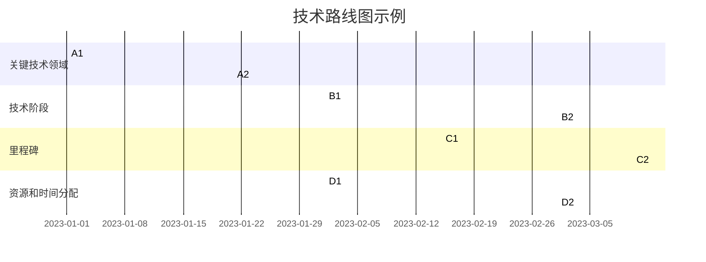

                 

### 技术战略的必要性

**1.1 时代背景**

在当今世界，技术变革的速度前所未有地加快。随着互联网、大数据、人工智能等新兴技术的快速发展，各行各业都在经历深刻的变革。传统的业务模式逐渐被颠覆，新的商业模式不断涌现。企业面临着前所未有的技术挑战，比如如何利用新技术提升竞争力、如何快速响应市场变化、如何应对日益激烈的国际竞争等。因此，制定科学有效的技术战略显得尤为重要。

**1.2 技术战略的定义与内涵**

技术战略是指企业在技术领域制定的一系列长远规划和发展目标，旨在通过技术手段提升企业的核心竞争力，实现可持续发展。它不仅包括技术研究方向和目标，还包括技术资源的配置、技术成果的转化以及技术团队的建设等方面。

**1.3 技术战略与业务战略的关系**

技术战略与业务战略是相辅相成的。业务战略决定了企业的发展方向和目标，而技术战略则提供了实现这些目标的手段和保障。技术战略需要紧密围绕业务战略进行制定，确保技术投入能够为业务发展提供实际支持。同时，技术战略也要具备前瞻性，引导企业适应未来的市场和技术发展趋势。

**1.4 技术战略的边界与外延**

技术战略的边界是指企业在技术领域所能触及的范围，这包括企业现有的技术能力和市场需求。技术战略的外延则是指企业在未来可能涉足的技术领域，这需要根据行业趋势和自身优势进行前瞻性规划。明确技术战略的边界与外延，有助于企业更好地把握发展机遇，规避潜在风险。

### 技术战略的定义与内涵

**技术战略的概念**

技术战略是企业为实现长期发展目标，通过系统性的技术规划和管理，确保技术资源有效配置，以提升企业核心竞争力的一系列行动和策略。

**技术战略的组成部分**

1. **技术规划**：包括技术发展方向、技术路线图和技术目标等。
2. **技术管理**：涉及技术团队管理、技术创新管理、技术成果转化管理等。
3. **技术资源分配**：确定技术研发投入、人力和资金等资源的合理分配。
4. **技术风险管理**：识别和管理技术发展中的潜在风险，确保战略实施的安全性。

**技术战略的核心目标**

1. **提升核心竞争力**：通过技术领先，增强企业在市场中的竞争地位。
2. **实现可持续发展**：确保企业能够长期保持技术优势，适应市场变化。
3. **优化资源配置**：通过科学规划，提高技术研发和运营效率。

### 技术战略与业务战略的关系

**技术战略与业务战略的互动**

技术战略和业务战略之间存在着密切的互动关系。业务战略决定了企业的长远发展方向和目标，而技术战略则为这些目标提供了实现路径和保障。例如，在创新型企业中，技术战略通常是以市场需求为导向，通过技术创新来推动业务增长。

**技术战略在企业战略中的地位**

技术战略在企业战略中具有至关重要的地位。它不仅是企业实现业务目标的技术支撑，也是企业保持竞争优势的重要手段。一个成功的技术战略能够帮助企业快速响应市场变化，抢占先机，实现可持续发展。

**技术战略与竞争力**

技术战略对企业的竞争力有着深远的影响。通过技术领先，企业能够在产品和服务上实现差异化，提高客户满意度，从而在市场中获得更大的话语权。同时，技术战略还能够提升企业的生产效率，降低运营成本，进一步提高企业的竞争力。

### 技术战略的边界与外延

**技术战略的边界**

技术战略的边界主要取决于企业的现有技术能力和市场需求。企业需要根据自身的技术积累和市场定位，明确技术发展的边界，确保战略的可行性和有效性。

**技术战略的外延**

技术战略的外延是指企业在未来可能涉足的技术领域。这需要企业对行业趋势和技术发展方向进行前瞻性分析，结合自身优势进行规划。例如，随着人工智能、大数据等新兴技术的崛起，企业可以考虑将这些技术作为未来的发展重点。

**明确技术战略的边界与外延的重要性**

明确技术战略的边界与外延，有助于企业更好地把握发展机遇，规避潜在风险。这不仅能确保企业当前的技术发展有序进行，还能为未来的技术创新提供方向和指引。

### 核心概念与联系

**2.1 技术要素**

**定义**：技术要素是指构成技术系统的基本单元，包括硬件、软件、数据、算法等。

**分类**：

- **硬件**：如计算机、服务器、网络设备等。
- **软件**：如操作系统、数据库、应用软件等。
- **数据**：如用户数据、市场数据、产品数据等。
- **算法**：如机器学习算法、数据处理算法、加密算法等。

**属性特征对比表格**

| 技术要素 | 描述 | 重要性 |
| --- | --- | --- |
| 硬件 | 提供计算和存储能力的基础设施 | 高 |
| 软件 | 管理硬件资源并执行具体任务 | 高 |
| 数据 | 技术运作的基础，支持决策和优化 | 高 |
| 算法 | 实现特定功能的计算规则和方法 | 高 |

**2.2 技术战略概念框架**

**概念框架的ER图架构**

（此处使用Mermaid绘制ER图）

```mermaid
erDiagram
  TechStrat ||--|{ TechPlan }  : 实现技术规划
  TechStrat ||--|{ TechManage } : 管理技术创新
  TechStrat ||--|{ ResourceAlloc } : 分配技术资源
  TechStrat ||--|{ RiskManage } : 风险管理
  TechPlan ||--|{ TechGoal } : 确定技术目标
  TechPlan ||--|{ TechRouteMap } : 制定技术路线图
  TechManage ||--|{ TeamManage } : 团队管理
  TechManage ||--|{ InnovManage } : 创新管理
  TechManage ||--|{ ResultTrans } : 成果转化
  ResourceAlloc ||--|{ TechInvest } : 技术投资
  ResourceAlloc ||--|{ HumanAlloc } : 人力资源分配
  RiskManage ||--|{ RiskIdentify } : 风险识别
  RiskManage ||--|{ RiskControl } : 风险控制
```

**概念框架的组成部分**

- **技术战略**：核心概念，包括多个子概念。
- **技术规划**：制定技术目标和路线图。
- **技术管理**：技术创新、团队管理、成果转化等。
- **资源分配**：技术投资、人力资源等。
- **风险管理**：识别和控制风险。

**2.3 技术战略与相关概念的联系**

**技术战略与创新**

技术战略与创新之间紧密相连。创新是技术战略的核心驱动力，通过持续创新，企业可以不断优化技术，提升竞争力。技术战略需要围绕创新进行规划，确保创新资源得到充分利用。

**技术战略与风险管理**

技术战略与风险管理同样密不可分。在技术发展过程中，企业不可避免地会遇到各种风险。有效的技术战略需要包括风险管理，确保技术项目能够顺利进行，避免因风险导致项目失败。

**技术战略与人力资源**

人力资源是技术战略的重要支撑。企业需要通过技术战略吸引、培养和保留优秀的科技人才，确保技术团队能够高效运作，推动技术发展。

### 核心概念与联系

**2.1 技术要素**

**定义**：技术要素是指构成技术系统的基本单元，包括硬件、软件、数据、算法等。

**分类**：

- **硬件**：提供计算和存储能力的基础设施，如计算机、服务器、网络设备等。
- **软件**：管理硬件资源并执行具体任务，如操作系统、数据库、应用软件等。
- **数据**：技术运作的基础，支持决策和优化，如用户数据、市场数据、产品数据等。
- **算法**：实现特定功能的计算规则和方法，如机器学习算法、数据处理算法、加密算法等。

**属性特征对比表格**

| 技术要素 | 描述 | 重要性 |
| --- | --- | --- |
| 硬件 | 提供计算和存储能力的基础设施 | 高 |
| 软件 | 管理硬件资源并执行具体任务 | 高 |
| 数据 | 技术运作的基础，支持决策和优化 | 高 |
| 算法 | 实现特定功能的计算规则和方法 | 高 |

**2.2 技术战略概念框架**

**概念框架的ER图架构**

（此处使用Mermaid绘制ER图）

```mermaid
erDiagram
  TechStrat ||--|{ TechPlan }  : 实现技术规划
  TechStrat ||--|{ TechManage } : 管理技术创新
  TechStrat ||--|{ ResourceAlloc } : 分配技术资源
  TechStrat ||--|{ RiskManage } : 风险管理
  TechPlan ||--|{ TechGoal } : 确定技术目标
  TechPlan ||--|{ TechRouteMap } : 制定技术路线图
  TechManage ||--|{ TeamManage } : 团队管理
  TechManage ||--|{ InnovManage } : 创新管理
  TechManage ||--|{ ResultTrans } : 成果转化
  ResourceAlloc ||--|{ TechInvest } : 技术投资
  ResourceAlloc ||--|{ HumanAlloc } : 人力资源分配
  RiskManage ||--|{ RiskIdentify } : 风险识别
  RiskManage ||--|{ RiskControl } : 风险控制
```

**概念框架的组成部分**

- **技术战略**：核心概念，包括多个子概念。
- **技术规划**：制定技术目标和路线图。
- **技术管理**：技术创新、团队管理、成果转化等。
- **资源分配**：技术投资、人力资源等。
- **风险管理**：识别和控制风险。

**2.3 技术战略与相关概念的联系**

**技术战略与创新**

技术战略与创新之间紧密相连。创新是技术战略的核心驱动力，通过持续创新，企业可以不断优化技术，提升竞争力。技术战略需要围绕创新进行规划，确保创新资源得到充分利用。

**技术战略与风险管理**

技术战略与风险管理同样密不可分。在技术发展过程中，企业不可避免地会遇到各种风险。有效的技术战略需要包括风险管理，确保技术项目能够顺利进行，避免因风险导致项目失败。

**技术战略与人力资源**

人力资源是技术战略的重要支撑。企业需要通过技术战略吸引、培养和保留优秀的科技人才，确保技术团队能够高效运作，推动技术发展。

### 技术战略规划流程

**3.1 技术战略规划步骤**

1. **技术需求分析**：了解企业的技术需求，包括现有技术瓶颈、市场趋势、客户需求等。

2. **技术趋势分析**：分析当前和未来的技术发展趋势，了解新兴技术的潜在影响。

3. **技术评估与选择**：评估各种技术方案的优势和劣势，选择最适合企业需求的技术路径。

**技术需求分析**

技术需求分析是企业制定技术战略的第一步。通过深入了解企业的现有技术状况、市场趋势和客户需求，可以明确企业需要解决的技术问题和优化方向。具体步骤如下：

- **现状评估**：评估企业现有技术的性能、稳定性和安全性等。
- **市场调研**：收集市场数据，了解行业发展趋势和竞争对手的技术状况。
- **用户反馈**：通过用户调研、反馈等方式，获取客户对现有技术的需求和期望。

**技术趋势分析**

技术趋势分析是了解未来技术发展方向的重要环节。通过分析当前技术趋势和预测未来技术发展方向，企业可以把握先机，提前布局，为技术战略的制定提供依据。具体步骤如下：

- **行业报告**：查阅行业报告，了解新兴技术的应用场景和未来发展趋势。
- **技术论文**：阅读相关技术论文，了解前沿技术的原理和实现方法。
- **专家咨询**：与行业专家、技术顾问等进行交流，获取专业的技术见解。

**技术评估与选择**

技术评估与选择是技术战略规划的核心环节。通过对各种技术方案进行综合评估，选择最适合企业需求的技术路径，能够确保技术战略的有效实施。具体步骤如下：

- **方案列表**：列出所有可能的技术方案，包括其优势、劣势、实施难度等。
- **评估指标**：制定评估指标，如技术成熟度、成本效益、实施周期等。
- **决策过程**：根据评估结果，进行多方案比较和决策，选择最优技术方案。

### 技术战略目标设定

**技术战略目标设定原则**

技术战略目标的设定需要遵循以下原则：

- **明确性**：目标应具体、清晰，便于衡量和实现。
- **可行性**：目标应在现有资源和条件下可实现。
- **挑战性**：目标应具有一定挑战性，激励团队努力实现。
- **一致性**：目标应与企业的整体发展战略保持一致。

**技术战略目标的层次结构**

技术战略目标可以分为以下三个层次：

1. **总体目标**：企业长期技术发展的总体方向和目标。
2. **阶段目标**：根据企业的发展阶段设定的短期目标，通常为3-5年。
3. **具体目标**：具体实现总体目标和阶段目标的行动方案和具体指标。

**技术战略目标设定的步骤**

1. **确定总体目标**：根据企业的愿景和使命，明确技术发展的总体方向。
2. **制定阶段目标**：结合企业的战略规划，设定短期内的技术发展目标。
3. **分解具体目标**：将阶段目标分解为具体行动方案和指标，确保目标的实现。

### 技术路线图制定

**技术路线图的概念**

技术路线图（Technology Roadmap）是一种战略规划工具，用于描绘企业技术发展的路径和时间表。它通过将技术目标分解为一系列可操作的任务和里程碑，帮助企业清晰地规划和实施技术战略。

**技术路线图的构建方法**

1. **确定关键技术领域**：根据企业的技术需求和行业发展趋势，确定需要重点发展的关键技术领域。
2. **制定技术阶段**：将技术发展分为多个阶段，每个阶段对应一个技术目标或任务。
3. **设定里程碑**：在每个技术阶段中设定明确的里程碑，作为评估进展的关键节点。
4. **分配资源和时间**：根据技术阶段和里程碑，合理分配资源（如人力、资金）和时间，确保技术发展的顺利推进。

**技术路线图的示例**

（此处使用Mermaid绘制技术路线图）



### 技术资源分配

**技术资源的分类**

技术资源主要包括以下几类：

- **人力资源**：包括技术团队、研发人员等。
- **资金资源**：用于技术研发、采购设备、培训等。
- **设备资源**：包括计算机、服务器、测试设备等。
- **知识资源**：包括专利、技术文档、行业标准等。

**技术资源分配的策略**

1. **优先级分配**：根据技术战略目标和项目优先级，合理分配资源，确保关键项目得到充足支持。
2. **弹性分配**：在资源紧张时，可以根据实际情况调整资源分配，确保关键任务优先完成。
3. **动态调整**：根据项目进展和实际情况，动态调整资源分配，确保资源利用最大化。

### 技术战略实施计划

**技术战略实施步骤**

1. **制定实施计划**：根据技术战略目标和路线图，制定具体的实施计划，明确任务分工、时间表和资源需求。
2. **分配责任**：将实施计划中的任务分配给相关团队成员，确保每个任务都有明确的负责人。
3. **启动项目**：按照实施计划启动项目，确保项目按照预定时间表推进。
4. **监控进度**：定期监控项目进度，确保项目按计划进行，及时调整计划和资源分配。
5. **评估结果**：项目完成后，对项目成果进行评估，总结经验教训，为后续项目提供参考。

**技术战略实施的关键点**

1. **明确目标**：确保每个团队成员都清楚项目的目标和预期成果。
2. **有效沟通**：保持团队成员之间的沟通畅通，确保信息传递准确无误。
3. **资源保障**：确保项目所需的人力、资金和设备资源得到充分保障。
4. **风险管理**：对项目进行风险评估，制定应对措施，确保项目顺利推进。
5. **持续改进**：在项目实施过程中，不断总结经验，持续优化技术战略的实施效果。

### 技ech战略监控与评估

**技术战略监控的方法**

1. **项目监控**：通过定期审查项目进度、质量、成本等方面，确保项目按计划推进。
2. **过程监控**：对技术研发过程进行监控，确保技术标准、流程和质量控制得到执行。
3. **绩效评估**：通过绩效考核，评估技术人员的工作绩效，激励团队持续改进。

**技术战略评估的指标体系**

1. **进度指标**：包括项目完成时间、任务完成率等。
2. **质量指标**：包括技术成果的质量、稳定性、可靠性等。
3. **成本指标**：包括技术研发成本、运营成本等。
4. **效益指标**：包括技术成果的市场表现、客户满意度等。

**技术战略评估的方法**

1. **定量评估**：通过数据分析和统计，评估技术战略的执行效果。
2. **定性评估**：通过专家评审、用户反馈等方式，评估技术战略的实施质量和效果。

### 技术战略调整与优化

**技术战略调整的原则**

1. **适应性原则**：根据市场和技术环境的变化，及时调整技术战略，确保其适应性和前瞻性。
2. **灵活性原则**：技术战略应具备灵活性，能够根据实际情况进行动态调整。
3. **持续性原则**：技术战略调整应保持连续性，确保长期目标的实现。

**技术战略优化的策略**

1. **目标调整**：根据企业发展战略和市场需求，重新设定技术战略目标，确保目标的明确性和可实现性。
2. **资源优化**：根据项目进展和资源需求，调整资源分配，确保资源的合理利用。
3. **流程优化**：优化技术研发和管理流程，提高效率和质量。
4. **技术升级**：引入新技术，提升技术水平和竞争力。

### 行业案例研究

**5.1 行业背景**

在当今信息化和智能化时代，信息技术行业正经历着前所未有的发展。大数据、人工智能、云计算等新兴技术不断涌现，推动了传统行业的变革和创新。信息技术行业以其高度的创新性和快速迭代的特点，成为了全球经济的重要引擎。在这个背景下，企业需要制定科学有效的技术战略，以应对激烈的市场竞争和技术变革。

**5.2 案例公司技术战略**

**公司介绍**：以A公司为例，该公司是一家全球领先的信息技术企业，专注于软件开发、系统集成和云计算服务。公司成立于2000年，经过多年的发展，已经成为全球信息技术市场的领军企业之一。

**技术战略**：

1. **技术创新**：A公司始终坚持技术创新，致力于研发前沿技术和解决方案。公司设立了多个研发中心，吸引了大量顶尖技术人才，推动了技术的不断突破和创新。

2. **云计算战略**：随着云计算技术的快速发展，A公司积极布局云计算市场，推出了一系列云计算解决方案，包括云计算平台、大数据处理、人工智能服务等。

3. **国际化发展**：A公司通过全球化布局，积极参与国际市场竞争，不断拓展海外市场。公司在全球范围内设立了多个分支机构，与多个国家和地区的企业建立了紧密的合作关系。

**5.3 案例分析**

**成功要素分析**：

1. **技术创新驱动**：A公司始终将技术创新作为企业发展的核心动力，通过持续的研发投入和人才引进，保持技术领先地位。

2. **战略前瞻性**：A公司具有强烈的战略前瞻性，能够及时捕捉市场和技术趋势，提前布局新兴技术领域。

3. **全球化运营**：A公司通过全球化运营，不仅在国内市场取得了优异成绩，还成功进入了多个国际市场，实现了业务的国际化发展。

**挑战与解决**：

1. **技术创新压力**：随着技术变革的加速，A公司面临着不断升级技术能力的压力。公司通过持续增加研发投入，加强技术创新体系建设，有效应对了这一挑战。

2. **国际化管理**：在国际化运营过程中，A公司遇到了文化差异、法律环境等管理挑战。公司通过建立国际化的管理团队，加强跨文化沟通和培训，提高了国际化管理水平。

### 技术选型策略

**技术选型策略原则**

1. **需求导向**：根据具体业务需求和场景选择合适的技术，确保技术选型的实用性和高效性。
2. **稳定性优先**：选择成熟稳定的技术方案，降低系统风险，保障长期运行稳定性。
3. **可扩展性**：选择能够支持业务未来扩展的技术，确保系统能够灵活适应业务需求变化。
4. **成本效益**：在满足需求的前提下，综合考虑技术成本和效益，选择性价比高的技术方案。

**技术选型方法**

1. **需求分析**：明确项目需求，包括功能需求、性能需求、安全需求等。
2. **市场调研**：收集市场上相关技术的信息，包括技术特点、性能指标、用户评价等。
3. **技术评估**：根据需求分析结果，对候选技术进行评估，比较其优缺点和适用性。
4. **决策**：综合考虑评估结果，选择最符合需求的技术方案。

### 技术团队建设

**技术团队组织结构**

1. **研发团队**：负责技术研发和产品开发，包括软件工程师、数据科学家、系统架构师等。
2. **测试团队**：负责系统测试和质量管理，包括测试工程师、自动化测试工程师等。
3. **运维团队**：负责系统运维和持续集成，包括运维工程师、运维经理等。
4. **支持团队**：提供技术支持和客户服务，包括技术支持工程师、客户服务代表等。

**技术团队激励机制**

1. **绩效奖金**：根据技术团队的工作绩效和贡献，发放绩效奖金，激励团队成员努力工作。
2. **股权激励**：为技术团队成员提供股权激励，分享企业的发展成果，提高团队凝聚力。
3. **职业发展**：提供职业发展路径和培训机会，帮助团队成员提升技能，实现职业成长。
4. **团队文化建设**：营造积极向上的团队文化，增强团队凝聚力和归属感。

### 技术风险管理

**技术风险识别**

技术风险识别是技术风险管理的重要环节。企业需要通过系统的方法，全面识别可能影响技术项目成功实施的风险因素。具体方法包括：

1. **历史数据分析**：分析企业历史项目中遇到的技术风险，总结风险发生的规律和原因。
2. **专家咨询**：邀请行业专家和技术顾问，对项目可能遇到的技术风险进行评估和预测。
3. **头脑风暴**：组织团队成员进行头脑风暴，收集和分析潜在的技术风险。

**技术风险应对策略**

1. **预防措施**：在项目规划阶段，制定预防措施，减少技术风险发生的可能性。例如，采用成熟的技术方案、加强代码审查、制定严格的测试计划等。
2. **应急计划**：制定应急计划，针对可能发生的重大技术风险，提前制定应对措施，确保项目能够迅速恢复正常运行。
3. **持续监控**：在项目实施过程中，持续监控技术风险的发展状况，及时发现和解决潜在问题。

### 技术战略评估方法

**技术战略评估指标**

1. **进度指标**：包括项目完成时间、任务完成率等，评估技术战略的实施进度。
2. **质量指标**：包括技术成果的质量、稳定性、可靠性等，评估技术战略的实施效果。
3. **成本指标**：包括技术研发成本、运营成本等，评估技术战略的经济效益。
4. **效益指标**：包括技术成果的市场表现、客户满意度等，评估技术战略的市场竞争力。

**技术战略评估工具**

1. **KPI（关键绩效指标）体系**：通过设定具体的技术战略KPI，对技术战略的实施效果进行量化评估。
2. **平衡计分卡**：从财务、客户、内部业务流程、学习与成长四个维度，全面评估技术战略的实施效果。
3. **SWOT分析**：通过分析企业的优势、劣势、机会和威胁，评估技术战略的适应性和有效性。

### 技术战略优化策略

**技术战略优化方法**

1. **数据驱动优化**：通过收集和分析项目实施过程中的数据，识别问题和改进点，对技术战略进行优化。
2. **持续改进**：建立持续改进机制，定期对技术战略进行回顾和调整，确保技术战略的动态优化。
3. **外部咨询**：邀请外部专家进行技术评估和咨询，提供新的思路和方法，推动技术战略的优化。

**技术战略优化的实践**

1. **案例分析**：通过具体案例，分析技术战略的优缺点，总结成功经验和教训，为技术战略优化提供参考。
2. **试点项目**：选择部分项目进行试点，通过实践验证技术战略的优化方案，为全面实施提供依据。
3. **员工培训**：加强对技术团队和管理层的培训，提高技术水平和战略思维，为技术战略优化提供人才保障。

### 技术战略的未来趋势

**8.1 技术趋势分析**

在未来的技术趋势中，以下几个领域值得关注：

1. **人工智能与机器学习**：随着算法和计算能力的提升，人工智能技术将继续深入到各个行业，推动智能化变革。
2. **区块链技术**：区块链技术将在金融、供应链管理等领域发挥重要作用，提高数据的安全性和透明度。
3. **物联网（IoT）**：物联网技术的广泛应用，将实现设备与设备的互联互通，推动智能家居、智慧城市等领域的快速发展。
4. **5G与6G通信技术**：5G和未来的6G通信技术将为高速、低延迟的网络连接提供支持，促进数字经济的发展。

**8.2 技术战略的演变**

技术战略的演变过程将呈现以下几个特点：

1. **更加重视技术创新**：未来技术战略将更加注重技术创新，通过持续研发和投入，保持企业的技术领先地位。
2. **跨行业融合**：技术战略将不再局限于单一行业，而是跨行业融合，形成新的商业模式和生态系统。
3. **敏捷性增强**：技术战略将更加注重敏捷性，能够快速响应市场变化和技术进步，实现动态调整。

**8.3 技术战略的新挑战**

面对未来技术趋势，企业将面临以下新挑战：

1. **数据安全与隐私**：随着数据量的爆炸性增长，如何保障数据安全和用户隐私将成为重要挑战。
2. **人才竞争**：技术人才的稀缺和竞争将加剧，企业需要通过创新的人才策略来吸引和保留顶尖人才。
3. **技术合规**：随着监管政策的不断加强，企业需要遵守相关法律法规，确保技术战略的合规性。

### 技术战略的总结与展望

**9.1 技术战略的关键要点**

技术战略的关键要点包括：

1. **需求导向**：紧密结合企业业务需求，确保技术战略的实用性和高效性。
2. **前瞻性规划**：关注行业趋势和新兴技术，提前布局，保持企业的技术领先地位。
3. **持续改进**：建立持续改进机制，定期评估和调整技术战略，确保其适应性和有效性。
4. **资源优化**：合理配置资源，提高技术研发和运营效率，实现技术战略的长期可持续发展。

**未来展望**

在未来的发展中，技术战略将继续发挥重要作用。企业需要密切关注技术趋势，持续创新，优化技术战略，以应对不断变化的市场环境和技术挑战。同时，企业还应加强技术创新、人才培养和合规管理，确保技术战略能够有效推动企业实现长期可持续发展。

### 总结

本文详细探讨了技术战略的制定与实施，从必要性、定义与内涵、核心概念与联系、规划流程、目标设定、路线图制定、资源分配、实施与监控、调整与优化，到行业案例研究和未来展望，全面系统地阐述了技术战略的重要性和实施方法。

**关键词**：技术战略、长期发展规划、技术创新、风险管理、资源优化

**摘要**：本文针对技术战略的制定和实施进行了深入分析，探讨了技术战略的必要性、核心概念、规划流程和优化策略，结合行业案例和实践，提出了科学有效的技术战略制定与实施方法，为企业提供了有益的参考和指导。

