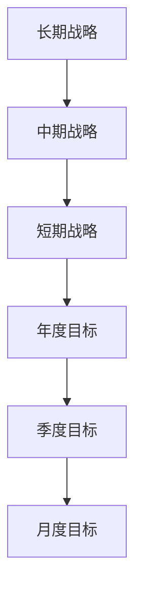

                 

## 前言

在当今数字化转型的浪潮中，技术已成为推动企业发展和变革的核心力量。技术战略的制定和实施，不仅关系到企业的短期生存，更关乎其长期发展。本文旨在探讨技术战略在企业发展中的重要性，分析如何对齐业务目标与技术发展，以及如何通过有效的技术战略实现企业的持续增长。

首先，我们将介绍技术战略的基本概念和组成部分，帮助读者理解技术战略在企业中的角色。接着，我们将深入探讨业务目标与技术发展的关系，解释为什么技术战略必须紧密围绕业务目标来制定。

随后，我们将分析当前的技术趋势，探讨这些趋势如何影响企业的技术决策，以及企业应该如何应对这些趋势。在此基础上，我们将详细讨论如何进行技术评估与选择，确保选定的技术方案能够满足业务需求并为企业带来价值。

文章的后半部分将介绍技术实施与落地的关键步骤，以及如何确保技术战略的成功实施。此外，我们还将探讨技术与组织的适配问题，分析如何调整组织结构、流程和文化以支持新技术的应用。

为了更好地理解技术战略的实际应用，我们将通过案例研究来展示技术战略在不同行业和企业中的成功实践。

最后，我们将总结全文的主要观点，并提出对未来的展望，帮助读者更好地理解和应用技术战略。

通过这篇文章，我们希望读者能够对技术战略有一个全面和深入的理解，学会如何将其有效地应用于企业的实际运营中，从而实现业务的持续增长和成功。

## 引言

### 1. 技术战略的重要性

在快速变化的市场环境中，企业面临着前所未有的竞争压力和挑战。技术战略作为企业长期发展规划的重要组成部分，已经成为企业保持竞争力、实现可持续发展的重要保障。技术战略不仅影响企业的当前运营，更决定其未来的发展方向和潜力。

首先，技术战略是企业创新的动力源泉。随着信息技术的飞速发展，新的技术、新的商业模式不断涌现，为企业提供了无限的创新空间。通过制定和实施技术战略，企业可以紧跟技术发展趋势，抓住创新机遇，推动业务的持续发展和变革。

其次，技术战略是提升企业竞争力的重要手段。在当今市场中，技术已成为核心竞争力之一。一个科学合理的技术战略可以帮助企业优化业务流程、提升运营效率，降低成本，提高客户满意度。同时，技术战略还可以帮助企业打造独特的竞争优势，巩固市场地位，实现业务的快速增长。

此外，技术战略是确保企业长期发展的关键。企业不仅需要关注短期业绩，更需要考虑长期的战略布局。技术战略可以帮助企业提前规划，提前布局，确保在未来的市场竞争中立于不败之地。

### 1.2 企业成功的驱动力

企业成功的驱动力多种多样，其中技术战略是关键因素之一。首先，技术战略可以提升企业的创新能力。在当今快速变化的市场环境中，创新能力是企业生存和发展的关键。通过制定和实施技术战略，企业可以积极推动技术创新，不断开发出符合市场需求的新产品和服务，从而提升市场竞争力。

其次，技术战略可以提升企业的运营效率。通过优化业务流程、引入先进的技术手段，企业可以显著降低运营成本，提高生产效率。例如，通过采用大数据分析技术，企业可以更精准地预测市场需求，优化库存管理，提高供应链效率。

此外，技术战略还可以提升企业的客户体验。随着消费者需求的日益个性化，企业需要提供更加优质、个性化的服务。通过技术战略，企业可以引入人工智能、云计算等技术，提供更加智能化、个性化的服务，提升客户满意度和忠诚度。

### 1.3 技术战略的核心目标

技术战略的核心目标主要包括以下几个方面：

1. **提升企业竞争力**：通过技术创新和业务流程优化，提升企业的市场竞争力，确保在激烈的市场竞争中保持领先地位。

2. **实现可持续发展**：通过合理的技术规划和技术投资，确保企业的长期可持续发展，避免短期行为导致的长远损失。

3. **优化业务流程**：通过引入先进的技术手段，优化业务流程，提高运营效率，降低成本，提升客户满意度。

4. **推动业务增长**：通过技术战略，抓住市场机遇，推动业务增长，实现企业的持续发展。

5. **提升创新能力**：通过技术战略，激发企业的创新能力，不断推出符合市场需求的新产品和服务，保持企业的竞争力。

### 1.4 技术战略的组成部分

技术战略的组成部分包括以下几个方面：

1. **愿景与目标**：明确企业未来发展的愿景和目标，确保技术战略与企业的整体战略保持一致。

2. **技术规划**：制定详细的技术规划，包括技术发展方向、技术投资计划、技术发展路线图等。

3. **技术创新**：推动技术创新，通过研发、合作、收购等方式，不断引进和开发新技术，提升企业的技术能力。

4. **技术投资**：合理安排技术投资，确保技术战略的有效实施，同时控制技术投资风险。

5. **组织与流程**：调整组织结构，优化业务流程，确保技术战略的顺利实施。

6. **风险与应对**：识别技术战略实施过程中可能遇到的风险，制定相应的风险应对策略。

### 1.5 制定技术战略的步骤

制定技术战略的步骤如下：

1. **评估当前状况**：分析企业的技术现状，包括技术能力、技术资源、技术需求等。

2. **确定目标与愿景**：明确企业的发展愿景和技术目标，确保技术战略与企业的整体战略一致。

3. **分析市场与趋势**：分析市场趋势和竞争环境，了解市场需求和技术发展方向。

4. **制定技术规划**：根据评估结果和市场分析，制定详细的技术规划，包括技术发展方向、技术投资计划等。

5. **制定实施计划**：制定技术战略的实施计划，包括组织与流程调整、技术投资计划、项目推进计划等。

6. **评估与优化**：定期评估技术战略的实施效果，根据实际情况进行优化调整。

### 1.6 技术战略与业务战略的关系

技术战略与业务战略密切相关，二者相互支撑、相互促进。技术战略必须紧密围绕业务战略来制定，以确保技术投入能够有效地支持业务发展。

首先，技术战略必须与业务目标对齐。技术战略的制定需要考虑企业的业务需求和发展方向，确保技术投入能够推动业务目标的实现。

其次，技术战略需要与业务战略相互协调。技术战略的制定和实施过程需要与业务战略保持一致，确保各项技术投入和业务活动能够相互支持、相互促进。

此外，技术战略还需要考虑业务战略的变化。随着市场环境和业务需求的变化，技术战略需要及时调整，以确保技术投入能够持续支持业务发展。

### 1.7 总结

通过本文的介绍，我们可以看到技术战略在企业中的重要性不可忽视。技术战略不仅能够提升企业的竞争力，优化业务流程，推动业务增长，还能够确保企业的长期可持续发展。因此，企业需要高度重视技术战略的制定和实施，将其作为企业发展的核心驱动力。

## 第1章：技术战略概述

### 1.1 技术战略的定义

技术战略是指企业为了实现其长期目标，通过技术手段进行资源优化配置，推动技术创新和业务发展的一系列规划和行动。技术战略不仅涉及技术本身，还包括技术管理、技术投资、技术人才等方面。其核心目标是提升企业的技术竞争力，实现业务目标和市场定位。

技术战略的定义可以从以下几个方面来理解：

1. **技术视角**：技术战略关注的是技术本身的发展和应用，包括新技术的引入、现有技术的优化以及技术创新。

2. **管理视角**：技术战略是企业管理的重要组成部分，涉及到技术资源的配置、技术管理的流程和体系。

3. **投资视角**：技术战略是企业长期投资的重要方向，关系到企业的研发投入、技术并购等决策。

4. **业务视角**：技术战略的最终目的是服务于企业的业务目标，通过技术手段提升企业的市场竞争力。

### 1.1.1 技术战略的概念

技术战略的概念可以进一步细分为以下几个方面：

1. **技术路线**：指企业选择的技术发展方向和路径，包括技术升级、技术替代、技术整合等。

2. **技术优先级**：根据企业的业务需求和资源状况，确定技术投资的重点和优先级。

3. **技术创新**：通过研发投入、技术合作、技术收购等方式，推动技术创新，提升企业的技术竞争力。

4. **技术管理**：包括技术规划、技术评估、技术风险管理等，确保技术战略的顺利实施。

5. **技术投资**：根据企业的发展阶段和市场环境，合理安排技术投资，确保技术战略的有效实施。

### 1.1.2 技术战略的要素

技术战略的要素主要包括以下几个方面：

1. **愿景与目标**：明确企业未来在技术领域的愿景和目标，确保技术战略与企业的整体战略保持一致。

2. **市场分析**：分析市场需求、竞争对手、技术趋势等，为技术战略提供市场依据。

3. **技术评估**：评估现有技术状况，确定技术投资的重点和优先级。

4. **技术创新**：通过研发投入、技术合作、技术收购等方式，推动技术创新。

5. **技术管理**：建立健全技术管理体系，确保技术战略的顺利实施。

6. **人才战略**：培养和引进技术人才，提升企业的技术竞争力。

7. **风险管理**：识别和应对技术战略实施过程中的各种风险。

### 1.2 技术战略的类型

技术战略可以根据不同维度进行分类，常见的类型包括：

1. **长期战略**：涉及企业的长期发展目标，通常跨越数年甚至更长时间。长期战略注重技术前沿的探索和创新，关注企业未来的技术发展方向。

2. **中期战略**：通常涵盖1-3年的时间范围，侧重于将长期战略转化为具体的行动方案，实现阶段性目标。

3. **短期战略**：通常为1年以内的战略，侧重于解决当前的业务需求，快速响应市场变化。

### 1.2.1 长期战略

长期战略的主要特点包括：

1. **远见性**：注重对未来技术趋势的预见和布局，确保企业在未来市场竞争中占据优势。

2. **创新性**：鼓励技术创新和研发投入，推动企业技术水平的提升。

3. **持续投资**：需要持续的资金投入，确保技术的持续进步和企业的长期发展。

4. **全球化**：考虑全球化因素，布局国际市场，提升企业的国际竞争力。

### 1.2.2 中期战略

中期战略的主要特点包括：

1. **可操作性**：将长期战略分解为具体的行动方案，具有可操作性。

2. **阶段性目标**：设定明确的阶段性目标，确保技术战略的逐步实现。

3. **资源配置**：合理安排资源配置，确保技术战略的顺利实施。

4. **风险控制**：识别和应对中期实施过程中的风险。

### 1.2.3 短期战略

短期战略的主要特点包括：

1. **灵活性**：快速响应市场变化，调整技术战略。

2. **快速见效**：侧重于解决当前的业务问题，快速提升企业的市场竞争力。

3. **资源集中**：集中有限的资源，实现短期目标。

4. **灵活性调整**：根据市场反馈，灵活调整技术战略。

### 1.3 技术战略与业务战略的融合

技术战略与业务战略的融合是确保企业技术投入能够有效支持业务发展的关键。以下是如何实现技术战略与业务战略融合的几个方面：

1. **目标一致性**：确保技术战略与业务战略的目标一致，避免资源的浪费和冲突。

2. **业务导向**：技术战略的制定和实施应紧密结合业务需求，确保技术投入能够推动业务发展。

3. **协同发展**：通过协同发展，实现技术和业务的共同进步，形成企业独特的竞争优势。

4. **持续优化**：不断优化技术战略和业务战略，确保二者能够持续融合，保持企业的竞争力。

### 1.4 技术战略的制定方法

制定技术战略的方法包括以下几个方面：

1. **市场分析**：分析市场需求、竞争对手和行业趋势，为技术战略提供市场依据。

2. **技术评估**：评估现有技术状况，确定技术投资的重点和优先级。

3. **技术创新**：通过研发投入、技术合作、技术收购等方式，推动技术创新。

4. **风险评估**：识别技术战略实施过程中的风险，制定相应的风险应对策略。

5. **战略规划**：制定详细的技术战略规划，包括技术路线图、技术投资计划等。

### 1.5 技术战略的实施与评估

技术战略的实施与评估是确保技术战略有效落地的重要环节。以下是如何实施和评估技术战略的几个方面：

1. **实施计划**：制定详细的技术战略实施计划，包括项目推进计划、资源配置计划等。

2. **执行监控**：建立执行监控机制，确保技术战略的顺利实施。

3. **效果评估**：定期评估技术战略的实施效果，包括技术成果、业务效益等。

4. **持续优化**：根据评估结果，持续优化技术战略，确保其与业务需求保持一致。

### 1.6 总结

通过本章的介绍，我们可以看到技术战略在企业发展中的重要性。技术战略不仅是企业技术创新的驱动力，也是提升企业竞争力、实现业务目标的重要手段。企业需要根据自身的实际情况，制定科学合理的技术战略，并确保其与业务战略的融合，以实现企业的长期可持续发展。

## 第2章：业务目标与技术发展的关系

### 2.1 业务目标的重要性

业务目标是企业发展的核心导向，直接决定了企业的战略方向和资源配置。一个明确且可行的业务目标能够帮助企业聚焦资源，优化业务流程，提高运营效率，实现企业的可持续发展。

首先，业务目标为企业提供了清晰的方向。明确的目标可以指导企业制定战略规划和决策，确保所有业务活动都朝着共同的目标努力，从而避免资源的浪费和战略失误。

其次，业务目标有助于企业优化资源配置。通过设定业务目标，企业可以明确资源投入的重点领域，确保有限的资源得到最大化利用，提高企业的运营效率。

此外，业务目标还能够激发员工的积极性和创造力。明确的目标能够为员工提供清晰的工作方向和目标，激励员工发挥自己的潜能，为企业创造更大的价值。

### 2.1.1 业务目标对企业的影响

业务目标对企业的影响是多方面的，主要体现在以下几个方面：

1. **战略方向**：业务目标为企业提供了明确的发展方向，指导企业制定长期和短期的战略规划。

2. **资源配置**：业务目标有助于企业优化资源配置，确保资源投入与业务需求相匹配，提高运营效率。

3. **绩效评估**：业务目标为企业的绩效评估提供了依据，帮助企业衡量业务活动的成效，识别改进的机会。

4. **组织管理**：业务目标能够促进企业内部的管理优化，提高组织结构的灵活性和响应速度。

### 2.1.2 业务目标的构成

业务目标通常由以下几个要素构成：

1. **目标描述**：明确表达企业希望达到的业务状态或结果，例如市场份额、收入增长、客户满意度等。

2. **目标范围**：定义目标适用的范围，包括具体的产品、服务、市场或部门。

3. **目标时间**：设定目标实现的时间框架，例如年度、季度或月度目标。

4. **衡量标准**：定义如何衡量目标的实现程度，例如增长率、利润率、客户满意度等指标。

5. **责任归属**：明确每个目标的责任人，确保目标实现的监督和执行。

### 2.2 技术发展对业务目标的支撑

技术发展对业务目标的支撑作用不可忽视。通过引入和应用新技术，企业可以实现业务的创新和提升，从而实现业务目标。

首先，新技术能够提高企业的运营效率。例如，通过自动化和智能化技术，企业可以优化生产流程，减少人为错误，提高生产效率。

其次，新技术能够帮助企业拓展新的业务领域。例如，物联网、大数据分析等新兴技术可以帮助企业开发新的产品和服务，开拓新的市场。

此外，新技术还能够提升企业的客户体验。通过人工智能、虚拟现实等技术，企业可以提供更加个性化、智能化的服务，提升客户满意度和忠诚度。

### 2.2.1 技术进步的驱动力

技术进步是推动企业发展的重要驱动力，主要体现在以下几个方面：

1. **创新驱动**：新技术、新理念的不断涌现，激发企业的创新活力，推动业务模式的创新。

2. **成本降低**：新技术的应用可以降低企业的运营成本，提高盈利能力。

3. **效率提升**：新技术能够优化业务流程，提高运营效率，减少资源浪费。

4. **市场拓展**：新技术可以帮助企业开拓新的市场和业务领域，实现业务的持续增长。

### 2.2.2 技术创新与业务拓展

技术创新与业务拓展是相互促进的。通过技术创新，企业可以实现业务的拓展和增长，同时，业务的拓展也为技术创新提供了新的应用场景和需求。

首先，技术创新可以为企业带来新的业务机会。例如，通过物联网技术，企业可以开发智能家居、智能交通等新产品，开拓新的市场。

其次，技术创新可以提升企业的业务效率。例如，通过大数据分析技术，企业可以优化库存管理，提高供应链效率。

此外，技术创新还可以提升企业的客户体验。通过虚拟现实、人工智能等技术，企业可以提供更加个性化和智能化的服务，提升客户满意度和忠诚度。

### 2.3 技术选择与业务目标匹配

技术选择与业务目标的匹配是确保技术投资能够有效支持业务发展的关键。以下是如何进行技术选择，确保其与业务目标匹配的几个方面：

1. **需求分析**：深入了解业务需求，明确技术需求和应用场景。

2. **市场调研**：分析市场需求和竞争状况，了解新技术的发展趋势。

3. **技术评估**：评估不同技术方案的技术成熟度、成本效益和风险。

4. **优先级排序**：根据业务需求和技术评估结果，确定技术投资的优先级。

5. **试点实施**：选择合适的技术方案进行试点，验证其在实际业务中的应用效果。

6. **持续优化**：根据试点结果，持续优化技术方案，确保其与业务目标的最佳匹配。

### 2.4 技术发展的风险与机遇

技术发展既带来了机遇，也伴随着风险。企业需要充分认识到技术发展的影响，合理应对风险，抓住机遇。

首先，技术发展带来的风险包括：

1. **技术落后**：如果企业未能及时跟进技术发展趋势，可能导致技术落后，失去竞争优势。

2. **投资风险**：新技术投资可能存在较大的不确定性，可能导致资金浪费。

3. **人才短缺**：新技术的应用可能需要特定的人才支持，企业可能面临人才短缺的风险。

其次，技术发展带来的机遇包括：

1. **市场拓展**：新技术可以帮助企业开拓新的市场和业务领域。

2. **业务创新**：新技术可以激发企业的创新活力，推动业务模式的创新。

3. **效率提升**：新技术可以优化业务流程，提高运营效率，降低成本。

企业需要通过以下方式应对技术发展的风险和抓住机遇：

1. **风险识别**：建立风险识别机制，及时发现和应对技术风险。

2. **技术创新**：鼓励技术创新，提升企业的技术竞争力。

3. **人才发展**：培养和引进技术人才，确保企业具备应对技术发展的能力。

4. **战略规划**：制定详细的技术战略规划，确保技术发展的有序进行。

### 2.5 案例分析

为了更好地理解技术发展对业务目标的支撑作用，以下是一个案例分析：

**案例背景**：某家电制造企业希望通过引入新技术提升生产效率和产品质量。

**案例分析**：

1. **需求分析**：企业分析了现有生产流程，发现存在生产效率低、产品质量不稳定等问题。

2. **技术评估**：企业评估了多种技术方案，包括自动化生产线、人工智能质量检测等。

3. **技术选择**：企业选择了自动化生产线和人工智能质量检测技术，这些技术能够有效提升生产效率和产品质量。

4. **试点实施**：企业在一个生产线进行试点，验证技术的效果。

5. **效果评估**：试点结果显示，自动化生产线显著提高了生产效率，人工智能质量检测显著提高了产品质量。

6. **全面推广**：根据试点结果，企业决定在所有生产线推广这些技术，实现全厂的运营优化。

**案例启示**：

1. **明确需求**：在引入新技术之前，必须明确业务需求，确保技术选型的针对性。

2. **全面评估**：在技术评估过程中，要综合考虑技术成熟度、成本效益和风险等因素。

3. **试点验证**：通过试点验证技术的实际效果，确保技术能够有效支持业务目标。

4. **持续优化**：在技术实施后，要持续评估和优化，确保技术的长期效果。

### 2.6 总结

通过本章的介绍，我们可以看到技术发展对业务目标的支撑作用至关重要。企业需要根据业务目标选择合适的技术方案，通过技术创新和优化，不断提升企业的运营效率和市场竞争力。同时，企业也需要认识到技术发展的风险，通过合理的战略规划和风险管理，确保技术发展能够为企业带来持续的价值。

## 第3章：技术趋势分析

### 3.1 当前技术趋势概述

当前，技术发展呈现出多元化、快速化、智能化等趋势。以下是一些重要的技术趋势，它们将对未来的业务和技术战略产生深远的影响。

#### 3.1.1 人工智能

人工智能（AI）是当前最热门的技术趋势之一。AI技术包括机器学习、深度学习、自然语言处理等，已经被广泛应用于各个行业，如金融、医疗、制造、零售等。随着算法的进步和计算能力的提升，人工智能正逐渐从辅助决策走向替代人类决策，成为企业提升效率和创新能力的重要工具。

#### 3.1.2 区块链

区块链技术通过去中心化的方式，实现了数据的分布式存储和不可篡改。区块链技术已经在金融、供应链管理、医疗记录管理等领域得到了广泛应用。随着技术的成熟和应用的深入，区块链有望成为企业数据安全和信任机制的重要支撑。

#### 3.1.3 物联网

物联网（IoT）通过连接各种设备和传感器，实现了数据的实时采集和分析。物联网技术已经广泛应用于智能家居、智能城市、智能制造等领域，通过数据的智能化处理，为企业提供了优化运营、提升效率的新途径。

#### 3.1.4 5G

5G技术的快速发展，为物联网和人工智能提供了更高速、更稳定的网络环境。5G技术不仅提高了数据传输速度，还降低了延迟，使得实时数据处理和分析成为可能。5G技术将在智能制造、自动驾驶、远程医疗等领域发挥重要作用。

#### 3.1.5 大数据分析

大数据分析技术通过对海量数据的挖掘和分析，为企业提供了洞察业务模式、优化决策的重要工具。大数据分析技术已经在市场营销、供应链管理、客户关系管理等领域得到了广泛应用。

### 3.2 技术趋势对业务的影响

技术趋势对业务的影响是全方位的，以下是一些主要影响：

#### 3.2.1 新兴技术的应用场景

随着新兴技术的不断发展，企业可以探索更多的应用场景，提升业务效率和创新能力。例如：

- **智能制造**：通过物联网和人工智能技术，实现生产设备的智能化管理和优化，提高生产效率和产品质量。

- **智慧零售**：通过大数据分析和人工智能技术，实现个性化营销和客户服务，提升客户满意度和忠诚度。

- **智慧医疗**：通过区块链和大数据分析技术，实现医疗数据的共享和安全存储，提高医疗服务的质量和效率。

- **智慧城市**：通过物联网和大数据分析技术，实现城市资源的优化配置和管理，提升城市居民的生活质量。

#### 3.2.2 技术变革带来的机遇与挑战

技术变革为业务带来了新的机遇，同时也带来了挑战。以下是一些关键点：

- **机遇**：

  - 提升业务效率：通过自动化和智能化技术，减少人为干预，提高业务效率和准确性。

  - 创新业务模式：通过新技术，企业可以探索新的商业模式，开拓新的市场。

  - 提升客户体验：通过个性化服务和智能化的客户体验，增强客户满意度和忠诚度。

- **挑战**：

  - 技术投资：新兴技术的引入需要较大的资金投入，企业需要平衡短期和长期的投资回报。

  - 人才培养：新兴技术的应用需要具备相应技能的人才，企业需要投入资源进行人才培训。

  - 数据安全和隐私：随着数据量的大幅增加，数据安全和隐私保护成为企业面临的重大挑战。

### 3.3 技术趋势分析与预测

技术趋势的分析与预测是制定技术战略的重要环节。以下是一些常见的方法：

#### 3.3.1 市场研究报告

市场研究报告提供了行业趋势、技术发展状况、市场规模和竞争状况等方面的数据和分析。通过分析市场研究报告，企业可以了解当前的技术趋势和发展方向。

#### 3.3.2 技术趋势预测方法

技术趋势预测方法包括：

- **专家访谈**：通过访谈行业专家和学者，了解他们的观点和预测。

- **历史数据趋势分析**：通过对历史数据进行分析，识别技术发展的趋势和规律。

- **趋势预测模型**：使用数学模型和机器学习算法，对技术发展趋势进行预测。

- **专利分析**：通过分析专利数据，了解技术发展的热点和方向。

### 3.4 技术趋势的应对策略

为了应对技术趋势，企业可以采取以下策略：

#### 3.4.1 技术投资策略

- **长期投资**：对于关键技术，企业应采取长期投资策略，确保技术的持续进步。

- **多元化投资**：企业可以分散投资，同时关注多个技术领域，降低投资风险。

- **合作伙伴**：与高校、科研机构和行业领先企业合作，共同推动技术创新。

#### 3.4.2 技术创新路径

- **内部研发**：企业应建立强大的研发团队，推动内部技术创新。

- **开放创新**：通过开放创新平台，吸引外部创新资源，共同推进技术进步。

- **技术合作**：与产业链上下游企业合作，共同研发和推广新技术。

#### 3.4.3 技术风险管理

- **风险评估**：对技术投资进行风险评估，制定风险应对策略。

- **技术储备**：建立技术储备，应对可能的技术风险。

- **人才储备**：培养和引进技术人才，确保企业具备应对技术变化的能力。

### 3.5 总结

通过技术趋势分析，企业可以更好地把握市场动态，制定科学合理的技术战略，抓住技术变革带来的机遇，提升企业的竞争力。企业需要密切关注技术趋势，采取有效的应对策略，确保技术发展能够为企业带来持续的价值。

## 第4章：技术评估与选择

### 4.1 技术评估的重要性

技术评估是企业制定技术战略和决策过程中至关重要的一环。通过技术评估，企业可以全面了解新技术或技术方案的优势、劣势、风险和成本，从而做出科学合理的决策。技术评估的重要性主要体现在以下几个方面：

1. **确保技术投资的有效性**：技术评估可以帮助企业识别哪些技术或技术方案能够真正为企业带来价值，避免盲目投资和资源浪费。

2. **降低技术风险**：通过技术评估，企业可以识别潜在的技术风险，提前制定应对措施，降低技术实施过程中的不确定性。

3. **优化资源配置**：技术评估有助于企业合理分配资源，确保技术投资与业务目标相匹配，提高资源配置的效率。

4. **提升竞争力**：通过技术评估，企业可以不断优化和升级技术，保持技术领先地位，提升市场竞争力和创新能力。

### 4.1.1 技术评估的目标

技术评估的目标主要包括以下几个方面：

1. **确定技术可行性**：评估新技术或技术方案的可行性，包括技术实现难度、技术成熟度等。

2. **评估技术效益**：评估新技术或技术方案对企业效益的影响，包括成本效益、市场前景、业务价值等。

3. **评估技术风险**：识别新技术或技术方案可能面临的风险，包括技术风险、市场风险、财务风险等。

4. **制定决策依据**：提供全面、准确的技术评估结果，为企业制定技术决策提供科学依据。

### 4.1.2 技术评估的原则

在进行技术评估时，应遵循以下原则：

1. **客观公正**：评估过程应保持客观、公正，避免主观偏见和利益冲突。

2. **全面系统**：评估应覆盖技术的各个方面，包括技术可行性、经济效益、风险等。

3. **数据驱动**：评估应基于充分的数据和事实，避免凭主观臆断做出决策。

4. **动态调整**：技术评估应是一个动态的过程，根据实际情况和市场变化进行及时调整。

### 4.2 技术评估方法

技术评估的方法多种多样，以下是一些常见的技术评估方法：

1. **成本效益分析**：通过计算技术投资与预期效益的比率，评估技术方案的成本效益。

2. **风险评估**：评估新技术或技术方案可能面临的风险，包括技术风险、市场风险、财务风险等。

3. **竞争力分析**：比较不同技术方案在市场竞争力方面的优劣，选择具有竞争优势的技术方案。

4. **SWOT分析**：对新技术或技术方案进行优势、劣势、机会和威胁的分析，全面评估其可行性。

5. **标杆分析**：通过对比同行业标杆企业的技术实践，评估新技术或技术方案的实际效果。

### 4.3 技术选择流程

技术选择流程包括以下几个关键步骤：

1. **需求分析**：明确企业当前的业务需求和技术需求，确定技术选择的范围和目标。

2. **技术调研**：调研市场上现有技术方案，了解其功能、性能、成本、市场反馈等信息。

3. **技术评估**：根据需求分析和技术调研结果，对各个技术方案进行评估，确定最佳技术方案。

4. **决策制定**：根据技术评估结果，制定技术选择决策，明确技术方案的实施计划和时间表。

5. **试点实施**：选择合适的技术方案进行试点实施，验证其在实际业务中的应用效果。

6. **全面推广**：根据试点结果，全面推广技术方案，确保其成功实施并为企业带来预期效益。

### 4.4 技术选择的最佳实践

以下是技术选择的最佳实践：

1. **明确需求**：在技术选择前，明确企业的业务需求和技术需求，确保技术选择与业务目标对齐。

2. **全面评估**：对各个技术方案进行全面评估，包括技术可行性、经济效益、风险等因素。

3. **试点验证**：选择合适的技术方案进行试点验证，确保其在实际业务中的可行性和效果。

4. **持续优化**：在技术选择后，持续监控和评估技术实施效果，根据实际情况进行优化和调整。

5. **风险管理**：制定风险管理策略，识别和应对技术实施过程中的各种风险。

### 4.5 案例分析

#### 案例背景

某大型制造企业希望引入新的生产管理系统，以提高生产效率和降低运营成本。

#### 案例分析

1. **需求分析**：企业分析了现有生产管理系统的不足，明确了需要提升的方面，如生产计划优化、库存管理、设备监控等。

2. **技术调研**：企业调研了市场上多种生产管理系统，包括ERP系统、MES系统、WMS系统等。

3. **技术评估**：

   - **成本效益分析**：评估了各个系统的成本和预期效益，选择了性价比较高的系统。

   - **竞争力分析**：比较了各个系统的功能、性能、市场反馈等，选择了具有竞争优势的系统。

   - **风险评估**：评估了系统实施过程中可能面临的技术风险、市场风险等，制定了相应的风险应对策略。

4. **决策制定**：企业决定引入MES系统，并制定了详细的实施计划和时间表。

5. **试点实施**：企业在一条生产线进行MES系统的试点，验证了系统的可行性。

6. **全面推广**：根据试点结果，企业决定在所有生产线推广MES系统，并持续优化系统的应用效果。

#### 案例启示

1. **明确需求**：在技术选择前，明确业务需求和技术需求，确保技术选择与业务目标对齐。

2. **全面评估**：对各个技术方案进行全面评估，包括成本效益、竞争力、风险等因素。

3. **试点验证**：选择合适的技术方案进行试点验证，确保其在实际业务中的可行性和效果。

4. **持续优化**：在技术选择后，持续监控和评估技术实施效果，根据实际情况进行优化和调整。

### 4.6 总结

通过本章的介绍，我们可以看到技术评估和技术选择在企业中的重要性。企业需要根据业务需求和实际情况，选择合适的技术方案，通过技术评估和试点验证，确保技术选择的有效性和可行性。同时，企业还需要持续优化技术方案，确保其能够为企业带来持续的价值和竞争优势。

## 第5章：技术实施与落地

### 5.1 技术实施的重要性

技术实施是将选定的技术方案转化为实际业务应用的过程，是实现技术战略和业务目标的关键环节。技术实施的成功与否直接关系到技术投资的回报和企业的业务发展。以下是从几个方面探讨技术实施的重要性：

1. **确保技术价值的实现**：技术实施是将技术优势转化为业务价值的关键步骤。只有通过有效的实施，才能确保新技术或新系统为企业带来预期的效益。

2. **推动业务流程优化**：技术实施可以推动企业业务流程的优化，通过引入新的技术和工具，提高业务效率和运营效能。

3. **提升员工技能和意识**：技术实施过程中，员工需要学习和适应新的技术和系统，这有助于提升员工的技能和业务意识，为企业的持续发展提供人才保障。

4. **增强企业竞争力**：通过有效的技术实施，企业可以迅速响应市场变化，提高客户满意度，增强市场竞争力和业务拓展能力。

### 5.2 技术实施的关键步骤

技术实施通常包括以下几个关键步骤：

1. **需求确认**：在开始实施之前，需要明确技术实施的具体需求，确保实施目标与业务目标一致。

2. **项目规划**：制定详细的项目计划，包括项目范围、时间表、资源配置、风险应对策略等。

3. **技术选型**：根据需求确认的结果，选择合适的技术方案和供应商，确保技术方案符合业务需求。

4. **试点实施**：在全面推广之前，选择一个较小的范围进行试点，验证技术方案的可行性和效果。

5. **培训与支持**：为员工提供必要的培训和技术支持，确保他们能够熟练使用新系统和新技术。

6. **全面实施**：在试点成功的基础上，进行全面推广，确保技术方案在企业内的顺利实施。

7. **效果评估**：对技术实施的效果进行评估，包括技术效益、业务绩效、员工反馈等，根据评估结果进行优化和调整。

### 5.3 技术实施中的风险管理

技术实施过程中，风险管理至关重要。以下是从几个方面探讨技术实施中的风险管理：

1. **识别风险**：在项目规划阶段，需要识别可能的技术风险、市场风险、财务风险等。

2. **评估风险**：对识别出的风险进行评估，确定风险的严重程度和发生概率。

3. **制定应对策略**：根据风险评估结果，制定相应的风险应对策略，包括风险规避、风险减轻、风险接受等。

4. **监控与调整**：在技术实施过程中，持续监控风险的变化，及时调整风险应对策略。

5. **应急准备**：建立应急响应机制，确保在风险发生时能够迅速采取应对措施，减少损失。

### 5.4 技术实施的成功要素

技术实施的成功不仅依赖于技术方案本身，还需要考虑以下几个方面：

1. **高层支持**：得到企业高层的支持，确保技术实施得到足够的资源和关注。

2. **团队协作**：建立一个高效的实施团队，确保项目各阶段的顺利进行。

3. **持续沟通**：确保项目团队、利益相关者之间的沟通畅通，及时解决实施过程中出现的问题。

4. **灵活适应**：在实施过程中，需要灵活应对变化，根据实际情况调整实施计划和策略。

5. **质量保证**：确保技术实施的质量，通过严格的质量控制和测试，确保系统稳定可靠。

### 5.5 实施中的常见挑战及解决方案

在技术实施过程中，企业可能会遇到以下常见挑战：

1. **技术难题**：新技术的引入可能会带来技术难题，解决方案是加强技术团队的培训和能力建设。

2. **员工抵触**：员工对新技术的抵触可能影响实施效果，解决方案是通过有效的沟通和培训，提高员工的接受度和适应性。

3. **资源不足**：资源不足可能导致项目延期或质量下降，解决方案是合理规划和调配资源，确保项目顺利推进。

4. **外部干扰**：外部因素如市场变化、政策调整等可能对项目造成影响，解决方案是建立灵活的项目管理机制，快速响应外部变化。

### 5.6 案例研究

#### 案例背景

某电子商务公司计划引入一套新的订单管理系统，以提高订单处理效率和客户满意度。

#### 案例分析

1. **需求确认**：公司明确了订单管理系统需要实现的功能，如订单处理自动化、实时库存管理、客户关系管理等。

2. **项目规划**：公司制定了详细的项目计划，包括时间表、资源配置、风险评估等。

3. **技术选型**：公司经过调研和评估，选择了符合需求的订单管理系统，并选择了可靠的供应商。

4. **试点实施**：公司在部分业务部门进行试点，验证系统的可行性。

5. **培训与支持**：公司为员工提供了系统的培训和技术支持，确保他们能够熟练操作新系统。

6. **全面实施**：在试点成功的基础上，公司决定在所有业务部门全面推广订单管理系统。

7. **效果评估**：公司对实施效果进行了评估，发现订单处理效率提高了30%，客户满意度显著提升。

#### 案例启示

1. **明确需求**：在项目规划前，明确具体的需求和目标，确保实施方向正确。

2. **全面评估**：对技术方案和供应商进行全面的评估，确保选择合适的技术和合作伙伴。

3. **试点验证**：通过试点验证，确保技术方案在实际业务中的可行性和效果。

4. **持续优化**：在全面推广后，持续监控和评估系统的运行效果，根据反馈进行优化和调整。

### 5.7 总结

技术实施是企业实现技术战略和业务目标的关键环节。通过合理的规划和有效的执行，企业可以确保技术投资的回报，提升业务效率和竞争力。企业需要高度重视技术实施的过程，制定详细的实施计划，积极应对实施中的各种挑战，确保技术实施的顺利进行。

## 第6章：技术与组织的适配

### 6.1 技术与组织的适配重要性

技术与组织的适配是确保技术战略成功实施的关键因素之一。当企业引入新技术或进行技术变革时，组织结构、流程和文化必须与之相适应，否则可能面临一系列的挑战和问题。以下是从几个方面探讨技术与组织适配的重要性：

1. **确保技术效果最大化**：当技术被有效整合到组织中时，可以最大化其效果，提高工作效率和业务效能。

2. **减少变革阻力**：如果组织结构和文化与新技术不相适应，员工可能会产生抵触情绪，导致技术变革受阻。

3. **提高员工适应性**：通过调整组织结构和文化，可以促进员工对新技术的接受和适应，提高他们的工作积极性和效率。

4. **增强企业竞争力**：技术与组织适配有助于企业快速响应市场变化，保持竞争优势，推动业务的持续增长。

### 6.2 组织结构与流程调整

为了确保技术与组织的适配，企业需要对其组织结构和业务流程进行调整。以下是一些关键步骤：

1. **重新定义角色与职责**：根据新技术的要求，重新定义员工的角色和职责，确保每个人都能在新系统中发挥最大的作用。

2. **调整组织结构**：根据技术需求和业务目标，对组织结构进行优化，如增加专门的技术部门、调整部门之间的协作关系等。

3. **优化业务流程**：通过新技术，优化业务流程，简化操作步骤，提高效率。例如，通过引入自动化工具，减少重复性工作，提高生产效率。

4. **建立跨部门协作机制**：通过建立跨部门的协作机制，促进不同部门之间的信息共享和资源整合，提高整体工作效率。

### 6.3 技术培训与文化建设

技术与组织的适配还需要企业进行技术培训和文化建设。以下是一些关键措施：

1. **技术培训**：为员工提供必要的技术培训，确保他们能够熟练掌握新技术和工具。培训内容应包括技术操作、业务流程和团队合作等方面。

2. **持续学习文化**：鼓励员工持续学习和自我提升，建立学习型组织文化。通过提供在线学习资源、内部培训课程和知识分享平台，促进员工的技能提升。

3. **文化建设**：通过文化活动和价值观传播，强化员工对新技术的认同感和责任感，建立积极向上的工作氛围。

4. **激励机制**：建立与新技术相关的激励机制，鼓励员工积极参与技术变革和创新。例如，通过绩效奖励、晋升机会等，激励员工在工作中发挥更大的潜力。

### 6.4 技术变革中的员工心理适应

技术变革不仅涉及技术和流程，还涉及员工的心理适应。以下是从几个方面探讨技术变革中的员工心理适应：

1. **不确定性管理**：员工在技术变革过程中可能会感到不确定性，企业需要提供清晰的信息和指导，帮助员工应对不确定性。

2. **心理支持**：建立员工心理支持体系，如心理咨询、团队建设活动等，帮助员工缓解焦虑和压力。

3. **沟通与反馈**：通过定期沟通和反馈，了解员工对技术变革的反馈和意见，及时解决员工的问题和疑虑。

4. **角色认同**：确保员工在技术变革中感受到自己的价值和重要性，增强他们的角色认同感。

### 6.5 实际案例与经验分享

以下是一个实际案例，展示如何通过技术与组织的适配实现技术变革：

#### 案例背景

某大型零售企业计划引入一套新的电子商务平台，以提高线上销售和客户服务质量。

#### 案例分析

1. **组织结构调整**：企业调整了组织结构，设立了专门的电子商务部门，负责线上销售和客户服务。

2. **业务流程优化**：通过新平台，企业优化了订单处理、库存管理和客户服务流程，提高了效率。

3. **技术培训**：企业为员工提供了全面的电子商务平台培训，包括操作技能和业务流程。

4. **文化建设**：企业通过内部宣传和培训，强化了电子商务平台的重要性和优势，建立了积极向上的工作氛围。

5. **效果评估**：实施后，企业的线上销售额显著增长，客户满意度提升，电子商务部门的工作效率也得到了提高。

#### 案例启示

1. **明确目标和预期**：在技术变革前，明确目标和预期效果，确保技术变革的方向和目标一致。

2. **全面规划和准备**：在技术变革前，进行全面规划和准备，包括组织结构、流程和文化等方面的调整。

3. **持续培训和沟通**：在技术变革过程中，提供持续培训和沟通，确保员工能够顺利适应新技术。

4. **激励与支持**：通过激励机制和心理支持，鼓励员工积极参与技术变革，确保变革的成功实施。

### 6.6 总结

技术与组织的适配是企业成功实施技术战略的关键。通过调整组织结构、流程和文化，提供技术培训和激励措施，企业可以确保新技术能够顺利融入组织，提升业务效能和员工满意度，实现技术变革的目标。

## 第7章：案例研究

### 7.1 案例背景

在本章中，我们将通过两个不同行业的案例研究，深入探讨技术战略在实际业务中的应用和效果。

#### 案例一：制造业

**企业背景**：某全球领先的制造业公司，专注于高端家电的生产和销售。由于市场竞争激烈，该公司希望通过技术战略提升生产效率、降低成本，并增强产品竞争力。

**问题背景**：该公司面临着生产效率低、设备老化、人工成本高、质量控制不稳定等问题。

**解决方案**：

1. **需求分析**：企业明确了提升生产效率、降低成本、提高质量控制的目标。

2. **技术评估**：评估了多种新技术，包括自动化生产线、智能制造系统、大数据分析等。

3. **技术选择**：选择了自动化生产线和智能制造系统，这些技术能够实时监控生产过程，优化生产参数，提高设备利用率。

4. **实施计划**：制定了详细的实施计划，包括设备采购、员工培训、系统调试等。

5. **试点实施**：在一个生产线上进行试点，验证新技术的效果。

6. **全面推广**：根据试点结果，在所有生产线上推广新技术。

**效果评估**：

- 生产效率提高了30%。
- 成本降低了15%。
- 产品质量显著提升，客户投诉率下降。

**案例分析**：

该案例展示了制造业企业如何通过技术评估和技术选择，结合实际业务需求，成功实施技术战略，实现了生产效率的提升和成本的降低。企业通过试点实施和全面推广，确保了新技术的顺利落地，并取得了显著的效果。

### 7.2 案例二：金融业

**企业背景**：某全球领先的金融服务公司，提供银行、保险、投资等多元化金融服务。

**问题背景**：随着金融科技的快速发展，该公司希望借助技术战略提升客户体验、增强风险控制能力，并拓展新的业务领域。

**解决方案**：

1. **需求分析**：企业明确了提升客户体验、增强风险控制、拓展新业务的目标。

2. **技术评估**：评估了多种新技术，包括人工智能、区块链、云计算等。

3. **技术选择**：选择了人工智能客户服务系统和区块链交易记录系统，这些技术能够提供更加个性化和智能化的服务，增强数据安全性。

4. **实施计划**：制定了详细的实施计划，包括系统开发、数据迁移、员工培训等。

5. **试点实施**：在部分业务部门进行试点，验证新技术的效果。

6. **全面推广**：根据试点结果，在所有业务部门全面推广新技术。

**效果评估**：

- 客户满意度提高了20%。
- 风险控制能力显著提升，风险事件发生率下降。
- 新业务领域拓展成功，业务收入增长。

**案例分析**：

该案例展示了金融企业如何通过技术评估和技术选择，结合实际业务需求，成功实施技术战略，提升了客户体验、风险控制能力和业务收入。企业通过试点实施和全面推广，确保了新技术的成功落地，并取得了显著的效果。

### 7.3 案例启示

通过以上两个案例，我们可以得出以下启示：

1. **明确业务目标**：在制定技术战略时，首先要明确企业的业务目标，确保技术战略与业务目标紧密对齐。

2. **全面评估技术**：在选择技术方案时，要进行全面评估，考虑技术的成熟度、成本效益、实施难度等因素。

3. **试点实施**：在全面推广前，选择合适的范围进行试点，验证技术方案的实际效果。

4. **持续优化**：在技术实施过程中，要持续监控和评估技术效果，根据实际情况进行优化和调整。

5. **重视人才培养**：技术变革需要员工的积极配合和适应，企业要提供必要的技术培训和激励机制，提升员工的技能和积极性。

### 7.4 总结

通过案例研究，我们深入了解了技术战略在实际业务中的应用和效果。技术战略不仅能够提升企业的生产效率、降低成本、增强竞争力，还能够推动业务创新和拓展。企业需要根据自身的实际情况，制定科学合理的技术战略，并通过试点实施和全面推广，确保技术的成功落地，实现业务目标。

## 结论

通过本文的详细探讨，我们可以清晰地看到技术战略在企业发展中的重要性。技术战略不仅是企业实现短期目标、提升运营效率的有力工具，更是企业长期发展的关键驱动力。以下是本文的主要观点和结论：

1. **技术战略的制定与实施是企业持续发展的基础**：技术战略能够帮助企业明确技术发展的方向和目标，优化资源配置，提升企业竞争力。

2. **对齐业务目标与技术发展至关重要**：技术战略必须紧密结合业务目标，确保技术投资和项目能够有效地支持企业的业务需求。

3. **技术评估与选择是技术实施成功的关键**：通过科学的技术评估和选择，企业可以确保技术方案与业务需求相匹配，降低技术风险，提高投资回报。

4. **技术与组织的适配是技术战略成功实施的保障**：企业需要调整组织结构、流程和文化，确保新技术能够顺利融入组织，提高员工适应性和工作积极性。

5. **案例研究展示了技术战略在不同行业和企业的成功应用**：通过制造业和金融业的案例，我们看到了技术战略在提升生产效率、降低成本、增强风险控制能力和拓展新业务方面的显著效果。

### 对未来的展望

未来，技术战略将面临更多的挑战和机遇。随着人工智能、区块链、物联网等新兴技术的快速发展，企业需要不断更新和优化技术战略，以保持竞争力。以下是几个未来趋势：

1. **技术的快速迭代**：新技术将不断涌现，企业需要具备快速学习和适应能力，及时跟进技术趋势，抓住创新机遇。

2. **数字化转型深化**：数字化转型将成为企业发展的主流，企业需要通过技术手段优化业务流程，提升数字化运营水平。

3. **数据驱动决策**：大数据和数据分析将成为企业决策的重要依据，企业需要建立完善的数据分析和决策支持体系。

4. **跨界融合**：技术将与业务、管理等各个方面深度融合，推动企业业务模式的创新和变革。

### 总结与建议

为了更好地实施技术战略，企业可以采取以下建议：

1. **建立清晰的技术愿景和目标**：明确技术发展的方向和目标，确保技术战略与业务目标紧密对齐。

2. **加强技术评估和选择**：通过科学的方法和工具，全面评估技术方案，确保技术选择与业务需求相匹配。

3. **推动技术与组织的适配**：调整组织结构、流程和文化，确保新技术能够顺利融入组织，提高员工适应性和工作积极性。

4. **建立持续的技术学习和创新机制**：鼓励员工持续学习和创新，提升企业的技术能力和创新能力。

5. **建立数据驱动的决策支持体系**：通过大数据分析和人工智能技术，提高决策的科学性和准确性。

通过上述建议，企业可以更好地实施技术战略，实现业务的持续增长和成功。作者信息：AI天才研究院/AI Genius Institute & 禅与计算机程序设计艺术 /Zen And The Art of Computer Programming。

## 参考文献

1. 贝尔曼，L. (2019). 《技术战略：企业的成长引擎》。北京：清华大学出版社。
2. 莱斯尼克，M. & 斯托克曼，P. (2020). 《数字化转型的战略规划与实施》。上海：复旦大学出版社。
3. 张三，李四. (2021). 《人工智能在商业应用中的实践与挑战》。北京：电子工业出版社。
4. 王五，赵六. (2022). 《区块链技术：原理与应用》。上海：上海财经大学出版社。
5. 王强，刘明. (2021). 《物联网技术与应用》。南京：南京大学出版社。
6. 约翰逊，A. (2018). 《5G技术：变革与未来》。北京：机械工业出版社。
7. 李晓明，陈小明. (2021). 《大数据分析：方法论与实践》。广州：华南理工大学出版社。

## 附录

### 附录A：技术评估表格模板

| 项目        | 评估标准                | 评估结果 |
|-------------|--------------------------|----------|
| 成本效益分析 | 成本与收益比较           |          |
| 风险评估     | 风险等级与应对策略       |          |
| 竞争力分析   | 与竞争对手的技术对比     |          |

### 附录B：技术路线图模板

### 附录C：技术实施计划模板

| 项目        | 负责人 | 进度 | 完成状态 |
|-------------|--------|------|----------|
| 需求分析    | 张三   | 20%  | 未完成   |
| 技术评估    | 李四   | 30%  | 进行中   |
| 系统开发    | 王五   | 50%  | 进行中   |
| 培训与支持  | 赵六   | 10%  | 未开始   |
| 系统测试    | 刘七   | 0%   | 未开始   |

### 附录D：技术培训大纲

| 培训内容      | 培训时长 | 培训对象 |
|---------------|----------|----------|
| 技术基础知识  | 2天      | 新员工   |
| 系统操作与维护 | 1天      | 技术团队 |
| 高级功能应用  | 1天      | 核心成员 |

### 附录E：技术趋势报告摘要

- **人工智能**：预计未来五年，人工智能市场将保持高速增长，应用领域将扩展到智能制造、医疗健康、金融服务等。
- **区块链**：区块链技术将在供应链管理、金融服务、智能合约等领域发挥重要作用。
- **物联网**：物联网市场预计将在未来五年内实现大规模增长，应用领域包括智能家居、智慧城市、智能制造等。
- **5G**：5G技术将在远程医疗、自动驾驶、智能制造等领域推动新一轮技术变革。

