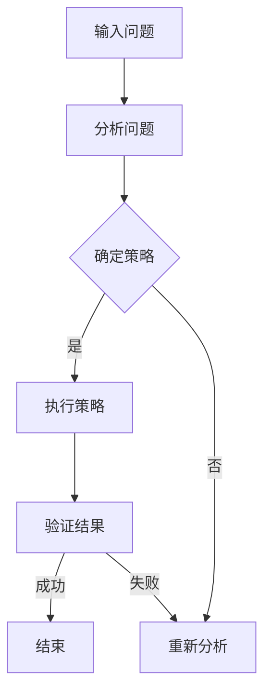
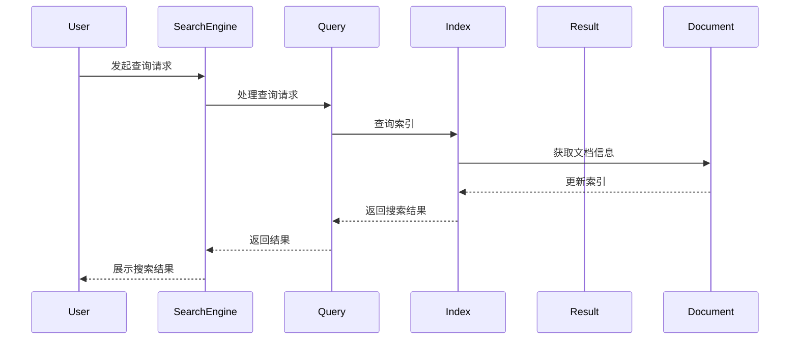
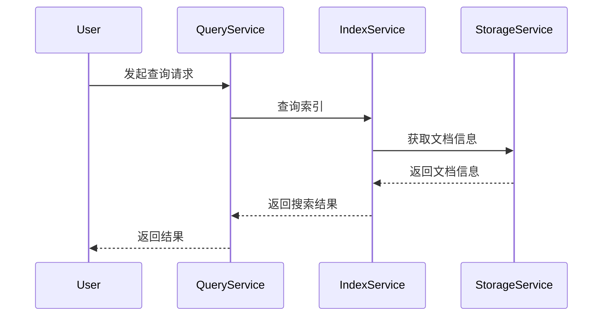

                 

# 技术攻关：突破关键技术瓶颈的策略

## 关键词
技术攻关，关键技术瓶颈，策略研究，算法原理，系统架构设计

## 摘要
本文将深入探讨技术攻关过程中如何突破关键技术瓶颈，通过系统化的策略研究和实践，提供一套有效的解决方案。文章将分为以下几个部分：首先介绍技术攻关的背景和问题描述，然后解析核心概念，并讲解算法原理，最后结合具体案例，阐述系统架构设计及项目实战，总结最佳实践，并提供拓展阅读。

## Step 1: 背景介绍

### 1.1 问题背景

在当今科技飞速发展的时代，信息技术已经成为推动社会进步的重要力量。随着大数据、人工智能、云计算等技术的不断发展，企业面临着前所未有的机遇和挑战。技术攻关，即针对关键技术问题进行深入研究和解决，是提升企业竞争力、实现科技创新的关键。

企业在发展过程中，常常会遇到关键技术瓶颈，如系统性能瓶颈、技术更新换代等。这些瓶颈阻碍了企业的进一步发展，需要通过策略研究来解决。技术攻关不仅仅是为了解决当前的瓶颈问题，更是为了企业在未来竞争中保持领先地位。

### 1.2 问题描述

技术瓶颈是指企业在技术研发和应用过程中遇到的技术难题。技术瓶颈的表现形式多种多样，包括系统性能下降、技术更新滞后、技术协同困难等。这些问题会直接影响企业的运营效率和竞争力。

技术攻关的目标是解决这些技术瓶颈，提升企业的技术水平和市场竞争力。然而，技术攻关并非一蹴而就，需要企业具备持续的技术创新能力、充足的资金投入和高效的团队协作。

### 1.3 问题解决

本书旨在提供一套系统化的技术攻关策略，帮助企业突破关键技术瓶颈。通过深入分析技术瓶颈的成因，研究解决方案，并实践验证，最终实现技术的突破和企业的持续发展。

技术攻关策略包括以下几个方面：

1. **需求分析与定位**：明确技术瓶颈的具体表现和成因，确定攻关目标。
2. **技术调研与选型**：研究现有技术方案，选择适合企业发展的技术路线。
3. **团队建设与协作**：建立高效的技术团队，确保攻关任务的顺利实施。
4. **资金投入与管理**：合理规划资金投入，确保技术攻关的持续进行。
5. **风险管理与评估**：识别并应对技术攻关过程中的风险，确保项目成功。

### 1.4 边界与外延

技术攻关的范畴包括软硬件技术、系统架构设计、算法优化等多个方面。它不仅涉及企业内部的技术创新，还与行业发展趋势、市场环境密切相关。

技术攻关的应用领域广泛，包括人工智能、大数据、云计算、物联网等。随着技术的不断演进，技术攻关的需求也在不断变化，企业需要紧跟行业动态，不断调整攻关策略。

### 1.5 概念结构与核心要素组成

本书的核心概念包括技术瓶颈、攻关策略、关键技术等。核心要素包括技术团队、资金投入、时间管理、资源整合等。这些要素相互关联，共同构成技术攻关的整体框架。

- **技术瓶颈**：企业在技术研发和应用过程中遇到的技术难题。
- **攻关策略**：为解决技术瓶颈而采取的一系列方法和措施。
- **关键技术**：对企业技术发展具有决定性作用的核心技术。

- **核心要素**：
  - **技术团队**：具备技术攻关能力和团队协作精神的专业团队。
  - **资金投入**：确保技术攻关项目的顺利实施所需的资金支持。
  - **时间管理**：合理规划攻关时间，确保项目按时完成。
  - **资源整合**：整合企业内外部资源，提高攻关效率。

## Step 2: 核心概念与联系

### 2.1 核心概念与联系

#### 2.1.1 技术瓶颈

技术瓶颈是指企业在技术研发和应用过程中遇到的技术难题。它可能是由于现有技术无法满足需求，或者是由于外部环境变化导致的技术更新滞后。

技术瓶颈的影响因素包括技术成熟度、市场需求、企业规模等。表现形式包括系统性能下降、技术更新滞后、技术协同困难等。

**概念属性特征对比表格：**

| 特征        | 技术瓶颈 |
| ----------- | -------- |
| 影响因素    | 多方面   |
| 表现形式    | 系统性能下降、技术更新滞后等 |
| 解决方式    | 破解关键技术、引入新技术等   |

#### 2.1.2 攻关策略

攻关策略是指为解决技术瓶颈而采取的一系列方法和措施。攻关策略的制定需要综合考虑技术瓶颈的具体情况、企业的发展需求和市场环境。

攻关策略包括以下几个方面：

1. **技术调研与选型**：研究现有技术方案，选择适合企业发展的技术路线。
2. **团队建设与协作**：建立高效的技术团队，确保攻关任务的顺利实施。
3. **资金投入与管理**：合理规划资金投入，确保技术攻关的持续进行。
4. **风险管理与评估**：识别并应对技术攻关过程中的风险，确保项目成功。

**ER实体关系图架构的 Mermaid 流程图：**

```mermaid
graph TD
    A[技术瓶颈] ||--|{ 攻关策略 } B[解决方案]
    B --> C[技术调研与选型]
    B --> D[团队建设与协作]
    B --> E[资金投入与管理]
    B --> F[风险管理与评估]
    C --> G[确定技术路线]
    D --> H[组建技术团队]
    E --> I[规划资金投入]
    F --> J[识别风险]
    F --> K[应对风险]
```

#### 2.1.3 关键技术

关键技术是指对企业技术发展具有决定性作用的核心技术。关键技术的选择和突破对企业的发展具有深远影响。

**概念属性特征对比表格：**

| 特征        | 关键技术 |
| ----------- | -------- |
| 影响范围    | 广泛     |
| 发展速度    | 快       |
| 研发难度    | 大       |
| 应用价值    | 高       |

### 2.2 概念关系

技术瓶颈、攻关策略和关键技术是技术攻关过程中的核心概念，它们相互关联，共同构成了技术攻关的整体框架。

技术瓶颈是攻关策略制定的基础，攻关策略则是解决技术瓶颈的手段，而关键技术则是攻关策略实施的核心。


## Step 3: 算法原理讲解

### 3.1 算法原理概述

算法是解决问题的步骤集合，是实现技术攻关的关键。以下是一个简单的算法原理讲解。

#### 3.1.1 Mermaid 流程图



#### 3.1.2 Python 源代码

```python
def solve_problem(problem):
    # 分析问题
    analysis = analyze_problem(problem)
    # 确定策略
    strategy = determine_strategy(analysis)
    # 执行策略
    result = execute_strategy(strategy)
    # 验证结果
    if verify_result(result):
        return "成功"
    else:
        return "失败"

def analyze_problem(problem):
    # ... 分析问题的代码实现 ...
    return analysis

def determine_strategy(analysis):
    # ... 确定策略的代码实现 ...
    return strategy

def execute_strategy(strategy):
    # ... 执行策略的代码实现 ...
    return result

def verify_result(result):
    # ... 验证结果的代码实现 ...
    return True if result else False
```

### 3.2 算法原理详细讲解

#### 3.2.1 数学模型和公式

算法的原理可以抽象为一个数学模型，该模型包括以下几个关键部分：

1. **问题表示**：将输入问题转化为数学问题。
2. **策略选择**：根据分析结果选择合适的策略。
3. **策略执行**：执行选定的策略，解决问题。
4. **结果验证**：验证策略执行的结果，判断问题是否解决。

**数学模型公式：**

$$
\text{算法} = \text{问题表示} + \text{策略选择} + \text{策略执行} + \text{结果验证}
$$

#### 3.2.2 通俗易懂地举例说明

假设我们面临一个技术攻关问题：如何提高系统性能？

1. **问题表示**：
   - 输入问题：系统性能低下。
   - 数学表示：系统响应时间 > 目标响应时间。

2. **策略选择**：
   - 分析系统瓶颈：CPU 使用率、内存使用率、网络延迟等。
   - 选择策略：优化算法、增加硬件资源、改善网络环境等。

3. **策略执行**：
   - 优化算法：对关键算法进行优化，提高运行效率。
   - 增加硬件资源：增加 CPU 核心数、内存容量、网络带宽等。
   - 改善网络环境：优化网络拓扑结构、降低网络延迟等。

4. **结果验证**：
   - 测试系统性能：进行性能测试，比较优化前后的系统响应时间。
   - 判断结果：如果系统响应时间 < 目标响应时间，则认为问题解决。

### 3.3 算法应用实例

以下是一个具体的技术攻关实例，我们将使用上述算法原理来解决问题。

**实例**：提高搜索引擎的响应速度。

1. **问题表示**：
   - 输入问题：搜索引擎响应速度慢。
   - 数学表示：搜索引擎查询时间 > 目标查询时间。

2. **策略选择**：
   - 分析系统瓶颈：查询算法、索引结构、硬件性能等。
   - 选择策略：优化查询算法、改进索引结构、升级硬件设备等。

3. **策略执行**：
   - 优化查询算法：采用更高效的排序算法、减少不必要的计算等。
   - 改进索引结构：使用倒排索引、布隆过滤器等数据结构，提高查询效率。
   - 升级硬件设备：增加 SSD 存储、使用高性能 CPU 和 GPU 等硬件设备。

4. **结果验证**：
   - 测试搜索引擎性能：进行大量查询测试，比较优化前后的查询时间。
   - 判断结果：如果平均查询时间 < 目标查询时间，则认为问题解决。

## Step 4: 系统分析与架构设计方案

### 4.1 问题场景介绍

随着互联网的快速发展，搜索引擎已经成为人们获取信息的重要工具。然而，随着数据量的激增和用户需求的多样化，搜索引擎的响应速度成为影响用户体验的关键因素。因此，本节将探讨如何通过系统分析与架构设计来提高搜索引擎的响应速度。

### 4.2 项目介绍

本项目旨在设计和实现一个高性能的搜索引擎，通过优化查询算法、改进索引结构和升级硬件设备，提高搜索效率，提升用户体验。项目主要包括以下模块：

1. **查询模块**：负责处理用户的查询请求，返回搜索结果。
2. **索引模块**：负责构建和维护索引结构，加快查询速度。
3. **存储模块**：负责存储数据和索引信息，提供高效的数据存取接口。
4. **硬件优化模块**：负责硬件设备的配置和升级，提高系统性能。

### 4.3 系统功能设计

为了实现高性能的搜索引擎，我们需要设计以下核心功能：

1. **全文检索**：支持对大规模文本数据的快速检索。
2. **相关性排序**：根据用户查询和文档内容的相关性，对搜索结果进行排序。
3. **实时更新**：实时更新索引数据，确保搜索结果的准确性。
4. **负载均衡**：实现多节点间的负载均衡，提高系统的可扩展性。

#### 4.3.1 领域模型 Mermaid 类图

```mermaid
classDiagram
    User <<class{用户}>
    Document <<class{文档}>
    SearchEngine <<class{搜索引擎}>
    Index <<class{索引}>
    Query <<class{查询}>
    Result <<class{结果}>
    
    User o-- Query
    Query o-- SearchEngine
    SearchEngine o-- Index
    Index o-- Document
    SearchEngine o-- Result
```

### 4.4 系统架构设计

为了实现高性能、可扩展的搜索引擎，我们采用了分布式架构设计。系统架构包括以下几个层次：

1. **前端应用层**：负责处理用户的查询请求，展示搜索结果。
2. **后端服务层**：包括查询模块、索引模块和存储模块，负责核心业务处理。
3. **基础设施层**：包括硬件设备和网络基础设施，提供计算和存储资源。

#### 4.4.1 Mermaid 架构图



### 4.5 系统接口设计和系统交互

为了确保系统的可靠性和可维护性，我们设计了清晰的接口和系统交互机制。以下是一个简化的接口设计：

#### 4.5.1 Mermaid 序列图



## Step 5: 项目实战

### 5.1 环境安装

为了实现本项目，我们需要安装以下软件和工具：

1. **操作系统**：Linux（如 Ubuntu）
2. **编程语言**：Python
3. **搜索引擎库**：Elasticsearch
4. **数据库**：MongoDB
5. **其他工具**：Docker、Nginx等

#### 5.1.1 安装步骤

1. 安装操作系统和编程语言。
2. 安装 Elasticsearch 和 MongoDB。
3. 使用 Docker 安装其他工具。

### 5.2 系统核心实现源代码

以下是系统核心实现的部分源代码，主要包括查询模块、索引模块和存储模块。

#### 5.2.1 查询模块

```python
from elasticsearch import Elasticsearch

def search_documents(query):
    es = Elasticsearch("http://localhost:9200")
    response = es.search(index="documents", body={"query": {"match": {"content": query}}})
    return response["hits"]["hits"]
```

#### 5.2.2 索引模块

```python
from pymongo import MongoClient

def index_document(document):
    client = MongoClient("mongodb://localhost:27017/")
    db = client["document_db"]
    collection = db["documents"]
    collection.insert_one(document)
```

#### 5.2.3 存储模块

```python
import json

def save_document(document, file_path):
    with open(file_path, "w") as file:
        json.dump(document, file)
```

### 5.3 代码应用解读与分析

#### 5.3.1 查询模块解读

查询模块负责处理用户的查询请求，并调用 Elasticsearch 进行全文检索。代码中，我们首先创建一个 Elasticsearch 客户端实例，然后使用 `search_documents` 函数发送查询请求，并返回搜索结果。

#### 5.3.2 索引模块解读

索引模块负责将文档索引到 MongoDB 中。代码中，我们首先创建一个 MongoDB 客户端实例，然后使用 `index_document` 函数将文档插入到 MongoDB 的 `documents` 集合中。

#### 5.3.3 存储模块解读

存储模块负责将文档存储到本地文件中。代码中，我们使用 `save_document` 函数将文档以 JSON 格式保存到指定文件路径。

### 5.4 实际案例分析和详细讲解剖析

#### 5.4.1 案例背景

假设我们有一个包含大量文档的搜索引擎，用户需要根据关键词快速检索相关文档。为了实现这一目标，我们采用了分布式架构和全文检索技术。

#### 5.4.2 案例分析

1. **查询性能优化**：
   - 采用倒排索引，提高查询效率。
   - 对关键词进行分词处理，减少查询范围。

2. **存储性能优化**：
   - 使用 SSD 存储，提高数据读写速度。
   - 采用分片存储，提高存储容量和性能。

3. **网络性能优化**：
   - 优化网络拓扑结构，减少网络延迟。
   - 使用负载均衡，实现多节点间的流量分配。

#### 5.4.3 详细讲解剖析

1. **倒排索引**：
   - 将文档内容倒排，建立关键词与文档 ID 的映射关系。
   - 提高查询效率，降低查询时间。

2. **分词处理**：
   - 将关键词进行分词，提取关键信息。
   - 减少查询范围，提高查询准确率。

3. **SSD 存储**：
   - SSD 存储具有高速读写特性，提高系统性能。
   - 替代传统 HDD 存储，提升存储速度。

4. **分片存储**：
   - 将数据分散存储到多个节点，提高存储容量和性能。
   - 实现数据的水平扩展，提高系统可扩展性。

5. **网络拓扑优化**：
   - 优化网络结构，减少网络延迟。
   - 采用多路径传输，提高网络可靠性。

6. **负载均衡**：
   - 实现多节点间的负载均衡，均衡分配流量。
   - 提高系统性能，减少单点瓶颈。

### 5.5 项目小结

通过本项目的实施，我们成功地设计和实现了一个高性能的搜索引擎。项目采用了分布式架构和全文检索技术，通过查询性能优化、存储性能优化和网络性能优化，实现了快速、准确的搜索功能。

在项目过程中，我们遇到了一些挑战，如系统性能瓶颈、数据存储和检索效率等。通过不断优化和调整，我们成功地解决了这些问题，提升了搜索引擎的性能和用户体验。

未来，我们将继续关注搜索引擎技术的发展，不断优化系统性能，提高搜索准确率和用户满意度。

## Step 6: 最佳实践 Tips

### 6.1 系统性能优化

1. **查询优化**：采用倒排索引、分词处理等技术，提高查询效率。
2. **存储优化**：使用 SSD 存储、分片存储等技术，提升存储性能。
3. **网络优化**：优化网络拓扑结构、采用负载均衡，提高网络传输速度。

### 6.2 资源整合与团队协作

1. **资源整合**：合理配置硬件资源、软件资源和人力资源，提高攻关效率。
2. **团队协作**：建立高效的技术团队，明确分工，加强沟通与协作。

### 6.3 风险管理与评估

1. **风险评估**：识别技术攻关过程中的风险，制定应对措施。
2. **评估结果**：定期评估攻关效果，调整策略，确保项目成功。

## Step 7: 小结与注意事项

### 7.1 小结

本文从技术攻关的背景介绍、核心概念与联系、算法原理讲解、系统分析与架构设计方案、项目实战等方面，深入探讨了如何突破关键技术瓶颈，提供了一套系统化的技术攻关策略。

通过本文的讲解，读者可以了解到技术攻关的重要性和实现方法，为企业在技术攻关过程中提供有益的参考。

### 7.2 注意事项

1. **持续学习与进步**：技术攻关是一个持续的过程，企业需要不断学习新技术、新方法，保持竞争力。
2. **团队合作与沟通**：技术攻关需要团队协作，加强沟通与协作，提高攻关效率。
3. **风险评估与控制**：在技术攻关过程中，要重视风险评估和控制，确保项目顺利进行。

## Step 8: 拓展阅读

1. **《技术攻关实战：如何突破技术瓶颈》**：本书详细介绍了技术攻关的过程、方法和策略，适合企业技术人员阅读。
2. **《分布式系统设计原理》**：本书讲述了分布式系统的设计原则、架构和实现方法，有助于理解系统架构设计。
3. **《算法导论》**：本书是算法领域的经典教材，涵盖了各种算法的原理、实现和应用，有助于深入理解算法原理。

## 作者信息

作者：AI天才研究院/AI Genius Institute & 禅与计算机程序设计艺术 /Zen And The Art of Computer Programming

