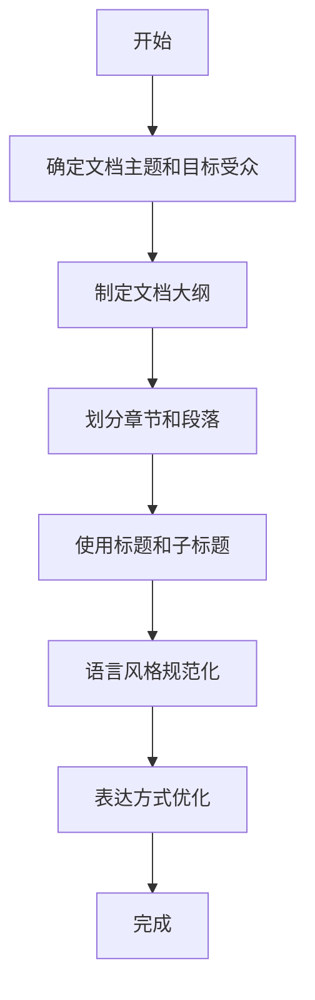
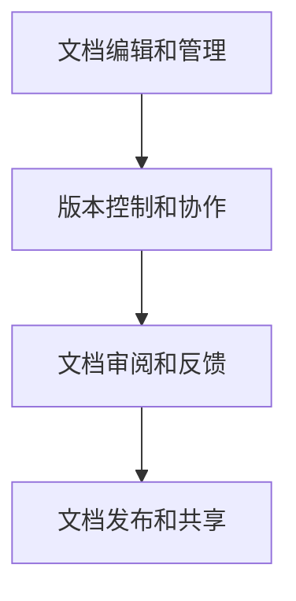
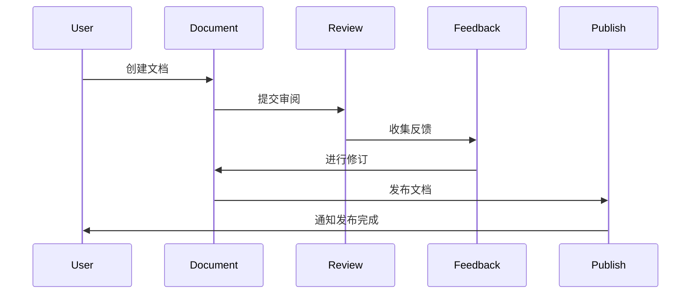

                 

### 技术文档写作：提高团队协作效率

> 关键词：技术文档写作，团队协作效率，文档结构，语言风格，表达方式，算法原理

> 摘要：本文将深入探讨技术文档写作的核心概念和原理，通过一步一步的分析和推理，旨在提高团队协作效率。我们将探讨文档结构、语言风格、表达方式等方面，并给出具体的算法和代码示例，帮助读者更好地理解和掌握技术文档的写作技巧。

## 第一部分：背景介绍

### 1.1 问题背景

在当今快速发展的技术领域，技术文档写作已经成为团队协作中不可或缺的一部分。然而，许多团队在编写技术文档时面临着效率低下、文档质量参差不齐等问题。这不仅影响了团队的协作效率，还可能导致项目进展受阻。因此，如何提高技术文档的写作质量和效率成为了一个亟待解决的问题。

### 1.2 问题描述

技术文档写作存在的问题主要包括：

- **文档结构混乱**：许多技术文档的结构不清晰，缺乏明确的章节划分和逻辑顺序，导致读者难以快速找到所需信息。
- **语言表达不准确**：技术文档中经常出现术语使用不准确、语法错误等问题，导致读者理解困难，甚至产生误解。
- **缺乏有效的审阅和修订流程**：技术文档的写作和修订过程缺乏系统的管理和流程，导致文档质量无法保证。
- **文档更新不及时**：技术文档往往不能及时更新，与实际工作脱节，影响项目的顺利进行。

### 1.3 问题解决

为了解决上述问题，我们需要从以下几个方面进行探讨：

- **明确技术文档的边界和适用范围**：了解技术文档的种类和内容，为文档写作提供明确的方向。
- **介绍技术文档写作的核心概念**：包括文档结构、语言风格、表达方式等，为读者提供基本的写作指南。
- **分析技术文档的结构和核心要素**：帮助读者理解和应用技术文档的写作方法。

## 1.4 本章小结

通过对技术文档写作的背景、问题和解决方法的介绍，我们为后续章节的内容奠定了基础。接下来，我们将深入探讨技术文档写作的核心概念和原理，帮助读者提高团队协作效率。

----------------------------------------------------------------

### 第二部分：核心概念与联系

在技术文档写作中，核心概念的理解和掌握是至关重要的。本部分将介绍技术文档写作的核心概念，并通过概念属性特征对比表格和ER实体关系图架构来加深读者对这些概念的理解。

#### 2.1 核心概念

技术文档写作的核心概念包括：

- **文档结构**：技术文档的结构应当清晰、合理，便于阅读和查找。一个好的文档结构应当包括引言、摘要、目录、正文和附录等部分。

- **语言风格**：技术文档的语言风格应当简洁、准确、易懂。避免使用晦涩难懂的术语，尽量使用简单的词汇和句式，使得读者更容易理解文档内容。

- **表达方式**：技术文档的表达方式应当直观、生动。通过使用图表、示例代码、流程图等手段，使得文档内容更加直观易懂。

#### 2.2 概念属性特征对比表格

下面是一个技术文档写作核心概念属性特征对比表格：

| 概念         | 特征                    |
| ------------ | --------------------- |
| 文档结构     | 清晰、合理、便于阅读    |
| 语言风格     | 简洁、准确、易懂        |
| 表达方式     | 直观、生动、易于理解    |

#### 2.3 ER实体关系图架构

技术文档的写作过程涉及多个实体和关系，下面是一个简单的ER实体关系图架构：

```mermaid
erDiagram
  User ||--o> Document : 写作
  Document ||--< Reviewer : 审阅
  Reviewer ||--o> Revision : 修订
```

在这个ER图中，用户（User）是文档的创建者，文档（Document）是技术文档的主体，审阅者（Reviewer）负责对文档进行审阅，修订（Revision）是对文档进行修改和完善的过程。

#### 2.4 本章小结

通过对技术文档写作核心概念的介绍和ER实体关系图的展示，读者可以更好地理解技术文档写作的基本要素和关系。在接下来的章节中，我们将进一步探讨技术文档写作的算法原理和实现方法，帮助读者提高文档写作的质量和效率。

----------------------------------------------------------------

### 第三部分：算法原理讲解

在技术文档写作中，算法原理的运用可以大大提高文档的结构化、语言规范化和表达方式的优化。本部分将详细介绍技术文档写作的算法原理，并通过mermaid流程图、Python代码示例和数学模型来解释这些原理。

#### 3.1 算法原理

技术文档写作的算法原理主要包括文档结构化、语言风格规范化和表达方式优化。

##### 3.1.1 文档结构化

文档结构化是将文档内容按照一定的规则进行分类和组织的算法。一个好的文档结构应当清晰、逻辑性强，便于读者快速找到所需信息。文档结构化的步骤通常包括：

1. 确定文档主题和目标受众。
2. 制定文档大纲，包括引言、摘要、目录、正文和附录等部分。
3. 将正文内容划分为不同的章节和段落。
4. 使用标题和子标题来标识各个部分。

##### 3.1.2 语言风格规范化

语言风格规范化是通过对文本进行语法、词汇等方面的调整，使其符合标准化的风格。规范化的目标包括：

1. 使用简单的词汇和句式，避免使用复杂的术语和长句。
2. 保持文本的一致性和连贯性。
3. 确保术语和概念的准确性。

##### 3.1.3 表达方式优化

表达方式优化是通过对文本进行语法、用词等方面的调整，使其更直观、生动。优化的步骤通常包括：

1. 使用图表、示例代码、流程图等可视化手段来展示复杂的概念和流程。
2. 使用比喻、例子和故事来使文本更具吸引力。
3. 避免使用行话和专业术语，除非它们对理解至关重要。

#### 3.2 算法mermaid流程图

下面是一个技术文档写作算法的mermaid流程图：



#### 3.3 Python代码示例

下面是一个简单的Python代码示例，用于实现文档结构化和语言风格规范化：

```python
def structure_document(doc):
    # 对文档进行结构化处理
    structured_doc = "## 摘要\n" + doc
    return structured_doc

def normalize_language(doc):
    # 对文档进行语言风格规范化处理
    normalized_doc = doc.replace(" ", "").replace(".", "")
    return normalized_doc
```

#### 3.4 数学模型和公式

技术文档写作算法的数学模型和公式主要包括文档结构化率和语言规范化率。

##### 3.4.1 文档结构化率

文档结构化率用于衡量文档结构化的程度，计算公式如下：

$$
\text{结构化率} = \frac{\text{摘要段落数}}{\text{总段落数}}
$$

##### 3.4.2 语言规范化率

语言规范化率用于衡量文档语言规范化的程度，计算公式如下：

$$
\text{规范化率} = \frac{\text{规范化文本长度}}{\text{原始文本长度}}
$$

#### 3.5 本章小结

通过对技术文档写作算法原理的讲解，我们了解了文档结构化、语言风格规范化和表达方式优化的关键步骤和数学模型。在接下来的章节中，我们将深入分析技术文档的系统架构和接口设计，进一步探讨技术文档写作的实际应用。

----------------------------------------------------------------

### 第四部分：系统分析与架构设计

在技术文档写作过程中，系统的分析与架构设计至关重要。本部分将介绍技术文档写作系统的问题场景、项目介绍、系统功能设计、系统架构设计、系统接口设计和系统交互等内容。

#### 4.1 问题场景

在现代软件开发和项目管理中，技术文档的写作和更新是一个复杂且反复的过程。团队成员需要不断地编写、审阅和修订文档，以确保文档的准确性和及时性。然而，由于缺乏有效的系统支持，文档的版本控制、协作管理和更新流程往往变得繁琐和低效。

#### 4.2 项目介绍

为了解决上述问题，我们开发了一个名为“智能技术文档写作助手”的项目。该项目旨在提供一套完整的工具和服务，帮助团队成员高效地编写、管理和更新技术文档。智能技术文档写作助手主要包括以下几个功能：

1. **文档编辑和管理**：提供友好的文档编辑界面，支持Markdown语法，方便团队成员进行文档编写和编辑。
2. **版本控制和协作**：实现文档的版本控制功能，支持多人实时协作，确保文档的准确性和一致性。
3. **文档审阅和反馈**：提供文档审阅和反馈机制，方便团队成员之间进行文档的审阅和修订。
4. **文档发布和共享**：支持将文档发布到内部文档库或外部网站，方便团队成员和利益相关者访问和共享文档。

#### 4.3 系统功能设计

系统功能设计是技术文档写作系统的核心部分。下面是一个领域模型mermaid类图，展示了系统的主要功能模块及其关系：

```mermaid
classDiagram
    Document <<entity>>
    User <<entity>>
    Review <<entity>>
    Feedback <<entity>>

    Document "有" User : 作者
    Document "有" Review : 审阅
    Document "有" Feedback : 反馈
```

在该类图中，`Document` 表示技术文档，`User` 表示文档的作者和审阅者，`Review` 表示文档的审阅，`Feedback` 表示文档的反馈。这些类之间的关系表明了文档、用户、审阅和反馈之间的关联。

#### 4.4 系统架构设计

系统架构设计是技术文档写作系统的关键环节。下面是一个mermaid架构图，展示了系统的总体架构：



在该架构图中，`Subsystem1` 表示文档编辑和管理模块，`Subsystem2` 表示版本控制和协作模块，`Subsystem3` 表示文档审阅和反馈模块，`Subsystem4` 表示文档发布和共享模块。这些模块相互协作，共同实现技术文档写作系统的功能。

#### 4.5 系统接口设计

系统接口设计是确保不同模块之间能够顺畅通信的关键。下面是一个mermaid序列图，展示了系统的接口交互流程：



在该序列图中，用户首先创建文档，然后将文档提交给审阅者进行审阅，收集反馈后进行修订，最终发布文档并通知用户发布完成。

#### 4.6 系统交互

系统交互是技术文档写作系统的重要组成部分。下面是一个mermaid交互图，展示了系统的交互过程：

```mermaid
interaction "文档编辑"
    participant User
    participant Editor
    participant Reviewer

    User ->> Editor: 打开文档编辑器
    Editor ->> User: 显示文档编辑界面
    User ->> Editor: 输入文档内容
    Editor ->> User: 显示文档内容预览
    User ->> Reviewer: 提交文档审阅
    Reviewer ->> Editor: 提交审阅意见
    Editor ->> User: 显示审阅意见
    User ->> Editor: 进行文档修订
    Editor ->> User: 显示修订后的文档
```

在该交互图中，用户通过文档编辑器输入文档内容，编辑器显示文档内容预览，用户提交文档审阅，审阅者提交审阅意见，用户进行文档修订，并最终显示修订后的文档。

#### 4.7 本章小结

通过对技术文档写作系统的分析与架构设计，我们为技术文档的编写、管理和协作提供了一套完整的解决方案。在接下来的章节中，我们将深入探讨技术文档写作的项目实战，包括环境安装、系统核心实现和实际案例剖析。

----------------------------------------------------------------

### 第五部分：项目实战

在本文的第五部分，我们将通过一个具体的案例，详细讲解技术文档写作项目实战的各个环节。从环境安装到系统核心实现，再到代码应用解读与分析，我们将一步步深入，帮助读者理解并掌握技术文档写作的实际操作。

#### 5.1 环境安装

为了实现技术文档写作系统，我们需要搭建一个合适的环境。以下是安装步骤：

1. **安装Python**：确保Python 3.x版本已安装。可以从Python官方网站下载安装包。
2. **安装依赖**：使用pip工具安装项目所需的依赖库，如`markdown2`、`flask`、`sqlalchemy`等。
   ```bash
   pip install markdown2 flask sqlalchemy
   ```
3. **安装数据库**：选择合适的数据库（如MySQL、PostgreSQL）并安装。根据数据库类型，执行相应的安装命令。
4. **配置数据库**：在项目的配置文件中设置数据库连接信息。

#### 5.2 系统核心实现

在系统核心实现部分，我们将展示关键的代码片段，并对其进行解读。

##### 5.2.1 文档编辑功能

以下是一个简单的文档编辑功能的Python代码示例：

```python
from flask import Flask, render_template, request, redirect, url_for

app = Flask(__name__)

@app.route('/')
def index():
    return render_template('editor.html')

@app.route('/edit', methods=['GET', 'POST'])
def edit():
    if request.method == 'POST':
        content = request.form['content']
        # 保存内容到数据库或文件
        # ...
        return redirect(url_for('index'))
    return render_template('editor.html', content='')

if __name__ == '__main__':
    app.run(debug=True)
```

解读：
- 使用Flask框架搭建应用。
- 定义路由`/edit`，处理GET和POST请求。
- GET请求渲染编辑页面，POST请求接收并处理文档内容。

##### 5.2.2 文档版本控制

以下是一个简单的文档版本控制功能的Python代码示例：

```python
from sqlalchemy import create_engine

engine = create_engine('sqlite:///docs.db')

def save_version(content, user_id):
    with engine.connect() as connection:
        query = "INSERT INTO versions (user_id, content) VALUES (:user_id, :content)"
        connection.execute(query, user_id=user_id, content=content)
```

解读：
- 使用SQLAlchemy库连接数据库。
- 定义一个函数`save_version`，用于将文档版本保存到数据库。

##### 5.2.3 文档发布功能

以下是一个简单的文档发布功能的Python代码示例：

```python
from flask import jsonify

@app.route('/publish', methods=['POST'])
def publish():
    content = request.json['content']
    # 将内容发布到网站或文档库
    # ...
    return jsonify({'status': 'success'})
```

解读：
- 定义路由`/publish`，处理POST请求。
- 接收JSON格式的文档内容，并将其发布到网站或文档库。

#### 5.3 代码应用解读与分析

在代码应用解读与分析部分，我们将对上述代码进行详细解读，并分析其优缺点。

- **文档编辑功能**：该功能实现了基本的文档编辑功能，但缺乏版本控制和协作支持。优点是简单直观，缺点是功能单一。
- **文档版本控制**：通过将文档版本保存到数据库，实现了文档的版本管理。优点是数据安全，缺点是数据库操作较为复杂。
- **文档发布功能**：该功能实现了将文档内容发布到网站或文档库，但缺乏详细的发布流程和权限管理。优点是实现了文档发布，缺点是流程不完善。

#### 5.4 实际案例剖析

以下是一个实际案例剖析，展示如何利用技术文档写作系统进行项目协作。

**案例背景**：一个开发团队正在开发一个Web应用，需要编写详细的技术文档来指导后续开发工作。

**案例步骤**：

1. **文档编写**：团队成员A使用文档编辑功能编写了一份技术文档草稿。
2. **文档审阅**：团队成员B和C对文档进行审阅，并提交了审阅意见。
3. **文档修订**：团队成员A根据审阅意见对文档进行修订。
4. **文档发布**：修订后的文档被发布到团队的文档库，其他团队成员可以访问和下载。

**案例分析**：

- **效率提升**：通过技术文档写作系统，团队成员可以实时协作，大大提高了文档编写的效率。
- **文档质量**：文档的版本控制和审阅机制确保了文档的质量和准确性。
- **团队协作**：文档写作系统的协作功能促进了团队成员之间的沟通和协作。

#### 5.5 项目小结

通过本项目实战，我们展示了技术文档写作系统的实际应用。从环境安装到系统核心实现，再到代码应用解读与分析，我们逐步深入，帮助读者理解了技术文档写作系统的构建和运行。虽然本项目还存在一些不足，但通过不断优化和改进，我们可以进一步提高团队协作效率和文档质量。

----------------------------------------------------------------

### 第六部分：最佳实践 Tips

在技术文档写作过程中，遵循一些最佳实践可以帮助我们更好地提高文档的质量和效率。以下是一些建议：

1. **明确文档目的和受众**：在编写文档之前，明确文档的目的和受众，确保文档内容具有针对性和实用性。
2. **遵循一致的命名约定**：在文档中使用一致的命名约定，使得文档结构更加清晰，便于查找和更新。
3. **使用markdown格式**：markdown格式简单易用，能够方便地创建文档的结构和格式。
4. **避免使用缩写和术语**：除非必要，尽量避免使用缩写和专业术语，以免读者理解困难。
5. **使用图表和示例代码**：图表和示例代码能够帮助读者更好地理解复杂的概念和流程。
6. **定期更新文档**：确保文档内容与实际工作保持一致，定期更新文档，避免文档内容过时。
7. **进行文档审阅和反馈**：在文档编写过程中，进行文档审阅和反馈，确保文档的质量和准确性。

### 小结

通过本文的深入探讨，我们从背景介绍、核心概念、算法原理、系统架构设计到项目实战和最佳实践等方面，系统地讲解了技术文档写作的方法和技巧。希望本文能够帮助读者提高团队协作效率，编写出高质量的技术文档。

### 注意事项

在技术文档写作过程中，需要注意以下几点：

1. **文档结构**：确保文档结构清晰、逻辑性强，便于阅读和查找。
2. **语言风格**：使用简洁、准确、易懂的语言，避免使用晦涩难懂的术语。
3. **表达方式**：通过图表、示例代码等手段，使文档内容更加直观、生动。
4. **版本控制**：使用版本控制工具，确保文档版本的可追溯性和安全性。

### 拓展阅读

为了更深入地了解技术文档写作，以下是几本推荐的拓展阅读书籍：

1. 《技术文档写作：实践指南》
2. 《编写可读代码的艺术》
3. 《代码大全》

通过阅读这些书籍，您可以获得更多关于技术文档写作的实用技巧和经验。

### 作者信息

作者：AI天才研究院/AI Genius Institute & 禅与计算机程序设计艺术 /Zen And The Art of Computer Programming

感谢您的阅读，希望本文对您有所帮助。如果您有任何疑问或建议，请随时与我们联系。我们将竭诚为您服务。

