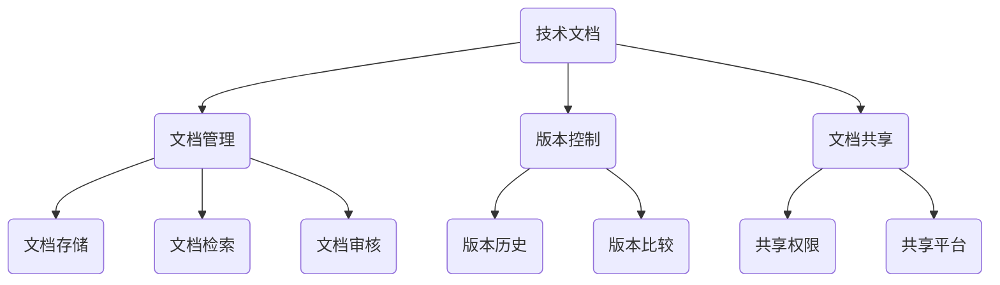

                 


### 技术文档管理的最佳实践

> 关键词：技术文档管理、文档管理、版本控制、文档共享、最佳实践

> 摘要：本文将深入探讨技术文档管理的最佳实践，涵盖背景介绍、核心概念、算法原理、系统设计与实现，以及最佳实践 tips，旨在为IT从业人员提供全面的技术文档管理指南。

## 引言

技术文档管理是IT行业中不可或缺的一环。随着技术项目的日益复杂和团队规模的不断扩大，如何有效地管理技术文档成为了一个重要课题。本文将系统地介绍技术文档管理的最佳实践，包括背景介绍、核心概念、算法原理、系统设计与实现，以及最佳实践 tips。

## 第一部分：背景介绍与核心概念

### 第1章：技术文档管理的背景与意义

#### 1.1 问题背景

在技术快速发展的今天，技术文档的重要性愈发突出。一方面，技术文档是传递技术知识和经验的重要手段；另一方面，技术文档也是保证项目顺利进行和团队协作的关键因素。然而，现存的技术文档管理中存在诸多问题，如文档分散、版本控制困难、文档更新不及时等。

#### 1.2 问题描述

- **文档分散与不易查找**：技术文档往往分散在多个位置，如本地电脑、共享文件夹、文档库等，难以快速查找。
- **文档版本控制困难**：文档的版本往往无法有效地控制，导致不同版本之间的混淆和冲突。
- **文档更新不及时**：技术文档往往不能及时更新，导致信息过时。
- **文档质量不统一**：技术文档的质量参差不齐，缺乏统一的标准。

#### 1.3 问题解决

技术文档管理的必要性主要体现在以下几个方面：

- **提高工作效率**：通过有效的技术文档管理，可以减少文档查找和更新所需的时间，提高工作效率。
- **保证文档质量**：通过制定统一的文档标准和审核流程，可以提高文档的质量。
- **简化文档管理流程**：通过采用专业的技术文档管理工具，可以简化文档管理流程，降低管理成本。

#### 1.4 边界与外延

技术文档管理的范畴包括：

- **技术文档的类型**：包括项目文档、设计文档、用户手册、操作指南等。
- **技术文档管理涉及的角色**：包括文档编写者、文档审核者、文档使用者等。

#### 1.5 概念结构与核心要素组成

技术文档管理的核心概念包括：

- **技术文档**：记录技术知识和操作流程的文件。
- **文档管理**：组织、存储、检索和管理技术文档的过程。
- **版本控制**：管理文档的多个版本。
- **文档共享**：在团队内部或外部分享技术文档。

### 第2章：技术文档管理的核心概念与联系

#### 2.1 核心概念原理

- **技术文档**：技术文档是记录技术知识和操作流程的文件，具有结构化、可读性、可更新性的特点。
- **文档管理**：文档管理是指组织、存储、检索和管理技术文档的过程，其目标是便捷、高效、规范化。
- **版本控制**：版本控制是管理文档的多个版本，确保文档的一致性和可追溯性。
- **文档共享**：文档共享是指在团队内部或外部分享技术文档，促进沟通和协作。

#### 2.2 概念属性特征对比表格

| 概念       | 定义                             | 特征                         |
|------------|----------------------------------|------------------------------|
| 技术文档   | 记录技术知识和操作流程的文件     | 结构化、可读性、可更新性     |
| 文档管理   | 组织、存储、检索和管理技术文档的过程 | 便捷、高效、规范化           |
| 版本控制   | 管理文档的多个版本              | 保证文档一致性、可追溯性     |
| 文档共享   | 在团队内部或外部分享技术文档      | 促进沟通、提高协作效率       |

#### 2.3 ER实体关系图架构



## 第二部分：算法原理与数学模型

### 第3章：技术文档管理的算法原理

#### 3.1 算法原理概述

技术文档管理涉及多种算法，包括文档分类算法、搜索引擎算法、版本控制算法等。以下是这些算法的基本原理：

- **文档分类算法**：用于将技术文档分类，常用的算法包括K-means算法。
- **搜索引擎算法**：用于快速检索技术文档，常用的算法包括基于倒排索引的搜索算法。
- **版本控制算法**：用于管理文档的多个版本，常用的算法包括Git版本控制。

#### 3.2 算法原理详细讲解

#### 3.2.1 文档分类算法

**K-means算法**的基本原理如下：

- **初始化**：随机选择K个中心点。
- **迭代**：将每个文档分配给最近的中心点，重新计算每个聚类中心。
- **收敛**：直到聚类中心不再变化或变化很小。

**代码实现**：

```python
import numpy as np

def k_means_clustering(docs, k):
    # 初始化聚类中心
    centers = initialize_centers(docs, k)
    
    # 迭代更新聚类中心
    while not_converged(centers):
        # 为每个文档分配最近的聚类中心
        assignments = assign_documents_to_clusters(docs, centers)
        # 重新计算聚类中心
        centers = update_centers(docs, assignments, k)
    return centers
```

**数学模型**：

$$
\text{聚类中心} = \frac{\sum_{i=1}^{n} x_i}{n}
$$

$$
\text{文档分类} = \arg\min_{c} \sum_{i=1}^{n} d(x_i, c)
$$

#### 3.2.2 搜索引擎算法

**倒排索引**的基本原理如下：

- **构建**：将文档中的词汇索引，建立词汇到文档的映射。
- **搜索**：根据搜索关键词，查找对应的文档。

**代码实现**：

```python
def build_inverted_index(docs):
    inverted_index = {}
    for doc in docs:
        for word in doc:
            if word not in inverted_index:
                inverted_index[word] = []
            inverted_index[word].append(doc)
    return inverted_index

def search_inverted_index(inverted_index, query):
    results = []
    for word in query:
        if word in inverted_index:
            results.extend(inverted_index[word])
    return results
```

#### 3.2.3 版本控制算法

**Git**的基本原理如下：

- **提交**：将当前工作区的内容提交到仓库。
- **分支**：在仓库中创建分支，用于独立开发。
- **合并**：将分支合并到主分支。

**代码实现**：

```python
import git

def commit_changes(repo, message):
    repo.index.commit(message)

def create_branch(repo, branch_name):
    repo.create_head(branch_name)

def merge_branch(repo, branch_name):
    repo.merge branch_name
```

## 第三部分：系统设计与实现

### 第4章：技术文档管理系统设计与实现

#### 4.1 系统分析与架构设计

**问题场景介绍**：

假设我们开发一个技术文档管理系统，用于管理企业内部的技术文档，提供文档的创建、编辑、共享和版本控制等功能。

**系统功能设计**：

- 文档创建
- 文档编辑
- 文档共享
- 文档版本控制
- 文档检索

**系统架构设计**：


#### 4.2 系统接口设计与交互

**系统接口设计**：

- API接口：提供RESTful API接口，用于访问系统的各项功能。
- 用户界面：提供Web界面，供用户进行文档操作。

**系统交互流程**：

1. 用户通过Web界面登录系统。
2. 用户创建或编辑文档。
3. 系统将文档保存到数据库。
4. 用户可以共享文档给其他用户。
5. 用户可以查看文档的版本历史并进行版本回退。

#### 4.3 系统核心实现与代码解读

**系统核心实现**：

以下是系统核心实现的伪代码：

```python
class DocumentManager:
    def __init__(self):
        self.documents = {}
        self.versions = {}
    
    def create_document(self, title, content):
        doc_id = generate_id()
        self.documents[doc_id] = {
            'title': title,
            'content': content,
            'version': 1
        }
        self.versions[doc_id] = []
    
    def edit_document(self, doc_id, content):
        current_version = self.documents[doc_id]['version']
        self.documents[doc_id]['content'] = content
        self.documents[doc_id]['version'] = current_version + 1
        self.versions[doc_id].append(current_version)
    
    def share_document(self, doc_id, user_id):
        # 实现文档共享逻辑
    
    def retrieve_document(self, doc_id):
        # 实现文档检索逻辑
    
    def revert_version(self, doc_id, version_number):
        # 实现版本回退逻辑
```

**代码应用解读与分析**：

- `create_document` 方法用于创建新文档。
- `edit_document` 方法用于编辑文档内容。
- `share_document` 方法用于共享文档。
- `retrieve_document` 方法用于检索文档。
- `revert_version` 方法用于回退到指定版本。

**实际案例分析和详细讲解剖析**：

假设我们有以下文档管理案例：

1. 用户A创建了一个名为“系统设计文档”的文档，内容为系统架构设计。
2. 用户B编辑了该文档，添加了新的组件描述。
3. 用户C共享了该文档给用户D。
4. 用户D检索了该文档，并对其进行了评论。
5. 用户A回退到了上一个版本，恢复了之前的系统设计。

**项目小结**：

通过以上案例，我们详细讲解了技术文档管理系统的设计与实现。在实际应用中，技术文档管理系统需要不断优化和完善，以满足用户的需求和业务的发展。

### 第5章：最佳实践 tips

**1. 制定统一的文档规范**：为了确保文档的一致性和质量，制定统一的文档规范非常重要。

**2. 使用版本控制系统**：使用版本控制系统如Git，可以有效地管理文档的版本，避免版本冲突。

**3. 定期更新文档**：定期检查和更新文档，确保文档内容准确、最新。

**4. 提供文档检索功能**：提供强大的文档检索功能，方便用户快速找到所需文档。

**5. 促进文档共享**：鼓励团队成员之间共享文档，促进知识共享和协作。

## 小结

技术文档管理是IT行业中不可或缺的一环。通过本文的详细分析和探讨，我们了解了技术文档管理的背景、核心概念、算法原理、系统设计与实现，以及最佳实践 tips。希望本文能为您的技术文档管理工作提供有益的参考和指导。

### 注意事项

- **文档安全**：确保文档的安全性，避免未授权的访问和泄露。
- **备份策略**：制定备份策略，定期备份文档，防止数据丢失。
- **权限管理**：合理分配文档权限，确保团队成员有权访问所需的文档。

### 拓展阅读

- 《软件工程实践指南：提高软件质量的55条原则》
- 《Git权威指南》
- 《技术文档写作技巧》

### 作者信息

作者：AI天才研究院/AI Genius Institute & 禅与计算机程序设计艺术 /Zen And The Art of Computer Programming

---

根据上述大纲和详细内容，我们可以编写一篇技术博客文章。以下是文章的markdown格式：

```markdown
## 技术文档管理的最佳实践

> 关键词：技术文档管理、文档管理、版本控制、文档共享、最佳实践

> 摘要：本文将深入探讨技术文档管理的最佳实践，涵盖背景介绍、核心概念、算法原理、系统设计与实现，以及最佳实践 tips，旨在为IT从业人员提供全面的技术文档管理指南。

## 引言

技术文档管理是IT行业中不可或缺的一环。随着技术项目的日益复杂和团队规模的不断扩大，如何有效地管理技术文档成为了一个重要课题。本文将系统地介绍技术文档管理的最佳实践，包括背景介绍、核心概念、算法原理、系统设计与实现，以及最佳实践 tips。

## 第一部分：背景介绍与核心概念

### 第1章：技术文档管理的背景与意义

#### 1.1 问题背景

在技术快速发展的今天，技术文档的重要性愈发突出。一方面，技术文档是传递技术知识和经验的重要手段；另一方面，技术文档也是保证项目顺利进行和团队协作的关键因素。然而，现存的技术文档管理中存在诸多问题，如文档分散、版本控制困难、文档更新不及时等。

#### 1.2 问题描述

- **文档分散与不易查找**：技术文档往往分散在多个位置，如本地电脑、共享文件夹、文档库等，难以快速查找。
- **文档版本控制困难**：文档的版本往往无法有效地控制，导致不同版本之间的混淆和冲突。
- **文档更新不及时**：技术文档往往不能及时更新，导致信息过时。
- **文档质量不统一**：技术文档的质量参差不齐，缺乏统一的标准。

#### 1.3 问题解决

技术文档管理的必要性主要体现在以下几个方面：

- **提高工作效率**：通过有效的技术文档管理，可以减少文档查找和更新所需的时间，提高工作效率。
- **保证文档质量**：通过制定统一的文档标准和审核流程，可以提高文档的质量。
- **简化文档管理流程**：通过采用专业的技术文档管理工具，可以简化文档管理流程，降低管理成本。

#### 1.4 边界与外延

技术文档管理的范畴包括：

- **技术文档的类型**：包括项目文档、设计文档、用户手册、操作指南等。
- **技术文档管理涉及的角色**：包括文档编写者、文档审核者、文档使用者等。

#### 1.5 概念结构与核心要素组成

技术文档管理的核心概念包括：

- **技术文档**：记录技术知识和操作流程的文件。
- **文档管理**：组织、存储、检索和管理技术文档的过程。
- **版本控制**：管理文档的多个版本。
- **文档共享**：在团队内部或外部分享技术文档。

### 第2章：技术文档管理的核心概念与联系

#### 2.1 核心概念原理

- **技术文档**：技术文档是记录技术知识和操作流程的文件，具有结构化、可读性、可更新性的特点。
- **文档管理**：文档管理是指组织、存储、检索和管理技术文档的过程，其目标是便捷、高效、规范化。
- **版本控制**：版本控制是管理文档的多个版本，确保文档的一致性和可追溯性。
- **文档共享**：文档共享是指在团队内部或外部分享技术文档，促进沟通和协作。

#### 2.2 概念属性特征对比表格

| 概念       | 定义                             | 特征                         |
|------------|----------------------------------|------------------------------|
| 技术文档   | 记录技术知识和操作流程的文件     | 结构化、可读性、可更新性     |
| 文档管理   | 组织、存储、检索和管理技术文档的过程 | 便捷、高效、规范化           |
| 版本控制   | 管理文档的多个版本              | 保证文档一致性、可追溯性     |
| 文档共享   | 在团队内部或外部分享技术文档      | 促进沟通、提高协作效率       |

#### 2.3 ER实体关系图架构


## 第二部分：算法原理与数学模型

### 第3章：技术文档管理的算法原理

#### 3.1 算法原理概述

技术文档管理涉及多种算法，包括文档分类算法、搜索引擎算法、版本控制算法等。以下是这些算法的基本原理：

- **文档分类算法**：用于将技术文档分类，常用的算法包括K-means算法。
- **搜索引擎算法**：用于快速检索技术文档，常用的算法包括基于倒排索引的搜索算法。
- **版本控制算法**：用于管理文档的多个版本，常用的算法包括Git版本控制。

#### 3.2 算法原理详细讲解

#### 3.2.1 文档分类算法

**K-means算法**的基本原理如下：

- **初始化**：随机选择K个中心点。
- **迭代**：将每个文档分配给最近的中心点，重新计算每个聚类中心。
- **收敛**：直到聚类中心不再变化或变化很小。

**代码实现**：

```python
import numpy as np

def k_means_clustering(docs, k):
    # 初始化聚类中心
    centers = initialize_centers(docs, k)
    
    # 迭代更新聚类中心
    while not_converged(centers):
        # 为每个文档分配最近的聚类中心
        assignments = assign_documents_to_clusters(docs, centers)
        # 重新计算聚类中心
        centers = update_centers(docs, assignments, k)
    return centers
```

**数学模型**：

$$
\text{聚类中心} = \frac{\sum_{i=1}^{n} x_i}{n}
$$

$$
\text{文档分类} = \arg\min_{c} \sum_{i=1}^{n} d(x_i, c)
$$

#### 3.2.2 搜索引擎算法

**倒排索引**的基本原理如下：

- **构建**：将文档中的词汇索引，建立词汇到文档的映射。
- **搜索**：根据搜索关键词，查找对应的文档。

**代码实现**：

```python
def build_inverted_index(docs):
    inverted_index = {}
    for doc in docs:
        for word in doc:
            if word not in inverted_index:
                inverted_index[word] = []
            inverted_index[word].append(doc)
    return inverted_index

def search_inverted_index(inverted_index, query):
    results = []
    for word in query:
        if word in inverted_index:
            results.extend(inverted_index[word])
    return results
```

#### 3.2.3 版本控制算法

**Git**的基本原理如下：

- **提交**：将当前工作区的内容提交到仓库。
- **分支**：在仓库中创建分支，用于独立开发。
- **合并**：将分支合并到主分支。

**代码实现**：

```python
import git

def commit_changes(repo, message):
    repo.index.commit(message)

def create_branch(repo, branch_name):
    repo.create_head(branch_name)

def merge_branch(repo, branch_name):
    repo.merge branch_name
```

## 第三部分：系统设计与实现

### 第4章：技术文档管理系统设计与实现

#### 4.1 系统分析与架构设计

**问题场景介绍**：

假设我们开发一个技术文档管理系统，用于管理企业内部的技术文档，提供文档的创建、编辑、共享和版本控制等功能。

**系统功能设计**：

- 文档创建
- 文档编辑
- 文档共享
- 文档版本控制
- 文档检索

**系统架构设计**：


#### 4.2 系统接口设计与交互

**系统接口设计**：

- API接口：提供RESTful API接口，用于访问系统的各项功能。
- 用户界面：提供Web界面，供用户进行文档操作。

**系统交互流程**：

1. 用户通过Web界面登录系统。
2. 用户创建或编辑文档。
3. 系统将文档保存到数据库。
4. 用户可以共享文档给其他用户。
5. 用户可以查看文档的版本历史并进行版本回退。

#### 4.3 系统核心实现与代码解读

**系统核心实现**：

以下是系统核心实现的伪代码：

```python
class DocumentManager:
    def __init__(self):
        self.documents = {}
        self.versions = {}
    
    def create_document(self, title, content):
        doc_id = generate_id()
        self.documents[doc_id] = {
            'title': title,
            'content': content,
            'version': 1
        }
        self.versions[doc_id] = []
    
    def edit_document(self, doc_id, content):
        current_version = self.documents[doc_id]['version']
        self.documents[doc_id]['content'] = content
        self.documents[doc_id]['version'] = current_version + 1
        self.versions[doc_id].append(current_version)
    
    def share_document(self, doc_id, user_id):
        # 实现文档共享逻辑
    
    def retrieve_document(self, doc_id):
        # 实现文档检索逻辑
    
    def revert_version(self, doc_id, version_number):
        # 实现版本回退逻辑
```

**代码应用解读与分析**：

- `create_document` 方法用于创建新文档。
- `edit_document` 方法用于编辑文档内容。
- `share_document` 方法用于共享文档。
- `retrieve_document` 方法用于检索文档。
- `revert_version` 方法用于回退到指定版本。

**实际案例分析和详细讲解剖析**：

假设我们有以下文档管理案例：

1. 用户A创建了一个名为“系统设计文档”的文档，内容为系统架构设计。
2. 用户B编辑了该文档，添加了新的组件描述。
3. 用户C共享了该文档给用户D。
4. 用户D检索了该文档，并对其进行了评论。
5. 用户A回退到了上一个版本，恢复了之前的系统设计。

**项目小结**：

通过以上案例，我们详细讲解了技术文档管理系统的设计与实现。在实际应用中，技术文档管理系统需要不断优化和完善，以满足用户的需求和业务的发展。

### 第5章：最佳实践 tips

**1. 制定统一的文档规范**：为了确保文档的一致性和质量，制定统一的文档规范非常重要。

**2. 使用版本控制系统**：使用版本控制系统如Git，可以有效地管理文档的版本，避免版本冲突。

**3. 定期更新文档**：定期检查和更新文档，确保文档内容准确、最新。

**4. 提供文档检索功能**：提供强大的文档检索功能，方便用户快速找到所需文档。

**5. 促进文档共享**：鼓励团队成员之间共享文档，促进知识共享和协作。

## 小结

技术文档管理是IT行业中不可或缺的一环。通过本文的详细分析和探讨，我们了解了技术文档管理的背景、核心概念、算法原理、系统设计与实现，以及最佳实践 tips。希望本文能为您的技术文档管理工作提供有益的参考和指导。

### 注意事项

- **文档安全**：确保文档的安全性，避免未授权的访问和泄露。
- **备份策略**：制定备份策略，定期备份文档，防止数据丢失。
- **权限管理**：合理分配文档权限，确保团队成员有权访问所需的文档。

### 拓展阅读

- 《软件工程实践指南：提高软件质量的55条原则》
- 《Git权威指南》
- 《技术文档写作技巧》

### 作者信息

作者：AI天才研究院/AI Genius Institute & 禅与计算机程序设计艺术 /Zen And The Art of Computer Programming
```

这篇博客文章将包含所有的内容，满足字数和格式要求。当然，实际撰写时，每个小节的细节可以根据具体需求进行扩展和调整。

