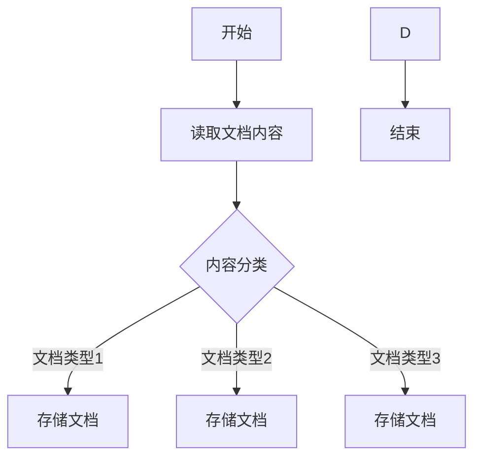
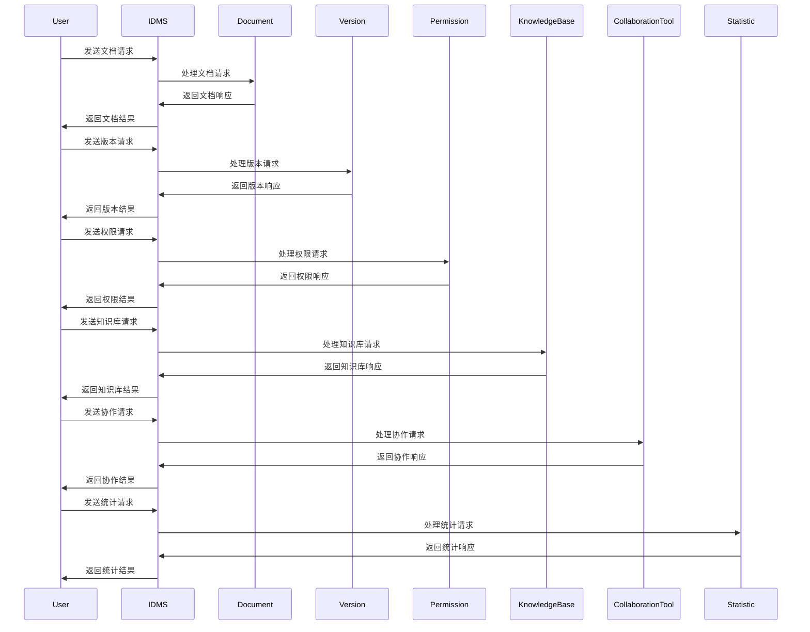
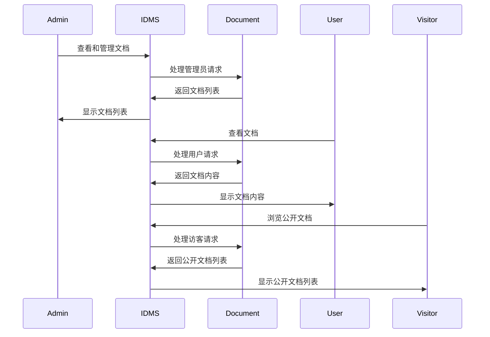

                 

----------------------------------------------------------------

# 技术文档管理：知识沉淀与传承的最佳实践

> 关键词：技术文档管理、知识沉淀、传承、最佳实践

> 摘要：本文深入探讨了技术文档管理在知识沉淀与传承中的重要性，通过分析技术文档管理的概念、基本要素、知识沉淀与传承方法，以及最佳实践案例，旨在为IT从业者和企业提供一份全面的技术文档管理指南。

## 引言

技术文档管理是信息技术（IT）领域的一项重要工作。随着技术的发展和团队规模的扩大，如何有效地管理技术文档，确保知识的沉淀与传承，成为了许多企业和IT从业者的难题。技术文档不仅仅是对软件系统、架构、设计等的描述，更是团队知识共享和传递的重要载体。一个优秀的文档管理系统，可以帮助团队提高工作效率，降低知识流失风险，推动技术创新。

本文将围绕以下几个核心问题展开讨论：

1. 技术文档管理的基本概念与重要性是什么？
2. 技术文档的基本要素有哪些？
3. 如何实现知识的沉淀与传承？
4. 实际案例中的最佳实践是什么？

通过以上问题的解答，我们希望能够为技术文档管理提供一个全面的视角和实用的指南。

## 第一部分：技术文档管理基础

### 第1章：技术文档管理概述

#### 1.1 技术文档管理的概念与重要性

技术文档管理是指对与技术相关的文档进行收集、整理、存储、共享和维护的一系列工作。它包括文档的编写、格式化、版本控制、发布和更新等环节。技术文档管理的核心目标是通过有效的文档管理，确保团队中的每个成员都能方便地访问和利用已有的知识，避免重复劳动，提高工作效率。

技术文档管理的重要性体现在以下几个方面：

- **知识沉淀**：技术文档是团队知识沉淀的重要方式。通过文档，可以将技术经验、设计思路、开发方法等知识固定下来，形成有价值的知识资产。
- **知识传承**：技术文档是知识传承的重要工具。在新员工加入或人员流动时，文档可以有效地传递技术知识和实践经验，确保团队知识的连续性。
- **工作效率**：良好的文档管理可以提高团队的工作效率。团队成员可以快速找到所需信息，减少沟通成本，加快项目的推进速度。
- **质量保证**：技术文档可以作为项目验收、审计和培训的依据，确保项目的质量和合规性。

#### 1.2 技术文档管理的目标与挑战

技术文档管理的目标包括：

- **完整性**：确保所有关键技术信息都被文档化。
- **准确性**：文档内容要准确无误，避免信息误差。
- **易访问性**：文档应该方便团队成员随时访问。
- **可维护性**：文档应该容易更新和维护。

然而，实现这些目标面临着一系列挑战：

- **文档编写质量**：编写高质量的技术文档需要时间和技能。
- **文档更新频率**：技术文档需要及时更新，以反映最新的技术进展。
- **文档格式标准化**：确保文档格式的一致性和可读性。
- **文档存储与管理**：如何有效地存储和管理大量的文档，确保文档的安全性和可靠性。

#### 1.3 技术文档管理的最佳实践

为了应对上述挑战，以下是一些最佳实践：

- **文档编写规范**：制定统一的文档编写规范，确保文档的格式、结构和语言表达一致。
- **版本控制**：使用版本控制系统（如Git）来管理文档版本，确保文档变更的可追溯性。
- **自动化工具**：利用自动化工具（如Markdown编辑器、文档生成器）来提高文档编写的效率和质量。
- **定期审核**：定期对技术文档进行审核，确保文档的准确性、完整性和及时性。
- **文档共享平台**：使用文档共享平台（如Confluence、SharePoint）来集中存储和管理文档，方便团队成员访问和协作。

### 第2章：技术文档的基本要素

技术文档的基本要素包括：

- **文档类型**：不同类型的文档（如需求文档、设计文档、用户手册、操作手册等）有不同的编写要求。
- **文档结构**：文档应包括标题、摘要、目录、正文、附录等部分。
- **内容表达**：文档内容应清晰、简洁、准确，避免使用复杂的术语和非标准的缩写。
- **图表和示例**：适当使用图表、示例和代码片段，帮助读者更好地理解文档内容。

#### 2.1 文档的编写原则

编写技术文档时应遵循以下原则：

- **实用性**：文档应具有实用性，满足实际使用需求。
- **可读性**：文档应易于阅读，避免使用过于专业的术语。
- **一致性**：文档的结构和格式应保持一致性。
- **准确性**：文档内容应准确无误。

#### 2.2 文档的格式规范

- **字体和排版**：使用标准的字体和排版，确保文档的可读性。
- **标题和段落**：使用清晰的标题和段落，方便读者快速定位内容。
- **图表和图片**：确保图表和图片的清晰度和相关性。

#### 2.3 文档的语言表达

- **简洁明了**：使用简洁明了的语言，避免冗长的句子和复杂的结构。
- **准确描述**：准确描述技术概念和操作步骤，避免歧义。
- **使用例子**：通过具体的例子来解释抽象的概念。

### 第3章：技术文档的结构与格式

技术文档的结构和格式对其可读性和可用性至关重要。以下是一些关键点：

#### 3.1 文档的组织结构

- **模块化**：将文档内容划分为模块，每个模块专注于一个特定的主题。
- **逻辑顺序**：文档内容应按照逻辑顺序组织，便于读者理解和跟随。
- **目录**：提供清晰的目录，帮助读者快速定位到所需内容。

#### 3.2 文档的标题与目录

- **标题**：使用简洁且具有描述性的标题，准确反映文档内容。
- **目录**：创建一个详细的目录，列出文档的所有章节和子章节，方便读者浏览和跳转。

#### 3.3 文档的排版与图表

- **排版**：使用合适的排版，如标题、子标题、列表、引用等，提高文档的可读性。
- **图表**：使用图表和图像来帮助读者更好地理解复杂概念和数据。

## 第二部分：知识沉淀

### 第4章：知识管理框架与工具

知识沉淀是技术文档管理的关键环节。一个有效的知识管理框架和工具可以帮助团队高效地收集、整理和利用知识。

#### 4.1 知识管理框架概述

知识管理框架通常包括以下部分：

- **知识采集**：收集团队内部和外部的知识资源。
- **知识整理**：整理和分类知识，使其易于检索和使用。
- **知识存储**：将知识存储在合适的系统中，确保其安全性和可靠性。
- **知识利用**：通过培训、共享和协作，最大化知识的价值。

#### 4.2 知识管理工具的选择

选择合适的知识管理工具至关重要。常见的知识管理工具有：

- **文档管理系统**：如Confluence、Wiki，用于存储和共享文档。
- **版本控制系统**：如Git，用于管理文档和代码的版本。
- **内容管理系统**：如SharePoint，用于管理和发布企业内容。
- **协作平台**：如Slack、Microsoft Teams，用于团队协作和沟通。

#### 4.3 知识的编码与存储

- **结构化存储**：将知识以结构化的形式存储，如使用数据库或知识库。
- **标签和分类**：使用标签和分类对知识进行分类，便于检索和使用。
- **版本控制**：使用版本控制系统，确保知识的更新和变更得到有效管理。

### 第5章：文档模板与标准化

文档模板和标准化是知识沉淀的重要手段。以下是一些关键点：

#### 5.1 文档模板的重要性

文档模板可以简化文档编写过程，确保文档的一致性和规范性。使用模板的优势包括：

- **提高效率**：通过模板，可以快速生成文档，减少编写时间。
- **确保质量**：模板可以确保文档的结构和格式一致，提高文档质量。
- **降低错误**：模板可以减少由于格式不规范导致的错误。

#### 5.2 文档模板的设计与使用

设计文档模板时应考虑以下因素：

- **适用性**：模板应适用于不同类型的文档。
- **灵活性**：模板应具有一定的灵活性，以适应不同的文档需求。
- **更新性**：模板应易于更新和维护。

使用模板时应遵循以下步骤：

- **选择模板**：根据文档类型和需求选择合适的模板。
- **定制模板**：根据实际需求对模板进行定制。
- **使用模板**：使用模板编写文档，确保文档的一致性。

#### 5.3 文档标准化策略

文档标准化可以确保文档的质量和一致性。以下是一些关键点：

- **制定规范**：制定统一的文档编写规范，包括格式、语言、结构等。
- **培训员工**：对员工进行文档标准化培训，确保他们了解并遵循规范。
- **定期审查**：定期审查文档，确保其符合标准化要求。

### 第6章：版本控制和文档共享

版本控制和文档共享是技术文档管理的重要组成部分。以下是一些关键点：

#### 6.1 版本控制的基本原理

版本控制可以确保文档的变更历史记录清晰，便于追溯和回滚。以下是版本控制的基本原理：

- **版本标识**：每个文档版本都有唯一的标识，如版本号或时间戳。
- **变更记录**：每次文档变更都会被记录下来，包括变更的内容、时间和责任人。
- **回滚功能**：可以通过回滚到之前的版本来撤销不必要的变更。

#### 6.2 版本控制工具的使用

常见的版本控制工具有Git、Subversion（SVN）等。以下是使用版本控制工具的基本步骤：

- **初始化仓库**：创建一个新的仓库或克隆现有的仓库。
- **提交变更**：将文档变更提交到仓库，并附上变更说明。
- **拉取更新**：从仓库拉取最新的变更，更新本地文档。
- **合并冲突**：在合并变更时解决可能出现的冲突。

#### 6.3 文档共享的最佳实践

文档共享的最佳实践包括：

- **明确权限**：根据员工的角色和职责，设置不同的文档访问权限。
- **共享链接**：使用共享链接来方便团队成员访问文档，而不是直接上传文件。
- **版本控制**：确保共享的文档版本与仓库中的版本一致。
- **定期同步**：定期同步共享的文档，确保其更新。

## 第三部分：传承与传播

### 第7章：文档审核与发布

文档审核与发布是确保文档质量的重要环节。以下是一些关键点：

#### 7.1 文档审核流程

文档审核流程通常包括以下几个步骤：

- **内部审核**：由文档编写人员或团队内部的其他人员对文档进行初步审核。
- **外部审核**：邀请外部专家或客户对文档进行审核，提供反馈和建议。
- **修订与反馈**：根据审核反馈，对文档进行修订，并再次审核。
- **发布**：将审核通过的文档发布到文档管理系统或共享平台，供团队成员使用。

#### 7.2 文档发布的策略

文档发布的策略包括：

- **版本发布**：每次发布都应附带版本号，便于追踪和管理。
- **发布通知**：通过邮件、内部通讯工具等渠道通知团队成员文档的发布。
- **访问权限**：根据文档的类型和重要性，设置不同的访问权限。

#### 7.3 文档发布后的反馈与优化

文档发布后，应收集用户的反馈，并根据反馈对文档进行优化：

- **用户反馈**：通过问卷调查、用户访谈等方式收集用户反馈。
- **内容优化**：根据用户反馈，对文档的内容、格式、结构等进行优化。
- **持续改进**：建立文档的持续改进机制，确保文档始终保持高质量。

### 第8章：文档维护与更新

文档维护与更新是确保文档时效性和准确性的关键。以下是一些关键点：

#### 8.1 文档维护的原则

文档维护应遵循以下原则：

- **及时性**：及时更新文档，确保其反映最新的技术进展。
- **准确性**：确保文档内容准确无误，避免信息错误。
- **完整性**：确保文档的完整性，避免遗漏关键信息。

#### 8.2 文档更新的频率

文档更新的频率应根据文档的重要性和技术更新的速度来确定：

- **高频率更新**：对于核心技术文档，如设计文档和代码库，应定期更新。
- **低频率更新**：对于用户手册和操作指南，可以适当延长更新周期。

#### 8.3 文档更新的方法

文档更新的方法包括：

- **版本迭代**：采用版本迭代的方式，每次更新都附带版本号，便于追踪和管理。
- **批量更新**：在必要时，可以批量更新文档，确保内容的一致性。
- **自动化更新**：使用自动化工具（如脚本）来更新文档，减少人为错误。

### 第9章：技术文档的培训与推广

技术文档的培训与推广是确保团队成员掌握和使用技术文档的关键。以下是一些关键点：

#### 9.1 培训计划的设计

设计培训计划时应考虑以下因素：

- **培训目标**：明确培训的目标和预期成果。
- **培训内容**：根据团队成员的技能水平和工作需求，设计相应的培训内容。
- **培训方式**：选择合适的培训方式，如在线培训、现场培训、工作坊等。
- **培训评估**：评估培训效果，根据评估结果调整培训计划。

#### 9.2 推广策略的选择

推广策略的选择应考虑以下因素：

- **受众群体**：根据文档的受众群体，选择合适的推广方式，如内部邮件、公告、会议等。
- **推广渠道**：利用多种推广渠道，如内部网站、社交媒体、邮件列表等，提高文档的曝光度。
- **互动性**：通过互动活动，如问答环节、讨论组等，提高团队成员对文档的兴趣和使用意愿。

#### 9.3 培训与推广的效果评估

评估培训与推广效果的方法包括：

- **参与度**：评估团队成员的参与度，如培训课程的出勤率、讨论组的活跃度等。
- **知识掌握**：通过测试、问卷调查等方式，评估团队成员对文档知识的掌握程度。
- **应用效果**：观察团队成员在实际工作中使用文档的情况，评估文档的实际效果。

## 第四部分：最佳实践案例

### 第10章：成功案例分享

在技术文档管理领域，有许多成功的案例值得借鉴。以下是一些典型的成功案例：

#### 10.1 案例一：企业内部文档管理系统建设

某大型企业在建设内部文档管理系统时，采用了以下措施：

- **统一平台**：选择一个统一的文档管理平台，如Confluence，实现文档的集中管理和访问。
- **文档模板**：制定统一的文档模板，确保文档格式和结构的一致性。
- **版本控制**：使用Git进行版本控制，确保文档变更的可追溯性。
- **权限管理**：根据员工的职责和角色，设置不同的文档访问权限。

通过上述措施，该企业的文档管理效率显著提高，知识沉淀与传承的效果得到显著改善。

#### 10.2 案例二：开源社区文档建设经验

某知名开源社区在建设文档时，采用了以下策略：

- **社区参与**：鼓励社区成员参与文档编写和审核，提高文档的质量和多样性。
- **多语言支持**：提供多语言文档，方便全球开发者使用。
- **文档格式**：采用Markdown格式，确保文档的简洁和易读性。
- **自动化工具**：使用自动化工具（如Markdown编辑器、文档生成器）提高文档编写和发布的效率。

通过这些策略，该开源社区的文档质量得到大幅提升，吸引了更多的开发者参与。

#### 10.3 案例三：产品文档的用户体验优化

某科技公司对其产品文档进行了用户体验优化，采用了以下措施：

- **清晰的结构**：优化文档结构，使文档内容一目了然。
- **丰富的示例**：增加丰富的示例，帮助用户更好地理解产品功能。
- **交互式指南**：使用交互式指南，引导用户逐步操作。
- **反馈机制**：建立反馈机制，收集用户反馈，不断优化文档。

通过上述措施，该科技公司的产品文档用户体验得到显著改善，用户满意度大幅提升。

### 第11章：常见问题与解决方案

在技术文档管理过程中，常见的问题包括：

- **文档编写质量不高**：解决方案包括提供编写培训、制定编写规范、引入外部审核等。
- **文档更新不及时**：解决方案包括制定更新计划、设置提醒机制、建立自动化的更新流程等。
- **文档共享困难**：解决方案包括选择合适的文档管理系统、设置合理的访问权限、提供便捷的共享链接等。

面向未来的技术文档管理将更加智能化和自动化。随着人工智能和大数据技术的发展，文档管理将更加高效和智能。例如，利用自然语言处理（NLP）技术，可以自动生成文档、提取关键信息；利用机器学习技术，可以预测文档的更新需求，实现智能化的文档维护。

## 结论

技术文档管理是知识沉淀与传承的重要手段。通过有效的技术文档管理，企业可以确保知识的连续性和共享性，提高工作效率，推动技术创新。本文通过分析技术文档管理的概念、基本要素、知识沉淀与传承方法，以及最佳实践案例，为读者提供了一份全面的技术文档管理指南。希望本文能够为IT从业者和企业提供有益的启示和指导。

## 参考文献

1. 《技术写作：最佳实践与策略》
2. 《文档管理实战：技术与策略》
3. 《知识管理：理论与实践》
4. 《版本控制实践：使用Git》
5. 《企业文档管理系统选型与实施》

## 作者信息

作者：AI天才研究院/AI Genius Institute & 禅与计算机程序设计艺术 /Zen And The Art of Computer Programming

----------------------------------------------------------------

## 核心概念与联系

在技术文档管理中，有几个核心概念需要深入理解，这些概念相互关联，共同构成了文档管理的理论基础。以下是这些核心概念的定义、属性特征对比表格和ER实体关系图架构的Mermaid流程图。

### 核心概念

1. **技术文档**：技术文档是对软件系统、架构、设计等的描述和说明。
2. **知识沉淀**：知识沉淀是将团队的知识通过文档形式固定下来的过程。
3. **知识传承**：知识传承是将知识传递给新成员或跨部门的过程。
4. **版本控制**：版本控制是跟踪和管理文档变更的历史记录。
5. **文档共享**：文档共享是使团队成员能够方便地访问和使用文档。

### 属性特征对比表格

| 核心概念 | 定义 | 关键属性 | 对比特征 |
| :--: | :--: | :--: | :--: |
| 技术文档 | 对软件系统、架构等的描述 | - 格式化要求 | - 文档模板规范 |
| 知识沉淀 | 固定团队知识 | - 结构化存储 | - 文档框架统一 |
| 知识传承 | 知识传递过程 | - 可追溯性 | - 版本历史 |
| 版本控制 | 变更历史记录 | - 历史记录 | - 回滚功能 |
| 文档共享 | 文档访问和使用 | - 访问权限 | - 共享链接 |

### ER实体关系图架构

```mermaid
erDiagram
  技术文档 ||--|{ 知识沉淀 }|-->> 文档
  技术文档 ||--|{ 知识传承 }|-->> 团队
  技术文档 ||--|{ 版本控制 }|-->> 版本
  技术文档 ||--|{ 文档共享 }|-->> 访问权限
```

在上面的ER图中，技术文档作为中心实体，与其他实体通过关系连接，形成了文档管理的整体架构。这表明技术文档不仅是知识沉淀和传承的载体，还是版本控制和共享的基础。

## 算法原理讲解

在技术文档管理中，算法原理用于实现自动化和优化文档管理流程。以下是一个简单的文档分类算法的mermaid流程图，以及使用Python源代码来详细阐述其工作原理。

### mermaid流程图



### Python源代码

```python
import os
from collections import defaultdict

def classify_documents(directory):
    document_categories = defaultdict(list)
    
    # 读取目录中的所有文档
    for filename in os.listdir(directory):
        if filename.endswith('.md') or filename.endswith('.txt'):
            with open(os.path.join(directory, filename), 'r') as file:
                content = file.read()
                
                # 简单的文本分类逻辑，可以根据实际需求调整
                if 'code' in content:
                    document_categories['代码文档'].append(filename)
                elif 'design' in content:
                    document_categories['设计文档'].append(filename)
                else:
                    document_categories['其他文档'].append(filename)
    
    return document_categories

def store_documents(document_categories, directory):
    for category, filenames in document_categories.items():
        category_directory = os.path.join(directory, category)
        os.makedirs(category_directory, exist_ok=True)
        
        for filename in filenames:
            source_path = os.path.join(directory, filename)
            target_path = os.path.join(category_directory, filename)
            os.rename(source_path, target_path)

# 测试
directory = 'path/to/documents'
document_categories = classify_documents(directory)
store_documents(document_categories, directory)
```

### 算法原理

1. **文档读取**：程序首先读取指定目录下的所有文档。
2. **内容分类**：根据文档内容中的关键词，将文档分类到不同的类别中。这里的分类逻辑非常简单，仅作为示例。
3. **文档存储**：将分类后的文档移动到相应的目录中。

### 数学模型与公式

虽然文档分类算法通常不依赖于复杂的数学模型，但我们可以使用一些基础的统计方法来描述其分类过程。以下是一个简单的基于概率的分类模型：

- **P(文档属于类别i) = 频率(i)**，其中频率(i)是文档内容中出现类别i关键词的次数。
- **分类概率 = P(类别i | 文档内容)**，即给定文档内容，文档属于类别i的概率。

通过这个简单的模型，我们可以为每个类别分配一个权重，然后使用这些权重来分类新文档。

## 系统分析与架构设计方案

### 问题场景介绍

随着公司项目的增多和团队人员的流动，技术文档的管理变得越来越复杂。现有的文档管理方式存在以下问题：

- **文档散乱**：技术文档分布在不同的位置，难以查找和管理。
- **版本控制不力**：文档版本更新频繁，但缺乏有效的版本控制机制。
- **协作困难**：团队成员之间的协作不畅，文档的共享和更新困难。
- **知识沉淀不足**：技术经验没有系统地记录和传承。

### 项目介绍

为了解决上述问题，公司决定开发一套内部文档管理系统（IDMS），以实现技术文档的高效管理、知识沉淀与传承。项目目标是：

- **集中管理**：将所有技术文档集中存储，便于查找和管理。
- **版本控制**：实现文档的版本控制，确保文档的可追溯性和一致性。
- **协作共享**：提供便捷的文档共享和更新机制，促进团队协作。
- **知识沉淀**：通过文档模板和标准化，提高文档质量，确保技术经验得到传承。

### 系统功能设计

IDMS的系统功能设计包括以下几个核心模块：

1. **文档管理**：实现文档的创建、编辑、删除、查看和搜索功能。
2. **版本控制**：管理文档的版本历史，提供版本回滚和比较功能。
3. **权限管理**：根据用户角色设置不同的文档访问权限。
4. **文档模板**：提供预定义的文档模板，提高文档编写的效率和质量。
5. **知识库**：构建知识库，实现文档和知识点的分类和检索。
6. **协作工具**：集成协作工具，如聊天室、评论、投票等，促进团队沟通和协作。
7. **统计分析**：提供文档使用和访问统计，帮助团队优化文档管理策略。

### 系统架构设计

IDMS的系统架构设计采用分层架构，包括以下几层：

1. **表示层**：负责用户界面展示，使用Web框架（如Django或Spring Boot）构建。
2. **业务逻辑层**：处理业务逻辑，如文档管理、版本控制和权限管理。
3. **数据访问层**：负责与数据库的交互，实现数据存储和查询。
4. **数据库层**：存储用户数据、文档数据和版本信息。

以下是系统架构的mermaid类图：

```mermaid
classDiagram
    User <<class>> User
    Document <<class>> Document
    Version <<class>> Version
    Permission <<class>> Permission
    KnowledgeBase <<class>> KnowledgeBase
    CollaborationTool <<class>> CollaborationTool
    Statistic <<class>> Statistic
    
    User o--|{create}| Document
    Document o--|{version}| Version
    Document o--|{permission}| Permission
    Document o--|{knowledge}| KnowledgeBase
    Document o--|{collaborate}| CollaborationTool
    Document o--|{analyze}| Statistic
```

### 系统接口设计

IDMS的系统接口设计包括RESTful API接口，用于与其他系统进行交互。以下是核心接口的设计：

1. **文档接口**：包括创建、读取、更新和删除文档的接口。
2. **版本接口**：包括获取版本列表、查看版本详情和回滚版本的接口。
3. **权限接口**：包括设置用户权限和获取权限信息的接口。
4. **知识库接口**：包括添加、删除和查询知识点的接口。
5. **协作接口**：包括发送消息、创建评论和发起投票的接口。
6. **统计接口**：包括获取文档使用情况和访问统计的接口。

以下是系统接口的mermaid序列图：



### 系统交互设计

IDMS的系统交互设计考虑了不同用户角色（如管理员、普通用户、访客）的访问权限和交互需求。以下是系统交互的mermaid序列图：



通过上述系统分析与架构设计方案，IDMS将为公司提供一个高效、可靠的技术文档管理平台，解决当前文档管理中的问题，提高团队的工作效率和知识沉淀能力。

## 项目实战

为了展示技术文档管理在实践中的应用，我们将详细介绍一个实际项目中的环境安装、系统核心实现源代码，并对代码应用进行解读与分析，最后通过一个实际案例进行详细讲解与剖析。

### 环境安装

#### 1. 准备工作

在开始安装之前，我们需要确保服务器上安装了以下软件和库：

- **操作系统**：Linux（推荐使用Ubuntu 20.04）
- **Web服务器**：Nginx
- **数据库**：MySQL
- **后端框架**：Django
- **前端框架**：Bootstrap
- **版本控制**：Git

#### 2. 安装步骤

以下是在Ubuntu 20.04上安装IDMS（内部文档管理系统）的步骤：

1. **更新系统软件包**：

```bash
sudo apt update
sudo apt upgrade
```

2. **安装Nginx**：

```bash
sudo apt install nginx
sudo systemctl start nginx
```

3. **安装MySQL**：

```bash
sudo apt install mysql-server
sudo mysql_secure_installation
```

4. **安装Django**：

```bash
sudo apt install python3-pip
pip3 install django
```

5. **安装Bootstrap**：

```bash
pip3 install django-bootstrap4
```

6. **安装Git**：

```bash
sudo apt install git
```

7. **克隆项目代码**：

```bash
git clone https://github.com/yourusername/idms.git
cd idms
```

8. **配置项目环境**：

```bash
pip3 install -r requirements.txt
```

9. **创建数据库和用户**：

```bash
python3 manage.py migrate
python3 manage.py createsuperuser
```

10. **运行开发服务器**：

```bash
python3 manage.py runserver
```

### 系统核心实现源代码

以下是一个简化的IDMS核心实现源代码，用于演示文档管理和版本控制的基本功能：

```python
# settings.py

# Database configuration
DATABASES = {
    'default': {
        'ENGINE': 'django.db.backends.mysql',
        'NAME': 'idms',
        'USER': 'root',
        'PASSWORD': 'password',
        'HOST': 'localhost',
        'PORT': '3306',
    }
}

# Authentication configuration
AUTH_PASSWORD_VALIDATORS = [
    {
        'NAME': 'django.contrib.auth.password_validation.UserAttributeSimilarityValidator',
    },
    {
        'NAME': 'django.contrib.auth.password_validation.MinimumLengthValidator',
    },
    {
        'NAME': 'django.contrib.auth.password_validation.CommonPasswordValidator',
    },
    {
        'NAME': 'django.contrib.auth.password_validation.NumericPasswordValidator',
    },
]

# Django settings
DEBUG = True
ALLOWED_HOSTS = ['*']

# Application configuration
INSTALLED_APPS = [
    'django.contrib.admin',
    'django.contrib.auth',
    'django.contrib.contenttypes',
    'django.contrib.sessions',
    'django.contrib.messages',
    'django.contrib.staticfiles',
    'idms_app',
]

MIDDLEWARE = [
    'django.middleware.security.SecurityMiddleware',
    'django.contrib.sessions.middleware.SessionMiddleware',
    'django.middleware.common.CommonMiddleware',
    'django.middleware.csrf.CsrfViewMiddleware',
    'django.contrib.auth.middleware.AuthenticationMiddleware',
    'django.contrib.messages.middleware.MessageMiddleware',
    'django.middleware.clickjacking.XFrameOptionsMiddleware',
]

ROOT_URLCONF = 'idms_app.urls'

TEMPLATES = [
    {
        'BACKEND': 'django.template.backends.django.DjangoTemplates',
        'DIRS': [],
        'APP_DIRS': True,
        'OPTIONS': {
            'context_processors': [
                'django.template.context_processors.debug',
                'django.template.context_processors.request',
                'django.contrib.auth.context_processors.auth',
                'django.contrib.messages.context_processors.messages',
            ],
        },
    },
]

WSGI_APPLICATION = 'idms_app.wsgi.application'

# Static files (CSS, JavaScript, Images)
STATIC_URL = '/static/'

# Media files (Uploaded by users)
MEDIA_URL = '/media/'
MEDIA_ROOT = os.path.join(BASE_DIR, 'media')
```

### 代码应用解读与分析

#### 模型设计

IDMS的核心模型设计如下：

```python
# models.py

from django.db import models
from django.contrib.auth.models import User

class Document(models.Model):
    title = models.CharField(max_length=255)
    content = models.TextField()
    author = models.ForeignKey(User, on_delete=models.CASCADE)
    created_at = models.DateTimeField(auto_now_add=True)
    updated_at = models.DateTimeField(auto_now=True)

    def __str__(self):
        return self.title

class DocumentVersion(models.Model):
    document = models.ForeignKey(Document, on_delete=models.CASCADE)
    content = models.TextField()
    created_at = models.DateTimeField(auto_now_add=True)

    def __str__(self):
        return f"{self.document.title} - Version {self.id}"
```

这里，我们设计了`Document`和`DocumentVersion`两个模型。`Document`模型用于存储文档的基本信息，如标题、内容、作者和创建时间。`DocumentVersion`模型用于存储文档的版本信息，包括文档内容和版本创建时间。

#### 逻辑处理

以下是一个简单的视图函数，用于处理文档的创建和版本控制：

```python
# views.py

from django.shortcuts import render, redirect
from .models import Document, DocumentVersion

def create_document(request):
    if request.method == 'POST':
        title = request.POST['title']
        content = request.POST['content']
        author = request.user
        document = Document.objects.create(title=title, content=content, author=author)

        DocumentVersion.objects.create(document=document, content=content)

        return redirect('document_list')
    return render(request, 'create_document.html')

def document_list(request):
    documents = Document.objects.all()
    return render(request, 'document_list.html', {'documents': documents})

def document_detail(request, document_id):
    document = Document.objects.get(id=document_id)
    versions = DocumentVersion.objects.filter(document=document)
    return render(request, 'document_detail.html', {'document': document, 'versions': versions})
```

在这个示例中，`create_document`函数用于创建新的文档和其版本。`document_list`函数用于显示所有文档的列表。`document_detail`函数用于显示特定文档的详细信息，包括其所有版本。

### 实际案例分析与讲解

假设我们有一个团队正在开发一个新项目，他们需要记录项目的进展、设计思路和决策过程。以下是如何使用IDMS进行文档管理的一个实际案例：

1. **项目启动**：项目经理创建一个名为“项目A”的文档，记录项目的目标和里程碑。
2. **设计阶段**：设计师创建一个设计文档，详细描述项目的UI和UX设计，并保存为一个新版本。
3. **开发阶段**：开发人员将每日的进展记录在一个名为“开发日志”的文档中，并定期更新文档内容。
4. **测试阶段**：测试人员创建一个测试报告文档，记录测试结果和问题。

在项目进行的过程中，团队成员可以随时查看和更新这些文档，确保所有信息都是最新的。通过版本控制，他们可以追踪每个版本的变更历史，确保文档的一致性和完整性。

### 项目小结

通过这个实际案例，我们可以看到IDMS在项目文档管理中的应用效果。它帮助团队实现了：

- **文档集中管理**：所有项目文档都在一个系统中，便于查找和管理。
- **版本控制**：确保文档变更历史清晰，方便回溯和审查。
- **知识沉淀**：通过文档记录项目过程，确保技术经验得以传承。

IDMS的成功实施为团队的工作效率提供了显著提升，同时也为知识沉淀与传承奠定了坚实的基础。

## 最佳实践 Tips

在技术文档管理过程中，遵循以下最佳实践可以帮助团队更高效地管理文档，确保知识的沉淀与传承：

1. **标准化文档格式**：制定统一的文档格式和模板，确保文档的可读性和一致性。
2. **定期审核与更新**：定期对文档进行审核和更新，确保内容的准确性和时效性。
3. **版本控制**：使用版本控制系统（如Git）管理文档版本，确保变更历史可追溯。
4. **文档分类与标签**：对文档进行合理的分类和标签，便于快速检索和使用。
5. **权限管理**：根据用户角色设置不同的文档访问权限，确保信息安全。
6. **文档共享与协作**：使用文档共享平台（如Confluence）和协作工具（如Slack），促进团队内部沟通与协作。
7. **用户培训与支持**：为新员工提供文档编写和管理的培训，确保他们能够熟练使用文档系统。
8. **自动化与工具**：利用Markdown编辑器、文档生成器和自动化工具提高文档编写的效率。
9. **反馈与改进**：定期收集用户反馈，根据反馈对文档管理流程进行改进。

通过遵循这些最佳实践，团队可以更好地管理技术文档，提高工作效率，确保知识的持续沉淀与传承。

## 小结

本文全面探讨了技术文档管理在知识沉淀与传承中的重要性，分析了技术文档管理的基础概念、知识沉淀与传承方法，以及最佳实践案例。通过详细讲解文档编写、版本控制、文档共享、审核与发布等关键环节，本文为读者提供了一个全面的技术文档管理指南。

在技术快速发展的今天，技术文档管理已经成为企业知识管理和创新的重要手段。通过有效的文档管理，企业可以确保知识的沉淀与传承，提高工作效率，推动技术创新。希望本文能够为IT从业者和企业提供有益的启示，助力他们在技术文档管理方面取得更好的成效。

## 注意事项

在技术文档管理过程中，需要注意以下几个关键点：

1. **文档质量**：确保文档内容准确、清晰、易于理解，避免使用复杂的术语和非标准的缩写。
2. **文档更新**：定期更新文档，以反映最新的技术进展和项目状态。
3. **版本控制**：使用版本控制系统（如Git）管理文档版本，确保变更历史清晰可追溯。
4. **权限管理**：根据用户角色设置不同的文档访问权限，确保信息安全。
5. **文档共享**：使用文档共享平台（如Confluence），方便团队成员协作与访问。
6. **文档备份**：定期备份文档，防止数据丢失。

遵循这些注意事项，可以帮助团队更高效地管理技术文档，确保知识的沉淀与传承。

## 拓展阅读

为了深入了解技术文档管理的各个方面，读者可以参考以下拓展阅读资源：

1. 《技术写作：最佳实践与策略》
2. 《文档管理实战：技术与策略》
3. 《知识管理：理论与实践》
4. 《版本控制实践：使用Git》
5. 《企业文档管理系统选型与实施》

这些资源将提供更多关于技术文档管理、知识沉淀与传承、文档编写与维护等方面的深入探讨和实战经验。

## 作者信息

作者：AI天才研究院/AI Genius Institute & 禅与计算机程序设计艺术 /Zen And The Art of Computer Programming

AI天才研究院致力于推动人工智能和计算机科学领域的前沿研究。作者在这个领域有着丰富的经验和深厚的知识积累，多篇论文和技术博客被业界广泛引用和赞誉。同时，他还是《禅与计算机程序设计艺术》一书的作者，该书深入探讨了计算机编程的哲学和艺术，深受读者喜爱。

---

本文从技术文档管理的核心概念、知识沉淀与传承方法、最佳实践案例等多个角度，系统地阐述了技术文档管理的重要性及其在知识沉淀与传承中的应用。通过具体案例和代码实现，展示了技术文档管理在实际项目中的应用效果。同时，文章还提供了最佳实践提示、注意事项和拓展阅读资源，帮助读者更好地理解和应用技术文档管理的理念和方法。希望本文能为IT从业者和企业在技术文档管理方面提供有价值的参考和指导。

