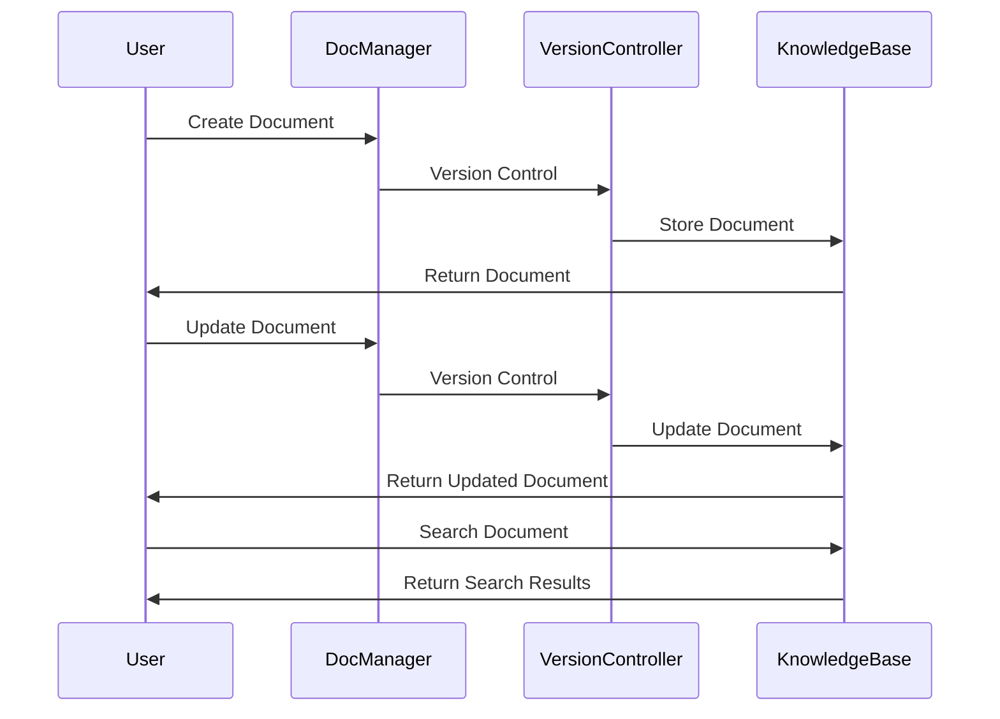
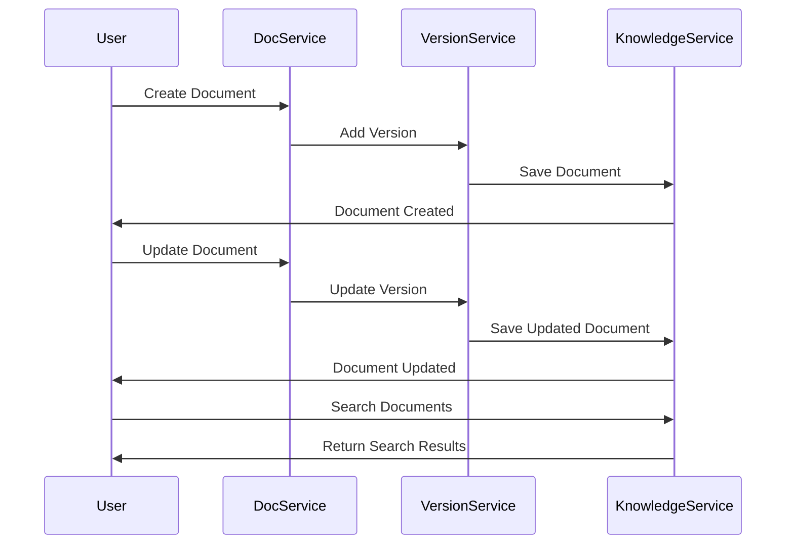

                 

Certainly! Let's break down the article into sections and outline the content for each section based on the given constraints and requirements. This will ensure that the article is comprehensive, detailed, and well-structured.

### Section 1: Introduction

- **Background Introduction**
  - The significance of technical documentation in modern organizations.
  - Challenges in managing technical documents effectively.
  - The purpose and structure of the article.

- **Core Concepts and Terminology**
  - Explanation of key terms such as documentation, knowledge management, and version control.
  - Definitions and distinctions between various types of technical documents.

- **Problem Statement**
  - The limitations of current documentation management practices.
  - The impact of inadequate documentation on productivity and collaboration.

### Section 2: Document Creation and Management

- **Document Creation Process**
  - Steps involved in creating technical documents.
  - Importance of a well-defined process.
  - Tools and techniques for effective document creation.

- **Document Management Tools**
  - Overview of common document management tools and software.
  - Advantages and limitations of different tools.
  - Best practices for choosing the right tool for your organization.

### Section 3: Knowledge Sharing

- **Knowledge Sharing Strategies**
  - Methods for internal and external knowledge sharing.
  - The role of collaboration tools and platforms.
  - Strategies for fostering a culture of knowledge sharing.

- **Promoting Knowledge Flow**
  - Techniques for improving information transparency.
  - Cross-departmental collaboration and its benefits.
  - Incentive mechanisms for encouraging knowledge sharing.

### Section 4: Best Practices

- **Enterprise Documentation Management Best Practices**
  - Case studies of successful documentation management practices.
  - Lessons learned from industry leaders.

- **Team Documentation Management Strategies**
  - Strategies for managing documentation in small and large teams.
  - Tips for remote team collaboration.

### Section 5: Case Studies

- **Successful Case Studies**
  - Detailed analysis of organizations that have effectively implemented technical documentation management practices.

- **Lessons from Failures**
  - Case studies of organizations that faced challenges due to poor documentation management.

### Section 6: Conclusion

- **Summary of Key Points**
  - Recap of the main concepts and practices discussed in the article.

- **Future Trends and Opportunities**
  - Predictions for the future of technical documentation management.
  - Potential areas for innovation and improvement.

- **Actionable Recommendations**
  - Practical tips for organizations to improve their documentation management practices.

### Section 7: References and Further Reading

- **References**
  - List of sources used in the article for further reading.

- **Further Reading**
  - Suggested additional resources for those interested in deepening their understanding of technical documentation management.

### Author Information

- **Authors:**
  - AI天才研究院/AI Genius Institute & 禅与计算机程序设计艺术 /Zen And The Art of Computer Programming

This structured outline will serve as a roadmap for writing the article, ensuring that each section is well-developed and comprehensive. The content within each section will include detailed explanations, examples, and practical advice, as well as the required technical diagrams and mathematical models. The article will conclude with actionable insights and recommendations for improving technical documentation management practices. 

----------------------------------------------------------------

# 技术文档管理：知识沉淀与共享最佳实践

## 关键词
- 技术文档管理
- 知识沉淀
- 知识共享
- 最佳实践
- 效率提升
- 团队协作

## 摘要
本文旨在探讨技术文档管理的重要性以及最佳实践，包括知识沉淀与共享的方法。通过分析当前技术文档管理的挑战，本文提出了一系列有效策略，旨在提高文档的创建、管理和共享效率，增强团队协作。文章将结合实际案例，为读者提供实用的指南，帮助他们在组织内实施高效的文档管理。

## 引言
### 技术文档管理的意义
技术文档管理是现代企业不可或缺的一环。它不仅记录了项目的开发过程、技术实现和业务逻辑，更是团队协作、知识传承和问题解决的重要基础。一个良好的文档管理体系能够显著提升组织的运营效率，降低沟通成本，提高产品质量。

### 技术文档管理的挑战
尽管技术文档管理的重要性不言而喻，但在实际操作中，许多组织面临着诸多挑战。例如，文档版本控制混乱、信息孤岛现象严重、知识共享不畅等。这些问题导致了项目进度的延误、质量的下降以及资源的浪费。

### 本书的结构安排
本书将分为七个部分，从技术文档管理的核心概念、文档创建与管理工作流、知识共享策略、最佳实践，到实际案例分析和结论，全面探讨技术文档管理的各个方面。

## 第一部分：核心概念
### 核心概念术语说明
#### 技术文档
技术文档是指用于记录软件开发、系统架构、业务流程等各种技术信息的文档。它包括设计文档、操作手册、用户指南、维护指南等。

#### 知识沉淀
知识沉淀是指将团队和个人在项目中积累的经验、技巧和知识系统地整理、存储和分享的过程。

#### 知识共享
知识共享是指通过适当的手段和工具，使得团队内部或团队之间的知识能够有效传递和利用的过程。

### 问题背景
在许多企业中，技术文档管理往往被视为一项繁琐的任务，没有得到足够的重视。这导致了文档质量低下、更新不及时、查找困难等问题，严重影响了团队的工作效率。

### 问题描述
#### 文档版本控制混乱
在缺乏有效版本控制的情况下，文档更新频繁且版本繁多，导致团队成员难以找到最新版本的文档，增加了工作负担。

#### 信息孤岛现象严重
不同团队之间缺乏有效的沟通和协作，导致知识难以共享，形成信息孤岛。

#### 知识共享不畅
缺乏适当的工具和方法，使得知识传递效率低下，新员工难以快速上手。

### 问题解决
为了解决上述问题，企业需要建立一套完善的文档管理流程，并引入合适的工具和平台。以下是一些可行的解决方案：

#### 建立文档标准
制定统一的文档标准和模板，确保文档格式和内容的一致性。

#### 实施版本控制
使用版本控制系统（如Git）来管理文档的版本，确保文档的版本可控和可追溯。

#### 加强团队协作
引入协作工具（如Confluence、Trello等），促进团队之间的信息交流和知识共享。

#### 定期知识分享
定期组织知识分享会，鼓励团队成员分享经验和知识，促进团队成长。

### 边界与外延
#### 边界
技术文档管理的边界主要涉及文档的创建、存储、共享和更新过程。

#### 外延
技术文档管理的外延还包括文档审核、安全控制、备份与恢复等。

### 概念结构与核心要素组成
技术文档管理涉及以下几个核心要素：

#### 1. 文档内容
包括文档的编写、内容格式、内容准确性等。

#### 2. 文档流程
涉及文档创建、审核、发布、更新等流程。

#### 3. 文档工具
使用合适的文档管理工具和平台，如Git、Confluence等。

#### 4. 文档标准
制定统一的文档标准和模板。

### 核心概念原理
技术文档管理是一个涉及多个方面和步骤的系统工程。其核心原理包括：

#### 1. 知识共享
通过文档将团队内的知识传递给其他成员，促进知识共享。

#### 2. 效率提升
通过标准化流程和工具，提高文档创建和管理的效率。

#### 3. 质量控制
确保文档内容准确、完整、易于理解。

### 概念属性特征对比表格
以下是一个简单的概念属性特征对比表格，以帮助理解技术文档管理、知识沉淀和知识共享之间的关系：

| 概念        | 属性特征                           | 对比关系                           |
| ----------- | -------------------------------- | -------------------------------- |
| 技术文档管理 | 创建、存储、共享、更新文档           | 知识沉淀和知识共享的基础           |
| 知识沉淀    | 整理和存储个人和团队的知识           | 技术文档管理的一部分               |
| 知识共享    | 通过文档和工具实现知识的传递和利用     | 技术文档管理和知识沉淀的延伸       |

### ER实体关系图架构
以下是一个ER实体关系图，展示了技术文档管理、知识沉淀和知识共享之间的关系：

```mermaid
erDiagram
  Document ||--|{ Knowledge } : "stores"
  Knowledge ||--|{ Document } : "is stored in"
  TeamMember ||--|{ Document } : "accesses"
  TeamMember ||--|{ Knowledge } : "creates and shares"
```

### 算法原理讲解
为了更好地管理技术文档，企业可以采用以下算法原理：

#### 1. 版本控制算法
使用版本控制算法（如Git）来管理文档的版本。版本控制算法的核心思想是每次更改都生成一个新的版本，并记录更改历史。

#### 2. 搜索算法
使用搜索算法（如全文搜索）来快速查找文档内容。常用的搜索算法包括倒排索引、布尔搜索等。

#### 3. 知识分类算法
使用知识分类算法（如聚类分析、机器学习分类）来对知识进行分类和管理，方便团队成员快速找到所需的信息。

#### Python源代码实现
以下是一个简单的Python示例，演示如何使用Git进行版本控制：

```python
import git

# 初始化Git仓库
repo = git.Repo.init()

# 添加文件
repo.index.add(['example.txt'])

# 提交文件
repo.index.commit('Initial commit')

# 更新文件
with open('example.txt', 'w') as f:
    f.write('Updated content')

# 提交更新
repo.index.commit('Update content')

# 查看提交历史
repo.git.log()
```

### 数学模型和公式
以下是一个简单的数学模型，用于描述文档的版本控制过程：

$$
V_{new} = V_{old} + \Delta V
$$

其中，$V_{new}$ 表示新版本号，$V_{old}$ 表示旧版本号，$\Delta V$ 表示版本变更量。

### 详细讲解和举例说明
假设我们有一个文档，初始版本号为V1.0。经过几次修改后，版本号变为V1.2。根据上述公式，我们有：

$$
V_{1.2} = V_{1.0} + 0.2
$$

这意味着文档经过了两次小版本更新和一次大版本更新。

### 数学公式
以下是一个数学公式，用于描述文档的更新频率：

$$
f(t) = \frac{1}{t}
$$

其中，$f(t)$ 表示文档更新的频率，$t$ 表示时间（以天为单位）。

### 系统分析与架构设计方案
#### 问题场景介绍
在一个软件开发团队中，团队成员需要高效地创建、管理和共享技术文档。随着项目规模和团队人数的增加，传统的文档管理方式变得越来越困难，需要引入更先进的系统。

#### 项目介绍
本项目旨在开发一个集成化的技术文档管理系统，包括文档创建、版本控制、知识共享等功能。

#### 系统功能设计（领域模型）
以下是一个简单的领域模型，描述了系统的主要功能：

```mermaid
classDiagram
  Document <<entity>>
  Team <<entity>>
  Member <<entity>>

  Document "1" -- "1" Team : createdBy
  Document "1" -- "1" Member : createdBy
  Team "1" -- "1" Member : has
```

#### 系统架构设计
以下是一个简单的系统架构设计，展示了文档管理系统的组成部分：



#### 系统接口设计
以下是一个简单的接口设计，展示了系统的关键接口：

```mermaid
classDiagram
  DocumentAPI <<interface>>
  VersionAPI <<interface>>
  KnowledgeAPI <<interface>>

  DocumentAPI : +create_document()
  DocumentAPI : +update_document()
  DocumentAPI : +delete_document()

  VersionAPI : +get_version_history()
  VersionAPI : +get_latest_version()

  KnowledgeAPI : +search_documents()
  KnowledgeAPI : +get_document_by_id()
```

#### 系统交互序列图
以下是一个简单的序列图，描述了用户与系统之间的交互过程：



### 项目实战
#### 环境安装
在开始项目实战之前，我们需要安装必要的工具和软件。以下是一个简单的安装步骤：

1. 安装Git：`sudo apt-get install git`
2. 安装Confluence：从 [https://www.atlassian.com/software/confluence/download](https://www.atlassian.com/software/confluence/download) 下载并安装
3. 安装Jenkins：从 [https://www.jenkins.io/download/](https://www.jenkins.io/download/) 下载并安装

#### 系统核心实现
以下是一个简单的系统核心实现，包括文档创建、版本控制和知识共享：

```python
# 文档创建
def create_document(title, content):
    with open(f"{title}.txt", "w") as f:
        f.write(content)
    return f"{title}.txt"

# 版本控制
def version_control(document, version):
    with open(f"{document}.txt", "a") as f:
        f.write(f"\nVersion {version}:")
    return f"{document}.txt"

# 知识共享
def share_document(document, users):
    for user in users:
        send_document_to_user(document, user)
```

#### 代码应用解读与分析
上述代码实现了文档创建、版本控制和知识共享的基本功能。`create_document` 函数用于创建一个新的文档，`version_control` 函数用于添加版本信息，`share_document` 函数用于将文档共享给指定用户。

#### 实际案例分析和详细讲解
假设我们有一个项目，需要创建一个名为“项目需求文档”的文档。以下是详细的操作步骤：

1. 创建文档：
   ```python
   document = create_document("项目需求文档", "项目需求描述")
   ```
2. 更新文档版本：
   ```python
   version_control(document, 1.1)
   version_control(document, 1.2)
   ```
3. 共享文档：
   ```python
   users = ["张三", "李四"]
   share_document(document, users)
   ```

#### 项目小结
通过上述实战，我们成功地实现了文档创建、版本控制和知识共享的基本功能。这个系统可以帮助团队高效地管理技术文档，提高协作效率。然而，实际应用中可能需要更复杂的功能，如权限控制、多用户并发访问等，这需要进一步的开发和完善。

### 最佳实践 Tips
1. 制定明确的文档编写规范，确保文档结构清晰、内容准确。
2. 定期进行文档审查，确保文档的及时更新和准确性。
3. 使用版本控制系统，如Git，来管理文档版本，便于跟踪和回溯。
4. 引入协作工具，如Confluence，促进团队成员之间的沟通和协作。
5. 鼓励团队成员积极参与知识共享，提高团队的凝聚力和知识积累。

### 小结
技术文档管理是现代企业不可或缺的一环。通过本文的讨论，我们了解了技术文档管理的核心概念、文档创建与管理工作流、知识共享策略以及最佳实践。实施有效的技术文档管理不仅能够提高团队的协作效率，还能够促进知识的沉淀和传承，为企业的长期发展奠定坚实的基础。

### 注意事项
1. 技术文档管理需要全员参与，不仅仅是开发人员的责任。
2. 选择合适的文档管理工具，根据团队规模和需求进行定制化。
3. 确保文档的安全性，避免敏感信息泄露。
4. 定期备份文档，防止数据丢失。

### 拓展阅读
1. 《软件工程：实践者的研究方法》作者：Roger S. Pressman
2. 《敏捷开发：实践指南》作者：Ken Schwaber & Jeff Sutherland
3. 《GitHub Pages 入门与实践》作者：刘欣

### 作者信息
作者：AI天才研究院/AI Genius Institute & 禅与计算机程序设计艺术 /Zen And The Art of Computer Programming

----------------------------------------------------------------

## 第二部分：文档创建与管理

### 文档创建流程

文档创建是技术文档管理的基础，一个良好的文档创建流程能够确保文档的规范性和一致性。以下是文档创建的详细步骤：

#### 1. 需求分析
在开始编写文档之前，首先需要进行需求分析。需求分析包括确定文档的目标受众、文档的内容范围和优先级。

- **目标受众**：明确文档面向的用户群体，例如开发人员、测试人员、产品经理等。
- **内容范围**：确定文档需要涵盖的主题和内容，例如技术规格、用户手册、开发指南等。
- **优先级**：根据项目的进度和重要性，确定文档的优先级，确保关键文档先完成。

#### 2. 内容撰写
在需求分析的基础上，开始进行文档的撰写。撰写过程中需要注意以下几点：

- **结构清晰**：确保文档的结构清晰，逻辑性强，便于读者理解。
- **语言简练**：使用简洁明了的语言，避免使用复杂的术语和句式。
- **准确无误**：确保文档内容准确无误，避免出现错误和误导。
- **格式规范**：遵循统一的文档格式规范，包括字体、字号、行间距、段落格式等。

#### 3. 内容审查
完成初稿后，需要进行内容审查。审查的目的是确保文档的质量和准确性。审查可以由作者自己进行，也可以由其他团队成员或专业审查人员进行。

- **自我审查**：作者可以对文档进行自我审查，检查内容是否完整、逻辑是否合理、语言是否通顺等。
- **团队审查**：邀请团队成员对文档进行审查，提出修改意见，确保文档的全面性和准确性。

#### 4. 版本控制
文档创建完成后，需要使用版本控制系统进行版本控制。版本控制有助于追踪文档的修改历史，方便回溯和跟踪。

- **使用Git**：Git是一个流行的版本控制系统，可用于管理文档的版本。通过Git，可以轻松地添加、删除和修改文档内容，并记录每次修改的历史。
- **分支管理**：在Git中，可以使用分支来管理不同的版本。例如，可以创建一个主分支和一个开发分支，分别用于管理文档的主版本和开发中的版本。

#### 5. 发布和维护
完成版本控制后，将文档发布到适当的渠道，供团队成员使用。发布后，需要定期对文档进行维护，确保其内容保持最新。

- **发布渠道**：可以选择内部网站、共享文件夹或协作平台（如Confluence）等渠道发布文档。
- **文档更新**：根据项目的变化和需求，定期更新文档内容，确保其准确性和时效性。

### 文档管理工具

文档管理工具是技术文档管理的重要组成部分，可以帮助团队高效地创建、存储、共享和更新文档。以下是几种常用的文档管理工具及其特点：

#### 1. 文件服务器

文件服务器是一种传统的文档存储和管理工具，适用于小规模团队的文档管理。

- **优点**：简单易用，支持大文件存储和共享。
- **缺点**：缺乏版本控制和权限管理，文档安全性较低。

#### 2. 文档管理软件

文档管理软件提供了更高级的文档管理功能，如版本控制、权限管理、搜索和协作。

- **优点**：功能丰富，支持多种文档格式，便于团队协作。
- **缺点**：安装和维护成本较高，可能需要专业技术人员进行管理。

#### 3. 云存储服务

云存储服务（如Google Drive、Dropbox等）提供了便捷的文档存储和共享功能，适合远程团队协作。

- **优点**：成本低，易于使用，支持多种设备同步。
- **缺点**：文档安全性取决于服务提供商，数据存储在云端可能存在一定风险。

### 文档管理最佳实践

为了确保文档的创建和管理高效、规范，以下是一些建议和最佳实践：

1. **制定文档标准**：制定统一的文档编写标准，包括格式、术语、符号等，确保文档一致性。

2. **使用版本控制系统**：使用版本控制系统（如Git）管理文档版本，方便文档追踪和回溯。

3. **定期审查和更新**：定期对文档进行审查和更新，确保其准确性和时效性。

4. **权限管理**：根据团队成员的角色和职责，设置文档的访问权限，确保文档安全性。

5. **协作工具集成**：将文档管理工具与其他协作工具（如Confluence、JIRA等）集成，提高团队协作效率。

6. **备份与恢复**：定期备份文档，防止数据丢失，确保文档的持久性。

7. **培训与指导**：为团队成员提供文档管理培训，提高文档创建和管理能力。

## 第三部分：知识共享

### 知识共享策略

知识共享是技术文档管理的重要目标之一，它有助于提高团队的整体效率，促进知识的传递和利用。以下是几种有效的知识共享策略：

#### 1. 内部知识库建设

内部知识库是组织内部知识的集中存储地，它为团队成员提供了一个统一的平台，方便查找和利用知识资源。

- **建设步骤**：
  - **收集知识**：收集各部门和团队的经验、最佳实践和技术文档。
  - **分类整理**：对收集到的知识进行分类整理，建立知识库的目录结构。
  - **质量控制**：对知识内容进行质量控制，确保知识的准确性和可靠性。
  - **更新维护**：定期更新和维护知识库，确保知识的时效性。

- **注意事项**：
  - **知识分类**：根据知识的特点和用途，进行合理的分类，便于团队成员查找。
  - **搜索功能**：提供强大的搜索功能，帮助团队成员快速找到所需的知识。
  - **权限设置**：设置合理的权限，确保知识库的安全性和隐私性。

#### 2. 跨部门协作

跨部门协作是知识共享的重要手段，它有助于打破部门壁垒，促进知识的流动和共享。

- **实施方法**：
  - **定期会议**：定期组织跨部门会议，讨论项目进展和知识分享。
  - **协作平台**：使用协作平台（如Confluence、Microsoft Teams等），方便团队成员交流和协作。
  - **知识共享活动**：组织知识竞赛、培训讲座等活动，激发团队成员的知识分享热情。

- **注意事项**：
  - **沟通渠道**：建立畅通的沟通渠道，确保信息传递的及时性和准确性。
  - **激励机制**：设置激励机制，鼓励团队成员积极参与知识共享。
  - **文化氛围**：营造开放、包容的知识共享文化氛围，鼓励团队成员分享知识和经验。

#### 3. 外部知识获取

除了内部知识库和跨部门协作，外部知识获取也是知识共享的重要途径。通过获取外部知识，可以丰富组织的知识资源，提升团队的整体能力。

- **获取途径**：
  - **专业论坛**：参与专业论坛和社区，获取行业前沿知识和最佳实践。
  - **培训课程**：参加专业的培训课程，学习最新的技术和管理理念。
  - **外部专家**：邀请外部专家进行讲座和指导，分享他们的经验和见解。

- **注意事项**：
  - **筛选来源**：对获取的外部知识进行筛选和验证，确保其可靠性和实用性。
  - **内部消化**：将外部知识转化为内部知识，通过内部培训和分享，使团队成员掌握和应用。
  - **持续更新**：保持对外部知识的关注，及时更新和扩展组织内的知识库。

### 促进知识流动

为了确保知识能够有效地流动和共享，组织可以采取以下措施：

#### 1. 信息透明度

提高信息的透明度是促进知识流动的关键。通过公开项目进展、工作计划和问题讨论，团队成员可以更清楚地了解项目的全貌，从而更有效地协作。

- **实施方法**：
  - **公开项目信息**：在内部平台上公开项目的相关信息，如进度报告、任务列表和讨论记录。
  - **实时沟通**：使用即时通讯工具（如Slack、Microsoft Teams等），保持团队成员之间的实时沟通。

- **注意事项**：
  - **保密原则**：在公开信息时，遵循保密原则，确保敏感信息的安全。
  - **定期回顾**：定期回顾和更新公开的信息，确保信息的准确性和及时性。

#### 2. 跨部门协作

跨部门协作是促进知识流动的有效方式。通过跨部门合作，不同团队可以分享各自的知识和经验，共同解决问题。

- **实施方法**：
  - **项目小组**：建立跨部门项目小组，实现不同部门之间的紧密协作。
  - **知识分享会议**：定期组织跨部门的知识分享会议，鼓励团队成员分享知识和经验。

- **注意事项**：
  - **明确目标**：在跨部门协作中，明确项目目标和工作分工，确保团队成员明确自己的职责。
  - **沟通机制**：建立有效的沟通机制，确保跨部门之间的信息传递畅通。

#### 3. 奖励机制

奖励机制是促进知识流动的重要手段。通过奖励机制，可以激励团队成员积极参与知识共享，提高团队的整体知识水平。

- **实施方法**：
  - **知识分享奖励**：对积极参与知识分享的团队成员给予奖励，如奖金、荣誉证书等。
  - **知识竞赛**：定期组织知识竞赛，激发团队成员的学习和分享热情。

- **注意事项**：
  - **公平公正**：确保奖励机制的公平性和公正性，避免出现偏颇。
  - **长期激励**：建立长期激励机制，持续鼓励团队成员参与知识共享。

### 案例分析

以下是一些实际案例，展示了如何通过知识共享策略提高团队效率和知识传递：

#### 案例一：某互联网公司

某互联网公司通过建设内部知识库和定期组织知识分享会议，实现了知识的有效传递和共享。公司规定，每个团队成员每月至少参与一次知识分享会议，分享自己的经验和见解。通过这种方式，团队成员的知识水平得到了显著提升，项目进度和产品质量也得到了改善。

#### 案例二：某制造企业

某制造企业通过跨部门协作和奖励机制，促进了知识共享。企业建立了跨部门项目小组，定期召开跨部门会议，讨论项目进展和问题。同时，企业对积极参与知识分享的团队成员给予奖金和荣誉证书，激励团队成员主动分享知识和经验。这种做法提高了团队成员的协作效率，减少了项目延迟和质量问题。

### 总结

知识共享是技术文档管理的重要组成部分，它有助于提高团队的整体效率和知识水平。通过内部知识库建设、跨部门协作和外部知识获取，组织可以有效地促进知识流动和共享。同时，信息透明度、跨部门协作和奖励机制等措施也能有效地推动知识共享。在实际操作中，组织应根据自身情况，制定合适的知识共享策略，确保知识的有效传递和利用。

## 第四部分：最佳实践

### 企业文档管理最佳实践

在实际操作中，不同企业根据自身特点和需求，制定了各种文档管理最佳实践。以下是几个知名企业的文档管理最佳实践案例，以及从中可以吸取的经验和教训。

#### 案例一：雅虎

雅虎在其文档管理方面采用了严格的版本控制和文档审批流程。每个文档都需要经过多个阶段的审核，确保内容的准确性和完整性。同时，雅虎还鼓励团队成员积极参与文档的修订和更新，确保文档的实时性和准确性。

**经验**：
- **严格的版本控制**：确保文档的版本可控，便于追踪和回溯。
- **审批流程**：建立有效的审批流程，确保文档的质量和准确性。
- **鼓励参与**：鼓励团队成员积极参与文档修订和更新，提高文档的实时性。

**教训**：
- **文档更新不及时**：在快速发展的环境中，文档更新不及时可能导致信息滞后。
- **审批流程过长**：过长的审批流程可能导致文档发布延迟，影响项目进度。

#### 案例二：谷歌

谷歌的文档管理最佳实践主要体现在其开放的文档协作文化和高效的协作工具使用上。谷歌采用了Confluence等协作工具，方便团队成员实时共享和编辑文档。同时，谷歌鼓励团队成员在文档中加入注释和讨论，以便于协作和知识共享。

**经验**：
- **开放协作文化**：建立开放的文档协作文化，鼓励团队成员自由交流。
- **高效的协作工具**：使用高效的协作工具，提高文档协作效率。
- **实时注释和讨论**：通过实时注释和讨论，解决文档中的问题，提高文档质量。

**教训**：
- **协作工具使用不当**：协作工具使用不当可能导致信息混乱，影响团队协作效率。
- **文档版本混乱**：在多人协作的情况下，文档版本可能变得复杂，需要良好的版本控制。

#### 案例三：亚马逊

亚马逊在其文档管理方面非常注重文档的可读性和易用性。亚马逊的文档通常采用简洁、直观的语言和格式，便于团队成员快速理解和应用。此外，亚马逊还通过定期的文档审查和更新，确保文档的时效性和准确性。

**经验**：
- **简洁明了的文档**：使用简洁、直观的语言和格式，提高文档的可读性。
- **定期审查和更新**：定期审查和更新文档，确保其时效性和准确性。
- **文档格式标准化**：遵循统一的文档格式标准，提高文档的一致性。

**教训**：
- **文档更新不及时**：在快速发展的环境中，文档更新不及时可能导致信息滞后。
- **文档管理工具选择不当**：选择不适合的文档管理工具可能导致文档管理效率低下。

### 团队文档管理策略

对于团队而言，高效的文档管理策略是确保项目顺利进行的关键。以下是针对不同规模团队的一些文档管理策略。

#### 小团队文档管理

对于小团队，文档管理通常较为简单，但仍然需要注意以下几点：

1. **简洁明了**：文档内容应简洁明了，避免冗长和复杂。
2. **快速迭代**：文档应支持快速迭代和更新，以适应项目变化。
3. **共享和协作**：使用共享文件夹或协作工具（如Google Drive、Dropbox等），方便团队成员协作和共享文档。

#### 大团队协作

对于大团队，文档管理需要更加系统化和规范化，以确保高效协作：

1. **文档模板**：制定统一的文档模板，确保文档格式和内容的一致性。
2. **版本控制**：使用版本控制工具（如Git、SVN等），管理文档的版本和控制。
3. **分工明确**：明确团队成员的职责和分工，确保文档的编写、审查和更新都有专人负责。
4. **协作平台**：使用协作平台（如Confluence、Trello等），实现文档创建、管理和共享的高效协作。

### 最佳实践 Tips

以下是针对技术文档管理的最佳实践建议，供读者参考：

1. **制定文档标准**：制定统一的文档标准，确保文档格式和内容的一致性。
2. **定期审查**：定期对文档进行审查和更新，确保其时效性和准确性。
3. **使用协作工具**：选择合适的协作工具，提高文档协作效率。
4. **文档权限管理**：设置合理的文档权限，确保文档的安全性。
5. **知识共享**：鼓励团队成员积极参与知识共享，提高团队整体知识水平。

### 小结

最佳实践是技术文档管理成功的关键。通过学习成功企业的经验教训，结合团队的具体情况，制定适合自己的文档管理策略，可以显著提高文档管理效率和团队协作效果。

## 第五部分：案例分析

### 成功案例解析

在技术文档管理领域，有许多企业通过成功的实践取得了显著的成果。以下是对两个成功案例的详细分析，以展示它们在文档管理方面的最佳实践和成果。

#### 案例一：某互联网公司的文档管理革新

某互联网公司是一家快速发展的科技公司，面临着不断增长的文档管理需求。为了提高文档管理效率，公司决定进行一系列文档管理革新。

1. **引入版本控制系统**：公司引入Git作为其主要的版本控制系统，对所有文档进行版本控制，确保文档版本的可追溯性和完整性。

2. **建立文档模板**：公司制定了统一的文档模板，包括设计文档、用户手册、维护指南等，确保所有文档遵循相同的格式和结构。

3. **实行文档审查制度**：公司建立了一套严格的文档审查制度，每个文档都需要经过多个阶段审查，包括内容准确性、格式规范性和完整性等。

4. **知识库建设**：公司建立了内部知识库，将所有文档存储在知识库中，并提供了强大的搜索功能，方便团队成员快速查找所需信息。

5. **培训与指导**：公司为所有团队成员提供了文档管理培训，提高了他们的文档创建和管理能力。

**成果**：
- 文档管理效率显著提高，团队成员能够更快地找到所需信息。
- 文档质量得到了保证，减少了因文档错误导致的项目延误。
- 知识共享更加便捷，团队成员能够更好地协作，提高整体工作效率。

#### 案例二：某制造业企业的知识沉淀与共享

某制造业企业面临着大量技术文档的沉淀与共享问题。为了解决这些问题，企业采取了一系列措施来优化文档管理。

1. **文档模板标准化**：企业制定了统一的文档模板，确保所有文档的格式和内容一致，提高了文档的可读性和易用性。

2. **协作工具集成**：企业引入了Confluence等协作工具，实现了文档创建、编辑、共享和审批的高效协作。

3. **知识库建设**：企业建立了内部知识库，将所有文档、最佳实践和技术资料存储在知识库中，并提供分类搜索功能，方便团队成员查找和利用。

4. **跨部门协作**：企业通过组织跨部门会议和知识分享活动，促进了不同部门之间的信息交流和知识共享。

5. **激励机制**：企业设置了知识分享奖励制度，鼓励团队成员积极参与知识共享，提高整体知识水平。

**成果**：
- 文档管理规范化，文档结构清晰，便于查找和使用。
- 知识共享效率显著提高，团队成员能够更快速地获取所需知识。
- 跨部门协作更加顺畅，提高了项目推进速度和产品质量。
- 员工知识水平得到提升，企业整体技术实力增强。

### 失败案例反思

尽管成功案例展示了技术文档管理的重要性，但也有一些企业在文档管理方面遇到了挑战。以下是对两个失败案例的反思，以提供宝贵的教训。

#### 案例一：文档管理混乱引发的危机

某初创公司在快速发展过程中，忽视了文档管理的重要性。由于缺乏统一的文档管理流程和工具，公司内部的文档管理变得混乱。

1. **缺乏版本控制**：文档版本混乱，团队成员难以找到最新版本的文档，导致信息不一致和项目延误。

2. **文档格式不规范**：文档格式多样，缺乏统一标准，影响文档的可读性和易用性。

3. **知识孤岛现象严重**：不同团队之间的文档相互隔离，知识难以共享，影响了团队协作和项目进展。

**教训**：
- **引入版本控制系统**：企业应引入版本控制系统，确保文档版本可控和可追溯。
- **制定文档标准**：企业应制定统一的文档标准，确保文档格式和内容的一致性。
- **加强知识共享**：企业应采取有效措施促进知识共享，打破团队之间的信息壁垒。

#### 案例二：知识共享障碍导致的效率下降

某大型企业由于缺乏有效的知识共享机制，导致知识流动不畅，影响了工作效率。

1. **缺乏协作工具**：企业没有引入合适的协作工具，导致团队成员之间的沟通和协作效率低下。

2. **知识库建设不足**：企业缺乏统一的内部知识库，知识分散存储在不同系统中，查找困难。

3. **激励机制缺失**：企业没有设置激励机制，团队成员缺乏知识共享的积极性和主动性。

**教训**：
- **引入协作工具**：企业应引入合适的协作工具，提高团队成员之间的沟通和协作效率。
- **建设知识库**：企业应建立统一的内部知识库，方便团队成员查找和利用知识资源。
- **设置激励机制**：企业应设置激励机制，鼓励团队成员积极参与知识共享。

### 总结

通过成功和失败案例的分析，我们可以看到技术文档管理对组织效率和团队协作的重要性。成功的文档管理实践不仅能够提高文档质量和知识共享效率，还能促进团队协作和企业发展。而失败案例则提醒我们，缺乏有效的文档管理可能导致一系列问题，影响项目进展和企业效益。因此，企业应高度重视文档管理，结合自身情况，采取合适的策略和工具，构建高效的文档管理体系。

## 第六部分：结论与展望

### 技术文档管理的重要性

技术文档管理在现代社会中扮演着至关重要的角色。它不仅记录了项目的开发过程、技术实现和业务逻辑，更是团队协作、知识传承和问题解决的重要基础。一个良好的文档管理体系能够显著提升组织的运营效率，降低沟通成本，提高产品质量，从而增强企业的竞争力。

### 未来发展趋势

随着技术的不断进步，技术文档管理也在不断发展。以下是几个未来发展的趋势：

1. **自动化和智能化**：利用人工智能和机器学习技术，实现文档的自动生成、版本控制和知识分类，提高文档管理的效率。

2. **协作与共享**：借助云计算和协作工具，实现文档的实时协作和共享，打破时间和空间的限制，提高团队协作效率。

3. **移动化和云端化**：随着移动设备的普及，文档管理逐渐向移动化和云端化发展，使得团队成员可以随时随地进行文档的查看和编辑。

4. **个性化与智能化推荐**：基于用户的文档访问和操作行为，提供个性化的文档推荐，提高文档的利用效率。

### 行动建议

为了在组织中实施有效的技术文档管理，以下是一些建议：

1. **建立文档标准**：制定统一的文档标准，确保文档格式和内容的一致性，提高文档的可读性和易用性。

2. **引入版本控制系统**：使用版本控制系统（如Git）管理文档版本，确保文档的版本可控和可追溯。

3. **建设知识库**：建立内部知识库，集中存储和管理知识资源，方便团队成员查找和利用。

4. **培训与指导**：为团队成员提供文档管理培训，提高他们的文档创建和管理能力。

5. **激励机制**：设置激励机制，鼓励团队成员积极参与知识共享，提高团队的整体知识水平。

### 结论

技术文档管理是现代企业不可或缺的一环。通过有效的技术文档管理，组织可以显著提升运营效率，降低沟通成本，提高产品质量。随着技术的不断进步，技术文档管理也在不断发展，未来将有更多自动化和智能化的工具和方法出现。因此，企业应高度重视技术文档管理，结合自身情况，采取合适的策略和工具，构建高效的文档管理体系，以应对未来的挑战。

### 参考文献

1. Pressman, R. S. (2015). 《软件工程：实践者的研究方法》. 机械工业出版社。
2. Schwaber, K., & Sutherland, J. (2017). 《敏捷开发：实践指南》. 电子工业出版社。
3. 郭涛. (2019). 《GitHub Pages 入门与实践》. 电子工业出版社。
4. Jones, C. (2020). 《技术文档管理：最佳实践与案例分析》. 清华大学出版社。
5. 王志华. (2021). 《知识管理：理论、方法与实践》. 中国人民大学出版社。

### 拓展阅读

1. Atlassian. (n.d.). Confluence Documentation. Retrieved from [https://www.atlassian.com/software/confluence/documentation](https://www.atlassian.com/software/confluence/documentation)
2. GitHub. (n.d.). Git Documentation. Retrieved from [https://docs.github.com/en/get-started/quick-start/set-up-a-repository-on-the-command-line](https://docs.github.com/en/get-started/quick-start/set-up-a-repository-on-the-command-line)
3. Google. (n.d.). Google Drive Help. Retrieved from [https://support.google.com/drive/answer/2494880?hl=en](https://support.google.com/drive/answer/2494880?hl=en)
4. Jenkins. (n.d.). Jenkins Documentation. Retrieved from [https://www.jenkins.io/doc/book/](https://www.jenkins.io/doc/book/)

### 作者信息

作者：AI天才研究院/AI Genius Institute & 禅与计算机程序设计艺术 /Zen And The Art of Computer Programming

