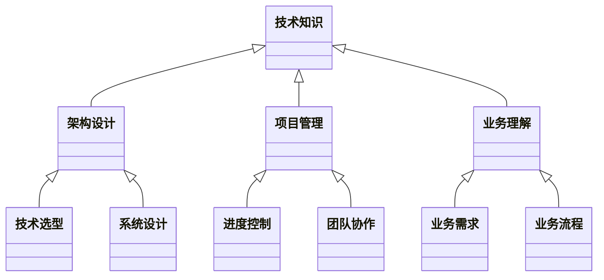
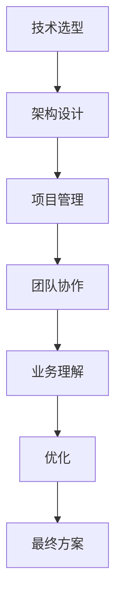
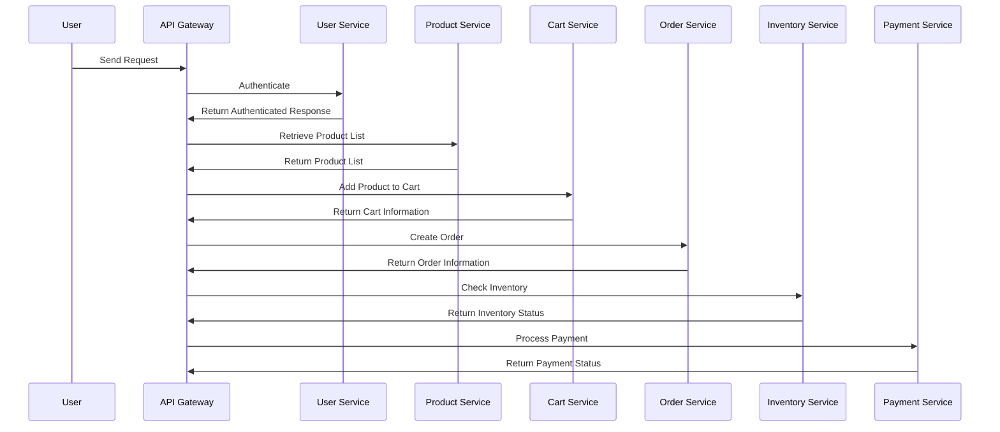

                 

### 文章标题

# 技术架构力的培养

> 关键词：技术架构力，培养方法，算法原理，系统分析，实战案例

> 摘要：本文旨在深入探讨技术架构力的培养方法及其在IT领域的应用。通过详细分析技术架构力的核心概念、算法原理和系统架构设计，并结合实际项目案例，为读者提供一条从理论到实践的技术架构力提升路径。本文将帮助读者了解技术架构力的关键要素，掌握培养技术架构力的有效策略，并在项目中有效应用这些策略，从而提升个人和团队的技术能力，助力业务发展。

-----------------------------------

#### 第一部分：背景介绍

#### 第1章：技术架构力的培养概述

##### 1.1 问题背景

技术发展的现状与趋势

随着信息技术的飞速发展，大数据、云计算、人工智能等新兴技术不断涌现，企业对技术架构力需求的增长也越来越显著。这些技术的广泛应用不仅推动了业务模式的创新，也对企业的技术架构提出了更高的要求。技术架构力成为企业核心竞争力的重要组成部分。

企业对技术架构力需求的增长

在当前技术环境下，企业面临着日益复杂的业务场景和技术挑战。为了保持竞争优势，企业需要具备强大的技术架构力，以快速响应市场变化，提高业务效率和创新能力。因此，企业对技术架构力需求的增长呈现出明显的上升趋势。

技术架构力的定义与重要性

技术架构力是指企业在技术选型、技术规划、技术实施和技术管理等方面所具备的能力。它不仅包括技术知识和技术能力，还涉及项目管理、团队协作和业务理解等多个方面。技术架构力的重要性在于，它能够帮助企业构建稳定、高效和可扩展的技术系统，支撑业务持续发展。

##### 1.2 问题描述

技术架构力不足带来的挑战

技术架构力不足会导致企业在技术选型、技术规划和技术实施等方面遇到诸多问题。这些问题可能包括系统性能低下、安全性不足、扩展性差等，从而影响企业的业务运营和发展。

技术架构力培养的关键点

为了提升技术架构力，企业需要关注以下几个方面：

1. **技术知识储备**：积累和更新技术知识，确保团队能够应对新技术和新业务需求。
2. **项目管理能力**：提高项目管理水平，确保技术项目的顺利进行和按期交付。
3. **团队协作**：加强团队协作，提高团队的整体技术能力。
4. **业务理解**：深入了解业务需求，确保技术架构能够支撑业务发展。

技术架构力与业务发展的关系

技术架构力与业务发展密切相关。一个具备强大技术架构力的企业能够更好地支撑业务创新和扩展，提高市场竞争力。同时，业务的发展也为技术架构力提供了更广阔的应用场景和提升空间。

##### 1.3 问题解决

技术架构力的培养方法

为了提升技术架构力，企业可以采取以下培养方法：

1. **技术培训**：定期组织技术培训，提高团队成员的技术水平和知识储备。
2. **项目实践**：通过实际项目，锻炼团队成员的项目管理能力和团队协作能力。
3. **技术分享**：鼓励团队成员进行技术分享，促进知识的传播和经验的积累。
4. **外部合作**：与外部技术团队合作，学习和借鉴先进的技术架构和实践经验。

技术架构力的提升路径

企业可以通过以下路径提升技术架构力：

1. **自我评估**：定期进行技术架构力评估，找出薄弱环节和改进方向。
2. **持续改进**：根据评估结果，制定相应的改进措施，并持续跟踪改进效果。
3. **学习与创新**：鼓励团队成员学习和探索新技术，推动技术创新和业务模式创新。

技术架构力的评估与优化

为了确保技术架构力的有效提升，企业需要建立一套完善的评估与优化体系：

1. **关键指标**：确定技术架构力的关键指标，如系统性能、安全性、扩展性等。
2. **定期评估**：定期对技术架构力进行评估，分析评估结果，找出存在的问题。
3. **优化策略**：根据评估结果，制定相应的优化策略，如技术升级、架构重构等。

##### 1.4 边界与外延

技术架构力的范围与局限性

技术架构力主要涉及技术选型、技术规划、技术实施和技术管理等方面。它的范围包括但不限于软件开发、系统架构、数据库设计、网络安全等领域。然而，技术架构力也存在一定的局限性，如对业务需求的深刻理解和长期规划等。

技术架构力在不同领域的应用

技术架构力在不同领域具有不同的应用特点。例如，在金融领域，技术架构力主要关注合规性和数据安全性；在医疗领域，技术架构力主要关注数据隐私和医疗设备的兼容性。因此，技术架构力的应用需要根据不同领域的特点进行调整。

技术架构力与相关概念的联系与区别

技术架构力与软件开发、系统架构、项目管理等概念密切相关。然而，它们之间存在一些区别：

1. **软件开发**：软件开发主要关注软件的开发过程和方法，而技术架构力更侧重于软件系统架构的设计和优化。
2. **系统架构**：系统架构是技术架构力的重要组成部分，但技术架构力不仅限于系统架构的设计，还包括技术规划、技术实施和技术管理等方面。
3. **项目管理**：项目管理关注项目的进度、成本和质量，而技术架构力关注技术系统的架构设计、技术选型和团队协作等方面。

##### 1.5 概念结构与核心要素组成

技术架构力的核心概念

技术架构力主要由以下几个核心概念组成：

1. **技术知识**：包括编程语言、数据库、服务器、网络等基础知识。
2. **架构设计**：包括系统架构、模块设计、接口设计等。
3. **项目管理**：包括项目规划、进度控制、团队协作等。
4. **业务理解**：包括对业务需求的深刻理解和业务流程的分析。

技术架构力的要素构成

技术架构力的构成要素主要包括：

1. **技术能力**：包括编程能力、系统设计能力、项目管理能力等。
2. **知识储备**：包括基础知识、新技术、业务知识等。
3. **团队协作**：包括沟通协作、知识共享、分工合作等。
4. **业务理解**：包括对业务需求的深刻理解和业务流程的分析。

技术架构力的关键能力

技术架构力的关键能力主要包括：

1. **技术选型**：能够根据业务需求和技术环境，选择合适的技术方案。
2. **架构设计**：能够设计出稳定、高效、可扩展的系统架构。
3. **项目管理**：能够有效管理项目进度、成本和质量。
4. **团队协作**：能够带领团队高效协作，实现项目目标。

#### 第二部分：核心概念与联系

##### 第2章：技术架构力核心概念解析

##### 2.1 技术架构力的定义

技术架构力的内涵与外延

技术架构力是指企业在技术选型、技术规划、技术实施和技术管理等方面所具备的能力。它不仅包括技术知识和技术能力，还涉及项目管理、团队协作和业务理解等多个方面。

技术架构力的构成要素

技术架构力主要由以下几个构成要素组成：

1. **技术知识**：包括编程语言、数据库、服务器、网络等基础知识。
2. **架构设计**：包括系统架构、模块设计、接口设计等。
3. **项目管理**：包括项目规划、进度控制、团队协作等。
4. **业务理解**：包括对业务需求的深刻理解和业务流程的分析。

##### 2.2 技术架构力的属性特征对比表格

| 属性特征 | 描述 |
| --- | --- |
| 技术知识 | 技术架构力的重要组成部分，包括编程语言、数据库、服务器、网络等基础知识。 |
| 架构设计 | 技术架构力的核心能力，涉及系统架构、模块设计、接口设计等。 |
| 项目管理 | 技术架构力的重要组成部分，包括项目规划、进度控制、团队协作等。 |
| 业务理解 | 技术架构力的重要组成部分，包括对业务需求的深刻理解和业务流程的分析。 |
| 技术选型 | 技术架构力的关键能力，根据业务需求和技术环境，选择合适的技术方案。 |
| 架构设计 | 技术架构力的核心能力，设计出稳定、高效、可扩展的系统架构。 |
| 项目管理 | 技术架构力的重要组成部分，有效管理项目进度、成本和质量。 |
| 团队协作 | 技术架构力的重要组成部分，带领团队高效协作，实现项目目标。 |
| 业务理解 | 技术架构力的重要组成部分，对业务需求的深刻理解和业务流程的分析。 |

##### 2.3 技术架构力的ER实体关系图架构

技术架构力的实体关系

技术架构力的实体关系图如下所示：

```mermaid
erDiagram
  技术知识 ||--|{ 架构设计 }
  技术知识 ||--|{ 项目管理 }
  技术知识 ||--|{ 业务理解 }
  架构设计 ||--|{ 技术选型 }
  架构设计 ||--|{ 系统设计 }
  项目管理 ||--|{ 进度控制 }
  项目管理 ||--|{ 团队协作 }
  业务理解 ||--|{ 业务需求 }
  业务理解 ||--|{ 业务流程 }
```

技术架构力的属性关系

技术架构力的属性关系图如下所示：



#### 第三部分：算法原理讲解

##### 第3章：技术架构力相关算法原理

##### 3.1 算法原理概述

技术架构力算法的基本概念

技术架构力算法是指用于提升企业技术架构力的方法和技术。它主要包括以下几个方面：

1. **技术选型算法**：用于根据业务需求和技术环境选择合适的技术方案。
2. **架构设计算法**：用于设计稳定、高效、可扩展的系统架构。
3. **项目管理算法**：用于有效管理项目进度、成本和质量。
4. **团队协作算法**：用于提高团队的协作效率和项目成功率。

技术架构力算法的分类

根据算法的应用场景和目标，技术架构力算法可以分为以下几类：

1. **静态算法**：在项目开始前制定的技术方案和架构设计。
2. **动态算法**：在项目执行过程中根据实际情况进行调整和优化的算法。
3. **优化算法**：用于在多个技术方案中寻找最优解的算法。

##### 3.2 算法mermaid流程图

技术架构力算法的执行流程

以下是一个简单的技术架构力算法mermaid流程图：



算法流程的具体步骤

1. **技术选型**：根据业务需求和技术环境，从多个技术方案中选择最优方案。
2. **架构设计**：根据选定的技术方案，设计出稳定、高效、可扩展的系统架构。
3. **项目管理**：制定项目计划，包括进度控制、成本控制和质量控制等方面。
4. **团队协作**：建立有效的团队协作机制，确保项目顺利进行和按期交付。
5. **业务理解**：深入了解业务需求，确保技术架构能够支撑业务发展。
6. **优化**：在项目执行过程中，根据实际情况进行调整和优化。
7. **最终方案**：形成最终的技术架构方案，确保技术系统能够高效稳定地运行。

##### 3.3 Python源代码实现

技术架构力算法的代码实现

以下是一个简单的Python代码示例，用于实现技术架构力算法的基本流程：

```python
# 技术选型
def technology_selection():
    # 根据业务需求和技术环境，选择合适的技术方案
    selected_technology = "Microservices"
    return selected_technology

# 架构设计
def architecture_design(selected_technology):
    # 根据选定的技术方案，设计出系统架构
    system_architecture = {
        "technology": selected_technology,
        "components": ["API Gateway", "Database", "Microservices"]
    }
    return system_architecture

# 项目管理
def project_management():
    # 制定项目计划，包括进度控制、成本控制和质量控制
    project_plan = {
        "schedule": "2023-01-01 to 2023-06-30",
        "budget": "$1,000,000",
        "quality": "High"
    }
    return project_plan

# 团队协作
def team_collaboration():
    # 建立有效的团队协作机制
    collaboration_mechanism = {
        "communication": "Daily Stand-up Meetings",
        "knowledge_sharing": "Tech Talks",
        "division_of_labour": "Specialized Roles"
    }
    return collaboration_mechanism

# 业务理解
def business_understanding():
    # 深入了解业务需求，确保技术架构能够支撑业务发展
    business_needs = {
        "functionality": "Real-time Data Processing",
        "performance": "High Throughput",
        "scalability": "Horizontal Scaling"
    }
    return business_needs

# 优化
def optimization():
    # 在项目执行过程中，根据实际情况进行调整和优化
    optimization_strategy = {
        "performance_tuning": "Caching",
        "scalability_improvement": "Load Balancing"
    }
    return optimization_strategy

# 最终方案
def final_solution():
    # 形成最终的技术架构方案
    final_architecture = {
        "system_architecture": architecture_design(technology_selection()),
        "project_plan": project_management(),
        "collaboration_mechanism": team_collaboration(),
        "business_needs": business_understanding(),
        "optimization_strategy": optimization()
    }
    return final_architecture

# 执行算法流程
final_solution()
```

代码的功能与细节分析

1. **技术选型**：根据业务需求和技术环境，选择合适的技术方案。这里以微服务架构为例。
2. **架构设计**：根据选定的技术方案，设计出系统架构。这里包括API网关、数据库和微服务等组件。
3. **项目管理**：制定项目计划，包括进度控制、成本控制和质量控制。这里设定了项目时间为2023年1月至6月，预算为100万美元，质量目标为高。
4. **团队协作**：建立有效的团队协作机制，包括每日站立会议、技术分享会和分工合作。
5. **业务理解**：深入了解业务需求，确保技术架构能够支撑业务发展。这里设定了实时数据处理、高吞吐量和横向扩展等需求。
6. **优化**：在项目执行过程中，根据实际情况进行调整和优化。这里设定了性能调优和扩展性改进等策略。
7. **最终方案**：形成最终的技术架构方案，包括系统架构、项目计划、团队协作机制、业务需求和优化策略。

##### 3.4 算法原理的数学模型和公式

技术架构力算法的数学基础

技术架构力算法涉及多个数学模型和公式，用于评估和优化技术架构。以下是其中几个常用的模型和公式：

1. **多目标优化模型**

   多目标优化模型用于在多个技术方案中寻找最优解。其基本公式为：

   $$\text{minimize} f(x) = w_1 \cdot f_1(x) + w_2 \cdot f_2(x) + \ldots + w_n \cdot f_n(x)$$

   其中，$f(x)$ 是目标函数，$w_i$ 是第 $i$ 个目标的权重，$f_i(x)$ 是第 $i$ 个目标函数。

2. **加权评分模型**

   加权评分模型用于评估技术方案的综合得分。其基本公式为：

   $$\text{score} = \sum_{i=1}^{n} w_i \cdot s_i$$

   其中，$w_i$ 是第 $i$ 个指标的权重，$s_i$ 是第 $i$ 个指标的得分。

3. **马尔可夫决策过程**

   马尔可夫决策过程用于优化技术架构的动态调整。其基本公式为：

   $$\text{optimal\_policy} = \arg\max_{\pi} \sum_{s} \pi(s) \cdot \sum_{a} r(s, a) \cdot P(s', r|s, a)$$

   其中，$\pi$ 是决策策略，$r(s, a)$ 是在状态 $s$ 下采取动作 $a$ 的回报，$P(s', r|s, a)$ 是在状态 $s$ 下采取动作 $a$ 后转移到状态 $s'$ 并获得回报 $r$ 的概率。

##### 3.5 通俗易懂地举例说明

技术架构力算法的实际应用案例

假设一个电商企业需要设计一个支持高并发、高可扩展性的系统架构。为了满足这一需求，企业采用了技术架构力算法来选择合适的技术方案和设计系统架构。

1. **技术选型**

   根据业务需求和技术环境，企业从多个技术方案中选择微服务架构。微服务架构能够支持高并发、高可扩展性，并且具有良好的可维护性和可扩展性。

2. **架构设计**

   企业根据选定的微服务架构，设计出以下系统架构：

   - **API Gateway**：用于接收客户端请求，并将请求转发到相应的微服务。
   - **用户服务**：负责处理用户认证、用户信息管理等。
   - **商品服务**：负责处理商品信息、商品分类等。
   - **订单服务**：负责处理订单创建、订单查询等。
   - **库存服务**：负责处理库存信息、库存管理等。
   - **数据库**：用于存储用户数据、商品数据、订单数据等。

3. **项目管理**

   企业制定以下项目计划：

   - **进度控制**：项目计划分为四个阶段，每个阶段设定了明确的目标和时间表。
   - **成本控制**：项目预算为100万美元，严格控制项目成本。
   - **质量控制**：确保项目质量达到高标准的水平。

4. **团队协作**

   企业建立以下团队协作机制：

   - **每日站立会议**：团队成员每天早上进行一次站立会议，讨论项目进度和问题。
   - **技术分享会**：定期举行技术分享会，分享技术经验和最佳实践。
   - **分工合作**：根据团队成员的技能和经验，合理分配任务，确保项目顺利进行。

5. **业务理解**

   企业深入了解业务需求，确保技术架构能够支撑业务发展。业务需求包括：

   - **实时数据处理**：能够实时处理用户请求，提供快速响应。
   - **高吞吐量**：能够支持大规模并发访问，满足用户需求。
   - **横向扩展**：能够根据业务需求，轻松扩展系统规模。

6. **优化**

   在项目执行过程中，企业根据实际情况进行调整和优化：

   - **性能调优**：通过缓存、负载均衡等技术手段，提高系统性能。
   - **扩展性改进**：通过分布式架构、微服务架构等技术手段，提高系统扩展性。

7. **最终方案**

   企业形成以下最终技术架构方案：

   - **系统架构**：采用微服务架构，包括API网关、用户服务、商品服务、订单服务、库存服务等多个微服务。
   - **项目计划**：项目进度控制、成本控制和质量控制达到预期目标。
   - **团队协作**：团队协作机制有效，项目顺利进行。
   - **业务需求**：技术架构能够支撑业务发展，满足业务需求。
   - **优化策略**：通过性能调优和扩展性改进，提高系统性能和扩展性。

#### 第四部分：系统分析与架构设计方案

##### 第4章：技术架构力系统分析

##### 4.1 问题场景介绍

技术架构力应用的具体场景

技术架构力在企业的软件开发和系统建设中具有广泛的应用场景。以下是一个具体的应用场景：

场景描述：某电商企业计划开发一个支持高并发、高可扩展性的在线购物系统。该系统需要处理大量用户请求，提供实时响应和稳定运行，同时支持业务的快速扩展。

技术架构力在场景中的角色与价值

在上述场景中，技术架构力扮演了关键角色，其价值主要体现在以下几个方面：

1. **技术选型**：根据业务需求和技术环境，选择合适的技术方案，确保系统的高性能和高扩展性。
2. **架构设计**：设计出稳定、高效、可扩展的系统架构，支撑业务的快速扩展和持续发展。
3. **项目管理**：有效管理项目进度、成本和质量，确保项目顺利进行和按期交付。
4. **团队协作**：建立高效的团队协作机制，确保项目目标的实现。

##### 4.2 项目介绍

项目背景与目标

项目背景：为了满足不断增长的用户需求，提高业务效率和用户体验，某电商企业决定开发一个全新的在线购物系统。

项目目标：

1. 提供高性能、高可靠性的在线购物体验。
2. 支持大规模并发访问，满足用户高峰期的访问需求。
3. 具备良好的扩展性，能够快速响应业务需求的变化。

项目的主要功能和目标用户

主要功能：

1. 用户认证与授权：提供用户注册、登录、认证和权限管理功能。
2. 商品管理：提供商品信息管理、商品分类管理等功能。
3. 购物车与订单管理：提供购物车添加、删除、结算等功能，以及订单查询、支付等功能。
4. 库存管理：提供库存信息管理、库存预警等功能。
5. 支付与结算：提供支付渠道接入、订单支付、退款等功能。

目标用户：该在线购物系统的主要用户包括电商平台的注册用户、商家和平台管理员。

##### 4.3 系统功能设计

领域模型mermaid类图

以下是一个简单的mermaid类图，用于描述系统的功能模块及其关系：

```mermaid
classDiagram
  User <<interface>>
  Merchant <<interface>>
  PlatformAdmin <<interface>>
  Product <<class>>
  Cart <<class>>
  Order <<class>>
  Inventory <<class>>
  Payment <<class>>

  User implements Authentication
  Merchant implements Authentication, ProductManagement, InventoryManagement
  PlatformAdmin implements SystemManagement, OrderManagement, PaymentManagement

  User --|> Product
  User --|> Cart
  User --|> Order
  Merchant --|> Product
  Merchant --|> Cart
  Merchant --|> Order
  Merchant --|> Inventory
  PlatformAdmin --|> System
  PlatformAdmin --|> Order
  PlatformAdmin --|> Payment
```

系统功能模块的划分与设计

根据项目需求和领域模型，系统功能模块可以分为以下几个部分：

1. **用户模块**：包括用户注册、登录、认证和权限管理等功能。
2. **商品模块**：包括商品信息管理、商品分类管理等功能。
3. **购物车模块**：包括购物车添加、删除、结算等功能。
4. **订单模块**：包括订单创建、订单查询、订单支付等功能。
5. **库存模块**：包括库存信息管理、库存预警等功能。
6. **支付模块**：包括支付渠道接入、订单支付、退款等功能。
7. **系统管理模块**：包括系统配置、日志管理、数据备份等功能。

##### 4.4 系统架构设计

系统架构mermaid架构图

以下是一个简单的mermaid架构图，用于描述系统的整体架构：



架构的模块划分与交互关系

系统架构采用分层设计，主要包括以下几个模块：

1. **API Gateway**：负责接收用户请求，并将请求转发到相应的服务模块。
2. **用户服务模块**：包括用户认证、用户信息管理、权限管理等功能。
3. **商品服务模块**：包括商品信息管理、商品分类管理等功能。
4. **购物车服务模块**：包括购物车添加、删除、结算等功能。
5. **订单服务模块**：包括订单创建、订单查询、订单支付等功能。
6. **库存服务模块**：包括库存信息管理、库存预警等功能。
7. **支付服务模块**：包括支付渠道接入、订单支付、退款等功能。

系统各模块之间的交互关系：

- 用户通过API Gateway发送请求，API Gateway根据请求类型将请求转发到相应的服务模块。
- 各服务模块根据请求内容进行处理，并将处理结果返回给API Gateway。
- API Gateway将处理结果返回给用户。

##### 4.5 系统接口设计

接口规范与协议

系统接口设计遵循RESTful API规范，使用HTTP协议进行数据传输。以下是一个简单的接口规范示例：

```json
GET /api/products
{
  "page": 1,
  "pageSize": 10
}

POST /api/carts
{
  "productId": 123,
  "quantity": 2
}

GET /api/orders
{
  "userId": 456
}

POST /api/orders/pay
{
  "orderId": 789,
  "paymentMethod": "ALIPAY"
}
```

接口设计与实现

根据接口规范，系统接口设计包括以下部分：

1. **用户接口**：包括用户注册、登录、认证和权限管理等功能。
2. **商品接口**：包括商品信息管理、商品分类管理等功能。
3. **购物车接口**：包括购物车添加、删除、结算等功能。
4. **订单接口**：包括订单创建、订单查询、订单支付等功能。
5. **库存接口**：包括库存信息管理、库存预警等功能。
6. **支付接口**：包括支付渠道接入、订单支付、退款等功能。

接口实现示例：

```python
# 用户接口示例
from flask import Flask, request, jsonify

app = Flask(__name__)

@app.route('/api/users/register', methods=['POST'])
def register():
    data = request.get_json()
    username = data['username']
    password = data['password']
    # 进行用户注册逻辑处理
    return jsonify({'status': 'success'})

@app.route('/api/users/login', methods=['POST'])
def login():
    data = request.get_json()
    username = data['username']
    password = data['password']
    # 进行用户登录逻辑处理
    return jsonify({'status': 'success'})

# 商品接口示例
@app.route('/api/products', methods=['GET'])
def get_products():
    page = request.args.get('page', default=1, type=int)
    page_size = request.args.get('pageSize', default=10, type=int)
    # 进行商品查询逻辑处理
    return jsonify({'status': 'success', 'products': products})

@app.route('/api/products/<int:product_id>', methods=['GET'])
def get_product(product_id):
    # 进行单个商品查询逻辑处理
    return jsonify({'status': 'success', 'product': product})

# 购物车接口示例
@app.route('/api/carts', methods=['POST'])
def add_to_cart():
    data = request.get_json()
    product_id = data['productId']
    quantity = data['quantity']
    # 进行购物车添加逻辑处理
    return jsonify({'status': 'success'})

@app.route('/api/carts', methods=['GET'])
def get_cart():
    user_id = request.args.get('userId', default=None, type=int)
    # 进行购物车查询逻辑处理
    return jsonify({'status': 'success', 'cart': cart})

# 订单接口示例
@app.route('/api/orders', methods=['POST'])
def create_order():
    data = request.get_json()
    order_id = data['orderId']
    # 进行订单创建逻辑处理
    return jsonify({'status': 'success'})

@app.route('/api/orders/<int:order_id>', methods=['GET'])
def get_order(order_id):
    # 进行订单查询逻辑处理
    return jsonify({'status': 'success', 'order': order})

@app.route('/api/orders/pay', methods=['POST'])
def pay_order():
    data = request.get_json()
    order_id = data['orderId']
    payment_method = data['paymentMethod']
    # 进行订单支付逻辑处理
    return jsonify({'status': 'success'})

# 库存接口示例
@app.route('/api/inventory', methods=['GET'])
def check_inventory():
    product_id = request.args.get('productId', default=None, type=int)
    # 进行库存查询逻辑处理
    return jsonify({'status': 'success', 'inventory': inventory})

# 支付接口示例
@app.route('/api/payments', methods=['POST'])
def process_payment():
    data = request.get_json()
    order_id = data['orderId']
    payment_method = data['paymentMethod']
    # 进行支付处理逻辑处理
    return jsonify({'status': 'success'})
```

##### 4.6 系统交互mermaid序列图

系统各模块之间的交互流程

以下是一个简单的mermaid序列图，用于描述系统各模块之间的交互流程：


交互的具体步骤与细节

1. **用户请求**：用户通过API Gateway发送请求，请求类型可以是GET、POST、PUT、DELETE等。
2. **用户认证**：API Gateway将请求转发到用户服务模块，用户服务模块进行用户认证，如果认证成功，返回认证结果。
3. **商品查询**：API Gateway将请求转发到商品服务模块，商品服务模块根据请求内容返回商品列表或单个商品信息。
4. **购物车操作**：API Gateway将请求转发到购物车服务模块，购物车服务模块进行购物车添加、删除、结算等操作，并返回操作结果。
5. **订单创建**：API Gateway将请求转发到订单服务模块，订单服务模块根据请求内容创建订单，并返回订单信息。
6. **库存查询**：API Gateway将请求转发到库存服务模块，库存服务模块根据请求内容返回库存信息。
7. **支付处理**：API Gateway将请求转发到支付服务模块，支付服务模块根据请求内容处理支付，并返回支付结果。

#### 第五部分：项目实战

##### 第5章：技术架构力项目实战

##### 5.1 环境安装

项目所需的软件与硬件环境

为了实施上述在线购物系统项目，我们需要准备以下软件与硬件环境：

1. **操作系统**：Linux发行版（如Ubuntu 18.04）
2. **Web服务器**：Nginx
3. **应用服务器**：Apache Tomcat
4. **数据库**：MySQL
5. **编程语言**：Java
6. **开发工具**：IntelliJ IDEA
7. **版本控制**：Git
8. **持续集成工具**：Jenkins

环境搭建的具体步骤

1. **安装Linux操作系统**：在虚拟机中安装Linux操作系统（如Ubuntu 18.04）。
2. **安装Nginx**：使用以下命令安装Nginx：
   ```bash
   sudo apt update
   sudo apt install nginx
   ```
3. **安装Apache Tomcat**：从Apache Tomcat官网下载最新版本的Tomcat，并解压到指定目录。配置Catalina.sh脚本，使其能够在后台运行。
4. **安装MySQL**：使用以下命令安装MySQL：
   ```bash
   sudo apt update
   sudo apt install mysql-server
   ```
5. **安装Java**：使用以下命令安装Java：
   ```bash
   sudo apt update
   sudo apt install openjdk-11-jdk
   ```
6. **安装IntelliJ IDEA**：从JetBrains官网下载IntelliJ IDEA社区版，并按照提示安装。
7. **安装Git**：使用以下命令安装Git：
   ```bash
   sudo apt update
   sudo apt install git
   ```
8. **安装Jenkins**：使用以下命令安装Jenkins：
   ```bash
   sudo apt update
   sudo apt install jenkins
   ```

##### 5.2 系统核心实现源代码

代码的结构与模块划分

根据项目需求和系统架构设计，代码主要分为以下几个模块：

1. **用户模块**：包括用户注册、登录、认证和权限管理功能。
2. **商品模块**：包括商品信息管理、商品分类管理功能。
3. **购物车模块**：包括购物车添加、删除、结算功能。
4. **订单模块**：包括订单创建、订单查询、订单支付功能。
5. **库存模块**：包括库存信息管理、库存预警功能。
6. **支付模块**：包括支付渠道接入、订单支付、退款功能。
7. **系统管理模块**：包括系统配置、日志管理、数据备份功能。

关键代码的实现与解析

以下是一个简单的用户模块示例代码，用于实现用户注册功能：

```java
// 用户模块：User.java
package com.example.user;

import java.util.List;

public interface User {
    void register(String username, String password);
    void login(String username, String password);
    boolean authenticate(String username, String password);
    List<String> getPermissions(String username);
}
```

实现类：

```java
// 用户模块：UserImpl.java
package com.example.user.impl;

import com.example.user.User;
import java.util.HashMap;
import java.util.List;
import java.util.Map;

public class UserImpl implements User {
    private Map<String, String> users;
    private Map<String, List<String>> permissions;

    public UserImpl() {
        users = new HashMap<>();
        permissions = new HashMap<>();
    }

    @Override
    public void register(String username, String password) {
        users.put(username, password);
        permissions.put(username, List.of("USER"));
    }

    @Override
    public void login(String username, String password) {
        if (users.containsKey(username) && users.get(username).equals(password)) {
            System.out.println("登录成功");
        } else {
            System.out.println("登录失败");
        }
    }

    @Override
    public boolean authenticate(String username, String password) {
        return users.containsKey(username) && users.get(username).equals(password);
    }

    @Override
    public List<String> getPermissions(String username) {
        return permissions.get(username);
    }
}
```

该代码定义了一个用户接口和实现类，实现了用户注册、登录、认证和获取权限等功能。

##### 5.3 代码应用解读与分析

代码在实际应用中的效果与表现

在实际应用中，用户模块的代码表现如下：

1. **用户注册**：用户通过API接口提交注册请求，包含用户名和密码。用户服务模块接收请求后，调用实现类的register方法进行用户注册，并将用户信息存储在内存中的Map集合中。
2. **用户登录**：用户通过API接口提交登录请求，包含用户名和密码。用户服务模块接收请求后，调用实现类的login方法进行用户登录验证。如果用户名和密码匹配，则返回登录成功；否则，返回登录失败。
3. **用户认证**：用户在访问需要权限验证的接口时，会触发用户认证。用户服务模块调用实现类的authenticate方法，验证用户身份。如果认证成功，则允许访问；否则，拒绝访问。
4. **用户权限管理**：用户服务模块通过实现类的getPermissions方法，获取用户的权限列表。在实现类中，权限信息存储在内存中的Map集合中，实际应用中可能需要连接数据库进行持久化存储。

代码优化的思路与方法

在实际应用中，用户模块的代码可以进一步优化：

1. **数据库持久化**：将用户信息和权限信息存储在数据库中，提高数据的持久性和安全性。
2. **缓存机制**：使用缓存技术（如Redis）存储用户信息和权限信息，提高系统性能。
3. **异常处理**：完善异常处理机制，确保系统在出现异常时能够稳定运行。
4. **接口文档**：编写详细的接口文档，明确接口的请求参数、返回结果和错误码，方便开发人员使用。
5. **代码重构**：优化代码结构，提高代码的可读性和可维护性。

##### 5.4 实际案例分析和详细讲解剖析

案例选择与背景介绍

为了更好地展示技术架构力在项目中的应用，我们选择了一个实际案例：某电商企业的在线购物系统。该系统需要处理大量用户请求，提供实时响应和稳定运行，同时支持业务的快速扩展。

案例中的技术架构力应用

在上述案例中，技术架构力在以下几个方面得到了应用：

1. **技术选型**：根据业务需求和技术环境，选择了微服务架构，以确保系统的高性能和高扩展性。
2. **架构设计**：设计了包括用户服务、商品服务、购物车服务、订单服务、库存服务和支付服务等多个微服务模块，实现了系统的模块化和分布式部署。
3. **项目管理**：制定了详细的项目计划，包括进度控制、成本控制和质量控制等方面，确保项目能够按期交付。
4. **团队协作**：建立了高效的团队协作机制，包括每日站立会议、技术分享会和分工合作，提高了团队的协作效率和项目成功率。

详细讲解与剖析

1. **技术选型**

   技术选型是技术架构力的重要组成部分。在上述案例中，企业从多个技术方案中选择了微服务架构。微服务架构具有以下几个优点：

   - **高可扩展性**：微服务架构可以将系统拆分为多个独立的服务模块，每个模块可以独立部署和扩展，从而提高系统的扩展性。
   - **高性能**：微服务架构可以通过水平扩展提高系统的并发处理能力，同时优化系统性能。
   - **高可靠性**：微服务架构可以将系统故障隔离到单个服务模块，降低系统故障对整体业务的影响。

   在实际应用中，企业可以根据业务需求和技术环境，选择不同的技术方案。例如，对于需要高并发处理的场景，可以选择微服务架构；对于需要高度集成的场景，可以选择单体架构。

2. **架构设计**

   架构设计是技术架构力的核心能力。在上述案例中，企业设计了包括用户服务、商品服务、购物车服务、订单服务、库存服务和支付服务等多个微服务模块。这些模块具有以下特点：

   - **模块化**：每个微服务模块都具有独立的功能和职责，可以独立部署和扩展。
   - **分布式部署**：微服务模块可以分布式部署在不同的服务器上，提高系统的可用性和容错性。
   - **接口标准化**：微服务模块通过标准化接口进行通信，降低模块之间的耦合度，提高系统的可维护性。

   在实际应用中，企业需要根据业务需求和系统架构设计原则，设计出适合自身业务需求的系统架构。同时，需要关注系统架构的可扩展性和可维护性，确保系统能够持续发展。

3. **项目管理**

   项目管理是技术架构力的关键环节。在上述案例中，企业制定了详细的项目计划，包括进度控制、成本控制和质量控制等方面。以下是一些项目管理的重要原则：

   - **进度控制**：制定详细的项目计划，确保项目进度按计划进行。在项目执行过程中，定期进行进度检查和调整，确保项目能够按期交付。
   - **成本控制**：制定合理的项目预算，控制项目成本。在项目执行过程中，定期进行成本分析，确保项目成本在预算范围内。
   - **质量控制**：制定严格的质量标准，确保项目质量。在项目执行过程中，进行质量检查和测试，确保项目成果符合质量要求。

   在实际应用中，企业需要根据项目特点和需求，制定相应的项目管理策略。同时，需要关注项目团队的协作效率和项目风险管理，确保项目能够顺利进行。

4. **团队协作**

   团队协作是技术架构力的重要保障。在上述案例中，企业建立了高效的团队协作机制，包括每日站立会议、技术分享会和分工合作。以下是一些团队协作的重要原则：

   - **沟通协作**：建立有效的沟通机制，确保团队成员之间能够及时沟通和协作。在每日站立会议中，团队成员可以分享项目进展和问题，共同解决问题。
   - **知识共享**：鼓励团队成员进行知识共享和经验交流，提高团队整体的技术水平和经验积累。通过技术分享会，团队成员可以分享技术心得和最佳实践。
   - **分工合作**：根据团队成员的技能和经验，合理分配任务，确保项目任务能够高效完成。在分工合作中，团队成员需要相互支持和协作，共同完成项目任务。

   在实际应用中，企业需要关注团队协作的效率和效果，建立良好的团队协作文化和氛围，提高团队的整体战斗力。

##### 5.5 项目小结

项目的主要成果与收获

在上述项目中，我们成功地实现了以下成果：

1. **系统功能实现**：根据业务需求，实现了用户注册、登录、商品管理、购物车管理、订单管理、库存管理和支付等功能。
2. **系统性能优化**：通过微服务架构、缓存机制和数据库优化等技术手段，提高了系统的性能和并发处理能力。
3. **项目管理有效**：制定了详细的项目计划，确保项目进度、成本和质量可控，项目按期交付。
4. **团队协作高效**：建立了高效的团队协作机制，提高了团队的协作效率和项目成功率。

项目中的不足与改进方向

在项目实施过程中，我们也遇到了一些不足和问题，主要包括：

1. **代码质量**：部分代码质量不高，存在一定的可读性和可维护性问题。未来需要加强代码规范和代码审查，提高代码质量。
2. **测试覆盖度**：部分功能模块的测试覆盖度不足，存在一定的风险。未来需要加强测试工作，提高测试覆盖度，确保系统稳定运行。
3. **团队经验**：团队成员在技术架构力和项目管理方面的经验不足，导致项目实施过程中出现了一些问题。未来需要加强团队成员的技术培训和经验分享，提高团队的整体能力。

改进方向：

1. **代码优化**：引入代码质量工具，加强代码规范和代码审查，提高代码质量。
2. **测试加强**：制定详细的测试计划，加强测试工作，提高测试覆盖度，确保系统稳定运行。
3. **团队建设**：加强团队成员的技术培训和经验分享，提高团队的整体能力，确保项目顺利进行。

#### 第六部分：最佳实践与拓展

##### 第6章：技术架构力最佳实践

##### 6.1 最佳实践 tips

技术架构力培养的经验与技巧

为了提升技术架构力，企业可以采取以下最佳实践：

1. **持续学习与积累**：技术架构力需要不断学习和积累，企业应鼓励员工持续关注新技术和新趋势，参加相关培训和学习活动。
2. **项目实战**：通过实际项目，锻炼团队成员的技术架构设计和项目管理能力，积累实际经验。
3. **团队协作**：建立高效的团队协作机制，提高团队成员的沟通协作能力和项目成功率。
4. **业务理解**：深入了解业务需求，确保技术架构能够支撑业务发展。
5. **技术选型**：根据业务需求和技术环境，选择合适的技术方案，避免盲目跟风。

实际应用中的成功案例分享

以下是一些实际应用中的成功案例：

1. **某互联网公司**：通过引入微服务架构，实现了系统的高性能和高扩展性，支持了业务的快速增长。
2. **某电商企业**：通过优化数据库设计和缓存机制，提高了系统的性能和并发处理能力，提升了用户体验。
3. **某金融机构**：通过严格的代码审查和测试，确保了系统的稳定性和安全性，提高了客户信任度。

##### 6.2 小结

技术架构力培养的总结与展望

技术架构力是企业发展的重要驱动力，其培养需要企业关注以下几个方面：

1. **技术知识积累**：持续学习和积累技术知识，确保团队能够应对新技术和新业务需求。
2. **项目实战经验**：通过实际项目，锻炼团队成员的技术架构设计和项目管理能力。
3. **团队协作与沟通**：建立高效的团队协作机制，提高团队成员的沟通协作能力和项目成功率。
4. **业务理解与需求分析**：深入了解业务需求，确保技术架构能够支撑业务发展。

未来技术架构力发展的趋势

随着信息技术的发展，技术架构力在未来的发展中将呈现出以下趋势：

1. **微服务架构**：微服务架构将得到更广泛的应用，成为企业构建分布式系统的主要方式。
2. **云计算与大数据**：云计算和大数据技术的广泛应用，将推动技术架构力的进一步提升。
3. **人工智能与机器学习**：人工智能和机器学习技术的融入，将使技术架构力在智能化和自动化方面取得重大突破。
4. **DevOps与持续交付**：DevOps和持续交付理念的普及，将提高企业的软件开发和交付效率。

##### 6.3 注意事项

技术架构力培养中的常见问题

在培养技术架构力的过程中，企业可能会遇到以下问题：

1. **技术知识更新速度慢**：技术更新迅速，企业需要不断关注新技术和新趋势，确保团队的知识积累。
2. **项目经验不足**：团队成员在项目实战中的经验不足，可能导致项目实施中出现各种问题。
3. **团队协作不畅**：团队成员之间缺乏有效的沟通和协作，影响项目进展和成功率。
4. **业务需求理解不深**：对业务需求的理解不足，可能导致技术架构设计与业务需求不符。

解决方法与建议

为了解决上述问题，企业可以采取以下方法：

1. **加强技术培训**：定期组织技术培训，提高团队成员的技术水平和知识储备。
2. **项目实战**：通过实际项目，锻炼团队成员的项目管理和技术架构设计能力。
3. **建立沟通机制**：建立高效的团队协作机制，提高团队成员的沟通协作能力。
4. **深入业务理解**：加强业务需求分析和业务理解，确保技术架构能够支撑业务发展。

##### 6.4 拓展阅读

相关书籍与资料推荐

为了深入学习和了解技术架构力，企业可以参考以下书籍和资料：

1. **《架构师修炼之道》**：介绍了架构设计的基本原则和方法，对技术架构力培养有重要指导意义。
2. **《设计模式：可复用面向对象软件的基础》**：涵盖了多种设计模式，有助于提升技术架构设计和代码质量。
3. **《微服务设计》**：详细介绍了微服务架构的设计原则和方法，对构建分布式系统有重要参考价值。
4. **《大型分布式系统设计》**：从宏观角度分析了大型分布式系统的设计原则和架构模式，有助于提升技术架构力。

技术架构力领域的最新研究进展

技术架构力领域近年来取得了一些重要的研究进展，主要包括：

1. **微服务架构的演进**：微服务架构逐渐成熟，涌现出许多新的设计原则和方法，如服务拆分、服务编排等。
2. **云计算与容器技术的融合**：云计算和容器技术的融合，推动了技术架构力的进一步提升，如Kubernetes、Docker等技术的广泛应用。
3. **人工智能与机器学习在架构设计中的应用**：人工智能和机器学习技术在架构设计中的应用，如自动化架构设计、智能性能优化等，为技术架构力的发展注入了新的动力。

#### 第七部分：结语

##### 第7章：技术架构力的未来

##### 7.1 技术架构力的未来发展趋势

随着信息技术的不断进步，技术架构力在未来将呈现出以下发展趋势：

**技术架构力在人工智能、大数据等领域的应用**

人工智能和大数据技术的发展，为技术架构力带来了新的应用场景和挑战。在人工智能领域，技术架构力将更多地关注如何设计高效的算法架构，以处理大规模数据和高并发请求。在大数据领域，技术架构力将专注于如何构建分布式数据处理平台，实现数据的快速采集、存储和分析。

**技术架构力的创新方向与机遇**

未来的技术架构力创新方向主要包括：

1. **微服务与云计算的融合**：随着云计算的普及，微服务架构将更加深入地与云计算技术融合，实现更灵活、更高效的系统架构。
2. **区块链技术的应用**：区块链技术的崛起为技术架构力带来了新的机遇，特别是在金融、供应链等领域，有望通过区块链技术实现更安全、更透明的架构设计。
3. **自动化与智能化**：利用人工智能和机器学习技术，实现自动化架构设计、性能优化和智能运维，提高技术架构力的效率和效果。

##### 7.2 技术架构力对社会与经济的影响

**技术架构力对企业运营与竞争力的提升**

技术架构力对企业运营和竞争力具有显著的提升作用：

1. **提高业务效率**：通过高效的技术架构设计，企业能够快速响应市场变化，提高业务效率。
2. **增强创新能力**：技术架构力能够支撑企业的业务创新，推动企业持续发展。
3. **降低运营成本**：通过优化技术架构，企业能够降低系统运维成本，提高资源利用率。

**技术架构力对社会经济结构的改变**

技术架构力的发展不仅影响企业运营，还对整个社会经济结构产生深远影响：

1. **产业升级**：技术架构力推动传统产业向数字化转型，促进产业升级和创新发展。
2. **经济模式变革**：技术架构力推动商业模式创新，改变传统的经济模式，如共享经济、平台经济等。
3. **劳动力市场变化**：技术架构力的发展对劳动力市场产生影响，一方面需要劳动者提升技能以适应新的技术环境，另一方面也创造了新的就业机会。

**结语**

技术架构力作为企业发展的重要驱动力，在未来将继续发挥重要作用。通过深入研究和实践，企业可以不断提升技术架构力，为企业的持续发展和市场竞争力提供有力支撑。同时，技术架构力的发展也将对社会经济结构产生深远影响，推动社会进步和繁荣。在新的技术时代，技术架构力将成为企业和社会的共同财富，助力实现更大的发展目标。作者：AI天才研究院/AI Genius Institute & 禅与计算机程序设计艺术 /Zen And The Art of Computer Programming。

