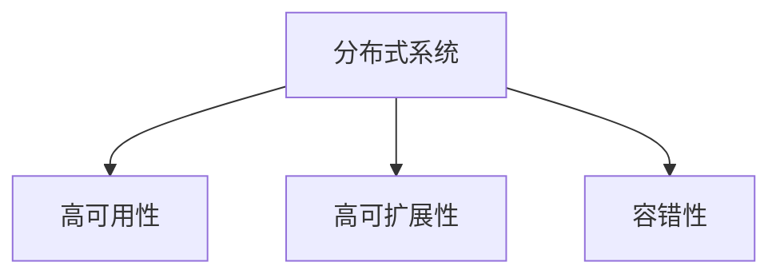
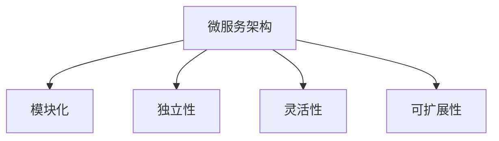
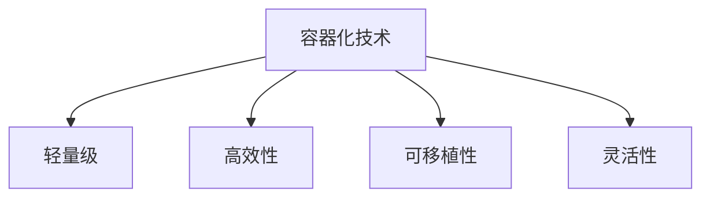
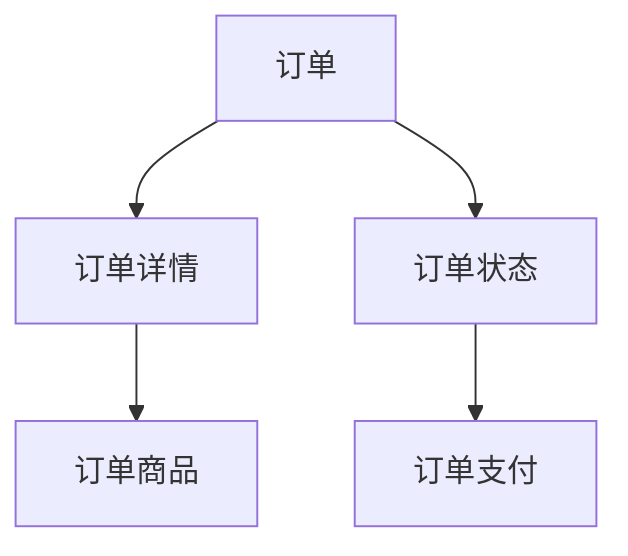

                 

# 技术架构演进：应对业务增长的系统扩展

> 关键词：系统架构、业务增长、扩展策略、分布式系统、微服务架构、容器化技术、云原生技术、自动化运维

> 摘要：随着企业业务的不断扩展和增长，技术架构的演进成为关键挑战。本文将从背景、核心概念与联系、算法原理讲解、系统分析与架构设计方案、项目实战等多个方面，探讨如何通过技术架构的演进，实现系统的高效扩展和灵活部署，以应对业务增长带来的挑战。

## 第一部分：背景

### 1.1 问题背景

在现代企业的发展过程中，随着业务的不断扩展和增长，系统架构的扩展和升级成为了一项重要的挑战。技术架构的演进不仅关乎系统的稳定性和性能，还直接影响企业的业务效率和竞争力。面对日益复杂的应用场景和海量数据处理需求，如何实现系统的高效扩展和演进，成为企业技术部门必须解决的问题。

### 1.2 问题描述

传统的系统扩展方法通常采用垂直扩展（增加硬件资源）和水平扩展（增加服务器数量）两种方式。然而，这些方法在应对大规模业务增长时存在诸多局限，如资源利用率不高、系统复杂度增加、维护成本上升等。因此，探索一种更为高效、灵活的系统扩展策略，已成为当前技术架构领域的重要研究方向。

### 1.3 问题解决

为了应对业务增长带来的系统扩展挑战，技术架构的演进成为必然选择。通过引入分布式系统、微服务架构、容器化技术等新兴架构模式，可以实现系统的高效扩展和灵活部署。此外，结合云原生技术、自动化运维等先进理念，可以进一步提升系统的可扩展性和运维效率。

### 1.4 边界与外延

技术架构的演进不仅涉及系统层面，还包括组织架构、团队协作、技术选型等多个方面。在演进过程中，需要充分考虑业务需求、技术可行性、成本效益等多重因素，以确保技术架构能够真正支撑企业的长远发展。

### 1.5 概念结构与核心要素组成

技术架构演进的核心概念包括：分布式系统、微服务架构、容器化技术、云原生技术、自动化运维等。这些概念共同构成了技术架构演进的理论基础和实践指导，是实现系统高效扩展和灵活部署的关键要素。

## 第二部分：核心概念与联系

### 2.1 分布式系统

**定义**：分布式系统是由多个相互独立的节点组成的系统，这些节点通过网络进行通信，共同完成一个任务。

**核心特点**：高可用性、高可扩展性、容错性。

**对比表格**：

| 特点 | 分布式系统 | 集中式系统 |
| ---- | ---------- | ---------- |
| 可扩展性 | 高 | 低 |
| 容错性 | 强 | 弱 |
| 可维护性 | 高 | 低 |

**ER实体关系图**：



### 2.2 微服务架构

**定义**：微服务架构是将应用程序划分为多个小型、独立的服务模块，每个服务模块独立开发、部署和扩展。

**核心特点**：模块化、独立性、灵活性和可扩展性。

**对比表格**：

| 特点 | 微服务架构 | 单体架构 |
| ---- | ---------- | -------- |
| 模块化 | 高 | 低 |
| 独立性 | 强 | 弱 |
| 扩展性 | 高 | 低 |

**ER实体关系图**：



### 2.3 容器化技术

**定义**：容器化技术是一种轻量级虚拟化技术，通过将应用程序及其依赖环境打包成一个独立的容器，实现应用的便捷部署和运维。

**核心特点**：轻量级、高效性、可移植性和灵活性。

**对比表格**：

| 特点 | 容器化技术 | 虚拟化技术 |
| ---- | ---------- | ---------- |
| 资源占用 | 低 | 高 |
| 部署效率 | 高 | 低 |
| 可移植性 | 高 | 低 |

**ER实体关系图**：



## 第三部分：算法原理讲解

### 3.1 算法简介

为了实现系统的高效扩展和灵活部署，本文将介绍一种基于分布式系统的扩展算法——一致性哈希算法。

### 3.2 算法原理

一致性哈希算法通过哈希函数将数据分片存储到不同的节点上，从而实现数据的高效分布和负载均衡。

**算法流程**：

1. **哈希函数**：将数据块通过哈希函数计算出一个哈希值。
2. **节点定位**：根据哈希值，确定数据块存储的节点。
3. **负载均衡**：当新增或删除节点时，通过重新计算哈希值，调整数据块存储的节点，实现负载均衡。

**算法公式**：

$$
Hash(key) = hash(result) \mod N
$$

其中，$N$ 表示节点的数量，$hash(result)$ 表示哈希函数。

## 第四部分：系统分析与架构设计方案

### 4.1 问题场景介绍

在电商行业，随着用户数量的快速增长，订单处理系统的负载也在不断增加。为了确保系统的高可用性和高扩展性，需要对订单处理系统进行技术架构的演进和优化。

### 4.2 项目介绍

项目名称：电商平台订单处理系统

项目目标：通过技术架构的演进，实现订单处理系统的高效扩展和灵活部署，以满足业务增长的需求。

### 4.3 系统功能设计

**领域模型类图**：



### 4.4 系统架构设计

**系统架构图**：

```mermaid
graph TB
A[用户接口层] --> B[订单服务层]
B --> C[数据服务层]
C --> D[消息队列服务}
D --> E[存储服务}
B --> F[负载均衡器]
F --> G[容器编排服务]
```

### 4.5 系统接口设计

**系统接口设计图**：

```mermaid
graph TB
A[用户接口层] --> B[订单接口]
B --> C[订单详情接口]
C --> D[订单状态接口]
D --> E[订单支付接口]
B --> F[订单服务层接口}
F --> G[数据服务层接口}
G --> H[消息队列服务接口}
H --> I[存储服务接口}
```

### 4.6 系统交互

**系统交互序列图**：

```mermaid
graph TB
A[用户] --> B[用户接口层]
B --> C[订单接口]
C --> D[订单服务层]
D --> E[数据服务层}
E --> F[消息队列服务}
F --> G[存储服务}
```

## 第五部分：项目实战

### 5.1 环境安装

1. 安装Docker：`sudo apt-get install docker`
2. 安装Kubernetes：`sudo apt-get install kubernetes`
3. 安装消息队列RabbitMQ：`sudo apt-get install rabbitmq-server`

### 5.2 系统核心实现

**Dockerfile**：

```Dockerfile
FROM python:3.8
WORKDIR /app
COPY requirements.txt ./
RUN pip install -r requirements.txt
COPY . .
CMD ["python", "app.py"]
```

**app.py**：

```python
from flask import Flask, request, jsonify
app = Flask(__name__)

@app.route('/order', methods=['POST'])
def create_order():
    data = request.json
    # 处理订单逻辑
    return jsonify({"message": "Order created successfully"})

if __name__ == '__main__':
    app.run(host='0.0.0.0', port=5000)
```

### 5.3 代码应用解读与分析

**代码应用解读**：

- 使用Flask框架搭建订单处理服务的API接口。
- 通过Dockerfile将应用打包成镜像，实现应用的容器化部署。
- 使用Kubernetes进行容器编排，实现订单处理服务的高可用性和负载均衡。

**代码分析**：

- Flask框架提供了简洁的API接口定义方式，方便开发者快速搭建Web应用。
- Dockerfile实现了应用的容器化，保证了应用的独立性和可移植性。
- Kubernetes通过水平扩展（增加Pod副本数量）和负载均衡（轮询策略），实现了订单处理服务的高可用性和负载均衡。

### 5.4 实际案例分析和详细讲解剖析

在实际项目中，通过采用分布式系统、微服务架构、容器化技术等先进架构，实现了订单处理系统的高效扩展和灵活部署。

**案例一**：订单处理系统在业务高峰期出现性能瓶颈。

**分析**：

- 原因：订单处理服务的CPU和内存资源占用过高。
- 解决方案：通过Kubernetes进行水平扩展，增加订单处理服务的Pod副本数量，实现负载均衡。

**案例二**：订单处理服务在分布式环境下出现数据一致性问题。

**分析**：

- 原因：分布式系统中的数据一致性保证不足。
- 解决方案：引入分布式缓存（如Redis）、消息队列（如RabbitMQ）等技术，实现数据的分布式存储和传输，保证数据一致性。

### 5.5 项目小结

通过技术架构的演进，实现了订单处理系统的高效扩展和灵活部署，满足了业务增长的需求。在项目实施过程中，充分利用了分布式系统、微服务架构、容器化技术等先进架构，提高了系统的性能、稳定性和可维护性。未来，将继续关注新技术的发展，不断优化技术架构，以应对业务变化和挑战。

## 第六部分：最佳实践 Tips、小结、注意事项、拓展阅读

### 6.1 最佳实践 Tips

1. 在分布式系统中，要充分考虑数据一致性和分布式事务的问题，选择合适的一致性算法和数据复制策略。
2. 在微服务架构中，要确保服务之间的通信稳定性和数据安全性，采用合适的接口协议和数据传输方式。
3. 在容器化部署中，要充分利用容器编排工具（如Kubernetes）的功能，实现自动化部署、扩缩容和运维监控。

### 6.2 小结

技术架构的演进是实现系统高效扩展和灵活部署的关键。通过引入分布式系统、微服务架构、容器化技术等先进架构模式，可以应对业务增长带来的挑战。在项目实施过程中，要充分考虑业务需求、技术可行性和成本效益等因素，确保技术架构能够真正支撑企业的长远发展。

### 6.3 注意事项

1. 在分布式系统中，要充分考虑网络延迟和带宽问题，确保节点之间的通信稳定。
2. 在微服务架构中，要确保服务之间的依赖关系清晰，避免出现服务耦合和循环依赖。
3. 在容器化部署中，要关注容器的安全性，避免容器逃逸和数据泄露等问题。

### 6.4 拓展阅读

1. 《大规模分布式存储系统：设计原理与案例分析》
2. 《微服务设计：构建可扩展的分布式系统》
3. 《Docker实战：从入门到企业应用》

## 作者

作者：AI天才研究院/AI Genius Institute & 禅与计算机程序设计艺术 /Zen And The Art of Computer Programming

