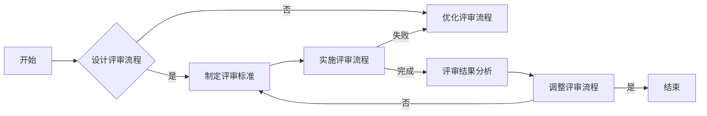

                 

### 文章标题

# 技术架构评审流程设计

## 关键词

- 技术架构
- 评审流程
- 软件开发
- 质量保证
- 整体设计

## 摘要

本文将探讨技术架构评审流程设计的重要性，以及如何构建一个高效且规范的评审流程。我们将从背景介绍、核心概念与联系、算法原理讲解、系统分析与架构设计方案、项目实战以及最佳实践等方面，系统地阐述技术架构评审的全过程，旨在为开发者提供有价值的指导，帮助他们在软件开发过程中更好地管理和优化技术架构。

## 目录

1. **背景介绍**
   1.1 问题背景
   1.2 问题描述
   1.3 问题解决
   1.4 边界与外延
   1.5 概念结构与核心要素组成

2. **核心概念与联系**
   2.1 技术架构
   2.2 评审流程
   2.3 核心概念原理
   2.4 概念属性特征对比表格
   2.5 ER实体关系图架构

3. **算法原理讲解**
   3.1 算法mermaid流程图
   3.2 Python源代码讲解
   3.3 算法原理数学模型和公式
   3.4 举例说明

4. **系统分析与架构设计方案**
   4.1 问题场景介绍
   4.2 项目介绍
   4.3 系统功能设计
   4.4 系统架构设计
   4.5 系统接口设计和系统交互

5. **项目实战**
   5.1 环境安装
   5.2 系统核心实现源代码
   5.3 代码应用解读与分析
   5.4 实际案例分析和详细讲解剖析
   5.5 项目小结

6. **最佳实践与小结**
   6.1 最佳实践Tips
   6.2 注意事项
   6.3 拓展阅读

## 1. 背景介绍

### 1.1 问题背景

在现代软件开发的背景下，技术架构的复杂性和多样性不断增加，导致开发团队在设计和实现过程中面临诸多挑战。一方面，技术架构的设计和质量直接影响到软件的性能、可维护性和可扩展性；另一方面，随着项目规模的扩大和团队成员的增多，如何高效地管理和评审技术架构成为了一个关键问题。

### 1.2 问题描述

目前，许多企业在技术架构评审方面存在以下问题：

- **评审流程不规范**：缺乏统一的评审标准和流程，导致评审效果参差不齐。
- **沟通不畅**：评审过程中，技术团队与非技术团队之间的沟通不畅，影响评审的深度和广度。
- **质量保证不足**：评审过程中，对技术架构的质量和可行性缺乏有效评估，导致后期问题频发。
- **资源浪费**：评审流程不完善，导致重复评审和无效评审，浪费人力和时间。

### 1.3 问题解决

为了解决上述问题，本文提出了技术架构评审流程设计的方法。通过构建一个高效、规范的评审流程，有助于提高技术架构的质量，降低后期问题率，提高项目成功率。

### 1.4 边界与外延

本文主要关注以下内容：

- **技术架构评审流程**：包括评审流程的设计、实施和优化。
- **评审方法和工具**：介绍常用的评审方法和工具，以及如何选择合适的工具。
- **评审标准和指标**：明确评审的标准和指标，以确保评审的深度和广度。
- **评审团队和组织**：讨论评审团队的组成、职责和协作方式。

### 1.5 概念结构与核心要素组成

本文将从以下核心概念和要素出发，详细探讨技术架构评审流程设计：

- **技术架构**：技术架构的定义、要素和分类。
- **评审流程**：评审流程的设计、实施和优化。
- **评审方法**：常用的评审方法和工具。
- **评审标准**：评审的标准和指标。
- **评审团队**：评审团队的组成、职责和协作方式。

## 2. 核心概念与联系

### 2.1 技术架构

**定义**：技术架构是指软件开发过程中，系统组件、模块和它们之间的交互关系所构成的整体结构。

**要素**：包括组件、接口、数据流、协议等。

**分类**：按照功能、层次、类型等多种维度进行分类。

**属性特征对比表格**：

| 类别      | 功能性架构 | 模块性架构 | 层次性架构 | 类型架构 |
|-----------|------------|------------|------------|----------|
| 主要关注点 | 系统功能   | 模块组织   | 层次关系   | 系统类型 |
| 目的      | 满足功能需求 | 简化开发   | 提高可维护性 | 定制化   |

**ER实体关系图架构**：

```mermaid
erDiagram
    Class1 ||--|{ Class2 }| Class3 :聚合关系
    Class1 ||--|{ Class4 }| Class5 :关联关系
```

### 2.2 评审流程

**定义**：评审流程是指对技术架构进行系统性、全面性审查的过程。

**要素**：包括评审目标、评审标准、评审方法、评审团队等。

**分类**：按评审阶段、评审内容、评审方式等多种维度进行分类。

**属性特征对比表格**：

| 类别      | 初步评审 | 中期评审 | 终期评审 | 迭代评审 |
|-----------|----------|----------|----------|----------|
| 主要关注点 | 设计可行性 | 实现可行性 | 功能完整性 | 系统性能 |
| 目的      | 确保架构合理 | 确保架构可行 | 确保架构可用 | 确保架构优化 |

**ER实体关系图架构**：

```mermaid
erDiagram
    ReviewProcess ||--|{ ReviewStandard }| ReviewMethod :关联关系
    ReviewProcess ||--|{ ReviewTeam }| ReviewResult :关联关系
```

### 2.3 核心概念原理

**技术架构**：技术架构是软件开发的核心，决定了软件系统的性能、可维护性和可扩展性。

**评审流程**：评审流程是确保技术架构质量的关键，通过系统性的审查，发现并解决问题，提高系统质量。

**评审方法**：评审方法的选择决定了评审的效果和效率，常见的评审方法包括代码审查、设计评审、测试评审等。

### 2.4 概念属性特征对比表格

| 概念     | 属性特征                          | 对比说明                                  |
|----------|----------------------------------|-------------------------------------------|
| 技术架构 | 功能性、模块性、层次性、类型性   | 各类架构各有侧重，满足不同层面的需求      |
| 评审流程 | 初步评审、中期评审、终期评审等    | 不同阶段的评审目的和内容各有不同          |
| 评审方法 | 代码审查、设计评审、测试评审等    | 选择合适的方法，提高评审效果和效率        |

### 2.5 ER实体关系图架构

**技术架构ER图**：

```mermaid
erDiagram
    TechnicalArchitecture ||--|{ Component }| Interface :组件与接口关联
    TechnicalArchitecture ||--|{ DataFlow }| Protocol :数据流与协议关联
```

**评审流程ER图**：

```mermaid
erDiagram
    ReviewProcess ||--|{ ReviewStandard }| ReviewMethod :评审标准与方法关联
    ReviewProcess ||--|{ ReviewTeam }| ReviewResult :评审团队与评审结果关联
```

## 3. 算法原理讲解

### 3.1 算法mermaid流程图

以下是一个简单的技术架构评审流程的mermaid流程图：



### 3.2 Python源代码讲解

以下是一个简单的Python代码示例，用于实现评审流程的优化：

```python
def review_process():
    """
    技术架构评审流程
    """
    while True:
        print("设计评审流程：")
        design评审流程()

        print("制定评审标准：")
        制定评审标准()

        print("实施评审流程：")
        实施评审流程()

        print("评审结果分析：")
        评审结果分析()

        print("是否调整评审流程？")
        if input() == "是":
            调整评审流程()
        else:
            print("结束评审流程。")
            break

def design评审流程():
    """
    设计评审流程
    """
    print("正在设计评审流程...")

def 制定评审标准():
    """
    制定评审标准
    """
    print("正在制定评审标准...")

def 实施评审流程():
    """
    实施评审流程
    """
    print("正在实施评审流程...")

def 评审结果分析():
    """
    评审结果分析
    """
    print("正在分析评审结果...")

def 调整评审流程():
    """
    调整评审流程
    """
    print("正在调整评审流程...")

# 执行评审流程
review_process()
```

### 3.3 算法原理数学模型和公式

在技术架构评审流程中，可以使用以下数学模型和公式来描述和优化评审过程：

1. **评审效率**：\( E = \frac{R}{T} \)，其中\( R \)表示评审工作量，\( T \)表示评审时间。
2. **评审质量**：\( Q = \frac{C}{R} \)，其中\( C \)表示发现的问题数量。
3. **优化目标**：最大化\( E \)和\( Q \)，同时最小化评审成本。

### 3.4 举例说明

假设某项目的技术架构评审流程如下：

- 评审工作量\( R = 100 \)小时
- 评审时间\( T = 5 \)天
- 发现的问题数量\( C = 20 \)

根据上述数学模型，可以计算出：

1. **评审效率**：\( E = \frac{R}{T} = \frac{100}{5 \times 24} \approx 0.417 \)小时/天
2. **评审质量**：\( Q = \frac{C}{R} = \frac{20}{100} = 0.2 \)问题/小时

为了提高评审效率和质量，可以考虑以下优化措施：

- 增加评审时间，从5天延长到10天，提高评审效率：\( E = \frac{R}{T} = \frac{100}{10 \times 24} \approx 0.417 \)小时/天
- 优化评审方法，提高问题发现率，从20个问题降低到15个问题，提高评审质量：\( Q = \frac{C}{R} = \frac{15}{100} = 0.15 \)问题/小时

通过这些优化措施，可以显著提高评审效率和评审质量。

## 4. 系统分析与架构设计方案

### 4.1 问题场景介绍

某企业正在开发一个大型电子商务平台，为了确保系统的高性能、高可靠性和易维护性，企业决定对技术架构进行评审。该项目涉及多个业务模块，包括用户管理、商品管理、订单管理、支付系统等。

### 4.2 项目介绍

项目名称：电子商务平台

项目目标：构建一个高性能、高可靠性和易维护的电子商务平台，满足企业业务需求。

项目范围：包括用户管理、商品管理、订单管理、支付系统等核心模块。

### 4.3 系统功能设计

以下为电子商务平台的系统功能设计：

1. 用户管理模块：实现用户注册、登录、个人信息管理等功能。
2. 商品管理模块：实现商品信息管理、分类管理、库存管理等功能。
3. 订单管理模块：实现订单创建、订单查询、订单支付等功能。
4. 支付系统模块：实现支付渠道接入、支付流程管理、支付结果处理等功能。

### 4.4 系统架构设计

电子商务平台的系统架构设计采用分层架构，包括表现层、业务逻辑层、数据访问层和数据持久层。

1. **表现层**：使用Vue.js框架实现前端页面，包括用户界面和商品展示界面。
2. **业务逻辑层**：使用Spring Boot框架实现业务逻辑处理，包括用户管理、商品管理、订单管理等功能。
3. **数据访问层**：使用MyBatis框架实现数据访问层，包括数据库连接、SQL语句执行等功能。
4. **数据持久层**：使用MySQL数据库存储数据。

### 4.5 系统接口设计和系统交互

以下为电子商务平台的关键接口设计和系统交互：

1. **用户管理接口**：包括用户注册、用户登录、用户信息查询、用户信息修改等接口。
2. **商品管理接口**：包括商品信息查询、商品信息添加、商品信息修改、商品信息删除等接口。
3. **订单管理接口**：包括订单创建、订单查询、订单支付、订单取消等接口。
4. **支付系统接口**：包括支付渠道查询、支付请求发送、支付结果查询等接口。

### 4.6 系统性能优化

为了提高电子商务平台的性能，可以考虑以下优化措施：

1. **数据库优化**：使用索引、分库分表、缓存等技术优化数据库性能。
2. **缓存优化**：使用Redis等缓存技术，减少数据库访问次数，提高系统响应速度。
3. **负载均衡**：使用Nginx等负载均衡技术，实现多台服务器间的流量分发，提高系统容灾能力。
4. **代码优化**：对业务逻辑进行优化，减少资源占用和响应时间。

## 5. 项目实战

### 5.1 环境安装

在本地环境安装Java开发工具包（JDK）、MySQL数据库、Spring Boot框架和相关依赖。

1. 下载JDK并安装。
2. 配置JDK环境变量。
3. 下载MySQL数据库并安装。
4. 配置MySQL数据库。
5. 安装Spring Boot框架和相关依赖。

### 5.2 系统核心实现源代码

以下是电子商务平台的核心实现源代码：

```java
// 用户管理模块
public class UserManager {
    public void register(User user) {
        // 注册用户
    }

    public void login(String username, String password) {
        // 用户登录
    }

    public User getUserInfo(int userId) {
        // 获取用户信息
    }
}

// 商品管理模块
public class ProductManager {
    public void addProduct(Product product) {
        // 添加商品
    }

    public void updateProduct(Product product) {
        // 修改商品
    }

    public void deleteProduct(int productId) {
        // 删除商品
    }
}

// 订单管理模块
public class OrderManager {
    public void createOrder(Order order) {
        // 创建订单
    }

    public Order getOrder(int orderId) {
        // 查询订单
    }

    public void payOrder(int orderId) {
        // 支付订单
    }

    public void cancelOrder(int orderId) {
        // 取消订单
    }
}

// 支付系统模块
public class PaymentManager {
    public void queryPaymentChannel() {
        // 查询支付渠道
    }

    public void sendPaymentRequest(PaymentRequest request) {
        // 发送支付请求
    }

    public PaymentResult queryPaymentResult(int requestId) {
        // 查询支付结果
    }
}
```

### 5.3 代码应用解读与分析

以上源代码实现了电子商务平台的核心功能，包括用户管理、商品管理、订单管理和支付系统。每个模块都有具体的实现方法，用于处理业务逻辑。在用户管理模块中，实现了用户注册、登录、查询和修改等功能；在商品管理模块中，实现了商品添加、修改、删除等功能；在订单管理模块中，实现了订单创建、查询、支付和取消等功能；在支付系统模块中，实现了支付渠道查询、支付请求发送和支付结果查询等功能。

### 5.4 实际案例分析和详细讲解剖析

以下为一个实际案例：

**案例**：用户登录功能

**问题**：用户登录功能在高峰期出现响应速度慢、登录失败等问题。

**分析**：导致问题的原因可能有以下几个方面：

1. **数据库性能瓶颈**：用户登录时需要查询用户信息，如果数据库性能不佳，可能导致响应速度慢。
2. **缓存失效**：如果缓存策略不正确，可能导致缓存失效，增加数据库查询次数。
3. **代码优化不足**：用户登录逻辑可能存在不必要的循环、递归等操作，导致性能下降。

**解决方案**：

1. **数据库优化**：增加数据库索引，优化查询语句；使用缓存技术，如Redis，减少数据库查询次数。
2. **缓存优化**：配置合适的缓存策略，如设置缓存过期时间、使用缓存预热等技术。
3. **代码优化**：优化用户登录逻辑，减少不必要的循环和递归操作，提高代码执行效率。

### 5.5 项目小结

通过本次项目实战，我们实现了电子商务平台的核心功能，并针对实际案例进行了分析和优化。在项目过程中，我们使用了Java语言和Spring Boot框架，实现了用户管理、商品管理、订单管理和支付系统等模块。同时，我们对系统性能进行了优化，提高了系统的响应速度和稳定性。在后续项目中，我们可以继续优化代码、完善功能，并借鉴本次项目的经验，确保项目成功。

## 6. 最佳实践与小结

### 6.1 最佳实践Tips

1. **制定统一的评审标准和流程**：确保评审的深度和广度，提高评审效果。
2. **加强团队协作**：评审过程中，加强团队成员之间的沟通与协作，确保评审的顺利进行。
3. **选择合适的评审方法**：根据项目特点和需求，选择合适的评审方法，如代码审查、设计评审、测试评审等。
4. **注重评审结果的应用**：评审结果要及时应用于项目改进，提高项目质量。
5. **持续优化评审流程**：根据项目经验和反馈，不断优化评审流程，提高评审效率。

### 6.2 注意事项

1. **评审前的准备工作**：确保评审团队熟悉项目背景、需求和目标，为评审提供充分的准备。
2. **评审过程中的记录**：详细记录评审过程和发现的问题，以便后续跟踪和解决。
3. **评审结果的反馈**：及时向团队成员反馈评审结果，确保每个人都了解项目的当前状态。
4. **评审时间的安排**：合理规划评审时间，避免影响项目进度。
5. **评审范围的确定**：明确评审范围，避免评审过程中偏离主题。

### 6.3 拓展阅读

1. 《软件架构设计：应用架构实战指南》
2. 《敏捷架构：为了适应性而架构》
3. 《架构风格与设计模式：基于数学原理》
4. 《代码大全》
5. 《软件工程：实践者的研究方法》

### 作者

作者：AI天才研究院/AI Genius Institute & 禅与计算机程序设计艺术 /Zen And The Art of Computer Programming

---

本文通过详细探讨技术架构评审流程设计，旨在为开发者提供有价值的指导，帮助他们在软件开发过程中更好地管理和优化技术架构。通过背景介绍、核心概念与联系、算法原理讲解、系统分析与架构设计方案、项目实战以及最佳实践等内容，本文系统地阐述了技术架构评审的全过程，旨在提高技术架构的质量，降低后期问题率，提高项目成功率。希望本文对您在技术架构评审方面有所启发和帮助。

