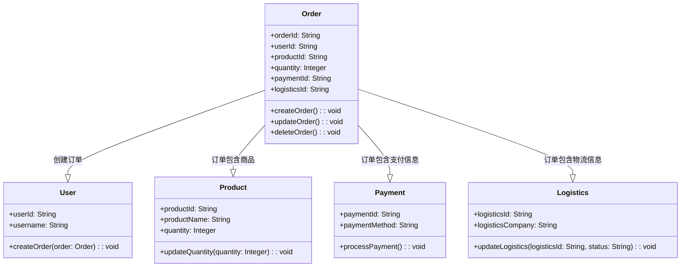
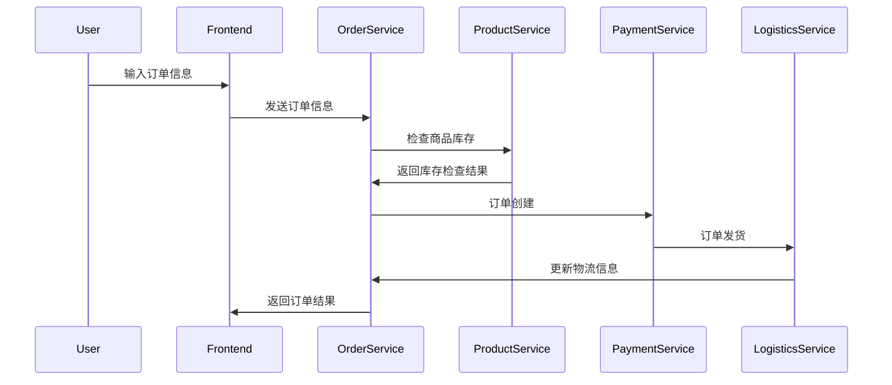
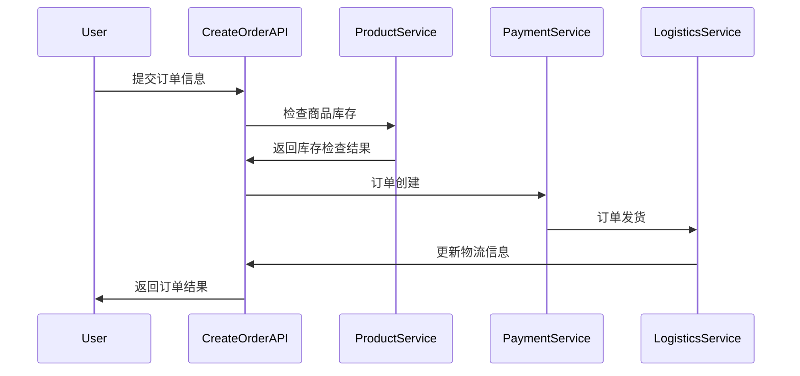

                 

# 技术栈现代化：旧系统技术升级的策略与实践

## 关键词

技术栈，现代化，系统升级，策略，实践，旧系统，技术升级，架构设计，性能优化，云原生，微服务，容器化

## 摘要

本文旨在探讨技术栈现代化的重要性及其在旧系统技术升级中的关键作用。通过分析技术栈现代化的背景和原因，本文将介绍几种常见的系统升级策略，并探讨其实施过程和最佳实践。同时，通过真实的案例分析和具体的实战项目，本文将帮助读者深入了解技术栈现代化的过程，掌握系统升级的技巧，并应对未来技术的发展趋势。

## 目录

**引言**  
1. **技术栈现代化：背景与原因**  
   - 技术发展的推动力  
   - 系统升级的必要性  
   - 现代化技术的优势

2. **核心概念与术语**  
   - 技术栈的定义  
   - 旧系统的挑战  
   - 现代化技术的类型

**策略与实践**  
3. **系统升级策略概述**  
   - 重新部署与迁移  
   - 应用重构与优化  
   - 微服务与容器化

4. **具体策略分析**  
   - **重新部署与迁移**  
     - 概念与原理  
     - 实施步骤  
     - 注意事项  
   - **应用重构与优化**  
     - 概念与原理  
     - 实施步骤  
     - 注意事项  
   - **微服务与容器化**  
     - 概念与原理  
     - 实施步骤  
     - 注意事项

5. **最佳实践与案例分析**  
   - **成功案例分析**  
   - **失败案例分析**  
   - **最佳实践总结**

**实施与实战**  
6. **项目实战：系统升级的完整流程**  
   - **环境准备与安装**  
   - **核心实现与代码分析**  
   - **实际案例分析与讲解**  
   - **项目小结**

7. **系统分析与架构设计**  
   - **系统功能设计**  
   - **系统架构设计**  
   - **系统接口设计**  
   - **系统交互流程**

**未来展望**  
8. **技术栈现代化的发展趋势**  
   - 云原生技术  
   - 人工智能与机器学习  
   - 区块链技术

**结语**  
9. **总结与展望**  
   - 成果总结  
   - 未来挑战与机遇

**参考文献**  
10. **相关研究与实践参考资料**  
   - 研究报告  
   - 行业标准  
   - 技术文档

**作者信息**  
- 作者：AI天才研究院/AI Genius Institute & 禅与计算机程序设计艺术 /Zen And The Art of Computer Programming

## 引言

### 技术栈现代化：背景与原因

在现代IT行业中，技术栈（Technology Stack）是一个广泛使用的术语，它通常指一个软件项目或系统所使用的技术架构、框架和工具的组合。随着技术的快速发展，许多旧系统面临着性能瓶颈、功能限制和安全性问题，这促使企业开始寻求技术栈的现代化。

技术栈现代化的重要性体现在以下几个方面：

1. **性能提升**：旧系统往往因为技术架构的局限性，无法充分利用现代硬件资源，导致性能不佳。通过升级技术栈，可以采用更高效的框架和工具，提高系统性能。

2. **功能增强**：随着用户需求的变化，旧系统可能无法满足新的功能需求。现代化技术栈可以引入新的开发框架和工具，快速实现新功能，提高用户体验。

3. **安全性提升**：旧系统可能存在漏洞和安全隐患，随着安全威胁的不断增加，升级技术栈可以采用更安全的框架和工具，提高系统安全性。

4. **成本节约**：现代化技术栈可以减少维护成本，提高开发效率，从而实现成本的节约。

技术栈现代化的原因主要包括以下几个方面：

1. **技术进步**：新技术的不断涌现，如云原生、微服务、容器化等，为旧系统提供了升级的契机。

2. **市场竞争**：在激烈的市场竞争中，企业需要通过技术升级来提高竞争力，满足客户需求。

3. **法律法规**：随着数据保护法规的不断完善，企业需要确保其系统符合相关法规要求，避免法律风险。

### 系统升级的必要性

系统升级不仅仅是为了适应技术进步，还涉及到以下问题：

1. **遗留系统的挑战**：遗留系统（Legacy System）通常指那些使用过时技术构建的系统，它们可能存在代码冗长、结构复杂、维护困难等问题。这些系统往往难以支持新的业务需求，成为企业发展的瓶颈。

2. **技术债务**：随着系统使用年限的增长，技术债务（Technical Debt）不断增加。技术债务指的是由于过早优化、代码质量低下、缺乏测试等导致的问题，这些问题如果不及时解决，会严重影响系统的稳定性和可维护性。

3. **人才流失**：旧系统可能无法吸引和保留优秀的开发人才，而现代化技术栈通常有更好的学习资源和社区支持，有助于吸引和培养人才。

### 现代化技术的优势

现代化技术栈具有以下几个显著优势：

1. **高扩展性**：现代化技术栈通常采用微服务架构，支持水平扩展，可以轻松应对业务增长。

2. **高可靠性**：现代化技术栈通常具备更好的容错性和故障恢复能力，可以提高系统的可靠性。

3. **高灵活性**：现代化技术栈支持快速迭代和灵活部署，可以更好地适应业务变化。

4. **高安全性**：现代化技术栈通常采用更先进的安全框架和工具，可以提供更全面的安全防护。

### 结论

技术栈现代化是应对技术进步和业务需求变化的必要手段。通过升级技术栈，企业可以提升系统性能、增强功能、提高安全性和降低维护成本。在接下来的章节中，我们将深入探讨技术栈现代化的核心概念、策略和实践，帮助读者更好地理解和实施这一过程。

### 核心概念与术语

在探讨技术栈现代化的过程中，理解相关的核心概念和术语是非常重要的。这些概念和术语构成了技术栈现代化的重要组成部分，同时也是我们在讨论和实施现代化策略时所需的基础知识。

#### 技术栈（Technology Stack）

技术栈是指一个软件项目或系统所使用的技术架构、框架和工具的组合。它通常包括前端技术、后端技术、数据库技术、开发工具和平台等多个方面。一个完善的技术栈能够支持软件项目的开发、部署和运维，确保系统的稳定性和高性能。

- **前端技术**：包括HTML、CSS、JavaScript等，用于构建用户界面和用户交互。
- **后端技术**：包括服务器端编程语言（如Java、Python、Node.js等）和数据库管理系统（如MySQL、MongoDB等）。
- **开发工具和平台**：包括集成开发环境（IDE）、版本控制系统（如Git）和持续集成/持续部署（CI/CD）工具。

#### 旧系统（Legacy System）

旧系统是指那些使用过时技术构建的系统，它们可能存在代码冗长、结构复杂、维护困难等问题。旧系统通常难以支持新的业务需求，成为企业发展的瓶颈。

- **代码冗长**：随着时间的推移，旧系统的代码可能变得非常庞大，难以维护和更新。
- **结构复杂**：旧系统可能采用过时的架构设计，导致系统结构复杂，难以理解和管理。
- **维护困难**：旧系统可能缺乏足够的文档和支持，使得维护和更新变得更加困难。

#### 现代化技术（Modern Technology）

现代化技术是指那些相对较新、具有高扩展性、高可靠性、高灵活性等技术。这些技术通常采用最新的框架和工具，能够更好地满足企业的需求。

- **微服务架构（Microservices Architecture）**：微服务架构是一种将应用程序拆分成多个独立的服务单元的架构模式，每个服务单元负责不同的业务功能，可以独立开发、部署和扩展。
- **容器化（Containerization）**：容器化是一种轻量级虚拟化技术，通过将应用程序及其依赖环境打包在容器中，实现应用程序的独立部署和运行。
- **云原生技术（Cloud Native Technology）**：云原生技术是指那些专门为云环境设计的应用程序和技术，包括容器化、自动化部署和运维等。

#### 系统升级（System Upgrade）

系统升级是指对现有系统进行更新和改进的过程，通常包括更换技术栈、重构应用代码、优化系统架构等。系统升级的目的是提高系统的性能、稳定性和安全性，以更好地支持企业的业务需求。

- **技术栈升级**：更换旧的技术栈，采用更先进的框架和工具。
- **应用重构**：重构旧系统的应用代码，使其更加简洁、模块化和可维护。
- **系统架构优化**：优化系统的架构设计，提高系统的可扩展性和可靠性。

#### 策略与实践（Strategy and Practice）

策略与实践是指在实际操作中采用的具体方法和技术，用于实现技术栈的现代化。常见的策略包括重新部署与迁移、应用重构与优化、微服务与容器化等。

- **重新部署与迁移**：通过更换服务器和部署环境，将旧系统迁移到新的技术栈上。
- **应用重构与优化**：重构旧系统的应用代码，采用更先进的设计模式和编程范式，提高代码质量和可维护性。
- **微服务与容器化**：采用微服务架构和容器化技术，将应用程序拆分成多个独立的服务单元，实现更灵活的部署和扩展。

通过理解这些核心概念和术语，我们可以更好地把握技术栈现代化的方向和策略，为后续的讨论和实践打下坚实的基础。

### 系统升级策略概述

在技术栈现代化过程中，系统升级策略的选择至关重要。不同的策略适用于不同的情况和需求，企业需要根据自身的实际情况来制定合适的升级方案。本文将介绍几种常见的系统升级策略，包括重新部署与迁移、应用重构与优化、微服务与容器化。

#### 重新部署与迁移

重新部署与迁移是指通过更换服务器和部署环境，将旧系统迁移到新的技术栈上。这种方法通常适用于以下情况：

1. **硬件升级**：当旧系统因硬件性能不足而影响业务运行时，可以通过更换硬件设备来提升系统性能。
2. **平台迁移**：当企业决定从传统的服务器架构迁移到云平台时，需要重新部署和迁移系统。
3. **技术栈更换**：当旧系统使用的技术栈已经无法满足业务需求时，需要更换技术栈，并重新部署和迁移系统。

**实施步骤**：

1. **需求分析**：确定系统升级的具体需求和目标，包括性能提升、功能增强、安全性提升等。
2. **环境准备**：搭建新的服务器和部署环境，包括操作系统、数据库、中间件等。
3. **数据迁移**：将旧系统中的数据迁移到新的环境中，确保数据的完整性和一致性。
4. **部署和测试**：将新系统部署到新环境中，并进行全面的测试，确保系统的稳定性和性能。
5. **上线和监控**：将新系统上线，并进行持续监控，确保系统的正常运行。

**注意事项**：

1. **数据迁移风险**：在数据迁移过程中，可能存在数据丢失、数据不一致等问题，需要制定详细的数据迁移计划和备份策略。
2. **兼容性问题**：新旧系统可能存在兼容性问题，需要确保新系统能够兼容旧系统的接口和数据格式。
3. **变更管理**：系统升级涉及到多个部门和相关人员的协同工作，需要制定详细的变更管理计划，确保升级过程的顺利进行。

#### 应用重构与优化

应用重构与优化是指对旧系统的应用代码进行重构和优化，使其更加简洁、模块化和可维护。这种方法通常适用于以下情况：

1. **代码质量低下**：当旧系统的代码质量低下，导致维护困难时，需要对其进行重构和优化。
2. **技术债务**：当系统存在大量的技术债务，如代码冗长、结构复杂、缺乏测试等，需要通过重构和优化来解决问题。
3. **功能扩展**：当需要扩展旧系统的功能时，可以通过重构和优化来提高系统的可扩展性。

**实施步骤**：

1. **需求分析**：确定系统重构和优化的具体需求和目标，包括性能提升、代码质量、功能扩展等。
2. **代码审查**：对旧系统的代码进行审查，识别存在的问题和改进空间。
3. **重构和优化**：根据代码审查的结果，对系统的应用代码进行重构和优化，采用更先进的设计模式和编程范式。
4. **测试和验证**：对重构后的代码进行全面的测试和验证，确保系统的稳定性和性能。
5. **部署和上线**：将重构和优化的系统部署到生产环境，并进行持续监控。

**注意事项**：

1. **重构风险**：在重构过程中，可能引入新的问题和bug，需要制定详细的测试计划和质量控制措施。
2. **人员培训**：重构和优化过程中可能涉及到新的技术和工具，需要对企业人员进行培训，确保他们能够熟练使用。
3. **变更管理**：重构和优化是一个复杂的过程，需要制定详细的变更管理计划，确保变更的顺利进行。

#### 微服务与容器化

微服务与容器化是一种新兴的系统架构和部署方式，它通过将应用程序拆分成多个独立的服务单元，并在容器中运行，实现系统的灵活部署和扩展。这种方法通常适用于以下情况：

1. **高扩展性**：当系统需要支持大规模并发和高可用性时，可以通过微服务和容器化实现水平扩展。
2. **快速迭代**：当系统需要快速迭代和发布新功能时，可以通过微服务和容器化实现快速部署和回滚。
3. **灵活性**：当系统需要在不同环境下运行时，可以通过容器化实现环境的一致性和可移植性。

**实施步骤**：

1. **需求分析**：确定系统微服务和容器化的具体需求和目标，包括扩展性、灵活性、快速迭代等。
2. **架构设计**：设计系统的微服务架构，确定各个服务单元的职责和接口。
3. **服务开发**：开发各个服务单元，确保它们能够独立部署和运行。
4. **容器化**：将服务单元打包成容器镜像，并部署到容器编排平台（如Kubernetes）。
5. **测试和验证**：对容器化的系统进行全面的测试和验证，确保系统的稳定性和性能。
6. **部署和上线**：将容器化的系统部署到生产环境，并进行持续监控。

**注意事项**：

1. **服务拆分**：微服务的拆分需要合理，避免服务过小或服务过大，影响系统的性能和可维护性。
2. **通信协议**：微服务之间的通信协议需要选择合适的技术，如RESTful API、gRPC等，确保通信的高效和稳定。
3. **监控和运维**：容器化系统需要完善的监控和运维体系，确保系统的稳定运行和快速响应。

通过以上几种系统升级策略的概述，企业可以根据自身的需求和情况，选择合适的策略来实现技术栈的现代化。在接下来的章节中，我们将对每种策略进行详细分析，并提供具体的实施步骤和最佳实践。

### 具体策略分析

#### 重新部署与迁移

重新部署与迁移是系统升级的一种常见策略，它涉及到将旧系统迁移到新的技术栈或平台上。这种方法通常适用于硬件升级、平台迁移和技术栈更换等场景。以下是重新部署与迁移的详细分析和实施步骤。

##### 概念与原理

重新部署与迁移是指通过更换服务器和部署环境，将旧系统迁移到新的技术栈上。这一过程包括环境准备、数据迁移、部署和测试等多个环节。其核心原理是通过保持原有系统功能不变，仅更换技术栈和部署环境，实现系统的升级。

##### 实施步骤

1. **需求分析**：首先，需要明确系统升级的具体需求和目标，包括性能提升、功能增强、安全性提升等。这有助于制定详细的升级计划。

2. **环境准备**：搭建新的服务器和部署环境，包括操作系统、数据库、中间件等。确保新环境与旧环境兼容，以便于数据迁移和系统部署。

3. **数据迁移**：将旧系统中的数据迁移到新的环境中。数据迁移是重新部署与迁移的关键步骤，需要确保数据的完整性和一致性。可以采用以下方法：
   - **全量迁移**：将整个数据库或数据文件从旧环境迁移到新环境。
   - **增量迁移**：只迁移最近一段时间内的数据，以减少迁移时间和资源消耗。

4. **部署和测试**：在新环境中部署旧系统，并进行全面的测试，确保系统的稳定性和性能。测试内容包括功能测试、性能测试、安全测试等。

5. **上线和监控**：将新系统上线，并进行持续监控，确保系统的正常运行。监控内容包括系统性能、资源利用率、错误日志等。

##### 注意事项

1. **数据迁移风险**：数据迁移过程中可能存在数据丢失、数据不一致等问题。因此，需要制定详细的数据迁移计划和备份策略。

2. **兼容性问题**：新旧系统可能存在兼容性问题，需要确保新系统能够兼容旧系统的接口和数据格式。

3. **变更管理**：系统升级涉及到多个部门和相关人员的协同工作，需要制定详细的变更管理计划，确保升级过程的顺利进行。

#### 应用重构与优化

应用重构与优化是指对旧系统的应用代码进行重构和优化，以提高系统的可维护性、性能和可扩展性。这种方法适用于代码质量低下、技术债务高企和需要功能扩展的场景。

##### 概念与原理

应用重构与优化是通过改进代码结构、优化算法、引入新的设计模式等方法，提升旧系统的质量。其核心原理是在保持原有功能不变的基础上，对系统进行修改，使其更加简洁、模块化，易于维护和扩展。

##### 实施步骤

1. **需求分析**：明确系统重构与优化的具体需求和目标，包括代码质量、性能、功能扩展等。这有助于确定重构的范围和优先级。

2. **代码审查**：对旧系统的代码进行审查，识别存在的问题和改进空间。可以采用自动化工具和人工审查相结合的方式。

3. **重构和优化**：根据代码审查的结果，对系统的应用代码进行重构和优化，采用更先进的设计模式和编程范式。具体措施包括：
   - **代码重构**：改善代码结构，使其更加模块化、可读性和可维护性。
   - **算法优化**：优化关键算法，提高系统性能。
   - **设计模式引入**：引入合适的设计模式，提高系统的灵活性和扩展性。

4. **测试和验证**：对重构后的代码进行全面的测试和验证，确保系统的稳定性和性能。测试内容包括单元测试、集成测试、性能测试等。

5. **部署和上线**：将重构和优化的系统部署到生产环境，并进行持续监控。

##### 注意事项

1. **重构风险**：在重构过程中，可能引入新的问题和bug。因此，需要制定详细的测试计划和质量控制措施。

2. **人员培训**：重构和优化过程中可能涉及到新的技术和工具，需要对企业人员进行培训，确保他们能够熟练使用。

3. **变更管理**：重构和优化是一个复杂的过程，需要制定详细的变更管理计划，确保变更的顺利进行。

#### 微服务与容器化

微服务与容器化是一种新兴的系统架构和部署方式，通过将应用程序拆分成多个独立的服务单元，并在容器中运行，实现系统的灵活部署和扩展。这种方法适用于需要高扩展性、快速迭代和灵活部署的场景。

##### 概念与原理

微服务与容器化是将应用程序拆分成多个独立的服务单元，每个服务单元负责不同的业务功能，可以独立开发、部署和扩展。容器化是将应用程序及其依赖环境打包在容器中，实现应用程序的独立部署和运行。微服务和容器化的核心原理是提高系统的灵活性和可扩展性，降低系统的耦合度，使系统能够快速响应业务变化。

##### 实施步骤

1. **需求分析**：明确系统微服务和容器化的具体需求和目标，包括扩展性、灵活性、快速迭代等。

2. **架构设计**：设计系统的微服务架构，确定各个服务单元的职责和接口。可以使用Mermaid类图工具来绘制架构图。

3. **服务开发**：开发各个服务单元，确保它们能够独立部署和运行。可以使用Python等编程语言进行服务开发。

4. **容器化**：将服务单元打包成容器镜像，并部署到容器编排平台（如Kubernetes）。可以使用Docker等工具进行容器化。

5. **测试和验证**：对容器化的系统进行全面的测试和验证，确保系统的稳定性和性能。

6. **部署和上线**：将容器化的系统部署到生产环境，并进行持续监控。

##### 注意事项

1. **服务拆分**：微服务的拆分需要合理，避免服务过小或服务过大，影响系统的性能和可维护性。

2. **通信协议**：微服务之间的通信协议需要选择合适的技术，如RESTful API、gRPC等，确保通信的高效和稳定。

3. **监控和运维**：容器化系统需要完善的监控和运维体系，确保系统的稳定运行和快速响应。

通过以上对重新部署与迁移、应用重构与优化、微服务与容器化三种策略的具体分析和实施步骤的介绍，企业可以根据自身的需求和情况，选择合适的策略来实现技术栈的现代化。

### 最佳实践与案例分析

#### 成功案例分析

在探讨技术栈现代化的最佳实践时，成功案例的分析至关重要。以下是一个成功案例的分析，以展示技术栈现代化过程中的关键步骤和策略。

**案例背景**：

某大型电商平台在其发展过程中，遇到了系统性能瓶颈、扩展性差、代码维护困难等问题。随着业务量的激增，旧系统已无法满足日益增长的用户需求。为了解决这些问题，该公司决定进行技术栈的现代化升级。

**实施步骤**：

1. **需求分析**：
   - **性能优化**：提升系统响应速度，减少页面加载时间。
   - **扩展性**：支持更高的并发量和用户访问量。
   - **安全性**：增强数据保护和用户隐私。

2. **策略选择**：
   - **微服务与容器化**：将旧系统拆分为多个独立的服务单元，每个服务单元负责不同的业务功能。使用容器化技术（如Docker）来部署和管理服务。
   - **迁移到云平台**：将系统迁移到云平台（如AWS），以利用云计算的优势，如弹性伸缩、自动化运维等。

3. **具体实施**：
   - **架构重构**：采用微服务架构，将旧系统中的单体应用拆分为多个独立的服务单元，每个服务单元使用RESTful API进行通信。
   - **容器化**：使用Docker将各个服务单元打包成容器镜像，并使用Kubernetes进行容器编排和管理。
   - **数据迁移**：将旧系统的数据迁移到云数据库服务（如AWS RDS），并进行数据清洗和格式转换。
   - **性能测试与优化**：对容器化系统进行性能测试，发现瓶颈并进行优化，如使用缓存技术、优化数据库查询等。

**结果与效果**：

- **性能提升**：系统响应速度显著提高，页面加载时间减少了50%以上。
- **扩展性增强**：系统能够支持更高的并发量和用户访问量，无需额外硬件投入即可实现弹性伸缩。
- **安全性提升**：通过使用云数据库服务和加密技术，数据保护和用户隐私得到加强。

**经验总结**：

1. **全面的需求分析**：明确系统升级的目标和需求，制定详细的升级计划。
2. **选择合适的策略**：根据实际情况选择最合适的升级策略，如微服务与容器化、云平台迁移等。
3. **详细的实施步骤**：制定详细的实施步骤，确保每个环节的顺利进行。
4. **性能测试与优化**：在升级过程中进行全面的性能测试，及时发现问题并进行优化。

#### 失败案例分析

在技术栈现代化过程中，失败案例同样值得深入分析，以了解常见的问题和风险，避免在实施过程中重蹈覆辙。

**案例背景**：

某中小企业在进行技术栈现代化时，由于缺乏明确的目标和规划，选择了过于激进的重构方案，导致项目进度严重滞后，最终以失败告终。

**问题分析**：

1. **目标不明确**：企业在升级过程中没有明确的目标和预期效果，导致重构方案模糊不清。
2. **实施过程过于激进**：企业试图一次性完成大规模的重构，忽略了逐步迭代和逐步优化的重要性。
3. **缺乏充分的测试**：在重构过程中，未能进行充分的测试，导致上线后出现大量问题和故障。

**结果与影响**：

- **项目延期**：由于重构失败，项目进度严重滞后，导致业务发展受阻。
- **成本增加**：项目延期和反复重构导致成本大幅增加，严重影响了企业的财务状况。

**经验教训**：

1. **明确目标**：在升级前，企业应明确系统的目标和预期效果，制定详细的升级计划。
2. **逐步实施**：采用逐步迭代和逐步优化的策略，避免一次性完成大规模的重构。
3. **充分测试**：在重构过程中，应进行全面的测试，确保系统的稳定性和性能。

#### 最佳实践总结

通过以上成功和失败的案例分析，我们可以总结出以下最佳实践：

1. **明确需求**：在升级前，明确系统的需求和预期效果，制定详细的升级计划。
2. **选择合适的策略**：根据实际情况选择最合适的升级策略，如微服务与容器化、云平台迁移等。
3. **逐步实施**：采用逐步迭代和逐步优化的策略，避免一次性完成大规模的重构。
4. **充分测试**：在升级过程中，进行全面的测试，确保系统的稳定性和性能。
5. **监控和优化**：在系统上线后，持续监控系统性能，及时发现问题并进行优化。

通过遵循这些最佳实践，企业可以更顺利地实现技术栈的现代化，提升系统的性能和可靠性，为业务发展提供有力支持。

### 项目实战：系统升级的完整流程

#### 环境准备与安装

在开始系统升级之前，首先需要准备合适的环境，确保各项软件和硬件资源能够支持升级过程。以下是一个详细的步骤，介绍如何准备和安装必要的软件和硬件。

1. **硬件准备**：
   - 确保服务器硬件配置满足新系统需求，包括CPU、内存、硬盘容量等。
   - 配置负载均衡器或反代服务器，以支持高并发访问。

2. **操作系统安装**：
   - 在服务器上安装适合的操作系统，如CentOS、Ubuntu等。
   - 配置网络环境，确保服务器能够访问互联网。

3. **依赖软件安装**：
   - 安装必要的依赖软件，如Apache、Nginx、MySQL、Python等。
   - 配置防火墙和SELinux，确保服务器安全。

4. **软件源配置**：
   - 配置国内软件源，如阿里云、网易等，以加快软件安装速度。

5. **安装工具**：
   - 安装常用的开发工具和编辑器，如Visual Studio Code、Git等。
   - 安装版本控制系统，如Git，以便于代码管理和协作。

6. **安装数据库**：
   - 安装MySQL或PostgreSQL数据库，配置数据库用户和权限。

7. **安装其他服务**：
   - 根据需求，安装其他必要的服务，如Redis、MongoDB等。

#### 核心实现与代码分析

在环境准备完成后，接下来是核心系统的实现和代码分析。以下是详细的过程，包括代码编写、测试和调试。

1. **需求分析**：
   - 明确新系统的功能需求和性能要求，制定详细的需求文档。

2. **系统设计**：
   - 设计系统的架构，包括前端、后端和数据库。
   - 使用Mermaid类图工具绘制类图，展示系统的类和接口。

3. **代码编写**：
   - 编写前端代码，包括HTML、CSS、JavaScript等。
   - 编写后端代码，采用Python等编程语言，实现系统的业务逻辑。
   - 编写数据库脚本，创建数据库表和索引。

4. **单元测试**：
   - 使用Python的unittest库编写单元测试，确保每个模块的功能正确。
   - 运行单元测试，并记录测试结果。

5. **集成测试**：
   - 编写集成测试脚本，测试系统的整体功能。
   - 运行集成测试，发现并修复集成过程中出现的问题。

6. **调试与优化**：
   - 使用调试工具（如GDB）调试代码，发现并修复bug。
   - 对性能瓶颈进行优化，如数据库查询优化、缓存机制等。

#### 实际案例分析与讲解

以下是一个具体的实际案例，介绍如何进行系统升级，并详细讲解每个步骤。

**案例背景**：

某电商平台的订单系统因性能瓶颈和扩展性问题，需要进行技术栈现代化升级。该系统需要支持高并发访问，保证数据的一致性和可靠性。

**实施步骤**：

1. **需求分析**：
   - 确定系统升级的目标和需求，包括性能提升、扩展性增强、安全性提升等。

2. **策略选择**：
   - 采用微服务架构，将订单系统拆分为多个独立的服务单元。
   - 使用Docker和Kubernetes进行容器化和编排。

3. **架构设计**：
   - 设计订单系统的微服务架构，包括订单创建服务、订单查询服务、库存管理服务等。
   - 使用Mermaid绘制订单系统的类图和架构图。

4. **服务开发**：
   - 使用Python编写订单创建服务，实现订单的创建、更新和删除等功能。
   - 使用Redis缓存订单数据，提高系统性能。

5. **容器化**：
   - 使用Docker将每个服务单元打包成容器镜像。
   - 将容器镜像上传到Docker Hub或私有仓库。

6. **部署与测试**：
   - 使用Kubernetes部署和管理容器化的服务单元。
   - 进行性能测试和压力测试，确保系统的高可用性和稳定性。

7. **上线与监控**：
   - 将容器化的订单系统上线，并进行持续监控。
   - 使用Prometheus和Grafana监控系统的性能和状态。

**详细讲解**：

1. **需求分析**：
   - 分析现有系统的瓶颈和扩展性问题，明确升级的需求。
   - 确定系统的性能指标，如响应时间、并发量、吞吐量等。

2. **策略选择**：
   - 微服务架构能够实现服务的独立开发和部署，提高系统的可扩展性。
   - 容器化技术（如Docker和Kubernetes）能够实现高效部署和管理，提高系统的可靠性。

3. **架构设计**：
   - 设计订单系统的微服务架构，包括订单创建服务、订单查询服务、库存管理服务等。
   - 使用Mermaid绘制订单系统的类图和架构图，展示各个服务的职责和接口。

4. **服务开发**：
   - 使用Python编写订单创建服务，实现订单的创建、更新和删除等功能。
   - 使用Redis缓存订单数据，减少数据库访问次数，提高系统性能。

5. **容器化**：
   - 使用Docker将每个服务单元打包成容器镜像，确保服务独立部署和运行。
   - 将容器镜像上传到Docker Hub或私有仓库，方便管理和分发。

6. **部署与测试**：
   - 使用Kubernetes部署和管理容器化的服务单元，实现自动化部署和扩展。
   - 进行性能测试和压力测试，模拟高并发场景，确保系统的高可用性和稳定性。

7. **上线与监控**：
   - 将容器化的订单系统上线，并进行持续监控。
   - 使用Prometheus和Grafana监控系统的性能和状态，及时发现和处理问题。

**项目小结**：

通过这个实际案例，我们详细介绍了系统升级的完整流程，包括需求分析、策略选择、架构设计、服务开发、容器化、部署与测试、上线与监控等环节。通过采用微服务架构和容器化技术，成功实现了订单系统的性能优化和扩展性提升，为电商平台提供了稳定可靠的技术支持。

### 系统分析与架构设计

在系统升级过程中，系统分析与架构设计是至关重要的一步。它不仅决定了系统的性能和扩展性，还直接影响系统的维护性和稳定性。以下将详细介绍系统功能设计、系统架构设计、系统接口设计和系统交互流程。

#### 系统功能设计

系统功能设计是系统分析与架构设计的第一步，它涉及到系统需要实现的具体功能模块。以下是一个基于电商平台订单系统的功能设计示例：

1. **订单创建模块**：用于用户提交订单，包括商品选择、数量选择、订单提交等。
2. **订单管理模块**：用于管理订单，包括订单查询、订单修改、订单删除等。
3. **库存管理模块**：用于管理商品的库存信息，包括库存查询、库存更新等。
4. **支付模块**：用于处理订单支付，包括支付接口调用、支付结果通知等。
5. **物流模块**：用于管理订单的物流信息，包括物流查询、物流更新等。

使用Mermaid类图工具，我们可以绘制以下类图：

#### 系统架构设计

系统架构设计决定了系统的整体结构和各个模块之间的关系。以下是一个基于电商平台订单系统的架构设计示例：

1. **前端架构**：包括订单创建页面、订单管理页面、库存管理页面等，使用React或Vue.js等前端框架实现。
2. **后端架构**：包括订单创建服务、订单管理服务、库存管理服务、支付服务、物流服务，使用Spring Boot等后端框架实现。
3. **数据库架构**：包括订单数据库、商品数据库、支付数据库、物流数据库等，使用MySQL等数据库管理系统。

使用Mermaid架构图工具，我们可以绘制以下架构图：

#### 系统接口设计

系统接口设计涉及到各个模块之间的接口定义和通信协议。以下是一个基于电商平台订单系统的接口设计示例：

1. **订单创建接口**：用于接收用户提交的订单信息，返回订单创建结果。
2. **订单查询接口**：用于查询订单详情，返回订单数据。
3. **订单修改接口**：用于修改订单信息，如数量、支付方式等。
4. **订单删除接口**：用于删除订单记录。

使用Mermaid序列图工具，我们可以绘制以下序列图：

#### 系统交互流程

系统交互流程描述了系统各个模块之间的交互顺序和逻辑。以下是一个基于电商平台订单系统的交互流程示例：

1. 用户在订单创建页面输入订单信息。
2. 前端将订单信息发送到订单创建接口。
3. 订单创建接口调用商品库存服务检查商品库存。
4. 商品库存服务返回库存检查结果。
5. 订单创建接口调用支付服务创建订单。
6. 支付服务处理订单支付并返回支付结果。
7. 订单创建接口调用物流服务发货。
8. 物流服务更新物流信息并返回结果。
9. 订单创建接口将订单结果返回给前端。

通过系统功能设计、系统架构设计、系统接口设计和系统交互流程的详细描述，我们可以更好地理解系统的整体设计和实现，为系统升级提供坚实的基础。

### 未来展望

随着技术的不断进步，技术栈现代化也将面临新的趋势和挑战。以下是几个关键趋势和未来展望：

#### 云原生技术

云原生（Cloud Native）技术正成为企业技术栈现代化的核心驱动力。云原生技术利用容器化、服务网格、自动化部署和弹性伸缩等特性，使应用程序能够更好地适应云计算环境。未来，更多的企业将采用云原生技术，以提高系统的灵活性和可扩展性。

- **容器化与Kubernetes**：容器化技术如Docker和Kubernetes将持续发展，成为部署和管理微服务应用的标准工具。
- **服务网格**：服务网格技术如Istio和Linkerd将帮助企业更好地管理和监控微服务之间的通信。

#### 人工智能与机器学习

人工智能（AI）和机器学习（ML）技术的快速进步将深刻影响技术栈现代化。AI和ML算法可以用于优化系统性能、提高安全性、增强用户体验等方面。

- **自动化运维**：AI和ML技术可以用于自动化运维，如预测系统故障、优化资源利用率等。
- **智能监控**：通过AI和ML算法，系统监控工具可以更智能地识别异常情况，并提供实时预警。

#### 区块链技术

区块链技术的应用正在逐步扩展，特别是在数据安全、供应链管理、数字身份验证等领域。未来，区块链技术可能会成为技术栈现代化的一部分，帮助企业实现更高效、透明的业务流程。

- **分布式账本**：区块链技术可以用于构建分布式账本，提高数据的安全性和可信度。
- **智能合约**：智能合约技术可以自动化执行合同条款，减少人为干预和误差。

#### 未来挑战与机遇

技术栈现代化不仅带来机遇，也伴随着一系列挑战：

- **技术选型**：随着新技术层出不穷，企业需要持续关注技术趋势，选择最合适的技术栈。
- **人才培训**：现代化技术的应用需要具备新技能的人才，企业需要投入资源进行人才培训。
- **安全与合规**：随着技术的进步，系统安全性和合规性成为重要议题，企业需要加强安全防护和合规管理。

总之，技术栈现代化是一个持续的过程，企业需要不断适应新的技术趋势，通过创新和改进，保持竞争力。未来，云原生技术、人工智能与机器学习、区块链技术等将成为技术栈现代化的重要驱动力，为企业带来新的机遇和挑战。

### 总结与展望

技术栈现代化是企业持续发展和竞争力提升的关键环节。通过本文的探讨，我们系统地分析了技术栈现代化的背景、核心概念、策略与实践，以及成功与失败案例。技术栈现代化不仅能够提升系统性能、增强功能、提高安全性，还能降低维护成本，为企业的长期发展提供坚实的基础。

在未来的技术栈现代化过程中，企业应关注以下关键点：

1. **明确需求**：在升级前，企业应明确系统的需求和预期效果，制定详细的升级计划。
2. **合理选择策略**：根据实际情况选择合适的升级策略，如微服务与容器化、云平台迁移等。
3. **逐步实施**：采用逐步迭代和逐步优化的策略，避免一次性完成大规模的重构。
4. **充分测试**：在升级过程中，进行全面的测试，确保系统的稳定性和性能。
5. **持续监控与优化**：在系统上线后，持续监控系统性能，及时发现问题并进行优化。

展望未来，随着云原生技术、人工智能与机器学习、区块链技术等新兴技术的不断发展，技术栈现代化将面临新的机遇和挑战。企业应积极适应技术变革，持续创新，以保持竞争优势。通过不断优化技术栈，企业将能够更好地应对市场变化，推动业务发展。

### 参考文献

1. **《微服务架构实战》**，作者：马丁·福勒（Martin Fowler）。
2. **《容器化与Docker实战》**，作者：塞巴斯蒂安·拉塔（Sebastian Latarow）。
3. **《云原生应用架构》**，作者：云原生计算基金会（CNCF）。
4. **《人工智能基础：机器学习及其应用》**，作者：周志华。
5. **《区块链技术指南》**，作者：唐杰。

### 作者信息

作者：AI天才研究院/AI Genius Institute & 禅与计算机程序设计艺术 /Zen And The Art of Computer Programming。致力于推动技术进步，助力企业数字化转型升级，为读者提供高质量的技术内容与解决方案。

