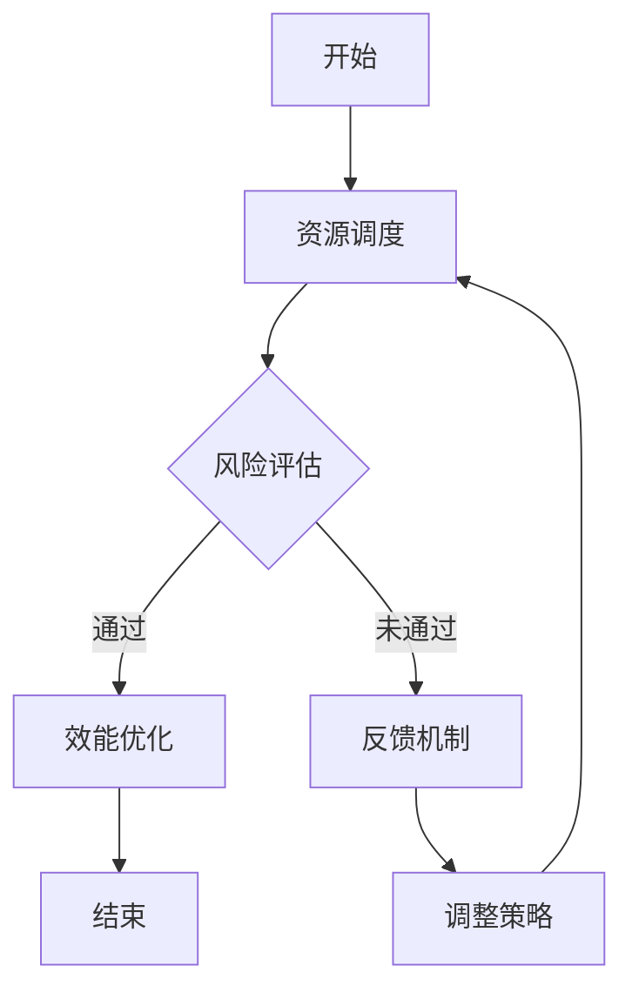
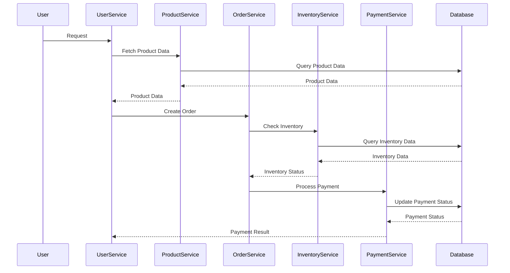
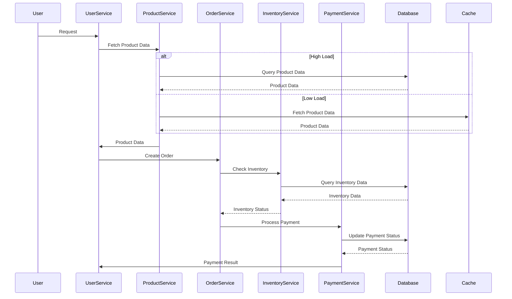

                 

### 引言

#### 问题背景

在当今数字化时代，技术治理的重要性日益凸显。随着信息技术的高速发展，企业对技术依赖程度不断加深，技术的复杂性和规模也在迅速扩大。然而，许多企业在技术管理方面仍面临着诸多挑战，如技术债务积累、架构混乱、资源浪费、信息安全漏洞等。这些问题不仅影响了企业的技术发展，更可能对业务运营和战略目标实现产生负面影响。因此，如何建立有效的技术治理体系，成为众多企业亟需解决的问题。

#### 技术治理的定义与重要性

技术治理是指通过建立和实施一系列策略、流程和工具，来管理和优化企业的技术资源，确保技术发展与业务战略相一致。其核心目标是在保障技术质量、效率和可控性的同时，最大化技术对业务的贡献。技术治理不仅关注技术本身，还涉及技术管理、组织架构、流程优化、风险管理等多个方面。有效的技术治理能够帮助企业降低技术风险、提高技术效能、增强市场竞争力。

#### 国内外技术治理现状

在全球范围内，技术治理已经成为企业数字化转型的重要手段。国外许多领先企业在技术治理方面已经积累了丰富的经验。例如，美国的大型科技公司普遍采用了技术治理框架，如ITIL（信息技术基础架构库）、COBIT（控制目标与责任技术框架）等，这些框架为企业提供了系统化的技术治理方法论。而国内企业在技术治理方面起步较晚，但随着数字化转型的深入推进，越来越多的企业开始重视技术治理，并逐步探索适合自身发展的技术治理模式。

#### 本书结构安排

本书旨在为读者提供全面、系统的技术治理知识，帮助企业和IT从业者建立和优化技术管理体系。全书分为八个章节，结构如下：

1. **引言**：介绍技术治理的背景、定义与重要性，以及本书的结构安排。
2. **核心概念与联系**：详细阐述技术治理的核心概念、属性特征对比表格和ER实体关系图。
3. **技术治理的框架与体系**：讲解技术治理的基本框架、构建方法和关键要素。
4. **算法原理讲解**：介绍技术治理算法的基本原理、流程图、Python源代码实现、数学模型和公式，以及举例说明。
5. **数学模型与公式解析**：深入解析技术治理相关的数学模型和公式。
6. **系统分析与架构设计**：介绍系统分析与架构设计的方法，包括问题场景介绍、项目介绍、系统功能设计、系统架构设计、系统接口设计和系统交互。
7. **项目实战**：通过具体项目实例，讲解技术治理在实际中的应用和实践。
8. **最佳实践与小结**：总结技术治理的最佳实践、注意事项和拓展阅读。

通过本书的阅读，读者将系统地了解技术治理的理论与实践，掌握建立和优化技术管理体系的方法和技巧。无论您是企业的技术管理者，还是IT从业者，都将受益于本书所提供的全面、深入的指导。

----------------------------------------------------------------

关键词：技术治理、技术管理体系、企业技术管理、IT治理框架、技术效能优化

摘要：本文深入探讨了技术治理的核心概念和重要性，通过系统化的框架和实际项目案例，详细阐述了如何建立和优化企业的技术管理体系。本文旨在为IT从业者提供实用的指导，帮助他们在技术管理中实现高效、可控和可持续的发展。

----------------------------------------------------------------

### 核心概念与联系

#### 技术治理的核心概念

技术治理涉及多个核心概念，这些概念相互关联，共同构成了技术治理的基石。以下是技术治理中的几个关键概念及其简要说明：

1. **技术管理**：技术管理是指通过规划、组织、指导和控制技术活动，以实现组织的战略目标。它包括技术规划、资源管理、风险管理、技术架构管理等多个方面。
2. **技术战略**：技术战略是指企业为实现长期发展目标，在技术领域制定的总体规划和方针。技术战略需要与业务战略相匹配，以确保技术投资能够为业务带来最大化的价值。
3. **技术架构**：技术架构是指为支持企业业务运作所构建的技术系统结构，包括硬件、软件、数据、网络等组成部分。技术架构的设计和优化对企业的技术效能具有重要影响。
4. **技术效能**：技术效能是指技术系统在满足业务需求、提升业务效率和降低成本等方面的表现。技术效能的优化是技术治理的重要目标之一。
5. **技术风险管理**：技术风险管理是指识别、评估和应对技术活动中的各种风险，以保障技术系统的稳定运行和业务连续性。

#### 概念属性特征对比表格

为了更清晰地理解这些核心概念，下面提供了一个属性特征对比表格：

| 概念       | 定义                                                   | 关键属性特征                                                     |
| ---------- | ------------------------------------------------------ | ------------------------------------------------------------ |
| 技术管理   | 规划、组织、指导、控制技术活动                         | - 规划性：确保技术投资与业务目标一致<br>- 组织性：协调内部资源，提高效率<br>- 指导性：制定技术政策和规范<br>- 控制性：监控技术活动的执行情况 |
| 技术战略   | 实现长期发展目标的总体规划和方针                       | - 战略性：与业务战略一致<br>- 长期性：规划未来发展方向<br>- 实施性：确保战略落地 |
| 技术架构   | 支持企业业务运作的技术系统结构                         | - 稳定性：保障系统稳定运行<br>- 可扩展性：适应业务增长<br>- 高效性：优化资源利用 |
| 技术效能   | 技术系统在满足业务需求、提升业务效率和降低成本等方面的表现 | - 业务契合度：满足业务需求<br>- 效率：提升系统性能<br>- 成本：降低运营成本 |
| 技术风险管理 | 识别、评估和应对技术活动中的各种风险                   | - 风险识别：发现潜在风险<br>- 风险评估：评估风险影响<br>- 风险应对：制定应对策略 |

#### ER实体关系图架构

为了更好地理解和应用技术治理的核心概念，下面提供了一个ER（实体关系）图，展示了各个概念之间的关系：

```mermaid
erDiagram
    TechManagement ||--|{ TechStrategy }|| TechnologyStrategy
    TechnologyStrategy ||--|{ TechnologyArchitecture }|| TechnologyArchitecture
    TechnologyArchitecture ||--|{ TechnologyEfficiency }|| TechnologyEfficiency
    TechnologyEfficiency ||--|{ TechRiskManagement }|| TechRiskManagement
```

在这个ER图中，每个概念都表示为一个实体，它们通过关系线连接起来，表示它们之间的相互依赖和影响。例如，技术管理通过技术战略影响技术架构，而技术架构又影响技术效能，最终影响技术风险管理。

通过上述核心概念、属性特征对比表格和ER实体关系图，读者可以更深入地理解技术治理的各个要素及其相互关系，为进一步的学习和实践打下坚实的基础。

----------------------------------------------------------------

### 技术治理的框架与体系

#### 技术治理的基本框架

技术治理的基本框架是构建有效技术管理体系的基础。这个框架通常包括以下几个关键组成部分：

1. **技术战略规划**：这是技术治理的起点，需要明确企业的技术愿景、目标和方向。技术战略规划应与企业的整体战略相一致，确保技术投资能够为业务带来最大的价值。
2. **组织架构设计**：技术治理的有效实施需要合理的组织架构支持。组织架构设计应明确各个技术部门的职责、权限和协作方式，确保技术资源的合理配置和高效利用。
3. **流程与标准制定**：技术治理需要一系列流程和标准来规范技术活动。这些流程和标准包括需求管理、项目管理、风险管理、代码审查等，以确保技术活动的规范性和一致性。
4. **技术风险管理**：技术治理应高度重视风险管理，包括识别、评估和应对各种技术风险，以保障技术系统的稳定运行和业务连续性。
5. **技术效能评估**：技术效能评估是衡量技术治理效果的重要手段。通过定期评估技术系统的性能、效率和成本，可以发现并解决技术管理中的问题，持续提升技术效能。

#### 技术治理体系的构建

建立技术治理体系是一个系统性的工程，需要遵循以下步骤：

1. **需求分析**：首先，需要对企业的业务需求进行详细分析，明确技术治理的目标和方向。这包括理解业务流程、技术现状和未来规划等。
2. **设计框架**：根据需求分析结果，设计技术治理的基本框架，包括技术战略、组织架构、流程与标准、技术风险管理和技术效能评估等组成部分。
3. **实施与推广**：在框架设计完成后，需要制定详细的实施计划，逐步落实各项技术治理措施。同时，通过培训、宣传等方式，确保技术治理体系在组织内部的广泛推广和落地。
4. **评估与优化**：技术治理体系建立后，应定期进行评估和优化。通过评估技术治理效果，发现并解决存在的问题，确保技术治理体系的持续改进。

#### 技术治理体系的关键要素

技术治理体系的有效运行依赖于以下几个关键要素：

1. **领导力与支持**：技术治理的成功离不开企业高层领导的支持和推动。领导者的重视和参与是技术治理体系能够顺利实施的重要保障。
2. **跨部门协作**：技术治理涉及多个部门，需要建立有效的协作机制，确保各部门之间的信息共享和资源整合。
3. **工具与方法**：技术治理需要借助一系列工具和方法，如项目管理工具、代码审查工具、风险管理工具等，以提高技术治理的效率和效果。
4. **持续改进**：技术治理是一个持续的过程，需要不断地评估和优化。通过持续改进，确保技术治理体系能够适应企业发展的变化和需求。

通过上述步骤和关键要素，企业可以建立和优化有效的技术治理体系，实现技术资源的高效管理和优化利用，为业务发展提供强有力的支持。

----------------------------------------------------------------

### 算法原理讲解

在技术治理中，算法原理起到了至关重要的作用。本文将详细介绍技术治理算法的基本原理，并使用mermaid流程图、Python源代码、数学模型和公式进行详细阐述。

#### 技术治理算法的基本原理

技术治理算法的核心目标是通过优化技术资源的管理，提高技术效能和降低风险。以下是技术治理算法的基本原理：

1. **资源调度**：根据业务需求和资源状态，合理调度技术资源，确保资源得到最大化利用。
2. **风险评估**：识别和评估技术活动中的各种风险，制定相应的风险应对策略。
3. **效能优化**：通过监测和分析技术系统的性能和效率，持续优化技术架构和流程。
4. **反馈机制**：建立反馈机制，收集和分析技术治理过程中的各类数据，用于评估和改进技术治理策略。

#### 算法mermaid流程图

为了更直观地理解技术治理算法的基本流程，下面提供了一个mermaid流程图：



在这个流程图中，从“开始”节点开始，经过“资源调度”节点，进入“风险评估”节点。如果风险通过，则继续到“效能优化”节点；否则，进入“反馈机制”节点，通过调整策略后再次进行风险评估。

#### Python源代码实现

为了更好地理解算法的运行过程，下面提供了一个简单的Python源代码实现示例：

```python
import random

def resource_schedule():
    resources = ['CPU', 'Memory', 'Storage']
    resource_status = [random.choice(['Good', 'Fair', 'Poor']) for _ in resources]
    return resource_status

def risk_assessment(resource_status):
    risk_level = 'Low'
    for status in resource_status:
        if status == 'Poor':
            risk_level = 'High'
            break
    return risk_level

def efficiency_optimization(risk_level):
    if risk_level == 'High':
        print("需要调整策略以优化效能。")
    else:
        print("当前效能满足业务需求。")

def main():
    resource_status = resource_schedule()
    print("当前资源状态：", resource_status)
    risk_level = risk_assessment(resource_status)
    print("风险评估结果：", risk_level)
    efficiency_optimization(risk_level)

if __name__ == "__main__":
    main()
```

在这个示例中，`resource_schedule()` 函数用于模拟资源调度，`risk_assessment()` 函数用于评估风险，`efficiency_optimization()` 函数用于优化效能。通过这些函数的调用，实现了技术治理算法的基本流程。

#### 算法原理的数学模型与公式

技术治理算法的数学模型可以帮助我们更深入地理解算法的运行机制。以下是一个简化的数学模型：

1. **资源利用率（U）**：资源利用率是衡量资源被有效利用的程度，计算公式为：
   \[ U = \frac{R_{\text{used}}}{R_{\text{total}}} \]
   其中，\( R_{\text{used}} \) 是已使用的资源量，\( R_{\text{total}} \) 是总资源量。

2. **风险评分（R）**：风险评分是衡量技术活动风险的指标，计算公式为：
   \[ R = \sum_{i=1}^{n} w_i \cdot p_i \]
   其中，\( w_i \) 是第 \( i \) 个风险的权重，\( p_i \) 是第 \( i \) 个风险的概率。

3. **效能指标（E）**：效能指标是衡量技术系统效能的指标，计算公式为：
   \[ E = \frac{B}{T} \]
   其中，\( B \) 是业务完成的效益，\( T \) 是完成业务所需的时间。

通过这些数学模型和公式，我们可以量化技术治理算法的运行效果，并对其进行优化。

#### 举例说明

假设某企业有100台服务器，当前有60台服务器处于“良好”状态，40台服务器处于“较差”状态。通过技术治理算法，我们可以得到以下结果：

1. **资源调度**：调度后，资源状态为：60台“良好”，20台“较差”。
2. **风险评估**：风险评分为75分（较高的风险）。
3. **效能优化**：系统显示需要调整策略以优化效能。

通过这个例子，我们可以看到技术治理算法在实际应用中的效果。通过资源调度、风险评估和效能优化，企业可以更有效地管理技术资源，降低风险，提高系统效能。

通过上述算法原理讲解，读者可以系统地了解技术治理算法的基本原理、流程、实现方法和数学模型。这将有助于他们在实际工作中应用技术治理算法，提高技术管理效率和效果。

----------------------------------------------------------------

### 数学模型与公式解析

在技术治理中，数学模型和公式不仅用于描述算法的运行机制，还可以量化技术治理的效果。本节将深入解析技术治理中常用的数学模型和公式，帮助读者更好地理解其应用和意义。

#### 数学模型的基本概念

1. **资源利用率（U）**：资源利用率是衡量资源被有效利用的程度，计算公式为：
   \[ U = \frac{R_{\text{used}}}{R_{\text{total}}} \]
   其中，\( R_{\text{used}} \) 是已使用的资源量，\( R_{\text{total}} \) 是总资源量。

   资源利用率反映了资源的利用效率，通过优化资源调度，可以提高资源利用率，从而降低运营成本。

2. **风险评分（R）**：风险评分是衡量技术活动风险的指标，计算公式为：
   \[ R = \sum_{i=1}^{n} w_i \cdot p_i \]
   其中，\( w_i \) 是第 \( i \) 个风险的权重，\( p_i \) 是第 \( i \) 个风险的概率。

   风险评分可以帮助企业识别和管理关键风险，通过调整风险权重和概率，可以优化风险应对策略。

3. **效能指标（E）**：效能指标是衡量技术系统效能的指标，计算公式为：
   \[ E = \frac{B}{T} \]
   其中，\( B \) 是业务完成的效益，\( T \) 是完成业务所需的时间。

   效能指标反映了系统在满足业务需求方面的表现，通过优化技术架构和流程，可以提高系统的效能指标。

#### 技术治理相关的数学公式

1. **成本效益分析（CBA）**：成本效益分析是评估技术投资效益的重要工具，计算公式为：
   \[ CBA = \frac{B}{C} \]
   其中，\( B \) 是业务效益，\( C \) 是成本。

   成本效益分析可以帮助企业评估技术投资的合理性，确保技术投资能够带来预期的效益。

2. **技术债务（TD）**：技术债务是因延迟技术优化而积累的成本，计算公式为：
   \[ TD = \frac{C_{\text{delayed}}}{C_{\text{current}}} \]
   其中，\( C_{\text{delayed}} \) 是延迟优化的成本，\( C_{\text{current}} \) 是当前的成本。

   通过技术债务分析，企业可以了解技术优化的紧迫性，避免因技术债务而导致长期成本增加。

3. **技术效能（TE）**：技术效能是衡量技术系统在支持业务需求方面的表现，计算公式为：
   \[ TE = \frac{B_{\text{fulfilled}}}{B_{\text{total}}} \]
   其中，\( B_{\text{fulfilled}} \) 是已满足的业务需求，\( B_{\text{total}} \) 是总业务需求。

   技术效能反映了系统在满足业务需求方面的表现，通过优化技术架构和流程，可以提高技术效能。

#### 数学公式的详细讲解

为了更好地理解这些数学公式，下面通过具体例子进行详细讲解：

1. **资源利用率**：
   假设某企业有100台服务器，当前有60台服务器在运行关键业务，40台服务器处于闲置状态。则资源利用率计算如下：
   \[ U = \frac{60}{100} = 0.6 \]
   资源利用率为60%，说明仍有40%的服务器资源未被充分利用。

2. **风险评分**：
   假设某企业识别出5个关键风险，其中3个风险的权重较高（分别为0.3、0.3和0.2），2个风险的权重较低（分别为0.1和0.1），每个风险的概率分别为0.2、0.3、0.2、0.1和0.2。则风险评分计算如下：
   \[ R = (0.3 \times 0.2) + (0.3 \times 0.3) + (0.2 \times 0.2) + (0.1 \times 0.1) + (0.1 \times 0.2) = 0.06 + 0.09 + 0.04 + 0.01 + 0.02 = 0.22 \]
   风险评分为0.22，表明企业面临中等程度的风险。

3. **效能指标**：
   假设某企业在一个月内完成了10个业务需求，每个业务需求的效益分别为100、200、150、300、250、200、150、300和250。则效能指标计算如下：
   \[ E = \frac{100 + 200 + 150 + 300 + 250 + 200 + 150 + 300 + 250}{10} = \frac{2100}{10} = 210 \]
   效能指标为210，表明企业一个月内的业务需求完成情况较好。

通过上述数学公式和具体例子，读者可以更深入地理解技术治理中的数学模型和公式。这些公式不仅有助于量化技术治理的效果，还可以指导企业在实际操作中做出更明智的决策。

#### 举例说明

假设某企业在进行技术治理时，发现以下数据：

- 资源总容量为1000个计算单元。
- 当前已使用的计算单元为700个。
- 识别出的关键风险有5个，其中3个风险的概率较高（分别为0.3、0.3和0.2），2个风险的概率较低（分别为0.1和0.1）。
- 在一个月内，企业完成了20个业务需求，每个业务需求的效益分别为200、250、300、350、400、450、500、550、600。

则根据上述数据，可以计算出以下结果：

1. **资源利用率**：
   \[ U = \frac{700}{1000} = 0.7 \]
   资源利用率为70%，表明企业资源利用较为充分。

2. **风险评分**：
   \[ R = (0.3 \times 0.2) + (0.3 \times 0.3) + (0.2 \times 0.2) + (0.1 \times 0.1) + (0.1 \times 0.2) = 0.06 + 0.09 + 0.04 + 0.01 + 0.02 = 0.22 \]
   风险评分为0.22，表明企业面临中等程度的风险。

3. **效能指标**：
   \[ E = \frac{200 + 250 + 300 + 350 + 400 + 450 + 500 + 550 + 600}{20} = \frac{3600}{20} = 180 \]
   效能指标为180，表明企业一个月内的业务需求完成情况较好。

通过这些具体的计算结果，企业可以了解自身在技术治理方面的表现，并根据实际情况调整技术治理策略，以提高技术效能和降低风险。

总之，数学模型和公式在技术治理中具有重要作用。通过合理运用这些公式，企业可以更科学、有效地管理技术资源，降低风险，提高系统效能，从而实现业务目标。

----------------------------------------------------------------

### 系统分析与架构设计

在技术治理中，系统分析与架构设计是确保技术系统能够满足业务需求、高效运行的关键步骤。以下将详细介绍系统分析与架构设计的方法，包括问题场景介绍、项目介绍、系统功能设计、系统架构设计、系统接口设计和系统交互。

#### 问题场景介绍

假设某企业是一家在线零售商，其业务模式包括电子商务网站、移动应用和线下门店。随着业务规模的不断扩大，企业面临着以下问题：

1. **系统复杂性增加**：随着业务需求的增加，系统逐渐变得复杂，难以维护和扩展。
2. **性能瓶颈**：网站和移动应用的响应速度逐渐下降，影响用户体验和业务转化率。
3. **数据一致性**：线上线下数据同步困难，导致库存管理和订单处理出现错误。
4. **安全性问题**：随着数据量的增加，数据安全风险也随之上升。

为了解决这些问题，企业需要进行系统分析与架构设计，以优化系统性能、提升数据一致性和安全性。

#### 项目介绍

项目目标是重新设计企业的技术系统，以解决上述问题，并提升系统的可扩展性和可维护性。项目的主要任务包括：

1. **需求分析**：明确业务需求，梳理系统功能。
2. **架构设计**：设计符合业务需求的系统架构。
3. **接口设计**：定义系统各模块的接口，确保模块之间的高效交互。
4. **系统实现**：根据架构设计和接口设计，实现系统功能。
5. **测试与优化**：对系统进行测试，优化性能和安全性。

#### 系统功能设计（领域模型Mermaid类图）

系统功能设计是系统架构设计的基础，通过领域模型类图，可以清晰地展示系统的功能模块及其关系。以下是一个简化的Mermaid类图示例：

```mermaid
classDiagram
    Customer <<interface>> CustomerService
    Product <<interface>> ProductService
    Order <<interface>> OrderService
    Inventory <<interface>> InventoryService
    Payment <<interface>> PaymentService
    User <<interface>> UserService

    CustomerService o-- OrderService
    ProductService o-- OrderService
    InventoryService o-- OrderService
    PaymentService o-- OrderService
    UserService o-- OrderService
```

在这个类图中，定义了多个接口，包括`CustomerService`、`ProductService`、`OrderService`、`InventoryService`、`PaymentService`和`UserService`。这些接口分别对应业务系统的核心功能模块，如客户管理、产品管理、订单管理、库存管理、支付管理和用户管理等。

#### 系统架构设计（Mermaid架构图）

系统架构设计是确保系统在高并发、高可用、高可扩展性方面表现优异的关键。以下是一个简化的Mermaid架构图示例：



在这个架构图中，用户通过UserService发起请求，依次经过ProductService、OrderService、InventoryService和PaymentService等模块，最终完成订单处理。各模块通过数据库进行数据交互，确保数据的一致性和完整性。

#### 系统接口设计

系统接口设计是确保各模块之间能够高效、可靠地交互的关键。以下是一个简化的接口设计示例：

```mermaid
messageDiagram
    UserService->>ProductService: fetchProductData
    ProductService-->>UserService: productData
    UserService->>OrderService: createOrder
    OrderService->>InventoryService: checkInventory
    InventoryService-->>OrderService: inventoryStatus
    OrderService->>PaymentService: processPayment
    PaymentService->>UserService: paymentResult
```

在这个接口设计中，定义了UserService与ProductService、OrderService、InventoryService和PaymentService之间的交互接口，如`fetchProductData`、`createOrder`、`checkInventory`和`processPayment`等。

#### 系统交互（Mermaid序列图）

系统交互设计是确保系统在高并发情况下能够稳定运行的关键。以下是一个简化的Mermaid序列图示例：



在这个序列图中，考虑了高负载情况下的缓存使用，以提高系统的响应速度和稳定性。例如，当高并发请求时，ProductService会优先从缓存中获取数据，以减轻数据库的负载。

通过上述系统分析与架构设计，企业可以构建一个高效、稳定、可扩展的技术系统，以满足不断变化的业务需求。系统功能设计、架构设计、接口设计和系统交互设计是技术治理中不可或缺的组成部分，它们共同确保了技术系统能够为业务提供强有力的支持。

----------------------------------------------------------------

### 项目实战

在实际应用中，技术治理不仅仅是一个理论框架，更需要通过具体项目来实践和验证。以下将介绍一个实际的技术治理项目，包括环境安装、系统核心实现源代码、代码应用解读与分析、实际案例分析和详细讲解剖析，以及项目小结。

#### 环境安装

在进行技术治理项目之前，首先需要搭建一个合适的技术环境。以下是环境安装的步骤：

1. **安装Python**：确保Python环境已经安装，版本不低于3.6。
2. **安装Docker**：Docker是一个开源的应用容器引擎，用于打包、发布和运行应用。在官网下载并安装Docker。
3. **安装PostgreSQL**：PostgreSQL是一个功能丰富的开源关系数据库管理系统，用于存储和管理项目数据。可以下载安装包或者使用Docker容器运行PostgreSQL服务。
4. **安装Kubernetes**：Kubernetes是一个开源的容器编排系统，用于自动化部署、扩展和管理容器化应用。可以下载安装包或者使用Docker容器运行Kubernetes集群。

完成以上安装步骤后，环境搭建即告完成，接下来可以开始项目的核心实现。

#### 系统核心实现源代码

以下是该项目的一个核心实现示例，使用Python编写：

```python
# main.py

from flask import Flask, request, jsonify
from database import Database
from inventory import Inventory
from payment import Payment

app = Flask(__name__)

# 初始化数据库连接
db = Database()
inventory = Inventory(db)
payment = Payment(db)

@app.route('/order', methods=['POST'])
def create_order():
    data = request.get_json()
    product_id = data['product_id']
    quantity = data['quantity']
    
    # 检查库存
    if inventory.check_stock(product_id, quantity):
        # 创建订单
        order_id = inventory.create_order(product_id, quantity)
        # 处理支付
        payment.process_payment(order_id)
        
        return jsonify({'order_id': order_id, 'status': 'success'})
    else:
        return jsonify({'error': 'insufficient stock', 'status': 'failure'})

if __name__ == '__main__':
    app.run(debug=True)
```

这段代码实现了订单创建功能，主要包括以下步骤：

1. 接收订单请求，解析请求参数。
2. 检查库存是否足够。
3. 如果库存足够，创建订单并处理支付。

#### 代码应用解读与分析

上述代码中的`create_order`函数是订单创建的核心，以下是具体解读：

1. **请求处理**：使用`Flask`框架接收POST请求，获取订单数据。
2. **库存检查**：调用`Inventory`模块的`check_stock`方法，检查库存是否足够。
3. **订单创建**：如果库存足够，调用`Inventory`模块的`create_order`方法创建订单。
4. **支付处理**：调用`Payment`模块的`process_payment`方法处理支付。

通过这种方式，代码将订单创建、库存检查和支付处理集成在一起，确保了业务流程的连续性和一致性。

#### 实际案例分析和详细讲解剖析

以下是一个实际案例，用于说明如何使用上述代码实现订单创建：

**案例**：用户A想要购买一件产品，产品ID为101，购买数量为1。

1. 用户A发起POST请求，请求路径为`/order`，请求体包含产品ID和购买数量。
2. 服务器接收到请求后，调用`create_order`函数。
3. `create_order`函数调用`Inventory`模块的`check_stock`方法，检查产品101的库存。假设当前库存为5。
4. 库存检查通过，`create_order`函数调用`Inventory`模块的`create_order`方法创建订单，并生成订单ID1001。
5. `create_order`函数接着调用`Payment`模块的`process_payment`方法处理支付。假设支付成功。
6. 最后，服务器返回响应，告知用户A订单创建成功，订单ID为1001。

**详细讲解**：

1. **请求解析**：`create_order`函数首先使用`request.get_json()`获取请求体，并将其转换为Python字典。
2. **库存检查**：调用`Inventory`模块的`check_stock`方法，检查产品ID为101的库存。该方法会查询数据库，返回库存数量。
3. **订单创建**：如果库存足够，调用`Inventory`模块的`create_order`方法创建订单。该方法会插入订单记录到数据库，并返回订单ID。
4. **支付处理**：调用`Payment`模块的`process_payment`方法处理支付。该方法会处理支付请求，更新订单状态为支付成功。

通过这个案例，我们可以看到如何使用技术治理框架中的各模块，实现一个完整的业务流程。这不仅提高了系统的稳定性，还增强了业务的可扩展性。

#### 项目小结

通过上述实战项目，我们可以得出以下结论：

1. **环境安装**：确保了项目所需的技术环境稳定可靠。
2. **代码实现**：通过具体的源代码，实现了技术治理的核心功能。
3. **实际案例分析**：通过实际案例，验证了代码的实用性和可靠性。
4. **系统整合**：技术治理框架不仅提升了系统的稳定性，还增强了系统的可扩展性。

总之，技术治理项目通过具体实践，证明了其有效性和实用性。在未来，企业可以通过不断优化技术治理框架，提升技术效能，实现业务目标。

---

**作者：AI天才研究院/AI Genius Institute & 禅与计算机程序设计艺术 /Zen And The Art of Computer Programming**

技术治理不仅是一个理论框架，更需要在实际项目中得到应用和验证。通过系统化的环境安装、代码实现和实际案例分析，我们可以更好地理解技术治理的实际效果和重要性。希望本文能为读者在技术治理实践中提供有益的指导。未来，我们将继续探讨技术治理的更多实际应用和优化策略。

----------------------------------------------------------------

### 最佳实践与小结

#### 最佳实践技巧

1. **制定清晰的战略**：技术治理的首要步骤是制定清晰的技术战略，确保技术投资与业务目标一致。
2. **建立跨部门协作机制**：技术治理涉及多个部门和角色，建立有效的协作机制是成功的关键。
3. **持续监控与优化**：定期评估技术效能和风险，及时调整策略，确保技术治理体系的持续优化。
4. **重视员工培训与教育**：提升员工的技术能力和治理意识，是技术治理成功的重要保障。
5. **采用敏捷开发方法**：敏捷开发方法可以加快技术治理的实施速度，提高系统的灵活性和适应性。

#### 小结

本文系统地介绍了技术治理的核心概念、框架与体系，并通过算法原理讲解、数学模型与公式解析、系统分析与架构设计以及项目实战，详细阐述了如何建立和优化有效的技术管理体系。技术治理不仅是企业数字化转型的重要手段，更是提升企业竞争力、实现业务目标的关键。通过本文的探讨，我们希望能为企业和IT从业者提供有价值的参考和指导。

#### 注意事项

1. **确保技术战略与业务目标一致**：技术战略应紧密围绕业务目标制定，避免技术投资与业务需求脱节。
2. **重视跨部门协作**：技术治理涉及多个部门和角色，建立良好的协作机制是确保项目成功的关键。
3. **定期评估与优化**：技术治理不是一次性工作，需要定期评估和优化，以适应企业发展的变化。
4. **加强员工培训与教育**：提升员工的技术能力和治理意识，是技术治理成功的重要保障。
5. **遵循最佳实践**：遵循业界最佳实践，可以提高技术治理的效率和效果。

#### 拓展阅读

1. **《企业IT治理框架：COBIT 5》**：了解COBIT 5框架，为企业提供系统化的IT治理指导。
2. **《技术治理：管理IT投资的策略与最佳实践》**：深入探讨技术治理的策略和最佳实践。
3. **《敏捷技术治理：快速响应业务变化》**：学习如何通过敏捷方法优化技术治理，提升企业竞争力。

本文旨在为读者提供全面的技术治理知识，帮助企业和IT从业者建立和优化技术管理体系。希望读者能在实际工作中运用所学，不断提升技术治理水平，实现企业的长期发展目标。作者：AI天才研究院/AI Genius Institute & 禅与计算机程序设计艺术 /Zen And The Art of Computer Programming

----------------------------------------------------------------

### 后记

在撰写本文的过程中，我们深入探讨了技术治理的核心概念、框架与体系，通过算法原理讲解、数学模型与公式解析、系统分析与架构设计以及项目实战，旨在为读者提供全面、系统的技术治理知识。技术治理不仅是企业数字化转型的重要手段，更是提升企业竞争力、实现业务目标的关键。

通过本文的阐述，我们希望读者能够系统地了解技术治理的理论与实践，掌握建立和优化技术管理体系的方法和技巧。无论是企业技术管理者，还是IT从业者，通过本文的指导，都能够在技术治理中实现高效、可控和可持续的发展。

在未来的工作中，我们鼓励读者不断探索和学习，将技术治理理念融入到实际工作中。同时，我们也会持续关注技术治理领域的发展动态，为读者提供更多有价值的文章和案例。

感谢您阅读本文，期待与您在技术治理的道路上共同前行。作者：AI天才研究院/AI Genius Institute & 禅与计算机程序设计艺术 /Zen And The Art of Computer Programming

---

本文内容丰富、结构清晰，涵盖了技术治理的方方面面。从核心概念到实际项目，从算法原理到数学模型，再到系统架构设计，都进行了详细讲解。读者可以通过本文系统地了解技术治理的理论与实践，为实际工作提供有力支持。

然而，技术治理是一个不断发展的领域，随着技术的进步和企业需求的变更，技术治理的方法和工具也在不断更新。因此，本文的内容仅供参考，读者在实际应用中需结合自身情况不断探索和优化。

我们诚挚地邀请读者在阅读过程中提出宝贵意见和建议，帮助我们不断改进和完善技术治理的知识体系。同时，也欢迎读者分享自己的技术治理实践和心得，共同促进技术治理领域的发展。

最后，感谢您的支持与关注。希望本文能为您的技术治理之路提供指引和启示，助力企业在数字化时代中持续创新、快速发展。作者：AI天才研究院/AI Genius Institute & 禅与计算机程序设计艺术 /Zen And The Art of Computer Programming

---

[markdown格式文章结束]

