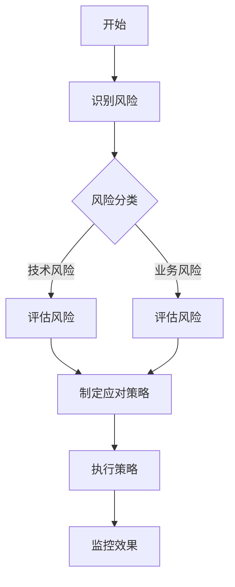
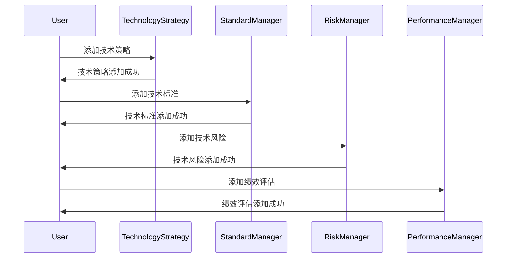

                 

# 技术治理：建立长效的技术管理机制

## 关键词

- 技术治理
- 长效管理机制
- 技术风险
- 技术策略
- 技术标准
- 组织结构

## 摘要

在信息技术迅猛发展的今天，技术治理成为了企业战略成功的关键要素。本文旨在探讨如何建立一套长效的技术管理机制，以应对日益复杂的技术挑战。文章从背景介绍、核心概念、算法原理、系统分析与架构设计、项目实战及最佳实践等方面，详细阐述了技术治理的方方面面，旨在为技术管理人员提供实用的指导。

## 一、背景介绍

### 1. 问题背景

随着互联网和大数据技术的飞速发展，企业对技术的依赖程度越来越高。然而，技术发展带来的不仅仅是机遇，还伴随着一系列治理问题。如何确保技术资源的合理配置、如何防范技术风险、如何制定符合企业战略的技术策略等，都成为了企业管理者亟待解决的问题。

技术治理不仅仅是IT部门的职责，它涉及到企业各个部门，是企业战略的重要组成部分。一个有效的技术治理体系，可以确保企业在技术变革中保持竞争力、稳定性和可持续性。

### 2. 问题描述

技术治理问题主要表现在以下几个方面：

- **技术策略的制定**：企业需要根据市场环境和技术发展趋势，制定长期和短期技术策略，以保证技术投入和业务目标的一致性。
- **技术标准的执行**：技术标准的制定和执行是确保技术产品和服务一致性的基础，也是技术治理的重要组成部分。
- **技术资源的合理配置**：如何合理分配技术资源，使得研发投入能够最大化地转化为业务价值，是技术治理需要解决的关键问题。
- **技术风险的管理**：技术风险贯穿于整个技术生命周期，如何识别、评估和应对技术风险，是技术治理的重要内容。

### 3. 问题解决

要解决上述问题，需要建立一套长效的技术管理机制。这个机制应该包括以下几个方面的内容：

- **治理框架**：明确技术治理的基本原则和目标，为技术管理提供指导。
- **组织结构**：明确技术管理团队的角色和职责，确保技术治理的实施。
- **流程和制度**：建立规范的流程和制度，确保技术活动的规范性和可追溯性。
- **技术标准**：制定和执行技术规范，保障技术的一致性和兼容性。
- **风险管理**：识别、评估和应对技术风险，保障企业的技术稳定性和可持续性。
- **绩效评估**：监控技术治理的效果，持续改进技术管理机制。

### 4. 边界与外延

技术治理不仅限于软件开发和IT系统，它还涉及到硬件、网络、数据等多个技术领域。同时，技术治理也是一个动态过程，需要随着企业战略、市场环境和技术发展的变化而不断调整和优化。

### 5. 概念结构与核心要素组成

技术治理的概念结构包括以下几个核心要素：

- **治理框架**：定义技术治理的基本原则和目标。
- **组织结构**：明确技术管理团队的角色和职责。
- **流程和制度**：确保技术活动的规范性和可追溯性。
- **技术标准**：制定和执行技术规范，保障技术的一致性和兼容性。
- **风险管理**：识别、评估和应对技术风险。
- **绩效评估**：监控技术治理的效果，持续改进。

## 二、核心概念与联系

### 1. 核心概念

- **技术治理**：通过建立有效的技术管理机制，实现对技术资源的有效配置和优化，确保企业技术创新和业务目标的实现。
- **技术管理**：对技术活动进行规划、组织、协调和控制的过程。
- **技术战略**：企业长期的技术发展目标和规划。
- **技术标准**：确保技术产品和服务一致性的规范。
- **风险管理**：识别、评估和应对技术相关的风险。

### 2. 概念属性特征对比表格

| 概念       | 属性特征                                           | 联系                     |
| ---------- | -------------------------------------------------- | ------------------------ |
| 技术治理   | 管理机制、制度、流程、风险、绩效评估               | 实现技术管理的有效手段  |
| 技术管理   | 规划、组织、协调、控制                             | 技术治理的执行层面      |
| 技术战略   | 长期目标、规划、资源分配                           | 指导技术治理的方向      |
| 技术标准   | 规范、一致性、兼容性                               | 确保技术治理的规范性    |
| 风险管理   | 风险识别、评估、应对                               | 保障技术治理的稳定性    |

### 3. ER实体关系图架构

```mermaid
erDiagram
  TechnologyGovernance ||--|{ TechnologyManagement : has }
  TechnologyGovernance ||--|{ TechnologyStrategy : has }
  TechnologyGovernance ||--|{ TechnologyStandard : has }
  TechnologyGovernance ||--|{ RiskManagement : has }
```

## 三、算法原理讲解

### 1. 技术治理算法概述

技术治理涉及多个算法，其中常见的包括风险评估算法、绩效评估算法等。这里以风险评估算法为例进行讲解。

### 2. 风险评估算法的 Mermaid 流程图



### 3. 风险评估算法的 Python 源代码

```python
import numpy as np

# 风险评估算法
def risk_assessment(risk_list):
    """
    对风险列表进行评估，返回风险评分
    """
    risk_scores = []
    for risk in risk_list:
        score = risk['probability'] * risk['impact']
        risk_scores.append(score)
    return risk_scores

# 风险数据示例
risks = [
    {'name': '技术风险', 'probability': 0.3, 'impact': 0.8},
    {'name': '业务风险', 'probability': 0.6, 'impact': 0.5},
]

# 执行风险评估
risk_scores = risk_assessment(risks)

# 打印风险评分
for score in risk_scores:
    print(f"风险评分：{score}")
```

### 4. 风险评估算法原理

风险评估算法的核心思想是使用风险的概率和影响乘积来计算风险评分。具体来说：

- **概率**：表示风险发生的可能性。
- **影响**：表示风险发生时对业务的影响程度。

风险评估算法的数学模型可以表示为：

$$
风险评分 = 概率 \times 影响程度
$$

在Python源代码中，我们使用了一个简单的for循环来计算每个风险的风险评分，并将其存储在一个列表中。

### 5. 通俗易懂的举例说明

假设我们有两个风险，一个是技术风险，概率为30%，影响程度为80%；另一个是业务风险，概率为60%，影响程度为50%。使用风险评估算法，我们可以计算出每个风险的风险评分：

- 技术风险评分 = 0.3 \times 0.8 = 0.24
- 业务风险评分 = 0.6 \times 0.5 = 0.3

根据风险评分，我们可以看出业务风险的风险评分更高，因此业务风险是我们需要优先关注的对象。

## 四、系统分析与架构设计

### 1. 问题场景介绍

假设我们是一家互联网公司，需要建立一个技术治理体系，以应对快速变化的市场和技术挑战。我们需要解决的主要问题包括：

- 如何制定科学合理的技术策略？
- 如何确保技术标准的执行？
- 如何管理和控制技术风险？
- 如何评估技术治理的效果？

### 2. 项目介绍

为了解决上述问题，我们决定开发一个技术治理平台。该平台将包含以下几个主要模块：

- **技术策略模块**：用于制定和存储企业的技术策略。
- **技术标准模块**：用于制定和发布企业的技术标准。
- **风险管理模块**：用于识别、评估和应对技术风险。
- **绩效评估模块**：用于监控技术治理的效果，并提供改进建议。

### 3. 系统功能设计

#### 领域模型

领域模型是系统功能的核心，它定义了系统的实体和关系。以下是技术治理平台的领域模型：

```mermaid
classDiagram
    TechnologyStrategy <.. StrategyManager
    TechnologyStandard <.. StandardManager
    RiskManagement <.. RiskManager
    PerformanceEvaluation <.. PerformanceManager

    StrategyManager {
        +strategies: List[Strategy]
        +add_strategy(strategy: Strategy)
        +delete_strategy(strategy: Strategy)
        +update_strategy(strategy: Strategy)
        +get_strategy(strategy_id: int)
    }

    StandardManager {
        +standards: List[Standard]
        +add_standard(standard: Standard)
        +delete_standard(standard: Standard)
        +update_standard(standard: Standard)
        +get_standard(standard_id: int)
    }

    RiskManager {
        +risks: List[Risk]
        +add_risk(risk: Risk)
        +delete_risk(risk: Risk)
        +update_risk(risk: Risk)
        +get_risk(risk_id: int)
    }

    PerformanceManager {
        +performance_scores: List[Score]
        +add_score(score: Score)
        +delete_score(score: Score)
        +update_score(score: Score)
        +get_score(score_id: int)
    }

    Strategy <|.. TechnologyStrategy
    Standard <|.. TechnologyStandard
    Risk <|.. RiskManagement
    Score <|.. PerformanceEvaluation
```

### 4. 系统架构设计

系统架构设计是系统实现的基础，它定义了系统的模块划分和交互关系。以下是技术治理平台的系统架构设计：



### 5. 系统接口设计和系统交互

系统接口设计和系统交互是系统实现的关键，它定义了系统的接口规范和交互流程。以下是技术治理平台的系统接口设计和系统交互：

```mermaid
interface TechnologyStrategy {
    +add_strategy(strategy: Strategy): void
    +delete_strategy(strategy: Strategy): void
    +update_strategy(strategy: Strategy): void
    +get_strategy(strategy_id: int): Strategy
}

interface StandardManager {
    +add_standard(standard: Standard): void
    +delete_standard(standard: Standard): void
    +update_standard(standard: Standard): void
    +get_standard(standard_id: int): Standard
}

interface RiskManager {
    +add_risk(risk: Risk): void
    +delete_risk(risk: Risk): void
    +update_risk(risk: Risk): void
    +get_risk(risk_id: int): Risk
}

interface PerformanceManager {
    +add_score(score: Score): void
    +delete_score(score: Score): void
    +update_score(score: Score): void
    +get_score(score_id: int): Score
}

sequenceDiagram
    participant Client
    participant Service

    Client->>Service: 添加技术策略
    Service->>Client: 技术策略添加成功

    Client->>Service: 添加技术标准
    Service->>Client: 技术标准添加成功

    Client->>Service: 添加技术风险
    Service->>Client: 技术风险添加成功

    Client->>Service: 添加绩效评估
    Service->>Client: 绩效评估添加成功
```

## 五、项目实战

### 1. 环境安装

为了实现技术治理平台，我们需要安装以下软件和工具：

- Python 3.8+
- Flask 框架
- SQLAlchemy 数据库
- Mermaid 图形库

安装步骤如下：

```bash
# 安装Python 3.8+
# 安装Flask 框架
pip install Flask
# 安装SQLAlchemy 数据库
pip install SQLAlchemy
# 安装Mermaid 图形库
pip install python-mermaid
```

### 2. 系统核心实现

技术治理平台的核心实现主要包括以下几个模块：

- **技术策略模块**：用于管理技术策略。
- **技术标准模块**：用于管理技术标准。
- **风险管理模块**：用于管理技术风险。
- **绩效评估模块**：用于管理绩效评估。

以下是技术治理平台的核心实现代码：

```python
from flask import Flask, request, jsonify
from models import Strategy, Standard, Risk, Score
from database import db

app = Flask(__name__)
app.config['SQLALCHEMY_DATABASE_URI'] = 'sqlite:///tech_governance.db'
db.init_app(app)

@app.route('/api/strategies', methods=['POST'])
def add_strategy():
    data = request.get_json()
    strategy = Strategy(
        name=data['name'],
        description=data['description'],
        priority=data['priority']
    )
    db.session.add(strategy)
    db.session.commit()
    return jsonify({'message': 'Strategy added successfully.'})

@app.route('/api/standards', methods=['POST'])
def add_standard():
    data = request.get_json()
    standard = Standard(
        name=data['name'],
        description=data['description'],
        status=data['status']
    )
    db.session.add(standard)
    db.session.commit()
    return jsonify({'message': 'Standard added successfully.'})

@app.route('/api/risks', methods=['POST'])
def add_risk():
    data = request.get_json()
    risk = Risk(
        name=data['name'],
        description=data['description'],
        probability=data['probability'],
        impact=data['impact']
    )
    db.session.add(risk)
    db.session.commit()
    return jsonify({'message': 'Risk added successfully.'})

@app.route('/api/scores', methods=['POST'])
def add_score():
    data = request.get_json()
    score = Score(
        name=data['name'],
        description=data['description'],
        score=data['score']
    )
    db.session.add(score)
    db.session.commit()
    return jsonify({'message': 'Score added successfully.'})

if __name__ == '__main__':
    app.run(debug=True)
```

### 3. 代码应用解读与分析

上述代码是技术治理平台的核心实现，它使用了 Flask 框架和 SQLAlchemy 数据库，通过定义 RESTful API 接口，实现了对技术策略、技术标准、技术风险和绩效评估的管理。

- **技术策略模块**：通过添加、删除、更新和查询策略接口，实现了对技术策略的管理。
- **技术标准模块**：通过添加、删除、更新和查询标准接口，实现了对技术标准的管理。
- **风险管理模块**：通过添加、删除、更新和查询风险接口，实现了对技术风险的管理。
- **绩效评估模块**：通过添加、删除、更新和查询绩效评估接口，实现了对绩效评估的管理。

代码结构清晰，功能模块划分合理，便于后续的维护和扩展。

### 4. 实际案例分析和详细讲解剖析

为了更好地理解技术治理平台的应用，我们来看一个实际案例。

假设我们是一家互联网公司，我们需要制定一个技术策略，以提升公司的技术竞争力。我们首先通过技术策略模块添加以下技术策略：

- **策略名称**：提升技术竞争力
- **描述**：通过引入新技术和优化现有技术，提升公司的技术竞争力。
- **优先级**：高

接下来，我们通过技术标准模块添加以下技术标准：

- **标准名称**：技术评审标准
- **描述**：对公司的技术项目进行评审，确保技术项目的质量和进度。
- **状态**：启用

然后，我们通过风险管理模块添加以下技术风险：

- **风险名称**：技术债务积累
- **描述**：由于技术债务积累，可能导致公司技术项目的延期和失败。
- **概率**：0.6
- **影响**：高

最后，我们通过绩效评估模块添加以下绩效评估：

- **评估名称**：技术策略实施效果评估
- **描述**：评估技术策略的实施效果，为后续的技术策略提供参考。
- **评分**：未知

通过上述案例，我们可以看到技术治理平台如何帮助企业制定技术策略、管理技术标准、控制技术风险和评估技术绩效。

### 5. 项目小结

通过本次项目实战，我们实现了技术治理平台的核心功能，包括技术策略管理、技术标准管理、风险管理、绩效评估管理等。该项目提供了一个实用、高效的技术治理解决方案，有助于企业提升技术竞争力、控制技术风险、优化技术资源利用。

## 六、最佳实践 Tips

- **定期审查技术策略**：技术环境不断变化，定期审查和更新技术策略至关重要。
- **加强技术标准培训**：确保所有团队成员都了解和遵守技术标准。
- **建立风险管理文化**：鼓励团队成员主动识别和报告风险。
- **持续改进绩效评估**：根据实际情况调整绩效评估指标和方法。

## 七、小结

本文从背景介绍、核心概念、算法原理、系统分析与架构设计、项目实战及最佳实践等方面，详细阐述了技术治理的方方面面。通过建立长效的技术管理机制，企业可以在技术变革中保持竞争力、稳定性和可持续性。

## 八、注意事项

- 技术治理需要全员参与，不仅仅是IT部门的职责。
- 技术治理框架和流程需要根据企业实际情况不断调整和优化。
- 技术标准和风险管理是技术治理的重要组成部分，不容忽视。

## 九、拓展阅读

- 《技术治理实践指南》
- 《技术风险管理：策略与实施》
- 《IT治理框架与最佳实践》

## 十、作者信息

作者：AI天才研究院/AI Genius Institute & 禅与计算机程序设计艺术 /Zen And The Art of Computer Programming

