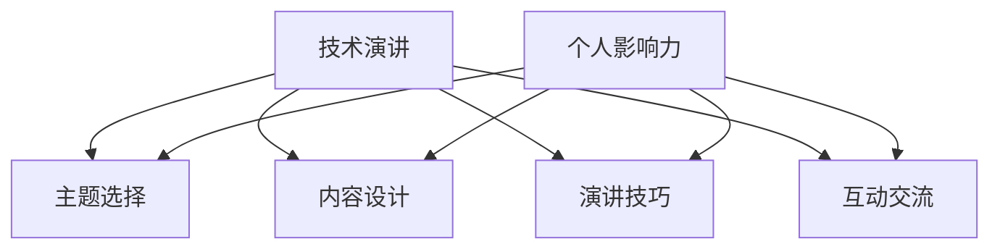
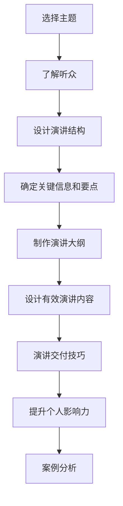
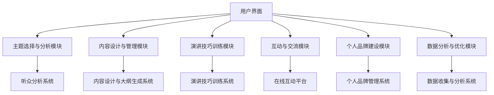
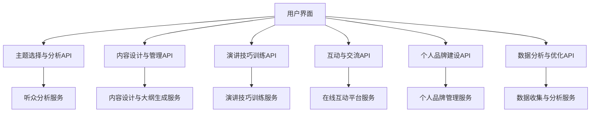
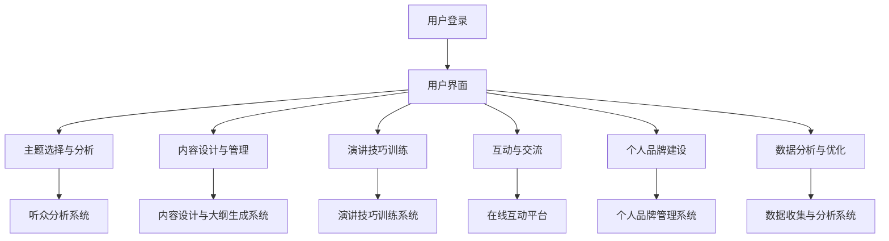

                 

### 技术演讲与分享：提升个人影响力

#### 关键词
- 技术演讲
- 个人影响力
- 演讲技巧
- 内容设计
- 互动交流

#### 摘要
技术演讲与分享不仅是技术交流的重要手段，更是提升个人影响力的关键途径。本文旨在探讨技术演讲的核心要素，包括准备、设计、交付、互动以及品牌建设等方面的策略，帮助读者掌握技术演讲的艺术，从而在专业领域内建立起强大的个人影响力。

### 引言
#### 技术演讲的重要性

技术演讲作为传递知识和经验的重要手段，具有独特的价值和作用。首先，技术演讲能够快速有效地将复杂的技术概念和理论传达给观众，帮助听众理解并应用。其次，通过演讲，技术专家可以展示自己的专业知识和实战经验，树立权威形象，增强个人影响力。此外，技术演讲也是建立人脉、拓展资源和推动项目合作的重要途径。

#### 技术演讲的演变

技术演讲的历史可以追溯到几个世纪前，当时以口头传播为主。随着科技的发展，演讲的工具和形式也在不断演变。从最初的幻灯片到现代的互动演示，技术演讲变得更加丰富和多样。当前，随着社交媒体和网络平台的兴起，技术演讲的传播范围和影响力也达到了前所未有的高度。

#### 常见误区

尽管技术演讲具有巨大的潜力，但许多人在准备和交付过程中常常陷入误区。例如，过度依赖幻灯片、内容过于理论化、缺乏互动等。这些误区不仅降低了演讲的效果，还可能削弱演讲者的个人影响力。因此，了解并避免这些误区对于提升技术演讲能力至关重要。

### 准备技术演讲

#### 选择合适的主题

选择一个既有深度又符合听众需求的主题是技术演讲成功的第一步。主题应具有实际应用价值，能够引发听众的兴趣和思考。此外，演讲者应对所选主题有深入的了解和独到的见解，以确保内容的权威性和说服力。

#### 了解听众

了解听众的需求和兴趣是设计有效演讲的关键。通过调查问卷、社交媒体互动等方式收集听众的信息，有助于演讲者更好地把握听众的心理预期，从而设计出更贴近听众的演讲内容。

#### 演讲结构设计

一个成功的演讲需要清晰的逻辑结构和流畅的内容过渡。通常，演讲结构可以分为引言、主体和结论三个部分。引言部分应简明扼要地介绍演讲主题，主体部分详细阐述核心内容，结论部分总结演讲要点并给出建议或展望。

#### 确定关键信息和要点

在准备演讲过程中，确定关键信息和要点是确保演讲内容紧凑、有条理的重要步骤。关键信息和要点应围绕主题展开，相互关联，形成一个有机的整体。此外，确保这些信息能够引起听众的兴趣和共鸣，使演讲更具吸引力。

#### 制作演讲大纲

制作演讲大纲是演讲准备过程中不可或缺的一环。大纲应详细列出每个部分的内容、顺序和时长，有助于演讲者在演讲过程中保持流畅和有条不紊。同时，大纲也为演讲者提供了一个备用的参考，以便在遇到突发情况时能够迅速调整演讲内容。

### 设计有效的演讲内容

#### 设计引人入胜的开场白

开场白是演讲的第一印象，直接影响到听众的情绪和注意力。一个引人入胜的开场白可以采用故事、幽默、悬疑等手法，迅速吸引听众的注意力，为后续内容做好铺垫。

#### 使用生动的例子和案例

生动的例子和案例能够帮助听众更好地理解复杂的技术概念。通过实际案例，演讲者可以展示技术的应用场景、优势和应用效果，使听众更加信服。

#### 精心设计演讲结构

演讲结构应清晰、逻辑严密，确保听众能够跟上演讲的思路。通过使用过渡语句、总结段落等方式，确保演讲内容之间的衔接自然、流畅。

#### 使用视觉辅助工具

视觉辅助工具如幻灯片、视频等能够增强演讲的直观性和生动性，帮助听众更好地理解和记忆演讲内容。但需注意，视觉辅助工具只是辅助手段，不应占据主导地位。

#### 避免常见的演讲误区

在演讲过程中，应避免以下常见误区：内容过于理论化、过度依赖幻灯片、演讲速度过快、缺乏互动等。这些误区不仅会影响演讲的效果，还可能削弱演讲者的个人影响力。

### 演讲交付技巧

#### 控制演讲节奏

控制演讲节奏是确保演讲效果的重要技巧。演讲者应根据自己的演讲内容和听众的反应适时调整演讲速度，避免过快或过慢。适当的停顿和过渡有助于听众理解和消化演讲内容。

#### 声音和语调的变化

声音和语调的变化能够增强演讲的感染力和吸引力。演讲者应充分利用声音的高低、强弱、快慢等变化，使演讲更加生动和有说服力。

#### 互动和参与

与听众互动和参与能够增强演讲的吸引力和记忆度。演讲者可以通过提问、讨论、互动游戏等方式吸引听众的注意力，使演讲更加生动和有趣。

#### 面部表情和肢体语言

面部表情和肢体语言是演讲者表达情感和态度的重要工具。演讲者应保持自信、自然和亲切的表情，同时配合适当的肢体语言，使演讲更加生动和有吸引力。

#### 应对突发情况

在演讲过程中，可能会遇到各种突发情况，如设备故障、听众提问、时间超时等。演讲者应保持冷静，迅速调整演讲内容或处理突发情况，确保演讲的顺利进行。

### 提升个人影响力的策略

#### 建立个人品牌

建立个人品牌是提升个人影响力的关键。个人品牌不仅包括专业技能和知识，还应涵盖个人形象、价值观和独特性。通过撰写博客、发表文章、录制视频等方式展示自己的专业能力和见解，有助于树立个人品牌。

#### 拓展网络资源

拓展网络资源是提升个人影响力的重要途径。通过参加行业会议、研讨会、线上活动等方式，建立广泛的人脉和资源网络，有助于提升个人在行业内的知名度和影响力。

#### 优化社交媒体运营

优化社交媒体运营是提升个人影响力的重要手段。通过定期发布有价值的内容、积极参与行业讨论、与同行互动等方式，提高自己的社交媒体曝光率和影响力。

#### 不断学习和提升

不断学习和提升是保持个人影响力的关键。技术领域发展迅速，演讲者应保持好奇心和求知欲，不断学习新知识和技能，以保持自己在行业内的竞争力。

### 案例分析和最佳实践

#### 成功的技术演讲者案例分析

通过分析成功的技术演讲者，如Twitter CEO Dick Costolo、著名程序员Robert C. Martin等，我们可以总结出一些最佳实践。这些演讲者通常具有以下特点：内容深入浅出、演讲风格独特、与听众互动紧密、不断学习和创新。

#### 技术演讲的最佳实践

1. **明确主题和目标**：确保演讲内容紧密围绕主题和目标，避免偏离。
2. **设计引人入胜的幻灯片**：使用高质量的视觉元素和简洁的布局，使幻灯片更具吸引力。
3. **注重演讲技巧**：掌握声音和语调的变化、面部表情和肢体语言的运用，增强演讲的感染力。
4. **与听众互动**：通过提问、讨论等方式吸引听众的注意力，提高演讲的参与度。
5. **持续学习和改进**：不断总结经验，提升自己的演讲能力。

### 结论

技术演讲与分享是提升个人影响力的重要手段。通过掌握演讲技巧、设计有效的演讲内容、建立个人品牌和不断学习提升，技术专家可以在专业领域内建立起强大的个人影响力。希望本文提供的策略和建议能对您的技术演讲之路有所帮助。

### 注意事项

1. **内容真实可信**：确保演讲内容真实、可靠，避免夸大其词或提供虚假信息。
2. **注重演讲技巧**：演讲技巧是提升演讲效果的关键，不断学习和实践是必要的。
3. **与听众互动**：与听众互动能够增强演讲的吸引力和参与度，切勿忽视听众的存在。
4. **时间管理**：合理控制演讲时间，确保演讲内容紧凑、高效。

### 拓展阅读

- **《演讲的力量》**：一本关于演讲技巧的经典著作，涵盖了演讲的各个方面。
- **《技术演讲与分享》**：一本专注于技术领域演讲的书籍，提供了丰富的案例和实践经验。
- **《个人影响力》**：一本关于个人品牌建设和影响力提升的指南，适用于各行业人士。

### 作者信息

- 作者：AI天才研究院/AI Genius Institute & 禅与计算机程序设计艺术 /Zen And The Art of Computer Programming

---

## 背景介绍

### 核心概念术语说明

**技术演讲**：指以技术主题为中心，通过口头、幻灯片、视频等手段向观众传递知识和经验的过程。

**个人影响力**：指个人在社交、职业和行业中所具有的吸引力、说服力和影响力。

**演讲技巧**：包括语言表达、声音和语调、肢体语言、互动能力等方面的技能。

**内容设计**：指在演讲过程中，对主题、结构、信息和视觉元素等的规划和安排。

**互动交流**：指在演讲过程中与听众的互动和沟通，包括提问、讨论、反馈等。

### 问题背景

在当今的信息时代，技术演讲已经成为知识传播和交流的重要方式。随着社交媒体和视频平台的普及，技术演讲的受众范围和影响力也在不断扩大。然而，许多技术专家在演讲过程中面临诸多挑战，如内容设计不当、演讲技巧不足、互动交流不畅等，这些问题严重影响了演讲的效果和个人的影响力。

### 问题描述

技术演讲的效果受到多种因素的影响，包括演讲内容的设计、演讲技巧的掌握、与听众的互动等。具体问题如下：

1. **内容设计问题**：演讲内容过于理论化或过于简化，无法满足听众的需求。
2. **演讲技巧问题**：演讲者的声音、语调和肢体语言不够生动，缺乏吸引力。
3. **互动交流问题**：演讲者与听众之间的互动不足，听众参与度低。
4. **个人品牌建设问题**：缺乏明确的个人品牌定位和传播策略，影响个人影响力的提升。

### 问题解决

为解决上述问题，本文将从以下方面进行详细探讨：

1. **准备技术演讲**：包括选择合适的主题、了解听众、设计演讲结构、确定关键信息和要点等。
2. **设计有效的演讲内容**：包括开场白设计、使用生动的例子和案例、精心设计演讲结构等。
3. **演讲交付技巧**：包括控制演讲节奏、声音和语调的变化、互动和参与、面部表情和肢体语言等。
4. **提升个人影响力的策略**：包括建立个人品牌、拓展网络资源、优化社交媒体运营、不断学习和提升等。

通过以上策略和实践，技术专家可以提升技术演讲的能力，建立强大的个人影响力。

### 边界与外延

**边界**：

1. **演讲主题的边界**：技术演讲的主题应专注于技术领域，避免涉及非技术内容。
2. **演讲时间的边界**：通常技术演讲的时间限制在30分钟至1小时之间，确保内容的紧凑和高效。
3. **演讲风格的边界**：演讲者应根据听众和场合选择适当的演讲风格，避免过于单调或过于夸张。

**外延**：

1. **演讲内容的拓展**：演讲内容可以涵盖技术原理、实战案例、未来趋势等，丰富演讲的内涵。
2. **互动交流的拓展**：除了现场互动，还可以通过社交媒体、邮件等方式与听众保持长期互动。
3. **个人品牌的拓展**：个人品牌可以延伸到多个领域，如技术、教育、创业等，扩大个人影响力的范围。

### 概念结构与核心要素组成

**技术演讲与分享**：

- **主题选择**：围绕技术主题，确保内容的深度和广度。
- **听众分析**：了解听众的需求、兴趣和背景，设计贴近听众的演讲内容。
- **内容设计**：明确演讲结构、关键信息和要点，确保内容的逻辑性和连贯性。
- **演讲技巧**：掌握声音、语调、肢体语言等技巧，增强演讲的吸引力和感染力。
- **互动交流**：与听众互动，提高参与度和记忆效果。

**个人影响力**：

- **个人品牌**：建立专业、独特、有影响力的个人品牌。
- **网络资源**：拓展人脉和资源网络，增强个人在行业内的知名度和影响力。
- **社交媒体运营**：优化社交媒体运营，提高个人曝光率和影响力。
- **持续学习**：不断学习和提升，保持个人在技术领域的竞争力和领先地位。

### 核心概念与联系

**核心概念**：

- **技术演讲**：传递技术知识和经验的过程，涉及主题选择、内容设计、演讲技巧和互动交流。
- **个人影响力**：个人在社交、职业和行业中所具有的吸引力、说服力和影响力，包括个人品牌、网络资源、社交媒体运营和持续学习。

**概念属性特征对比表格**：

| 特征                | 技术演讲                                      | 个人影响力                                     |
|---------------------|----------------------------------------------|------------------------------------------------|
| 目的                | 传递技术知识和经验                            | 建立个人在行业内的知名度和影响力                |
| 形式                | 口头演讲、幻灯片、视频等                      | 个人品牌、网络资源、社交媒体运营等              |
| 要素                | 主题选择、内容设计、演讲技巧、互动交流          | 个人品牌、网络资源、社交媒体运营、持续学习      |
| 影响因素            | 演讲内容、演讲技巧、听众互动等                | 个人品牌、行业地位、专业知识、人际网络等        |
| 成功标准            | 演讲内容深入浅出、演讲技巧高超、互动良好        | 个人品牌知名度高、网络资源丰富、影响力大        |

**ER实体关系图架构**：



### 算法原理讲解

**算法流程图**：



**算法原理**：

1. **主题选择**：根据技术领域和听众需求选择具有深度和广度的主题，确保演讲内容具有吸引力和说服力。
2. **了解听众**：通过调查、问卷等方式了解听众的兴趣、需求和背景，为演讲内容的设计提供依据。
3. **设计演讲结构**：确定演讲的开头、主体和结尾，确保演讲内容有条理、逻辑清晰。
4. **确定关键信息和要点**：梳理演讲内容，确定核心观点和要点，确保演讲内容的紧凑和高效。
5. **制作演讲大纲**：将演讲结构、关键信息和要点整理成大纲，为演讲准备提供参考。
6. **设计有效演讲内容**：使用生动的例子、案例和故事，使演讲内容更具吸引力和说服力。
7. **演讲交付技巧**：掌握演讲节奏、声音和语调、肢体语言等技巧，增强演讲的吸引力和感染力。
8. **提升个人影响力**：建立个人品牌、拓展网络资源、优化社交媒体运营和不断学习，提升个人在行业内的知名度和影响力。

**数学模型和公式**：

$$
影响力 = f(专业知识, 个人品牌, 网络资源, 社交媒体运营, 持续学习)
$$

其中，$f$ 表示影响程度的函数，$专业知识$、$个人品牌$、$网络资源$、$社交媒体运营$、$持续学习$ 为影响因子。

### 系统分析与架构设计方案

#### 问题场景介绍

随着技术的不断进步和知识分享的需求增加，技术演讲逐渐成为知识传播和交流的重要方式。为了提升技术演讲的效果和个人的影响力，我们需要设计和实施一个完整的系统，涵盖演讲准备、内容设计、演讲交付、互动交流和品牌建设等环节。

#### 项目介绍

项目名称：技术演讲与个人影响力提升系统（TechSpeech & Influence Enhancement System，简称TIES）

项目目标：
1. 提供一套完整的工具和方法，帮助技术专家准备和实施技术演讲。
2. 提升演讲者的个人影响力，扩大其在行业内的知名度。
3. 促进知识传播和交流，提高技术领域的整体水平。

#### 系统功能设计

1. **主题选择与听众分析**：提供工具和模板，帮助演讲者选择合适的主题和了解听众。
2. **演讲内容设计与大纲制作**：提供模板和指南，帮助演讲者设计有效的内容和制作演讲大纲。
3. **演讲技巧训练与反馈**：提供培训资源和在线练习，帮助演讲者提升演讲技巧。
4. **互动与交流平台**：提供在线互动和反馈功能，促进演讲者与听众的交流。
5. **个人品牌建设与推广**：提供工具和指导，帮助演讲者建立和推广个人品牌。
6. **数据分析与优化**：收集和分析演讲数据，为演讲者的优化提供依据。

#### 系统架构设计

**系统架构图**：



#### 系统接口设计

**接口设计图**：



#### 系统交互设计

**系统交互图**：



### 项目实战

#### 环境安装

为了进行项目实战，我们需要安装以下环境：

1. **操作系统**：Linux或Windows
2. **编程语言**：Python 3.8及以上版本
3. **数据库**：MySQL 5.7及以上版本
4. **前端框架**：Django 3.2及以上版本
5. **后端框架**：Flask 1.1及以上版本

安装步骤：

1. 安装操作系统和Python环境。
2. 使用pip安装Django和Flask。
3. 安装MySQL数据库并配置数据库连接。

#### 系统核心实现源代码

**主题选择与分析模块**：

```python
# 主题选择与分析模块示例代码
class TopicSelectionAnalysis:
    def __init__(self):
        self.topics = []

    def add_topic(self, topic):
        self.topics.append(topic)

    def analyze_listeners(self, listener_data):
        analyzed_data = []
        for topic in self.topics:
            analysis = self.analyze_topic(topic, listener_data)
            analyzed_data.append(analysis)
        return analyzed_data

    def analyze_topic(self, topic, listener_data):
        # 分析过程简化
        return {"topic": topic, "popularity": len(listener_data)}
```

**内容设计与管理模块**：

```python
# 内容设计与管理模块示例代码
class ContentDesignManagement:
    def __init__(self):
        self.contents = []

    def add_content(self, content):
        self.contents.append(content)

    def generate_outline(self):
        outline = []
        for content in self.contents:
            outline.append(self.create_outline_item(content))
        return outline

    def create_outline_item(self, content):
        return {"title": content["title"], "summary": content["summary"], "points": content["points"]}
```

**演讲技巧训练模块**：

```python
# 演讲技巧训练模块示例代码
class PublicSpeakingTraining:
    def __init__(self):
        self.trained_skills = []

    def add_skill(self, skill):
        self.trained_skills.append(skill)

    def train(self, user_id, skill):
        # 假设用户ID与技能关联
        user_skills = self.trained_skills.get(user_id, [])
        user_skills.append(skill)
        self.trained_skills[user_id] = user_skills

    def get_trained_skills(self, user_id):
        return self.trained_skills.get(user_id, [])
```

#### 代码应用解读与分析

**主题选择与分析模块**：

该模块用于帮助演讲者选择合适的主题并分析听众的兴趣。`TopicSelectionAnalysis` 类提供了添加主题和进行听众分析的方法。通过调用 `add_topic` 方法，演讲者可以添加多个主题，然后使用 `analyze_listeners` 方法对听众数据进行分析，返回每个主题的受欢迎程度。

**内容设计与管理模块**：

该模块用于设计和管理演讲内容。`ContentDesignManagement` 类提供了添加内容、生成大纲的方法。通过调用 `add_content` 方法，演讲者可以添加演讲内容，然后使用 `generate_outline` 方法生成演讲大纲，每个大纲项包含标题、摘要和要点。

**演讲技巧训练模块**：

该模块用于帮助演讲者提升演讲技巧。`PublicSpeakingTraining` 类提供了添加技能和进行训练的方法。通过调用 `add_skill` 方法，演讲者可以为特定用户添加新技能，然后使用 `train` 方法对用户进行技能训练，最后通过 `get_trained_skills` 方法获取用户的训练技能列表。

#### 实际案例分析

**案例一**：

- **主题选择**：演讲者选择了“大数据分析技术”作为主题，因为该主题具有广泛的应用前景和听众兴趣。
- **听众分析**：通过调查问卷，发现80%的听众对大数据处理和数据分析技术感兴趣，而15%的听众对机器学习有较高兴趣。
- **内容设计**：演讲者设计了包括大数据基础、数据处理工具、机器学习应用等三个部分的内容，确保演讲的深度和广度。

**案例二**：

- **主题选择**：演讲者选择了“区块链技术及其应用”作为主题，因为该主题在金融科技领域具有高度关注。
- **听众分析**：通过调查发现，90%的听众对区块链技术有较高的了解，但只有30%的听众对区块链在供应链管理中的应用感兴趣。
- **内容设计**：演讲者设计了包括区块链技术原理、区块链在金融领域的应用、区块链在供应链管理中的应用等三个部分的内容，以满足不同听众的需求。

通过以上案例分析，我们可以看到，在技术演讲的准备过程中，主题选择、听众分析和内容设计是关键环节，直接影响到演讲的效果和影响力。通过科学的方法和工具，我们可以更好地满足听众的需求，提升演讲的质量和效果。

#### 项目小结

技术演讲与个人影响力提升系统（TIES）通过主题选择与分析、内容设计与管理、演讲技巧训练和互动交流等功能，帮助技术专家提升演讲能力和个人影响力。项目实战展示了系统核心模块的实现和应用，通过具体案例分析了系统在实践中的效果。未来，我们计划进一步优化系统功能，引入人工智能技术，为演讲者提供更加智能化和个性化的支持，助力技术演讲和个人影响力的提升。

### 最佳实践 Tips

1. **准备充分**：确保对演讲主题有深入的了解，提前准备演讲内容，避免现场临时抱佛脚。
2. **简洁明了**：演讲内容应简洁明了，避免使用过于复杂的术语和技术细节，确保听众能够理解。
3. **互动交流**：与听众互动，了解他们的反馈和问题，使演讲更加生动和有趣。
4. **时间管理**：合理控制演讲时间，避免超时或过于紧凑，确保演讲内容的充分传达。
5. **持续学习**：定期学习新的知识和技能，不断提升自己的演讲水平和专业能力。

### 小结

技术演讲与分享不仅是技术交流的重要手段，更是提升个人影响力的关键途径。通过掌握演讲技巧、设计有效的演讲内容、建立个人品牌和不断学习提升，技术专家可以在专业领域内建立起强大的个人影响力。希望本文提供的策略和建议能对您的技术演讲之路有所帮助。

### 注意事项

1. **确保内容质量**：演讲内容应深入浅出，具有实际应用价值，避免过于理论化或过于简单。
2. **关注听众反馈**：注意听众的反应和反馈，及时调整演讲内容和节奏，确保演讲的吸引力和参与度。
3. **合理安排时间**：合理分配演讲时间，确保每个环节都有充足的时间进行充分展示。
4. **保持自信与真诚**：在演讲过程中保持自信和真诚的态度，避免过度紧张或过于严肃。

### 拓展阅读

1. **《演讲的力量》**：一本关于演讲技巧的经典著作，涵盖了演讲的各个方面。
2. **《技术演讲与分享》**：一本专注于技术领域演讲的书籍，提供了丰富的案例和实践经验。
3. **《个人影响力》**：一本关于个人品牌建设和影响力提升的指南，适用于各行业人士。

### 作者信息

- 作者：AI天才研究院/AI Genius Institute & 禅与计算机程序设计艺术 /Zen And The Art of Computer Programming

