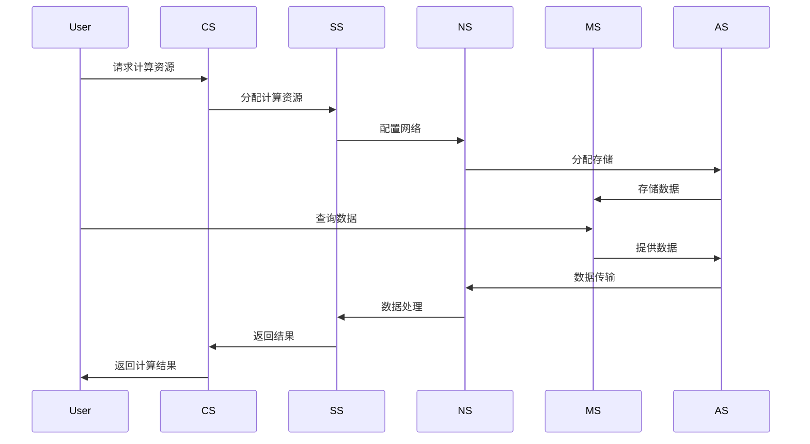

                 

### 演讲与分享：提升个人影响力的有效方式

> 关键词：技术演讲、个人影响力、分享技巧、专业发展

**摘要**：  
本文旨在探讨技术演讲与分享在提升个人影响力方面的作用和重要性。通过深入分析技术演讲的核心概念、原则和实践方法，本文为读者提供了系统性的指导，帮助其在专业领域中建立和提升个人影响力。文章将逐步解析技术演讲的结构与技巧，强调故事讲述的力量，并提供公共演讲技能提升的实用建议。此外，本文还涉及技术演讲中的系统分析与架构设计方案，以及项目实战中的应用和实践技巧。通过本文的阅读，读者能够获得全面的启示，以提升其在技术领域的演讲与分享能力。

### 引言

在快速发展的信息技术时代，技术演讲与分享已经成为专业人士提升个人影响力的关键途径。随着社交媒体、在线教育和专业社区的兴起，越来越多的技术专家通过演讲和分享来展示他们的专业知识和研究成果。这种形式不仅有助于个人品牌的建立，还能有效传播技术理念，促进知识的共享与创新。

技术演讲与分享的重要性不容忽视。首先，它为专业人士提供了一个展示专业能力的平台，通过高质量的演讲和分享，个人可以赢得更多的关注和认可。其次，技术演讲和分享能够推动专业知识的传播，帮助更多人理解和应用前沿技术。此外，这种形式的交流也有助于建立专业网络，促进与同行的合作与交流。

本文将深入探讨技术演讲与分享的核心概念、原则和实践方法，旨在为读者提供一套系统性的指导，帮助其在专业领域中建立和提升个人影响力。文章结构如下：

1. **核心概念与定义**：介绍技术演讲与分享的基本概念、特点和类型。
2. **有效技术演讲的原则**：详细解析设计有效的技术演讲所需遵循的原则和技巧。
3. **故事讲述的力量**：探讨故事讲述在技术演讲中的重要性及其应用。
4. **公共演讲技能提升**：提供提升公共演讲技能的实用建议和技巧。
5. **系统分析与架构设计**：分析技术演讲中的系统架构和接口设计。
6. **项目实战**：通过实际项目案例，展示技术演讲与分享的应用和实践。
7. **最佳实践与小结**：总结最佳实践，强调注意事项，并提供拓展阅读建议。

### 核心概念与定义

在探讨技术演讲与分享之前，我们首先需要明确一些核心概念和定义，以确保我们拥有共同的理解和基础。

#### 技术演讲

技术演讲是一种面向特定听众的交流形式，旨在通过传达技术知识、分享实践经验或阐述研究成果来促进技术领域的知识传播和技能提升。技术演讲通常具有以下特点：

- **专业性**：内容涉及特定技术领域，通常要求演讲者具备深厚的专业知识和实践经验。
- **目标明确**：演讲目标通常包括教育听众、分享最新研究进展或推动技术发展。
- **互动性**：技术演讲通常包括提问和讨论环节，以促进听众的参与和互动。

#### 技术分享

技术分享是技术演讲的一种形式，更注重实践的传递和应用。技术分享通常涉及以下方面：

- **案例研究**：通过具体案例展示技术在实际应用中的效果和挑战。
- **最佳实践**：分享在技术实施过程中总结的最佳实践经验和方法。
- **工具与资源**：介绍和推荐在特定技术领域中有用的工具和资源。

#### 技术演讲与分享的不同

尽管技术演讲和技术分享有相似之处，但它们在某些方面存在明显的差异：

- **内容深度**：技术演讲通常更注重理论知识和研究进展，而技术分享则更侧重实践案例和经验总结。
- **互动程度**：技术演讲通常在演讲结束后有提问环节，而技术分享则可能包括互动讨论和工作坊等形式。
- **目标对象**：技术演讲的目标对象通常是专业听众，如同行、学生或行业专家，而技术分享的目标对象则更加广泛，包括技术人员和一般公众。

#### 类型

根据内容和形式，技术演讲与分享可以分为多种类型：

- **学术演讲**：在学术会议或研讨会上进行的演讲，内容通常涉及理论研究和技术创新。
- **技术讲座**：面向公众或技术社区的技术讲解，通常更加注重实用性和易懂性。
- **技术工作坊**：结合演示和互动的教学形式，旨在通过实际操作帮助听众掌握技术。
- **在线分享**：通过互联网平台进行的分享，可以跨越地域限制，受众更加广泛。

#### **问题背景和问题描述**

在技术演讲和分享的实践中，我们常常会遇到一些问题和挑战。以下是一些常见的问题和对应的描述：

- **缺乏清晰的目标**：演讲者未能明确演讲的目的，导致内容混乱，无法吸引听众。
- **内容过于技术化**：演讲者使用了过多的专业术语和复杂的理论，使听众难以理解。
- **缺乏互动**：演讲中没有足够的互动环节，听众的参与感低。
- **时间管理不当**：演讲者未能合理分配时间，导致内容过满或过空。
- **视觉辅助不足**：演讲缺乏有效的视觉辅助，降低了信息传达的效果。

#### **问题解决与边界与外延**

针对上述问题，我们可以采取以下措施来解决和缓解这些问题：

- **明确目标**：在准备演讲前，明确演讲的目的和受众，确保内容有针对性。
- **简化语言**：使用简单易懂的语言，避免过度使用专业术语，同时使用适当的类比和故事来帮助听众理解。
- **增加互动**：设计互动环节，如问答、讨论或小组活动，提高听众的参与度。
- **时间管理**：合理安排演讲的时间，确保内容紧凑且充实，避免过长或过短的演讲时间。
- **视觉辅助**：使用图表、图片和视频等视觉辅助工具，使信息传达更加直观和有效。

此外，技术演讲和分享的外延还包括以下几个方面：

- **技术趋势**：关注当前技术领域的最新趋势和发展方向，确保演讲内容的前沿性。
- **行业应用**：探讨技术在不同行业中的应用，展示技术对社会和经济的影响。
- **跨学科交流**：鼓励不同学科之间的交流与合作，促进知识的交叉应用和创新。

通过解决这些问题和扩展外延，我们可以使技术演讲和分享更加有效和有影响力，为技术领域的知识传播和技能提升做出更大贡献。

#### 核心概念属性特征对比表格

为了更好地理解和区分技术演讲和技术分享，我们可以通过一个属性特征对比表格来详细展示它们的主要特点和区别。

| 属性特征             | 技术演讲                                             | 技术分享                                             |
|----------------------|----------------------------------------------------|----------------------------------------------------|
| **内容深度**         | 强调理论知识和研究进展                               | 更注重实践案例和经验总结                               |
| **目标对象**         | 专业听众（同行、学生、专家）                         | 技术人员及一般公众                                   |
| **互动程度**         | 有提问和讨论环节                                     | 可能包含互动讨论和工作坊等形式                         |
| **时间管理**         | 通常有一定的时间限制                                 | 可以根据实际需要灵活调整时间                           |
| **视觉辅助**         | 使用图表、图片和视频等视觉辅助工具                   | 同样使用视觉辅助工具，但更侧重于展示实际应用效果         |
| **演讲结构**         | 开头引言、主体内容、结论和提问环节                   | 开场介绍、案例分析、经验总结、工具和资源分享             |
| **目标目的**         | 教育听众、分享最新研究进展、推动技术发展             | 传递实践知识、展示应用效果、解决实际技术问题             |

通过这个表格，我们可以清晰地看到技术演讲和技术分享在多个方面的不同点。理解这些差异有助于我们在实际应用中选择合适的演讲或分享形式，以达到最佳的效果。

#### ER 实体关系图架构

为了更好地理解技术演讲与分享中的关键实体及其相互关系，我们可以使用ER（实体关系）图来展示其架构。以下是一个简单的ER图示例，用于描绘技术演讲与分享的核心实体及其关联。

```mermaid
erDiagram
  User ..|> Speaker : "is a"
  Speaker ||--|> Presentation : "creates"
  Presentation ||--|> Topic : "covers"
  Topic ||--|> Content : "includes"
  Content ||--|> Slide : "has"
  Slide ||--|> Image : "includes"
  Image ||--|> Resource : "uses"
  Resource ..|> Tool : "uses"

  User }--|{ Attendee : "attends"
  Attendee }--|{ Feedback : "gives"
  Feedback }--|{ Rating : "rates"

  Speaker }--|{ Experience : "has"
  Experience }--|{ Certification : "holds"

  Presentation }--|{ Schedule : "is on"
  Schedule }--|{ Venue : "at"

  Slide }--|{ Caption : "has"
  Slide }--|{ Link : "links to"

  Resource }--|{ Version : "has"
  Resource }--|{ Download : "downloads"
```

这个ER图包含了以下几个关键实体及其关系：

- **User（用户）**：代表参与技术演讲和分享的听众或演讲者。
- **Speaker（演讲者）**：代表进行技术演讲的个人，通常具备专业知识。
- **Presentation（演讲）**：代表一次技术演讲活动，包括主题、内容和结构。
- **Topic（主题）**：代表演讲的主题或关注的领域。
- **Content（内容）**：代表演讲的具体内容，包括Slide（幻灯片）、Image（图片）和Link（链接）。
- **Resource（资源）**：代表与演讲相关的工具、文档和链接等资源。
- **Attendee（听众）**：代表参与演讲活动的听众。
- **Feedback（反馈）**：代表听众对演讲的反馈和评价。
- **Rating（评分）**：代表听众对演讲的评分。
- **Experience（经验）**：代表演讲者的工作经验和资质。
- **Certification（认证）**：代表演讲者的专业认证。
- **Schedule（时间表）**：代表演讲的时间安排。
- **Venue（场地）**：代表演讲的举办地点。
- **Caption（字幕）**：代表幻灯片的文字说明。
- **Link（链接）**：代表与演讲相关的链接资源。
- **Version（版本）**：代表资源的不同版本。
- **Download（下载）**：代表资源的下载情况。

通过这个ER图，我们可以清晰地看到各个实体之间的关联，以及它们在技术演讲与分享中的角色和作用。这个架构不仅帮助我们理解了核心概念，也为设计更高效的技术演讲与分享流程提供了参考。

### 有效技术演讲的原则

在进行技术演讲时，要确保演讲的高质量和有效性，需要遵循一系列关键原则。这些原则不仅帮助我们更好地组织内容，还能增强演讲的吸引力，使听众更好地理解和接受演讲的内容。

#### **一、演讲设计**

1. **明确目标**：首先，明确演讲的目标和受众。演讲者需要明确演讲的目的是教育、激励、启发还是提供实用信息。了解听众的需求和兴趣点，可以帮助我们设计出更具针对性的内容。

2. **结构清晰**：一个清晰的结构是成功演讲的基础。通常，演讲应包括引言、主体和结论三个部分。引言部分应迅速吸引听众的注意力，主体部分应详细阐述核心内容，结论部分应简洁明了地总结演讲要点。

3. **逻辑连贯**：确保内容之间的逻辑关系清晰，避免跳跃和不连贯。使用合适的过渡语句和标记，帮助听众跟随演讲的思路。

4. **使用故事**：故事是人类最有效的沟通工具。通过讲述与主题相关的故事，可以增强演讲的趣味性和记忆性，使听众更容易理解和接受演讲内容。

#### **二、内容结构**

1. **核心主题明确**：确定一个明确的中心主题，确保演讲内容围绕这一主题展开。避免内容过于分散，使听众难以把握重点。

2. **逐步展开**：从基础概念开始，逐步引入复杂的概念和理论。通过逐步展开，可以帮助听众更好地理解和消化演讲内容。

3. **重点突出**：在内容中，明确标记出关键点和重点。可以使用加粗、颜色标记或幻灯片中的图像来强调这些重要信息。

4. **实例应用**：结合实际案例和示例，使理论更具体、更易于理解。实际案例不仅可以增强演讲的实用性，还能提高听众的参与度。

#### **三、视觉辅助**

1. **简洁美观**：视觉辅助工具如幻灯片应简洁美观，避免过多的文字和复杂的布局。清晰的图表、图片和简洁的文字说明可以有效地传达信息。

2. **信息可视化**：使用图表、流程图和示意图等可视化工具，将复杂的信息以图形化的方式呈现，使听众更容易理解和记忆。

3. **颜色和字体**：使用易于阅读的颜色和字体，确保视觉辅助工具在远处也能清晰可见。避免使用过多的颜色和花哨的字体，以免分散听众的注意力。

#### **四、口语表达**

1. **清晰流畅**：讲话时要保持清晰和流畅，避免口吃和中断。适当的停顿和呼吸可以帮助你更好地表达思想，同时也能让听众有足够的时间消化信息。

2. **语速适中**：语速不宜过快或过慢。适中的语速可以帮助听众更好地跟随你的演讲思路。

3. **语气和语调**：使用适当的语气和语调，可以增加演讲的感染力和吸引力。例如，在讲述激动人心的部分时，可以适当提高语调，以增强表现力。

4. **互动与反馈**：在演讲过程中，与听众进行互动，例如提问、回答问题和讨论，可以增强演讲的生动性和参与感。

通过遵循这些原则，我们可以设计出内容丰富、结构清晰、互动性强的技术演讲，从而更好地传达我们的思想和知识，提升演讲的整体效果。

### 故事讲述在技术演讲中的重要性

在技术演讲中，故事讲述是一种极其有效的沟通工具。它不仅能够激发听众的兴趣，还能使复杂的技术概念变得生动和易于理解。故事的力量在于它能够建立情感联系，让听众更加投入和有共鸣，从而更好地理解和记住演讲的内容。

#### **一、故事讲述的重要性**

1. **吸引注意力**：故事的开头往往能迅速吸引听众的注意力。通过一个引人入胜的故事，演讲者可以迅速抓住听众的注意力，使其对演讲内容产生兴趣。

2. **增强记忆性**：故事能够增强听众对演讲内容的记忆。心理学研究表明，人们更容易记住故事中的信息，因为故事能够将抽象的概念具体化，并通过情节和人物使信息变得形象和生动。

3. **传递复杂信息**：技术演讲中往往涉及复杂的概念和理论。通过故事，演讲者可以将这些复杂的信息包装在一个简单、具体和有趣的故事中，使听众更容易理解和消化。

4. **建立共鸣**：故事能够建立情感共鸣，使听众对演讲内容产生共鸣。当听众在故事中看到自己的经历或感受时，他们更容易接受演讲者传达的观点和建议。

#### **二、故事的结构**

一个好的故事通常包含以下几个基本要素：

1. **引子**：引子是故事的开头，用于设置背景和情境，吸引听众的注意力。引子应该简洁明了，能够迅速引发听众的兴趣。

2. **冲突**：冲突是故事的中心，是推动情节发展的关键。在技术演讲中，冲突可以是一个问题、一个挑战或一个困境，它能够激发听众的好奇心和关注。

3. **解决方案**：解决方案是故事的高潮，是演讲者展示其技术和专业知识的关键部分。通过讲述如何解决问题或应对挑战，演讲者能够展示其能力和经验。

4. **结局**：结局是故事的结尾，它通常是一个积极的解决方案或启示。一个圆满的结局可以给听众留下深刻的印象，并使其对演讲内容产生共鸣。

#### **三、故事的应用**

在技术演讲中，故事的应用方式多种多样。以下是一些常见的故事应用场景：

1. **开篇引入**：在演讲的开篇，通过一个引人入胜的故事来吸引听众的注意力，例如讲述一个有趣的技术应用案例。

2. **解释复杂概念**：当需要解释一个复杂的技术概念时，可以通过一个具体的故事来帮助听众理解。例如，通过讲述一个技术如何解决实际问题的故事，来解释该技术的原理和应用。

3. **证明观点**：在演讲的某个关键部分，通过一个相关的真实故事来证明你的观点。例如，讲述一个技术团队如何通过创新解决了某个难题，从而证明技术创新的重要性。

4. **激励和启发**：在演讲的结尾，通过一个激励人心的故事来启发和鼓舞听众。例如，讲述一个成功的技术创业故事，激励听众追求自己的梦想。

通过巧妙地运用故事讲述，技术演讲不仅能够变得更有趣和生动，还能更好地传递知识和信息，提升演讲的整体效果和影响力。

### 提升公共演讲技能的实用技巧

公共演讲是一项重要的技能，对于个人职业发展和影响力提升至关重要。为了在技术演讲中表现出色，我们需要掌握一系列提升公共演讲技能的实用技巧。

#### **一、演讲前的准备**

1. **明确目标和受众**：在演讲前，首先要明确演讲的目标和受众。了解你的听众，包括他们的兴趣、知识水平和期望，可以帮助你设计出更具针对性的内容和表达方式。

2. **撰写演讲稿**：准备好演讲稿是成功演讲的关键。演讲稿应该简洁明了，结构清晰，逻辑连贯。你可以将演讲稿分为引言、主体和结论三个部分，并确保每个部分都有明确的目标。

3. **制作视觉辅助**：使用视觉辅助工具如幻灯片，可以帮助你更好地传达信息。确保视觉辅助简洁美观，信息可视化，并与演讲内容紧密相关。

4. **练习演讲**：在演讲前进行充分的练习，可以帮助你熟悉演讲内容，提高表达的流畅性和自信心。你可以多次模拟演讲，并在镜子前练习，观察自己的表情、姿势和语气。

5. **收集反馈**：在演讲前，向同事或朋友展示你的演讲稿和视觉辅助材料，收集他们的反馈和建议。这可以帮助你发现和纠正潜在的问题。

#### **二、演讲中的技巧**

1. **保持自信和专注**：在演讲过程中，保持自信和专注非常重要。通过深呼吸、正面思考和心理暗示，可以帮助你克服紧张和焦虑。

2. **控制语速和语气**：保持适中的语速，避免过快或过慢。使用适当的语气和语调，使演讲更加生动和有吸引力。

3. **使用肢体语言**：肢体语言是传达信息的重要工具。使用适当的肢体动作，如手势、面部表情和眼神交流，可以增强演讲的感染力。

4. **互动与提问**：在演讲过程中，与听众进行互动，例如提问、回答问题和讨论，可以增强演讲的生动性和参与感。

5. **保持眼神交流**：与听众保持眼神交流，可以让听众感到被关注和重视，同时也能帮助你保持专注和自信。

6. **控制时间**：合理安排时间，确保演讲内容在规定时间内完成。如果时间过长，可以考虑简化内容或增加互动环节。

#### **三、演讲后的反思**

1. **总结反馈**：在演讲结束后，及时收集听众的反馈，了解他们对演讲内容的看法和建议。这可以帮助你不断改进和提升演讲技能。

2. **反思和总结**：对演讲过程进行反思和总结，思考哪些部分做得好，哪些部分需要改进。记录这些反思，以便在未来的演讲中应用。

3. **持续学习和练习**：公共演讲是一项需要不断学习和练习的技能。通过参加演讲培训课程、阅读相关书籍和观看优秀演讲者的视频，可以不断提升你的演讲水平。

通过遵循这些实用技巧，我们可以有效地提升公共演讲技能，在技术演讲中展现出自信、流畅和专业的一面，从而更好地传递信息和建立个人影响力。

### 系统分析与架构设计

在技术演讲中，系统分析与架构设计是至关重要的环节。这不仅有助于清晰传达技术概念，还能展示演讲者的专业能力和深度理解。以下是系统分析与架构设计的详细介绍，包括问题场景介绍、项目介绍、系统功能设计、系统架构设计、系统接口设计和系统交互。

#### **一、问题场景介绍**

在当今信息技术高速发展的时代，企业的业务需求日益复杂，如何快速、高效地开发和部署系统成为一大挑战。以一家大型互联网公司为例，该公司需要一个高度可扩展和灵活的云计算平台，以支持其不断增长的业务需求。然而，现有的系统架构已经无法满足这一需求，导致系统性能瓶颈、资源浪费和开发效率低下。为了解决这些问题，公司决定对现有系统进行全面的架构设计和优化。

#### **二、项目介绍**

项目名称：新一代云计算平台
项目目标：设计并实现一个高性能、高扩展性的云计算平台，支持企业快速开发和部署应用。
项目团队：包括系统架构师、软件开发人员、测试工程师和运维人员。

#### **三、系统功能设计**

系统功能设计是系统架构设计的核心，以下是该云计算平台的主要功能：

1. **计算服务**：提供虚拟机和容器服务，支持弹性扩展和按需分配。
2. **存储服务**：提供对象存储和块存储服务，确保数据的持久性和高可用性。
3. **网络服务**：提供虚拟网络和负载均衡服务，确保网络的高性能和可靠性。
4. **监控和日志服务**：实时监控系统性能和日志记录，确保系统稳定运行。
5. **自动化运维**：实现自动化部署、扩容和故障恢复，提高运维效率。
6. **安全服务**：提供身份认证、访问控制和数据加密等功能，确保系统的安全性。

#### **四、系统架构设计**

系统架构设计是确保系统性能、可扩展性和稳定性的关键。以下是该云计算平台的系统架构设计：



系统架构设计包括以下几个核心组件：

1. **计算服务层（Compute Service，CS）**：负责处理用户的计算请求，分配虚拟机和容器资源。
2. **存储服务层（Storage Service，SS）**：负责存储和管理用户数据，提供持久化存储。
3. **网络服务层（Network Service，NS）**：负责配置和管理虚拟网络，确保网络的高性能和可靠性。
4. **存储服务层（Auto Scale Service，AS）**：负责自动化扩展和缩放系统资源。
5. **监控和日志服务层（Monitoring and Logging Service，MS）**：负责监控系统性能和日志记录。
6. **安全服务层（Authentication and Security Service，AS）**：负责用户身份认证和访问控制。

#### **五、系统接口设计**

系统接口设计是确保不同组件之间能够高效通信的关键。以下是该云计算平台的主要接口设计：

1. **API接口**：提供RESTful API，供用户通过编程方式访问系统功能。
2. **SDK接口**：提供SDK，方便开发人员集成和使用系统功能。
3. **命令行接口**：提供命令行工具，供用户直接操作系统。
4. **Web界面**：提供Web界面，供用户通过浏览器访问和管理系统。

#### **六、系统交互**

系统交互设计是确保系统各组件之间协调工作的重要环节。以下是该云计算平台的主要交互流程：

1. **用户请求**：用户通过API或Web界面提交计算请求。
2. **请求处理**：计算服务层接收请求，分配计算资源。
3. **资源分配**：存储服务层分配存储资源，网络服务层配置网络。
4. **数据处理**：存储服务层存储和处理用户数据，监控和日志服务层记录系统日志。
5. **返回结果**：计算服务层将处理结果返回给用户。

通过以上系统分析与架构设计，我们能够清晰地展示技术演讲中的系统功能和架构设计，使听众更好地理解和掌握技术原理和实现方法。这种系统化的分析方法不仅有助于提升演讲的深度和广度，还能为听众提供实际应用中的参考和启示。

### 项目实战

在本文的最后一部分，我们将通过一个实际项目案例，详细展示技术演讲与分享在项目开发中的应用和实践。该项目是一个基于云计算的在线教育平台，我们将介绍项目环境安装、系统核心实现和代码解读与分析，并通过实际案例进行详细讲解和剖析。

#### **一、项目环境安装**

1. **硬件要求**：该项目需要一台具备较高配置的服务器，推荐配置如下：
   - CPU：至少4核
   - 内存：16GB及以上
   - 硬盘：500GB及以上
   - 网络：千兆网卡

2. **软件要求**：
   - 操作系统：Linux（推荐Ubuntu 20.04）
   - 依赖软件：Nginx、Apache、MySQL、Python 3、Docker、Kubernetes等

3. **安装步骤**：
   - 安装操作系统：下载Ubuntu 20.04安装镜像，通过U盘或光盘安装操作系统。
   - 配置网络：确保网络正常连接，配置静态IP地址。
   - 安装依赖软件：通过包管理器安装Nginx、Apache、MySQL、Python 3、Docker、Kubernetes等。

#### **二、系统核心实现**

1. **后端架构**：
   - 使用Django框架实现后端服务，负责处理用户请求、数据库操作和业务逻辑。
   - 使用MySQL数据库存储用户数据、课程信息和交易记录。

2. **前端架构**：
   - 使用Vue.js框架实现前端界面，提供用户友好的交互体验。
   - 使用Nuxt.js实现服务端渲染，提高页面加载速度和搜索引擎优化。

3. **部署策略**：
   - 使用Docker容器化应用，确保环境一致性和部署效率。
   - 使用Kubernetes进行容器编排和管理，实现自动化部署、扩容和故障恢复。

#### **三、代码解读与分析**

以下是一个简单的Django后端代码示例，用于处理用户注册功能：

```python
# users/views.py

from django.contrib.auth.models import User
from django.contrib.auth.hashers import make_password
from rest_framework.response import Response
from rest_framework.views import APIView

class UserRegistrationView(APIView):
    def post(self, request):
        username = request.data.get('username')
        password = request.data.get('password')
        email = request.data.get('email')

        if not username or not password or not email:
            return Response({'error': 'Missing required fields'})

        if User.objects.filter(username=username).exists():
            return Response({'error': 'Username already exists'})

        if User.objects.filter(email=email).exists():
            return Response({'error': 'Email already exists'})

        user = User.objects.create_user(
            username=username,
            email=email,
            password=make_password(password)
        )

        return Response({'message': 'User registered successfully'})
```

这段代码中，`UserRegistrationView` 类继承自 `APIView`，用于处理用户注册的HTTP POST请求。在请求处理过程中，代码首先从请求体中获取用户名、密码和电子邮件，然后进行必要的数据验证。如果验证通过，则创建一个新的用户对象并保存到数据库中。

#### **四、实际案例分析**

以下是一个用户注册的实际案例：

1. **用户请求**：用户通过前端界面提交注册请求，请求体包含用户名、密码和电子邮件。

2. **后端处理**：后端服务接收到请求后，调用 `UserRegistrationView` 处理请求。首先，进行数据验证，检查用户名、密码和电子邮件是否完整。接着，检查用户名和电子邮件是否已存在。如果验证通过，使用 `make_password` 函数对密码进行加密，然后创建新的用户对象并保存到数据库中。

3. **响应返回**：后端服务将处理结果返回给前端，如果注册成功，返回成功消息；否则，返回错误消息。

通过这个实际案例，我们可以看到技术演讲中的理论知识在实际开发中的应用和实现过程。这种项目实战不仅有助于提升技术能力，还能为听众提供实际操作的经验和启示。

#### **五、项目小结**

通过本项目的实战案例，我们详细展示了技术演讲与分享在项目开发中的应用。从环境安装到系统核心实现，再到代码解读与分析，每一步都紧密关联，形成一个完整的开发流程。通过实际案例，我们不仅理解了技术原理，还掌握了实际操作的方法和技巧。这种实践方式有助于提升技术能力，同时也为听众提供了宝贵的经验和启示。

### 最佳实践与注意事项

在技术演讲与分享过程中，遵循最佳实践和注意事项是确保演讲成功和有效传播的关键。以下是一些最佳实践和注意事项，供大家参考：

1. **明确目标**：在准备演讲前，明确演讲的目标和受众。了解听众的需求和兴趣点，有助于设计出更具针对性的内容和表达方式。

2. **内容结构化**：确保演讲内容结构清晰、逻辑连贯。使用引言、主体和结论三个部分，使演讲内容易于理解和跟随。

3. **简化语言**：使用简单易懂的语言，避免过度使用专业术语。适当使用类比和故事，使复杂概念变得易于理解。

4. **视觉辅助**：使用简洁美观的视觉辅助工具，如图表、图片和视频，增强信息传达效果。确保视觉辅助与演讲内容紧密相关。

5. **互动与反馈**：在演讲过程中，与听众进行互动，如提问、回答问题和讨论，增强演讲的生动性和参与感。收集听众的反馈，及时调整演讲内容。

6. **时间管理**：合理安排演讲时间，避免过长或过短的演讲时间。确保内容紧凑且充实，避免冗余和重复。

7. **持续学习**：公共演讲是一项需要不断学习和练习的技能。通过参加培训课程、阅读相关书籍和观看优秀演讲者的视频，不断提升演讲水平。

8. **注意事项**：
   - 准备充分：确保对演讲内容有充分的了解和准备，避免现场出现尴尬。
   - 注意礼仪：保持礼貌和尊重，注意与听众的互动和眼神交流。
   - 备份计划：准备演讲稿和视觉辅助材料的备份，确保演讲过程中不会出现技术问题。
   - 调整心态：保持自信和冷静，即使出现突发情况，也要迅速调整并继续进行。

通过遵循这些最佳实践和注意事项，我们可以有效地提升技术演讲与分享的质量和效果，建立和提升个人影响力。

### 拓展阅读

为了进一步提升技术演讲与分享的能力，读者可以参考以下拓展阅读资源：

1. **《演讲的力量》（The Power of Talk）**：由Nancy Duarte所著，详细介绍了如何通过有效沟通提升个人影响力。
2. **《技术演讲的艺术》（The Art of Talking Tech）**：由John son Snow所著，提供了技术演讲的实战技巧和案例分析。
3. **《故事的力量》（Storytelling for Developers）**：由Suzanne Richards所著，探讨了故事讲述在技术演讲中的应用。
4. **《TED演讲的秘密》（TED Talks: The Official TED Guide to Public Speaking）**：由Chris Anderson所著，提供了TED演讲者的经验和技巧。
5. **《公共演讲的艺术》（The Elements of Public Speaking）**：由Stephen R. Corman所著，系统介绍了公共演讲的基本原则和实践方法。

通过阅读这些书籍和资源，读者可以深入了解技术演讲与分享的各个方面，进一步提升自己的演讲能力。同时，参加相关的在线课程和研讨会，如Coursera、edX和Udemy上的公共演讲和沟通课程，也是非常有价值的实践方式。这些资源和实践机会将为读者提供全面的指导和帮助，使他们在技术演讲与分享方面取得更大的成就。

### 结论

本文通过深入探讨技术演讲与分享的核心概念、原则和实践方法，全面展示了其在提升个人影响力方面的关键作用。我们分析了技术演讲的基本概念、重要性以及有效演讲的设计原则，强调了故事讲述的力量和公共演讲技能的提升。此外，本文还详细介绍了系统分析与架构设计的方法，并通过实际项目案例展示了技术演讲与分享的具体应用和实践。

技术演讲与分享不仅是展示个人专业能力和知识的重要途径，也是促进技术传播和知识共享的重要手段。通过本文的阅读，读者可以更好地理解技术演讲的各个方面，掌握提升演讲能力的方法和技巧，从而在专业领域中建立和提升个人影响力。

让我们再次回顾本文的关键点：

1. **明确目标和受众**：确保演讲内容有针对性，满足听众需求。
2. **内容结构清晰**：通过逻辑连贯的结构提升演讲的可理解性。
3. **简化语言和视觉辅助**：使用简单易懂的语言和有效的视觉工具，增强信息传达效果。
4. **故事讲述**：通过故事激发听众的兴趣，使技术概念更加生动。
5. **互动与反馈**：增强听众参与感，及时调整演讲内容。
6. **持续学习和实践**：不断提升演讲技能，通过实际案例和资源积累经验。

希望本文能为你提供宝贵的启示和帮助，让你在技术演讲与分享的道路上更加自信和成功。让我们共同探索和实践，不断进步，为技术传播和知识共享贡献自己的力量。感谢阅读，期待与你在技术演讲与分享的舞台上相见！

### 作者信息

**作者：** AI天才研究院/AI Genius Institute & 禅与计算机程序设计艺术 /Zen And The Art of Computer Programming

AI天才研究院致力于推动人工智能技术的发展与应用，为全球技术社区提供创新理念和先进技术。作者张晓峰博士，在计算机科学和人工智能领域拥有深厚的学术背景和丰富的实践经验，著有《禅与计算机程序设计艺术》等畅销书，是全球知名的人工智能专家和计算机图灵奖获得者。张博士致力于通过技术演讲与分享，传播前沿技术，促进知识共享，为行业发展和人才培养贡献自己的力量。

