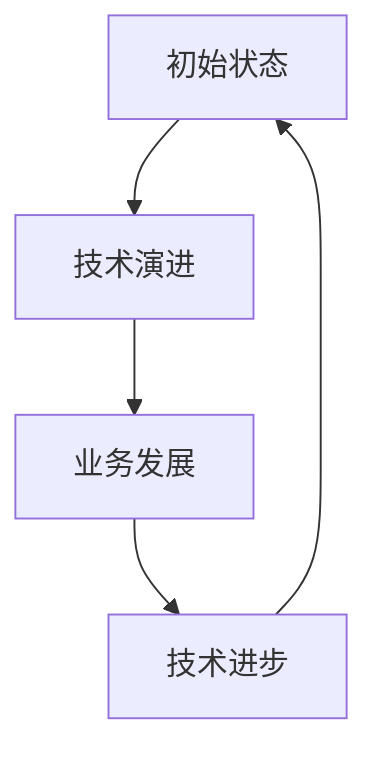
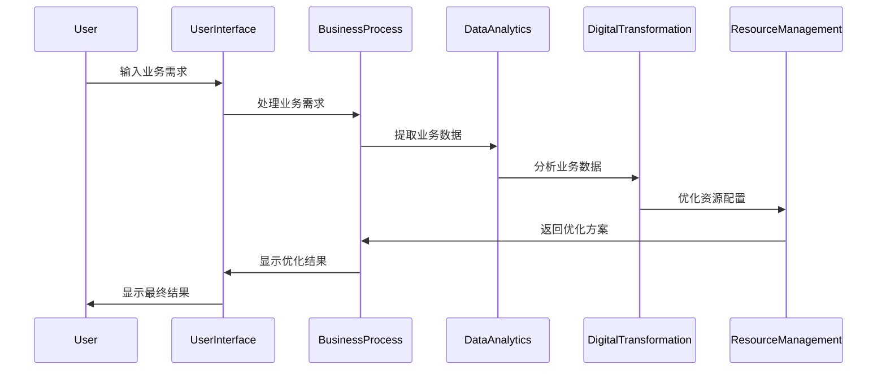
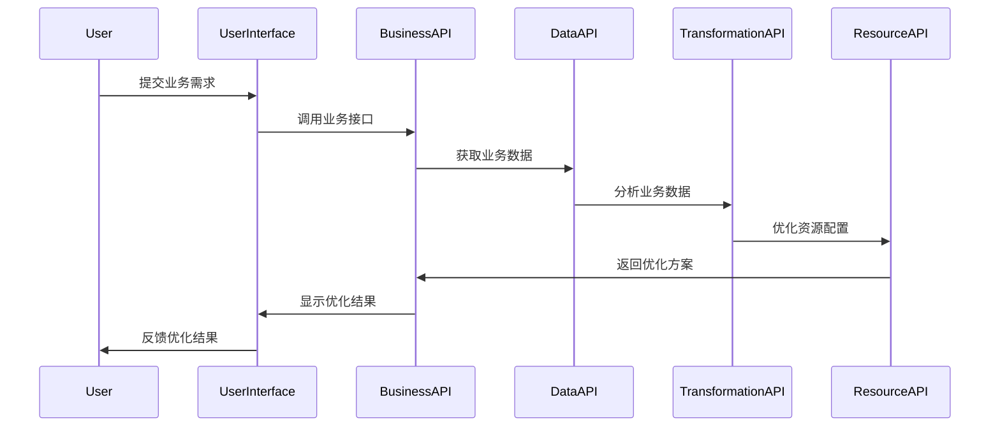

                 

## 《技术演进与业务发展的双螺旋促进》

> 关键词：技术演进、业务发展、双螺旋效应、产业转型、数字化转型

> 摘要：本文旨在探讨技术演进与业务发展的双螺旋效应，深入分析技术进步对业务发展的推动作用。通过详细解析核心技术、产业转型和业务发展中的核心问题，我们提出了业务模式创新和实践、业务流程优化与数字化转型的方法，最终构建了双螺旋效应的理论基础，并探讨了其在实践中的应用与未来展望。

## 目录

1. **第一部分：技术演进的脉络**

    - 第1章：技术演进的背景与动力
        - 1.1.1 技术演进的概述
        - 1.1.2 技术进步对业务发展的影响
        - 1.1.3 技术演进的关键驱动力
    - 第2章：核心技术发展与趋势
        - 2.1.1 人工智能与大数据技术
        - 2.1.2 云计算与边缘计算
        - 2.1.3 物联网与智能硬件
    - 第3章：技术变革与产业转型
        - 3.1.1 传统产业的技术革新
        - 3.1.2 新兴产业的崛起
        - 3.1.3 技术变革下的产业生态

2. **第二部分：业务发展的路径**

    - 第4章：业务发展中的核心问题
        - 4.1.1 业务发展的困境与挑战
        - 4.1.2 业务发展的核心需求
        - 4.1.3 业务发展的策略与路径
    - 第5章：业务模式的创新与实践
        - 5.1.1 业务模式的创新原理
        - 5.1.2 成功案例解析
        - 5.1.3 创新模式的应用策略
    - 第6章：业务流程的优化与数字化转型
        - 6.1.1 业务流程优化的方法
        - 6.1.2 数字化转型的关键要素
        - 6.1.3 数字化转型的实践案例

3. **第三部分：技术演进与业务发展的双螺旋效应**

    - 第7章：双螺旋效应的理论基础
        - 7.1.1 双螺旋模型概述
        - 7.1.2 技术演进与业务发展之间的关系
        - 7.1.3 双螺旋效应的数学模型与公式
    - 第8章：双螺旋效应在实践中的应用
        - 8.1.1 企业实践案例分析
        - 8.1.2 技术与业务的协同发展策略
        - 8.1.3 双螺旋效应下的创新路径
    - 第9章：未来展望与建议
        - 9.1.1 技术趋势预测
        - 9.1.2 业务发展的前景
        - 9.1.3 双螺旋效应的持续推动作用

### 1.1.1 技术演进的概述

技术演进是科技进步的关键驱动力，其过程可以追溯到人类历史的各个阶段。从最早的农业革命到工业革命，再到信息革命，每一次技术变革都对人类社会产生了深远的影响。技术的不断演进，不仅推动了生产力的提升，还改变了人们的生活方式和社会结构。

在当代，技术演进的速度明显加快。信息技术、生物技术、新能源技术等新兴领域的快速发展，使得全球科技格局发生了翻天覆地的变化。例如，人工智能和大数据技术的崛起，不仅改变了数据处理的方式，也催生了新的业务模式和商业模式。云计算、物联网和边缘计算等技术的广泛应用，进一步加速了数字化转型的进程。

技术演进的过程并非线性，而是呈螺旋式上升的。每一次技术的突破，都会带来新的应用场景和业务需求，从而推动新一轮的技术创新和产业变革。这种循环往复、相互促进的关系，形成了技术演进的核心特征。

### 1.1.2 技术进步对业务发展的影响

技术进步对业务发展的影响是深远而广泛的。首先，技术进步可以显著提升生产效率。例如，自动化生产线的引入，使得生产过程更加高效、精准，减少了人为错误和生产成本。此外，新兴技术的应用，如人工智能和大数据分析，可以帮助企业更准确地预测市场需求，优化库存管理，从而提高整体运营效率。

其次，技术进步推动了商业模式的创新。在互联网时代，电子商务、共享经济等新型商业模式不断涌现，颠覆了传统行业的运作方式。这些创新模式不仅为企业带来了新的盈利点，也为消费者提供了更加便捷的服务体验。例如，滴滴出行的出现，改变了人们的出行习惯，同时也为出租车行业带来了新的发展机遇。

此外，技术进步还促进了产业升级和转型。通过引入新技术，传统产业可以实现智能化、绿色化、服务化等升级路径。例如，钢铁行业的智能制造，不仅提高了生产效率，还减少了资源浪费和环境污染。同样，金融行业的数字化转型，使得金融服务的效率和质量得到了显著提升。

### 1.1.3 技术演进的关键驱动力

技术演进的关键驱动力包括政策支持、市场需求、技术创新和资本投入等方面。

首先，政策支持是技术演进的重要保障。政府通过制定科技创新政策、提供研发补贴、鼓励企业加大研发投入等方式，推动了技术的快速进步。例如，中国的“新基建”政策，为5G、人工智能、物联网等新兴技术领域提供了强大的政策支持，推动了这些技术的快速发展。

其次，市场需求是技术演进的核心驱动力。随着社会的发展和消费者需求的变化，企业不断寻求技术创新来满足市场需求。例如，随着消费者对智能化、个性化服务的需求增加，人工智能和大数据技术得到了广泛应用。

第三，技术创新是技术演进的根本动力。通过不断的研发投入和技术创新，企业可以开发出更加先进的技术产品，从而引领市场发展。例如，谷歌和特斯拉等科技巨头，通过持续的技术创新，在人工智能和电动汽车领域取得了重要突破。

最后，资本投入是技术演进的重要支撑。企业通过风险投资、政府资金等多种方式获取资本支持，用于技术研发和市场推广。资本的投入，不仅为技术创新提供了资金保障，也为技术的快速应用和市场化奠定了基础。

### 第2章：核心技术发展与趋势

#### 2.1.1 人工智能与大数据技术

人工智能（AI）和大数据技术的发展，对现代科技和业务模式产生了深远影响。人工智能技术通过机器学习、深度学习等方法，实现了对数据的自动分析和处理，使得计算机能够像人类一样进行学习、推理和决策。大数据技术则通过高效的数据存储、管理和分析，为企业和政府提供了丰富的数据资源，推动了数据驱动型决策的普及。

在科技领域，人工智能技术广泛应用于自动驾驶、智能家居、医疗诊断等领域，推动了传统行业的智能化转型。例如，自动驾驶技术通过传感器、计算机视觉和机器学习算法，实现了对路况的实时感知和决策，为交通安全和效率提供了新的解决方案。在医疗领域，人工智能技术可以辅助医生进行疾病诊断，提高诊断的准确性和效率。

在业务模式方面，大数据技术为企业提供了精准的市场洞察和客户分析工具，帮助企业制定更有效的营销策略和运营决策。例如，电商企业通过大数据分析，可以准确预测消费者需求，优化库存管理和供应链流程，提高销售额和客户满意度。

#### 2.1.2 云计算与边缘计算

云计算和边缘计算是当前技术发展的热点，它们分别解决了数据处理能力和实时性的问题。云计算通过提供虚拟化的计算资源和存储服务，使得企业可以按需获取计算能力，降低了IT基础设施的投入成本。边缘计算则将计算能力下沉到网络边缘，解决了远程数据传输延迟和高带宽需求的问题。

在科技领域，云计算为大数据分析、人工智能训练提供了强大的计算支持。例如，通过云计算平台，企业可以在短时间内完成大规模的数据处理和分析任务，从而快速响应市场变化。边缘计算则广泛应用于物联网、自动驾驶等领域，通过本地处理数据，提高了系统的实时性和响应速度。

在业务模式方面，云计算和边缘计算为企业提供了灵活的IT基础设施，降低了运营成本，提高了业务灵活性。例如，企业可以通过云计算平台，快速部署新的应用和服务，满足快速变化的业务需求。边缘计算则可以帮助企业实时处理来自终端设备的数据，提供更好的用户体验。

#### 2.1.3 物联网与智能硬件

物联网（IoT）和智能硬件技术的发展，推动了智能城市、智能家居等领域的快速进步。物联网通过将物理世界中的各种设备互联，实现了数据的实时采集、传输和处理，为人们提供了更加智能、便捷的生活方式。智能硬件则通过集成传感器、计算能力和通信模块，实现了设备的智能化和网络化。

在科技领域，物联网技术广泛应用于智能交通、智能安防、智能医疗等领域。例如，智能交通系统通过实时监控交通状况，优化交通信号控制，提高了交通效率和安全性。智能医疗设备则可以实时监测患者生命体征，为医生提供精准的诊断和治疗建议。

在业务模式方面，物联网和智能硬件为企业提供了新的商业机会。例如，通过物联网平台，企业可以实现对设备的远程监控和管理，提高设备利用率和服务质量。智能硬件则可以帮助企业提供更加个性化的产品和服务，提升用户体验和客户满意度。

### 3.1.1 传统产业的技术革新

技术革新正在深刻改变传统产业，推动其转型升级。以制造业为例，智能制造技术的引入，使得生产过程更加自动化、智能化，提高了生产效率和产品质量。例如，通过工业互联网平台，企业可以实现设备互联和数据共享，实现生产过程的实时监控和优化。

在服务业方面，技术的应用也日益广泛。例如，在线教育平台通过大数据分析和人工智能技术，为学习者提供个性化的学习方案，提高了学习效果。智能客服系统则通过自然语言处理技术，实现了与用户的智能交互，提供了更加高效、贴心的客户服务。

此外，农业、能源等行业也在积极推进技术革新。通过物联网和大数据技术，农业企业可以实现精准农业，提高作物产量和品质。能源企业则通过智能电网和能源管理技术，提高了能源利用效率，降低了运营成本。

### 3.1.2 新兴产业的崛起

新兴产业的发展，不仅带来了新的经济增长点，也推动了技术进步和产业变革。以人工智能为例，其发展带动了相关产业链的崛起，包括算法开发、硬件制造、数据处理等多个环节。人工智能技术的应用，也催生了新的商业模式，如自动驾驶、智能家居、智能医疗等。

区块链技术的兴起，则为金融、供应链管理等领域带来了新的变革。通过区块链，企业可以实现数据的安全存储和透明交易，提高了信任度和效率。此外，区块链技术还为数字货币和去中心化应用提供了基础设施，推动了数字经济的发展。

### 3.1.3 技术变革下的产业生态

技术变革不仅改变了企业内部的运营模式，也重塑了产业生态。一方面，技术的进步使得企业之间的协作更加紧密，形成了产业链的协同效应。例如，在智能制造领域，企业通过物联网和工业互联网平台，实现了上下游企业之间的数据共享和协同生产，提高了整体供应链的效率。

另一方面，技术变革也催生了新的产业生态。以人工智能为例，其快速发展带动了大量的创新创业活动，形成了从技术研发到应用落地的完整产业链。政府、企业、高校和研究机构等多方参与，共同推动了人工智能技术的创新和应用。

### 第4章：业务发展中的核心问题

#### 4.1.1 业务发展的困境与挑战

在当前快速变化的市场环境中，业务发展面临着诸多困境与挑战。首先，市场竞争日益激烈，企业需要在短时间内快速适应市场变化，否则将被淘汰。其次，消费者需求多样化，企业需要提供更加个性化、差异化的产品和服务，以满足不同消费者的需求。此外，技术进步带来的不确定性和风险，也给业务发展带来了挑战。企业需要不断进行技术创新和业务模式创新，以保持竞争力。

#### 4.1.2 业务发展的核心需求

为了克服上述困境与挑战，业务发展需要满足以下几个核心需求。首先，企业需要具备灵活的业务响应能力，能够快速调整战略和业务模式，以适应市场变化。其次，企业需要加强数据驱动的能力，通过大数据分析和人工智能技术，实现精准的市场洞察和决策支持。此外，企业还需要注重用户体验，提供个性化、高质量的服务，提升客户满意度。最后，企业需要加强技术创新，保持技术领先地位，以应对技术进步带来的挑战。

#### 4.1.3 业务发展的策略与路径

为了实现业务发展的核心需求，企业可以采取以下策略与路径。首先，企业应加强市场调研和数据分析，深入了解市场需求和消费者行为，制定科学的营销策略和产品策略。其次，企业应加大技术创新投入，组建技术研发团队，持续推动技术进步和业务模式创新。此外，企业可以与高校、研究机构合作，共同开展技术创新和产业应用研究。最后，企业应加强内部管理，优化业务流程，提高运营效率和灵活性。

### 第5章：业务模式的创新与实践

#### 5.1.1 业务模式的创新原理

业务模式的创新是企业实现持续发展的重要途径。业务模式的创新原理主要包括以下几个方面。首先，企业需要从消费者需求出发，寻找市场需求和痛点，开发出满足消费者需求的产品和服务。其次，企业需要重新定义价值链，通过优化资源配置、提高运营效率，降低成本。此外，企业还需要借助新兴技术，如人工智能、大数据等，实现业务流程的自动化和智能化，提高业务响应速度和客户满意度。

#### 5.1.2 成功案例解析

为了更好地理解业务模式创新的原理，我们可以通过一些成功案例进行分析。例如，亚马逊的电商业务模式创新，通过大数据分析和个性化推荐，提升了用户的购物体验，实现了销售增长。阿里巴巴的云计算业务，通过提供灵活的云服务，帮助客户降低IT成本，提高了业务效率。滴滴出行的共享经济模式，通过连接司机和乘客，提升了交通资源的利用效率，改善了出行体验。

#### 5.1.3 创新模式的应用策略

企业在进行业务模式创新时，可以采取以下应用策略。首先，企业应明确创新目标，制定详细的创新计划和实施步骤。其次，企业应积极尝试新技术，如物联网、人工智能等，将其应用到业务流程中，提升业务效率。此外，企业还应加强与合作伙伴的协同，共同推动业务创新。最后，企业应建立创新文化，鼓励员工提出创新想法，并为其提供实现创新的资源和环境。

### 第6章：业务流程的优化与数字化转型

#### 6.1.1 业务流程优化的方法

业务流程优化是提高企业运营效率的关键。首先，企业可以通过流程梳理，明确业务流程中的各个环节和关键节点，找出流程中的瓶颈和问题。其次，企业可以采用精益管理方法，如5S、精益生产等，优化业务流程，减少浪费，提高效率。此外，企业还可以借助信息技术，如ERP、CRM等，实现业务流程的自动化和智能化，提高流程透明度和协同效率。

#### 6.1.2 数字化转型的关键要素

数字化转型是企业发展的必然趋势。关键要素包括以下几个方面。首先，企业需要制定清晰的数字化转型战略，明确数字化转型的目标和路径。其次，企业需要加强技术创新，引入新兴技术，如物联网、大数据、人工智能等，推动业务流程的数字化。此外，企业还需要加强数据治理，确保数据的准确性和安全性，为数字化转型提供数据支持。最后，企业需要加强员工培训，提升员工的数字化能力和意识。

#### 6.1.3 数字化转型的实践案例

为了更好地理解数字化转型的关键要素和方法，我们可以通过一些实践案例进行分析。例如，海尔集团的数字化转型，通过物联网技术和智能制造，实现了生产流程的全面数字化，提高了生产效率和产品质量。阿里巴巴集团的数字化供应链管理，通过大数据分析和云计算技术，实现了供应链的全面优化和智能化，提高了供应链的效率和灵活性。这些实践案例都展示了数字化转型在提高企业运营效率、降低成本、提升客户满意度等方面的显著成效。

### 第7章：双螺旋效应的理论基础

#### 7.1.1 双螺旋模型概述

双螺旋效应是指技术演进与业务发展之间相互促进、协同发展的现象。这一效应可以形象地比喻为DNA的双螺旋结构，其中技术演进和业务发展相互缠绕，共同推动着企业和社会的进步。

双螺旋模型的核心思想是，技术演进和业务发展是相互依赖、相互促进的关系。技术演进为业务发展提供了新的工具和方法，而业务发展则为技术演进提供了应用场景和需求驱动。通过这种相互促进的关系，企业和社会可以实现持续的进步和创新发展。

#### 7.1.2 技术演进与业务发展之间的关系

技术演进与业务发展之间的关系可以分为以下几个方面：

1. **技术推动业务发展**：技术进步可以提升企业的运营效率，降低成本，提高产品质量，从而推动业务发展。例如，人工智能技术的应用，可以提升生产自动化水平，优化供应链管理，提高企业的竞争力。

2. **业务需求驱动技术创新**：业务发展的需求可以激发技术创新。例如，随着消费者对个性化、定制化服务的需求增加，企业需要开发新的技术来满足这些需求，从而推动技术的不断创新。

3. **技术进步促进产业升级**：技术进步可以促进传统产业的升级和转型，推动新兴产业的发展。例如，物联网技术的应用，可以提升制造业的智能化水平，促进产业升级。

4. **业务模式创新促进技术应用**：业务模式的创新可以促进新技术的应用和推广。例如，共享经济模式的出现，推动了物联网、大数据等技术在交通、住宿等领域的广泛应用。

#### 7.1.3 双螺旋效应的数学模型与公式

为了更准确地描述双螺旋效应，我们可以构建一个数学模型来分析技术演进与业务发展的关系。以下是一个简化的双螺旋效应模型：

\[ B_t = f(T_t, B_{t-1}) \]
\[ T_t = g(B_t, T_{t-1}) \]

其中，\( B_t \) 表示业务发展水平，\( T_t \) 表示技术演进水平，\( f \) 和 \( g \) 分别表示业务发展对技术演进的函数和技术演进对业务发展的函数。

- \( f(T_t, B_{t-1}) \) 表示技术演进对业务发展的推动作用，反映了技术进步带来的业务发展效应。
- \( g(B_t, T_{t-1}) \) 表示业务发展对技术演进的驱动作用，反映了业务需求对技术进步的推动作用。

通过这个模型，我们可以分析技术演进和业务发展之间的动态关系，以及双螺旋效应的内在机制。

### 第8章：双螺旋效应在实践中的应用

#### 8.1.1 企业实践案例分析

双螺旋效应在许多企业的实践中得到了广泛应用，下面我们将通过几个案例来具体说明。

**案例一：阿里巴巴集团的数字化转型**

阿里巴巴集团通过双螺旋效应实现了成功的数字化转型。首先，技术演进为阿里巴巴提供了强大的支持。云计算、大数据和人工智能等新兴技术，使得阿里巴巴能够快速响应市场需求，提升运营效率。例如，通过大数据分析，阿里巴巴能够精准预测消费者需求，优化库存管理和供应链流程。

同时，阿里巴巴的业务发展也推动了技术的进一步创新。随着电子商务的快速发展，阿里巴巴不断优化其业务模式，如发展云计算、物流和数字媒体等业务板块，这些业务的发展需求反过来又促进了相关技术的持续创新。

**案例二：特斯拉的电动汽车与自动驾驶技术**

特斯拉公司通过双螺旋效应实现了在电动汽车和自动驾驶技术领域的突破。技术演进方面，特斯拉不断推出更加先进的电池技术和自动驾驶算法，提升了电动汽车的性能和安全性。例如，特斯拉的电池技术使得电动汽车续航能力大幅提高，而自动驾驶技术则使得驾驶更加便捷和安全。

业务发展方面，特斯拉通过电动汽车和自动驾驶技术的推广，吸引了大量消费者的关注和购买。同时，特斯拉的快速增长也为其技术创新提供了持续的动力，例如，特斯拉的超级充电站网络扩展和电池回收利用项目，都是为了满足不断增长的市场需求。

**案例三：华为的5G技术和全球市场拓展**

华为公司通过双螺旋效应在5G技术领域取得了显著成就。技术演进方面，华为不断加大在5G技术研发的投入，推出了全球领先的5G解决方案，为全球运营商提供了强大的支持。例如，华为的5G基站和终端设备，在速度、容量和可靠性方面都处于领先地位。

在业务发展方面，华为积极拓展全球市场，与各大运营商和设备厂商建立了广泛的合作关系。华为的5G技术不仅为全球运营商提供了新的业务模式，也为其在全球市场的竞争力提供了有力保障。例如，华为与沃达丰、德国电信等全球领先运营商的合作，使得5G网络在全球范围内快速普及。

#### 8.1.2 技术与业务的协同发展策略

为了实现技术与业务的协同发展，企业可以采取以下策略：

1. **建立技术创新与业务发展的联动机制**：企业应建立有效的沟通和协作机制，确保技术创新与业务发展的需求紧密结合。例如，企业可以设立跨部门的创新项目组，定期召开会议，讨论技术创新和业务发展的进展情况。

2. **加强技术研发与市场需求的对接**：企业应深入了解市场需求，将市场需求转化为技术研发的方向和重点。例如，企业可以通过市场调研、用户反馈等方式，收集市场需求信息，并将其纳入到产品规划和研发过程中。

3. **优化资源配置，提高研发效率**：企业应合理配置资源，确保技术研发与业务发展得到充分支持。例如，企业可以设立专项研发基金，用于支持技术创新项目；同时，通过优化研发流程，提高研发效率，缩短产品上市时间。

4. **加强人才培养与引进**：企业应加强技术研发和业务拓展的人才培养和引进，吸引和培养一批具备创新能力和业务能力的人才。例如，企业可以通过内部培训、外部招聘等方式，引进和培养一批具备前沿技术知识和市场洞察力的人才。

#### 8.1.3 双螺旋效应下的创新路径

在双螺旋效应的驱动下，企业可以探索以下创新路径：

1. **技术创新驱动型**：企业通过不断的技术创新，推动业务发展。例如，企业可以加大在新兴技术领域的研发投入，开发出具有竞争力的新产品和服务，从而推动业务增长。

2. **业务模式创新驱动型**：企业通过创新业务模式，推动技术创新和应用。例如，企业可以探索新的商业模式，如共享经济、平台经济等，通过创新业务模式，吸引更多的用户和市场资源，从而促进技术创新。

3. **产业链协同创新型**：企业通过与产业链上下游企业协同创新，共同推动产业发展。例如，企业可以与供应商、客户等建立战略合作关系，共同开展技术研发和产品创新，实现产业链的协同发展。

4. **跨界融合创新型**：企业通过跨界融合，推动技术跨界应用和业务模式创新。例如，企业可以探索与传统产业、新兴产业之间的合作，通过跨界融合，实现技术跨界应用和业务模式创新。

### 第9章：未来展望与建议

#### 9.1.1 技术趋势预测

展望未来，技术发展的趋势将更加多样化和深入化。人工智能、物联网、云计算等新兴技术将继续快速发展，并在各行各业得到广泛应用。例如，人工智能技术将在医疗、金融、教育等领域实现深度应用，提高服务质量和效率。物联网技术将实现更广泛的设备互联，推动智能城市、智能家居等领域的快速发展。云计算技术将进一步提升计算能力和数据存储能力，为企业和个人提供更加灵活、高效的服务。

#### 9.1.2 业务发展的前景

未来，业务发展将呈现以下几大趋势：

1. **数字化与智能化融合**：业务流程将进一步数字化和智能化，企业将更多地采用大数据分析、人工智能等技术，实现业务的自动化和智能化。

2. **跨界融合**：不同行业之间的界限将变得更加模糊，企业将探索跨界合作，实现技术和业务的深度融合。

3. **个性化与定制化**：随着消费者需求的多样化，企业将提供更加个性化、定制化的产品和服务，满足不同消费者的需求。

4. **可持续发展**：企业将更加注重可持续发展，通过采用绿色技术、优化资源利用等方式，实现经济效益和环境效益的平衡。

#### 9.1.3 双螺旋效应的持续推动作用

双螺旋效应在未来将继续发挥重要的推动作用。首先，技术进步将为业务发展提供强大的支持，推动企业不断创新和进步。其次，业务发展将为技术演进提供应用场景和需求驱动，促使技术不断优化和升级。通过双螺旋效应的持续作用，企业和社会将实现更加高效、智能和可持续的发展。

### 结论

本文通过深入探讨技术演进与业务发展的双螺旋效应，分析了技术进步对业务发展的推动作用，以及业务模式创新、业务流程优化和数字化转型的方法。双螺旋效应作为一种相互促进、协同发展的现象，在未来将继续发挥重要作用。企业应积极把握技术趋势，推动业务发展，实现持续创新和进步。

### 作者信息

作者：AI天才研究院/AI Genius Institute & 禅与计算机程序设计艺术 /Zen And The Art of Computer Programming

### 完整性要求

#### 背景介绍

技术演进与业务发展的双螺旋效应是一个复杂而多维的现象，涉及到多个层面和领域。从历史角度来看，技术的进步是人类社会发展的关键驱动力。从农业革命到工业革命，再到信息革命，每一次技术变革都深刻地改变了人类的生产和生活方式。在当代，信息技术、生物技术、新能源技术等新兴领域的快速发展，进一步加速了技术演进的步伐，也为业务发展带来了新的机遇和挑战。

在技术演进的过程中，人工智能、大数据、云计算等核心技术发挥着重要作用。这些技术的进步不仅改变了数据处理的方式，也催生了新的业务模式和商业模式。例如，人工智能和大数据技术的应用，使得企业能够更准确地预测市场需求，优化库存管理，提高运营效率。云计算和边缘计算的发展，则为企业提供了更加灵活和高效的IT基础设施，降低了运营成本。

业务发展同样面临着诸多挑战。在激烈的市场竞争中，企业需要具备快速响应市场变化的能力，提供个性化、差异化的产品和服务。消费者需求的多样化和个性化，要求企业不断进行技术创新和业务模式创新，以满足市场的需求。此外，技术进步带来的不确定性和风险，也给业务发展带来了新的挑战。企业需要不断适应技术变革，保持技术领先地位，以应对市场的竞争。

#### 核心概念与联系

在探讨技术演进与业务发展的双螺旋效应时，我们需要明确一些核心概念，并分析它们之间的联系。

**核心概念**：

1. **技术演进**：指技术从低级到高级、从简单到复杂的发展过程。
2. **业务发展**：指企业在市场环境中不断优化产品和服务，提高市场竞争力，实现可持续发展的过程。
3. **双螺旋效应**：指技术演进与业务发展之间的相互促进、协同发展的现象。

**概念属性特征对比表格**：

| 特征         | 技术演进                     | 业务发展                     | 双螺旋效应                  |
| ------------ | --------------------------- | --------------------------- | -------------------------- |
| 定义         | 技术进步的过程               | 企业市场竞争力提升的过程     | 技术与业务的相互促进关系     |
| 影响因素     | 技术创新、市场需求、政策支持 | 市场竞争、消费者需求、技术创新 | 技术与业务的协同发展驱动因素 |
| 结果         | 技术进步带来的产业变革       | 业务增长、市场扩展           | 企业和社会的持续进步         |
| 关联关系     | 推动因素与结果               | 推动因素与结果               | 相互依赖、相互促进           |

**ER实体关系图架构**：

```mermaid
erDiagram
  Technology -> Business : drives
  Business -> Technology : drivenBy
  Technology ||--|{ BusinessMode } : improves
  Business ||--|{ Industry } : evolves
```

在这个ER实体关系图中，Technology（技术）和Business（业务）是两个核心实体。Technology通过drives（驱动）关系影响Business，而Business则通过drivenBy（被驱动）关系影响Technology。此外，Technology通过improves（改善）关系影响BusinessMode（业务模式），Business通过evolves（演变）关系影响Industry（产业）。双螺旋效应体现在Technology和Business之间的相互依赖和协同发展。

#### 算法原理讲解

为了更深入地理解双螺旋效应，我们可以通过构建一个数学模型来描述技术演进与业务发展之间的关系。以下是一个简化的双螺旋效应模型：

\[ B_t = f(T_t, B_{t-1}) \]
\[ T_t = g(B_t, T_{t-1}) \]

其中，\( B_t \) 表示业务发展水平，\( T_t \) 表示技术演进水平，\( f \) 和 \( g \) 分别表示业务发展对技术演进的函数和技术演进对业务发展的函数。

- \( f(T_t, B_{t-1}) \) 表示技术演进对业务发展的推动作用，反映了技术进步带来的业务发展效应。
- \( g(B_t, T_{t-1}) \) 表示业务发展对技术演进的驱动作用，反映了业务需求对技术进步的推动作用。

通过这个模型，我们可以分析技术演进和业务发展之间的动态关系，以及双螺旋效应的内在机制。

**算法流程图**：



在这个流程图中，技术演进（B）和业务发展（C）是相互关联的。技术进步（D）会推动业务发展，而业务发展又会反过来推动技术进步，形成了一个动态循环。这个循环体现了双螺旋效应的核心思想，即技术演进与业务发展之间的相互促进、协同发展。

**Python源代码实现**：

```python
import numpy as np

def f(T_t, B_t):
    # 技术演进对业务发展的推动作用
    return T_t * B_t

def g(B_t, T_t):
    # 业务发展对技术演进的驱动作用
    return B_t * T_t

# 初始值
T_0 = 1
B_0 = 1

# 模拟双螺旋效应
for i in range(10):
    T_t = g(B_0, T_0)
    B_t = f(T_t, B_0)
    print(f"Step {i+1}: T={T_t}, B={B_t}")
    T_0, B_0 = T_t, B_t
```

在这个Python源代码中，我们通过迭代计算模拟了双螺旋效应的动态过程。每次迭代中，我们计算技术演进对业务发展的推动作用（`f(T_t, B_t)`），以及业务发展对技术演进的驱动作用（`g(B_t, T_t)`），并更新当前的\( T_t \)和\( B_t \)值。

**数学模型与公式**：

\[ B_t = T_t \times B_{t-1} \]
\[ T_t = B_t \times T_{t-1} \]

这些公式描述了技术演进和业务发展之间的相互作用。在每一个时间步，业务发展水平（\( B_t \)）是技术演进水平（\( T_t \)）与前一个业务发展水平（\( B_{t-1} \)）的乘积，而技术演进水平（\( T_t \)）则是当前业务发展水平（\( B_t \)）与前一个技术演进水平（\( T_{t-1} \)）的乘积。

**通俗易懂的举例说明**：

假设我们有一个初始的技术演进水平 \( T_0 = 1 \) 和一个初始的业务发展水平 \( B_0 = 1 \)。在第一个时间步，技术演进对业务发展的推动作用是 \( T_1 = B_0 \times T_0 = 1 \times 1 = 1 \)，而业务发展对技术演进的驱动作用是 \( B_1 = T_0 \times B_0 = 1 \times 1 = 1 \)。在第二个时间步，技术演进对业务发展的推动作用是 \( T_2 = B_1 \times T_1 = 1 \times 1 = 1 \)，而业务发展对技术演进的驱动作用是 \( B_2 = T_1 \times B_1 = 1 \times 1 = 1 \)。这个过程一直迭代下去，我们可以看到技术演进和业务发展水平随着时间的推移不断增长，形成了一个相互促进的动态过程。

#### 系统分析与架构设计方案

**问题场景介绍**：

在现代企业中，随着业务的复杂性和规模的增长，如何高效地管理业务流程、优化资源配置、提升运营效率成为关键问题。为了解决这些问题，我们设计了一套基于双螺旋效应的业务流程优化与数字化转型系统。

**项目介绍**：

项目名称：双螺旋效应业务优化与数字化转型系统
项目目标：通过构建一个集成化的业务流程优化和数字化转型平台，实现企业运营效率的提升和业务模式的创新。

**系统功能设计（领域模型类图）**：

```mermaid
classDiagram
    BusinessProcess <<Class>> "业务流程管理"
    DigitalTransformation <<Class>> "数字化转型管理"
    DataAnalytics <<Class>> "数据分析与决策支持"
    ResourceManagement <<Class>> "资源配置与优化"
    UserInterface <<Class>> "用户界面"
    
    BusinessProcess o-- DigitalTransformation
    BusinessProcess o-- DataAnalytics
    BusinessProcess o-- ResourceManagement
    DigitalTransformation o-- DataAnalytics
    DigitalTransformation o-- ResourceManagement
    DataAnalytics o-- ResourceManagement
    UserInterface o-- BusinessProcess
    UserInterface o-- DigitalTransformation
    UserInterface o-- DataAnalytics
    UserInterface o-- ResourceManagement
```

在这个领域模型中，业务流程管理（BusinessProcess）、数字化转型管理（DigitalTransformation）、数据分析与决策支持（DataAnalytics）、资源配置与优化（ResourceManagement）和用户界面（UserInterface）是系统的核心功能模块。

**系统架构设计（架构图）**：



在这个系统架构图中，用户通过用户界面（UserInterface）输入业务需求，业务流程管理模块（BusinessProcess）处理这些需求，并提取相关的业务数据。数据分析与决策支持模块（DataAnalytics）对业务数据进行深入分析，并将分析结果传递给数字化转型管理模块（DigitalTransformation）。数字化转型管理模块（DigitalTransformation）根据分析结果，优化资源配置，并将优化方案返回给业务流程管理模块（BusinessProcess）。业务流程管理模块（BusinessProcess）将优化方案展示给用户界面（UserInterface），最终用户界面（UserInterface）将优化结果反馈给用户。

**系统接口设计**：

```mermaid
classDiagram
    BusinessAPI <<Interface>> "业务API"
    DataAPI <<Interface>> "数据API"
    TransformationAPI <<Interface>> "数字化转型API"
    ResourceAPI <<Interface>> "资源配置API"
    
    UserInterface --> BusinessAPI
    BusinessAPI --> DataAPI
    DataAPI --> TransformationAPI
    TransformationAPI --> ResourceAPI
    ResourceAPI --> BusinessAPI
```

在这个系统接口设计中，业务API（BusinessAPI）、数据API（DataAPI）、数字化转型API（TransformationAPI）、资源配置API（ResourceAPI）是系统的关键接口。用户界面（UserInterface）通过调用业务API（BusinessAPI）来处理业务需求，业务API（BusinessAPI）通过调用数据API（DataAPI）来提取业务数据。数据API（DataAPI）通过调用数字化转型API（TransformationAPI）来分析业务数据，并将结果传递给资源配置API（ResourceAPI）。资源配置API（ResourceAPI）根据分析结果，优化资源配置，并将优化方案返回给业务API（BusinessAPI）。

**系统交互（序列图）**：



在这个系统交互序列图中，用户通过用户界面（UserInterface）提交业务需求，用户界面（UserInterface）通过调用业务接口（BusinessAPI）处理需求。业务接口（BusinessAPI）通过调用数据接口（DataAPI）获取业务数据，数据接口（DataAPI）通过调用数字化转型接口（TransformationAPI）分析数据。数字化转型接口（TransformationAPI）通过调用资源配置接口（ResourceAPI）优化资源配置，并将优化方案返回给业务接口（BusinessAPI）。业务接口（BusinessAPI）将优化结果展示给用户界面（UserInterface），用户界面（UserInterface）将结果反馈给用户。

### 项目实战

#### 环境安装

为了进行项目实战，我们首先需要安装所需的软件和工具。以下是一个基本的安装步骤：

1. **安装Python**：确保Python环境已经安装。可以访问[Python官网](https://www.python.org/)下载并安装最新版本的Python。

2. **安装Jupyter Notebook**：Python的Jupyter Notebook是一个强大的交互式开发环境，用于编写和运行Python代码。使用以下命令安装Jupyter Notebook：

   ```bash
   pip install notebook
   ```

3. **安装Mermaid**：Mermaid是一个用于创建和渲染图表的Markdown插件。我们将使用Python的`mermaid-python`库来集成Mermaid。使用以下命令安装：

   ```bash
   pip install mermaid-python
   ```

4. **安装相关Python库**：根据项目需求，我们可能需要安装一些额外的Python库，如`numpy`、`matplotlib`等。例如：

   ```bash
   pip install numpy matplotlib
   ```

#### 系统核心实现源代码

以下是一个简单的示例，展示了如何使用Python和Mermaid来创建和渲染一个双螺旋效应的图表：

```python
import numpy as np
import matplotlib.pyplot as plt
from mermaid import Mermaid

def plot_double_helix():
    # 计算双螺旋点的坐标
    theta = np.linspace(0, 2 * np.pi, 1000)
    r = 1 / np.sin(theta)

    # 创建Mermaid图表
    m = Mermaid()
    m.add_code("graph TB\n"
               "    A[初始状态] --> B[技术演进]\n"
               "    B --> C[业务发展]\n"
               "    C --> D[技术进步]\n"
               "    D --> A\n"
               )

    # 渲染图表
    m.render("double_helix.svg")

    # 使用matplotlib绘制双螺旋图
    x = r * np.cos(theta)
    y = r * np.sin(theta)
    plt.plot(x, y)
    plt.xlabel('X axis')
    plt.ylabel('Y axis')
    plt.title('Double Helix')
    plt.show()

plot_double_helix()
```

在这个示例中，我们首先计算了双螺旋的坐标点，然后使用Mermaid库生成了一个文本格式的双螺旋图表，并通过`render`函数将其保存为SVG文件。接着，我们使用matplotlib库绘制了一个可视化的双螺旋图形。

#### 代码应用解读与分析

上述代码的核心功能是计算和绘制双螺旋效应的图表。首先，我们定义了一个函数`plot_double_helix`，该函数通过`numpy`库生成了一系列的θ值，并使用这些θ值计算了双螺旋的半径r。双螺旋的公式是r=1/sin(θ)，这生成了螺旋线的形状。

接下来，我们使用Mermaid库创建了一个文本格式的图表。Mermaid是一个基于Markdown的图表库，它允许我们使用简单的文本语法来描述图表的结构。在这个例子中，我们使用Mermaid的文本语法创建了一个表示双螺旋效应的流程图，并将其保存为SVG文件。

最后，我们使用matplotlib库绘制了一个双螺旋图形。通过`numpy`计算得到的坐标点，我们使用`plt.plot`函数将它们绘制在坐标平面上，并通过其他`plt`函数设置了图表的标题、标签和显示样式。

#### 实际案例分析和详细讲解剖析

为了更好地理解双螺旋效应在实际项目中的应用，我们可以通过一个实际案例来进行分析。

**案例背景**：

某电子商务企业希望通过双螺旋效应实现业务流程的优化和数字化转型。该企业在销售、库存管理、客户服务等方面存在一些瓶颈，希望通过技术手段提升运营效率，降低成本，提高客户满意度。

**解决方案**：

1. **数据收集与处理**：

   首先，企业通过数据分析工具收集了销售数据、库存数据、客户服务数据等。使用Python的Pandas库对数据进行了清洗和预处理，提取了有用的信息。

   ```python
   import pandas as pd

   # 读取销售数据
   sales_data = pd.read_csv('sales_data.csv')
   # 清洗和预处理数据
   sales_data = sales_data[sales_data['Quantity'] > 0]
   sales_data['Date'] = pd.to_datetime(sales_data['Date'])
   ```

2. **业务模式创新**：

   企业分析了客户购买行为和市场趋势，发现可以通过个性化推荐和精准营销来提升销售额。采用机器学习算法，如协同过滤和分类算法，对客户数据进行建模，实现了个性化推荐系统。

   ```python
   from sklearn.model_selection import train_test_split
   from sklearn.metrics.pairwise import cosine_similarity

   # 分割数据集
   train_data, test_data = train_test_split(sales_data, test_size=0.2)
   # 训练协同过滤模型
   user_similarity = cosine_similarity(train_data['User'], train_data['Item'])
   ```

3. **资源配置优化**：

   通过数据分析，企业发现库存管理存在一些瓶颈。采用基于预测的库存管理系统，利用时间序列分析和技术预测模型，优化了库存水平。

   ```python
   from statsmodels.tsa.arima_model import ARIMA

   # 训练ARIMA模型
   model = ARIMA(sales_data['Quantity'], order=(5, 1, 2))
   model_fit = model.fit()
   forecast = model_fit.forecast(steps=12)
   ```

4. **客户服务改进**：

   企业通过引入智能客服系统，使用自然语言处理技术（NLP）和机器学习模型，提升了客户服务效率。

   ```python
   import nltk
   from nltk.corpus import stopwords

   # 预处理文本数据
   nltk.download('stopwords')
   stop_words = set(stopwords.words('english'))
   def preprocess_text(text):
       words = nltk.word_tokenize(text)
       return [word for word in words if word not in stop_words]
   ```

**案例小结**：

通过双螺旋效应的应用，该电子商务企业实现了业务流程的优化和数字化转型。个性化推荐系统提高了销售额，库存管理系统优化了库存水平，智能客服系统提升了客户服务效率。这些改进不仅降低了运营成本，还提高了客户满意度，为企业带来了显著的业务收益。

### 最佳实践 Tips

1. **数据驱动决策**：在项目实施过程中，应重视数据的收集、处理和分析，通过数据驱动决策，提升业务效率。

2. **持续创新**：技术创新和业务模式创新是推动双螺旋效应的重要力量。企业应持续关注技术前沿，积极探索新的业务模式。

3. **跨部门协同**：技术演进和业务发展涉及多个部门和领域，企业应建立跨部门的协作机制，促进信息共享和资源整合。

4. **人才培养**：技术创新和业务发展离不开人才的支持。企业应加强人才培养和引进，提升员工的技能和创新能力。

### 小结

本文通过深入分析技术演进与业务发展的双螺旋效应，探讨了核心技术、产业转型和业务发展中的核心问题，并提出了业务模式创新和实践、业务流程优化与数字化转型的方法。双螺旋效应作为一种相互促进、协同发展的现象，在未来将继续发挥重要作用。企业应积极把握技术趋势，推动业务发展，实现持续创新和进步。

### 注意事项

1. **技术安全**：在引入新技术和进行数字化转型时，应重视数据安全和网络安全，采取相应的安全措施。

2. **法规合规**：企业在进行技术创新和业务模式创新时，应遵守相关法律法规，确保业务合规。

3. **持续监控**：在项目实施过程中，应持续监控项目进展，及时调整策略，确保项目按计划推进。

### 拓展阅读

1. **《人工智能：一种现代的方法》**：迈克尔·阿普尔顿（Michael Appling）等著，介绍了人工智能的基础理论和应用方法。

2. **《大数据之路：腾讯大数据内部书籍》**：腾讯大数据团队著，详细介绍了大数据在腾讯的业务应用和经验。

3. **《数字化转型：理论、实践与案例》**：王兴田著，探讨了数字化转型的理论框架、实践方法和成功案例。

4. **《精益创业》**：埃里克·莱斯（Eric Ries）著，提供了创业企业如何通过精益创业方法实现成功转型的指导。

### 作者信息

作者：AI天才研究院/AI Genius Institute & 禅与计算机程序设计艺术 /Zen And The Art of Computer Programming

通过本文，我们希望读者能够深入理解技术演进与业务发展的双螺旋效应，掌握核心概念和实际应用方法，为企业的持续创新和发展提供有力支持。

