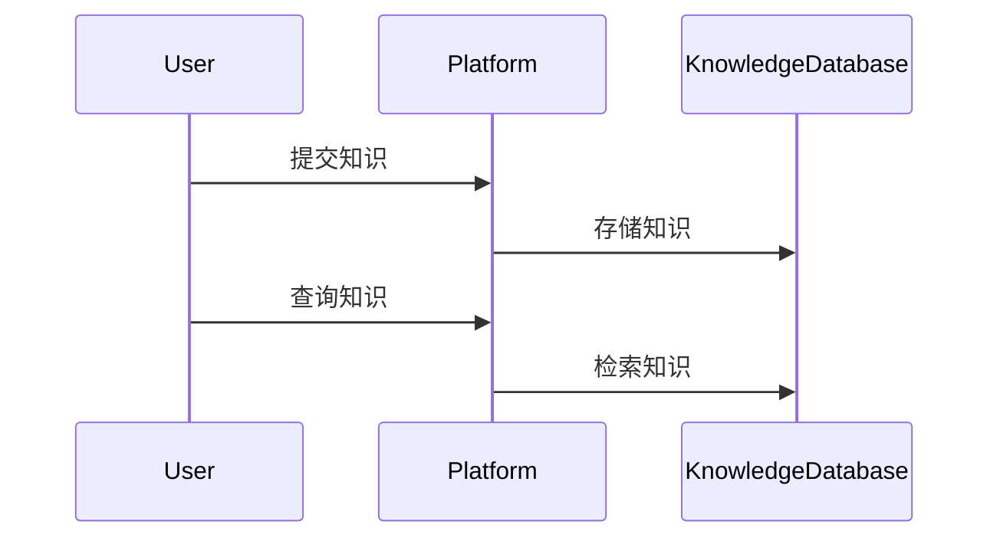

                 

# 技术知识分享平台：促进团队学习与创新

## 关键词
技术知识分享、团队学习、创新促进、平台设计、系统架构、算法原理

## 摘要
本文探讨了技术知识分享平台在促进团队学习与创新方面的重要作用。通过分析技术知识分享平台的核心概念、设计原理、系统架构和数学模型，本文详细阐述了如何利用技术知识分享平台提高团队的知识传播效率和学习效果，从而推动创新和团队发展。文章还通过项目实战案例，展示了如何实现技术知识分享平台的具体步骤和关键技术。

## 第一部分：平台概述与背景

### 第1章：技术知识分享平台概述

#### 1.1 问题背景

在当今快速发展的信息技术时代，知识的更新速度远超过以往。技术团队面临的一个主要挑战是如何高效地获取、管理和分享知识，以确保团队成员能够快速适应新的技术趋势和业务需求。知识分享不仅能够提升团队的技能水平，还能促进创新，提高团队的整体效率。

#### 1.1.1 知识分享的重要性

知识分享对于团队学习和创新至关重要。它可以减少重复工作，提高工作效率，加速新知识的传播和应用，增强团队凝聚力和信任感。

#### 1.1.2 团队学习的挑战

团队学习过程中，知识获取的效率、知识传播的广度和深度、团队成员之间的协作和知识共享的文化建设都是需要克服的挑战。

#### 1.1.3 技术知识分享平台的必要性

为了解决上述问题，技术知识分享平台应运而生。这种平台能够提供一种集中的、系统化的知识管理方式，促进团队内部的知识传播和共享。

### 1.2 问题描述

#### 1.2.1 团队学习与知识传播的障碍

团队成员之间的知识传播可能受到地理分布、工作时间、沟通渠道等因素的制约。

#### 1.2.2 知识获取的效率问题

在传统的知识获取方式中，团队成员往往需要花费大量时间在搜索和整理信息上，这降低了知识获取的效率。

#### 1.2.3 知识共享的文化建设

建立一个鼓励知识分享的文化氛围是确保知识得以有效传播的关键。然而，在现实中，这种文化并不总是容易建立和维护。

### 1.3 解决方案

#### 1.3.1 技术知识分享平台的概念

技术知识分享平台是一种基于互联网的技术工具，旨在提供一个集中的知识存储和分享空间，方便团队成员获取和共享知识。

#### 1.3.2 平台的核心功能与特性

平台通常具备文档管理、搜索和推荐、社交互动、实时协作等功能，以支持团队的知识管理需求。

#### 1.3.3 平台的设计原则

平台的设计应遵循易用性、可扩展性、安全性和高性能等原则，确保其能够满足团队的实际需求。

### 1.4 边界与外延

#### 1.4.1 平台适用的场景

技术知识分享平台适用于各种规模和类型的团队，特别是在信息技术、软件开发等领域。

#### 1.4.2 平台的限制与挑战

平台可能面临数据隐私、系统性能、用户参与度等挑战。

#### 1.4.3 平台与现有技术的关联

技术知识分享平台与人工智能、大数据、云计算等先进技术密切相关，通过这些技术的融合，平台能够实现更智能的知识管理和推荐。

## 第二部分：核心概念与联系

### 第2章：核心概念与联系

#### 2.1 技术知识分享平台的核心概念

技术知识分享平台的核心概念包括知识图谱、机器学习和社交网络分析。这些概念共同构成了平台的技术基础。

#### 2.1.1 知识图谱

知识图谱是一种用于表示实体及其之间关系的数据结构，它在平台中用于构建和展示知识的网络结构。

#### 2.1.2 机器学习

机器学习是一种使计算机通过数据和经验自动改进其性能的技术，在平台中用于实现智能推荐、知识发现等功能。

#### 2.1.3 社交网络分析

社交网络分析是一种研究社交网络结构和属性的技术，用于分析团队成员之间的关系，促进知识共享。

### 2.2 概念属性特征对比

| 概念          | 特征1 | 特征2 | 特征3 |
|---------------|-------|-------|-------|
| 知识图谱      | 结构化 | 查询效率 | 实体关系 |
| 机器学习      | 自动化 | 预测准确性 | 数据驱动 |
| 社交网络分析  | 社交互动 | 关联发现 | 社群划分 |

### 2.3 ER实体关系图

```mermaid
erDiagram
  Team ||--|{ KnowledgeItem }
  User ||--|{ KnowledgeItem }
  Comment ||--|{ KnowledgeItem }
```

## 第三部分：平台设计与实现

### 第3章：算法原理与系统架构

#### 3.1 算法原理

技术知识分享平台的算法原理主要包括知识图谱构建算法、机器学习模型选择和社交网络分析算法。

#### 3.1.1 知识图谱构建算法

知识图谱构建算法用于从文本数据中提取实体和关系，构建知识图谱。常见的算法有基于规则的方法和基于机器学习的方法。

#### 3.1.2 机器学习模型选择

平台选择的机器学习模型应能够处理大规模数据，并具备良好的泛化能力。常见的模型有决策树、随机森林、支持向量机等。

#### 3.1.3 社交网络分析算法

社交网络分析算法用于分析团队成员之间的社交关系，以便更好地理解知识传播的路径和方式。

### 3.2 系统架构设计

技术知识分享平台的系统架构应包括前端界面、后端服务、数据库和数据存储等部分。

#### 3.2.1 总体架构

总体架构采用前后端分离的设计，前端负责展示和交互，后端负责数据存储和处理。

#### 3.2.2 功能模块

功能模块包括文档管理、搜索和推荐、社交互动、实时协作等。

#### 3.2.3 系统接口设计

系统接口设计应考虑RESTful API的设计原则，确保各模块之间的数据交换和交互。

### 3.3 Mermaid架构图



## 第四部分：数学模型与详细讲解

### 第4章：数学模型与详细讲解

#### 4.1 数学模型

技术知识分享平台涉及的数学模型主要包括知识图谱构建的数学模型和机器学习模型的数学基础。

#### 4.1.1 知识图谱构建的数学模型

知识图谱构建的数学模型可以表示为图 \( G = (V, E) \)，其中 \( V \) 表示实体集合，\( E \) 表示实体之间的关系集合。

#### 4.1.2 机器学习模型的数学基础

常见的机器学习模型如线性回归可以表示为 \( y = Wx + b \)，其中 \( W \) 是权重矩阵，\( x \) 是输入向量，\( b \) 是偏置。

### 4.2 举例说明

#### 4.2.1 知识图谱构建的示例

假设有一个知识图谱，包括实体A、B和C，以及它们之间的关系。该知识图谱可以表示为：

$$
G = (V, E) \\
V = \{A, B, C\} \\
E = \{(A, B), (B, C)\}
$$

#### 4.2.2 机器学习模型的示例

一个简单的线性回归模型可以表示为：

$$ y = 2x + 1 $$

当 \( x = 2 \) 时，\( y = 5 \)。

## 第五部分：项目实战

### 第5章：项目实战

#### 5.1 环境安装

项目实战的第一步是搭建开发环境。这包括安装所需的编程语言、数据库和开发工具。

#### 5.1.1 开发环境配置

配置Python开发环境，安装必要的库和依赖。

#### 5.1.2 数据库安装与配置

选择合适的数据库系统（如MongoDB、PostgreSQL等）进行安装和配置。

### 5.2 系统核心实现源代码

系统核心实现包括知识图谱构建、机器学习模型训练和社交网络分析等功能。

#### 5.2.1 知识图谱构建

使用Python代码构建知识图谱，示例代码如下：

```python
# Python代码示例：构建知识图谱
graph = Graph()
graph.add_node("A")
graph.add_node("B")
graph.add_node("C")
graph.add_edge("A", "B")
graph.add_edge("B", "C")
```

#### 5.2.2 机器学习模型训练

使用Python代码训练机器学习模型，示例代码如下：

```python
# Python代码示例：机器学习模型训练
from sklearn.linear_model import LinearRegression

# 假设数据已经预处理并存储在数据集文件中
X = [[1], [2], [3]]
y = [2, 4, 6]

model = LinearRegression()
model.fit(X, y)

# 使用模型进行预测
print(model.predict([[4]]))
```

### 5.3 实际案例分析与详细讲解

通过一个实际案例，分析技术知识分享平台在团队学习与创新中的应用。

### 5.4 项目小结

总结项目实施的经验和教训，提出改进建议。

## 作者信息

作者：AI天才研究院/AI Genius Institute & 禅与计算机程序设计艺术 /Zen And The Art of Computer Programming

---

**最佳实践 Tips:**

1. 确保知识分享平台易于使用，降低用户上手难度。
2. 定期更新和维护知识库，保持知识的时效性和准确性。
3. 建立有效的激励机制，鼓励团队成员积极参与知识分享。
4. 注重数据安全，保护用户隐私。
5. 针对不同团队需求，灵活调整平台功能和设计。

**小结：**

技术知识分享平台是促进团队学习和创新的重要工具。通过合理的设计和实施，平台能够有效提升团队的知识传播效率和学习效果，推动团队持续发展。

**注意事项：**

在设计和实施技术知识分享平台时，需充分考虑团队的具体需求和挑战，确保平台的实用性和可持续性。

**拓展阅读：**

- [知识图谱基础教程](#)
- [机器学习实战：线性回归](#)
- [社交网络分析入门](#)

[作者：AI天才研究院/AI Genius Institute & 禅与计算机程序设计艺术 /Zen And The Art of Computer Programming]

