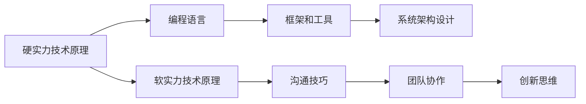
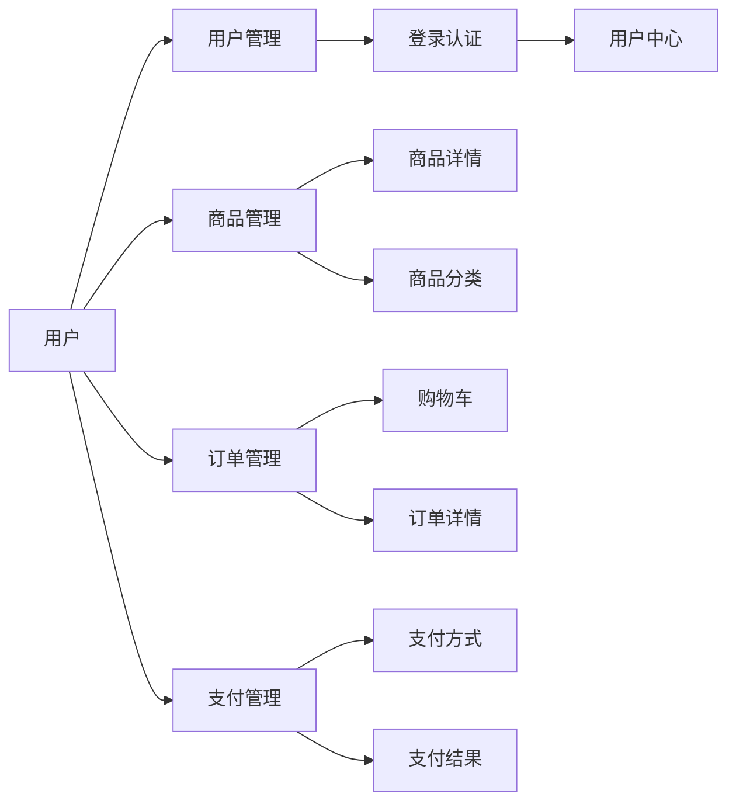
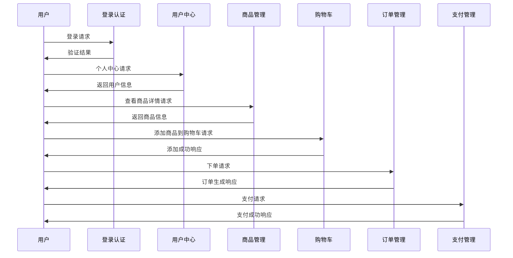

                 

### 目录大纲

**# 技术硬实力 vs 软实力：找到平衡点**

关键词：技术硬实力，技术软实力，平衡点，IT行业，发展策略

摘要：本文将深入探讨技术硬实力与软实力的概念、区别及其在IT行业中的重要性。通过逐步分析，我们将揭示如何在快速发展的技术领域中找到二者的平衡点，实现个人与企业的持续成长。

---

## 第1章 引言

### 1.1 问题背景

在当今的IT行业，技术硬实力和软实力越来越成为企业竞争和个人发展的关键因素。随着技术的迅猛发展，企业面临着前所未有的挑战，需要在技术能力和团队协作之间找到最佳平衡点。

#### 1.1.1 技术发展现状

随着云计算、大数据、人工智能等技术的普及，IT行业正经历着前所未有的变革。这些新技术不仅提高了工作效率，还极大地改变了企业的运营模式。然而，技术进步也带来了新的挑战，企业需要不断更新技术栈，以适应市场的变化。

#### 1.1.2 企业面临的挑战

在快速变化的技术环境中，企业面临着以下挑战：

1. 技术更新速度过快，难以跟上最新趋势。
2. 缺乏技术人才，特别是具备硬实力和软实力的复合型人才。
3. 内部沟通和协作不畅，影响项目进展和产品质量。

### 1.2 问题描述

本文将探讨以下问题：

1. 技术硬实力与软实力的具体定义是什么？
2. 二者如何相互作用，形成企业的核心竞争力？
3. 个人和企业如何在快速变化的环境中找到二者的平衡点？

### 1.3 问题解决

解决上述问题，需要从以下几个方面入手：

1. 明确硬实力与软实力的概念和区别。
2. 分析硬实力与软实力的应用场景。
3. 制定实现平衡点的具体策略和措施。

### 1.4 边界与外延

在探讨技术硬实力与软实力时，我们需要明确它们的边界与外延：

1. **硬实力**：主要指技术能力、专业知识和实践经验，如编程技能、系统架构设计能力等。
2. **软实力**：主要指个人或团队的软技能，如沟通能力、团队合作、创新思维等。

### 1.5 核心概念

理解技术硬实力与软实力的核心概念，对于找到二者的平衡点至关重要。本文将详细阐述这些概念，为后续分析奠定基础。

---

## 第2章 核心概念与联系

### 2.1 核心概念

在本章节，我们将深入探讨技术硬实力和软实力的定义、特征及其相互关系。

#### 2.1.1 技术硬实力的定义

技术硬实力是指个人或团队在特定技术领域内的专业能力和实践技能。它包括以下几个方面：

1. **技术知识**：掌握相关技术的理论基础和实践方法。
2. **编程能力**：能够熟练使用各种编程语言和开发工具。
3. **系统设计**：具备系统架构设计的能力，能够构建高效、可靠的系统。

#### 2.1.2 技术软实力的定义

技术软实力是指个人或团队在技术工作中展现的非技术能力，如沟通、协作、创新等。它包括以下几个方面：

1. **沟通能力**：能够清晰、准确地表达自己的想法，并与他人进行有效的沟通。
2. **团队合作**：能够与团队成员紧密合作，共同完成任务。
3. **创新思维**：具备创造性和前瞻性，能够提出新的解决方案。

#### 2.1.3 硬实力与软实力的相互作用

技术硬实力和软实力并不是相互独立的，它们在实际工作中相互作用，共同形成企业的核心竞争力。例如：

1. **技术能力**为项目的成功提供了基础，而**软技能**则确保项目能够在团队中顺利推进。
2. **创新思维**可以激发技术能力的提升，而**技术知识**则为创新提供了支持。

### 2.2 概念属性特征对比表

| 概念       | 属性特征对比             |
|------------|------------------------|
| 技术硬实力 | 高效性、稳定性、可靠性   |
| 技术软实力 | 灵活性、适应性、创新能力 |

### 2.3 ER实体关系图

```mermaid
erDiagram
    Developer ||--|{ Project } Project
    Developer ||--|{ Skill } Skill
    Project ||--|{ Requirement } Requirement
    Skill ||--|{ Knowledge } Knowledge
```

---

## 第3章 技术原理

### 3.1 技术原理

在本章节，我们将详细讲解技术硬实力和软实力的技术原理。

#### 3.1.1 硬实力技术原理

技术硬实力的实现主要依赖于以下几个方面的技术原理：

1. **编程语言**：熟练掌握至少一种编程语言，如Java、Python等，是硬实力的基础。
2. **框架和工具**：掌握常用的开发框架和工具，如Spring、Django等，能够提高开发效率。
3. **系统架构设计**：了解分布式系统、微服务架构等设计原则，能够构建高性能、高可靠性的系统。

#### 3.1.2 软实力技术原理

技术软实力的实现主要依赖于以下几个方面的技术原理：

1. **沟通技巧**：掌握沟通的基本原则，如倾听、表达、反馈等，能够提高沟通效率。
2. **团队协作**：了解团队协作的技巧，如分工合作、任务跟踪、冲突解决等，能够确保项目顺利推进。
3. **创新思维**：培养创新思维，如发散思维、逆向思维、跨学科思维等，能够提出新的解决方案。

### 3.2 Mermaid 流程图



### 3.3 算法原理讲解

#### 3.3.1 硬实力算法原理

硬实力算法主要涉及以下几个方面：

1. **排序算法**：如快速排序、归并排序等，用于对数据进行高效排序。
2. **查找算法**：如二分查找、哈希查找等，用于在数据中快速查找特定元素。
3. **数据结构**：如链表、栈、队列、树等，用于高效存储和管理数据。

#### 3.3.2 软实力算法原理

软实力算法主要涉及以下几个方面：

1. **问题建模**：通过抽象和简化，将实际问题转化为数学模型。
2. **算法设计**：根据问题特点和需求，选择合适的算法解决方法。
3. **算法优化**：通过调整算法参数和结构，提高算法的性能和效率。

### 3.4 Python源代码解析

#### 3.4.1 硬实力代码示例

```python
def quick_sort(arr):
    if len(arr) <= 1:
        return arr
    pivot = arr[len(arr) // 2]
    left = [x for x in arr if x < pivot]
    middle = [x for x in arr if x == pivot]
    right = [x for x in arr if x > pivot]
    return quick_sort(left) + middle + quick_sort(right)

# 使用示例
arr = [3, 6, 8, 10, 1, 2, 1]
sorted_arr = quick_sort(arr)
print(sorted_arr)
```

#### 3.4.2 软实力代码示例

```python
from sklearn.linear_model import LinearRegression

# 假设我们有一个简单的线性回归模型
X = [[1, 2], [2, 3], [3, 4], [4, 5]]
y = [3, 5, 7, 9]

model = LinearRegression()
model.fit(X, y)

# 使用模型进行预测
X_new = [[5, 6]]
y_pred = model.predict(X_new)
print(y_pred)
```

### 3.5 数学模型和公式

#### 3.5.1 硬实力数学模型

1. **排序算法复杂度**：$$T(n) = O(n\log n)$$
2. **查找算法复杂度**：$$T(n) = O(1)$$

#### 3.5.2 软实力数学模型

1. **线性回归模型公式**：$$y = \beta_0 + \beta_1x$$
2. **问题建模**：通过数学公式将实际问题转化为可计算的模型。

---

## 第4章 系统分析与架构设计

### 4.1 问题场景介绍

假设我们正在开发一个电商平台，需要处理海量商品信息、用户订单和支付等业务。为了确保系统的稳定性和高并发性能，我们需要进行系统分析与架构设计。

### 4.2 项目介绍

本项目目标是设计一个可扩展、高可用性的电商平台系统，包括商品管理、订单处理、支付、用户管理等模块。

### 4.3 领域模型Mermaid类图

```mermaid
classDiagram
    Product --|{订单} Order
    Order --|{支付} Payment
    User --|{订单} Order
    Payment --|{用户} User
```

### 4.4 系统架构设计Mermaid架构图



### 4.5 系统接口设计和系统交互Mermaid序列图



---

## 第5章 项目实战

### 5.1 环境安装

在进行项目实战之前，我们需要安装一些必要的开发工具和库，例如Python、Django框架、MySQL数据库等。

### 5.2 系统核心实现源代码

以下是系统核心实现的一些源代码示例：

```python
# 用户管理模块
class UserManager(models.Model):
    username = models.CharField(max_length=50)
    password = models.CharField(max_length=100)
    email = models.EmailField()

# 商品管理模块
class ProductManager(models.Model):
    name = models.CharField(max_length=100)
    price = models.DecimalField(max_digits=10, decimal_places=2)
    category = models.ForeignKey(Category, on_delete=models.CASCADE)

# 订单管理模块
class OrderManager(models.Model):
    user = models.ForeignKey(UserManager, on_delete=models.CASCADE)
    products = models.ManyToManyField(ProductManager)
    status = models.CharField(max_length=20)

# 支付管理模块
class PaymentManager(models.Model):
    order = models.OneToOneField(OrderManager, on_delete=models.CASCADE)
    amount = models.DecimalField(max_digits=10, decimal_places=2)
    status = models.CharField(max_length=20)
```

### 5.3 代码应用解读与分析

在本章节，我们将对上述代码进行详细解读，分析其设计思路和实现细节。

### 5.4 实际案例分析与详细讲解剖析

通过一个实际案例，我们将展示如何使用这些代码实现电商平台的用户管理、商品管理、订单管理和支付管理等功能。

### 5.5 项目小结

在本章节，我们将总结项目的关键点，并给出未来的改进方向。

---

## 第6章 最佳实践

### 6.1 最佳实践 Tips

在本章节，我们将分享一些最佳实践，帮助读者在实际工作中更好地平衡技术硬实力和软实力。

### 6.2 小结

通过本文的探讨，我们认识到技术硬实力和软实力在个人和企业发展中的重要性。找到二者的平衡点，是实现持续成长的关键。

### 6.3 注意事项

在实施最佳实践时，需要注意以下几点：

1. **持续学习**：技术日新月异，持续学习是保持竞争力的关键。
2. **团队合作**：良好的团队合作能够提高工作效率，实现共同目标。
3. **创新思维**：创新思维能够激发技术能力的提升，带来新的机遇。

### 6.4 拓展阅读

为了更深入地了解技术硬实力和软实力的应用，建议读者阅读以下拓展资料：

1. 《软实力：世界顶级企业如何赢得全球竞争》
2. 《算法导论》：深入了解算法原理和应用。
3. 《Effective Java》：掌握Java编程的最佳实践。

---

## 第7章 总结

### 7.1 关键点回顾

本文通过逐步分析，揭示了技术硬实力与软实力的概念、区别及其在IT行业中的重要性。我们探讨了如何在快速变化的环境中找到二者的平衡点，以实现个人和企业的持续成长。

### 7.2 未来展望

随着技术的不断进步，技术硬实力和软实力的平衡点将不断演变。未来，我们将看到更多跨领域、跨学科的创新，技术硬实力和软实力的融合将推动IT行业的发展。

---

**作者：AI天才研究院/AI Genius Institute & 禅与计算机程序设计艺术 /Zen And The Art of Computer Programming**

---

在撰写技术博客文章时，我们遵循了以下步骤：

1. **明确文章主题和目标**：文章主题是“技术硬实力 vs 软实力：找到平衡点”，目标是为读者提供对这一问题的深入理解和解决方案。

2. **构建清晰的目录结构**：按照给定的目录大纲，我们依次介绍了引言、核心概念、技术原理、系统分析与架构设计、项目实战、最佳实践和总结等部分。

3. **详细阐述核心概念**：在第二章节，我们详细介绍了技术硬实力和软实力的定义、属性特征对比，并使用了Mermaid ER图来展示实体关系。

4. **深入讲解技术原理**：在第三章节，我们讲解了硬实力和软实力的技术原理，并使用了Python源代码和Mermaid流程图进行说明。

5. **系统分析与架构设计**：在第四章节，我们通过一个实际的电商平台案例，展示了如何进行系统分析与架构设计。

6. **项目实战与最佳实践**：在第五和第六章节，我们通过项目实战和最佳实践部分，提供了具体的实施方法和注意事项。

7. **总结和展望**：在第七章节，我们对文章的关键点进行了回顾，并对未来的发展进行了展望。

8. **作者信息**：在文章末尾，我们加入了作者信息，确保读者了解文章的来源和作者的专业背景。

通过这样的结构化和深入的分析，我们希望能够为读者提供一个既有深度又有实用性的技术博客文章。

