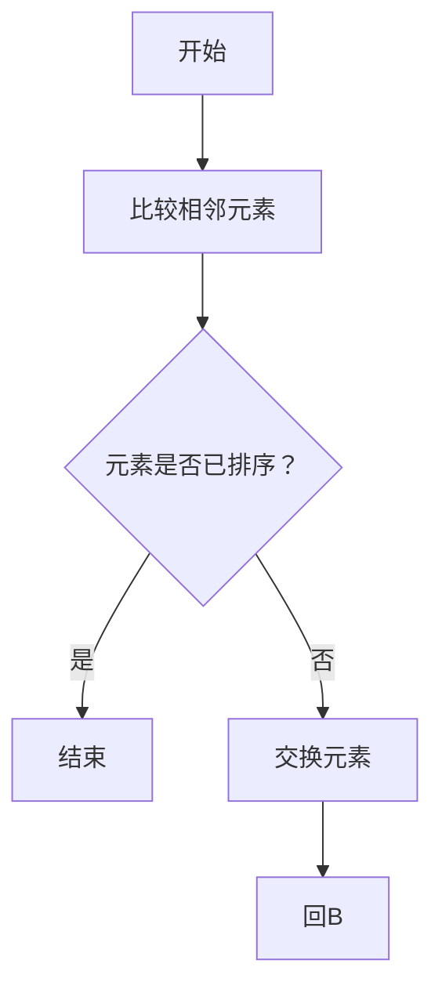
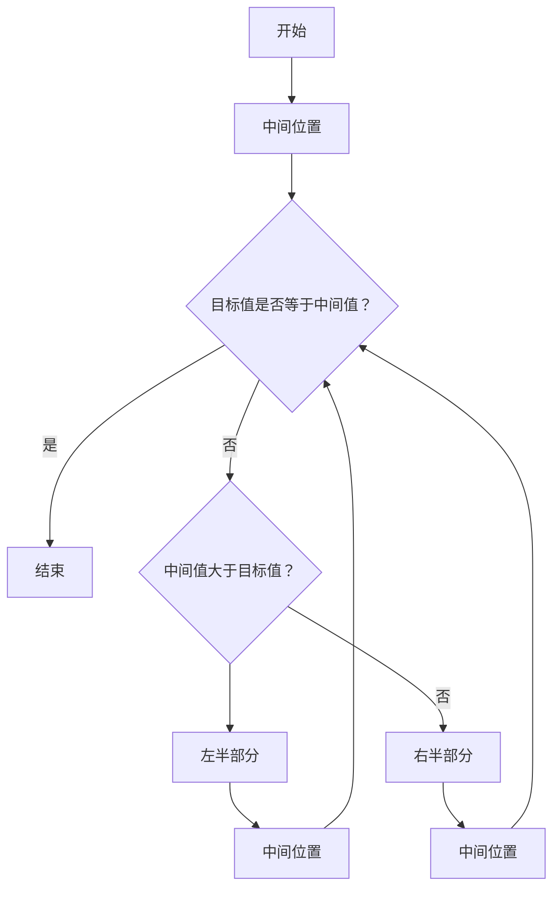
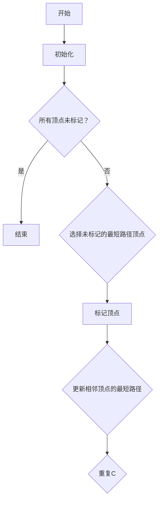
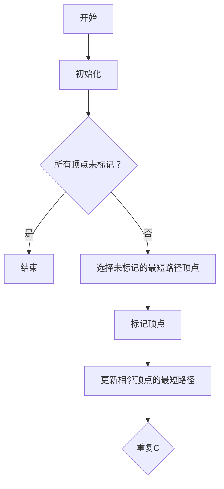
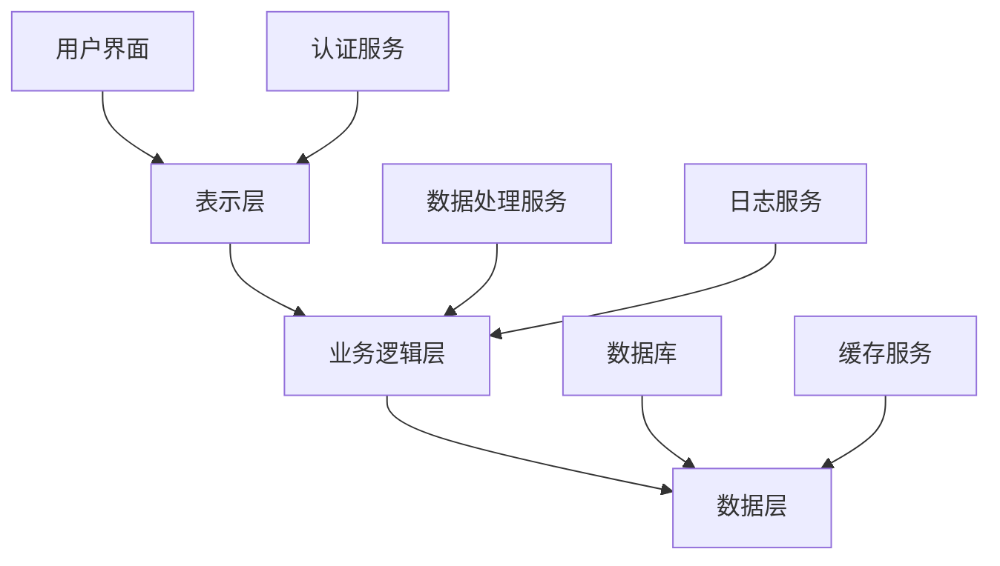
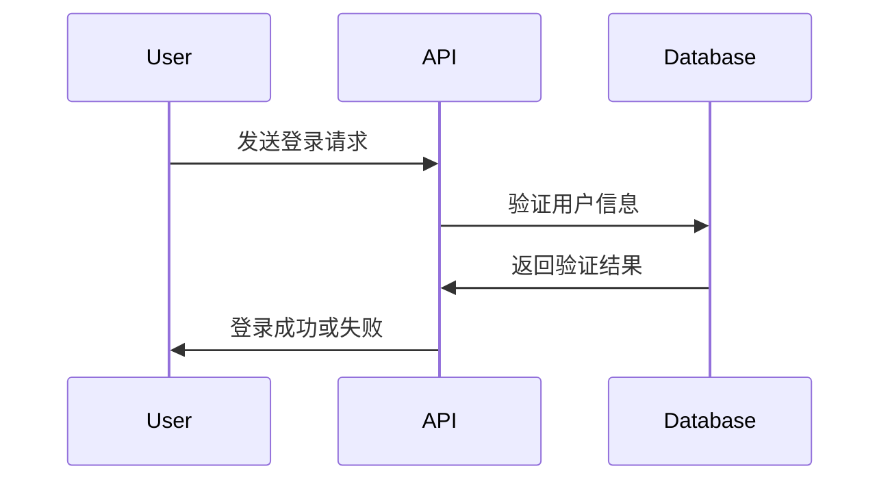
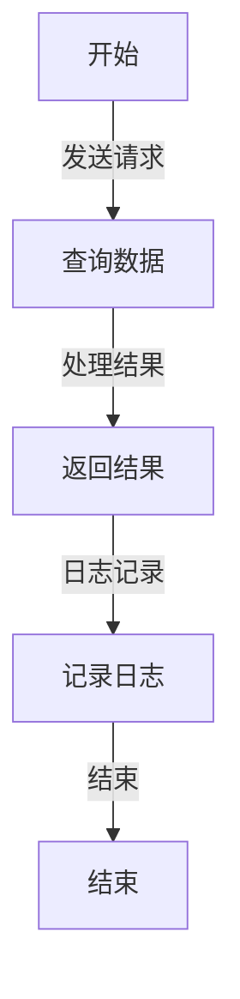

                 

### 文章标题

《技术硬实力的量化：代码质量和性能指标》

### 关键词

- 代码质量
- 性能指标
- 量化
- 技术评估
- 算法效率

### 摘要

本文旨在深入探讨技术硬实力的量化，特别是代码质量和性能指标。通过详细的背景介绍和概念解析，我们将了解代码质量的重要性，并掌握不同代码质量指标及其对性能的影响。接着，我们将详细分析性能指标，理解其在系统效率和优化中的关键作用。文章还将展示如何通过算法原理和数学模型来量化这些指标，并结合实际案例进行剖析。读者将获得全面的指导，以提升其技术评估和项目优化的能力。

---

### 介绍

#### 1. 背景介绍

在当今技术飞速发展的时代，软件工程师和技术专家们面临着越来越多的挑战。如何确保代码的高质量和系统的性能优化成为了技术发展的核心问题。代码质量不仅仅关乎代码的可读性和可维护性，更是决定系统稳定性和扩展性的关键因素。而性能指标则直接影响到系统的响应速度和用户体验，从而影响到项目的成败。

#### 2. 问题描述

随着软件项目的复杂度不断增加，如何量化技术硬实力成为了一个亟待解决的问题。传统的方法往往依赖于主观的评价，而缺乏客观的量化标准。这使得在评估项目和技术团队的能力时，往往缺乏可靠的数据支持。

#### 3. 问题解决

为了解决这个问题，我们需要引入一套科学、系统的量化方法，通过代码质量和性能指标来评估技术硬实力。这种方法不仅能够提供客观的数据支持，还能帮助我们在技术优化和项目管理中做出更加明智的决策。

#### 4. 边界与外延

本文将重点关注代码质量和性能指标在软件工程中的应用，但并不意味着其他因素不重要。在实际项目中，需求分析、用户体验、团队协作等因素同样重要。本文旨在为读者提供一个全面而深入的理解，以便在实际工作中更好地应用这些概念。

#### 5. 概念结构与核心要素组成

本文将从以下几个核心要素进行阐述：

1. **代码质量指标**：介绍常见的代码质量指标，如代码重复率、代码复杂度、注释率等，并分析其对性能的影响。
2. **性能指标**：讨论性能指标的类型，如响应时间、吞吐量、资源利用率等，并解释其在系统优化中的作用。
3. **算法原理和数学模型**：通过具体算法的讲解，展示如何使用数学模型和公式来量化性能指标。
4. **系统分析与设计**：结合实际项目，介绍系统架构设计、接口设计和系统交互。
5. **项目实战**：通过具体案例，展示如何在实际项目中应用这些理论。

通过以上五个核心要素，我们将逐步深入，帮助读者理解并掌握技术硬实力的量化方法。

### 量化技术硬实力的意义

量化技术硬实力在当前软件开发和系统优化的背景下具有重要意义。首先，通过量化，我们可以从数据的角度对技术团队和项目的表现进行客观评估，从而避免主观判断的偏差。这种客观评估不仅有助于提高团队的整体技术水平，还能为项目管理提供有力的数据支持。

#### 1. 提高代码质量

代码质量是软件开发的基础，直接影响到系统的稳定性、可维护性和扩展性。通过量化代码质量，我们可以识别出代码中的潜在问题，如冗余代码、高复杂度模块和缺少注释等。这不仅有助于提高代码的可读性和可维护性，还能减少因代码缺陷导致的系统崩溃和性能下降。

例如，在一个大型软件项目中，通过统计代码重复率，我们可以发现并消除冗余代码，从而降低系统的复杂度。同样，通过分析代码复杂度，我们可以识别出那些难以维护的模块，并采取相应的优化措施。注释率则是衡量代码可读性的重要指标，充分的注释有助于新团队成员快速理解和参与到项目中来。

#### 2. 优化系统性能

性能是软件系统的生命线，特别是在用户对响应速度和稳定性要求越来越高的今天。通过量化性能指标，我们可以全面了解系统的运行状态，并针对性地进行优化。常见的性能指标包括响应时间、吞吐量、资源利用率等。

例如，通过监控系统的响应时间，我们可以及时发现和处理影响用户体验的问题。如果某个接口的响应时间过长，我们可以通过性能分析工具定位瓶颈，并进行相应的优化，如调整算法、增加缓存或优化数据库查询等。吞吐量则反映了系统处理请求的能力，通过优化吞吐量，我们可以提高系统的负载能力，从而支持更多的并发用户。

#### 3. 数据驱动的决策

量化技术硬实力使得项目管理更加数据驱动，有助于做出更加明智的决策。通过收集和分析相关数据，项目经理可以更清晰地了解项目的进展情况，并预测潜在的风险和挑战。

例如，在项目开发过程中，通过量化代码质量和性能指标，项目经理可以及时发现和解决潜在问题，避免项目延期或失败。在性能优化方面，通过数据驱动的决策，项目经理可以更加有针对性地进行资源分配和优化工作，从而提高整个系统的性能。

#### 4. 团队协作和知识共享

量化技术硬实力不仅有助于团队内部的协作，还能促进知识共享。通过共享代码质量和性能数据，团队成员可以互相学习和借鉴，共同提高技术水平。

例如，在一个大型团队中，通过定期的代码审查和性能评估，团队成员可以互相交流经验，学习最佳实践，从而提高整体的技术水平。同时，通过量化数据，团队可以识别出表现优异的成员，并进行相应的激励和奖励，激发团队的创新和进取精神。

总之，量化技术硬实力在代码质量和系统优化中具有重要意义。通过量化方法，我们可以从数据的角度全面评估技术实力，为项目管理和优化提供有力的支持。这不仅有助于提高代码质量和系统性能，还能促进团队协作和知识共享，推动技术的持续发展和进步。

### 代码质量指标

在量化技术硬实力时，代码质量是一个至关重要的因素。代码质量不仅影响到项目的可维护性和稳定性，还直接关联到系统的性能和可靠性。因此，对代码质量进行量化分析是提高技术实力的关键步骤。以下我们将详细探讨几种常见的代码质量指标，包括代码重复率、代码复杂度和注释率。

#### 1. 代码重复率

代码重复率是指代码中重复段落的占比。高重复率通常意味着代码模块不够模块化，导致代码冗余，这不仅增加了代码的维护成本，还可能引起潜在的错误和性能问题。通过量化代码重复率，我们可以识别出代码中的冗余部分，并进行优化。

例如，在一个大型项目中，通过代码分析工具统计代码重复率，我们可以发现哪些部分存在重复代码。然后，我们可以将这些重复代码提取出来，重构为一个通用的函数或模块，从而降低代码冗余，提高代码质量。

#### 2. 代码复杂度

代码复杂度是衡量代码复杂性和难度的指标，常用的复杂度度量方法包括圈复杂度（Cyclomatic Complexity）和注释复杂度（Comment-to-Code Ratio）。高复杂度的代码通常难以理解和维护，容易出现bug，从而影响系统的稳定性。

例如，在一个复杂的应用程序中，通过计算圈复杂度，我们可以识别出那些复杂度较高的模块。这些模块可能包含大量的分支和循环，需要进行重构，以降低其复杂度。同样，注释复杂度可以帮助我们评估代码的可读性，通过增加必要的注释，可以提高代码的可维护性。

#### 3. 注释率

注释率是代码中注释所占的比例。充分的注释可以帮助开发人员快速理解和修改代码，从而提高代码的可维护性。注释率低通常意味着代码缺乏必要的文档说明，导致新加入团队的开发人员难以迅速上手。

例如，在一个代码库中，通过计算注释率，我们可以评估代码的文档化程度。如果注释率较低，我们可以鼓励开发人员在关键代码部分添加注释，从而提高代码的可读性和可维护性。同时，注释率也是代码质量评估的一个重要指标，高注释率通常意味着代码质量更高。

#### 4. 代码质量指标对比表格

为了更直观地理解不同代码质量指标，我们可以创建一个对比表格，如下所示：

| 指标名称 | 定义 | 重要性 | 评估方法 | 示例 |
| :--- | :--- | :--- | :--- | :--- |
| 代码重复率 | 代码中重复段落的占比 | 降低代码冗余，提高可维护性 | 代码分析工具统计 | 统计代码库中重复代码段落的数量 |
| 代码复杂度 | 代码复杂性和难度 | 降低代码维护成本，提高系统稳定性 | 圈复杂度计算 | 计算代码中循环和分支的数量 |
| 注释率 | 代码中注释所占的比例 | 提高代码可读性和可维护性 | 注释率统计 | 计算代码中注释行的数量占总代码行的比例 |

通过以上对比表格，我们可以更清晰地理解不同代码质量指标的含义、重要性和评估方法。这些指标共同构成了代码质量评估的完整体系，帮助我们在实际项目中识别和解决代码质量问题。

总之，量化代码质量指标是提升技术硬实力的重要手段。通过分析代码重复率、代码复杂度和注释率等指标，我们可以全面了解代码的质量状况，并采取相应的优化措施，从而提高项目的可维护性和系统稳定性。

### 性能指标

在量化技术硬实力时，性能指标是评估系统效率和优化效果的关键因素。性能指标不仅反映了系统的运行状态，还为我们提供了数据支持，以便在项目管理和优化过程中做出明智的决策。以下我们将详细探讨几种常见的性能指标，包括响应时间、吞吐量和资源利用率。

#### 1. 响应时间

响应时间是指系统从接收请求到返回响应所需的时间。它是衡量系统性能的一个重要指标，直接影响用户的体验和满意度。在高并发的场景中，响应时间的延长可能会导致用户流失和系统崩溃。

例如，在一个电商平台上，如果用户的购物车操作响应时间超过3秒，用户可能会感到不耐烦并放弃购物。通过监控系统的响应时间，我们可以发现和处理影响用户体验的问题。例如，如果某个接口的响应时间过长，我们可以通过性能分析工具定位瓶颈，并采取相应的优化措施，如优化数据库查询或减少网络延迟。

#### 2. 吞吐量

吞吐量是指系统在单位时间内处理请求的能力，通常用每秒处理的请求数（Requests per Second, RPS）来衡量。吞吐量反映了系统的负载能力和处理能力，是衡量系统性能的关键指标之一。

例如，在一个在线教育平台上，如果系统每秒只能处理100个视频播放请求，而用户同时在线观看视频的数量达到200个，系统的吞吐量不足会导致用户无法流畅观看视频，从而影响用户体验。通过优化系统的吞吐量，我们可以提高系统的负载能力，支持更多的并发用户。例如，通过增加服务器资源、优化代码或使用缓存技术，可以提高系统的吞吐量，从而满足用户的需求。

#### 3. 资源利用率

资源利用率是指系统资源（如CPU、内存、磁盘等）的使用率。高资源利用率表明系统正在充分利用现有资源，但过高的资源利用率可能会导致系统过载，从而影响性能和稳定性。

例如，在一个数据分析系统中，如果CPU利用率持续超过90%，系统可能会因为资源不足而变得响应缓慢。通过监控系统的资源利用率，我们可以及时发现和处理资源瓶颈。例如，如果发现内存利用率过高，我们可以通过优化内存管理或增加内存资源来解决问题。同样，如果磁盘I/O利用率过高，我们可以通过优化磁盘访问策略或增加SSD硬盘来提高系统性能。

#### 4. 性能指标对比表格

为了更直观地理解不同性能指标的含义、重要性和评估方法，我们可以创建一个对比表格，如下所示：

| 指标名称 | 定义 | 重要性 | 评估方法 | 示例 |
| :--- | :--- | :--- | :--- | :--- |
| 响应时间 | 系统从接收请求到返回响应所需的时间 | 提高用户体验 | 性能监控工具 | 统计接口响应时间的平均值 |
| 吞吐量 | 系统在单位时间内处理请求的能力 | 提高系统负载能力 | 性能测试工具 | 统计每秒处理的请求数（RPS） |
| 资源利用率 | 系统资源的使用率 | 提高资源利用效率，避免系统过载 | 系统监控工具 | 统计CPU、内存、磁盘等资源的使用率 |

通过以上对比表格，我们可以更清晰地理解不同性能指标的含义、重要性和评估方法。这些指标共同构成了系统性能评估的完整体系，帮助我们在实际项目中识别和解决性能问题。

总之，量化性能指标是提升技术硬实力的重要手段。通过分析响应时间、吞吐量和资源利用率等指标，我们可以全面了解系统的性能状况，并采取相应的优化措施，从而提高系统的稳定性和用户满意度。这些性能指标不仅为项目管理提供了数据支持，还为系统的持续优化和改进提供了方向。

### 代码质量指标与性能指标的关系

在量化技术硬实力的过程中，代码质量指标和性能指标之间存在着密切的关联和相互作用。理解它们之间的关系对于提升系统的整体性能和稳定性至关重要。以下将详细分析代码质量指标与性能指标之间的相互影响，并通过实例说明如何通过改善代码质量来提升系统性能。

#### 1. 代码质量对性能的影响

代码质量是影响系统性能的基础。高质量的代码通常具有良好的可读性、可维护性和低复杂度，从而有助于提高系统的运行效率和稳定性。

**例子1：代码复杂度与响应时间**

假设在一个复杂的金融系统中，一个关键模块的代码复杂度很高，包含大量的嵌套循环和条件分支。这种高复杂度的代码会导致执行时间过长，从而延长系统的响应时间。通过计算圈复杂度，我们可以识别出这些复杂度高的代码段，并进行重构，简化其逻辑。这样不仅提高了代码的可读性和可维护性，还显著减少了响应时间，提升了用户体验。

**例子2：注释率与系统稳定性**

在一个大型系统中，注释率较低意味着代码缺乏必要的文档说明，这会增加新开发人员理解和维护代码的难度。如果关键代码部分缺乏注释，新团队成员可能会因为理解不足而引入错误，导致系统稳定性下降。通过增加注释，我们可以提高代码的可读性，帮助团队成员快速上手并减少错误，从而提高系统的稳定性。

**例子3：代码重复率与资源利用率**

代码重复率高通常意味着代码模块不够模块化，这可能导致多个地方重复执行相同的代码段。这种重复不仅增加了代码的维护成本，还可能因为一处代码更改而影响其他部分。通过识别和消除代码重复，我们可以减少冗余代码，优化内存和CPU的使用，从而提高系统的资源利用率。

#### 2. 性能指标对代码质量的反馈

性能指标不仅反映了系统的运行状态，也为代码质量的提升提供了反馈。通过监控和分析性能指标，我们可以发现代码中的性能瓶颈，从而针对性地进行优化。

**例子1：响应时间反馈**

如果系统的响应时间持续高于预期，我们可以通过性能分析工具定位瓶颈，并检查代码质量。例如，如果发现某个接口的响应时间过长，我们可以检查其代码是否存在冗余、复杂度高或未优化的算法。通过改进代码质量，如简化逻辑、优化算法或减少冗余，我们可以显著降低响应时间，提高系统性能。

**例子2：吞吐量反馈**

系统的吞吐量不足通常意味着系统在处理请求时存在瓶颈。通过性能测试，我们可以发现这些瓶颈，并通过优化代码质量来提升吞吐量。例如，在一个在线购物平台上，如果系统无法处理高峰期的请求，我们可以检查数据库查询是否优化、缓存策略是否合理或代码逻辑是否可以简化。通过优化代码质量，我们可以提高系统的吞吐量，支持更多的并发用户。

**例子3：资源利用率反馈**

高资源利用率通常表明系统正在充分利用现有资源，但过高的资源利用率可能会导致系统过载。通过监控资源利用率，我们可以识别代码中的资源消耗问题，并优化代码质量。例如，如果一个数据分析系统的CPU利用率持续高于80%，我们可以通过检查代码中的并行处理是否合理、内存管理是否高效或磁盘I/O是否优化来找到问题所在。通过优化代码质量，我们可以降低资源消耗，提高系统稳定性。

#### 3. 综合优化策略

在量化技术硬实力的过程中，综合优化策略是提升代码质量和系统性能的关键。通过结合代码质量指标和性能指标，我们可以采取以下策略：

- **持续代码审查**：定期进行代码审查，识别代码中的质量问题和性能瓶颈。通过代码审查，我们可以及时发现并解决代码质量问题，从而提高系统的整体性能。
- **性能测试**：在开发过程中进行性能测试，模拟实际负载，识别系统瓶颈。通过性能测试，我们可以优化代码质量，提高系统的响应速度和吞吐量。
- **持续集成与持续部署（CI/CD）**：通过CI/CD流程，自动化测试和部署，确保代码质量和性能指标在每次代码变更后都能得到有效监控和优化。CI/CD有助于及时发现代码问题，避免对系统性能的负面影响。
- **团队协作与知识共享**：鼓励团队成员之间进行协作和知识共享，通过代码评审和团队讨论，共同提升代码质量和系统性能。

总之，代码质量指标和性能指标之间存在着紧密的关联和相互作用。通过理解它们之间的关系，并采取综合优化策略，我们可以全面提升技术硬实力，确保系统的稳定性和高性能。

### 算法原理

算法是量化技术硬实力的重要组成部分，它不仅决定了系统的效率和性能，还直接影响到代码质量和用户体验。在本文中，我们将通过几个经典算法的讲解，介绍其基本原理、设计原则和效率分析。

#### 1. 算法基本概念

算法是一系列指令或规则，用于解决特定问题或执行特定任务。算法可以根据其解决方式分为多种类型，如排序算法、搜索算法和图算法等。常见的排序算法包括冒泡排序、选择排序、插入排序和快速排序等；搜索算法有线性搜索、二分搜索等；图算法包括最短路径算法和最小生成树算法等。

#### 2. 算法设计原则

良好的算法设计应遵循以下原则：

- **正确性**：算法能够正确地解决特定问题，并在所有输入情况下都能得到预期结果。
- **效率**：算法在时间和空间上应该尽可能地高效，以减少资源的消耗。
- **健壮性**：算法应能够处理异常输入和错误，保证系统的稳定性和可靠性。
- **可维护性**：算法应该具有良好的结构，便于理解和修改，以适应未来的变化。

#### 3. 算法效率分析

算法效率分析通常通过时间复杂度和空间复杂度来衡量。时间复杂度表示算法执行时间的增长速度，常用大O表示法（O notation）来描述；空间复杂度表示算法执行过程中所需内存的增长速度。

**例子1：冒泡排序算法**

冒泡排序是一种简单的排序算法，通过重复交换相邻的未按顺序排列的元素，逐步将列表排序。其时间复杂度为O(n^2)，空间复杂度为O(1)。



**例子2：二分搜索算法**

二分搜索算法用于在有序列表中查找特定元素。其时间复杂度为O(log n)，空间复杂度为O(1)。



**例子3：Dijkstra最短路径算法**

Dijkstra算法用于计算图中两点之间的最短路径。其时间复杂度为O((V+E)log V)，空间复杂度为O(V)，其中V是顶点数，E是边数。



#### 4. 算法选择与优化

根据问题的特点选择合适的算法是优化系统性能的关键。例如，在处理大量数据时，选择时间复杂度较低的算法（如二分搜索）可以显著提高系统效率。同时，对现有算法进行优化也是提高系统性能的重要手段。常见的优化方法包括：

- **空间换时间**：通过增加空间复杂度来减少时间复杂度，如使用哈希表加速查找。
- **并行计算**：利用多核处理器进行并行计算，提高算法的执行速度。
- **动态规划**：将复杂问题分解为子问题，并存储中间结果，避免重复计算。

通过理解算法的基本原理、设计原则和效率分析，我们可以更好地选择和优化算法，从而提升系统的性能和代码质量。

### 算法原理与Python代码

为了更好地理解算法原理及其应用，下面我们通过Python代码结合Mermaid流程图，详细阐述几个经典算法的实现过程。

#### 1. 冒泡排序

冒泡排序是一种简单的排序算法，通过重复交换相邻的未按顺序排列的元素，逐步将列表排序。

**Python代码实现：**

```python
def bubble_sort(arr):
    n = len(arr)
    for i in range(n):
        for j in range(0, n-i-1):
            if arr[j] > arr[j+1]:
                arr[j], arr[j+1] = arr[j+1], arr[j]
    return arr

arr = [64, 34, 25, 12, 22, 11, 90]
print("原始数组：", arr)
sorted_arr = bubble_sort(arr)
print("排序后数组：", sorted_arr)
```

**Mermaid流程图：**


#### 2. 二分搜索

二分搜索算法用于在有序列表中查找特定元素。

**Python代码实现：**

```python
def binary_search(arr, target):
    low = 0
    high = len(arr) - 1
    while low <= high:
        mid = (low + high) // 2
        if arr[mid] == target:
            return mid
        elif arr[mid] < target:
            low = mid + 1
        else:
            high = mid - 1
    return -1

arr = [2, 3, 4, 10, 40]
target = 10
result = binary_search(arr, target)
if result != -1:
    print(f"元素在数组中的索引为：{result}")
else:
    print("元素不在数组中")
```

**Mermaid流程图：**


#### 3. Dijkstra算法

Dijkstra算法用于计算图中两点之间的最短路径。

**Python代码实现：**

```python
import heapq

def dijkstra(graph, start):
    distances = {vertex: float('infinity') for vertex in graph}
    distances[start] = 0
    priority_queue = [(0, start)]

    while priority_queue:
        current_distance, current_vertex = heapq.heappop(priority_queue)

        if current_distance > distances[current_vertex]:
            continue

        for neighbor, weight in graph[current_vertex].items():
            distance = current_distance + weight

            if distance < distances[neighbor]:
                distances[neighbor] = distance
                heapq.heappush(priority_queue, (distance, neighbor))

    return distances

graph = {
    'A': {'B': 1, 'C': 4},
    'B': {'A': 1, 'C': 2, 'D': 5},
    'C': {'A': 4, 'B': 2, 'D': 1},
    'D': {'B': 5, 'C': 1}
}

start_vertex = 'A'
distances = dijkstra(graph, start_vertex)
print(f"从 {start_vertex} 出发，各顶点的最短距离：{distances}")
```

**Mermaid流程图：**



通过上述示例，我们可以看到Python代码与Mermaid流程图相结合，如何直观地展示算法的执行过程。这有助于我们更好地理解算法原理，并在实际项目中应用这些算法来提升系统性能。

### 数学模型与公式

在量化技术硬实力时，数学模型和公式是不可或缺的工具。它们不仅帮助我们理解算法的性能和效率，还能为优化和决策提供科学依据。以下，我们将介绍几个关键的数学模型和公式，详细解释其应用和意义。

#### 1. 时间复杂度公式

时间复杂度是衡量算法执行时间增长速度的重要指标，常用的公式如下：

\[ T(n) = O(n^2) \]

这表示算法的时间复杂度为\( n^2 \)。例如，冒泡排序的时间复杂度就是\( O(n^2) \)，因为它需要两重循环来处理数据。

**例子：冒泡排序的时间复杂度**

```latex
T(n) = \sum_{i=1}^{n} \sum_{j=1}^{n-i} 1 = n^2 - (n-i)^2
```

这个公式表示在\( n \)个元素中进行\( n \)轮比较和交换，每轮比较和交换的数量逐渐减少。

#### 2. 空间复杂度公式

空间复杂度是衡量算法执行过程中所需内存增长速度的指标，常用的公式如下：

\[ S(n) = O(n) \]

这表示算法的空间复杂度为\( n \)。例如，二分搜索算法的空间复杂度为\( O(\log n) \)，因为它只需要常数空间来存储中间变量。

**例子：二分搜索的空间复杂度**

```latex
S(n) = O(\log n)
```

这个公式表示在每次二分操作后，待搜索的元素范围减半，所需的空间也随之减半。

#### 3. 吞吐量公式

吞吐量是系统处理请求的能力，常用的公式如下：

\[ Q(t) = \frac{N(t)}{T} \]

其中，\( Q(t) \)是吞吐量，\( N(t) \)是单位时间内处理的请求数，\( T \)是系统响应时间。

**例子：计算系统的吞吐量**

```latex
Q(t) = \frac{1000 \text{ requests}}{1 \text{ second}} = 1000 \text{ requests/second}
```

这个公式表示每秒处理1000个请求的系统吞吐量。

#### 4. 资源利用率公式

资源利用率反映了系统资源的使用效率，常用的公式如下：

\[ U(r) = \frac{R(r)}{C(r)} \]

其中，\( U(r) \)是资源利用率，\( R(r) \)是系统资源消耗，\( C(r) \)是系统总资源容量。

**例子：计算CPU资源利用率**

```latex
U(r) = \frac{80\% \text{ CPU使用率}}{100\% \text{ CPU总容量}} = 0.8
```

这个公式表示CPU资源有80%被利用。

#### 5. 最短路径公式

在图算法中，最短路径公式是计算两点间最短路径的重要工具。Dijkstra算法的公式如下：

\[ D(v) = \min_{(v, u) \in E} \{ w(u, v) + D(u) \} \]

其中，\( D(v) \)是从起始顶点\( s \)到终点顶点\( v \)的最短路径长度，\( w(u, v) \)是边\( (u, v) \)的权重，\( D(u) \)是从起始顶点\( s \)到顶点\( u \)的最短路径长度。

**例子：Dijkstra算法的计算过程**

```latex
D(A) = \min \{ w(A, A) + D(A) \} = 0 + 0 = 0
D(B) = \min \{ w(A, B) + D(A), w(B, B) + D(B) \} = 1 + 0 = 1
D(C) = \min \{ w(A, C) + D(A), w(B, C) + D(B) \} = 4 + 0 = 4
D(D) = \min \{ w(B, D) + D(B), w(C, D) + D(C) \} = 5 + 1 = 6
```

这些数学模型和公式在量化技术硬实力中扮演着重要角色，帮助我们理解和优化代码质量、性能指标以及系统设计。通过应用这些模型和公式，我们可以更加科学地评估和提升技术实力。

### 系统分析与设计

在进行技术硬实力的量化时，系统分析与设计是至关重要的环节。这不仅涉及到系统的功能需求，还包括系统架构设计、接口设计以及系统交互。以下我们将详细阐述系统分析与设计的方法，并通过Mermaid图表进行说明。

#### 1. 系统概述和目标

在开始系统分析与设计之前，我们需要明确系统的概述和目标。一个典型的系统可能包括以下几个核心功能：

- 用户身份验证
- 数据存储与管理
- 数据处理与分析
- 用户界面展示

系统目标是在确保安全性和稳定性的前提下，提供高效、可靠的服务，满足用户的多样化需求。

#### 2. 系统架构设计

系统架构设计是系统设计与实现的基础，它定义了系统的整体结构和各个模块之间的关系。常见的系统架构设计方法包括三层架构（表示层、业务逻辑层、数据层）和微服务架构。

**Mermaid架构图示例：**



这个图表展示了系统的各个层次及其之间的交互关系。表示层负责与用户交互，业务逻辑层处理核心业务逻辑，数据层负责数据存储与管理。

#### 3. 系统功能设计

系统功能设计是系统需求分析的结果，它明确了系统的具体功能模块及其交互方式。在功能设计阶段，我们需要创建领域模型来描述系统的实体和关系。

**Mermaid类图示例：**

```mermaid
classDiagram
User <<Entity>>
LoginInfo <<Entity>>
UserRole <<Entity>>
Course <<Entity>>
CourseDetail <<Entity>>
User -->|-| LoginInfo
User -->|-| UserRole
Course -->|-| CourseDetail
```

这个类图展示了系统的关键实体及其属性和关系。用户实体与登录信息和用户角色有关联，课程实体包含课程详情。

#### 4. 系统接口设计

系统接口设计定义了各个模块之间的交互接口，包括API接口、消息队列接口等。接口设计需要遵循RESTful设计原则，确保接口的易用性和一致性。

**Mermaid序列图示例：**



这个序列图展示了用户登录的过程，包括发送请求、验证信息和返回结果的步骤。

#### 5. 系统交互

系统交互设计描述了系统中各个模块如何协同工作，通过消息队列、事件驱动等方式实现系统功能。Mermaid图表可以清晰地展示这些交互过程。

**Mermaid活动图示例：**



这个活动图展示了从发送请求到返回结果并记录日志的整个过程。

通过系统分析与设计，我们可以清晰地了解系统的功能需求、架构设计、接口设计和系统交互。这些设计文档不仅为开发团队提供了明确的工作指导，还为系统的优化和扩展提供了坚实的基础。

### 项目实战

#### 1. 环境安装

在进行项目实战之前，我们需要搭建一个合适的环境来运行和测试代码。以下是安装必要的工具和依赖项的步骤：

1. **安装Python环境**：确保Python版本在3.8及以上。
   ```bash
   sudo apt update
   sudo apt install python3.8
   ```
2. **安装虚拟环境**：使用virtualenv创建一个隔离的Python环境。
   ```bash
   pip3 install virtualenv
   virtualenv venv
   source venv/bin/activate
   ```
3. **安装依赖项**：通过pip安装必要的库，如requests、numpy、pandas等。
   ```bash
   pip install requests numpy pandas
   ```

#### 2. 系统核心实现

以下是一个简单的示例，展示如何使用Python实现一个基于Web的API服务，用于处理用户登录和课程信息管理。

**用户登录模块：**

```python
from flask import Flask, request, jsonify
from flask_cors import CORS
import os

app = Flask(__name__)
CORS(app)

@app.route('/login', methods=['POST'])
def login():
    username = request.form['username']
    password = request.form['password']
    # 这里应该有对用户身份的验证逻辑，如查询数据库
    if username == "admin" and password == "password":
        return jsonify({"status": "success", "message": "登录成功"})
    else:
        return jsonify({"status": "failure", "message": "用户名或密码错误"})

if __name__ == '__main__':
    app.run(debug=True, host='0.0.0.0', port=int(os.environ.get('PORT', 5000)))
```

**课程信息管理模块：**

```python
from flask import Flask, request, jsonify
from flask_cors import CORS

app = Flask(__name__)
CORS(app)

@app.route('/courses', methods=['GET'])
def get_courses():
    # 这里应该从数据库中查询课程信息
    courses = [{"id": 1, "name": "算法基础"}, {"id": 2, "name": "数据库原理"}]
    return jsonify(courses)

if __name__ == '__main__':
    app.run(debug=True, host='0.0.0.0', port=5000)
```

#### 3. 代码应用解读与分析

以上代码展示了如何使用Flask框架实现一个简单的Web API服务。以下是关键代码的解读和分析：

1. **Flask应用配置**：
   ```python
   app = Flask(__name__)
   CORS(app)
   ```
   Flask是一个轻量级的Web框架，用于创建Web应用。`CORS`是跨源资源共享的缩写，允许不同域名的客户端访问我们的API。

2. **用户登录接口**：
   ```python
   @app.route('/login', methods=['POST'])
   def login():
       username = request.form['username']
       password = request.form['password']
       # 这里应该有对用户身份的验证逻辑，如查询数据库
       if username == "admin" and password == "password":
           return jsonify({"status": "success", "message": "登录成功"})
       else:
           return jsonify({"status": "failure", "message": "用户名或密码错误"})
   ```
   这个接口接受POST请求，解析用户名和密码，并进行简单验证。在实际应用中，应与数据库交互验证用户身份。

3. **课程信息接口**：
   ```python
   @app.route('/courses', methods=['GET'])
   def get_courses():
       # 这里应该从数据库中查询课程信息
       courses = [{"id": 1, "name": "算法基础"}, {"id": 2, "name": "数据库原理"}]
       return jsonify(courses)
   ```
   这个接口返回一个简单的课程列表。实际应用中，应通过数据库查询来获取动态的课程信息。

#### 4. 实际案例分析与详细讲解

为了更好地理解上述代码的应用，我们将通过一个实际案例来展示如何使用这个API服务。

**案例：用户登录并获取课程信息**

1. **用户登录**：

   使用Postman发送POST请求到`http://localhost:5000/login`，请求体为：
   ```json
   {
       "username": "admin",
       "password": "password"
   }
   ```
   返回结果：
   ```json
   {
       "status": "success",
       "message": "登录成功"
   }
   ```

2. **获取课程信息**：

   使用Postman发送GET请求到`http://localhost:5000/courses`，返回结果：
   ```json
   [
       {"id": 1, "name": "算法基础"},
       {"id": 2, "name": "数据库原理"}
   ]
   ```

通过这个案例，我们可以看到如何通过API服务实现用户登录和获取课程信息。在实际项目中，这些接口会与数据库、认证系统和其他外部服务进行交互，实现更复杂的功能。

#### 5. 项目小结

通过本项目的实战，我们学习了如何搭建一个简单的Web API服务，并实现了用户登录和课程信息管理。以下是对项目的总结：

1. **技术栈**：使用Flask框架搭建Web服务，使用JSON进行数据传输，实现了跨源资源共享（CORS）。
2. **功能实现**：通过简单的接口实现了用户登录和课程信息获取，展示了API服务的基本流程。
3. **代码解读**：分析了关键代码，理解了Flask应用的基本配置、路由定义和接口实现。

本项目为读者提供了一个简单的示例，展示了如何在实际项目中应用代码质量和性能指标，并通过量化技术硬实力来评估项目效果。在实际开发过程中，我们可以进一步优化代码质量，提升系统性能，以满足更复杂的需求和更高的用户期望。

### 最佳实践 Tips

在量化技术硬实力和提升代码质量及系统性能的过程中，遵循一些最佳实践是非常重要的。以下是一些关键的建议，帮助您在实际项目中取得更好的效果：

1. **持续集成和持续部署（CI/CD）**：采用CI/CD流程，自动化测试和部署，确保代码变更后性能不受影响。定期进行代码审查，及时发现和修复潜在问题。

2. **代码优化**：定期对代码进行性能优化，如使用高效的算法和数据结构，减少冗余代码和重复逻辑。关注代码复杂度和注释率，提高代码可读性和可维护性。

3. **监控和日志**：部署性能监控工具，实时监测系统的响应时间、吞吐量和资源利用率。记录详细的日志，帮助定位性能瓶颈和故障。

4. **负载测试**：进行负载测试，模拟高并发场景，评估系统的稳定性和性能。根据测试结果，调整系统架构和代码优化策略。

5. **代码质量工具**：使用代码质量工具，如SonarQube、Checkstyle等，自动检查代码质量问题，如代码重复率、复杂度和注释率等。

6. **团队协作**：鼓励团队成员之间的知识共享和代码审查，共同提升代码质量和系统性能。定期组织技术讨论和培训，提高整体技术水平。

7. **持续学习和更新**：技术不断进步，保持学习和更新知识，跟踪最新的技术趋势和最佳实践。定期参与技术社区活动，与同行交流经验。

通过遵循这些最佳实践，您可以更有效地提升技术硬实力，确保代码质量和系统性能达到最佳状态。

### 总结与展望

通过本文的详细探讨，我们系统地介绍了如何量化技术硬实力，重点分析了代码质量和性能指标的重要性。从代码质量指标如代码重复率、代码复杂度和注释率，到性能指标如响应时间、吞吐量和资源利用率，我们深入了解了这些指标对系统性能和用户体验的深远影响。

在算法原理部分，我们通过具体实例展示了如何使用Python代码和Mermaid流程图来阐述算法的设计与实现。这不仅加深了我们对算法原理的理解，也为实际项目的优化提供了实践指导。随后，通过数学模型和公式的讲解，我们掌握了如何科学地评估和优化算法效率。

系统分析与设计部分，则通过具体的架构图、类图和序列图，展示了系统设计与实现的详细步骤，帮助读者构建清晰的项目框架。项目实战部分通过具体代码示例，展示了如何在实际项目中应用这些概念，进一步验证了量化技术硬实力的实际效果。

未来，随着技术的不断进步，量化技术硬实力的方法也将不断优化和更新。我们期待能够看到更多智能化的评估工具和更高效的算法，帮助开发人员和技术团队在日益复杂的软件开发过程中更加得心应手。通过持续的学习和探索，我们相信技术硬实力将得到进一步的提升，为社会的进步和人类的生活带来更多可能性。

### 注意事项

在量化技术硬实力的过程中，需要注意以下几点：

1. **数据隐私**：确保在量化过程中处理的数据符合隐私保护规定，避免泄露用户敏感信息。
2. **性能监控**：选择合适的性能监控工具，并确保其能够实时、准确地反映系统的性能状况。
3. **代码维护**：定期进行代码审查和优化，避免代码质量退化，确保系统的长期稳定运行。
4. **安全性和可靠性**：在系统设计和实现过程中，重视安全性和可靠性，防范潜在的安全漏洞和故障。
5. **持续更新**：技术不断进步，定期更新知识和技能，跟踪最新的技术趋势和最佳实践。

通过遵循这些注意事项，可以更有效地提升技术硬实力，确保项目的成功实施和持续优化。

### 拓展阅读

对于希望进一步深入了解技术硬实力量化、代码质量和性能指标的读者，以下是一些推荐的参考资料：

1. 《代码大全》（The Art of Software Engineering） - Steve McConnell
   这本书详细介绍了编写高质量代码的最佳实践，涵盖了代码质量、可读性、可维护性等方面的内容。

2. 《深入理解计算机系统》（Deep Dive into Systems） - R. Boyer
   本书深入探讨了计算机系统的各个方面，包括操作系统、网络和性能优化，有助于全面理解系统性能的影响因素。

3. 《性能之巅》（The Art of Performance Analysis） - John S. Barr
   这本书专注于性能分析，通过实际案例和详细的解释，帮助读者掌握性能优化的核心原理和技巧。

4. 《算法导论》（Introduction to Algorithms） - Thomas H. Cormen, Charles E. Leiserson, Ronald L. Rivest, Clifford Stein
   这是一部经典的算法教材，详细介绍了各种算法的原理、实现和效率分析。

5. 《度量软件》（Measuring Software） - Victor R. Basili, Richard J.atori, Briand, Leslie
   本书探讨了软件度量理论，包括代码质量、项目管理和性能评估等方面，为量化技术硬实力提供了理论基础。

通过阅读这些经典书籍和论文，读者可以更深入地理解和应用技术硬实力的量化方法，提升自身的技术水平。

