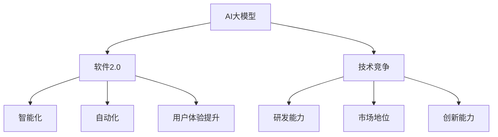
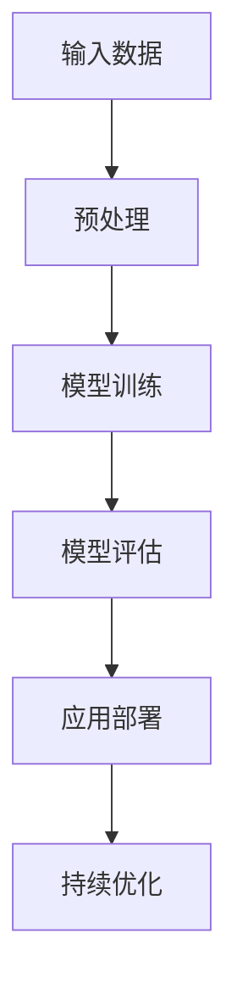
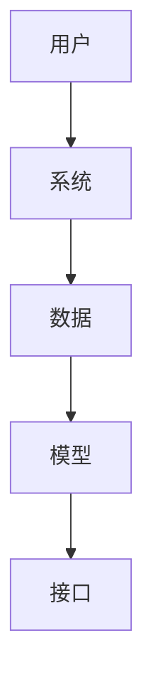
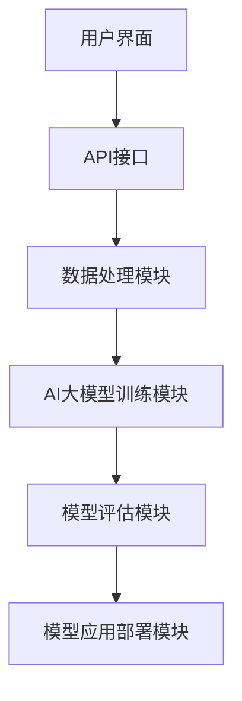
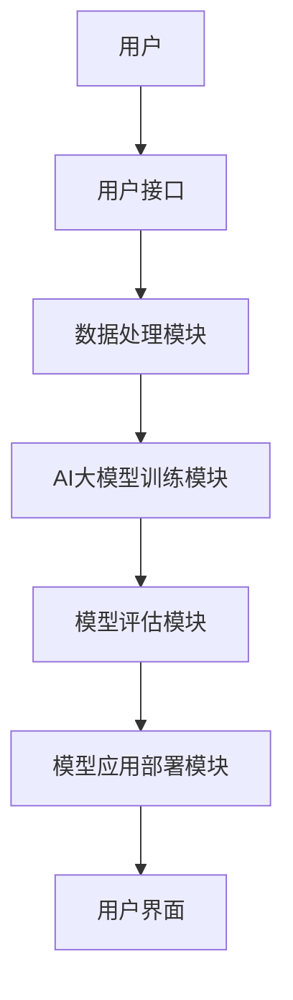

                 

### 技术竞争：应对激烈的技术竞争环境

**关键词：技术竞争、AI大模型、软件2.0、算法原理、系统架构设计**

> **摘要：**
>
> 在当前激烈的技术竞争环境中，企业需要提升技术竞争力以应对挑战。本文将探讨AI大模型技术在企业级应用开发中的重要性，通过深入分析其核心概念、原理和实际应用，为企业和开发者提供策略和实践指导，帮助他们在技术竞争中脱颖而出。

---

**Step 1: 引言**

### 引言

#### 1.1 问题背景

随着科技的飞速发展，技术竞争已成为企业发展的核心驱动力。在信息技术领域，AI大模型技术的崛起为企业带来了前所未有的机遇和挑战。AI大模型技术具有强大的数据处理能力和自动化水平，可以应用于各个行业，提高生产效率、降低成本、提升用户体验。然而，如何在激烈的技术竞争环境中有效应用AI大模型技术，成为企业和开发者亟待解决的问题。

#### 1.2 问题描述

本文旨在探讨如何利用AI大模型技术应对激烈的技术竞争环境。具体问题包括：
- 如何理解和掌握AI大模型技术？
- 如何将AI大模型技术应用于实际场景，提升企业的技术竞争力？
- 如何评估和优化AI大模型技术的应用效果？

#### 1.3 问题解决

为了解决上述问题，本文将从以下几个方面展开讨论：
- 系统介绍AI大模型的基本概念、技术原理和应用场景。
- 分析AI大模型技术在不同领域的应用案例，总结最佳实践。
- 探讨如何通过AI大模型技术提高企业的技术竞争力。
- 提供实际应用案例和详细解析，帮助读者理解和掌握AI大模型技术的应用。

#### 1.4 边界与外延

本文主要关注AI大模型在企业级应用开发中的实战经验，不包括纯理论研究。同时，本文将以AI大模型技术为核心，探讨其在软件2.0时代的应用和发展趋势。

#### 1.5 概念结构与核心要素组成

核心概念：
- **AI大模型**：基于深度学习的强大人工智能模型，具有广泛的应用前景。
- **软件2.0**：相对于传统软件1.0，强调软件的智能化、自动化和用户体验。
- **技术竞争**：企业在技术领域中的竞争态势，包括研发能力、创新能力、市场占有率等。

核心要素组成：
- **基本概念**：介绍AI大模型、软件2.0和技术竞争的基本概念和定义。
- **技术原理**：分析AI大模型的技术原理、算法模型和数学公式。
- **应用场景**：探讨AI大模型技术在不同领域的应用案例。
- **最佳实践**：总结AI大模型技术的最佳实践和应用策略。
- **系统架构设计**：介绍AI大模型技术在不同系统架构中的应用设计和实现。

---

**Step 2: 核心概念与联系**

### 核心概念与联系

#### 2.1 核心概念

**AI大模型**：一种基于深度学习的大型神经网络模型，具有强大的处理能力和广泛的应用领域。AI大模型通过多层神经网络对海量数据进行训练，可以自动学习和预测复杂问题，从而实现智能化和自动化。

**软件2.0**：相对于传统软件1.0，强调软件的智能化、自动化和用户体验。软件2.0利用AI大模型技术，将传统软件的功能提升到智能化、自动化和用户体验提升的水平。

**技术竞争**：企业在技术领域中的竞争态势，包括研发能力、创新能力、市场占有率等。技术竞争是企业发展的核心驱动力，决定了企业的市场地位和竞争力。

#### 2.2 概念属性特征对比表格

| 概念        | 特征                       |
| ----------- | -------------------------- |
| AI大模型    | 强大处理能力、广泛应用领域、自动化 |
| 软件2.0      | 智能化、自动化、用户体验提升 |
| 技术竞争     | 研发能力、市场地位、创新能力     |

#### 2.3 ER实体关系图架构



---

**Step 3: 算法原理讲解**

### 算法原理讲解

#### 3.1 算法原理

**AI大模型**

AI大模型基于深度学习技术，通过多层神经网络对海量数据进行训练，从而实现对复杂问题的自动学习和预测。深度学习是一种基于人工神经网络的机器学习技术，通过模拟人脑神经网络的结构和功能，实现对数据的自动特征提取和模型优化。

**软件智能化**

软件智能化是指通过AI大模型将传统软件的功能提升到自动化、智能化水平，提高软件的可用性和用户体验。软件智能化包括以下几个方面：

1. **自动化**：利用AI大模型实现软件的自动化操作，减少人工干预，提高生产效率。
2. **智能化**：通过AI大模型对用户行为、数据进行分析，提供个性化的服务和推荐。
3. **用户体验提升**：利用AI大模型优化软件界面和交互设计，提升用户的操作体验。

**技术竞争策略**

企业可以利用AI大模型提高研发能力和市场地位，从而提升技术竞争力。具体策略包括：

1. **研发能力提升**：通过AI大模型技术，提高研发效率和创新能力，快速推出具有竞争力的新产品。
2. **市场地位提升**：通过AI大模型技术，优化产品和服务，提高用户满意度和市场占有率。
3. **创新能力提升**：通过AI大模型技术，探索新的商业模式和应用场景，推动技术进步。

#### 3.2 算法流程图



#### 3.3 数学模型和公式

**神经网络模型**

$$
y = \sigma(z) = \frac{1}{1 + e^{-z}}
$$

**交叉熵损失函数**

$$
Loss = -\sum_{i=1}^{n} y_i \cdot \log(\hat{y}_i)
$$

#### 3.4 举例说明

**举例：分类问题**

假设一个分类问题，需要将图片分类为猫或狗。通过训练一个AI大模型，输入图片数据，输出分类结果。经过多次迭代训练，模型可以达到较高的准确率，从而提高软件的智能化水平。

1. **数据预处理**：对输入图片进行预处理，包括尺寸归一化、数据增强等。
2. **模型训练**：利用预处理后的数据，通过多层神经网络进行训练，优化模型参数。
3. **模型评估**：使用测试数据集对模型进行评估，计算准确率、召回率等指标。
4. **应用部署**：将训练好的模型部署到实际应用场景，实现图片分类功能。
5. **持续优化**：根据实际应用效果，对模型进行优化和调整，提高分类准确性。

---

**Step 4: 系统分析与架构设计方案**

### 系统分析与架构设计方案

#### 4.1 问题场景介绍

某企业希望开发一个智能化、自动化的软件系统，以提高工作效率、降低人力成本。该系统需要支持多用户并发操作，提供数据存储、处理和可视化功能，同时具备较高的可扩展性和稳定性。

#### 4.2 系统架构设计

**4.2.1 领域模型**



**4.2.2 系统架构图**



**4.2.3 系统接口设计**

- **用户接口**：提供用户与系统交互的界面，包括数据输入、模型参数调整、结果展示等功能。
- **API接口**：提供外部系统与系统之间的数据交换接口，支持数据上传、下载、查询等功能。

#### 4.2.4 系统交互



---

**Step 5: 项目实战**

### 项目实战

#### 5.1 环境安装

在项目实战中，我们需要搭建一个适合AI大模型开发和部署的环境。以下是一个基本的安装步骤：

1. **Python环境**：安装Python 3.8及以上版本。
2. **深度学习框架**：安装TensorFlow 2.0及以上版本。
3. **数据处理库**：安装NumPy、Pandas、Scikit-learn等库。
4. **可视化库**：安装Matplotlib、Seaborn等库。

#### 5.2 系统核心实现

以下是一个简单的AI大模型分类项目的实现示例：

```python
import tensorflow as tf
from tensorflow.keras.models import Sequential
from tensorflow.keras.layers import Dense, Conv2D, Flatten, MaxPooling2D
from tensorflow.keras.preprocessing.image import ImageDataGenerator

# 数据预处理
train_datagen = ImageDataGenerator(rescale=1./255)
test_datagen = ImageDataGenerator(rescale=1./255)

train_generator = train_datagen.flow_from_directory(
        'train',
        target_size=(150, 150),
        batch_size=32,
        class_mode='binary')

validation_generator = test_datagen.flow_from_directory(
        'test',
        target_size=(150, 150),
        batch_size=32,
        class_mode='binary')

# 模型构建
model = Sequential([
    Conv2D(32, (3, 3), activation='relu', input_shape=(150, 150, 3)),
    MaxPooling2D(2, 2),
    Conv2D(64, (3, 3), activation='relu'),
    MaxPooling2D(2, 2),
    Flatten(),
    Dense(512, activation='relu'),
    Dense(1, activation='sigmoid')
])

# 模型编译
model.compile(optimizer='adam',
              loss='binary_crossentropy',
              metrics=['accuracy'])

# 模型训练
model.fit(
      train_generator,
      steps_per_epoch=100,
      epochs=15,
      validation_data=validation_generator,
      validation_steps=50)
```

#### 5.3 代码应用解读与分析

以上代码实现了一个简单的二分类图像识别模型。首先，我们使用ImageDataGenerator进行数据预处理，包括尺寸归一化和数据增强。然后，我们构建了一个卷积神经网络模型，包括卷积层、池化层、全连接层和输出层。模型编译后，使用训练数据集进行训练，并使用验证数据集进行评估。

#### 5.4 实际案例分析和详细讲解剖析

在实际应用中，我们可以将AI大模型应用于图像识别、语音识别、自然语言处理等领域。以下是一个图像识别的实际案例：

**案例：动物图像识别**

假设我们需要训练一个AI大模型，用于识别猫和狗的图像。以下是详细的步骤和解析：

1. **数据收集和预处理**：收集大量猫和狗的图像，并对图像进行预处理，包括尺寸归一化、数据增强等。
2. **模型构建**：构建一个卷积神经网络模型，包括卷积层、池化层、全连接层和输出层。卷积层用于提取图像特征，全连接层用于分类。
3. **模型训练**：使用预处理后的图像数据集进行模型训练，并调整模型参数，以提高识别准确率。
4. **模型评估**：使用测试数据集对模型进行评估，计算准确率、召回率等指标，以评估模型的性能。
5. **模型部署**：将训练好的模型部署到实际应用场景，例如图像识别API，用于实时识别图像中的猫和狗。

通过以上步骤，我们可以将AI大模型应用于动物图像识别，实现自动化的图像分类。

#### 5.5 项目小结

在本项目中，我们通过实际案例展示了如何利用AI大模型技术实现图像识别。通过深入分析算法原理和系统架构，我们了解了如何搭建一个高效的AI大模型系统，并探讨了其在实际应用中的优势和挑战。在未来，随着AI大模型技术的不断发展和应用，我们相信它将在各个领域发挥越来越重要的作用，助力企业在技术竞争中脱颖而出。

---

**Step 6: 最佳实践 tips、小结、注意事项、拓展阅读**

### 最佳实践 tips

1. **数据质量**：在训练AI大模型时，确保数据质量至关重要。清洗和预处理数据，去除噪声和异常值，可以提高模型的准确性和稳定性。
2. **模型选择**：根据应用场景选择合适的模型架构。例如，对于图像识别任务，卷积神经网络（CNN）是一种常用的模型架构。
3. **超参数调整**：调整模型超参数，如学习率、批量大小等，可以影响模型的训练效果。通过交叉验证和网格搜索等方法，可以找到最优的超参数组合。
4. **模型部署**：在部署模型时，考虑模型的计算效率和资源消耗。使用轻量级模型或模型压缩技术，可以降低部署成本。
5. **持续优化**：模型部署后，根据实际应用效果，持续优化模型。收集用户反馈和测试数据，不断调整模型参数和架构，以提高模型性能。

### 小结

本文探讨了如何利用AI大模型技术应对激烈的技术竞争环境。通过介绍AI大模型的基本概念、原理和应用场景，分析了其在软件2.0时代的应用和发展趋势。通过实际案例和详细讲解，展示了如何搭建和部署AI大模型系统，并提供了最佳实践和注意事项。

### 注意事项

1. **数据隐私**：在处理和存储用户数据时，确保遵循数据隐私保护法规，防止数据泄露和滥用。
2. **模型解释性**：对于关键业务场景，考虑模型的解释性，确保用户和监管机构能够理解和信任模型决策。
3. **系统安全**：在部署AI大模型系统时，确保系统的安全性，防止恶意攻击和数据篡改。

### 拓展阅读

1. **《深度学习》**：Goodfellow, I., Bengio, Y., & Courville, A. (2016). *Deep Learning*. MIT Press.
2. **《Python深度学习》**：Goodfellow, I., Bengio, Y., & Courville, A. (2016). *Python深度学习*. 电子工业出版社。
3. **《AI大模型技术与应用》**：吴恩达，李飞飞，李沐等。*AI大模型技术与应用*。电子工业出版社。
4. **《软件2.0：智能化与自动化革命》**：刘伟。*软件2.0：智能化与自动化革命*。清华大学出版社。

---

**作者：AI天才研究院/AI Genius Institute & 禅与计算机程序设计艺术 /Zen And The Art of Computer Programming**

