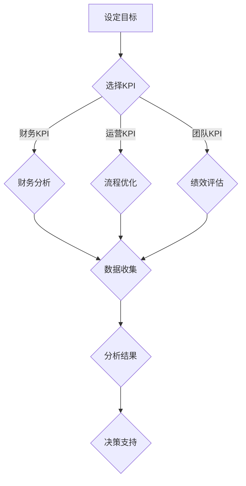
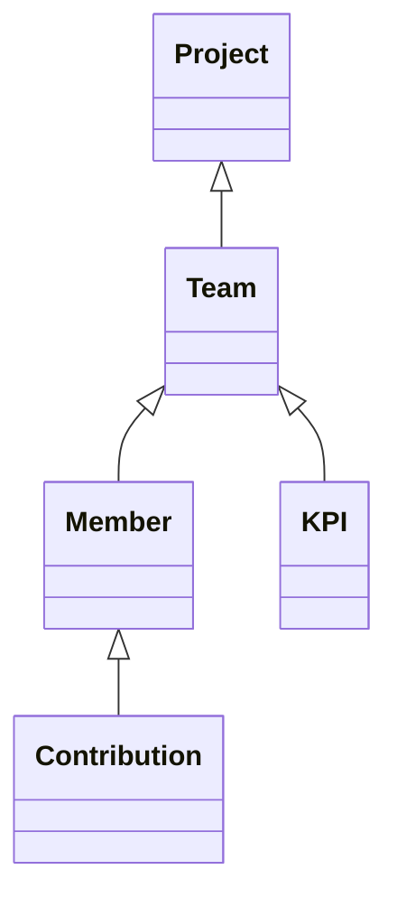
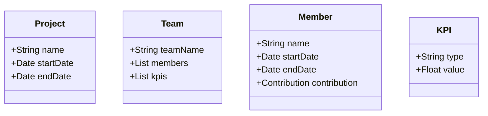
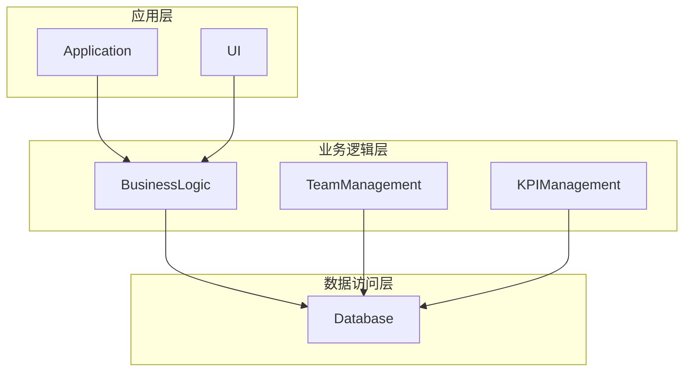
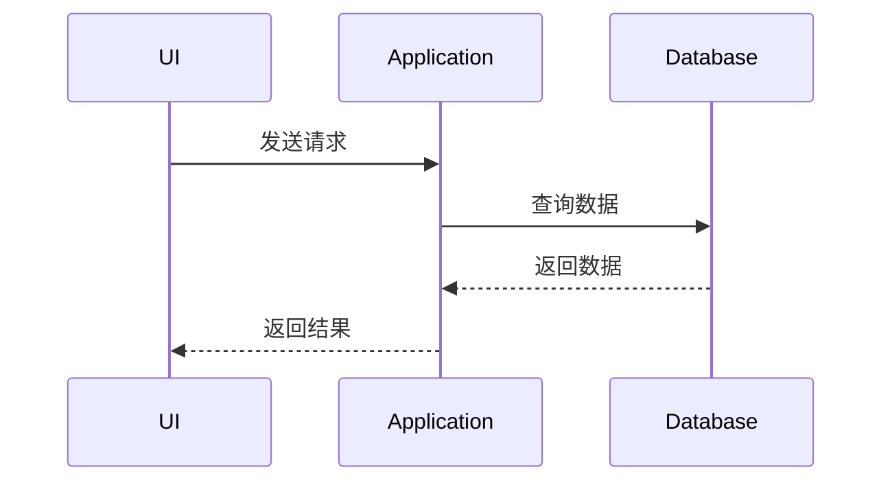
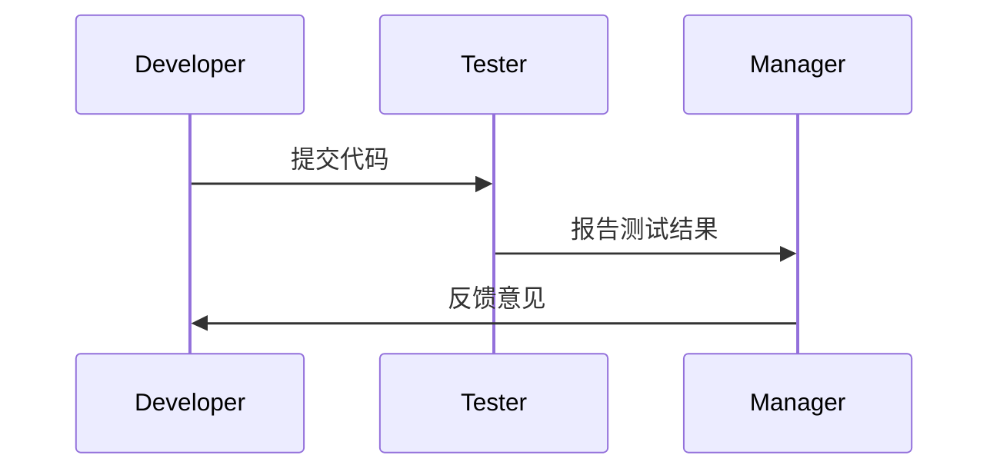

                 

**文章标题**：技术管理KPI设定：量化技术团队的贡献

**关键词**：技术管理、KPI、量化、团队贡献、项目管理

**摘要**：
本文深入探讨了技术管理中的关键绩效指标（KPI）设定问题，旨在帮助技术管理者理解和实施一套有效的量化体系，以衡量技术团队的贡献。我们将从背景介绍、核心概念分析、算法原理讲解、系统分析与架构设计、项目实战，以及最佳实践等角度，逐步解析如何通过KPI量化技术团队的工作成效。

## 第一部分：问题背景与核心概念

### 1.1 背景介绍

**核心概念术语说明**：
- **技术管理**：涉及技术团队的组织、协调和监督。
- **KPI（关键绩效指标）**：用于衡量绩效的具体指标。
- **量化贡献**：将技术团队的工作成果用数据形式表现。

**问题背景**：
在快速发展的技术行业中，技术团队的管理越来越复杂。管理者需要了解如何设定合理的KPI来评估团队的工作效果，从而更好地支持业务发展。

**问题描述**：
技术管理者面临的主要问题是，如何通过量化的方式衡量技术团队在不同项目中的贡献，进而为团队制定改进计划和激励策略。

**问题解决**：
通过设定合适的KPI，可以量化团队的工作成效，为技术管理提供有力的数据支持。

**边界与外延**：
- **边界**：本文主要关注IT行业中的技术团队，侧重于软件开发和系统运维。
- **外延**：KPI的应用范围不仅限于IT行业，但本文将聚焦于技术领域的应用。

### 1.2 核心概念与联系

**核心概念**：
- **KPI的分类**：
  - **财务KPI**：衡量公司的财务健康状况。
  - **运营KPI**：评估业务流程的效率。
  - **团队KPI**：专注于团队的工作表现。

**概念属性特征对比表格**：

| 类别       | 特征                   | 适用场景                  |
|------------|------------------------|--------------------------|
| 财务KPI    | 关注财务数据           | 公司高层决策、预算管理   |
| 运营KPI    | 关注业务流程效率       | 运营优化、流程改进       |
| 团队KPI    | 关注团队工作表现       | 技术团队管理、绩效评估   |

**ER实体关系图**：

```mermaid
erDiagram
    KPI <<|-- 财务KPI
    KPI <<|-- 运营KPI
    KPI <<|-- 团队KPI
    KPI ||--|{ 项目 }
    KPI ||--|{ 团队 }
    KPI ||--|{ 个人 }
```

## 第二部分：算法原理讲解

### 2.1 算法原理

**算法流程图**：



**算法流程详细说明**：

1. **设定目标**：明确项目或团队的目标。
2. **选择KPI**：根据目标选择合适的KPI。
3. **数据收集**：收集与KPI相关的数据。
4. **分析结果**：对收集的数据进行分析。
5. **决策支持**：根据分析结果为技术管理提供决策支持。

### 2.2 Python源代码阐述

```python
import pandas as pd

# 假设我们已经收集到了以下数据
data = {
    'Project': ['Project A', 'Project B', 'Project C'],
    'KPI': ['Efficiency', 'Quality', 'Innovation'],
    'Value': [0.8, 0.9, 0.75]
}

df = pd.DataFrame(data)

# 计算平均KPI值
average_kpi = df['Value'].mean()

print(f"Average KPI: {average_kpi}")
```

**算法数学模型与公式**：

$$
\text{KPI}_{\text{average}} = \frac{\sum_{i=1}^{n} \text{KPI}_i}{n}
$$

其中，$n$是KPI的数量，$\text{KPI}_i$是第$i$个KPI的值。

**举例说明**：

假设有三个项目，其KPI值分别为效率0.8、质量0.9和创新0.75。则平均KPI值为：

$$
\text{KPI}_{\text{average}} = \frac{0.8 + 0.9 + 0.75}{3} = 0.8333
$$

## 第三部分：系统分析与架构设计

### 3.1 问题场景介绍

假设我们是一家大型互联网公司的技术部门，需要为不同的项目团队设定KPI，以衡量团队的工作成效。

### 3.2 项目介绍

**项目背景**：
公司计划上线一款新应用，需要多个团队协作完成，包括前端开发、后端开发、测试团队等。

**项目目标**：
确保项目按时上线，同时保证应用质量。

**项目范围**：
包括需求分析、设计、开发、测试等环节。

### 3.3 系统功能设计

**领域模型**：



**类图**：



### 3.4 系统架构设计

**整体架构**：



**接口设计**：



**系统交互设计**：



## 第四部分：项目实战

### 4.1 环境安装与配置

**环境安装指南**：

1. 安装Python 3.8或以上版本。
2. 安装Pandas、NumPy、SQLAlchemy等库。

**系统配置说明**：

1. 配置数据库连接。
2. 配置KPI类型和数据收集规则。

### 4.2 系统核心实现

**核心代码实现**：

```python
# 数据库连接配置
engine = create_engine('sqlite:///kpi.db')

# 创建表
create_table_query = '''
CREATE TABLE IF NOT EXISTS projects (
    id INTEGER PRIMARY KEY,
    name TEXT,
    start_date DATE,
    end_date DATE
);
'''

create_table_query2 = '''
CREATE TABLE IF NOT EXISTS kpis (
    id INTEGER PRIMARY KEY,
    project_id INTEGER,
    type TEXT,
    value FLOAT,
    FOREIGN KEY (project_id) REFERENCES projects (id)
);
'''

connection = engine.connect()
connection.execute(create_table_query)
connection.execute(create_table_query2)

# 插入数据
insert_data = '''
INSERT INTO projects (name, start_date, end_date) VALUES ('Project A', '2023-01-01', '2023-03-31');
'''

connection.execute(insert_data)
connection.commit()

# 数据查询
query_data = '''
SELECT * FROM projects;
'''

df = pd.read_sql_query(query_data, connection)
print(df)
```

**代码应用解读与分析**：

1. **数据库连接与表创建**：配置数据库连接，创建项目和KPI表。
2. **数据插入与查询**：插入项目数据，查询项目信息。

### 4.3 实际案例分析和详细讲解剖析

**实际案例**：

假设我们有两个项目，项目A的KPI包括效率0.8、质量和创新0.75，项目B的KPI包括效率0.9、质量和创新0.8。我们需要计算每个项目的平均KPI。

**案例分析**：

1. **数据收集**：从数据库中提取KPI数据。
2. **数据分析**：计算每个项目的平均KPI。
3. **结果展示**：输出平均KPI结果。

**详细讲解剖析**：

- **数据收集**：通过SQL查询从数据库中提取项目数据。
- **数据分析**：使用Pandas库计算平均KPI。
- **结果展示**：以表格形式输出分析结果。

### 4.4 项目小结

**项目总结**：
本文通过理论与实践，详细介绍了技术管理KPI的设定方法，包括核心概念、算法原理、系统分析与架构设计，以及项目实战。通过合理设定KPI，技术管理者可以更好地量化团队贡献，优化管理策略。

**优化建议**：
1. 定期回顾和调整KPI，确保其与公司战略保持一致。
2. 增加团队参与KPI设定的过程，提高团队认同感。

**拓展阅读**：
- 《敏捷开发实践指南》
- 《关键绩效指标：驱动企业成功》

## 第五部分：最佳实践 tips、小结、注意事项、拓展阅读

### 最佳实践 tips

1. **明确目标**：在设定KPI之前，确保团队对项目目标有清晰的认识。
2. **多角度衡量**：综合考虑财务、运营和团队绩效，确保KPI的全面性。
3. **实时反馈**：及时收集和分析KPI数据，为团队提供实时反馈。

### 小结

本文通过系统的方法，探讨了技术管理KPI的设定问题，强调了其在量化技术团队贡献中的重要作用。通过合理设定和运用KPI，技术管理者可以更有效地提升团队绩效和公司整体竞争力。

### 注意事项

1. **KPI的定制性**：根据不同团队和项目的特点，定制合适的KPI。
2. **数据的准确性**：确保KPI数据的准确性和可靠性，避免数据偏差。

### 拓展阅读

- 《技术领导力：如何打造高效的软件开发团队》
- 《项目管理知识体系指南》

**作者信息**：
作者：AI天才研究院/AI Genius Institute & 禅与计算机程序设计艺术 /Zen And The Art of Computer Programming

