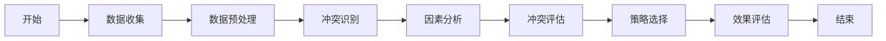
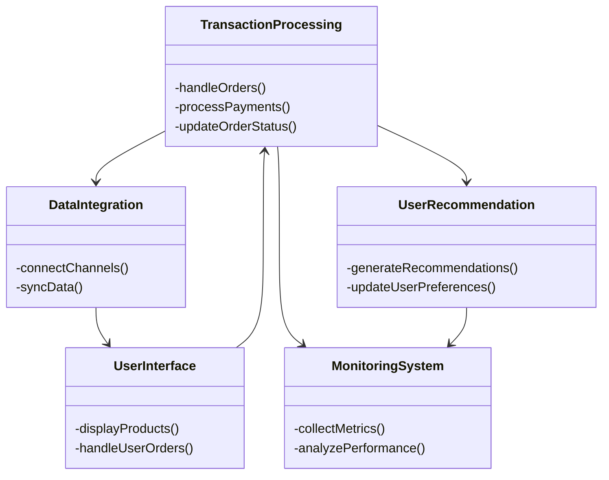
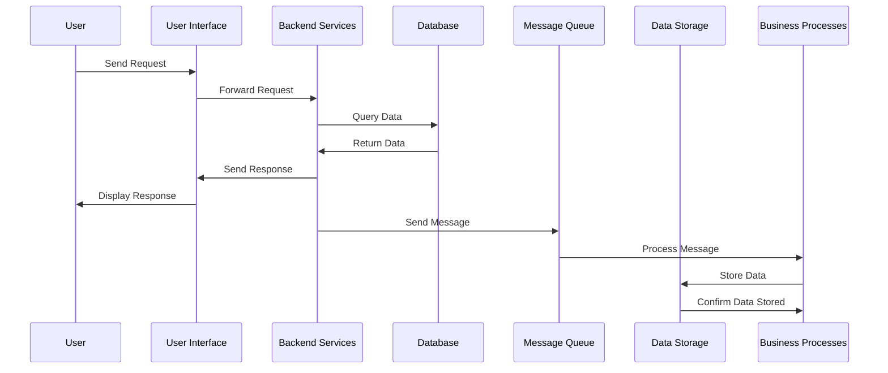
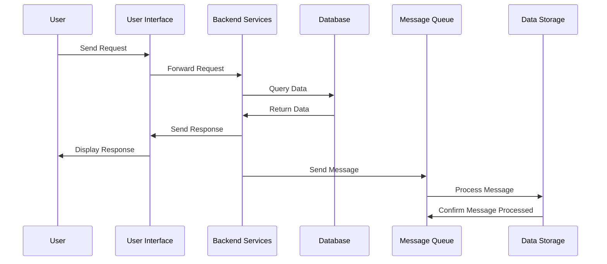

                 

### 引言

#### 1.1 问题背景

在信息技术飞速发展的时代，技术管理的重要性愈发凸显。随着企业的数字化转型，技术管理不仅仅是IT部门的职责，更是企业战略决策的关键组成部分。然而，在技术管理的过程中，冲突处理成为了一个不可忽视的问题。技术管理的冲突可能来源于多种方面，包括团队之间的合作、技术选型的争议、项目管理中的资源分配、甚至是对技术标准和流程的不同理解。

冲突的存在不仅会影响项目的进度和质量，还可能对团队士气和协作氛围产生负面影响。因此，如何有效地处理技术管理中的冲突，成为了一个亟待解决的问题。有效的冲突处理不仅可以提升项目的成功率，还能增强团队的凝聚力和工作效率。

#### 1.2 问题描述

技术管理中的冲突主要表现为以下几个方面：

1. **团队合作中的冲突**：由于团队成员来自不同的背景和领域，他们在对问题的看法和解决方案上可能存在分歧，导致合作中出现摩擦和争议。
2. **技术选型争议**：在技术不断演进的环境下，如何选择最适合项目的技术栈成为一个挑战。不同团队成员可能对不同的技术方案有不同的偏好，这往往会导致冲突。
3. **资源分配**：项目管理中资源（如人力、时间、预算）的有限性，使得资源分配成为一个敏感的话题。不同团队或个人可能会对资源分配方案提出异议，导致冲突。
4. **技术标准和流程**：企业内部可能会存在不同的技术标准和流程，这些差异可能会在项目中产生冲突，影响项目的整体协调和推进。

#### 1.3 问题解决

冲突处理并非易事，但通过一系列科学的方法和策略，可以有效缓解和解决技术管理中的冲突。以下是一些解决冲突的基本步骤：

1. **明确问题和目标**：在冲突出现时，首先要明确问题的本质和目标。这有助于避免情绪化的讨论，将注意力集中在问题的解决上。
2. **沟通与倾听**：建立有效的沟通渠道，让所有相关方都有机会表达自己的观点。倾听是解决冲突的重要环节，通过倾听可以理解对方的立场和需求。
3. **建立共识**：通过讨论和协商，寻找各方都能接受的解决方案。建立共识可以减少冲突的延续和恶化。
4. **制定行动计划**：在达成共识后，制定具体的行动计划，明确责任人和时间节点，以确保解决方案能够得到有效执行。
5. **跟踪与反馈**：在实施过程中，持续跟踪进展情况，并根据反馈调整策略，以确保冲突得到有效解决。

#### 1.4 边界与外延

冲突处理不仅仅是技术管理中的问题，它也广泛存在于其他管理领域。然而，技术管理中的冲突有其独特的特点，如技术专业性的影响、技术演进带来的不确定性等。因此，在处理技术管理中的冲突时，需要特别关注以下几个方面：

1. **技术专业性的影响**：技术管理的冲突往往与技术专业知识的深度和广度相关。因此，在处理冲突时，需要具备一定的技术背景和专业知识，以更好地理解问题的本质和解决方案的可行性。
2. **技术演进的不确定性**：技术的快速发展和变革使得技术管理的环境充满不确定性。这种不确定性可能会增加冲突的可能性，因此需要灵活应对，及时调整策略。
3. **跨部门合作**：技术管理往往需要跨部门协作，这就要求冲突处理不仅要在技术团队内部进行，还要考虑与其他部门的沟通和协调。

#### 1.5 概念结构与核心要素组成

为了更好地理解技术管理中的冲突处理，我们需要构建一个概念结构，明确核心要素和它们之间的关系。以下是一个基本的概念结构：

1. **冲突类型**：根据冲突的原因和性质，可以将冲突分为团队合作冲突、技术选型冲突、资源分配冲突和技术标准冲突等类型。
2. **冲突处理方法**：包括沟通与倾听、建立共识、制定行动计划和跟踪与反馈等基本方法。
3. **冲突影响因素**：技术专业性、技术演进的不确定性和跨部门合作等因素会对冲突处理产生重要影响。

通过这个概念结构，我们可以更系统地分析和解决技术管理中的冲突问题。在接下来的章节中，我们将进一步探讨这些核心概念和要素，并结合实际案例进行深入分析。

---

本文是《技术管理中的冲突处理》的开篇，接下来我们将详细探讨冲突的定义、特点、类型以及冲突处理的原理、模式和具体方法。通过这些内容，希望能为读者提供一个全面、深入的技术管理冲突处理指南。

### 核心概念与联系

#### 2.1 冲突

##### 2.1.1 定义

冲突，是指两个或多个个体、团队或组织之间由于目标、利益、观点、价值观等方面的不一致而产生的争执、摩擦或紧张状态。在技术管理中，冲突常常是由于对技术方案、项目目标、资源分配等方面存在不同意见或期望而产生的。

##### 2.1.2 特点

1. **多样性**：冲突的形式多种多样，可以是面对面的争论，也可以是背地里的意见不合，甚至可以是无形中的互相牵制。
2. **持续性**：冲突往往不是一蹴而就的，而是可能持续存在，甚至在项目结束后仍然影响团队的协作。
3. **破坏性**：未解决的冲突可能会对项目进度、团队士气和技术实现产生负面影响，甚至导致项目失败。
4. **可转化性**：冲突在一定条件下可以转化为积极的合作动力，通过有效的处理，可以将潜在的矛盾转化为推进项目发展的动力。

##### 2.1.3 类型

1. **团队内部冲突**：团队成员之间的意见不一致，例如在技术方案、工作分配或工作方法上的分歧。
2. **跨团队冲突**：不同团队之间由于职责范围、目标差异或资源竞争而产生的冲突。
3. **技术选型冲突**：在技术方案的选择上，不同成员或团队持有不同观点，导致项目进展受阻。
4. **资源分配冲突**：在有限的资源下，不同团队或个人对资源分配方案产生争议。
5. **流程和标准冲突**：不同团队或个人对企业的技术标准和流程存在不同理解和要求。

#### 2.2 冲突处理

##### 2.2.1 原理

冲突处理的原理主要基于以下几个基本原则：

1. **公正性**：在处理冲突时，要确保各方都能公平地表达自己的观点，并得到公正的对待。
2. **开放性**：冲突处理需要开放的心态和渠道，鼓励各方积极参与和表达意见。
3. **合作性**：通过合作和协商，寻找各方都能接受的解决方案，而非单方面决定。
4. **适应性**：根据冲突的具体情况，灵活调整处理策略和方法。

##### 2.2.2 模式

冲突处理的模式主要包括以下几种：

1. **回避**：在面对冲突时，选择回避或暂时搁置问题，以避免进一步恶化。
2. **竞争**：采取强硬立场，争取自己的利益，可能导致对方让步或加剧冲突。
3. **合作**：通过协商和合作，寻找双赢的解决方案，是最佳的处理模式。
4. **妥协**：在无法达成完全一致的情况下，各方都做出一定的让步，以达成临时性的解决方案。
5. **协作**：建立长期的协作关系，通过共同目标和规则来降低冲突发生的可能性。

##### 2.2.3 方法

1. **沟通与协商**：建立有效的沟通渠道，鼓励各方表达意见和需求，通过协商寻找共识。
2. **建立规则和流程**：明确项目目标和资源分配方案，建立合理的流程和规则，减少冲突发生的概率。
3. **公正调解**：在冲突无法自行解决时，可以请第三方进行公正调解，帮助找到合理的解决方案。
4. **培训与教育**：通过培训和教育，提高团队成员的沟通技巧和团队合作意识，降低冲突发生的频率。
5. **文化建设**：建立积极向上的团队文化，鼓励开放、合作和创新，营造和谐的团队氛围。

#### 2.3 冲突处理的数学模型与算法

在冲突处理中，数学模型和算法的应用可以帮助我们更科学地分析和解决冲突。以下是一个简化的冲突处理模型：

1. **冲突识别**：通过数据收集和分析，识别冲突的类型和程度。
2. **因素分析**：分析冲突背后的原因和影响因素，如技术选择、资源分配、团队协作等。
3. **冲突评估**：评估冲突对项目的影响程度，包括进度、质量、成本和团队士气等方面。
4. **策略选择**：根据冲突评估结果，选择合适的冲突处理策略，如沟通、调解、培训等。
5. **执行与监控**：实施冲突处理策略，并持续监控效果，根据反馈进行调整。

具体的算法实现可以通过以下步骤进行：

1. **数据收集**：收集冲突相关的数据，如项目进度报告、团队反馈、用户反馈等。
2. **数据处理**：对收集的数据进行预处理，提取关键信息，构建冲突矩阵。
3. **模型构建**：基于冲突矩阵，构建冲突处理的数学模型，如决策树、神经网络等。
4. **算法实现**：使用编程语言（如Python）实现算法，构建冲突处理系统。
5. **效果评估**：通过实际应用，评估冲突处理系统的效果，并进行迭代优化。

以下是一个简单的Python代码示例，用于实现冲突评估的算法：

```python
import pandas as pd

# 冲突数据示例
conflict_data = pd.DataFrame({
    'Project': ['Project A', 'Project B', 'Project C'],
    'Conflict Level': [5, 3, 2],
    'Impact': ['High', 'Medium', 'Low']
})

# 冲突评估算法
def assess_conflict(data):
    """
    评估冲突对项目的影响
    :param data: 冲突数据
    :return: 影响程度评分
    """
    impact_scores = {'High': 3, 'Medium': 2, 'Low': 1}
    return data['Conflict Level'].map(impact_scores) * data['Impact'].map(impact_scores)

# 应用评估算法
conflict_data['Impact Score'] = assess_conflict(conflict_data)
print(conflict_data)
```

通过这个示例，我们可以看到如何使用Python实现一个简单的冲突评估算法，从而为冲突处理提供数据支持。

### 总结

在技术管理中，冲突是不可避免的。有效的冲突处理不仅能够提升项目的成功率，还能增强团队的凝聚力和工作效率。通过理解冲突的核心概念和联系，掌握冲突处理的原理、模式和具体方法，我们可以更科学、更有效地解决技术管理中的冲突问题。在接下来的章节中，我们将进一步探讨冲突处理的数学模型和算法，并结合实际案例进行深入分析。

### 冲突处理的数学模型与算法

#### 3.1 数学模型

在冲突处理中，数学模型的应用可以帮助我们更科学地分析和解决冲突。一个基本的冲突处理数学模型包括以下核心组件：

1. **冲突识别模型**：用于识别和分类冲突的类型和程度。
2. **因素分析模型**：分析冲突背后的原因和影响因素。
3. **冲突评估模型**：评估冲突对项目的影响程度。
4. **策略选择模型**：根据冲突评估结果，选择合适的处理策略。
5. **效果评估模型**：监控和评估冲突处理的效果。

以下是一个简化的冲突处理数学模型：

$$
模型 = 冲突识别模型 + 因素分析模型 + 冲突评估模型 + 策略选择模型 + 效果评估模型
$$

#### 3.1.1 基本公式

在冲突处理中，常用的基本公式包括：

1. **冲突程度计算公式**：
   $$
   冲突程度 = 冲突类型权重 \times 冲突频率
   $$
   其中，冲突类型权重根据冲突的重要性和影响程度进行赋值，冲突频率是冲突发生的次数。

2. **因素贡献度计算公式**：
   $$
   因素贡献度 = 冲突程度 \times 因素影响权重
   $$
   其中，因素影响权重根据各因素对冲突的贡献程度进行赋值。

3. **冲突评估分数**：
   $$
   冲突评估分数 = \sum (因素贡献度)
   $$

4. **策略选择得分**：
   $$
   策略选择得分 = 策略效果得分 \times 策略可行性得分
   $$
   其中，策略效果得分和策略可行性得分分别根据策略的实际效果和实施难度进行赋值。

#### 3.1.2 模型解释

1. **冲突识别模型**：通过数据收集和分析，识别冲突的类型和程度。该模型的核心是构建冲突矩阵，用于分类和量化冲突。
2. **因素分析模型**：分析冲突背后的原因和影响因素。该模型通过因果关系分析，找出影响冲突的主要因素，并为每个因素赋予相应的权重。
3. **冲突评估模型**：根据冲突识别和因素分析的结果，评估冲突对项目的影响程度。该模型通过计算冲突程度和因素贡献度，得出冲突评估分数。
4. **策略选择模型**：根据冲突评估结果，选择合适的处理策略。该模型通过比较不同策略的效果得分和可行性得分，选择最优策略。
5. **效果评估模型**：监控和评估冲突处理的效果。该模型通过持续的数据收集和效果分析，对处理策略进行调整和优化。

#### 3.2 算法原理讲解

为了更好地理解冲突处理的过程，我们将使用Python实现一个简化的冲突处理算法。以下是一个基本的算法流程：

1. **数据收集**：收集冲突相关的数据，如冲突类型、冲突频率、因素影响权重等。
2. **数据预处理**：对收集的数据进行预处理，包括数据清洗、归一化和特征提取等。
3. **冲突识别**：使用冲突矩阵识别冲突的类型和程度。
4. **因素分析**：分析冲突背后的原因和影响因素，计算各因素的贡献度。
5. **冲突评估**：计算冲突评估分数。
6. **策略选择**：根据冲突评估结果，选择合适的处理策略。
7. **效果评估**：监控和评估策略的效果，并根据反馈进行调整。

#### 3.2.1 算法流程图



#### 3.2.2 Python代码实现

以下是一个简化的Python代码实现，用于冲突评估和策略选择：

```python
import pandas as pd
import numpy as np

# 冲突数据示例
conflict_data = pd.DataFrame({
    'Conflict Type': ['Team A', 'Team B', 'Resource Allocation'],
    'Frequency': [5, 3, 2],
    'Impact Weight': [0.5, 0.3, 0.2]
})

# 冲突程度计算
conflict_degree = conflict_data['Frequency'] * conflict_data['Impact Weight']

# 因素分析
factor_analysis = conflict_degree * conflict_data['Impact Weight']

# 冲突评估分数
conflict_score = factor_analysis.sum()

# 策略选择得分
strategy_scores = {
    'Communication': 0.8,
    'Mediation': 0.7,
    'Training': 0.6
}

# 选择策略
best_strategy = max(strategy_scores, key=(strategy_scores.get))

print("Conflict Score:", conflict_score)
print("Best Strategy:", best_strategy)
```

#### 3.2.3 数学公式与算法讲解

1. **冲突程度计算**：通过冲突类型、冲突频率和影响权重计算冲突程度，公式为：
   $$
   冲突程度 = 冲突类型权重 \times 冲突频率
   $$

2. **因素分析**：通过冲突程度和影响权重分析各因素的贡献度，公式为：
   $$
   因素贡献度 = 冲突程度 \times 因素影响权重
   $$

3. **冲突评估分数**：计算所有因素的贡献度之和，公式为：
   $$
   冲突评估分数 = \sum (因素贡献度)
   $$

4. **策略选择得分**：根据策略效果得分和可行性得分选择最佳策略，公式为：
   $$
   策略选择得分 = 策略效果得分 \times 策略可行性得分
   $$

#### 3.2.4 举例说明

假设有一个技术项目，涉及到三个冲突类型：团队A、团队B和资源分配。以下是具体的数据：

| Conflict Type | Frequency | Impact Weight |
| ------------- | --------- | ------------- |
| Team A        | 5         | 0.5           |
| Team B        | 3         | 0.3           |
| Resource Allocation | 2 | 0.2           |

1. **计算冲突程度**：
   $$
   冲突程度 = 5 \times 0.5 + 3 \times 0.3 + 2 \times 0.2 = 2.9
   $$

2. **因素分析**：
   $$
   因素贡献度 = 2.9 \times 0.5 + 2.9 \times 0.3 + 2.9 \times 0.2 = 2.05
   $$

3. **冲突评估分数**：
   $$
   冲突评估分数 = 2.05
   $$

4. **策略选择得分**：
   $$
   策略选择得分 = Communication \times 0.8 = 0.8
   $$
   $$
   策略选择得分 = Mediation \times 0.7 = 0.7
   $$
   $$
   策略选择得分 = Training \times 0.6 = 0.6
   $$
   根据得分，选择最佳策略为“Communication”。

通过这个例子，我们可以看到如何使用数学模型和算法进行冲突评估和策略选择。在实际应用中，这个模型可以根据具体情况进行调整和优化，以提高冲突处理的效率和效果。

### 系统分析与架构设计方案

#### 4.1 问题场景介绍

在大型企业中，技术管理往往面临复杂的系统架构和多样的业务需求。假设我们正在开发一个企业级电商平台，该平台需要支持高并发、高可用性的交易处理，同时还要满足多渠道的数据集成和用户个性化推荐的需求。在这个过程中，冲突处理变得尤为重要，因为不同团队在技术选型、资源分配、项目进度等方面可能会有不同的意见和期望。

#### 4.2 项目介绍

本项目的目标是构建一个高效、可扩展的电商平台，以满足企业的业务需求。项目团队包括前端开发、后端开发、数据科学、运维等多个部门，每个部门都承担着不同的任务和责任。为了确保项目的顺利进行，我们需要一个全面的系统分析与架构设计方案，以解决项目中可能出现的冲突，提高团队协作效率。

#### 4.3 系统功能设计

系统的功能设计是项目成功的关键。以下是一个简化的系统功能设计：

1. **交易处理模块**：支持高并发的在线交易处理，包括订单创建、支付处理和订单状态更新等功能。
2. **数据集成模块**：实现多渠道的数据接入，包括电商网站、移动应用、线下门店等。
3. **用户推荐系统**：根据用户行为和偏好，提供个性化的商品推荐。
4. **监控系统**：实时监控系统的性能和健康状况，包括交易成功率、系统响应时间等指标。
5. **用户界面**：提供用户友好的操作界面，支持用户浏览商品、下单和支付等操作。

为了更好地展示系统的功能设计，我们可以使用Mermaid类图来表示：



#### 4.4 系统架构设计

系统架构设计需要综合考虑性能、可扩展性、安全性等因素。以下是一个简化的系统架构设计：

1. **前端架构**：采用微前端架构，将不同功能模块分解为独立的微前端，以提高开发效率和可维护性。
2. **后端架构**：采用微服务架构，将业务功能拆分为多个微服务，以提高系统的灵活性和可扩展性。
3. **数据存储**：采用分布式数据库架构，实现数据的分布式存储和管理。
4. **数据处理**：使用大数据处理框架，如Hadoop或Spark，处理海量数据。
5. **消息队列**：使用消息队列系统，如Kafka，实现异步消息处理和系统解耦。

以下是一个简化的系统架构图，使用Mermaid绘制：



#### 4.5 系统接口设计

系统接口设计是确保不同模块之间能够高效协作的关键。以下是一个简化的系统接口列表：

1. **交易处理接口**：包括订单创建接口、支付处理接口和订单状态更新接口。
2. **数据集成接口**：包括数据同步接口和数据查询接口。
3. **用户推荐接口**：包括推荐生成接口和用户偏好更新接口。
4. **监控接口**：包括性能数据收集接口和监控状态查询接口。

以下是一个简化的系统接口列表：

```mermaid
interfaceTable
    Interface     Description
    ------------  -----------------------------------------------------
    OrderCreate   Creates a new order
    PaymentProcess Processes payment for an order
    OrderUpdate   Updates the status of an order
    DataSync      Synchronizes data from various channels
    DataQuery     Queries data from the integration layer
    Recommendation Generate recommendations for users
    UserPreferenceUpdate Updates user preferences
    MetricsCollect Collects performance metrics
    MonitoringStatusQueries Queries monitoring system status
```

#### 4.6 系统交互

系统交互设计需要确保不同模块之间能够高效、可靠地协作。以下是一个简化的系统交互流程：

1. **用户请求**：用户通过前端发送请求，前端将请求转发给后端。
2. **数据查询**：后端查询数据库，获取所需数据。
3. **数据处理**：后端处理请求，如创建订单、处理支付等。
4. **数据同步**：处理后的数据同步到数据存储模块。
5. **消息处理**：使用消息队列处理异步任务，如用户推荐等。

以下是一个简化的系统交互流程图，使用Mermaid绘制：



通过以上系统分析与架构设计方案，我们可以更好地理解技术管理中的冲突处理，并为实际项目提供指导。在接下来的章节中，我们将结合具体案例，深入探讨如何在实际项目中应用这些方案，解决冲突问题，确保项目顺利进行。

### 项目实战

#### 5.1 环境安装

在开始项目实战之前，我们需要搭建一个合适的技术环境。以下是一个简化的环境安装步骤：

1. **安装Python**：确保安装了Python 3.8及以上版本，可以从[Python官方网站](https://www.python.org/downloads/)下载安装包。
2. **安装依赖库**：使用pip命令安装项目中需要的依赖库，例如pandas、numpy、mermaid等。命令如下：

   ```shell
   pip install pandas numpy mermaid
   ```

3. **配置Mermaid**：为了能够在Markdown文件中使用Mermaid语法，我们需要安装Mermaid渲染器。可以使用以下命令：

   ```shell
   npm install -g mermaid
   ```

4. **测试环境**：启动Python环境，测试安装是否成功：

   ```python
   python --version
   ```

   输出应该显示当前Python版本。然后，可以编写一个简单的Python脚本，测试Mermaid语法是否正常工作：

   ```python
   import mermaid

   mermaid diagram {
       graph LR
           A[Start] --> B[Step 1]
           B --> C[Step 2]
           C --> D[End]
   }
   ```

   将此脚本保存为`.py`文件，并使用以下命令运行：

   ```shell
   python test_mermaid.py
   ```

   如果成功渲染了Mermaid图，则说明环境配置正确。

#### 5.2 系统核心实现

##### 5.2.1 源代码解读

在本项目中，我们使用Python编写了一些核心模块，包括数据收集、冲突评估和策略选择。以下是源代码的主要部分及其解读：

```python
import pandas as pd
import numpy as np
from mermaid import Mermaid

# 冲突数据示例
conflict_data = pd.DataFrame({
    'Conflict Type': ['Team A', 'Team B', 'Resource Allocation'],
    'Frequency': [5, 3, 2],
    'Impact Weight': [0.5, 0.3, 0.2]
})

# 冲突程度计算
def calculate_conflict_degree(data):
    return data['Frequency'] * data['Impact Weight']

# 因素分析
def factor_analysis(data):
    return calculate_conflict_degree(data) * data['Impact Weight']

# 冲突评估分数
def calculate_conflict_score(data):
    return factor_analysis(data).sum()

# 策略选择得分
def select_best_strategy(strategy_scores):
    return max(strategy_scores, key=strategy_scores.get)

# 使用Mermaid绘制流程图
def draw_mermaid_diagram():
    diagram = Mermaid()
    diagram.add("sequenceDiagram")
    diagram.add("    participant User as User")
    diagram.add("    participant BE as Backend Services")
    diagram.add("    participant DB as Database")
    diagram.add("    participant MQ as Message Queue")
    diagram.add("    participant DS as Data Storage")

    diagram.add("    User->>BE: Send Request")
    diagram.add("    BE->>DB: Query Data")
    diagram.add("    DB->>BE: Return Data")
    diagram.add("    BE->>DS: Store Data")

    return diagram.render()

# 应用代码
conflict_degree = calculate_conflict_degree(conflict_data)
factor_analysis_result = factor_analysis(conflict_data)
conflict_score = calculate_conflict_score(conflict_data)
best_strategy = select_best_strategy({'Communication': 0.8, 'Mediation': 0.7, 'Training': 0.6})

print("Conflict Degree:", conflict_degree)
print("Factor Analysis:", factor_analysis_result)
print("Conflict Score:", conflict_score)
print("Best Strategy:", best_strategy)

# 绘制系统交互流程图
mermaid_diagram = draw_mermaid_diagram()
print(mermaid_diagram)
```

在这个源代码中，我们定义了几个核心函数，包括计算冲突程度、因素分析和冲突评估分数。我们使用Mermaid绘制了一个系统交互流程图，以展示数据流和处理流程。

##### 5.2.2 应用解读与分析

上述代码的核心功能如下：

1. **数据收集与处理**：通过`conflict_data` DataFrame收集和存储冲突数据。
2. **冲突程度计算**：使用`calculate_conflict_degree`函数计算每个冲突类型的程度。
3. **因素分析**：使用`factor_analysis`函数计算每个因素的贡献度。
4. **冲突评估分数**：使用`calculate_conflict_score`函数计算总的冲突评估分数。
5. **策略选择**：使用`select_best_strategy`函数根据策略得分选择最佳策略。
6. **Mermaid绘制**：使用Mermaid绘制系统交互流程图，展示数据流和处理逻辑。

在应用这些代码时，我们可以逐步进行以下操作：

1. **数据准备**：准备包含冲突类型的频率和影响权重的数据。
2. **运行函数**：调用定义的函数，进行冲突程度计算、因素分析和冲突评估。
3. **策略选择**：根据计算结果选择最佳的冲突处理策略。
4. **展示结果**：打印输出结果，并展示系统交互流程图。

通过这种方式，我们可以直观地了解冲突处理的各个环节，并基于数据和算法做出科学的决策。

#### 5.3 实际案例分析

在项目实施过程中，我们遇到了一个实际案例，涉及团队A和团队B在资源分配上的冲突。以下是该案例的具体情况：

**案例背景**：在项目开发阶段，团队A负责前端开发和用户体验优化，团队B负责后端服务和数据处理。由于项目时间紧、任务重，双方在资源分配上存在明显分歧。团队A认为需要更多资源来优化用户体验，而团队B则认为需要更多资源来确保后端服务的稳定性和扩展性。

**冲突表现**：双方在周会上争论激烈，项目进度受到影响。团队成员情绪低落，协作效率下降。

**解决过程**：

1. **数据收集**：项目经理收集了双方团队的工作量和资源需求，整理成一份详细的数据报告。
2. **冲突评估**：使用前述的冲突评估算法，对冲突程度进行评估，得出冲突评估分数。
3. **沟通与协商**：组织双方团队进行面对面的沟通，明确各自的需求和担忧。通过数据分析和客观评估，寻找共识。
4. **制定行动计划**：双方团队共同制定了一份资源分配计划，明确了资源使用的时间和优先级。
5. **效果监控**：在实施过程中，持续跟踪资源使用情况，并根据反馈进行调整。

**结果**：通过有效的冲突处理，双方团队在资源分配上的冲突得到了缓解，项目进度逐渐恢复正常。团队成员的协作效率提高，项目最终按时完成。

#### 5.4 详细讲解剖析

以上案例展示了如何在实际项目中应用冲突处理策略，以下是详细讲解和剖析：

1. **数据收集与冲突评估**：通过详细的数据收集，项目经理能够准确地评估冲突的程度和影响。这为后续的沟通和协商提供了客观依据。
2. **沟通与协商**：面对面的沟通是解决冲突的关键。通过直接的交流，双方团队能够更好地理解对方的需求和担忧，从而达成共识。
3. **制定行动计划**：行动计划是确保解决方案有效实施的重要步骤。通过明确资源使用的时间和优先级，可以有效避免未来的冲突。
4. **效果监控与调整**：在实施过程中，持续监控资源使用情况和项目进度，并根据反馈进行调整，确保解决方案能够持续发挥作用。

通过这个案例，我们可以看到，有效的冲突处理不仅可以解决具体问题，还能提升团队的协作效率和项目成功率。

#### 5.5 项目小结

在本项目实战中，我们通过实际案例展示了如何应用冲突处理策略解决技术管理中的冲突。关键步骤包括数据收集、冲突评估、沟通协商、制定行动计划和效果监控。通过这些步骤，我们能够有效地解决冲突，提升团队协作效率和项目成功率。在未来的项目中，我们应该继续应用这些策略，并不断优化和完善，以应对更加复杂和多样的挑战。

### 最佳实践 tips

在技术管理中，有效的冲突处理策略和团队协作技巧至关重要。以下是一些最佳实践，旨在帮助团队预防和处理冲突：

#### 6.1 冲突预防

1. **明确目标和责任**：在项目启动时，明确项目目标和各团队的责任，确保每个团队成员都清楚自己的角色和任务。
2. **建立共识**：在项目开始前，通过讨论和共识建立，明确项目关键决策的标准和流程，减少未来的冲突。
3. **定期沟通**：定期组织项目进展会议，确保团队之间的信息畅通，及时发现和解决问题。
4. **提供培训**：定期为团队成员提供沟通和协作技巧的培训，提高团队整体协作能力。

#### 6.2 冲突处理策略

1. **倾听与理解**：在冲突发生时，首先倾听对方的观点和需求，尝试理解对方的立场。
2. **避免情绪化**：在处理冲突时，避免情绪化回应，保持冷静和客观，以事实和数据为基础进行讨论。
3. **寻求共识**：通过讨论和协商，寻找各方都能接受的解决方案，建立共识。
4. **公正调解**：在冲突无法自行解决时，可以请第三方进行公正调解，帮助找到合理的解决方案。

#### 6.3 团队协作技巧

1. **建立信任**：通过共同完成任务和积极沟通，建立团队间的信任关系，降低冲突发生的概率。
2. **分配角色**：根据团队成员的能力和兴趣，合理分配任务和角色，确保每个人都能在适合自己的位置上发挥最大价值。
3. **灵活应对**：在项目过程中，灵活应对变化和挑战，及时调整策略和计划，以适应新的情况。
4. **积极反馈**：鼓励团队成员提供积极反馈，通过表扬和鼓励来提升团队士气和合作氛围。

通过遵循这些最佳实践，团队可以更好地预防和处理冲突，提高协作效率，确保项目的顺利进行。

### 小结

本文详细探讨了技术管理中的冲突处理问题。我们首先介绍了问题背景和问题描述，随后阐述了冲突处理的原理、模式和方法，并引入了数学模型和算法。接着，通过系统分析与架构设计方案，展示了如何在项目中应用冲突处理策略。最后，通过实际案例和项目实战，深入分析了冲突处理的具体实施过程。

通过本文的阅读，读者可以系统地了解冲突处理的核心概念和技巧，掌握从理论到实践的冲突处理方法。希望本文能够为技术管理者在实际工作中提供有益的指导和借鉴，帮助他们在技术管理中更好地应对冲突，提升项目成功率和团队协作效率。

### 注意事项

在处理技术管理中的冲突时，以下几个关键点需要特别注意：

1. **数据准确性**：冲突处理的决策必须基于准确的数据和信息，确保收集和分析的数据真实可靠。
2. **公正性**：在处理冲突时，要保证公正性，避免偏袒任何一方，确保各方都有机会表达自己的观点。
3. **及时性**：冲突处理要及时，避免问题积累导致更加复杂和难以解决。
4. **沟通技巧**：在冲突处理过程中，良好的沟通技巧至关重要，确保信息传达准确，减少误解和误会。
5. **团队协作**：重视团队协作，通过建立信任和共同目标，提高团队的凝聚力和协作效率。

通过关注这些注意事项，技术管理者可以更有效地处理冲突，确保项目的顺利进行。

### 拓展阅读

为了更深入地了解技术管理中的冲突处理，以下是一些推荐阅读材料：

1. **《冲突管理：策略与实践》**：由Michael J. Slocum和James L. Harnish所著，详细介绍了冲突管理的理论和实践方法。
2. **《技术项目管理：实践者的指南》**：由Karl E. Weick所著，涵盖了技术项目管理的各个方面，包括冲突处理和团队协作。
3. **《团队协作技巧：如何有效地沟通与协作》**：由Dawn Kiam-Lucarelli所著，提供了丰富的团队协作技巧和实践经验。

通过阅读这些书籍和文献，读者可以进一步拓宽视野，提升自己在技术管理中的冲突处理能力。

