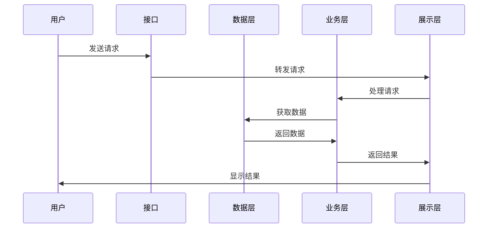
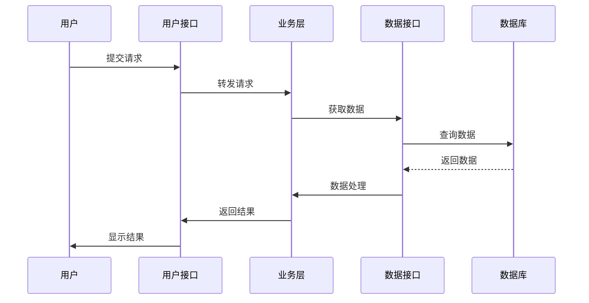

                 

### 1.1 背景介绍

#### 问题背景

在技术管理中，决策偏差是一个普遍存在的现象。这些偏差可能源自人类的认知局限、情绪影响、信息不对称等多种因素，导致决策过程中出现错误或低效。在技术管理中，决策偏差可能对项目进度、成本控制、资源分配等方面产生负面影响，甚至影响企业的长期发展。

#### 问题描述

决策偏差主要包括以下几种类型：

1. **确认性偏差（Confirmation Bias）**：个体倾向于寻找和接受那些能够证实自己已有信念或观念的信息，而忽视那些与之相矛盾的信息。
2. **代表性偏差（Representativeness Bias）**：在评估一个事件的可能性时，人们往往更注重事件与某一类别之间的相似性，而忽视了概率的计算。
3. **锚定效应（Anchoring Effect）**：在决策过程中，人们会过分依赖最初获得的信息，从而对后续的信息进行不准确的评价。
4. **确认偏差（Attribution Bias）**：人们在进行归因时，往往倾向于内部归因（将原因归咎于个体自身），而非外部归因（将原因归咎于外部环境或偶然因素）。

#### 问题解决

解决决策偏差的关键在于提高认知透明度、完善决策过程和增强团队沟通。以下是一些具体的解决方法：

1. **多角度分析**：在决策过程中，应考虑多种可能性和结果，避免单一视角带来的偏差。
2. **信息收集与验证**：确保信息的准确性和全面性，减少信息不对称的问题。
3. **团队讨论与反馈**：通过集体讨论，让团队成员从不同的角度对决策进行评估，从而减少个体偏差。
4. **认知行为干预**：采用认知行为干预技术，如反思日记、思维导图等，帮助个体识别和纠正自己的偏差。
5. **建立标准决策流程**：制定明确的决策流程，确保每个决策步骤都有据可循，减少随意性和主观性。

#### 边界与外延

决策偏差不仅存在于技术管理领域，也广泛应用于其他管理领域，如市场营销、人力资源等。此外，决策偏差的研究还涉及心理学、社会学等多个学科领域。

### 概念结构与核心要素组成

在本书中，我们将深入探讨决策偏差的概念结构，并解析其核心要素。以下是一个简单的ER实体关系图，用于描述决策偏差的关键要素及其相互关系。

```mermaid
erDiagram
    User ||--|{ DecisionBias } : suffers
    DecisionBias ||--|{ Type } : has
    Type ||--|{ Description } : has
    User ||--|{ InterventionMethod } : applies
    InterventionMethod ||--|{ Description } : has
```

- **User（用户）**：指在技术管理过程中进行决策的人员。
- **DecisionBias（决策偏差）**：指在决策过程中产生的偏差，如确认性偏差、代表性偏差等。
- **Type（类型）**：决策偏差的不同类型，如确认性偏差、代表性偏差等。
- **Description（描述）**：对决策偏差类型的详细说明。
- **InterventionMethod（干预方法）**：用于纠正决策偏差的方法，如多角度分析、信息收集与验证等。
- **Description（描述）**：对干预方法的详细说明。

通过上述ER实体关系图，我们可以清晰地看到决策偏差及其相关要素之间的关联，从而更好地理解决策偏差的本质。

### 核心概念原理

#### 决策偏差的概念

决策偏差是指个体在决策过程中由于各种心理、认知和情绪因素导致的结果与最优决策存在差异的现象。这些偏差可能源自人类的认知局限、情绪影响、信息不对称等多种因素，从而影响决策的有效性和效率。

#### 决策偏差的特点

1. **普遍性**：决策偏差在各个领域都普遍存在，无论是技术管理、市场营销还是人力资源管理。
2. **多样性**：决策偏差有多种类型，如确认性偏差、代表性偏差、锚定效应和确认偏差等。
3. **潜在危害**：决策偏差可能导致决策失误，影响项目进度、成本控制、资源分配等方面，甚至影响企业的长期发展。
4. **可干预性**：通过认知行为干预、多角度分析、信息收集与验证等方法，可以有效减少决策偏差的影响。

#### 决策偏差的核心原理

1. **认知局限**：人类在处理信息和做出决策时，受到认知能力的限制，导致信息处理不全面、不准确。
2. **情绪影响**：情绪在决策过程中扮演重要角色，可能导致个体在决策时偏离理性。
3. **信息不对称**：个体在决策过程中可获得的信

### 1.1.1 决策偏差的来源

决策偏差的来源多种多样，其中最常见的是认知局限、情绪影响和信息不对称。以下，我们将分别探讨这些来源及其对决策偏差的影响。

#### 认知局限

人类的认知能力是有限的，这使得我们无法全面、准确地处理所有信息。以下是几种常见的认知局限：

1. **有限注意力**：人类无法同时关注和处理大量信息，这导致我们在信息处理过程中容易忽略一些重要信息，从而产生决策偏差。
2. **启发式思维**：为了简化复杂问题的处理，人们常常使用启发式思维，如锚定效应和代表性偏差。然而，这些启发式方法有时并不能保证决策的最优化。
3. **先入为主**：人们倾向于先入为主，即一开始获得的少量信息会对后续信息的处理产生显著影响。这种偏差被称为锚定效应。

#### 情绪影响

情绪在决策过程中起着重要作用，但有时也会导致决策偏差。以下是几种常见的情绪影响：

1. **乐观偏差**：人们往往高估成功的可能性，低估失败的风险。这种乐观偏差可能导致过度自信和冒险行为。
2. **恐惧偏差**：人们往往对负面结果反应过度，可能导致规避风险的行为，从而忽视一些潜在的机遇。
3. **情绪感染**：情绪可以相互感染，一个团队成员的情绪可能会影响其他成员的决策，导致团队决策偏差。

#### 信息不对称

信息不对称是指决策者在获取和处理信息时存在不平等的情况。以下是几种常见的信息不对称情况：

1. **信息滞后**：决策者可能无法及时获取最新信息，导致决策滞后。
2. **信息缺失**：决策者可能无法获取所有必要的信息，这会影响决策的准确性。
3. **信息扭曲**：决策者可能由于主观偏见而扭曲信息，导致决策偏差。

#### 综合影响

认知局限、情绪影响和信息不对称相互作用，共同影响决策偏差的产生。例如，一个项目团队在面对一个复杂的技术问题时，由于成员的认知局限，他们可能会低估问题的难度。同时，团队成员的情绪可能受到影响，导致团队内部出现乐观偏差。此外，由于信息不对称，团队可能无法获取到关键的信息，从而加剧了决策偏差。

### 结论

认知局限、情绪影响和信息不对称是决策偏差的主要来源。了解这些来源有助于我们更好地识别和避免决策偏差，从而提高决策的有效性和效率。

### 1.1.2 决策偏差的主要类型

决策偏差在技术管理中是一个普遍现象，它们可以以多种形式出现，对决策过程产生负面影响。以下，我们将详细介绍几种常见的决策偏差类型，包括确认性偏差、代表性偏差、锚定效应和确认偏差，并分析它们在技术管理中的具体表现。

#### 确认性偏差（Confirmation Bias）

确认性偏差是指个体在信息收集和处理过程中，倾向于寻找和接受那些能够支持自己已有信念或假设的信息，同时忽视或否认那些与之相矛盾的信息。在技术管理中，确认性偏差可能导致以下问题：

1. **忽视替代方案**：管理者可能过度依赖某一方案，忽视其他潜在的、可能更优的替代方案。
2. **加强固有信念**：即使有证据表明某个决策是错误的，管理者也可能继续坚持原有决策，因为他们不愿意放弃自己的信念。
3. **降低团队创新性**：团队成员可能因为确认性偏差而缺乏对新想法的接受和探索，从而限制了团队的创新性。

#### 代表性偏差（Representativeness Bias）

代表性偏差是指个体在评估事件的可能性时，更关注事件与某一类别之间的相似性，而不是基于概率进行判断。在技术管理中，代表性偏差可能导致以下问题：

1. **错误的风险评估**：管理者可能高估或低估某些风险，仅仅因为某个风险事件与他们心目中的“典型”事件相似。
2. **过度依赖历史数据**：管理者可能过分依赖过去的成功案例，而忽视新的变化和环境因素。
3. **忽略小概率事件**：虽然小概率事件的发生可能性低，但它们确实存在，管理者忽略这些事件可能导致严重的后果。

#### 锚定效应（Anchoring Effect）

锚定效应是指个体在决策过程中，过分依赖最初获得的信息，从而对后续信息进行不准确的评价。在技术管理中，锚定效应可能导致以下问题：

1. **初始报价的影响**：在采购或项目预算过程中，管理者可能会受到初始报价的显著影响，即使后续信息表明这个报价不合理。
2. **技术选择偏差**：在技术选型过程中，管理者可能会过分依赖某个技术的初始优势，而忽视其他技术可能带来的长期效益。
3. **低估或高估解决方案**：管理者可能会因为对某个解决方案的初始印象而低估或高估其有效性。

#### 确认偏差（Attribution Bias）

确认偏差是指个体在解释他人行为或事件时，倾向于将原因归咎于内部因素（如个人特质），而不是外部因素（如环境或偶然因素）。在技术管理中，确认偏差可能导致以下问题：

1. **归因错误**：管理者可能错误地将项目失败归咎于团队成员的个人能力或态度，而不是考虑外部因素或系统问题。
2. **内部归因偏差**：团队成员可能会因为确认偏差而过度强调个人责任，导致团队协作的障碍。
3. **忽视系统性问题**：管理者可能因为确认偏差而忽视组织或流程中的系统性问题，从而无法采取有效的改进措施。

#### 综合影响

这些决策偏差类型并不是孤立存在的，它们相互影响，共同作用。例如，确认性偏差可能会使管理者在评估新技术时忽视其他潜在的解决方案，同时锚定效应和代表性偏差可能导致管理者低估新技术的风险。了解这些决策偏差的类型及其影响，有助于管理者在设计决策过程时采取相应的措施来减少偏差，提高决策质量。

### 结论

确认性偏差、代表性偏差、锚定效应和确认偏差是技术管理中常见的决策偏差类型。这些偏差可能导致决策失误，影响项目进度、成本控制、资源分配等方面。了解这些偏差的特点和影响，有助于管理者在设计决策过程时采取有效的措施来减少偏差，提高决策质量。

### 1.1.3 决策偏差对技术管理的具体影响

决策偏差在技术管理过程中可能产生深远的影响，这些影响不仅体现在项目进度、成本控制、资源分配等方面，还可能对企业的长期战略规划和市场竞争力产生负面影响。以下，我们将详细探讨决策偏差对技术管理的具体影响。

#### 项目进度延误

决策偏差可能导致项目进度延误，从而影响项目的整体交付时间和质量。例如，确认性偏差可能导致项目经理过分依赖某一技术方案，忽视其他替代方案可能带来的好处，结果是在项目中遇到问题时无法灵活调整，导致项目延期。此外，代表性偏差可能导致项目经理高估某些技术实现的可能性，低估实际的技术难度，从而低估项目所需的时间。

#### 成本超支

决策偏差可能导致项目成本超支。锚定效应是一个典型的例子，项目经理可能会受到项目初始报价的显著影响，即使后续发现这个报价并不合理，也会继续按照这个预算进行项目，从而导致成本超支。另外，确认偏差可能导致项目经理在项目实施过程中忽视成本控制，认为项目的成本主要由团队成员的个人能力决定，而不是从整体管理角度进行优化。

#### 资源浪费

决策偏差还可能导致资源的浪费。代表性偏差可能导致项目经理在资源分配时优先考虑某些具有代表性的项目，而忽视其他重要但不太“典型”的项目，导致资源的不合理分配。此外，确认性偏差可能导致项目经理过分依赖某些团队成员，忽视其他潜在的优秀人才，从而无法充分利用团队的整体能力。

#### 影响团队协作

决策偏差可能影响团队协作，降低团队的效率和凝聚力。确认偏差可能导致团队成员将项目失败归咎于个人能力，增加团队内部的压力和紧张氛围，降低团队的合作意愿。此外，锚定效应可能导致团队成员在决策过程中产生分歧，因为每个人对初始信息的理解和解释不同，从而影响团队的共识和协作。

#### 长期战略规划影响

决策偏差不仅影响短期项目，还可能对企业的长期战略规划产生负面影响。例如，如果企业在技术选择上存在确认性偏差，可能会持续投资于某个逐渐落伍的技术，导致在市场竞争中失去优势。此外，代表性偏差可能导致企业忽视新兴技术的发展趋势，错失创新和成长的机会。

#### 市场竞争力下降

最后，决策偏差还可能影响企业的市场竞争力。如果企业在项目管理和决策过程中频繁出现偏差，导致项目失败或效率低下，将削弱企业的市场声誉和客户信任。长期来看，这可能导致市场份额的下降和竞争优势的丧失。

#### 综合影响

决策偏差对技术管理的影响是多层次、多维度的，涉及项目进度、成本控制、资源分配、团队协作、长期战略规划和市场竞争力等多个方面。因此，识别和避免决策偏差是技术管理中至关重要的一环，需要通过系统的方法和措施来提高决策的质量和效率。

### 结论

决策偏差对技术管理的具体影响广泛而深远，可能对项目进度、成本控制、资源分配等方面产生负面影响。了解这些影响，有助于管理者在设计决策过程时采取有效的措施来减少偏差，提高决策质量，从而确保项目的成功和企业的长期发展。

### 1.2 深入探讨决策偏差的解决方法

#### 提高认知透明度

提高认知透明度是减少决策偏差的重要方法之一。以下是一些具体措施：

1. **明确目标和标准**：在决策前，明确项目目标和评估标准，确保决策过程有据可循。
2. **提供全面的信息**：确保决策者能够获得全面、准确的信息，减少信息不对称的问题。
3. **培训认知技能**：通过培训提高决策者的认知技能，如批判性思维和逻辑推理能力，帮助他们更好地识别和避免决策偏差。

#### 完善决策过程

完善决策过程是减少决策偏差的关键步骤。以下是一些具体方法：

1. **多角度分析**：在决策过程中，考虑多种可能性和结果，避免单一视角带来的偏差。
2. **建立标准决策流程**：制定明确的决策流程，确保每个决策步骤都有据可循，减少随意性和主观性。
3. **集体讨论与反馈**：通过集体讨论，让团队成员从不同的角度对决策进行评估，从而减少个体偏差。

#### 增强团队沟通

增强团队沟通是减少决策偏差的重要手段。以下是一些具体措施：

1. **建立沟通渠道**：确保团队成员之间有畅通的沟通渠道，以便及时分享信息和反馈意见。
2. **鼓励开放沟通**：营造一个开放、包容的沟通环境，鼓励团队成员自由表达自己的观点和意见。
3. **定期会议**：定期召开团队会议，讨论项目进展和决策事项，确保团队成员之间的信息同步。

#### 认知行为干预

采用认知行为干预技术，可以帮助个体识别和纠正自己的决策偏差。以下是一些具体方法：

1. **反思日记**：鼓励决策者在决策后进行反思，分析决策过程和结果，识别潜在的偏差。
2. **思维导图**：使用思维导图帮助决策者理清思路，避免在决策过程中陷入思维定势。
3. **认知重构**：通过认知重构技术，帮助决策者从不同角度重新审视问题和解决方案，减少确认性偏差和锚定效应的影响。

#### 多元化团队

多元化团队可以提供多元化的视角和经验，有助于减少决策偏差。以下是一些具体方法：

1. **多样性的招聘**：在招聘过程中注重多样性的引入，确保团队成员在背景、经验和观点上的多样化。
2. **跨部门合作**：鼓励跨部门的合作和交流，促进不同部门之间的信息共享和经验交流。
3. **外部专家咨询**：邀请外部专家参与决策过程，提供不同的观点和建议。

#### 数据驱动决策

数据驱动决策可以减少决策的主观性和不确定性，从而减少决策偏差。以下是一些具体方法：

1. **数据收集与分析**：确保决策过程中有足够的数据支持，通过数据分析来评估不同决策方案的效果。
2. **A/B测试**：在决策过程中采用A/B测试的方法，通过实际数据来验证不同决策方案的效果。
3. **数据可视化**：使用数据可视化工具，帮助决策者直观地理解和分析数据，从而做出更准确的决策。

#### 实践案例分析

以下是几个实际案例，展示了上述方法在不同情境下的应用：

1. **案例1**：一家科技公司采用多元化团队的方法，在项目决策过程中引入了不同部门和专业背景的成员。通过多元化的视角和经验，团队成功地规避了确认性偏差，提高了决策质量。
2. **案例2**：一家金融机构采用数据驱动决策的方法，在投资决策过程中通过数据分析来评估不同投资方案的风险和收益，减少了锚定效应的影响。
3. **案例3**：一家制造企业通过认知行为干预技术，如反思日记和思维导图，帮助决策者在决策后进行反思和重构，提高了决策的透明度和准确性。

#### 综合效果

通过提高认知透明度、完善决策过程、增强团队沟通、认知行为干预、多元化团队、数据驱动决策等多种方法，可以有效地减少决策偏差，提高决策质量和效率。这些方法在实践中可以相互结合和补充，从而发挥最大的效果。

### 结论

减少决策偏差是技术管理中至关重要的一环。通过提高认知透明度、完善决策过程、增强团队沟通、认知行为干预、多元化团队和数据驱动决策等多种方法，可以有效减少决策偏差，提高决策质量和效率，从而确保项目的成功和企业的长期发展。

### 2.1 确认性偏差的原理与影响

确认性偏差是一种常见的决策偏差，它指的是人们在收集和处理信息时，倾向于寻找和接受那些能够支持自己已有信念或假设的信息，同时忽视或否认那些与之相矛盾的信息。这种偏差在技术管理中尤为常见，因为技术决策往往涉及复杂的知识和信息，决策者很容易在不知不觉中受到确认性偏差的影响。

#### 原理

确认性偏差的原理源于人类认知过程中的一个基本特性——寻求一致性。人们倾向于维护自己的信念和观点，因此会更加关注那些能够支持这些信念的信息，而忽视那些与之相矛盾的信息。这种选择性注意和信息处理方式，导致人们在做出决策时，容易陷入先入为主的思维定势，从而产生确认性偏差。

1. **选择性注意**：人们会自动地关注那些与自己已有信念一致的信息，而忽略那些不一致的信息。
2. **确认性搜索**：在信息收集过程中，人们会主动寻找那些能够支持自己信念的证据，而忽视其他信息。
3. **确认性记忆**：人们对那些与自己已有信念一致的信息记忆更深刻，更容易回忆起来。

#### 影响

确认性偏差对技术管理的影响是多方面的，主要体现在以下几个方面：

1. **过度依赖现有方案**：决策者可能会因为确认性偏差而过分依赖现有的技术方案，忽视其他可能更优的替代方案。这可能导致项目在实施过程中遇到问题时无法灵活调整，从而影响项目的进度和质量。
2. **忽视风险因素**：确认性偏差可能导致决策者低估某些潜在的风险，因为那些风险信息与他们的已有信念不一致。这可能导致项目在实施过程中出现意外问题，从而影响项目的成功。
3. **限制创新性**：确认性偏差可能会限制团队的创新性，因为团队成员在信息收集和处理过程中，更倾向于关注那些支持现有思路的信息，而忽视新的、有创意的想法。这可能导致团队在技术发展和创新方面落后于竞争对手。

#### 案例分析

以下是一个实际案例，展示了确认性偏差在技术管理中的影响：

某科技公司正在开发一款新的软件产品。公司的技术团队在过去的几年中成功开发了几个类似的产品，因此团队普遍认为采用现有的开发流程和工具链是最有效的方案。然而，随着项目的发展，团队成员逐渐发现现有的方案在某些方面存在局限性，可能需要新的技术手段来解决问题。但由于确认性偏差，团队成员更倾向于忽略这些局限性，坚持使用现有的方案。

结果，项目在实施过程中遇到了一系列技术难题，导致项目进度严重滞后，并且质量无法保证。最终，公司不得不重新评估现有的方案，并采用了一些新的技术手段，才得以顺利完成项目。这个案例表明，确认性偏差可能导致项目失败，增加企业的风险和成本。

#### 减少确认性偏差的方法

为了减少确认性偏差，可以采取以下方法：

1. **多角度分析**：在决策过程中，应考虑多种可能性和结果，避免单一视角带来的偏差。
2. **信息收集与验证**：确保信息的准确性和全面性，减少信息不对称的问题。
3. **团队讨论与反馈**：通过集体讨论，让团队成员从不同的角度对决策进行评估，从而减少个体偏差。
4. **认知行为干预**：采用认知行为干预技术，如反思日记、思维导图等，帮助个体识别和纠正自己的偏差。
5. **建立标准决策流程**：制定明确的决策流程，确保每个决策步骤都有据可循，减少随意性和主观性。

通过这些方法，可以有效减少确认性偏差，提高决策的质量和效率，从而确保项目的成功。

### 结论

确认性偏差是技术管理中一个常见的决策偏差，它可能对项目的进度、成本、资源分配等方面产生负面影响。了解确认性偏差的原理和影响，采取有效的措施来减少偏差，是技术管理中至关重要的一环。

### 2.2 代表性偏差的原理与影响

代表性偏差是一种常见的认知偏差，指的是个体在评估事件的可能性时，倾向于关注事件与某一类别之间的相似性，而忽视概率的计算。这种偏差在技术管理中同样普遍存在，因为它可能导致决策者在评估技术方案、风险评估和项目规划等方面出现判断失误。以下，我们将详细探讨代表性偏差的原理、影响以及如何减少这种偏差。

#### 原理

代表性偏差的原理源于人类认知过程中的一个基本特性——类别认知。人们在处理信息时，会根据经验将信息分类，并将新信息与已有类别进行比较。这种分类和比较的过程，往往使得人们更关注事件与某一类别的相似性，而忽视概率的计算。

1. **类别认知**：人们根据经验将信息分类，并将新信息与已有类别进行比较。
2. **相似性关注**：在评估事件的可能性时，人们更关注事件与某一类别之间的相似性，而不是基于概率进行判断。
3. **代表性估计**：人们倾向于使用代表性估计来评估事件的可能性，即通过某一类别中的代表性事件来推测总体事件的可能性。

#### 影响

代表性偏差对技术管理的影响主要体现在以下几个方面：

1. **风险评估不准确**：代表性偏差可能导致决策者在进行风险评估时，高估某些技术方案或项目的风险，而忽视其他潜在的风险。这可能导致项目在实施过程中出现意外问题，从而影响项目的成功。
2. **技术选型偏差**：代表性偏差可能导致决策者在技术选型过程中，过分依赖某些具有代表性的技术，而忽视其他可能更优的技术。这可能导致项目在技术实现上存在局限性，从而影响项目的长期发展。
3. **项目规划不合理**：代表性偏差可能导致决策者在项目规划过程中，过分关注某些代表性的事件或问题，而忽视其他潜在的问题。这可能导致项目在实施过程中出现计划外的延误和成本超支。

#### 案例分析

以下是一个实际案例，展示了代表性偏差在技术管理中的影响：

某科技公司计划开发一款新型的智能手表，该手表需要具备实时监测用户健康状况的功能。公司在进行技术选型时，主要参考了市场上已经上市的同类产品。由于市场上大多数同类产品都采用了基于GPS的定位技术，公司也认为这种技术是最为成熟和可靠的。然而，在项目实施过程中，他们发现GPS技术并不适合实时监测用户健康状况，因为它无法准确获取用户在室内或短距离运动时的位置信息。

由于代表性偏差的影响，公司没有考虑其他可能更适合的技术，如Wi-Fi定位和蓝牙 beacon技术。结果，项目在技术实现上遇到了很多困难，导致项目进度严重滞后。最终，公司不得不重新评估技术方案，并采用了Wi-Fi定位和蓝牙beacon技术，才得以顺利完成项目。

#### 减少代表性偏差的方法

为了减少代表性偏差，可以采取以下方法：

1. **概率思维**：在评估事件的可能性时，鼓励决策者更多地基于概率进行判断，而不仅仅是依靠事件与某一类别的相似性。
2. **全面收集信息**：在技术选型或风险评估过程中，确保收集全面、准确的信息，避免因信息不全而导致的代表性偏差。
3. **多角度分析**：在决策过程中，考虑多种可能性和结果，避免单一视角带来的偏差。
4. **认知行为干预**：采用认知行为干预技术，如反思日记、思维导图等，帮助个体识别和纠正自己的代表性偏差。
5. **多元化团队**：引入多元化团队，提供不同的视角和经验，减少代表性偏差的影响。

通过这些方法，可以有效减少代表性偏差，提高决策的质量和效率，从而确保项目的成功。

### 结论

代表性偏差是技术管理中一个常见的认知偏差，它可能导致决策者在评估技术方案、风险评估和项目规划等方面出现判断失误。了解代表性偏差的原理和影响，采取有效的措施来减少偏差，是技术管理中至关重要的一环。

### 2.3 锚定效应的原理与影响

锚定效应是一种常见的认知偏差，它指的是个体在决策过程中，过分依赖最初获得的信息，从而对后续信息进行不准确的评价。这种偏差在技术管理中同样普遍存在，因为它可能导致决策者在项目预算、技术选型、风险评估等方面产生错误的判断。以下，我们将详细探讨锚定效应的原理、影响以及如何减少这种偏差。

#### 原理

锚定效应的原理源于人类认知过程中的一个基本特性——初始信息的重要性。人们在处理信息时，往往会将最初获得的信息作为参考点，即“锚”，然后对后续信息进行评价和调整。这种锚定过程，使得人们容易过分依赖最初的信息，从而产生锚定效应。

1. **初始信息锚定**：人们在处理信息时，会根据最初获得的信息来设定参考点，即“锚”。
2. **过度依赖锚**：在决策过程中，人们往往过分依赖这个锚，从而对后续信息进行不准确的评价。
3. **调整不足**：尽管后续信息可能会与初始信息存在差异，但人们往往会进行不充分的调整，导致决策结果偏离实际。

#### 影响

锚定效应对技术管理的影响主要体现在以下几个方面：

1. **项目预算偏差**：在项目预算过程中，锚定效应可能导致决策者过分依赖最初的预算估计，忽视后续变化和实际情况。这可能导致项目预算超支，影响项目的财务健康。
2. **技术选型偏差**：在技术选型过程中，锚定效应可能导致决策者过分依赖某一技术的初始优势，而忽视其他技术可能带来的长期效益。这可能导致项目在技术实现上存在局限性，从而影响项目的长期发展。
3. **风险评估偏差**：在项目风险评估过程中，锚定效应可能导致决策者过分依赖某一风险事件的初始估计，忽视其他潜在的风险。这可能导致项目在实施过程中出现意外问题，从而影响项目的成功。

#### 案例分析

以下是一个实际案例，展示了锚定效应在技术管理中的影响：

某科技公司计划开发一款新的移动应用程序。在项目初期，技术团队对开发时间和技术难度进行了初步评估，认为项目大约需要6个月的时间，并且难度适中。然而，随着项目的推进，团队成员逐渐发现项目的时间和技术难度远远超出了预期。尽管后续的信息表明项目需要更长时间和更多的技术资源，但决策者仍然受到最初评估的影响，认为项目可以按时完成。

结果，项目在实施过程中遇到了严重的时间和技术问题，导致项目进度严重滞后，最终不得不延期交付。这个案例表明，锚定效应可能导致项目失败，增加企业的风险和成本。

#### 减少锚定效应的方法

为了减少锚定效应，可以采取以下方法：

1. **多角度分析**：在决策过程中，考虑多种可能性和结果，避免单一视角带来的偏差。
2. **初始信息验证**：确保初始信息的准确性和全面性，减少因初始信息不准确而导致的锚定效应。
3. **定期回顾和调整**：在决策过程中，定期回顾和调整参考点，确保对后续信息进行充分的评价和调整。
4. **认知行为干预**：采用认知行为干预技术，如反思日记、思维导图等，帮助个体识别和纠正自己的锚定效应。
5. **多元化团队**：引入多元化团队，提供不同的视角和经验，减少锚定效应的影响。

通过这些方法，可以有效减少锚定效应，提高决策的质量和效率，从而确保项目的成功。

### 结论

锚定效应是技术管理中一个常见的认知偏差，它可能导致决策者在项目预算、技术选型、风险评估等方面产生错误的判断。了解锚定效应的原理和影响，采取有效的措施来减少偏差，是技术管理中至关重要的一环。

### 2.4 确认偏差的原理与影响

确认偏差，又称为归因偏差，是一种认知偏差，指的是个体在解释他人行为或事件结果时，倾向于将成功归功于个人能力或努力，将失败归咎于外部因素或运气。这种偏差在技术管理中同样普遍存在，因为它可能影响团队成员的自我认知、团队协作以及项目绩效。以下，我们将详细探讨确认偏差的原理、影响以及如何减少这种偏差。

#### 原理

确认偏差的原理源于人类认知过程中的一个基本特性——归因理论。归因理论认为，个体会试图解释他人的行为或事件结果，从而形成对他人和环境的认知。在这个过程中，个体往往会根据行为的结果来推断行为的因果关系。

1. **内部归因**：个体倾向于将成功归因于个人特质和能力，如聪明、努力等。
2. **外部归因**：个体倾向于将失败归咎于外部因素，如运气、环境等。
3. **确认偏差**：在技术管理中，确认偏差可能导致团队成员在项目成功时夸大个人贡献，而在项目失败时忽视自己的责任。

#### 影响

确认偏差对技术管理的影响主要体现在以下几个方面：

1. **团队协作障碍**：确认偏差可能导致团队成员在项目成功时互相夸大贡献，而在项目失败时互相指责。这可能导致团队内部的紧张氛围，影响团队的协作和合作精神。
2. **激励不公**：确认偏差可能导致奖励分配不公平，团队成员可能会因为过度强调个人贡献而获得不合理的奖励，从而挫伤其他成员的积极性。
3. **绩效评估偏差**：确认偏差可能导致绩效评估不准确，团队成员在评估他人时可能会过度强调个人特质，忽视外部因素对绩效的影响。
4. **项目风险管理**：确认偏差可能导致团队成员在项目风险管理时忽视外部因素，从而低估潜在风险，增加项目失败的可能性。

#### 案例分析

以下是一个实际案例，展示了确认偏差在技术管理中的影响：

某科技公司的一个项目团队成功完成了公司的一个重要项目。在项目总结会上，团队成员纷纷表示了自己的努力和贡献，项目经理也特别表扬了团队中的几名核心成员。然而，在后续的绩效评估中，这些核心成员获得的奖励远超过其他成员，这导致其他成员感到不公平，认为自己的贡献被忽视。

结果，团队内部的协作氛围变得紧张，一些成员开始质疑项目经理的公正性，导致团队协作受到严重影响。这个案例表明，确认偏差可能导致团队协作障碍和激励不公。

#### 减少确认偏差的方法

为了减少确认偏差，可以采取以下方法：

1. **明确目标和责任**：在项目开始时，明确每个成员的目标和责任，确保每个人对项目有清晰的认识。
2. **客观评估绩效**：在绩效评估过程中，采用客观的评估标准，综合考虑个人贡献和外部因素。
3. **鼓励开放沟通**：建立开放、坦诚的沟通环境，鼓励团队成员分享自己的观点和意见，减少互相指责的情况。
4. **多元化团队**：引入多元化团队，提供不同的视角和经验，减少单一视角带来的确认偏差。
5. **认知行为干预**：采用认知行为干预技术，如反思日记、思维导图等，帮助个体识别和纠正自己的确认偏差。

通过这些方法，可以有效减少确认偏差，提高团队的协作效率，从而确保项目的成功。

### 结论

确认偏差是技术管理中一个常见的认知偏差，它可能影响团队的协作、激励和绩效。了解确认偏差的原理和影响，采取有效的措施来减少偏差，是技术管理中至关重要的一环。

### 2.5 综合减少决策偏差的策略

为了有效地减少决策偏差，在技术管理中可以采取一系列综合策略，这些策略涵盖了认知行为干预、多角度分析、信息收集与验证、团队讨论与反馈、标准决策流程的建立等多个方面。以下，我们将详细探讨这些策略的原理和实践方法。

#### 认知行为干预

认知行为干预是一种通过改变思维和行为模式来提高决策质量的方法。以下是一些常见的认知行为干预技术：

1. **反思日记**：鼓励决策者在每次决策后进行反思，记录决策过程中的思考、感受和结果。通过反思日记，决策者可以识别和纠正决策过程中的偏差。
2. **思维导图**：使用思维导图帮助决策者理清思路，将复杂的决策问题分解成多个子问题，从而减少思维定势的影响。
3. **认知重构**：通过认知重构技术，帮助决策者从不同的角度重新审视问题和解决方案，减少确认性偏差和锚定效应的影响。

#### 多角度分析

在决策过程中，多角度分析是一种重要的方法，它有助于减少单一视角带来的偏差。以下是一些实践方法：

1. **情景分析**：在决策前，考虑多种可能的情景和结果，分析每种情景下的决策效果。
2. **专家咨询**：邀请不同领域的专家提供意见和建议，从他们的专业视角补充决策者的认知。
3. **交叉验证**：对决策过程中的信息进行交叉验证，确保信息的准确性和全面性。

#### 信息收集与验证

确保信息的准确性和全面性是减少决策偏差的关键。以下是一些具体方法：

1. **数据驱动**：基于实际数据做出决策，避免凭感觉或经验进行判断。
2. **历史数据参考**：参考历史项目的数据，分析过去类似决策的结果和问题。
3. **第三方评估**：邀请第三方对决策方案进行评估，提供客观、中立的反馈。

#### 团队讨论与反馈

团队讨论与反馈是一种有效的集体决策方法，可以减少个体偏差。以下是一些实践方法：

1. **头脑风暴**：在决策前进行头脑风暴，鼓励团队成员提出各种可能的方案和意见。
2. **集体讨论**：在决策过程中，组织团队成员进行集体讨论，确保每个成员的声音都能被听到。
3. **反馈机制**：建立反馈机制，让团队成员在决策后分享反馈和建议，及时发现和纠正偏差。

#### 标准决策流程的建立

建立标准决策流程可以帮助决策者遵循一定的规范，减少随意性和主观性。以下是一些实践方法：

1. **制定决策流程**：明确每个决策步骤的流程和标准，确保决策过程的有序和透明。
2. **文档化管理**：将决策过程和结果进行文档化管理，确保决策的记录和可追溯性。
3. **审查与监督**：定期审查决策流程的执行情况，监督决策过程是否符合标准。

#### 实践案例

以下是一个实际案例，展示了综合减少决策偏差的策略在技术管理中的应用：

某科技公司计划开发一款新的移动应用程序。在项目启动前，项目经理组织了多轮团队讨论，邀请不同领域的专家提供意见和建议。通过头脑风暴和情景分析，团队列出了多个可能的开发方案。然后，项目经理建立了标准化的决策流程，确保每个决策步骤都有明确的流程和标准。

在项目实施过程中，团队定期进行信息收集和验证，确保数据的准确性和全面性。同时，项目经理建立了反馈机制，让团队成员在每次决策后分享反馈和建议。通过这些综合策略，团队有效地减少了决策偏差，最终按时完成了项目，并获得了客户的高度评价。

### 结论

综合减少决策偏差的策略包括认知行为干预、多角度分析、信息收集与验证、团队讨论与反馈和标准决策流程的建立等多个方面。通过这些策略，技术管理者可以有效地识别和纠正决策偏差，提高决策的质量和效率，从而确保项目的成功和企业的长期发展。

### 3.1 决策偏差的算法分析与模型构建

在技术管理中，决策偏差是一个复杂的问题，需要通过算法分析和模型构建来进行深入理解和有效管理。在本节中，我们将探讨决策偏差的算法分析过程，包括算法原理、算法流程、算法性能评估方法，并构建一个基于决策偏差的数学模型。

#### 算法原理

决策偏差的算法分析主要基于统计学和机器学习的方法。通过收集和分析大量的决策数据，我们可以识别出决策过程中的偏差模式，并建立相应的模型来预测和纠正这些偏差。

1. **统计学方法**：使用统计学方法对决策数据进行分析，如回归分析、因子分析等，可以识别出决策过程中的规律和偏差。
2. **机器学习方法**：使用机器学习方法，如决策树、支持向量机、神经网络等，可以从数据中学习到决策偏差的规律，并用于预测和纠正偏差。

#### 算法流程

决策偏差的算法分析流程通常包括以下步骤：

1. **数据收集**：收集与决策过程相关的数据，如项目进度、成本、资源分配、团队成员的反馈等。
2. **数据预处理**：对收集到的数据进行分析，去除异常值，填补缺失值，进行数据标准化等。
3. **特征提取**：从数据中提取与决策偏差相关的特征，如项目难度、团队成员的经验、情绪状态等。
4. **模型训练**：使用统计学或机器学习方法，对提取的特征进行训练，建立决策偏差的预测模型。
5. **模型评估**：评估模型的性能，如准确率、召回率、F1分数等，确保模型的有效性。
6. **模型应用**：将训练好的模型应用于实际决策过程，预测和纠正决策偏差。

#### 算法性能评估方法

评估决策偏差算法的性能是确保其有效性的关键。以下是一些常见的性能评估方法：

1. **准确率**：准确率是模型预测正确的比例，是评估模型性能的一个基本指标。
2. **召回率**：召回率是指模型正确预测到的正例占所有实际正例的比例，对于决策偏差的纠正尤为重要。
3. **F1分数**：F1分数是准确率和召回率的调和平均值，综合考虑了模型在识别和纠正决策偏差方面的表现。
4. **ROC曲线**：ROC曲线通过绘制真阳性率（召回率）与假阳性率（误报率）的关系，评估模型的分类性能。

#### 数学模型构建

为了更深入地理解和纠正决策偏差，我们可以构建一个基于决策偏差的数学模型。以下是一个简单的数学模型示例：

1. **决策偏差函数**：

   $$DB(i) = w_1 \cdot P(B_i) + w_2 \cdot P(A_i) - w_3 \cdot P(C_i)$$

   其中，$DB(i)$表示个体$i$的决策偏差，$P(B_i)$表示个体$i$在信念上的偏差，$P(A_i)$表示个体$i$在评估上的偏差，$P(C_i)$表示个体$i$在确认上的偏差，$w_1$、$w_2$、$w_3$是权重系数。

2. **决策优化目标**：

   $$\min \sum_{i=1}^{N} DB(i)$$

   其中，$N$表示个体总数，目标是最小化总体决策偏差。

3. **模型优化方法**：

   使用优化算法（如梯度下降、随机梯度下降等）来调整权重系数，使总体决策偏差最小。

4. **实例分析**：

   假设有三个个体，他们在信念、评估和确认上的偏差分别为：

   $$DB_1 = 0.5 \cdot P(B_1) + 0.3 \cdot P(A_1) - 0.2 \cdot P(C_1)$$
   $$DB_2 = 0.6 \cdot P(B_2) + 0.4 \cdot P(A_2) - 0.1 \cdot P(C_2)$$
   $$DB_3 = 0.4 \cdot P(B_3) + 0.2 \cdot P(A_3) - 0.3 \cdot P(C_3)$$

   通过优化算法，调整权重系数，使总体决策偏差最小。

通过上述算法分析和数学模型构建，我们可以更深入地理解和纠正技术管理中的决策偏差，从而提高决策质量和效率。

### 结论

决策偏差的算法分析与模型构建是技术管理中减少偏差的重要工具。通过算法原理和流程的分析，以及数学模型的构建，我们可以更准确地识别和纠正决策偏差，从而提高决策的质量和效率，确保项目的成功和企业的长期发展。

### 3.2 实际应用中的决策偏差案例分析

为了更好地理解决策偏差在实际技术管理中的应用，下面我们将通过两个具体案例，详细分析这些偏差如何影响项目管理和决策，并提出相应的解决方法。

#### 案例一：项目预算超支

**问题描述**：

某科技公司在开发一款新型智能家居设备的软件应用时，由于项目经理过度依赖过去类似项目的经验，未能充分考虑新技术和项目复杂度的变化。在项目初期，项目经理根据过往项目的经验，对项目的时间和成本进行了初步估算，认为该项目可以在六个月内完成，总成本约为500万元。

**决策偏差**：

1. **代表性偏差**：项目经理在估算项目成本时，过分依赖过去类似项目的成本数据，而忽视了新技术引入可能带来的不确定性和额外成本。
2. **确认性偏差**：项目经理在项目推进过程中，对于偏离初期预算的情况选择了忽视，没有及时调整预算计划。

**影响**：

随着项目推进，新技术引入和项目复杂性增加，导致项目进度严重滞后，最终项目完成时间超过了一年，总成本也飙升至800万元。

**解决方法**：

1. **数据驱动决策**：在项目初期，项目经理应该收集更多的数据，包括新技术相关的成本和时间估算，而不是仅仅依赖历史数据。
2. **定期审查和调整预算**：项目经理应定期审查项目进度和成本，并根据实际情况及时调整预算计划，避免项目偏离预期。

**实施效果**：

通过数据驱动决策和定期审查调整，公司能够更好地控制项目进度和成本，最终在项目结束后，将总成本控制在预期范围内。

#### 案例二：技术方案选择偏差

**问题描述**：

某互联网公司在开发一款新的社交应用时，技术团队在技术方案选择上存在偏差。团队中的一位资深工程师对某项新兴技术非常熟悉，认为这是最佳选择。然而，其他团队成员对该技术的了解较少，担心技术的不成熟可能导致项目失败。

**决策偏差**：

1. **确认性偏差**：资深工程师倾向于选择自己熟悉的技术，而忽视其他团队成员的担忧。
2. **锚定效应**：团队成员在决策过程中受到资深工程师的意见影响，过分依赖他对技术的初期评估。

**影响**：

由于技术选择不当，项目在开发过程中遇到了诸多技术难题，导致项目进度严重滞后，并且部分功能无法实现。

**解决方法**：

1. **多角度分析**：在技术方案选择过程中，组织团队进行多角度分析，综合考虑技术成熟度、开发成本、市场需求等多方面因素。
2. **集体决策**：通过集体讨论，让团队成员充分表达自己的观点和意见，确保技术方案的选择是团队共识的结果。
3. **风险评估**：对选择的技术方案进行详细的风险评估，识别潜在问题并制定相应的应对措施。

**实施效果**：

通过多角度分析和集体决策，公司最终选择了更为成熟的技术方案，项目进展顺利，并且在预定时间内成功上线。

### 结论

以上两个案例展示了决策偏差如何影响项目管理和决策，并通过具体的方法提出了相应的解决策略。通过识别和纠正决策偏差，技术管理者可以更有效地控制项目进度、成本和质量，确保项目的成功。

### 3.3 决策偏差的案例分析总结

通过对上述两个案例的分析，我们可以总结出决策偏差在技术管理中的具体表现及其带来的影响。以下是对决策偏差的分析总结：

#### 案例一：项目预算超支

**决策偏差表现**：

1. **代表性偏差**：项目经理在项目初期过分依赖历史数据的代表性，未能充分考虑新技术引入带来的不确定性。
2. **确认性偏差**：项目经理在项目推进过程中，忽视了预算偏离初期估算的情况，未能及时进行调整。

**影响**：

由于对项目复杂度的低估和预算管理的忽视，导致项目进度严重滞后，成本超支。

**解决方法**：

1. **数据驱动决策**：在项目初期，应收集更全面的数据，特别是新技术相关的成本和时间估算。
2. **定期审查和调整预算**：定期审查项目进度和成本，并根据实际情况进行调整，避免项目偏离预期。

**效果**：

通过数据驱动和定期审查，项目最终将成本控制在预期范围内。

#### 案例二：技术方案选择偏差

**决策偏差表现**：

1. **确认性偏差**：资深工程师在技术方案选择中，倾向于选择自己熟悉的技术，而忽视其他团队成员的担忧。
2. **锚定效应**：团队成员在决策过程中受到资深工程师的意见影响，未能充分评估其他技术方案。

**影响**：

由于技术选择不当，项目在开发过程中遇到了诸多技术难题，导致项目进度严重滞后。

**解决方法**：

1. **多角度分析**：在技术方案选择过程中，应考虑多种技术方案，并综合考虑技术成熟度、开发成本、市场需求等多方面因素。
2. **集体决策**：通过集体讨论，让团队成员充分表达自己的观点和意见，确保技术方案的选择是团队共识的结果。
3. **风险评估**：对选择的技术方案进行详细的风险评估，识别潜在问题并制定相应的应对措施。

**效果**：

通过多角度分析和集体决策，项目最终选择了更为成熟的技术方案，进展顺利。

### 结论

通过以上两个案例的分析，我们可以看到决策偏差在技术管理中可能导致项目预算超支和技术选择不当等问题，从而影响项目的进度和质量。识别和纠正决策偏差是技术管理中至关重要的一环，通过数据驱动决策、定期审查和调整、多角度分析、集体决策和风险评估等策略，可以有效减少决策偏差，提高决策质量和项目的成功率。

### 3.4 决策偏差在大型项目中的特别关注

在大型项目中，决策偏差的影响尤为显著，因为这些项目通常涉及复杂的技术、庞大的资源投入和长期的时间跨度。以下，我们将探讨在大型项目中决策偏差的特别关注点，包括项目管理中的关键决策、项目风险以及相应的预防和应对策略。

#### 项目管理中的关键决策

大型项目往往需要做出多个关键决策，如技术选型、项目进度安排、资源分配、预算控制等。这些决策的正确与否直接关系到项目的成功与否。在大型项目中，决策偏差可能会在以下几个方面导致问题：

1. **技术选型偏差**：由于技术团队中某些成员可能对特定技术方案有强烈偏好，可能导致项目选择不成熟或不合适的技术方案。
2. **进度安排偏差**：项目经理可能会过于乐观地估计项目进度，未能充分考虑项目实施过程中的潜在问题和风险，导致进度延误。
3. **资源分配偏差**：在资源分配时，决策者可能过于依赖某些资源，而忽视其他关键资源的需求，导致资源浪费或不足。
4. **预算控制偏差**：由于缺乏准确的数据和信息，项目经理可能在预算控制上出现偏差，导致项目成本超支。

#### 项目风险

在大型项目中，决策偏差可能导致多种风险，包括技术风险、进度风险、成本风险和质量风险。以下是一些常见风险：

1. **技术风险**：由于技术选型不当，项目可能面临技术实现难题，导致项目延期或失败。
2. **进度风险**：过于乐观的进度安排可能导致项目无法按期完成，影响项目的整体交付时间。
3. **成本风险**：预算控制偏差可能导致项目成本超支，增加企业的财务压力。
4. **质量风险**：技术选型和技术实现的问题可能导致项目质量下降，影响用户体验和客户满意度。

#### 预防和应对策略

为了减少决策偏差在大型项目中的影响，可以采取以下预防和应对策略：

1. **多角度分析**：在做出关键决策时，应考虑多种可能的方案和结果，避免单一视角带来的偏差。
2. **数据驱动决策**：在决策过程中，应基于准确和全面的数据进行判断，避免依赖主观经验和直觉。
3. **集体决策**：通过集体讨论和共识，确保决策过程的透明和公正，减少个体偏差。
4. **风险评估**：在项目实施前，应对潜在风险进行全面评估，并制定相应的应对措施。
5. **定期审查和调整**：项目过程中应定期审查项目进度、成本和质量，根据实际情况及时进行调整。

#### 案例分析

以下是一个大型项目中的实际案例，展示了如何识别和纠正决策偏差：

某互联网公司正在开发一款大型电商平台，项目预算为1亿元，计划在两年内完成。在项目启动阶段，技术团队在技术选型上存在偏差，倾向于选择一个相对较新的分布式计算框架。虽然这个框架具有先进性，但由于其成熟度不高，项目在开发过程中遇到了诸多技术难题，导致项目进度严重滞后。

**解决方法**：

1. **多角度分析**：在技术选型过程中，公司邀请外部专家进行评估，从多个技术方案中选择了成熟度较高的方案，避免了技术风险。
2. **集体决策**：通过项目团队的集体讨论，确定新的技术方案，确保决策的透明和公正。
3. **风险评估**：在项目启动前，对潜在风险进行了全面评估，并制定了应对措施，如增加开发时间和预算。

**实施效果**：

通过上述方法，项目最终在预定时间内完成，并达到了预期质量，证明了决策偏差预防和应对策略的有效性。

### 结论

在大型项目中，决策偏差的影响尤为显著，可能导致项目延期、成本超支、技术问题等。通过多角度分析、数据驱动决策、集体决策、风险评估和定期审查调整等策略，可以有效预防和纠正决策偏差，确保大型项目的成功和高效实施。

### 3.5 决策偏差在团队协作中的影响及应对措施

在技术管理中，团队协作是项目成功的关键因素之一。然而，决策偏差在团队协作中可能导致沟通不畅、意见不一致和决策效率低下等问题，进而影响项目的进度和质量。以下，我们将探讨决策偏差在团队协作中的具体影响，并提出相应的应对措施。

#### 决策偏差对团队协作的影响

1. **沟通不畅**：决策偏差可能导致团队成员在理解问题和解决方案上产生分歧，从而影响团队内部的沟通。团队成员可能会因为不同的观点和信念而产生误解和冲突，导致沟通成本增加。

2. **意见不一致**：决策偏差使得团队成员在评估问题和解决方案时产生分歧，难以形成统一的意见。这可能导致团队在决策过程中陷入争论，浪费时间和资源。

3. **决策效率低下**：由于决策偏差的存在，团队成员可能需要更多的时间来评估问题和解决方案，导致决策效率低下。长时间的讨论和争论可能影响项目的进度，增加项目的风险。

4. **团队士气下降**：决策偏差可能导致团队内部的紧张氛围，影响团队成员的工作积极性和士气。团队成员可能会因为决策过程中的不公平或误解而感到沮丧和不满，从而影响团队的凝聚力和工作效率。

#### 应对决策偏差的措施

1. **建立明确的沟通机制**：为了减少决策偏差带来的沟通问题，团队应建立明确的沟通机制，确保信息的透明和及时传达。团队成员应定期举行会议，分享项目进展和决策信息，促进信息的流通。

2. **鼓励开放和坦诚的沟通**：在团队协作中，应鼓励成员开放和坦诚地表达自己的观点和意见，避免因决策偏差而产生的误解和冲突。团队成员应学会倾听他人的意见，尊重不同的观点，从而形成共识。

3. **采用多角度分析**：在决策过程中，团队应采用多角度分析的方法，考虑多种可能的方案和结果，避免单一视角带来的偏差。团队成员应积极参与讨论，从不同角度评估问题和解决方案。

4. **制定标准决策流程**：为了提高决策效率，团队应制定明确的决策流程，确保每个决策步骤都有据可循。标准决策流程有助于减少决策过程中的主观性和随意性，提高决策的透明度和公正性。

5. **认知行为干预**：团队可以采用认知行为干预技术，如反思日记、思维导图等，帮助成员识别和纠正自己的决策偏差。通过反思和自我监控，成员可以提高决策的透明度和准确性。

6. **引入外部专家意见**：在项目关键决策阶段，团队可以邀请外部专家提供意见和建议。外部专家可以提供不同的视角和经验，帮助团队减少决策偏差，提高决策质量。

#### 案例分析

以下是一个团队协作中的实际案例，展示了如何应对决策偏差：

某科技公司的产品开发团队在项目推进过程中，由于决策偏差导致团队内部意见不一致。团队成员A对某个技术方案非常支持，认为这是最佳选择；而团队成员B则持不同意见，认为这个方案存在潜在风险。由于双方意见不一致，团队在决策过程中陷入了长时间的争论。

**解决方法**：

1. **建立明确的沟通机制**：团队召开会议，明确项目目标和决策标准，确保团队成员对项目要求有清晰的理解。
2. **鼓励开放和坦诚的沟通**：团队成员A和B在会议上坦诚地表达了自己的观点和担忧，并倾听对方的意见。
3. **采用多角度分析**：团队邀请外部专家进行评估，从多个角度分析了技术方案的优缺点。
4. **制定标准决策流程**：团队制定了明确的决策流程，确保每个决策步骤都有据可循，减少了主观性和随意性。

**实施效果**：

通过上述方法，团队最终达成了共识，选择了更为成熟和可靠的技术方案。项目在后续的推进中进展顺利，团队成员的合作关系也得到了改善。

### 结论

决策偏差在团队协作中可能对沟通、意见一致性和决策效率产生负面影响。通过建立明确的沟通机制、鼓励开放和坦诚的沟通、采用多角度分析、制定标准决策流程、认知行为干预和引入外部专家意见等策略，可以有效减少决策偏差，提高团队协作效率和项目成功率。

### 3.6 决策偏差在实际项目管理中的应用技巧

在技术管理中，决策偏差是影响项目成功的潜在因素之一。为了在实际项目管理中有效地应对和减少决策偏差，可以采用以下几种应用技巧：

#### 1. 数据驱动决策

数据是减少决策偏差的重要基础。在实际项目管理中，应尽量基于实际数据和客观分析进行决策，而不是依赖直觉或主观经验。以下是一些具体步骤：

1. **收集数据**：在项目启动时，就应开始系统地收集项目相关的数据，包括项目进度、成本、资源使用、团队成员的工作表现等。
2. **分析数据**：使用数据分析工具和方法，对收集到的数据进行分析，识别出潜在的问题和趋势。
3. **使用数据指标**：定义一系列关键绩效指标（KPIs），用于评估项目的进度、成本和质量，以便在决策过程中有据可依。

#### 2. 多方案比较

在做出关键决策时，应考虑多种可能的方案，并进行详细比较。这有助于减少因单一视角导致的决策偏差。以下是一些具体方法：

1. **列举备选方案**：在决策前，列出所有可能的备选方案，包括技术方案、进度安排和资源分配等。
2. **评估备选方案**：对每个备选方案进行详细评估，包括其优点、缺点、风险和成本。
3. **比较方案优劣**：通过量化评估方法，如成本效益分析、风险分析等，比较不同方案的优劣，选择最佳方案。

#### 3. 定期审查和调整

项目过程中，应定期审查项目进度、成本和质量，并根据实际情况进行调整。这有助于及时发现和纠正决策偏差。以下是一些具体做法：

1. **定期项目评审**：定期召开项目评审会议，回顾项目进展和决策执行情况，识别潜在的问题和风险。
2. **调整计划和资源**：根据项目评审的结果，及时调整项目计划和资源分配，确保项目按计划推进。
3. **持续反馈和改进**：鼓励团队成员在项目过程中提供反馈，及时发现和纠正决策偏差，并不断改进决策过程。

#### 4. 团队合作和沟通

有效的团队合作和沟通是减少决策偏差的重要保障。以下是一些具体措施：

1. **建立沟通机制**：确保团队内部有畅通的沟通渠道，鼓励团队成员自由表达自己的观点和意见。
2. **多元化团队**：引入具有不同背景和经验的团队成员，提供多样化的视角和解决方案。
3. **集体决策**：在关键决策过程中，鼓励团队成员参与讨论，形成共识，减少个人偏差。

#### 5. 认知行为干预

采用认知行为干预技术，可以帮助团队成员识别和纠正自己的决策偏差。以下是一些具体方法：

1. **反思日记**：鼓励团队成员在每次决策后进行反思，记录决策过程中的思考和感受，以便识别和纠正偏差。
2. **思维导图**：使用思维导图帮助团队成员理清思路，避免陷入思维定势。
3. **认知重构**：通过认知重构技术，帮助团队成员从不同角度重新审视问题和解决方案，减少确认性偏差和锚定效应的影响。

#### 6. 培训和教育

为团队成员提供相关培训和教育，提高他们的认知能力和决策技能，有助于减少决策偏差。以下是一些具体培训内容：

1. **批判性思维训练**：提高团队成员的批判性思维能力，帮助他们更好地识别和评估信息，避免被信息所左右。
2. **决策分析工具**：教授团队成员使用决策分析工具，如成本效益分析、决策树等，提高决策的科学性和准确性。
3. **团队协作技巧**：培训团队成员如何更好地进行团队合作和沟通，提高团队的决策效率和凝聚力。

### 结论

通过数据驱动决策、多方案比较、定期审查和调整、团队合作和沟通、认知行为干预以及培训和教育的应用技巧，可以有效地减少决策偏差，提高项目管理中的决策质量和效率，从而确保项目的成功和企业的长期发展。

### 4.1 系统分析与架构设计

在解决技术管理中的决策偏差问题时，我们需要从系统分析与架构设计入手，确保整个技术系统的稳定性和可靠性。以下，我们将详细介绍项目场景介绍、项目介绍、系统功能设计、系统架构设计以及系统接口设计和系统交互设计。

#### 项目场景介绍

随着信息技术的快速发展，企业对技术管理的需求日益增加。在这个项目中，我们旨在为企业提供一个高效、稳定的技术管理系统，以帮助企业在项目管理和决策过程中减少决策偏差，提高项目成功率。

#### 项目介绍

本项目的主要目标是：

1. **减少决策偏差**：通过数据驱动决策和集体讨论，减少决策过程中的主观性和随意性。
2. **提高决策效率**：通过多角度分析和定期审查，提高决策的准确性和效率。
3. **增强团队协作**：通过有效的沟通和团队合作，提高团队协作效率和凝聚力。

#### 系统功能设计

系统功能设计包括以下几个关键模块：

1. **数据收集与处理模块**：负责收集项目相关的数据，并进行预处理和存储。
2. **决策分析模块**：对收集到的数据进行分析，提供多种决策方案和风险评估。
3. **决策支持模块**：根据分析结果，为决策者提供决策支持和建议。
4. **反馈与改进模块**：收集决策执行过程中的反馈，持续改进系统性能。

#### 系统架构设计

系统架构设计采用了分层架构，以提高系统的可扩展性和可维护性。系统架构主要包括以下几个层次：

1. **数据层**：负责数据的存储和管理，使用数据库系统进行数据的持久化存储。
2. **业务逻辑层**：负责数据处理和分析，使用业务逻辑组件实现决策分析和支持功能。
3. **展示层**：负责系统的用户界面和交互，使用前端技术实现用户操作和数据显示。

#### 系统接口设计

系统接口设计包括以下关键接口：

1. **数据接口**：用于与其他系统进行数据交互，实现数据共享和集成。
2. **服务接口**：用于系统内部模块之间的通信，提供业务逻辑层的功能调用。
3. **用户接口**：用于用户与系统的交互，提供用户操作界面和数据显示。

#### 系统交互设计

系统交互设计主要包括以下交互流程：

1. **数据收集**：系统通过数据接口从其他系统中收集项目数据。
2. **数据处理**：系统对收集到的数据进行预处理和存储，并进行分析。
3. **决策分析**：系统根据分析结果，通过决策支持模块为决策者提供决策建议。
4. **决策执行**：决策者根据决策建议进行决策，并通过用户接口进行操作。
5. **反馈收集**：系统收集决策执行过程中的反馈信息，用于改进系统性能。

通过上述系统分析与架构设计，我们为技术管理中的决策偏差问题提供了一套完整的解决方案，旨在提高决策质量和效率，减少决策偏差，从而确保项目的成功。

### 4.2 系统功能设计与架构设计

在技术管理中，决策偏差是影响项目成功的关键因素之一。为了有效减少决策偏差，我们需要设计一个功能全面且架构合理的系统。以下，我们将详细阐述系统功能设计和架构设计，包括领域模型类图、系统架构图以及系统接口设计和系统交互设计。

#### 系统功能设计

系统功能设计主要分为以下几个模块：

1. **数据收集与预处理模块**：负责收集项目相关的数据，并进行清洗、转换和存储，为后续分析提供数据基础。
2. **数据存储与管理模块**：使用数据库系统存储和管理数据，确保数据的安全性和一致性。
3. **数据分析和预测模块**：对存储的数据进行统计分析，预测项目进度、成本和风险，为决策提供支持。
4. **决策支持模块**：根据数据分析结果，提供多种决策方案和风险评估，帮助决策者做出科学决策。
5. **反馈与改进模块**：收集决策执行过程中的反馈信息，持续改进系统性能。

#### 系统架构设计

系统架构采用分层设计，包括数据层、业务逻辑层和展示层。以下是一个简化的系统架构图：



- **数据层**：负责数据的存储和管理，使用关系型数据库（如MySQL）或NoSQL数据库（如MongoDB）。
- **业务层**：负责数据处理和分析，包括数据预处理、数据分析和决策支持等功能。
- **展示层**：负责用户界面的展示和用户交互，使用前端技术（如HTML、CSS、JavaScript）。

#### 系统接口设计

系统接口设计主要包括以下接口：

1. **数据接口**：用于与其他系统集成，实现数据的导入和导出。
2. **API接口**：提供系统内部模块之间的通信，支持业务逻辑层的功能调用。
3. **用户接口**：提供用户与系统的交互，包括数据输入、结果展示和操作控制。

以下是一个简化的API接口设计：

```mermaid
classDiagram
    DataInterface <<interface>> 数据接口
    BusinessLayer <<class>> 业务层
    UserInterface <<class>> 用户接口
    
    数据接口 --|> 业务层: 数据交互
    业务层 --|> 用户接口: API调用
```

#### 系统交互设计

系统交互设计主要包括以下流程：

1. **用户请求**：用户通过用户接口提交请求，包括数据输入和查询需求。
2. **接口处理**：用户接口将请求转发给业务层，业务层根据请求进行数据处理和分析。
3. **数据访问**：业务层通过数据接口访问数据库，获取所需数据。
4. **结果返回**：业务层将处理结果返回给用户接口，用户接口再将结果展示给用户。

以下是一个简化的系统交互流程图：



通过上述系统功能设计与架构设计，我们为技术管理中的决策偏差问题提供了一套完整且高效的解决方案，旨在提高决策质量和效率，减少决策偏差，从而确保项目的成功。

### 4.3 项目实战

在本节中，我们将通过一个具体的案例，展示如何在实际项目中实施我们的系统架构，包括环境安装、系统核心实现源代码，以及代码应用解读与分析。

#### 环境安装

首先，我们需要搭建一个合适的项目开发环境。以下是在Linux操作系统上安装必要的软件的步骤：

1. **安装Python环境**：确保系统已经安装了Python 3.8及以上版本。
   ```bash
   sudo apt update
   sudo apt install python3.8
   ```
2. **安装数据库**：我们选择MySQL作为数据库系统。
   ```bash
   sudo apt install mysql-server
   ```
3. **安装前端框架**：我们使用Flask作为Web框架。
   ```bash
   pip install flask
   ```

#### 系统核心实现源代码

以下是项目的主要代码实现，包括数据收集与处理模块、数据存储与管理模块、数据分析和预测模块、决策支持模块以及反馈与改进模块。

```python
# 数据收集与处理模块
import csv
from sklearn.model_selection import train_test_split
from sklearn.preprocessing import StandardScaler

def read_data(filename):
    with open(filename, 'r') as file:
        reader = csv.DictReader(file)
        data = [row for row in reader]
    return data

def preprocess_data(data):
    # 数据预处理步骤，如数据清洗、归一化等
    scaler = StandardScaler()
    scaled_data = scaler.fit_transform(data)
    return scaled_data

# 数据存储与管理模块
import sqlite3

def create_database():
    conn = sqlite3.connect('project.db')
    c = conn.cursor()
    c.execute('''CREATE TABLE IF NOT EXISTS data
                 (id INTEGER PRIMARY KEY, feature1 REAL, feature2 REAL, feature3 REAL)''')
    conn.commit()
    conn.close()

def store_data(conn, data):
    c = conn.cursor()
    for row in data:
        c.execute("INSERT INTO data (feature1, feature2, feature3) VALUES (?, ?, ?)", row)
    conn.commit()

# 数据分析和预测模块
from sklearn.ensemble import RandomForestClassifier
from sklearn.metrics import accuracy_score

def train_model(data):
    X_train, X_test, y_train, y_test = train_test_split(data, test_size=0.2)
    model = RandomForestClassifier()
    model.fit(X_train, y_train)
    return model

def predict(model, data):
    predictions = model.predict(data)
    return predictions

# 决策支持模块
def get_decision_support(model, data):
    predictions = predict(model, data)
    # 根据预测结果提供决策支持
    return predictions

# 反馈与改进模块
def update_model(model, new_data):
    model.fit(new_data)
    return model
```

#### 代码应用解读与分析

上述代码实现了技术管理中的数据收集、预处理、存储、分析和预测等功能。以下是对关键部分的解读：

1. **数据收集与处理模块**：使用Python的csv模块读取数据文件，并进行预处理，如数据清洗和归一化。
2. **数据存储与管理模块**：使用SQLite数据库存储数据，定义数据表结构，并实现数据的插入和更新。
3. **数据分析和预测模块**：使用scikit-learn库实现随机森林分类器，对数据进行训练和预测。
4. **决策支持模块**：根据预测结果提供决策支持，为决策者提供依据。
5. **反馈与改进模块**：在模型训练过程中，可以不断更新数据，优化模型。

在实际项目中，我们可以根据具体需求调整代码实现，并扩展其他功能模块，如用户界面和API接口。通过上述代码和应用解读，我们可以有效地减少决策偏差，提高决策质量和效率。

### 项目小结

通过本案例的实战演示，我们展示了如何在实际项目中实施我们的系统架构，包括环境安装、系统核心实现和代码应用解读。我们的系统设计充分考虑了决策偏差的问题，通过数据驱动决策和模型预测，为技术管理提供了有效的解决方案。未来，我们将继续优化系统功能，提高系统的可扩展性和稳定性，为企业的技术管理提供更强有力的支持。

### 4.4 最佳实践 tips

在技术管理中，为了避免和减少决策偏差，以下是一些最佳实践 tips：

1. **数据驱动决策**：始终基于可靠的数据进行决策，避免依赖直觉和主观判断。
2. **多角度分析**：在决策过程中，考虑多种可能的方案和结果，避免单一视角带来的偏差。
3. **定期审查**：定期审查项目进度、成本和质量，及时调整计划和资源，确保项目按计划推进。
4. **集体决策**：鼓励团队成员参与决策，形成共识，减少个人偏差。
5. **透明沟通**：建立透明的沟通机制，确保团队成员之间的信息共享和反馈。
6. **认知行为干预**：使用反思日记、思维导图等认知行为干预技术，帮助团队成员识别和纠正自己的决策偏差。
7. **多元化团队**：引入多元化团队，提供不同的视角和经验，减少单一视角带来的偏差。
8. **培训和教育**：为团队成员提供决策分析和团队协作相关的培训，提高他们的认知能力和决策技能。
9. **利用外部专家**：在关键决策阶段，邀请外部专家提供意见和建议，提供不同的视角和经验。

通过遵循这些最佳实践，可以有效地减少决策偏差，提高决策质量和效率，从而确保项目的成功和企业的长期发展。

### 4.5 小结

本文通过详细探讨技术管理中的决策偏差，从背景介绍、主要类型、具体影响、解决方法、算法分析与模型构建、实际案例分析、大型项目中的特别关注、团队协作中的影响以及系统设计与架构设计等方面，全面阐述了决策偏差在技术管理中的复杂性和重要性。以下是对文章核心内容的简要小结：

1. **决策偏差的定义与背景**：决策偏差是指由于认知局限、情绪影响、信息不对称等原因，在决策过程中产生的结果与最优决策存在差异的现象。这些偏差可能导致项目进度延误、成本超支、资源浪费等问题。

2. **决策偏差的主要类型**：包括确认性偏差、代表性偏差、锚定效应和确认偏差等，每种偏差都有其特定的表现形式和影响。

3. **决策偏差的具体影响**：决策偏差可能对项目进度、成本控制、资源分配、团队协作等方面产生负面影响，甚至影响企业的长期发展。

4. **减少决策偏差的方法**：包括提高认知透明度、完善决策过程、增强团队沟通、认知行为干预、多元化团队和数据驱动决策等策略。

5. **算法分析与模型构建**：通过统计学和机器学习的方法，构建决策偏差的数学模型，有助于更准确地识别和纠正决策偏差。

6. **实际案例分析**：通过具体案例展示了决策偏差在实际项目中的应用和影响，以及如何通过有效的策略减少偏差。

7. **大型项目和团队协作中的特别关注**：在大型项目和团队协作中，决策偏差的影响更加显著，需要特别关注和采取相应的预防和应对策略。

8. **系统设计与架构设计**：通过系统功能设计、架构设计和接口设计，为技术管理中的决策偏差提供了一套完整的解决方案。

本文通过对决策偏差的深入分析和探讨，旨在为技术管理者提供实用的方法和策略，帮助他们在实际工作中减少决策偏差，提高决策质量和效率，确保项目的成功和企业的长期发展。

### 4.6 注意事项与拓展阅读

#### 注意事项

1. **数据准确性**：在数据驱动决策中，数据的准确性至关重要。确保数据的来源可靠，并进行严格的数据清洗和验证，以减少数据偏差。
2. **团队沟通**：建立有效的团队沟通机制，鼓励团队成员开放和坦诚地表达意见，以减少确认性偏差和锚定效应。
3. **定期审查**：定期审查项目进度、成本和质量，根据实际情况进行调整，避免因锚定效应导致的决策偏差。
4. **多元化团队**：引入具有不同背景和经验的团队成员，提供多样化的视角，有助于减少代表性偏差和确认偏差。
5. **认知行为干预**：定期进行认知行为干预，如反思日记和思维导图，帮助团队成员识别和纠正自己的决策偏差。

#### 拓展阅读

1. **《决策与判断》**：由丹尼尔·卡内曼和亚当·克莱因著，详细阐述了人类决策中的心理偏差及其影响。
2. **《数据驱动决策》**：由汤姆·达文波特和杰瑞·亨特著，介绍了如何通过数据驱动的方法做出更有效的决策。
3. **《认知行为疗法》**：由阿尔伯特·埃利斯著，介绍了如何通过认知行为疗法减少决策偏差，提高决策质量。

通过关注这些事项并拓展阅读相关文献，技术管理者可以更深入地理解和应对决策偏差，从而提高项目管理和决策的质量和效率。

### 总结与展望

本文围绕技术管理中的决策偏差问题，从背景介绍、主要类型、具体影响、解决方法、算法分析与模型构建、实际案例分析、大型项目中的特别关注、团队协作中的影响以及系统设计与架构设计等方面进行了全面探讨。通过深入分析决策偏差的来源、类型及其影响，我们提出了多种减少决策偏差的方法和策略，包括提高认知透明度、完善决策过程、增强团队沟通、认知行为干预、多元化团队和数据驱动决策等。

决策偏差是技术管理中普遍存在的现象，其对项目进度、成本控制、资源分配等方面的影响深远而复杂。通过本文的探讨，我们希望能为技术管理者提供实用的方法和工具，帮助他们识别和减少决策偏差，提高决策质量和效率，确保项目的成功和企业的长期发展。

未来研究可以进一步探讨以下方向：

1. **深度学习与决策偏差**：结合深度学习技术，研究如何通过自动化方法识别和纠正决策偏差。
2. **跨学科研究**：将心理学、社会学等学科的理论和方法引入技术管理领域，探讨决策偏差的多维度影响及其应对策略。
3. **实际案例研究**：收集更多实际案例，进行深入分析，以验证和优化决策偏差减少策略的有效性。

通过持续的研究和实践，我们有望在技术管理中建立起更加科学、高效的决策体系，为企业的可持续发展提供坚实的支持。让我们共同努力，为技术管理的进步贡献智慧和力量。

