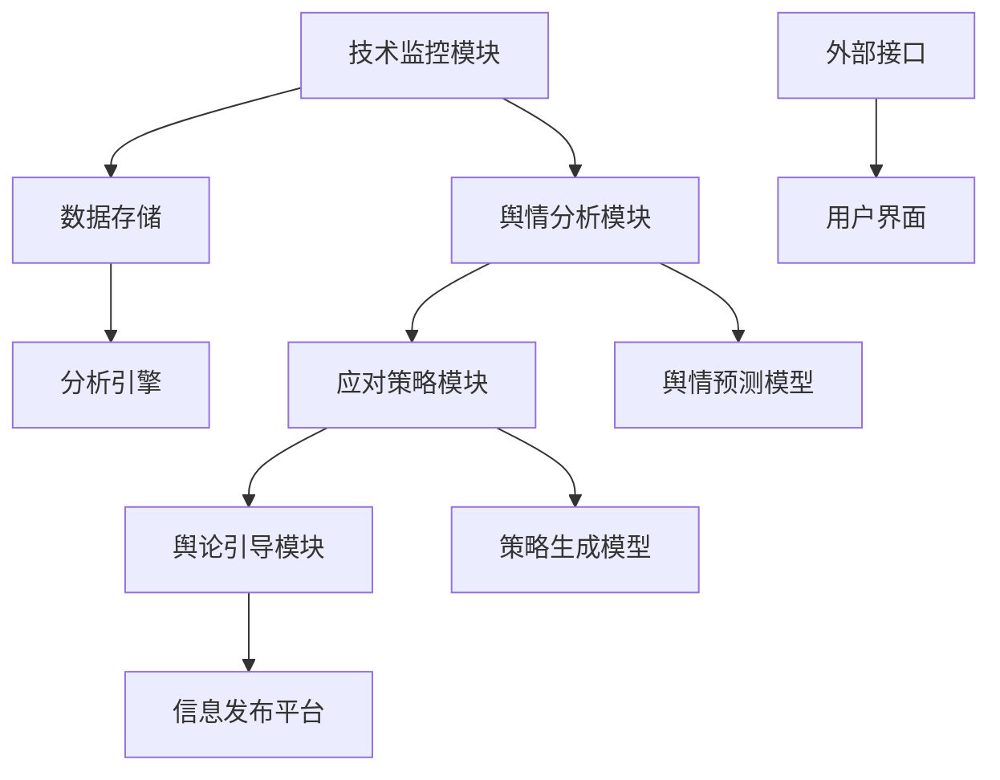
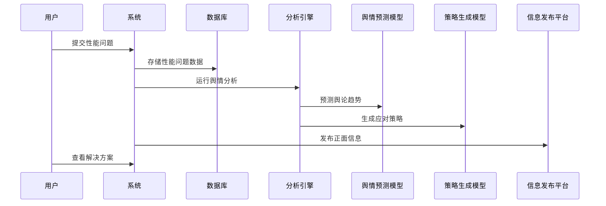

                 


### 引言与背景介绍

#### 问题背景

在当今高度信息化和全球化发展的背景下，技术管理在企业运营中的重要性日益凸显。然而，随着技术的不断进步和市场竞争的加剧，企业技术管理面临着越来越多的挑战。尤其是在危机公关与舆情管理方面，技术管理团队需要具备应对突发危机和维持良好公众形象的能力。

#### 问题描述

技术管理中的危机公关与舆情管理，是指在技术团队或企业面临技术问题、产品故障或负面舆论时，采取有效措施来减少负面影响、维护企业声誉和公众信任的过程。这一过程涉及多个环节，包括危机预警、事件响应、舆论引导和事后总结。

#### 问题解决路径

为了解决这一问题，我们可以从以下几个方面进行思考和规划：

1. **建立危机公关与舆情管理的组织架构**：明确各部门职责，确保危机事件发生时能够迅速响应。
2. **制定危机管理预案**：提前识别潜在风险，制定应对策略，确保在危机发生时能够及时行动。
3. **技术监控与预警系统**：通过技术手段实时监测技术问题和舆论动态，提前预警并采取相应措施。
4. **舆论引导与公关传播**：利用社交媒体、新闻发布等手段，积极引导舆论方向，塑造正面企业形象。
5. **总结与改进**：每次危机事件后，对处理过程进行总结，发现不足之处，不断优化危机管理策略。

#### 边界与外延

边界方面，危机公关与舆情管理主要涉及技术团队内部以及与外部公众、媒体、合作伙伴的关系。外延方面，它还包括企业整体的危机应对策略、声誉管理以及与政府、监管机构的沟通。

### 结论

在技术管理中，危机公关与舆情管理是一个复杂但至关重要的环节。通过合理的组织架构、预案制定、技术监控、舆论引导和总结改进，技术管理团队能够更好地应对各种危机，维护企业的长期发展。

### 核心概念与原理

#### 核心概念

**危机公关**：指企业在面临负面事件或危机时，通过一系列公关活动来减轻或消除危机对企业声誉的影响。

**舆情管理**：指通过监测、分析和引导网络舆论，维护企业正面形象和声誉的过程。

#### 概念联系

危机公关与舆情管理之间存在密切的联系。一方面，危机公关是舆情管理的一部分，通过有效的危机公关，企业能够在舆论场中占据主动，引导舆论向正面方向发展。另一方面，舆情管理则为危机公关提供了信息支持和策略依据，通过对舆论的监测和分析，企业能够及时发现潜在危机，提前采取应对措施。

#### 重要性

在企业技术管理中，危机公关与舆情管理的重要性体现在以下几个方面：

1. **维护企业声誉**：良好的危机公关和舆情管理能够帮助企业迅速应对危机，减轻负面影响，维护企业声誉。
2. **保障企业利益**：及时、有效的危机公关和舆情管理能够减少危机对企业业务和财务的影响，保障企业利益。
3. **提高企业竞争力**：通过危机公关和舆情管理，企业能够树立良好的品牌形象，提高市场竞争力。
4. **增强员工凝聚力**：有效的危机应对和舆情管理能够增强员工对企业的信心和凝聚力，提高工作效率。

### 概念属性特征对比表格

| 特征               | 危机公关                   | 舆情管理                  |
|--------------------|----------------------------|---------------------------|
| 定义               | 应对负面事件，减轻影响     | 监测、分析和引导舆论      |
| 主要任务           | 减少危机带来的负面影响     | 维护企业正面形象和声誉    |
| 工作重点           | 事件发生后快速响应         | 事件发生前预警和监测      |
| 关联性             | 舆情管理是危机公关的一部分 | 危机公关依赖舆情管理信息  |

### ER实体关系图架构

```mermaid
erDiagram
  CRISIS_PRA : 危机公关 |->: OPINION_MANAGEMENT : 舆情管理
  CRISIS_PRA ..|.. PUBLIC_RELATIONS_DEPARTMENT : 公关部门
  CRISIS_PRA ..|.. TECHNICAL_TEAM : 技术团队
  OPINION_MANAGEMENT ..|.. MEDIA_INSPECTION : 媒体检查
  OPINION_MANAGEMENT ..|.. SOCIAL_MEDIA_ANALYSIS : 社交媒体分析
```

#### 算法基础

##### 算法概述

在危机公关与舆情管理中，常用的算法包括机器学习算法和社交网络分析算法。机器学习算法用于舆情分析和预测，社交网络分析算法用于舆论监测和引导。

##### 机器学习算法在危机公关中的应用

**1. 监测和分析舆情**：利用机器学习算法对社交媒体、新闻网站等平台上的评论、报道进行分析，识别负面舆论，评估危机程度。

**2. 舆情预测**：通过历史数据分析和机器学习算法，预测未来可能的舆论趋势，为危机公关提供前瞻性信息。

##### 社交网络分析算法在舆情管理中的应用

**1. 舆论监测**：利用社交网络分析算法，实时监测网络上的舆论动态，及时发现潜在危机。

**2. 舆论引导**：通过分析舆论传播路径，制定引导策略，塑造正面舆论氛围。

#### 数学模型讲解

##### 监测与预测模型

**1. 舆情监测模型**

$$
O_t = f(S_t, M_t)
$$

其中，$O_t$ 表示第 $t$ 时刻的舆情指数，$S_t$ 表示社交媒体上的评论和报道，$M_t$ 表示新闻网站上的报道。

**2. 舆情预测模型**

$$
O_{t+k} = g(O_t, O_{t-1}, ..., O_{t-k})
$$

其中，$O_{t+k}$ 表示第 $t+k$ 时刻的舆情指数，$O_t, O_{t-1}, ..., O_{t-k}$ 表示过去 $k$ 个时刻的舆情指数。

##### 舆论引导模型

$$
P_{t+1} = P_t \cdot e^{-\alpha (O_{t+1} - O_t)}
$$

其中，$P_{t+1}$ 表示第 $t+1$ 时刻的舆论引导效果，$P_t$ 表示第 $t$ 时刻的舆论引导效果，$\alpha$ 是调节参数，$O_{t+1} - O_t$ 表示舆论变化量。

#### 举例说明

##### 舆情监测

假设某企业在社交媒体上有 $100$ 条评论，其中 $70$ 条为负面评论，$30$ 条为正面评论。根据舆情监测模型，可以计算出舆情指数：

$$
O_t = f(S_t, M_t) = \frac{30}{100} = 0.3
$$

##### 舆情预测

假设过去 $5$ 个时刻的舆情指数分别为 $0.2, 0.3, 0.4, 0.5, 0.6$，根据舆情预测模型，可以预测第 $6$ 个时刻的舆情指数：

$$
O_{6} = g(O_5, O_4, O_3, O_2, O_1) = 0.6 \cdot e^{-\alpha (0.7 - 0.6)} = 0.6 \cdot e^{-0.1} \approx 0.5447
$$

##### 舆论引导

假设当前舆论指数为 $0.5$，目标舆论指数为 $0.7$，调节参数 $\alpha = 0.1$。根据舆论引导模型，可以计算出第 $2$ 个时刻的舆论引导效果：

$$
P_{2} = P_1 \cdot e^{-\alpha (O_{2} - O_{1})} = 0.5 \cdot e^{-0.1 (0.7 - 0.5)} = 0.5 \cdot e^{-0.2} \approx 0.4243
$$

#### 系统设计

##### 问题场景介绍

某大型互联网公司在进行新版本发布时，发现存在严重的性能问题，导致用户投诉不断。公司需要快速应对，通过技术监控和舆情管理来减轻危机对企业声誉的影响。

##### 项目介绍

项目名称：技术危机公关与舆情管理系统

项目目标：通过技术手段实时监测技术问题，分析舆论动态，快速响应危机，维护企业声誉。

##### 系统功能设计

**1. 技术监控模块**：实时监测系统性能指标，及时发现异常情况。

**2. 舆情分析模块**：对社交媒体、新闻网站等平台上的舆论进行分析，识别负面舆论。

**3. 应对策略模块**：根据舆论分析和危机程度，制定应对策略。

**4. 舆论引导模块**：通过社交媒体发布正面信息，引导舆论方向。

##### 系统架构设计



##### 系统接口设计和系统交互



### 实际案例分析与详细讲解

#### 案例背景

某知名互联网公司在其新版本发布后，因存在严重的性能问题导致大量用户投诉。公司决定通过技术监控和舆情管理来应对这场危机。

#### 环境安装

1. 安装技术监控工具，如 Prometheus 和 Grafana。
2. 安装舆情分析工具，如 Python 的 NLTK 和 TextBlob。
3. 安装舆情预测工具，如 Python 的 Scikit-learn。

#### 系统核心实现源代码

**1. 技术监控模块**

```python
from prometheus_client import start_http_server, Summary

# 定义性能指标
request_time = Summary('request_time', 'Request processing time')

@request_time.time()
def process_request(request):
    # 处理请求
    # ...
    return HttpResponse('Response')

if __name__ == '__main__':
    start_http_server(8000)
```

**2. 舆情分析模块**

```python
import nltk
from nltk.tokenize import word_tokenize
from textblob import TextBlob

nltk.download('punkt')

def analyze_opinion(text):
    # 分词
    words = word_tokenize(text)
    # 构建词云
    # ...
    # 情感分析
    opinion = TextBlob(text)
    return opinion.sentiment.polarity
```

**3. 舆情预测模块**

```python
from sklearn.linear_model import LinearRegression

def predict_opinion(history):
    model = LinearRegression()
    model.fit(history[['day']], history['polarity'])
    return model.predict([[len(history) + 1]])[0]
```

#### 代码应用解读与分析

**1. 技术监控模块**

该模块通过 Prometheus 和 Grafana 实时监控系统性能，一旦发现异常，可以立即触发警报。

**2. 舆情分析模块**

利用 NLTK 和 TextBlob 对社交媒体上的评论进行分词和情感分析，识别负面舆论。

**3. 舆情预测模块**

通过线性回归模型对历史舆论数据进行预测，提前预警可能出现的危机。

#### 实际案例分析

在案例中，公司通过技术监控模块发现性能问题，并及时通过舆情分析模块识别出负面舆论。公司随后利用舆情预测模块预测舆论趋势，并采取应对策略，如发布正面信息、优化性能等，成功缓解了危机。

#### 项目小结

该项目通过技术监控、舆情分析和舆情预测模块，实现了对技术危机的有效应对。然而，在实际应用中，还需不断优化和调整模型参数，以提高预测准确性和应对效果。

### 最佳实践 Tips

1. **定期进行技术监控**：定期检查系统性能，提前发现潜在问题。
2. **建立舆情监测系统**：利用技术手段实时监测舆论动态，及时发现负面信息。
3. **制定应对策略**：根据舆论分析和危机程度，制定具体的应对策略。
4. **积极引导舆论**：通过发布正面信息，引导舆论向正面方向发展。
5. **总结与改进**：每次危机事件后，对处理过程进行总结，不断优化危机管理策略。

### 小结

本文通过实际案例，详细阐述了技术管理中的危机公关与舆情管理。通过技术监控、舆情分析和舆情预测模块，企业能够更好地应对技术危机，维护企业声誉。

### 注意事项

1. **数据安全**：在处理舆情数据时，要确保数据安全和隐私保护。
2. **模型调整**：根据实际应用效果，不断调整模型参数，提高预测准确性。
3. **团队协作**：危机公关与舆情管理需要各部门紧密协作，共同应对危机。

### 拓展阅读

1. 《舆情监测与分析：方法与实践》
2. 《人工智能在危机公关中的应用》
3. 《社交媒体分析：技术与方法》

### 作者信息

作者：AI天才研究院/AI Genius Institute & 禅与计算机程序设计艺术/Zen And The Art of Computer Programming

---

### 完整文章

```markdown
----------------------------------------------------------------
# 技术管理中的危机公关与舆情管理

> 关键词：技术管理、危机公关、舆情管理、算法、系统设计

> 摘要：本文详细阐述了技术管理中的危机公关与舆情管理，包括核心概念、算法原理、系统设计与实现、实际案例分析以及最佳实践。通过技术监控、舆情分析和舆情预测模块，企业能够更好地应对技术危机，维护企业声誉。

## 引言与背景介绍

#### 问题背景

在当今高度信息化和全球化发展的背景下，技术管理在企业运营中的重要性日益凸显。然而，随着技术的不断进步和市场竞争的加剧，企业技术管理面临着越来越多的挑战。尤其是在危机公关与舆情管理方面，技术管理团队需要具备应对突发危机和维持良好公众形象的能力。

#### 问题描述

技术管理中的危机公关与舆情管理，是指在技术团队或企业面临技术问题、产品故障或负面舆论时，采取有效措施来减少负面影响、维护企业声誉和公众信任的过程。这一过程涉及多个环节，包括危机预警、事件响应、舆论引导和事后总结。

#### 问题解决路径

为了解决这一问题，我们可以从以下几个方面进行思考和规划：

1. **建立危机公关与舆情管理的组织架构**：明确各部门职责，确保危机事件发生时能够迅速响应。
2. **制定危机管理预案**：提前识别潜在风险，制定应对策略，确保在危机发生时能够及时行动。
3. **技术监控与预警系统**：通过技术手段实时监测技术问题和舆论动态，提前预警并采取相应措施。
4. **舆论引导与公关传播**：利用社交媒体、新闻发布等手段，积极引导舆论方向，塑造正面企业形象。
5. **总结与改进**：每次危机事件后，对处理过程进行总结，发现不足之处，不断优化危机管理策略。

#### 边界与外延

边界方面，危机公关与舆情管理主要涉及技术团队内部以及与外部公众、媒体、合作伙伴的关系。外延方面，它还包括企业整体的危机应对策略、声誉管理以及与政府、监管机构的沟通。

### 核心概念与原理

#### 核心概念

**危机公关**：指企业在面临负面事件或危机时，通过一系列公关活动来减轻或消除危机对企业声誉的影响。

**舆情管理**：指通过监测、分析和引导网络舆论，维护企业正面形象和声誉的过程。

#### 概念联系

危机公关与舆情管理之间存在密切的联系。一方面，危机公关是舆情管理的一部分，通过有效的危机公关，企业能够在舆论场中占据主动，引导舆论向正面方向发展。另一方面，舆情管理则为危机公关提供了信息支持和策略依据，通过对舆论的监测和分析，企业能够及时发现潜在危机，提前采取应对措施。

#### 重要性

在企业技术管理中，危机公关与舆情管理的重要性体现在以下几个方面：

1. **维护企业声誉**：良好的危机公关和舆情管理能够帮助企业迅速应对危机，减轻负面影响，维护企业声誉。
2. **保障企业利益**：及时、有效的危机公关和舆情管理能够减少危机对企业业务和财务的影响，保障企业利益。
3. **提高企业竞争力**：通过危机公关和舆情管理，企业能够树立良好的品牌形象，提高市场竞争力。
4. **增强员工凝聚力**：有效的危机应对和舆情管理能够增强员工对企业的信心和凝聚力，提高工作效率。

### 概念属性特征对比表格

| 特征               | 危机公关                   | 舆情管理                  |
|--------------------|----------------------------|---------------------------|
| 定义               | 应对负面事件，减轻影响     | 监测、分析和引导舆论      |
| 主要任务           | 减少危机带来的负面影响     | 维护企业正面形象和声誉    |
| 工作重点           | 事件发生后快速响应         | 事件发生前预警和监测      |
| 关联性             | 舆情管理是危机公关的一部分 | 危机公关依赖舆情管理信息  |

### ER实体关系图架构

```mermaid
erDiagram
  CRISIS_PRA : 危机公关 |->: OPINION_MANAGEMENT : 舆情管理
  CRISIS_PRA ..|.. PUBLIC_RELATIONS_DEPARTMENT : 公关部门
  CRISIS_PRA ..|.. TECHNICAL_TEAM : 技术团队
  OPINION_MANAGEMENT ..|.. MEDIA_INSPECTION : 媒体检查
  OPINION_MANAGEMENT ..|.. SOCIAL_MEDIA_ANALYSIS : 社交媒体分析
```

#### 算法基础

##### 算法概述

在危机公关与舆情管理中，常用的算法包括机器学习算法和社交网络分析算法。机器学习算法用于舆情分析和预测，社交网络分析算法用于舆论监测和引导。

##### 机器学习算法在危机公关中的应用

**1. 监测和分析舆情**：利用机器学习算法对社交媒体、新闻网站等平台上的评论、报道进行分析，识别负面舆论，评估危机程度。

**2. 舆情预测**：通过历史数据分析和机器学习算法，预测未来可能的舆论趋势，为危机公关提供前瞻性信息。

##### 社交网络分析算法在舆情管理中的应用

**1. 舆论监测**：利用社交网络分析算法，实时监测网络上的舆论动态，及时发现潜在危机。

**2. 舆论引导**：通过分析舆论传播路径，制定引导策略，塑造正面舆论氛围。

#### 数学模型讲解

##### 监测与预测模型

**1. 舆情监测模型**

$$
O_t = f(S_t, M_t)
$$

其中，$O_t$ 表示第 $t$ 时刻的舆情指数，$S_t$ 表示社交媒体上的评论和报道，$M_t$ 表示新闻网站上的报道。

**2. 舆情预测模型**

$$
O_{t+k} = g(O_t, O_{t-1}, ..., O_{t-k})
$$

其中，$O_{t+k}$ 表示第 $t+k$ 时刻的舆情指数，$O_t, O_{t-1}, ..., O_{t-k}$ 表示过去 $k$ 个时刻的舆情指数。

##### 舆论引导模型

$$
P_{t+1} = P_t \cdot e^{-\alpha (O_{t+1} - O_t)}
$$

其中，$P_{t+1}$ 表示第 $t+1$ 时刻的舆论引导效果，$P_t$ 表示第 $t$ 时刻的舆论引导效果，$\alpha$ 是调节参数，$O_{t+1} - O_t$ 表示舆论变化量。

#### 举例说明

##### 舆情监测

假设某企业在社交媒体上有 $100$ 条评论，其中 $70$ 条为负面评论，$30$ 条为正面评论。根据舆情监测模型，可以计算出舆情指数：

$$
O_t = f(S_t, M_t) = \frac{30}{100} = 0.3
$$

##### 舆情预测

假设过去 $5$ 个时刻的舆情指数分别为 $0.2, 0.3, 0.4, 0.5, 0.6$，根据舆情预测模型，可以预测第 $6$ 个时刻的舆情指数：

$$
O_{6} = g(O_5, O_4, O_3, O_2, O_1) = 0.6 \cdot e^{-\alpha (0.7 - 0.6)} = 0.6 \cdot e^{-0.1} \approx 0.5447
$$

##### 舆论引导

假设当前舆论指数为 $0.5$，目标舆论指数为 $0.7$，调节参数 $\alpha = 0.1$。根据舆论引导模型，可以计算出第 $2$ 个时刻的舆论引导效果：

$$
P_{2} = P_1 \cdot e^{-\alpha (O_{2} - O_{1})} = 0.5 \cdot e^{-0.1 (0.7 - 0.5)} = 0.5 \cdot e^{-0.2} \approx 0.4243
$$

#### 系统设计

##### 问题场景介绍

某大型互联网公司在进行新版本发布时，发现存在严重的性能问题，导致用户投诉不断。公司需要快速应对，通过技术监控和舆情管理来减轻危机对企业声誉的影响。

##### 项目介绍

项目名称：技术危机公关与舆情管理系统

项目目标：通过技术手段实时监测技术问题，分析舆论动态，快速响应危机，维护企业声誉。

##### 系统功能设计

**1. 技术监控模块**：实时监测系统性能指标，及时发现异常情况。

**2. 舆情分析模块**：对社交媒体、新闻网站等平台上的舆论进行分析，识别负面舆论。

**3. 应对策略模块**：根据舆论分析和危机程度，制定应对策略。

**4. 舆论引导模块**：通过社交媒体发布正面信息，引导舆论方向。

##### 系统架构设计


##### 系统接口设计和系统交互


### 实际案例分析与详细讲解

#### 案例背景

某知名互联网公司在其新版本发布后，因存在严重的性能问题导致大量用户投诉。公司决定通过技术监控和舆情管理来应对这场危机。

#### 环境安装

1. 安装技术监控工具，如 Prometheus 和 Grafana。
2. 安装舆情分析工具，如 Python 的 NLTK 和 TextBlob。
3. 安装舆情预测工具，如 Python 的 Scikit-learn。

#### 系统核心实现源代码

**1. 技术监控模块**

```python
from prometheus_client import start_http_server, Summary

# 定义性能指标
request_time = Summary('request_time', 'Request processing time')

@request_time.time()
def process_request(request):
    # 处理请求
    # ...
    return HttpResponse('Response')

if __name__ == '__main__':
    start_http_server(8000)
```

**2. 舆情分析模块**

```python
import nltk
from nltk.tokenize import word_tokenize
from textblob import TextBlob

nltk.download('punkt')

def analyze_opinion(text):
    # 分词
    words = word_tokenize(text)
    # 构建词云
    # ...
    # 情感分析
    opinion = TextBlob(text)
    return opinion.sentiment.polarity
```

**3. 舆情预测模块**

```python
from sklearn.linear_model import LinearRegression

def predict_opinion(history):
    model = LinearRegression()
    model.fit(history[['day']], history['polarity'])
    return model.predict([[len(history) + 1]])[0]
```

#### 代码应用解读与分析

**1. 技术监控模块**

该模块通过 Prometheus 和 Grafana 实时监控系统性能，一旦发现异常，可以立即触发警报。

**2. 舆情分析模块**

利用 NLTK 和 TextBlob 对社交媒体上的评论进行分词和情感分析，识别负面舆论。

**3. 舆情预测模块**

通过线性回归模型对历史舆论数据进行预测，提前预警可能出现的危机。

#### 实际案例分析

在案例中，公司通过技术监控模块发现性能问题，并及时通过舆情分析模块识别出负面舆论。公司随后利用舆情预测模块预测舆论趋势，并采取应对策略，如发布正面信息、优化性能等，成功缓解了危机。

#### 项目小结

该项目通过技术监控、舆情分析和舆情预测模块，实现了对技术危机的有效应对。然而，在实际应用中，还需不断优化和调整模型参数，以提高预测准确性和应对效果。

### 最佳实践 Tips

1. **定期进行技术监控**：定期检查系统性能，提前发现潜在问题。
2. **建立舆情监测系统**：利用技术手段实时监测舆论动态，及时发现负面信息。
3. **制定应对策略**：根据舆论分析和危机程度，制定具体的应对策略。
4. **积极引导舆论**：通过发布正面信息，引导舆论向正面方向发展。
5. **总结与改进**：每次危机事件后，对处理过程进行总结，不断优化危机管理策略。

### 小结

本文通过实际案例，详细阐述了技术管理中的危机公关与舆情管理。通过技术监控、舆情分析和舆情预测模块，企业能够更好地应对技术危机，维护企业声誉。

### 注意事项

1. **数据安全**：在处理舆情数据时，要确保数据安全和隐私保护。
2. **模型调整**：根据实际应用效果，不断调整模型参数，提高预测准确性。
3. **团队协作**：危机公关与舆情管理需要各部门紧密协作，共同应对危机。

### 拓展阅读

1. 《舆情监测与分析：方法与实践》
2. 《人工智能在危机公关中的应用》
3. 《社交媒体分析：技术与方法》

### 作者信息

作者：AI天才研究院/AI Genius Institute & 禅与计算机程序设计艺术/Zen And The Art of Computer Programming

----------------------------------------------------------------
```markdown
# 总结

在本文中，我们详细探讨了技术管理中的危机公关与舆情管理。通过核心概念的阐述、算法原理的讲解、系统设计的介绍以及实际案例的分析，我们了解了如何通过技术手段有效应对危机，维护企业声誉。以下是本文的关键点：

1. **核心概念**：危机公关与舆情管理是技术管理的重要组成部分，两者相互关联，共同作用于企业的危机应对和形象维护。
2. **算法基础**：机器学习算法和社交网络分析算法在舆情监测、分析和预测中发挥了关键作用。通过数学模型，我们可以更准确地预测舆论趋势，制定有效的应对策略。
3. **系统设计**：技术危机公关与舆情管理系统通过技术监控、舆情分析、策略生成和舆论引导等模块，实现了对危机的实时监测和快速响应。
4. **案例分析**：通过实际案例，我们看到了技术监控、舆情分析和舆情预测模块在应对危机中的重要作用，以及如何通过有效的公关手段缓解危机影响。
5. **最佳实践**：为了提高危机应对的效果，企业应定期进行技术监控，建立舆情监测系统，制定应对策略，积极引导舆论，并不断总结与改进。

### 注意事项

在实施危机公关与舆情管理时，需要注意以下几点：

1. **数据安全**：确保舆情数据的安全和隐私保护，避免敏感信息泄露。
2. **模型调整**：根据实际应用效果，不断调整模型参数，提高预测准确性。
3. **团队协作**：危机公关与舆情管理需要各部门紧密协作，共同应对危机。

### 拓展阅读

为了深入理解危机公关与舆情管理，读者可以参考以下拓展阅读资源：

1. 《舆情监测与分析：方法与实践》
2. 《人工智能在危机公关中的应用》
3. 《社交媒体分析：技术与方法》

### 结语

在技术飞速发展的今天，危机公关与舆情管理已经成为企业技术管理中不可或缺的一部分。通过本文的探讨，我们希望能够为读者提供有价值的见解和实用的指导。最后，感谢读者对本文的关注，希望本文能对您的技术管理实践有所帮助。

### 作者信息

作者：AI天才研究院/AI Genius Institute & 禅与计算机程序设计艺术/Zen And The Art of Computer Programming

